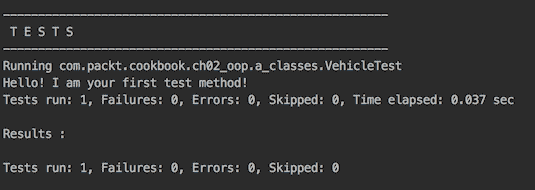
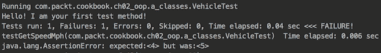
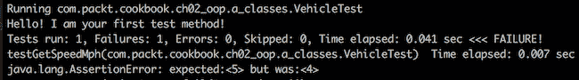
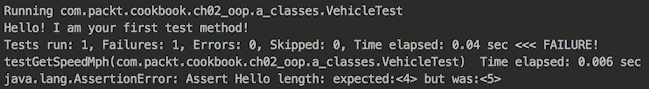
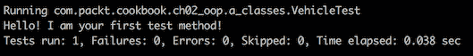
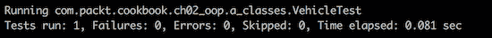
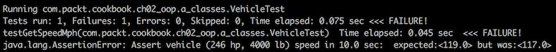
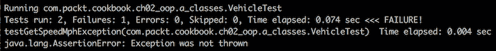
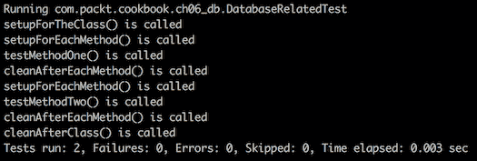
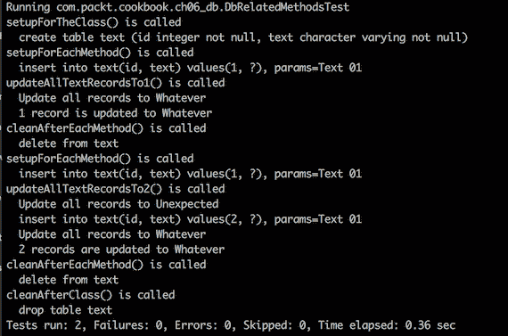

# 测试

本章展示了如何在 API 与其他组件集成之前对其进行单元测试。有时，我们需要用一些虚拟数据来模拟依赖，这可以通过模拟依赖来实现。我们将向您展示如何使用模拟库来完成这项工作。我们还将向您展示如何编写固定值来填充测试数据，然后如何通过集成不同的 API 并一起测试它们来测试应用程序的行为。我们将涵盖以下食谱：

+   使用 JUnit 进行 API 的单元测试

+   通过模拟依赖进行单元测试

+   使用固定值来填充测试数据

+   行为测试

# 简介

经过良好测试的代码能让开发者感到安心。如果你觉得为正在开发的新方法编写测试过于繁琐，那么你通常第一次就做不对。这是因为你无论如何都需要测试你的方法。在应用程序的上下文中进行测试只需要时间来设置（尤其是如果你试图测试所有可能的输入和条件）。然后，如果方法发生变化，你需要重新设置。而且你是手动做的。你可以在开发新方法的同时创建一个自动化的测试来避免这种情况（当然，我们假设代码不是太复杂；设置器和获取器不计入）。这将在长期内为你节省时间。

为什么有时我们会觉得有额外的负担？可能是因为我们在心理上没有做好准备。当我们思考添加新功能需要多长时间时，我们常常忘记包括编写测试所需的时间。当我们向经理提供估算时忘记这一点会更糟。我们常常回避给出更高的估算，因为我们不想显得不够知识渊博或技能不足。无论什么原因，这种情况都会发生。只有经过多年的经验，我们才学会在我们的估算中包含测试，并赢得足够的尊重和影响力，能够公开宣称正确做事需要前期投入更多时间，但长期来看可以节省更多时间。此外，正确做事可以带来更好的结果质量，压力更小，这意味着整体生活质量更高。

如果你仍然不确信，请记下你阅读这篇文档的日期，并每年检查一次，直到这些建议对你来说显而易见。然后，请与他人分享你的经验。这就是人类进步的方式，通过将知识从一代传到下一代。

然而，如果你想要学习如何编写有助于你生成高质量 Java 代码的测试，那么这一章就是为你准备的。从方法论上讲，这也适用于其他语言和职业。这一章主要面向 Java 开发者，并假设测试代码的作者。另一个假设是测试发生在代码编写的早期阶段，这样在测试过程中发现的代码弱点可以立即修复。尽早编写自动化测试是最佳时机，还有两个其他原因：

+   你可以轻松地重构你的代码，使其更容易进行测试

+   它通过消除猜测来节省你的时间，这反过来又使得你的开发过程更加高效

另一个编写测试（或增强现有测试）的好时机是在生产中发现缺陷时。如果你重新创建问题并在失败的测试中展示它，然后展示在新版本的代码中问题消失（并且测试不再失败），这将有助于你调查根本原因。

# 使用 JUnit 对 API 进行单元测试

根据维基百科，*2013 年在 GitHub 上托管在 GitHub 上的 10,000 个 Java 项目中进行的调查发现，JUnit（与 slf4j-api 并列），是最常包含的外部库。每个库都被 30.7%的项目使用。JUnit 是一个测试框架——xUnit 家族中单元测试框架之一，起源于 SUnit。它在编译时链接为一个 JAR 文件，并驻留在`org.junit`包中（自 JUnit 4 以来）。

这里是维基百科上另一篇文章的摘录，*在面向对象编程中，一个单元通常是一个完整的接口，如一个类，但也可以是一个单独的方法。*我们发现最后一部分——一个作为单独方法的单元——在实践中最有用。它将成为本章食谱示例的基础。

# 准备工作

在撰写本文时，JUnit 的最新稳定版本是 4.12，可以通过在`pom.xml`项目级别添加以下 Maven 依赖项来使用：

```java
<dependency>
  <groupId>junit</groupId>
  <artifactId>junit</artifactId>
  <version>4.12</version>
  <scope>test</scope>
</dependency>
```

在此之后，你可以编写你的第一个 JUnit 测试。假设你已经在`src/main/java/com/packt/cookbook.ch02_oop.a_classes`文件夹中创建了`Vehicle`类（这正是我们在本书第二章，*快速掌握面向对象编程 - 类和接口*中讨论的代码）：

```java
package com.packt.cookbook.ch02_oop.a_classes;
public class Vehicle {
  private int weightPounds;
  private Engine engine;
  public Vehicle(int weightPounds, Engine engine) {
    this.weightPounds = weightPounds;
    if(engine == null){
      throw new RuntimeException("Engine value is not set.");
    }
    this.engine = engine;
  }
  protected double getSpeedMph(double timeSec){
    double v = 2.0*this.engine.getHorsePower()*746;
    v = v*timeSec*32.174/this.weightPounds;
    return Math.round(Math.sqrt(v)*0.68);
  }
}
```

现在，你可以创建`src/test/java/com/packt/cookbook.ch02_oop.a_classes`文件夹（注意以`test`开头的新的文件夹结构，它与`main`文件夹结构并行创建）并在其中创建一个名为`VehicleTest.java`的新文件，该文件包含`VehicleTest`类：

```java
package com.packt.cookbook.ch02_oop.a_classes;
import org.junit.Test;
public class VehicleTest {
  @Test
  public void testGetSpeedMph(){
    System.out.println("Hello!" + " I am your first test method!");
  }
}
```

使用你喜欢的 IDE 或直接使用`mvn test`命令运行它。你将看到以下输出：



恭喜！你已经创建了你的第一个测试类。它目前还没有测试任何内容，但它是一个重要的设置——正确做事所必需的额外开销。在下一节中，我们将开始实际的测试。

# 如何做到这一点...

让我们更仔细地看看 `Vehicle` 类。测试获取器可能价值不大，但我们仍然可以这样做，确保传递给构造函数的值由相应的获取器返回。构造函数中的异常也属于必须测试的功能，以及 `getSpeedMph()` 方法。还有一个 `Engine` 类的实例，它有 `getHorsePower()` 方法。它能否返回 `null`？我们也应该在 `Engine` 类中查看：

```java
public class Engine {
  private int horsePower;
  public int getHorsePower() {
    return horsePower;
  }
  public void setHorsePower(int horsePower) {
    this.horsePower = horsePower;
  }
}
```

这个类中要测试的行为不多，它不能返回 `null`。但是返回一个负值是肯定的可能性，这反过来又可能对 `getSpeedMph()` 方法的 `Math.sqrt()` 函数造成问题。我们应该确保马力值永远不会是负数吗？这取决于该方法的使用限制和输入数据的来源。

类似的考虑也适用于 `Vehicle` 类的 `weightPounds` 属性的值。它可能会因为 `getSpeedMph()` 方法中的除零错误而引发 `ArithmeticException`，从而停止应用程序。

然而，在实践中，发动机马力值和车辆重量为负数或接近零的可能性很小，所以我们将假设这一点，并且不会将这些检查添加到代码中。

这样的分析是每个开发者的日常工作和背景思考，这是正确方向的第一步。第二步是将所有这些思考和疑问捕捉到单元测试中，并验证假设。

让我们回到我们创建的测试类，并对其进行增强。你可能已经注意到了，`@Test` 注解将某个方法标记为测试方法。这意味着每次你发出运行测试的命令时，IDE 或 Maven 都会运行它。你可以按任何你喜欢的名称命名该方法，但最佳实践建议表明你正在测试哪个方法（在这种情况下是 `Vehicle` 类的方法）。因此，格式通常看起来像 `test<methodname><scenario>`，其中 `scenario` 表示特定的测试用例：一条成功路径、一个失败，或者你想要测试的其他条件。在我们的例子中，我们没有使用后缀来表示我们将要测试的是运行成功的主要功能（没有任何错误或边缘情况）。稍后，我们将展示测试其他场景的方法示例。

在这样的测试方法中，你可以调用你正在测试的应用程序方法，提供数据，并断言结果。你可以创建自己的断言（比较实际结果与预期结果的方法），或者你可以使用 JUnit 提供的断言。要实现后者，只需添加 `static` 导入：

```java
import static org.junit.Assert.assertEquals;
```

如果你使用现代 IDE，你可以输入`import static org.junit.Assert`并查看有多少不同的断言可用（或者去 JUnit 的 API 文档中查看）。有十几个或更多的重载方法可用：`assertArrayEquals()`、`assertEquals()`、`assertNotEquals()`、`assertNull()`、`assertNotNull()`、`assertSame()`、`assertNotSame()`、`assertFalse()`、`assertTrue()`、`assertThat()`和`fail()`。如果你花几分钟阅读这些方法的作用会很有帮助。你也可以通过名称猜测它们的目的。以下是对`assertEquals()`方法使用的一个示例：

```java
import org.junit.Test;
import static org.junit.Assert.assertEquals;
public class VehicleTest {
  @Test
  public void testGetSpeedMph(){
    System.out.println("Hello!" + " I am your first test method!");
    assertEquals(4, "Hello".length());
  }
}
```

我们比较单词`Hello`的实际长度和期望长度，即`4`。我们知道正确的数字应该是`5`，但我们希望测试失败以展示失败行为，并指导如何阅读失败的测试结果（你不需要阅读成功的结果，对吧？）。如果你运行这个测试，你会得到以下结果：



你可以看到期望值是`4`，而实际值是`5`。比如说，你这样交换顺序：

```java
assertEquals("Assert Hello length:","Hello".length(), 4);
```

这个结果将是这样的：



这是不正确的，因为`5`是实际结果，而`4`是期望的（尽管是为了演示目的而错误的）。

重要的是要记住，在每种断言方法中，具有期望值的参数都位于（在断言的签名中）**之前**实际值的位置。

在编写测试之后，你将做其他事情，几个月后，你可能会忘记每个断言实际上评估了什么。但很可能有一天测试会失败（因为你或其他人会更改应用程序代码）。你会看到测试方法名、期望值和实际值，但你必须挖掘代码以确定哪个断言失败了（每个测试方法中通常有几个断言）。你可能被迫添加调试语句并多次运行测试以找出原因。为了帮助你避免这种额外的挖掘，JUnit 断言中的每一个都允许你添加一个描述特定断言的消息。例如，运行这个版本的测试：

```java
public class VehicleTest {
  @Test
  public void testGetSpeedMph(){
    System.out.println("Hello!" + " I am your first test method!");
    assertEquals("Assert Hello length:", 4, "Hello".length());
  }
}
```

如果你这样做，结果将更加易于阅读：



为了完成这个演示，我们将期望值更改为`5`：

```java
assertEquals("Assert Hello length:", 5, "Hello".length());
```

这将是你的测试输出：



# 它是如何工作的...

在具备一些 JUnit 框架知识的基础上，我们现在可以为主案例编写一个真正的测试方法：计算具有特定重量和特定马力的车辆的行驶速度，以确定它在一定时间内能到达哪里。我们使用编写代码时使用的公式（最初由领域专家提供）来计算预期值。例如，如果车辆有一个 246 马力的引擎和 4,000 磅的重量，那么在 10 秒内，其速度可以达到 117 英里/小时。由于速度是`double`类型，我们将使用以下断言：

```java
void assertEquals(String message, double expected, 
                       double actual, double delta)
```

在这里，`delta` 是允许的精度（我们决定 1%已经足够好）。`test` 方法的实现结果如下：

```java
@Test
public void testGetSpeedMph(){
  double timeSec = 10.0;
  int engineHorsePower = 246;
  int vehicleWeightPounds = 4000;

  Engine engine = new Engine();
  engine.setHorsePower(engineHorsePower);

  Vehicle vehicle = new Vehicle(vehicleWeightPounds, engine);
  double speed = vehicle.getSpeedMph(timeSec);
  assertEquals("Assert vehicle (" + engineHorsePower 
            + " hp, " + vehicleWeightPounds + " lb) speed in " 
            + timeSec + " sec: ", 117, speed, 0.001 * speed);
}
```

如果我们运行这个测试，输出结果如下：



为了确保测试正常工作，我们将预期值设置为 119 英里/小时（超过 1%的差异）并再次运行测试。结果如下：



我们将预期值改回 117，并继续编写我们在分析代码时讨论的其他测试用例。

让我们确保当预期时抛出异常。让我们添加另一个导入：

```java
import static org.junit.Assert.fail;

```

然后，编写以下测试：

```java
@Test
public void testGetSpeedMphException(){
  int vehicleWeightPounds = 4000;
  Engine engine = null;
  try {
    Vehicle vehicle = new Vehicle(vehicleWeightPounds, engine);
    fail("Exception was not thrown");
  } catch (RuntimeException ex) {}
}
```

这个测试也运行成功。为了确保测试正确工作，我们暂时将其分配以下内容：

```java
Engine engine = new Engine();
```

然后，我们观察输出：



这样，我们获得了一种信心，即我们没有编写出总是正确的代码，无论代码如何变化。

如您所见，编写这些测试的最佳方式是在编写应用程序代码的过程中，这样您可以在代码复杂性增长的同时测试代码。否则，特别是在更复杂的代码中，在所有代码编写完成后，您可能会在调试时遇到问题。

还有许多其他注释和 JUnit 特性可能对您有所帮助，因此请参阅 JUnit 文档以深入了解所有框架功能。

# 参见

参考本章中的以下食谱：

+   通过模拟依赖进行单元测试

+   使用固定值填充测试数据

+   行为测试

# 通过模拟依赖进行单元测试

编写单元测试需要单元隔离。如果一个方法使用了来自不同对象的几个其他方法，就需要限制测试的深度，以便每个层可以作为一个单元单独测试。这时，对低层进行模拟的需求就凸显出来了。

模拟不仅可以垂直进行，也可以水平进行：在同一级别，但已经与底层功能隔离。如果一个方法很长且复杂，您可能需要将其分解成几个更小的方法，这样您就可以在模拟其他方法的同时只测试其中一个。这是与代码开发一起进行单元测试的另一个优点；在代码变得固定之前，更容易重新设计代码以提高可测试性。

# 准备工作

模拟其他方法和类是直接的。按照第二章，*快速掌握面向对象 - 类和接口*中描述的方法进行编码，这会容易得多，尽管有一些模拟框架允许您模拟不实现任何接口的类（我们将在本食谱的下一节中看到此类框架使用的示例）。此外，使用对象和方法工厂可以帮助您创建特定于测试的工厂实现，这样它们就可以生成具有返回预期硬编码值的方法的对象。

例如，在第四章，*功能化编程*中，我们介绍了`FactoryTraffic`，它产生一个或多个`TrafficUnit`对象。在一个真实系统中，这个工厂会从某些外部系统中获取有关特定地理位置和一天中某个时间点的交通数据的系统中的数据。使用真实系统作为数据源会在您运行示例时使代码设置变得复杂。为了解决这个问题，我们通过生成与真实数据分布相似的数据来模拟数据：比卡车多一点的汽车，车辆的重量取决于汽车类型，乘客数量和货物的重量，等等。对于这样的模拟来说，重要的是值的范围（最小值和最大值）应该反映来自真实系统的值，这样应用程序就可以在所有可能的真实数据范围内进行测试。

模拟代码的重要约束是它不应该太复杂。否则，其维护将需要额外的开销，这可能会降低团队的生产力或减少（如果不是完全放弃）测试覆盖率。

# 如何做到这一点...

下面是`FactoryTraffic`的模拟示例：

```java
public class FactoryTraffic {
  public static List<TrafficUnit> generateTraffic(int 
    trafficUnitsNumber, Month month, DayOfWeek dayOfWeek, 
    int hour, String country, String city, String trafficLight){
    List<TrafficUnit> tms = new ArrayList();
    for (int i = 0; i < trafficUnitsNumber; i++) {
      TrafficUnit trafficUnit = 
        FactoryTraffic.getOneUnit(month, dayOfWeek,  hour, country, 
                                  city, trafficLight);
        tms.add(trafficUnit);
    }
    return tms;
  }
}
```

它组装了一系列的`TrafficUnit`对象。在一个真实系统中，这些对象会从某些数据库查询的结果行中创建，例如。但在我们的情况下，我们只是模拟结果：

```java
public static TrafficUnit getOneUnit(Month month, 
              DayOfWeek dayOfWeek, int hour, String country, 
              String city, String trafficLight) {
  double r0 = Math.random(); 
  VehicleType vehicleType = r0 < 0.4 ? VehicleType.CAR :
  (r0 > 0.6 ? VehicleType.TRUCK : VehicleType.CAB_CREW);
  double r1 = Math.random();
  double r2 = Math.random();
  double r3 = Math.random();
  return new TrafficModelImpl(vehicleType, gen(4,1),
             gen(3300,1000), gen(246,100), gen(4000,2000),
             (r1 > 0.5 ? RoadCondition.WET : RoadCondition.DRY),    
             (r2 > 0.5 ? TireCondition.WORN : TireCondition.NEW),
             r1 > 0.5 ? ( r3 > 0.5 ? 63 : 50 ) : 63 );
}
```

如您所见，我们使用随机数生成器为每个参数从一定范围内选取值。这个范围与真实数据的范围一致。这段代码非常简单，不需要太多的维护，但它为应用程序提供了类似于真实数据流的流程。

你可以使用另一种技术来测试具有一些依赖关系的方法，你希望将其隔离以获得可预测的结果。例如，让我们回顾一下`VechicleTest`类。我们不是创建一个真实的`Engine`对象，而是可以使用 mocking 框架之一来 mock 它。在这种情况下，我们使用 Mockito。以下是它的 Maven 依赖项：

```java
<dependency>
  <groupId>org.mockito</groupId>
  <artifactId>mockito-core</artifactId>
  <version>2.7.13</version>
  <scope>test</scope>
</dependency>

```

测试方法现在看起来是这样的（更改的两行被突出显示）：

```java
@Test
public void testGetSpeedMph(){
  double timeSec = 10.0;
  int engineHorsePower = 246;
  int vehicleWeightPounds = 4000;

 Engine engine = Mockito.mock(Engine.class);
  Mockito.when(engine.getHorsePower()).thenReturn(engineHorsePower);

  Vehicle vehicle =  new Vehicle(vehicleWeightPounds, engine);
  double speed = vehicle.getSpeedMph(timeSec);
  assertEquals("Assert vehicle (" + engineHorsePower 
               + " hp, " + vehicleWeightPounds + " lb) speed in " 
               + timeSec + " sec: ", 117, speed, 0.001 * speed);
}
```

如您所见，我们指示`mock`对象在调用`getHorsePower()`方法时返回一个固定值。我们甚至可以进一步创建一个用于我们想要测试的方法的 mock 对象：

```java
Vehicle vehicleMock = Mockito.mock(Vehicle.class);
Mockito.when(vehicleMock.getSpeedMph(10)).thenReturn(30d);

double speed = vehicleMock.getSpeedMph(10);
System.out.println(speed);

```

因此，它总是返回相同的值：


然而，这会违背测试的目的。

在测试流式处理的管道方法时，你可以使用另一种技术。假设我们需要测试`TrafficDensity1`类中的`trafficByLane()`方法（我们还将有`TrafficDensity2`和`TrafficDensity3`）：

```java
public class TrafficDensity1 {
  public Integer[] trafficByLane(Stream<TrafficUnit> stream, 
  int trafficUnitsNumber, double timeSec,
  SpeedModel speedModel, double[] speedLimitByLane) {

    int lanesCount = speedLimitByLane.length;

    Map<Integer, Integer> trafficByLane = stream
      .limit(trafficUnitsNumber)
      .map(TrafficUnitWrapper::new)
      .map(tuw -> tuw.setSpeedModel(speedModel))
      .map(tuw -> tuw.calcSpeed(timeSec))
      .map(speed ->  countByLane(lanesCount, speedLimitByLane, speed))
      .collect(Collectors.groupingBy(CountByLane::getLane, 
               Collectors.summingInt(CountByLane::getCount)));

    for(int i = 1; i <= lanesCount; i++){
      trafficByLane.putIfAbsent(i, 0);
    }
    return trafficByLane.values()
      .toArray(new Integer[lanesCount]);
  }

  private CountByLane countByLane(int lanesCount, 
                 double[] speedLimit, double speed) {
    for(int i = 1; i <= lanesCount; i++){
      if(speed <= speedLimit[i - 1]){
        return new CountByLane(1, i);
      }
    }
    return new CountByLane(1, lanesCount);
  }
}
```

它使用了两个支持类：

```java
private class CountByLane{
  int count, lane;
  private CountByLane(int count, int lane){
    this.count = count;
    this.lane = lane;
  }
  public int getLane() { return lane; }
  public int getCount() { return count; }
}
```

它还使用了以下内容：

```java
private static class TrafficUnitWrapper {
  private Vehicle vehicle;
  private TrafficUnit trafficUnit;
  public TrafficUnitWrapper(TrafficUnit trafficUnit){
    this.vehicle = FactoryVehicle.build(trafficUnit);
    this.trafficUnit = trafficUnit;
  }
  public TrafficUnitWrapper setSpeedModel(SpeedModel speedModel) {
    this.vehicle.setSpeedModel(speedModel);
    return this;
  }
  public double calcSpeed(double timeSec) {
    double speed = this.vehicle.getSpeedMph(timeSec);
    return Math.round(speed * this.trafficUnit.getTraction());
  }
}
```

我们在讨论流时，在第三章，*模块化* *编程*中展示了此类支持类的使用。现在我们意识到测试此类可能并不容易。

因为`SpeedModel`对象是`trafficByLane()`方法的输入参数，我们可以单独测试其`getSpeedMph()`方法：

```java
@Test
public void testSpeedModel(){
  double timeSec = 10.0;
  int engineHorsePower = 246;
  int vehicleWeightPounds = 4000;
  double speed = getSpeedModel().getSpeedMph(timeSec,
                 vehicleWeightPounds, engineHorsePower);
  assertEquals("Assert vehicle (" + engineHorsePower 
               + " hp, " + vehicleWeightPounds + " lb) speed in " 
               + timeSec + " sec: ", 117, speed, 0.001 * speed);
}

private SpeedModel getSpeedModel(){
  //FactorySpeedModel possibly
}
```

参考以下代码：

```java
public class FactorySpeedModel {
  public static SpeedModel generateSpeedModel(TrafficUnit trafficUnit){
    return new SpeedModelImpl(trafficUnit);
  }
  private static class SpeedModelImpl implements SpeedModel{
    private TrafficUnit trafficUnit;
    private SpeedModelImpl(TrafficUnit trafficUnit){
      this.trafficUnit = trafficUnit;
    }
    public double getSpeedMph(double timeSec, 
                              int weightPounds, int horsePower) {
      double traction = trafficUnit.getTraction();
      double v = 2.0 * horsePower * 746 
                 * timeSec * 32.174 / weightPounds;
      return Math.round(Math.sqrt(v) * 0.68 * traction);
    }
  }
```

如您所见，不幸的是，`FactorySpeedModel`的当前实现需要`TrafficUnit`对象（为了获取牵引力值）。我们需要修改它，以便在不依赖`TrafficUnit`的情况下提取`SpeedModel`，因为我们现在将在`calcSpeed()`方法中应用牵引力。`FactorySpeedModel`的新版本现在看起来是这样的：

```java
public class FactorySpeedModel {
  public static SpeedModel generateSpeedModel(TrafficUnit trafficUnit) {
    return new SpeedModelImpl(trafficUnit);
  }
 public static SpeedModel getSpeedModel(){
 return SpeedModelImpl.getSpeedModel();
 }
  private static class SpeedModelImpl implements SpeedModel{
    private TrafficUnit trafficUnit;
    private SpeedModelImpl(TrafficUnit trafficUnit){
      this.trafficUnit = trafficUnit;
    }
    public double getSpeedMph(double timeSec, 
                     int weightPounds, int horsePower) {
      double speed = getSpeedModel()
             .getSpeedMph(timeSec, weightPounds, horsePower);
      return Math.round(speed *trafficUnit.getTraction());
    }
    public static SpeedModel getSpeedModel(){
      return  (t, wp, hp) -> {
        double weightPower = 2.0 * hp * 746 * 32.174 / wp;
        return Math.round(Math.sqrt(t * weightPower) * 0.68);
      };
    }
  }
}
```

测试方法现在可以实施如下：

```java
@Test
public void testSpeedModel(){
  double timeSec = 10.0;
  int engineHorsePower = 246;
  int vehicleWeightPounds = 4000;
  double speed = FactorySpeedModel.generateSpeedModel()
                 .getSpeedMph(timeSec, vehicleWeightPounds, 
                              engineHorsePower);
  assertEquals("Assert vehicle (" + engineHorsePower 
               + " hp, " + vehicleWeightPounds + " lb) speed in " 
               + timeSec + " sec: ", 117, speed, 0.001 * speed);
}
```

然而，`TrafficUnitWrapper`中的`calcSpeed()`方法尚未经过测试。

我们可以将`trafficByLane()`方法作为一个整体进行测试：

```java
@Test
public void testTrafficByLane() {
  TrafficDensity1 trafficDensity = new TrafficDensity1();
  double timeSec = 10.0;
  int trafficUnitsNumber = 120;
  double[] speedLimitByLane = {30, 50, 65};
  Integer[] expectedCountByLane = {30, 30, 60};
  Integer[] trafficByLane = 
    trafficDensity.trafficByLane(getTrafficUnitStream2(
      trafficUnitsNumber), trafficUnitsNumber, timeSec, 
      FactorySpeedModel.getSpeedModel(),speedLimitByLane);
    assertArrayEquals("Assert count of " 
              + trafficUnitsNumber + " vehicles by " 
              + speedLimitByLane.length +" lanes with speed limit " 
              + Arrays.stream(speedLimitByLane)
                      .mapToObj(Double::toString)
                      .collect(Collectors.joining(", ")),
                      expectedCountByLane, trafficByLane);
}
```

然而，这需要你创建具有固定数据的`TrafficUnit`对象流：

```java
TrafficUnit getTrafficUnit(int engineHorsePower, 
                           int vehicleWeightPounds) {
  return new TrafficUnit() {
    @Override
    public Vehicle.VehicleType getVehicleType() {
      return Vehicle.VehicleType.TRUCK;
    }
    @Override
    public int getHorsePower() {return engineHorsePower;}
    @Override
    public int getWeightPounds() { return vehicleWeightPounds; }
    @Override
    public int getPayloadPounds() { return 0; }
    @Override
    public int getPassengersCount() { return 0; }
    @Override
    public double getSpeedLimitMph() { return 55; }
    @Override
    public double getTraction() { return 0.2; }
    @Override
    public SpeedModel.RoadCondition getRoadCondition() {return null; }
    @Override
    public SpeedModel.TireCondition getTireCondition() { return null; }
    @Override
    public int getTemperature() { return 0; }
  };
}
```

不清楚`TrafficUnit`对象中的数据是如何导致不同的速度值的。此外，我们还需要添加各种测试数据——针对不同车辆类型和其他参数——而这需要编写和维护大量的代码。

这意味着我们需要重新审视`trafficByLane()`方法的设计。为了对方法正确工作的信心，我们需要单独测试方法内部计算的每一步，这样每个测试都只需要少量输入数据，并允许你对预期的结果有清晰的理解。

# 它是如何工作的...

如果你仔细查看`trafficByLane()`方法，你会注意到问题是由计算的地点引起的——在私有类`TrafficUnitWrapper`内部。我们可以将其从那里移出，并为`TrafficDensity`类创建一个新的方法：

```java
double calcSpeed(double timeSec) {
  double speed = this.vehicle.getSpeedMph(timeSec);
  return Math.round(speed * this.trafficUnit.getTraction());
}
```

然后，我们可以将其签名更改为这样：

```java
double calcSpeed(Vehicle vehicle, double traction, double timeSec) {
  double speed = vehicle.getSpeedMph(timeSec);
  return Math.round(speed * traction);
}
```

将这两个方法添加到`TrafficUnitWrapper`类中：

```java
public Vehicle getVehicle() { return vehicle; }
public double getTraction() { return trafficUnit.getTraction(); }
```

我们现在可以像这样重写流管道（粗体字表示更改的行）：

```java
Map<Integer, Integer> trafficByLane = stream
  .limit(trafficUnitsNumber)
  .map(TrafficUnitWrapper::new)
  .map(tuw -> tuw.setSpeedModel(speedModel))
  .map(tuw -> calcSpeed(tuw.getVehicle(), tuw.getTraction(), timeSec))
  .map(speed -> countByLane(lanesCount, speedLimitByLane, speed))
      .collect(Collectors.groupingBy(CountByLane::getLane, 
            Collectors.summingInt(CountByLane::getCount)));

```

通过将`calcSpeed()`方法设置为受保护的，并假设`Vehicle`类在其自己的测试类`VehicleTest`中测试，我们现在可以编写`testCalcSpeed()`：

```java
@Test
public void testCalcSpeed(){
  double timeSec = 10.0;
  TrafficDensity2 trafficDensity = new TrafficDensity2();

  Vehicle vehicle = Mockito.mock(Vehicle.class);
  Mockito.when(vehicle.getSpeedMph(timeSec)).thenReturn(100d);
  double traction = 0.2;
  double speed = trafficDensity.calcSpeed(vehicle, traction, timeSec);
  assertEquals("Assert speed (traction=" + traction + ") in " 
               + timeSec + " sec: ",20,speed,0.001 *speed);
}
```

现在可以通过模拟`calcSpeed()`方法来测试剩余的功能：

```java
@Test
public void testCountByLane() {
  int[] count ={0};
  double[] speeds = 
                  {1, 2, 3, 4, 5, 6, 7, 8, 9, 10, 11, 12};
  TrafficDensity2 trafficDensity = new TrafficDensity2() {
    @Override
    protected double calcSpeed(Vehicle vehicle, 
                     double traction, double timeSec) {
      return speeds[count[0]++];
    }
  };
  double timeSec = 10.0;
  int trafficUnitsNumber = speeds.length;

  double[] speedLimitByLane = {4.5, 8.5, 12.5};
  Integer[] expectedCountByLane = {4, 4, 4};

  Integer[] trafficByLane = trafficDensity.trafficByLane( 
    getTrafficUnitStream(trafficUnitsNumber), 
    trafficUnitsNumber, timeSec, FactorySpeedModel.getSpeedModel(),
    speedLimitByLane );
  assertArrayEquals("Assert count of " + speeds.length 
          + " vehicles by " + speedLimitByLane.length 
          + " lanes with speed limit " 
          + Arrays.stream(speedLimitByLane)
                  .mapToObj(Double::toString).collect(Collectors
                  .joining(", ")), expectedCountByLane, trafficByLane);
}
```

# 还有更多...

这种经验让我们意识到，使用内部私有类可能会使功能在隔离状态下不可测试。让我们尝试去除`private`类`CountByLane`。这导致我们到达`TrafficDensity3`类的第三个版本（我们用粗体显示了已更改的代码）：

```java
Integer[] trafficByLane(Stream<TrafficUnit> stream, 
int trafficUnitsNumber, double timeSec,
SpeedModel speedModel, double[] speedLimitByLane) {
  int lanesCount = speedLimitByLane.length;
  Map<Integer, Integer> trafficByLane = new HashMap<>();
  for(int i = 1; i <= lanesCount; i++){
    trafficByLane.put(i, 0);
  }
  stream.limit(trafficUnitsNumber)
    .map(TrafficUnitWrapper::new)
    .map(tuw -> tuw.setSpeedModel(speedModel))
    .map(tuw -> calcSpeed(tuw.getVehicle(), 
                          tuw.getTraction(), timeSec))
 .forEach(speed -> trafficByLane.computeIfPresent(
 calcLaneNumber(lanesCount, 
                     speedLimitByLane, speed), (k, v) -> ++v));    return trafficByLane.values().toArray(new Integer[lanesCount]);}
protected int calcLaneNumber(int lanesCount, 
  double[] speedLimitByLane, double speed) {
 for(int i = 1; i <= lanesCount; i++){
 if(speed <= speedLimitByLane[i - 1]){
 return i;
      }
 }
 return lanesCount;
}
```

此更改使我们能够扩展测试中的类：

```java
private class TrafficDensityTestCalcLaneNumber 
extends TrafficDensity3 {
  protected int calcLaneNumber(int lanesCount, 
    double[] speedLimitByLane, double speed){
    return super.calcLaneNumber(lanesCount, 
    speedLimitByLane, speed);
  }
}
```

它还允许我们独立地更改测试方法`calcLaneNumber()`：

```java
@Test
public void testCalcLaneNumber() {
  double[] speeds = {1, 2, 3, 4, 5, 6, 7, 8, 9, 10, 11, 12};
  double[] speedLimitByLane = {4.5, 8.5, 12.5};
  int[] expectedLaneNumber = {1, 1, 1, 1, 2, 2, 2, 2, 3, 3, 3, 3};

  TrafficDensityTestCalcLaneNumber trafficDensity = 
               new TrafficDensityTestCalcLaneNumber();
  for(int i = 0; i < speeds.length; i++){
    int ln = trafficDensity.calcLaneNumber(
               speedLimitByLane.length, 
               speedLimitByLane, speeds[i]);
    assertEquals("Assert lane number of speed " 
                + speeds + " with speed limit " 
                + Arrays.stream(speedLimitByLane)
                        .mapToObj(Double::toString).collect(
                              Collectors.joining(", ")), 
                expectedLaneNumber[i], ln);
  }
}
```

# 参见

参考本章以下食谱：

+   使用固定值来填充测试数据

+   行为测试

# 使用固定值来填充测试数据

在更复杂的应用程序（例如使用数据库的应用程序）中，通常需要在每次测试之前设置相同的数据，并在每次测试运行后清理。某些数据部分需要在每次测试方法之前设置，并在之后清理。你还需要在运行测试类之前配置另一个设置，并在之后清理。

# 如何做到这一点...

为了实现这一点，你可以编写一个设置方法，并在其前面写一个`@Before`注解。相应的清理方法由`@After`注解标识。类似的类级别方法由`@BeforeClass`和`@AfterClass`注解。以下是一个快速演示。添加以下方法：

```java
public class DatabaseRelatedTest {
  @BeforeClass
  public static void setupForTheClass(){
    System.out.println("setupForTheClass() is called");
  }
  @AfterClass
  public static void cleanUpAfterTheClass(){
    System.out.println("cleanAfterClass() is called");
  }
  @Before
  public void setupForEachMethod(){
    System.out.println("setupForEachMethod() is called");
  }
  @After
  public void cleanUpAfterEachMethod(){
    System.out.println("cleanAfterEachMethod() is called");
  }
  @Test
  public void testMethodOne(){      
    System.out.println("testMethodOne() is called"); 
  }
  @Test
  public void testMethodTwo(){ 
    System.out.println("testMethodTwo() is called"); 
  }
}
```

如果你现在运行测试，你会得到以下结果：



这样的方法被称为**固定值**，它们必须是公开的，并且类级别的设置/清理固定值必须是静态的。尽管即将到来的 JUnit 5 计划取消这些限制。

# 它是如何工作的...

这种用法的典型例子是在第一个测试方法运行之前创建必要的表，并在测试类的最后一个方法完成后删除它们。设置/清理方法也可以用来创建/关闭数据库连接，除非你的代码在 try-with-resources 构造中这样做（请参阅第十二章，*内存管理和调试*）。

这里是固定值使用的一个示例（有关如何设置数据库以运行它的说明，请参阅第六章，*数据库编程*）。让我们假设我们需要测试`DbRelatedMethods`类：

```java
class DbRelatedMethods{
  public void updateAllTextRecordsTo(String text){
    executeUpdate("update text set text = ?", text);
  }
  private void executeUpdate(String sql, String text){
    try (Connection conn = getDbConnection();
      PreparedStatement st = conn.prepareStatement(sql)){
        st.setString(1, text);
        st.executeUpdate();
      } catch (Exception ex) {
        ex.printStackTrace();
      }
    }
    private Connection getDbConnection(){
       ...    
    }
}
```

我们想确保这个方法始终更新`text`表中的所有记录为提供的值。我们的第一个测试是更新所有现有记录：

```java
@Test
public void updateAllTextRecordsTo1(){
  System.out.println("updateAllTextRecordsTo1() is called");
  String testString = "Whatever";
  System.out.println("  Update all records to " + testString);
  dbRelatedMethods.updateAllTextRecordsTo(testString);
  int count = countRecordsWithText(testString);
  assertEquals("Assert number of records with " 
                + testString + ": ", 1, count);
  System.out.println("All records are updated to " + testString);
}
```

这意味着表格必须在测试数据库中存在，并且应该在其中有一个记录。

我们的第二次测试确保即使有多个记录，并且每个记录包含不同的值，所有记录都会被更新：

```java
@Test
public void updateAllTextRecordsTo2(){
  System.out.println("updateAllTextRecordsTo2() is called");
  String testString = "Whatever";
  System.out.println("  Update all records to Unexpected");
  dbRelatedMethods.updateAllTextRecordsTo("Unexpected");
  executeUpdate("insert into text(id, text) values(2, ?)",
                                                "Text 01");
  System.out.println("Update all records to "  + testString);
  dbRelatedMethods.updateAllTextRecordsTo(testString);
  int count = countRecordsWithText(testString);
  assertEquals("Assert number of records with " 
               + testString + ": ", 2, count);
  System.out.println("  " + count + " records are updated to " +
                     testString);
}
```

这两个测试都使用相同的表格，即`text`。因此，在每次测试后没有必要删除它。这就是为什么我们在类级别上创建和删除它的原因：

```java
@BeforeClass
public static void setupForTheClass(){
  System.out.println("setupForTheClass() is called");
  execute("create table text (id integer not null, 
          text character varying not null)");
}
@AfterClass
public static void cleanUpAfterTheClass(){
  System.out.println("cleanAfterClass() is called");
  execute("drop table text");
}
```

这意味着我们只需要在每个测试之前填充表格并在测试后清理它：

```java
@Before
public void setupForEachMethod(){
  System.out.println("setupForEachMethod() is called");
  executeUpdate("insert into text(id, text) values(1,?)", "Text 01");
}
@After
public void cleanUpAfterEachMethod(){
  System.out.println("cleanAfterEachMethod() is called");
  execute("delete from text");
}
```

此外，由于我们可以为所有测试使用相同的对象，让我们也在类级别上创建它（作为测试类的属性）：

```java
private DbRelatedMethods dbRelatedMethods = new DbRelatedMethods();

```

如果我们现在运行`test`类的所有测试，输出将如下所示：



打印的消息允许你追踪所有方法调用的顺序，并查看它们是否按预期执行。

# 参见

参考本章以下配方：

+   行为测试

# 行为测试

如果你已经阅读了所有章节并查看过代码示例，你可能已经注意到现在，我们已经讨论并构建了典型分布式应用所需的所有组件。现在是时候将所有组件组合起来，看看它们是否按预期协作。这个过程被称为集成。

在做这件事的时候，我们将仔细评估应用程序是否按照要求运行。在功能需求以可执行形式呈现的情况下（例如使用 Cucumber 框架），我们可以运行它们并检查是否所有检查都通过。许多软件公司遵循行为驱动开发过程，并在代码编写早期进行测试，有时甚至在大量代码编写之前（当然，这些测试会失败，但一旦预期的功能实现，它们就会成功）。如前所述，早期测试对于编写专注、清晰且易于测试的代码非常有帮助。

然而，即使没有严格遵循*测试驱动*过程，集成阶段自然也包括某种形式的行为测试。在这个配方中，我们将看到几个可能的途径和与这个相关的具体示例。

# 准备工作

你可能已经注意到，在这本书的过程中，我们构建了几个类，它们组成一个分析并模拟交通的应用程序。为了方便起见，我们将它们全部包含在`com.packt.cookbook.ch15_testing`包中。你已经熟悉（从第 2、4、5 和 7 章）`api`文件夹中的五个接口：`Car`、`SpeedModel`、`TrafficUnit`、`Truck`和`Vehicle`。它们的实现封装在具有相同名称的文件夹中称为*工厂*的类中（在第 2、4、5 和 7 章中使用）：`FactorySpeedModel`、`FactoryTraffic`和`FactoryVehicle`。这些工厂为`AverageSpeed`类的功能提供了输入（第七章，*并发和多线程编程*）和`TrafficDensity`（基于第五章，*流操作和管道*，但在本章中创建和讨论）——我们演示应用程序的核心类。它们产生最初推动这个特定应用程序发展的值。

应用程序的主要功能很简单。对于给定的车道数量和每条车道的速度限制，`AverageSpeed`计算（估计）每条车道的实际速度（假设所有驾驶员都表现理性，根据他们的速度选择车道），而`TrafficDensity`计算 10 秒后每条车道上的车辆数量（假设所有车辆在红灯后同时启动）。这些计算基于在特定位置和一年中的特定时间收集的`numberOfTrafficUnits`车辆的数据。这并不意味着所有一千辆车都在同一时间竞赛。这 1,000 个测量点在过去 50 年中收集了大约 20 辆车在指定小时（这意味着平均每三分钟一辆车）在指定交叉口行驶的数据。

应用程序的整体基础设施由`process`文件夹中的类支持：`Dispatcher`、`Processor`和`Subscription`（我们在第七章，*并发和多线程编程*）中讨论了它们的功能并进行了演示）。这些类允许分布式处理。`Dispatcher`类使用`Subscription`类将处理请求发送到池中的`Processors`群体。每个`Processor`类根据请求执行任务（使用`AverageSpeed`和`TrafficDensity`类）并将结果存储在数据库中（使用`utils`文件夹中的`DbUtil`类，基于第六章[41632f15-3abe-4f59-8ce9-009aacfbe1cf.xhtml]，*数据库编程*中讨论的功能）。

我们已经将这些类作为单元进行了测试。现在我们将它们集成在一起，以整体测试应用程序的正确行为。

这些要求只是为了演示目的。目标是有一个有良好动机（类似于真实数据）的东西，同时足够简单，无需特殊知识即可理解交通分析和建模。

# 如何操作...

有几个集成级别。我们需要集成应用程序的类和子系统，并将我们的应用程序与外部系统（由第三方开发和维护的交通数据源）集成。以下是一个类级别集成的示例（请参阅`Chapter15Testing`类中的`demo1_class_level_integration()`方法）：

```java
String result = IntStream.rangeClosed(1, 
  speedLimitByLane.length).mapToDouble(i -> {
    AverageSpeed averageSpeed = 
      new AverageSpeed(trafficUnitsNumber, timeSec, 
                       dateLocation, speedLimitByLane, i,100);
    ForkJoinPool commonPool = ForkJoinPool.commonPool();
    return commonPool.invoke(averageSpeed);
}).mapToObj(Double::toString).collect(Collectors.joining(", "));
System.out.println("Average speed = " + result);

TrafficDensity trafficDensity = new TrafficDensity();
Integer[] trafficByLane = 
     trafficDensity.trafficByLane(trafficUnitsNumber,
                    timeSec, dateLocation, speedLimitByLane );
System.out.println("Traffic density = " + Arrays.stream(trafficByLane)
                                  .map(Object::toString)
                                  .collect(Collectors.joining(", ")));

```

在这个例子中，我们将两个主要类，即`AverageSpeed`和`TrafficDensity`，与工厂和它们的 API 接口实现进行了集成。

结果如下：


注意，结果在不同的运行中略有不同。这是因为`FactoryTraffic`产生的数据从一次请求到另一次请求是变化的。但在这个阶段，我们只需确保一切都能协同工作，并产生一些或多或少看起来准确的结果。我们已经通过单元测试了代码，并对它正在执行预期操作有一定的信心。我们将在实际集成测试过程中，而不是在集成过程中验证结果。

在完成类级别的集成后，看看子系统是如何协同工作的（请参阅`Chapter15Testing`类中的`demo1_subsystem_level_integration()`方法）：

```java
DbUtil.createResultTable();
Dispatcher.dispatch(trafficUnitsNumber, timeSec, dateLocation, 
                    speedLimitByLane);
try { Thread.sleep(2000L); } 
catch (InterruptedException ex) {}
Arrays.stream(Process.values()).forEach(v -> {
  System.out.println("Result " + v.name() + ": " 
                     + DbUtil.selectResult(v.name()));
});

```

在此代码中，你可以看到我们使用了`DBUtil`来创建必要的表，该表持有输入数据和结果（由`Processor`产生并记录）。`Dispatcher`类发送请求并将数据输入到`Processor`类的对象中，如所示：

```java
void dispatch(int trafficUnitsNumber, double timeSec, 
         DateLocation dateLocation, double[] speedLimitByLane) {
  ExecutorService execService =  ForkJoinPool.commonPool();
  try (SubmissionPublisher<Integer> publisher = 
                              new SubmissionPublisher<>()){
    subscribe(publisher, execService,Process.AVERAGE_SPEED, 
              timeSec, dateLocation, speedLimitByLane);
   subscribe(publisher,execService,Process.TRAFFIC_DENSITY, 
             timeSec, dateLocation, speedLimitByLane);
    publisher.submit(trafficUnitsNumber);
  } finally {
    try {
      execService.shutdown();
      execService.awaitTermination(1, TimeUnit.SECONDS);
    } catch (Exception ex) {
      System.out.println(ex.getClass().getName());
    } finally {
      execService.shutdownNow();
    }
  }
}
```

`Subscription`类用于发送/获取消息（有关此功能的描述，请参阅第七章，*并发和多线程编程*）：

```java
void subscribe(SubmissionPublisher<Integer> publisher, 
              ExecutorService execService, Process process, 
              double timeSec, DateLocation dateLocation, 
              double[] speedLimitByLane) {
  Processor<Integer> subscriber =  new Processor<>(process, timeSec, 
                                 dateLocation, speedLimitByLane);
  Subscription subscription = new Subscription(subscriber, execService);
  subscriber.onSubscribe(subscription);
  publisher.subscribe(subscriber);
}
```

处理器正在执行其任务；在我们得到结果（使用 DBUtil 从数据库读取记录的结果）之前，我们只需等待几秒钟（如果你使用的计算机需要更多时间来完成这项工作，你可能需要调整这个时间）：


`Process`枚举类的名称指向数据库中`result`表中的对应记录。再次强调，在这个阶段，我们主要是在寻找得到任何结果，而不是结果的正确性。

在我们的应用程序的子系统（基于`FactoryTraffic`生成的数据）成功集成后，我们可以尝试连接到提供真实交通数据的第三方外部系统。在`FactoryTraffic`内部，我们现在将切换到从真实系统中获取数据以生成`TrafficUnit`对象：

```java
public class FactoryTraffic {
  private static boolean switchToRealData = true;
  public static Stream<TrafficUnit> 
  getTrafficUnitStream(DateLocation dl, int trafficUnitsNumber){
    if(switchToRealData){
      return getRealData(dL,  trafficUnitsNumber);
    } else {
      return IntStream.range(0, trafficUnitsNumber)
      .mapToObj(i -> generateOneUnit());
    }
  }

  private static Stream<TrafficUnit> 
  getRealData(DateLocation dl, int trafficUnitsNumber) {
    //connect to the source of the real data 
    // and request the flow or collection of data
    return new ArrayList<TrafficUnit>().stream();
  }
}
```

该开关可以作为类中的一个布尔属性（如前述代码所示）或项目配置属性来实现。我们省略了连接到特定真实交通数据源的细节，因为这与本书的目的无关。

在这个阶段，主要关注点必须是性能，以及在外部真实数据源和我们的应用程序之间保持流畅的数据流。在确保一切正常工作并产生满意性能的结果（看起来很真实）之后，我们才能转向集成*测试*（对实际结果的断言）。

# 它是如何工作的...

对于测试，我们需要设置预期的值，然后我们可以将它们与由处理真实数据的应用程序产生的（实际）值进行比较。但是，真实数据在每次运行中都会略有变化，尝试预测结果值要么使测试变得脆弱，要么迫使引入巨大的误差范围，这可能会有效地抵消测试的目的。

我们甚至无法模拟生成数据（如我们在单元测试中所做的那样），因为我们处于集成阶段，必须使用真实数据。

一种可能的解决方案是将传入的真实数据和我们的应用程序产生的结果存储在数据库中。然后，领域专家可以遍历每条记录并断言结果是否符合预期。

为了实现这一点，我们在`TrafficDensity`类中引入了一个布尔开关，因此它记录了每个计算单元的输入：

```java
public class TrafficDensity {
 public static Connection conn;
 public static boolean recordData = false;
  //... 
  private double calcSpeed(TrafficUnitWrapper tuw, double timeSec){
    double speed = calcSpeed(tuw.getVehicle(),       
    tuw.getTrafficUnit().getTraction(), timeSec);
 if(recordData) {
 DbUtil.recordData(conn, tuw.getTrafficUnit(), speed);
 }
    return speed;
  }
  //...
} 
```

我们还引入了一个静态属性，以在所有类实例之间保持相同的数据库连接。否则，连接池应该非常大，因为，如你从第七章，“并发和多线程编程”中可能记得的，执行并行任务的工人数会随着要完成的工作量的增长而增长。

如果你查看`DbUtils`，你会看到一个创建`data`表的新方法（设计用于存储来自`FactoryTraffic`的`TrafficUnits`）和`data_common`表，该表保存用于数据请求和计算的主要参数：请求的交通单元数量、交通数据的日期和地理位置、以秒为单位的时间（计算速度的点）以及每条车道的速度限制（其大小定义了我们计划在建模交通时使用的车道数量）。以下是配置用于记录的代码：

```java
private static void demo3_prepare_for_integration_testing(){
  DbUtil.createResultTable();
  DbUtil.createDataTables();
  TrafficDensity.recordData = true;
  try(Connection conn = DbUtil.getDbConnection()){
    TrafficDensity.conn = conn;
    Dispatcher.dispatch(trafficUnitsNumber, timeSec, 
                        dateLocation, speedLimitByLane);
  } catch (SQLException ex){
    ex.printStackTrace();
  }
}
```

记录完成后，我们可以将数据转交给领域专家，他们可以断言应用程序行为的正确性。

经验证的数据现在可用于集成测试。我们可以在`FactoryTrafficUnit`中添加另一个开关，并强制它读取记录的数据而不是不可预测的真实或生成数据：

```java
public class FactoryTraffic {
  public static boolean readDataFromDb = false;
  private static boolean switchToRealData = false;
  public static Stream<TrafficUnit> 
                 getTrafficUnitStream(DateLocation dl,
                                     int trafficUnitsNumber){
 if(readDataFromDb){
 if(!DbUtil.isEnoughData(trafficUnitsNumber)){
 System.out.println("Not enough data");
        return new ArrayList<TrafficUnit>().stream();
      }
 return readDataFromDb(trafficUnitsNumber);
    }
    //....
}
```

如你所注意到的，我们还添加了`isEnoughData()`方法，该方法检查是否有足够记录的数据：

```java
public static boolean isEnoughData(int trafficUnitsNumber){
  try (Connection conn = getDbConnection();
  PreparedStatement st = 
      conn.prepareStatement("select count(*) from data")){
    ResultSet rs = st.executeQuery();
    if(rs.next()){
      int count = rs.getInt(1);
      return count >= trafficUnitsNumber;
    }
  } catch (Exception ex) {
    ex.printStackTrace();
  }
  return false;
}
```

这将有助于避免调试测试问题的不必要挫折，尤其是在测试更复杂的系统时。

现在，我们不仅可以预测输入数据，还可以预测我们可以用来断言应用程序行为的预期结果。这两者现在都包含在`TrafficUnit`对象中。为了能够做到这一点，我们利用了在第二章中讨论的新 Java 接口功能，即《快速掌握面向对象 - 类和接口》，这是默认方法：

```java
public interface TrafficUnit {
  VehicleType getVehicleType();
  int getHorsePower();
  int getWeightPounds();
  int getPayloadPounds();
  int getPassengersCount();
  double getSpeedLimitMph();
  double getTraction();
  RoadCondition getRoadCondition();
  TireCondition getTireCondition();
  int getTemperature();
 default double getSpeed(){ return 0.0; }
}
```

因此，我们可以将结果附加到输入数据上。请参见以下方法：

```java
List<TrafficUnit> selectData(int trafficUnitsNumber){...}
```

我们可以将结果附加到`DbUtil`类以及`DbUtil`内部的`TrafficUnitImpl`类：

```java
class TrafficUnitImpl implements TrafficUnit{
  private int horsePower, weightPounds, payloadPounds, 
              passengersCount, temperature;
  private Vehicle.VehicleType vehicleType;
  private double speedLimitMph, traction, speed;
  private RoadCondition roadCondition;
  private TireCondition tireCondition;
  ...
  public double getSpeed() { return speed; }
}
```

我们也可以将它附加到`DbUtil`类内部。

现在，我们可以编写一个集成测试。首先，我们将使用记录的数据来测试速度模型：

```java
void demo1_test_speed_model_with_real_data(){
  double timeSec = DbUtil.getTimeSecFromDataCommon();
  FactoryTraffic.readDataFromDb = true;
  TrafficDensity trafficDensity = new TrafficDensity();
  FactoryTraffic.getTrafficUnitStream(dateLocation, 1000).forEach(tu -> {
    Vehicle vehicle = FactoryVehicle.build(tu);
    vehicle.setSpeedModel(FactorySpeedModel.getSpeedModel());
    double speed = trafficDensity.calcSpeed(vehicle, 
                               tu.getTraction(), timeSec);
    assertEquals("Assert vehicle (" + tu.getHorsePower() 
                 + " hp, " + tu.getWeightPounds() + " lb) speed in " 
                 + timeSec + " sec: ", tu.getSpeed(), speed, 
                 speed * 0.001);
  });
}
```

可以为测试`AverageSpeed`类的速度计算编写类似的测试，使用真实数据。

然后，我们可以为类级别编写集成测试：

```java
private static void demo2_class_level_integration_test() {
  FactoryTraffic.readDataFromDb = true;
  String result = IntStream.rangeClosed(1, 
              speedLimitByLane.length).mapToDouble(i -> {
    AverageSpeed averageSpeed = new AverageSpeed(trafficUnitsNumber, 
               timeSec, dateLocation, speedLimitByLane, i,100);
    ForkJoinPool commonPool = ForkJoinPool.commonPool();
    return commonPool.invoke(averageSpeed);
  }).mapToObj(Double::toString).collect(Collectors.joining(", "));
  String expectedResult = "7.0, 23.0, 41.0";
  String limits = Arrays.stream(speedLimitByLane)
                        .mapToObj(Double::toString)
                        .collect(Collectors.joining(", "));
  assertEquals("Assert average speeds by " 
                + speedLimitByLane.length 
                + " lanes with speed limit " 
                + limits, expectedResult, result);

```

类似地，也可以为`TrafficDensity`类的类级别测试编写代码：

```java
TrafficDensity trafficDensity = new TrafficDensity();
String result = Arrays.stream(trafficDensity.
       trafficByLane(trafficUnitsNumber, timeSec, 
                     dateLocation, speedLimitByLane))
       .map(Object::toString)
       .collect(Collectors.joining(", "));
expectedResult = "354, 335, 311";
assertEquals("Assert vehicle count by " + speedLimitByLane.length + 
         " lanes with speed limit " + limits, expectedResult, result);
```

最后，我们还可以为子系统级别编写集成测试：

```java
void demo3_subsystem_level_integration_test() {
  FactoryTraffic.readDataFromDb = true;
  DbUtil.createResultTable();
  Dispatcher.dispatch(trafficUnitsNumber, 10, dateLocation, 
                      speedLimitByLane);
  try { Thread.sleep(3000l); } 
  catch (InterruptedException ex) {}
  String result = DbUtil.selectResult(Process.AVERAGE_SPEED.name());
  String expectedResult = "7.0, 23.0, 41.0";
  String limits = Arrays.stream(speedLimitByLane)
                        .mapToObj(Double::toString)
                        .collect(Collectors.joining(", "));
  assertEquals("Assert average speeds by " + speedLimitByLane.length 
        + " lanes with speed limit " + limits, expectedResult, result);
  result = DbUtil.selectResult(Process.TRAFFIC_DENSITY.name());
  expectedResult = "354, 335, 311";
  assertEquals("Assert vehicle count by " + speedLimitByLane.length 
        + " lanes with speed limit " + limits, expectedResult, result);
}
```

所有这些现在都可以成功运行，并且可以在以后任何时候用于应用程序回归测试。

只有当真实交通数据的来源有一个测试模式，可以从那里发送相同的数据流到我们这里，以便我们可以像使用记录的数据那样使用它们（这本质上是一回事），才能创建我们应用程序和真实交通数据源之间的自动化集成测试。

一个额外的想法。所有这些集成测试只有在处理数据的数量具有统计学意义时才可行。这是因为我们没有完全控制工作者的数量以及 JVM 如何决定分配负载。在特定情况下，提供的代码可能不会工作。在这种情况下，尝试增加请求的交通单元数量。这将确保有更多的空间用于负载分配逻辑。
