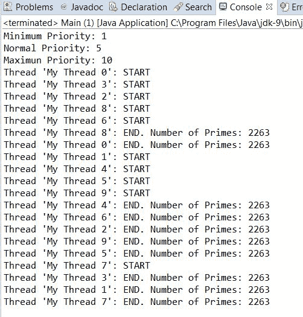
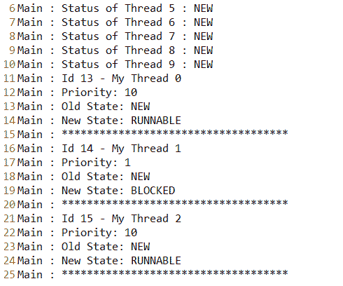
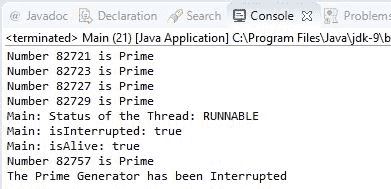
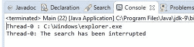
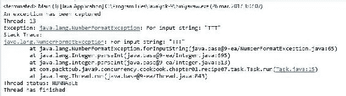
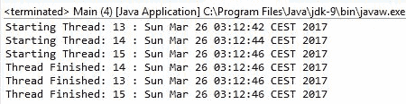
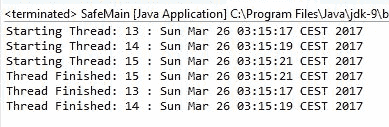
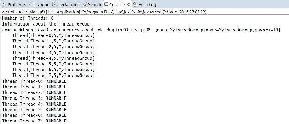
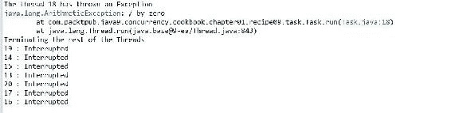

# 线程管理

在本章中，我们将涵盖以下主题：

+   创建、运行和设置线程的特性

+   中断一个线程

+   控制线程的中断

+   睡眠和恢复线程

+   等待线程的最终化

+   创建和运行守护线程

+   在线程中处理未受控的异常

+   使用线程局部变量

+   分组线程和处理线程组中的未受控异常

+   通过工厂创建线程

# 简介

在计算机世界中，当我们谈论并发时，我们指的是一系列在计算机上同时独立且无关的任务。这种同时性可以是真实的，如果计算机有多个处理器或多核处理器，或者如果计算机只有一个核心处理器，它也可以是明显的。

所有现代操作系统都允许执行并发任务。您可以在听音乐或阅读网页上的新闻时阅读电子邮件。我们可以称这为进程级别的并发。但在一个进程内部，我们也可以有各种同时进行的任务。在进程内部运行的并发任务被称为**线程**。与并发相关的另一个概念是并行性。关于并发概念有不同的定义和关系。一些作者在您在单核处理器上使用多个线程执行应用程序时谈论并发。有了这个，您可以看到程序执行何时明显。他们谈论并行性，当您在多核处理器或具有多个处理器的计算机上使用多个线程执行应用程序时，这种情况也是真实的。其他作者在应用程序的线程没有预定义的顺序执行时谈论并发，他们在所有这些线程有顺序执行时讨论并行性。

本章介绍了一系列的食谱，展示了如何使用 Java 9 API 对线程执行基本操作。您将了解如何在 Java 程序中创建和运行线程，如何控制它们的执行，处理它们抛出的异常，以及如何将一些线程分组以作为一个单元来操作。

# 创建、运行和设置线程的特性

在这个食谱中，我们将学习如何使用 Java API 对线程执行基本操作。与 Java 语言中的每个元素一样，线程是对象。在 Java 中创建线程有两种方式：

+   扩展`Thread`类并重写`run()`方法。

+   创建一个实现`Runnable`接口和`run()`方法的类，然后通过传递`Runnable`对象作为参数来创建`Thread`类的对象--这是首选的方法，并且给您更多的灵活性。

在这个菜谱中，我们将使用第二种方法来创建线程。然后，我们将学习如何更改线程的一些属性。`Thread` 类保存一些信息属性，可以帮助我们识别线程，了解其状态或控制其优先级。这些属性包括：

+   **ID**：此属性存储每个线程的唯一标识符。

+   **名称**：此属性存储线程的名称。

+   **优先级**：此属性存储 `Thread` 对象的优先级。在 Java 9 中，线程的优先级介于 1 和 10 之间，其中 1 是最低优先级，10 是最高优先级。不建议更改线程的优先级。它只是对底层操作系统的提示，并不保证任何事情，但它是一个你可以使用的可能性。

+   **状态**：此属性存储线程的状态。在 Java 中，线程可以存在于 `Thread.State` 枚举中定义的六个状态之一：`NEW`、`RUNNABLE`、`BLOCKED`、`WAITING`、`TIMED_WAITING` 或 `TERMINATED`。以下是一个列表，说明了这些状态的含义：

    +   `NEW`：线程已被创建，但尚未启动

    +   `RUNNABLE`：线程正在 JVM 中执行

    +   `BLOCKED`：线程被阻塞，正在等待监视器

    +   `WAITING`：线程正在等待另一个线程

    +   `TIMED_WAITING`：线程正在等待另一个具有指定等待时间的线程

    +   `TERMINATED`：线程已完成其执行

在这个菜谱中，我们将实现一个示例，该示例将创建并运行 10 个线程，这些线程将计算前 20,000 个数字内的素数。

# 准备工作

此菜谱的示例已使用 Eclipse IDE 实现。如果你使用 Eclipse 或其他 IDE，例如 NetBeans，请打开它并创建一个新的 Java 项目。

# 如何做到这一点...

按照以下步骤实现示例：

1.  创建一个名为 `Calculator` 的类，该类实现了 `Runnable` 接口：

```java
        public class Calculator implements Runnable {

```

1.  实现 `run()` 方法。此方法将执行我们创建的线程的指令，因此此方法将在前 `20000` 个数字内计算素数：

```java
        @Override 
        public void run() { 
          long current = 1L; 
          long max = 20000L; 
          long numPrimes = 0L; 

          System.out.printf("Thread '%s': START\n",
                            Thread.currentThread().getName()); 
          while (current <= max) { 
            if (isPrime(current)) { 
              numPrimes++; 
            } 
            current++; 
          } 
          System.out.printf("Thread '%s': END. Number of Primes: %d\n",
                          Thread.currentThread().getName(), numPrimes); 
        }

```

1.  然后，实现 *辅助* 的 `isPrime()` 方法。此方法确定一个数是否为素数：

```java
        private boolean isPrime(long number) { 
          if (number <= 2) { 
            return true; 
          } 
          for (long i = 2; i < number; i++) { 
            if ((number % i) == 0) { 
              return false; 
            } 
          } 
          return true; 
        }

```

1.  现在实现应用程序的主类。创建一个名为 `Main` 的类，其中包含 `main()` 方法：

```java
        public class Main { 
                public static void main(String[] args) {

```

1.  首先，编写一些关于线程的最大、最小和默认优先级值的信息：

```java
        System.out.printf("Minimum Priority: %s\n",
                          Thread.MIN_PRIORITY); 
        System.out.printf("Normal Priority: %s\n",
                          Thread.NORM_PRIORITY); 
        System.out.printf("Maximun Priority: %s\n",
                          Thread.MAX_PRIORITY);

```

1.  然后，创建 10 个 `Thread` 对象来执行 10 个 `Calculator` 任务。同时，创建两个数组来存储 `Thread` 对象及其状态。我们将在以后使用这些信息来检查线程的最终化。执行五个线程（偶数个）以最大优先级，其他五个以最小优先级：

```java
        Thread threads[]; 
        Thread.State status[]; 
        threads = new Thread[10]; 
        status = new Thread.State[10]; 
        for (int i = 0; i < 10; i++) { 
        threads[i] = new Thread(new Calculator()); 
          if ((i % 2) == 0) { 
            threads[i].setPriority(Thread.MAX_PRIORITY); 
          } else { 
            threads[i].setPriority(Thread.MIN_PRIORITY); 
          } 
            threads[i].setName("My Thread " + i); 
        }

```

1.  我们将要在一个文本文件中写入信息，因此创建一个 try-with-resources 语句来管理文件。在这个代码块内部，在启动线程之前，将线程的状态写入文件。然后，启动线程：

```java
        try (FileWriter file = new FileWriter(".\\data\\log.txt");
        PrintWriter pw = new PrintWriter(file);) { 

          for (int i = 0; i < 10; i++) { 
            pw.println("Main : Status of Thread " + i + " : " + 
                        threads[i].getState()); 
            status[i] = threads[i].getState(); 
          } 
          for (int i = 0; i < 10; i++) { 
            threads[i].start(); 
          }

```

1.  然后，等待线程的最终化。正如我们将在本章的*等待线程最终化*食谱中学习的那样，我们可以使用`join()`方法等待这一事件发生。在这种情况下，我们想在线程状态改变时写入有关线程的信息，因此不能使用此方法。我们使用以下代码块：

```java
            boolean finish = false; 
            while (!finish) { 
              for (int i = 0; i < 10; i++) { 
                if (threads[i].getState() != status[i]) { 
                  writeThreadInfo(pw, threads[i], status[i]); 
                  status[i] = threads[i].getState(); 
                } 
              } 

              finish = true; 
              for (int i = 0; i < 10; i++) { 
                finish = finish && (threads[i].getState() ==
                                  State.TERMINATED); 
              } 
            } 

          } catch (IOException e) {
            e.printStackTrace(); 
          } 
        }

```

1.  在前面的代码块中，我们调用了`writeThreadInfo()`方法来将有关线程状态的信息写入文件。这是此方法的代码：

```java
        private static void writeThreadInfo(PrintWriter pw,
                                            Thread thread,
                                            State state) { 
          pw.printf("Main : Id %d - %s\n", thread.getId(),
                     thread.getName()); 
          pw.printf("Main : Priority: %d\n", thread.getPriority()); 
          pw.printf("Main : Old State: %s\n", state); 
          pw.printf("Main : New State: %s\n", thread.getState()); 
          pw.printf("Main : ************************************\n"); 
        }

```

1.  运行程序并查看不同的线程是如何并行工作的。

# 它是如何工作的...

以下截图显示了程序的输出控制台部分。我们可以看到，我们创建的所有线程都在并行运行，以完成它们各自的工作：



在这个截图中，你可以看到线程是如何创建的，以及具有偶数编号的线程由于具有最高优先级，因此首先执行，而其他线程由于具有最低优先级，因此稍后执行。以下截图显示了`log.txt`文件的部分输出，我们在其中记录了线程的状态信息：



每个 Java 程序至少有一个执行线程。当你运行程序时，JVM 会运行调用程序`main()`方法的执行线程。

当我们调用`Thread`对象的`start()`方法时，我们正在创建另一个执行线程。我们的程序将拥有与调用`start()`方法的次数一样多的执行线程。

`Thread`类有属性来存储线程的所有信息。操作系统调度程序使用线程的优先级来选择在每个时刻使用 CPU 的线程，并根据其情况实际化每个线程的状态。

如果你没有为线程指定名称，JVM 会自动按此格式为其分配一个名称：Thread-XX，其中 XX 是一个数字。你不能修改线程的 ID 或状态。`Thread`类没有实现`setId()`和`setStatus()`方法，因为这些方法会在代码中引入修改。

当 Java 程序的所有线程都结束时（更具体地说，当所有非守护线程都结束时），Java 程序结束。如果初始线程（执行`main()`方法的线程）结束，其余的线程将继续执行，直到它们完成。如果其中一个线程使用`System.exit()`指令结束程序的执行，所有线程将结束各自的执行。

创建`Thread`类的对象不会创建一个新的执行线程。同样，调用实现`Runnable`接口的类的`run()`方法也不会创建一个新的执行线程。只有当你调用`start()`方法时，才会创建一个新的执行线程。

# 还有更多...

如本菜谱的引言中所述，还有另一种创建新执行线程的方法。您可以实现一个扩展`Thread`类的类，并覆盖该类的`run()`方法。然后，您可以创建此类的一个对象并调用`start()`方法以创建一个新的执行线程。

您可以使用`Thread`类的静态方法`currentThread()`来访问正在运行当前对象的线程对象。

您必须考虑到，如果您尝试设置不在 1 到 10 之间的优先级，`setPriority()`方法可能会抛出`IllegalArgumentException`异常。

# 参见

+   本章的*通过工厂创建线程*菜谱

# 中断线程

一个具有多个执行线程的 Java 程序仅在所有线程的执行结束（更具体地说，当所有非守护线程结束执行或当其中一个线程使用`System.exit()`方法时）后才结束。有时，您可能需要结束一个线程，因为您想终止程序或当程序的用户想要取消线程对象正在执行的任务时。

Java 提供了一个中断机制，该机制指示线程您想要结束它。这个机制的一个特点是线程对象必须检查它们是否被中断，并且它们可以决定是否响应终止请求。线程对象可以忽略它并继续执行。

在这个菜谱中，我们将开发一个程序，创建一个线程并在 5 秒后通过中断机制强制其终止。

# 准备工作

本菜谱的示例已使用 Eclipse IDE 实现。如果您使用 Eclipse 或 NetBeans 等其他 IDE，请打开它并创建一个新的 Java 项目。

# 如何做到这一点...

按照以下步骤实现示例：

1.  创建一个名为`PrimeGenerator`的类，该类扩展了`Thread`类：

```java
        public class PrimeGenerator extends Thread{

```

1.  覆盖`run()`方法，包括一个无限循环。在这个循环中，从 1 开始处理连续的数字。对于每个数字，计算它是否为素数；如果是，就像这个例子一样，将其写入控制台：

```java
@Override 
        public void run() { 
          long number=1L; 
          while (true) { 
            if (isPrime(number)) { 
              System.out.printf("Number %d is Prime\n",number); 
            }

```

1.  在处理一个数字后，通过调用`isInterrupted()`方法检查线程是否被中断。如果此方法返回`true`，则线程已被中断。在这种情况下，我们在控制台写入一条消息并结束线程的执行：

```java
            if (isInterrupted()) { 
              System.out.printf("The Prime Generator has been
                                 Interrupted"); 
              return; 
            } 
            number++; 
          } 
        }

```

1.  实现一个名为`isPrime()`的方法。您可以从本章的*创建、运行和设置线程信息*菜谱中获取其代码。

1.  现在通过实现一个名为`Main`的类和`main()`方法来实现示例的主类：

```java
        public class Main { 
          public static void main(String[] args) {

```

1.  创建并启动`PrimeGenerator`类的一个对象：

```java
        Thread task=new PrimeGenerator(); 
        task.start();

```

1.  等待 5 秒并中断`PrimeGenerator`线程：

```java
        try { 
          Thread.sleep(5000); 
        } catch (InterruptedException e) { 
          e.printStackTrace(); 
        } 
        task.interrupt();

```

1.  然后，写入与中断线程状态相关的信息。此代码的输出将取决于线程是在执行结束之前还是之后结束：

```java
          System.out.printf("Main: Status of the Thread: %s\n",
                            task.getState()); 
          System.out.printf("Main: isInterrupted: %s\n",
                            task.isInterrupted()); 
          System.out.printf("Main: isAlive: %s\n", task.isAlive()); 
        }

```

1.  运行示例并查看结果。

# 它是如何工作的...

以下截图显示了上一个示例的执行结果。我们可以看到当 `PrimeGenerator` 线程检测到它被中断时，它会写入消息并结束其执行。请参考以下截图：



`Thread` 类有一个属性，用于存储一个表示线程是否被中断的 `boolean` 值。当你调用线程的 `interrupt()` 方法时，你将该属性设置为 `true`。`isInterrupted()` 方法仅返回该属性的值。

`main()` 方法会写入有关中断线程状态的信息。在这种情况下，由于此代码在线程完成执行之前执行，状态为 `RUNNABLE`，`isInterrupted()` 方法的返回值为 `true`，同样 `isAlive()` 方法的返回值也是 `true`。如果中断的 `Thread` 在此代码块执行之前完成其执行（例如，你可以让主线程休眠一秒钟），则 `isInterrupted()` 和 `isAlive()` 方法将返回 `false` 值。

# 更多内容...

`Thread` 类还有一个方法来检查线程是否被中断。这是静态方法 `interrupted()`，它检查当前线程是否被中断。

`isInterrupted()` 和 `interrupted()` 方法之间存在一个重要的区别。第一个方法不会改变中断属性值，但第二个方法将其设置为 `false`。

如前所述，线程对象可以忽略其中断，但这不是预期的行为。

# 控制线程的中断

在上一个菜谱中，你学习了如何中断线程的执行以及如何在线程对象中控制这种中断。如果可以中断的线程很简单，那么前面示例中显示的机制可以使用。但如果线程实现了一个复杂算法，该算法被分成几个方法，或者它有递归调用的方法，我们将需要使用更好的机制来控制线程的中断。Java 提供了 `InterruptedException` 异常来达到这个目的。当你检测到线程被中断时，你可以抛出这个异常，并在 `run()` 方法中捕获它。

在本菜谱中，我们将实现一个任务，该任务将在文件夹及其所有子文件夹中查找具有指定名称的文件。这是为了展示如何使用 `InterruptedException` 异常来控制线程的中断。

# 准备工作

本菜谱的示例是使用 Eclipse IDE 实现的。如果你使用 Eclipse 或其他 IDE，例如 NetBeans，请打开它并创建一个新的 Java 项目。

# 如何做...

按照以下步骤实现示例：

1.  创建一个名为 `FileSearch` 的类，并指定它实现 `Runnable` 接口：

```java
        public class FileSearch implements Runnable {

```

1.  声明两个私有属性：一个用于我们即将搜索的文件名，另一个用于初始文件夹。实现类的构造函数，初始化这些属性：

```java
        private String initPath; 
        private String fileName; 
        public FileSearch(String initPath, String fileName) { 
          this.initPath = initPath; 
          this.fileName = fileName; 
        }

```

1.  实现 `FileSearch` 类的 `run()` 方法。它检查属性 `fileName` 是否是目录；如果是，它将调用 `directoryProcess()` 方法。此方法可能会抛出 `InterruptedException` 异常，因此我们必须捕获它们：

```java
        @Override 
        public void run() { 
          File file = new File(initPath); 
          if (file.isDirectory()) { 
            try { 
              directoryProcess(file); 
            } catch (InterruptedException e) { 
              System.out.printf("%s: The search has been interrupted",
                                Thread.currentThread().getName()); 
            } 
          } 
        }

```

1.  实现一个名为 `directoryProcess()` 的方法。此方法将获取文件夹中的文件和子文件夹，并对它们进行处理。对于每个目录，该方法将进行递归调用，并将目录作为参数传递。对于每个文件，该方法将调用 `fileProcess()` 方法。在处理完所有文件和文件夹后，该方法将检查线程是否被中断；如果是，就像在这个例子中，它将抛出一个 `InterruptedException` 异常：

```java
        private void directoryProcess(File file) throws
                                  InterruptedException { 
          File list[] = file.listFiles(); 
          if (list != null) { 
            for (int i = 0; i < list.length; i++) { 
              if (list[i].isDirectory()) { 
                directoryProcess(list[i]); 
              } else { 
                fileProcess(list[i]); 
              } 
            } 
          } 
          if (Thread.interrupted()) { 
            throw new InterruptedException(); 
          } 
        }

```

1.  实现一个名为 `fileProcess()` 的方法。此方法将比较它正在处理的文件名与我们正在搜索的文件名。如果名称相等，我们将在控制台写入一条消息。在此比较之后，线程将检查它是否被中断；如果是，就像在这个例子中，它将抛出一个 `InterruptedException` 异常：

```java
        private void fileProcess(File file) throws 
                                    InterruptedException { 
          if (file.getName().equals(fileName)) { 
            System.out.printf("%s : %s\n",
                              Thread.currentThread().getName(),
                              file.getAbsolutePath()); 
          } 
          if (Thread.interrupted()) { 
            throw new InterruptedException(); 
          } 
        }

```

1.  现在我们来实现示例的主类。实现一个名为 `Main` 的类，其中包含 `main()` 方法：

```java
        public class Main { 
          public static void main(String[] args) {

```

1.  创建并初始化 `FileSearch` 类的对象和线程以执行其任务。然后开始执行线程。我使用了 Windows 操作系统的路径。如果您使用其他操作系统，例如 Linux 或 iOS，请将路径更改为您操作系统上存在的路径：

```java
        FileSearch searcher = new FileSearch("C:\\Windows",
                                             "explorer.exe");
        Thread thread=new Thread(searcher); 
        thread.start();

```

1.  等待 10 秒并中断线程：

```java
          try { 
            TimeUnit.SECONDS.sleep(10); 
          } catch (InterruptedException e) { 
            e.printStackTrace(); 
          } 
          thread.interrupt(); 
        }

```

1.  运行示例并查看结果。

# 它是如何工作的...

以下截图显示了此示例的执行结果。您可以看到当 `FileSearch` 对象检测到它被中断时，它如何结束其执行。



在这个例子中，我们使用 Java 异常来控制线程的中断。当您运行示例时，程序开始通过检查文件夹中是否有文件来遍历文件夹。例如，如果您进入 `\b\c\d` 文件夹，程序将对 `directoryProcess()` 方法进行三次递归调用。当它检测到被中断时，它将抛出一个 `InterruptedException` 异常，并在 `run()` 方法中继续执行，无论已经进行了多少次递归调用。

# 还有更多...

`InterruptedException` 异常是由一些与并发 API 相关的 Java 方法抛出的，例如 `sleep()`。在这种情况下，如果线程在睡眠时被中断（使用 `interrupt()` 方法），则会抛出此异常。

# 参见

+   本章的 *中断线程* 菜单

# 睡眠和恢复线程

有时候，你可能想在确定的时间内暂停线程的执行。例如，程序中的线程每分钟检查一次传感器状态。其余时间，它什么都不做。在这段时间内，线程不使用计算机的任何资源。当这个周期结束后，线程将准备好在操作系统调度器选择它执行时继续执行。你可以使用`Thread`类的`sleep()`方法来实现这个目的。此方法接收一个长整型参数，表示线程将暂停执行多少毫秒。在那之后，线程将在`sleep()`方法的下一个指令继续执行，当 JVM 分配给它 CPU 时间时。

另一种可能性是使用`TimeUnit`枚举元素中的`sleep()`方法。此方法使用`Thread`类的`sleep()`方法将当前线程休眠，但它接收的参数是以它所代表的单位，并将其转换为毫秒。

在本菜谱中，我们将开发一个使用`sleep()`方法每秒写入实际日期的程序。

# 准备工作

本菜谱的示例已使用 Eclipse IDE 实现。如果你使用 Eclipse 或 NetBeans 等其他 IDE，请打开它并创建一个新的 Java 项目。

# 如何做到这一点...

按照以下步骤实现示例：

1.  创建一个名为`ConsoleClock`的类，并指定它实现`Runnable`接口：

```java
        public class ConsoleClock implements Runnable {

```

1.  实现该`run()`方法：

```java
        @Override 
        public void run() {

```

1.  编写一个包含 10 次迭代的循环。在每次迭代中，创建一个`Date`对象，将其写入控制台，并调用`TimeUnit`类中`SECONDS`属性的`sleep()`方法来暂停线程的执行 1 秒。使用这个值，线程将睡眠大约 1 秒。由于`sleep()`方法可能会抛出`InterruptedException`异常，我们必须包含一些代码来捕获它。当线程被中断时，释放或关闭线程正在使用的资源是一种良好的做法：

```java
          for (int i = 0; i < 10; i++) { 
            System.out.printf("%s\n", new Date()); 
            try { 
              TimeUnit.SECONDS.sleep(1); 
            } catch (InterruptedException e) { 
              System.out.printf("The FileClock has been interrupted"); 
            } 
          } 
        }

```

1.  我们已经实现了线程。现在让我们实现示例的主类。创建一个名为`Main`的类，其中包含`main()`方法：

```java
        public class Main { 
          public static void main(String[] args) {

```

1.  创建`FileClock`类的一个对象和一个执行它的`thread`。然后，开始执行线程：

```java
        FileClock clock=new FileClock(); 
        Thread thread=new Thread(clock); 
        thread.start();

```

1.  在主线程中调用`TimeUnit`类中`SECONDS`属性的`sleep()`方法以等待 5 秒：

```java
        try { 
          TimeUnit.SECONDS.sleep(5); 
        } catch (InterruptedException e) { 
          e.printStackTrace(); 
        };

```

1.  中断`FileClock`线程：

```java
        thread.interrupt();

```

1.  运行示例并查看结果。

# 它是如何工作的...

当你运行示例时，你会看到程序每秒写入一个`Date`对象，以及指示`FileClock`线程已被中断的消息。

当你调用`sleep()`方法时，线程离开 CPU 并停止执行一段时间。在这段时间内，它不消耗 CPU 时间，因此 CPU 可以执行其他任务。

当线程正在睡眠并被中断时，该方法会立即抛出`InterruptedException`异常，而不会等待睡眠时间结束。

# 还有更多...

Java 并发 API 还有一个使线程对象离开 CPU 的方法。它是`yield()`方法，它指示 JVM 线程对象可以离开 CPU 以执行其他任务。JVM 不保证它会遵守这个请求。通常，它仅用于调试目的。

# 等待线程的最终化

在某些情况下，我们将不得不等待线程（`run()`方法结束执行）的执行结束。例如，我们可能有一个程序，在继续执行其余部分之前，将开始初始化它需要的资源。我们可以将初始化任务作为线程运行，并在继续程序的其他部分之前等待它们的最终化。

为了这个目的，我们可以使用`Thread`类的`join()`方法。当我们使用线程对象调用此方法时，它会暂停调用线程的执行，直到被调用的对象完成执行。

在本食谱中，我们将通过初始化示例学习使用此方法。

# 准备工作

本食谱的示例是使用 Eclipse IDE 实现的。如果你使用 Eclipse 或 NetBeans 等其他 IDE，请打开它并创建一个新的 Java 项目。

# 如何做...

按照以下步骤实现示例：

1.  创建一个名为`DataSourcesLoader`的类，并指定它实现`Runnable`接口：

```java
        public class DataSourcesLoader implements Runnable {

```

1.  实现`run()`方法。它会写一条消息来指示它开始执行，睡眠 4 秒钟，然后写另一条消息来指示它结束执行：

```java
        @Override 
        public void run() { 
          System.out.printf("Beginning data sources loading: %s\n",
                            new Date()); 
          try { 
            TimeUnit.SECONDS.sleep(4); 
          } catch (InterruptedException e) { 
            e.printStackTrace(); 
          } 

```

```java
          System.out.printf("Data sources loading has finished: %s\n",
                            new Date()); 
        }

```

1.  创建一个名为`NetworkConnectionsLoader`的类，并指定它实现`Runnable`接口。实现`run()`方法。它将等于`DataSourcesLoader`类的`run()`方法，但它将睡眠 6 秒钟。

1.  现在，创建一个名为`Main`的类，其中包含`main()`方法：

```java
        public class Main { 
          public static void main(String[] args) {

```

1.  创建一个`DataSourcesLoader`类的对象和一个运行它的线程：

```java
       DataSourcesLoader dsLoader = new DataSourcesLoader(); 
       Thread thread1 = new Thread(dsLoader,"DataSourceThread");

```

1.  创建一个`NetworkConnectionsLoader`类的对象和一个运行它的线程：

```java
        NetworkConnectionsLoader ncLoader = new NetworkConnectionsLoader(); 
        Thread thread2 = new Thread(ncLoader,"NetworkConnectionLoader");

```

1.  调用两个线程对象的`start()`方法：

```java
        thread1.start(); 
        thread2.start();

```

1.  使用`join()`方法等待两个线程的最终化。此方法可能会抛出`InterruptedException`异常，因此我们必须包含捕获它的代码：

```java
       try { 
          thread1.join(); 
          thread2.join(); 
        } catch (InterruptedException e) { 
          e.printStackTrace(); 
        }

```

1.  写一条消息来指示程序的结束：

```java
        System.out.printf("Main: Configuration has been loaded: %s\n",
                          new Date());

```

1.  运行程序并查看结果。

# 它是如何工作的...

当你运行这个程序时，你会理解线程对象是如何开始执行的。首先，`DataSourcesLoader`线程完成其执行。然后，`NetworkConnectionsLoader`类完成其执行。在这个时候，`main`线程对象继续执行并写入最终消息。

# 还有更多...

Java 提供了`join()`方法的两种附加形式：

+   `join(long milliseconds)`

+   `join (long milliseconds, long nanos)`

在 `join()` 方法的第一个版本中，调用线程不是无限期地等待被调用线程的终止，而是等待方法参数指定的毫秒数。例如，如果对象 `thread1` 有 `thread2.join(1000)`，则 `thread1` 暂停其执行，直到以下两个条件之一满足：

+   `thread2` 已完成其执行

+   已经过去 1,000 毫秒

当这两个条件之一为真时，`join()` 方法返回。您可以通过检查线程的状态来了解 `join()` 方法是因为它完成了执行还是因为指定的超时时间已过而返回。

`join()` 方法的第二个版本与第一个版本类似，但它接收毫秒数和纳秒数作为参数。

# 创建和运行守护线程

Java 有一种特殊的线程称为 **守护线程**。当守护线程是程序中唯一运行的线程时，JVM 在完成这些线程后结束程序。

具有这些特性的守护线程通常用作同一程序中运行的正常（也称为 **用户**）线程的服务提供者。它们通常有一个无限循环，等待服务请求或执行线程的任务。这些线程的典型示例是 Java 垃圾收集器。

在本例中，我们将通过开发一个包含两个线程的示例来学习如何创建守护线程：一个用户线程将在队列上写入事件，一个守护线程将清理队列，移除生成时间超过 10 秒的事件。

# 准备工作

本例子的实现使用了 Eclipse IDE。如果您使用 Eclipse 或其他 IDE，例如 NetBeans，请打开它并创建一个新的 Java 项目。

# 如何操作...

按照以下步骤实现示例：

1.  创建 `Event` 类。此类仅存储程序将处理的事件的信息。声明两个私有属性：一个称为 `java.util.Date` 类型的日期，另一个称为 `String` 类型的 `event`。生成写入和读取其值的方法。

1.  创建 `WriterTask` 类并指定它实现 `Runnable` 接口：

```java
        public class WriterTask implements Runnable {

```

1.  声明存储事件的队列并实现初始化此队列的类的构造函数：

```java
        private Deque<Event> deque; 
        public WriterTask (Deque<Event> deque){ 
          this.deque=deque; 
        }

```

1.  实现此任务的 `run()` 方法。该方法将有一个 100 次迭代的循环。在每次迭代中，我们创建一个新的事件，将其保存到队列中，并暂停 1 秒：

```java
        @Override 
        public void run() { 
          for (int i=1; i<100; i++) { 
            Event event=new Event(); 
            event.setDate(new Date()); 
            event.setEvent(String.format("The thread %s has generated
                           an event", Thread.currentThread().getId())); 
            deque.addFirst(event); 
            try { 
              TimeUnit.SECONDS.sleep(1); 
            } catch (InterruptedException e) { 
              e.printStackTrace(); 
            } 
          } 
        }

```

1.  创建 `CleanerTask` 类并指定它扩展 `Thread` 类：

```java
        public class CleanerTask extends Thread {

```

1.  声明存储事件的队列并实现初始化此队列的类的构造函数。在构造函数中，使用 `setDaemon()` 方法将此线程标记为守护线程：

```java
        private Deque<Event> deque; 
        public CleanerTask(Deque<Event> deque) { 
          this.deque = deque; 
          setDaemon(true); 
        }

```

1.  实现该 `run()` 方法。它有一个无限循环，获取实际日期并调用 `clean()` 方法：

```java
        @Override 
        public void run() { 
          while (true) { 
            Date date = new Date(); 
            clean(date); 
          } 
        }

```

1.  实现一个`clean()`方法。它获取最后一个事件，如果它是在 10 秒前创建的，则删除它并检查下一个事件。如果事件被删除，则写入事件的消息和队列的新大小，以便你可以看到其演变：

```java
        private void clean(Date date) { 
          long difference; 
          boolean delete; 

          if (deque.size()==0) { 
           return; 
          } 
          delete=false; 
          do { 
            Event e = deque.getLast(); 
            difference = date.getTime() - e.getDate().getTime(); 
            if (difference > 10000) { 
              System.out.printf("Cleaner: %s\n",e.getEvent()); 
              deque.removeLast(); 
              delete=true; 
            } 
          } while (difference > 10000); 
          if (delete){ 
            System.out.printf("Cleaner: Size of the queue: %d\n",
                              deque.size()); 
          } 
        }

```

1.  现在实现`main`类。创建一个名为`Main`的类，其中包含一个`main()`方法：

```java
        public class Main { 
          public static void main(String[] args) {

```

1.  使用`Deque`类创建存储事件的队列：

```java
        Deque<Event> deque=new ConcurrentLinkedDeque<Event>();

```

1.  创建并启动尽可能多的`WriterTask`线程，数量与 JVM 可用的处理器数量相同，以及一个`CleanerTask`方法：

```java
        WriterTask writer=new WriterTask(deque); 
        for (int i=0; i< Runtime.getRuntime().availableProcessors();
             i++){ 
          Thread thread=new Thread(writer); 
          thread.start(); 
        } 
        CleanerTask cleaner=new CleanerTask(deque); 
        cleaner.start();

```

1.  运行程序并查看结果。

# 它是如何工作的...

如果你分析程序的一次执行输出，你会看到队列开始增长，直到它达到我们案例中的`40`个事件大小。然后，它的大小将围绕`40`个事件波动，直到执行结束。这个大小可能取决于你机器的核心数。我在一个四核处理器上执行了代码，所以我们启动了四个`WriterTask`任务。

程序从四个`WriterTask`线程开始。每个线程写入一个事件并休眠 1 秒。在最初的`10`秒后，队列中有`40`个事件。在这`10`秒内，`CleanerTask`正在执行，而四个`WriterTask`线程处于休眠状态；然而，它并没有删除任何事件，因为所有事件都是在`10`秒前生成的。在剩余的执行过程中，`CleanerTask`每秒删除四个事件，而四个`WriterTask`线程再写入四个；因此，队列的大小在`40`个事件左右波动。记住，这个示例的执行取决于你电脑的 JVM 可用的核心数。通常，这个数字等于你 CPU 的核心数。

你可以调整时间，直到`WriterTask`线程处于休眠状态。如果你使用较小的值，你会看到`CleanerTask`的 CPU 时间更少，队列的大小会增加，因为`CleanerTask`不会删除任何事件。

# 还有更多...

你只能在调用`start()`方法之前调用`setDaemon()`方法。一旦线程开始运行，就不能通过调用`setDaemon()`方法来修改其守护状态。如果你调用它，你会得到一个`IllegalThreadStateException`异常。

你可以使用`isDaemon()`方法来检查一个线程是否是守护线程（该方法返回`true`）或非守护线程（该方法返回`false`）。

# 在线程中处理未受控的异常

在每种编程语言中，一个非常重要的方面是帮助你在应用程序中管理错误情况的机制。Java 编程语言，就像几乎所有现代编程语言一样，实现了一个基于异常的机制来管理错误情况。当检测到错误情况时，Java 类会抛出这些异常。你也可以使用这些异常或实现你自己的异常来管理你在类中产生的错误。

Java 还提供了一个机制来捕获和处理这些异常。有一些异常必须使用方法的`throws`子句捕获或重新抛出。这些异常被称为检查异常。还有一些异常不需要指定或捕获。这些是未检查异常：

+   **检查异常**：这些必须在方法的`throws`子句中指定或在其中捕获，例如`IOException`或`ClassNotFoundException`。

+   **未检查异常**：这些不需要指定或捕获，例如`NumberFormatException`。

当线程对象的`run()`方法内部抛出检查异常时，我们必须捕获并处理它们，因为`run()`方法不接受`throws`子句。当线程对象的`run()`方法内部抛出未检查异常时，默认行为是在控制台写入堆栈跟踪并退出程序。

幸运的是，Java 为我们提供了一个机制来捕获和处理线程对象中抛出的未检查异常，以避免程序结束。

在本食谱中，我们将通过示例学习这个机制。

# 准备工作

本食谱的示例已使用 Eclipse IDE 实现。如果你使用 Eclipse 或 NetBeans 等其他 IDE，请打开它并创建一个新的 Java 项目。

# 如何做...

按照以下步骤实现示例：

1.  首先，我们必须实现一个类来处理未检查异常。这个类必须实现`UncaughtExceptionHandler`接口并实现该接口中声明的`uncaughtException()`方法。这是一个包含在`Thread`类中的接口。在我们的情况下，让我们称这个类为`ExceptionHandler`并创建一个方法来写入有关`Exception`和抛出它的`Thread`的信息。以下是其代码：

```java
        public class ExceptionHandler implements UncaughtExceptionHandler { 
          @Override 
          public void uncaughtException(Thread t, Throwable e) { 
            System.out.printf("An exception has been captured\n"); 
            System.out.printf("Thread: %s\n",t.getId()); 
            System.out.printf("Exception: %s: %s\n",
                              e.getClass().getName(),e.getMessage()); 
            System.out.printf("Stack Trace: \n"); 
            e.printStackTrace(System.out); 
            System.out.printf("Thread status: %s\n",t.getState()); 
          } 
        }

```

1.  现在实现一个抛出未检查异常的类。将此类命名为`Task`，指定它实现`Runnable`接口，实现`run()`方法，并强制抛出异常；例如，尝试将`String`值转换为`int`值：

```java
        public class Task implements Runnable { 
          @Override 
          public void run() { 
            int numero=Integer.parseInt("TTT"); 
          } 
        }

```

1.  现在实现示例的主类。实现一个名为`Main`的类，并实现其`main()`方法：

```java
        public class Main { 
          public static void main(String[] args) {

```

1.  创建一个`Task`对象和一个`Thread`来运行它。使用`setUncaughtExceptionHandler()`方法设置未捕获异常处理器并开始执行线程：

```java
            Task task=new Task(); 
            Thread thread=new Thread(task); 
            thread.setUncaughtExceptionHandler(new ExceptionHandler()); 
            thread.start(); 
          } 
        }

```

1.  运行示例并查看结果。

# 它是如何工作的...

在以下屏幕截图，你可以看到示例执行的输出结果。异常被抛出并由写入有关`Exception`和抛出它的`Thread`信息的处理器捕获。这些信息在控制台显示：



当线程中抛出异常且未被捕获（它必须是一个未检查异常）时，JVM 会检查线程是否设置了相应方法指定的未捕获异常处理器。如果设置了，JVM 会使用`Thread`对象和`Exception`作为参数调用此方法。

如果线程没有未捕获异常处理程序，JVM 将在控制台打印堆栈跟踪，并结束抛出异常的线程的执行。

# 还有更多...

`Thread`类还有一个与未捕获异常处理过程相关的静态方法。它是`setDefaultUncaughtExceptionHandler()`，它为应用程序中所有线程对象设置异常处理程序。

当线程抛出未捕获异常时，JVM 会寻找三种可能的异常处理程序。

首先它查找线程对象的未捕获异常处理程序，正如我们在本配方中学到的。如果此处理程序不存在，JVM 将查找`ThreadGroup`的未捕获异常处理程序，正如我们在*将线程分组并处理线程组中的未受控异常*配方中解释的那样。如果此方法不存在，JVM 将查找默认的未捕获异常处理程序，正如我们在本配方中学到的。

如果没有处理程序退出，JVM 将在控制台写入异常的堆栈跟踪，并结束抛出异常的线程的执行。

# 参见

+   本章的*将线程分组并处理线程组中的未受控异常*配方

# 使用线程局部变量

并发应用程序中最关键的一个方面是共享数据。这在扩展`Thread`类或实现`Runnable`接口的对象中，以及在两个或更多线程之间共享的对象中具有特殊的重要性。

如果你创建了一个实现`Runnable`接口的类的对象，然后使用相同的`Runnable`对象启动各种线程对象，所有这些线程都会共享相同的属性。这意味着如果你在一个线程中更改一个属性，所有线程都会受到影响。

有时候，你可能希望有一个属性，它不会被运行相同对象的全部线程共享。Java 并发 API 提供了一个性能非常好的干净机制，称为**线程局部变量**。它们也有一些缺点。它们在线程存活期间保留其值。在线程重用的情况下，这可能会成为问题。

在这个配方中，我们将开发两个程序：一个将暴露第一段中的问题，另一个将使用线程局部变量机制解决这个问题。

# 准备工作

本配方的示例是使用 Eclipse IDE 实现的。如果你使用 Eclipse 或 NetBeans 等不同的 IDE，请打开它并创建一个新的 Java 项目。

# 如何实现...

按照以下步骤实现示例：

1.  首先，实现一个暴露了之前问题的程序。创建一个名为`UnsafeTask`的类，并指定它实现`Runnable`接口。声明一个私有的`java.util.Date`属性：

```java
        public class UnsafeTask implements Runnable{ 
          private Date startDate;

```

1.  实现对象`UnsafeTask`的`run()`方法。此方法将初始化`startDate`属性，将其值写入控制台，随机暂停一段时间，然后再次写入`startDate`属性的值：

```java
        @Override 
        public void run() { 
          startDate=new Date(); 
          System.out.printf("Starting Thread: %s : %s\n",
                            Thread.currentThread().getId(),startDate); 
          try { 
            TimeUnit.SECONDS.sleep( (int)Math.rint(Math.random()*10)); 
          } catch (InterruptedException e) { 
            e.printStackTrace(); 
          } 
          System.out.printf("Thread Finished: %s : %s\n",
                            Thread.currentThread().getId(),startDate); 
        }

```

1.  现在，实现这个有问题的应用程序的主类。创建一个名为`Main`的类，并具有`main()`方法。此方法将创建一个`UnsafeTask`类的对象，并使用此对象启动`10`个线程，每个线程之间暂停 2 秒：

```java
        public class Main { 
          public static void main(String[] args) { 
            UnsafeTask task=new UnsafeTask(); 
            for (int i=0; i<10; i++){ 
              Thread thread=new Thread(task); 
              thread.start(); 
              try { 
                TimeUnit.SECONDS.sleep(2); 
              } catch (InterruptedException e) { 
                e.printStackTrace(); 
              } 
            } 
          } 
        }

```

1.  在以下屏幕截图中，您可以看到此程序执行的结果。每个线程都有一个不同的开始时间，但它们完成时，属性值发生了变化。因此，它们正在写入一个错误值。例如，检查 ID 为 13 的线程：



1.  如前所述，我们将使用线程局部变量机制来解决这个问题。

1.  创建一个名为`SafeTask`的类，并指定它实现`Runnable`接口：

```java
        public class SafeTask implements Runnable {

```

1.  声明一个`ThreadLocal<Date>`类的对象。此对象将具有隐式实现，包括`initialValue()`方法。此方法将返回实际日期：

```java
           private static ThreadLocal<Date> startDate=new
                                                ThreadLocal<Date>(){ 
          protected Date initialValue(){ 
            return new Date(); 
          } 
        };

```

1.  实现`run()`方法。它具有与`UnsafeTask`类的`run()`方法相同的功能，但它更改了访问`startDate`属性的方式。现在我们将使用`startDate`对象的`get()`方法：

```java
        @Override 
        public void run() { 
          System.out.printf("Starting Thread: %s : %s\n",
                       Thread.currentThread().getId(),startDate.get()); 
          try { 
            TimeUnit.SECONDS.sleep((int)Math.rint(Math.random()*10)); 
          } catch (InterruptedException e) { 
            e.printStackTrace(); 
          } 
          System.out.printf("Thread Finished: %s : %s\n",
                       Thread.currentThread().getId(),startDate.get()); 
        }

```

1.  本例中的`Main`类与不安全的示例相同。唯一的区别是它更改了`Runnable`类的名称。

1.  运行示例并分析差异。

# 它是如何工作的...

在以下屏幕截图中，您可以看到安全样本执行的结果。十个`Thread`对象都有自己的`startDate`属性值：



线程局部变量机制为使用这些变量的每个线程存储一个属性的值。您可以使用`get()`方法读取值，并使用`set()`方法更改值。第一次访问线程局部变量的值时，如果它为调用的线程对象没有值，线程局部变量将调用`initialValue()`方法为该线程分配一个值并返回初始值。

# 还有更多...

线程局部类还提供了`remove()`方法，用于删除调用线程的线程局部变量中存储的值。

Java 并发 API 包括`InheritableThreadLocal`类，它为从线程创建的线程提供值的继承。如果线程`A`在线程局部变量中有一个值，并且它创建了另一个线程`B`，那么线程`B`将具有与线程`A`相同的线程局部变量值。您可以通过覆盖在线程局部变量中初始化子线程值的`childValue()`方法来实现。它接收线程局部变量中的父线程值作为参数。

# 对线程进行分组和处理线程组中的未受控异常

Java 并发 API 提供的一个有趣的功能是能够对线程进行分组。这允许我们将一个组的线程视为单个单元，并提供访问属于该组的线程对象，以便对它们进行操作。例如，您有一些线程正在执行相同的任务，您想控制它们。例如，您可以通过单个调用中断该组中所有线程。

Java 提供了 `ThreadGroup` 类来处理线程组。可以通过线程对象和另一个 `ThreadGroup` 对象形成 `ThreadGroup` 对象，生成线程的树状结构。

在 *控制线程中断* 的示例中，您学习了如何使用通用方法处理在线程对象中抛出的所有未捕获异常。在 *处理线程中的未受控异常* 的示例中，我们编写了一个处理程序来处理线程抛出的未捕获异常。我们可以使用类似的机制来处理线程或线程组抛出的未捕获异常。

在本例中，我们将学习如何与 `ThreadGroup` 对象一起工作，以及如何在多个线程的组中实现和设置处理未捕获异常的处理程序。我们将通过一个示例来完成这项工作。

# 准备工作

本例的示例是通过 Eclipse IDE 实现的。如果您使用 Eclipse 或其他 IDE，例如 NetBeans，请打开它并创建一个新的 Java 项目。

# 如何操作...

按照以下步骤实现示例：

1.  首先，通过创建一个名为 `MyThreadGroup` 的类来扩展 `ThreadGroup` 类，该类将扩展 `ThreadGroup`。您必须声明一个带有参数的构造函数，因为 `ThreadGroup` 类没有不带参数的构造函数。扩展 `ThreadGroup` 类以重写 `uncaughtException()` 方法，以便处理组中线程抛出的异常：

```java
        public class MyThreadGroup extends ThreadGroup { 
          public MyThreadGroup(String name) { 
            super(name); 
          }

```

1.  重写 `uncaughtException()` 方法。当 `ThreadGroup` 类中的一个线程抛出异常时，将调用此方法。在这种情况下，该方法将写入有关异常及其抛出线程的信息；它将在控制台中呈现这些信息。此外，请注意，此方法将中断 `ThreadGroup` 类中其余线程：

```java
        @Override 
        public void uncaughtException(Thread t, Throwable e) { 
          System.out.printf("The thread %s has thrown an Exception\n",
                            t.getId()); 
          e.printStackTrace(System.out); 
          System.out.printf("Terminating the rest of the Threads\n"); 
          interrupt(); 
        }

```

1.  创建一个名为 `Task` 的类，并指定它实现 `Runnable` 接口：

```java
        public class Task implements Runnable {

```

1.  实现 `run()` 方法。在这种情况下，我们将引发 `AritmethicException` 异常。为此，我们将用随机数除以 1,000，直到随机生成器生成零以抛出异常：

```java
        @Override 
        public void run() { 
          int result; 
          Random random=new Random(Thread.currentThread().getId()); 
          while (true) { 
            result=1000/((int)(random.nextDouble()*1000000000)); 
            if (Thread.currentThread().isInterrupted()) { 
              System.out.printf("%d : Interrupted\n",
                                Thread.currentThread().getId()); 
              return; 
            } 
          } 
        }

```

1.  现在，通过创建一个名为 `Main` 的类并实现 `main()` 方法来实现示例的主类：

```java
        public class Main { 
          public static void main(String[] args) {

```

1.  首先，计算你将要启动的线程数量。我们使用`Runtime`类的`availableProcessors()`方法（我们通过该类的静态方法`getRuntime()`获取与当前 Java 应用程序关联的运行时对象）。此方法返回 JVM 可用的处理器数量，通常等于运行应用程序的计算机的核心数：

```java
        int numberOfThreads = 2 * Runtime.getRuntime()
                                      .availableProcessors();

```

1.  创建`MyThreadGroup`类的对象：

```java
        MyThreadGroup threadGroup=new MyThreadGroup("MyThreadGroup");

```

1.  创建`Task`类的对象：

```java
        Task task=new Task();

```

1.  使用此`Task`类创建计算出的线程数量，并启动它们：

```java
        for (int i = 0; i < numberOfThreads; i++) { 
          Thread t = new Thread(threadGroup, task); 
          t.start(); 
        }

```

1.  然后，在控制台中写入有关`ThreadGroup`的信息：

```java
        System.out.printf("Number of Threads: %d\n",
                          threadGroup.activeCount()); 
        System.out.printf("Information about the Thread Group\n"); 
        threadGroup.list();

```

1.  最后，写出组成该组的线程的状态：

```java
            Thread[] threads = new Thread[threadGroup.activeCount()]; 
            threadGroup.enumerate(threads); 
            for (int i = 0; i < threadGroup.activeCount(); i++) { 
              System.out.printf("Thread %s: %s\n", threads[i].getName(),
                                threads[i].getState()); 
            } 
          } 
        }

```

1.  运行示例并查看结果。

# 它是如何工作的...

在以下屏幕截图中，你可以看到`ThreadGroup`类的`list()`方法输出以及我们写入每个`Thread`对象状态时生成的输出：



`ThreadGroup`类存储与它关联的线程对象和其他`ThreadGroup`对象，以便它可以访问它们的所有信息（例如状态）并对其所有成员执行操作（例如中断）。

查看其中一个线程对象如何抛出中断其他对象的异常：



当`Thread`对象中抛出未捕获的异常时，JVM 会寻找三个可能的异常处理器：

首先，它寻找线程的未捕获异常处理器，如*在线程中处理未受控异常*配方中所述。如果此处理器不存在，那么 JVM 将寻找线程的`ThreadGroup`类的未捕获异常处理器，如本配方中所学。如果此方法不存在，JVM 将寻找默认的未捕获异常处理器，如*在线程中处理未受控异常*配方中所述。

如果没有处理器存在，JVM 将在控制台写入异常的堆栈跟踪，并结束抛出异常的线程的执行。

# 参考以下内容

+   *在线程中处理未受控异常*的配方

# 通过工厂创建线程

工厂模式是面向对象编程世界中用得最多的设计模式之一。它是一个创建型模式，其目标是开发一个对象，其使命应该是创建一个或多个类中的对象。有了这个，如果你想创建这些类中的一个对象，你就可以使用工厂而不是使用 new 运算符。

使用这个工厂，我们可以集中创建对象，并带来一些优势：

+   改变创建的对象的类或创建方式很容易。

+   对于有限的资源，限制对象的创建很容易；例如，我们只能有给定类型的*n*个对象。

+   生成关于对象创建的统计数据很容易。

Java 提供了一个接口，即 `ThreadFactory` 接口，用于实现线程对象工厂。Java 并发 API 的一些高级实用工具使用线程工厂来创建线程。

在这个菜谱中，你将学习如何实现一个 `ThreadFactory` 接口，以创建具有个性化名称的线程对象，同时保存创建的线程对象的统计信息。

# 准备工作

这个菜谱的示例是使用 Eclipse IDE 实现的。如果你使用 Eclipse 或其他 IDE，如 NetBeans，请打开它并创建一个新的 Java 项目。

# 如何操作...

按照以下步骤实现示例：

1.  创建一个名为 `MyThreadFactory` 的类，并指定它实现 `ThreadFactory` 接口：

```java
       public class MyThreadFactory implements ThreadFactory {

```

1.  声明三个属性：一个名为 counter 的整数，我们将用它来存储创建的线程对象数量；一个名为 name 的字符串，包含每个创建的线程的基本名称；以及一个名为 stats 的字符串对象列表，用于保存关于创建的线程对象的统计数据。同时，实现类的构造函数，初始化这些属性：

```java
        private int counter; 
        private String name; 
        private List<String> stats; 

        public MyThreadFactory(String name){ 
          counter=0; 
          this.name=name; 
          stats=new ArrayList<String>(); 
        }

```

1.  实现 `newThread()` 方法。这个方法将接收一个 `Runnable` 接口，并返回一个对应于这个 `Runnable` 接口的线程对象。在我们的例子中，我们生成线程对象的名称，创建新的线程对象，并保存统计信息：

```java
        @Override 
        public Thread newThread(Runnable r) { 
          Thread t=new Thread(r,name+"-Thread_"+counter); 
          counter++; 
          stats.add(String.format("Created thread %d with name %s on %s\n",
                                  t.getId(),t.getName(),new Date())); 
          return t; 
        }

```

1.  实现 `getStatistics()` 方法；它返回一个包含所有创建的线程对象统计数据的 `String` 对象：

```java
        public String getStats(){ 
          StringBuffer buffer=new StringBuffer(); 
          Iterator<String> it=stats.iterator(); 

          while (it.hasNext()) { 
            buffer.append(it.next()); 
            buffer.append("\n"); 
          } 

          return buffer.toString(); 
        }

```

1.  创建一个名为 `Task` 的类，并指定它实现 `Runnable` 接口。在这个例子中，这些任务除了休眠 1 秒外，将不会做任何事情：

```java
        public class Task implements Runnable { 
          @Override 
          public void run() { 
            try { 
              TimeUnit.SECONDS.sleep(1); 
            } catch (InterruptedException e) { 
              e.printStackTrace(); 
            } 
          } 
        }

```

1.  创建示例的主类。创建一个名为 `Main` 的类，并实现 `main()` 方法：

```java
        public class Main { 
          public static void main(String[] args) {

```

1.  创建一个 `MyThreadFactory` 对象和一个 `Task` 对象：

```java
        MyThreadFactory factory=new MyThreadFactory("MyThreadFactory"); 
        Task task=new Task();

```

1.  使用 `MyThreadFactory` 对象创建 10 个 `Thread` 对象，并启动它们：

```java
        Thread thread; 
        System.out.printf("Starting the Threads\n"); 
        for (int i=0; i<10; i++){ 
           thread=factory.newThread(task); 
          thread.start(); 
        }

```

1.  将线程工厂的统计信息写入控制台：

```java
        System.out.printf("Factory stats:\n"); 
        System.out.printf("%s\n",factory.getStats());

```

1.  运行示例并查看结果。

# 工作原理...

`ThreadFactory` 接口只有一个方法，称为 `newThread()`。它接收一个 `Runnable` 对象作为参数，并返回一个 `Thread` 对象。当你实现 `ThreadFactory` 接口时，你必须实现它并重写 `newThread` 方法。最基本的 `ThreadFactory` 只有一行：

```java
    return new Thread(r);

```

你可以通过添加一些变体来改进这个实现，如下所示：

+   创建个性化的线程，如示例中所示，使用特殊的名称格式，甚至创建自己的 `Thread` 类，该类将继承 Java 的 `Thread` 类

+   保存线程创建统计信息，如前一个示例所示

+   限制创建的线程数量

+   验证线程的创建

你可以将任何你能想到的其他内容添加到前面的列表中。使用工厂设计模式是一种良好的编程实践，但如果你要实现一个`ThreadFactory`接口来集中创建线程，你将不得不审查代码以确保所有线程都是使用相同的工厂创建的。

# 参见

+   参见第八章中的*实现 ThreadFactory 接口以生成自定义线程*和*在 Executor 对象中使用我们的 ThreadFactory*配方，*自定义并发类*
