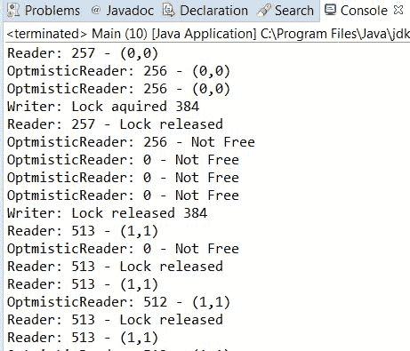

# 基本线程同步

在本章中，我们将涵盖以下主题：

+   同步方法

+   在同步代码中使用条件

+   使用锁同步代码块

+   使用读写锁同步数据访问

+   在锁中使用多个条件

+   使用 StampedLock 类的高级锁定

# 简介

并发编程中最常见的情况之一是多个执行线程共享一个资源。在并发应用程序中，多个线程读取或写入相同的数据结构或访问相同的文件或数据库连接是正常的。这些共享资源可能会引发错误情况或数据不一致，我们必须实现机制来避免这些错误。这些情况被称为**竞态条件**，它们发生在不同线程同时访问同一共享资源时。因此，最终结果取决于线程执行的顺序，大多数情况下，结果是错误的。你还会遇到变化可见性的问题。所以如果一个线程改变了共享变量的值，这些更改只会写入该线程的本地缓存；其他线程将无法访问这些更改（它们只能看到旧值）。

解决这些问题的方案在于**临界区**的概念。临界区是一段访问共享资源的代码块，不能同时被多个线程执行。

为了帮助程序员实现临界区，Java（以及几乎所有编程语言）提供了同步机制。当一个线程想要访问临界区时，它会使用这些同步机制之一来检查是否有其他线程正在执行临界区。如果没有，线程将进入临界区。如果有，线程将被同步机制挂起，直到当前执行临界区的线程结束。当多个线程都在等待一个线程完成临界区的执行时，JVM 会选择其中一个，其余的则等待轮到它们。本章将介绍一些食谱，教你如何使用 Java 语言提供的两种基本同步机制：

+   `synchronized`关键字

+   `Lock`接口及其实现

# 同步方法

在这个食谱中，你将学习如何使用 Java 中最基本的同步方法之一，即使用`synchronized`关键字来控制对方法或代码块的并发访问。所有`synchronized`语句（用于方法或代码块）都使用一个对象引用。只有一个线程可以执行由相同对象引用保护的同一个方法或代码块。

当您在方法中使用`同步`关键字时，对象引用是隐式的。当您在一个或多个对象的方法中使用`同步`关键字时，只有一个执行线程可以访问所有这些方法。如果另一个线程尝试访问同一对象声明为`同步`关键字的方法，它将被挂起，直到第一个线程完成方法的执行。换句话说，每个声明为`同步`关键字的方法都是一个临界区，Java 只允许同时执行一个对象的临界区。在这种情况下，使用的对象引用是`own`对象，由`this`关键字表示。静态方法有不同的行为。只有一个执行线程可以访问声明为`同步`关键字的静态方法，但不同的线程可以访问该类对象的其它非静态方法。您必须非常小心这一点，因为如果一个是静态的而另一个不是，两个线程可以访问两个不同的`同步`方法。如果两个方法更改相同的数据，您可能会遇到数据不一致错误。在这种情况下，使用的对象引用是类对象。

当您使用`同步`关键字保护代码块时，您必须传递一个对象引用作为参数。通常，您将使用`this`关键字来引用执行方法的对象，但您也可以使用其他对象引用。通常，这些对象将专门为此目的创建。您应该将用于同步的对象保持为私有。例如，如果您有一个由多个线程共享的类中的两个独立属性，您必须同步访问每个变量；然而，如果一个线程同时访问一个属性，而另一个线程访问另一个属性，这不会成为问题。请注意，如果您使用`own`对象（由`this`关键字表示），您可能会干扰其他同步代码（如前所述，`this`对象用于同步标记为`同步`关键字的方法）。

在本食谱中，您将学习如何使用`同步`关键字来实现一个模拟停车场的应用程序，该程序具有以下传感器：当汽车或摩托车进入或离开停车场时，一个用于存储停放车辆统计信息的对象，以及一个控制现金流量的机制。我们将实现两个版本：一个没有同步机制，我们将看到如何得到错误的结果，另一个版本正确工作，因为它使用了`同步`关键字的两个变体。

# 准备工作

本食谱的示例已使用 Eclipse IDE 实现。如果您使用 Eclipse 或 NetBeans 等不同的 IDE，请打开它并创建一个新的 Java 项目。

# 如何操作...

按照以下步骤实现示例：

1.  首先，创建应用程序而不使用任何同步机制。创建一个名为 `ParkingCash` 的类，其中包含一个内部常量和用于存储通过提供此停车服务所赚取的总金额的属性：

```java
          public class ParkingCash { 
          private static final int cost=2; 
          private long cash; 

          public ParkingCash() { 
            cash=0; 
          }

```

1.  实现一个名为 `vehiclePay()` 的方法，当车辆（汽车或摩托车）离开停车场时将被调用。它将增加现金属性：

```java
        public void vehiclePay() { 
          cash+=cost; 
        }

```

1.  最后，实现一个名为 `close()` 的方法，将现金属性的值写入控制台并将其重新初始化为零：

```java
          public void close() { 
            System.out.printf("Closing accounting"); 
            long totalAmmount; 
            totalAmmount=cash; 
            cash=0; 
            System.out.printf("The total amount is : %d",
                              totalAmmount); 
          } 
        }

```

1.  创建一个名为 `ParkingStats` 的类，具有三个私有属性和构造函数，该构造函数将初始化它们：

```java
          public class ParkingStats { 
          private long numberCars; 
          private long numberMotorcycles; 
          private ParkingCash cash; 

          public ParkingStats(ParkingCash cash) { 
            numberCars = 0; 
            numberMotorcycles = 0; 
              this.cash = cash; 
          }

```

1.  然后，实现当汽车或摩托车进入或离开停车场时将执行的方法。当车辆离开停车场时，应增加现金：

```java
        public void carComeIn() { 
          numberCars++; 
        } 

        public void carGoOut() { 
          numberCars--; 
          cash.vehiclePay(); 
        }

```

```java
        public void motoComeIn() { 
          numberMotorcycles++; 
        } 

        public void motoGoOut() { 
          numberMotorcycles--; 
          cash.vehiclePay(); 
        }

```

1.  最后，实现两个方法以分别获取停车场内的汽车和摩托车的数量。

1.  创建一个名为 `Sensor` 的类，该类将模拟停车场内车辆的移动。它实现了 `Runnable` 接口，并有一个 `ParkingStats` 属性，该属性将在构造函数中初始化：

```java
        public class Sensor implements Runnable { 

          private ParkingStats stats; 

          public Sensor(ParkingStats stats) { 
            this.stats = stats; 
          }

```

1.  实现 `run()` 方法。在这个方法中，模拟两辆汽车和一辆摩托车进入并随后离开停车场。每个传感器将执行此操作 10 次：

```java
        @Override 
        public void run() { 
          for (int i = 0; i< 10; i++) { 
            stats.carComeIn(); 
            stats.carComeIn(); 
            try { 
              TimeUnit.MILLISECONDS.sleep(50); 
            } catch (InterruptedException e) { 
              e.printStackTrace(); 
            } 
            stats.motoComeIn(); 
            try { 
              TimeUnit.MILLISECONDS.sleep(50); 
            } catch (InterruptedException e) { 
              e.printStackTrace(); 
            }

```

```java

            stats.motoGoOut(); 
            stats.carGoOut(); 
            stats.carGoOut(); 
          } 
        }

```

1.  最后，实现主方法。创建一个名为 `Main` 的类，其中包含 `main()` 方法。它需要 `ParkingCash` 和 `ParkingStats` 对象来管理停车：

```java
        public class Main { 

          public static void main(String[] args) { 

            ParkingCash cash = new ParkingCash(); 
            ParkingStats stats = new ParkingStats(cash); 

            System.out.printf("Parking Simulator\n");

```

1.  然后，创建 `Sensor` 任务。使用 `availableProcessors()` 方法（该方法返回 JVM 可用的处理器数量，通常等于处理器的核心数）来计算我们的停车场将有多少个传感器。创建相应的 `Thread` 对象并将它们存储在数组中：

```java
        intnumberSensors=2 * Runtime.getRuntime()
                                           .availableProcessors(); 
        Thread threads[]=new Thread[numberSensors]; 
        for (int i = 0; i<numberSensors; i++) { 
          Sensor sensor=new Sensor(stats); 
          Thread thread=new Thread(sensor); 
          thread.start(); 
          threads[i]=thread; 
        }

```

1.  然后，使用 `join()` 方法等待线程的最终化：

```java
        for (int i=0; i<numberSensors; i++) { 
          try { 
            threads[i].join(); 
          } catch (InterruptedException e) { 
            e.printStackTrace(); 
          } 
        }

```

1.  最后，编写 `Parking` 的统计信息：

```java
            System.out.printf("Number of cars: %d\n",
                              stats.getNumberCars()); 
            System.out.printf("Number of motorcycles: %d\n",
                               stats.getNumberMotorcycles()); 
            cash.close(); 
          } 
        }

```

在我们的案例中，我们在四核处理器上执行了示例，因此我们将有八个 `Sensor` 任务。每个任务执行 10 次迭代，在每次迭代中，三辆车进入停车场，同样的三辆车离开。因此，每个 `Sensor` 任务将模拟 30 辆车。

如果一切顺利，最终的统计信息将显示以下内容：

+   停车场内没有车辆，这意味着所有进入停车场的车辆都已经离开

+   执行了八个 `Sensor` 任务，其中每个任务模拟了 30 辆车，每辆车收费 2 美元；因此，总共赚取的现金金额为 480 美元

当你执行此示例时，每次都会获得不同的结果，其中大多数将是错误的。以下截图显示了示例：


我们遇到了竞态条件，所有线程访问的不同共享变量给出了错误的结果。让我们使用 `synchronized` 关键字修改之前的代码以解决这些问题：

1.  首先，将`同步`关键字添加到`ParkingCash`类的`vehiclePay()`方法中：

```java
        public synchronized void vehiclePay() { 
          cash+=cost; 
        }

```

1.  然后，将使用`this`关键字的`同步`代码块添加到`close()`方法中：

```java
        public void close() { 
          System.out.printf("Closing accounting"); 
          long totalAmmount; 
          synchronized (this) { 
            totalAmmount=cash; 
            cash=0; 
          } 
          System.out.printf("The total amount is : %d",totalAmmount); 
        }

```

1.  现在向`ParkingStats`类添加两个新的属性，并在类的构造函数中初始化它们：

```java
        private final Object controlCars, controlMotorcycles; 
        public ParkingStats (ParkingCash cash) { 
          numberCars=0; 
          numberMotorcycles=0; 
          controlCars=new Object(); 
          controlMotorcycles=new Object(); 
          this.cash=cash; 
        }

```

1.  最后，修改增加和减少汽车和摩托车数量的方法，包括使用`同步`关键字。`numberCars`属性将由`controlCars`对象保护，而`numberMotorcycles`属性将由`controlMotorcycles`对象保护。您还必须将`getNumberCars()`和`getNumberMotorcycles()`方法与相关引用对象同步：

```java
        public void carComeIn() { 
          synchronized (controlCars) { 
            numberCars++; 
          } 
        } 

        public void carGoOut() { 
          synchronized (controlCars) { 
            numberCars--; 
          } 
          cash.vehiclePay(); 
        } 

```

```java

        public void motoComeIn() { 
          synchronized (controlMotorcycles) { 
            numberMotorcycles++; 
          } 
        } 

        public void motoGoOut() { 
          synchronized (controlMotorcycles) { 
            numberMotorcycles--; 
          } 
          cash.vehiclePay(); 
        }

```

1.  现在执行示例，并与之前的版本进行比较，看看差异。

# 它是如何工作的...

以下截图显示了示例的新版本输出。无论您执行多少次，您都将始终获得正确的结果：


让我们看看示例中`同步`关键字的用法：

+   首先，我们保护了`vehiclePay()`方法。如果有两个或更多`Sensor`任务同时调用此方法，只有一个会执行它，其余的将等待它们的轮次；因此，最终金额总是正确的。

+   我们使用了两个不同的对象来控制对汽车和摩托车计数器的访问。这样，一个`Sensor`任务可以修改`numberCars`属性，另一个`Sensor`任务可以修改`numberMotorcycles`属性，但同时不会有两个`Sensor`任务能够同时修改相同的属性，所以计数器的最终值总是正确的。

最后，我们还同步了`getNumberCars()`和`getNumberMotorcycles()`方法。使用`同步`关键字，我们可以在并发应用程序中保证对共享数据的正确访问。

如本食谱介绍中所述，只有一个线程可以访问使用`同步`关键字声明的方法的对象。如果线程（A）正在执行`同步`方法，而线程（B）想要执行同一对象的另一个`同步`方法，它将被阻塞，直到线程（A）完成。但如果线程（B）可以访问同一类的不同对象，则它们都不会被阻塞。

当您使用`同步`关键字来保护代码块时，您使用一个对象作为参数。JVM 保证只有一个线程可以访问由该对象保护的代码块（注意我们总是谈论对象，而不是类）。

我们还使用了`TimeUnit`类。`TimeUnit`类是一个枚举，具有以下常量：`DAYS`、`HOURS`、`MICROSECONDS`、`MILLISECONDS`、`MINUTES`、`NANOSECONDS`和`SECONDS`。这些表示我们传递给 sleep 方法的单位时间。在我们的例子中，我们让线程休眠 50 毫秒。

# 还有更多...

`同步`关键字会惩罚应用程序的性能，因此你只能在并发环境中修改共享数据的方法上使用它。如果有多个线程调用`同步`方法，则一次只有一个线程执行它们，而其他线程将保持等待。如果操作没有使用`同步`关键字，所有线程都可以同时执行该操作，从而减少总执行时间。如果你知道一个方法不会被多个线程调用，不要使用`同步`关键字。无论如何，如果类是为多线程访问设计的，它应该始终是正确的。你必须将正确性置于性能之上。此外，你应该在方法和类中包含有关它们线程安全的文档。

你可以使用递归调用与`同步`方法。由于线程可以访问对象的`同步`方法，你可以调用该对象的其他`同步`方法，包括正在执行的方法。它不需要再次获取对`同步`方法的访问。

我们可以使用`同步`关键字来保护代码块（而不是整个方法）的访问。我们应该这样使用`同步`关键字来保护对共享数据的访问，将其他操作排除在这个代码块之外，从而获得更好的应用程序性能。目标是使关键部分（一次只能由一个线程访问的代码块）尽可能短。此外，避免在关键部分内部调用阻塞操作（例如，I/O 操作）。我们已经使用`同步`关键字来保护更新建筑物中人数的指令的访问，排除了该代码块中不使用共享数据的长时间操作。当你以这种方式使用`同步`关键字时，你必须传递一个对象引用作为参数。只有一个线程可以访问该对象的`同步`代码（代码块或方法）。通常，我们将使用`this`关键字来引用执行方法的对象：

```java
    synchronized (this) { 
      // Java code 
    }

```

# 参见

+   本章中的*在同步代码中使用条件*配方

# 在同步代码中使用条件

并发编程中的一个经典问题是生产者-消费者问题。我们有一个数据缓冲区，一个或多个生产者将数据保存到缓冲区中，一个或多个消费者从缓冲区中获取数据。

作为缓冲区是一个共享的数据结构，我们必须使用同步机制，例如`同步`关键字来控制对其的访问，但在这里我们有更多的限制。如果缓冲区已满，生产者无法在其中保存数据，如果缓冲区为空，消费者无法从中获取数据。

对于这些类型的情况，Java 提供了在 `Object` 类中实现的 `wait()`、`notify()` 和 `notifyAll()` 方法。一个线程可以在代码的 `synchronized` 块中调用 `wait()` 方法。如果它在 `synchronized` 块之外调用 `wait()` 方法，JVM 将抛出 `IllegalMonitorStateException` 异常。当线程调用 `wait()` 方法时，JVM 将线程置于睡眠状态，并释放控制其正在执行的 `synchronized` 块的对象，允许其他线程执行由该对象保护的另一个 `synchronized` 代码块。要唤醒线程，必须在由同一对象保护的代码块中调用 `notify()` 或 `notifyAll()` 方法。

在本食谱中，你将学习如何使用 `synchronized` 关键字和 `wait()`、`notify()`、`notifyAll()` 方法实现生产者-消费者问题。

# 准备工作

本食谱的示例已使用 Eclipse IDE 实现。如果你使用 Eclipse 或其他 IDE，例如 NetBeans，请打开它并创建一个新的 Java 项目。

# 如何做到这一点...

按照以下步骤实现示例：

1.  创建一个名为 `EventStorage` 的类。它有两个属性，即一个名为 `maxSize` 的 `int` 属性和一个名为 `storage` 的 `List<Date>` 属性：

```java
         public class EventStorage { 

          private int maxSize; 
          private Queue<Date> storage;

```

1.  实现类的构造函数，初始化类的属性：

```java
        public EventStorage(){ 
          maxSize=10; 
          storage=new LinkedList<>(); 
        }

```

1.  实现一个 `synchronized` 方法 `set()` 以将事件存储在 `storage` 中。首先检查存储是否已满。如果已满，它将调用 `wait()` 方法直到有空闲空间。在方法结束时，我们调用 `notify()` 方法唤醒所有在 `wait()` 方法中睡眠的线程。在这种情况下，我们将忽略 `InterruptedException`。在实际实现中，你必须考虑对这些异常的处理。你可以重新抛出或将它们转换为应用程序的另一种类型的异常：

```java
        public synchronized void set(){ 
          while (storage.size()==maxSize){ 
            try { 
              wait(); 
            } catch (InterruptedException e) { 
              e.printStackTrace(); 
            } 
          } 
          storage.offer(new Date()); 
          System.out.printf("Set: %d",storage.size()); 
          notify(); 
        }

```

1.  实现一个 `synchronized` 方法 `get()` 以获取用于存储的事件。首先检查存储是否有事件。如果没有事件，它将调用 `wait()` 方法直到有事件。在方法结束时，我们调用 `notifyAll()` 方法唤醒所有在 `wait()` 方法中睡眠的线程。在这种情况下，我们将忽略 `InterruptedException`。在实际实现中，你必须考虑对这些异常的处理。你可以重新抛出或将它们转换为应用程序的另一种类型的异常：

```java
        public synchronized void get(){ 
          while (storage.size()==0){ 
            try { 
              wait(); 
            } catch (InterruptedException e) { 
              e.printStackTrace(); 
            } 
          } 
          String element=storage.poll().toString(); 
          System.out.printf("Get: %d: %s\n",storage.size(),element); 
          notify(); 

        }

```

1.  创建一个名为 `Producer` 的类并指定它实现 `Runnable` 接口。它将实现示例中的生产者：

```java
        public class Producer implements Runnable {

```

1.  声明一个 `EventStore` 对象并实现类的构造函数以初始化此对象：

```java
        private EventStorage storage; 

        public Producer(EventStorage storage){ 
          this.storage=storage; 
        }

```

1.  实现一个 `run()` 方法，该方法调用 `EventStorage` 对象的 `set()` 方法 100 次：

```java
        @Override 
        public void run() { 
          for (int i=0; i<100; i++){ 
            storage.set(); 
          } 
        }

```

1.  创建一个名为 `Consumer` 的类并指定它实现 `Runnable` 接口。它将实现示例中的消费者：

```java
        public class Consumer implements Runnable {

```

1.  声明一个`EventStorage`对象并实现该类的构造函数以初始化此对象：

```java
        private EventStorage storage; 

        public Consumer(EventStorage storage){ 
          this.storage=storage; 
        }

```

1.  实现一个`run()`方法。它调用`EventStorage`对象的`get()`方法 100 次：

```java
        @Override 
        public void run() { 
          for (int i=0; i<100; i++){ 
            storage.get(); 
          } 
        }

```

1.  通过实现一个名为`Main`的类并添加`main()`方法来创建示例的主类：

```java
        public class Main { 

          public static void main(String[] args) {

```

1.  创建一个`EventStorage`对象：

```java
        EventStorage storage=new EventStorage();

```

1.  创建一个`Producer`对象和一个`Thread`来运行它：

```java
        Producer producer=new Producer(storage); 
        Thread thread1=new Thread(producer);

```

1.  创建一个`Consumer`对象和一个`Thread`来运行它：

```java
        Consumer consumer=new Consumer(storage); 
        Thread thread2=new Thread(consumer);

```

1.  启动两个线程：

```java
        thread2.start(); 
        thread1.start();

```

# 它是如何工作的...

此示例的关键是`EventStorage`类的`set()`和`get()`方法。首先，`set()`方法检查存储属性中是否有空闲空间。如果已满，它调用`wait()`方法等待空闲空间。当其他线程调用`notify()`方法时，此线程会醒来并再次检查条件。`notify()`方法并不保证条件得到满足。这个过程会一直重复，直到存储空间中有空闲空间，可以生成新事件并将其存储。

`get()`方法的行为类似。首先，它检查存储属性中是否有事件。如果`EventStorage`类为空，它调用`wait()`方法等待事件。当其他线程调用`notify()`方法时，此线程会醒来并再次检查条件，直到存储中有一些事件。

你必须在一个`while`循环中不断检查条件并调用`wait()`方法。你将无法继续，直到条件为`true`。

如果你运行此示例，你会发现尽管生产者和消费者正在设置和获取事件，但存储空间永远不会包含超过 10 个事件。

# 更多内容...

`synchronized`关键字还有其他重要的用途。请参阅此配方中的*参见*部分，其中解释了该关键字的使用。

# 参见

+   本章中的*同步方法*配方

# 使用锁同步代码块

Java 提供了另一种同步代码块的方法。它比`synchronized`关键字更强大、更灵活。它基于`Lock`（`java.util.concurrent.locks`包中的接口）及其实现类（如`ReentrantLock`）。这种机制具有一些优点，如下所述：

+   它允许你以更灵活的方式组织同步块。使用`synchronized`关键字，你只能以结构化的方式控制代码中的同步块。然而，`Lock`接口允许你实现更复杂的结构以实现你的临界区。

+   `Lock` 接口提供了比 `synchronized` 关键字更多的功能。其中之一是通过 `tryLock()` 方法实现的。此方法尝试获取锁的控制权，如果无法获取，因为另一个线程正在使用它，则返回 `false`。使用 `synchronized` 关键字时，如果线程（A）在另一个线程（B）正在执行同步代码块时尝试执行同步代码块，则线程（A）将被挂起，直到线程（B）完成同步代码块的执行。使用锁，您可以执行 `tryLock()` 方法。此方法返回一个 `Boolean` 值，指示是否有另一个线程正在运行由该锁保护的代码。

+   `ReadWriteLock` 接口允许在多个读取者和仅有一个修改者之间分离读取和写入操作。

+   `Lock` 接口提供的性能优于 `synchronized` 关键字。

`ReentrantLock` 类的构造函数接受一个名为 `fair` 的 `boolean` 参数；此参数允许您控制其行为。`false` 值是默认值，称为 **非公平模式**。在此模式下，如果有线程正在等待锁，并且锁必须从这些线程中选择一个来获取对临界区的访问权限，它会随机选择其中的任何一个。`true` 值称为 **公平模式**。在此模式下，如果有线程正在等待锁，并且锁必须选择一个来获取对临界区的访问权限，它会选择等待时间最长的线程。请注意，之前解释的行为仅在 `lock()` 和 `unlock()` 方法中使用。由于 `tryLock()` 方法不会使线程休眠，如果使用 `Lock` 接口，则公平属性不会影响其功能。

在本食谱中，您将学习如何使用锁来同步代码块，并使用 `Lock` 接口及其实现类 `ReentrantLock` 创建临界区，实现一个模拟打印队列的程序。您还将了解公平参数如何影响 `Lock` 的行为。

# 准备工作

本食谱中的示例是使用 Eclipse IDE 实现的。如果您使用 Eclipse 或其他 IDE，例如 NetBeans，请打开它并创建一个新的 Java 项目。

# 如何操作...

按照以下步骤实现示例：

1.  创建一个名为 `PrintQueue` 的类，该类将实现打印队列：

```java
         public class PrintQueue {

```

1.  在构造函数中声明一个 `Lock` 对象，并用 `ReentrantLock` 类的新对象初始化它。构造函数将接收一个 `Boolean` 参数，我们将使用它来指定 `Lock` 的公平模式：

```java
        private Lock queueLock; 
        public PrintQueue(booleanfairMode) { 
          queueLock = new ReentrantLock(fairMode); 
        }

```

1.  实现 `printJob()` 方法。它将接收 `Object` 作为参数，并且不会返回任何值：

```java
        public void printJob(Object document){

```

1.  在 `printJob()` 方法内部，通过调用 `lock()` 方法来获取 `Lock` 对象的控制权：

```java
        queueLock.lock();

```

1.  然后，包含以下代码以模拟打印文档的过程：

```java
        try { 
          Long duration=(long)(Math.random()*10000); 
          System.out.println(Thread.currentThread().getName()+ ":
                             PrintQueue: Printing a Job during "+
                             (duration/1000)+" seconds"); 
          Thread.sleep(duration); 
        } catch (InterruptedException e) { 
          e.printStackTrace(); 
        }

```

1.  最后，使用 `unlock()` 方法释放 `Lock` 对象的控制权：

```java
        finally { 
          queueLock.unlock(); 
        }

```

1.  然后，重复相同的流程。`printJob()`方法将帮助您获取锁并释放两次。这种奇怪的行为将使我们能够更好地看到公平模式和非公平模式之间的差异。我们将这段代码包含在`printJob()`方法中：

```java
          queueLock.lock(); 
          try { 
            Long duration = (long) (Math.random() * 10000); 
            System.out.printf("%s: PrintQueue: Printing a Job during
                               %d seconds\n", Thread.currentThread()
                              .getName(),(duration / 1000)); 
            Thread.sleep(duration); 
          } catch (InterruptedException e) { 
            e.printStackTrace(); 
          } finally { 
          queueLock.unlock(); 
        }

```

1.  创建一个名为`Job`的类并指定它实现`Runnable`接口：

```java
        public class Job implements Runnable {

```

1.  声明一个`PrintQueue`类的对象并实现该类的构造函数以初始化此对象：

```java
        private PrintQueue printQueue; 

        public Job(PrintQueue printQueue){ 
          this.printQueue=printQueue; 
        }

```

1.  实现该`run()`方法。它使用`PrintQueue`对象来发送打印任务：

```java
        @Override 
        public void run() { 
          System.out.printf("%s: Going to print a document\n",
                            Thread.currentThread().getName()); 
          printQueue.printJob(new Object()); 
        System.out.printf("%s: The document has been printed\n",
                          Thread.currentThread().getName()); 
        }

```

1.  通过实现一个名为`Main`的类并添加`main()`方法来创建应用程序的主类：

```java
        public class Main { 

          public static void main (String args[]){

```

1.  我们将使用具有公平模式的锁来测试`PrintQueue`类，并返回`true`和`false`。我们将使用一个辅助方法来实现这两个测试，以便`main()`方法的代码简单：

```java
          System.out.printf("Running example with fair-mode =
                             false\n"); 
          testPrintQueue(false); 
          System.out.printf("Running example with fair-mode = true\n"); 
          testPrintQueue(true); 
        }

```

1.  创建`testPrintQueue()`方法并在其中创建一个共享的`PrintQueue`对象：

```java
        private static void testPrintQueue(Boolean fairMode) { 
          PrintQueue printQueue=new PrintQueue(fairMode);

```

1.  创建 10 个`Job`对象和 10 个线程来运行它们：

```java
        Thread thread[]=new Thread[10]; 
        for (int i=0; i<10; i++){ 
          thread[i]=new Thread(new Job(printQueue),"Thread "+ i); 
        }

```

1.  启动 10 个线程：

```java
        for (int i=0; i<10; i++){ 
          thread[i].start(); 
        }

```

1.  最后，等待 10 个线程的最终化：

```java
        for (int i=0; i<10; i++) { 
          try { 
            thread[i].join(); 
          } catch (InterruptedException e) { 
            e.printStackTrace(); 
          } 
        }

```

# 它是如何工作的...

在下面的屏幕截图中，您可以看到此示例一次执行的部分输出：


示例的关键在于`PrintQueue`类的`printJob()`方法。当我们想要使用锁实现关键部分并保证只有一个执行线程运行代码块时，我们必须创建一个`ReentrantLock`对象。在关键部分的开始，我们必须使用`lock()`方法获取锁的控制权。当线程（A）调用此方法时，如果没有其他线程控制锁，它将立即将锁的控制权交给线程（A）并返回，允许线程执行关键部分。否则，如果有另一个，比如说线程（B），正在执行由该锁控制的关键部分，`lock()`方法将使线程（A）休眠，直到线程（B）完成关键部分的执行。

在关键部分结束时，我们必须使用`unlock()`方法释放锁的控制权，允许其他线程运行关键部分。如果在关键部分结束时没有调用`unlock()`方法，等待该块的线程将永远等待，导致死锁情况。如果在关键部分中使用 try-catch 块，别忘了将包含`unlock()`方法的句子放在`finally`部分中。

在此示例中，我们还测试了另一个主题，即公平模式。在每次任务中，我们都有两个关键部分。在前面的屏幕截图中，您可以看到所有任务在第一个任务之后立即执行第二个部分。这是通常的情况，但也有例外。这发生在我们具有非公平模式时，也就是说，我们将一个假值传递给`ReentrantLock`类的构造函数。

相反，当我们通过将 `true` 值传递给 `Lock` 类的构造函数来建立公平模式时，行为会有所不同。第一个请求控制锁的线程是 `Thread 0`，然后是 `Thread 1`，依此类推。当 `Thread 0` 正在运行由锁保护的第一个代码块时，我们有九个线程正在等待执行相同的代码块。当 `Thread 0` 释放锁后，它立即再次请求锁，因此我们有 10 个线程试图获取锁。由于启用了公平模式，`Lock` 接口将选择 `Thread 1`，因为它等待锁的时间更长。然后，它选择 `Thread 2`，然后是 `Thread 3`，依此类推。直到所有线程都通过了锁保护的第一个代码块，它们中的任何一个都不会执行锁保护的第二个代码块。一旦所有线程都执行了锁保护的第一个代码块，那么轮到 `Thread 0` 再次，然后是 `Thread 1`，依此类推。以下截图显示了差异：


# 还有更多...

`Lock` 接口（以及 `ReentrantLock` 类）还包括另一个获取锁控制的方法。它是 `tryLock()` 方法。与 `lock()` 方法最大的不同是，如果使用此方法的线程无法获取锁控制，它将立即返回，并且不会使线程休眠。如果线程获取了锁，它返回 `boolean` 值 `true`；如果没有获取，则返回 `false`。你也可以传递一个时间值和一个 `TimeUnit` 对象来指示线程等待获取锁的最大时间。如果时间流逝而线程没有获取到锁，该方法将返回 `false` 值。`TimeUnit` 类是一个枚举，具有以下常量：`DAYS`、`HOURS`、`MICROSECONDS`、`MILLISECONDS`、`MINUTES`、`NANOSECONDS` 和 `SECONDS`；这些表示我们传递给方法的时间单位。

请注意，程序员有责任考虑此方法的结果并相应地采取行动。如果方法返回 `false`，则显然你的程序无法执行临界区。如果它返回 `true`，你可能在应用程序中得到错误的结果。

`ReentrantLock` 类还允许使用递归调用。当一个线程控制了锁并进行了递归调用时，它将继续保持对锁的控制，因此对 `lock()` 方法的调用将立即返回，线程将继续执行递归调用。此外，我们还可以调用其他方法。你应该在代码中调用 `unlock()` 方法与调用 `lock()` 方法的次数相同。

# 避免死锁

你必须非常小心地使用锁，以避免**死锁**。这种情况发生在两个或更多线程在等待永远不会解锁的锁时被阻塞。例如，线程（A）锁定锁（X），而线程（B）锁定锁（Y）。现在，如果线程（A）试图锁定锁（Y），而线程（B）同时试图锁定锁（X），两个线程都将无限期地被阻塞，因为他们正在等待永远不会被释放的锁。请注意，问题发生是因为两个线程试图以相反的顺序获取锁。附录*并发编程设计*提供了一些很好的建议，以充分设计并发应用程序并避免这些死锁问题。

# 参见

+   本章中的*同步方法*和*在锁中使用多个条件*配方

+   第九章中的*监控锁接口*配方，*测试并发应用程序*

# 使用读写锁同步数据访问

锁提供的最显著的改进之一是`ReadWriteLock`接口和`ReentrantReadWriteLock`类，这是唯一实现该接口的类。这个类有两个锁：一个用于读操作，一个用于写操作。可以有多个线程同时使用读操作，但只有一个线程可以使用写操作。如果一个线程正在进行写操作，其他线程就不能写或读。

在这个配方中，你将通过实现一个使用它来控制访问存储两个产品价格的对象的程序，来学习如何使用`ReadWriteLock`接口。

# 准备工作...

你应该阅读*使用锁同步代码块*的配方，以更好地理解这个配方。

# 如何做到这一点...

按照以下步骤实现示例：

1.  创建一个名为`PricesInfo`的类，用于存储两个产品价格的信息：

```java
        public class PricesInfo {

```

1.  声明两个名为`price1`和`price2`的`double`属性：

```java
        private double price1; 
        private double price2;

```

1.  声明一个名为`lock`的`ReadWriteLock`对象：

```java
        private ReadWriteLock lock;

```

1.  实现类的构造函数，初始化三个属性。对于`lock`属性，创建一个新的`ReentrantReadWriteLock`对象：

```java
        public PricesInfo(){ 
          price1=1.0; 
          price2=2.0; 
          lock=new ReentrantReadWriteLock(); 
        }

```

1.  实现返回`price1`属性值的`getPrice1()`方法。它使用读锁来控制对这个属性值的访问：

```java
        public double getPrice1() { 
          lock.readLock().lock(); 
          double value=price1; 
          lock.readLock().unlock(); 
          return value; 
        }

```

1.  实现返回`price2`属性值的`getPrice2()`方法。它使用读锁来控制对这个属性值的访问：

```java
        public double getPrice2() { 
          lock.readLock().lock(); 
          double value=price2; 
          lock.readLock().unlock(); 
          return value; 
        }

```

1.  实现设置两个属性值的`setPrices()`方法。它使用写锁来控制对它们的访问。我们将使线程休眠 5 秒钟。这表明即使它有写锁，也没有其他线程获得读锁：

```java
        public void setPrices(double price1, double price2) { 
          lock.writeLock().lock(); 
          System.out.printf("%s: PricesInfo: Write Lock Adquired.\n",
                            new Date()); 
          try { 
            TimeUnit.SECONDS.sleep(10); 
          } catch (InterruptedException e) { 
            e.printStackTrace(); 
          } 
          this.price1=price1; 
          this.price2=price2; 
          System.out.printf("%s: PricesInfo: Write Lock Released.\n",
                            new Date()); 
          lock.writeLock().unlock(); 
        }

```

1.  创建一个名为`Reader`的类，并指定它实现`Runnable`接口。这个类实现了`PricesInfo`类属性的读取器：

```java
        public class Reader implements Runnable {

```

1.  声明一个 `PricesInfo` 对象并实现该类的构造函数，以便初始化此对象：

```java
        private PricesInfo pricesInfo; 

        public Reader (PricesInfo pricesInfo){ 
          this.pricesInfo=pricesInfo; 
        }

```

1.  为此类实现 `run()` 方法。它读取两个价格值 10 次：

```java
        @Override 
        public void run() { 
          for (int i=0; i<20; i++){ 
            System.out.printf("%s: %s: Price 1: %f\n",new Date(),
                              Thread.currentThread().getName(),
                              pricesInfo.getPrice1()); 
            System.out.printf("%s: %s: Price 2: %f\n",new Date(),
                              Thread.currentThread().getName(),
                              pricesInfo.getPrice2()); 
          } 
        }

```

1.  创建一个名为 `Writer` 的类并指定它实现 `Runnable` 接口。此类实现了 `PricesInfo` 类属性的值修改器：

```java
        public class Writer implements Runnable {

```

1.  声明一个 `PricesInfo` 对象并实现该类的构造函数，以便初始化此对象：

```java
        private PricesInfo pricesInfo; 

        public Writer(PricesInfo pricesInfo){ 
          this.pricesInfo=pricesInfo; 
        }

```

1.  实现 `run()` 方法。该方法在两次修改之间暂停 2 秒，修改两个价格值三次：

```java
        @Override 
        public void run() { 
          for (int i=0; i<3; i++) { 
            System.out.printf("%s: Writer: Attempt to modify the
                              prices.\n", new Date()); 
            pricesInfo.setPrices(Math.random()*10, Math.random()*8); 
            System.out.printf("%s: Writer: Prices have been
                              modified.\n", new Date()); 
            try { 
              Thread.sleep(2); 
            } catch (InterruptedException e) { 
              e.printStackTrace(); 
            } 
          } 
        }

```

1.  通过创建一个名为 `Main` 的类并添加 `main()` 方法来实现示例的主类：

```java
        public class Main { 
          public static void main(String[] args) {

```

1.  创建一个 `PricesInfo` 对象：

```java
        PricesInfo pricesInfo=new PricesInfo();

```

1.  创建五个 `Reader` 对象和五个 `Thread` 对象以执行它们：

```java
        Reader readers[]=new Reader[5]; 
        Thread threadsReader[]=new Thread[5]; 

        for (int i=0; i<5; i++){ 
          readers[i]=new Reader(pricesInfo); 
          threadsReader[i]=new Thread(readers[i]); 
        }

```

1.  创建一个 `Writer` 对象和 `Thread` 来执行它：

```java
        Writer writer=new Writer(pricesInfo); 
        Thread  threadWriter=new Thread(writer);

```

1.  开始线程：

```java
        for (int i=0; i<5; i++){ 
          threadsReader[i].start(); 
        } 
        threadWriter.start();

```

# 它是如何工作的...

在下面的屏幕截图，你可以看到此示例一次执行的部分输出：


当写者获取写锁时，没有任何读任务可以读取数据。你可以在 `Write Lock Acquired` 消息之后看到一些读任务的消息，但它们是之前执行且尚未在控制台显示的指令。一旦写任务释放了锁，读任务再次获得对价格信息的访问权限并显示新的价格。

如前所述，`ReentrantReadWriteLock` 类有两个锁：一个用于读操作，一个用于写操作。用于读操作的锁是通过在 `ReadWriteLock` 接口中声明的 `readLock()` 方法获得的。这个锁是一个实现了 `Lock` 接口的对象，因此我们可以使用 `lock()`、`unlock()` 和 `tryLock()` 方法。用于写操作的锁是通过在 `ReadWriteLock` 接口中声明的 `writeLock()` 方法获得的。这个锁也是一个实现了 `Lock` 接口的对象，因此我们可以使用 `lock()`、`unlock()` 和 `tryLock()` 方法。确保正确使用这些锁，使用它们来完成它们被设计的目的。当你获得 `Lock` 接口的读锁时，你不能修改变量的值。否则，你可能会遇到与不一致相关的数据错误。

# 参见

+   本章中 *使用锁同步代码块* 的配方

+   在第九章 *测试并发应用程序* 中，*监控 Lock 接口* 的配方

# 在锁中使用多个条件

锁可以与一个或多个条件相关联。这些条件在 `Condition` 接口中声明。这些条件的目的允许线程控制锁并检查条件是否为 `true` 或 `false`。如果是 `false`，则线程将被挂起，直到另一个线程唤醒它。`Condition` 接口提供了挂起线程和唤醒挂起线程的机制。

并发编程中的一个经典问题是生产者-消费者问题。我们有一个数据缓冲区，一个或多个生产者将数据保存到缓冲区中，以及一个或多个消费者从缓冲区中获取数据，如本章前面所述。

在这个菜谱中，你将学习如何使用锁和条件实现生产者-消费者问题。

# 准备工作

你应该阅读 *使用锁同步代码块* 的菜谱，以更好地理解这个菜谱。

# 如何做...

按照以下步骤实现示例：

1.  首先，实现一个将模拟文本文件的类。创建一个名为 `FileMock` 的类，具有两个属性：一个名为 `content` 的 `String` 数组和一个名为 `index` 的 `int`。它们将存储文件的内容和将要检索的模拟文件的行：

```java
        public class FileMock { 

          private String[] content; 
          private int index;

```

1.  实现类的构造函数，该函数初始化文件内容为随机字符：

```java
        public FileMock(int size, int length){ 
          content = new String[size]; 
          for (int i = 0; i< size; i++){ 
            StringBuilder buffer = new StringBuilder(length); 
            for (int j = 0; j < length; j++){ 
              int randomCharacter= (int)Math.random()*255; 
              buffer.append((char)randomCharacter); 
            } 
            content[i] = buffer.toString(); 
          } 
          index=0; 
        }

```

1.  实现返回 `true` 如果文件还有更多行要处理或返回 `false` 如果你已经到达模拟文件的末尾的 `hasMoreLines()` 方法：

```java
        public boolean hasMoreLines(){ 
          return index <content.length; 
        }

```

1.  实现返回由索引属性确定的行并增加其值的 `getLine()` 方法：

```java
        public String getLine(){ 
          if (this.hasMoreLines()) { 
            System.out.println("Mock: " + (content.length-index)); 
            return content[index++]; 
          } 
          return null; 
        }

```

1.  现在实现一个名为 `Buffer` 的类，它将实现生产者和消费者共享的缓冲区：

```java
        public class Buffer {

```

1.  这个类有六个属性：

+   一个名为 `buffer` 的 `LinkedList<String>` 属性，它将存储共享数据。例如：

```java
                  private final LinkedList<String> buffer;

```

+   一个名为 `maxSize` 的 `int` 类型，它将存储缓冲区的长度。例如：

```java
                    private final int maxSize;

```

+   一个名为 `lock` 的 `ReentrantLock` 对象，它将控制对修改缓冲区的代码块的访问。例如：

```java
                    private final ReentrantLock lock;

```

+   两个名为 `lines` 和 `space` 的 `Condition` 属性。例如：

```java
                  private final Condition lines;

                  private final Condition space;

```

+   一个名为 `pendingLines` 的 `boolean` 类型，它将指示缓冲区中是否有行。例如：

```java
                  private boolean pendingLines;

```

1.  实现类的构造函数。它初始化之前描述的所有属性：

```java
        public Buffer(int maxSize) { 
          this.maxSize = maxSize; 
          buffer = new LinkedList<>(); 
          lock = new ReentrantLock(); 
          lines = lock.newCondition(); 
          space = lock.newCondition(); 
          pendingLines =true; 
        }

```

1.  实现一个`insert()`方法。它接收一个`String`类型的参数，并尝试将其存储在缓冲区中。首先，它获取锁的控制权。当它拥有这个锁时，它会检查缓冲区中是否有空余空间。如果缓冲区已满，它会在`space`条件中调用`await()`方法等待空闲空间。当另一个线程在`space`条件中调用`signal()`或`signalAll()`方法时，线程将被唤醒。当发生这种情况时，线程将行存储在缓冲区中，并在`lines`条件上调用`signallAll()`方法。正如我们马上会看到的，这个条件将唤醒所有等待缓冲区中行的线程。为了使代码更简单，我们忽略了`InterruptedException`异常。在实际情况下，你可能必须处理它：

```java
        public void insert(String line) { 
          lock.lock(); 
          try { 
            while (buffer.size() == maxSize) { 
              space.await(); 
            } 
            buffer.offer(line); 
            System.out.printf("%s: Inserted Line: %d\n",
                              Thread.currentThread().getName(),
                              buffer.size()); 
            lines.signalAll(); 
          } catch (InterruptedException e) { 
            e.printStackTrace(); 
          } finally { 
            lock.unlock(); 
          } 
        }

```

1.  实现一个`get()`方法。它返回缓冲区中存储的第一个字符串。首先，它获取锁的控制权。当完成这个操作后，它会检查缓冲区中是否有行。如果缓冲区为空，它会在`lines`条件中调用`await()`方法等待缓冲区中的行。当另一个线程在`lines`条件中调用`signal()`或`signalAll()`方法时，这个线程将被唤醒。当发生这种情况时，该方法获取缓冲区中的第一行，在`space`条件上调用`signalAll()`方法，并返回`String`：

```java
        public String get() { 
          String line = null; 
          lock.lock(); 
          try { 
            while ((buffer.size() == 0) &&(hasPendingLines())) { 
              lines.await(); 
            } 

            if (hasPendingLines()) { 
              line = buffer.poll(); 
              System.out.printf("%s: Line Readed: %d\n",
                                Thread.currentThread().getName(),
                                buffer.size()); 
              space.signalAll(); 
            } 
          } catch (InterruptedException e) { 
            e.printStackTrace(); 
          } finally { 
            lock.unlock(); 
          } 
          return line; 
        }

```

1.  实现一个`setPendingLines()`方法，用于设置`pendingLines`属性的值。当生产者没有更多行要生产时，将调用它：

```java
        public synchronized void setPendingLines(boolean pendingLines) { 
          this.pendingLines = pendingLines; 
        }

```

1.  实现一个`hasPendingLines()`方法。如果有更多行要处理，则返回`true`，否则返回`false`：

```java
        public synchronized boolean hasPendingLines() { 
          return pendingLines || buffer.size()>0; 
        }

```

1.  现在轮到生产者了。实现一个名为`Producer`的类，并指定它实现`Runnable`接口：

```java
        public class Producer implements Runnable {

```

1.  声明两个属性，即`FileMock`类的一个对象和`Buffer`类的一个对象：

```java
        private FileMock mock; 

        private Buffer buffer;

```

1.  实现类的构造函数，初始化两个属性：

```java
        public Producer (FileMock mock, Buffer buffer){ 
          this.mock = mock; 
          this.buffer = buffer; 
        }

```

1.  实现一个`run()`方法，该方法读取`FileMock`对象中创建的所有行，并使用`insert()`方法将它们存储在缓冲区中。一旦完成，使用`setPendingLines()`方法通知缓冲区它将不再生成更多行：

```java
        @Override 
        public void run() { 
          buffer.setPendingLines(true); 
          while (mock.hasMoreLines()){ 
            String line = mock.getLine(); 
            buffer.insert(line); 
          } 
          buffer.setPendingLines(false); 
        }

```

1.  接下来是消费者的轮次。实现一个名为`Consumer`的类，并指定它实现`Runnable`接口：

```java
        public class Consumer implements Runnable {

```

1.  声明一个`Buffer`对象并实现类的构造函数，初始化它：

```java
        private Buffer buffer; 

        public Consumer (Buffer buffer) { 
          this.buffer = buffer; 
        }

```

1.  实现一个`run()`方法。当缓冲区有挂起的行时，它尝试获取一行并处理它：

```java
        @Override   
        public void run() { 
          while (buffer.hasPendingLines()) { 
            String line = buffer.get(); 
            processLine(line); 
          } 
        }

```

1.  实现一个辅助方法`processLine()`。它只睡眠 10 毫秒来模拟对行的某种处理：

```java
        private void processLine(String line) { 
          try { 
            Random random = new Random(); 
            Thread.sleep(random.nextInt(100)); 
          } catch (InterruptedException e) { 
            e.printStackTrace(); 
          } 
        }

```

1.  通过创建一个名为`Main`的类并添加`main()`方法来实现示例的主类：

```java
        public class Main { 

          public static void main(String[] args) {

```

1.  创建一个`FileMock`对象：

```java
        FileMock mock = new FileMock(100, 10);

```

1.  创建一个`Buffer`对象：

```java
        Buffer buffer = new Buffer(20);

```

1.  创建一个`Producer`对象和`Thread`来运行它：

```java
        Producer producer = new Producer(mock, buffer); 
        Thread producerThread = new Thread(producer,"Producer");

```

1.  创建三个`Consumer`对象和三个线程来运行它们：

```java
        Consumer consumers[] = new Consumer[3]; 
        Thread consumersThreads[] = new Thread[3]; 

        for (int i=0; i<3; i++){ 
          consumers[i] = new Consumer(buffer); 
          consumersThreads[i] = new Thread(consumers[i],"Consumer "+i); 
        }

```

1.  启动生产者和三个消费者：

```java
        producerThread.start(); 
        for (int i = 0; i< 3; i++){ 
          consumersThreads[i].start(); 
        }

```

# 它是如何工作的...

所有的 `Condition` 对象都与一个锁相关联，并且使用在 `Lock` 接口中声明的 `newCondition()` 方法创建。在我们可以对条件进行任何操作之前，你必须控制与条件相关联的锁。因此，必须在一个持有锁的线程中执行与条件相关的操作，通过调用 `Lock` 对象的 `lock()` 方法，然后使用同一 `Lock` 对象的 `unlock()` 方法来释放它。

当一个线程调用条件的 `await()` 方法时，它将自动释放锁的控制权，以便另一个线程可以获取它，并开始执行或另一个由该锁保护的临界区。

当一个线程调用条件的 `signal()` 或 `signallAll()` 方法时，等待该条件的线程之一或所有线程将被唤醒，但这并不保证使它们休眠的条件现在为 `true`。因此，你必须将 `await()` 调用放在一个 while 循环中。你不能离开这个循环直到条件为 `true`。当条件为 `false` 时，你必须再次调用 `await()`。

你必须小心使用 `await()` 和 `signal()` 方法。如果在某个条件下调用了 `await()` 方法，但在这个条件下从未调用过 `signal()` 方法，那么线程将永远休眠。

线程在睡眠期间可以被中断，在调用 `await()` 方法之后，因此你必须处理 `InterruptedException` 异常。

# 还有更多...

`Condition` 接口有 `await()` 方法的其他版本，如下所示：

+   `await(long time, TimeUnit unit)`: 在这里，线程将休眠直到：

    +   被中断了

    +   另一个线程在条件中调用 `signal()` 或 `signalAll()` 方法

    +   指定的时间已过

    +   `TimeUnit` 类是一个包含以下常量的枚举：`DAYS`、`HOURS`、`MICROSECONDS`、`MILLISECONDS`、`MINUTES`、`NANOSECONDS` 和 `SECONDS`

+   `awaitUninterruptibly()`: 线程将休眠直到另一个线程调用 `signal()` 或 `signalAll()` 方法，这不能被中断

+   `awaitUntil(Date date)`: 线程将休眠直到：

    +   被中断了

    +   另一个线程在条件中调用 `signal()` 或 `signalAll()` 方法

    +   指定的日期到达

你可以使用读写锁的 `ReadLock` 和 `WriteLock` 锁与条件一起使用。

# 参见

+   本章中关于 *使用锁同步代码块* 和 *使用读写锁同步数据访问* 的配方

# 使用 `StampedLock` 类的高级锁定

`StampedLock` 类提供了一种特殊的锁，这种锁与 `Lock` 或 `ReadWriteLock` 接口提供的锁不同。实际上，这个类没有实现这些接口，但它提供的功能非常相似。

关于这类锁的第一个要注意的点是其主要目的是作为一个辅助类来实现线程安全的组件，因此其使用在正常应用中不会非常常见。

`StampedLock` 锁的最重要特性如下：

+   您可以通过三种不同的模式来获取锁的控制权：

    +   **写入**：在此模式下，您对锁有独占访问权。没有其他线程可以在这种模式下控制锁。

    +   **读取**：在此模式下，您对锁有非独占访问权。可以有其他线程在此模式或乐观读取模式下访问锁。

    +   **乐观读取**：在这里，线程不控制块。其他线程可以在写入模式下获取锁的控制权。当您在乐观读取模式下获取锁并想要访问由它保护的共享数据时，您将必须使用 `validate()` 方法检查您是否可以访问它们。

+   `StampedLock` 类提供了以下方法：

    +   在前述模式之一中获取锁的控制权。如果方法（`readLock()`、`writeLock()`、`readLockInterruptibly()`）无法获取锁的控制权，当前线程将暂停，直到获取到锁。

    +   在前述模式之一中获取锁的控制权。如果方法（`tryOptimisticRead()`、`tryReadLock()`、`tryWriteLock()`）无法获取锁的控制权，它们将返回一个特殊值来指示这种情况。

    +   如果可能，将一种模式转换为另一种模式。如果不可以，方法（`asReadLock()`、`asWriteLock()`、`asReadWriteLock()`）将返回一个特殊值。

    +   释放锁。

+   所有这些方法都返回一个名为 stamp 的长整型值，我们需要使用它来与锁一起工作。如果一个方法返回零，这意味着它尝试获取锁，但无法获取。

+   `StampedLock` 锁不是一个可重入锁，例如 `Lock` 和 `ReadWriteLock` 接口。如果您调用尝试再次获取锁的方法，它可能会被阻塞，您将遇到死锁。

+   它没有所有权的概念。它们可以被一个线程获取，然后由另一个线程释放。

+   最后，它对下一个将获取锁控制的线程没有任何策略。

在本配方中，我们将学习如何使用 `StampedLock` 类的不同模式来保护对共享数据对象的访问。我们将使用一个共享对象在三个并发任务之间进行测试，以使用 `StampedLock`（写入、读取和乐观读取）测试三种访问模式。

# 准备就绪

本示例的配方已使用 Eclipse IDE 实现。如果您使用 Eclipse 或其他 IDE，例如 NetBeans，请打开它并创建一个新的 Java 项目。

# 如何操作...

按照以下步骤实现示例：

1.  首先，实现共享数据对象。创建一个名为 `Position` 的类，具有两个整型属性，即 `x` 和 `y`。您必须包括获取和设置属性值的方法。其代码非常简单，因此在此处未包含。

1.  现在，让我们实现 `Writer` 任务。它实现了 `Runnable` 接口，并将有两个属性：一个名为 `position` 的 `Position` 对象和一个名为 `lock` 的 `StampedLock`。它们将在构造函数中初始化：

```java
         public class Writer implements Runnable { 

          private final Position position; 
          private final StampedLock lock; 

          public Writer (Position position, StampedLock lock) { 
            this.position=position; 
            this.lock=lock; 
          }

```

1.  实现`run()`方法。在一个我们将重复 10 次的循环中，以写入模式获取锁，更改位置对象的两个属性值，暂停线程执行一秒，释放锁（在`try...catch...finally`结构的`finally`部分释放锁，以确保在任何情况下都能释放锁），然后暂停线程一秒：

```java
        @Override 
        public void run() { 

          for (int i=0; i<10; i++) { 
            long stamp = lock.writeLock(); 

            try { 
              System.out.printf("Writer: Lock acquired %d\n",stamp); 
              position.setX(position.getX()+1); 
              position.setY(position.getY()+1); 
              TimeUnit.SECONDS.sleep(1); 
            } catch (InterruptedException e) { 
              e.printStackTrace(); 
            } finally { 
              lock.unlockWrite(stamp); 
              System.out.printf("Writer: Lock released %d\n",stamp); 
            } 

            try { 
              TimeUnit.SECONDS.sleep(1); 
            } catch (InterruptedException e) { 
              e.printStackTrace(); 
            } 
          } 

        }

```

1.  然后，实现`Reader`任务以读取共享对象的价值。创建一个名为`Reader`的类，该类实现`Runnable`接口。它将有两个属性：一个名为`position`的`Position`对象和一个名为`lock`的`StampedLock`对象。它们将在类的构造函数中初始化：

```java
        public class Reader implements Runnable { 

          private final Position position; 
          private final StampedLock lock; 

          public Reader (Position position, StampedLock lock) { 
            this.position=position; 
            this.lock=lock; 
          }

```

1.  现在实现`run()`方法。在一个我们将重复`50`次的循环中，以读取模式获取锁的控制权，将位置对象的值写入控制台，并暂停线程`200`毫秒。最后，使用`try...catch...finally`结构的`finally`块释放锁：

```java
        @Override 
        public void run() { 
          for (int i=0; i<50; i++) { 
            long stamp=lock.readLock(); 
            try { 
              System.out.printf("Reader: %d - (%d,%d)\n", stamp,
                                position.getX(), position.getY()); 
              TimeUnit.MILLISECONDS.sleep(200); 
            } catch (InterruptedException e) { 
              e.printStackTrace(); 
            } finally { 
              lock.unlockRead(stamp); 
              System.out.printf("Reader: %d - Lock released\n", stamp); 
            } 
          } 
        }

```

1.  然后，实现`OptimisticReader`任务。`OptimisticReader`类实现`Runnable`接口。它将有两个属性：一个名为`position`的`Position`对象和一个名为`lock`的`StampedLock`对象。它们将在类的构造函数中初始化：

```java
        public class OptimisticReader implements Runnable { 

          private final Position position; 
          private final StampedLock lock; 

          public OptimisticReader (Position position, StampedLock lock) { 
            this.position=position; 
            this.lock=lock; 
          }

```

1.  现在实现`run()`方法。首先使用`tryOptimisticRead()`方法以乐观读取模式获取锁的戳记。然后，重复循环`100`次。在循环中，使用`validate()`方法验证是否可以访问数据。如果此方法返回`true`，则在控制台写入位置对象的值。否则，在控制台写入一条消息，并再次使用`tryOptimisticRead()`方法获取另一个戳记。然后，暂停线程`200`毫秒：

```java
        @Override 
        public void run() { 
          long stamp; 
          for (int i=0; i<100; i++) { 
            try { 
              stamp=lock.tryOptimisticRead(); 
              int x = position.getX(); 
              int y = position.getY(); 
              if (lock.validate(stamp)) { 
                System.out.printf("OptmisticReader: %d - (%d,%d)\n",
                                  stamp,x, y); 
              } else { 
                System.out.printf("OptmisticReader: %d - Not Free\n",
                                  stamp); 
              } 
              TimeUnit.MILLISECONDS.sleep(200); 
            } catch (InterruptedException e) { 
              e.printStackTrace(); 
            } 
          } 
        }

```

1.  最后，实现带有`main()`方法的`Main`类。创建一个`Position`和`StampedLock`对象，创建三个线程（每个任务一个）启动线程，并等待它们的最终化：

```java
        public class Main { 

          public static void main(String[] args) { 

            Position position=new Position(); 
            StampedLock lock=new StampedLock(); 

            Thread threadWriter=new Thread(new Writer(position,lock)); 
            Thread threadReader=new Thread(new Reader(position, lock)); 
            Thread threadOptReader=new Thread(new OptimisticReader
                                               (position, lock)); 

            threadWriter.start(); 
            threadReader.start(); 
            threadOptReader.start(); 

            try { 
              threadWriter.join(); 
              threadReader.join(); 
              threadOptReader.join(); 
            } catch (InterruptedException e) { 
              e.printStackTrace(); 
            } 
          } 
        }

```

# 它是如何工作的...

在这个例子中，我们测试了你可以与带戳记锁一起使用的三种模式。在`Writer`任务中，我们使用`writeLock()`方法（以写入模式获取锁）获取锁。在`Reader`任务中，我们使用`readLock()`方法（以读取模式获取锁）获取锁。最后，在`OptimisticRead`任务中，我们首先使用`tryOptimisticRead()`，然后使用`validate()`方法检查我们是否可以访问数据。

前两个方法，如果它们可以获取锁的控制权，将等待直到获取锁。`tryOptimisticRead()`方法总是返回一个值。如果我们无法使用锁，它将是`0`；如果我们可以使用它，它将是一个不同于`0`的值。记住，在这种情况下，我们始终需要使用`validate()`方法来检查我们是否真的可以访问数据。

以下截图显示了程序执行的部分输出：



当`Writer`任务控制锁时，`Reader`和`OptimisticReader`都无法访问值。`Reader`任务在`readLock()`方法中被挂起，而在`OptimisticReader`中，对`validate()`方法的调用返回`false`，对`tryOptimisticRead()`方法的调用返回`0`，以指示锁被另一个线程以写模式控制。当`Writertask`释放锁时，`Reader`和`OptimisticReader`任务将能够访问共享对象的价值。

# 更多内容...

`StampedLock`类还有其他你应该知道的方法：

+   `tryReadLock()`和`tryReadLock(long time, TimeUnit unit)`: 这些方法尝试以读模式获取锁。如果无法获取，第一个版本将立即返回，第二个版本将等待参数中指定的时间。这些方法还返回一个必须检查的戳记（`stamp != 0`）。

+   `tryWriteLock()`和`tryWriteLock(long time, TimeUnit unit)`: 这些方法尝试以写模式获取锁。如果无法获取，第一个版本将立即返回，第二个版本将等待参数中指定的时间。这些方法还返回一个必须检查的戳记（`stamp != 0`）。

+   `isReadLocked()`和`isWriteLocked()`: 如果锁当前以读或写模式持有，则返回这些方法。

+   `tryConvertToReadLock(long stamp)`, `tryConvertToWriteLock(long stamp)`, 和 `tryConvertToOptimisticRead(long stamp)`: 这些方法尝试将作为参数传递的戳记转换为方法名称中指示的模式。如果可以转换，它们将返回一个新的戳记。如果不能转换，它们返回`0`。

+   `unlock(long stamp)`: 这将释放锁的相应模式。

# 参见

+   本章中关于*同步代码块与锁*的配方
