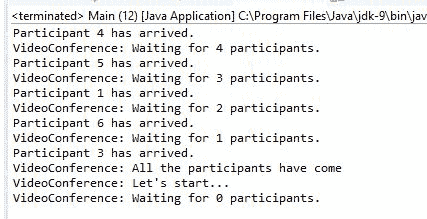
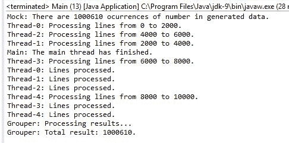
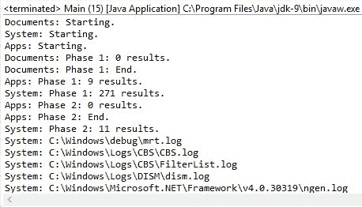
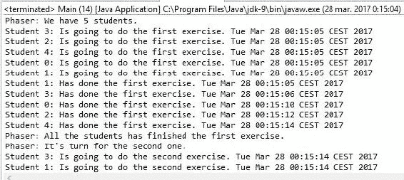
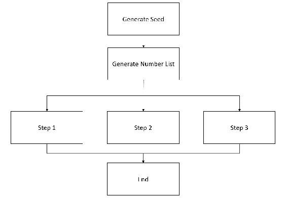
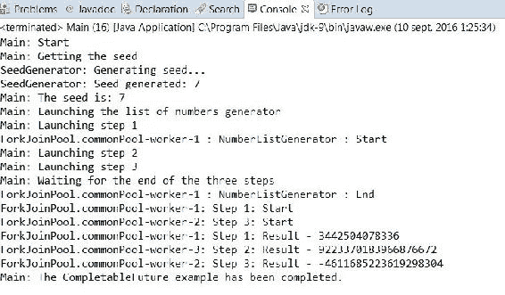

# 线程同步工具

在本章中，我们将涵盖以下主题：

+   控制对资源的一个或多个副本的并发访问

+   等待多个并发事件

+   在公共点同步任务

+   运行并发阶段任务

+   控制并发阶段任务的相变

+   在并发任务之间交换数据

+   异步完成和链接任务

# 简介

在第二章，“基本线程同步”中，你学习了同步和临界区的概念。基本上，当我们谈论同步时，是指多个并发任务共享一个资源，例如一个对象或对象的属性。访问这个共享资源的代码块被称为临界区。

如果你没有使用适当的机制，可能会得到错误的结果，数据不一致或错误条件。因此，我们必须采用 Java 语言提供的同步机制之一来避免这些问题。

第二章，“基本线程同步”，介绍了以下基本同步机制：

+   `synchronized`关键字

+   锁接口及其实现类：`ReentrantLock`、`ReentrantReadWriteLock.ReadLock`和`ReentrantReadWriteLock.WriteLock`

+   `StampedLock`类

在本章中，你将学习如何使用高级机制来同步多个线程。这些高级机制如下：

+   **信号量**：信号量是一个计数器，用于控制对一个或多个共享资源的访问。这种机制是并发编程的基本工具之一，并被大多数编程语言提供。

+   **CountDownLatch**：`CountDownLatch`类是 Java 语言提供的一种机制，允许一个线程等待多个操作的完成。

+   **CyclicBarrier**：`CyclicBarrier`类是 Java 语言提供的另一种机制，允许在公共点同步多个线程。

+   **Phaser**：`Phaser`类是 Java 语言提供的另一种机制，用于控制分阶段执行的并发任务。所有线程必须完成一个阶段，才能继续下一个阶段。

+   **Exchanger**：`Exchanger`类是 Java 语言提供的另一种机制，提供了两个线程之间数据交换的点。

+   **CompletableFuture**：`CompletableFuture`类提供了一种机制，其中一个或多个任务可以等待另一个任务完成，该任务将在未来的某个时刻以异步方式显式完成。这个类是在 Java 8 中引入的，并在 Java 9 中引入了新的方法。

信号量是通用的同步机制，您可以使用它来保护任何问题中的任何临界区。其他机制被认为适用于具有特定功能的应用程序，如前所述。请确保根据您应用程序的特性选择适当的机制。

本章介绍了七个食谱，将向您展示如何使用所描述的机制。

# 控制对资源的一个或多个副本的并发访问

在本食谱中，您将学习如何使用 Java 语言提供的信号量机制。信号量是一个保护对一个或多个共享资源访问的计数器。

信号量的概念由 Edsger Dijkstra 于 1965 年提出，并首次用于 THEOS 操作系统。

当一个线程想要访问共享资源之一时，它必须首先获取信号量。如果信号量的内部计数器大于 0，信号量会递减计数器并允许访问共享资源。计数器大于 0 表示有可用的资源，因此线程可以访问并使用其中一个。

否则，如果计数器为 0，信号量会将线程置于休眠状态，直到计数器大于 0。计数器中的 0 值表示所有共享资源都被其他线程使用，因此想要使用其中一个的线程必须等待直到其中一个变为空闲。

当线程完成对共享资源的使用后，它必须释放信号量，以便另一个线程可以访问资源。此操作会增加信号量的内部计数器。

在本食谱中，您将学习如何使用`Semaphore`类来保护多个资源副本。您将实现一个示例，该示例有一个打印队列，可以在三个不同的打印机上打印文档。

# 准备工作

本食谱的示例已使用 Eclipse IDE 实现。如果您使用 Eclipse 或 NetBeans 等其他 IDE，请打开它并创建一个新的 Java 项目。

# 如何实现...

按照以下步骤实现示例：

1.  创建一个名为`PrintQueue`的类，该类将实现打印队列：

```java
        public class PrintQueue {

```

1.  此类将具有三个私有属性。一个名为`semaphore`的信号量，一个名为`freePrinters`的布尔数组，以及一个名为`lockPrinters`的锁，如下代码片段所示：

```java
        private final Semaphore semaphore; 
        private final boolean freePrinters[]; 
        private final Lock lockPrinters;

```

1.  实现类的构造函数。它初始化类的三个属性，如下代码片段所示：

```java
        public PrintQueue(){ 
          semaphore=new Semaphore(3); 
          freePrinters=new boolean[3]; 
          for (int i=0; i<3; i++){ 
            freePrinters[i]=true; 
          } 
          lockPrinters=new ReentrantLock(); 
        }

```

1.  实现模拟打印文档的`printJob()`方法。它接收一个名为`document`的对象作为参数：

```java
        public void printJob (Object document){

```

1.  首先，`printJob()`方法调用`acquire()`方法以获取对信号量的访问权限。由于此方法可能会抛出`InterruptedException`异常，您必须包括处理它的代码：

```java
        try { 
          semaphore.acquire();

```

1.  然后，使用私有方法`getPrinter()`获取分配给打印此作业的打印机数量：

```java
        int assignedPrinter=getPrinter();

```

1.  然后，通过创建一个名为`Main`的类并实现`main()`方法来实现示例的主要类：

```java
        long duration=(long)(Math.random()*10); 
        System.out.printf("%s - %s: PrintQueue: Printing a Job in
                           Printer %d during %d seconds\n",
                          new Date(), Thread.currentThread().getName(),
                          assignedPrinter,duration);
        TimeUnit.SECONDS.sleep(duration);

```

1.  最后，通过调用`release()`方法释放信号量，并将使用的打印机标记为空闲，并将`true`赋值给`freePrinters`数组中相应的索引：

```java
          freePrinters[assignedPrinter]=true; 
        } catch (InterruptedException e) { 
          e.printStackTrace(); 
        } finally { 
          semaphore.release();       
        }

```

1.  接着，实现`getPrinter()`方法。这是一个私有方法，它返回一个`int`值，没有参数：

```java
        private int getPrinter() {

```

1.  首先，声明一个用于存储打印机索引的`int`变量：

```java
        int ret=-1;

```

1.  然后，获取对`lockPrinters`对象的访问权限：

```java
        try { 
          lockPrinters.lock();

```

1.  之后，在`freePrinters`数组中找到第一个真值，并将其索引保存到变量中。将此值修改为`false`，因为此打印机将忙碌：

```java
        for (int i=0; i<freePrinters.length; i++) { 
          if (freePrinters[i]){ 
            ret=i; 
            freePrinters[i]=false; 
            break; 
          } 
        }

```

1.  最后，释放`lockPrinters`对象并返回真值索引：

```java
        } catch (Exception e) { 
          e.printStackTrace(); 
        } finally { 
          lockPrinters.unlock(); 
        } 
        return ret;

```

1.  接着，创建一个名为`Job`的类，并指定它实现`Runnable`接口。此类实现了将文档发送到打印机的作业：

```java
        public class Job implements Runnable {

```

1.  `Semaphore`类有三种额外的`acquire()`方法版本：

```java
        private PrintQueue printQueue;

```

1.  实现类的构造函数。它初始化类中声明的`PrintQueue`对象：

```java
        public Job(PrintQueue printQueue){ 
          this.printQueue=printQueue; 
        }

```

1.  实现一个`run()`方法：

```java
        @Override 
          public void run() {

```

1.  首先，此方法向控制台写入一条消息，显示作业已开始执行：

```java
        System.out.printf("%s: Going to print a job\n",
                          Thread.currentThread().getName());

```

1.  然后，它调用`PrintQueue`对象的`printJob()`方法：

```java
        printQueue.printJob(new Object());

```

1.  首先，此方法向控制台写入一条消息，显示作业已开始执行：

```java
          System.out.printf("%s: The document has been printed\n",
                            Thread.currentThread().getName());         
        }

```

1.  然后，通过创建一个名为`Main`的类并实现`main()`方法来实现示例的主要类：

```java
        public class Main { 
          public static void main (String args[]){

```

1.  创建一个名为`printQueue`的`PrintQueue`对象：

```java
        PrintQueue printQueue=new PrintQueue();

```

1.  创建 12 个线程。每个线程将执行一个`Job`对象，该对象将发送文档到打印队列：

```java
        Thread[] threads=new Thread[12]; 
        for (int i=0; I < threads.length i++){ 
          thread[i]=new Thread(new Job(printQueue),"Thread"+i); 
        }

```

1.  最后，启动 12 个线程：

```java
        for (int i=0; I < threads.length; i++){ 
          thread[i].start(); 
        }

```

# 它是如何工作的...

之后，在`freePrinters`数组中找到第一个真值，并将其索引保存到变量中。将此值修改为`false`，因为此打印机将忙碌：

1.  首先，使用`acquire()`方法获取信号量。

1.  然后，对共享资源进行必要的操作。

1.  最后，使用`release()`方法释放信号量。

在此示例中，另一个重要点是`PrintQueue`类的构造函数和`Semaphore`对象的初始化。您将值`3`作为此构造函数的参数传递，因此您正在创建一个将保护三个资源的信号量。前三个调用`acquire()`方法的线程将获得此示例的关键部分访问权限，其余的将被阻塞。当一个线程完成关键部分并释放信号量时，另一个线程将获取它。

以下截图显示了此示例的执行输出：

实现类的构造函数。它初始化类中声明的`PrintQueue`对象：

你可以看到前三个打印作业是同时开始的。然后，当一个打印机完成其作业时，另一个打印机开始工作。

# 还有更多...

`Semaphore`类有三种额外的`acquire()`方法版本：

+   `acquireUninterruptibly()`: `acquire()` 方法，当信号量的内部计数器为 `0` 时，会阻塞线程直到信号量被释放。在此期间，线程可能会被中断；如果发生这种情况，该方法将抛出 `InterruptedException` 异常。这个版本的 `acquire` 操作忽略线程的中断，并且不会抛出任何异常。

+   `tryAcquire()`: 此方法尝试获取信号量。如果可以，它返回 `true` 值。但如果不能，它将返回 `false` 而不是被阻塞并等待信号量的释放。根据返回值采取正确的行动是您的责任。

+   `tryAcquire(long timeout, TimeUnit unit)`: 此方法与前面的方法等效，但它等待参数中指定的时间段的信号量。如果时间结束且方法尚未获取信号量，它将返回 `false`。

`acquire()`、`acquireUninterruptibly()`、`tryAcquire()` 和 `release()` 方法有一个额外的版本，它有一个 `int` 参数。此参数表示使用它们的线程想要获取或释放的许可证数量，换句话说，就是线程想要从信号量的内部计数器中删除或添加的单位数量。

在 `acquire()`、`acquireUninterruptibly()` 和 `tryAcquire()` 方法的案例中，如果计数器的值小于作为参数值传递的数字，线程将被阻塞，直到计数器达到相同的值或更大的值。

# 信号量的公平性

公平的概念被 Java 语言用于所有可能具有各种线程阻塞并等待同步资源（例如，信号量）释放的类。默认模式称为 **非公平模式**。在此模式下，当同步资源被释放时，会选择一个等待的线程并分配此资源；然而，选择是没有任何标准的。另一方面，公平模式改变了这种行为，并选择等待时间最长的线程。

就像其他类一样，`Semaphore` 类在其构造函数中接受一个第二个参数。此参数必须接受一个布尔值。如果您给它一个 `false` 值，您将创建一个在非公平模式下工作的信号量。如果您不使用此参数，您将获得相同的行为。如果您给它一个 `true` 值，您将创建一个在公平模式下工作的信号量。

# 参见

+   第九章 中 *监控锁接口* 的配方，*测试并发应用程序*

+   第二章 中 *使用锁同步代码块* 的配方，*基本线程同步*

# 等待多个并发事件

Java 并发 API 提供了一个允许一个或多个线程等待直到一组操作完成的类。它被称为`CountDownLatch`类。这个类使用一个整数初始化，这是线程将要等待的操作数。当线程想要等待这些操作的执行时，它使用`await()`方法。此方法将线程置于休眠状态，直到操作完成。当这些操作中的任何一个完成时，它使用`countDown()`方法来递减`CountDownLatch`类的内部计数器。当计数器到达`0`时，该类唤醒在`await()`方法中休眠的所有线程。

在这个菜谱中，你将学习如何使用`CountDownLatch`类来实现视频会议系统。视频会议系统应在开始之前等待所有参与者的到达：

# 准备中

本菜谱的示例已使用 Eclipse IDE 实现。如果你使用 Eclipse 或 NetBeans 等其他 IDE，请打开它并创建一个新的 Java 项目。

# 如何实现...

按照以下步骤实现示例：

1.  创建一个名为`Videoconference`的类，并指定它实现`Runnable`接口。这个类将实现视频会议系统：

```java
        public class Videoconference implements Runnable{

```

1.  声明一个名为`controller`的`CountDownLatch`对象：

```java
        private final CountDownLatch controller;

```

1.  实现类的构造函数，初始化`CountDownLatch`属性。`Videoconference`类将等待接收到的参与者数量到达：

```java
        public Videoconference(int number) { 
          controller=new CountDownLatch(number); 
        }

```

1.  实现参与者的`arrive()`方法。该方法将在每次参与者到达视频会议时被调用。它接收一个名为`name`的`String`类型参数：

```java
        public void arrive(String name){

```

1.  首先，它使用接收到的参数写一条消息：

```java
        System.out.printf("%s has arrived.",name);

```

1.  然后，它调用`CountDownLatch`对象的`countDown()`方法：

```java
        controller.countDown();

```

1.  最后，它使用`CountDownLatch`对象的`getCount()`方法写另一条消息，其中包含等待到达的参与者数量：

```java
        System.out.printf("VideoConference: Waiting for %d
                           participants.\n",controller.getCount());

```

1.  接下来，实现视频会议系统的`main`方法。这是每个`Runnable`对象必须有的`run()`方法：

```java
        @Override 
        public void run() {

```

1.  首先，使用`getCount()`方法写一条消息，其中包含视频会议中的参与者数量：

```java
        System.out.printf("VideoConference: Initialization: %d
                           participants.\n",controller.getCount());

```

1.  然后，使用`await()`方法等待所有参与者。由于此方法可能会抛出`InterruptedException`异常，你必须包括处理它的代码：

```java
        try { 
          controller.await();

```

1.  最后，写一条消息来表明所有参与者都已到达：

```java
          System.out.printf("VideoConference: All the participants have
                             come\n"); 
          System.out.printf("VideoConference: Let's start...\n"); 
        } catch (InterruptedException e) { 
          e.printStackTrace(); 
        }

```

1.  接下来，创建`Participant`类，并指定它实现`Runnable`接口。这个类代表视频会议中的每个参与者：

```java
        public class Participant implements Runnable {

```

1.  声明一个名为`conference`的私有`Videoconference`属性：

```java
        private Videoconference conference;

```

1.  声明一个名为`name`的私有`String`属性：

```java
        private String name;

```

1.  实现类的构造函数，初始化前面提到的两个属性：

```java
        public Participant(Videoconference conference, String name) { 
          this.conference=conference; 
          this.name=name; 
        }

```

1.  实现参与者的`run()`方法：

```java
        @Override 
        public void run() {

```

1.  首先，让线程随机休眠一段时间：

```java
        long duration=(long)(Math.random()*10); 
        try { 
          TimeUnit.SECONDS.sleep(duration); 
        } catch (InterruptedException e) { 
          e.printStackTrace(); 
        }

```

1.  然后，使用`Videoconference`对象的`arrive()`方法来指示这个参与者的到达：

```java
        conference.arrive(name);

```

1.  最后，通过创建一个名为`Main`的类并添加`main()`方法来实现示例的主类：

```java
        public class Main { 
          public static void main(String[] args) {

```

1.  接下来，创建一个名为`conference`的`Videoconference`对象，它等待 10 个参与者：

```java
        Videoconference conference=new Videoconference(10);

```

1.  创建`Thread`来运行这个`Videoconference`对象并启动它：

```java
        Thread threadConference=new Thread(conference); 
        threadConference.start();

```

1.  创建 10 个`Participant`对象，一个用于运行每个对象的`Thread`对象，并启动所有线程：

```java
        for (int i=0; i<10; i++){ 
          Participant p=new Participant(conference, "Participant "+i); 
          Thread t=new Thread(p); 
          t.start(); 
        }

```

# 它是如何工作的...

`CountDownLatch`类有三个基本元素：

+   决定`CountDownLatch`对象等待多少事件的初始化值

+   由等待所有事件最终化的线程调用的`await()`方法

+   当事件完成执行时调用的`countDown()`方法

当你创建一个`CountDownLatch`对象时，它使用构造函数的参数来初始化一个内部计数器。每次一个线程调用`countDown()`方法时，`CountDownLatch`对象将内部计数器减一。当内部计数器达到`0`时，`CountDownLatch`对象唤醒所有在`await()`方法中等待的线程。

没有办法重新初始化`CountDownLatch`对象的内部计数器或修改其值。一旦计数器初始化，你可以用来修改其值的唯一方法是前面解释过的`countDown()`方法。当计数器达到`0`时，所有对`await()`方法的调用将立即返回，并且所有后续对`countDown()`方法的调用都没有效果。

然而，与其他同步方法相比，有一些不同之处，如下所示：

+   `CountDownLatch`机制不是用来保护共享资源或临界区的。它是用来同步一个或多个线程与各种任务的执行。

+   它只允许一个用途。如前所述，一旦`CountDownLatch`的计数器达到`0`，对其方法的任何调用都将没有效果。如果你想再次进行相同的同步，你必须创建一个新的对象。

下面的截图显示了示例的执行输出：



你可以看到参与者是如何到达的，一旦内部计数器达到`0`，`CountDownLatch`对象就会唤醒写入消息的`Videoconference`对象，表明视频会议应该开始。

# 还有更多...

`CountDownLatch`类还有一个版本的`await()`方法，如下所示：

+   `await(long time, TimeUnit unit)`：在这个方法中，线程将继续睡眠，直到它被中断，即`CountDownLatch`的内部计数器达到`0`或指定的时长过去。`TimeUnit`类是一个枚举，具有以下常量：`DAYS`、`HOURS`、`MICROSECONDS`、`MILLISECONDS`、`MINUTES`、`NANOSECONDS`和`SECONDS`。

# 在一个共同点上同步任务

Java 并发 API 提供了一个同步实用工具，允许在确定点同步两个或更多线程。它是 `CyclicBarrier` 类。这个类与本章中 *等待多个并发事件* 食谱中解释的 `CountDownLatch` 类类似，但它有一些差异，使其成为一个更强大的类。

`CyclicBarrier` 类使用一个整数初始化，这是将在确定点同步的线程数。当这些线程中的任何一个到达确定点时，它调用 `await()` 方法等待其他线程。当线程调用此方法时，`CyclicBarrier` 类阻塞正在睡眠的线程，直到其他线程到达。当最后一个线程调用 `CyclicBarrier` 对象的 `await()` 方法时，它唤醒所有等待的线程并继续其工作。

`CyclicBarrier` 类的一个有趣的优势是，您可以传递一个额外的 `Runnable` 对象作为初始化参数，当所有线程到达共同点时，`CyclicBarrier` 类将执行此对象作为线程。这一特性使得这个类适合使用分而治之编程技术并行化任务。

在这个食谱中，您将学习如何使用 `CyclicBarrier` 类在确定点同步一组线程。您还将使用一个 `Runnable` 对象，该对象将在所有线程到达此点后执行。在示例中，您将在数字矩阵中寻找一个数字。矩阵将被分成子集（使用分而治之技术），因此每个线程将在一个子集中寻找数字。一旦所有线程完成各自的工作，一个最终任务将统一他们的结果。

# 准备工作

本食谱的示例使用 Eclipse IDE 实现。如果您使用 Eclipse 或其他 IDE，例如 NetBeans，请打开它并创建一个新的 Java 项目。

# 如何做这件事...

按照以下步骤实现示例：

1.  通过实现两个辅助类来开始示例。首先，创建一个名为 `MatrixMock` 的类。这个类将生成一个介于 1 和 10 之间的随机数字矩阵，线程将在其中寻找一个数字：

```java
        public class MatrixMock {

```

1.  声明一个名为 `data` 的私有 `int` 矩阵：

```java
        private final int data[][];

```

1.  实现类的构造函数。这个构造函数将接收矩阵的行数、每行的长度以及我们要寻找的数字作为参数。所有三个参数都是 `int` 类型：

```java
        public MatrixMock(int size, int length, int number){

```

1.  初始化在构造函数中使用的变量和对象：

```java
        int counter=0; 
        data=new int[size][length]; 
        Random random=new Random();

```

1.  用随机数字填充矩阵。每次生成一个数字时，将其与要寻找的数字进行比较。如果它们相等，增加计数器：

```java
        for (int i=0; i<size; i++) { 
          for (int j=0; j<length; j++){ 
            data[i][j]=random.nextInt(10); 
            if (data[i][j]==number){ 
              counter++; 
            } 
          } 
        }

```

1.  最后，在控制台打印一条消息，显示将在生成的矩阵中查找的数字的出现次数。此消息将用于检查线程是否得到正确的结果：

```java
        System.out.printf("Mock: There are %d ocurrences of number in
                           generated data.\n",counter,number);

```

1.  实现一个 `getRow()` 方法。此方法接收一个表示矩阵中行号的 `int` 参数；如果存在该行，则返回该行，如果不存在，则返回 `null`：

```java
        public int[] getRow(int row){ 
          if ((row>=0)&&(row<data.length)){ 
            return data[row]; 
          } 
          return null; 
        }

```

1.  现在实现一个名为 `Results` 的类。此类将存储在数组中，以存储矩阵每行中搜索数字的出现次数：

```java
        public class Results {

```

1.  声明一个名为 `data` 的私有 `int` 数组：

```java
        private final int data[];

```

1.  实现类的构造函数。此构造函数接收一个表示数组元素数量的整数参数：

```java
        public Results(int size){ 
          data=new int[size]; 
        }

```

1.  实现一个 `setData()` 方法。此方法接收一个数组位置和一个值作为参数，并设置数组中该位置的价值：

```java
        public void  setData(int position, int value){ 
          data[position]=value; 
        }

```

1.  实现一个 `getData()` 方法。此方法返回包含结果数组的数组：

```java
        public int[] getData(){ 
          return data; 
        }

```

1.  现在有了辅助类，是时候实现线程了。首先，实现 `Searcher` 类。此类将在随机数字矩阵的确定行中查找数字。创建一个名为 `Searcher` 的类，并指定它实现 `Runnable` 接口：

```java
        public class Searcher implements Runnable {

```

1.  声明两个私有 `int` 属性，即 `firstRow` 和 `lastRow`。这两个属性将确定此对象将搜索数字的行子集：

```java
        private final int firstRow; 
        private final int lastRow;

```

1.  声明一个名为 `mock` 的私有 `MatrixMock` 属性：

```java
        private final MatrixMock mock;

```

1.  声明一个名为 `results` 的私有 `Results` 属性：

```java
        private final Results results;

```

1.  声明一个名为 `number` 的私有 `int` 属性，该属性将存储将要查找的数字：

```java
        private final int number;

```

1.  声明一个名为 `barrier` 的 `CyclicBarrier` 对象：

```java
        private final CyclicBarrier barrier;

```

1.  实现类的构造函数，该构造函数初始化之前声明的所有属性：

```java
        public Searcher(int firstRow, int lastRow, MatrixMock mock,
                   Results results, int number, CyclicBarrier barrier){ 
          this.firstRow=firstRow; 
          this.lastRow=lastRow; 
          this.mock=mock; 
          this.results=results; 
          this.number=number; 
          this.barrier=barrier; 
        }

```

1.  实现一个 `run()` 方法，该方法将搜索数字。它使用一个名为 `counter` 的内部变量，该变量将存储每行中数字出现的次数：

```java
        @Override 
        public void run() { 
          int counter;

```

1.  在控制台打印一条消息，显示分配给此任务的任务行：

```java
        System.out.printf("%s: Processing lines from %d to %d.\n",
                          Thread.currentThread().getName(),
                          firstRow,lastRow);

```

1.  处理分配给此线程的所有行。对于每一行，计算要搜索的数字的出现次数，并将此数字存储在 `Results` 对象的相应位置：

```java
        for (int i=firstRow; i<lastRow; i++){ 
          int row[]=mock.getRow(i); 
          counter=0; 
          for (int j=0; j<row.length; j++){ 
            if (row[j]==number){ 
              counter++; 
            } 
          } 
          results.setData(i, counter); 
        }

```

1.  在控制台打印一条消息，指示此对象已完成搜索：

```java
        System.out.printf("%s: Lines processed.\n",
                          Thread.currentThread().getName());

```

1.  调用 `CyclicBarrier` 对象的 `await()` 方法，并添加必要的代码来处理此方法可能抛出的 `InterruptedException` 和 `BrokenBarrierException` 异常：

```java
        try { 
          barrier.await(); 
        } catch (InterruptedException e) { 
          e.printStackTrace(); 
        } catch (BrokenBarrierException e) { 
          e.printStackTrace(); 
        }

```

1.  现在实现一个计算矩阵中数字出现总数的类。此类使用存储矩阵每行中数字出现次数的 `Results` 对象来进行计算。创建一个名为 `Grouper` 的类，并指定它实现 `Runnable` 接口：

```java
        public class Grouper implements Runnable {

```

1.  声明一个名为 `results` 的私有 `Results` 属性：

```java
        private final Results results;

```

1.  实现类的构造函数，该构造函数初始化 `Results` 属性：

```java
        public Grouper(Results results){ 
          this.results=results; 
        }

```

1.  实现一个名为 `run()` 的方法，该方法将计算数组中数字出现的总次数：

```java
        @Override 
        public void run() {

```

1.  声明一个 `int` 变量并向控制台写入一条消息以指示过程的开始：

```java
        int finalResult=0; 
        System.out.printf("Grouper: Processing results...\n");

```

1.  使用 `results` 对象的 `getData()` 方法获取每行中数字的出现次数。然后，处理数组的所有元素并将它们的值添加到 `finalResult` 变量中：

```java
        int data[]=results.getData(); 
        for (int number:data){ 
          finalResult+=number; 
        }

```

1.  在控制台打印结果：

```java
        System.out.printf("Grouper: Total result: %d.\n", finalResult);

```

1.  最后，通过创建一个名为 `Main` 的类并添加 `main()` 方法来实现示例的主类：

```java
        public class Main { 
          public static void main(String[] args) {

```

1.  声明并初始化五个常量以存储应用程序的参数：

```java
        final int ROWS=10000; 
        final int NUMBERS=1000; 
        final int SEARCH=5;  
        final int PARTICIPANTS=5; 
        final int LINES_PARTICIPANT=2000;

```

1.  创建一个名为 `mock` 的 `MatrixMock` 对象。它将有 10,000 行，每行有 1,000 个元素。现在，你将搜索数字五：

```java
        MatrixMock mock=new MatrixMock(ROWS, NUMBERS,SEARCH);

```

1.  创建一个名为 `results` 的 `Results` 对象。它将有 10,000 个元素：

```java
        Results results=new Results(ROWS);

```

1.  创建一个名为 `grouper` 的 `Grouper` 对象：

```java
        Grouper grouper=new Grouper(results);

```

1.  创建一个名为 `barrier` 的 `CyclicBarrier` 对象。此对象将等待五个线程。当这五个线程完成时，它将执行之前创建的 `Grouper` 对象：

```java
        CyclicBarrier barrier=new CyclicBarrier(PARTICIPANTS,grouper);

```

1.  创建五个 `Searcher` 对象，五个线程来执行它们，并启动这五个线程：

```java
        Searcher searchers[]=new Searcher[PARTICIPANTS]; 
        for (int i=0; i<PARTICIPANTS; i++){ 
          searchers[i]=new Searcher(i*LINES_PARTICIPANT,
                               (i*LINES_PARTICIPANT)+LINES_PARTICIPANT,
                               mock, results, 5,barrier); 
          Thread thread=new Thread(searchers[i]); 
          thread.start(); 
        } 
        System.out.printf("Main: The main thread has finished.\n");

```

# 它是如何工作的...

以下截图显示了此示例的执行结果：



示例中解决的问题很简单。我们有一个由随机整数组成的大的矩阵，你想要知道这个矩阵中数字出现的总次数。为了获得更好的性能，我们使用了分而治之的技术。我们将矩阵分为五个子集，并使用一个线程在每个子集中查找数字。这些线程是 `Searcher` 类的对象。

我们使用 `CyclicBarrier` 对象来同步五个线程的完成，并执行 `Grouper` 任务以处理部分结果并计算最终结果。

如前所述，`CyclicBarrier` 类有一个内部计数器来控制需要到达同步点的线程数量。每次线程到达同步点时，它都会调用 `await()` 方法来通知 `CyclicBarrier` 对象一个线程已到达其同步点。`CyclicBarrier` 将线程置于休眠状态，直到所有线程都达到同步点。

当所有线程到达时，`CyclicBarrier` 对象唤醒在 `await()` 方法中等待的所有线程。可选地，它创建一个新的线程来执行在 `CyclicBarrier` 构造函数中作为参数传递的 `Runnable` 对象（在我们的情况下，是一个 `Grouper` 对象）以执行额外任务。

# 还有更多...

`CyclicBarrier` 类有另一个版本的 `await()` 方法：

+   `await(long time, TimeUnit unit)`: 在这个方法中，线程将继续休眠，直到它被中断，也就是说，要么`CyclicBarrier`的内部计数器达到`0`，要么指定的时长过去。`TimeUnit`类是一个枚举，具有以下常量：`DAYS`、`HOURS`、`MICROSECONDS`、`MILLISECONDS`、`MINUTES`、`NANOSECONDS`和`SECONDS`。

这个类还提供了`getNumberWaiting()`方法，它返回在`await()`方法中被阻塞的线程数，以及`getParties()`方法，它返回将要与`CyclicBarrier`同步的任务数。

# 重置 CyclicBarrier 对象

`CyclicBarrier`类与`CountDownLatch`类有一些共同点，但它们也有一些不同之处。最重要的不同之处在于，一个`CyclicBarrier`对象可以被重置到其初始状态，将其内部计数器设置为初始化时的值。

这个重置操作可以使用`CyclicBarrier`类的`reset()`方法来完成。当发生这种情况时，所有在`await()`方法中等待的线程都会收到`BrokenBarrierException`异常。这个异常在本配方中通过打印堆栈跟踪来处理；然而，在一个更复杂的应用程序中，它可能执行其他操作，例如重新启动执行或恢复到中断时的操作点。

# 损坏的 CyclicBarrier 对象

一个`CyclicBarrier`对象可以处于一个特殊状态，称为损坏状态。当有多个线程在`await()`方法中等待时，其中一个线程被中断，中断的线程会收到`InterruptedException`异常，但其他线程会收到`BrokenBarrierException`异常；`CyclicBarrier`被置于损坏状态。

`CyclicBarrier`类提供了`isBroken()`方法。如果对象处于损坏状态，则返回`true`；否则返回`false`。

# 参见

+   本章中的*等待多个并发事件*配方

# 运行并发阶段任务

Java 并发 API 提供的最复杂和强大的功能之一是使用`Phaser`类执行并发阶段任务的能力。这种机制在我们有一些被分为步骤的并发任务时非常有用。`Phaser`类为我们提供了一种机制，在每一步结束时同步线程，因此没有线程会开始第二步，直到所有线程都完成了第一步。

与其他同步工具一样，我们必须使用参与同步操作的任务数量来初始化`Phaser`类，但我们可以通过增加或减少这个数字来动态地修改这个数字。

在这个菜谱中，你将学习如何使用`Phaser`类来同步三个并发任务。这三个任务在三个不同的文件夹及其子文件夹中查找扩展名为`.log`且在过去 24 小时内修改的文件。此任务分为三个步骤：

1.  获取指定文件夹及其子文件夹中扩展名为`.log`的文件列表。

1.  通过删除 24 小时前修改的文件来过滤第一步创建的列表。

1.  在控制台打印结果。

在步骤 1 和步骤 2 结束时，我们检查列表中是否有任何元素。如果没有，线程结束其执行并被从`Phaser`类中删除。

# 准备工作

这个菜谱的示例是用 Eclipse IDE 实现的。如果你使用 Eclipse 或 NetBeans 等其他 IDE，打开它并创建一个新的 Java 项目。

# 如何做到这一点...

按照以下步骤实现示例：

1.  创建一个名为`FileSearch`的类，并指定它实现`Runnable`接口。此类实现了在文件夹及其子文件夹中搜索具有指定扩展名且在过去 24 小时内修改的文件的操作：

```java
        public class FileSearch implements Runnable {

```

1.  声明一个私有的`String`属性来存储搜索操作将开始的文件夹：

```java
        private final String initPath;

```

1.  声明另一个私有的`String`属性来存储我们将要查找的文件的扩展名：

```java
        private final String fileExtension

```

1.  声明一个私有的`List`属性来存储我们将找到具有所需特征的文件的完整路径：

```java
        private List<String> results;

```

1.  最后，声明一个私有的`Phaser`属性来控制任务不同阶段的同步：

```java
        private Phaser phaser;

```

1.  接下来，实现类的构造函数，该构造函数将初始化类的属性。它接收初始文件夹的完整路径作为参数，文件的扩展名，以及`phaser`：

```java
        public FileSearch(String initPath, String fileExtension,
                          Phaser phaser) { 
          this.initPath = initPath; 
          this.fileExtension = fileExtension; 
          this.phaser=phaser; 
          results=new ArrayList<>(); 
        }

```

1.  现在，实现一些辅助方法，这些方法将由`run()`方法使用。第一个是`directoryProcess()`方法。它接收一个`File`对象作为参数，并处理所有文件和子文件夹。对于每个文件夹，该方法将递归调用，并将文件夹作为参数传递。对于每个文件，该方法将调用`fileProcess()`方法：

```java
        private void directoryProcess(File file) { 

          File list[] = file.listFiles(); 
          if (list != null) { 
            for (int i = 0; i < list.length; i++) { 
              if (list[i].isDirectory()) { 
                directoryProcess(list[i]); 
              } else { 
                fileProcess(list[i]); 
              } 
            } 
          } 
        }

```

1.  然后，实现`fileProcess()`方法。它接收一个`File`对象作为参数，并检查其扩展名是否与我们正在寻找的扩展名相等。如果它们相等，此方法将文件的绝对路径添加到结果列表中：

```java
        private void fileProcess(File file) { 
          if (file.getName().endsWith(fileExtension)) { 
            results.add(file.getAbsolutePath()); 
          } 
        }

```

1.  现在实现`filterResults()`方法。它不接受任何参数，并过滤第一阶段获取的文件列表；删除 24 小时前修改的文件。首先，创建一个新的空列表并获取实际日期：

```java
        private void filterResults() { 
          List<String> newResults=new ArrayList<>(); 
          long actualDate=new Date().getTime();

```

1.  然后，遍历结果列表中的所有元素。对于结果列表中的每个路径，为文件创建一个`File`对象并获取其最后修改日期：

```java
        for (int i=0; i<results.size(); i++){ 
          File file=new File(results.get(i)); 
          long fileDate=file.lastModified();

```

1.  然后，将此日期与实际日期进行比较，如果差异小于 1 天，则将文件的完整路径添加到新的结果列表中：

```java
          if (actualDate-fileDate< TimeUnit.MILLISECONDS
                                        .convert(1,TimeUnit.DAYS)){ 
            newResults.add(results.get(i)); 
          } 
        }

```

1.  最后，将旧的结果列表更改为新的列表：

```java
          results=newResults; 
        }

```

1.  接下来，实现 `checkResults()` 方法。此方法将在第一和第二阶段结束时被调用，并检查结果列表是否为空。此方法没有任何参数：

```java
        private boolean checkResults() {

```

1.  首先，检查结果列表的大小。如果为 0，对象将向控制台写入一条消息表示这一点。之后，它调用 `Phaser` 对象的 `arriveAndDeregister()` 方法来通知此线程已完成实际阶段，并离开分阶段操作：

```java
        if (results.isEmpty()) { 
          System.out.printf("%s: Phase %d: 0 results.\n",
                            Thread.currentThread().getName(),
                            phaser.getPhase()); 
          System.out.printf("%s: Phase %d: End.\n",
                            Thread.currentThread().getName(),
                            phaser.getPhase()); 
          phaser.arriveAndDeregister(); 
          return false;

```

1.  如果结果列表有元素，对象将向控制台写入一条消息表示这一点。然后，它调用 `Phaser` 对象的 `arriveAndAwaitAdvance()` 方法来通知此线程已完成实际阶段，并希望被阻塞，直到分阶段操作中的所有参与者线程完成实际阶段：

```java
          } else { 
            System.out.printf("%s: Phase %d: %d results.\n",
                              Thread.currentThread().getName(),
                              phaser.getPhase(),results.size()); 
            phaser.arriveAndAwaitAdvance(); 
            return true; 
          }
        }

```

1.  最后一个辅助方法是 `showInfo()` 方法，它将结果列表的元素打印到控制台：

```java
        private void showInfo() { 
          for (int i=0; i<results.size(); i++){ 
            File file=new File(results.get(i)); 
            System.out.printf("%s: %s\n",
                               Thread.currentThread().getName(),
                               file.getAbsolutePath()); 
          } 
          phaser.arriveAndAwaitAdvance(); 
        }

```

1.  是时候实现 `run()` 方法了，该方法使用前面描述的辅助方法执行操作。我们还将实现 `Phaser` 对象来控制阶段之间的转换。首先，调用 `Phaser` 对象的 `arriveAndAwaitAdvance()` 方法。搜索不会开始，直到所有线程都已创建：

```java
        @Override 
        public void run() { 
          phaser.arriveAndAwaitAdvance();

```

1.  然后，向控制台写入一条消息，指示搜索任务的开始：

```java
        System.out.printf("%s: Starting.\n",
                          Thread.currentThread().getName());

```

1.  检查 `initPath` 属性是否存储文件夹的名称，并使用 `directoryProcess()` 方法在该文件夹及其所有子文件夹中查找指定扩展名的文件：

```java
        File file = new File(initPath); 
        if (file.isDirectory()) { 
          directoryProcess(file); 
        }

```

1.  使用 `checkResults()` 方法检查是否有任何结果。如果没有结果，使用 `return` 关键字结束线程的执行：

```java
        if (!checkResults()){ 
          return; 
        }

```

1.  使用 `filterResults()` 方法过滤结果列表：

```java
        filterResults();

```

1.  再次使用 `checkResults()` 方法检查是否有任何结果。如果没有结果，使用 `return` 关键字结束线程的执行：

```java
        if (!checkResults()){ 
          return; 
        }

```

1.  使用 `showInfo()` 方法将最终结果列表打印到控制台，注销线程，并打印一条消息，指示线程的最终化：

```java
        showInfo(); 
        phaser.arriveAndDeregister(); 
        System.out.printf("%s: Work completed.\n",
                          Thread.currentThread().getName());

```

1.  现在，通过创建一个名为 `Main` 的类并添加 `main()` 方法来实现示例的主要类：

```java
        public class Main { 
          public static void main(String[] args) {

```

1.  创建一个具有三个参与者的 `Phaser` 对象：

```java
        Phaser phaser=new Phaser(3);

```

1.  创建三个 `FileSearch` 对象，每个对象使用不同的初始文件夹。查找具有 `.log` 扩展名的文件：

```java
        FileSearch system=new FileSearch("C:\\Windows", "log", phaser); 
        FileSearch apps= new FileSearch("C:\\Program Files",
                                        "log",phaser); 
        FileSearch documents= new FileSearch("C:\\Documents And Settings",
                                             "log",phaser);

```

1.  创建并启动一个线程来执行第一个 `FileSearch` 对象：

```java
        Thread systemThread=new Thread(system,"System"); 
        systemThread.start();

```

1.  创建并启动一个线程来执行第二个 `FileSearch` 对象：

```java
        Thread appsThread=new Thread(apps,"Apps"); 
        appsThread.start();

```

1.  创建并启动一个线程来执行第三个 `FileSearch` 对象：

```java
        Thread documentsThread=new Thread(documents, "Documents"); 
        documentsThread.start();

```

1.  等待三个线程的最终化：

```java
        try { 
          systemThread.join(); 
          appsThread.join(); 
          documentsThread.join(); 
        } catch (InterruptedException e) { 
          e.printStackTrace(); 
        }

```

1.  使用 `isFinalized()` 方法写入 `Phaser` 对象的已最终化标志的值：

```java
        System.out.println("Terminated: "+ phaser.isTerminated());

```

# 它是如何工作的...

程序开始创建一个 `Phaser` 对象，该对象将在每个阶段的末尾控制线程的同步。`Phaser` 的构造函数接收参与者数量作为参数。在我们的例子中，`Phaser` 有三个参与者。这个数字表示 `Phaser` 需要执行 `arriveAndAwaitAdvance()` 方法的线程数量，在 `Phaser` 能够更改阶段并唤醒休眠的线程之前。

一旦创建了 `Phaser`，我们就启动三个线程，这些线程使用三个不同的 `FileSearch` 对象来执行。

在这个例子中，我们使用 Windows 操作系统的路径。如果你使用的是其他操作系统，请修改路径以适应你环境中现有的路径，例如 `/var/log` 或类似路径。

这个 `FileSearch` 对象的 `run()` 方法中的第一条指令是调用 `Phaser` 对象的 `arriveAndAwaitAdvance()` 方法。如前所述，`Phaser` 知道我们想要同步的线程数量。当一个线程调用此方法时，`Phaser` 会减少需要最终确定实际阶段的线程数量，并将此线程置于休眠状态，直到所有剩余的线程完成此阶段。在 `run()` 方法的开始处调用此方法确保在所有线程创建之前，没有任何 `FileSearch` 线程开始工作。

在第一阶段和第二阶段结束时，我们检查阶段是否生成了结果以及结果列表是否有元素，或者阶段没有生成结果且列表为空。在第一种情况下，`checkResults()` 方法调用前面解释过的 `arriveAndAwaitAdvance()` 方法。在第二种情况下，如果列表为空，线程继续执行就没有意义了，因此它结束执行。但是你必须通知 `Phaser` 对象将有一个参与者减少。为此，我们使用了 `arriveAndDeregister()`。这通知 `phaser` 线程已经完成了实际阶段，但不会参与未来的阶段，因此 `phaser` 不必等待它继续。

在 `showInfo()` 方法中实现的第三阶段结束时，有一个调用 `phaser` 的 `arriveAndAwaitAdvance()` 方法的调用。通过这个调用，我们保证所有线程同时完成。当此方法执行完毕时，有一个调用 `phaser` 的 `arriveAndDeregister()` 方法的调用。通过这个调用，我们注销 `phaser` 的线程，如前所述，因此当所有线程完成时，`phaser` 将没有参与者。

最后，`main()` 方法等待三个线程完成，并调用 `phaser` 的 `isTerminated()` 方法。当 `phaser` 的参与者为零时，它进入所谓的终止状态，并且此方法返回 `true`。当我们注销 `phaser` 的所有线程时，它将处于终止状态，并且此调用将 `true` 打印到控制台。

一个 `Phaser` 对象可以处于两种状态：

+   **活动**：当`Phaser`接受新参与者的注册并在每个阶段的末尾进行同步时，它会进入此状态。在此状态下，`Phaser`的工作方式如本食谱中所述。此状态在 Java 并发 API 中未提及。

+   **终止**：默认情况下，当`Phaser`中的所有参与者都已注销时，`Phaser`进入此状态，这意味着它没有参与者。此外，当`onAdvance()`方法返回`true`时，`Phaser`处于终止状态。如果你重写此方法，你可以更改默认行为。当`Phaser`处于此状态时，同步方法`arriveAndAwaitAdvance()`会立即返回，而不执行任何同步操作。

`Phaser`类的一个显著特点是，你不必控制与`phaser`相关的方法抛出的任何异常。与其他同步工具不同，在`phaser`中休眠的线程不会响应中断事件，也不会抛出`InterruptedException`异常。只有一个例外，将在下一节中解释。

以下截图显示了示例的一次执行结果：



它显示了执行的前两个阶段。你可以看到`Apps`线程在第二阶段完成其执行，因为其结果列表为空。当你执行示例时，你会看到一些线程在其余线程之前完成一个阶段，并且它们在所有线程完成一个阶段之前等待，然后继续执行。

# 还有更多...

`Phaser`类提供了其他与阶段变化相关的方法。这些方法如下：

+   `arrive()`: 此方法通知`Phaser`类一个参与者已完成实际阶段，但它不应等待其余参与者继续执行。在使用此方法时要小心，因为它不与其他线程同步。

+   `awaitAdvance(int phase)`: 此方法使当前线程休眠，直到`phaser`参数的所有参与者完成当前阶段，也就是说，如果我们传递的参数数等于`phaser`的实际阶段。如果参数和`phaser`的实际阶段不相等，该方法将结束其执行。

+   `awaitAdvanceInterruptibly(int phaser)`: 此方法与前面解释的方法相同，但如果在此方法中休眠的线程被中断，则会抛出`InterruptedException`异常。

# 在`Phaser`中注册参与者

当你创建一个`Phaser`对象时，你指定将有多少参与者拥有该`phaser`。但`Phaser`类有两个方法来增加`phaser`的参与者数量。这些方法如下：

+   `register()`: 此方法向`Phaser`添加一个新参与者。这个新参与者将被视为尚未到达实际阶段。

+   `bulkRegister(int Parties)`: 此方法将指定的参与者数量添加到`phaser`中。这些新参与者将被视为尚未到达实际阶段。

`Phaser`类提供的唯一用于减少参与者数量的方法是`arriveAndDeregister()`方法，它通知`phaser`线程已完成实际阶段，并且不想继续进行分阶段操作。

# 强制终止 Phaser

当`phaser`没有参与者时，它会进入一个被称为终止的状态。`Phaser`类提供了`forceTermination()`方法来改变`phaser`的状态，并使其独立于在`phaser`中注册的参与者数量而进入终止状态。这种机制在参与者之一出现错误情况时可能很有用，此时最好的做法是终止`phaser`。

当`phaser`处于终止状态时，`awaitAdvance()`和`arriveAndAwaitAdvance()`方法立即返回一个负数，而不是通常返回的正数。如果你知道你的`phaser`可能会被终止，你应该验证这些方法（`awaitAdvance()`和`arriveAndAwaitAdvance()`）的返回值，以了解`phaser`是否已被终止。

# 相关内容

+   在第九章的*监控 Phaser 类*菜谱中，*测试并发应用程序*，你可以找到更多相关信息。

# 控制并发分阶段任务中的阶段变化

`Phaser`类提供了一个在`phaser`改变阶段时执行的方法。它是`onAdvance()`方法。它接收两个参数：当前阶段的数量和注册的参与者数量。如果`Phaser`继续执行，则返回一个布尔值`false`；如果`Phaser`已完成并需要进入终止状态，则返回`true`。

此方法的默认实现如果注册的参与者数量为零则返回`true`，否则返回`false`。但如果你扩展了`Phaser`类并重写了此方法，你可以修改这种行为。通常，当你需要在从一个阶段过渡到下一个阶段时执行一些操作时，你会有兴趣这样做。

在这个菜谱中，你将学习如何控制实现`Phaser`类并重写`onAdvance()`方法以在每个阶段变化时执行一些操作的`phaser`中的阶段变化。你将实现一个考试模拟，其中将有一些学生需要完成三个练习。所有学生必须完成一个练习后才能进行下一个练习。

# 准备工作

此菜谱的示例已使用 Eclipse IDE 实现。如果你使用 Eclipse 或 NetBeans 等其他 IDE，请打开它并创建一个新的 Java 项目。

# 如何做到这一点...

按照以下步骤实现示例：

1.  创建一个名为`MyPhaser`的类，并指定它从`Phaser`类扩展：

```java
        public class MyPhaser extends Phaser {

```

1.  覆盖`onAdvance()`方法。根据`phase`属性的值，我们调用不同的辅助方法。如果`phase`属性等于零，你必须调用`studentsArrived()`方法。如果`phase`等于一，你必须调用`finishFirstExercise()`方法。如果`phase`等于二，你必须调用`finishSecondExercise()`方法。最后，如果`phase`等于三，你必须调用`finishExam()`方法。否则，返回 true 值以指示`phaser`已终止：

```java
        @Override 
        protected boolean onAdvance(int phase, int registeredParties) { 
          switch (phase) { 
            case 0: 
              return studentsArrived(); 
            case 1: 
              return finishFirstExercise(); 
            case 2: 
              return finishSecondExercise(); 
            case 3: 
              return finishExam(); 
            default: 
              return true; 
          } 
        }

```

1.  实现辅助方法`studentsArrived()`。它向控制台写入两条日志消息，并返回 false 以指示`phaser`正在继续其执行：

```java
        private boolean studentsArrived() { 
          System.out.printf("Phaser: The exam are going to start.
                             The students are ready.\n"); 
          System.out.printf("Phaser: We have %d students.\n",
                            getRegisteredParties()); 
          return false; 
        }

```

1.  实现辅助方法`finishFirstExercise()`。它向控制台写入两条消息，并返回 false 以指示`phaser`正在继续其执行：

```java
        private boolean finishFirstExercise() { 
          System.out.printf("Phaser: All the students have finished the
                             first exercise.\n"); 
          System.out.printf("Phaser: It's time for the second one.\n"); 
          return false; 
        }

```

1.  实现辅助方法`finishSecondExercise()`。它向控制台写入两条消息，并返回 false 以指示`phaser`正在继续其执行：

```java
        private boolean finishSecondExercise() { 
          System.out.printf("Phaser: All the students have finished the
                             second exercise.\n"); 
          System.out.printf("Phaser: It's time for the third one.\n"); 
          return false; 
        }

```

1.  实现辅助方法`finishExam()`。它向控制台写入两条消息，并返回 true 以指示`phaser`已完成其工作：

```java
        private boolean finishExam() { 
          System.out.printf("Phaser: All the students have finished
                             the exam.\n"); 
          System.out.printf("Phaser: Thank you for your time.\n"); 
          return true; 
        }

```

1.  创建一个名为`Student`的类，并指定它实现`Runnable`接口。此类将模拟考试的学生：

```java
        public class Student implements Runnable {

```

1.  声明一个名为`phaser`的`Phaser`对象：

```java
        private Phaser phaser;

```

1.  实现类的构造函数，初始化`Phaser`对象：

```java
        public Student(Phaser phaser) { 
          this.phaser=phaser; 
        }

```

1.  实现模拟考试实现的`run()`方法：

```java
        @Override 
        public void run() {

```

1.  首先，该方法向控制台写入一条消息，指示学生已到达考场，并调用`phaser`的`arriveAndAwaitAdvance()`方法等待其他线程：

```java
        System.out.printf("%s: Has arrived to do the exam. %s\n",
                          Thread.currentThread().getName(),new Date()); 
        phaser.arriveAndAwaitAdvance();

```

1.  然后，向控制台写入一条消息，并调用模拟考试第一题实现的私有`doExercise1()`方法。之后，再向控制台写入另一条消息，并调用`phaser`的`arriveAndAwaitAdvance()`方法等待其他学生完成第一题：

```java
        System.out.printf("%s: Is going to do the first exercise.%s\n",
                          Thread.currentThread().getName(),new Date()); 
        doExercise1(); 
        System.out.printf("%s: Has done the first exercise.%s\n",
                          Thread.currentThread().getName(),new Date()); 
        phaser.arriveAndAwaitAdvance();

```

1.  为第二题和第三题实现相同的代码：

```java
        System.out.printf("%s: Is going to do the second exercise. 
                          %s\n",Thread.currentThread().getName(),
                          new Date()); 
        doExercise2(); 
        System.out.printf("%s: Has done the second exercise.%s\n",
                          Thread.currentThread().getName(),new Date()); 
        phaser.arriveAndAwaitAdvance(); 
        System.out.printf("%s: Is going to do the third exercise.%s\n",
                          Thread.currentThread().getName(),new Date()); 
        doExercise3(); 
        System.out.printf("%s: Has finished the exam.%s\n",
                          Thread.currentThread().getName(),new Date()); 
        phaser.arriveAndAwaitAdvance();

```

1.  实现辅助方法`doExercise1()`。此方法使当前线程或执行方法的线程随机休眠一段时间：

```java
        private void doExercise1() { 
          try { 
            long duration=(long)(Math.random()*10); 
            TimeUnit.SECONDS.sleep(duration); 
          } catch (InterruptedException e) { 
            e.printStackTrace(); 
          } 
        }

```

1.  实现辅助方法`doExercise2()`。此方法使当前线程或执行方法的线程随机休眠一段时间：

```java
        private void doExercise2() { 
          try { 
            long duration=(long)(Math.random()*10); 
            TimeUnit.SECONDS.sleep(duration); 
          } catch (InterruptedException e) { 
            e.printStackTrace(); 
          } 
        }

```

1.  实现辅助方法`doExercise3()`。此方法使线程随机休眠一段时间：

```java
        private void doExercise3() { 
          try { 
            long duration=(long)(Math.random()*10); 
            TimeUnit.SECONDS.sleep(duration); 
          } catch (InterruptedException e) { 
            e.printStackTrace(); 
          } 
        }

```

1.  通过创建一个名为`Main`的类并添加`main()`方法来实现示例的主类：

```java
        public class Main { 
          public static void main(String[] args) {

```

1.  创建一个`MyPhaser`对象：

```java
        MyPhaser phaser=new MyPhaser();

```

1.  创建五个`Student`对象，并使用`register()`方法将它们注册到`phaser`属性中：

```java
        Student students[]=new Student[5]; 
        for (int i=0; i<students.length; i++){ 
          students[i]=new Student(phaser); 
          phaser.register(); 
        }

```

1.  创建五个线程来运行学生并启动它们：

```java
        Thread threads[]=new Thread[students.length]; 
        for (int i=0; i<students.length; i++){ 
          threads[i]=new Thread(students[i],"Student "+i); 
          threads[i].start(); 
        }

```

1.  等待五个线程的最终化：

```java
        for (int i=0; i<threads.length; i++){ 
          try { 
            threads[i].join(); 
          } catch (InterruptedException e) { 
            e.printStackTrace(); 
          } 
        }

```

1.  使用 `isTerminated()` 方法写一条消息来显示 `phaser` 处于终止状态：

```java
        System.out.printf("Main: The phaser has finished: %s.\n",
                          phaser.isTerminated());

```

# 它是如何工作的...

这个练习模拟了实现一个包含三项练习的考试。所有学生必须完成一项练习后才能开始下一项。为了实现这个同步要求，我们使用了 `Phaser` 类；然而，在这种情况下，您实现了自己的 `phaser`，通过扩展原始类来重写 `onAdvance()` 方法。

在 `Phaser` 在 `arriveAndAwaitAdvance()` 方法中唤醒所有休眠的线程之前，该方法被 `Phaser` 调用并改变阶段。该方法由作为 `arriveAndAwaitAdvance()` 方法代码一部分的最后一个完成阶段的线程调用。该方法接收实际阶段的数字作为参数，其中 0 是第一个阶段的数字和注册的参与者数量。最有用的参数是实际阶段。如果您根据实际阶段执行不同的操作，您必须使用替代结构（`if...else` 或 `switch`）来选择要执行的操作。在示例中，我们使用 `switch` 结构来选择每个阶段变化时不同的方法。

`onAdvance()` 方法返回一个布尔值，表示 `phaser` 是否已终止。如果 `phaser` 返回 `false`，则表示它尚未终止；如果发生这种情况，线程将继续执行其他阶段的操作。如果 `phaser` 返回 `true`，则 `phaser` 仍然会唤醒挂起的线程，但将 `phaser` 移至终止状态。因此，所有未来对 `phaser` 任何方法的调用都将立即返回，并且 `isTerminated()` 方法将返回 `true`。

在 `Main` 类中，当您创建 `MyPhaser` 对象时，您没有指定 `phaser` 中的参与者数量。您为每个创建的 `Student` 对象调用 `register()` 方法来在 `phaser` 中注册一个参与者。这种调用并不在 `Student` 对象或执行它的线程与 `phaser` 之间建立关系。实际上，`phaser` 中的参与者数量只是一个数字。`phaser` 与参与者之间没有关系。

以下截图显示了此示例的执行结果：



您可以看到学生们完成第一项练习的不同时间。当所有学生都完成第一项练习后，`phaser` 调用 `onAdvance()` 方法在控制台写入日志消息，然后所有学生同时开始第二项练习。

# 参见

+   本章的 *Running concurrent-phased tasks* 菜谱

+   在第九章 *Testing Concurrent Applications* 的 *Monitoring a Phaser class* 菜谱中

# 在并发任务之间交换数据

Java 并发 API 提供了一个同步实用工具，允许两个并发任务之间交换数据。更详细地说，`Exchanger` 类允许您在两个线程之间定义一个同步点。当两个线程到达这个点时，它们交换一个数据结构，使得第一个线程的数据结构传递给第二个线程，反之亦然。

在类似生产者-消费者问题的场景中，此类可能非常有用。这是一个经典并发问题，其中有一个公共的数据缓冲区，一个或多个数据生产者，以及一个或多个数据消费者。由于 `Exchanger` 类仅同步两个线程，因此如果您有一个只有一个生产者和一个消费者的生产者-消费者问题，则可以使用它。

在本例中，您将学习如何使用 `Exchanger` 类解决一个生产者和一个消费者之间的生产者-消费者问题。

# 准备工作

本例的示例已使用 Eclipse IDE 实现。如果您使用 Eclipse 或其他 IDE，例如 NetBeans，请打开它并创建一个新的 Java 项目。

# 如何实现...

按照以下步骤实现示例：

1.  首先，开始实现生产者。创建一个名为 `Producer` 的类并指定它实现 `Runnable` 接口：

```java
        public class Producer implements Runnable {

```

1.  声明一个名为 `buffer` 的 `List<String>` 字段。这将是一个生产者与消费者之间交换数据的数据结构：

```java
        private List<String> buffer;

```

1.  声明一个名为 `exchanger` 的 `Exchanger<List<String>>` 字段。这将是一个用于同步生产者和消费者的交换器对象：

```java
        private final Exchanger<List<String>> exchanger;

```

1.  实现类的构造函数以初始化两个属性：

```java
        public Producer (List<String> buffer, Exchanger<List<String>>
                         exchanger){ 
          this.buffer=buffer; 
          this.exchanger=exchanger; 
        }

```

1.  实现方法 `run()`。在其内部，实现 10 次交换循环：

```java
        @Override 
        public void run() { 
          for (int cycle = 1; cycle <= 10; cycle++){ 
            System.out.printf("Producer: Cycle %d\n",cycle);

```

1.  在每个循环中，向缓冲区添加 10 个字符串：

```java
        for (int j=0; j<10; j++){ 
          String message="Event "+(((cycle-1)*10)+j); 
          System.out.printf("Producer: %s\n",message); 
          buffer.add(message); 
        }

```

1.  调用 `exchange()` 方法与消费者交换数据。由于此方法可能会抛出 `InterruptedException` 异常，您必须添加一些代码来处理它。

```java
        try { 
          buffer=exchanger.exchange(buffer); 
        } catch (InterruptedException e) { 
          e.printStackTrace(); 
        } 
          System.out.println("Producer: "+buffer.size()); 
        }

```

1.  现在，实现消费者。创建一个名为 `Consumer` 的类并指定它实现 `Runnable` 接口：

```java
        public class Consumer implements Runnable {

```

1.  声明一个名为 `buffer` 的 `List<String>` 字段。这将是一个生产者与消费者之间交换数据的数据结构：

```java
        private List<String> buffer;

```

1.  声明一个名为 `exchanger` 的 `Exchanger<List<String>>` 字段。这将是一个用于同步生产者和消费者的 `exchanger` 对象：

```java
        private final Exchanger<List<String>> exchanger;

```

1.  实现类的构造函数以初始化两个属性：

```java
        public Consumer(List<String> buffer, Exchanger<List<String>>
                        exchanger){ 
          this.buffer=buffer; 
          this.exchanger=exchanger; 
        }

```

1.  实现方法 `run()`。在其内部，实现 10 次交换循环：

```java
        @Override 
        public void run() { 
          for (int cycle=1; cycle <= 10; cycle++){ 
            System.out.printf("Consumer: Cycle %d\n",cycle);

```

1.  在每个循环中，首先调用 `exchange()` 方法以与生产者同步。消费者需要数据来消费。由于此方法可能会抛出 `InterruptedException` 异常，您必须添加一些代码来处理它：

```java
        try { 
          buffer=exchanger.exchange(buffer); 
        } catch (InterruptedException e) { 
          e.printStackTrace(); 
        }

```

1.  将生产者发送到其缓冲区的 10 个字符串写入控制台，并从缓冲区中删除它们以使其为空：

```java
          System.out.println("Consumer: "+buffer.size()); 
          for (int j=0; j<10; j++){ 
            String message=buffer.get(0); 
            System.out.println("Consumer: "+message); 
            buffer.remove(0); 
          } 
        }

```

1.  现在，通过创建一个名为 `Main` 的类并添加 `main()` 方法来实现示例的 `main` 类：

```java
        public class Main { 
          public static void main(String[] args) {

```

1.  创建两个缓冲区，这些缓冲区将被生产者和消费者使用：

```java
        List<String> buffer1=new ArrayList<>(); 
        List<String> buffer2=new ArrayList<>();

```

1.  创建用于同步生产者和消费者的`Exchanger`对象：

```java
        Exchanger<List<String>> exchanger=new Exchanger<>();

```

1.  创建`Producer`和`Consumer`对象：

```java
        Producer producer=new Producer(buffer1, exchanger); 
        Consumer consumer=new Consumer(buffer2, exchanger);

```

1.  创建执行生产者和消费者的线程并启动线程：

```java
        Thread threadProducer=new Thread(producer); 
        Thread threadConsumer=new Thread(consumer); 

        threadProducer.start(); 
        threadConsumer.start();

```

# 它是如何工作的...

消费者从一个空的缓冲区开始，并调用`Exchanger`来与生产者同步。它需要数据来消费。生产者从一个空的缓冲区开始执行。它创建了 10 个字符串，将它们存储在缓冲区中，并使用`Exchanger`来与消费者同步。

到目前为止，两个线程（生产者和消费者）都在`Exchanger`中，它改变了数据结构。因此，当消费者从`exchange()`方法返回时，它将有一个包含 10 个字符串的缓冲区。当生产者从`exchange()`方法返回时，它将有一个空的缓冲区来再次填充。这个操作将被重复 10 次。

如果你执行这个示例，你会看到生产者和消费者如何并发地完成他们的工作，以及两个对象在每一步中如何交换它们的缓冲区。正如其他同步工具所发生的那样，第一个调用`exchange()`方法的线程将被置于休眠状态，直到其他线程到达。

# 还有更多...

`Exchanger`类有一个`exchange`方法的另一个版本：`exchange(V data, long time, TimeUnit unit)`。其中，`V`是用于`Phaser`声明（在我们的情况下是`List<String>`）的参数类型。线程将休眠，直到它被中断，另一个线程到达，或者指定的时长过去。在这种情况下，将抛出`TimeoutException`。`TimeUnit`类是一个枚举，具有以下常量：`DAYS`、`HOURS`、`MICROSECONDS`、`MILLISECONDS`、`MINUTES`、`NANOSECONDS`和`SECONDS`。

# 异步完成和链接任务

Java 8 并发 API 通过`CompletableFuture`类引入了一种新的同步机制。这个类实现了`Future`对象和`CompletionStage`接口，使其具有以下两个特性：

+   作为`Future`对象，`CompletableFuture`对象将在未来某个时间返回一个结果

+   作为`CompletionStage`对象，你可以在一个或多个`CompletableFuture`对象完成之后执行更多的异步任务

你可以用不同的方式与`CompletableFuture`类一起工作：

+   你可以显式创建一个`CompletableFuture`对象，并将其用作任务之间的同步点。一个任务将使用`complete()`方法设置`CompletableFuture`返回的值，而其他任务将使用`get()`或`join()`方法等待这个值。

+   你可以使用`CompletableFuture`类的静态方法使用`runAsync()`和`supplyAsync()`方法来执行`Runnable`或`Supplier`。这些方法将返回一个`CompletableFuture`对象，当这些任务完成执行时，该对象将被完成。在第二种情况下，`Supplier`返回的值将是`CompletableFuture`的完成值。

+   你可以在一个或多个`CompletableFuture`对象完成之后，异步地指定其他要执行的任务。这个任务可以实现`Runnable`、`Function`、`Consumer`或`BiConsumer`接口。

这些特性使得`CompletableFuture`类非常灵活和强大。在本章中，你将学习如何使用这个类来组织不同的任务。示例的主要目的是任务将按照以下图示执行：



首先，我们将创建一个生成种子的任务。使用这个种子，下一个任务将生成一组随机数字。然后，我们将执行三个并行任务：

1.  第一步将在一组随机数字中计算出最接近 1,000 的数字。

1.  第二步将在一组随机数字中计算出最大的数字。

1.  第三步将在一组随机数字中计算出最大和最小数字之间的平均值。

# 准备工作

本示例的食谱已经使用 Eclipse IDE 实现。如果你使用 Eclipse 或 NetBeans 等其他 IDE，请打开它并创建一个新的 Java 项目。

# 如何做到这一点...

按照以下步骤实现示例：

1.  首先，我们将实现示例中将要使用的辅助任务。创建一个名为`SeedGenerator`的类，该类实现了`Runnable`接口。它将有一个`CompletableFuture`对象作为属性，并在类的构造函数中初始化：

```java
        public class SeedGenerator implements Runnable { 

          private CompletableFuture<Integer> resultCommunicator; 

          public SeedGenerator (CompletableFuture<Integer> completable) { 
            this.resultCommunicator=completable; 
          }

```

1.  然后，实现`run()`方法。它将使当前线程休眠 5 秒（以模拟长时间操作），计算 1 到 10 之间的随机数，然后使用`resultCommunicator`对象的`complete()`方法来完成`CompletableFuture`：

```java
        @Override 
        public void run() { 

          System.out.printf("SeedGenerator: Generating seed...\n"); 
          // Wait 5 seconds 
          try { 
            TimeUnit.SECONDS.sleep(5); 
          } catch (InterruptedException e) { 
            e.printStackTrace(); 
          } 
            int seed=(int) Math.rint(Math.random() * 10); 

            System.out.printf("SeedGenerator: Seed generated: %d\n",
                              seed); 

            resultCommunicator.complete(seed); 
          }

```

1.  创建一个名为`NumberListGenerator`的类，该类实现了以`List<Long>`数据类型参数化的`Supplier`接口。这意味着由`Supplier`接口提供的`get()`方法将返回一个包含大数字的列表。这个类将有一个整数作为私有属性，该属性将在类的构造函数中初始化：

```java
        public class NumberListGenerator implements Supplier<List<Long>> { 

          private final int size; 

          public NumberListGenerator (int size) { 
            this.size=size; 
          }

```

1.  然后，实现`get()`方法，该方法将返回一个包含数百万个数字的列表，如较大随机数字的大小参数所指定：

```java
          @Override 
          public List<Long> get() { 
            List<Long> ret = new ArrayList<>(); 
            System.out.printf("%s : NumberListGenerator : Start\n",
                              Thread.currentThread().getName()); 

            for (int i=0; i< size*1000000; i++) { 
              long number=Math.round(Math.random()*Long.MAX_VALUE); 
              ret.add(number); 
            } 
            System.out.printf("%s : NumberListGenerator : End\n",
                              Thread.currentThread().getName()); 

            return ret; 
          }

```

1.  最后，创建一个名为`NumberSelector`的类，该类实现了以`List<Long>`和`Long`数据类型参数化的`Function`接口。这意味着由`Function`接口提供的`apply()`方法将接收一个包含大数字的列表，并将返回一个`Long`数字：

```java
        public class NumberSelector implements Function<List<Long>, Long> { 

          @Override 
          public Long apply(List<Long> list) { 

            System.out.printf("%s: Step 3: Start\n",
                              Thread.currentThread().getName()); 
            long max=list.stream().max(Long::compare).get(); 
            long min=list.stream().min(Long::compare).get(); 
            long result=(max+min)/2; 
            System.out.printf("%s: Step 3: Result - %d\n",
                              Thread.currentThread().getName(), result); 
            return result; 
          } 
        }

```

1.  现在是时候实现`Main`类和`main()`方法了：

```java
        public class Main { 
          public static void main(String[] args) {

```

1.  首先，创建一个`CompletableFuture`对象和一个`SeedGenerator`任务，并将其作为一个`Thread`执行：

```java
        System.out.printf("Main: Start\n"); 
        CompletableFuture<Integer> seedFuture = new CompletableFuture<>(); 
        Thread seedThread = new Thread(new SeedGenerator(seedFuture)); 
        seedThread.start();

```

1.  然后，使用`CompletableFuture`对象的`get()`方法等待由`SeedGenerator`任务生成的种子：

```java
        System.out.printf("Main: Getting the seed\n"); 
        int seed = 0; 
        try { 
          seed = seedFuture.get(); 
        } catch (InterruptedException | ExecutionException e) { 
          e.printStackTrace(); 
        } 
        System.out.printf("Main: The seed is: %d\n", seed);

```

1.  现在创建另一个`CompletableFuture`对象来控制`NumberListGenerator`任务的执行，但在这个情况下，使用静态方法`supplyAsync()`：

```java
        System.out.printf("Main: Launching the list of numbers
                           generator\n"); 
        NumberListGenerator task = new NumberListGenerator(seed); 
        CompletableFuture<List<Long>> startFuture = CompletableFuture
                                                    .supplyAsync(task);

```

1.  然后，配置三个并行化的任务，这些任务将基于前一个任务生成的数字列表进行计算。这三个步骤不能开始执行，直到`NumberListGenerator`任务完成其执行，因此我们使用前一步生成的`CompletableFuture`对象和`thenApplyAsync()`方法来配置这些任务。前两个步骤以函数式的方式实现，第三个步骤是一个`NumberSelector`类的对象：

```java
        System.out.printf("Main: Launching step 1\n"); 
        CompletableFuture<Long> step1Future = startFuture
                                              .thenApplyAsync(list -> { 
          System.out.printf("%s: Step 1: Start\n",
                            Thread.currentThread().getName()); 
          long selected = 0; 
          long selectedDistance = Long.MAX_VALUE; 
          long distance; 
          for (Long number : list) { 
            distance = Math.abs(number - 1000); 
            if (distance < selectedDistance) { 
              selected = number; 
              selectedDistance = distance; 
            } 
          } 
          System.out.printf("%s: Step 1: Result - %d\n",
                            Thread.currentThread().getName(), selected); 
          return selected; 
        }); 

        System.out.printf("Main: Launching step 2\n"); 
        CompletableFuture<Long> step2Future = startFuture 
        .thenApplyAsync(list -> list.stream().max(Long::compare).get()); 

        CompletableFuture<Void> write2Future = step2Future
                                              .thenAccept(selected -> { 
          System.out.printf("%s: Step 2: Result - %d\n",
                            Thread.currentThread().getName(), selected); 
        }); 

        System.out.printf("Main: Launching step 3\n"); 
        NumberSelector numberSelector = new NumberSelector(); 
        CompletableFuture<Long> step3Future = startFuture
                                        .thenApplyAsync(numberSelector);

```

1.  我们使用`CompletableFuture`类的`allOf()`静态方法等待三个并行步骤的最终完成：

```java
        System.out.printf("Main: Waiting for the end of the three
                           steps\n"); 
        CompletableFuture<Void> waitFuture = CompletableFuture
                                      .allOf(step1Future, write2Future,
                                             step3Future);

```

1.  此外，我们执行一个最终步骤，在控制台写入一条消息：

```java
        CompletableFuture<Void> finalFuture = waitFuture
                                           .thenAcceptAsync((param) -> { 
          System.out.printf("Main: The CompletableFuture example has
                             been completed."); 
        }); 
        finalFuture.join();

```

# 它是如何工作的...

我们可以使用一个`CompletableFuture`对象实现两个主要目的：

+   等待未来将产生的值或事件（创建一个对象并使用`complete()`和`get()`或`join()`方法）。

+   为了按确定顺序执行一系列任务，确保一个或多个任务不会在其它任务完成执行之前开始执行。

在这个例子中，我们使用了`CompletableFuture`类的两种用法。首先，我们创建了这个类的实例，并将其作为参数发送给一个`SeedGenerator`任务。这个任务使用`complete()`方法发送计算值，而`main()`方法使用`get()`方法获取值。`get()`方法将当前线程挂起，直到`CompletableFuture`完成。

然后，我们使用了`supplyAsync()`方法来生成一个`CompletableFuture`对象。此方法接收一个`Supplier`接口的实现作为参数。该接口提供了一个必须返回值的`get()`方法。`supplyAsync()`方法返回`CompletableFuture`，当`get()`方法完成执行时将完成；完成值是该方法返回的值。返回的`CompletableFuture`对象将由`ForkJoinPool`中的任务执行，该任务返回静态方法`commonPool()`。

然后，我们使用了`thenApplyAsync()`方法来链接一些任务。你需要在`CompletableFuture`对象中调用此方法，并且必须传递一个实现了`Function`接口的实现作为参数，该参数可以直接使用函数式风格或独立对象在代码中表达。一个强大的特性是，由`CompletableFuture`生成的值将被传递给`Function`作为参数。也就是说，在我们的情况下，所有三个步骤都将接收一个随机数字列表作为参数。返回的`CompletableFuture`类将由`ForkJoinPool`中的任务执行，该任务返回静态方法`commonPool()`。

最后，我们使用了`CompletableFuture`类的`allOf()`静态方法来等待各种任务的最终化。此方法接收一个可变数量的`CompletableFuture`对象列表，并返回一个`CompletableFuture`类，当所有作为参数传递的`CompletableFuture`类完成时，它将被完成。我们还使用了`thenAcceptAsync()`方法作为同步任务的另一种方式，因为此方法接收`Consumer`作为参数，当使用`CompletableFuture`对象调用该方法时，默认执行器将执行它。最后，我们使用了`join()`方法来等待最后一个`CompletableFuture`对象的最终化。

以下截图显示了示例的执行。你可以看到任务是如何按照我们组织的顺序执行的：



# 更多...

在这个食谱的示例中，我们使用了`CompletableFuture`类的`complete()`、`get()`、`join()`、`supplyAsync()`、`thenApplyAsync()`、`thenAcceptAsync()`和`allOf()`方法。然而，这个类有很多有用的方法，有助于提高这个类的功能和灵活性。这些是最有趣的：

+   完成完成`CompletableFuture`对象的方法：除了`complete()`方法之外，`CompletableFuture`类还提供了以下三个方法：

    +   `cancel()`: 这个方法使用`CancellationException`异常来完成`CompletableFuture`。

    +   `completeAsync()`: 这个方法使用作为参数传递的`Supplier`对象的结果来完成`CompletableFuture`。默认情况下，`Supplier`对象会在不同的线程中由执行器执行。

    +   `completeExceptionally()`: 这个方法使用作为参数传递的异常来完成`CompletableFuture`。

+   执行任务的方法：除了`supplyAsync()`方法之外，`CompletableFuture`类还提供了以下方法：

    +   `runAsync()`: 这是`CompletableFuture`类的一个静态方法，它返回一个`CompletableFuture`对象。当将`Runnable`接口作为参数传递以完成其执行时，此对象将被完成。它将以空结果完成。

+   同步不同任务执行的方法：除了 `allOf()`、`thenAcceptAsync()` 和 `thenApplyAsync()` 方法外，`CompletableFuture` 类还提供了以下方法来同步任务的执行：

    +   `anyOf()`: 这是 `CompletableFuture` 类的静态方法。它接收一个 `CompletableFuture` 对象的列表，并返回一个新的 `CompletableFuture` 对象。此对象将使用第一个完成的 `CompletableFuture` 参数的结果来完成。

    +   `runAfterBothAsync()`: 这个方法接收 `CompletionStage` 和 `Runnable` 对象作为参数，并返回一个新的 `CompletableFuture` 对象。当 `CompletableFuture`（执行调用）和 `CompletionStage`（作为参数接收）完成时，`Runnable` 对象将由默认执行器执行，然后返回的 `CompletableFuture` 对象完成。

    +   `runAfterEitherAsync()`: 这个方法与上一个方法类似，但在这里，`Runnable` 接口在两个（`CompletableFuture` 或 `CompletionStage`）中的任何一个完成之后执行。

    +   `thenAcceptBothAsync()`: 这个方法接收 `CompletionStage` 和 `BiConsumer` 对象作为参数，并返回 `CompetableFuture` 作为参数。当 `CompletableFuture`（执行调用）和 `CompletionStage`（作为参数传递），`BiConsumer` 由默认执行器执行。它接收两个 `CompletionStage` 对象的结果作为参数，但它不会返回任何结果。当 `BiConsumer` 完成其执行时，返回的 `CompletableFuture` 类将完成，但没有结果。

    +   `thenCombineAsync()`: 这个方法接收一个 `CompletionStage` 对象和一个 `BiFunction` 对象作为参数，并返回一个新的 `CompletableFuture` 对象。当 `CompletableFuture`（执行调用）和 `CompletionStage`（作为参数传递）完成时，`BiFunction` 对象将被执行；它接收两个对象的完成值，并返回一个新的结果，该结果将成为返回的 `CompletableFuture` 类的完成值。

    +   `thenComposeAsync()`: 这个方法类似于 `thenApplyAsync()`，但当提供的函数也返回 `CompletableFuture` 时，它非常有用。

    +   `thenRunAsync()`: 这个方法类似于 `thenAcceptAsync()` 方法，但在这个情况下，它接收一个 `Runnable` 对象作为参数，而不是 `Consumer` 对象。

+   获取完成值的方法：除了 `get()` 和 `join()` 方法外，`CompletableFuture` 对象还提供了以下方法来获取完成值：

    +   `getNow()`: 这个方法接收与 `CompletableFuture` 完成值相同类型的值。如果对象已完成，它将返回完成值。否则，它将返回作为参数传递的值。

# 参见...

+   *创建线程执行器及其控制拒绝的任务* 和 *在返回结果的执行器中执行任务* 这两个配方在 第四章，*线程执行器* 中介绍。
