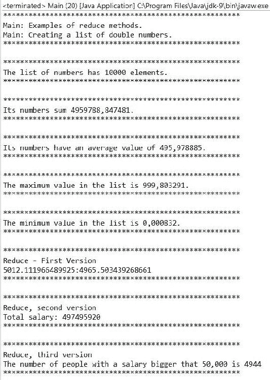
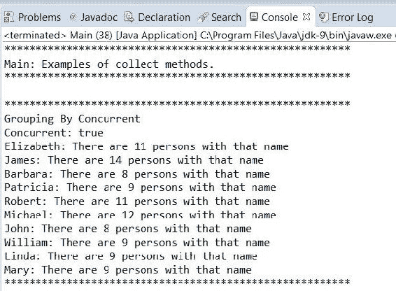
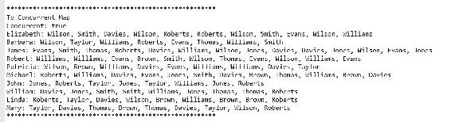
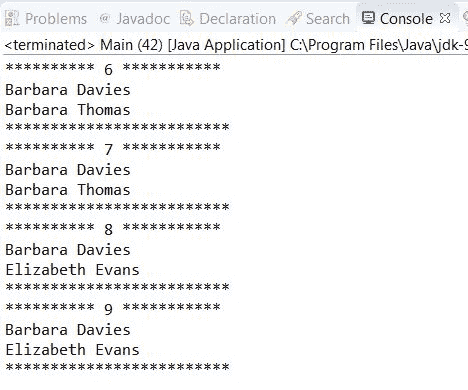
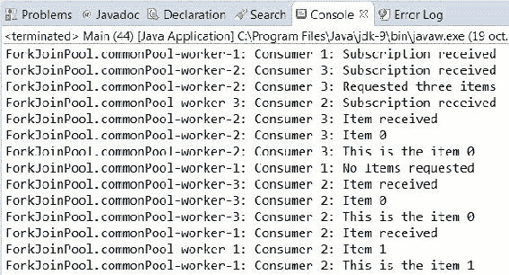

# 第六章：并行和响应式流

在本章中，我们将介绍以下食谱：

+   从不同的源创建流

+   归约流中的元素

+   收集流中的元素

+   对流中的每个元素应用操作

+   过滤流中的元素

+   转换流中的元素

+   排序流中的元素

+   验证流中元素的条件

+   使用响应式流的响应式编程

# 简介

Java 中的**流**是一系列可以按声明性操作（映射、过滤、转换、归约和收集）处理的元素序列，使用**lambda 表达式**以顺序或并行方式。它在 Java 8 中引入，是该版本最显著的新特性之一，与 lambda 表达式一起。它们改变了你在 Java 中处理大量元素的方式，优化了语言处理这些元素的方式。

流引入了`Stream`、`DoubleStream`、`IntStream`和`LongStream`接口，一些实用类如`Collectors`或`StreamSupport`，一些类似函数式的接口如`Collector`，以及在不同类中的许多方法，例如`Collection`接口中的`stream()`或`parallelStream()`方法，或者`Files`类中的`lines()`方法。

通过本章的食谱，你将学习如何在你的应用程序中有效地使用流，但在那之前，让我们看看流最重要的特性：

+   流是一系列数据，而不是数据结构。数据元素由流处理，但不存储在其中。

+   你可以从不同的源创建流，例如集合（列表、数组等）、文件和字符串，或者通过创建一个提供流元素的类。

+   你不能访问流中的单个元素。你定义流的源和想要对其元素应用的操作。流操作以函数式方式定义，你可以在中间和终端操作中使用 lambda 表达式来定义你想要执行的操作。

+   你不能修改流的源。例如，如果你过滤了流中的某些元素，你是在跳过流上的元素，而不是其源。

+   流定义了两种类型的操作：

+   **中间操作**：这些操作总是产生一个包含其结果的新流。它们可以用来转换、过滤和排序流中的元素。

+   **终端操作**：这些操作处理流中的所有元素以生成一个结果或副作用。执行后，流不能再使用。

+   流管道由零个或多个中间操作和一个最终操作组成。

+   中间操作可以是以下几种：

+   **无状态**：处理流中的元素与其他元素无关。例如，根据条件过滤一个元素。

+   **有状态**：处理流中的元素依赖于流中的其他元素。例如，对流的元素进行排序。

+   **惰性**：中间操作是惰性的。它们不会在终端操作开始执行之前执行。如果 Java 检测到中间操作不会影响操作的最后结果，它可以避免对流的元素或元素集合执行中间操作。

+   `Stream`可以有无限数量的元素。有一些操作，如`limit()`或`findFirst()`，可以用来限制在最终计算中使用的元素。由于中间操作是惰性的，无界流可以在有限的时间内完成其执行。

+   流只能使用一次。正如我们之前提到的，当流的终端操作执行时，流被认为是消耗掉的，不能再使用。如果你需要再次处理相同的数据以生成不同的结果，你必须从相同的源创建一个新的`Stream`对象。如果你尝试使用已消耗的流，你会得到一个异常。

+   你可以不费任何额外努力以顺序或并行方式处理流中的元素。你可以多次指定流的执行模式，但只有最后一次将被考虑。你必须小心选择模式。有状态的中间操作不会使用并发的所有可能性。

Java 9 引入了一种新的流类型——响应式流，允许你以异步方式与生产者和消费者通信。本章介绍了九种食谱，将教会你如何创建流并使用它们的所有中间和终端操作以并行和函数式的方式处理大量数据集。

# 从不同的源创建流

在这个食谱中，你将学习如何从不同的源创建流。你有不同的选项，如下所示：

+   `Collection`接口的`parallelStream()`方法

+   `Supplier`接口

+   预定义的元素集合

+   `File`和一个目录

+   一个数组

+   随机数生成器

+   两个不同流的连接

你可以从其他源（将在“更多内容”部分中描述）创建`Stream`对象，但我们认为这些更有用。

# 准备工作

本食谱的示例是使用 Eclipse IDE 实现的。如果你使用 Eclipse 或其他 IDE，如 NetBeans，请打开它并创建一个新的 Java 项目。

# 如何实现...

在这个食谱中，我们将实现一个示例，你将学习如何从前面描述的源创建流。按照以下步骤实现示例：

1.  首先，我们将实现一些辅助类，我们将在示例中使用这些类。创建一个名为`Person`的类，具有六种不同类型的属性：`String`、`int`、`double`和`Date`：

```java
        public class Person implements Comparable<Person> { 

          private int id; 
          private String firstName; 
          private String lastName; 
          private Date birthDate; 
          private int salary; 
          private double coeficient;

```

1.  创建设置和获取这些属性值的`set`和`get`方法。实现`comparteTo()`方法来比较两个`Person`对象。让我们考虑两个人员相同，如果他们有相同的`firstName`和相同的`lastName`：

```java
          public int compareTo(Person otherPerson) { 
            int compareLastNames = this.getLastName().compareTo
                                        (otherPerson.getLastName()); 
            if (compareLastNames != 0) { 
              return compareLastNames; 
            } else { 
            return this.getFirstName().compareTo
                                        (otherPerson.getFirstName()); 
          } 
        }

```

1.  然后，创建一个名为`PersonGenerator`的类来创建一个随机的`Person`对象列表。在这个类中实现一个名为`generatePersonList()`的静态方法，该方法接收要生成的人员的数量，并返回一个包含指定人员数量的`List<Person>`对象。这里包括这个方法的版本，但你可以自由地更改它：

```java
        public class PersonGenerator { 

          public static List<Person> generatePersonList (int size) { 
            List<Person> ret = new ArrayList<>(); 

            String firstNames[] = {"Mary","Patricia","Linda",
                                   "Barbara","Elizabeth","James",
                                   "John","Robert","Michael",
                                   "William"}; 
            String lastNames[] = {"Smith","Jones","Taylor",
                                  "Williams","Brown","Davies",
                                  "Evans","Wilson","Thomas",
                                  "Roberts"}; 

            Random randomGenerator=new Random(); 
            for (int i=0; i<size; i++) { 
              Person person=new Person(); 
              person.setId(i); 
              person.setFirstName(firstNames[randomGenerator
                                             .nextInt(10)]); 
              person.setLastName(lastNames[randomGenerator
                                           .nextInt(10)]); 
              person.setSalary(randomGenerator.nextInt(100000)); 
              person.setCoeficient(randomGenerator.nextDouble()*10); 
              Calendar calendar=Calendar.getInstance(); 
              calendar.add(Calendar.YEAR, -randomGenerator
                                                 .nextInt(30)); 
              Date birthDate=calendar.getTime(); 
              person.setBirthDate(birthDate); 
              ret.add(person); 
            } 
            return ret; 
          }

```

1.  现在，创建一个名为`MySupplier`的类，并指定它实现了参数化为`String`类的`Supplier`接口：

```java
        public class MySupplier implements Supplier<String> {

```

1.  声明一个名为`counter`的私有`AtomicInteger`属性，并在类的构造函数中初始化它：

```java
        private final AtomicInteger counter; 
        public MySupplier() { 
          counter=new AtomicInteger(0); 
        }

```

1.  实现定义在`Supplier`接口中的`get()`方法。此方法将返回流的下一个元素：

```java
          @Override 
          public String get() { 
            int value=counter.getAndAdd(1); 
            return "String "+value; 
          } 
        }

```

1.  现在，创建一个名为`Main`的类并在其中实现`main()`方法：

```java
        public class Main { 
          public static void main(String[] args) {

```

1.  首先，我们将从元素列表中创建一个`Stream`对象。创建一个名为`PersonGenerator`的类来创建 10,000 个`Person`对象的列表，并使用`List`对象的`parallelStream()`方法创建`Stream`。然后，使用`Stream`对象的`count()`方法获取流的元素数量：

```java
        System.out.printf("From a Collection:\n"); 
        List<Person> persons=PersonGenerator.generatePersonList(10000); 
        Stream<Person> personStream=persons.parallelStream();        
        System.out.printf("Number of persons: %d\n",
                          personStream.count());

```

1.  然后，我们将从生成器创建一个`Stream`。创建`MySupplier`类的对象。然后，使用`Stream`类的静态方法`generate()`，将创建的对象作为参数传递以创建流。最后，使用`parallel()`方法将创建的流转换为并行流，使用`limit()`方法获取流的第一个十个元素，并使用`forEach()`方法打印流的元素：

```java
        System.out.printf("From a Supplier:\n"); 
        Supplier<String> supplier=new MySupplier(); 
        Stream<String> generatorStream=Stream.generate(supplier); 
        generatorStream.parallel().limit(10).forEach(s->
                                           System.out.printf("%s\n",s));

```

1.  然后，我们将从一个预定义的元素列表中创建一个流。使用`Stream`类的静态`of()`方法来创建`Stream`。此方法接收一个可变数量的参数。在这种情况下，我们将传递三个`String`对象。然后，使用流的`parallel()`方法将其转换为并行流，并使用`forEach()`方法在控制台打印值：

```java
        System.out.printf("From a predefined set of elements:\n"); 
        Stream<String> elementsStream=Stream.of("Peter","John","Mary"); 
        elementsStream.parallel().forEach(element ->
                                    System.out.printf("%s\n", element));

```

1.  现在，我们将创建一个流来读取文件的行。首先，创建一个`BufferedReader`对象来读取你想要读取的文件。然后，使用`BufferedReader`类的`lines()`方法获取一个`String`对象的流。此流的每个元素都将是从文件中的行。最后，使用`parallel()`方法获取流的并行版本，并使用`count()`方法获取`Stream`的元素数量。我们还需要关闭`BufferedReader`对象：

```java
        System.out.printf("From a File:\n"); 
        try (BufferedReader br = new BufferedReader(new
                                 FileReader("data\\nursery.data"));) {                                    Stream<String> fileLines = br.lines(); 
          System.out.printf("Number of lines in the file: %d\n\n",
                            fileLines.parallel().count()); 
          System.out.printf("********************************
                             ************************\n"); 
          System.out.printf("\n"); 
          br.close(); 
        } catch (FileNotFoundException e) { 
          e.printStackTrace(); 
        } catch (IOException e) { 
          e.printStackTrace(); 
        }

```

1.  现在，我们将创建一个`Stream`来处理文件夹的内容。首先，使用`Files`类的`list()`方法获取包含文件夹内容的`Path`对象流。然后，使用`Stream`对象的`parallel()`方法将其转换为并行流，并使用`count()`方法来计算其元素数量。最后，在这种情况下，我们必须使用`close()`方法来关闭 Stream：

```java
        System.out.printf("From a Directory:\n"); 
        try { 
          Stream<Path> directoryContent = Files.list(Paths.get
                                    (System.getProperty("user.home"))); 
          System.out.printf("Number of elements (files and
                             folders):%d\n\n",
                            directoryContent.parallel().count()); 
          directoryContent.close(); 
          System.out.printf("********************************
                             ************************\n"); 
          System.out.printf("\n"); 
        } catch (IOException e) { 
          e.printStackTrace();
        }

```

1.  我们接下来要使用的是`Array`。首先，创建一个字符串数组。然后，使用`Arrays`类的`stream()`方法从数组的元素创建一个流。最后，使用`parallel()`方法将流转换为并行流，并使用`forEach()`方法将流中的元素打印到控制台：

```java
        System.out.printf("From an Array:\n"); 
        String array[]={"1","2","3","4","5"}; 
        Stream<String> streamFromArray=Arrays.stream(array); 
        streamFromArray.parallel().forEach(s->System.out.printf("%s : ",
                                                                s));

```

1.  现在，我们将创建一个随机双精度浮点数流。首先，创建一个`Random`对象。然后，使用`doubles()`方法创建一个`DoubleStream`对象。我们将传递数字`10`作为该方法的参数，因此我们将创建一个包含十个元素的流。最后，使用`parallel()`方法将流转换为并行流，使用`peek()`方法将每个元素写入控制台，使用`average()`方法计算流中值的平均值，并使用`getAsDouble()`方法获取由`average()`方法返回的`Optional`对象中存储的值：

```java
        Random random = new Random(); 
        DoubleStream doubleStream = random.doubles(10); 
        double doubleStreamAverage = doubleStream.parallel().peek
                                     (d -> System.out.printf("%f :",d))
                                     .average().getAsDouble();

```

1.  最后，我们将创建一个连接两个流的流。首先，使用`Stream`类的`of()`方法创建两个`String`对象流。然后，使用`Stream`类的`concat()`方法将那些流连接成一个唯一的流。最后，使用`Stream`类的`parallel()`方法将流转换为并行流，并使用`forEach()`方法将所有元素写入控制台：

```java
        System.out.printf("Concatenating streams:\n"); 
        Stream<String> stream1 = Stream.of("1", "2", "3", "4"); 
        Stream<String> stream2 = Stream.of("5", "6", "7", "8"); 
        Stream<String> finalStream = Stream.concat(stream1, stream2); 
        finalStream.parallel().forEach(s -> System.out.printf("%s : ",
                                                              s));

```

# 它是如何工作的...

让我们详细看看在这个例子中我们使用的所有创建流的方法：

+   首先，我们使用了`List`类的`parallelStream()`方法。实际上，这个方法是在`Collection`接口中定义的，所以所有实现这个接口的类，例如`ArrayList`、`LinkedList`或`TreeSet`类，都实现了这个方法。你可以使用`stream()`方法创建一个顺序流，或者使用`parallelStream()`方法创建一个并行流。

+   然后，我们使用了`Supplier`接口的一个实现：`MySupplier`类。该接口提供了`get()`方法。每次流需要处理一个元素时都会调用这个方法。你可以创建一个包含无限多个元素的流，因此你应该使用一个限制流中元素数量的方法，例如`limit()`方法。

+   然后，我们使用了`Stream`类的`of()`方法。这是一个接收可变数量参数的静态方法，并返回一个包含这些参数作为元素的`Stream`。

+   然后，我们使用了`BufferedStream`类的`lines()`方法。此方法返回一个流，其中每个元素是从`BufferedStream`中读取的一行。我们使用此方法来读取文件的所有行，但您也可以使用它与其他类型的`BufferedReader`一起使用。

+   然后，我们使用了`Files`类的`list()`方法。此方法接收一个表示系统文件夹的`Path`对象，并返回一个包含该文件夹中元素的`Path`对象的`Stream`。您必须考虑到此方法不是递归的，因此如果文件夹有一个或多个子文件夹，它不会处理它们的内容。正如您将在后面的*更多内容*部分中看到的那样，`Files`类有其他方法可以用来处理流。

+   然后，我们使用了`Arrays`类的`stream()`方法，它接收一个数组并返回一个包含数组元素的`Stream`。如果数组是`double`、`int`或`long`类型，它返回一个`DoubleStream`、`IntStream`或`LongStream`对象。这些都是特殊的流类型，允许您处理此类数字类型。

+   然后，我们生成了一个包含随机数的流。我们使用了`Random`类的`doubles()`方法。我们传递给它我们想要获得的`Stream`的大小，但您也可以传递给它您想要获得的最低和最高数字。

+   最后，我们使用了`Stream`类的`concat()`方法，它接受两个流并返回一个包含两个流元素的流。

我们还使用了`Stream`类的一些方法。其中大部分将在稍后的详细描述中介绍，但在这里我们提供它们的基本介绍：

+   `count()`: 此方法返回`Stream`中的元素数量。这是一个终端操作，并返回一个`long`类型的数字。

+   `limit()`: 此方法接收一个数字作为参数。如果流中的元素少于该数字，它返回一个包含所有元素的流。否则，它返回一个包含指定参数中元素数量的流。这是一个中间操作。

+   `forEach()`: 此方法允许您指定一个将应用于`Stream`中每个元素的行动。我们使用这个终端操作将一些信息写入控制台。我们使用 lambda 表达式来完成这个目的。

+   `peek()`: 这是一个中间操作，允许您对流的每个元素执行一个操作，并返回一个包含相同元素的流。此方法通常用作调试工具。请注意，像所有中间操作一样，这是一个延迟操作，因此它只会在终端操作请求的元素上执行。

+   `average()`: 这是一个在`IntStream`、`DoubleStream`和`LongStream`流中声明的方法。它返回一个`OptionalDouble`值。`OptionalDouble`类表示一个可能具有值或没有值的双精度浮点数。对于空的`Stream`，它不会生成值。

+   `parallel()`: 此方法将顺序 `Stream` 转换为并行流。本例中创建的大多数流都是顺序的，但我们可以使用 `Stream` 类的此方法将它们转换为并行流。

# 更多...

Java API 包含其他创建 `Stream` 对象的方法。在本节中，我们列举了一些：

+   `Files` 类提供了更多创建流的方法：

    +   `find()`: 此方法返回符合 lambda 表达式中指定条件的文件夹中的文件，或其任何子文件夹中的文件。

    +   `walk()`: 此方法返回一个包含文件夹及其所有子文件夹内容的 `Path` 对象流。

+   `Stream` 类还包括其他静态方法，允许你创建流：

    +   `iterate()`: 此方法生成一个流，其元素是通过将一元函数应用于初始元素生成的。流的第一个元素是初始元素，第二个元素是应用函数到初始元素的结果，第三个元素是应用函数到第二个元素的结果，依此类推。

+   最后，`String` 类有 `chars()` 方法。此方法返回一个包含构成 `String` 的字符值的 `IntStream`。

# 参见

现在你已经创建了一个流，你必须处理其元素。本章中的所有食谱都为你提供了有关如何处理流元素的信息。

# 减少流元素

**MapReduce** 是一种编程模型，用于在分布式环境中使用大量在集群中工作的机器处理非常大的数据集。此编程模型具有以下两个操作：

+   **Map**: 此操作过滤并转换原始元素，使其更适合减少操作

+   **Reduce**: 此操作从所有元素生成一个汇总结果，例如数值的总和或平均值

这种编程模型在函数式编程世界中已被广泛使用。在 Java 生态系统中，Apache 软件基金会的 **Hadoop** 项目提供了对此模型的实现。`Stream` 类实现了两种不同的减少操作：

+   在 `reduce()` 方法的不同版本中实现的纯减少操作，该操作处理元素流以获取一个值

+   在 `collect()` 方法的不同版本中实现的可变减少，该操作处理元素流以生成一个可变的数据结构，如 `Collection` 或 `StringBuilder`。

在本食谱中，你将学习如何使用 `reduce()` 方法的不同版本从值流生成结果。正如你可能已经想象的那样，`reduce()` 方法是 `Stream` 中的一个终端操作。

# 准备工作

本食谱的示例已使用 Eclipse IDE 实现。如果你使用 Eclipse 或其他 IDE，如 NetBeans，请打开它并创建一个新的 Java 项目。

# 如何操作...

按照以下步骤实现示例：

1.  首先，我们将创建一些辅助类，我们将在示例的后续部分使用它们。回顾一下 *从不同来源创建流* 的配方，并将此示例中的 `Person` 和 `PersonGenerator` 类包含在内。

1.  然后，创建一个名为 `DoubleGenerator` 的类。实现一个名为 `generateDoubleList()` 的方法来生成一个双精度浮点数列表。它接收两个参数，分别是我们要生成的列表的大小和列表中的最大值。它将生成一个随机双精度浮点数列表：

```java
        public class DoubleGenerator { 

          public static List<Double> generateDoubleList(int size,
                                                        int max) { 
            Random random=new Random(); 
            List<Double> numbers=new ArrayList<>(); 

            for (int i=0; i<size; i++) { 
              double value=random.nextDouble()*max; 
              numbers.add(value); 
            } 
            return numbers; 
          }

```

1.  实现一个名为 `generateStreamFromList()` 的方法。此方法接收一个 `double` 数字列表作为参数，并生成一个包含列表元素的 `DoubleStream` 流。为此，我们将使用 `DoubleStream.Builder` 类来构建流：

```java
        public static DoubleStream generateStreamFromList(List<Double>
                                                          list) { 
          DoubleStream.Builder builder=DoubleStream.builder(); 

          for (Double number : list) { 
            builder.add(number); 
          } 
          return builder.build(); 
        }

```

1.  创建一个名为 `Point` 的类，它有两个双精度属性 `x` 和 `y`，以及获取和设置其值的方法。这个类的代码非常简单，所以不会包含在内。

1.  创建一个名为 `PointGenerator` 的类，其中有一个名为 `generatePointList()` 的方法。此方法接收你想要生成的列表的大小，并返回一个随机 `Point` 对象的列表：

```java
        public class PointGenerator { 
          public static List<Point> generatePointList (int size) {

            List<Point> ret = new ArrayList<>(); 
            Random randomGenerator=new Random(); 
            for (int i=0; i<size; i++) { 
              Point point=new Point(); 
              point.setX(randomGenerator.nextDouble()); 
              point.setY(randomGenerator.nextDouble()); 
              ret.add(point); 
            } 
            return ret; 
          } 
        }

```

1.  现在创建一个名为 `Main` 的类，其中包含 `main()` 方法。首先，我们将使用 `DoubleGenerator` 类生成一个包含 10,000 个双精度浮点数的 `List`：

```java
        public class Main { 
          public static void main(String args[]) { 

            List<Double> numbers = DoubleGenerator.generateDoubleList
                                                        (10000, 1000);

```

1.  `Stream` 类以及专门的 `DoubleStream`、`IntStream` 和 `LongStream` 类实现了一些专门化的 reduce 操作方法。在这种情况下，我们将使用 `DoubleGenerator` 类生成一个 `DoubleStream`，并使用 `count()`、`sum()`、`average()`、`max()` 和 `min()` 来获取元素数量、所有元素的总和、所有元素的平均值、流中的最大值和最小值。由于我们只能对流的元素进行一次处理，我们必须为每个操作创建一个新的流。请注意，这些方法仅存在于 `DoubleStream`、`IntStream` 和 `LongStream` 类中。`Stream` 类只有 `count()` 方法。其中一些方法返回一个可选对象。请注意，此对象可能没有任何值，因此在获取值之前应该进行检查：

```java
        DoubleStream doubleStream = DoubleGenerator
                                      .generateStreamFromList(numbers); 
        long numberOfElements = doubleStream.parallel().count(); 
        System.out.printf("The list of numbers has %d elements.\n",
                          numberOfElements); 

        doubleStream = DoubleGenerator.generateStreamFromList(numbers); 
        double sum = doubleStream.parallel().sum(); 
        System.out.printf("Its numbers sum %f.\n", sum); 

        doubleStream = DoubleGenerator.generateStreamFromList(numbers); 
        double average = doubleStream.parallel().average()
                                                   .getAsDouble(); 
        System.out.printf("Its numbers have an average value of %f.\n",
                          average); 

        doubleStream = DoubleGenerator.generateStreamFromList(numbers); 
        double max = doubleStream.parallel().max().getAsDouble(); 
        System.out.printf("The maximum value in the list is %f.\n",
                          max); 

        doubleStream = DoubleGenerator.generateStreamFromList(numbers); 
        double min = doubleStream.parallel().min().getAsDouble(); 
        System.out.printf("The minimum value in the list is %f.\n",
                          min);

```

1.  然后，我们将使用 `reduce()` 方法的第一个版本。此方法接收一个参数，即一个关联的 `BinaryOperator`，它接收两个相同类型的对象并返回该类型的对象。当操作处理完 `Stream` 的所有元素时，它返回一个参数化相同类型的 `Optional` 对象。例如，我们将使用这个版本来计算一个随机 `Point` 对象坐标的总和：

```java
        List<Point> points=PointGenerator.generatePointList(10000);        
        Optional<Point> point=points.parallelStream().reduce((p1,p2) -> { 
          Point p=new Point(); 
          p.setX(p1.getX()+p2.getX()); 
          p.setY(p1.getY()+p2.getY()); 
          return p; 
        }); 
        System.out.println(point.get().getX()+":"+point.get().getY());

```

1.  然后，我们将使用`reduce()`方法的第二个版本。它与上一个版本类似，但在这个版本中，除了关联的`BinaryOperator`对象外，它还接收该操作符的标识值（例如，对于总和是`0`，对于乘积是`1`）并返回我们正在处理的类型的元素。如果流中没有值，则返回标识值。在这种情况下，我们使用这个版本的`reduce()`方法来计算我们需要在工资上花费的总金额。我们使用`map()`方法将每个`Person`对象转换为`int`值（它的工资），这样当执行`reduce()`方法时，我们的`Stream`对象将具有`int`值。你将在*转换流元素*菜谱中了解更多关于`map()`方法的信息：

```java
        System.out.printf("Reduce, second version\n"); 
        List<Person> persons = PersonGenerator.generatePersonList
                                                               (10000); 
        long totalSalary=persons.parallelStream().map
                         (p -> p.getSalary()).reduce(0, (s1,s2) -> s1+s2); 
        System.out.printf("Total salary: %d\n",totalSalary);

```

1.  最后，我们将使用`reduce()`方法的第三个版本。这个版本在`reduce`操作的结果类型与流元素类型不同时使用。我们必须提供返回类型的标识值，一个实现`BiFunction`接口的累加器，它将接收一个返回类型的对象，一个流元素以生成一个返回类型的值，以及一个实现`BinaryOperator`接口的合并函数，它接收两个返回类型的对象以生成该类型的对象。在这种情况下，我们使用了这个方法版本来计算一个随机人员列表中工资高于 50,000 的人数：

```java
        Integer value=0; 
        value=persons.parallelStream().reduce(value, (n,p) -> { 
          if (p.getSalary() > 50000) { 
            return n+1; 
          } else { 
            return n; 
          } 
        }, (n1,n2) -> n1+n2); 
        System.out.printf("The number of people with a salary bigger
                           that 50,000 is %d\n",value);

```

# 它是如何工作的...

在这个例子中，你学习了如何使用 Java 流提供的不同`reduce`操作。首先，我们使用了`DoubleStream`、`IntStream`和`LongStream`类提供的某些专用`reduce`操作。这些操作允许你计算流中元素的数量，计算流中所有元素的总和，计算流中元素的平均值，以及计算流中元素的最高和最低值。如果你使用一个泛型`Stream`，你将只有一个`count()`方法来计算流中的元素数量。

然后，我们使用了`Stream`类提供的`reduce()`方法的三个版本。第一个版本只接收一个参数，一个`BinaryOperator`。我们指定这个操作符为一个 lambda 表达式，你通常会这样做，但你也可以使用实现`BinaryOperator`接口的类的对象。这个操作符将接收流中的两个元素，并必须生成一个相同类型的新的元素。例如，我们接收两个`Point`对象并生成一个新的`Point`对象。该`BinaryOperator`实现的操作必须是结合律的，也就是说，以下表达式必须是正确的：

*(a op b) op c = a op (b op c)*

在这里`op`是我们的`BinaryOperator`。

这个版本的`reduce()`方法返回一个`Optional`对象；`Optional`是因为如果流中没有元素，将没有返回值，`Optional`对象将是空的。

`reduce()`方法的第二个版本接收一个*单位值*和一个`BinaryOperator`。`BinaryOperator`必须与`reduce()`方法的另一个版本一样具有结合性。对于*单位值*，它必须是一个`true`表达式：

*单位值 op a = a op 单位值 = a*

在这种情况下，`reduce()`方法返回与流中元素相同类型的元素。如果流中没有元素，将返回单位值。

`reduce()`方法的最后一个版本用于当我们想要返回与流中元素类型不同的值时。在这种情况下，该方法有三个参数，一个*单位值*，一个*累加器操作符*和一个*组合器操作符*。*累加器操作符*接收返回类型的一个值和流中的一个元素，并生成一个新的返回类型对象。

*组合器*函数接收两个返回类型的对象来计算一个新的返回类型对象。*单位值*是返回类型的*单位值*，它必须验证以下表达式：

*组合器(u, 累加器(单位值, t)) == 累加器(u, t)*

在这里，*u*是返回类型的一个对象，*t*是流中的一个元素。

以下截图显示了示例执行的输出：



# 还有更多...

我们已经将`reduce()`方法的全部参数实现为 lambda 表达式。`reduce()`方法的前两个版本接收一个`BinaryOperator`，第三个版本接收一个`BiFunction`和一个`BinaryOperator`。如果您想重用复杂的操作符，您可以实现一个实现必要接口的类，并使用该类的对象作为这些方法和`Stream`类其他方法的参数。

# 参见

+   本章中的*从不同源创建流*配方

# 收集流中的元素

Java 流允许您以顺序或并行方式处理一系列元素。您可以从不同的数据源创建流，如`Collection`、`File`或`Array`，并对其元素应用一系列通常用 lambda 表达式定义的操作。这些操作可以分为两类：

+   **中间操作**：这些操作返回其他`Stream`作为结果，并允许您过滤、转换或排序流中的元素

+   **终端操作**：这些操作在处理流中的元素后返回结果

一个流有一个源，零个或多个中间操作，和一个终端操作。两个最重要的终端操作是：

+   归约操作，它允许你在处理流元素后获得一个唯一的结果。这个结果通常是处理数据的摘要。"减少流元素"菜谱解释了如何在 Java 中使用归约操作。

+   允许你生成一个数据结构的收集操作，该数据结构包含处理流元素的结果。这也被称为可变归约操作，因为结果是可变的数据结构。

在这个菜谱中，我们将学习如何在 Java 流中使用不同版本的`collect()`方法和辅助的`Collectors`类来执行收集操作。

# 准备工作

这个菜谱的示例已经使用 Eclipse IDE 实现。如果你使用 Eclipse 或其他 IDE 如 NetBeans，打开它并创建一个新的 Java 项目。

# 如何实现...

按照以下步骤实现示例：

1.  首先，让我们实现一些辅助类，我们将在示例中使用。实现`Person`类以存储有关个人的基本数据，以及`PersonGenerator`类以生成随机的人名单。你可以查看*从不同来源创建流*菜谱以查看这两个类的源代码。

1.  在这个类中，使用以下代码覆盖`toString()`方法，它返回人的名字和姓氏：

```java
        @Override 
        public String toString() { 
          return firstName + " " + lastName; 
        }

```

1.  然后，创建一个名为`Counter`的类，具有两个属性：一个名为`value`的`String`属性和一个名为`counter`的`int`属性。生成获取和设置这两个属性值的方法。这个类的源代码非常简单，所以不会包括在内。

1.  现在，创建一个带有`main()`方法的`Main`类。然后，使用`PersonGenerator`类创建一个随机的`Person`对象列表：

```java
        public class Main { 

          public static void main(String args[]) { 
            List<Person> persons = PersonGenerator.generatePersonList
                                                                (100);

```

1.  我们将要实现的第一个收集操作将生成一个`Map`，其中的键将是人的名字，值将是具有该名字的所有人的列表。为了实现这一点，我们使用`Stream`类的`collect()`方法和`Collectors.groupingByConcurrent`收集器。然后，我们使用`forEach()`方法处理映射的所有键（名字），并在控制台打印出具有该键的人数：`groupingByConcurrent()`方法的参数是一个方法引用。如果我们像在这个例子中一样只调用现有方法，我们可以使用这种机制在 lambda 表达式中使用它。

```java
        Map<String, List<Person>> personsByName = persons
                        .parallelStream().collect(Collectors
                        .groupingByConcurrent(Person::getFirstName)); 
        personsByName.keySet().forEach(key -> { 
          List<Person> listOfPersons = personsByName.get(key); 
          System.out.printf("%s: There are %d persons with that name\n",
                            key, listOfPersons.size());

```

1.  我们将要实现的第二个收集操作将连接流中所有人的名字。为了实现这个操作，我们使用`Person`对象的`toString()`方法，`Stream`类的`collect()`方法，以及`Collectors`类的`joining()`方法，该方法将流的所有元素连接起来，并用指定的字符序列分隔：

```java
        String message = persons.parallelStream().map
                  (p -> p.toString()).collect(Collectors.joining(",")); 
        System.out.printf("%s\n", message);

```

1.  在我们接下来要实现的下一个收集操作中，我们将把流中的人员分成两组。第一组将包含薪水超过 50,000 的人员，第二组将包含其他人。操作的结果将是一个以`Boolean`值作为键、人员列表作为值的`Map`对象。为了实现这一点，我们将使用`Stream`类的`collect()`方法和接收作为参数的`Collectors`类的`partitionBy()`方法，该方法接收一个`Boolean`表达式，允许你将流元素分为`true`或`false`。然后我们使用`forEach()`方法来写入生成的列表中的元素数量：

```java
        Map<Boolean, List<Person>> personsBySalary = persons
                        .parallelStream().collect(Collectors
                        .partitioningBy(p -> p.getSalary() > 50000));

```

```java
        personsBySalary.keySet().forEach(key -> { 
          List<Person> listOfPersons = personsBySalary.get(key); 
          System.out.printf("%s: %d \n", key, listOfPersons.size()); 
        });

```

1.  然后，我们将实现一个收集操作，该操作将生成另一个`Map`。在这种情况下，键将是人员的名字，值将是具有相同名字的人的姓氏连接在一个`String`中。为了实现这种行为，我们使用了`Stream`类的`collect()`方法和`Collectors`类的`toConcurrentMap()`方法。我们将 lambda 表达式作为参数传递给该方法，以获取键，传递 lambda 表达式以获取值，以及传递 lambda 表达式以解决键在最终`Map`中存在的情况。然后，我们使用`forEach()`方法处理所有键并写入其关联的值：

```java
        ConcurrentMap<String, String> nameMap = persons
                        .parallelStream().collect(Collectors
                        .toConcurrentMap(p -> p.getFirstName(),
                                         p -> p.getLastName(),
                                         (s1, s2) -> s1 + ", " + s2)); 
        nameMap.forEach((key, value) -> { 
          System.out.printf("%s: %s \n", key, value); 
        });

```

1.  到目前为止，在我们实现的`collect()`方法的所有示例中，我们使用了接收`Collector`接口实现的该方法的版本。但是，还有另一个版本的`collect()`方法。使用这个版本的`collect()`方法，我们将实现一个收集操作，生成一个包含薪水超过 50,000 的人员的`List`。我们将创建`List`的表达式（`List::new`方法）、处理列表和流元素的 lambda 表达式，以及处理两个列表的表达式（`List::addAll`方法）传递给`collect()`方法：

```java
        List<Person> highSalaryPeople = persons
                        .parallelStream().collect(
          ArrayList::new, (list, person) -> {  
            if (person.getSalary() > 50000) { 
              list.add(person); 
            } 
          }, 
          ArrayList::addAll 
        ); 
        System.out.printf("High Salary People: %d\n",
                          highSalaryPeople.size());

```

1.  最后，我们将实现一个示例，生成一个包含 `People` 对象列表中出现的第一个名字及其出现次数的 `ConcurrentHashMap`。我们将使用人的名字作为键，`Counter` 对象作为值。`collect` 方法的第一个参数将创建一个新的 `ConcurrentHashMap` 对象。第二个参数是 `BiConsumer` 接口的实现，它接收一个 `ConcurrentHashMap` 和一个 `Person` 作为参数。首先，我们使用哈希的 `computeIfPresent()` 方法来增加人员的 `Counter`，如果人员存在。然后，我们使用哈希的 `computeIfAbsent()` 方法来插入一个新的人员名字，如果它不存在。`collect()` 方法的第三个参数是 `BiConsumer` 接口的实现，它接收两个 `ConcurrentHashMap` 对象，我们使用 `merge()` 方法来处理第二个哈希的所有元素，并在它们不存在时将它们插入第一个哈希中，或者在它们存在时增加计数器。

```java
        System.out.printf("Collect, second example\n"); 
        ConcurrentHashMap<String, Counter> peopleNames = persons
                                .parallelStream().collect( 
          ConcurrentHashMap::new, (hash, person) -> { 
            hash.computeIfPresent(person.getFirstName(), (name,
                                                          counter) -> { 
              counter.increment(); 
              return counter; 
            }); 
            hash.computeIfAbsent(person.getFirstName(), name -> { 
              Counter c=new Counter(); 
              c.setValue(name); 
              return c; 
            }); 
          }, 
          (hash1, hash2) -> { 
            hash2.forEach (10, (key, value) -> { 
              hash1.merge(key, value, (v1,v2) -> { 
                v1.setCounter(v1.getCounter()+v2.getCounter()); 
                return v1; 
              }); 
            }); 
          }); 

          peopleNames.forEach((name, counter) -> { 
            System.out.printf("%s: %d\n", name, counter.getCounter()); 
          });

```

# 它是如何工作的...

正如我们在本食谱的介绍中提到的，`collect()` 方法允许你对 `Stream` 的元素进行可变归约。我们称之为可变归约，因为流最终的结果将是一个可变的数据结构，例如 `Map` 或 `List`。Java 并发 API 的 `Stream` 类提供了两种 `collect()` 方法的版本。

第一个只接收一个参数，即 `Collector` 接口的实现。此接口有七个方法，所以你通常不会实现自己的收集器。相反，你将使用实用工具类 `Collectors`，它有很多方法可以返回用于你的归约操作的可重用 `Collector` 对象。在我们的示例中，我们使用了 `Collectors` 类的以下方法：

+   `groupingByConcurrent()`: 此方法返回一个 `Collector` 对象，该对象以并发方式对 `Stream` 的元素进行分组操作，生成 `Map` 作为结果数据结构。它接收一个表达式作为参数，用于从流元素中获取用于映射的键的值。它生成一个 `Map`，其中键的类型将是参数表达式返回的类型，值将是流元素的 `List`。

+   `joining()`: 此方法返回将流元素连接到 `String` 的 `Collector`。你可以指定三个 `CharSequence` 对象作为元素的分隔符、最终 `String` 的前缀和后缀。

+   `partitioningBy()`: 此方法返回与第一个类似的 `Collector`。它接收一个 `Boolean` 表达式作为 `Stream` 的元素，并将流元素组织成两个组：满足表达式的元素和不满足表达式的元素。最终结果将是一个 `Map`，其键为 `Boolean`，值为流元素类型的 `List`。

+   `toConcurrentMap()`：此方法返回生成并发`ConcurrentMap`的`Collector`。它接收三个参数：

    +   从流元素生成键的表达式

    +   从流元素生成值的表达式

    +   当存在两个或更多具有相同键的元素时，从两个值生成值的表达式

`Collector`有一组`Characteristics`定义其行为，并且可以为特定的收集器定义或未定义。对我们来说，最重要的是`CONCURRENT`特性，它表示收集器是否可以以并发方式工作。在这种情况下，我们无法通过仅创建并行流来利用我们的多核处理器。如果我们使用带有`Collector`的收集操作，我们必须也要考虑到该`Collector`的`CONCURRENT`特性的值。只有当以下三个条件都为真时，我们才会有一个并发的归约：

+   `Stream`是并行的（我们在流中使用了`parallelStream()`的`parallel()`方法）

+   收集器具有`CONCURRENT`特性

+   要么流是无序的，要么收集器具有`UNORDERED`特性

在我们的情况下，`groupingByConcurrent()`和`toConcurrentMap()`返回具有`CONCURRENT`特性的收集器，而`joining()`和`partitionBy()`方法返回不具有此类特性的收集器。

然而，还有一个版本的`collect()`方法可以与并行流一起使用。这个版本的`collect()`方法接收以下三个参数：

+   一个生成收集操作最终结果类型的数据结构的供应函数。在并行流中，此函数将被调用与执行操作的线程数量一样多次。

+   一个累加函数，它接收一个数据结构和流的一个元素，并执行该元素的处理过程。

+   一个组合函数，它接收两个数据结构并生成一个相同类型且唯一的组合数据结构。

您可以使用 lambda 表达式来实现这些函数，但也可以为供应函数实现`Supplier`接口或为累加和组合函数实现`BiConsumer`接口（始终使用适当的数据类型进行参数化）。如果输入和输出参数适当，您还可以使用方法引用（`Class::Method`）。例如，我们使用了`List::new`引用作为供应函数，以及`List::addAll`方法作为组合函数。我们也可以使用`List::add`方法作为累加函数。还有更多方法可以作为`collect()`方法的参数使用。

以下截图显示了`groupingByConcurrent()`操作的输出：



以下截图显示了`toConcurrentMap()`操作的输出：



# 还有更多...

`Collectors` 类有许多更多的方法，这些方法返回可以用于 `collect()` 方法的 `Collector` 对象。以下是最有趣的：

+   `toList()`: 此方法返回将 `Stream` 的所有元素分组到 `List` 中的 `Collector`。

+   `toCollection()`: 此方法返回将 `Stream` 的所有元素分组到 `Collection` 中的 `Collector`。此方法返回一个表达式，该表达式创建 `Collection`，它将被 `Collector` 内部使用，并在其执行结束时返回。

+   `averagingInt()`、`averagingLong()` 和 `averagingDouble()`：这些方法分别返回计算 `int`、`long` 和 `double` 值平均值的 `Collector`。它们接收一个表达式作为参数，该表达式将流元素转换为 `int`、`long` 或 `double`。这三个方法返回一个双精度值。

# 参见

+   本章中的 *从不同来源创建流* 和 *减少流元素* 菜谱

# 对流中的每个元素应用操作

在这个菜谱中，你将学习如何对流的每个元素应用操作。我们将使用三种方法：两个终端操作 `forEach()` 和 `forEachOrdered()`，以及一个中间操作 `peek()` 方法。

# 准备工作

本菜谱的示例已使用 Eclipse IDE 实现。如果你使用 Eclipse 或其他 IDE，如 NetBeans，请打开它并创建一个新的 Java 项目。

# 如何做到这一点...

按照以下步骤实现示例：

1.  首先，我们将实现一些辅助类，我们将在示例中使用这些类。创建一个名为 `Person` 的类，具有人的基本特征。查看 *从不同来源创建流* 菜谱，以查看此类的源代码。

1.  由于我们将使用依赖于流元素顺序的方法，我们必须在 `Person` 类中重写一些方法。首先，我们将重写 `compareTo()` 方法，该方法比较两个人员。我们将使用 `Comparator` 接口创建一个静态 `Comparator` 对象，以使用他们的姓氏和名字比较两个 `Person` 对象。然后，我们将使用该比较器在 `compareTo()` 方法中：

```java
        private static Comparator<Person> comparator=Comparator
                                .comparing(Person::getLastName)
                                .thenComparing(Person::getFirstName); 

        @Override 
        public int compareTo(Person otherPerson) { 
          return comparator.compare(this, otherPerson); 
        }

```

1.  然后，我们重写了 `equals()` 方法，该方法确定两个 `Person` 对象是否相等。正如我们在 `compareTo()` 方法中所做的那样，我们使用我们之前创建的 `Comparator` 静态对象。

```java
        @Override 
        public boolean equals(Object object) { 
          return this.compareTo((Person)object)==0; 
        }

```

1.  最后，我们重写了 `hashCode()` 方法，该方法为 `Person` 对象计算哈希值。在 Java 中，相等的对象必须产生相同的哈希码，因此我们必须重写此方法，并使用 `Person` 对象的姓氏和名字属性以及 `Objects` 类的 `hash()` 方法生成 `Person` 对象的哈希码：

```java
        public int hashCode() { 
          String sequence=this.getLastName()+this.getFirstName(); 
          return sequence.hashCode(); 
        }

```

1.  在此示例中，我们还将使用 *从不同来源创建流* 菜谱中使用的 `PersonGenerator` 和 `DoubleGenerator` 类。

1.  现在，创建具有 `main()` 方法的 `Main` 类。首先，我们创建一个包含十个随机 `Person` 对象的 `List`：

```java
        public class Main { 

          public static void main(String[] args) { 
            List<Person> persons=PersonGenerator.generatePersonList(10);

```

1.  然后，我们将使用`forEach()`方法写入生成的列表中所有人员的姓名。`forEach()`方法接收我们想要应用于每个元素的表达式作为参数。在我们的例子中，我们使用 lambda 表达式将信息写入控制台：

```java
        persons.parallelStream().forEach(p -> { 
           System.out.printf("%s, %s\n", p.getLastName(),
                             p.getFirstName()); 
        });

```

1.  然后，你将学习如何以有序的方式对每个元素应用操作。首先，我们使用`DoubleGenerator`类创建一个随机`Double`数字列表。然后，我们创建一个并行流，使用`sorted()`方法对流的元素进行排序，然后使用`forEachOrdered()`方法以有序的方式将数字写入控制台：

```java
        List<Double> doubles= DoubleGenerator.generateDoubleList(10, 100); 
        System.out.printf("Parallel forEachOrdered() with numbers\n"); 
        doubles.parallelStream().sorted().forEachOrdered(n -> { 
          System.out.printf("%f\n",n); 
        });

```

1.  现在，让我们看看如果你对流的元素进行排序但不使用`forEachOrdered()`方法会发生什么。重复之前的句子，但使用`forEach()`方法代替：

```java
        System.out.printf("Parallel forEach() after sorted()
                           with numbers\n"); 
        doubles.parallelStream().sorted().forEach(n -> { 
          System.out.printf("%f\n",n); 
        });

```

1.  然后，我们将测试`forEachOrdered()`方法与`Person`对象流的工作方式：

```java
        persons.parallelStream().sorted().forEachOrdered( p -> { 
          System.out.printf("%s, %s\n", p.getLastName(),
                            p.getFirstName()); 
        });

```

1.  最后，让我们测试`peek()`方法。此方法类似于`forEach()`方法，但它是一个中间操作。它通常用于日志目的：

```java
        doubles 
          .parallelStream() 
          .peek(d -> System.out.printf("Step 1: Number: %f\n",d)) 
          .peek(d -> System.out.printf("Step 2: Number: %f\n",d)) 
          .forEach(d -> System.out.printf("Final Step: Number: %f\n",d));

```

# 它是如何工作的...

在这个菜谱中，你学习了如何使用三种方法来处理流的所有元素并对它们应用操作。这些方法包括：

+   `forEach()`: 这是一个终端操作，它对`Stream`中的所有元素应用操作并返回一个空值。它接收作为参数的动作，该动作定义为 lambda 表达式或`Consumer`接口的实现。对于并行流中的元素应用动作的顺序没有保证。

+   `forEachOrdered()`: 这是一个终端操作，它按照流的顺序对`Stream`中的所有元素应用操作，如果流是有序的，并且返回一个空值。你可以在`sorted()`方法之后使用此方法。你首先使用`sorted()`方法对流的元素进行排序，然后使用`forEachOrdered()`方法以有序的方式应用操作。在并行流中，这种行为也是保证的，但它的性能将比无序流的`forEach()`方法差。

+   `peek()`: 这是一个中间操作，它返回具有与调用该方法相同的流元素的`Stream`，并对从流中消耗的所有元素应用指定的操作。应用于元素的操作指定为 lambda 表达式或`Consumer`接口的实现。请注意，由于中间操作是懒加载的，该操作仅在终端操作执行时才会应用于流消耗的元素。

# 还有更多...

请注意，如果您使用排序方法，您必须提供一个可以应用于您想要排序的元素或流元素的 `Comparator`，或者流元素必须实现 `Comparable` 接口。在我们的例子中，`Person` 类实现了该接口，并提供了 `compareTo()` 方法来根据姓名的姓氏和名字对流的元素进行排序。

# 相关链接

+   本章中的 *从不同来源创建流*、*减少流元素* 和 *排序流元素* 食谱

# 过滤流中的元素

您将对流应用的最常见操作之一将是过滤操作，该操作选择继续处理的元素。在本食谱中，您将学习 `Stream` 类提供的不同方法来选择流中的元素。

# 准备工作

本食谱的示例已使用 Eclipse IDE 实现。如果您使用 Eclipse 或其他 IDE，如 NetBeans，请打开它并创建一个新的 Java 项目。

# 如何操作...

按以下步骤实现示例：

1.  首先，我们将实现一些辅助类，我们将在示例中使用。首先，实现存储个人基本属性的 `Person` 类，以及生成随机 `Person` 对象列表的 `PersonGenerator` 类。请参阅食谱 *在流的所有元素上应用操作*，以查看这两个类的源代码。

1.  然后，我们将使用 `main()` 方法实现 `Main` 类。首先，使用 `PersonGenerator` 类创建一个包含随机 `Person` 对象的 `List`。使用 `forEach()` 方法打印生成的元素：

```java
        public class Main { 
          public static void main(String[] args) { 
            List<Person> persons=PersonGenerator
                                        .generatePersonList(10); 
            persons.parallelStream().forEach(p-> { 
              System.out.printf("%s, %s\n", p.getLastName(),
                                p.getFirstName()); 
            });

```

1.  然后，我们将使用 `distinct()` 方法消除重复的对象。使用 `forEach()` 方法写入通过过滤器的元素：

```java
        persons.parallelStream().distinct().forEach(p-> { 
          System.out.printf("%s, %s\n", p.getLastName(),
                            p.getFirstName()); 
        });

```

1.  然后，我们将使用数字数组测试 `distinct()` 方法。创建一个包含重复数字的数字数组。使用 `Arrays` 类的 `asList()` 方法将它们转换为 `List`。使用 `parallelStream()` 方法创建一个并行流，使用 `mapToInt()` 方法将流转换为 `IntStream` 流，使用 `distinct()` 方法删除重复元素，并最终使用 `forEach()` 方法将最终元素写入控制台：

```java
        Integer[] numbers={1,3,2,1,2,2,1,3,3,1,1,3,2,1}; 
        Arrays.asList(numbers).parallelStream().mapToInt(n -> n)
                                        .distinct().forEach( n -> { 
          System.out.printf("Number: %d\n", n); 
        });

```

1.  现在，我们将使用过滤方法和一个表示该条件的 lambda 表达式作为谓词，获取随机人员列表中薪水低于 3,000 的人员。与其他示例一样，使用 `forEach()` 方法写入结果元素：

```java
        persons.parallelStream().filter(p -> p.getSalary() < 30000)
                                                .forEach( p -> { 
          System.out.printf("%s, %s\n", p.getLastName(),
                        p.getFirstName()); 
        });

```

1.  然后，我们将使用 `IntStream` 测试 `filter()` 方法，获取小于两个的数字：

```java
        Arrays.asList(numbers).parallelStream().mapToInt(n -> n)
                                .filter( n -> n<2).forEach(  n-> { 
          System.out.printf("%d\n", n); 
        });

```

1.  现在，我们将使用 `limit()` 方法限制流中的元素数量。例如，从随机人员列表创建一个并行流，使用 `mapToDouble()` 方法将它们转换为 `DoubleStream`，并使用 `limit()` 方法获取前五个元素：

```java
        persons.parallelStream().mapToDouble(p -> p.getSalary())
                                       .sorted().limit(5).forEach(s-> { 
          System.out.printf("Limit: %f\n",s); 
        });

```

1.  最后，我们将使用`skip()`方法来忽略流中的某些元素。从随机的个人列表创建一个并行流，使用`mapToDouble()`方法将它们转换为`DoubleStream`，并使用`skip()`方法忽略前五个元素：

```java
        persons.parallelStream().mapToDouble(p -> p.getSalary())
                                        .sorted().skip(5).forEach(s-> { 
          System.out.printf("Skip: %f\n",s); 
        });

```

# 它是如何工作的...

在这个菜谱中，我们使用了四种方法来过滤流中的元素。这些方法是：

+   `distinct()`: 此方法返回一个包含当前流中不同元素的流，这些元素根据`Stream`类元素的`equals()`方法。在我们的例子中，我们使用`Person`对象和`int`数字测试了此方法。我们在`Person`类中实现了`equals()`和`hashCode()`方法。如果我们不这样做，`equals()`方法将仅在两个比较对象持有相同的引用时返回`true`。请注意，此操作是一个有状态的操作，因此它不会在并行流中（如 Java 文档所反映的，'... 在并行计算中，一些包含有状态中间操作的管道可能需要对数据进行多次遍历，或者可能需要缓冲大量数据...')获得良好的性能。

+   `filter()`: 此方法接收一个`Predicate`作为参数。此谓词可以表示为一个返回`boolean`值的 lambda 表达式。`filter()`方法返回一个包含使`Predicate`为真的元素的流。

+   `limit()`: 此方法接收一个`int`值作为参数，并返回一个不超过指定元素数量的流。此方法的性能也可能很差，尤其是在有序并行流中，特别是当你想要获取的元素数量很大时，因为此方法将返回流中的第一个元素，这将意味着额外的计算。在无序流中不会发生这种情况，因为在这种情况下，返回哪些元素并不重要。

+   `skip()`: 此方法返回一个流，其中包含在丢弃第一个元素之后的原始流中的元素。要丢弃的元素数量由此方法的参数指定。此方法与`limit()`方法具有相同的问题。

# 还有更多...

流类还有其他两个可以用来过滤流元素的方法：

+   `dropWhile()`: 此方法接收一个`Predicate`表达式作为参数。它在有序和无序流中有不同的行为。在有序流中，该方法从流中删除匹配谓词的第一个元素。当元素匹配谓词时删除元素。当它找到一个不匹配谓词的元素时，它停止删除元素并返回剩余的流。在无序流中，其行为是非确定性的。它删除匹配谓词的元素子集，但没有指定将删除哪些元素子集。与其他方法一样，它可能在并行有序流中表现不佳。

+   `takeWhile()`：此方法与上一个方法等效，但它保留元素而不是删除它们。

# 参见

+   本章中的 *从不同来源创建流*、*减少流中的元素* 和 *收集流中的元素* 配方

# 转换流中的元素

你可以使用流的一些最有用的中间操作来转换流中的元素。这些操作接收一个类的元素并返回另一个类的元素。你甚至可以更改流类型，并从 `Stream` 生成 `IntStream`、`LongStream` 或 `DoubleStream`。

在这个配方中，你将学习如何使用 `Stream` 类提供的转换中间操作将元素转换为不同的类。

# 准备工作

本配方的示例已使用 Eclipse IDE 实现。如果你使用 Eclipse 或其他如 NetBeans 之类的 IDE，请打开它并创建一个新的 Java 项目。

# 如何实现...

按照以下步骤实现示例：

1.  首先，我们将实现一些辅助类，我们将在示例中使用。首先实现 `Person` 类，该类存储人的基本属性，以及 `PersonGenerator` 类，该类生成一个随机的 `Person` 对象的 `List`。请查看 *将操作应用于流的所有元素* 的配方，以查看这两个类的源代码。

1.  创建一个名为 `BasicPerson` 的类。这个类将有一个名为 `name` 的 `String` 属性和一个名为 `age` 的 `long` 属性。创建获取和设置这两个属性值的方法。由于这个类的源代码非常简单，所以不会在这里包含。

1.  创建另一个辅助类，命名为 `FileGenerator`。这个类将有一个名为 `generateFile()` 的方法，该方法接收模拟文件中的行数，并返回其内容作为一个 `List` 的 `String`：

```java
        public class FileGenerator { 
          public static List<String> generateFile(int size) { 
            List<String> file=new ArrayList<>(); 
            for (int i=0; i<size; i++) { 
              file.add("Lorem ipsum dolor sit amet,
                        consectetur adipiscing elit. Morbi lobortis
                        cursus venenatis. Mauris tempus elit ut 
                        malesuada luctus. Interdum et malesuada fames
                        ac ante ipsum primis in faucibus. Phasellus
                        laoreet sapien eu pulvinar rhoncus. Integer vel
                        ultricies leo. Donec vel sagittis nibh.
                        Maecenas eu quam non est hendrerit pu"); 
            } 
            return file; 
          } 
        }

```

1.  然后，创建具有 `main()` 方法的 `Main` 类。首先，使用 `PersonGenerator` 类创建一个随机 `Person` 对象的列表：

```java
        public class Main { 

          public static void main(String[] args) { 

            // Create list of persons 
            List<Person> persons = PersonGenerator.generatePersonList(100);

```

1.  然后，我们将使用 `mapToDouble()` 方法将 `Person` 对象的流转换为 `DoubleStream` 的双精度值流。使用 `parallelStream()` 方法创建一个并行流，然后使用 `mapToDouble()` 方法，将一个接收 `Person` 对象并返回其薪资（一个双精度数字）的 lambda 表达式作为参数传递。然后使用 `distinct()` 方法获取唯一值，并使用 `forEach()` 方法将它们写入控制台。我们还可以使用 `count()` 方法获取写入的不同元素的数量：

```java
        DoubleStream ds = persons.parallelStream().mapToDouble
                                                (p -> p.getSalary()); 
        ds.distinct().forEach(d -> { 
          System.out.printf("Salary: %f\n", d); 
        }); 
        ds = persons.parallelStream().mapToDouble(p -> p.getSalary()); 
        long size = ds.distinct().count(); 
        System.out.printf("Size: %d\n", size);

```

1.  现在，我们将使用`parallelStream()`方法创建流并将`Person`对象转换为`BasicPerson`对象。使用`map()`方法转换对象。此方法接收一个 lambda 表达式作为参数，该表达式接收一个`Person`对象，创建一个新的`BasicPerson`对象，并设置其属性值。然后，我们使用`forEach()`方法写入`BasicPerson`对象的属性值：

```java
        List<BasicPerson> basicPersons = persons.parallelStream().map
                                                                (p -> { 
          BasicPerson bp = new BasicPerson(); 
          bp.setName(p.getFirstName() + " " + p.getLastName()); 
          bp.setAge(getAge(p.getBirthDate())); 
          return bp; 
        }).collect(Collectors.toList()); 

        basicPersons.forEach(bp -> { 
          System.out.printf("%s: %d\n", bp.getName(), bp.getAge()); 
        });

```

1.  最后，我们将学习如何管理中间操作返回`Stream`的情况。在这种情况下，我们将处理一个`Stream`的`Stream`，但我们可以使用`flatMap()`方法将这些`Stream`对象连接成一个唯一的`Stream`。使用`FileGenerator`类生成包含 100 个元素的`List<String>`。然后，使用`parallelStream()`方法创建一个并行流。我们将使用`split()`方法分割每一行以获取其单词，然后使用`Stream`类的`of()`方法将结果`Array`转换为`Stream`。如果我们使用`map()`方法，我们正在生成一个`Stream`的`Stream`，但使用`flatMap()`方法我们将得到一个包含整个 List 中所有单词的唯一`Stream`的`String`对象。然后，我们使用`filter()`方法获取长度大于零的单词，使用`sorted()`方法对流进行排序，并使用`groupingByConcurrent()`方法将其收集到`Map`中，其中键是单词，值是每个单词在流中出现的次数：

```java
        List<String> file = FileGenerator.generateFile(100); 
        Map<String, Long> wordCount = file.parallelStream()
          .flatMap(line -> Stream.of(line.split("[ ,.]"))) 
          .filter(w -> w.length() > 0).sorted()
          .collect(Collectors.groupingByConcurrent(e -> e, Collectors
            .counting())); 

        wordCount.forEach((k, v) -> { 
          System.out.printf("%s: %d\n", k, v); 
        });

```

1.  最后，我们必须实现之前在代码中使用的`getAge()`方法。此方法接收一个`Person`对象的出生日期并返回其年龄：

```java
        private static long getAge(Date birthDate) { 
          LocalDate start = birthDate.toInstant()
                        .atZone(ZoneId.systemDefault()).toLocalDate(); 
          LocalDate now = LocalDate.now(); 
          long ret = ChronoUnit.YEARS.between(start, now); 
          return ret; 
        }

```

# 它是如何工作的...

在这个菜谱中，你学习了如何使用中间操作和表达式在源类型和目标类型之间进行转换来转换流中的元素。在我们的示例中，我们使用了三种不同的方法：

+   `mapToDouble()`：我们使用此方法将对象`Stream`转换为具有双数值元素的`DoubleStream`。此方法接收一个 lambda 表达式或`ToDoubleFunction`接口的实现作为参数。此表达式接收`Stream`的一个元素并必须返回一个双值。

+   `map()`：当我们需要将`Stream`的元素转换为不同的类时，我们可以使用此方法。例如，在我们的情况下，我们将`Person`类转换为`BasicPerson`类。此方法接收一个 lambda 表达式或`Function`接口的实现作为参数。此表达式必须创建新对象并初始化其属性。

+   `flatMap()`: 这个方法在更复杂的情况下非常有用，当你需要处理一个`Stream`对象流，并希望将它们转换为一个唯一的`Stream`时。这个方法接收一个 lambda 表达式或`Function`接口的实现作为`map()`函数的参数，但在这个情况下，这个表达式必须返回一个`Stream`对象。`flatMap()`方法将自动将这些流连接成一个唯一的`Stream`。

# 更多内容...

`Stream`类提供了其他方法来转换`Stream`的元素：

+   `mapToInt()`、`mapToLong()`：这些方法与`mapToDouble()`方法相同，但分别生成`IntStream`和`LongStream`对象。

+   `flatMapToDouble()`、`flatMapToInt()`、`flatMapToLong()`：这些方法与`flatMap()`方法相同，但分别与`DoubleStream`、`IntStream`和`LongStream`一起工作。

# 相关内容

+   本章中的*从不同来源创建流*、*减少流元素*和*收集流元素*菜谱

# 对流元素进行排序

你还希望对`Stream`执行另一个典型操作，那就是对其元素进行排序。例如，你可能希望按名称、邮政编码或其他任何数值对`Stream`的元素进行排序。

使用流时，我们还有其他考虑，所谓的遭遇顺序。一些流可能有一个定义好的遭遇顺序（这取决于`Stream`的来源）。一些操作使用流元素的遭遇顺序，例如`limit()`、`skip()`等。这使得这些方法的并行计算性能不佳。在这些情况下，你可以通过删除排序约束来加速这些方法的执行。

在这个菜谱中，你将学习如何对`Stream`的元素进行排序，以及如何在不需要`Stream`的遭遇顺序的情况下删除排序约束。

# 准备工作

本菜谱的示例使用 Eclipse IDE 实现。如果你使用 Eclipse 或其他 IDE，如 NetBeans，请打开它并创建一个新的 Java 项目。

# 如何操作...

按以下步骤实现示例：

1.  首先，我们将实现一些辅助类，我们将在示例中使用这些类。首先，实现`Person`类，它存储一个人的基本属性，以及`PersonGenerator`类，它生成一个随机的`Person`对象列表。请查看菜谱*对流的全部元素执行操作*以查看这两个类的源代码。

1.  现在，实现`Main`类中的`main()`方法。首先，我们将创建一个`int`数字的`Array`。然后，我们将从这个数组中使用`parallelStream()`方法创建并行流，使用`sorted()`方法对数组元素进行排序，并使用`forEachOrdered()`方法以有序方式写入元素。请注意，此操作不会使用我们多核处理器的全部功能，因为它必须按指定顺序写入元素：

```java
        public class Main { 
          public static void main(String args[]) { 
            int[] numbers={9,8,7,6,5,4,3,2,1,2,3,4,5,6,7,8,9}; 
            Arrays.stream(numbers).parallel().sorted().forEachOrdered
                                                                (n -> { 
            System.out.printf("%d\n", n); 
          });

```

1.  现在，让我们用`Person`对象的`Stream`来尝试相同的原理。使用`PersonGenerator`类创建一个包含 10 个随机`Person`对象的列表，并使用相同的方法`sorted()`和`forEachOrdered()`来查看人员是如何有序写入的：

```java
        List<Person> persons=PersonGenerator.generatePersonList(10); 
        persons.parallelStream().sorted().forEachOrdered(p -> { 
          System.out.printf("%s, %s\n",p.getLastName(),p.getFirstName()); 
        });

```

1.  最后，我们将通过使用`unordered()`方法来了解如何消除数据结构的遭遇顺序。首先，我们将从我们的随机`Person`对象`List`中创建`TreeSet`。我们使用`TreeSet`是因为它内部排序元素。然后，我们创建一个循环来重复操作十次，看看有序和无序操作之间的差异：

```java
        TreeSet<Person> personSet=new TreeSet<>(persons); 
        for (int i=0; i<10; i++) {

```

1.  然后，我们使用`stream()`方法从`PersonSet`创建流，将其转换为并行流，使用`limit()`方法获取第一个元素，并返回`Person`对象，将其收集到列表中并获取第一个元素：

```java
        Person person= personSet.stream().parallel().limit(1)
                                .collect(Collectors.toList()).get(0); 
        System.out.printf("%s %s\n", person.getFirstName(),
                          person.getLastName());

```

1.  现在，我们执行相同的操作，但在`stream()`和`parallel()`方法之间使用`unordered()`方法来移除有序约束：

```java
        person=personSet.stream().unordered().parallel().limit(1)
                                .collect(Collectors.toList()).get(0); 
        System.out.printf("%s %s\n", person.getFirstName(),
                          person.getLastName());

```

# 它是如何工作的...

有`Stream`对象可能根据其来源和之前应用的中间操作而具有遭遇顺序。这种遭遇顺序对元素必须按顺序处理的方法施加了限制。例如，如果您在带有遭遇顺序的`Stream`中使用`limit()`或`skip()`方法，它们将根据该遭遇顺序获取并忽略第一个元素。还有其他操作，如`forEach()`方法，不考虑遭遇顺序。如果您对具有遭遇顺序的流应用相同的操作，结果始终相同。如果流没有遭遇顺序，结果可能会有所不同。

当您使用顺序流时，遭遇顺序对应用程序的性能没有影响，但与并行流相比，它可能会产生很大影响。根据操作，可能需要多次处理`Stream`的元素或将大量数据存储在缓冲区中。在这种情况下，使用`unordered()`方法消除遭遇顺序，就像我们在本食谱中所做的那样，将显著提高应用程序的性能。

另一方面，`sorted()`方法对`Stream`的元素进行排序。如果你使用这个方法，`Stream`的元素必须实现`Comparable`接口。否则，你可以传递一个`Comparator`作为参数，该参数将被用来排序元素。如果你使用这个方法，你正在创建一个有序流，所以之前解释的所有关于具有遇到顺序的流的事情都适用于结果流。

最后，`forEach()`方法不考虑流的遇到顺序。如果你想考虑这个遇到顺序，比如说，在排序后写入流的元素顺序，你可以使用`forEachOrdered()`方法。

以下截图显示了示例的部分输出：



你可以看到，当你调用从`TreeSet`生成的并行流的`limit(1)`方法时，你总是获得相同的结果，因为 Stream API 尊重该结构的遇到顺序。但是，当我们包含对`unordered()`方法的调用时，遇到顺序不被考虑，获得的结果应该会变化，就像这个例子一样。

# 更多...

当你使用`unordered()`方法时，你并没有执行任何内部改变数据结构中元素顺序的代码。你只是在删除一个在其他方法中会被考虑的条件。使用`unordered()`方法的流的结果可能与没有使用该方法相同流的结果相等。它的使用可能会在可能为并行流提供不同的处理结果时产生后果。例如，如果你尝试使用`List`中的`Person`对象而不是`personSet`或`TreeSet`来运行我们的示例，你将在两种情况下都获得相同的结果。

正如我们之前提到的，`unordered()`方法的主要目的是删除限制并行流性能的约束。

# 参见

+   本章中关于从不同来源创建流、**减少流元素**和**收集流元素**的食谱

# 验证流元素的条件

`Stream`类提供的一个有趣选项是检查流元素是否满足条件。这个功能是由返回`Boolean`值的终端操作提供的。

在这个食谱中，你将学习哪些方法提供了`Stream`类来检查流元素的条件，以及如何使用它们。

# 准备工作

这个食谱的示例是使用 Eclipse IDE 实现的。如果你使用 Eclipse 或其他 IDE，如 NetBeans，打开它并创建一个新的 Java 项目。

# 如何做...

按照以下步骤实现示例：

1.  首先，我们将实现一些辅助类，我们将在示例中使用。首先，实现`Person`类，它存储一个人的基本属性，以及`PersonGenerator`类，它生成一个随机的`Person`对象列表。请查看菜谱*Apply an action to all the elements of a stream*以查看这两个类的源代码。

1.  然后，创建带有`main()`方法的`Main`类。首先，我们将使用`PersonGenerator`类创建一个随机`Person`对象的`List`：

```java
        public class Main { 
          public static void main(String[] args) { 
            List<Person> persons=PersonGenerator.generatePersonList(10);

```

1.  然后，计算薪水字段的最高和最低值，以验证所有计算都是正确的。我们使用两个流进行计算，第一个使用`map()`和`max()`方法，第二个使用`mapToInt()`和`min()`方法：

```java
        int maxSalary = persons.parallelStream().map(p -> p.getSalary())
                                        .max(Integer::compare).get(); 
        int minSalary = persons.parallelStream().mapToInt(p -> p
                                        .getSalary()).min().getAsInt(); 
        System.out.printf("Salaries are between %d and %d\n", minSalary,
                          maxSalary);

```

1.  现在，我们将测试一些条件。首先，让我们使用`allMatch()`方法和相应的 lambda 表达式来验证所有生成的`Person`对象都有一个大于零的薪水：

```java
        boolean condition; 
        condition=persons.parallelStream().allMatch
                                              (p -> p.getSalary() > 0); 
        System.out.printf("Salary > 0: %b\n", condition);

```

1.  我们重复条件以测试所有薪水是否大于 10,000 和 30,000。

```java
        condition=persons.parallelStream().allMatch
                                          (p -> p.getSalary() > 10000); 
        System.out.printf("Salary > 10000: %b\n",condition); 
        condition=persons.parallelStream().allMatch
                                          (p -> p.getSalary() > 30000); 
        System.out.printf("Salary > 30000: %b\n",condition);

```

1.  然后，我们将使用`anyMatch()`方法来测试是否有人的薪水大于 50,000 和 100,000：

```java
        condition=persons.parallelStream().anyMatch
                                         (p -> p.getSalary() > 50000); 
        System.out.printf("Any with salary > 50000: %b\n",condition); 
        condition=persons.parallelStream().anyMatch
                                         (p -> p.getSalary() > 100000); 
        System.out.printf("Any with salary > 100000: %b\n",condition);

```

1.  为了完成这个测试块，我们使用`noneMatch()`方法来验证没有人的薪水超过 100,000。

```java
        condition=persons.parallelStream().noneMatch
                                         (p -> p.getSalary() > 100000); 
        System.out.printf("None with salary > 100000: %b\n",condition);

```

1.  之后，我们使用`findAny()`方法来获取`Person`对象流中的一个随机元素：

```java
        Person person = persons.parallelStream().findAny().get(); 
        System.out.printf("Any: %s %s: %d\n", person.getFirstName(),
                          person.getLastName(), person.getSalary());

```

1.  然后，我们使用`findFirst()`方法来获取`Person`对象流中的第一个元素：

```java
        person = persons.parallelStream().findFirst().get(); 
        System.out.printf("First: %s %s: %d\n", person.getFirstName(),
                          person.getLastName(), person.getSalary());

```

1.  最后，我们使用`sorted()`方法按薪水对流进行排序，传递以 lambda 表达式表达的`Comparator`，并使用`findFirst()`方法获取，在这种情况下，薪水最低的`Person`对象：

```java
        person = persons.parallelStream().sorted((p1,p2) -> {  
          return p1.getSalary() - p2.getSalary(); 
        }).findFirst().get(); 
        System.out.printf("First Sorted: %s %s: %d\n",
                          person.getFirstName(), person.getLastName(),
                          person.getSalary());

```

# 它是如何工作的...

在这个菜谱中，我们使用了三种不同的方法来验证 Stream 元素的条件：

+   `allMatch()`：这个方法是一个终端操作，它接收一个作为参数的`Predicate`接口的实现，该实现以 lambda 表达式或实现它的对象的形式表达，并返回一个`Boolean`值。如果`Predicate`对`Stream`的所有元素都是真的，则返回`true`，否则返回`false`。

+   `anyMatch()`：这个方法是一个终端操作，它接收一个作为参数的`Predicate`接口的实现，该实现以 lambda 表达式或实现它的对象的形式表达，并返回一个`Boolean`值。如果`Predicate`对`Stream`中至少一个元素为真，则返回`true`，否则返回`false`。

+   `noneMatch()`：这个方法是一个终端操作，它接收一个作为参数的`Predicate`，该`Predicate`以 lambda 表达式或接口实现的形式表达，并返回一个`Boolean`值。如果`Predicate`对 Stream 的所有元素都是假的，则返回`true`，否则返回`false`。

我们还使用了两种方法来获取`Stream`的元素：

+   `findAny()`: 此方法是一个终端操作，不接收参数，并返回一个用`Stream`元素的类参数化的`Optional`对象，包含`Stream`的某个元素。此方法返回的元素没有保证。如果`Stream`没有元素，返回的`Optional`对象将是一个空的。

+   `findFirst()`: 此方法是一个终端操作，不接收参数，并返回一个用`Stream`元素的类参数化的`Optional`。如果流有一个确定的遭遇顺序，它将返回`Stream`的第一个元素；如果没有遭遇顺序，它将返回任何元素。如果`Stream`没有元素，返回的`Optional`将是一个空的。

# 还有更多...

在这个食谱中，我们使用了 Java API 提供的一个接口和一个类。`Predicate`接口是一个函数式接口，通常用 lambda 表达式表示。这个表达式将接收一个`Stream`的元素并返回一个`Boolean`值。如果你想实现一个实现此接口的类，你只需要实现接收参数类型对象的`test()`方法并返回一个`Boolean`值。该接口定义了更多方法，但它们都有默认实现。

当`Stream`的终端操作可能返回或不返回值时，使用`Optional`类。这样，Java 保证操作始终返回一个值，即`Optional`对象，该对象可能包含我们使用`get()`方法获取的值，也可能是一个空对象，我们可以使用`isPresent()`方法检查该条件。如果你使用`get()`方法与一个空的`Optional`对象，将抛出`NoSuchElementException`。

# 参见

+   本章中关于从不同来源**创建流**、**减少流元素**和**收集流元素**的食谱

# 响应式流编程

**响应式流**([`www.reactive-streams.org/`](http://www.reactive-streams.org/))定义了一种机制，以提供具有非阻塞背压的异步流处理。

响应式流基于以下三个元素：

+   信息发布者

+   一个或多个该信息的订阅者

+   发布者和消费者之间的订阅

响应式流规范确定了这些类之间应该如何根据以下规则相互作用：

+   发布者将添加想要被通知的订阅者

+   订阅者在被添加到发布者时收到通知

+   订阅者以异步方式从发布者请求一个或多个元素，也就是说，订阅者请求元素并继续执行。

+   当发布者有要发布的元素时，它会将其发送给所有请求元素的订阅者

正如我们之前提到的，所有这些通信都是异步的，因此我们可以利用我们多核处理器的全部功能。

Java 9 包含了三个接口，即`Flow.Publisher`、`Flow.Subscriber`和`Flow.Subscription`，以及一个实用类`SubmissionPublisher`类，以允许我们实现响应式流应用程序。在这个食谱中，你将学习如何使用所有这些元素来实现一个基本的响应式流应用程序。

# 准备工作

这个食谱的示例已经使用 Eclipse IDE 实现。如果你使用 Eclipse 或其他 IDE，如 NetBeans，打开它并创建一个新的 Java 项目。

# 如何做到这一点...

按照以下步骤实现示例：

1.  创建一个名为`Item`的类，它将代表从发布者发送到订阅者的信息项。这个类有两个`String`属性，分别命名为`title`和`content`，以及获取和设置它们值的`get()`和`set()`方法。它的源代码非常简单，所以这里不会包含它。

1.  然后，创建一个名为`Consumer1`的类，并指定它实现了参数化为`Item`类的`Subscriber`接口。我们必须实现四个方法。首先，我们实现`onComplete()`方法。它只是向控制台发送一条消息：

```java
        public class Consumer1 implements Flow.Subscriber<Item> { 

          @Override 
          public void onComplete() { 
            System.out.printf("%s: Consumer 1: Completed\n",
                              Thread.currentThread().getName()); 

          }

```

1.  然后，我们实现`onError()`方法。它只是将关于错误的信息写入控制台：

```java
        @Override 
        public void onError(Throwable exception) { 
          System.out.printf("%s: Consumer 1: Error\n",
                            Thread.currentThread().getName()); 
          exception.printStackTrace(System.err); 
        }

```

1.  然后，我们实现`onNext()`方法。它只是将关于接收到的项目的信息写入控制台：

```java
        @Override 
        public void onNext(Item item) { 
          System.out.printf("%s: Consumer 1: Item received\n",
                            Thread.currentThread().getName()); 
          System.out.printf("%s: Consumer 1: %s\n",
                            Thread.currentThread().getName(),
                            item.getTitle()); 
          System.out.printf("%s: Consumer 1: %s\n",
                            Thread.currentThread().getName(),
                            item.getContent()); 
        }

```

1.  最后，我们实现`onSubscribe()`方法。它只是向控制台写入一条消息，并不使用`Subscription`对象的`request()`方法请求任何项目：

```java
        @Override 
        public void onSubscribe(Flow.Subscription subscription) { 
          System.out.printf("%s: Consumer 1: Subscription received\n",
                            Thread.currentThread().getName()); 
          System.out.printf("%s: Consumer 1: No Items requested\n",
                            Thread.currentThread().getName()); 
        }

```

1.  现在，是`Consumer2`类的时间了。指定它也实现了`Subscriber`接口，并使用`Item`类进行参数化。在这种情况下，我们有一个私有的`Subscription`属性来存储订阅对象。`onComplete()`和`onError()`方法与`Consumer1`类中的方法等效：

```java
        public class Consumer2 implements Flow.Subscriber<Item> { 

          private Subscription subscription; 

          @Override 
          public void onComplete() { 
            System.out.printf("%s: Consumer 2: Completed\n",
                              Thread.currentThread().getName());      
          }

```

```java
          @Override 
          public void onError(Throwable exception) { 
            System.out.printf("%s: Consumer 2: Error\n",
                              Thread.currentThread().getName()); 
            exception.printStackTrace(System.err); 
          }

```

1.  `onNext()`方法还有一行额外的代码来请求另一个元素：

```java
        @Override 
        public void onNext(Item item) { 
          System.out.printf("%s: Consumer 2: Item received\n",
                            Thread.currentThread().getName()); 
          System.out.printf("%s: Consumer 2: %s\n",
                            Thread.currentThread().getName(),
                            item.getTitle()); 
          System.out.printf("%s: Consumer 2: %s\n",
                            Thread.currentThread().getName(),
                            item.getContent()); 
          subscription.request(1); 
        }

```

1.  `onSubscribe()`方法还有一行额外的代码来请求第一个元素：

```java
        @Override 
        public void onSubscribe(Flow.Subscription subscription) { 
          System.out.printf("%s: Consumer 2: Subscription received\n",
                            Thread.currentThread().getName()); 
          this.subscription=subscription; 
          subscription.request(1); 
        }

```

1.  现在，实现一个名为`Consumer3`的类，并指定它实现了参数化为`Item`类的`Subscriber`接口。`onComplete()`和`onError()`方法与之前类的那些方法等效：

```java
        public class Consumer3 implements Flow.Subscriber<Item> { 

          @Override 
          public void onComplete() { 
            System.out.printf("%s: Consumer 3: Completed\n",
                              Thread.currentThread().getName()); 

          }

```

```java

          @Override 
          public void onError(Throwable exception) { 
            System.out.printf("%s: Consumer 3: Error\n",
                              Thread.currentThread().getName()); 
            exception.printStackTrace(System.err); 
          }

```

1.  在这种情况下，`onNext()`方法将关于项目的信息写入控制台，但不请求任何元素：

```java
        @Override 
        public void onNext(Item item) { 
          System.out.printf("%s: Consumer 3: Item received\n",
                            Thread.currentThread().getName()); 
          System.out.printf("%s: Consumer 3: %s\n",
                            Thread.currentThread().getName(),
                            item.getTitle()); 
          System.out.printf("%s: Consumer 3: %s\n",
                            Thread.currentThread().getName(),
                            item.getContent()); 
        }

```

1.  在`onSubscribe()`方法中，我们请求三个项目：

```java
        @Override 
        public void onSubscribe(Flow.Subscription subscription) { 
          System.out.printf("%s: Consumer 3: Subscription received\n",
                            Thread.currentThread().getName()); 
          System.out.printf("%s: Consumer 3: Requested three items\n",
                            Thread.currentThread().getName()); 
          subscription.request(3); 
        }

```

1.  最后，实现`Main`类中的`main()`方法。首先，创建三个消费者，每个类一个：

```java
        public class Main { 
          public static void main(String[] args) { 

            Consumer1 consumer1=new Consumer1(); 
            Consumer2 consumer2=new Consumer2(); 
            Consumer3 consumer3=new Consumer3();

```

1.  现在，创建一个参数化为`Item`类的`SubmissionPublisher`对象，并使用`subscribe()`方法添加三个消费者：

```java
        SubmissionPublisher<Item> publisher=new SubmissionPublisher<>(); 

        publisher.subscribe(consumer1); 
        publisher.subscribe(consumer2); 
        publisher.subscribe(consumer3);

```

1.  现在，创建十个`Item`对象，并使用`SubmissionPublisher`对象的`submit()`方法发布它们。每个项目之间等待一秒钟：

```java
        for (int i=0; i<10; i++) { 
          Item item =new Item(); 
          item.setTitle("Item "+i); 
          item.setContent("This is the item "+i); 
          publisher.submit(item); 
          try { 
            TimeUnit.SECONDS.sleep(1); 
          } catch (InterruptedException e) { 
            e.printStackTrace(); 
          } 
        }

```

1.  最后，使用`close()`方法关闭发布者：

```java
            publisher.close(); 
          } 
        }

```

# 它是如何工作的...

反应式流的主要目标是提供一个机制，以非阻塞背压异步处理数据流。我们希望信息接收者优化他们的资源。由于机制是异步的，接收者不需要使用他们的资源来寻找新元素。当有新元素到来时，它们会被调用。非阻塞背压允许接收者在准备好的时候才消费新元素，这样他们可以使用一个有界队列来存储传入的元素，而不会被新元素的生产者饱和。

Java 中的反应式流基于三个接口：

+   `Flow.Publisher`：此接口只有一个方法：

    +   `subscribe()`：此方法接收一个`Subscriber`对象作为参数。发布者应该在发布`Item`时考虑这个订阅者。

+   `Flow.Subscriber`：此接口有四个方法：

    +   `onComplete()`：当`Publisher`完成其执行时，将调用此方法。

    +   `onError()`：当有必须通知订阅者的错误时，将调用此方法。

    +   `onNext()`：当`Publisher`有一个新元素时，将调用此方法。

    +   `onSubscribe()`：当发布者使用`subscribe()`方法添加订阅者时，将调用此方法。

+   `Flow.Subscription`：此接口有一个方法：

    +   `request()`：此方法由`Subscriber`用于从发布者请求一个元素。

请注意，这些只是接口，你可以按自己的意愿实现它们并使用它们。假设的流程如下：

1.  有人调用`Publisher`的`subscribe()`方法，并发送一个`Subscriber`。

1.  `Publisher`创建一个`Subscription`对象并将其发送到`Subscriber`的`onSubscribe()`方法。

1.  `Subscriber`使用`Subscription`的`request()`方法向`Publisher`请求元素。

1.  当发布者有要发布的元素时，它会将它们发送给所有请求元素的`Subscribers`，调用它们的`onNext()`方法。

1.  当发布者结束其执行时，它会调用订阅者的`onComplete()`方法。

Java API 提供了实现`Publisher`接口并实现此行为的`SubmissionPublisher`类。

以下截图显示了示例的输出，你可以看到反应式流的预期行为：



三个`Subscriber`对象接收它们的`Subscription`。由于`Consumer1`没有请求任何`Item`，所以它不会收到。`Consumer3`请求了三个，所以在示例的输出中，你会看到它将接收这三个`Item`对象。最后，`Consumer2`对象将接收十个`Item`对象以及关于`Publisher`执行结束的通知。

# 还有更多...

在使用反应式流时，还有一个额外的接口需要使用，那就是`Flow.Processor`接口，它将`Flow.Publisher`和`Flow.Subscriber`接口组合在一起。其主要目的是作为一个元素，位于发布者和订阅者之间，将第一个产生的元素转换成第二个可以处理的格式。在一个链中可以拥有多个处理器，这样其中一个处理器的输出就可以被下一个处理器处理。

Java 还定义了一个`Flow`类，它包括了之前解释过的四个接口。
