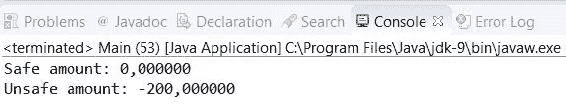

# 并发集合

在本章中，我们将涵盖以下主题：

+   使用非阻塞线程安全的双端队列

+   使用线程安全的阻塞双端队列

+   使用按优先级排序的线程安全队列

+   使用带有延迟元素的线程安全列表

+   使用线程安全的可导航映射

+   使用线程安全的 HashMap

+   使用原子变量

+   使用原子数组

+   使用`volatile`关键字

+   使用变量句柄

# 简介

**数据结构**是编程的基本元素。几乎每个程序都使用一种或多种数据结构来存储和管理数据。Java API 提供了**Java 集合框架**。它包含接口、类和算法，实现了许多不同的数据结构，您可以在程序中使用。

当您需要在并发程序中处理数据集合时，您必须非常小心地选择实现方式。大多数集合类不适用于并发应用程序，因为它们无法控制对它们数据的并发访问。如果一个并发任务共享一个无法与其他并发任务一起工作的数据结构，您可能会遇到数据不一致错误，这将影响程序的操作。这类数据结构的一个例子是`ArrayList`类。

Java 提供了数据收集过程，您可以在并发程序中使用而不会出现任何问题或不一致。基本上，Java 提供了两种类型的集合用于并发应用程序：

+   **阻塞集合**：这类集合包括添加和删除数据操作。如果操作不能立即完成，因为集合已满或为空，发起调用的线程将阻塞，直到操作可以执行。

+   **非阻塞集合**：这类集合也包括添加和删除数据操作。但在此情况下，如果操作不能立即完成，它将返回一个`null`值或抛出异常；发起调用的线程将不会在此处阻塞。

通过本章中的食谱，您将学习如何在并发应用程序中使用一些 Java 集合。这些包括：

+   使用`ConcurrentLinkedDeque`类的非阻塞双端队列

+   使用`LinkedBlockingDeque`类的阻塞双端队列

+   用于数据生产者和消费者的阻塞队列，使用`LinkedTransferQueue`类

+   使用`PriorityBlockingQueue`类按优先级排序的阻塞队列

+   使用带有延迟元素的阻塞队列，使用`DelayQueue`类

+   使用`ConcurrentSkipListMap`类的非阻塞可导航映射

+   使用`ConcurrentHashMap`类的非阻塞哈希表

+   使用`AtomicLong`和`AtomicIntegerArray`类进行原子变量

+   使用`volatile`关键字标记的字段存储的变量

+   在单个类的字段上执行原子操作，使用变量句柄。

# 使用非阻塞线程安全的双端队列

“列表”被称为最基本的数据集合。它包含不确定数量的元素，你可以从任何位置添加、读取或移除一个元素。并发列表允许各种线程同时向列表添加或移除元素，而不会产生任何数据不一致错误。类似于列表，我们还有双端队列。双端队列是一种类似于队列的数据结构，但在双端队列中，你可以从前面（头部）或后面（尾部）添加或移除元素。

在这个菜谱中，你将学习如何在并发程序中使用非阻塞双端队列。非阻塞双端队列提供操作，如果立即不执行（例如，你想从列表中获取一个元素，但列表为空），则抛出异常或返回`null`值，具体取决于操作。Java 7 引入了`ConcurrentLinkedDeque`类，该类实现了一个非阻塞的并发双端队列。

我们将实现以下两个不同任务的示例：

+   向双端队列添加数千个元素

+   从双端队列中移除数据

# 准备工作

本菜谱的示例已使用 Eclipse IDE 实现。如果你使用 Eclipse 或 NetBeans 等其他 IDE，请打开它并创建一个新的 Java 项目。

# 如何实现...

按照以下步骤实现示例：

1.  创建一个名为`AddTask`的类并指定它实现`Runnable`接口：

```java
        public class AddTask implements Runnable {

```

1.  声明一个名为`list`的私有`ConcurrentLinkedDeque`属性，由`String`类参数化：

```java
        private final ConcurrentLinkedDeque<String> list;

```

1.  实现类的构造函数以初始化其属性：

```java
        public AddTask(ConcurrentLinkedDeque<String> list) { 
         this.list=list; 
        }

```

1.  实现类的`run()`方法。该方法将有一个 5000 次的循环。在每个循环中，我们将从双端队列中取出第一个和最后一个元素，因此我们将取出总共 10,000 个元素：

```java
        @Override 
        public void run() { 
          String name=Thread.currentThread().getName(); 
          for (int i=0; i<10000; i++){ 
            list.add(name+": Element "+i); 
          } 
        }

```

1.  创建一个名为`PollTask`的类并指定它实现`Runnable`接口：

```java
        public class PollTask implements Runnable {

```

1.  声明一个名为`list`的私有`ConcurrentLinkedDeque`属性，由`String`类参数化：

```java
        private final ConcurrentLinkedDeque<String> list;

```

1.  实现类的构造函数以初始化其属性：

```java
        public PollTask(ConcurrentLinkedDeque<String> list) { 
          this.list=list; 
        }

```

1.  实现类的`run()`方法。它通过循环以 5,000 步取出双端队列中的 10,000 个元素，每步移除两个元素：

```java
        @Override 
        public void run() { 
          for (int i=0; i<5000; i++) { 
            list.pollFirst(); 
            list.pollLast(); 
          } 
        }

```

1.  通过创建一个名为`Main`的类并添加`main()`方法来实现示例的主类：

```java
        public class Main { 

          public static void main(String[] args) {

```

1.  创建一个由`String`类参数化的名为`list`的`ConcurrentLinkedDeque`对象：

```java
        ConcurrentLinkedDeque<String> list=new ConcurrentLinkedDeque<>();

```

1.  创建一个名为`threads`的 100 个`Thread`对象数组：

```java
        Thread threads[]=new Thread[100];

```

1.  创建 100 个`AddTask`对象和线程来运行它们中的每一个。将每个线程存储在之前创建的数组中并启动它们：

```java
        for (int i=0; i<threads.length ; i++){ 
          AddTask task=new AddTask(list); 
          threads[i]=new Thread(task); 
          threads[i].start(); 
        } 
        System.out.printf("Main: %d AddTask threads have been launched\n",
                          threads.length);

```

1.  使用`join()`方法等待线程的完成：

```java
        for (int i=0; i<threads.length; i++) { 
          try { 
            threads[i].join(); 
          } catch (InterruptedException e) { 
            e.printStackTrace(); 
          } 
        }

```

1.  在控制台输出列表的大小：

```java
        System.out.printf("Main: Size of the List: %d\n",list.size());

```

1.  创建 100 个`PollTask`对象和线程来运行它们中的每一个。将每个线程存储在之前创建的数组中并启动它们：

```java
        for (int i=0; i< threads.length; i++){ 
          PollTask task=new PollTask(list); 
          threads[i]=new Thread(task); 
          threads[i].start(); 
        } 
        System.out.printf("Main: %d PollTask threads have been launched\n",
                          threads.length);

```

1.  使用`join()`方法等待线程的最终化：

```java
        for (int i=0; i<threads.length; i++) { 
          try { 
            threads[i].join(); 
          } catch (InterruptedException e) { 
            e.printStackTrace(); 
          } 
        }

```

1.  在控制台输出列表的大小：

```java
        System.out.printf("Main: Size of the List: %d\n",list.size());

```

# 它是如何工作的...

在这个菜谱中，我们使用了由 `String` 类参数化的 `ConcurrentLinkedDeque` 对象来处理非阻塞的并发数据双端队列。以下截图显示了此示例的执行输出：


首先，你执行了 100 个 `AddTask` 任务向列表中添加元素。每个任务使用 `add()` 方法向列表中插入 10,000 个元素。此方法将新元素添加到双端队列的末尾。当所有任务完成后，你在控制台输出了双端队列的元素数量。那时，双端队列有 1,000,000 个元素。

然后，你执行了 100 个 `PollTask` 任务从双端队列中移除元素。每个任务使用 `pollFirst()` 和 `pollLast()` 方法从双端队列中移除 10,000 个元素。`pollFirst()` 方法返回并移除双端队列的第一个元素，而 `pollLast()` 方法返回并移除双端队列的最后一个元素。如果双端队列为空，它们返回一个 `null` 值。当所有任务完成后，你在控制台输出了双端队列的元素数量。那时，列表中的元素数量为零。请注意，`ConcurrentLinkedDeque` 数据结构不允许你添加 `null` 值。

要写入双端队列中的元素数量，你使用了 `size()` 方法。你必须考虑到，此方法可能返回一个非实际值，特别是当你使用它在有线程向列表添加或从列表删除数据时。该方法必须遍历整个双端队列来计数元素，并且列表的内容可能会因为此操作而改变。只有在你使用它们而没有线程修改双端队列时，你才能保证返回的结果是正确的。

# 更多...

`ConcurrentLinkedDeque` 类提供了更多方法来从双端队列中获取元素：

+   `getFirst()` 和 `getLast()`: 这些方法分别从双端队列中返回第一个和最后一个元素。它们不会从双端队列中移除返回的元素。如果双端队列为空，它们会抛出 `NoSuchElementExcpetion` 异常。

+   `peek()`, `peekFirst()`, 和 `peekLast()`: 这些方法分别返回双端队列的第一个和最后一个元素。它们不会从双端队列中移除返回的元素。如果双端队列为空，它们返回一个 `null` 值。

+   `remove()`, `removeFirst()`, 和 `removeLast()`: 这些方法分别返回双端队列的第一个和最后一个元素。它们也会移除返回的元素。如果双端队列为空，它们会抛出 `NoSuchElementException` 异常。

# 使用阻塞线程安全的双端队列

最基本的集合被称为列表。列表具有无限数量的元素，你可以从任何位置添加、读取或删除一个元素。并发列表允许各种线程同时向列表添加或删除元素，而不会产生任何数据不一致性。与列表类似，我们还有双端队列。双端队列是一种类似于队列的数据结构，但在双端队列中，你可以从前面（头部）或后面（尾部）添加或删除元素。

在此菜谱中，你将学习如何在你的并发程序中使用阻塞双端队列。阻塞双端队列与非阻塞双端队列之间的主要区别在于，阻塞双端队列具有插入和删除元素的方法，如果由于列表已满或为空而无法立即执行，则这些方法将阻塞调用线程，直到操作可以执行。Java 包括实现了阻塞双端队列的`LinkedBlockingDeque`类。

你将实现以下两个任务的示例：

+   一个向双端队列添加数千个元素的操作

+   一个从同一列表大量删除数据的操作

# 准备工作

此菜谱的示例已使用 Eclipse IDE 实现。如果你使用 Eclipse

或者使用不同的 IDE，例如 NetBeans，打开它并创建一个新的 Java 项目。

# 如何做到这一点...

按照以下步骤描述实现示例：

1.  创建一个名为`Client`的类并指定它实现`Runnable`接口：

```java
        public class Client implements Runnable{

```

1.  声明一个名为`requestList`的私有`LinkedBlockingDeque`属性，该属性由`String`类参数化：

```java
        private final LinkedBlockingDeque<String> requestList;

```

1.  实现类的构造函数以初始化其属性：

```java
        public Client (LinkedBlockingDeque<String> requestList) { 
          this.requestList=requestList; 
        }

```

1.  实现该`run()`方法。每秒使用`requestList`对象的`put()`方法将五个`String`对象插入到双端队列中。重复此循环三次：

```java
        @Override 
        public void run() { 
          for (int i=0; i<3; i++) { 
            for (int j=0; j<5; j++) { 
              StringBuilder request=new StringBuilder(); 
              request.append(i); 
              request.append(":"); 
              request.append(j); 
              try { 
                requestList.put(request.toString()); 
              } catch (InterruptedException e) { 
                e.printStackTrace(); 
              } 
              System.out.printf("Client added: %s at %s.\n",request,
                                new Date()); 
            } 
            try { 
              TimeUnit.SECONDS.sleep(2); 
            } catch (InterruptedException e) { 
              e.printStackTrace(); 
            } 
          } 
          System.out.printf("Client: End.\n"); 
        }

```

1.  通过创建一个名为`Main`的类并添加`main()`方法来创建示例的主类：

```java
        public class Main { 
          public static void main(String[] args) throws Exception {

```

1.  声明并创建一个名为`list`的`LinkedBlockingDeque`，该双端队列由`String`类参数化，并指定固定大小为三：

```java
        LinkedBlockingDeque<String> list=new LinkedBlockingDeque<>(3);

```

1.  创建并启动一个`Thread`对象以执行客户端任务：

```java
        Client client=new Client(list); 
        Thread thread=new Thread(client); 
        thread.start();

```

1.  每 300 毫秒使用列表对象的`take()`方法从列表中获取三个`String`对象。重复此循环五次。将字符串写入控制台：

```java
        for (int i=0; i<5 ; i++) { 
          for (int j=0; j<3; j++) { 
            String request=list.take(); 
            System.out.printf("Main: Removed: %s at %s. Size: %d\n",
                              request,new Date(), list.size()); 
          } 
          TimeUnit.MILLISECONDS.sleep(300); 
        }

```

1.  编写一条消息以指示程序结束：

```java
        System.out.printf("Main: End of the program.\n");

```

# 它是如何工作的...

在此菜谱中，你使用了由`String`类参数化的`LinkedBlockingDeque`，以处理非阻塞的并发数据双端队列。

`Client`类使用`put()`方法将字符串插入到双端队列中。如果双端队列已满（因为你已使用固定容量创建它），则该方法将阻塞其线程的执行，直到列表中有空余空间。

`Main`类使用`take()`方法从双端队列中获取字符串。如果双端队列为空，则该方法将阻塞其线程的执行，直到双端队列中有元素。

在本例中使用的 `LinkedBlockingDeque` 类的这两种方法如果在被阻塞时被中断，可能会抛出一个 `InterruptedException` 异常。因此，你必须包含必要的代码来捕获这个异常。

# 更多内容...

`LinkedBlockingDeque` 类还提供了插入和从双端队列获取元素的方法，这些方法不是阻塞的，而是抛出异常或返回 `null` 值。这些方法如下：

+   `takeFirst()` 和 `takeLast()`：这些方法分别返回双端队列的第一个和最后一个元素。它们会从双端队列中移除返回的元素。如果双端队列为空，它们会阻塞线程，直到双端队列中有元素为止。

+   `getFirst()` 和 `getLast()`：这些方法分别返回双端队列的第一个和最后一个元素。它们不会从双端队列中移除返回的元素。如果双端队列为空，它们抛出一个 `NoSuchElementException` 异常。

+   `peek()`、`peekFirst()` 和 `peekLast()`：`peekFirst()` 和 `peekLast()` 方法分别返回双端队列的第一个和最后一个元素。它们不会从双端队列中移除返回的元素。如果双端队列为空，它们返回一个 `null` 值。

+   `poll()`、`pollFirst()` 和 `pollLast()`：`pollFirst()` 和 `pollLast()` 方法分别返回双端队列的第一个和最后一个元素。它们会从双端队列中移除返回的元素。如果列表为空，它们返回一个 `null` 值。

+   `add()`、`addFirst()` 和 `addLast()`：`addFirst()` 和 `addLast()` 方法分别将元素添加到第一个和最后一个位置。如果双端队列已满（使用固定容量创建），它们会抛出一个 `IllegalStateException` 异常。

# 参见

+   本章中使用的 *使用非阻塞线程安全的双端队列* 烹饪配方

# 使用按优先级排序的阻塞线程安全队列

当你与数据结构一起工作时，你可能通常会感到需要有一个有序队列。Java 提供了具有此功能的 `PriorityBlockingQueue`。

你想要添加到 `PriorityBlockingQueue` 中的所有元素都必须实现 `Comparable` 接口；或者，你可以在队列的构造函数中包含 `Comparator`。此接口有一个名为 `compareTo()` 的方法，它接收相同类型的对象。因此，你有两个对象要比较：一个是执行方法的对象，另一个是作为参数接收的对象。如果本地对象小于参数，该方法必须返回一个小于零的数字。如果本地对象大于参数，它应该返回一个大于零的数字。如果两个对象都相等，数字必须为零。

当你在 `PriorityBlockingQueue` 中插入一个元素时，`PriorityBlockingQueue` 使用 `compareTo()` 方法来确定插入元素的位置。较大的元素将根据 `compareTo()` 方法是队列的尾部还是头部。

`PriorityBlockingQueue` 的另一个重要特性是它是一个 **阻塞数据结构**。它具有方法，如果无法立即执行操作，将阻塞线程，直到它们能够执行。

在本食谱中，您将通过实现一个示例来学习如何使用 `PriorityBlockingQueue` 类，在该示例中，您将在同一个列表中存储具有不同优先级的大量事件，以检查队列是否按您希望的方式排序。

# 准备工作

本食谱的示例已使用 Eclipse IDE 实现。如果您使用 Eclipse 或其他不同的 IDE，例如 NetBeans，请打开它并创建一个新的 Java 项目。

或打开不同的 IDE，例如 NetBeans，创建一个新的 Java 项目。

# 如何操作...

按照以下步骤实现示例：

1.  创建一个名为 `Event` 的类，并指定它实现由 `Event` 类参数化的 `Comparable` 接口：

```java
        public class Event implements Comparable<Event> {

```

1.  声明一个名为 `thread` 的私有 `int` 属性，用于存储创建事件的线程数：

```java
        private final int thread;

```

1.  声明一个名为 `priority` 的私有 `int` 属性，用于存储事件的优先级：

```java
        private final int priority;

```

1.  实现类的构造函数以初始化其属性：

```java
        public Event(int thread, int priority){ 
          this.thread=thread; 
          this.priority=priority; 
        }

```

1.  实现返回线程属性值的 `getThread()` 方法：

```java
        public int getThread() { 
          return thread; 
        }

```

1.  实现返回优先级属性值的 `getPriority()` 方法：

```java
        public int getPriority() { 
          return priority; 
        }

```

1.  实现比较方法 `compareTo()`。它接收 `Event` 作为参数，比较当前事件和接收到的参数的优先级。如果当前事件的优先级更高，则返回 `-1`；如果两个优先级相等，则返回 `0`；如果当前事件的优先级更低，则返回 `1`。注意，这与大多数 `Comparator.compareTo()` 实现相反：

```java
        @Override 
        public int compareTo(Event e) { 
          if (this.priority>e.getPriority()) { 
            return -1; 
          } else if (this.priority<e.getPriority()) { 
            return 1;  
          } else { 
            return 0; 
          } 
        }

```

1.  创建一个名为 `Task` 的类，并指定它实现 `Runnable` 接口：

```java
        public class Task implements Runnable {

```

1.  声明一个名为 `id` 的私有 `int` 属性，用于存储标识任务的数字：

```java
        private final int id;

```

1.  声明一个名为 `queue` 的私有 `PriorityBlockingQueue` 属性，参数化为 `Event` 类，用于存储任务生成的事件：

```java
        private final PriorityBlockingQueue<Event> queue;

```

1.  实现类的构造函数以初始化其属性：

```java
        public Task(int id, PriorityBlockingQueue<Event> queue) { 
          this.id=id; 
          this.queue=queue; 
        }

```

1.  实现 `run()` 方法。在队列中存储 1,000 个事件，使用其 ID 来标识创建事件的任务，并为每个事件分配一个从 1 到 1000 的不同优先级。使用 `add()` 方法将事件存储在队列中：

```java
        @Override 
        public void run() { 
          for (int i=0; i<1000; i++){ 
            Event event=new Event(id,i); 
            queue.add(event); 
          } 
        }

```

1.  通过创建一个名为 `Main` 的类并添加 `main()` 方法来实现示例的主类：

```java
        public class Main{ 
          public static void main(String[] args) {

```

1.  创建一个名为 `queue` 的 `PriorityBlockingQueue` 对象，参数化为 `Event` 类：

```java
        PriorityBlockingQueue<Event> queue=new PriorityBlockingQueue<>();

```

1.  创建一个包含五个 `Thread` 对象的数组以存储将执行五个任务的线程：

```java
        Thread taskThreads[]=new Thread[5];

```

1.  创建五个 `Task` 对象。将线程存储在之前创建的数组中：

```java
        for (int i=0; i<taskThreads.length; i++){ 
          Task task=new Task(i,queue); 
          taskThreads[i]=new Thread(task); 
        }

```

1.  启动之前创建的五个线程：

```java
        for (int i=0; i<taskThreads.length ; i++) { 
          taskThreads[i].start(); 
        }

```

1.  使用 `join()` 方法等待五个线程的最终化：

```java
        for (int i=0; i<taskThreads.length ; i++) { 
          try { 
            taskThreads[i].join(); 
          } catch (InterruptedException e) { 
            e.printStackTrace(); 
          } 
        }

```

1.  在控制台中写入队列的实际大小和存储在其中的事件。使用 `poll()` 方法从队列中取出事件：

```java
        System.out.printf("Main: Queue Size: %d\n",queue.size()); 
        for (int i=0; i<taskThreads.length*1000; i++){ 
          Event event=queue.poll(); 
          System.out.printf("Thread %s: Priority %d\n",
                            event.getThread(),event.getPriority()); 
        }

```

1.  向控制台写入队列的最终大小信息：

```java
        System.out.printf("Main: Queue Size: %d\n",queue.size()); 
        System.out.printf("Main: End of the program\n");

```

# 它是如何工作的...

在这个例子中，你使用`PriorityBlockingQueue`实现了`Event`对象的优先队列。如介绍中所述，存储在`PriorityBlockingQueue`中的所有元素都必须实现`Comparable`接口或向队列的构造函数提供`Comparator`对象。在这种情况下，你采用了第一种方法，因此在`Event`类中实现了`compareTo()`方法。

所有事件都有一个优先级属性。优先级值较高的元素将是队列中的第一个元素。当你实现`compareTo()`方法时，如果执行此方法的事件的优先级高于作为参数传递的事件的优先级，它返回`-1`作为结果。在另一种情况下，如果执行此方法的事件的优先级低于作为参数传递的事件的优先级，它返回`1`作为结果。如果两个对象具有相同的优先级，`compareTo()`方法返回`0`。在这种情况下，`PriorityBlockingQueue`类不保证元素的顺序。

我们实现了`Task`类，以便将`Event`对象添加到优先队列中。每个任务对象使用`add()`方法将 1,000 个事件添加到队列中，优先级在`0`到`999`之间。

`Main`类的`main()`方法创建了五个`Task`对象，并在相应的线程中执行它们。当所有线程完成执行后，你将所有元素写入控制台。要从队列中获取元素，我们使用了`poll()`方法。此方法返回并移除队列中的第一个元素。

以下截图显示了程序执行输出的一部分：


你可以看到队列有 5,000 个元素，以及第一个元素具有最大的优先级值。

# 还有更多...

`PriorityBlockingQueue`类还有其他一些有趣的方法。以下是一些方法的描述：

+   `clear()`: 此方法移除队列中的所有元素。

+   `take()`: 此方法返回并移除队列的第一个元素。如果队列是空的，它将阻塞其线程，直到队列有元素。

+   `put(E e)`: 这是用于参数化`PriorityBlockingQueue`类的类。它将作为参数传递的元素插入到队列中。

+   `peek()`: 此方法返回队列的第一个元素，但不移除它。

# 参见

+   本章中的*使用阻塞线程安全的双端队列*配方

# 使用带有延迟元素的线程安全列表

Java API 提供的一个有趣的数据结构，你可以在并发应用程序中使用，是在 `DelayQueue` 类中实现的。在这个类中，你可以存储具有激活日期的元素。返回或从队列中提取元素的方法将忽略这些元素，其数据将在未来出现。它们对这些方法不可见。为了获得这种行为，你想要存储在 `DelayQueue` 类中的元素需要实现 `Delayed` 接口。此接口允许你处理延迟对象。此接口有一个 `getDelay()` 方法，它返回元素激活的时间。此接口强制你实现以下两个方法：

+   `compareTo(Delayed o)`: `Delayed` 接口扩展了 `Comparable` 接口。如果执行此方法的对象具有比作为参数传递的对象更小的延迟，则此方法将返回一个小于零的值。如果执行此方法的对象具有比作为参数传递的对象更大的延迟，则返回一个大于零的值。如果两个对象具有相同的延迟，则返回零。

+   `getDelay(TimeUnit unit)`: 此方法必须返回直到激活日期剩余的时间，以单位为单位，由单位参数指定。`TimeUnit` 类是一个枚举，具有以下常量：`DAYS`、`HOURS`、`MICROSECONDS`、`MILLISECONDS`、`MINUTES`、`NANOSECONDS` 和 `SECONDS`。

在本例中，你将学习如何通过在其中存储具有不同激活日期的一些事件来使用 `DelaydQueue` 类。

# 准备工作

本食谱的示例已使用 Eclipse IDE 实现。如果你使用 Eclipse

或者使用不同的 IDE，例如 NetBeans，打开它并创建一个新的 Java 项目。

# 如何做到这一点...

按照以下步骤实现示例：

1.  创建一个名为 `Event` 的类，并指定它实现 `Delayed` 接口：

```java
        public class Event implements Delayed {

```

1.  声明一个名为 `startDate` 的私有 `Date` 属性：

```java
        private final Date startDate;

```

1.  实现类的构造函数以初始化其属性：

```java
        public Event (Date startDate) { 
          this.startDate=startDate; 
        }

```

1.  实现 `compareTo()` 方法。它接收一个 `Delayed` 对象作为其参数。返回当前对象延迟与作为参数传递的对象之间的差值：

```java
        @Override 
        public int compareTo(Delayed o) { 
          long result=this.getDelay(TimeUnit.NANOSECONDS)-o.getDelay
                                                    (TimeUnit.NANOSECONDS); 
          if (result<0) { 
            return -1; 
          } else if (result>0) { 
            return 1; 
          } 
          return 0; 
        }

```

1.  实现 `getDelay()` 方法。返回对象开始日期与实际日期在 `TimeUnit` 中的差值，该值作为参数接收：

```java
        public long getDelay(TimeUnit unit) {   
          Date now=new Date(); 
          long diff=startDate.getTime()-now.getTime(); 
          return unit.convert(diff,TimeUnit.MILLISECONDS); 
        }

```

1.  创建一个名为 `Task` 的类，并指定它实现 `Runnable` 接口：

```java
        public class Task implements Runnable {

```

1.  声明一个名为 `id` 的私有 `int` 属性，用于存储一个标识此任务的数字：

```java
        private final int id;

```

1.  声明一个名为 `queue` 的私有 `DelayQueue` 属性，该属性由 `Event` 类参数化：

```java
        private final DelayQueue<Event> queue;

```

1.  实现类的构造函数以初始化其属性：

```java
        public Task(int id, DelayQueue<Event> queue) { 
          this.id=id; 
          this.queue=queue; 
        }

```

1.  实现 `run()` 方法。首先，计算此任务将要创建的事件的激活日期。然后，将对象的 ID 等于的秒数加到实际日期上：

```java
        @Override 
        public void run() { 
          Date now=new Date(); 
          Date delay=new Date(); 
          delay.setTime(now.getTime()+(id*1000)); 
          System.out.printf("Thread %s: %s\n",id,delay);

```

1.  使用 `add()` 方法在队列中存储 100 个事件：

```java
          for (int i=0; i<100; i++) { 
            Event event=new Event(delay); 
            queue.add(event); 
          }   
        }

```

1.  通过创建一个名为 `Main` 的类并添加 `main()` 方法来实现示例的主类：

```java
        public class Main { 
          public static void main(String[] args) throws Exception {

```

1.  创建一个由 `Event` 类参数化的 `DelayQueue` 对象：

```java
        DelayQueue<Event> queue=new DelayQueue<>();

```

1.  创建一个包含五个 `Thread` 对象的数组以存储你将要执行的任务：

```java
        Thread threads[]=new Thread[5];

```

1.  创建具有不同 ID 的五个 `Task` 对象：

```java
        for (int i=0; i<threads.length; i++){ 
          Task task=new Task(i+1, queue); 
          threads[i]=new Thread(task); 
        }

```

1.  启动之前创建的所有五个任务：

```java
        for (int i=0; i<threads.length; i++) { 
          threads[i].start(); 
        }

```

1.  使用 `join()` 方法等待线程的最终化：

```java
        for (int i=0; i<threads.length; i++) { 
          threads[i].join(); 
        }

```

1.  将队列中存储的事件写入控制台。当队列的大小大于零时，使用 `poll()` 方法获取一个 `Event` 类。如果它返回 `null`，则将主线程休眠 500 毫秒以等待更多事件的激活：

```java
            do { 
              int counter=0; 
              Event event; 
              do { 
                event=queue.poll(); 
                if (event!=null) counter++; 
              } while (event!=null); 
              System.out.printf("At %s you have read %d events\n",
                                new Date(), counter); 
              TimeUnit.MILLISECONDS.sleep(500); 
            } while (queue.size()>0); 
          } 
        }

```

# 它是如何工作的...

在这个菜谱中，我们实现了 `Event` 类。这个类有一个独特的属性，即事件的激活日期，并且它实现了 `Delayed` 接口。你可以将 `Event` 对象存储在 `DelayQueue` 类中。

`getDelay()` 方法返回激活日期和实际日期之间的纳秒数。这两个日期都是 `Date` 类的对象。你使用了 `getTime()` 方法，它返回一个转换为毫秒的日期。然后，你将此值转换为 `TimeUnit`，它作为参数接收。`DelayQueue` 类在纳秒级别工作，但此时对你来说是透明的。

如果执行该方法的对象的延迟小于作为参数传递的对象的延迟，则 `compareTo()` 方法返回一个小于零的值。如果执行该方法的对象的延迟大于作为参数传递的对象的延迟，则返回一个大于零的值。如果两个延迟都相等，则返回 `0`。

你还实现了 `Task` 类。这个类有一个名为 `id` 的 `integer` 属性。当 `Task` 对象被执行时，它将等于任务 ID 的秒数添加到实际日期，这指的是 `DelayQueue` 类中由该任务存储的事件的激活日期。每个 `Task` 对象使用 `add()` 方法在队列中存储 100 个事件。

最后，在 `Main` 类的 `main()` 方法中，你创建了五个 `Task` 对象，并在相应的线程中执行它们。当这些线程完成执行后，你使用控制台中的 `poll()` 方法写入所有事件。此方法检索并移除队列中的第一个元素。如果没有活动元素，则返回 `null` 值。你调用 `poll()` 方法，如果它返回 `Event` 类，则增加一个计数器。当它返回 `null` 值时，你在控制台中写入计数器的值，并将线程休眠半秒钟以等待更多活动事件。当你获得了队列中存储的 500 个事件后，程序执行结束。

以下截图显示了程序执行的部分输出：


你可以看到当程序被激活时，它只获得了 100 个事件。

你必须非常小心地使用`size()`方法。它返回列表中包括活动和非活动元素的总元素数。

# 更多...

`DelayQueue`类还有其他有趣的方法，如下所示：

+   `clear()`: 此方法移除队列中的所有元素。

+   `offer(E e)`: 在这里，`E`代表用于参数化`DelayQueue`类的类。此方法将作为参数传递的元素插入到队列中。

+   `peek()`: 此方法检索但不移除队列的第一个元素。

+   `take()`: 此方法检索并移除队列的第一个元素。如果没有活动元素，执行此方法的线程将被阻塞，直到线程获得一些活动元素。

# 参见

+   本章中的*使用阻塞线程安全的队列*配方

# 使用线程安全的可导航映射

`ConcurrentNavigableMap`是一个接口，它定义了 Java API 提供的有趣的数据结构，你可以在你的并发程序中使用这些数据结构。实现`ConcurrentNavigableMap`接口的类将元素存储在两部分：

+   一个**键**，用于唯一标识一个元素

+   定义元素的其余数据，称为**值**

Java API 还提供了一个实现`ConcurrentSkipListMap`的类，这是一个实现具有`ConcurrentNavigableMap`接口行为的非阻塞列表的接口。内部，它使用**跳表**来存储数据。跳表是一种基于并行列表的数据结构，它允许我们获得与二叉树相关的效率。你可以在[`en.wikipedia.org/wiki/Skip_list`](https://en.wikipedia.org/wiki/Skip_list)上获取更多关于跳表的信息。有了它，你可以获得一个排序的数据结构，而不是一个排序的列表，并且具有更好的插入、搜索或删除元素的访问时间。

跳表（Skip List）是由威廉·普（William Pugh）在 1990 年提出的。

当你向映射中插入一个元素时，映射使用键来排序它们；因此，所有元素都将排序。键必须实现`Comparable`接口，或者你必须向映射的构造函数提供一个`Comparator`类。该类还提供了获取映射子映射的方法，以及返回具体元素的方法。

在这个配方中，你将学习如何使用`ConcurrentSkipListMap`类来实现联系人映射。

# 准备工作

本配方的示例已使用 Eclipse IDE 实现。如果你使用 Eclipse 或 NetBeans 等不同的 IDE，请打开它并创建一个新的 Java 项目。

# 如何做到这一点...

按照以下步骤实现示例：

1.  创建一个名为`Contact`的类：

```java
        public class Contact {

```

1.  声明两个名为`name`和`phone`的私有`String`属性：

```java
        private final String name; 
        private final String phone;

```

1.  实现类的构造函数以初始化其属性：

```java
        public Contact(String name, String phone) { 
          this.name=name; 
          this.phone=phone; 
        }

```

1.  实现返回`name`和`phone`属性值的方法：

```java
        public String getName() { 
          return name; 
        } 

        public String getPhone() { 
          return phone; 
        }

```

1.  创建一个名为`Task`的类并指定它实现`Runnable`接口：

```java
        public class Task implements Runnable {

```

1.  声明一个名为 `map` 的私有 `ConcurrentSkipListMap` 属性，由 `String` 和 `Contact` 类参数化：

```java
        private final ConcurrentSkipListMap<String, Contact> map;

```

1.  声明一个名为 `id` 的私有 `String` 属性来存储当前任务的 ID：

```java
        private final String id;

```

1.  实现类的构造函数以存储其属性：

```java
        public Task (ConcurrentSkipListMap<String, Contact> map,String id){ 
          this.id=id; 
          this.map=map; 
        }

```

1.  实现 `run()` 方法。它使用任务的 ID 和递增的数字来创建 `Contact` 对象，并将 1,000 个不同的联系人存储在地图中。使用 `put()` 方法将联系人存储在地图中：

```java
        @Override 
        public void run() { 
          for (int i=0; i<1000; i++) { 
            Contact contact=new Contact(id, String.valueOf(i+1000)); 
            map.put(id+contact.getPhone(), contact); 
          }     
        }

```

1.  通过创建一个名为 `Main` 的类并将 `main()` 方法添加到其中来实现示例的主类：

```java
        public class Main { 
          public static void main(String[] args) {

```

1.  创建一个由 `String` 和 `Conctact` 类参数化的名为 `map` 的 `ConcurrentSkipListMap` 对象：

```java
        ConcurrentSkipListMap<String, Contact> map = new
                                          ConcurrentSkipListMap<>();

```

1.  创建一个用于存储所有即将执行的 `Task` 对象的 26 个 `Thread` 对象数组：

```java
        Thread threads[]=new Thread[26]; 
        int counter=0;

```

1.  创建并启动 26 个 `task` 对象，并将一个大写字母分配给每个任务的 ID：

```java
        for (char i='A'; i<='Z'; i++) { 
          Task task=new Task(map, String.valueOf(i)); 
          threads[counter]=new Thread(task); 
          threads[counter].start(); 
          counter++; 
        }

```

1.  使用 `join()` 方法等待线程的最终化：

```java
        for (Thread thread : threads){ 
          try { 
            threads[i].join(); 
          } catch (InterruptedException e) { 
            e.printStackTrace(); 
          } 
        }

```

1.  使用 `firstEntry()` 方法获取地图的第一个条目。将其数据写入控制台：

```java
        System.out.printf("Main: Size of the map: %d\n",map.size()); 

        Map.Entry<String, Contact> element; 
        Contact contact; 

        element=map.firstEntry(); 
        contact=element.getValue(); 
        System.out.printf("Main: First Entry: %s: %s\n", contact.getName(), 
                          contact.getPhone());

```

1.  使用 `lastEntry()` 方法获取地图的最后一个条目。将其数据写入控制台：

```java
        element=map.lastEntry(); 
        contact=element.getValue(); 
        System.out.printf("Main: Last Entry: %s: %s\n", contact.getName(),
                          contact.getPhone());

```

1.  使用 `subMap()` 方法获取地图的子映射。将其数据写入控制台：

```java
          System.out.printf("Main: Submap from A1996 to B1002: \n"); 
          ConcurrentNavigableMap<String, Contact> submap=map
                                               .subMap("A1996","B1002"); 
          do { 
            element=submap.pollFirstEntry(); 
            if (element!=null) { 
              contact=element.getValue(); 
              System.out.printf("%s: %s\n", contact.getName(),
                                contact.getPhone()); 
            } 
          } while (element!=null); 
        }

```

# 它是如何工作的...

在这个菜谱中，我们实现了一个 `Task` 类来在可导航的地图中存储 `Contact` 对象。每个联系人都有一个名字，它是创建它的任务的 ID，还有一个电话号码，它是介于 1,000 到 2,000 之间的数字。我们将这些值连接起来作为联系人的键。每个 `Task` 对象创建 1,000 个联系人；这些联系人使用 `put()` 方法存储在可导航的地图中。

如果你插入一个具有在地图中存在的键的元素，则与该键关联的元素将被新元素替换。

`Main` 类的 `main()` 方法创建了 26 个 `Task` 对象，使用 A 到 Z 之间的字母作为 ID。然后，你使用了一些方法从地图中获取数据。`firstEntry()` 方法返回一个包含地图第一个元素的 `Map.Entry` 对象。此方法不会从地图中删除元素。该对象包含键和元素。要获取元素，你调用了 `getValue()` 方法。你可以使用 `getKey()` 方法来获取该元素的键。

`lastEntry()` 方法返回一个包含地图最后一个元素的 `Map.Entry` 对象。`subMap()` 方法返回包含地图部分元素的 `ConcurrentNavigableMap` 对象，在这种情况下，键在 `A1996` 和 `B1002` 之间的元素。你使用了 `pollFirst()` 方法来处理 `subMap()` 方法中的元素。此方法返回并移除子映射的第一个 `Map.Entry` 对象。

以下截图显示了程序执行的结果：


# 还有更多...

`ConcurrentSkipListMap` 类有其他一些有趣的方法。其中一些如下：

+   `headMap(K toKey)`: 在这里，`K`是用于`ConcurrentSkipListMap`对象参数化的键值类的类。此方法返回一个子映射，其中包含具有小于传递的参数的键的第一个元素。

+   `tailMap(K fromKey)`: 在这里，`K`是用于`ConcurrentSkipListMap`对象参数化的键值类的类。此方法返回一个子映射，其中包含具有大于传递的参数的键的最后一个元素。

+   `putIfAbsent(K key, V Value)`: 如果指定的键不存在于映射中，此方法将插入指定的值和键。

+   `pollLastEntry()`: 此方法返回并移除具有映射中最后一个元素的`Map.Entry`对象。

+   `replace(K key, V Value)`: 如果指定的键存在于映射中，此方法将替换与该键关联的值。

# 参见

+   本章中的*使用非阻塞线程安全的队列*菜谱

# 使用线程安全的 HashMap

哈希表是一种数据结构，允许你将键映射到值。内部通常使用数组来存储元素，并使用哈希函数来计算元素在数组中的位置，使用其键。这种数据结构的主要优点是，插入、删除和搜索操作在这里都非常快，因此在需要执行大量搜索操作的情况下非常有用。

Java API 通过`Map`和`ConcurrentMap`接口提供了不同的哈希表实现。`ConcurrentMap`接口为所有操作提供了线程安全和原子保证，因此你可以在并发应用程序中使用它们。`ConcurrentHashMap`类实现了`ConcurrentMap`接口，并添加了一些接口中定义的方法。此类支持以下功能：

+   读取操作的全并发性

+   插入和删除操作的高预期并发性

这两个元素（类和接口）都是在 Java 版本 5 中引入的，但在版本 8 中，开发了许多类似于流 API 提供的方法。

在这个菜谱中，你将学习如何在你的应用程序中使用`ConcurrentHashMap`类以及它提供的重要方法。

# 准备工作

本菜谱的示例已使用 Eclipse IDE 实现。如果你使用 Eclipse 或 NetBeans 等其他 IDE，请打开它并创建一个新的 Java 项目。

# 如何做...

按照以下步骤实现示例：

1.  创建一个名为`Operation`的类，具有三个属性：一个名为`user`的`String`属性，一个名为`operation`的`String`属性，以及一个名为`time`的`Date`属性。添加获取和设置属性值的 方法。这个类的代码非常简单，所以不会在这里展示。

1.  创建一个名为`HashFiller`的类。指定它实现`Runnable`接口：

```java
        public class HashFiller implements Runnable {

```

1.  声明一个名为`userHash`的私有`ConcurrentHashMap`属性。哈希表的键将是一个`String`类型，其值将是`Operation`对象的`ConcurrentLinkedDeque`对象。实现类的构造函数以初始化属性：

```java
        private ConcurrentHashMap<String, ConcurrentLinkedDeque<Operation>>
                userHash; 

        public HashFiller(ConcurrentHashMap<String, ConcurrentLinkedDeque
                          <Operation>> userHash) { 
          this.userHash = userHash; 
        }

```

1.  实现`run()`方法。我们将用 100 个随机的`Operation`对象填充`ConcurrentHashMap`。首先，生成随机数据，然后使用`addOperationToHash()`方法将对象插入到哈希表中：

```java
        @Override 
        public void run() { 

          Random randomGenerator = new Random(); 
          for (int i = 0; i < 100; i++) { 
            Operation operation = new Operation(); 
            String user = "USER" + randomGenerator.nextInt(100); 
            operation.setUser(user); 
            String action = "OP" + randomGenerator.nextInt(10); 
            operation.setOperation(action); 
            operation.setTime(new Date()); 

            addOperationToHash(userHash, operation); 
          } 
        }

```

1.  实现`addOperationToHash()`方法。它接收哈希表和要添加的操作作为参数。映射中的键将是分配给操作的用户。我们使用`computeIfAbsent()`方法来获取与键关联的`ConcurrentLinkedDeque`对象。如果键存在，此方法返回与它关联的值。如果不存在，它执行传递给此方法的 lambda 表达式来生成值并将其与键关联。在这种情况下，我们生成一个新的`ConcurrentLinkedDeque`对象。最后，将操作插入到队列中：

```java
        private void addOperationToHash(ConcurrentHashMap<String,
                                        ConcurrentLinkedDeque<Operation>>
                                        userHash, Operation operation) { 

          ConcurrentLinkedDeque<Operation> opList = userHash
                                   .computeIfAbsent(operation.getUser(),
                                   user -> new ConcurrentLinkedDeque<>()); 

          opList.add(operation); 
        }

```

1.  现在实现`Main`类并包含`main()`方法。首先，声明一个`ConcurrentHashMap`对象和一个`HashFiller`任务：

```java
        ConcurrentHashMap<String, ConcurrentLinkedDeque<Operation>>
          userHash = new ConcurrentHashMap<>(); 
        HashFiller hashFiller = new HashFiller(userHash);

```

1.  使用`HashFiller`类执行 10 个线程，并使用`join()`方法等待它们的最终化：

```java
        Thread[] threads = new Thread[10]; 
        for (int i = 0; i < 10; i++) { 
          threads[i] = new Thread(hashFiller); 
          threads[i].start(); 
        } 

        for (int i = 0; i < 10; i++) { 
          try { 
            threads[i].join(); 
          } catch (InterruptedException e) { 
            e.printStackTrace(); 
          } 
        }

```

1.  现在，提取`ConcurrentHashMap`的信息。首先，使用`size()`方法提取其中存储的元素数量。然后，使用`forEach()`方法对存储在哈希表中的所有元素应用一个操作。第一个参数是并行度阈值。这是使操作以并发方式执行所需的最小元素数量。我们指定了值 10，哈希表有 100 个元素，因此操作将以并行方式执行。Lambda 表达式接收两个参数：键和值。打印存储为值的`ConcurrentLinkedDeque`的键和大小：

```java
        System.out.printf("Size: %d\n", userHash.size()); 

        userHash.forEach(10, (user, list) -> { 
          System.out.printf("%s: %s: %d\n", Thread.currentThread()
                            .getName(), user, list.size()); 
        });

```

1.  然后，使用`forEachEntry()`方法。这与前面的方法类似，但 lambda 表达式接收一个`Entry`对象作为参数，而不是接收两个参数。您可以使用此条目对象来获取键和值：

```java
        userHash.forEachEntry(10, entry -> { 
          System.out.printf("%s: %s: %d\n", Thread.currentThread()
                            .getName(), entry.getKey(), 
          entry.getValue().size()); 
        });

```

1.  然后，使用`search()`方法来查找满足指定搜索函数的第一个元素。在我们的例子中，我们搜索操作码以 1 结尾的操作。与`forEach()`方法类似，我们指定一个并行度阈值：

```java
        Operation op = userHash.search(10, (user, list) -> { 
          for (Operation operation : list) { 
            if (operation.getOperation().endsWith("1")) { 
              return operation; 
            } 
          } 
          return null; 
        }); 

        System.out.printf("The operation we have found is: %s, %s, %s,\n",
                          op.getUser(), op.getOperation(), op.getTime());

```

1.  再次使用`search()`方法，但这次，使用它来查找拥有超过 10 个操作的用戶：

```java
        ConcurrentLinkedDeque<Operation> operations = userHash.search(10,
                                                          (user, list) -> { 
          if (list.size() > 10) { 
            return list; 
          } 
          return null; 
        }); 

        System.out.printf("The user we have found is: %s: %d operations\n",
                          operations.getFirst().getUser(),
                          operations.size());

```

1.  最后，使用`reduce()`方法计算存储在哈希表中的操作总数：

```java
            int totalSize = userHash.reduce(10, (user, list) -> { 
              return list.size(); 
            }, (n1, n2) -> { 
              return n1 + n2; 
            }); 

            System.out.printf("The total size is: %d\n", totalSize); 
          } 
        }

```

# 它是如何工作的...

在这个菜谱中，我们实现了一个使用`ConcurrentHashMap`来存储用户执行的操作信息的应用程序。内部，哈希表使用`Operation`类的用户属性作为键，使用`ConcurrentLinkedDeque`（一个非阻塞的并发列表）作为其值来存储与该用户关联的所有操作。

首先，我们使用 10 个不同的线程使用一些随机数据填充了哈希。为此，我们实现了`HashFiller`任务。这些任务的最大问题是当你需要在哈希表中插入一个键时会发生什么。如果有两个线程同时想要添加相同的键，你可能会丢失一个线程插入的数据，并出现数据竞争条件。为了解决这个问题，我们使用了`computeIfAbsent()`方法。

此方法接收一个键和一个可以表示为 lambda 表达式的`Function`接口实现；键和实现作为参数接收。如果键存在，该方法返回与键关联的值。如果不存在，该方法将执行指定的`Function`对象，并将`Function`返回的键和值添加到 HashMap 中。在我们的情况下，键不存在，因此我们创建了一个新的`ConcurrentLinkedDeque`类实例。此方法的主要优势是它是原子执行的；因此，如果另一个线程尝试执行相同的操作，它将被阻塞，直到此操作完成。

然后，在`main()`方法中，我们使用了`ConcurrentHashMap`的其他方法来处理存储在哈希中的信息。我们使用了以下方法：

+   `forEach()`：此方法接收一个可以表示为 lambda 表达式的`BiConsumer`接口实现；它作为参数接收。此表达式的其他两个参数代表我们正在处理的元素的键和值。此方法将表达式应用于存储在`ConcurrentHashMap`中的所有元素。

+   `forEachEntry()`：此方法与上一个方法等效，但这里的表达式是`Consumer`接口的实现。它接收一个`Entry`对象作为参数，该对象存储我们正在处理的条目的键和值。这是表达相同功能的一种方式。

+   `search()`：此方法接收可以表示为 lambda 表达式的`BiFunction`接口实现；它作为参数接收。此函数还接收我们正在处理的`ConcurrentHashMap`对象的条目的键和值作为参数。它返回`BiFunction`返回的第一个非空值。

+   `reduce()`：此方法接收两个`BiFunction`接口，以将`ConcurrentHashMap`的元素减少到唯一值。这允许您使用`ConcurrentHashMap`的元素实现`MapReduce`操作。第一个`BiFunction`接口允许您将元素的键和值转换为唯一值，第二个`BiFunction`接口允许您聚合两个不同元素的值。

到目前为止所描述的所有方法都有一个名为 `parallelismThreshold` 的第一个参数。此参数被描述为 *...执行此操作所需的（估计）元素数量...*，也就是说，如果 `ConcurrentHashMap` 的元素少于参数中指定的值，则方法以顺序方式执行。相反（如在我们的情况下），方法以并行方式执行。

# 还有更多...

`ConcurrentHashMap` 包含比上一节中指定的更多方法。以下列表中我们列举了一些：

+   `forEachKey()` 和 `forEachValue()`: 这些方法与 `forEach()` 方法类似，但在此情况下，表达式分别处理存储在 `ConcurrentHashMap` 中的键和值。

+   `searchEntries()`, `searchKeys()`, 和 `searchValues()`: 这些方法与之前解释的 `search()` 方法类似。然而，在这种情况下，作为参数传递的表达式接收一个 `Entry` 对象、一个键或存储在 `ConcurrentHashMap` 中的元素的值。

+   `reduceEntries()`, `reduceKeys()`, 和 `reduceValues()`: 这些方法与之前解释的 `reduce()` 方法类似。然而，在这种情况下，作为参数传递的表达式接收一个 `Entry` 对象、一个键或存储在 `ConcurrentHashMap` 中的元素的值。

+   `reduceXXXToDouble()`, `reduceXXXToLong()`, 和 `reduceXXXToInt()`: 这些方法允许您通过生成 `double`、`long` 或 `int` 值来对 `ConcurrentHashMap` 的元素进行归约。

+   `computeIfPresent()`: 此方法补充了 `computeIfAbsent()` 方法。在这种情况下，它接收一个键和一个 `BiFunction` 接口的实现，该接口可以用 lambda 表达式表示。如果键存在于 `HashMap` 中，该方法将表达式应用于计算键的新值。`BiFunction` 接口接收键和该键的实际值作为参数，并返回新值。

+   `merge()`: 此方法接收一个键、值和 `BiFunction` 接口的实现，该接口可以用 lambda 表达式表示；它们作为参数接收。如果键不存在于 `ConcurrentHashMap` 中，则将其插入并关联值参数。如果它存在，则执行 `BiFunction` 来计算与键关联的新值。`BiFunction` 接口接收键及其实际值作为参数，并返回与键关联的新值。

+   `getOrDefault()`: 此方法接收一个键和一个默认值作为参数。如果键存在于 `ConcurrentHashMap` 中，它返回其关联的值。否则，它返回默认值。

# 参见

+   本章中 *使用线程安全的可导航映射* 的食谱

+   第六章 “减少流元素”的食谱，*并行和响应式流*

# 使用原子变量

**原子变量**是在 Java 5 版本中引入的，以提供对单个变量的原子操作。当您使用普通变量时，您在 Java 中实现的每个操作都会转换为 JVM 可理解的 Java 字节码的多个指令。例如，当您将值赋给变量时，您在 Java 中只使用一个指令；然而，当您编译此程序时，它被转换为 JVM 语言的多种指令。当您与多个线程共享变量时，这可能导致数据不一致错误。

为了避免这些问题，Java 引入了原子变量。当一个线程正在使用原子变量执行操作，并且如果有其他线程想要对同一个变量执行操作，类的实现包括一个机制来检查操作是否是原子执行的。基本上，操作获取变量的值，即变量的旧值。

1.  您获取变量的值，即变量的旧值。

1.  您在一个时间变量中更改变量的值，这是变量的新值。

1.  如果旧值等于变量的实际值，则用新值替换旧值。如果另一个线程改变了变量的值，旧值可能与实际值不同。

其中一些变量，例如`LongAccumulator`类，接收一个作为参数的操作，该操作可以在其某些方法内部执行。这些操作必须没有副作用，因为它们可能在每次值更新时多次执行。

原子变量不使用锁或其他同步机制来保护对其值的访问。它们的所有操作都基于比较和设置。保证几个线程可以同时使用一个原子变量，而不会产生数据不一致错误；此外，它们简化了实现。

Java 8 添加了四个新的原子类。首先我们有`LongAdder`和`DoubleAdder`类；它们存储频繁由不同线程更新的`long`和`double`值。您可以使用`AtomicLong`类获得与`LongAdder`类相同的功能，但前者提供了更好的性能。其他两个类是`LongAccumulator`和`DoubleAccumulator`。这些类与前面的类类似，但在这里，您必须在构造函数中指定两个参数：

+   计数器的初始值。

+   一个 `LongBinaryOperator` 或 `DoubleBinaryOperator`，可以表示为 lambda 表达式。这个表达式接收变量的旧值和要应用的增量，并返回变量的新值。

在本食谱中，您将学习如何使用实现银行账户和两个不同任务的原子变量：一个向账户添加资金，另一个从账户中减去资金。您将在示例实现中使用 `AtomicLong` 类。

# 准备工作

本食谱的示例已使用 Eclipse IDE 实现。如果您使用 Eclipse 或其他 IDE，例如 NetBeans，请打开它并创建一个新的 Java 项目。

# 如何实现...

按照以下步骤实现示例：

1.  创建一个名为 `Account` 的类来模拟银行账户：

```java
        public class Account {

```

1.  声明一个名为 `balance` 的私有 `AtomicLong` 属性来存储账户的余额。此外，声明一个名为 `operations` 的私有 `LongAdder` 属性和一个名为 `commission` 的私有 `DoubleAccumulator` 属性：

```java
        private final AtomicLong balance; 
        private final LongAdder operations; 
        private final DoubleAccumulator commission;

```

1.  实现类的构造函数以初始化其属性。对于 `DoubleAccumulator` 类，身份值是 `0`，我们通过将参数传递的增量乘以 `0.2` 来更新实际值：

```java
        public Account() { 
          balance = new AtomicLong(); 
          operations = new LongAdder(); 
          commission = new DoubleAccumulator((x,y)-> x+y*0.2, 0); 
        }

```

1.  实现获取三个属性值的方法：

```java
        public long getBalance() { 
          return balance.get(); 
        } 
        public long getOperations() { 
          return operations.longValue(); 
        } 
        public double getCommission() { 
          return commission.get(); 
        }

```

1.  实现一个名为 `setBalance()` 的方法来设置余额属性值。我们还需要使用 `reset()` 方法来初始化操作和佣金属性：

```java
        public void setBalance(long balance) { 
          this.balance.set(balance); 
          operations.reset(); 
          commission.reset(); 
        }

```

1.  实现一个名为 `addAmount()` 的方法来增加 `balance` 属性的值。此外，使用 `LongAdder` 类的 `increment()` 方法增加 `operations` 属性的值，并通过 `accumulate()` 方法增加一个单位来将金额值的 20%添加到 `commission` 对象：

```java
        public void addAmount(long amount) { 
          this.balance.getAndAdd(amount); 
          this.operations.increment(); 
          this.commission.accumulate(amount);
        }

```

1.  实现一个名为 `substractAmount()` 的方法来减少 `balance` 属性的值。与 `addAmount()` 方法类似，我们修改 `operations` 和 `commission` 属性的值：

```java
        public void subtractAmount(long amount) { 
          this.balance.getAndAdd(-amount); 
          this.operations.increment(); 
          this.commission.accumulate(amount);
        }

```

1.  创建一个名为 `Company` 的类并指定它实现 `Runnable` 接口。这个类将模拟公司所做的支付：

```java
        public class Company implements Runnable {

```

1.  声明一个名为 `account` 的私有 `Account` 属性：

```java
        private final Account account;

```

1.  实现类的构造函数以初始化其属性：

```java
        public Company(Account account) { 
          this.account=account; 
        }

```

1.  实现任务的 `run()` 方法。使用账户的 `addAmount()` 方法在其余额中增加 10 次，每次增加 1,000：

```java
        @Override 
        public void run() { 
          for (int i=0; i<10; i++){ 
            account.addAmount(1000); 
          } 
        }

```

1.  创建一个名为 `Bank` 的类并指定它实现 `Runnable` 接口。这个类将模拟从账户中取款：

```java
        public class Bank implements Runnable {

```

1.  声明一个名为 `account` 的私有 `Account` 属性：

```java
        private final Account account;

```

1.  实现类的构造函数以初始化其属性：

```java
        public Bank(Account account) { 
          this.account=account; 
        }

```

1.  实现任务的 `run()` 方法。使用账户的 `subtractAmount()` 方法从其余额中减少 10 次，每次减少 1,000：

```java
        @Override 
        public void run() { 
          for (int i=0; i<10; i++){ 
            account.subtractAmount(1000); 
          } 
        }

```

1.  通过创建一个名为 `Main` 的类并添加 `main()` 方法来实现示例的主类：

```java
        public class Main { 
          public static void main(String[] args) {

```

1.  创建一个 `Account` 对象并将其余额设置为 `1000`：

```java
        Account  account=new Account(); 
        account.setBalance(1000);

```

1.  创建一个新的 `Company` 任务和一个线程来执行它：

```java
        Company company=new Company(account);
        Thread companyThread=new Thread(company);

```

1.  创建一个新的 `Bank` 任务和一个线程来执行它：

```java
        Bank bank=new Bank(account);
        Thread bankThread=new Thread(bank);

```

1.  在控制台写入账户的初始余额：

```java
        System.out.printf("Account : Initial Balance: %d\n",
                          account.getBalance());

```

1.  启动线程：

```java
        companyThread.start(); 
        bankThread.start();

```

1.  使用 `join()` 方法等待线程最终化，并在控制台写入最终余额、操作次数和账户的累计佣金：

```java
        try { 
          companyThread.join(); 
          bankThread.join(); 
          System.out.printf("Account : Final Balance: %d\n",
                            account.getBalance()); 
          System.out.printf("Account : Number of Operations: %d\n",
                            account.getOperations().intValue()); 
          System.out.printf("Account : Accumulated commisions: %f\n",
                            account.getCommission().doubleValue()); 
        } catch (InterruptedException e) { 
          e.printStackTrace(); 
        }

```

# 它是如何工作的...

这个例子中的关键是 `Account` 类。在这个类中，我们声明了一个名为 `balance` 的 `AtomicLong` 变量来存储账户的余额，一个名为 `operations` 的 `LongAdder` 变量来存储我们对账户进行的操作次数，以及一个名为 `commission` 的 `DoubleAccumulator` 变量来存储操作的佣金值。在 `commission` 对象的构造函数中，我们指定了值将按表达式 `0.2*y` 增加的。通过这种方式，我们想要指定我们将变量的实际值增加其与 `0.2` 的乘积以及传递给 `accumulate()` 方法的参数值。

为了实现返回 `balance` 属性值的 `getBalance()` 方法，我们使用了 `AtomicLong` 类的 `get()` 方法。为了实现返回操作次数的 `getOperations()` 方法，我们使用了 `longValue()` 方法。为了实现设置 `balance` 属性值的 `setBalance()` 方法，我们使用了 `AtomicLong` 类的 `set()` 方法。

为了实现向账户余额添加金额的 `addAmount()` 方法，我们使用了 `AtomicLong` 类的 `getAndAdd()` 方法，该方法返回值并按参数指定的值增加它。我们还使用了 `LongAdder` 类的 `increment()` 方法，该方法将变量的值增加 1，以及 `DoubleAccumulator` 类的 `accumulate()` 方法来按指定表达式增加 `commission` 属性的值。请注意，尽管 `addAmount()` 方法调用了三个原子操作，但它作为一个整体不是原子的。

最后，为了实现减少 `balance` 属性值的 `subtractAmount()` 方法，我们使用了 `getAndAdd()` 方法。我们还包含了调用 `LongAdder` 和 `DoubleAccumulator` 类的 `increment()` 和 `accumulate()` 方法。

然后，我们实现了两个不同的任务：

+   `Company` 类模拟了一个公司，它会增加账户的余额。这个类的每个任务都会进行 10 次每次增加 1,000 的操作。

+   `Bank` 类模拟了一个银行，其中银行账户的所有者可以取出其资金。这个类的每个任务都会进行 10 次每次减去 1,000 的操作。

在 `Main` 类中，您创建了一个具有 1,000 元余额的 `Account` 对象。然后，您执行了银行任务和公司任务，因此账户的最终余额与初始余额相同。

当您执行程序时，您将看到最终余额与初始余额相同。以下截图显示了此示例的执行输出：


# 更多内容...

如介绍中所述，Java 中还有其他原子类。`AtomicBoolean`、`AtomicInteger` 和 `AtomicReference` 是原子类的其他示例。

`LongAdder` 类提供了以下其他有趣的方法：

+   `add()`: 通过指定为参数的值增加内部计数器的值

+   `decrement()`: 通过一个减少内部计数器

+   `reset()`: 将内部值重置为零

您还可以使用类似于 `LongAdder` 的 `DoubleAdder` 类，但它没有 `increment()` 和 `decrement()` 方法，内部计数器是一个 `double` 值。

您还可以使用类似于 `DoubleAccumulator` 的 `LongAccumulator` 类，但内部计数器是一个 `long` 值。

# 参见

+   *在 第二章 中同步方法*，*基本线程同步*

# 使用原子数组

假设您需要实现一个由多个线程共享一个或多个对象的并发应用程序。在这种情况下，您必须使用同步机制（如锁或 `synchronized` 关键字）来保护对其属性的访问，以避免数据不一致错误。

这些机制存在以下问题：

+   死锁：当线程阻塞等待其他线程锁定的锁时，该线程永远不会释放它，这种情况发生。这种情况会阻塞程序，因此它永远不会完成。

+   如果只有一个线程访问共享对象，它必须执行获取和释放锁所需的代码。

为了在此情况下提供更好的性能，开发了 **比较并交换操作**。此操作通过以下三个步骤实现变量的值修改：

1.  您获取变量的值，即变量的旧值。

1.  您在一个临时变量中更改变量的值，该临时变量是变量的新值。

1.  如果旧值等于变量的实际值，则用新值替换旧值。如果另一个线程已更改它，则旧值可能不同于实际值。

使用此机制，您不需要使用同步机制，因此可以避免死锁并获得更好的性能。此机制也有其缺点。操作必须没有任何副作用，因为它们可能会在具有高度竞争资源的 livelocks 中重试；与标准锁相比，它们也难以监控性能。

Java 在**原子变量**中实现了这种机制。这些变量提供了`compareAndSet()`方法，这是比较并交换操作的实现，以及基于它的其他方法。

Java 还引入了**原子数组**，它为`integer`或`long`数字的数组提供了原子操作。在本例中，你将学习如何使用`AtomicIntegerArray`类来处理原子数组。请注意，如果你使用`AtomicInteger[]`，它不是一个线程安全的对象。单个`AtomicInteger`对象是线程安全的，但数组作为数据结构不是。

# 准备工作

本例的示例已使用 Eclipse IDE 实现。如果你使用 Eclipse 或 NetBeans 等其他 IDE，请打开它并创建一个新的 Java 项目。

# 如何做到这一点...

按照以下步骤实现示例：

1.  创建一个名为`Incrementer`的类并指定它实现`Runnable`接口：

```java
        public class Incrementer implements Runnable {

```

1.  声明一个名为`vector`的私有`AtomicIntegerArray`属性，用于存储`integer`数字数组：

```java
        private final AtomicIntegerArray vector;

```

1.  实现类的构造函数以初始化其属性：

```java
        public Incrementer(AtomicIntegerArray vector) { 
          this.vector=vector; 
        }

```

1.  实现该`run()`方法。使用`getAndIncrement()`方法增加数组中所有元素的值：

```java
        @Override 
        public void run() { 
          for (int i=0; i<vector.length(); i++){ 
            vector.getAndIncrement(i); 
          } 
        }

```

1.  创建一个名为`Decrementer`的类并指定它实现`Runnable`接口：

```java
        public class Decrementer implements Runnable {

```

1.  声明一个名为`vector`的私有`AtomicIntegerArray`属性，用于存储`integer`数字数组：

```java
        private AtomicIntegerArray vector;

```

1.  实现类的构造函数以初始化其属性：

```java
        public Decrementer(AtomicIntegerArray vector) { 
          this.vector=vector; 
        }

```

1.  实现该`run()`方法。使用`getAndDecrement()`方法减少数组中所有元素的值：

```java
        @Override 
        public void run() { 
          for (int i=0; i<vector.length(); i++) { 
            vector.getAndDecrement(i); 
          }   
        }

```

1.  通过创建一个名为`Main`的类并添加`main()`方法来实现示例的主类：

```java
        public class Main { 
          public static void main(String[] args) {

```

1.  声明一个名为`THREADS`的常量并将值`100`分配给它。创建一个包含 1,000 个元素的`AtomicIntegerArray`对象：

```java
        final int THREADS=100; 
        AtomicIntegerArray vector=new AtomicIntegerArray(1000);

```

1.  创建一个名为`Incrementer`的任务来处理之前创建的原子数组：

```java
        Incrementer incrementer=new Incrementer(vector);

```

1.  创建一个`Decrementer`任务来处理之前创建的原子数组：

```java
        Decrementer decrementer=new Decrementer(vector);

```

1.  创建两个数组来存储 100 个`Thread`对象：

```java
        Thread threadIncrementer[]=new Thread[THREADS]; 
        Thread threadDecrementer[]=new Thread[THREADS];

```

1.  创建并启动 100 个线程来执行`Incrementer`任务，并启动另外 100 个线程来执行`Decrementer`任务。将线程存储在之前创建的数组中：

```java
        for (int i=0; i<THREADS; i++) { 
          threadIncrementer[i]=new Thread(incrementer); 
          threadDecrementer[i]=new Thread(decrementer); 

          threadIncrementer[i].start(); 
          threadDecrementer[i].start(); 
        }

```

1.  使用`join()`方法等待线程的最终化：

```java
        for (int i=0; i<100; i++) { 
          try { 
            threadIncrementer[i].join(); 
            threadDecrementer[i].join();

```

```java
          } catch (InterruptedException e) { 
            e.printStackTrace(); 
          } 
        }

```

1.  在控制台，输出与零不同的原子数组元素。使用`get()`方法获取原子数组的元素：

```java
        int errors=0;  
        for (int i=0; i<vector.length(); i++) { 
          if (vector.get(i)!=0) { 
            System.out.println("Vector["+i+"] : "+vector.get(i)); 
            errors++; 
          } 
        } 
        if (errors==0) { 
          System.out.printf("No errors found\n"); 
        }

```

1.  在控制台输出一条消息，指示示例的最终化：

```java
        System.out.println("Main: End of the example");

```

# 如何工作...

在本例中，你实现了两个不同的任务来处理`AtomicIntegerArray`对象：

+   `Incrementer`：此类使用`getAndIncrement()`方法增加数组中所有元素的值

+   `Decrementer`：此类使用`getAndDecrement()`方法减少数组中所有元素的值

在`Main`类中，你创建了包含 1,000 个元素的`AtomicIntegerArray`，然后执行了 100 个增加任务和 100 个减少任务。在这些任务结束时，如果没有不一致的错误，数组中的所有元素必须具有值`0`。如果你运行程序，你会看到程序只将最终消息写入控制台，因为所有元素都是零。

# 更多内容...

现在，Java 提供了另一个原子数组类。它被称为`AtomicLongArray`类，它提供了与`IntegerAtomicArray`类相同的方法。

这些类提供的其他有趣的方法包括：

+   `get(int i)`: 返回由参数指定的数组位置的值

+   `set(int I, int newValue)`: 建立由参数指定的数组位置的值。

# 参见

+   本章中 *使用原子变量* 的配方

# 使用 volatile 关键字

几乎每个应用程序都会读取和写入计算机的主内存中的数据。出于性能原因，这些操作不是直接在内存中执行的。CPU 有一个缓存内存系统，因此应用程序将数据写入缓存，然后数据从缓存移动到主内存。

在多线程应用程序中，并发线程在不同的 CPU 或 CPU 内部的内核中运行。当一个线程修改存储在内存中的变量时，修改是在它运行的缓存或 CPU 或内核中进行的。然而，没有保证这种修改何时会达到主内存。如果另一个线程想要读取数据的值，它可能无法读取修改后的值，因为它不在计算机的主内存中。

为了解决这个问题（还有其他解决方案，例如`synchronized`关键字），Java 语言包括`volatile`关键字。这是一个修饰符，允许你指定变量必须始终从主内存中读取和存储，而不是你的 CPU 缓存。当其他线程需要看到变量的实际值时，你应该使用 volatile 关键字；然而，访问该变量的顺序并不重要。在这种情况下，volatile 关键字将为你提供更好的性能，因为它不需要获取任何监视器或锁来访问变量。相反，如果访问变量的顺序很重要，你必须使用另一种同步机制。

在这个配方中，你将学习如何使用 volatile 关键字及其使用效果。

# 准备工作

本配方示例已使用 Eclipse IDE 实现。如果你使用 Eclipse 或不同的 IDE，例如 NetBeans，请打开它并创建一个新的 Java 项目。

# 如何做...

按照以下步骤实现示例：

1.  创建一个名为`Flag`的类，其中有一个名为`flag`的公共`Boolean`属性，初始化为`true`值：

```java
        public class Flag { 
          public boolean flag=true; 
        }

```

1.  创建一个名为`VolatileFlag`的类，并有一个名为`flag`的公共布尔属性，初始化为`true`值。我们在这个属性的声明中添加了`volatile`修饰符：

```java
        public class VolatileFlag { 
          public volatile boolean flag=true; 
        }

```

1.  创建一个名为`Task`的类，并指定它实现`Runnable`接口。它有一个私有的`Flag`属性和一个用于初始化它的构造函数：

```java
        public class Task implements Runnable { 
          private Flag flag; 
          public Task(Flag flag) { 
            this.flag = flag; 
          }

```

1.  实现这个任务的`run()`方法。当`flag`属性的值为`true`时，它将增加一个`int`变量的值。然后，写入变量的最终值：

```java
        @Override 
        public void run() { 
          int i = 0; 

```

```java
          while (flag.flag) { 
            i++; 
          } 
          System.out.printf("VolatileTask: Stopped %d - %s\n", i,
                            new Date()); 
        }

```

1.  创建一个名为`VolatileTask`的类，并指定它实现`Runnable`接口。它有一个私有的`VolatileFlag`属性和一个用于初始化它的构造函数：

```java
        public class VolatileTask implements Runnable { 

          private VolatileFlag flag; 
          public VolatileTask(VolatileFlag flag) { 
            this.flag = flag; 
          }

```

1.  实现这个任务的`run()`方法。它与`Task`类中的方法相同，所以这里不会包括它：

1.  实现带有`main()`方法的`Main`类。首先，创建四个`VolatileFlag`、`Flag`、`VolatileTask`和`Task`类的对象：

```java
        public class Main { 

          public static void main(String[] args) { 
            VolatileFlag volatileFlag=new VolatileFlag(); 
            Flag flag=new Flag(); 

            VolatileTask vt=new VolatileTask(volatileFlag); 
            Task t=new Task(flag);

```

1.  然后，创建两个线程来执行任务，启动它们，并让主线程休眠一秒钟：

```java
        Thread thread=new Thread(vt); 
        thread.start(); 
        thread=new Thread(t); 
        thread.start(); 

        try { 
          TimeUnit.SECONDS.sleep(1); 
        } catch (InterruptedException e) { 
          e.printStackTrace(); 
        }

```

1.  然后，将`volatileFlag`变量的值更改以停止`volatileTask`的执行，并让主线程休眠一秒钟：

```java
        System.out.printf("Main: Going to stop volatile task: %s\n",
                          new Date()); 
        volatileFlag.flag=false; 
        System.out.printf("Main: Volatile task stoped: %s\n", new Date()); 

        try { 
          TimeUnit.SECONDS.sleep(1); 
        } catch (InterruptedException e) { 
          e.printStackTrace(); 
        }

```

1.  最后，将`task`对象的值更改以停止任务的执行，并让主线程休眠一秒钟：

```java
        System.out.printf("Main: Going to stop task: %s\n", new Date()); 
        flag.flag=false; 
        System.out.printf("Main: Volatile stop flag changed: %s\n",
                          new Date()); 

        try { 
          TimeUnit.SECONDS.sleep(1); 
        } catch (InterruptedException e) { 
          e.printStackTrace(); 
        }

```

# 它是如何工作的...

以下截图显示了示例的输出：


应用程序没有完成其执行，因为`task`线程还没有完成。当我们更改`volatileFlag`的值——因为它的`flag`属性被标记为`volatile`——新的值会被写入主内存，并且`VolatileTask`会立即访问这个值并完成其执行。相反，当你更改`flag`对象的值——因为它的`flag`属性没有被标记为 volatile——新的值会被存储在主线程的缓存中，任务对象看不到这个新值并且永远不会结束其执行。`volatile`关键字之所以重要，不仅是因为它要求写入被刷新，而且还因为它确保读取不会被缓存，并且它们从主内存中获取最新的值。这非常重要，而且经常被忽视。

考虑到`volatile`关键字保证了修改会被写入主内存，但它的相反情况并不总是成立。例如，如果你与一个由多个线程共享的非 volatile 整数值工作，并且进行了很多修改，你可能能够看到其他线程所做的修改，因为它们被写入主内存。然而，没有保证这些更改从缓存传递到主内存。

# 更多...

当共享变量的值只被一个线程修改时，`volatile`关键字才能很好地工作。如果变量被多个线程修改，`volatile`关键字不能保护你免受可能的数据竞争条件的影响。它也不使操作，如`+`或`-`，原子化。例如，对 volatile 变量的`++`操作不是线程安全的。

自 Java 5 以来，**Java 内存模型**通过`volatile`关键字建立了 happens-before 保证。这一事实有两个影响：

+   当你修改一个 volatile 变量时，它的值会被发送到主内存。同一线程之前修改的所有变量的值也会被发送。

+   编译器不能为了优化目的重新排序修改 volatile 变量的句子。它可以重新排序之前的操作和之后的操作，但不能重新排序 volatile 变量的修改。这些修改之前发生的变化将对这些指令可见。

# 参见

+   本章中的*使用原子变量*和*使用原子数组*菜谱

# 使用变量句柄

可变句柄是 Java 9 的一个新特性，它允许你获取一个变量的类型化引用（属性、静态字段或数组元素），以便以不同的模式访问它。例如，你可以通过允许对变量的原子访问来保护在并发应用程序中对这个变量的访问。到目前为止，你只能通过原子变量获得这种行为，但现在，你可以使用可变句柄来获得相同的功能，而不需要使用任何同步机制。可变句柄还允许你获取变量的附加访问模式。

在这个菜谱中，你将学习如何获取和使用可变句柄，以及使用它所获得的益处。

# 准备工作

本菜谱的示例已使用 Eclipse IDE 实现。如果你使用 Eclipse 或 NetBeans 等不同的 IDE，请打开它并创建一个新的 Java 项目。

# 如何做到这一点...

按照以下步骤实现示例：

1.  创建一个名为`Account`的类，有两个名为`amount`和`unsafeAmount`的公共 double 属性。实现构造函数以初始化其值：

```java
        public class Account { 
          public double amount; 
          public double unsafeAmount; 

          public Account() { 
            this.amount=0; 
            this.unsafeAmount=0; 
          } 
        }

```

1.  创建一个名为`Decrementer`的类，并指定它实现`Runnable`接口。它有一个名为`Account`的私有属性，在类的构造函数中初始化：

```java
        public class Decrementer implements Runnable { 

          private Account account; 
          public Decrementer(Account account) { 
            this.account = account; 
          }

```

1.  实现方法`run()`。这个方法将在`amount`和`unsafeAmount`属性上执行 10,000 次递减操作。要修改`amount`属性的值，使用`VarHandle`。通过使用`MethodHandles`类的`lookup()`方法获取它，然后使用`getAndAdd()`方法修改属性的值。要修改`unsafeAmount`属性，使用`=`运算符：

```java
        @Override 
        public void run() { 
          VarHandle handler; 
          try { 
            handler = MethodHandles.lookup().in(Account.class)
                        .findVarHandle(Account.class, "amount",
                        double.class); 
            for (int i = 0; i < 10000; i++) { 
              handler.getAndAdd(account, -100); 
              account.unsafeAmount -= 100; 
            } 
          } catch (NoSuchFieldException | IllegalAccessException e) { 
            e.printStackTrace(); 
          } 
        }

```

1.  实现一个名为`Incrementer`的类。这将与`Decrementer`类等效，但它会增加账户的值。这个类的源代码将不会在这里包括。

1.  最后，实现`Main`类中的`main()`方法。首先，创建一个`account`对象：

```java
        public class Main { 
          public static void main(String[] args) { 
            Account account = new Account();

```

1.  然后，创建一个线程来执行`Incrementer`任务，并创建一个线程来执行`Decrementer`任务。启动它们并使用`join()`方法等待它们的最终化：

```java
        Thread threadIncrementer = new Thread(new Incrementer(account)); 
        Thread threadDecrementer = new Thread(new Decrementer(account)); 

        threadIncrementer.start(); 
        threadDecrementer.start(); 

        try { 
          threadIncrementer.join(); 
          threadDecrementer.join(); 
        } catch (InterruptedException e) { 
          e.printStackTrace(); 
        }

```

1.  最后，在控制台中写入`amount`和`unsafeAmount`属性的值：

```java
            System.out.printf("Safe amount: %f\n", account.amount); 
            System.out.printf("Unsafe amount: %f\n", account.unsafeAmount); 

          } 
        }

```

# 它是如何工作的...

以下截图显示了应用程序执行的结果：



当你执行相同数量的增加和减少操作时，两种情况下的预期结果都是`0`。我们通过`amount`属性获得这个结果，因为我们使用`VarHandle`访问它时，我们保证了对其修改的原子访问。另一方面，`unsafeAmount`没有预期的值。对这个值的访问没有得到保护，我们有一个数据竞争条件。

要使用变量句柄，首先我们必须使用`MethodHandles`类的`lookup()`方法来获取它，然后是`in()`方法，然后是`findVarHandle()`方法。`lookup()`方法返回一个`Lookup`对象，`in()`方法返回指定类的`Lookup`对象——在我们的例子中是`Account`类，而`findVarHandle()`生成我们想要访问的属性的`VarHandle`。

一旦我们有了`VarHandle`对象，我们就可以使用不同的方法来使用不同的访问模式。在这个例子中，我们使用了`getAndAdd()`方法。这个方法保证了增加属性值的原子访问。我们向它们传递我们想要访问的对象和增加的值。

下一节提供了有关不同访问模式和每种情况下可以使用的方法的更多信息。

# 还有更多...

你有四种不同的访问类型来访问带有变量句柄的变量：

+   **读取模式**：这是用来获取变量的读取访问模式。你可以使用以下方法：

    +   `get()`: 以声明为非`volatile`的方式读取变量的值

    +   `getVolatile()`: 以声明为`volatile`的方式读取变量的值

    +   `getAcquire()`: 读取变量的值并保证在优化目的的指令之前，不会对修改或访问此变量的指令进行重排

    +   `getOpaque()`: 读取变量的值并保证当前线程的指令不会被重排；不对其他线程提供保证

+   **写入模式**：这是用来获取变量的写入访问模式。你可以使用`set()`、`setVolatile()`、`setRelease()`和`setOpaque()`方法。它们与之前的方法等效，但具有写入访问。

+   **原子访问模式**：这是用来获取与原子变量提供的功能类似的功能，例如比较和获取变量的值。你可以使用以下方法：

    +   `compareAndSet()`: 如果传递给参数的预期值等于变量的当前值，则将变量的值更改为易失性变量声明的值

    +   `weakCompareAndSet()`和`weakCompareAndSetVolatile()`: 如果传递给参数的预期值等于变量的当前值，则可能以原子方式更改变量的值，分别作为非易失性或易失性变量声明

+   **数值更新访问模式**：这是以原子方式修改数值。

# 参见

+   本章中的*使用原子变量*和*使用原子数组*配方
