# 第九章：测试并发应用程序

在本章中，我们将涵盖以下主题：

+   监控锁接口

+   监控 Phaser 类

+   监控 Executor 框架

+   监控 fork/join 池

+   监控流

+   编写有效的日志消息

+   使用 FindBugs 分析并发代码

+   配置 Eclipse 以调试并发代码

+   配置 NetBeans 以调试并发代码

+   使用 MultithreadedTC 测试并发代码

+   使用 JConsole 进行监控

# 简介

测试应用程序是一个关键任务。在你将应用程序准备好供最终用户使用之前，你必须证明其正确性。你使用测试过程来证明已达到正确性并且错误已被修复。测试是任何软件开发和质量保证过程中的常见任务。你可以找到大量关于测试过程和你可以应用于你的开发的不同的方法的文献。还有很多库，如 JUnit，以及应用程序，如 Apache JMeter，你可以使用它们以自动化的方式测试你的 Java 应用程序。在并发应用程序开发中，测试甚至更为关键。

并发应用程序有两个或更多线程共享数据结构并相互交互的事实，给测试阶段增加了更多的难度。你在测试并发应用程序时面临的最大问题是线程执行的不可确定性。你不能保证线程执行的顺序，因此很难重现错误。

# 监控锁接口

`Lock` 接口是 Java 并发 API 提供的基本机制之一，用于同步代码块。它允许你定义一个 **临界区**。临界区是一段访问共享资源的代码块，不能同时被多个线程执行。此机制由 `Lock` 接口和 `ReentrantLock` 类实现。

在本食谱中，你将了解你可以从 `Lock` 对象中获得哪些信息以及如何获取这些信息。

# 准备工作

本食谱的示例已使用 Eclipse IDE 实现。如果你使用 Eclipse 或其他 IDE，如 NetBeans，请打开它并创建一个新的 Java 项目。

# 如何做...

按照以下步骤实现示例：

1.  创建一个名为 `MyLock` 的类，该类扩展了 `ReentrantLock` 类：

```java
        public class MyLock extends ReentrantLock {

```

1.  实现 `getOwnerName()` 方法。此方法返回控制锁的线程的名称（如果有），使用 `Lock` 类的受保护方法 `getOwner()`：

```java
        public String getOwnerName() {
          if (this.getOwner()==null) {
            return "None";
          }
          return this.getOwner().getName();
        }

```

1.  实现 `getThreads()` 方法。此方法返回一个列表，其中包含在锁中排队的线程，使用 `Lock` 类的受保护方法 `getQueuedThreads()`：

```java
        public Collection<Thread> getThreads() { 
          return this.getQueuedThreads(); 
        }

```

1.  创建一个名为 `Task` 的类，实现 `Runnable` 接口：

```java
        public class Task implements Runnable {

```

1.  声明一个名为 `lock` 的私有 `Lock` 属性：

```java
        private final Lock lock;

```

1.  实现类的构造函数以初始化其属性：

```java
        public Task (Lock lock) { 
          this.lock=lock; 
        }

```

1.  实现 `run()` 方法。创建一个包含五个步骤的循环：

```java
        @Override 
        public void run() { 
          for (int i=0; i<5; i++) {

```

1.  使用`lock()`方法获取锁并打印一条消息：

```java
        lock.lock(); 
        System.out.printf("%s: Get the Lock.\n",
                          Thread.currentThread().getName());

```

1.  将线程休眠 500 毫秒。使用`unlock()`方法释放锁并打印一条消息：

```java
              try { 
                TimeUnit.MILLISECONDS.sleep(500); 
                System.out.printf("%s: Free the Lock.\n",
                                  Thread.currentThread().getName()); 
              } catch (InterruptedException e) { 
                e.printStackTrace(); 
              } finally { 
                lock.unlock(); 
              } 
            } 
          } 
        }

```

1.  通过创建一个名为`Main`的类并包含一个`main()`方法来创建示例的主类：

```java
        public class Main { 
          public static void main(String[] args) throws Exception {

```

1.  创建一个名为`lock`的`MyLock`对象：

```java
        MyLock lock=new MyLock();

```

1.  创建一个包含五个`Thread`对象的数组：

```java
        Thread threads[]=new Thread[5];

```

1.  创建并启动五个线程以执行五个`Task`对象：

```java
        for (int i=0; i<5; i++) { 
          Task task=new Task(lock); 
          threads[i]=new Thread(task); 
          threads[i].start(); 
        }

```

1.  创建一个包含 15 个步骤的循环：

```java
        for (int i=0; i<15; i++) {

```

1.  在控制台写入锁的所有者名称：

```java
        System.out.printf("Main: Logging the Lock\n"); 
        System.out.printf("************************\n"); 
        System.out.printf("Lock: Owner : %s\n",lock.getOwnerName());

```

1.  显示等待获取锁的线程的数量和名称：

```java
        System.out.printf("Lock: Queued Threads: %s\n",
                          lock.hasQueuedThreads()); 
        if (lock.hasQueuedThreads()){ 
          System.out.printf("Lock: Queue Length: %d\n",
                            lock.getQueueLength()); 
          System.out.printf("Lock: Queued Threads: "); 
          Collection<Thread> lockedThreads=lock.getThreads(); 
          for (Thread lockedThread : lockedThreads) { 
            System.out.printf("%s ",lockedThread.getName()); 
          } 
          System.out.printf("\n"); 
        }

```

1.  显示`Lock`对象的公平性和状态信息：

```java
        System.out.printf("Lock: Fairness: %s\n",lock.isFair()); 
        System.out.printf("Lock: Locked: %s\n",lock.isLocked()); 
        System.out.printf("************************\n");

```

1.  将线程休眠 1 秒并关闭循环和类：

```java
              TimeUnit.SECONDS.sleep(1); 
            } 
          } 
        }

```

# 它是如何工作的...

在这个配方中，你实现了扩展`ReentrantLock`类的`MyLock`类，以返回其他情况下不可用的信息——它是`ReentrantLock`类的受保护数据。`MyLock`类实现的方法如下：

+   `getOwnerName()`: 只有一个线程可以执行由`Lock`对象保护的临界区。锁存储正在执行临界区的线程。该线程由`ReentrantLock`类的受保护`getOwner()`方法返回。

+   `getThreads()`: 当一个线程正在执行临界区时，其他尝试进入该临界区的线程在继续执行该临界区之前将被休眠。`ReentrantLock`类的受保护方法`getQueuedThreads()`返回正在等待执行临界区的线程列表。

我们还使用了`ReentrantLock`类中实现的其他方法：

+   `hasQueuedThreads()`: 此方法返回一个`Boolean`值，指示是否有线程正在等待获取调用`ReentrantLock`

+   `getQueueLength()`: 此方法返回等待获取调用`ReentrantLock`的线程数量

+   `isLocked()`: 此方法返回一个`Boolean`值，指示调用`ReentrantLock`是否由一个线程拥有

+   `isFair()`: 此方法返回一个`Boolean`值，指示调用`ReentrantLock`是否已激活公平模式

# 更多...

`ReentrantLock`类中还有其他可以用来获取`Lock`对象信息的方法：

+   `getHoldCount()`: 此方法返回当前线程获取锁的次数

+   `isHeldByCurrentThread()`: 此方法返回一个`Boolean`值，指示锁是否由当前线程拥有

# 参见

+   在第二章，*基本线程同步*中的*使用锁同步代码块*配方

+   在第八章，*自定义并发类*中的*实现自定义锁类*配方

# 监控 Phaser 类

Java 并发 API 提供的最复杂和强大的功能之一是能够使用`Phaser`类执行并发分阶段任务。当我们将一些并发任务分为步骤时，此机制非常有用。`Phaser`类提供了在每个步骤末尾同步线程的机制，这样就没有线程在所有线程完成第一个步骤之前开始第二个步骤。

在此菜谱中，您将了解有关`Phaser`类状态的信息，以及如何获取这些信息。

# 准备工作

此菜谱的示例已使用 Eclipse IDE 实现。如果您使用 Eclipse 或 NetBeans 等其他 IDE，请打开它并创建一个新的 Java 项目。

# 如何做到这一点...

按照以下步骤实现示例：

1.  创建一个名为`Task`的类，实现`Runnable`接口：

```java
        public class Task implements Runnable {

```

1.  声明一个名为`time`的私有`int`属性：

```java
        private final int time;

```

1.  声明一个名为`phaser`的私有`Phaser`属性：

```java
        private final Phaser phaser;

```

1.  实现类的构造函数以初始化其属性：

```java
        public Task(int time, Phaser phaser) { 
          this.time=time; 
          this.phaser=phaser; 
        }

```

1.  实现`run()`方法。首先，使用`arrive()`方法指示`phaser`属性任务开始执行：

```java
        @Override 
        public void run() { 

          phaser.arrive();

```

1.  在控制台写入一条消息，指示第一阶段开始。让线程休眠由`time`属性指定的秒数。在控制台写入一条消息，指示第一阶段结束。然后，使用`phaser`属性的`arriveAndAwaitAdvance()`方法与其他任务同步：

```java
        System.out.printf("%s: Entering phase 1.\n",
                          Thread.currentThread().getName()); 
        try { 
          TimeUnit.SECONDS.sleep(time); 
        } catch (InterruptedException e) { 
          e.printStackTrace(); 
        } 
        System.out.printf("%s: Finishing phase 1.\n",
                          Thread.currentThread().getName()); 
        phaser.arriveAndAwaitAdvance();

```

1.  在第二阶段和第三阶段重复此行为。在第三阶段结束时，使用`arriveAndDeregister()`方法而不是`arriveAndAwaitAdvance()`：

```java
        System.out.printf("%s: Entering phase 2.\n",
                          Thread.currentThread().getName()); 
        try { 
          TimeUnit.SECONDS.sleep(time); 
        } catch (InterruptedException e) { 
          e.printStackTrace(); 
        } 
        System.out.printf("%s: Finishing phase 2.\n",
                          Thread.currentThread().getName()); 
        phaser.arriveAndAwaitAdvance(); 

        System.out.printf("%s: Entering phase 3.\n",
                          Thread.currentThread().getName()); 
        try { 
          TimeUnit.SECONDS.sleep(time); 
        } catch (InterruptedException e) { 
          e.printStackTrace(); 
        } 
        System.out.printf("%s: Finishing phase 3.\n",
                          Thread.currentThread().getName()); 

        phaser.arriveAndDeregister();

```

1.  通过创建一个名为`Main`的类并包含一个`main()`方法来实现示例的主要类：

```java
        public class Main { 

          public static void main(String[] args) throws Exception {

```

1.  创建一个名为`phaser`的新`Phaser`对象，包含三个参与者：

```java
        Phaser phaser=new Phaser(3);

```

1.  创建并启动三个线程以执行三个任务对象：

```java
        for (int i=0; i<3; i++) { 
          Task task=new Task(i+1, phaser); 
          Thread thread=new Thread(task); 
          thread.start(); 
        }

```

1.  创建一个包含 10 个步骤的循环，以写入关于`phaser`对象的信息：

```java
        for (int i=0; i<10; i++) {

```

1.  写入有关已注册的参与者、`phaser`的相位、到达的参与者和未到达的参与者的信息：

```java
        System.out.printf("********************\n"); 
        System.out.printf("Main: Phaser Log\n"); 
        System.out.printf("Main: Phaser: Phase: %d\n",
                          phaser.getPhase()); 
        System.out.printf("Main: Phaser: Registered Parties: %d\n",
                          phaser.getRegisteredParties()); 
        System.out.printf("Main: Phaser: Arrived Parties: %d\n",
                          phaser.getArrivedParties()); 
        System.out.printf("Main: Phaser: Unarrived Parties: %d\n",
                          phaser.getUnarrivedParties()); 
        System.out.printf("********************\n");

```

1.  让线程休眠 1 秒，并关闭循环和类：

```java
              TimeUnit.SECONDS.sleep(1); 
            } 
          } 
        }

```

# 它是如何工作的...

在此菜谱中，我们在`Task`类中实现了一个分阶段任务。这个分阶段任务有三个阶段，并使用`Phaser`接口与其他`Task`对象同步。主类启动三个任务，当这些任务执行各自的阶段时，它将打印有关`phaser`对象状态的信息到控制台。我们使用了以下方法来获取`phaser`对象的状态：

+   `getPhase()`: 此方法返回`phaser`对象的实际相位

+   `getRegisteredParties()`: 此方法返回使用`phaser`对象作为同步机制的任务数量

+   `getArrivedParties()`: 此方法返回到达实际阶段末尾的任务数量

+   `getUnarrivedParties()`：此方法返回尚未到达实际阶段结束的任务数量

以下截图显示了程序的部分输出：

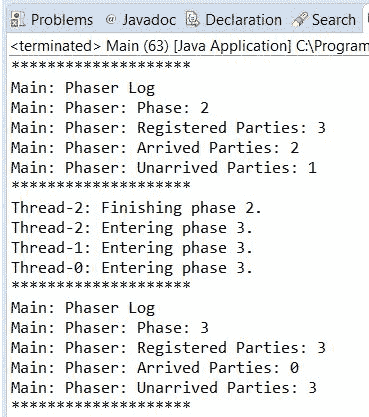

# 参见

+   在第三章的*运行并发阶段任务*食谱中，*线程同步工具*

# 监控 Executor 框架

`Executor`框架提供了一个机制，将任务的实现与线程的创建和管理分离，以便执行任务。如果你使用执行器，你只需要实现`Runnable`对象并将它们发送到执行器。管理线程是执行器的责任。当你向执行器发送任务时，它会尝试使用池化的线程来执行任务，以避免创建新的线程。这种机制由`Executor`接口及其实现类`ThreadPoolExecutor`类提供。

在本食谱中，你将学习可以获取有关`ThreadPoolExecutor`执行器状态的哪些信息以及如何获取这些信息。

# 准备工作

本例的食谱是用 Eclipse IDE 实现的。如果你使用 Eclipse 或 NetBeans 等其他 IDE，请打开它并创建一个新的 Java 项目。

# 如何做到这一点...

按照以下步骤实现示例：

1.  创建一个名为`Task`的类，该类实现了`Runnable`接口：

```java
        public class Task implements Runnable {

```

1.  声明一个名为`milliseconds`的私有`long`属性：

```java
        private final long milliseconds;

```

1.  实现类的构造函数以初始化其属性：

```java
        public Task (long milliseconds) { 
          this.milliseconds=milliseconds; 
        }

```

1.  实现接收`milliseconds`属性指定的时间数目的`run()`方法。将线程休眠指定的时间：

```java
        @Override 
        public void run() { 

          System.out.printf("%s: Begin\n",
                            Thread.currentThread().getName()); 
          try { 
            TimeUnit.MILLISECONDS.sleep(milliseconds); 
          } catch (InterruptedException e) { 
            e.printStackTrace(); 
          } 
          System.out.printf("%s: End\n",
                            Thread.currentThread().getName()); 

        }

```

1.  通过创建一个名为`Main`的类并包含一个`main()`方法来实现示例的主类：

```java
        public class Main { 

          public static void main(String[] args) throws Exception {

```

1.  使用`Executors`类的`newCachedThreadPool()`方法创建一个新的`Executor`对象：

```java
        ThreadPoolExecutor executor = (ThreadPoolExecutor)
                                Executors.newCachedThreadPool();

```

1.  创建并提交 10 个`Task`对象到执行器。用随机数初始化这些对象：

```java
        Random random=new Random(); 
        for (int i=0; i<10; i++) { 
          Task task=new Task(random.nextInt(10000)); 
          executor.submit(task); 
        }

```

1.  创建一个包含五个步骤的循环。在每一步中，通过调用`showLog()`方法并将线程休眠一秒钟来记录执行者的信息：

```java
        for (int i=0; i<5; i++){ 
          showLog(executor); 
          TimeUnit.SECONDS.sleep(1); 
        }

```

1.  使用`shutdown()`方法关闭执行器：

```java
        executor.shutdown();

```

1.  创建另一个包含五个步骤的循环。在每一步中，通过调用`showLog()`方法并将线程休眠一秒钟来记录执行者的信息：

```java
        for (int i=0; i<5; i++){ 
          showLog(executor); 
          TimeUnit.SECONDS.sleep(1); 
        }

```

1.  使用`awaitTermination()`方法等待执行器的最终化：

```java
        executor.awaitTermination(1, TimeUnit.DAYS);

```

1.  显示一条消息，表明程序结束：

```java
          System.out.printf("Main: End of the program.\n"); 
        }

```

1.  实现接收`Executor`作为参数的`showLog()`方法。记录池的大小、任务的数量和执行器的状态：

```java
        private static void showLog(ThreadPoolExecutor executor) { 
          System.out.printf("*********************"); 
          System.out.printf("Main: Executor Log"); 
          System.out.printf("Main: Executor: Core Pool Size: %d\n",
                            executor.getCorePoolSize()); 
          System.out.printf("Main: Executor: Pool Size: %d\n",
                            executor.getPoolSize()); 
          System.out.printf("Main: Executor: Active Count: %d\n",
                            executor.getActiveCount()); 
          System.out.printf("Main: Executor: Task Count: %d\n",
                            executor.getTaskCount()); 

```

```java
          System.out.printf("Main: Executor: Completed Task Count: %d\n",
                            executor.getCompletedTaskCount()); 
          System.out.printf("Main: Executor: Shutdown: %s\n",
                            executor.isShutdown()); 
          System.out.printf("Main: Executor: Terminating: %s\n",
                            executor.isTerminating()); 
          System.out.printf("Main: Executor: Terminated: %s\n",
                            executor.isTerminated()); 
          System.out.printf("*********************\n"); 
        }

```

# 它是如何工作的...

在这个菜谱中，你实现了一个任务，该任务会随机阻塞其执行线程一段时间（毫秒）。然后，你向执行器发送了 10 个任务，在你等待它们最终完成的同时，你将执行器的状态信息写入控制台。你使用了以下方法来获取`Executor`对象的状态：

+   `getCorePoolSize()`: 此方法返回一个`int`类型的数字，表示核心线程数。它是当执行器不执行任何任务时，内部线程池中将存在的最小线程数。

+   `getPoolSize()`: 此方法返回一个`int`类型的值，表示内部线程池的实际大小。

+   `getActiveCount()`: 此方法返回一个`int`类型的数字，表示当前正在执行任务的线程数量。

+   `getTaskCount()`: 此方法返回一个`long`类型的数字，表示已安排执行的任务数量。

+   `getCompletedTaskCount()`: 此方法返回一个`long`类型的数字，表示由该执行器执行并已完成执行的任务数量。

+   `isShutdown()`: 当调用执行器的`shutdown()`方法以完成其执行时，此方法返回一个`Boolean`值。

+   `isTerminating()`: 当执行器执行`shutdown()`操作但尚未完成时，此方法返回一个`Boolean`值。

+   `isTerminated()`: 当执行器完成其执行时，此方法返回一个`Boolean`值。

# 参见

+   第四章中“创建线程执行器和控制其拒绝的任务”菜谱的*Creating a thread executor and controlling its rejected tasks*，*Thread Executors*

+   第八章中“自定义 ThreadPoolExecutor 类”和“实现基于优先级的 Executor 类”菜谱的*Customizing the ThreadPoolExecutor class*和*Implementing a priority-based Executor class*，*Customizing Concurrency Classes*

# 监控 fork/join 池

Executor 框架提供了一个机制，允许你将任务实现与创建和管理执行任务的线程分离。Java 9 为特定类型的问题扩展了 Executor 框架，这将提高其他解决方案的性能（直接使用`Thread`对象或 Executor 框架）。它是 fork/join 框架。

该框架旨在解决可以使用`fork()`和`join()`操作分解成更小任务的问题。实现此行为的主要类是`ForkJoinPool`。

在这个菜谱中，你将了解关于`ForkJoinPool`类可以获取哪些信息以及如何获取这些信息。

# 准备工作

本菜谱的示例使用 Eclipse IDE 实现。如果你使用 Eclipse 或 NetBeans 等其他 IDE，请打开它并创建一个新的 Java 项目。

# 如何做到这一点...

按照以下步骤实现示例：

1.  创建一个名为`Task`的类，该类继承自`RecursiveAction`类：

```java
        public class Task extends RecursiveAction{

```

1.  声明一个名为 `array` 的私有 `int` 数组属性，用于存储您想要增加的元素数组：

```java
        private final int array[];

```

1.  声明两个名为 `start` 和 `end` 的私有 `int` 属性，用于存储此任务需要处理的元素块的开始和结束位置：

```java
        private final int start; 
        private final int end;

```

1.  实现类的构造函数以初始化其属性：

```java
        public Task (int array[], int start, int end) { 
          this.array=array; 
          this.start=start; 
          this.end=end; 
        }

```

1.  实现具有任务主要逻辑的 `compute()` 方法。如果任务需要处理超过 100 个元素，首先将元素分成两部分，创建两个任务来执行这些部分，使用 `fork()` 方法开始其执行，并最终使用 `join()` 方法等待其最终化：

```java
        protected void compute() { 
          if (end-start>100) { 
            int mid=(start+end)/2; 
            Task task1=new Task(array,start,mid); 
            Task task2=new Task(array,mid,end); 

            task1.fork(); 
            task2.fork(); 

            task1.join(); 
            task2.join();

```

1.  如果任务需要处理 100 个或更少的元素，通过在每个操作后将线程休眠 5 毫秒来增加元素：

```java
          } else { 
              for (int i=start; i<end; i++) { 
                array[i]++; 

                try { 
                  Thread.sleep(5); 
                } catch (InterruptedException e) { 
                  e.printStackTrace(); 
                } 
              } 
            } 
          } 
        }

```

1.  通过创建一个名为 `Main` 的类并具有 `main()` 方法来实现示例的主要类：

```java
        public class Main { 

          public static void main(String[] args) throws Exception {

```

1.  创建一个名为 `pool` 的 `ForkJoinPool` 对象：

```java
        ForkJoinPool pool=new ForkJoinPool();

```

1.  创建一个包含 10,000 个整数的数组，命名为 `array`：

```java
        int array[]=new int[10000];

```

1.  创建一个新的 `Task` 对象来处理整个数组：

```java
        Task task1=new Task(array,0,array.length);

```

1.  使用 `execute()` 方法将任务发送到池中执行：

```java
        pool.execute(task1);

```

1.  如果任务没有完成其执行，调用 `showLog()` 方法来写入有关 `ForkJoinPool` 类的状态的信息，并将线程休眠一秒：

```java
        while (!task1.isDone()) { 
          showLog(pool); 
          TimeUnit.SECONDS.sleep(1); 
        }

```

1.  使用 `shutdown()` 方法关闭池：

```java
        pool.shutdown();

```

1.  使用 `awaitTermination()` 方法等待池的最终化：

```java
        pool.awaitTermination(1, TimeUnit.DAYS);

```

1.  调用 `showLog()` 方法来写入有关 `ForkJoinPool` 类的状态的信息，并在控制台写入一条消息，指示程序的结束：

```java
        showLog(pool); 
        System.out.printf("Main: End of the program.\n");

```

1.  实现 `showLog()` 方法。它接收一个 `ForkJoinPool` 对象作为参数，并写入有关其状态以及正在执行的和任务的信息：

```java
        private static void showLog(ForkJoinPool pool) { 
          System.out.printf("**********************\n"); 
          System.out.printf("Main: Fork/Join Pool log\n"); 
          System.out.printf("Main: Fork/Join Pool: Parallelism: %d\n",
                            pool.getParallelism()); 
          System.out.printf("Main: Fork/Join Pool: Pool Size: %d\n",
                            pool.getPoolSize()); 
          System.out.printf("Main: Fork/Join Pool: Active Thread Count:
                             %d\n", pool.getActiveThreadCount()); 
          System.out.printf("Main: Fork/Join Pool: Running Thread Count:
                             %d\n", pool.getRunningThreadCount()); 
          System.out.printf("Main: Fork/Join Pool: Queued Submission:
                             %d\n", pool.getQueuedSubmissionCount()); 
          System.out.printf("Main: Fork/Join Pool: Queued Tasks: %d\n",
                            pool.getQueuedTaskCount()); 
          System.out.printf("Main: Fork/Join Pool: Queued Submissions:
                             %s\n", pool.hasQueuedSubmissions()); 
          System.out.printf("Main: Fork/Join Pool: Steal Count: %d\n",
                            pool.getStealCount()); 
          System.out.printf("Main: Fork/Join Pool: Terminated : %s\n",
                            pool.isTerminated()); 
          System.out.printf("**********************\n"); 
        }

```

# 它是如何工作的...

在这个菜谱中，您实现了一个任务，使用 `ForkJoinPool` 类和扩展了 `RecursiveAction` 类的 `Task` 类来增加数组的元素。这是您可以在 `ForkJoinPool` 类中执行的任务之一。当任务处理数组时，您将 `ForkJoinPool` 类的状态信息打印到控制台。您使用了以下方法来获取 `ForkJoinPool` 类的状态：

+   `getPoolSize()`: 此方法返回 `ForkJoinPool` 类内部池的工作线程数量的 `int` 值

+   `getParallelism()`: 此方法返回为池建立的期望的并行级别

+   `getActiveThreadCount()`: 此方法返回当前正在执行任务的线程数量

+   `getRunningThreadCount()`: 此方法返回未在任何同步机制中阻塞的工作线程数量

+   `getQueuedSubmissionCount()`: 此方法返回已提交到池中但尚未开始执行的任务数量

+   `getQueuedTaskCount()`: 此方法返回已提交到池中并已开始执行的任务数量

+   `hasQueuedSubmissions()`：此方法返回一个 `Boolean` 值，指示池是否已排队等待执行的任务

+   `getStealCount()`：此方法返回一个 `long` 值，指定工作线程从其他线程中窃取任务次数

+   `isTerminated()`：此方法返回一个 `Boolean` 值，指示 fork/join 池是否已完成其执行

# 相关内容

+   在 第五章 的 *创建 fork/join 池* 菜单中，*Fork/Join 框架*

+   在 第八章 的 *实现 ThreadFactory 接口以生成 fork/join 框架的自定义线程* 和 *自定义 fork/join 框架中运行的任务* 菜单中，*自定义并发类*

# 监控流

Java 中的流是一系列可以处理的元素（映射、过滤、转换、归约和收集），这些元素可以并行或顺序地在声明性操作的管道中使用 `lambda` 表达式进行处理。它是在 Java 8 中引入的，以改变人们以函数式方式处理大量数据的方式，用 `lambda` 表达式代替传统的命令式方式。

`Stream` 接口不像其他并发类那样提供很多方法来监控其状态。只有 `peek()` 方法允许你写入正在处理的元素的相关日志信息。在本菜谱中，你将学习如何使用此方法来写入有关流的信息。

# 准备工作

本菜谱的示例已使用 Eclipse IDE 实现。如果你使用 Eclipse 或其他 IDE，如 NetBeans，请打开它并创建一个新的 Java 项目。

# 如何操作...

按照以下步骤实现示例：

1.  创建一个名为 `Main` 的类，并包含一个 `main()` 方法。声明两个私有变量，即一个名为 `counter` 的 `AtomicInteger` 变量和一个名为 `random` 的 `Random` 对象：

```java
        public class Main { 
          public static void main(String[] args) { 

            AtomicLong counter = new AtomicLong(0); 
            Random random=new Random();

```

1.  创建一个包含 1,000 个随机 `double` 数字的流。创建的流是一个顺序流。你必须使用 `parallel()` 方法将其转换为并行流，并使用 `peek()` 方法增加 `counter` 变量的值并在控制台写入一条消息。之后，使用 `count()` 方法计算数组中的元素数量并将该数字存储在一个整型变量中。将存储在 `counter` 变量中的值和 `count()` 方法返回的值写入控制台：

```java
        long streamCounter = random.doubles(1000).parallel()
                             .peek( number -> { 
          long actual=counter.incrementAndGet(); 
          System.out.printf("%d - %f\n", actual, number); 
        }).count(); 

        System.out.printf("Counter: %d\n", counter.get()); 
        System.out.printf("Stream Counter: %d\n", streamCounter);

```

1.  现在，将 `counter` 变量的值设置为 0。创建另一个包含 1,000 个随机 `double` 数字的流。然后，使用 `parallel()` 方法将其转换为并行流，并使用 `peek()` 方法增加 `counter` 变量的值并在控制台写入一条消息。最后，使用 `forEach()` 方法将所有数字和计数器的值写入控制台：

```java
            counter.set(0); 
            random.doubles(1000).parallel().peek(number -> { 
              long actual=counter.incrementAndGet(); 
              System.out.printf("Peek: %d - %f\n", actual,number); 
            }).forEach( number -> { 
              System.out.printf("For Each: %f\n", number); 
            }); 

            System.out.printf("Counter: %d\n", counter.get()); 
          } 
        }

```

# 它是如何工作的...

在这个例子中，我们使用了`peek()`方法在两种不同的情况下来计算通过流这一步骤的元素数量，并在控制台中写入一条消息。

如第六章中所述，“并行和响应式流”，`Stream`有一个源，零个或多个中间操作，以及一个最终操作。在第一种情况下，我们的最终操作是`count()`方法。这个方法不需要处理元素来计算返回值，所以`peek()`方法永远不会被执行。你不会在控制台中看到任何`peek`方法的日志消息，计数器的值将是 0。

第二种情况不同。最后的操作是`forEach()`方法，在这种情况下，流中的所有元素都将被处理。在控制台中，你会看到`peek()`和`forEach()`方法的消息。`counter`变量的最终值将是 1,000。

`peek()`方法是一个流的中间操作。像所有中间操作一样，它们是延迟执行的，并且只处理必要的元素。这就是为什么它永远不会在第一种情况下执行的原因。

# 参见

+   第六章中的“从不同源创建流”、“减少流元素”和“收集流元素”食谱

# 编写有效的日志消息

**日志**系统是一种允许你将信息写入一个或多个目的地的机制。一个**Logger**具有以下组件：

+   **一个或多个处理器**：处理器将确定日志消息的目的地和格式。你可以将日志消息写入控制台、文件或数据库。

+   **一个名称**：通常，在类中使用的 Logger 名称基于类名及其包名。

+   **一个级别**：日志消息有不同的级别，表示它们的重要性。Logger 也有一个级别来决定它将要写入哪些消息。它只写入与其级别相同或更重要的消息。

你应该使用日志系统，主要有以下两个原因：

+   当捕获到异常时，尽可能多地编写信息。这将帮助你定位错误并解决它。

+   编写有关程序正在执行哪些类和方法的详细信息。

在这个食谱中，你将学习如何使用`java.util.logging`包提供的类将日志系统添加到你的并发应用程序中。

# 准备工作

本食谱的示例已使用 Eclipse IDE 实现。如果你使用 Eclipse 或不同的 IDE，例如 NetBeans，请打开它并创建一个新的 Java 项目。

# 如何操作...

按以下步骤实现示例：

1.  创建一个名为 `MyFormatter` 的类，该类扩展了 `java.util.logging.Formatter` 类。实现抽象的 `format()` 方法。它接收一个 `LogRecord` 对象作为参数，并返回一个包含日志消息的 `String` 对象：

```java
        public class MyFormatter extends Formatter { 
          @Override 
          public String format(LogRecord record) { 

            StringBuilder sb=new StringBuilder(); 
            sb.append("["+record.getLevel()+"] - "); 
            sb.append(new Date(record.getMillis())+" : "); 
            sb.append(record.getSourceClassName()+ "."
                      +record.getSourceMethodName()+" : "); 
            sb.append(record.getMessage()+"\n");. 
            return sb.toString(); 
          }

```

1.  创建一个名为 `MyLoggerFactory` 的类：

```java
        public class MyLoggerFactory {

```

1.  声明一个名为 `handler` 的私有静态 `Handler` 属性：

```java
        private static Handler handler;

```

1.  实现一个名为 `getLogger()` 的公共静态方法，用于创建你将要用于写入日志消息的 `Logger` 对象。它接收一个名为 `name` 的 `String` 参数。我们使用 `synchronized` 关键字同步此方法：

```java
        public synchronized static Logger getLogger(String name){

```

1.  使用 `Logger` 类的 `getLogger()` 方法获取与参数名称关联的 `java.util.logging.Logger`：

```java
        Logger logger=Logger.getLogger(name);

```

1.  使用 `setLevel()` 方法设置日志级别，以便写入所有日志消息：

```java
        logger.setLevel(Level.ALL);

```

1.  如果处理程序属性具有空值，创建一个新的 `FileHandler` 对象以将日志消息写入 `recipe8.log` 文件。将 `MyFormatter` 对象分配给此处理程序；使用 `setFormatter()` 对象将其分配为格式化程序：

```java
        try { 
          if (handler==null) { 
            handler=new FileHandler("recipe6.log"); 
            Formatter format=new MyFormatter(); 
            handler.setFormatter(format); 
          }

```

1.  如果 `Logger` 对象没有与之关联的处理程序，请使用 `addHandler()` 方法分配处理程序：

```java
            if (logger.getHandlers().length==0) { 
              logger.addHandler(handler); 
            } 
          } catch (SecurityException e | IOException e) { 
          e.printStackTrace(); 
        }

```

1.  返回创建的 `Logger` 对象：

```java
          return logger; 
        }

```

1.  创建一个名为 `Task` 的类，该类实现了 `Runnable` 接口。它将用于测试你的 `Logger` 对象：

```java
        public class Task implements Runnable {

```

1.  实现 `run()` 方法：

```java
        @Override 
        public void run() {

```

1.  首先，声明一个名为 `logger` 的 `Logger` 对象。使用 `MyLogger` 类的 `getLogger()` 方法初始化它，通过传递此类的名称作为参数：

```java
        Logger logger= MyLogger.getLogger(this.getClass().getName());

```

1.  使用 `entering()` 方法写入一个日志消息，表明方法执行的开始：

```java
        logger.entering(Thread.currentThread().getName(), "run()");

```

1.  让线程休眠两秒钟：

```java
        try { 
          TimeUnit.SECONDS.sleep(2); 
        } catch (InterruptedException e) { 
          e.printStackTrace(); 
        }

```

1.  使用 `exiting()` 方法写入一个日志消息，表明方法执行的结束：

```java
          logger.exiting(Thread.currentThread().getName(), "run()",
                         Thread.currentThread()); 
        }

```

1.  通过创建一个名为 `Main` 的类并包含 `main()` 方法来实现示例的主类：

```java
        public class Main { 
          public static void main(String[] args) {

```

1.  声明一个名为 `logger` 的 `Logger` 对象。使用 `MyLogger` 类的 `getLogger()` 方法通过传递 `Core` 字符串作为参数来初始化它：

```java
        Logger logger=MyLogger.getLogger(Main.class.getName());

```

1.  使用 `entering()` 方法写入一个日志消息，表明主程序执行的开始：

```java
        logger.entering(Main.class.getName(), "main()",args);

```

1.  创建一个用于存储五个线程的 `Thread` 数组：

```java
        Thread threads[]=new Thread[5];

```

1.  创建五个 `Task` 对象和五个线程来执行它们。写入日志消息以表明你将启动一个新线程，并且已经创建了线程：

```java
        for (int i=0; i<threads.length; i++) { 
          logger.log(Level.INFO,"Launching thread: "+i); 
          Task task=new Task(); 
          threads[i]=new Thread(task); 
          logger.log(Level.INFO,"Thread created: "+
                     threads[i].getName()); 
          threads[i].start(); 
        }

```

1.  写入一个日志消息以表明你已创建了线程：

```java
        logger.log(Level.INFO,"Ten Threads created."+
                   "Waiting for its finalization");

```

1.  使用 `join()` 方法等待五个线程的最终化。在每个线程最终化后，写入一个日志消息，表明线程已结束：

```java
        for (int i=0; i<threads.length; i++) { 
          try { 
            threads[i].join(); 
            logger.log(Level.INFO,"Thread has finished its execution",
                       threads[i]); 
          } catch (InterruptedException e) { 
            logger.log(Level.SEVERE, "Exception", e); 
          } 
        }

```

1.  使用 `exiting()` 方法写入一个日志消息以表明主程序执行的结束：

```java
          logger.exiting(Main.class.getName(), "main()"); 
        }

```

# 如何工作...

在这个菜谱中，您使用了 Java 日志 API 提供的`Logger`类来在并发应用程序中写入日志消息。首先，您实现了`MyFormatter`类来为日志消息分配格式。此类扩展了声明抽象`format()`方法的`Formatter`类。此方法接收一个包含日志消息所有信息的`LogRecord`对象，并返回一个格式化的日志消息。在您的类中，您使用了以下`LogRecord`类的方法来获取有关日志消息的信息：

+   `getLevel()`: 返回消息的级别

+   `getMillis()`: 返回消息发送到`Logger`对象时的日期

+   `getSourceClassName()`: 返回向`Logger`发送消息的类的名称

+   `getSourceMessageName()`: 返回向`Logger`发送消息的方法的名称

+   `getMessage()`: 返回日志消息

`MyLogger`类实现了静态方法`getLogger()`。此方法创建一个`Logger`对象，并将一个`Handler`对象分配给写入应用程序的日志消息到`recipe6.log`文件，使用`MyFormatter`格式化器。您通过`Logger`类的静态方法`getLogger()`创建`Logger`对象。此方法根据传递的参数名称返回不同的对象。您只创建了一个`Handler`对象，因此所有`Logger`对象都将它们的日志消息写入同一个文件。您还配置了记录器，无论其级别如何，都写入所有日志消息。

最后，您实现了一个`Task`对象和一个主程序，该程序在日志文件中写入不同的日志消息。您使用了以下方法：

+   `entering()`: 用于写入一个带有`FINER`级别的消息，表示一个方法已开始其执行

+   `exiting()`: 用于写入一个带有`FINER`级别的消息，表示一个方法已结束其执行

+   `log()`: 用于写入指定级别的消息

# 还有更多...

当您与日志系统一起工作时，您必须考虑两个重要点：

+   **写入必要的信息**：如果您写入的信息太少，记录器将没有用，因为它无法完成其目的。如果您写入大量信息，您将生成大量难以管理的日志文件；这将使获取必要信息变得困难。

+   **使用适当的消息级别**：如果您写入高级信息消息或低级错误消息，您将使查看日志文件的用户感到困惑。这将使在错误情况下了解发生了什么变得更加困难；或者，您将拥有过多的信息，这使得了解错误的主要原因变得困难。

有其他库提供了比`java.util.logging`包更完整的日志系统，例如`Log4j`或`slf4j`库。但是`java.util.logging`包是 Java API 的一部分，并且所有方法都是线程安全的；因此，我们可以在并发应用程序中使用它而不会出现问题。

# 参见

+   第七章中的*使用非阻塞线程安全的 deque*、*使用阻塞线程安全的 deque*、*使用按优先级排序的阻塞线程安全的队列*、*使用延迟元素的线程安全列表*和*使用线程安全的可导航映射*食谱，*并发集合*

# 使用 FindBugs 分析并发代码

**静态代码分析工具**是一组在查找潜在错误时分析应用程序源代码的工具。这些工具，如 Checkstyle、PMD 或 FindBugs，有一套预定义的编码规范规则，并解析源代码以查找违反这些规则的实例。目标是尽早找到错误或可能导致性能不佳的地方，在它们在生产环境中执行之前。编程语言通常提供此类工具，Java 也不例外。帮助分析 Java 代码的工具之一是 FindBugs。它是一个开源工具，包含一系列用于分析 Java 并发代码的规则。

在这个食谱中，您将学习如何使用这个工具来分析您的 Java 并发应用程序。

# 准备工作

在开始这个食谱之前，从项目的网页上下载 FindBugs（[`findbugs.sourceforge.net/`](http://findbugs.sourceforge.net/)）。您可以下载一个独立的应用程序或 Eclipse 插件。在这个食谱中，我使用了独立版本。

在撰写本文时，FindBugs 的实际版本（3.0.1）不包括对 Java 9 的支持。您可以从[`github.com/findbugsproject/findbugs/releases/tag/3.1.0_preview1`](https://github.com/findbugsproject/findbugs/releases/tag/3.1.0_preview1)下载支持 Java 9 的 3.1.0 版本预览。

# 如何操作...

按照以下步骤实现示例：

1.  创建一个名为`Task`的类，该类扩展了`Runnable`接口：

```java
        public class Task implements Runnable {

```

1.  声明一个名为`lock`的私有`ReentrantLock`属性：

```java
        private ReentrantLock lock;

```

1.  实现类的构造函数：

```java
        public Task(ReentrantLock lock) { 
          this.lock=lock; 
        }

```

1.  实现`run()`方法。获取锁的控制权，让线程休眠 2 秒，然后释放锁：

```java
        @Override 
        public void run() { 
          lock.lock(); 
          try { 
            TimeUnit.SECONDS.sleep(1); 
            lock.unlock(); 
          } catch (InterruptedException e) { 
            e.printStackTrace(); 
          } 
        }

```

1.  通过创建一个名为`Main`的类并包含一个`main()`方法来创建示例的主类：

```java
        public class Main { 
          public static void main(String[] args) {

```

1.  声明并创建一个名为`lock`的`ReentrantLock`对象：

```java
        ReentrantLock lock=new ReentrantLock();

```

1.  创建 10 个`Task`对象和 10 个线程来执行任务。通过调用`run()`方法来启动线程：

```java
          for (int i=0; i<10; i++) { 
            Task task=new Task(lock); 
            Thread thread=new Thread(task); 
            thread.run(); 
          } 
        }

```

1.  将项目导出为`.jar`文件。命名为`recipe7.jar`。使用您 IDE 的菜单选项或`javac`和`.jar`命令来编译和压缩您的应用程序。

1.  通过在 Windows 上运行`findbugs.bat`命令或在 Linux 上运行`findbugs.sh`命令来启动 FindBugs 独立应用程序。

1.  通过在菜单栏中的文件菜单下点击新建项目选项来创建新项目：

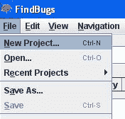

1.  *FindBugs* 应用程序显示一个窗口来配置项目。在项目名称字段中，输入 `Recipe07`。在分析类路径字段（jar、ear、war、zip 或目录）中，添加包含项目的 `.jar` 文件。在源代码目录字段（可选；浏览找到的错误时使用的类），添加示例源代码的目录。参考以下截图：


1.  点击分析按钮以创建新项目并分析其代码。

1.  *FindBugs* 应用程序显示了代码的分析结果。在这种情况下，它找到了两个错误。

1.  点击其中一个错误，你将在右侧面板中看到错误的源代码，并在屏幕底部的面板中看到错误的描述。

# 它是如何工作的...

以下截图显示了 FindBugs 分析的结果：

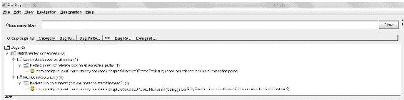

分析检测到应用程序中的以下两个潜在错误：

+   其中一个错误检测到 `Task` 类的 `run()` 方法中。如果抛出 `InterruptedExeption` 异常，任务不会释放锁，因为它不会执行 `unlock()` 方法。这可能会在应用程序中引起死锁情况。

+   另一个错误检测到在 `Main` 类的 `main()` 方法中，因为你直接调用了线程的 `run()` 方法，而不是调用 `start()` 方法来开始线程的执行。

如果你双击两个错误之一，你将看到有关它的详细信息。由于你在项目配置中包含了源代码引用，你还将看到检测到错误的源代码。以下截图显示了此示例：

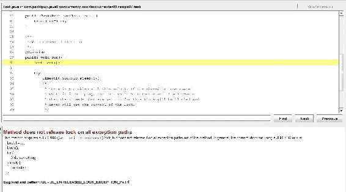

# 更多...

注意，FindBugs 只能检测到一些问题情况（与并发代码相关或不相关）。例如，如果你在 `Task` 类的 `run()` 方法中删除 `unlock()` 调用并重复分析，FindBugs 不会警告你

你将在任务中获得锁，但你永远无法释放它。

将静态代码分析工具作为提高代码质量的一种辅助手段使用，但不要期望它能检测到所有错误。

# 参见

+   本章中关于 *配置 NetBeans 以调试并发代码* 的配方

# 配置 Eclipse 以调试并发代码

现在，几乎每个程序员，无论使用哪种编程语言，都会使用 IDE 来创建他们的应用程序。它们在同一个应用程序中集成了许多有趣的功能，例如：

+   项目管理

+   自动代码生成

+   自动文档生成

+   与版本控制系统的集成

+   用于测试应用程序的调试器

+   用于创建项目和应用程序元素的不同的向导

IDE 最有用的功能之一是调试器。使用它，你可以逐步执行你的应用程序并分析程序中所有对象和变量的值。

如果你使用 Java，Eclipse 是最受欢迎的 IDE 之一。它集成了调试器，允许你测试你的应用程序。默认情况下，当你调试一个并发应用程序并且调试器发现一个断点时，它只会停止带有断点的线程，同时允许其他线程继续执行。在这个菜谱中，你将学习如何更改此配置以帮助你测试并发应用程序。

# 准备工作

你必须已经安装了 Eclipse IDE。打开它，并选择一个实现了并发应用程序的项目，例如，书中实现的一个菜谱。

# 如何操作...

按照以下步骤实现示例：

1.  导航到窗口 | 首选项。

1.  在左侧菜单中展开 Java 选项。

1.  然后，选择调试选项。以下截图说明了窗口：

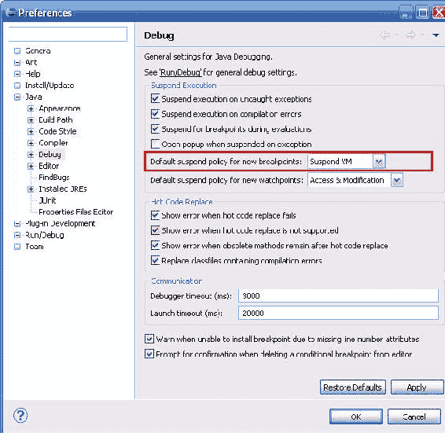

1.  将默认挂起策略的值从“挂起线程”更改为“挂起虚拟机”（在截图中被标记为红色）。

1.  点击“确定”按钮以确认更改。

# 工作原理...

如本菜谱介绍中所述，默认情况下，当你使用 Eclipse 调试并发 Java 应用程序并且调试过程发现断点时，它只会挂起第一个遇到断点的线程，但允许其他线程继续执行。以下截图展示了这种情况的示例：

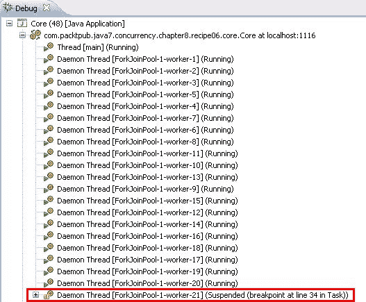

你可以看到，只有 worker-21 被挂起（在截图中被标记为红色），而其他线程仍在运行。然而，在调试并发应用程序时，如果你将默认挂起策略更改为“挂起虚拟机”，所有线程将挂起它们的执行，调试过程将遇到断点。以下截图展示了这种情况的示例：

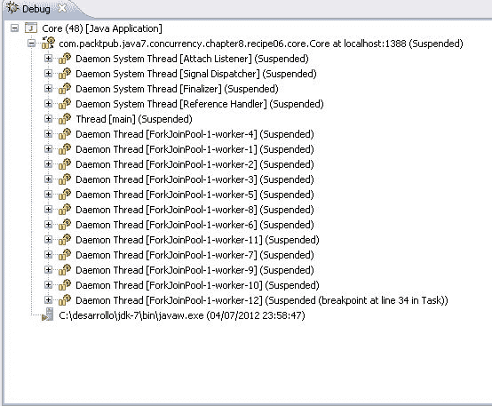

通过更改，你可以看到所有线程都被挂起。你可以继续调试任何你想要的线程。选择最适合你需求的挂起策略。

# 配置 NetBeans 以调试并发代码

软件是开发能够正常工作、符合公司质量标准并且可以轻松修改（在尽可能低的时间和成本下）的应用程序所必需的。为了实现这一目标，使用能够集成多个工具（编译器和调试器）以在一个共同界面下简化应用程序开发的 IDE 是至关重要的。

如果你使用 Java，NetBeans 也是最受欢迎的 IDE 之一。它集成了调试器，允许你测试你的应用程序。

在这个菜谱中，你将学习如何更改 NetBeans 调试器的配置以帮助你测试并发应用程序。

# 准备工作

你应该已经安装了 NetBeans IDE。打开它，并创建一个新的 Java 项目。

# 如何操作...

按照以下步骤实现示例：

1.  创建一个名为 `Task1` 的类，并指定它实现 `Runnable` 接口：

```java
        public class Task1 implements Runnable {

```

1.  声明两个名为 `lock1` 和 `lock2` 的私有 `Lock` 属性：

```java
        private Lock lock1, lock2;

```

1.  实现类的构造函数以初始化其属性：

```java
        public Task1 (Lock lock1, Lock lock2) { 
          this.lock1=lock1; 
          this.lock2=lock2; 
        }

```

1.  实现 `run()` 方法。首先，使用 `lock()` 方法获取 `lock1` 对象的控制权，并在控制台写入一条消息，表明你已获取它：

```java
        @Override 
        public void run() { 
          lock1.lock(); 
          System.out.printf("Task 1: Lock 1 locked\n");

```

1.  然后，使用 `lock()` 方法获取 `lock2` 的控制权，并在控制台写入一条消息，表明你已获取它：

```java
        lock2.lock(); 
        System.out.printf("Task 1: Lock 2 locked\n");

```

1.  最后，释放两个锁对象——首先释放 `lock2` 对象，然后释放 `lock1` 对象：

```java
          lock2.unlock(); 
          lock1.unlock(); 
        }

```

1.  创建一个名为 `Task2` 的类，并指定它实现 `Runnable` 接口：

```java
        public class Task2 implements Runnable{

```

1.  声明两个名为 `lock1` 和 `lock2` 的私有 `Lock` 属性：

```java
        private Lock lock1, lock2;

```

1.  实现类的构造函数以初始化其属性：

```java
        public Task2(Lock lock1, Lock lock2) { 
          this.lock1=lock1; 
          this.lock2=lock2; 
        }

```

1.  实现 `run()` 方法。首先，使用 `lock()` 方法获取 `lock2` 对象的控制权，并在控制台写入一条消息，表明你已获取它：

```java
        @Override 
        public void run() { 
          lock2.lock(); 
          System.out.printf("Task 2: Lock 2 locked\n");

```

1.  然后，使用 `lock()` 方法获取 `lock1` 的控制权，并在控制台写入一条消息，表明你已获取它：

```java
        lock1.lock(); 
        System.out.printf("Task 2: Lock 1 locked\n");

```

1.  最后，释放两个锁对象——首先释放 `lock1`，然后释放 `lock2`：

```java
          lock1.unlock(); 
          lock2.unlock(); 
        }

```

1.  通过创建一个名为 `Main` 的类并添加 `main()` 方法来实现示例的主类：

```java
        public class Main {

```

1.  创建两个名为 `lock1` 和 `lock2` 的锁对象：

```java
        Lock lock1, lock2; 
        lock1=new ReentrantLock(); 
        lock2=new ReentrantLock();

```

1.  创建一个名为 `task1` 的 `Task1` 对象：

```java
        Task1 task1=new Task1(lock1, lock2);

```

1.  创建一个名为 `task2` 的 `Task2` 对象：

```java
        Task2 task2=new Task2(lock1, lock2);

```

1.  使用两个线程执行两个任务：

```java
        Thread thread1=new Thread(task1); 
        Thread thread2=new Thread(task2); 

        thread1.start(); 
        thread2.start();

```

1.  当两个任务完成执行时，每 500 毫秒在控制台写入一条消息。使用 `isAlive()` 方法检查线程是否已完成其执行：

```java
        while ((thread1.isAlive()) &&(thread2.isAlive())) { 
          System.out.println("Main: The example is"+ "running"); 
          try { 
            TimeUnit.MILLISECONDS.sleep(500); 
          } catch (InterruptedException ex) { 
            ex.printStackTrace(); 
          } 
        }

```

1.  在 `Task1` 类的 `run()` 方法的 `printf()` 方法第一次调用处添加一个断点。

1.  调试程序。你将在主 NetBeans 窗口的左上角看到调试窗口。下一张截图展示了包含执行 `Task1` 对象的线程的窗口。该线程正在断点处等待。应用程序的其他线程正在运行：

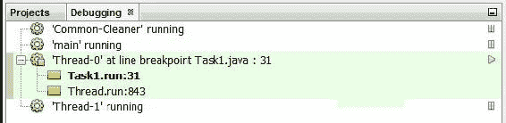

1.  暂停主线程的执行。选择线程，右键单击它，并选择“挂起”选项。以下截图显示了调试窗口的新外观。请参考以下截图：

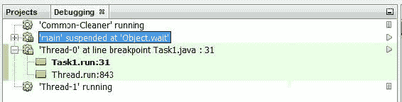

1.  恢复两个暂停的线程。选择每个线程，右键单击它们，并选择“恢复”选项。

# 它是如何工作的...

在使用 NetBeans 调试并发应用程序时，当调试器遇到断点时，它会挂起遇到断点的线程，并在主窗口的左上角显示包含当前正在运行的线程的调试窗口。

你可以使用窗口暂停或恢复当前正在运行的线程，使用“暂停”或“恢复”选项。你还可以使用“变量”选项卡查看线程的变量或属性值。

NetBeans 还包括一个死锁检测器。当你从调试菜单中选择检查死锁选项时，NetBeans 会分析你正在调试的应用程序，以确定是否存在死锁情况。本例展示了一个明显的死锁。第一个线程首先获取 `lock1`，然后是 `lock2`。第二个线程以相反的顺序获取锁。插入的断点引发了死锁，但如果你使用 NetBeans 死锁检测器，你将找不到任何东西。因此，应谨慎使用此选项。通过 `synchronized` 关键字更改两个任务中使用的锁，并再次调试程序。`Task1` 的代码如下：

```java
    @Override 
    public void run() { 
      synchronized(lock1) { 
        System.out.printf("Task 1: Lock 1 locked\n"); 
        synchronized(lock2) { 
          System.out.printf("Task 1: Lock 2 locked\n"); 
        } 
      } 
    }

```

`Task2` 类的代码将与这个类似，但它改变了锁的顺序。如果你再次调试这个示例，你将再次遇到死锁。然而，在这种情况下，它被死锁检测器检测到，如下面的截图所示：

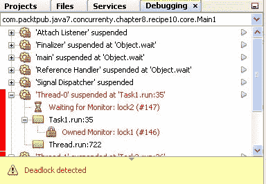

# 更多...

有选项可以控制调试器。从工具菜单中选择选项。然后，选择杂项选项和 Java 调试器选项卡。以下截图说明了此窗口：

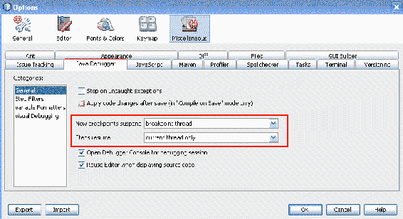

窗口中有两个选项可以控制之前描述的行为：

+   新断点挂起：使用此选项，你可以配置 NetBeans 的行为，它在一个线程中找到一个断点。你可以只挂起带有断点的那个线程或应用的所有线程。

+   步骤总结：使用此选项，你可以配置 NetBeans 在恢复线程时的行为。你可以只恢复当前线程或所有线程。

两个选项都在前面展示的截图中做了标记。

# 参见

+   本章中 *配置 Eclipse 以调试并发代码* 的配方

# 使用 MultithreadedTC 测试并发代码

`MultithreadedTC` 是一个用于测试并发应用的 Java 库。其主要目标是解决并发应用的非确定性问题的解决方案。你无法控制构成应用的不同线程的执行顺序。为此，它包括一个内部 **节拍器**。这些测试线程作为类的方法实现。

在本配方中，你将学习如何使用 `MultithreadedTC` 库来实现对 `LinkedTransferQueue` 的测试。

# 准备工作

从 [`code.google.com/archive/p/multithreadedtc/`](https://code.google.com/archive/p/multithreadedtc/) 下载 MultithreadedTC 库和 JUnit 库，版本 4.10，从 [`junit.org/junit4/`](http://junit.org/junit4/)。将 `junit-4.10.jar` 和 `MultithreadedTC-1.01.jar` 文件添加到项目的库中。

# 如何操作...

按照以下步骤实现示例：

1.  创建一个名为 `ProducerConsumerTest` 的类，该类扩展了 `MultithreadedTestCase` 类：

```java
        public class ProducerConsumerTest extends MultithreadedTestCase {

```

1.  声明一个名为 `queue` 的私有 `LinkedTransferQueue` 属性参数，该参数由 `String` 类指定：

```java
        private LinkedTransferQueue<String> queue;

```

1.  实现`initialize()`方法。此方法不会接收任何参数，也不会返回任何值。它将调用其父类的`initialize()`方法，然后初始化队列属性：

```java
        @Override 
        public void initialize() { 
          super.initialize(); 
          queue=new LinkedTransferQueue<String>(); 
          System.out.printf("Test: The test has been initialized\n"); 
        }

```

1.  实现`thread1()`方法。它将实现第一个消费者的逻辑。调用队列的`take()`方法，然后将返回的值写入控制台：

```java
        public void thread1() throws InterruptedException { 
          String ret=queue.take(); 
          System.out.printf("Thread 1: %s\n",ret); 
        }

```

1.  实现`thread2()`方法。它将实现第二个消费者的逻辑。首先等待第一个线程在`take()`方法中休眠。为了使线程休眠，使用`waitForTick()`方法。然后，调用队列的`take()`方法并将返回的值写入控制台：

```java
        public void thread2() throws InterruptedException { 
          waitForTick(1); 
          String ret=queue.take(); 
          System.out.printf("Thread 2: %s\n",ret); 
        }

```

1.  实现`thread3()`方法。它将实现生产者的逻辑。

    首先，等待两个消费者在`take()`方法中被阻塞；使用`waitForTick()`方法两次来阻塞此方法。然后，调用队列的`put()`方法，在队列中插入两个字符串：

```java
         public void thread3() { 
          waitForTick(1); 
          waitForTick(2); 
          queue.put("Event 1"); 
          queue.put("Event 2"); 
          System.out.printf("Thread 3: Inserted two elements\n"); 
        }

```

1.  最后，实现`finish()`方法。在控制台写入一条消息，以指示测试已完成其执行。使用`assertEquals()`方法检查两个事件是否已被消费（因此队列的大小为`0`）：

```java
        public void finish() { 
          super.finish(); 
          System.out.printf("Test: End\n"); 
          assertEquals(true, queue.size()==0); 
          System.out.printf("Test: Result: The queue is empty\n"); 
        }

```

1.  接下来，通过创建一个名为`Main`的类并包含一个`main()`方法来实现示例的主类：

```java
        public class Main { 
          public static void main(String[] args) throws Throwable {

```

1.  创建一个名为`test`的`ProducerConsumerTest`对象：

```java
        ProducerConsumerTest test=new ProducerConsumerTest();

```

1.  使用`TestFramework`类的`runOnce()`方法执行测试：

```java
        System.out.printf("Main: Starting the test\n"); 
        TestFramework.runOnce(test); 
        System.out.printf("Main: The test has finished\n");

```

# 它是如何工作的...

在这个示例中，你使用了`MultithreadedTC`库对`LinkedTransferQueue`类进行了测试。你可以使用这个库及其节拍器在任何一个并发应用程序或类中实现测试。在示例中，你实现了经典的生产者/消费者问题，其中包含两个消费者和一个生产者。你想要测试的是，在缓冲区中引入的第一个`String`对象被第一个到达缓冲区的消费者消费，而在缓冲区中引入的第二个`String`对象被第二个到达缓冲区的消费者消费。

`MultithreadedTC`库基于 JUnit 库，这是在 Java 中实现单元测试最常使用的库。要使用`MultithreadedTC`库实现基本测试，你必须扩展`MultithreadedTestCase`类。这个类扩展了包含所有检查测试结果方法的`junit.framework.AssertJUnit`类。它没有扩展`junit.framework.TestCase`类，因此你不能将 MultithreadedTC 测试与其他 JUnit 测试集成。

然后，你可以实现以下方法：

+   `initialize()`: 此方法的实现是可选的。它在启动测试时执行，因此你可以用它来初始化使用测试的对象。

+   `finish()`: 此方法的实现是可选的。它在测试完成后执行。你可以用它来关闭或释放测试期间使用的资源，或者检查测试的结果。

+   实现测试的方法：这些方法包含你实现的测试的主要逻辑。它们必须以`thread`关键字开头，后跟一个字符串，例如，`thread1()`。

为了控制线程的执行顺序，你使用了`waitForTick()`方法。此方法接收一个整数参数，并将正在执行该方法的线程休眠，直到测试中运行的线程全部阻塞。当它们阻塞时，`MultithreadedTC`库通过调用`waitForTick()`方法恢复被阻塞的线程。

你传递给`waitForTick()`方法的整数用于控制执行顺序。`MultithreadedTC`库的节拍器有一个内部计数器。当所有线程都阻塞时，库将此计数器递增到`waitForTick()`调用中指定的下一个数字。

内部，当`MultithreadedTC`库需要执行一个测试时，首先执行`initialize()`方法。然后为以`thread`关键字开头的方法（在你的例子中，是`thread1()`、`thread2()`和`thread3()`）创建一个线程。当所有线程完成执行后，它执行`finish()`方法。为了执行测试，你使用了`TestFramework`类的`runOnce()`方法。

# 更多内容...

如果`MultithreadedTC`库检测到测试的所有线程都阻塞，除了`waitForTick()`方法外，测试将被声明为死锁状态，并抛出`java.lang.IllegalStateException`异常。

# 参见

+   本章中关于*使用 FindBugs 分析并发代码*的菜谱

# 使用 JConsole 进行监控

**JConsole**是一个遵循 JMX 规范的监控工具，允许你获取有关应用程序执行的信息，例如线程数、内存使用或类加载。它包含在 JDK 中，可以用来监控本地或远程应用程序。在这个菜谱中，你将学习如何使用这个工具来监控一个简单的并发应用程序。

# 准备工作

本菜谱的示例使用 Eclipse IDE 实现。如果你使用 Eclipse 或 NetBeans 等不同的 IDE，打开它并创建一个新的 Java 项目。

# 如何做...

按照以下步骤实现示例：

1.  创建一个名为`Task`的类并指定`Runnable`接口。实现`run()`方法，在 100 秒内在控制台写入消息：

```java
        public class Task implements Runnable { 

          @Override 
          public void run() { 

            Date start, end; 
            start = new Date(); 
            do { 
              System.out.printf("%s: tick\n",
                                Thread.currentThread().getName()); 
              end = new Date(); 
            } while (end.getTime() - start.getTime() < 100000); 
          } 
        }

```

1.  实现带有`main()`方法的`Main`类。创建 10 个`Task`对象以创建 10 个线程。启动它们并使用`join()`方法等待它们的最终化：

```java
        public class Main { 
          public static void main(String[] args) { 

            Thread[] threads = new Thread[10]; 

            for (int i=0; i<10; i++) { 
              Task task=new Task(); 
              threads[i]=new Thread(task); 
              threads[i].start(); 
            } 

            for (int i=0; i<10; i++) { 
              try { 
                threads[i].join(); 
              } catch (InterruptedException e) { 
                e.printStackTrace(); 
              } 
            } 
          } 
        }

```

1.  打开一个控制台窗口并执行`JConsole`应用程序。它包含在 JDK-9 安装的 bin 目录中：

# 它是如何工作的...

在这个菜谱中，我们实现了一个非常简单的例子：运行 10 个线程 100 秒。这些线程是在控制台写入消息的线程。

当您执行 JConsole 时，您将看到一个窗口，显示您系统中正在运行的全部 Java 应用程序。您可以选择要监控的应用程序。窗口将类似于以下内容：

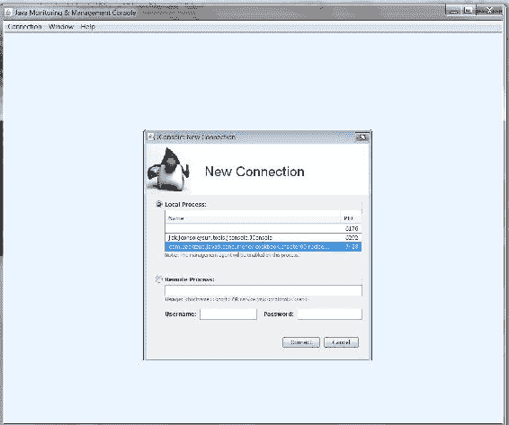

在此情况下，我们选择我们的示例应用程序并点击“连接”按钮。然后，您将被要求与应用程序建立不安全的连接，对话框类似于以下内容：

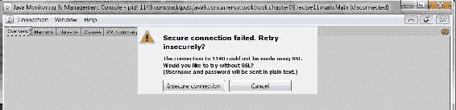

点击“不安全连接”按钮。JConsole 将使用六个标签页显示您应用程序的信息：

+   “概览”标签页提供了内存使用情况、应用程序中运行的线程数量、创建的对象数量以及应用程序的 CPU 使用情况的概述。

+   “内存”标签页显示了应用程序使用的内存量。它有一个组合框，您可以选择要监控的内存类型（堆、非堆或池）。

+   “线程”标签页显示了应用程序中的线程数量以及每个线程的详细信息。

+   “类”标签页显示了应用程序中加载的对象数量信息。

+   “VW 概览”标签页提供了运行应用程序的 JVM 的摘要。

+   “MBeans”标签页显示了应用程序的管理 bean 信息。

“线程”标签页类似于以下内容：

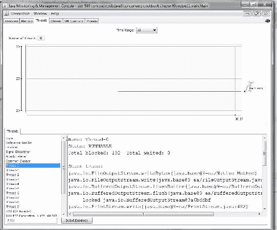

它分为两个不同的部分。在上部，您有关于**峰值**线程数量（用红线表示）和**活动线程**数量（用蓝线表示）的实时信息。在下部，我们有一个活动线程列表。当您选择这些线程之一时，您将看到该线程的详细信息，包括其状态和实际的堆栈跟踪。

# 更多内容...

您可以使用其他应用程序来监控运行 Java 的应用程序。例如，您可以使用包含在 JDK 中的 VisualVM。您可以在[`visualvm.github.io`](https://visualvm.github.io)获取关于 visualvm 的必要信息。

# 参见

+   本章中关于使用**MultithreadedTC**进行并发代码测试的配方
