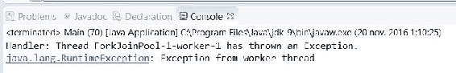
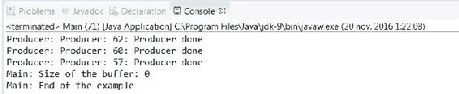

# 第十章：补充信息

在本章中，我们将涵盖以下主题：

+   在 Executor 框架中处理 `Runnable` 对象的结果

+   在 ForkJoinPool 类中处理未受控的异常

+   使用阻塞线程安全的队列与生产者和消费者进行通信

+   监控 `Thread` 类

+   监控 `Semaphore` 类

+   生成并发随机数

# 简介

本章包括关于 `Executor` 框架和 fork/join 框架、并发数据结构、监控并发对象以及生成并发随机数的食谱。

# 在 Executor 框架中处理 `Runnable` 对象的结果

`Executor` 框架允许使用 `Callable` 和 `Future` 接口执行返回结果的并发任务。Java 中的传统并发编程基于 `Runnable` 对象，但这种类型的对象不返回结果。

在本食谱中，你将学习如何将 `Runnable` 对象适配为 `Callable` 对象，允许并发任务返回结果。

# 准备工作

本食谱的示例已使用 Eclipse IDE 实现。如果你使用 Eclipse 或其他 IDE，如 NetBeans，请打开它并创建一个新的 Java 项目。

# 如何做到这一点...

执行以下步骤以实现示例：

1.  创建一个名为 `FileSearch` 的类，并指定它实现 `Runnable` 接口。此类实现了文件搜索操作：

```java
        public class FileSearch implements Runnable { 

```

1.  声明两个私有 `String` 属性：一个名为 `initPath`，它将存储搜索操作的初始文件夹，另一个名为 `end`，它将存储此任务将要查找的文件的扩展名：

```java
        private String initPath; 
        private String end; 

```

1.  声明一个名为 `results` 的私有 `List<String>` 属性，该属性将存储此任务找到的文件的完整路径：

```java
        private List<String> results; 

```

1.  实现类的构造函数，初始化其属性：

```java
        public FileSearch(String initPath, String end) { 
          this.initPath = initPath; 
          this.end = end; 
          results=new ArrayList<>(); 
        } 

```

1.  实现方法 `getResults()`。此方法返回包含此任务找到的文件完整路径的列表：

```java
        public List<String> getResults() { 
          return results; 
        } 

```

1.  实现方法 `run()`。首先，向控制台写入一条日志消息，表明任务开始执行工作：

```java
        @Override 
        public void run() { 
          System.out.printf("%s: Starting\n",
                            Thread.currentThread().getName()); 

```

1.  然后，如果 `initPath` 属性存储了现有文件夹的名称，请调用辅助方法 `directoryProcess()` 来处理其文件和文件夹：

```java
        File file = new File(initPath); 
          if (file.isDirectory()) { 
            directoryProcess(file); 
          } 

```

1.  实现辅助的 `diretoryProcess()` 方法，该方法接收一个 `File` 对象作为参数。首先，获取参数指向的文件夹的内容：

```java
        private void directoryProcess(File file) { 
          File list[] = file.listFiles(); 

```

1.  对于文件夹中的所有元素，如果它们是文件夹，则递归调用 `directoryProcess()` 方法。如果它们是文件，则调用辅助方法 `fileProcess()`：

```java
        if (list != null) { 
          for (int i = 0; i < list.length; i++) { 
            if (list[i].isDirectory()) { 
              directoryProcess(list[i]); 
            } else { 
              fileProcess(list[i]); 
            } 
          } 
        } 

```

1.  实现辅助方法 `fileProcess()`，该方法接收一个包含文件完整路径的 `File` 对象。此方法检查文件扩展名是否与存储在 `end` 属性中的扩展名相等。如果它们相等，将文件的完整路径添加到结果列表中：

```java
        private void fileProcess(File file) { 
          if (file.getName().endsWith(end)) { 
            results.add(file.getAbsolutePath()); 
          } 
        } 

```

1.  实现一个名为 `Task` 的类，该类扩展了 `FutureTask` 类。你将使用 `List<String>` 作为参数化类型，因为这将是这个任务返回的数据类型：

```java
        public class Task extends FutureTask<List<String>> { 

```

1.  声明一个名为 `fileSearch` 的私有 `FileSearch` 属性：

```java
        private FileSearch fileSearch; 

```

1.  实现这个类的构造函数。这个构造函数有两个参数：一个名为 `runnable` 的 `Runnable` 对象和一个名为 `result` 的 `List<String>` 对象。在构造函数中，你必须调用父类的构造函数，并将相同的参数传递给它。然后，存储 `runnable` 参数，将其转换为 `FileSearch` 对象：

```java
        public Task(Runnable runnable, List<String> result) { 
          super(runnable, result); 
          this.fileSearch=(FileSearch)runnable; 
        } 

```

1.  重写 `FutureTask` 类的 `set()` 方法：

```java
        @Override 
        protected void set(List<String> v) { 

```

1.  如果它接收到的参数是 null，则将其存储为调用 `FileSearch` 类的 `getResults()` 方法的返回结果：

```java
        v=fileSearch.getResults();     

```

1.  然后，调用父类的方法，将接收到的参数作为参数传递：

```java
        super.set(v); 

```

1.  最后，实现示例的主类。创建一个名为 `Main` 的类并实现 `main()` 方法：

```java
        public class Main { 
          public static void main(String[] args) { 

```

1.  调用 `Executors` 类的 `newCachedThreadPool()` 方法创建一个名为 `executor` 的 `ThreadPoolExecutor` 对象：

```java
        ExecutorService executor = Executors.newCachedThreadPool(); 

```

1.  创建三个具有不同初始文件夹的 `FileSearch` 对象。你将查找具有 `log` 扩展名的文件：

```java
        FileSearch system=new FileSearch("C:\\Windows", "log"); 
        FileSearch apps=new FileSearch("C:\\Program Files","log"); 
        FileSearch documents=new FileSearch("C:\\Documents And
                                             Settings","log"); 

```

1.  创建三个 `Task` 对象以在执行器中执行搜索操作：

```java
        Task systemTask=new Task(system,null); 
        Task appsTask=new Task(apps,null); 
        Task documentsTask=new Task(documents,null); 

```

1.  使用 `submit()` 方法将这些对象发送到执行器对象。这个版本的 `submit()` 方法返回一个 `Future<?>` 对象，但你将忽略它。你有一个扩展了 `FutureTask` 类的类来控制这个任务的执行：

```java
        executor.submit(systemTask); 
        executor.submit(appsTask); 
        executor.submit(documentsTask); 

```

1.  调用执行器对象的 `shutdown()` 方法，表示当这三个任务完成时，它应该完成其执行：

```java
        executor.shutdown(); 

```

1.  调用执行器对象的 `awaitTermination()` 方法，表示一个较长的等待期，以确保这个方法不会在三个任务完成之前返回：

```java
        try { 
          executor.awaitTermination(1, TimeUnit.DAYS); 
        } catch (InterruptedException e) { 
          e.printStackTrace(); 
        } 

```

1.  对于每个任务，使用 `Task` 对象的 `get()` 方法写一个包含结果列表大小的消息：

```java
        try { 
          System.out.printf("Main: System Task: Number of Results: %d\n",
                            systemTask.get().size()); 
          System.out.printf("Main: App Task: Number of Results: %d\n",
                            appsTask.get().size()); 
          System.out.printf("Main: Documents Task: Number of 
                             Results: %d\n",documentsTask.get().size()); 
        } catch (InterruptedException e) { 
          e.printStackTrace(); 
        } catch (ExecutionException e) { 
          e.printStackTrace(); 
        } 

```

# 它是如何工作的...

理解这个示例的第一个要点是，当将 `Callable` 对象作为参数传递给 `ThreadPoolExecutor` 类的 `submit()` 方法时，与将 `Runnable` 对象作为参数传递时的 `submit()` 方法的区别。在前一种情况下，你可以使用这个方法返回的 `Future` 对象来控制任务的状态并获取其结果。但在第二种情况下，当你传递一个 `Runnable` 对象时，你只能使用这个方法返回的 `Future` 对象来控制任务的状态。如果你调用那个 `Future` 对象的 `get()` 方法，你会得到一个 null 值。

要覆盖此行为，您已实现了`Task`类。这个类扩展了实现了`Future`接口和`Runnable`接口的`FutureTask`类。当您调用返回`Future`对象的方法（例如，`submit()`方法）时，您通常会得到一个`FutureTask`对象。因此，您可以使用这个类实现两个目标：

1.  首先，执行`Runnable`对象（在这种情况下，一个`FileSearch`对象）。

1.  其次，返回此任务生成的结果。为了实现这一点，您已覆盖了`Task`类的`set()`方法。内部，`FutureTask`类控制它必须执行的任务何时完成。在那个时刻，它调用`set()`方法来设置任务的返回值。当您执行`Callable`对象时，这个调用使用`call()`方法返回的值，但当您执行`Runnable`对象时，这个调用使用 null 值。您已将此 null 值更改为由`FileSearch`对象生成的结果列表。`set()`方法只有在第一次调用时才会生效。当它第一次被调用时，它将任务标记为完成，其余的调用将不会修改任务的返回值。

在`Main`类中，您可以将`FutureTask`对象发送到执行器对象，而不是发送到`Callable`或`Runnable`对象。主要区别在于您使用`FutureTask`对象来获取任务的结果，而不是使用`submit()`方法返回的`Future`对象。

在这种情况下，您仍然可以使用`submit()`方法返回的`Future`对象来控制任务的状态，但请记住，由于此任务执行一个`Runnable`对象（您已使用实现了`Runnable`接口的`FileSearch`对象初始化了`FutureTask`对象），如果您在`Future`对象中调用`get()`方法，您将得到 null 值。

# 更多内容...

`FutureTask`类提供了一个不在`Future`接口中包含的方法。它是`setException()`方法。此方法接收一个`Throwable`对象作为参数，当调用`get()`方法时，将抛出`ExecutionException`异常。此调用只有在尚未调用`FutureTask`对象的`set()`方法时才有效。

# 参见

+   在第四章的*在返回结果的执行器中执行任务*菜谱中，*线程执行器*

+   在第一章的*创建、运行和设置线程特性*菜谱中，*线程管理*

# 在 ForkJoinPool 类中处理不受控制的异常

Fork/Join 框架为您提供了为`ForkJoinPool`类的工作线程抛出的异常设置处理程序的可能性。当您使用`ForkJoinPool`类工作时，您应该了解任务和工作线程之间的区别。

要与 fork/join 框架一起工作，你实现一个扩展 `ForkJoinTask` 类的任务，通常是 `RecursiveAction` 或 `RecursiveTask` 类。任务实现了你想要与框架并发执行的操作。它们由工作线程在 `ForkJoinPool` 类中执行。工作线程将执行各种任务。在 `ForkJoinPool` 类实现的 work-stealing 算法中，当工作线程执行的任务完成其执行或正在等待另一个任务的完成时，它将寻找新的任务。

在这个菜谱中，你将学习如何处理工作线程抛出的异常。为了使其按以下项目所述工作，你必须实现两个额外的元素：

+   第一个元素是 `ForkJoinWorkerThread` 类的扩展类。这个类实现了 `ForkJoinPool` 类的工作线程。你将实现一个基本的子类，该子类将抛出异常。

+   第二个元素是创建自定义类型工作线程的工厂。`ForkJoinPool` 类使用工厂来创建其工作线程。你必须实现一个类，该类实现了 `ForkJoinWorkerThreadFactory` 接口，并在 `ForkJoinPool` 类的构造函数中使用该类的对象。创建的 `ForkJoinPool` 对象将使用该工厂来创建工作线程。

# 如何做到这一点...

执行以下步骤以实现示例：

1.  首先，实现你自己的工作线程类。创建一个名为 `AlwaysThrowsExceptionWorkerThread` 的类，该类扩展了 `ForkJoinWorkerThread` 类：

```java
        public class AlwaysThrowsExceptionWorkerThread extends
                                ForkJoinWorkerThread { 

```

1.  实现类的构造函数。它接收一个 `ForkJoinPool` 类作为参数，并调用其父类的构造函数：

```java
        protected AlwaysThrowsExceptionWorkerThread(ForkJoinPool pool) { 
          super(pool); 
        } 

```

1.  实现 `onStart()` 方法。这是 `ForkJoinWorkerThread` 类的一个方法，在工作线程开始执行时执行。当被调用时，实现将抛出一个 `RuntimeException` 异常：

```java
        protected void onStart() { 
          super.onStart(); 
          throw new RuntimeException("Exception from worker thread"); 
        } 

```

1.  现在，实现创建工作线程所需的工厂。创建一个名为 `AlwaysThrowsExceptionWorkerThreadFactory` 的类，该类实现了 `ForkJoinWorkerThreadFactory` 接口：

```java
        public class AlwaysThrowsExceptionWorkerThreadFactory implements
                                 ForkJoinWorkerThreadFactory {  

```

1.  实现 `newThread()` 方法。它接收一个 `ForkJoinPool` 对象作为参数，并返回一个 `ForkJoinWorkerThread` 对象。创建一个 `AlwaysThrowsExceptionWorkerThread` 对象并返回它：

```java
        @Override 
        public ForkJoinWorkerThread newThread(ForkJoinPool pool) { 
          return new AlwaysThrowsExceptionWorkerThread(pool); 
        } 

```

1.  实现一个将管理工作线程抛出的异常的类。实现一个名为 `Handler` 的类，该类实现了 `UncaughtExceptionHandler` 接口：

```java
        public class Handler implements UncaughtExceptionHandler { 

```

1.  实现 `uncaughtException()` 方法。它接收一个线程对象和一个 `Throwable` 对象作为参数，并在工作线程抛出异常时由 `ForkJoinPool` 类调用。向控制台写入一条消息并退出程序：

```java
        @Override 
        public void uncaughtException(Thread t, Throwable e) { 
          System.out.printf("Handler: Thread %s has thrown an
                             Exception.\n",t.getName()); 
          System.out.printf("%s\n",e); 
          System.exit(-1); 
        } 

```

1.  现在，实现一个要在 `ForkJoinPool` 执行器中执行的任务。创建一个名为 `OneSecondLongTask` 的类，该类扩展了 `RecursiveAction` 类：

```java
        public class OneSecondLongTask extends RecursiveAction{ 

```

1.  实现了 `compute()` 方法。它简单地在经过一秒后将线程休眠：

```java
        @Override 
        protected void compute() { 
          System.out.printf("Task: Starting.\n"); 
          try { 
            TimeUnit.SECONDS.sleep(1); 
          } catch (InterruptedException e) { 
            e.printStackTrace(); 
          } 
          System.out.printf("Task: Finish.\n"); 
        } 

```

1.  现在，实现示例的主类。创建一个名为 Main 的类，并包含一个 `main()` 方法：

```java
        public class Main { 
          public static void main(String[] args) { 

```

1.  创建一个新的 `OneSecondLongTask` 对象：

```java
        OneSecondLongTask task=new OneSecondLongTask(); 

```

1.  创建一个新的 Handler 对象：

```java
        Handler handler = new Handler(); 

```

1.  创建一个新的 `AlwaysThrowsExceptionWorkerThreadFactory` 对象：

```java
        AlwaysThrowsExceptionWorkerThreadFactory factory=new
                            AlwaysThrowsExceptionWorkerThreadFactory(); 

```

1.  创建一个新的 `ForkJoinPool` 对象。将值 `2`、工厂对象、处理程序对象和值 `false` 作为参数传递：

```java
        ForkJoinPool pool=new ForkJoinPool(2,factory,handler,false); 

```

1.  使用 `execute()` 方法在池中执行任务：

```java
        pool.execute(task); 

```

1.  使用 `shutdown()` 方法关闭池：

```java
        pool.shutdown(); 

```

1.  使用 `awaitTermination()` 方法等待任务的最终化：

```java
        try { 
          pool.awaitTermination(1, TimeUnit.DAYS); 
        } catch (InterruptedException e) { 
          e.printStackTrace(); 
        } 

```

1.  编写一条消息以指示程序的结束：

```java
         System.out.printf("Task: Finish.\n"); 

```

# 它是如何工作的...

在这个示例中，你实现了以下元素：

+   **你自己的工作线程类**：你已经实现了 `AlwaysThrowsExceptionWorkerThread` 类，它扩展了 `ForkJoinWorkerThread` 类，该类实现了 fork/join 池的工作线程。你已经重写了 `onStart()` 方法。该方法在工作线程开始执行时执行。它简单地在被调用时抛出一个 `RuntimeException` 异常。

+   **你自己的线程工厂**：`ForkJoinPool` 类使用一个工厂来创建其工作线程。由于你想创建一个使用 `AlwaysThrowsExceptionWorkerThreadFactory` 工作线程的 `ForkJoinPool` 对象，你已经实现了一个创建它们的工厂。要实现工作线程工厂，你需要实现 `ForkJoinWorkerThreadFactory` 接口。该接口只有一个名为 `newThread()` 的方法，该方法创建工作线程并将其返回给 `ForkJoinPool` 类。

+   **任务类**：工作线程执行你发送给 `ForkJoinPool` 执行器的任务。由于你想启动工作线程的执行，你需要将任务发送给 `ForkJoinPool` 执行器。任务会休眠一秒，但由于 `AlwaysThrowsExceptionWorkerThread` 线程抛出异常，它将永远不会被执行。

+   **未捕获异常的处理程序类**：当工作线程抛出异常时，`ForkJoinPool` 类会检查是否已注册异常处理程序。你已实现了 `Handler` 类来完成此目的。此处理程序实现了 `UncaughtExceptionHandler` 接口，该接口只有一个方法，即 `uncaughtException()` 方法。该方法接收一个参数，即抛出异常的线程及其抛出的异常。

在 Main 类中，你已经将这些元素组合在一起。你向 `ForkJoinPool` 类的构造函数传递了四个参数：并行级别、你想要拥有的活动工作线程数量、你想要在 `ForkJoinPool` 对象中使用的线程工厂、你想要用于工作线程未捕获异常的处理程序，以及异步模式。

以下截图显示了此示例的执行结果：



当你执行程序时，一个工作线程抛出一个`RuntimeException`异常。`ForkJoinPool`类将其传递给你的处理器，然后处理器将消息写入控制台并退出程序。任务不会开始执行。

# 还有更多...

你可以测试这个示例的两个有趣的变体：

+   如果你取消注释处理器类中的以下行并执行程序，你将在控制台看到很多消息。`ForkJoinPool`类试图启动一个工作线程来执行任务，因为它无法执行（因为它们总是抛出异常），所以它一次又一次地尝试：

```java
        System.exit(-1); 

```

+   如果你将`ForkJoinPool`类构造函数的第三个参数（异常处理器）改为 null 值，就会发生类似的情况。在这种情况下，你将看到 JVM 如何在控制台写入异常。

+   在实现自己的工作线程并可能抛出异常时，请考虑这一点。

# 参见

+   在第五章的*创建 fork/join 池*配方中，*Fork/Join 框架*，第六部分

+   在第八章的*自定义在 fork/join 框架中运行的任务*和*实现 ThreadFactory 接口以生成 fork/join 框架的自定义线程*配方中，*自定义并发类*，第六部分

# 使用阻塞线程安全的队列与生产者和消费者进行通信

生产者/消费者问题是并发编程中的一个经典问题。你有一个或多个生产者将数据存储在缓冲区中。你还有一个或多个消费者从同一个缓冲区中获取数据。生产者和消费者共享同一个缓冲区，因此你必须控制对其的访问以避免数据不一致问题。当缓冲区为空时，消费者会等待直到缓冲区有元素。如果缓冲区已满，生产者会等待直到缓冲区有空闲空间。

这个问题已经使用 Java 和其他语言中开发的几乎所有技术和同步机制来实现（有关更多信息，请参阅*参见*部分）。这个问题的优点是它可以推广到许多现实世界的情况。

Java 7 并发 API 引入了一个面向这些类型问题的数据结构。它是`LinkedTransferQueue`类，其主要特点如下：

+   它是一个阻塞的数据结构。线程在操作可以执行之前会被阻塞，前提是操作立即执行。

+   它的大小没有限制。你可以插入你想要的任意多个元素。

+   它是一个参数化类。你必须指定你打算存储在列表中的元素的类。

在这个配方中，你将学习如何使用`LinkedTransferQueue`类运行许多共享字符串缓冲区的生产者和消费者任务。

# 准备工作

本菜谱的示例已使用 Eclipse IDE 实现。如果你使用 Eclipse 或任何其他 IDE，如 NetBeans，请打开它并创建一个新的 Java 项目。

# 如何做...

执行以下步骤以实现示例：

1.  创建一个名为`Producer`的类，并指定它实现`Runnable`接口：

```java
        public class Producer implements Runnable { 

```

1.  声明一个名为`buffer`的私有`LinkedTransferQueue`属性，参数化为`String`类：

```java
        private LinkedTransferQueue<String> buffer; 

```

1.  声明一个名为`name`的私有`String`属性以存储生产者的名称：

```java
        private String name; 

```

1.  实现类的构造函数以初始化其属性：

```java
        public Producer(String name, LinkedTransferQueue<String> buffer){ 
          this.name=name; 
          this.buffer=buffer; 
        } 

```

1.  实现该`run()`方法。使用缓冲区对象的`put()`方法将`10,000`个字符串存储在缓冲区中，并向控制台写入一条消息，表示方法结束：

```java
        @Override 
        public void run() { 
          for (int i=0; i<10000; i++) { 
            buffer.put(name+": Element "+i); 
          } 
          System.out.printf("Producer: %s: Producer done\n",name); 
        } 

```

1.  实现一个名为`Consumer`的类，并指定它实现`Runnable`接口：

```java
        public class Consumer implements Runnable { 

```

1.  声明一个名为`buffer`的私有`LinkedTransferQueue`属性，参数化为`String`类：

```java
        private LinkedTransferQueue<String> buffer; 

```

1.  声明一个名为`name`的私有`String`属性以存储消费者的名称：

```java
        private String name; 

```

1.  实现类的构造函数以初始化其属性：

```java
        public Consumer(String name, LinkedTransferQueue<String> buffer){ 
          this.name=name; 
          this.buffer=buffer; 
        } 

```

1.  实现该`run()`方法。使用缓冲区对象的`take()`方法从缓冲区中取出 10,000 个字符串，并向控制台写入一条消息，表示方法结束：

```java
        @Override 
        public void run() { 
          for (int i=0; i<10000; i++){ 
            try { 
              buffer.take(); 
            } catch (InterruptedException e) { 
              e.printStackTrace(); 
            } 
          } 
          System.out.printf("Consumer: %s: Consumer done\n",name); 
        } 

```

1.  实现示例的主类。创建一个名为`Main`的类，并向其中添加`main()`方法：

```java
        public class Main { 
          public static void main(String[] args) { 

```

1.  声明一个名为`THREADS`的常量，并将其值设置为`100`。创建一个参数化为`String`类的`LinkedTransferQueue`对象，并将其命名为 buffer：

```java
        final int THREADS=100; 
        LinkedTransferQueue<String> buffer=new LinkedTransferQueue<>(); 

```

1.  创建一个包含 100 个`Thread`对象的数组以执行 100 个生产者任务：

```java
        Thread producerThreads[]=new Thread[THREADS]; 

```

1.  创建一个包含 100 个`Thread`对象的数组以执行 100 个消费者任务：

```java
        Thread consumerThreads[]=new Thread[THREADS]; 

```

1.  创建并启动 100 个`Consumer`对象，并将线程存储在之前创建的数组中：

```java
        for (int i=0; i<THREADS; i++){ 
          Consumer consumer=new Consumer("Consumer "+i,buffer); 
          consumerThreads[i]=new Thread(consumer); 
          consumerThreads[i].start(); 
        } 

```

1.  创建并启动 100 个`Producer`对象，并将线程存储在之前创建的数组中：

```java
        for (int i=0; i<THREADS; i++) { 
          Producer producer=new Producer("Producer: "+ i , buffer); 
          producerThreads[i]=new Thread(producer); 
          producerThreads[i].start(); 
        } 

```

1.  使用`join()`方法等待线程的最终化：

```java
        for (int i=0; i<THREADS; i++){ 
          try { 
            producerThreads[i].join(); 
            consumerThreads[i].join(); 
          } catch (InterruptedException e) { 
            e.printStackTrace(); 
          } 
        } 

```

1.  向控制台写入一条包含缓冲区大小的消息：

```java
        System.out.printf("Main: Size of the buffer: %d\n",
                          buffer.size()); 
        System.out.printf("Main: End of the example\n"); 

```

# 它是如何工作的...

在这个菜谱中，你使用了参数化为`String`类的`LinkedTransferQueue`类来实现生产者/消费者问题。这个`LinkedTransferQueue`类被用作缓冲区，在生产者和消费者之间共享数据。

你实现了一个`Producer`类，使用`put()`方法向缓冲区添加字符串。你已经执行了 100 个生产者，每个生产者在缓冲区中插入 10,000 个字符串，因此你在缓冲区中插入了 1,000,000 个字符串。`put()`方法将元素添加到缓冲区的末尾。

你还实现了一个`Consumer`类，该类使用`take()`方法从缓冲区中获取字符串。此方法返回并删除缓冲区的第一个元素。如果缓冲区为空，则该方法将阻塞调用线程，直到缓冲区中有可消费的字符串。你已经执行了 100 个消费者，每个消费者从缓冲区中获取 10,000 个字符串。

在示例中，首先启动了消费者，然后是生产者，因此，由于缓冲区为空，所有消费者都将被阻塞，直到生产者开始执行并将字符串存储在列表中。

以下截图显示了此示例执行的部分输出：



要写入缓冲区中的元素数量，你使用了`size()`方法。你必须考虑到，如果你在列表中有线程添加或删除数据时使用此方法，它可能返回一个非真实值。该方法必须遍历整个列表来计数元素，并且列表的内容可能会因为此操作而改变。只有在你没有线程修改列表时使用它们，你才能保证返回的结果是正确的。

# 更多...

`LinkedTransferQueue`类提供了其他有用的方法。以下是一些：

+   `getWaitingConsumerCount()`: 此方法返回因为`LinkedTransferQueue`对象为空而在`take()`方法或`poll (long timeout, TimeUnit unit)`中被阻塞的消费者数量。

+   `hasWaitingConsumer()`: 如果`LinkedTransferQueue`对象有等待的消费者，则此方法返回`true`，否则返回`false`。

+   `offer(E e)`: 此方法将作为参数传递的元素添加到`LinkedTransferQueue`对象的末尾，并返回 true 值。`E`代表用于参数化`LinkedTransferQueue`类声明或其子类的类。

+   `peek()`: 此方法返回`LinkedTransferQueue`对象中的第一个元素，但不从列表中删除它。如果队列是空的，则方法返回 null 值。

+   `poll(long timeout, TimeUnit unit)`: 此版本的`poll`方法，如果`LinkedTransferQueue`缓冲区为空，将等待指定的时间。如果指定的时间过去后缓冲区仍然为空，则方法返回`null`值。`TimeUnit`类是一个枚举，具有以下常量-`DAYS`，`HOURS`，`MICROSECONDS`，`MILLISECONDS`，`MINUTES`，`NANOSECONDS`和`SECONDS`。

# 参见

+   在第二章的*使用同步代码中的条件*配方中，*基本线程同步*

+   在第三章的*在并发任务之间交换数据*配方中，*线程同步工具*

# 监控线程类

线程是 Java 并发 API 中最基本的元素。每个 Java 程序至少有一个执行`main()`方法的线程，它反过来启动应用程序的执行。当你启动一个新的`Thread`类时，它将与应用程序的其他线程以及操作系统上的其他进程并行执行。进程和线程之间存在一个关键的区别。进程是一个正在运行的应用程序的实例（例如，你正在文本处理器中编辑文档）。此进程有一个或多个执行使进程运行的任务的线程。你可以运行同一应用程序的多个进程，例如，两个文本处理器的实例。进程内的线程共享内存，而同一操作系统上的进程则不共享。

你可以执行的 Java 任务类型（`Runnable`、`Callable`或 fork/join 任务）都是在线程中执行的，所有高级 Java 并发机制，如`Executor`框架和 fork/join 框架，都是基于线程池的。

在这个菜谱中，你将学习你可以从`Thread`类的状态中获得哪些信息，以及如何获取这些信息。

# 准备工作

本菜谱的示例使用 Eclipse IDE 实现。如果你使用 Eclipse 或任何其他 IDE，如 NetBeans，请打开它并创建一个新的 Java 项目。

# 如何做...

执行以下步骤来实现示例：

1.  创建一个名为`Task`的类，该类实现了`Runnable`接口：

```java
        public class Task implements Runnable { 

```

1.  实现任务的`run()`方法：

```java
        @Override 
        public void run() { 

```

1.  创建一个包含 100 个步骤的循环：

```java
        for (int i=0; i<100; i++) { 

```

1.  在每个步骤中，让线程休眠 100 毫秒：

```java
        try { 
          TimeUnit.MILLISECONDS.sleep(100); 
        } catch (InterruptedException e) { 
          e.printStackTrace(); 
        } 

```

1.  在控制台输出一条消息，包含线程的名称和步骤编号：

```java
              System.out.printf("%s: %d\n",Thread.currentThread()
                                                  .getName(),i);      
            } 
          } 
        } 

```

1.  创建示例的主类。创建一个名为`Main`的类，并包含一个`main()`方法：

```java
        public class Main { 
          public static void main(String[] args) throws Exception{ 

```

1.  创建一个名为`task`的`Task`对象：

```java
        Task task = new Task(); 

```

1.  创建一个包含五个元素的`Thread`数组：

```java
        Thread threads[] = new Thread[5]; 

```

1.  创建并启动五个线程来执行之前创建的`Task`对象：

```java
        for (int i = 0; i < 5; i++) { 
          threads[i] = new Thread(task); 
          threads[i].setPriority(i + 1); 
          threads[i].start(); 
        } 

```

1.  创建一个包含十个步骤的循环来输出之前启动的线程的信息。在它内部，创建另一个包含五个步骤的循环：

```java
        for (int j = 0; j < 10; j++) { 
          System.out.printf("Main: Logging threads\n"); 
          for (int i = 0; i < threads.length; i++) { 

```

1.  对于每个线程，在控制台输出其名称、状态、所属组和堆栈跟踪的长度：

```java
        System.out.printf("**********************\n"); 
        System.out.printf("Main: %d: Id: %d Name: %s: Priority: %d\n",i,
                          threads[i].getId(),threads[i].getName(),
                          threads[i].getPriority()); 
        System.out.printf("Main: Status: %s\n",threads[i].getState()); 
        System.out.printf("Main: Thread Group: %s\n",
                          threads[i].getThreadGroup()); 
        System.out.printf("Main: Stack Trace: \n"); 

```

1.  编写一个循环来输出线程的堆栈跟踪：

```java
          for (int t=0; t<threads[i].getStackTrace().length; t++) { 
            System.out.printf("Main: %s\n",threads[i].getStackTrace()
                              [t]); 
          } 
          System.out.printf("**********************\n"); 
        } 

```

1.  让线程休眠一秒，然后关闭循环和类：

```java
              TimeUnit.SECONDS.sleep(1); 
            } 
          } 
        } 

```

# 它是如何工作的...

在这个菜谱中，你使用了以下方法来获取`Thread`类的信息：

+   `getId()`: 此方法返回线程的 ID。它是一个唯一的 long 数字，不能更改。

+   `getName()`: 此方法返回线程的名称。如果你没有为线程设置名称，Java 会为其提供一个默认名称。

+   `getPriority()`: 这个方法返回线程的执行优先级。优先级较高的线程会优先于优先级较低的线程执行。它是一个介于`Thread`类的`MIN_PRIORITY`和`MAX_PRIORITY`常量之间的`int`值。默认情况下，线程会以`Thread`类中常量`NORM_PRIORITY`指定的相同优先级创建。

+   `getState()`: 这个方法返回线程的状态。它是一个`Thread.State`对象。`Thread.State`枚举包含了线程的所有可能状态。

+   `getThreadGroup()`: 这个方法返回线程的`ThreadGroup`对象。默认情况下，线程属于同一个线程组，但你可以在线程的构造函数中创建一个不同的线程组。

+   `getStackTrace()`: 这个方法返回一个`StackTraceElement`对象的数组。这些对象中的每一个代表从线程的`run()`方法开始的调用，包括所有被调用的方法，直到实际的执行点。当调用一个新的方法时，一个新的堆栈跟踪元素会被添加到数组中。当一个方法完成执行后，它的堆栈跟踪元素会被从数组中移除。

# 还有更多...

`Thread`类包括其他一些方法，这些方法提供了关于线程的信息，可能很有用。这些方法如下：

+   `activeCount()`: 这个方法返回线程组中活动线程的数量。

+   `dumpStack()`: 这个方法将线程的堆栈跟踪打印到标准错误输出。

# 参见

+   在第一章，“线程管理”中的*创建、运行和设置线程的特性*配方

+   在第八章，“自定义并发类”中的*在 Executor 框架中使用 ThreadFactory 接口*和*在 fork/join 框架中实现 ThreadFactory 接口以生成自定义线程*的配方

# 监控信号量类

信号量是一个保护一个或多个共享资源访问的计数器。

信号量的概念是由 Edsgar Dijkstra 在 1965 年提出的，并首次用于 THEOS 操作系统。

当一个线程想要使用共享资源时，它必须获取一个信号量。如果信号量的内部计数器大于 0，信号量会减少计数器并允许访问共享资源。如果信号量的计数器为 0，信号量会阻塞线程，直到计数器大于 0。当线程完成使用共享资源后，它必须释放信号量。这个操作会增加信号量的内部计数器。

在 Java 中，信号量是在`Semaphore`类中实现的。

在这个配方中，你将学习你可以获取关于信号量状态的哪些信息以及如何获取这些信息。

# 准备工作

本食谱的示例已使用 Eclipse IDE 实现。如果您使用 Eclipse 或任何其他 IDE，如 NetBeans，请打开它并创建一个新的 Java 项目。

# 如何操作...

执行以下步骤以实现示例：

1.  创建一个名为`Task`的类，该类实现了`Runnable`接口：

```java
        public class Task implements Runnable { 

```

1.  声明一个名为`semaphore`的私有`Semaphore`属性：

```java
        private final Semaphore semaphore; 

```

1.  实现类的构造函数以初始化其属性：

```java
        public Task(Semaphore semaphore){ 
          this.semaphore=semaphore; 
        } 

```

1.  实现`run()`方法。首先，获取`semaphore`属性的许可，并在控制台写入一条消息以指示该情况：

```java
        @Override 
        public void run() { 
          try { 
            semaphore.acquire(); 
            System.out.printf("%s: Get the semaphore.\n",
                              Thread.currentThread().getName()); 

```

1.  然后，使用`sleep()`方法将线程休眠两秒。最后，释放许可，并在控制台写入一条消息以指示该情况：

```java
          TimeUnit.SECONDS.sleep(2); 
          System.out.println(Thread.currentThread().getName()+":
                             Release the semaphore."); 
        } catch (InterruptedException e) { 
          e.printStackTrace(); 
        } finally { 
          semaphore.release();       
        } 

```

1.  实现示例的主类。创建一个名为`Main`的类，其中包含一个`main()`方法：

```java
        public class Main { 
          public static void main(String[] args) throws Exception { 

```

1.  创建一个名为`semaphore`的`Semaphore`对象，具有三个许可：

```java
        Semaphore semaphore=new Semaphore(3); 

```

1.  创建一个数组以存储 10 个`Thread`对象：

```java
        Thread threads[]=new Thread[10]; 

```

1.  创建并启动 10 个`Thread`对象以执行 10 个`Task`对象。启动线程后，将其休眠 200 毫秒，并调用`showLog()`方法来记录关于`Semaphore`类的信息：

```java
        for (int i=0; i<threads.length; i++) { 
          Task task=new Task(semaphore); 
          threads[i]=new Thread(task); 
          threads[i].start(); 

          TimeUnit.MILLISECONDS.sleep(200); 

          showLog(semaphore); 
        } 

```

1.  实现一个包含五个步骤的循环，调用`showLog()`方法记录关于`semaphore`的信息，并将线程休眠`1`秒：

```java
          for (int i=0; i<5; i++) { 
            showLog(semaphore); 
            TimeUnit.SECONDS.sleep(1); 
          } 
        } 

```

1.  实现一个名为`showLog()`的方法。它接收一个`Semaphore`对象作为参数。在控制台写入有关可用许可、队列线程和`semaphore`许可的信息：

```java
        private static void showLog(Semaphore semaphore) { 
          System.out.printf("********************\n"); 
          System.out.printf("Main: Semaphore Log\n"); 
          System.out.printf("Main: Semaphore: Avalaible Permits: %d\n",
                            semaphore.availablePermits()); 
          System.out.printf("Main: Semaphore: Queued Threads: %s\n",
                            semaphore.hasQueuedThreads()); 
          System.out.printf("Main: Semaphore: Queue Length: %d\n",
                            semaphore.getQueueLength()); 
          System.out.printf("Main: Semaphore: Fairness: %s\n",
                            semaphore.isFair()); 
          System.out.printf("********************\n"); 
        } 

```

# 它是如何工作的...

在本食谱中，您已使用以下方法来获取关于`semaphore`的信息：

+   `availablePermits()`: 此方法返回一个`int`值，表示信号量的可用资源数量。

+   `hasQueuedThreads()`: 此方法返回一个布尔值，指示是否有线程正在等待由信号量保护的资源。

+   `getQueueLength()`: 此方法返回正在等待由信号量保护的资源的线程数量。

+   `isFair()`: 此方法返回一个布尔值，指示信号量是否激活了公平模式。当公平模式激活（此方法返回 true 值）时，并且锁必须选择另一个线程以提供对共享资源的访问时，它选择等待时间最长的线程。如果公平模式未激活（此方法返回 false 值），则没有关于线程选择顺序的保证。

# 参见

+   在第三章的*控制对资源的一个或多个副本的并发访问*食谱中，*线程同步工具*

# 生成并发随机数

Java 并发 API 提供了一个特定的类来在并发应用程序中生成伪随机数。它是 `ThreadLocalRandom` 类，并且是 Java 7 版本中新增的。它作为线程的局部变量工作。每个想要生成随机数的线程都有一个不同的生成器，但它们都由同一个类管理，对程序员来说是透明的。通过这种机制，你将获得比使用共享的 `Random` 对象生成所有线程的随机数更好的性能。

在本菜谱中，你将学习如何使用 `ThreadLocalRandom` 类在并发应用程序中生成随机数。

# 准备工作

本菜谱的示例已使用 Eclipse IDE 实现。如果你使用 Eclipse 或其他 IDE，如 NetBeans，请打开它并创建一个新的 Java 项目。

# 如何操作...

按照以下步骤实现示例：

1.  创建一个名为 `TaskLocalRandom` 的类，并指定它实现 `Runnable` 接口：

```java
        public class TaskLocalRandom implements Runnable { 

```

1.  实现 `run()` 方法。获取执行此任务的线程名称，并使用 `nextInt()` 方法将 10 个随机整数写入控制台：

```java
        @Override 
        public void run() { 
          String name=Thread.currentThread().getName(); 
          for (int i=0; i<10; i++){ 
            System.out.printf("%s: %d\n",name,
                              ThreadLocalRandom.current().nextInt(10)); 
          } 
        } 

```

1.  通过创建一个名为 `Main` 的类并添加 `main()` 方法来实现示例中的主类：

```java
        public class Main { 
          public static void main(String[] args) { 

```

1.  创建一个包含三个 `Thread` 对象的数组：

```java
        Thread threads[]=new Thread[3]; 

```

1.  创建并启动三个 `TaskLocalRandom` 任务。将线程存储在之前创建的数组中：

```java
        for (int i=0; i<3; i++) { 
          TaskLocalRandom task=new TaskLocalRandom(); 
          threads[i]=new Thread(task); 
          threads[i].start(); 
        } 

```

# 它是如何工作的...

本例的关键在于 `TaskLocalRandom` 类。在类的构造函数中，我们调用 `ThreadLocalRandom` 类的 `current()` 方法。这是一个静态方法，它返回与当前线程关联的 `ThreadLocalRandom` 对象，因此你可以使用该对象生成随机数。如果调用该方法的线程尚未关联任何对象，则该类将创建一个新的对象。在这种情况下，你使用此方法来初始化与该任务关联的随机数生成器，因此它将在下一次调用该方法时创建。

在 `TaskLocalRandom` 类的 `run()` 方法中，调用 `current()` 方法以获取与该线程关联的随机生成器，同时调用 `nextInt()` 方法并传递数字 10 作为参数。此方法将返回介于 0 和 10 之间的伪随机数。每个任务生成 10 个随机数。

# 还有更多...

`ThreadLocalRandom` 类还提供了生成长整型、浮点型和双精度型数字以及布尔值的函数。有一些函数允许你提供一个数字作为参数来生成介于零和该数字之间的随机数。其他函数允许你提供两个参数来生成介于这两个数字之间的随机数。

# 参见

在 第一章 的 *使用局部线程变量* 菜谱中，*线程管理*
