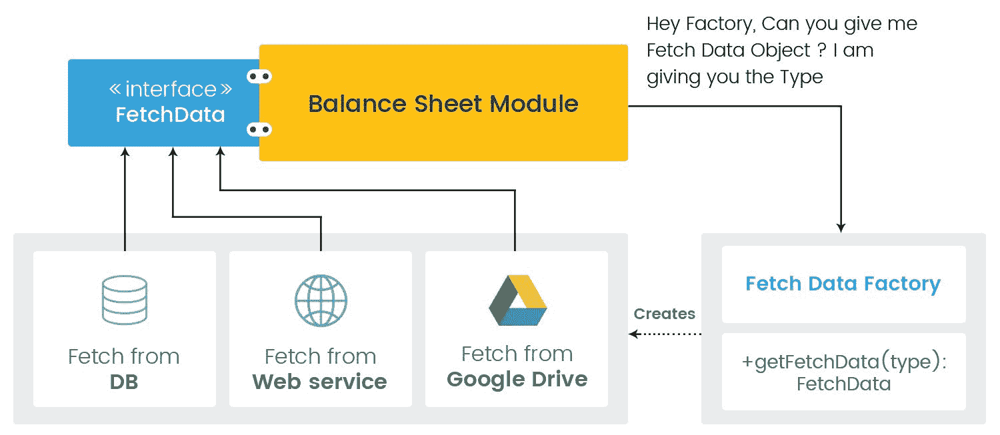

# 第一章：为什么需要依赖注入？

在软件开发中，非常常见的情况是，其他人可能已经找到了解决你所面临问题的有效解决方案。

作为一名开发者，你不需要每次都重新发明轮子。相反，你需要参考已经建立起来的实践和方法。你猜到了我们在谈论什么吗？没错：*设计* *模* *式*。

本章旨在涵盖以下有趣的主题：

+   设计模式是什么以及它们的益处

+   **依赖注入原则**（**DIP**）

+   **控制反转**（**IoC**）——一种实现 DIP 的设计方法

+   实现 IoC 的各种设计模式

+   **依赖注入**（**DI**）

+   实现 DI 的多种方式

+   如何使用 IoC 容器来应用 DI

# 设计模式

根据定义，**设计模式**是一套经过验证的事实上的行业标准最佳实践，用于解决重复出现的问题。设计模式不是现成的解决方案。相反，它们是实现和运用最佳解决方案的方式或模板，以解决你的问题。

同样真实的是，如果一个设计模式没有正确实现，它可能会造成很多问题，而不是解决你期望解决的问题。因此，了解哪种设计模式（如果有的话）适合特定场景非常重要。

设计模式是描述问题和解决方法的通用范式。它通常不是语言特定的。设计模式可以保护你免受开发后期通常出现的设计问题。

使用设计模式有许多优势，如下所示：

+   提高软件的可重用性

+   开发周期变得更快

+   使代码更易于阅读和维护

+   提高效率和增强整体软件开发

+   提供了描述问题和最佳解决方案的通用词汇，以更抽象的方式

你还可以数出更多。在接下来的章节中，我们将深入了解如何通过遵循某些原则和模式，使你的代码模块化、松散耦合、独立、可测试和可维护。

本章将深入探讨关于**依赖倒置原则**（**DIP**）、控制反转范式和 DI 设计模式的理念。

大多数开发者将*设计原则*和*设计模式*这两个术语互换使用，尽管它们之间是有区别的。

**设计原则**：一般来说，这是一条关于如何正确和错误地设计你的应用的指南。设计原则总是谈论应该做什么，而不是如何做。

**设计模式**：针对常见问题的通用和可重用解决方案。设计模式讨论的是如何在给定的软件设计环境中通过提供清晰的方法论来解决这些问题。

使你的代码更干净、可读、解耦、可维护和模块化的第一步是学习被称为**DIP**的设计原则。

# 依赖倒置原则

DIP 为你的代码提供高级指导，以使其松散耦合。它说以下内容：

+   高级模块不应该依赖于低级模块来执行其责任。两者都应该依赖于抽象。

+   抽象不应该依赖于细节。细节应该依赖于抽象。

当在依赖代码中进行更改时，变化总是有风险的。DIP 讨论的是将一块代码（依赖）与它不直接相关的程序主体隔离开来。

为了减少耦合，DIP 建议消除低级模块对高级模块的直接依赖以执行其责任。相反，让高级模块依赖于抽象（一个合同），它形成了通用的低级行为。

这样，低级模块的实际实现可以改变，而无需在高级模块中进行任何更改。这为系统带来了极大的灵活性和分子性。只要任何低级实现都绑定在抽象上，高级模块就可以调用它。

让我们看看一个示例次优设计，在这个设计中我们可以应用 DIP 来改进应用程序的结构。

考虑一个场景，你正在设计一个模块，该模块仅生成本地商店的资产负债表。你从数据库中获取数据，使用复杂的业务逻辑进行处理，并将其导出为 HTML 格式。如果你以程序化的方式设计它，那么系统的流程将类似于以下图示：


一个单独的模块负责获取数据，应用业务逻辑以生成资产负债表数据，并将其导出为 HTML 格式。这不是最佳设计。让我们将整个功能分成三个不同的模块，如图所示：


+   **获取数据库模块：** 这将从数据库中获取数据

+   **导出 HTML 模块：** 这将导出 HTML 格式的数据

+   **资产负债表模块：** 这将从数据库模块获取数据，处理它，并将其交给导出模块以导出为 HTML

在这种情况下，资产负债表模块是一个高级模块，而获取数据库和导出 HTML 是低级模块。

`FetchDatabase`模块的代码应该看起来像以下片段：

```java
public class FetchDatabase {
    public List<Object[]> fetchDataFromDatabase(){
         List<Object[]> dataFromDB = new ArrayList<Object[]>();
         //Logic to call database, execute a query and fetch the data
         return dataFromDB;
     }
}
```

`ExportHTML`模块将获取数据列表并将其导出为 HTML 文件格式。代码应该如下所示：

```java
public class ExportHTML {
    public File exportToHTML(List<Object[]> dataLst){
        File outputHTML = null;
        //Logic to iterate the dataLst and generate HTML file.
        return outputHTML;
     }
}
```

我们父模块——从获取数据库模块获取数据并发送到导出 HTML 模块的`BalanceSheet`模块——的代码应该如下所示：

```java
public class BalanceSheet {
    private ExportHTML exportHTML = new ExportHTML();
    private FetchDatabase fetchDatabase = new FetchDatabase();

    public void generateBalanceSheet(){
      List<Object[]> dataFromDB =
      fetchDatabase.fetchDataFromDatabase();
        exportHTML.exportToHTML(dataFromDB);
     }
}
```

初看之下，这个设计看起来不错，因为我们已经将获取和导出数据的责任分离到单独的子模块中。好的设计可以适应任何未来的变化而不会破坏系统。这个设计在未来的任何变化中会不会使我们的系统变得脆弱呢？让我们来看看。

经过一段时间，您需要从外部网络服务以及数据库中获取数据。此外，您需要将数据导出为 PDF 格式而不是 HTML 格式。为了实现这一变化，您将创建新的类/模块来从网络服务获取数据，并按照以下代码片段导出 PDF：

```java
// Separate child module for fetch the data from web service.
public class FetchWebService {
    public List<Object[]> fetchDataFromWebService(){
         List<Object[]> dataFromWebService = new ArrayList<Object[]>();
        //Logic to call Web Service and fetch the data and return it. 
        return dataFromWebService;
     }
}
// Separate child module for export in PDF
public class ExportPDF {
    public File exportToPDF(List<Object[]> dataLst){
        File pdfFile = null;
        //Logic to iterate the dataLst and generate PDF file
        return pdfFile;
    }
}
```

为了适应新的获取和导出数据的方式，资产负债表模块需要某种形式的标志。根据该标志的值，相应的子模块将在资产负债表模块中实例化。`BalanceSheet` 模块的更新代码如下：

```java
public class BalanceSheet {

  private ExportHTML exportHTML = null;
  private FetchDatabase fetchDatabase = null;
  private ExportPDF exportPDF = null;
  private FetchWebService fetchWebService = null;

  public void generateBalanceSheet(int inputMethod, int outputMethod){

    //1\. Instantiate the low level module object.
    if(inputMethod == 1){
      fetchDatabase = new FetchDatabase();
    }else if(inputMethod == 2){
      fetchWebService = new FetchWebService(); 
    }

    //2\. fetch and export the data for specific format based on flags. 
    if(outputMethod == 1){
        List<Object[]> dataLst = null;
        if(inputMethod == 1){
          dataLst = fetchDatabase.fetchDataFromDatabase();
        }else{
          dataLst = fetchWebService.fetchDataFromWebService();
        }
      exportHTML.exportToHTML(dataLst);
    }else if(outputMethod ==2){
        List<Object[]> dataLst = null;
        if(inputMethod == 1){
          dataLst = fetchDatabase.fetchDataFromDatabase();
        }else{
          dataLst = fetchWebService.fetchDataFromWebService();
        }
      exportPDF.exportToPDF(dataLst);
    }

  }
}
```

伟大的工作！我们的应用程序能够处理两种不同的输入和输出方法来生成资产负债表。但是等等；当你未来需要添加更多方法（获取和导出数据）时会发生什么？例如，你可能需要从谷歌驱动器获取数据并将资产负债表导出为 Excel 格式。

对于每个新的输入和输出方法，您需要更新您的主体模块，即资产负债表模块。当一个模块依赖于另一个具体实现时，它在该模块上被认为是紧密耦合的。这违反了基本原则：对扩展开放，但对修改封闭。

让我们回顾一下 DIP 讨论的内容：高级模块不应依赖于低级模块来履行其职责。两者都应依赖于抽象。

这是我们设计中的基本问题。在我们的案例中，资产负债表（高级）模块紧密依赖于获取数据库和导出 HTML 数据（低级）模块。

正如我们所看到的，原则总是显示设计问题的解决方案。它不讨论如何实现它。在我们的案例中，DIP 讨论的是消除低级模块对高级模块的紧密依赖。

但我们如何做到这一点？这就是 IoC 出现的地方。IoC 展示了在模块之间定义抽象的方法。简而言之，IoC 是实现 DIP 的方式。

# 控制反转

IoC 是一种设计方法，用于通过将控制流从主程序反转到某个其他实体或框架来构建软件工程中的松耦合系统。

在这里，控制指的是程序除了其主要活动之外处理的任何其他活动，例如创建和维护依赖对象、管理应用程序流程等。

与过程式编程风格不同，其中程序一次性处理多个不相关的事物，IoC 定义了一个指导方针，即您需要根据责任将主程序分解为多个独立的程序（模块），并以一种方式安排它们，使它们松耦合。

在我们的例子中，我们将功能分解为独立的模块。缺失的部分是如何安排它们以实现解耦，我们将学习 IoC 如何实现这种安排。通过反转（改变）控制，您的应用程序变得解耦、可测试、可扩展和可维护。

# 通过 IoC 实现 DIP

DIP 建议高级模块不应依赖于低级模块。两者都应依赖于抽象。IoC 提供了一种在高级模块和低级模块之间实现抽象的方法。

让我们看看如何在我们的资产负债表示例中通过 IoC 应用 DIP。基本的设计问题是高级模块（资产负债表）紧密依赖于低级（获取和导出数据）模块。

我们的目标是打破这种依赖。为了实现这一点，IoC 建议反转控制。在 IoC 中，反转控制可以通过以下方式实现：

+   **反转接口**：确保高级模块定义接口，而低级模块遵循它

+   **反转对象创建**：将依赖关系从主模块更改为其他程序或框架

+   **反转流程**：改变应用程序的流程

# 反转接口

反转接口意味着将交互控制从低级模块反转到高级模块。您的高级模块应该决定哪些低级模块可以与之交互，而不是不断改变自己以集成每个新的低级模块。

在反转接口后，我们的设计将如下所示：


在这个设计中，资产负债表模块（高级）通过通用接口与获取数据和导出数据（低级）模块进行交互。这种设计的明显好处是，您可以在不更改资产负债表模块（高级）的情况下添加新的获取数据和导出数据（低级）模块。

只要低级模块与接口兼容，高级模块就会很高兴与之合作。在这个新设计中，高级模块不依赖于低级模块，两者都通过抽象（接口）进行交互。将接口与实现分离是实现 DIP 的前提条件。

让我们根据这个新设计更改我们的代码。首先，我们需要创建两个接口：获取数据和导出数据如下：

```java
public interface IFetchData {
    //Common interface method to fetch data. 
    List<Object[]> fetchData();
}
public interface IExportData { 
    //Common interface method to export data. 
    File exportData(List<Object[]> listData);
}
```

接下来，所有低级模块必须按照以下片段实现这些接口：

```java
public class FetchDatabase implements IFetchData {
    public List<Object[]> fetchData(){
         List<Object[]> dataFromDB = new ArrayList<Object[]>();
         //Logic to call database, execute a query and fetch the data
         return dataFromDB;
     }
}

public class FetchWebService implements IFetchData {
    public List<Object[]> fetchData(){
         List<Object[]> dataFromWebService = new ArrayList<Object[]>();
        //Logic to call Web Service and fetch the data and return it. 
        return dataFromWebService;
     }
}

public class ExportHTML implements IExportData{
    public File exportData(List<Object[]> listData){
        File outputHTML = null;
        //Logic to iterate the listData and generate HTML File
        return outputHTML;
    }
}
public class ExportPDF implements IExportData{
     public File exportData(List<Object[]> dataLst){
        File pdfFile = null;
        //Logic to iterate the listData and generate PDF file
        return pdfFile;
     }

}
```

最后，资产负债表模块需要依赖接口与低级模块交互。因此，更新的`BalanceSheet`模块应如下所示：

```java
public class BalanceSheet {
  private IExportData exportDataObj= null;
  private IFetchData fetchDataObj= null;

  public Object generateBalanceSheet(){
    List<Object[]> dataLst = fetchDataObj.fetchData();
    return exportDataObj.exportData(dataLst);
  }
}
```

您可能已经注意到，`generateBalanceSheet()`方法变得更加简单。它允许我们无需任何更改即可与额外的获取和导出模块一起工作。这要归功于反转接口的机制，使得这一切成为可能。

这个设计看起来很完美；但仍然有一个问题。如果您注意到了，资产负债表模块仍然保留着创建低级模块对象（`exportDataObj`和`fetchDataObj`）的责任。换句话说，对象创建的依赖性仍然存在于高级模块中。

因此，即使在实现接口反转之后，资产负债表模块也不是完全解耦于底层模块。您最终将根据某些标志使用 if/else 块实例化底层模块，而高级模块会不断变化以添加额外的底层模块集成。

为了克服这个问题，您需要将对象创建从您的高级模块反转到其他实体或框架。这是实现 IoC 的第二种方式。

# 对象创建反转

一旦模块之间的抽象设置完成，就无需在高级模块中保留创建依赖对象的逻辑。让我们通过另一个例子来了解对象创建设计反转的重要性。

假设您正在设计一款战争游戏。您的玩家可以使用各种武器射击敌人。您为每种武器创建了单独的类（底层模块）。在游戏过程中，您的玩家可以根据获得的分数添加武器。

此外，玩家可以更换武器。为了实现接口反转，我们创建了一个名为`Weapon`的接口，所有武器模块都将实现该接口，具体如下所示：


假设游戏开始时有三种武器，您将它们保留在游戏中。如果您在玩家模块中保留武器创建代码，选择武器的逻辑将如下所示：

```java
public class Player {
  private Weapon weaponInHand;
  public void chooseWeapon(int weaponFlag){
    if(weaponFlag == 1){
      weaponInHand = new SmallGun();
    }else if(weaponFlag ==2){
      weaponInHand = new Rifle();
    }else{
      weaponInHand = new MachineGun();
    }
  }

  public void fireWeapon(){
    if(this.weaponInHand !=null){
      this.weaponInHand.fire();
    }
  }
}
```

由于玩家模块负责创建武器对象，我们在`chooseWeapon()`方法中传递一个标志。让我们假设，在一段时间内，您向游戏中添加了一些更多的武器。每次添加新武器时，您都需要更改`Player`模块的代码。

解决这个问题的方法是反转对象创建过程，从主模块到另一个实体或框架。

让我们先把这个解决方案应用到我们的`Player`模块。更新的代码如下：

```java
public class Player {
  private Weapon weaponInHand; 
  public void chooseWeapon(Weapon setWeapon){
    this.weaponInHand = setWeapon;
  }

  public void fireWeapon(){
    if(this.weaponInHand !=null){
      this.weaponInHand.fire();
    }
  }
}
```

您可以观察到以下事项：

+   在`chooseWeapon()`方法中，我们通过接口传递武器对象。`Player`模块不再处理武器对象的创建。

+   这样，`Player`（高级）模块就完全解耦于`Weapon`（底层）模块。

+   两个模块通过由高级模块定义的接口进行交互。

+   对于系统中新添加的任何武器，您无需在玩家模块中进行任何更改。

让我们将这个解决方案（反转创建对象）应用到我们的资产负债表模块。`BalanceSheet`模块的更新代码如下所示：

```java
public class BalanceSheet {

  private IExportData exportDataObj= null;
  private IFetchData fetchDataObj= null;

  //Set the fetch data object from outside of this class.
  public void configureFetchData(IFetchData actualFetchDataObj){
    this.fetchDataObj = actualFetchDataObj;
  }
  //Set the export data object from outside of this class.
  public void configureExportData(IExportData actualExportDataObj){
    this.exportDataObj = actualExportDataObj;
  }

  public Object generateBalanceSheet(){
    List<Object[]> dataLst = fetchDataObj.fetchData();
    return exportDataObj.exportData(dataLst);
  }
}
```

这里有一些快速观察：

+   获取数据和导出数据模块的对象是在资产负债表模块外部创建的，并通过`configureFetchData()`和`configureExportData()`方法传递

+   资产负债表模块现在已完全解耦于获取数据和导出数据模块

+   对于任何新的获取和导出数据类型，资产负债表模块无需进行任何更改

在这个时候，DIP 和 IoC 之间的关系可以按照以下图示描述：


最后，我们通过**IoC**实现了**DIP**，并解决了模块之间相互依赖的最基本问题之一。

但等等，还有一些事情还没有完成。我们已经看到，将对象创建与主模块分离可以消除适应变化的风险，并使代码解耦。但我们还没有探讨如何从外部代码创建并传递依赖对象到模块中。有各种反转对象创建的方法。

# 反转对象创建的不同方法

我们已经看到，对象创建反转如何帮助我们解耦模块。您可以通过以下多种设计模式实现对象创建反转：

+   工厂模式

+   服务定位器

+   依赖注入

# 通过工厂模式实现对象创建反转

工厂模式负责从使用它的客户端创建对象。它生成遵循公共接口的类的对象。客户端只需传递它想要的实现类型，工厂就会创建该对象。

如果我们将工厂模式应用于我们的平衡表示例，对象创建反转的过程如下所示：



+   客户端（在我们的例子中，是平衡表模块）与工厂交谈——嘿，工厂，你能给我一个 fetch 数据对象吗？这是类型。

+   工厂接收类型，创建对象，并将其传递给客户端（平衡表模块）。

+   该工厂只能创建相同类型的对象。

+   工厂类对其客户端来说是一个完整的黑盒。它们知道这是一个用于获取对象的静态方法。

平衡表模块可以从`FetchDataFactory`获取`FetchData`对象。`FetchDataFactory`的代码如下：

```java
public class FetchDataFactory {
  public static IFetchData getFetchData(String type){
    IFetchData fetchData = null;
    if("FROM_DB".equalsIgnoreCase(type)){
      fetchData = new FetchDatabase();
    }else if("FROM_WS".equalsIgnoreCase(type)){
      fetchData = new FetchWebService();
    }else {
      return null;
    }
    return fetchData;
  }
}
```

要使用此工厂，您需要更新平衡表模块的`configureFetchData()`方法如下：

```java
//Set the fetch data object from Factory.
  public void configureFetchData(String type){
    this.fetchDataObj = FetchDataFactory.getFetchData(type);
  }
```

对于导出数据，您需要根据以下代码片段创建一个单独的工厂：

```java
public class ExportDataFactory {

  public static IExportData getExportData(String type){
    IExportData exportData = null;
    if("TO_HTML".equalsIgnoreCase(type)){
      exportData = new ExportHTML();
    }else if("TO_PDF".equalsIgnoreCase(type)){
      exportData = new ExportPDF();
    }else {
      return null;
    }
    return exportData;
  }
}
```

如果引入了新的 fetch 数据或导出数据类型，您只需在其相应的工厂类中更改即可。

# 通过服务定位器实现对象创建反转

服务定位器模式与工厂模式大致相同。服务定位器可以找到现有的对象并将其发送给客户端，而不是像工厂模式那样每次都创建一个新的对象。我们不会深入细节，只是简要地看看服务定位器如何创建对象。服务定位器的流程可以按照以下图示描述：


+   **客户端**依赖于**服务定位器**来查找服务。在这里，*服务*意味着任何类型的依赖

+   **服务定位器**获取服务的名称，并将服务的对象返回给客户端

如果我们的资产负债表模块使用服务定位器，`configureFetchData()` 方法的代码将如下所示：

```java
//Set the fetch data object from ServiceLocator.
  public void configureFetchData(String type){
    this.fetchDataObj = FetchDataServiceLocator.Instance.getFetchData(type);
  }
```

与获取数据类似，你需要为导出数据设计一个单独的服务定位器。对于任何新的获取数据或导出数据类型，都需要在服务定位器中进行更改。

反转对象创建的另一种方法是 DI。

# 依赖注入

**DI** 是将对象创建过程从你的模块反转到其他代码或实体的方法之一。术语 *注入* 指的是将依赖对象传递到软件组件的过程。

由于 DI 是实现 **IoC** 的方法之一，它依赖于抽象来设置依赖。客户端对象不知道在编译时将使用哪个类来提供功能。依赖将在运行时解决。

依赖对象不会直接调用客户端对象；相反，客户端对象将在需要时调用依赖对象。这类似于好莱坞原则：不要调用我们，当我们需要时我们会调用你。

# 依赖注入类型

在 DI 中，你需要设置客户端对象中的入口点，以便可以注入依赖。基于这些入口点，DI 可以通过以下类型实现：

+   构造函数注入

+   设置器注入

+   接口注入

# 构造函数注入

这是注入依赖最常见的方式。在这种方法中，你需要通过客户端对象的公共构造函数传递依赖对象。请注意，在构造函数注入的情况下，你需要将所有依赖对象传递给客户端对象的构造函数。

构造函数注入可以控制实例化的顺序，从而降低循环依赖的风险。所有必需的依赖都可以通过构造函数注入传递。

在我们的 `BalanceSheet` 示例中，我们需要在构造函数中传递两个对象，因为它有两个依赖：一个是用于获取数据，另一个是用于导出数据类型，如下面的代码片段所示：

```java
public class BalanceSheet {

  private IExportData exportDataObj= null;
  private IFetchData fetchDataObj= null;

  //All dependencies are injected from client's constructor 
  BalanceSheet(IFetchData fetchData, IExportData exportData){
    this.fetchDataObj = fetchData;
    this.exportDataObj = exportData;
  }

  public Object generateBalanceSheet(){
    List<Object[]> dataLst = fetchDataObj.fetchData();
    return exportDataObj.exportData(dataLst);
  }
}
```

所有依赖都从客户端对象的构造函数注入。由于构造函数只调用一次，很明显，依赖对象将在客户端对象存在期间不会改变。如果客户端使用构造函数注入，那么有时扩展和重写它可能会很困难。

# 设置器注入

如其名所示，在这里，依赖注入是通过公开的设置方法来实现的。任何在客户端对象实例化时不需要的依赖项被称为 **可选依赖**。它们可以在客户端对象创建后稍后设置。

**设置器注入** 是可选或条件依赖的完美选择。让我们将设置器注入应用于 `BalanceSheet` 模块。

代码将如下所示：

```java
public class BalanceSheet {

  private IExportData exportDataObj= null;
  private IFetchData fetchDataObj= null;

  //Setter injection for Export Data 
  public void setExportDataObj(IExportData exportDataObj) {
    this.exportDataObj = exportDataObj;
  }

  //Setter injection for Fetch Data
  public void setFetchDataObj(IFetchData fetchDataObj) {
    this.fetchDataObj = fetchDataObj;
  }

  public Object generateBalanceSheet(){

    List<Object[]> dataLst = fetchDataObj.fetchData();
    return exportDataObj.exportData(dataLst);
  }

}
```

对于每个依赖项，你需要单独放置设置方法。由于依赖项是通过设置方法设置的，因此提供依赖项的对象或框架需要在适当的时间调用设置方法，以确保在客户端对象开始使用之前依赖项是可用的。

# 接口注入

**接口注入**定义了依赖提供者与客户端之间通信的方式。它抽象了传递依赖的过程。依赖提供者定义了一个所有客户端都需要实现的接口。这种方法并不常用。

从技术上讲，接口注入和设置注入是相同的。它们都使用某种方法来注入依赖。然而，对于接口注入，方法是依赖提供者对象定义的。

让我们将接口注入应用于我们的资产负债表模块：

```java
public interface IFetchAndExport {
  void setFetchData(IFetchData fetchData);
  void setExportData(IExportData exportData);
}

//Client class implements interface
public class BalanceSheet implements IFetchAndExport {

  private IExportData exportDataObj= null;
  private IFetchData fetchDataObj= null;

  //Implements the method of interface injection to set dependency
  @Override
  public void setFetchData(IFetchData fetchData) {
    this.fetchDataObj = fetchData;
  }

  //Implements the method of interface injection to set dependency
  @Override
  public void setExportData(IExportData exportData) {
    this.exportDataObj = exportData;

  }

  public Object generateBalanceSheet(){
    List<Object[]> dataLst = fetchDataObj.fetchData();
    return exportDataObj.exportData(dataLst);
  }
}
```

我们已创建接口`IFetchAndExport`并定义了注入依赖的方法。依赖提供者类知道如何通过这个接口传递依赖。我们的客户端对象（资产负债表模块）实现这个方法来设置依赖。

# IoC 容器

到目前为止，我们讨论了扮演依赖提供者角色的代码或框架。它可以是我们自定义的任何代码或完整的**IoC**容器。一些开发者将其称为**DI 容器**，但我们将简单地称之为**容器**。

如果我们编写自定义代码来提供依赖项，直到我们只有一个依赖级别，事情才会变得顺利。考虑我们的客户端类也依赖于某些其他模块的情况。这会导致链式或嵌套依赖。

在这种情况下，通过手动代码实现依赖注入将变得相当复杂。这就是我们需要依赖容器的地方。

容器负责创建、配置和管理对象。你只需进行配置，容器就会轻松地处理对象的实例化和依赖管理。你不需要编写任何自定义代码，例如我们在使用工厂模式或服务定位器模式实现**IoC**时编写的代码。

因此，作为一个开发者，你的生活很酷。你只需给出关于依赖项的提示，容器就会处理其余的事情，你就可以专注于实现业务逻辑。

如果我们选择容器为我们的资产负债表模块设置依赖项，容器将首先创建所有依赖项的对象。然后，它将创建资产负债表类的对象，并在其中传递依赖项。容器会默默地完成所有这些事情，并给你一个所有依赖项都已设置的资产负债表模块的对象。这个过程可以用以下图表来描述：


总之，使用容器而不是手动代码管理依赖的优势如下：

+   将对象创建的过程从你的代码中隔离出来，使你的代码更加清晰和易于阅读。

+   从您的客户端模块中移除对象连接（设置依赖项）代码。容器将负责对象连接。

+   使您的模块实现 100%的松散耦合。

+   管理模块的整个生命周期。当您想在应用程序执行中为各种范围配置对象时，例如请求、会话等，这非常有帮助。

+   替换依赖项只需配置即可——不需要在代码中进行任何更改。

+   这是一种更集中的方式来处理对象的生命周期和依赖管理。当您想在依赖项中应用一些通用逻辑时，例如在 Spring 中的 AOP，这非常有用。我们将在第六章中看到有关 AOP 的详细信息，*面向切面编程和拦截器*。

+   您的模块可以受益于容器提供的先进功能。

Spring、Google Guice 和 Dagger 是目前可用于 Java 的 IoC 容器之一。从企业版 6.0 版本开始，Java 引入了 **上下文依赖注入**（**CDI**），这是一个企业版中的依赖注入框架。它与 Spring 的基于注解的 DI 实现大致相似。在所有上述容器中，Spring 是目前最流行和最广泛使用的 IoC 容器。

# 摘要

在软件范式下，始终建议将整个系统分解成可以独立执行特定任务的小模块。DIP 是构建模块化系统的重要原则之一。在本章中，我们看到了高级模块不应依赖于低级模块，两者都应依赖于抽象（DIP 的概念）。

我们详细学习了如何通过 IoC 实现 DIP。设置控制反转可以使系统松散耦合。我们还学习了各种设计模式，如工厂、服务定位器和依赖注入，以实现 IoC。

之后，我们学习了依赖注入模式的多种类型。最后，我们讨论了 IoC 容器及其在构建模块化系统中的有用性。

在下一章中，我们将讨论 Java 9 中的模块化概念和依赖注入。
