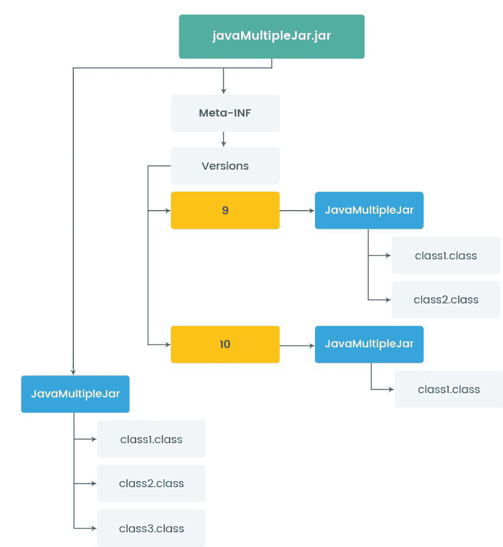

# Java 9 中的依赖注入

在上一章中，我们通过编写代码了解了依赖注入原则、不同场景下的 IOC 以及不同类型的依赖注入。

在本章中，我们将了解 Java 9 提供的新特性。具体来说，我们将学习 Java 9 中的模块化，模块化框架，Java 9 提供的模块类型，以及我们将看到使用模块的依赖注入。

本章将主要涵盖以下主题：

+   Java 9 简介

+   Java 9 中的模块化框架

+   使用 Java 9 模块化框架进行依赖注入

# Java 9 简介

在学习 Java 9 的新特性之前，我们需要了解 Java 的一个重要组成部分，那就是**Java 开发工具包**（**JDK**）。

JDK 是一个包含**Java 标准版**（**Java SE**）、**Java 企业版**（**Java EE**）、**Java 微型版**（**Java ME**）平台以及不同的工具（如 javac、Java 控制台、JAR、JShell、Jlink）的集合，它为开发、调试和监控基于 Java 的应用程序提供了所有库。

Java 9 在 JDK 的不同类别中推出了近 100 个新特性和增强，如工具、安全、部署、性能调整、核心库 API 更改和 javadoc。

# 关键特性

让我们简要地看看 Java 9 的一些关键特性，这些特性将改变 Java 软件开发：

+   **Java 平台模块系统**（**JPMS**）

+   JShell（REPL）——Java Shell

+   JLink——模块链接器

+   多版本 JAR 文件

+   Stream API 增强

+   栈跟踪 API

+   带有便捷工厂方法的不可变集合

+   支持 HTTP 2.0

# Java 平台模块系统

**Java 平台模块系统**（**JPMS**）的引入是 Java 9 和 JPMS 的一个关键特性，也是游戏规则改变者，JPMS 是在 Jigsaw 项目下开发的。

项目 Jigsaw 的主要目标如下：

+   可伸缩的 JDK：直到 Java 8，JDK 的工程是稳固的，包含了许多组件，这使得维护和开发变得麻烦。JDK 9 被划分为一系列独立的模块，这允许我们的应用程序只包含所需的模块，从而有助于减少运行时大小。

+   强健的封装和安全：如果需要，模块可以从模块中明确地暴露出来。另一方面，另一个模块必须明确定义需要从模块中获取哪些特定的包。这样，模块可以为了安全目的封装特定的包。

+   依赖关系：现代模块框架允许我们定义模块之间以及所有所需子模块之间的明确依赖关系，所有所需的子模块依赖关系都可以在编译时区分。

+   现代重建允许我们包含模块的运行时镜像，这为 JDK 提供了更好的性能。它还从运行时镜像中移除了`tools.jar`和`rt.jar`。

+   为了保护运行时图像的内部结构，使用了一个未使用的 URI 策略来命名模块、资源和类。

我们将在 *Java 9 的模块化框架* 部分详细讨论 JPMS。

# JShell (REPL) – Java Shell

在早期的 JDK 中，我们没有使用命令行界面的便利来运行代码。为了学习新的功能，例如正则表达式 API 的 matches 函数等，我们必须编写必要的 Java 骨架，`public static void main(String[] args)`，并经历编译和执行阶段。

Java 9 引入了 JShell，这是一个命令行工具。它使用 **读取-评估-打印循环**（**REPL**）原则提供命令行界面与 Java 平台交互，并提供一种无需编写必要骨架的交互式运行程序的方式。

JShell 提出了一个解析器，它可以解析提交的代码并识别不同类型，如变量、声明的方法、循环等，并将它们全部组合在一个虚拟骨架中，形成一个完整的 Java 程序以传递给编译器。基于输入的编译器，它将其转换为字节码。在这个过程中，不会创建文件，所以所有内容都将保存在内存中。最后，生成的字节码被 JVM 用于加载和执行。

JShell 位于发货 JDK 9 的 `bin` 目录中。使用命令界面，进入 `bin` 目录并输入命令 `JShell` 以启动工具：


让我们考虑一个我们通常在 IDE 中编写的程序。这是一个简单的程序，用于将字符串消息打印为大写：

```java
module javaIntroduction {
}
package com.packt.java9dependency.examples;
public class Main {
   public static void main(String[] args) {
    String s = "hello java module system".toUpperCase();
      System.out.println(s);
   }
}                                                                 
```

现在，我们可以通过直接在 JShell 工具中编写语句来快速输出前面的字符串消息，声明变量和 `println` 语句是不必要的。JShell 提供了各种命令功能，使得开发者编写快速代码片段时生活更加轻松。


# JLink – 模块链接器

当我们谈论模块化系统时，一个立即的问题就是模块的依赖关系将如何组织，以及它将对最终部署产生什么影响？

JLink 工具旨在在编译时间和运行时间之间提供可选阶段，称为链接时间，它将一组模块及其传递依赖项链接到创建运行时图像。JLink 使部署更加简单，并减少了应用程序的大小。

`jLink` 的调用语法如下：

```java
jlink --module-path <modulepath> --add-modules <modules> --limit-modules <modules> --output <path>

--module-path - jLink use module path for finding modules such as modular jars, JMOD files
--add-modules - Mention module which needs to include in default set of modules for run time image, by default set of modules in empty.
--limit-modules - Use this option to limits modules, which is required for our application.
--output - Final resulting run time image will be stored in output directory 
--help - list details about jLink options
--version - show the version number
```

# 多版本 JAR 文件

我们已经看到了许多第三方库，支持多个 Java 版本并具有向后兼容性。正因为如此，它们不使用 JDK 新版本中引入的最新 API 功能。自从 Java 8 以来，没有设施来定义基于条件的平台依赖来使用新功能。

Java 9 引入了多版本 JAR 概念。它允许开发者为每个类创建替代版本，这些版本仅在运行特定 Java 版本时使用。



前面的图示展示了多版本 jar 的结构。它包含资源、类以及用于元数据的 Meta-INF 目录。这个元数据文件包含特定版本的详细信息，用于将 jar 文件编码，以提供在目标 Java 平台上运行的多版本库的兼容方法。

为了继续前面的例子，我们可以看到 `javaMutipleJar` 库在根级别有三个类，**Class1.class**、**Class2.class** 和 **Class3.class**，使用 Java 8 构建。如果我们在这个不支持 MARJAR 的 JDK 中部署这个 jar，那么只有根级别的类将是可见的，后续平台类将被忽略。

此外，**Class1.class** 和 **Class2.class** 想要使用 Java 9 特性，因此只有这些类会与 Java 9 编译捆绑。当 Java 10 来临时，如果 **Class1.class** 想要使用 Java 10 特性，那么，如图中所述，由于 MARJAR 概念，它将与 Java 10 平台捆绑。

最终，多版本 jar 概念帮助第三方库和框架开发者轻松地分离特定 JDK 的新 API 使用，以支持迁移，同时继续支持旧版本。

# Stream API 的增强

Stream 是一个包含元素以顺序形式存在的管道，用于支持对数据集合的聚合操作。Stream API 是 Java 8 的一个主要特性，它提供了基于标准的过滤和顺序或并行执行，所有这些统称为 Stream 的内部迭代。

Java 9 增加了四个新方法，以使 Stream API 在迭代操作方面更加完善。`dropWhile` 和 `takeWhile` 方法是默认方法，而 `iterate` 和 `ofNullable` 是 `java.util.stream` 接口中的静态方法。让我们来讨论 `takeWhile` 方法的用法。

Stream API 语法：

```java
default Stream<T> takeWhile(Predicate<? super T> predicate)
```


`takeWhile()` 方法返回与有序流中谓词匹配的最长前缀。从前面的代码中可以看出，`takeWhile` 返回前三个元素，因为它们与谓词匹配。

对于无序流，`takeWhile()` 方法返回一个前缀元素，直到谓词条件为真。如果谓词条件返回假，则停止迭代，并返回一个元素列表，这些元素在谓词评估直到条件首次失败。

# 堆栈跟踪 API

为了调试异常，我们通过遍历堆栈跟踪来查看异常的根本原因。在 Java 9 之前，我们都使用 `Thread.getStackTrace()` 来获取以数组形式存在的 `StackTraceElement` 对象。

**StackTraceElement**: `StackTraceElement` 的每个元素都是一个单独的 `StackFrame`，它提供了关于类名、方法名、文件名和异常生成的行号等详细信息。除了第一个 `StackFrame` 之外，所有其他元素都代表从应用程序的起点到异常生成的点的调用方法。这在我们需要审计生成的错误日志时非常有用。

Java 9 StackWalker API 提供了过滤、断言和跳过堆栈跟踪中某些类等几个功能。我们可以在任何时刻获取当前线程的完整堆栈跟踪或简短堆栈跟踪。

StackWalker 提供了各种用于捕获有关堆栈信息的方法，例如：

+   **forEach**: 对于当前线程，它返回每个 StackFrame 流以执行操作

+   **getInstance()**: 这将返回 StackWalker 的当前实例

+   **walk()**: 这用于为当前线程的每个 StackFrame 打开一个顺序流，其中我们可以应用如限制、跳过和过滤等函数

```java
List<StackFrame> stack =  StackWalker.getInstance(StackWalker.Option.RETAIN_CLASS_REFERENCE).walk((s) -> s.collect(Collectors.toList()));
com.packt.java9dependency package:
```

```java
List<StackFrame> frames = StackWalker.getInstance().walk(s -> s.dropWhile(f -> f.getClassName().startsWith("com.packt.java9dependency")).limit(10).collect(Collectors.toList()));
```

# 带有便利工厂方法的不可变集合

许多时候我们直接从 `factory` 方法返回的集合中添加或删除元素。这个集合是不可变的，将这些项目添加到这些集合中会引发一个名为 `UnSupportedOperationException` 的异常。

为了避免此类情况，我们通过使用 `collections.unmodifiableXXX()` 方法创建不可变集合对象。这些方法也很繁琐，例如，需要编写多个语句来添加单个项目，然后将它们添加到不可变的 `List`、`Set` 或 `Map` 中：

```java
Before Java 9, 
List<String> asiaRegion = new ArrayList<String>();
asiaRegion.add("India");
asiaRegion.add("China");
asiaRegion.add("SriLanka");
List<String> unmodifiableAsiaRegionList = Collections.unmodifiableList(asiaRegion);
```

Java 9 提供了便利的不可变工厂方法，如 `List.of(), Set.of() 和 Map.of()`，以解决之前提到的问题：

```java
After Java 9,
List<String> asiaRegion = List.of("India","China","SriLanka");
Set<Integer> immutableSet = Set.of(10, 15, 20, 25);
```

# HTTP/2.0 支持

我们过去使用 `HttpURLConnection` 连接服务器，它在单个请求/响应周期中工作，这最终增加了网页加载时间和延迟。

此外，较旧 JDK 的 HTTP/1.1 与 JAVA 9 的 HTTP/2 之间的区别在于，在客户端和服务器之间传输数据时数据被分帧。HTTP/2 使用 `HttpClient` API 通过服务器推送功能推送数据，这使得我们可以优先发送加载网页所需的数据。以下示例显示了 `GET` 方法的 HTTP 交互：

```java
//Get the HttpClient object
HttpClient client = HttpClient.newHttpClient();

// GET Method call
HttpResponse<String> getResponse = client.send(
    HttpRequest
        .newBuilder(new URI("http://www.xyz.com/")
        .GET()
        .build(),
    BodyHandler.asString()
);
//Response of call
int responseStatus = getResponse.statusCode();
String body = responseStatus.body(); 
```

# Java 9 的模块框架

在上一节中，我们简要讨论了几个 Java 9 的特性。现在，在本节中，我们将学习模块框架及其在 Java 9 中的使用方法。

# 什么是模块化？

在我们转向 Java 平台模块系统之前，让我们了解现实世界中模块化的含义。

模块化是一种将系统划分为称为模块的较小部分的设计。如今，家庭中安装了模块化厨房。这类厨房包括多个单元或模块，如壁柜、橱柜、水槽等，所有这些不同的部件都是在工厂中制造的。如果任何单元在任何时候出现损坏，那么只需要更换或修理该模块。

另一个熟悉的模块化系统是墙上的电源插座，它允许你插入不同类型的电器，如微波炉、搅拌机、冰箱、电视等，它们都是设计来完成特定任务的。这些设备在任何插座上都能工作，无论它是在我们的家中还是邻居的家中，它们只是在插入时执行任务和功能。

在计算机系统方面，模块化是多个独立模块在一个单一系统中组合和链接的概念。它增加了可用性，消除了代码的重复，并使系统松散耦合。类似于电源插座的概念，模块应该在不关心它们被插入到应用程序中的位置的情况下执行任务。


# Java 平台模块系统

**Java 平台模块系统**（**JPMS**）也称为 JSR 376，是在 Jigsaw 项目下实现的。我们必须了解为什么我们需要 Java 中的模块化系统以及当前 JDK 中的变化。

# 需要 Java 模块化系统

运行小型或大型应用程序都需要一个最高支持 Java 8 的运行环境，因为 JDK 是构建来支持单体设计的。所有库都紧密耦合在一起，并且部署时需要完整的 JDK。

**可维护性**：我们都希望应用程序能够松散耦合、高度统一、易于阅读和理解。因此，我们使用类和包。随着 Java 在规模和包方面的指数级增长，每天都在提供更好的功能，但包之间的依赖性却受到了影响。因此，我们需要一些新的东西，它比包更好地维护我们的代码库。

**JAR 地狱**：在 Java 9 之前，JVM 没有考虑到类路径上的 JAR 是如何依赖于另一个 JAR 的。它本质上加载了一堆 JAR 文件，但不会验证它们的依赖关系。当缺少 JAR 时，JVM 在运行时中断执行。JAR 文件没有定义可访问性约束，如公开或私有。类路径上所有 JAR 文件的全部内容对类路径上的其他 JAR 文件都是完全可见的。无法声明 JAR 中的某些类是私有的。所有类和方法都与类路径公开相关。有时，我们有一些包含单个类多个版本的 JAR 文件。Java ClassLoader 只加载这个类的单个版本，并且它不决定哪个版本。这导致我们程序的工作方式存在不确定性。这个问题被称为**JAR 地狱**。Java 9 中提出的模块路径概念倾向于阐明由类路径引起的问题。

**隐式依赖**：我们都见过几次`NoClassDefFoundError`错误。它发生在 JVM 无法发现它正在执行的代码所依赖的类时。找到依赖代码和丢失的依赖关系很简单，但不在 classLoader 中的依赖关系很难识别，因为同一个类可能被多个 class loaders 堆叠。当前的 JAR 框架无法表达哪个 JAR 文件是依赖的，以便 JVM 理解和解决依赖关系。

**缺乏强封装**：Java 的可视性修饰符为同一包中的类提供了强大的封装。当前的 Java 封装与 ClassPath 一起工作，其中每个公开类对其他类都是可见的，因为几个关键的 JDK API 类对其他类是公开的。

所有的前述问题都通过 Java 9 的模块概念得到了解决。

# 模块化 JDK

与 Java 8 相比，JDK 9 的文件夹结构已经改变；JDK 9 没有 JRE，它是单独安装到一个不同的文件夹中。在 JDK 9 中，我们可以看到一个名为 jmod 的新文件夹，其中包含所有 Java 平台模块。从 Java 9 开始，`rt.jar`和`tool.jar`在 JDK 中不可用：


所有 Java 模块，`src`，都可在`..\jdk-9.0.1\lib\src`文件夹中找到，每个模块都包含`module-info.java`。以下是一个显示 JDK 如何包含所有模块的图表：


每个其他模块都隐式或显式地依赖于`java.base`模块。它遵循有向无环图依赖关系，这意味着模块之间不允许存在循环依赖。

JDK 9 中的所有模块默认都依赖于基础模块，称为`java.base`模块。它包括`java.lang`包。

我们可以使用命令`-- list-modules`列出 Java 9 的所有模块。每个模块名称后面跟着一个版本号，格式为`-@9`，以指示该模块属于 Java 9。JDK 9 特定的模块以关键字**jdk**为前缀，例如`jdk.compiler`，而 JAVA SE 特定的模块以**java**关键字开头。

# 什么是模块？

当我们讨论模块化系统时，你可能会立即问什么是模块？模块是一组具有自描述属性的代码、数据和资源。它包含一系列包和类型，如类、抽象类、接口等，最重要的是，每个模块都包含一个`module-info.java`文件。

模块可以显式声明需要导出到其他模块的包，以及为了编译和运行需要从其他模块获取的内容。这也有助于我们在出错时识别缺少的模块。

# 模块的架构

模块是 JPMS 的主要构建块。模块类似于 JAR 文件，但具有额外的特性，例如：

+   **模块名称**: 一个用于全局识别的唯一名称；可以使用反向 URL 命名约定来定义名称

+   声明对其他模块的依赖

+   需要导出为包的 API 声明


# 模块描述符（module-info.java）

`module-info.java`是模块化系统中的一个重要文件，它包含描述模块行为的模块元数据。它是一个 Java 文件，但它与传统 Java 文件不同。它有自己的语法，并且编译成`module-info.class`文件。

以下是我们创建`module-info.java`时必须遵循的语法：

```java
module <module-name> {
       requires <module-name-1>;
       requires <module-name-2>;
               .
 .
       requires <module-name-n>;
       exports <package-1>;
               .
 .       exports <package-n>;
}
```

以下是一个`module-info.java`文件的示例，其中每个模块包含一个唯一的 ID 和可选的模块描述符详细信息：

```java
module com.packt.java9dependency.chapter2 {
 exports com.packt.java9dependency.chapter2.services;
 requires com.packt.java9dependency.chapter1;
 requires java.sql;
}
```

让我们了解这里提到的不同模块描述符：

+   **requires <module>**: 此描述符指定一个模块依赖于另一个模块以运行此模块，这种关系称为*模块依赖关系*。在运行时，模块只能看到所需的模块，这称为可读性。

+   **requires transitive <module>**: 这意味着表示对另一个模块的依赖，并且还要保证其他模块在读取你的模块时读取该依赖——称为隐式可读性。例如，模块 A 读取模块 B，模块 B 读取模块 C，那么模块 B 需要声明 requires transitive，否则模块 A 将无法编译，除非它们显式地读取模块 C。

+   **requires static <module>**: 通过使用静态关键字，依赖关系将在编译时进行验证，在运行时是可选的。

+   **exports <package-name>**: 此描述符用于将自身的包导出到其他模块。

+   **exports <package-name> to <module-name>**: 通过使用此类描述符语句，我们将包导出到特定的模块，而不是所有模块。这被称为有条件导出。

+   **opens <包名>**：用于定义的打开描述符，只有公共类型的包在运行时才能通过反射访问其他模块中的代码。

+   **opens <包名> to <模块名>**：一个有资格的打开。这仅打开一个特定的模块，该模块可以在运行时仅通过反射访问公共类型包。

+   **uses <服务接口>**：为该模块定义的模块指令定义了服务。这使得模块成为服务消费者。服务实现可以位于同一模块或另一个模块中。

+   **provide <服务接口> with <class1>，<class2>**：指定模块包含在模块的 `uses` 描述符中定义的接口的服务实现。这使得模块成为服务提供者。

在创建模块描述符时，我们需要理解以下重要要点：

+   `module-info` 只能有一个模块名称；这意味着导出或需求子句不是必需的。

+   如果模块描述符只有导出，那么这意味着它只向其他模块导出声明的包，并且它不依赖于任何其他模块。我们可以称它们为独立模块。例如，`java.base` 模块。

+   与前一点相反，模块描述符可能包含导出和需求子句，这意味着该模块正在向其他模块导出包，并且它也依赖于其他模块进行自己的编译。

+   模块描述符中可能有零个或多个导出或需求子句。

当我们创建项目时，JDK 8 将一个 JDK jar 文件添加到我们的项目类路径中。但是，当我们创建 Java 9 模块项目时，JDK 模块将被添加到模块路径中。

# 模块类型

模块有多种类型：

**命名应用程序模块**：这是一个我们可以创建的简单模块。任何第三方库都可以是应用程序模块。

**平台模块**：正如我们所见，JDK 9 本身迁移到了模块化架构。所有现有功能都将作为不同的模块提供，例如 `java.sql`、`java.desktop`、`java.transaction`。这些被称为平台模块。所有模块都隐式依赖于 `java.base` 模块。

**自动模块**：一个预 Java 9 的 JAR 文件，未迁移到模块，可以放置在模块路径中而不需要模块描述符。这些被称为自动模块。这些 JAR 文件隐式导出所有包供其他模块使用，并读取其他模块以及未命名的模块。因为自动模块没有唯一的名称，JDK 根据文件名生成依赖项，通过删除版本号和扩展名。例如，文件 `postgresql-42.1.4.jar` 作为模块将是 `postgresql`。

**未命名的模块**：JDK 9 并不删除类路径。因此，放置在类路径上的所有 JAR 文件和类都被称为未命名的模块。这些模块可以读取所有模块并导出所有包，因为它们没有名称。这个模块不能被命名应用程序模块读取或要求。

在 JDK 9 中，我们有两条模块路径和类路径。现在我们可能会问哪个 JAR 放在哪里？所以，答案是，一个包含应用程序模块的模块化 JAR 放入 `--module-path`，一个包含未命名模块的模块化 JAR 可以放入 `--class-path`。同样，一个非模块化 JAR 可以迁移到一个自动模块中，并放入 `--module-path`。如果一个 JAR 包含一个未命名的模块，那么它位于 `--class-path`。

# 使用 Java 9 模块框架进行依赖注入

我们将要学习的最后一个主题是分子性和 Java 9 模块的基础。现在，我们将学习如何编写模块以及如何在模块中处理依赖注入。

Java 9 引入了服务加载器的概念，这与 IoC 和依赖注入相关。新的模块系统不提供依赖注入，但可以通过服务加载器和 SPI（服务提供者接口）模式实现相同的功能。现在我们将看看这如何在 Java 9 中工作。

# 带有服务加载器的模块

服务是一组接口和类，统称为库，它提供特定的功能。简单来说，我们可以称之为 API。服务有多种用途，它们被称为服务提供者（或者说实现）。利用这个服务的客户端将不会与实现有任何接触。这可以通过利用底层概念来实现。

Java 有 `ClassLoader`，它简单地加载类并在运行时创建类的实例。与 Java 9 模块相比，`java.util.ServiceLoader` 能够在运行时找到一个服务的所有服务提供者。`ServiceLoader` 类允许 API 和客户端应用程序解耦。服务加载器将实例化所有实现服务的服务提供者，并使其可供客户端使用。

让我们以一个包含 API 和 API 的不同实现的 Notification 应用程序为例。我们将创建三个模块，第一个是一个包含服务的（API）模块，第二个将是一个提供者（实现）模块，最后一个将是一个用于访问服务的客户端模块。

# 服务（API）模块

创建的名为 `com.packt.service.api` 的 API 模块包含一个 `NotificationService` 接口，用于发送通知和加载服务提供者。为了使这个接口成为一个服务提供者接口（SPI），我们必须在 `module-info.java` 中提到 `'use'` 子句。我们的模块代码如下：

```java
NotificationService.java

package com.packt.service.api;

import java.util.ArrayList;
import java.util.List;
import java.util.ServiceLoader;

public interface NotificationService {

  /* Loads all the service providers */
  public static List<NotificationService> getInstances() {
    ServiceLoader<NotificationService> services = ServiceLoader.load(NotificationService.class);
    List<NotificationService> list = new ArrayList<>();
    services.iterator().forEachRemaining(list::add);
    return list;
  }

  /* Send notification with provided message and recipient */
  boolean sendNotification(String message, String recipient);

}
```

`module-info.java` 将如下所示：

```java
module com.packt.service.api {
  exports com.packt.service.api;
  uses com.packt.service.api.NotificationService;
}
```

以下是需要遵循的命令行步骤，用于 `com.packt.service.api` 模块 JAR。假设在 `com.packt.service.api` 模块中会有一个输出目录：


# 服务提供者（实现）模块

现在，创建一个名为 `com.packt.service.impl` 的服务提供者模块来实现 `NotificationService` 服务 API，为此我们应在 `module-info.java` 文件中定义一个 "*provides ... with*" 子句。***provides*** 关键字用来提及服务接口名称，而 ***with*** 关键字用来提及我们想要加载的实现。如果模块在模块描述符文件中没有提供语句，服务加载器将不会加载该模块。'*provides...with*' 语句的语法如下：

```java
provides <service-interface> with <service-implementation>
```

为了向收件人发送短信，我们创建了两个实现类，`SMSServiceImpl.java` 和 `EmailServiceImpl`，通过实现 `NotificationService`：

```java
SMSServiceImpl.java

package com.packt.service.impl;

import com.packt.service.api.NotificationService;

public class SMSServiceImpl implements NotificationService {

  public boolean sendNotification(String message, String recipient) {
    // Code to send SMS
    System.out.println("SMS has been sent to Recipient :: " + recipient + " with Message :: "+message);
    return true;
  }
}
```

此提供者模块的模块描述符如下所示：

```java
module-info.java

module com.packt.service.impl {
  requires com.packt.service.api;
  provides com.packt.service.api.NotificationService with   com.packt.service.impl.SMSServiceImpl;

}
```

为了生成 `com.packt.service.impl` 模块的 jar 文件，我们必须将服务 API 模块的 `notification-api.jar` 复制到 lib 文件夹中，以便在编译时解决依赖关系。以下命令的输出将是 `sms-service.jar`：


服务提供者规则：

+   它总是有一个无参构造函数。这个构造函数被 `ServiceLoader` 类用来通过反射实例化服务提供者。

+   提供者必须是一个公共的具体类。它不应该是一个抽象类或内部类。

+   实现类的出现必须与服务接口一致。

# 服务客户端应用程序

现在，创建一个名为 `com.packt.client` 的客户端应用程序，通过调用 `getInstances()` 方法列出所有 `NotificationService` 的实现。客户端应用程序在 `module-info.java` 中只需要 *requires* `com.packt.service.api` 模块作为依赖项。但我们必须将 `notification-api.jar` 和 `sms-service.jar` 复制到 lib 文件夹中，以解决服务 API 和服务提供者模块的编译时依赖关系。我们的 `ClientApplication.java` 和 `module-info.java` 将如下所示：

```java
ClientApplication.java

package com.packt.client;

import java.util.List;
import com.packt.service.api.NotificationService;

public class ClientApplication {

  public static void main(String[] args) {
     List<NotificationService> notificationServices = NotificationService.getInstances();
        for (NotificationService services : notificationServices) {
          services.sendNotification("Hello", "1234567890");
        }
  }
}
```

对于我们的客户端应用程序，我们只需要在 `module-info.java` 文件中提及 `com.packt.service.api` 的 *requires* 子句：

```java
module-info.java

module com.packt.client {
  requires com.packt.service.api;
}
```

以下是需要运行以运行我们的客户端应用程序的命令。在输出中，我们将从 `SMSServiceImpl.java` 获得一条消息：


# 使用命令行界面编写模块化代码

作为一种传统，让我们创建一个简单的模块，命名为 `helloApp`，它将包含一个简单的消息，并且将被另一个名为 `helloClient` 的模块所需要。在这里，我们将使用命令行界面来创建和运行该模块。

创建一个名为 `com.packt.helloapp` 的 `helloApp` 模块文件夹和一个名为 `com\packt\helloapp` 的包文件夹：

```java
mkdir com.packt.helloapp
mkdir com.packt.helloapp\com\packt\helloapp

```

现在，在包名 `com.packt.helloapp\com\packt\helloapp` 下创建一个 `HelloApp.java` 组件类，并在根文件夹 `com.packt.helloapp` 中创建一个 `modue-info.java` 文件：

```java
HelloApp.java

package com.packt.helloapp;

public class HelloApp {
  public String sayHelloJava() {
      return "Hello Java 9 Module System";
  }
}

module-info.java

module com.packt.helloapp {
 // define exports or requires.
}
```

现在，我们将创建另一个名为`helloClient`的模块。创建一个名为`com.packt.hello.client`的`helloClient`模块，并使用名为`com\packt\hello\client`的包：

```java
mkdir com.packt.hello.client
mkdir com.packt.hello.client\com\packt\hello\client
```

让我们在`com.packt.hello.client\com\packt\hello\client`包下创建另一个名为`HelloClient.java`的组件类，并在根目录`com.packt.hello.client`下创建一个`module-info.java`文件：

```java
helloClient.java
package com.packt.hello.client;

public class HelloClient {
  public static void main (String arg[]) {
     //code 
  }
}

module-info.java
module com.packt.hello.client {
 //define exports or requires
}
```

这两个模块都是独立模块，因此它们之间没有依赖关系。但是，如果我们想在`HelloClient`类中使用名为`sayHelloJava()`的方法，那么我们必须导入该模块，否则将会在编译时出现错误`package com.packt.helloapp is not visible`。

# 定义模块之间的依赖关系

要使用`HelloApp`，我们需要从`helloApp`模块导出包`com.packt.helloapp`，并将`helloApp`模块包含在`helloClient`模块中：

```java
module com.packt.helloapp {
   exports com.packt.helloapp;
}

module com.packt.hello.client {
   requires com.packt.helloapp;
}
```

从前面的代码中，第一个模块描述符中的`exports`关键字表示包可供其他模块导出。如果一个包被显式导出，那么它只能被其他模块访问。如果在同一个模块中某些包没有被导出，那么它们就不能被其他模块访问。

第二个模块描述符使用`requires`关键字来指示该模块依赖于`com.packt.helloapp`模块，这被称为 Java 9 模块的依赖注入。

最后，`HelloClient`类将如下所示：

```java
HelloClient.java

package com.packt.hello.client;

import com.packt.HelloApp;

public class HelloClient {

  public static void main (String arg[]) {

    HelloApp helloApp = new HelloApp();
    System.out.println(helloApp.sayHelloJava());

  }

}
```

创建了两个模块后，最终的树结构如下：


但是等等，我们只写了代码，还没有编译和运行它。让我们在下一节中完成这个操作。

# 编译和运行模块

让我们先编译`HelloApp`模块，然后编译`HelloClient`模块。在运行命令之前，请确保 Java 9 ClassPath 已设置。要编译模块代码，需要运行以下命令：

```java
javac -d output com.packt.helloapp\com\packt\helloapp\HelloApp.java com.packt.helloapp\module-info.java
```

编译成功后，它将在输出目录中生成`HelloApp.class`和`module-info.class`。

由于我们的`HelloApp`模块被`HelloClient`模块所依赖，我们应该生成`com.packt.helloapp`模块 jar 并将其包含在`HelloClient`模块中。要在`mlib`文件夹中创建 jar，请运行以下 jar 命令：

```java
jar -c -f mlib\com.packt.helloapp.jar -C output .
```

现在，通过运行以下命令删除输出目录，然后为第二个模块再次创建输出目录：

```java
rmdir /s output
```

为了编译`HelloClient`模块，我们需要提供一个`com.packt.hellpapp.jar`的引用和`javac`命令，并提供一种方法来传递`module-path`以引用其他模块。在这里，我们将`mlib`目录作为模块路径传递。没有`module-path`，`com.packt.hello.client`模块的编译将无法进行：

```java
javac --module-path mlib -d output com.packt.hello.client\module-info.java
javac --module-path mlib -d output com.packt.hello.client\com\packt\hello\client\HelloClient.java
```

现在，让我们使用以下命令运行模块：

```java
java –-module-path “mlib;output” -m com.packt.hello.client/com.packt.hello.client.HelloClient
```

输出结果如下：


在前面的示例结束时，我们学习了如何创建模块并在 Java 模块中定义依赖注入。以下图表显示了模块之间的依赖关系：


# 摘要

在这里，Java 9 中的依赖注入之旅就此结束。让我们总结一下本章所学的内容。首先，我们学习了 Java 9 中引入的关键特性，例如 Java 平台模块系统、JShell、JLink 工具、JAR 的多版本发布、增强的流 API、堆栈跟踪 PI、不可变集合方法以及 HTTP 2.0。

其次，在 Java 9 的模块化框架部分，我们学习了模块化的含义以及模块化设计在 Java 应用中的必要性。我们还详细了解了 JPMS 如何将早期的 JDK 转变为模块化 JDK。

之后，我们了解了一个模块化系统的重要元素，即模块。我们看到了如何通过不同的模块描述符和模块类型来定义模块结构。

最后，我们学习了如何使用命令编写简单的模块，以了解 Java 9 中模块间的依赖注入是如何工作的。

在下一章中，我们将详细讨论 Spring 框架中依赖注入的概念。
