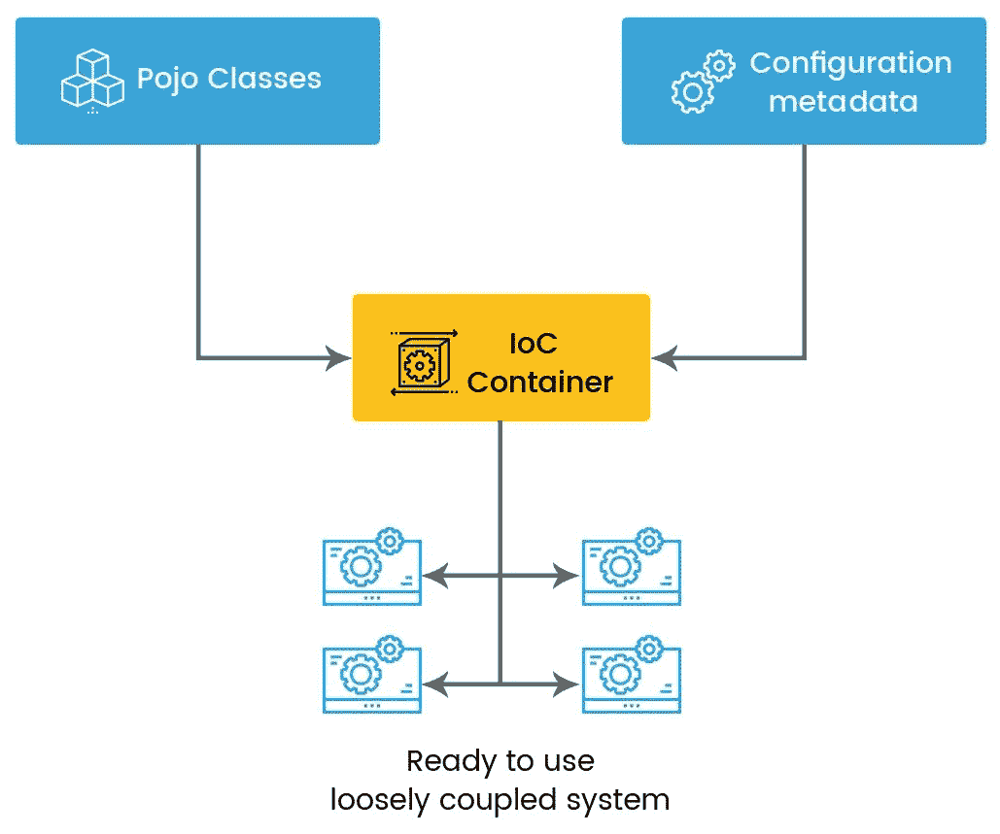
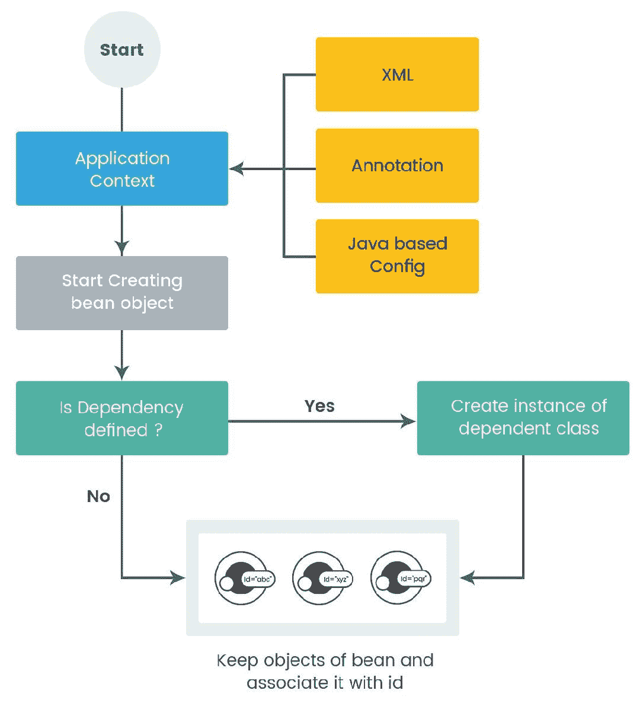

# 使用 Spring 进行依赖注入

到目前为止，我们已经学习了为什么模块化在编写更干净、可维护的代码中如此重要。在第一章，“为什么需要依赖注入？”，我们学习了**依赖倒置原则**（**DIP**）、**IoC**（一种实现 DIP 的设计方法）以及各种设计模式来实现 IoC。**依赖注入**（**DI**）是实现 IoC 的设计模式之一。

在第二章，“Java 9 中的依赖注入”，我们学习了模块化框架和 DI 在 Java 9 中的实现方式。在本章中，我们将继续我们的旅程，学习在 Spring 中实现 DI——这是最受欢迎和最广泛使用的框架之一，用于实现企业应用程序。

在本章中，我们将探讨以下主题：

+   对 Spring 框架的简要介绍

+   Spring 中的 Bean 管理

+   如何使用 Spring 实现 DI

+   自动装配：自动解决依赖的功能

+   基于注解的 DI 实现

+   基于 Java 配置的 DI 实现

# 对 Spring 框架的简要介绍

Spring 是一个轻量级和开源的企业框架，它早在 2003 年就创建了。模块化是 Spring 框架的核心。正因为如此，Spring 可以从表示层到持久化层使用。

好处在于，Spring 不会强迫您在所有层都使用 Spring。例如，如果您在持久化层使用 Spring，您可以在控制器层的表示层自由使用任何其他框架。

Spring 的另一个优点是其基于**普通老式 Java 对象**（**POJO**）模型的框架。与其他框架不同，Spring 不会强迫您的类扩展或实现 Spring API 的任何基类或接口；然而，Spring 提供了一套类，用于使用其他框架，例如 ORM 框架、日志框架、Quartz 定时器以及其他第三方库，这些库将帮助您将这些框架与 Spring 集成。

更多内容：Spring 允许您在不更改代码的情况下更改类似的框架。例如，您可以通过更改配置来选择不同的持久化框架。这也适用于与 Spring 集成的第三方 API。

Spring 是一个基于 POJO 的框架；一个 servlet 容器就足以运行您的应用程序，不需要完整的应用服务器。

# Spring 框架架构

Spring 是一个模块化框架。这为您选择所需的模块提供了极大的灵活性，而不是将所有模块都集成到您的代码中。Spring 包含大约 20 个模块，它们逻辑上分为以下几层：

+   核心容器层

+   数据访问/集成层

+   Web 层

+   测试层

+   杂项层

# 核心容器层

作为框架的主要部分，核心容器涵盖了以下模块：

**Spring 核心**：正如其名所示，它提供了框架的核心功能，包括 IoC 容器和 DI 机制。IoC 容器将配置和依赖关系管理从应用程序代码中隔离出来。

**Spring beans**：此模块提供 bean 工厂以创建和管理 bean（对象）的生命周期。它是一个工厂模式的实现。

**Spring 上下文**：此模块建立在核心和 bean 模块之上。其入口点是加载配置和访问对象。在 bean 模块之上，上下文模块提供了一些额外的功能，如事件传播、动态创建上下文、国际化等。

**Spring 表达式语言**（**SpEL**）：这是一个用于在 JSP 中动态访问和操作对象的表达式语言。它是 JSP 2.1 规范中**表达式语言**（**EL**）的扩展。使用 SpEL 可以使 JSP 代码更简洁、更易读、更易于维护。使用 SpEL 的主要好处包括：

+   轻松设置和获取对象的属性值

+   它可以直接调用控制器方法以获取数据

+   它用于直接从 Spring 的应用程序上下文（IoC 容器）检索对象

+   它支持各种列表操作，如投影、选择、迭代和聚合

+   它提供逻辑和算术运算

# 数据访问/集成层

Spring 数据访问和集成层用于数据操作和其他集成。它包括以下模块：

+   **事务**：此模块帮助以编程和声明性方式维护事务。此模块支持 ORM 和 JDBC 模块。

+   **对象 XML 映射**（**OXM**）：此模块提供对象/XML 处理的抽象，可用于各种 OXM 实现，如 JAXB、XMLBeans 等，以与 Spring 集成。

+   **对象关系映射**（**ORM**）：Spring 不提供自己的 ORM 框架；相反，它通过此模块促进与 Hibernate、JPA、JDO 等 ORM 框架的集成。

+   **Java 数据库连接**（**JDBC**）：此模块提供处理 JDBC 的所有底层样板代码。您可以使用它使用标准 JDBC API 与数据库交互。

+   **Java 消息服务**（**JMS**）：此模块支持 Spring 中消息系统的集成。

# Spring 网络层

**Spring 网络层**用于创建基于 Web 的应用程序。它由以下模块组成：

+   **Web**：此模块提供基本的 Web 相关功能，如多部分文件上传（借助 JSP 中的 Spring 自定义标签）。它还负责在 Web 上下文中初始化 IoC 容器。

+   **Servlet**：此模块为基于 Web 的应用程序提供 Spring MVC（模型-视图-控制器）的实现。它提供了视图（表示层）与模型（业务逻辑）的清晰分离，并通过控制器控制它们之间的流程。

+   **端口**：此模块为端口提供 MVC 实现，主要用于门户环境。

# Spring 测试

这提供了对 JUnit 和 TestNg 等单元测试框架的支持，以进行单元和集成测试。我们将在本章后续部分看到如何使用 Spring 进行单元测试，所以请继续阅读。

# 杂项

一些额外的模块也是 Spring 框架的一部分：

+   **方面和 AOP**：这些模块提供了一种动态地在多个应用层应用通用逻辑（在 AOP 术语中称为*关注点*）的功能

+   **仪表**：此模块提供类仪表化和类加载器实现功能

+   **消息传递**：此模块为与基于 STOMP 的客户端通信提供对**流文本导向消息协议**（**STOMP**）的支持

# Spring 容器中的 Bean 管理

当任何软件应用正在执行时，会创建一组对象，它们相互交互以实现特定的业务目标。作为一个基于 POJO 的编程模型，Spring 框架将你的应用程序中类的所有对象视为 POJO 或豆（以 Spring 友好的方式）。

这些对象或豆类应该以独立的方式存在，以便可以在不引起其他对象变化涟漪效应的情况下重用或更改。以这种方式松散耦合，它还提供了无需过多担心任何依赖项即可进行测试的好处。

Spring 提供了一个 IoC 容器，用于自动化向你的类提供外部依赖的过程。你需要提供关于你的客户端和依赖项的指令（以配置的形式）。Spring 将在运行时管理和解决所有依赖项。此外，Spring 提供了一个功能，可以在各种应用范围内保持依赖项的可用性，例如请求、会话、应用等。

在了解依赖注入之前，理解 Spring 如何管理对象的生命周期（创建、管理和销毁的过程）是至关重要的。在 Spring 中，所有这些责任都由 Spring IoC 容器执行。

# Spring IoC 容器

在 Spring 中，`org.springframework.beans.factory.BeanFactory`接口定义了基本的 IoC 容器，而`org.springframework.context.ApplicationContext`接口则代表一个高级 IoC 容器。`ApplicationContext`是`BeanFactory`的超集。它通过在`BeanFactory`的基本 IoC 功能之上提供一些额外的企业级功能来实现这一点。

为了适应不同类型的应用程序，Spring 提供了`ApplicationContext`的多种实现。对于独立应用程序，你可以使用`FileSystemXmlApplicationContext`或`ClassPathXmlApplicationContext`类。它们都是`ApplicationConext`的实现。

在使用 Spring 的时候，您需要传递一个 XML 文件作为这些容器的入口点。此文件称为 **Spring 应用程序上下文文件**。当 Spring 容器启动时，它会加载此 XML 文件并开始配置您的 bean（要么是文件中的基于 XML 的 bean 定义，要么是 POJO Java 类中的基于注解的定义）。

+   `FileSystemXmlApplicationContext`：此容器加载 Spring XML 文件并处理它。您需要提供 XML 文件的完整路径。

+   `ClassPathXmlApplicationContext`：此容器的工作方式类似于 `FileSystemXmlApplicationContext`；然而，它假定 Spring XML 文件位于 `CLASSPATH` 中。您不需要为它传递根级路径。

+   `WebXmlApplicationContext`：此容器通常用于 Web 应用程序中。

Spring 的 IoC 容器负责实例化、配置、维护和收集 bean（您应用程序中的对象）。您需要向 IoC 容器提供有关您想要组装的对象的配置元数据。以下图示展示了 IoC 容器如何完成这项工作的一个高级流程：



我们提供 **Pojo 类**（或 bean 定义）和 **配置元数据**（一组指令）作为输入。Spring IoC 容器将创建和管理对象（或 bean），以便它们产生一个可用的系统。简而言之，IoC 容器执行所有低级任务（管理 bean 和依赖项），这样您就可以在您的 POJO 类中编写业务逻辑。

# 配置

您需要向 Spring 容器提供有关如何根据您的应用程序需求配置 bean 的说明。这些说明应以配置元数据的形式提供，并且它们应向 IoC 容器说明以下内容：

+   **实例化**：如何从 bean 定义中创建对象。

+   **生命周期**：这些对象可用到何时。

+   **依赖项**：它们是否需要其他人？

Spring 提供了大量的灵活性，甚至在定义配置元数据方面也是如此。您可以通过以下三种方式将其提供给 IoC 容器：

+   **XML 格式**：Spring 应用程序上下文（XML）文件中关于 bean 的配置元数据的一个或多个条目。

+   **Java 注解**：将配置元数据以注解的形式放入 Java 类中。

+   **纯 Java 代码**：从 3.0 版本开始，Spring 开始支持使用 Java 代码定义配置。您可以使用 Java 而不是 XML 文件在应用程序类之外定义 bean。

当 Spring 应用程序启动时，它将首先加载应用程序上下文（XML）文件。此文件如下所示：

```java
<?xml version="1.0" encoding="UTF-8"?>
<beans 

    xsi:schemaLocation="http://www.springframework.org/schema/beans
        http://www.springframework.org/schema/beans/spring-beans.xsd">

    <!-- All your bean and its configuration metadata goes here -->
    <bean id="..." class="...">
    </bean>
</beans>
```

此文件必须存在于基于 XML 和基于注解的配置元数据中。在基于 XML 的配置中，您需要在此文件顶级`<beans>`元素下使用`<bean>`元素定义您的 bean。可以定义一个或多个`<bean>`条目。配置元数据将与`<bean>`元素一起使用。

在前面的 bean 定义中，`id`属性定义了该 bean 的标识。容器将使用它来指出特定的 bean，因此它必须是唯一的。而`class`属性定义了 bean 的类型，您需要在这里给出其完全限定的类名。

每个 bean 都与一个实际对象通过`class`属性相关联。您可以定义任何类型的类的 bean，例如您的自定义服务层类、DAO 层类、表示层类等。Spring 的容器将使用`class`属性来实例化对象，并应用与相应`<bean>`元素关联的配置元数据。

在基于注解的配置中，您的元数据将被定义为实际的 Java 类，并在该（XML）文件中；您只需使用`<context:component-scan base-package="org.example"/>`元素指定基本包名。我们将在本章的下一个部分，*基于注解的依赖注入*中看到更多关于这个内容。

# 容器在行动

为了轻松理解基于 Spring 的应用程序的流程，我们将以独立的应用程序容器为例：`ClassPathXmlApplicationContext`，或者`FileSystemXmlApplicationContext`。处理 Spring 的整体过程包括以下三个步骤：

+   定义 POJOs

+   创建带有配置元数据的应用程序上下文（XML）文件

+   初始化容器

**定义 POJOs：**正如我们在本章前面的部分所看到的，Spring 将您的应用程序中的每个对象视为 POJO。因此，首先您需要定义 POJOs。我们将使用简单的示例来理解以下片段中的概念：

```java
package com.packet.spring.contaner.check;
public class Car{
    public void showType(){
        System.out.println("This is patrol car..");
    }
}
```

**提供应用程序上下文（XML）文件**：创建一个 XML 文件，并将其命名为`application-context.xml`。为了简化，我们使用基于 XML 的配置元数据。我们将在接下来的部分中看到另外两种设置配置元数据的方式（基于注解和基于 Java 代码）。

在应用程序上下文文件（`application-context.xml`）中为每个模块类定义`<bean>`，并包括它们的配置元数据，如下面的片段所示：

```java
<?xml version="1.0" encoding="UTF-8"?>
<beans 

    xsi:schemaLocation="http://www.springframework.org/schema/beans
        http://www.springframework.org/schema/beans/spring-beans.xsd">

    <!-- All your bean and its configuration metadata goes here -->
    <bean id="myCar" class="com.packet.spring.contaner.check.Car">
    </bean>
</beans>
```

我们为我们的 POJO `Car`定义了`<bean>`，ID 为`myCar`。Spring 容器使用此 ID 来获取`Car` bean 的对象。

**初始化容器**：在基于 Web 的应用程序中，当应用程序被加载到 servlet 容器中时，容器（`WebXmlApplicationContext`）将由 web 监听器初始化。在独立应用程序的情况下，你需要使用以下代码片段初始化容器（`ClassPathXmlApplicationContext`或`FileSystemXmlApplicationContext`）：

```java
ApplicationContext context = new ClassPathXmlApplicationContext("application-context.xml");
FileSystemXmlApplicationContext container).
```

`ClassPathXmlApplicationContext`和`FileSystemXmlApplicationContext`容器还有其他重载的构造函数，例如无参数构造函数和字符串数组参数构造函数，后者用于加载多个应用程序上下文（XML）文件。

Spring 容器加载到内存后不久，它就会处理应用程序上下文（XML）文件，并为相应的`<bean>`定义创建对象。你可以通过容器使用以下代码片段获取你的 bean 实例：

```java
// create and configure beans
ApplicationContext context = new ClassPathXmlApplicationContext("application-context.xml");

// retrieve configured instance
Car carObj = context.getBean("myCar");

// use configured instance
carObj.showType(); 
```

当你调用`getBean`方法时，容器内部会调用其构造函数来创建对象，这相当于调用`new()`操作符。这就是 Spring 的 IoC 容器如何在 Spring 的应用上下文（XML）文件中为每个`<bean>`定义创建、维护和组装对象的方式。

默认情况下，Spring 以单例模式创建每个`<bean>`元素的对象。这意味着除非你明确告诉它不要这样做，否则容器只为每个`<bean>`创建并保留一个对象。当你使用`getBean()`方法请求`<bean>`对象时，它每次都会提供第一次创建后的同一对象的引用。

当容器创建与`<bean>`定义对应的对象时，你不需要实现任何特定的接口，也不需要以特定的方式扩展任何类或代码。只需指定`<bean>`的`class`属性就足够了。Spring 能够创建任何类型的对象。

# Spring 中的依赖注入（DI）

在了解 Spring 如何管理 bean 生命周期之后，接下来我们将学习 Spring 如何提供和维护你的应用程序中的依赖。

**DI（依赖注入**）是一个将依赖对象提供给需要它的其他对象的过程。在 Spring 中，容器提供依赖。创建和管理依赖的流程从客户端反转到容器。这就是我们称之为**IoC 容器**的原因。

Spring IoC 容器使用依赖注入（DI）机制在运行时提供依赖。在第一章，“为什么需要依赖注入？”中，我们看到了各种 DI 类型，如构造函数、setter 方法和基于接口的。让我们看看如何通过 Spring 的 IoC 容器实现基于构造函数和 setter 的 DI。

# 基于构造函数的 DI

基于构造函数的依赖注入通常用于在对象实例化之前传递必需的依赖项。它通过具有不同参数的构造函数由容器提供，每个参数代表一个依赖项。

当容器启动时，它会检查 `<bean>` 是否定义了基于构造函数的依赖注入。它将首先创建依赖对象，然后将它们传递给当前对象的构造函数。我们将通过使用日志的经典示例来理解这一点。在代码的各个地方放置日志语句以跟踪执行流程是一种良好的实践。

假设你有一个名为 `EmployeeService` 的类，你需要在它的每个方法中添加日志。为了实现关注点的分离，你将日志功能放入一个名为 `Logger` 的独立类中。为了确保 `EmployeeService` 和 `Logger` 之间是独立且松散耦合的，你需要将 `Logger` 对象注入到 `EmployeeService` 对象中。让我们看看如何通过构造函数注入来实现这一点：

```java
public class EmployeeService {
     private Logger log;
     //Constructor
      public EmployeeService(Logger log) {
          this.log = log;
      }

      //Service method.
      public void showEmployeeName() {
        log.info("showEmployeeName method is called ....");
        log.debug("This is Debuggin point");
        log.error("Some Exception occured here ...");
      }

}

public class Logger {
  public void info(String msg){
       System.out.println("Logger INFO: "+msg);
    }
  public void debug(String msg){
      System.out.println("Logger DEBUG: "+msg);
    }
  public void error(String msg){
      System.out.println("Logger ERROR: "+msg);
    }
}

public class DIWithConstructorCheck {

  public static void main(String[] args) {

    ApplicationContext springContext = new ClassPathXmlApplicationContext("application-context.xml");
    EmployeeService employeeService = (EmployeeService) springContext.getBean("employeeService");
    employeeService.showEmployeeName();

  }
}
```

根据前面的代码，当这些对象通过 Spring 配置时，`EmployeeService` 对象期望 Spring 容器通过构造函数注入 `Logger` 对象。为了实现这一点，你需要按照以下代码片段设置配置元数据：

```java
<?xml version="1.0" encoding="UTF-8"?>
<beans 

    xsi:schemaLocation="http://www.springframework.org/schema/beans
        http://www.springframework.org/schema/beans/spring-beans.xsd">

    <!-- All your bean and its configuration metadata goes here -->
    <bean id="employeeService" class="com.packet.spring.constructor.di.EmployeeService">
        <constructor-arg ref="logger"/> 
    </bean>

    <bean id="logger" class="com.packet.spring.constructor.di.Logger">
    </bean>

</beans>
```

在前面的配置中，`Logger` bean 通过 `constructor-arg` 元素注入到 `employee` bean 中。它有一个 `ref` 属性，用于指向具有匹配 `id` 值的其他 bean。此配置指示 Spring 将 `Logger` 对象传递给 `EmployeeService` bean 的构造函数。

你可以按任何顺序在这里放置 `<bean>` 定义。Spring 将根据需要创建 `<bean>` 对象，而不是根据它们在这里定义的顺序。

对于多个构造函数参数，你可以传递额外的 `<constructor-arg>` 元素。只要引用的对象类型（bean 的类属性）不模糊，顺序并不重要。

Spring 还支持使用原始构造函数参数进行依赖注入。Spring 提供了从应用程序上下文（XML）文件传递原始值到构造函数的功能。假设你想要创建一个具有默认值的 `Camera` 类对象，如下面的代码片段所示：

```java
public class Camera {
  private int resolution;
  private String mode;
  private boolean smileShot;

  //Constructor.
  public Camera(int resolution, String mode, boolean smileShot) {
    this.resolution = resolution;
    this.mode = mode;
    this.smileShot = smileShot;
  }

  //Public method
  public void showSettings() {
    System.out.println("Resolution:"+resolution+"px mode:"+mode+" smileShot:"+smileShot);
  }
}
```

`Camera` 类有三个属性：`resolution`、`mode` 和 `smileShot`。它的构造函数接受三个原始参数来创建具有默认值的相机对象。你需要以下方式提供配置元数据，以便 Spring 可以创建具有默认原始值的 `Camera` 对象实例：

```java
<bean id="camera" class="com.packet.spring.constructor.di.Camera">
      <constructor-arg type="int" value="12" />
      <constructor-arg type="java.lang.String" value="normal" />
      <constructor-arg type="boolean" value="false" />
</bean>
```

我们在 `<bean>` 下传递三个 `<constructor-arg>` 元素，对应于每个构造函数参数。由于这些是原始类型，Spring 在传递值时并不知道其类型。因此，我们需要显式传递 `type` 属性，它定义了原始构造函数参数的类型。

对于原始类型，只要类型不是模糊的，就没有固定的顺序来传递构造函数参数的值。在前面的例子中，所有三种类型都是不同的，所以 Spring 智能地选择正确的构造函数参数，无论你以什么顺序传递它们。

现在我们正在`Camera`类中添加一个名为`flash`的额外属性，如下所示：

```java
//Constructor.
  public Camera(int resolution, String mode, boolean smileShot, boolean flash) {
    this.resolution = resolution;
    this.mode = mode;
    this.smileShot = smileShot;
    this.flash = flash;
  }
```

在这种情况下，构造函数参数`smileShot`和`flash`具有相同的类型（布尔型），你按照以下片段从 XML 配置中传递构造函数参数值：

```java
      <constructor-arg type="java.lang.String" value="normal"/>
      <constructor-arg type="boolean" value="true" />
      <constructor-arg type="int" value="12" />
      <constructor-arg type="boolean" value="false" /> 
```

在前面的场景中，Spring 将选择以下内容：

+   用于分辨率的整数值

+   字符串值用于模式

+   序列中第一个布尔值（true）用于第一个布尔参数——`smileShot`

+   序列中第二个布尔值（false）用于第二个布尔参数——`flash`

简而言之，对于构造函数参数中的相似类型，Spring 将选择序列中第一个出现的值。所以在这种情况下，顺序很重要。

这可能会导致逻辑错误，因为你将错误的值传递给了正确的参数。为了避免这种意外的错误，Spring 提供了在`<constructor-arg>`元素中定义零基索引的功能，如下所示：

```java
      <constructor-arg type="java.lang.String" value="normal"
      index="1"/>
      <constructor-arg type="boolean" value="true" index="3"/>
      <constructor-arg type="int" value="12" index="0"/>
      <constructor-arg type="boolean" value="false" index="2"/>
```

这更易于阅读且错误率更低。现在 Spring 将选择`smileShot`的最后一个值（`index=2`）和`flash`参数的第二个值（`index=3`）。索引属性解决了两个具有相同类型的构造函数参数的歧义。

如果你在`<constructor-arg>`中定义的`type`与该索引处构造函数参数的实际类型不兼容，那么 Spring 将引发错误。所以使用索引属性时，请确保这一点。

# 基于 setter 的依赖注入

**基于 setter 的依赖注入**通常用于可选依赖。在基于 setter 的依赖注入的情况下，容器首先通过调用无参数构造函数或静态`factory`方法创建你的 bean 实例。然后通过每个 setter 方法传递这些依赖。通过 setter 方法注入的依赖可以在应用程序的后期阶段重新注入或更改。

我们将通过以下代码库来理解基于 setter 的依赖注入：

```java
public class DocumentBase {
  private DocFinder docFinder;
 //Setter method to inject dependency. 
 public void setDocFinder(DocFinder docFinder) {
    this.docFinder = docFinder;
  }
  public void performSearch() {
    this.docFinder.doFind();
  }

}

public class DocFinder {
  public void doFind() {
    System.out.println(" Finding in Document Base ");
  }
}

public class DIWithSetterCheck {
  public static void main(String[] args) {
    ApplicationContext springContext = new ClassPathXmlApplicationContext("application-context.xml");
    DocumentBase docBase = (DocumentBase) springContext.getBean("docBase");
    docBase.performSearch();
  }
}
```

`DocumentBase`类依赖于`DocFinder`，我们通过 setter 方法传递它。你需要根据以下片段定义 Spring 的配置元数据：

```java
    <bean id="docBase" class="com.packet.spring.setter.di.DocumentBase">
        <property name="docFinder" ref="docFinder" /> 
    </bean>

    <bean id="docFinder" class="com.packet.spring.setter.di.DocFinder">
    </bean>
```

基于 setter 的依赖注入可以通过在`<bean>`标签下的`<property>`元素中定义。`name`属性表示`setter`方法的名称。在我们的例子中，`property`元素的`name`属性是`docFinder`，因此 Spring 会调用`setDocFinder`方法来注入依赖。查找`setter`方法的模式是在`set`前缀前加上并使第一个字符大写。

`<property>`元素的`name`属性是区分大小写的。所以，如果你将名称设置为`docfinder`，Spring 将尝试调用`setDocfinder`方法并显示错误。

就像构造函数 DI 一样，Setter DI 也支持根据以下代码片段提供原始类型的值：

```java
<bean id="docBase" class="com.packet.spring.setter.di.DocumentBase">
        <property name="buildNo" value="1.2.6" />
</bean>
```

由于`setter`方法只接受一个参数，因此不存在参数歧义的范围。无论你在这里传递什么值，Spring 都会将其转换为`setter`方法参数的实际原始类型。如果不兼容，它将显示错误。

# 使用工厂方法的 Spring DI

到目前为止，我们已经看到 Spring 容器负责创建`bean`的实例。在某些场景中，你需要使用自定义代码来控制创建`bean`的实例。Spring 通过`factory`方法支持此功能。

你可以在`factory`方法中编写自定义逻辑来创建实例，并仅指示 Spring 使用它。当 Spring 遇到此类指令时，它将调用`factory`方法来创建实例。因此，`factory`方法类似于回调函数。

`factory`方法有两种类型：静态的和实例（非静态）。

# 静态工厂方法

当你想要以静态方式将创建实例的逻辑封装到自定义方法中时，你可以使用静态`factory`方法。在这种情况下，Spring 将使用`<bean>`的`Class`属性来调用`factory`方法并生成实例。让我们通过以下示例来理解这一点：

```java
public class SearchableFactory {
  private static SearchableFactory searchableFactory;

  //Static factory method to get instance of Searchable Factory.
  public static SearchableFactory getSearchableFactory() {
    if(searchableFactory == null) {
      searchableFactory = new SearchableFactory();
    }
    System.out.println("Factory method is used: getSearchableFactory() ");
    return searchableFactory;
  }
}

public class DIWithFactoryCheck {
  public static void main(String[] args) {
    ApplicationContext springContext = new ClassPathXmlApplicationContext("application-context.xml");
    SearchableFactory searchableFactory = (SearchableFactory)springContext.getBean("searchableFactory");
  }
}
SearchableFactory class has one static method, getSearchableFactory, which returns the object of the same class. This behaves as a factory method. The preceding code can be configured in Spring, as per the following snippet:
```

```java
<bean id="searchableFactory"    class="com.packet.spring.factory.di.SearchableFactory" factory-method="getSearchableFactory">
</bean>
```

在之前的配置中，Spring 将始终使用`getSearchableFactory`方法来创建 bean 的实例，而不考虑任何作用域。

# 实例（非静态）工厂方法

你可以使用实例`factory`方法将创建实例的控制权从容器转移到你的自定义对象。实例`factory`方法和静态`factory`方法之间的唯一区别是，前者只能使用 bean 的实例来调用。让我们通过以下示例来理解这一点：

```java
public class Employee {
  private String type;
  public Employee(String type) {
    this.type = type;
  }
  public void showType() {
    System.out.println("Type is :"+type);
  }
}

public class Developer extends Employee {
  public Developer(String type) {
    super(type);
  }
}

public class Manager extends Employee {
  public Manager(String type) {
    super(type);
  }
}

//Factory Bean who has Factory method.
public class EmployeeService {

  //Instance Factory method
  public Employee getEmployee(String type) {
    Employee employee = null;
    if("developer".equalsIgnoreCase(type)) {
      employee = new Developer("developer");
    }else if("manager".equalsIgnoreCase(type)) {
      employee = new Manager("manager");
    }
    return employee;
  }
}

public class SalaryService {
  private Employee employee;
  public void setEmployee(Employee employee) {
    this.employee = employee;
  }
  public void showEmployeeType() {
    if(this.employee !=null) {
      this.employee.showType();
    }
  }
}

public class DIWithInstanceFactoryCheck {
  public static void main(String[] args) {
    ApplicationContext springContext = new ClassPathXmlApplicationContext("application-context.xml");
    SalaryService salaryService = (SalaryService)springContext.getBean("salaryService");
    salaryService.showEmployeeType();
  }
}
```

`Employee`是一个具有`type`实例变量的泛型类。`Developer`和`Manager`扩展了`Employee`，并在构造函数中传递`type`。`EmployeeService`是一个具有`factory`方法的类：`getEmployee`。此方法接受一个 String 参数，并生成`Developer`或`Manager`对象。

这些对象可以根据以下代码片段进行配置：

```java
<bean id="employeeService"               class="com.packet.spring.factory.di.EmployeeService">
</bean>

<bean id="developerBean" factory-method="getEmployee" factory-bean="employeeService">
      <constructor-arg value="developer"></constructor-arg> 
</bean>

<bean id="salaryService" class="com.packet.spring.factory.di.SalaryService">
      <property name="employee" ref="developerBean"/>
</bean>
```

`employeeService`使用正常的 bean 定义。`developerBean`使用`factory-method`和`factory-bean`属性定义。`factory-bean`属性表示定义`factory`方法的 bean 的引用。

在之前的案例中，`developerBean`是通过在`employeeService`的`bean`上调用`factory`方法`getEmployee`来创建的。通过`<constructor-arg>`传递给`developerBean`的参数实际上传递给了`factory`方法。你也会注意到，我们没有为`developerBean`定义一个`class`属性，因为当为`bean`定义`factory-bean`时，Spring 会将类视为`factory`方法（在`factory`bean 中定义）返回的类型，而不是将类视为`bean`的类。

这样，`developerBean`是一种由另一个类的`factory`方法生成的虚拟`bean`。最后，我们创建了`salaryService`，并将`developerBean`作为 setter 注入。当你执行此代码时，它显示的类型为`developer`。这就是我们如何使用实例`factory`方法。

`factory`方法返回的类的类型不必与定义`factory`方法的类相同。如果你使用了不同的类，你需要在调用`ApplicationContext`的`getBean()`方法时使用从`factory`方法返回的类进行类型转换。

默认情况下，Spring 为每个`bean`使用`singleton`作用域。这意味着 Spring 将为每个`bean`创建一个对象。对于`prototype`等其他作用域，每次你调用`getBean`方法时，Spring 都会创建一个新的实例。但是，如果你指定了哪个`factory`方法，Spring 将始终调用`factory`方法来获取对象。

在我们的案例中，我们使用`factory`方法来确保 Spring 无论`bean`的作用域如何，都只为我们的`bean`创建一个对象。这只是其中一个例子。这样，你可以在创建实例时使用任何自定义逻辑的`factory`方法。它基本上封装了对象实例化过程。

# Spring 中的自动装配

到目前为止，我们已经学习了如何定义与`<bean>`一起的配置元数据来设置依赖关系。如果一切都在不提供任何配置形式说明的情况下解决，那会怎么样？这是一个很酷的想法，好消息是 Spring 支持它。

这个功能被称为自动装配（在 Spring 术语中），它自动化了绑定`bean`之间关系的过程。这大大减少了在属性或构造函数参数中提供配置元数据的工作量。

可以通过在基于 XML 的配置元数据中定义`<bean>`元素的`autowire`属性来启用自动装配功能。它可以指定以下三种模式：名称、类型和构造函数。默认情况下，所有`bean`的自动装配都是关闭的。

# 按名称自动装配

如其名所示，在这种模式下，Spring 通过名称进行`bean`的装配。Spring 会寻找与需要自动装配的属性具有相同名称（ID）的`bean`。换句话说，依赖关系会与具有相同名称（ID 属性值）的`bean`自动绑定。让我们通过以下示例来理解这一点：

```java
public class UserService {
  public void getUserDetail() {
    System.out.println(" This is user detail ");
  }
}

public class AccountService {
  private UserService userService=null;

  public void setUserService(UserService userService) {
    this.userService = userService;
  }

  //Setter DI method.
  public void processUserAccount() {
    if(userService !=null) {
      userService.getUserDetail();
    }
  }
}

public class DIAutoWireCheck {
  public static void main(String[] args) {
    ApplicationContext springContext = new ClassPathXmlApplicationContext("application-context.xml");
    AccountService accountService = (AccountService)springContext.getBean("accountService");
    accountService.processUserAccount();
  }
}
```

在前面的代码中，`AccountService` 依赖于 `UserService`。`AccountService` 有一个 setter 方法，Spring 将通过这个方法注入 `UserService` 的依赖。前面的场景可以在 Spring 中配置如下：

```java
<bean id="userService" class="com.packet.spring.autowire.di.UserService">
</bean>

<bean id="accountService" class="com.packet.spring.autowire.di.AccountService" autowire="byName">
</bean>
```

在典型的基于 setter 的 DI 配置中，我们会在 `accountService` bean 上使用 `<property>` 元素，并将 `ref` 属性定义为引用 `userService` bean。但在前面的例子中，我们没有使用属性元素，并且 `userService` 仍然通过 Spring 注入到 `accountService` 中。

这种魔法是通过 `autowire="byName"` 属性实现的。它是如何工作的呢？当 Spring 读取 `<bean>` 中的这个属性时，它会尝试寻找与属性（setter 方法）名称相同的 `name(id)` 的 bean。如果找到了，它将把这个 bean 注入到当前 bean 的 setter 方法中，该 setter 方法定义了 `autowire` 属性。

在我们的例子中，`autowire="byName"` 设置在 `accountService` bean 上，该 bean 有一个 `setUserService` 的 setter 方法来设置 `userService` 的实例。Spring 会尝试找到任何 ID 为 `userService` 的 bean，如果找到了，它将通过这个 setter 方法注入 `userService` bean 的实例。

在这种情况下，自动装配是通过 setter 方法名称而不是属性名称来发生的。例如，如果你将 setter 方法名称设置为 `setUserService1`，Spring 将尝试找到 ID 为 `userService1` 的 bean，而不考虑实际的属性名称。

# 按类型自动装配

在这种模式下，Spring 根据类型绑定 bean。在这里，类型指的是 `<bean>` 的 `class` 属性。Spring 会寻找与需要自动装配的属性类型相同的 bean。换句话说，依赖项会自动绑定到具有相同类型的 bean 上。

如果存在多个相同类型的 bean，Spring 会抛出异常。如果 Spring 找不到匹配类型的 bean，则不会发生任何事情；简单地，该属性将不会被设置。让我们通过以下示例来理解这一点：

```java
public class EmailService {
  public void sendEmail() {
    System.out.println(" Sending Email ..!! ");
  }
}

public class HRService {
  private EmailService emailService = null;
  //Setter DI method.
  public void setEmailService(EmailService emailService) {
    this.emailService = emailService;
  }

public void initiateSeparation() {
    //Business logic for sepration process

    if(emailService !=null) {
      emailService.sendEmail();
    }
  }
}
```

在前面的代码中，`HRService` 依赖于 `EmailService`。`HRService` 有一个 setter 方法，Spring 将通过这个方法注入 `EmailService` 的依赖。前面的场景可以在 Spring 中配置如下：

```java
<!-- Example of autowire byType -->
<bean id="emailService" class="com.packet.spring.autowire.di.EmailService">
</bean>
<bean id="hrService" class="com.packet.spring.autowire.di.HRService" autowire="byType">
</bean>
```

当 Spring 读取 `hrService` bean 中的 `autowire="byType"` 属性时，它将尝试寻找与 `hrService` 属性类型相同的 bean。Spring 期望只有一个这样的 bean。如果找到了，它将注入这个 bean。

由于这是按类型自动装配，Spring 依赖于属性的类型来注入依赖项，而不是 setter 方法的名称。Spring 只期望该方法应该将依赖项的引用作为参数传递，以便将其设置到 bean 的属性中。

# 按构造函数自动装配

这种模式与按类型自动装配相同。唯一的区别是，在这种情况下，自动装配发生在构造函数参数而不是 bean 的属性上。当 Spring 遇到构造函数模式的自动装配时，它将尝试搜索并绑定 bean 的构造函数参数与类型完全相同的单个 bean。让我们通过以下示例来理解这一点：

```java
public class StudentService {
  public void getStudentDetail() {
    System.out.println(" This is Student details.. ");
  }
}

public class ExamService {
  private StudentService studentService;
  private String examServiceType;

  public ExamService(StudentService studentService, String examServiceType) {
    this.studentService=studentService;
    this.examServiceType = examServiceType;
  }

  public void getExamDetails() {
    if(studentService !=null) {
      //Business logic to get exam details.

      studentService.getStudentDetail();
    }
  }
}
```

在前面的代码中，`ExamService`依赖于`StudentService`。`ExamService`有一个构造函数，Spring 将通过它注入`StudentService`的依赖项。在 Spring 中，可以按照以下方式配置之前的场景：

```java
 <!-- Example of autowire by Constructor -->
<bean id="studentService" class="com.packet.spring.autowire.di.StudentService">
 </bean>
<bean id="examService" class="com.packet.spring.autowire.di.ExamService" autowire="constructor">
     <constructor-arg value="Science Exam"/>
</bean>
```

当 Spring 扫描`examService` bean 的`autowire="constructor"`属性时，它将搜索并注入与`examService`构造函数类型相同的任何 bean。在我们的例子中，我们使用`StudentService`类的一个构造函数参数，因此 Spring 将注入我们在之前 XML 文件中定义的`studentService` bean 的实例。

与按类型自动装配类似，如果存在多个与构造函数参数类型匹配的 bean，Spring 将抛出错误。在`autowire = constructor`模式下，您仍然可以通过之前配置中显示的`<constructor-arg>`元素传递任何额外的参数。如果我们没有在这里使用自动装配，我们将通过`<constructor-arg>`元素传递`studentService`。

尽管有上述优点，自动装配功能在使用时仍需谨慎。以下是在使用时需要考虑的几点：

+   自动装配不能应用于原始类型。

+   如果存在多个相同类型的 bean，使用按类型和构造函数自动装配时将导致错误，尽管有避免这种情况的选项。

+   由于自动装配是由 Spring 静默执行的，当 Spring 应用程序上下文文件中定义了大量的 bean 时，有时很难找到逻辑问题。

+   人们仍然更喜欢显式映射而不是自动装配，因为显式映射在某种程度上更准确、更清晰，也更易于阅读。

# 基于注解的依赖注入

从一开始，定义 Spring 配置最常见的方式就是基于 XML 的。但随着复杂性的增加，在尖括号丛林中导航 bean 变得力不从心，因此需要第二种定义配置的方法。因此，Spring 开始支持注解。

基于注解的配置是 XML 配置的替代方案，它依赖于字节码元数据。Spring 从 2.5 版本开始支持注解。使用注解后，配置从 XML 移动到组件类。注解可以声明在类、方法或字段级别。

让我们通过注解来理解定义配置的过程。我们首先通过 XML 配置来理解这个过程，然后在接下来的章节中将逐步转向基于注解的配置。

# 通过 XML 配置进行依赖注入

总是以最常见的选择开始总是好的。所以首先，我们将举一个纯 XML 配置的例子，如下面的片段所示：

```java
public class Professor {
  private String name;
  //Constructor
  public Professor() {
    System.out.println("Object of Professor is created");
  }
  public String getName() {
    return name;
  }
  public void setName(String name) {
    this.name = name;
  }
}

public class Subject {
  private Professor professor;
  public Subject() {
    System.out.println("Object of Subject is created");
  }
  //Setter injection method
  public void setProfessor(Professor professor) {
    System.out.println("setting the professor through setter method injection ");
    this.professor = professor;
  }
  public void taughtBy() {
    if(professor !=null) {
      System.out.println("This subject is taught by "+professor.getName());
    }
  }
}
public class DIAutoWireCheck {
  public static void main(String[] args) {
    ApplicationContext springContext = new ClassPathXmlApplicationContext("application-context.xml");
    Subject subject = (Subject)springContext.getBean("subject");
    subject.taughtBy();
  }
}
Subject class depends on Professor. The object of the Professor class is injected into Subject through the setter injection. The XML-based configuration can be done with Spring as follows:
```

```java
<bean id="professor" class="com.packet.spring.annotation.di.Professor">
      <property name="name" value="Nilang" />
</bean>
<bean id="subject" class="com.packet.spring.annotation.di.Subject">
      <property name="professor" ref="professor" />
</bean>
```

`Professor` bean 的对象将被创建，然后通过 setter 注入设置`name`属性。由于`name`属性是原始类型，我们直接给出了值。一旦`professor` bean 的对象准备好，它将通过 setter 注入注入到`subject` bean 的对象中。回想一下，在基于 XML 的配置中，setter 注入可以通过`<property>`元素的`ref`属性来执行。一旦你运行这段代码，你将得到类似于以下输出的结果：

```java
...
INFO: Loading XML bean definitions from class path resource [application-context.xml]
Object of Professor is created
Object of Subject is created
setting the professor through setter method injection 
This subject is taught by Nilang
```

这是一种典型的基于 XML 的元数据，我们希望将其转换为基于注解的配置。在之前的示例中，我们将首先使用`@Autowired`注解。它与其 XML 对应物`autowire`的工作方式类似，可以在字段、构造函数和方法级别进行配置。

# 定义注解

让我们来为之前的示例定义`@Autowired`。我们的目标是移除带有`@Autowired`注解的`subject` bean 的 XML 配置`<property name="professor" ref="professor" />`。让我们修改`Subject`类和 Spring 应用程序（XML）上下文文件中的一个`setter`方法，如下所示：

```java
//Updated setter injection method
  @Autowired
  public void setProfessor(Professor professor) {
    System.out.println("setting the professor through setter method injection ");
    this.professor = professor;
  }

//Updated XML configuration
<bean id="professor" class="com.packet.spring.annotation.di.Professor">
      <property name="name" value="Nilang" />
</bean>

<bean id="subject" class="com.packet.spring.annotation.di.Subject">
</bean>
```

我们期望自动将`Professor`对象注入到`subject`中，因为我们使用了`@Autowired`注解。当你运行这段代码时，你将得到类似于以下输出的结果：

```java
INFO: Loading XML bean definitions from class path resource [application-context.xml]
Object of Professor is created
Object of Subject is created
```

快速观察：只有`Professor`和`Subject` bean 的对象被创建，没有调用任何 setter 方法。尽管使用了`@Autowired`注解，但依赖注入并没有自动进行。这是因为，如果没有经过处理，注解什么也不做。就像没有插上电源的电子设备一样。你无法对它做任何事情。

通过在 Java 类中声明注解配置，Spring 是如何知道这些配置的？当我们谈论基于注解的依赖注入时，这应该是你的第一个问题。答案是，我们需要让 Spring 知道我们定义的注解，这样 Spring 才能使用它来完成这项工作。

# 激活基于注解的配置

基于注解的配置默认是关闭的。你需要通过在应用程序上下文（XML）文件中定义`<context:annotation-config/>`元素来启用它。当 Spring 读取此元素时，它将激活在定义此元素的应用程序上下文中定义的所有注解的动作。换句话说，Spring 将在定义了`<context:annotation-config />`元素的应用程序上下文中激活所有定义在当前应用程序上下文中的 bean 上的注解。

让我们更新配置并重新运行之前的代码。你将得到类似于以下输出的结果：

```java
// Updated Configuration
<beans 

    xsi:schemaLocation="http://www.springframework.org/schema/beans
        http://www.springframework.org/schema/beans/spring-beans.xsd
        http://www.springframework.org/schema/context
        http://www.springframework.org/schema/context/spring-context.xsd">

    <context:annotation-config />
    <bean id="professor" class="com.packet.spring.annotation.di.Professor">
      <property name="name" value="Nilang" />
    </bean>

    <bean id="subject" class="com.packet.spring.annotation.di.Subject">
    </bean>
</beans>

//Output
...
INFO: Loading XML bean definitions from class path resource [application-context.xml]
Object of Professor is created
Object of Subject is created
setting the professor through setter method injection 
This subject is taught by Nilang
```

要在 Spring XML 配置文件中启用`<context:annotation-config />`，您需要包含一些特定于上下文的模式定义，例如`xmlns:context`，并将`context-specific xsd`添加到`schemaLocation`中。

现在一切按预期工作。`professor` Bean 的对象被正确地注入到`subject` Bean 的对象中。这正是我们希望通过注解实现的目标。但是等等。我们刚刚移除了一个元素（`<property>`）并添加了新的元素——`<context:annotation-config />`。

理想情况下，基于注解的配置应该完全取代基于 XML 的配置。在先前的案例中，我们仍在基于 XML 的配置中定义`<bean>`定义。如果您将其删除，Spring 将不会创建任何 Bean，也不会对您为这些 Bean 定义的注解执行任何操作。这是因为`<context:annotation-config />`仅适用于在 Spring 的应用程序上下文（XML）文件中定义的`<bean>`。因此，如果没有`<bean>`定义，即使您定义了注解，注解也没有意义。

# 将 Java 类定义为带有注解的<bean>

解决这个问题的方法是定义应用程序上下文（XML）文件中的`<context:component-scan>`。当 Spring 读取此元素时，它将开始从由其属性`base-package`定义的 Java 包中扫描 Bean。您可以通过声明类级别的注解`@Component`来指示 Spring 将 Java 类视为`<bean>`。简而言之，定义基于注解的配置是一个两步过程，如下所示：

1.  **扫描包**：这可以通过读取`<context:component-scan>`的`base-package`属性来完成。Spring 将开始扫描该 Java 包中的类。

1.  **定义 Bean**：在指定的 Java 包中的 Java 类中，Spring 只会将具有类级别注解的类视为`<bean>`——即定义了`@Component`注解的类。让我们修改我们的示例以包含此配置：

```java
//Updated Spring application context (XML) file
<?xml version="1.0" encoding="UTF-8"?>
<beans 

    xsi:schemaLocation="http://www.springframework.org/schema/beans
        http://www.springframework.org/schema/beans/spring-beans.xsd
        http://www.springframework.org/schema/context
        http://www.springframework.org/schema/context/spring-context.xsd">

    <context:annotation-config />
    <context:component-scan base-package="com.packet.spring.annotation.di"/>
</beans>

//Updated Professor class
@Component
public class Professor {
  @Value(value="Nilang")
  private String name;
  //Constructor
  public Professor() {
    System.out.println("Object of Professor is created");
  }
  public String getName() {
    return name;
  }
  public void setName(String name) {
    this.name = name;
  }
}

//Updated Subject class
@Component
public class Subject {
  private Professor professor;
  public Subject() {
    System.out.println("Object of Subject is created");
  }
  //Setter injection method
  @Autowired
  public void setProfessor(Professor professor) {
    System.out.println("setting the professor through setter method injection ");
    this.professor = professor;
  }
  public void taughtBy() {
    if(professor !=null) {
      System.out.println("This subject is taught by "+professor.getName());
    }
  }
}
```

Spring 将通过`@Component`注解将`Professor`和`Subject`类视为`<bean>`，因此不需要在应用程序上下文（XML）文件中定义它们。您可以使用`@Value`注解为原始属性注入值。在前面的示例中，我们直接在属性级别使用`@Value`注解设置了`Professor` Bean 的`name`属性的值。或者，您可以根据以下片段在 setter 方法级别将原始值注入到`property`中：

```java
  @Autowired 
  public void setName(@Value("Komal") String name) {
    this.name = name;
  }
```

您需要在 setter 方法上设置`@Autowired`注解，并使用`@Value`注解注入该属性的值。当您运行此代码时，您将得到期望的输出，类似于我们使用纯 XML 配置所得到的结果。

元素 `<context:component-scan>` 执行 `<context:annotation-config />` 可以执行的所有操作。如果您在应用程序上下文（XML）文件中同时保留这两个元素，则没有害处；但是在这种情况下，`<context:component-scan>` 就足够了，您可以省略 `<context:annotation-config />`。

您可以将多个包传递给 `<context:component-scan>`，作为逗号分隔的字符串到其 `base-package` 属性。更重要的是，您可以在 `<context:component-scan>` 上定义各种过滤器（包括和排除），以扫描特定的子包并消除其他包。

配置可以通过注释或 XML 进行，或者混合使用两者。通过 XML 配置的 DI 在基于注释的 DI 之后执行。因此，基于 XML 的配置可能会覆盖基于注释的配置，以进行 Bean 属性（setter）连接。

到目前为止，我们已经学习了 `@Autowired`、`@Component` 和 `@Value` 注释。我们将看到一些在 DI 中经常使用的其他注释，如下所示：

**注释—**`@Required`：`@Required` 注释可以应用于一个 Bean 的 setter 方法。它表示 Spring 必须通过自动装配或显式设置属性值来从 setter 方法中填充属性的值。换句话说，Bean 属性必须在配置时填充。如果未满足此条件，容器将抛出异常。

作为替代，您可以使用具有属性 required 的 `@Autowired` 注释—`@Autowired (required=false)`。当您将其设置为 `false` 时，如果找不到合适的 Bean，Spring 将忽略此属性进行自动装配。

**注释—**`@Qualifier`：默认情况下，`@Autowired` 注释与 Bean 类的类型一起工作。当配置了多个具有相同类型（类）的 Bean 时，如果您尝试使用属性自动装配它，Spring 将显示错误。在这种情况下，您需要使用 `@Qualifier` 注释。它将帮助从相同类型的可用 Bean 中连接特定的 Bean。您需要与 `@Autowired` 一起指定 `@Qualifier` 以通过声明一个确切的 Bean 来消除混淆。让我们通过以下示例来理解这一点：

```java
public class Professor {
  private String name;
  //Constructor
  public Professor() {
    System.out.println("Object of Professor is created");
  }
  public String getName() {
    return name;
  }
  public void setName(String name) {
    this.name = name;
  }
}

@Component
public class Subject {
  private Professor professor;
  public Subject() {
    System.out.println("Object of Subject is created");
  }
  //Setter injection method
  @Autowired
  @Qualifier("professor1")
  public void setProfessor(Professor professor) {
    System.out.println("setting the professor through setter method injection ");
    this.professor = professor;
  }
  public void taughtBy() {
    if(professor !=null) {
      System.out.println("This subject is taught by "+professor.getName());
    }
  }
}

//Updated Application context (XML) file.

<context:component-scan base-package="com.packet.spring.annotation.di"/>
<bean id="professor1" class="com.packet.spring.annotation.di.Professor">
      <property name="name" value="Ramesh" />
</bean>
<bean id="professor2" class="com.packet.spring.annotation.di.Professor">
      <property name="name" value="Nilang" />
</bean>

```

在前面的代码中，`@Qualifier` 注释与 `@Autowired` 一起添加，`Subject` 类中的值为 `professor1`。这表示 Spring 将自动装配 `id = professor1` 的 `professor` Bean。在 Spring 配置文件中，我们已定义了两个具有不同 ID 值的 `Professor` 类型的 Bean。如果没有 `@Qualifier` 注释，Spring 将抛出错误。前面的代码产生如下输出：

```java
...
org.springframework.beans.factory.xml.XmlBeanDefinitionReader loadBeanDefinitions
INFO: Loading XML bean definitions from class path resource [application-context.xml]
Object of Professor is created
Object of Subject is created
Object of Professor is created
setting the professor through setter method injection 
Object of Professor is created
This subject is taught by Ramesh
```

现在 Spring 将注入具有与 `@Qualifier` 注释值相似的 ID 的 Bean 对象。在前面的情况下，`id = professor1` 的 Bean 对象被注入到 `Subject` 中。

您可能会惊讶我们在这里使用了基于 XML 的配置。完全有可能在 Java 类中使用注解来定义这个配置，但如果你需要定义具有不同 ID 的相同类型的多个 bean，建议使用 XML 配置。

# 带有工厂方法的注解

我们已经看到了如何创建和配置`factory`方法以使用基于 XML 的配置来生成 bean。Spring 也支持对`factory`方法的注解。让我们以相同的示例为例，了解如何编写`factory`方法的注解：

```java
public class Employee {
  private String type;
  public Employee(String type) {
    this.type = type;
  }
  public void showType() {
    System.out.println("Type is :"+type);
  }
}

public class Developer extends Employee {
  public Developer(String type) {
    super(type);
  }
}

public class Manager extends Employee {
  public Manager(String type) {
    super(type);
  }
}

@Component
public class EmployeeService {
  //Instance Factory method with annotation
  @Bean("developerBean")
  public Employee getEmployee(@Value("developer")String type) {
    Employee employee = null;
    if("developer".equalsIgnoreCase(type)) {
      employee = new Developer("developer");
    }else if("manager".equalsIgnoreCase(type)) {
      employee = new Manager("manager");
    }
    System.out.println("Employee of type "+type+" is created");
    return employee;
  }
}

@Component
public class SalaryService {
  private Employee employee;
  @Autowired
  public void setEmployee(@Qualifier("developerBean")Employee employee) {
    this.employee = employee;
  }
  public void showEmployeeType() {
    if(this.employee !=null) {
      this.employee.showType();
    }
  }
}

public class DIWithAnnotationFactoryCheck {
  public static void main(String[] args) {
    ApplicationContext springContext = new ClassPathXmlApplicationContext("application-context.xml");
    SalaryService salaryService = (SalaryService)springContext.getBean("salaryService");
    salaryService.showEmployeeType();
  }
}
```

`Employee`是一个基类，具有`type`属性。`Developer`和`Manager`扩展了`Employee`类，并在相应的构造函数中设置了`type`属性。`EmployeeService`和`SalaryService`被定义为带有`@Component`注解的组件类。Spring 会将它们都视为`<bean>`。

`EmployeeService`作为一个工厂 bean 工作，它有一个`getEmployee`方法。这个方法有一个`@Bean`注解。`@Bean`注解表示一个`factory`方法。在这个方法中，我们使用`@Value`注解将原始值`developer`注入到`type`参数中。这个方法根据`type`参数生成`Developer`或`Manager`对象。

在前面的代码中，我们向`@Bean`注解提供了`developerBean`值。这指示 Spring 创建一个`<bean>`，其`id = developerBean`，类为`Employee`——这是`getEmployee`（工厂）方法的返回类型。简而言之，前面代码中的`factory`方法等同于以下 XML 配置：

```java
<bean id="employeeService" class="com.packet.spring.annotation.factory.di.EmployeeService">
</bean>
<bean id="developerBean" factory-method="getEmployee" factory-bean="employeeService">
      <constructor-arg value="developer"></constructor-arg> 
</bean>
```

我们还有一个组件类：`SalaryService`。它有一个`setEmployee`方法，该方法接受`Employee`对象作为参数。我们给这个方法的参数指定了一个限定符`developerBean`。由于这个方法被声明为自动装配的，Spring 将注入类型为`Employee`且`id=developerBean`的对象，该对象由`EmployeeService`中的`factory`方法生成。因此，综上所述，前面的所有 Java 代码等同于以下 XML 配置：

```java
<bean id="employeeService" class="com.packet.spring.annotation.factory.di.EmployeeService">
</bean>
<bean id="developerBean" factory-method="getEmployee" factory-bean="employeeService">
      <constructor-arg value="developer"></constructor-arg> 
</bean>

<bean id="salaryService" 
class="com.packet.spring.annotation.factory.di.SalaryService">
      <property name="employee" ref="developerBean"/>
</bean>
```

# 使用 Java 配置进行 DI

到目前为止，我们已经看到了如何使用 XML 和注解来定义配置。Spring 还支持完全在 Java 类中定义配置，不再需要 XML。您需要提供负责创建 bean 的 Java 类。简而言之，这是一个 bean 定义的来源。

被注解为`@Configuration`的类将被视为 Spring IoC 容器的 Java 配置。这个类应该声明实际配置和实例化由容器管理的 bean 对象的方法。所有这些方法都应该使用`@Bean`注解。Spring 会将所有这样的`@Bean`注解方法视为 bean 的来源。这些方法类似于`factory`方法。让我们通过以下简单示例来理解这一点：

```java
@Configuration
public class JavaBaseSpringConfig {
  @Bean(name="professor")
  public Professor getProfessor() {
    return new Professor();
  }
  @Bean(name="subjectBean")
  public Subject getSubject() {
    return new Subject();
  }
}
```

在此代码中，`JavaBaseSpringConfig` 是一个配置类。`@Bean` 注解中的 `name` 属性等同于 `<bean>` 元素的 `id` 属性。此配置等同于以下 XML 配置：

```java
<beans>
    <bean id="professor" class="com.packet.spring.javaconfig.di.Professor"/>
    <bean id="subjectBean" class="com.packet.spring.javaconfig.di.Subject"/>
</beans>
```

一旦你在配置类中定义了所有的 Bean，它就可以通过容器加载应用程序上下文。Spring 提供了一个名为 `AnnotationConfigApplicationContext` 的独立应用程序上下文来加载配置类和管理 Bean 对象。它可以如下使用：

```java
public class DIWithJavaConfigCheck {
  public static void main(String[] args) {
    ApplicationContext springContext = new AnnotationConfigApplicationContext(JavaBaseSpringConfig.class);
    Professor professor = (Professor)springContext.getBean("professor");
    Subject subject = (Subject)springContext.getBean("subjectBean");
  }
}
```

你需要在 `AnnotationConfigApplicationContext` 的构造函数中传递一个配置类，获取 Bean 的其余过程与其他应用程序上下文相同。此外，使用 Java 配置连接 Bean 的方式没有变化。例如，在之前的代码中，`Professor` 类型的对象可以按照以下片段注入到 `Subject` 类型的对象中：

```java
public class Professor {
  private String name;
  //Constructor
  public Professor() {
    System.out.println("Object of Professor is created");
  }
  public String getName() {
    return this.name;
  }
  @Autowired 
  public void setName(@Value("Komal") String name) {
    this.name = name;
  }
}

public class Subject {
  private Professor professor;
  public Subject() {
    System.out.println("Object of Subject is created");
  }
  //Setter injection method
  @Autowired
  public void setProfessor(Professor professor) {
    System.out.println("setting the professor through setter method injection ");
    this.professor = professor;
  }
  public void taughtBy() {
    if(professor !=null) {
      System.out.println("This subject is taught by "+professor.getName());
    }
  }
}
```

你可以注意到在之前的代码中，我们没有为 `Professor` 和 `Subject` 类添加 `@Component` 注解。这是因为实例创建的逻辑在配置类的函数中，所以没有必要要求 Spring 显式扫描 Java 包。

Spring 仍然支持扫描特定 Java 包以创建 Bean，而不是使用新操作符自己创建。为此，你需要应用以下更改：

```java
@Configuration
@ComponentScan(basePackages="com.packet.spring.javaconfig.di")
public class JavaBaseSpringConfig {
}

@Component("professor")
public class Professor {
  private String name;
  //Constructor
  public Professor() {
    System.out.println("Object of Professor is created");
  }
  public String getName() {
    return this.name;
  }
  @Autowired 
  public void setName(@Value("Komal") String name) {
    this.name = name;
  }
}

@Component("subjectBean")
public class Subject {
  private Professor professor;
  public Subject() {
    System.out.println("Object of Subject is created");
  }
  //Setter injection method
  @Autowired
  public void setProfessor(Professor professor) {
    System.out.println("setting the professor through setter method injection ");
    this.professor = professor;
  }
  public void taughtBy() {
    if(professor !=null) {
      System.out.println("This subject is taught by "+professor.getName());
    }
  }
}
Professor and Subject classes as components by declaring the @Component annotation. We also instructed the configuration class—JavaBaseSpringConfig, to scan the specific Java package with annotation @ComponentScan, and pass the Java package value in the basePackage attribute. In both of the previous cases, you will get identical output. This is equivalent to the following XML configuration:
```

```java
<?xml version="1.0" encoding="UTF-8"?>
<beans   
      xsi:schemaLocation="http://www.springframework.org/schema/beans
       http://www.springframework.org/schema/beans/spring-beans.xsd
       http://www.springframework.org/schema/context
       http://www.springframework.org/schema/context/spring-context.xsd">

    <bean id="professor" class="com.packet.spring.javaconfig.di.Professor">
        <property name="name" value="komal" />
    </bean>
    <bean id="subjectBean" class="com.packet.spring.javaconfig.di.Subject" autowire="byType">
    </bean>
</beans>
```

总之，以下图表显示了 Spring IoC 容器如何管理对象创建和依赖管理的过程：



# 摘要

在本章中，我们学习了如何使用 Spring 实现依赖注入——目前开发企业应用程序最受欢迎的框架之一。我们看到了 Spring 容器在管理 Bean 生命周期中扮演的重要角色。

我们还学习了如何定义基于 XML 和注解的配置。我们还深入探讨了不同类型的依赖注入（DI），例如基于 setter 的注入和基于构造函数的注入。

如果你想在创建 Bean 实例时编写自定义逻辑，你现在可以使用 Spring 中的 `factory` 方法。我们还学习了如何以各种模式自动绑定 Bean，例如按名称、类型和构造函数自动装配。

在 Java 配置的帮助下，你可以用零 XML 构建 Spring 应用程序。我们在上一节中看到了使用 Java 配置的各种技术。

我们将继续我们的旅程，学习如何在 Google Guice 中实现依赖注入，这是另一个流行的框架，它提供容器以实现松散耦合的系统。我们将在下一章中探讨它们。
