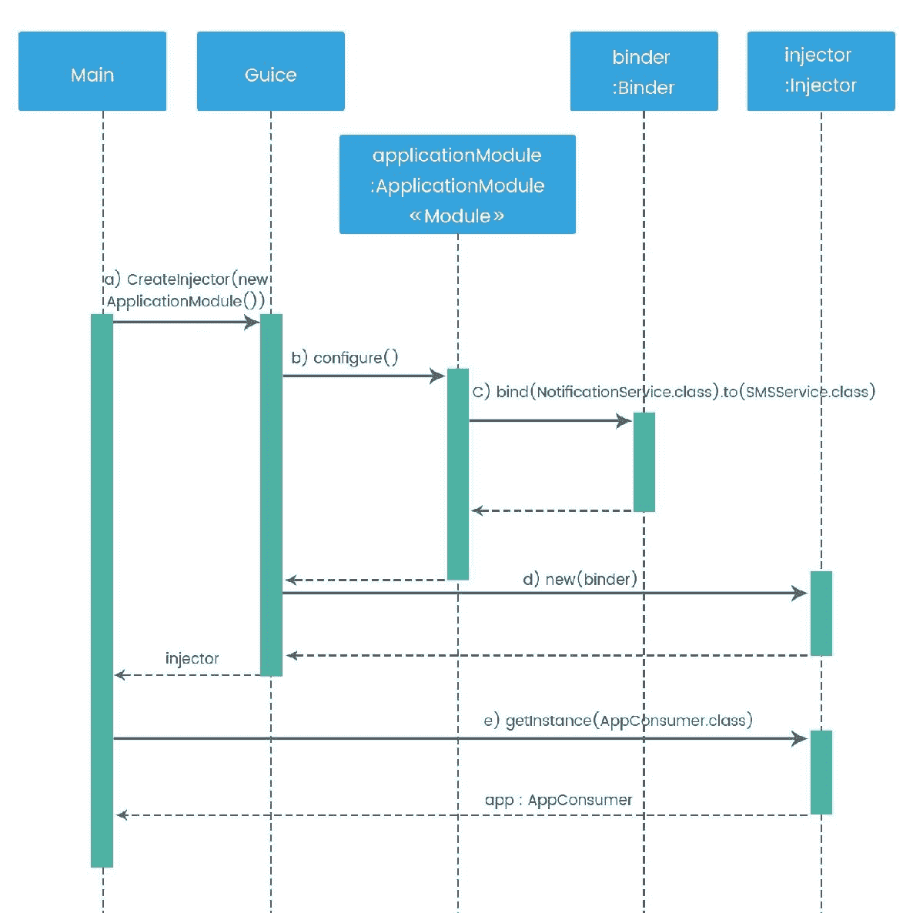
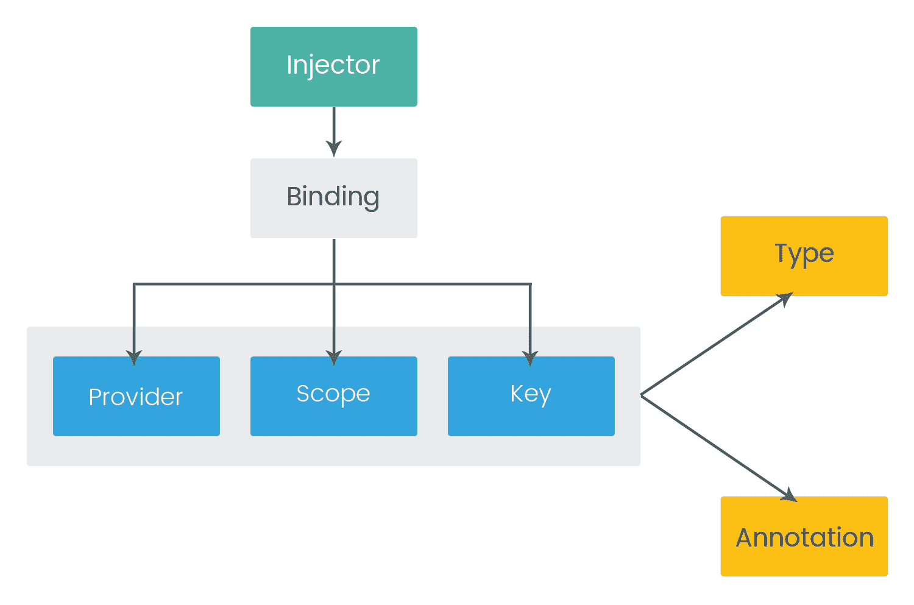

# 使用 Google Guice 进行依赖注入

自从我们的旅程开始，我们已经学习了 DI 模式的理念以理解 IoC，对 Java 9 的模块化框架及其 DI 机制有了初步的了解，在上一章中，我们通过各种示例获得了最广泛使用的 Spring 框架的知识，以理解 DI。

在本章中，我们将看到 Google Guice 框架及其 DI 机制的基础知识，我们还将学习在 Guice 中定义 DI 时的各种注入类型和绑定技术。

# Google Guice 框架简介

我们学习了 DI 在软件工程中的好处，但在实现 DI 时，明智地选择框架也很重要，因为每个框架都有其自身的优缺点。开源社区中有各种基于 Java 的依赖注入框架，例如 Dagger、Google Guice、Spring DI、JAVA EE 8 DI 和 PicoContainer。

在这里，我们将详细了解 Google Guice（发音为*juice*），这是一个轻量级的 DI 框架，帮助开发者模块化应用程序。Guice 封装了 Java 5 引入的注解和泛型特性，以使代码类型安全。它使对象能够以更少的努力连接在一起并进行测试。注解帮助您编写错误倾向和可重用的代码。

在 Guice 中，`new`关键字被`@inject`替换以进行依赖注入。它允许在构造函数、字段和方法（任何具有多个参数的方法）级别进行注入。使用 Guice，我们可以定义自定义作用域和循环依赖，并且它具有与 Spring 和 AOP 拦截器集成的功能。

此外，Guice 还实现了**Java 规范请求**（**JSR**）**330**，并使用 JSR-330 提供的标准注解。Guice 的第一个版本由 Google 在 2007 年推出，最新版本是 Guice 4.1。

# Guice 配置

为了使我们的编码简单，在本章中，我们将使用 Maven 项目来理解 Guice DI。让我们使用以下参数创建一个简单的 Maven 项目：`groupid: com.packt.guice.id`，`artifactId : chapter4`，和`version : 0.0.1-SNAPSHOT`。通过在`pom.xml`文件中添加`Guice 4.1.0`依赖项，我们的最终`pom.xml`将看起来像这样：

```java
<project  
  xsi:schemaLocation="http://maven.apache.org/POM/4.0.0 http://maven.apache.org/maven-v4_0_0.xsd">
  <modelVersion>4.0.0</modelVersion>
  <groupId>com.packt.guice.di</groupId>
  <artifactId>chapter4</artifactId>

  <packaging>jar</packaging>
  <version>0.0.1-SNAPSHOT</version>
  <name>chapter4</name>

  <dependencies>
    <dependency>
      <groupId>junit</groupId>
      <artifactId>junit</artifactId>
      <version>4.12</version>
      <scope>test</scope>
    </dependency>
    <dependency>
      <groupId>com.google.inject</groupId>
      <artifactId>guice</artifactId>
      <version>4.1.0</version>
    </dependency>
  </dependencies>
  <build>
    <finalName>chapter2</finalName>
  </build>
</project>
```

对于本章，我们使用了 JDK 9，但不是作为一个模块项目，因为 Guice 库不是作为 Java 9 模块 jar 提供的。

# 依赖注入和 JSR-330

在深入研究 Guice 注入之前，让我们再次简要地看看 DI 模式，以及 JSR-330。

依赖注入机制使一个对象能够将依赖传递给另一个对象。在 Java 中，使用 DI，我们可以将依赖解析从编译时移动到运行时。DI 消除了两个 Java 类之间的硬依赖；这使我们能够尽可能多地重用类，并且类可以独立测试。

**Java 规范请求-330**：在 Java 类中定义依赖关系有不同的方式，但`@Inject`和`@Named`是 JSR-330 中最常用的注解，用于描述 Java 类中的依赖关系。根据 JSR-330，对象可以被注入到类的构造函数、方法的参数和字段级别。根据最佳实践，应避免静态字段和方法级别注入，以下是一些原因：

+   只有在通过 DI 第一次创建类对象时，才会注入静态字段，这使得静态字段对构造函数不可访问

+   在运行时，如果静态字段被标记为 final，编译器会报错

+   当类的第一个实例被创建时，只会调用静态方法

根据 JSR-330，注入可以按以下顺序执行：首先，构造函数注入；然后是字段注入；最后是方法级别注入。但是，你不能期望方法或字段按照它们在类中的声明顺序被调用。

构造函数不能使用注入的成员变量，因为字段和方法参数的注入仅在调用构造函数之后发生。

# 简单 DI 的示例

`NotificationService`代表一个通用的服务接口，用于向不同的系统发送数据：

```java
public interface NotificationService {
    boolean sendNotification(String message, String recipient);
}
```

之前的接口通过传递消息和接收者详细信息并返回布尔类型来定义`sendNotification()`方法的签名。`SMSService.java`是这个接口的实体实现，用于发送短信通知：

```java
public class SMSService implements NotificationService {

  public boolean sendNotification(String message, String recipient) {
    // Code for sending SMS
    System.out.println("SMS message has been sent to " + recipient);
    return true;
  }
}
```

上一节课实现了通过接受消息和接收者详细信息来发送短信的代码。现在，我们创建一个客户端应用程序，`NotificationClient.java`，它将使用`NotificationService`来初始化实际的 SMSService。同一个对象可以用来向不同的系统发送通知，包括电子邮件或自定义通知：

```java
public class NotificationClient {

  public static void main(String[] args) {
    NotificationService notificationService = new SMSService();
    notificationService.sendNotification("Hello", "1234567890");
  }

}
```

在之前的示例中，尽管实现和接口是松散耦合的，但我们需要在客户端应用程序中手动创建类的真实实现的一个实例。在这种情况下，在编译时，客户端应用程序知道与接口相关的执行类将如何绑定。

这正是 Google Guice 所做的；它从客户端应用程序代码中获取实例作为服务，并注入客户端之间的依赖关系，然后通过简单的配置机制注入服务。

让我们通过在下一个主题中使用不同的 API 来查看 Guice 中依赖注入的一个示例。

# Guice 中的基本注入

我们已经看到了一个基本的 DI 实现，现在是时候了解 Guice 中的注入是如何工作的了。让我们重写一个使用 Guice 的示例通知系统，同时我们还将看到 Guice 中的一些不可或缺的接口和类。我们有一个名为`NotificationService`的基本接口，它期望以消息和接收者详细信息作为参数：

```java
public interface NotificationService {
  boolean sendNotification(String message, String recipient);
}
```

`SMSService`具体类是`NotificationService`接口的实现。在这里，我们将`@Singleton`注解应用到实现类上。当你考虑到服务对象将通过注入器类创建时，这个注解被提供以允许它们理解服务类应该是一个单例对象。由于 Guice 支持 JSR-330，可以使用`javax.inject`或`com.google.inject`包中的注解：

```java
import javax.inject.Singleton;
import com.packt.guice.di.service.NotificationService;

@Singleton
public class SMSService implements NotificationService {

  public boolean sendNotification(String message, String recipient) {
    // Write code for sending SMS
    System.out.println("SMS has been sent to " + recipient);
    return true;
  }

}
```

同样，我们也可以通过实现`NotificationService`接口来实施另一个服务，例如向社交媒体平台发送通知。

现在是定义消费者类的时候了，在这里我们可以初始化应用程序的服务类。在 Guice 中，`@Inject`注解将用于定义基于`setter`以及基于`constructor`的依赖注入。这个类的实例被用来通过可访问的通信服务发送通知。我们的`AppConsumer`类定义了如下基于`setter`的注入：

```java
import javax.inject.Inject;

import com.packt.guice.di.service.NotificationService;

public class AppConsumer {

  private NotificationService notificationService;

  //Setter based DI
  @Inject
  public void setService(NotificationService service) {
    this.notificationService = service;
  }

  public boolean sendNotification(String message, String recipient){
    //Business logic
    return notificationService.sendNotification(message, recipient);
  }
}
```

Guice 需要识别要应用哪个服务实现，因此我们应该通过扩展`AbstractModule`类来配置它，并为`configure()`方法提供一个实现。以下是一个注入器配置的示例：

```java
import com.google.inject.AbstractModule;
import com.packt.guice.di.impl.SMSService;
import com.packt.guice.di.service.NotificationService;

public class ApplicationModule extends AbstractModule{

  @Override
  protected void configure() {
    //bind service to implementation class
    bind(NotificationService.class).to(SMSService.class);
  }

}
```

在前面的类中，模块实现确定在确定`NotificationService`变量的地方注入`SMSService`的一个实例。同样，如果需要，我们只需要为新服务实现定义一个绑定。在 Guice 中的绑定类似于 Spring 中的连接：

```java
import com.google.inject.Guice;
import com.google.inject.Injector;
import com.packt.guice.di.consumer.AppConsumer;
import com.packt.guice.di.injector.ApplicationModule;

public class NotificationClient {

  public static void main(String[] args) {

    Injector injector = Guice.createInjector(new ApplicationModule());

    AppConsumer app = injector.getInstance(AppConsumer.class);

    app.sendNotification("Hello", "9999999999");
  }
}
```

在前面的程序中，`Injector`对象是通过`Guice`类的`createInjector()`方法创建的，通过传递`ApplicationModule`类的实现对象。通过使用注入器的`getInstance()`方法，我们可以初始化`AppConsumer`类。在创建`AppConsumer`对象的同时，Guice 注入了所需的服务类实现（在我们的例子中是`SMSService`）。以下是运行前面代码的结果：

```java
SMS has been sent to Recipient :: 9999999999 with Message :: Hello
```

因此，这是与其它 DI 相比 Guice 依赖注入的工作方式。Guice 采用了代码优先的依赖注入技术，并且不需要管理多个 XML 文件。

让我们通过编写一个**JUnit**测试用例来测试我们的客户端应用程序。我们可以简单地模拟`SMSService`的服务实现，因此不需要实现实际的服务。`MockSMSService`类看起来是这样的：

```java
import com.packt.guice.di.service.NotificationService;

public class MockSMSService implements NotificationService {

  public boolean sendNotification(String message, String recipient) {
    System.out.println("In Test Service :: " + message + "Recipient :: " + recipient);
    return true;
  }

}
```

以下是对客户端应用程序的 JUnit 4 测试用例：

```java
import org.junit.After;
import org.junit.Assert;
import org.junit.Before;
import org.junit.Test;

import com.google.inject.AbstractModule;
import com.google.inject.Guice;
import com.google.inject.Injector;
import com.packt.guice.di.consumer.AppConsumer;
import com.packt.guice.di.impl.MockSMSService;
import com.packt.guice.di.service.NotificationService;

public class NotificationClientTest {
    private Injector injector;

    @Before
    public void setUp() throws Exception {
      injector = Guice.createInjector(new AbstractModule() {

        @Override
        protected void configure() {
          bind(NotificationService.class).to(MockSMSService.class);
        }
      });
    }

    @After
    public void tearDown() throws Exception {
      injector = null;
    }

    @Test
    public void test() {
      AppConsumer appTest = injector.getInstance(AppConsumer.class);
      Assert.assertEquals(true, appTest.sendNotification("Hello There", "9898989898"));;
    }

}
```

注意，我们通过`AbstractModule`的匿名类实现将`MockSMSService`类绑定到`NotificationService`。这是在`setUp()`方法中完成的，该方法在测试方法运行之前运行一段时间。

# Guice API 和阶段

我们已经看到了使用各种 Guice API 的 DI 示例，包括接口和类。因此，现在是时候了解主要的 API 和架构了。Guice 架构分为两个阶段：启动和运行时。

# 启动阶段

在启动阶段，`Module`、`AbstractModule`、`Binder`、`Injector`、`Guice`和`Provider`等 API 在 Guice 依赖注入中发挥着重要作用。让我们详细了解每个 API，从**模块接口**开始。

# 模块接口

这是一个特殊的接口，您可以使用它来告诉 Guice 哪些实现与哪些接口相对应。模块是保存一组**绑定**的对象。在软件的一个部分中可以有多个模块。注入器与模块交互以获取可行的绑定。

模块是通过使用一个具有名为`Module.configure()`的方法的接口来表示的，该方法应该通过应用程序的重写来填充绑定。如果我们通过实现`Module`接口重写我们的`ApplicationModule`，那么它将看起来像这样：

```java
import com.google.inject.Module;
import com.packt.guice.di.impl.SMSService;
import com.packt.guice.di.service.NotificationService;

public class ApplicationModule implements Module{

  @Override
  protected void configure(Binder binder) {
    //bind NotificationService to SMSService implementation class
    //Guice will create a single instance of SMSService for every Injection
    binder.bind(NotificationService.class).to(SMSService.class);
  }
}
```

# 抽象模块类

为了改进，有一个名为`AbstractModule`的抽象类，它直接扩展了模块接口，因此应用程序可以依赖于`AbstractModule`而不是模块。

强烈建议将模块扩展到`AbstractModule`的使用。它提供了更可读的配置，并且还引导我们避免在绑定上过度调用方法。

在我们的示例`ApplicationModule`中，为了配置 Guice 而不是实现模块接口，我们使用了`AbstractModule`，其中 Guice 将我们的模块传递给绑定接口。

如果一个应用程序有一个预定的配置数量，它们可以被合并到一个单独的模块中。对于这样的应用程序，每个包或每个应用程序一个模块可能是一个合适的系统。

# 绑定器

此接口主要包含与**绑定**相关的信息。绑定通常由一个接口和一个具体实现的映射组成。例如，如果我们考虑一个用于创建自定义模块的模块接口的实现，那么接口`NotificationService`的引用绑定到了`SMSService`实现。

在编码时，请注意，接口和实现类的对象都传递给了`bind()`和`to()`方法：

```java
binder.bind(NotificationService.class).to(SMSService.class);
```

第二种方式是通过编写以下代码直接将接口与其实例绑定：

```java
binder.bind(NotificationService.class).to(new SMSService());
```

# 注入器

`Injector`接口创建并维护对象图，跟踪每种类型的依赖关系，并使用绑定来注入它们。注入器保持一组**默认绑定**，它们从中获取配置细节以在对象之间建立和维护关系。考虑以下代码，它将返回`AppConsumer`类的实现：

```java
AppConsumer app = injector.getInstance(AppConsumer.class);
```

我们也可以通过调用`Injector.getBindings()`方法来获取与注入器关联的所有绑定，该方法返回一个包含绑定对象的映射：

```java
Map<Key, Binding> bindings = injector.getBindings()
```

从这个例子中，我们可以得出结论，每个绑定都有一个匹配的`key`对象，该对象由 Google Guice 类内部创建并保留。

# Guice

`Guice`是一个最终类，是 Guice 框架的入口点。它通过提供一组模块来创建注入器：

```java
//From NotificationClient.java
Injector injector = Guice.createInjector(new ApplicationModule());

//Syntax from actual Guice Class  
Injector injector = Guice.createInjector(
                    new ModuleA(),
                    new ModuleB(),
                    . . .
                    new ModuleN(args)
);
createInjector() method takes ApplicationModule() as an argument; the same method also takes a varargs, which means we can pass zero or more modules separated by a comma.
```

# 提供者

默认情况下，每当应用程序需要一个对象的实例时，Guice 都会实例化并返回它；但在某些情况下，如果对象创建过程需要定制，那么 Guice 提供者会进行定制。提供者接口在创建对象方面遵循传统的工厂设计模式。例如，考虑我们的`ApplicationModule`类绑定过程：

```java
binder.bind(NotificationService.class).to(new SMSProvider());
```

通过编写上述代码行，`SMSProvider`类提供了将返回`NotificationService`类型对象的工厂方法。假设我们想要定制`ServiceConnection`类的对象创建和维护过程，如下所示：

```java
public class ServiceConnection {

    public void startService(){
        System.out.println("Start SMS Notification Service");
    }

    public void stopService(){
        System.out.println("Stop SMS Notification Service");
    }

}
```

现在让我们编写一个简单的`Provider`接口，它符合 Guice 的`Provider`，用于创建和返回`ServiceConnection`对象。以下是这个接口的代码：

```java
import com.google.inject.Provider;

public class SMSProvider implements Provider{

    @Override
    public ServiceConnection get() {

        // Write some custom logic here.
        ServiceConnection serviceConnection = new ServiceConnection();
        // Write some custom logic here.
        return serviceConnection;
    }
}
```

每个自定义提供者类都应该实现`Provider`接口，并且必须重写`get()`方法以返回以自定义方式创建的对象。目前，模块应该知道自定义提供者类，这样 Guice 就会请求`SMSProvider`创建实例，而不是自己创建。以下是一个包含测试客户端代码的模块片段：

```java
import javax.inject.Provider;

import com.google.inject.Binder;
import com.google.inject.Guice;
import com.google.inject.Injector;
import com.google.inject.Module;

public class NotificationClientTest {

    public static void main(String args[]){
        Injector injector = Guice.createInjector(
            new Module(){
                @Override
                public void configure(Binder binder) {
                    binder.bind(ServiceConnection.class).toProvider((Class<? extends Provider<? extends ServiceConnection>>) SMSProvider.class);
                }
            }
        );

        ServiceConnection serviceConnection =
        injector.getInstance(ServiceConnection.class);
        serviceConnection.startService();
        serviceConnection.stopService();
    }
}
```

我们已经单独看到了主要 API 的使用，它在 Guice 的启动阶段起着重要的作用。以下是我们应用程序的序列图，它说明了 Guice 依赖管理的完整流程：



# 运行时阶段

现在，我们将能够利用启动阶段创建的注入器来注入对象并检查我们的绑定。Guice 的运行时阶段由一个包含一些绑定的注入器组成：



上述图定义了每个绑定的组件。每个**键**唯一识别每个绑定。键由一个类型和一个可选的注解组成，客户端依赖于该类型。注解可以用来区分相同类型的几个绑定。

每个绑定都有一个提供者，它提供了一个必需类型的实例。我们可以提供一个类，Guice 将为我们创建其实例。我们也可以给 Guice 一个实例来绑定该类。如果我们提供自己的**提供者**，Guice 可以注入依赖。

默认情况下，没有绑定有作用域；但它是可选的，并且对于每次注入，Guice 都会创建一个新的实例，这与 Spring 的**Prototype**类似。Guice 还提供了一个定义自定义作用域的设施，以控制 Guice 是否创建新的实例。在这种情况下，我们可以为每个`HttpSession`创建一个实例。

# Guice 注解

Guice 附带了一组有用的注解，这些注解用于在应用程序中包含元数据值。现在，让我们研究本节将要讨论的注解。

# 注入

Guice 提供了 `@Inject` 注解来指示消费者依赖于特定的依赖项。注入器负责使用对象图初始化此依赖项。Guice 从注解中获取提示，表明它需要参与类构造阶段。`@Inject` 注解可以用于类的构造器、方法或字段。考虑以下代码：

```java
//Field level injection
@Inject
private NotificationService notificationService;

//Constructor level Injection
@Inject
public AppConsumer(NotificationService service){
     this.notificationService=service;
}

//Method  level injection
@Inject
public void setService(NotificationService service) {
    this.notificationService = service;
}
```

# 由...提供

```java
NotificationService.java;
```

```java
@ProvidedBy(SMSProvider.class)
public interface NotificationService{

}
//@ProvidedBy is equivalent to toProvider() binding like below,
bind(NotificationService.class).toProvider(SMSProvider.class)

```

# 实现者

这个注解关注于一个给接口提供实现的类对象。例如，如果 `NotificationService` 接口有多个用途，并且我们希望 `SMSService` 作为默认实现，那么我们可以这样编写代码：

```java
@ImplementedBy(SMSService.class)
public interface NotificationService{
    boolean sendNotification(String message, String recipient);
}
```

# @Named

为每个具体用途创建未使用的注解类型并不提供太多价值，因为拥有此类注解的唯一原因是为了检查客户端所需的实现类实例。为了支持此类功能，我们有一个内置的绑定注解 `@Named`，它接受一个字符串。有 `Names.named()` 方法，当传递名称作为参数时返回 `@Named` 注解：

```java
bind(NotificationService.class).annotatedWith(Names.named("SMS"))
          .to(SMSService.class);
```

我们建议谨慎使用 `@Named`，因为编译器无法检查字符串。

`@Singleton` 是另一个有用的注解，我们将在第五章 *作用域* 中详细讨论。

# Guice 中的绑定

在上一个主题中，我们了解了绑定过程及其在 Guice DI 中的重要性。每个对 `bind()` 方法的绑定调用都会进行类型检查，因此编译器可以报告你使用不正确类型时的错误。

Guice 提供了不同类型的绑定技术，这些技术可以在模块中使用。可用的绑定类型包括：链接绑定、实例绑定；未指定绑定。构造器绑定、内置绑定、即时绑定以及提供者绑定。

# 链接绑定

**Linked binding** 帮助将类型映射到其实现。链接绑定的例子包括对其实现类的接口，以及子类到超类。

在这里，`NotificationService` 在 `ApplicationModule` 类中被绑定到 `SMSService` 实例。这种绑定确认将一个接口绑定到其实现：

```java
   bind(NotificationService.class).to(SMSService.class);
```

当我们调用 `injector.getInstance(ApplicationModule.class)` 时，它将使用 `SMSService`。如果需要绑定到 `NotificationService` 的特定实现，例如 `EmailService`，那么我们只需要基本更改绑定：

```java
bind(NotificationService.class).to(EmailService.class);
```

我们甚至可以定义从类型到其任何子类型（如执行类或扩展类）的链接。你确实可以将具体的 `SMSService` 课程链接到一个子类：

```java
bind(SMSService.class).to(SMSDatabase.class);
```

一个基本需要理解的是，链接绑定确实可以被链式调用。例如，如果我们需要`SMSService`与一个扩展`SMSService`的特定类进行连接，那么我们就会做类似这样的事情：

```java
public class ApplicationModule implements AbstractModule{
  @Override
  protected void configure() {
    //Linked binding as chain
    bind(NotificationService.class).to(SMSService.class);
    bind(SMSService.class).to(SMSDataBase.class);
  }

}
```

在这里，如果请求`NotificationService`，那么注入器将返回`SMSDataBase`实例。

# 实例绑定

**实例绑定**有助于将一个类型绑定到该类型的特定实例。这通常只对没有依赖关系的对象有帮助；例如，值对象：

```java
Public class SearchModule extends AbstractModule{
    @Override
    protected void configure() {
        bind(SearchParameters.class).toInstance(new SearchParameters());
    }
}
```

避免使用`.toInstance`与制作复杂的对象，因为它可能会减慢应用程序的启动速度。你可以使用`@Provides`技术。

# 未指定目标的绑定

可以不指定目标创建的绑定称为未指定绑定。这些实际上是向注入器发出关于类型的信号，以便依赖关系被急切地安排。在**未指定绑定**中，我们不需要`to`子句：

```java
bind(SampleConcreteClass.class).in(Singleton.class);
//Another way to define untargeted binding
bind(String.class).toInstance("./alerts/");
```

在这个语句中，注入器会急切地准备一个 String 类的实例，其值为`./alerts/`。当依赖注入需要注入 String 类的实例时，它将注入这个特定的实例。这种绑定在定义具体类和由`@ImplementedBy`或`@ProvidedBy`注解的类型时非常有用。

# 构造函数绑定

这种类型的绑定将一个类型绑定到一个构造函数。这个特定的情况发生在`@Inject`注解不能应用于目标构造函数时。可能的原因包括：

+   如果我们使用第三方类

+   几个参与依赖注入的构造函数

为了解决这个问题，我们在模块中有了`toConstructor()`绑定。在这里，如果找不到构造函数，模块将反射选择我们的目标构造函数并处理异常：

```java
public class SampleModule extends AbstractModule {
  @Override 
  protected void configure() {
    try {
      bind(NotificationService.class).toConstructor(
          SMSService.class.getConstructor(SMSDatabaseConnection.class));
    } catch (NoSuchMethodException e) {
      e.getPrintStackTrace();
    }
  }
}
```

在前面的代码中，`SMSService`应该有一个接受单个`SMSDatabaseConnection`参数的构造函数。Guice 将构造这个构造函数来满足绑定，因此构造函数不需要`@Inject`注解。如果我们选择反射构造函数，那么我们需要处理`getConstructor()` API 抛出的受检异常。

每个构造函数绑定的范围是独立的。如果我们为同一个构造函数创建不同的单例绑定，每个绑定都会产生其自己的实例。

# 内置绑定

如其名所示，这些是在注入器中自动覆盖的绑定。让注入器来创建这些绑定，因为自己尝试绑定它们将是一个错误。**日志记录器**就是这样一个例子。

+   **日志记录器**：`java.util.logging.Logger`在 Guice 中有一个内置绑定。这个绑定自然地将日志记录器的标题设置为注入日志记录器的类的标题：

```java
@Singleton
public class SMSDatabaseLog implements DatabaseLog {

  private final Logger logger;

  @Inject
  public SMSDatabaseLog(Logger logger) {
    this.logger = logger;
  }

  public void loggerException(UnreachableException e) {
    //Below message will be logged to the SMSDatabaseLog by logger.
    logger.warning("SMS Database connection exception, " + e.getMessage());
  }
```

# 实时绑定

这些可能是 Guice 自动创建的绑定。当没有明确的绑定时，注入器将努力创建一个绑定，这是一个**即时**(**JIT**)绑定或隐式绑定。

**默认构造函数**：默认情况下，不会调用无参数构造函数来获取准备注入的实例。偶尔，在我们的示例中，没有明确的绑定作为创建 `Client` 实例的方式。在任何情况下，注入器都会调用默认构造函数来返回客户端的实例。

**带有 @Inject 的构造函数**：如果构造函数有 `@Inject` 注解，那么它也适用于隐式绑定。它还包括无参数和公共构造函数：

```java
//Constructor Based Injector
@Inject
public AppConsumer(NotificationService notificationService){
    this.service = notificationService;
}
```

# 绑定注解

有时我们想要为同一类型使用多个绑定。在我们之前的例子中，`NotificationService` 绑定到 `SMSService`，这实际上是无用的，因为接口只绑定到一个执行。如果我们需要客户端能够利用任何实现，那么我们需要在 `configure()` 方法中编写几个绑定语句，为了使这成为可能，我们可以编写如下代码：

```java
bind(NotificationService.class).annotatedWith(“sms”).to(SMSService.class);
bind(NotificationService.class).annotatedWith(“email”).to(EmailService.class);
```

从前面的语句中，Guice 知道何时将 `NotificationService` 接口绑定到 `SMSService`，何时绑定到 `EmailService`。

调用 `SMSService` 实现的客户端代码将如下所示：

```java
AppConsumer app = injector.getInstance(@Named("sms") AppConsumer.class);
```

并且调用 `EmailService` 实现如下：

```java
AppConsumer app = injector.getInstance(@Named("email") AppConsumer.class);
```

为了支持这种情况，绑定支持非强制性的 *绑定注解*。一个 **键** 是注解和类型唯一组合的对。以下是为 SMS 注解定义绑定注解的基本代码：

```java
@BindingAnnotation @Target({ FIELD, PARAMETER, METHOD }) @Retention(RUNTIME)
public @interface SMS{}
```

从前两行来看，让我们看看元注解：

+   `@BindingAnnotation` 用于告知 Guice 这是一个绑定的说明。如果我们为同一成员定义不同的绑定，那么 Guice 可能会生成错误。

+   `@Target` 和 `@Retention` 是在 Java 中创建自定义注解时常用的注解。`@Target` 帮助定位字段、参数和方法，`@Retention(RUNTIME)` 分别在运行时可用。

# Guice 注入

既然我们已经知道了依赖注入是什么，让我们来看看 Google Guice 如何提供注入。

我们已经看到注入器通过从模块中读取配置来帮助解决依赖关系，这些模块被称为 *绑定*。*注入器* 正在为请求的对象准备图表。

依赖注入由注入器通过各种类型的注入来管理：

+   构造函数注入

+   方法注入

+   字段注入

+   可选注入

+   静态注入

# 构造函数注入

**构造函数注入**可以通过在构造函数级别使用 `@Inject` 注解来实现。这个构造函数应该将类依赖项作为参数来识别。此时，多个构造函数将把参数分配给它们的最终字段：

```java
public class AppConsumer {

  private NotificationService notificationService;

  //Constructor level Injection
  @Inject
  public AppConsumer(NotificationService service){
       this.notificationService=service;
  }

  public boolean sendNotification(String message, String recipient){
    //Business logic
    return notificationService.sendNotification(message, recipient);
  }
}
```

如果我们的类没有带有 `@Inject` 的构造函数，那么它将被视为一个不带参数的默认构造函数。当我们有一个单构造函数且类接受其依赖项时，构造函数注入将完美工作，并且对单元测试很有帮助。这也很容易，因为 Java 正在维护构造函数调用，所以你不必担心对象以未初始化的状态到达。

# 方法注入

Guice 允许我们通过使用 `@Inject` 注解来定义方法级别的注入。这与 Spring 中可用的设置器注入类似。在这种方法中，依赖项作为参数传递，并在方法调用之前由注入器解决。方法名称和参数数量 **不影响** 方法注入：

```java
private NotificationService notificationService;
//Setter Injection
@Inject
public void setService(NotificationService service) {
   this.notificationService = service;
}
```

当我们不希望控制类的实例化时，这可能很有价值。此外，如果我们有一个需要一些依赖项的父类，我们也可以利用它。（在构造函数注入中实现这一点是困难的。）

# 字段注入

字段可以通过 Guice 中的 `@Inject` 注解进行注入。这是一个简单且简短的注入方式，但如果与 `private` 访问修饰符一起使用，则会使字段不可测试。建议避免以下情况：

```java
@Inject private NotificationService notificationService;
```

# 可选注入

Guice 提供了一种声明可选注入的方法。方法和字段可能是可选的，这会导致 Guice 在依赖项不可访问时静默地忽略它们。可以通过提及 `@Inject(optional=true)` 注解来使用 **可选注入**：

```java
public class AppConsumer {
  private static final String DEFAULT_MSG = "Hello";
  private string message = DEFAULT_MSG;

  @Inject(optional=true)
  public void setDefaultMessage(@Named("SMS") String message) {
    this.message = message;
  }
}
```

# 静态注入

**静态注入** 在我们需要将静态工厂实现迁移到 Guice 时很有帮助。它使得对象能够通过获取注入类型而不被注入本身的方式，主要参与依赖注入。在一个模块中，为了在创建注入器时指示要注入的类，请使用 `requestStaticInjection()`。例如，`NotificationUtil` 是一个提供静态方法 `timeZoneFormat` 的实用类，该方法接受一个给定格式的字符串，并返回日期和时间区。`TimeZoneFormat` 字符串在 `NotificationUtil` 中是硬编码的，我们将尝试静态注入此实用类。

考虑到我们有一个私有的静态字符串变量 `timeZonFmt`，它具有设置器和获取器方法。我们将使用 `@Inject` 进行设置器注入，并使用 `@Named` 参数。

`NotificationUtil` 将看起来像这样：

```java
@Inject static String timezonFmt = "yyyy-MM-dd'T'HH:mm:ss";

@Inject
public static void setTimeZoneFmt(@Named("timeZoneFmt")String timeZoneFmt){
 NotificationUtil.timeZoneFormat = timeZoneFmt;
}
```

现在，`SMSUtilModule` 应该看起来像这样：

```java
class SMSUtilModule extends AbstractModule{
    @Override
    protected void configure() {
       bindConstant().annotatedWith(Names.named(timeZoneFmt)).to(yyyy-MM-dd'T'HH:mm:ss);
       requestStaticInjection(NotificationUtil.class);
    }
}
```

由于它面临着与静态工厂相同的大量问题，因此不建议在常规使用中采用此 API。它也难以测试，并且使依赖项变得不确定。

# 摘要

因此，这就是 Google Guice 的全部内容。总结本章，我们开始于基本的依赖注入。之后，我们学习了 Guice 中基本依赖注入的工作方式，并提供了示例。

然后，我们研究了 Guice 的各个阶段以及 API 在每个阶段中的作用。我们得到了这样的想法，与 Spring 不同，在 Guice 中没有要求维护独立的 XML 文件，因为所有与设置相关的数据都通过模块组件得到了很好的类型化。

在本章的中间部分，我们探讨了 Guice 中可用的主要注解和不同的绑定类型，而在本章的最后，我们学习了不同类型的注入方式。

在下一章中，我们将熟练掌握 Spring 和 Google Guice 框架提供的不同作用域。
