# 作用域

在这次旅程中，我们通过示例学习了 Java 9、Spring 和 Google Guice 中的依赖注入概念。

在第三章的*使用 Spring 进行依赖注入*和第四章的*使用 Google Guice 进行依赖注入*中，我们遇到了作用域这个词，它是 Spring beans 和 Google Guice 的一个重要元素。因此，让我们了解什么是作用域，以及为什么在讨论依赖注入时它很重要。

在本章中，我们将首先了解 Spring 提供的各种作用域，以及它们如何为 Spring beans 定义。我们还将了解 bean 作用域与依赖注入之间的关系。最后，我们将探讨 Google Guice 中可用的作用域。我们将讨论的主题如下：

+   Spring 中 bean 作用域的介绍

+   如何定义 bean 作用域

+   依赖注入和 bean 作用域

+   如何选择 bean 作用域

+   Google Guice 中的作用域

# Spring 中 bean 作用域的介绍

在第三章的*使用 Google Guice 进行依赖注入*中，我们学习了与依赖注入一起的不同 Spring 模块。在 Spring 中，bean 是应用程序的骨干，由 Spring IOC 容器管理。bean 是使用我们可以传递给 IOC 容器的元数据配置创建的类或对象。在学习作用域之前，让我们在 Spring 中定义一个 bean。

# Bean 定义

**bean**的元数据具有其自己的属性，这些属性具有独立的 bean 定义。以下是一些这些 bean 定义的例子：

+   **类**：这将用于创建 bean，我们必须指定一个类名，为该类创建 bean。

+   **名称**：如果我们想为 bean 定义不同的别名，那么我们使用`name`属性，借助分隔符，例如逗号（`,`）或分号（`;`）。当我们有基于 XML 的配置时，我们可以使用`name`和/或`id`属性作为 bean 的标识符。具有`id`属性的 bean 更受欢迎，因为它与实际的 XML ID 元素相映射。

+   **构造函数参数**：构造函数参数用于通过在构造函数中传递参数作为参数来注入依赖项，这在第三章中看到，*使用 Spring 进行依赖注入*。

+   **属性**：我们可以在 Spring bean 中直接通过键值对传递属性以进行注入。如果我们需要将某些固定值传递给 bean，这有时是有用的。

+   **自动装配模式**：自动装配可以用来减少属性和构造函数参数的使用。要启用自动装配模式，我们需要在 Spring bean 中使用`autowire`属性。属性可以具有`byName`、`byType`和`constructor`*等值*。

+   **懒加载初始化模式**：默认情况下，Spring bean 以单例作用域创建，以贪婪模式初始化所有属性。如果 bean 以懒加载模式定义，则 IOC 容器会在第一次请求到来时创建 bean 实例，而不是在启动过程中。

+   **初始化方法**：Spring 初始化在 IOC 容器设置所有属性之后进行。在基于 XML 的配置中，我们可以通过定义`init-method`属性来定义`init`方法。`init`方法应该是 void 类型，且没有参数。可以使用`@PostConstruct`注解来初始化方法。

+   **销毁方法**：在 bean 生命周期结束时，如果我们需要关闭资源或想在 bean 销毁前执行操作，我们可以使用 XML 配置中 bean 的`destroy-method`属性。也可以使用`@PreDestroy`注解代替 XML 属性。

以下配置文件包含不同类型的 bean 定义语法，因此`application-context.xml`文件可能如下所示：

```java
<?xml version="1.0" encoding="UTF-8"?>
<beans 

    xsi:schemaLocation="http://www.springframework.org/schema/beans
        http://www.springframework.org/schema/beans/spring-beans.xsd">

   <!-- A simple bean definition with ID and Class Name-->
   <bean id = "..." class = "...">
      <!-- Bean configuration and properties like constructor-arg -->
   </bean>

   <!-- Bean definition using Name attribute instead of ID attribute -->
   <bean name = "..." class = "...">
      <!-- Bean configuration and properties like constructor-arg -->
   </bean>

   <!-- Ban definition with constructor arguments -->
   <bean id="..." class="...">
        <constructor-arg ref="..."/>
        <constructor-arg ref="..."/>
   </bean>

   <!-- Ban definition for autowiring using byName mode -->
   <bean id="..." class="..." autowire="byName">
   <!-- Bean configuration and properties like constructor-arg -->
   </bean>

   <!-- Ban definition for defining scope -->
   <bean id="..." class="..." scope="prototype">
   <!-- Bean configuration and properties like constructor-arg -->
   </bean> 

   <!-- Ban definition with lazy initialization mode -->
   <bean id = "..." class = "..." lazy-init = "true">
      <!-- Bean configuration and properties like constructor-arg -->
   </bean>

   <!-- Bean definition which has initialization method -->
   <bean id = "..." class = "..." init-method = "init">
       <!-- Bean configuration and properties like constructor-arg -->
   </bean>

   <!-- Bean definition which has destruction method -->
   <bean id = "..." class = "..." destroy-method = "destroy">
       <!-- Bean configuration and properties like constructor-arg -->
   </bean>

</beans>
```

当作用域是**单例**时，懒加载最有效。对于**原型**作用域，bean 默认以懒加载模式初始化。

# Spring 作用域

我们已经了解了 bean 定义如何使用不同的属性，**作用域**是 bean 定义中的一个属性。在继续学习作用域类型之前，一个问题浮现在脑海中：什么是作用域？

如果我们从 Spring 的角度来看，**作用域**的意义是，*定义 bean 的生命周期并在 bean 使用的特定上下文中定义该 bean 的可见性*。当对象的作用域结束时，它将被视为**超出作用域**，并且不能再注入到不同的实例中。

根据**牛津高阶英汉双解大词典**，作用域意味着“*某事物处理或与之相关的区域或主题范围*。”

Spring 有七个作用域，其中五个用于 Web 应用程序开发。以下是一个**Bean 作用域**的图示：

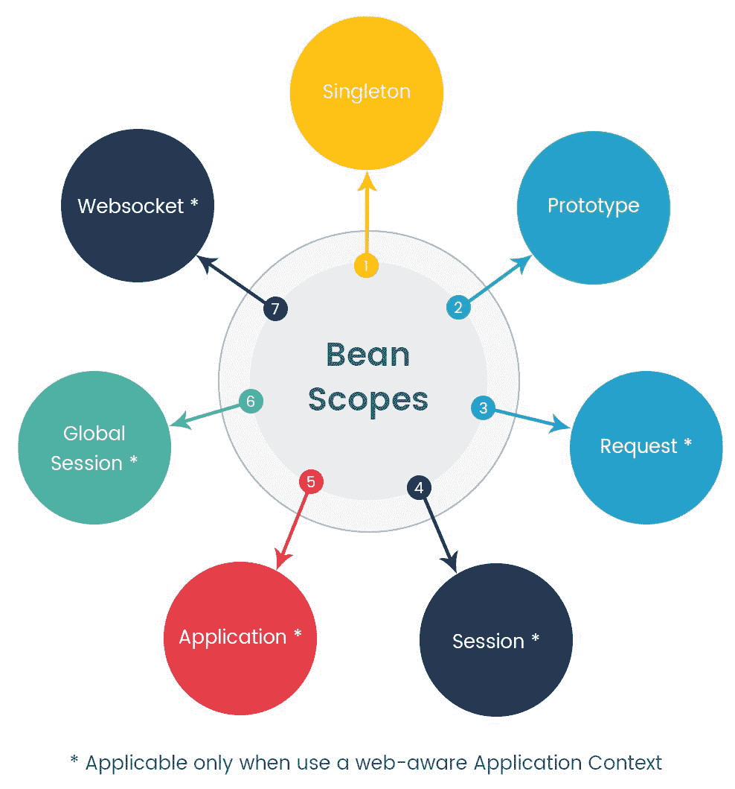

# 单例作用域

Spring 容器创建的每个 bean 都有一个默认的单例作用域；Spring 将其视为 bean 的一个实例，并为容器内缓存中的每个对该 bean 的请求提供服务。在依赖注入中，定义为单例的 bean 作为共享 bean 从缓存中注入。

**单例**bean 作用域限制在 Spring 容器内，与 Java 中的单例模式相比，Java 中的单例模式在每个`ClassLoader`中只会创建特定类的一个实例。此作用域在 Web 应用程序以及独立应用程序中都很有用，无状态 bean 也可以利用**单例**作用域。

如果有三个 bean 具有不同的 ID 但具有相同的**单例**作用域，那么将创建该类的三个实例，在 bean ID 方面，因为单例 bean 只有一个实例被创建：

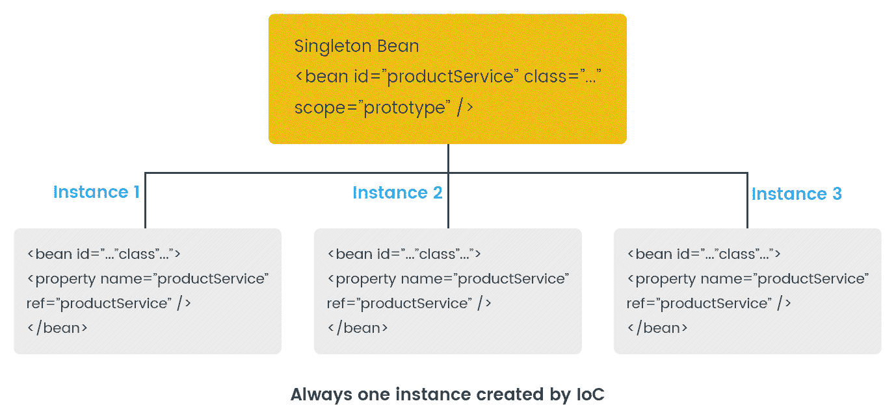

# 原型作用域

当我们需要创建多个 bean 实例时，我们使用原型作用域。原型作用域的 bean 主要用于有状态的 bean。因此，在每次请求时，IoC 容器都会创建 bean 的新实例。这个 bean 可以被注入到另一个 bean 中，或者通过调用容器的`getBean()`方法来使用。

但是，容器在初始化后不会维护原型 bean 的记录。我们必须实现一个自定义的`BeanPostProcessor`来释放原型 bean 占用的资源。在原型作用域的情况下，不会调用生命周期中的`destroy`方法，而是对所有对象调用初始的回调方法，无论作用域如何：

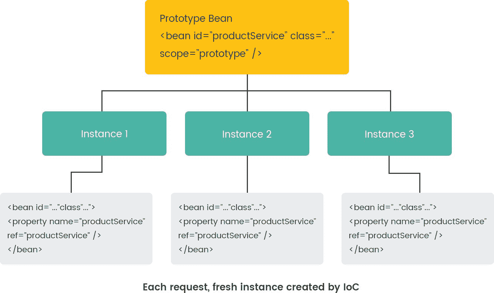

到目前为止，我们已经看到了**单例**和原型作用域。两者都可以用于独立和 Web 应用程序，但还有五个更多的作用域仅在 Web 应用程序中工作。如果我们使用这些作用域与`ClassPathXmlApplicationContext`一起，那么它将抛出一个`IllegalStateException`，表示未知的作用域。

要使用请求、会话、全局会话、应用程序和 websocket 作用域，我们需要使用一个感知网络的上下文实现（`XmlWebApplicationContext`）。让我们详细看看所有这些网络作用域。

# 请求作用域

在 Web 应用程序中，如果 bean 的作用域被定义为**请求**，则客户端的每个 HTTP 请求都会得到一个新的 bean 实例。在 HTTP 请求完成时，bean 将立即被视为超出作用域，并将释放内存。如果服务器有 100 个并发请求，那么将有 100 个不同的 bean 类实例可用。如果一个实例发生变化，它不会影响其他实例。以下是请求作用域的图像：

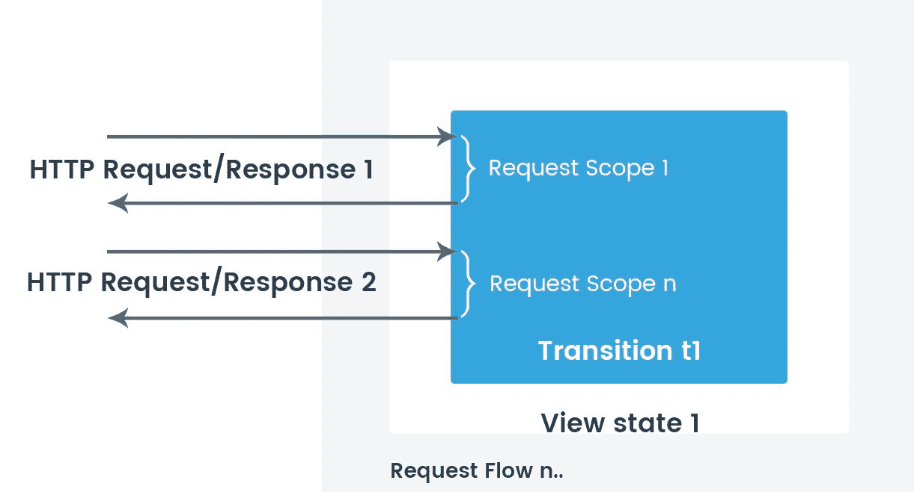

# 会话作用域

**会话**是一组交互式信息，也称为在网站特定时间框架内客户端和服务器之间的*转换*。在**Apache Tomcat**服务器中，一个会话的默认时间框架是 30 分钟，包括用户所做的所有操作。

Spring 会话 bean 作用域类似于 HTTP 会话；IoC 容器为每个用户会话创建一个 bean 的新实例。在用户登出时，其会话 bean 将超出作用域。就像请求一样，如果有 50 个用户同时使用一个网站，那么服务器将有 50 个活跃会话，Spring 容器也将有 50 个不同的 bean 类实例：

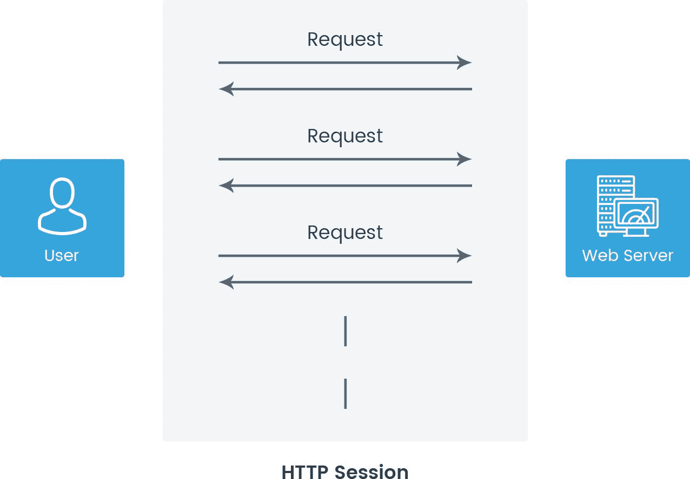

之前的图像说明了所有用户的 HTTP 请求都包含在一个会话中，并且所有请求在该会话作用域中可能都有单个 bean 实例的生存期访问。会话实例将被销毁，就像之前一样，会话在服务器上被销毁/退出。

# 应用程序作用域

应用程序作用域仅在 Web 应用程序中工作。在运行时，IoC 容器为每个 Web 应用程序创建单个 bean 定义的实例。以下定义应用程序作用域的两种方式：

```java
// 1) XML way to configure define application scope
<bean id="..." class="com.packt.scope.applicationBeanTest" scope="application" />

// 2) Java config using annotation 
@Component
@Scope("application")
public class applicationBeanTest {
}

//or

@Component
@ApplicationScope
public class applicationBeanTest {
}
```

这与单例范围相同，但主要区别在于单例范围 bean 在每个`ApplicationContext`中作为单例工作，而应用范围 bean 在每个`ServletContext`中作为单例工作。这些 bean 存储在`ServletContext`的属性中。

# 全局会话范围

**全局会话范围**类似于会话范围。唯一的区别是它将在组件应用程序中使用。当我们的应用程序基于 JSR-168、JSR-286 和 JSR-362 门户规范构建时，可以使用全局会话。将会有多个站点/应用程序在单个组件容器下工作。

组件容器有不同的组件，每个都有自己的组件上下文和组件会话。组件会话与组件边界一起工作，但当我们需要在多个站点之间共享共同信息时，我们可以定义具有`globalSession`范围的 bean。Spring 为门户应用程序提供了独立的组件 MVC 模块：

```java
// 1) XML way to configure define application scope
<bean id="..." class="com.packt.scope.globalBeanTest" scope="globalSession" />

// 2) Java config using annotation 
@Component
@Scope("globalSession")
public class globalBeanTest {
}

//or

@Component
@GlobalSessionScope
public class globalBeanTest {
}
```

考虑一个由服务器站点组成的内部网络应用程序。用户可以是多个站点的成员。在这种情况下，具有共同信息的用户偏好可以存储为登录用户的全局会话，并且将在多个站点和组件之间使用。以下图像显示了全局会话如何在组件容器之间共享：

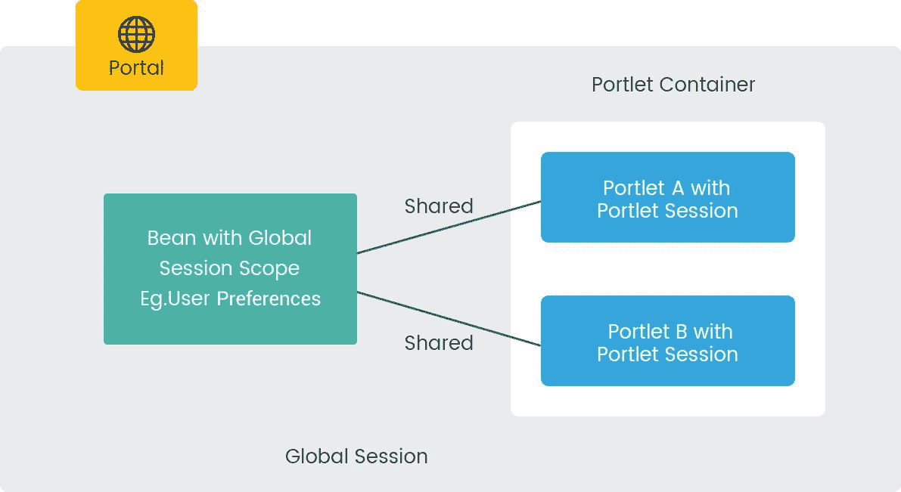

# WebSocket 范围

当使用 WebSocket 协议启用客户与远程站点之间的双向通信时，将使用此范围。它主要适用于多个用户同时执行操作的应用程序。

在这里，使用 HTTP 请求进行初始握手，一旦建立，TCP 端口将保持打开状态，以便客户端和服务器进行通信。WebSocket 组件类似于单例，并注入到 Spring 控制器中。与典型的 WebSocket 会话相比，WebSocket 组件的生命周期更长。以下示例显示了如何使用范围注解和传统的 XML 配置声明 WebSocket：

```java
//Using @Scope annotation
@Scope(scopeName = "websocket")

//Using XML configuration 
<bean id="..." class="com.packt.scope.WebsocketExampleTest" scope="websocket" />

```

# 如何定义 bean 范围

因此，我们了解了不同的范围及其用法。现在，让我们看看如何在编码中使用它们。我们将主要通过示例查看单例和原型 bean 范围。

Spring 提供了两种不同的方式来编写应用程序：一种是通过传统的 XML 元数据配置，另一种是使用注解的 Java 配置。让我们看看 XML 配置是如何使用的。

# XML 元数据配置

在 Spring 中，bean 配置是在我们选择的 XML 文件中声明的。该文件由 IoC 容器用于初始化应用程序上下文，同时，所有 bean 定义都是基于提供的属性初始化的。

# 使用单例范围

单例作用域是在主要应用程序中非常常见的作用域。在这里，我们将开始使用单例作用域。首先，我们将创建一个名为`EmailService`的 bean 类，它包含一个简单的`getter/setter`方法和一个带有`print`语句的构造方法：

```java
package com.packt.springbean;

public class EmailService {

  private String emailContent;
  private String toAddress;

  public EmailService() {
    System.out.print(" \n Object of EmailService is Created !!! ");
  }

  public String getEmailContent() {
    return emailContent;
  }

  public void setEmailContent(String emailContent) {
    this.emailContent = emailContent;
  }

  public String getToAddress() {
    return toAddress;
  }

  public void setToAddress(String toAddress) {
    this.toAddress = toAddress;
  }

}
```

每个 Spring 应用程序都需要一个上下文文件来描述 bean 的配置。之前提到的 bean 类的配置可以如下在`application-context.xml`中编写：

```java
<?xml version="1.0" encoding="UTF-8"?>
<beans 

  xsi:schemaLocation="http://www.springframework.org/schema/beans
        http://www.springframework.org/schema/beans/spring-beans.xsd">

  <bean id="emailService" class="com.packt.springbean.EmailService"
    scope="singleton" />

</beans>
```

在这里，在 bean 定义中，我们已经将`emailService`作为 ID 属性，并提供了`com.packt.springbean.EmailService`作为类名，以指向我们的 bean 类所在的包路径。为了学习目的，我们使用了具有`singleton`值的`scope`属性。

如果在 bean 定义中没有定义`scope`属性，那么默认情况下，Spring IoC 容器将使用单例作用域创建 bean 的实例。现在，让我们检查如果我们尝试两次访问`EmailService` bean 会发生什么。为此，让我们使用`SpringBeanApplication.java`类：

```java
//SpringBeanApplication.java

package com.packt.springbean;

import org.springframework.context.ApplicationContext;
import org.springframework.context.support.ClassPathXmlApplicationContext;

public class SpringBeanApplication {

  public static void main(String[] args) {

    ApplicationContext context = new ClassPathXmlApplicationContext(new String[] { "application-context.xml" });

    // Retrieve emailService bean first time.
    EmailService emailServiceInstanceA = (EmailService) context.getBean("emailService");
    emailServiceInstanceA.setEmailContent("Hello, How are you?");
    emailServiceInstanceA.setToAddress("krunalpatel1410@yahoo.com");

    System.out.println("\n Email Content : " + emailServiceInstanceA.getEmailContent() + " sent to "+ emailServiceInstanceA.getToAddress() );

    // Retrieve emailService bean second time. 
    EmailService emailServiceInstanceB = (EmailService) context.getBean("emailService");
    System.out.println("\n Email Content : " + emailServiceInstanceB.getEmailContent() + " sent to "+ emailServiceInstanceB.getToAddress() );

  }
}
```

在一个独立的应用程序中，使用`ClassPathXMLApplicationContext`通过传递一个字符串数组中的上下文文件作为参数来获取 Spring 上下文。Spring IoC 容器初始化应用程序上下文，并返回它的一个对象。

通过在`getBean()`方法中以参数形式传递一个 bean `name`来检索 bean。在先前的例子中，我们使用`getBean()`方法获取了两个`EmailService` bean 的实例。但是，第一次我们只是将值设置到一个 bean 中，并且通过写入`打印消息`来获取相同的值。甚至构造函数也只创建 bean 对象一次。

因此，当我们运行`SpringBeanApplication`时，输出将如下所示：

```java
Feb 09, 2018 6:45:15 AM org.springframework.context.support.AbstractApplicationContext prepareRefresh
INFO: Refreshing org.springframework.context.support.ClassPathXmlApplicationContext@6fc6f14e: startup date [Fri Feb 09 06:45:15 IST 2018]; root of context hierarchy
Feb 09, 2018 6:45:15 AM org.springframework.beans.factory.xml.XmlBeanDefinitionReader loadBeanDefinitions
INFO: Loading XML bean definitions from class path resource [application-context.xml]

 Object of EmailService is Created !!! 
 Email Content : Hello, How are you? sent to krunalpatel1410@yahoo.com

 Email Content : Hello, How are you? sent to krunalpatel1410@yahoo.com
```

由于`EmailService` bean 具有单例作用域，因此第二个实例`emailServiceInstanceB`打印的消息将包含由`emailServiceInstanceA`设置的值，即使它是通过一个新的`getBean()`方法获取的。Spring IoC 容器为每个容器创建并维护一个 bean 的单例实例；无论你使用`getBean()`多少次回收它，它都将持续返回相同的实例。

# 使用原型作用域

正如我们所见，原型作用域用于每次请求时获取一个新实例的 bean。为了理解原型作用域，我们将使用相同的 bean 类，`EmailService`，并且我们只需要更改`application-context.xml`中`emailService` bean 的作用域属性值：

```java
<?xml version="1.0" encoding="UTF-8"?>
<beans 

  xsi:schemaLocation="http://www.springframework.org/schema/beans
        http://www.springframework.org/schema/beans/spring-beans.xsd">

  <bean id="emailService" class="com.packt.springbean.EmailService"
    scope="prototype" />

</beans>
```

用于单例作用域的代码将与之前相同，而前述代码的输出将如下所示：

```java
Feb 09, 2018 7:03:20 AM org.springframework.context.support.AbstractApplicationContext prepareRefresh
INFO: Refreshing org.springframework.context.support.ClassPathXmlApplicationContext@6fc6f14e: startup date [Fri Feb 09 07:03:20 IST 2018]; root of context hierarchy
Feb 09, 2018 7:03:20 AM org.springframework.beans.factory.xml.XmlBeanDefinitionReader loadBeanDefinitions
INFO: Loading XML bean definitions from class path resource [application-context.xml]

 Object of EmailService is Created !!! 
 Email Content : Hello, How are you? sent to krunalpatel1410@yahoo.com

 Object of EmailService is Created !!! 
 Email Content : null sent to null
```

从输出中可以看出，`EmailService`构造函数被调用了两次，并且每次调用`getBean()`方法时都会获取一个新的实例。对于第二个实例，`emailServiceInstanceB`，我们得到一个`null`值，因为我们还没有为它设置任何值。

# 使用注解的 Java 配置

一旦在 `Java 1.5` 中引入了注解，Spring 框架也在 2.5 版本中添加了对注解的支持。

Spring 提供了几个标准注解，这些注解用于应用程序中的.stereotype 类。通过使用这些注解，我们不需要在 XML 文件中维护 bean 定义。我们只需要在 Spring XML 配置中写一行 `<context:component-scan>`，Spring IoC 容器就会扫描定义的包，并在应用程序上下文中注册所有注解类及其 bean 定义。

具体来说，`@Component` 和 `@Service` 用于扫描提供的包中的 beans。在这里，我们将使用 `@Service` 注解，因为 `@Service` 注解比 `@Component` 注解更专业。它并没有比 `@Component` 解释提供任何额外的行为，但最好在服务层类中选择 `@Service` 而不是 `@Component`，因为它能更好地表明期望。

对于单例和原型 beans，我们的 `application-context.xml` 文件将相同，如下所示：

```java
<?xml version="1.0" encoding="UTF-8"?>
<beans 

    xsi:schemaLocation="http://www.springframework.org/schema/beans
        http://www.springframework.org/schema/beans/spring-beans.xsd
        http://www.springframework.org/schema/context
        http://www.springframework.org/schema/context/spring-context.xsd">

  <!-- <context:annotation-config /> -->
  <context:component-scan base-package="com.packt.springbeanannotation" />

</beans>
```

# 带注解的单例范围

`@Scopes` 注解用于指示 bean 的范围，无论是单例、原型、请求、会话还是一些自定义范围。

要使 `EmailService` bean 类成为单例，我们需要用 `@Scope` 和 `@Service` 注解该类。因此，我们的 `EmailService` 类将如下所示：

```java
package com.packt.springbeanannotation;

import org.springframework.context.annotation.Scope;
import org.springframework.stereotype.Service;

@Service
@Scope("singleton")
public class EmailService {

  private String emailContent;
  private String toAddress;

  public EmailService() {
    System.out.print(" \n Object of EmailService is Created !!! ");
  }

  public String getEmailContent() {
    return emailContent;
  }

  public void setEmailContent(String emailContent) {
    this.emailContent = emailContent;
  }

  public String getToAddress() {
    return toAddress;
  }

  public void setToAddress(String toAddress) {
    this.toAddress = toAddress;
  }

}
```

我们将使用相同的 `SpringBeanApplication.java` 类来测试我们的注解更改，输出也将与 XML 配置示例相同。

# 带注解的原型范围

要使用注解的原型范围，我们只需要在 `@Scope` 注解中提及 `prototype` 而不是 `singleton`。因此，我们的 `EmailService.java` 类将保持不变，除了我们更改注解值，它将如下所示：

```java
@Service
@Scope("prototype")
public class EmailService {
    ...
}
```

与 XML 示例输出类似，每次调用时它也会创建一个新的实例。以类似的方式，我们可以使用其他范围，如请求、会话、应用程序和全局会话，使用 XML 元数据或注解。

# 依赖注入和 bean 范围

我们理解每个范围都有不同的边界。现在，我们将编写一个 REST 控制器，通过编写简单的 Spring Boot 应用程序来了解不同的范围 beans 如何通过其他引用 beans 注入。

在下面的图中，**StudentController** 注入了所有其他类的引用。具有 `session` 范围的 `ClassDetail` 类有两个单例和原型的引用，学生应用程序还包含一些其他类之间的关联。使用 **Autowired** 注解来满足 beans 之间的依赖关系。为了澄清，Spring 控制器始终以单例范围创建：

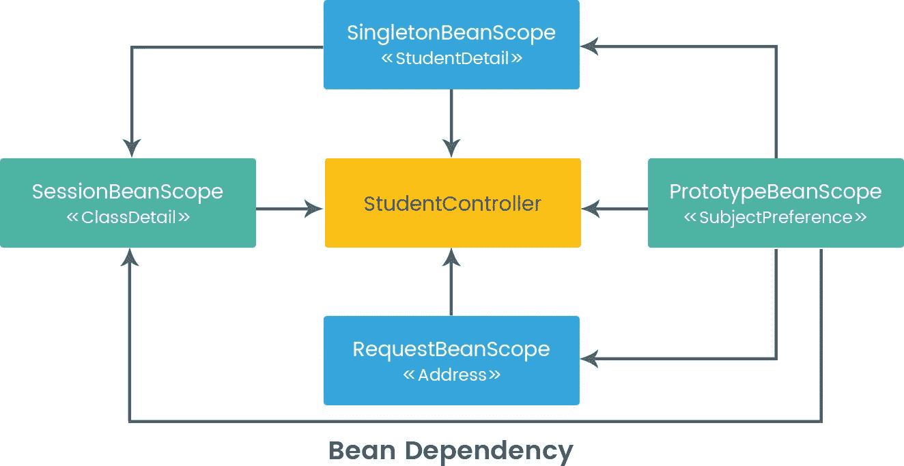

由于我们正在编写一个带有 REST 的 Spring Boot 应用程序。我们需要创建一个 Maven 项目，`pom.xml` 文件的配置将是：

```java
<?xml version="1.0" encoding="UTF-8"?>
<project  
    xsi:schemaLocation="http://maven.apache.org/POM/4.0.0 http://maven.apache.org/xsd/maven-4.0.0.xsd">
    <modelVersion>4.0.0</modelVersion>

    <groupId>com.packt.java9.beanscope</groupId>
    <artifactId>spring-beanscope-test</artifactId>
    <version>0.1.0</version>

    <parent>
        <groupId>org.springframework.boot</groupId>
        <artifactId>spring-boot-starter-parent</artifactId>
        <version>1.5.8.RELEASE</version>
    </parent>

    <dependencies>
        <dependency>
            <groupId>org.springframework.boot</groupId>
            <artifactId>spring-boot-starter-web</artifactId>
        </dependency>
    </dependencies>

    <properties>
        <java.version>9</java.version>
    </properties>

    <build>
        <plugins>
            <plugin>
                <groupId>org.springframework.boot</groupId>
                <artifactId>spring-boot-maven-plugin</artifactId>
            </plugin>
        </plugins>
    </build>

</project>
```

我们从`StudentController`类开始，注入了四个具有不同作用域定义的 bean：

```java
package com.packt.java9.beanscope.controller;

import org.springframework.beans.factory.annotation.Autowired;
import org.springframework.web.bind.annotation.RequestMapping;
import org.springframework.web.bind.annotation.RestController;

import com.packt.java9.beanscope.beans.PrototypeBeanScope;
import com.packt.java9.beanscope.beans.RequestBeanScope;
import com.packt.java9.beanscope.beans.SessionBeanScope;
import com.packt.java9.beanscope.beans.SingletonBeanScope;

@RestController
public class StudentController {

  public StudentController() {
    System.out.println(" ::::::::::::::::::::: StudentController Initialized :::::::::::::::: ");
  }

  @Autowired
  PrototypeBeanScope prototypeBeanScope;

  @Autowired
  SessionBeanScope sessionBeanScope;

  @Autowired
  RequestBeanScope requestBeanScope;

  @Autowired
  SingletonBeanScope singletonBeanScope;

  @RequestMapping("/")
  public String index() {
    sessionBeanScope.printClassDetail();
    requestBeanScope.printAddress();

    return " Greetings from Student Department !!";
  }

}
```

为了更好地可视化每个作用域，我创建了具有作用域名称的简单接口，这也有助于我们在一个 bean 中添加另一个 bean 的依赖项时。使用`@Scope`注解将`StudentDetail`bean 指定为单例，并且它实现了`SingletonBeanScope`接口。这个类已经被注入了一个`PrototypeBeanScope`bean。此外，我们正在打印静态整型变量`increment`的增量值，以跟踪单例 bean 在构造函数中初始化的次数。其他所有 bean 类都有相同的写法。`StudentDetail.java`将如下所示：

```java
package com.packt.java9.beanscope.beans;

import org.springframework.beans.factory.annotation.Autowired;
import org.springframework.context.annotation.Scope;
import org.springframework.stereotype.Service;

@Service
@Scope("singleton")
public class StudentDetail implements SingletonBeanScope {

  /* Inject PrototypeBeanScope to observer prototype scope behaviour */
  @Autowired
  PrototypeBeanScope prototypeBeanScope;

  private static int increment = 0;

  /**
   * Every time this bean is initialized, created variable will be increases by
   * one.
   */
  public StudentDetail() {
    super();
    System.out.println(" \n ::::::: Object of StudentDetail bean is created " + (++increment) + " times ::::::: ");
  }
}
```

`SubjectPreference.java`被定义为原型 bean 作用域如下：

```java
package com.packt.java9.beanscope.beans;

import org.springframework.context.annotation.Scope;
import org.springframework.stereotype.Component;

@Component
@Scope("prototype")
public class SubjectPreference implements PrototypeBeanScope {

  private static int increment = 0;

  /**
   * Every time this bean is initialized, created variable will be increases by
   * one.
   */
  public SubjectPreference() {
    System.out.println(" \n ::::::: Object of SubjectPreference with Prototype scope is created " + (++increment)
        + " Times ::::::: \n ");
  }

}
```

请求作用域和会话作用域仅在具有 web 感知的应用程序上下文中工作。`Address.java`被注解为请求作用域：

```java
package com.packt.java9.beanscope.beans;

import org.springframework.beans.factory.annotation.Autowired;
import org.springframework.context.annotation.Scope;
import org.springframework.context.annotation.ScopedProxyMode;
import org.springframework.stereotype.Component;

@Component
@Scope(value = "request", proxyMode = ScopedProxyMode.TARGET_CLASS)
public class Address implements RequestBeanScope {

  private static int increment = 0;

  /* Inject PrototypeBeanScope to observer prototype scope behaviour */
  @Autowired
  PrototypeBeanScope prototypeBeanScope;

  /**
   * Every time this bean is initialized, created variable will be increases by
   * one.
   */
  public Address() {
    System.out.println(
        " \n ::::::: Object of Address bean with Request scope created " + (++increment) + " Times ::::::: ");
  }

  public void printAddress() {
    System.out.println("\n :::::::::::::: RequestbeanScope :: printAddress() Called :::::::::::::: ");
  }
}
```

同样，`session`作用域在`ClassDetail.java`类中使用：

```java
package com.packt.java9.beanscope.beans;

import org.springframework.beans.factory.annotation.Autowired;
import org.springframework.context.annotation.Scope;
import org.springframework.context.annotation.ScopedProxyMode;
import org.springframework.stereotype.Repository;

@Repository
@Scope(value = "session", proxyMode = ScopedProxyMode.TARGET_CLASS)
public class ClassDetail implements SessionBeanScope {

  /* Inject SingletonBeanScope to observer session scope behaviour */
  @Autowired
  SingletonBeanScope singletonBeanScope;

  /* Inject PrototypeBeanScope to observer prototype scope behaviour */
  @Autowired
  PrototypeBeanScope prototypeBeanScope;

  private static int increment = 0;

  /**
   * Every time this bean is initialized, created variable will be increases by
   * one.
   */
  public ClassDetail() {
    System.out.println(" \n ::::::: Object of ClassDetail bean with session scope created " + (++increment)
        + " Times ::::::: ");
  }

  public void printClassDetail() {
    System.out.println("\n ::::::::: Session Bean - PrintMessage Method Called ::::::::::::::::::: ");
    System.out.println("\n ::::::::: SessionBeanScope :: printClassDetail() Called ::::::::::::::: ");
  }
}
```

使用额外的`proxyMode`属性来创建一个中介，该中介将被 Spring 作为依赖项注入，并且当需要时 Spring 将启动`target`bean。注意，当初始化 web 应用程序设置时，没有动态请求。

在成功运行后，我们将看到以下控制台日志：

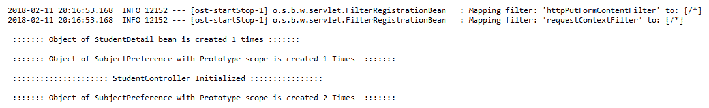

下面的分析是输出：

+   `StudentDetail`bean 只创建一次，它最多是一个单例类，并在应用程序启动时加载。

+   随后，使用原型作用域创建了`SubjectPreference`对象。它被注入到`StudentDetail`单例 bean 中，因此它也与其一起初始化。在这里，我们都知道原型作用域 bean 每次被调用时都会被创建。

+   在这里，`StudentDetail`单例 bean 依赖于由`SubjectPreference`类实现的`PrototypeBeanScope`，依赖项在实例化时解决。因此，首先创建`SubjectPreference`的第一个实例，然后将其注入到`StudentDetail`单例 bean 中。

+   Spring 容器只初始化一次`StudentController`类，因为默认情况下`controller`是一个单例。

+   由于`StudentController`注入了`PrototypeBeanScope`的引用，因此再次创建了一个`SubjectPreference`bean 的实例。控制器也有`SingletonbeanScope`bean 的引用，但不会再次创建该实例，因为它已经加载。

+   由于此时没有 HTTP 请求或 HTTP 会话，因此没有创建`SessionScopeBean`和`RequestScopeBean`的实例。

要检查`request`和`session`作用域，请在浏览器中访问`http://localhost:8080`并观察控制台日志：

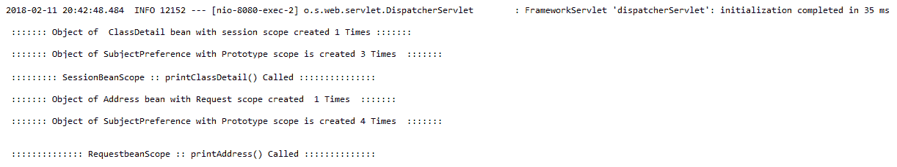

日志显示，由于`ClassDetail`和`Address`类分别定义了会话和请求范围，因此为这两个类各创建了一个实例。`ClassDetail`和`Address`类也注入了`PrototypeBeanScope`，因此`SubjectPreference`实例被创建了两次，总共四次。

再次输入`http://localhost:8080 URL`：

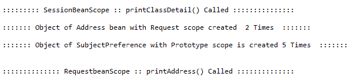

它将创建一个标记为请求范围的`Address`类的新实例，并且将创建一个具有原型范围的`SubjectPreference`类的新实例。它不会创建`ClassDetail`类的实例，因为我们没有创建新的会话，我们的会话仍在进行中。

要启动一个新的会话，我们需要关闭浏览器并转到 URL。打开另一个浏览器，并转到 URL：

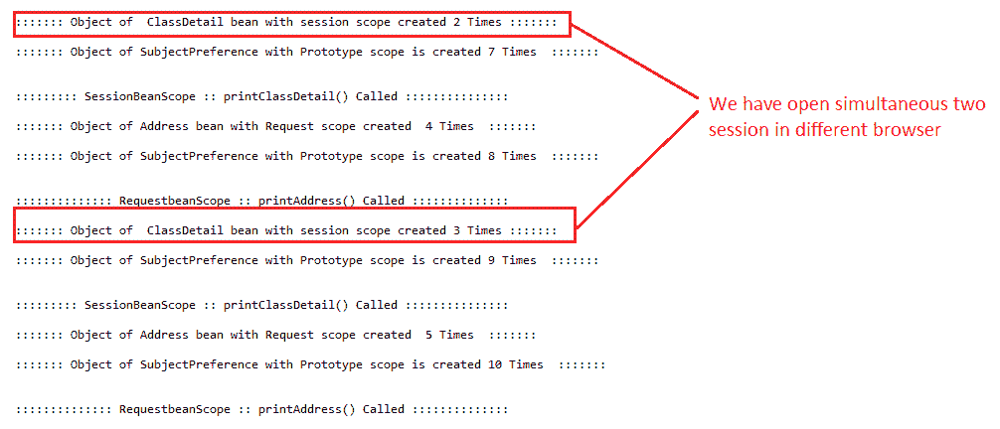

这样，将创建两个新的会话，`ClassDetail`类将创建总共三个实例，以及两个`Address`类实例和两个`SubjectPreference`类实例。

如果我们需要将请求范围 bean 注入到具有更长生命周期的范围的另一个 bean 中，您可以选择在范围 bean 中注入 AOP 代理。我们需要注入一个中间对象，该对象公开与范围对象相同的公共接口。但可以从适用范围中恢复目标对象，并提供对真实对象的方法调用。

此外，该 bean 正在通过一个可序列化的中间代理。相同的 bean 随后可以通过反序列化重新获取`target`单例 bean。标记为单例的 bean 使用`<aop:scoped-proxy/>`。

同样，当使用原型 bean 范围时，对共享代理的每次方法调用都会导致创建一个新的目标实例，此时调用将被发送到该实例。

当 Spring 容器为经过`<aop:scoped-proxy/>`组件检查的 bean 创建代理时，默认情况下会创建一个基于 CGLIB 的类代理。

# 如何选择 bean 范围

Spring 中的每个范围都有不同的特性，作为程序员，我们需要知道如何利用这些范围。

在一个应用程序中，如果我们有一个无状态对象并且对对象创建过程没有影响，那么使用范围是不必要的。相反，如果一个对象有状态，那么建议使用单例等范围。

当依赖注入在业务中使用时，单例范围并没有增加太多价值。尽管单例节省了对象创建（以及随后的垃圾收集），但同步需要我们初始化一个单例 bean。单例最有价值的是：

+   状态 ful bean 的配置

+   查找构建成本高昂的对象

+   与资源关联的数据库连接池对象

如果考虑并发性，使用单例或会话作用域定义的类必须是线程安全的，并且注入到这些类中的任何内容也应该是线程安全的。另一方面，请求作用域不能是线程安全的。

# Google Guice 中的作用域

我们在 Spring 框架中看到的大部分作用域在 Google Guice 中也存在。作用域定义了代码应在特定上下文中工作，在 Guice 中，注入器管理作用域上下文。**默认作用域**（无作用域）、**单例**、**会话**和**请求**是 Guice 中的主要作用域。

# 默认作用域

默认情况下，Guice 为每个依赖项注入一个新的独立实例的对象（类似于 Spring 中的原型作用域），而 Spring 默认提供单例。

让我们考虑一个有三口之家且每人都有自己的私家车的房子的例子。每次他们调用`injector.getInstance()`方法时，每个家庭成员都可以获得一个新的汽车对象实例：

```java
home.give("Krunal", injector.getInstance(Car.class));

home.give("Jigna", injector.getInstance(Car.class));

home.give("Dirgh", injector.getInstance(Car.class));
```

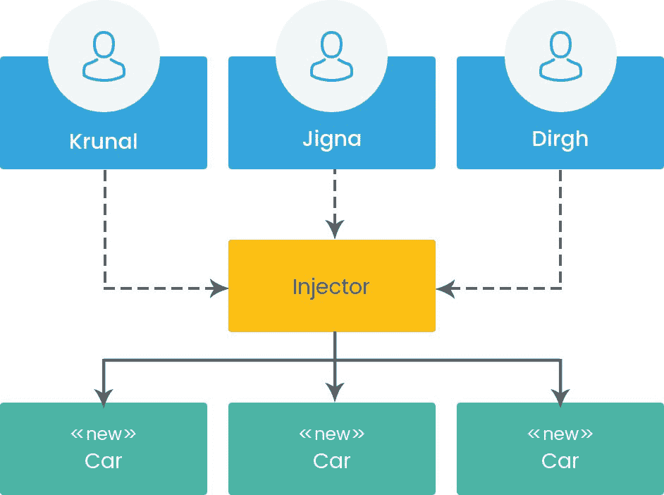

# 单例作用域

如果我们只想创建类的单个实例，那么可以使用`@Singleton`注解来标记实现类。只要单例对象存在，注入器就存在于上下文中，但在同一应用程序中，可能存在多个注入器，在这种情况下，每个注入器都与单例作用域对象的实例相关联：

```java
@Singleton
public class DatabaseConnection{

    public void connectDatabase(){
    }

    public void disconnectDatabase(){
    }
}
```

另一种配置作用域的方法是在模块中使用绑定语句：

```java
public class ApplicationModule extends AbstractModule{

  @Override
  protected void configure() {
    //bind service to implementation class
    bind(NotificationService.class).to(SMSService.class).in(Singleton.class);
  }

}
```

当我们在模块中使用链接绑定时，作用域仅适用于绑定源，而不适用于`目标`。例如，我们有一个名为`UserPref`的类，它实现了`Professor`和`Student`接口。这将创建两个实例：一个用于`Professor`，另一个用于`Student`：

```java
bind(Professor.class).to(UserPref.class).in(Singleton.class);
bind(Student.class).to(UserPref.class).in(Singleton.class);
```

这是因为单例作用域应用于绑定类型级别，即`Professor`和`Student`，而不是目标类型`UserPref`。

# 急切单例

Guice 提供了特殊的语法来创建具有单例作用域的对象，并且初始化为急切模式而不是懒模式。以下是其语法：

```java
bind(NotificationService.class).to(SMSService.class).asEagerSingleton();
```

热切的单例模式可以更快地发现初始化问题，并确保最终用户获得可靠、智能的体验。懒单例模式可以加速编辑-编译-运行的开发周期。我们可以利用阶段枚举来指示应该使用哪个过程。

以下表格定义了单例和受支持对象初始化模式的语法阶段使用：

| **语法** | **生产** | **开发** |
| --- | --- | --- |
| @Singleton | eager* | lazy |
| .asEagerSingleton() | eager | eager |
| .in(Singleton.class) | eager | lazy |
| .in(Scopes.SINGLETON) | eager | lazy |

Guice 仅对定义为单例的模块急切创建单例实例。

`@SessionScoped`和`@RequestedScoped`作用域的功能和行为在 Guice 中与 Spring 相同，并且仅在用于 Web 应用程序时适用。

# 摘要

我们以 Spring Bean 定义属性开始本章，这是学习的重要部分，因为整个 IoC 容器依赖于 Bean 的初始化。之后，我们通过语法学习了作用域的分类。

在我们的旅程中，我们学习了如何在 Spring 中使用 XML 元数据和 Java 配置来配置作用域。没有依赖注入，我们无法完成本章。这就是为什么，通过编写一个**Spring Boot**应用程序，我们试图理解主作用域在独立应用以及 Web 应用中的工作方式。

我们故意跳过了第四章中的作用域主题，即*使用 Google Guice 进行依赖注入*。因此，在本章中，我们用基本作用域涵盖了 Google Guice 的作用域。Spring 和 Google Guice 的作用域几乎相同，但对象初始化的默认行为不同。Spring 使用单例创建实例，而 Guice 使用原型作用域创建。

在下一章中，我们将探讨 Spring 中一个重要的特性，称为**面向切面编程**。
