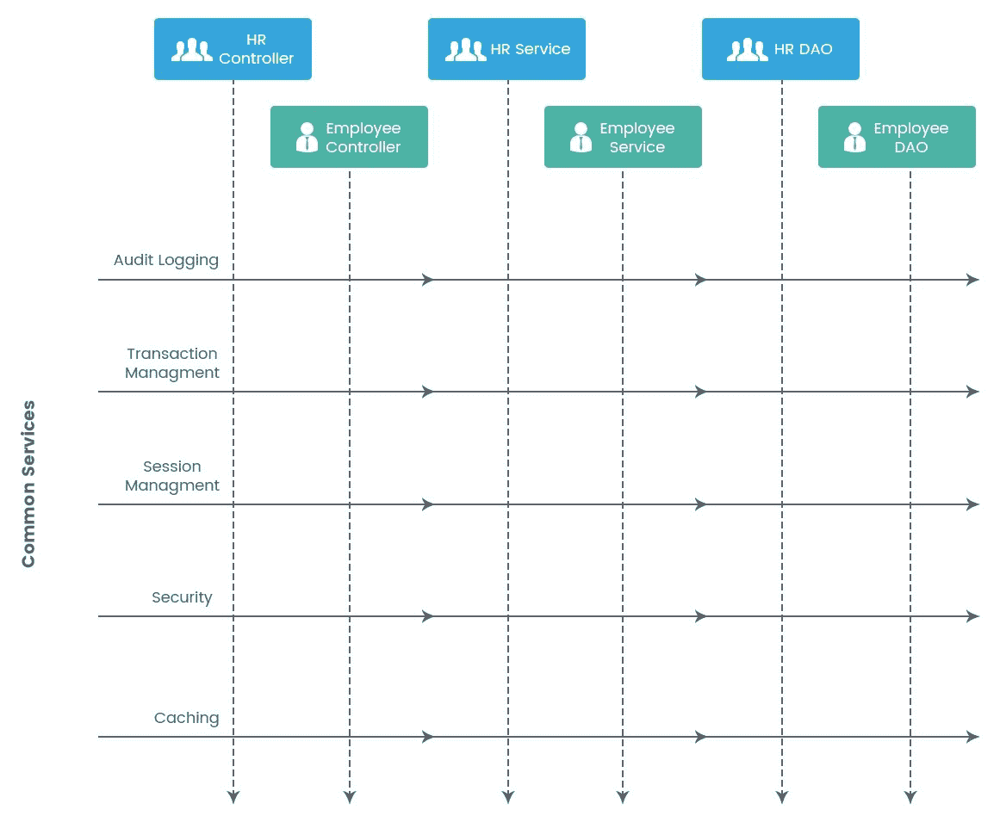
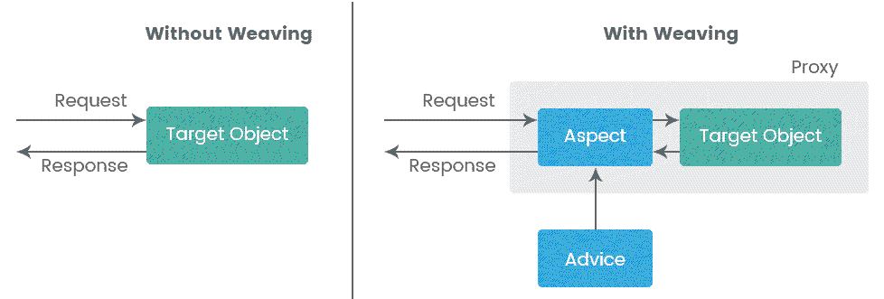
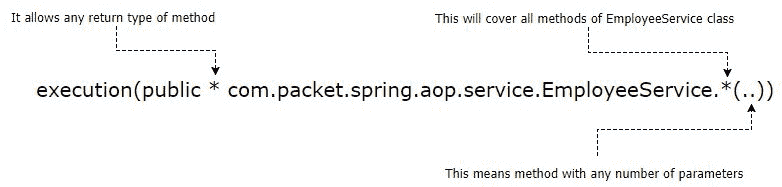
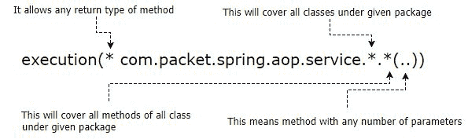
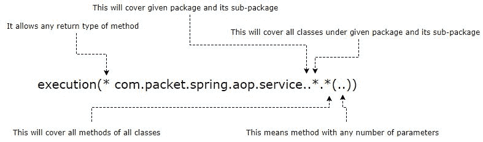
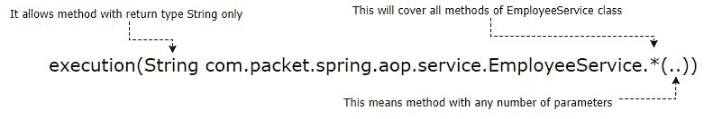
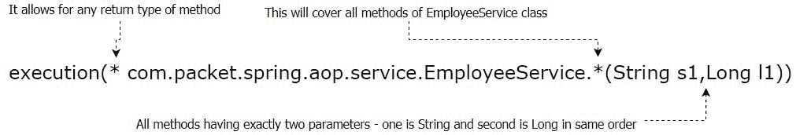
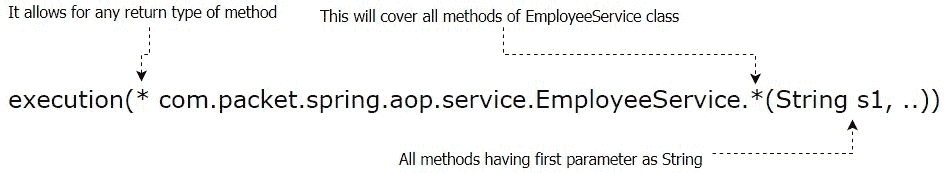
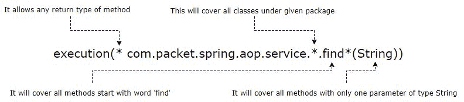

# 面向切面编程和拦截器

到目前为止，我们已经了解了依赖注入的概念及其在 Spring 和 Google Guice 等流行框架中的实现。我们还学习了如何根据业务需求对 bean 进行范围划分，以控制对象创建过程。在本章中，我们将学习实现关注点分离的另一种方法：**面向切面编程**（**AOP**）。

AOP 通过将重复代码从应用程序中隔离出来并动态插入，解决了设计问题的一部分。AOP 与**控制反转**（**IoC**）一起，为应用程序带来了模块化。AOP 有助于以分层方式组织您的应用程序，这在传统的面向对象方法中是不可能的。

AOP 允许您拦截业务代码的流程，并直接注入一系列功能，而无需触及或更改原始代码。这使得您的应用程序与这些常见功能松散耦合。在我们深入探讨这个概念之前，让我们首先了解场景、问题以及如何使用 AOP 作为有效的解决方案。

在本章中，我们将发现和讨论以下有趣的主题：

+   AOP 是什么，以及您可以使用 AOP 解决哪些问题

+   如何在 Spring 框架中实现 AOP

+   选择 AOP 框架和配置风格

# AOP 简介

在编写任何软件应用程序时，最佳实践是根据业务用例将代码划分为多个独立的模块。例如，您为所有与员工相关的功能编写一个**Employee Service**类，为所有与人力资源相关的功能编写一个**HRService**类，等等。

通常，整个应用程序由一组独立的类组成，这些类跨越多个垂直领域，并且不共享相同的类层次结构。此图展示了这一场景：



尽管每个垂直领域都是独立的，但您需要在所有这些领域实现一些共同的项目，例如**事务管理**、**会话管理**、**审计日志**、**安全**、**缓存**或任何基于规则的定制处理机制。

如果您希望使用传统方法在垂直领域实现这些常见服务，您需要手动将这些服务放入这些类的每个方法中。以日志机制为例，为此，您需要在每个方法的开始和结束时编写一些代码。

这导致了代码重复，因为相同的逻辑需要被放置多次。这导致在应用程序开发过程的后期引入任何更改时，维护变得噩梦般。让我们了解如何。

假设，根据你的业务需求，你在每个更新和删除方法之后添加审计日志。你将方法名称及其时间放入日志中。现在，假设你的业务需要在日志中放置当前登录用户的名称。在这种情况下，你需要手动在几个方法中更新日志细节。

这只是一个例子。你最终需要对分布在多个垂直领域的每个通用服务进行代码更改。有效的解决方案是将它们与垂直领域隔离开来。在一个地方实现它们，并根据某些规则或标准，在需要时将它们插入到其他核心业务类中。

从本质上讲，业务逻辑的核心部分不需要知道跨越多个类的通用内容已被包含、删除或更改，并且可以像以前一样继续工作。将通用功能（AOP 范式中的横切关注点）分离出来，在不接触或修改核心业务逻辑的情况下打开和关闭它们，最终会增加模块化，并在任何应用程序的维护方面带来极大的灵活性。AOP 旨在提供实现这一解决方案的方法。AOP 主要用于提供声明性服务。

要理解面向切面编程（AOP）的概念，关键是要了解 AOP 范式中所使用的术语：

+   **关注点（Concern）**：这是我们希望在应用程序中实现的行为或功能。例如，人力资源管理员工管理是两个功能，因此被视为 AOP 中的关注点。

+   **切面（Aspect）**：用非常简单的话来说，这是跨越同一或不同层次结构中多个类的通用行为。换句话说，跨越多个关注点的通用概念称为切面。在我们的例子中，日志机制在 AOP 术语中被称为切面。

+   **连接点（Join-point）**：这是在应用程序执行流程中需要应用**通知（Advice）**的点。例如，方法调用或需要处理异常的地方可以是连接点。

+   **通知（Advice）**：这是 AOP 框架在特定连接点上执行的操作。从概念上讲，它是在该连接点上实现的通用功能。应用**通知**的过程可以通过指定各种类型来控制，例如`around`、`before`、`after`、`throws`等。

+   **切入点（Point-cut）**：这是一个描述适用连接点模式的表达式。换句话说，AOP 框架将在由切入点（例如，`set*`表示所有以单词*set*开头的方法）描述的连接点（方法）上应用**通知（Advice）**（通用功能）。我们可以说切入点是选择系统中连接点的筛选标准。

在大多数情况下，开发人员会在连接点和切入点之间感到困惑。让我们通过一个现实生活中的例子来理解这种区别。假设你想买食用油，你去了百货商店。你到达了杂货区，发现各种来自不同来源的可食用油，如葵花籽油、花生油、棉籽油、大米品牌、玉米等等。

您的要求是选择轻油（就低胆固醇而言）来满足您的日常需求，因此您选择葵花籽油或大米品牌油。在这种情况下，所有可用的食用油都是连接点，而您根据需求选择的葵花籽油/大米品牌油被认为是切入点。简而言之，所有可用的选项都被认为是连接点，而您根据需求选择的那个被称为切入点。

+   **目标对象**：这是实现公共功能的对象。换句话说，这是由一系列方面应用**通知**的对象。

+   **AOP-代理**：代理是一种设计模式，用于封装对象并控制对其的访问。AOP 框架创建一个代理/动态对象以实现各种方面（以**通知**的形式）。简而言之，AOP 创建了一个代理对象，它看起来像创建代理的对象，但具有一些额外的功能。在**Spring 框架**中，AOP 代理通过 JDK 或 CGLIB 库提供。

+   **织入**：正如我们所见，AOP 背后的主要思想是将公共行为（或方面）插入业务类中，而不修改它们。将此类方面与其他类链接以应用**通知**的过程称为织入。

织入可以在编译或运行时进行。**Spring AOP**支持加载时织入，而**AspectJ**框架支持编译时和加载时织入。

+   **编译时织入**：在这种类型的织入中，链接方面的过程是在编译时执行的。AOP 框架将方面应用到您的 Java 源文件上，并创建一个二进制类文件，该文件与这些方面交织在一起。AspectJ 使用一个特殊的编译器来实现编译时织入。

+   **编译后（或二进制）织入**：这与编译时织入类似。链接方面的过程是在预编译的类或 JAR 文件上执行的。织入的方面可以是源形式或二进制形式。这同样可以通过一个特殊的编译器来完成。编译时和编译后织入都可以通过 AspectJ 实现。

+   **运行时织入**：编译时和编译后织入发生在实际类文件被加载到内存之前，而运行时（或加载时）织入发生在目标类被类加载器加载到 JVM 之后。运行时织入器由 Spring AOP 和 AspectJ 框架都支持。

织入过程可以通过以下图表表示：



# Spring AOP

**Spring AOP**完全是用 Java 开发的。它不需要我们修改或控制类加载器层次结构。正因为这种适应性，您可以使用 Spring AOP 于 servlet 容器或应用服务器。目前，Spring AOP 仅支持在方法级别应用通知。换句话说，Spring AOP 支持方法级别的连接点。

Spring 支持 AOP 与它的 IoC 能力相结合。您可以使用常规的 Bean 定义来定义方面，并通过 AOP 特定的配置来织入它们。换句话说，IoC 用于定义方面，而 AOP 用于将它们织入其他对象。Spring 使用这两者来解决常见问题。这就是 Spring AOP 与其他 AOP 框架不同的地方。

Spring AOP 是一个基于代理的框架，并支持对象的运行时织入。它可以通过基于 XML 或 AspectJ 注解的配置来使用。

# 基于 XML 模式的 Spring AOP

就像类是面向对象编程范式的单元一样，方面是 AOP 的单元。在面向方面的编程模型中，通过方面实现模块化。如果您希望选择基于 XML 的 AOP 配置，Spring 支持使用`aop`命名空间标签来定义方面。您需要按照以下方式定义`aop`命名空间标签：

```java
<?xml version="1.0" encoding="UTF-8"?>
<beans 

       xsi:schemaLocation="http://www.springframework.org/schema/beans 
       http://www.springframework.org/schema/beans/spring-beans.xsd
       http://www.springframework.org/schema/aop 
       http://www.springframework.org/schema/aop/spring-aop.xsd"
       >
```

为了区分 AOP 特定的配置，您需要在 Spring 上下文（XML）文件内的`<aop:config>`元素中指定所有 AOP 相关的工件，如方面、切点、通知等。允许存在多个`<aop:config>`元素。

# 声明方面

Spring AOP 的第一步是决定并定义方面。在基于 XML 的配置中，方面被构想为一个简单的 Java 类，您需要将其声明为 Spring 应用程序上下文（XML）文件中的 Bean 定义。《aop:aspect》元素用于定义方面：

```java
    <aop:config>
    <aop:aspect id="myLoggin" ref="loggingAspect"></aop:aspect> 
    </aop:config>
    <bean id="loggingAspect"
    class="com.packet.spring.aop.aspects.LogginAspect">
    </bean>
```

由于方面是一种 Java 类的形式，它可以被定义为普通的 Spring Bean，然后可以通过`<aop:aspect>`元素的`ref`属性进行配置。状态和行为与方面的类的字段和方法相关联，而切点和通知信息则在 XML 中进行配置。在先前的例子中，我们将日志定义为方面。

定义方面之后，下一步是通过切点定义连接点。Spring AOP 仅支持方法级别的连接点。

在基于 XML 模式的 AOP 中，Spring 通过`<aop:config>`声明启用自动代理机制。您不需要显式定义任何自动代理的内容；然而，如果您通过其他机制（如 AutoProxyCreator）启用自动代理，您应该选择这些选项之一以避免任何运行时问题。

# 声明切点

就回忆一下，连接点是我们想要应用**通知**的地方，而点设计符代表匹配连接点的模式。点设计符必须在`<aop:config>`元素内定义。点设计符可以在`<aop:aspect>`元素内或外部声明。如果它在`<aop:aspect>`外部定义，它可以在多个方面和通知之间共享。

点设计符允许通知独立于面向对象层次结构应用于目标对象。通过 Spring AOP 通知进行事务管理是一个真正的例子，其中事务通知应用于跨越多个对象层次结构的方法（`add`/`update`/`delete`方法）。这个片段是编写点设计符的可能方法之一：

```java
    <aop:pointcut id="employeeServiceMethods"
    expression="execution(* com.packet.spring.aop.service.*.*(..))" />
```

点设计符通过其`id`属性唯一标识。`expression`属性表示匹配连接点的模式（或过滤器）。`expression`属性的值由两个组件组成：

+   点设计符

+   模式

# 点设计符

**点设计符**（**PCD**）是一个关键字（初始单词），告诉 Spring AOP 如何匹配点设计符。Spring AOP 支持各种点设计符：

+   **`execution`:** 这用于匹配方法执行（连接点）。这是一个主要设计符，在处理 Spring AOP 时通常使用。

+   **`within`:** 这个设计符限制了仅匹配特定类型的连接点。它不如执行灵活。例如，不允许指定返回类型或方法参数映射。如果`within`的模式达到 Java 包级别，它将匹配该包中所有类的所有方法。如果模式指向一个特定的类，那么这个设计符将覆盖该类中的所有方法。

+   **`this`:** 这限制了连接点的匹配，仅限于表达式中的给定类型的 bean。换句话说，`this`设计符比`within`设计符更窄一步，并期望你指定一个特定的类类型作为模式。不允许定义任何通配符模式。

+   **`target`:** 这限制了匹配连接点，其中目标对象是表达式中的给定类型的实例。目标设计符似乎与`this`设计符相似，但它们的使用有所不同。让我们来理解这一点。

正如我们所见，Spring AOP 通过 JDK 或 CGLIB 库创建代理对象。如果目标对象实现了接口，Spring AOP 使用基于 JDK 的代理；否则，它选择 CGLIB。当 CGLIB 提供代理时（即，你的目标对象没有实现接口），你应该使用`this`设计符；当 JDK 提供代理时（`target`对象实现了接口），你应该使用目标设计符。

+   **`args`**：这个指示符通常用于匹配方法参数。它允许我们传递通配符来匹配包、Java 类、返回类型或方法名称。

+   **`@target`**：这个 PCD（点切割定义）过滤了具有给定类型注解的对象类的连接点。尽管名称相同，但`@target`指示符与`target`指示符不同。它们在匹配连接点方面有所不同，如下所示：

    +   `target`指示符：如果表达式中的目标对象是给定类型的实例，则匹配目标对象。

    +   `@target`指示符：如果目标对象的类具有给定类型的注解，则匹配目标对象。

+   **`@within`**：这个指示符限制了匹配的连接点在具有给定注解的类型内部。它允许我们使用通配符来匹配点切割。

+   **`@annotation`**：这个 PCD 用于匹配具有给定注解类型的点切割。这对于在具有自定义注解的类上构建点切割非常有用。

+   **`@args`**：这个指示符限制了匹配连接点，只有当实际运行时作为方法参数传递的对象具有给定类型的注解时。这有助于将连接点选择缩小到目标类中可用的重载方法中的特定方法。

# 模式

模式是匹配可能连接点的过滤条件。它告诉 Spring AOP 要匹配什么。**模式**通常在 PCD 之后、括号内书写，它是一种 AOP 中的正则表达式，用于选择所需的连接点。

Spring AOP 只支持方法级别的连接点，并且使用模式来选择目标对象的具体方法。一个模式由以下表达式按相同顺序组成：

+   **访问修饰符**：对于 Spring AOP，唯一可能的值是`public`。这个表达式是可选的。

+   **返回类型**：这是返回类型的完全限定名称。使用`*`（星号）表示允许任何返回类型。

+   **Java 包**：可以使用 Java 包名称。

+   **Java 类名称**：可以使用 Java 类名称。在这个表达式中使用`*`表示它适用于给定包下的所有 Java 类。

+   **方法名称**：可以指定方法名称。在这个表达式中使用`*`将包括给定类中的所有方法。

+   **方法参数**：可以指定参数类型。使用`..`（两个点）表示给定方法可以接受任意数量的参数。

+   **异常详情**：抛出声明。

模式的格式与方法签名完全相同。让我们通过查看一些示例来理解前面表达式的含义。

**示例 1**：以下表达式将匹配满足以下条件的`EmployeeService`类中的所有公共方法：

+   包含任何返回值的方法，包括 void

+   包含空参数方法在内的任何参数的方法：



**示例 2**：以下表达式将匹配满足以下条件的所有公共方法：

+   任何返回值的方法，包括无返回值的方法

+   任何参数的方法，包括空参数方法

+   直接位于`com.packet.spring.aop.service` Java 包下的所有类的成员方法：



**示例 3**：以下表达式将匹配所有满足以下条件的公共方法：

+   任何返回值的方法，包括无返回值的方法

+   任何参数的方法，包括空参数方法

+   位于`com.packet.spring.aop.service` Java 包及其子包下的所有类的成员方法：



**示例 4**：以下表达式将匹配`EmployeeService`类的所有公共方法，满足以下条件：

+   只返回`String`类型的方法

+   任何参数的方法，包括空参数方法：



**示例 5**：以下表达式将匹配`EmployeeService`类的所有公共方法，满足以下条件：

+   任何返回值的方法，包括无返回值的方法

+   有两个参数的方法，第一个参数是`String`类型，第二个参数是`Long`类型，且顺序与方法参数相同：



**示例 6**：以下表达式将匹配`EmployeeService`类的所有公共方法，满足以下条件：

+   任何返回值的方法，包括无返回值的方法

+   有一个或多个参数的方法，其中第一个参数只能是`String`类型：



**示例 7**：以下表达式将匹配满足以下条件的特定公共方法：

+   方法名称以`find`单词开头

+   任何返回值的方法，包括无返回值的方法

+   只有一个参数类型为`String`的方法

+   位于`com.packet.spring.aop.service` Java 包下的所有类的成员方法：



# 声明通知（拦截器）

下一步是定义**通知**。这是在连接点上执行的操作。通知也被称为*拦截器*。Spring AOP 支持各种类型的通知，如此处所示：

+   **前置通知**：这种类型的通知是在连接点执行开始之前执行的。在发生异常的情况下，Spring 将停止进一步执行此通知。

+   **返回后通知**：正如其名所示，这种类型的通知是在连接点执行完成后执行的（无论是正常退出，还是在异常情况下从连接点退出）。

+   **环绕通知**：这种类型的通知是在连接点周围执行的（在通知方法之前和/或之后）。因此，您有控制权来执行连接点并返回原始方法值，或者绕过流程并返回自定义值。通常，环绕通知用于在方法的主要逻辑之前和/或之后执行某些逻辑。因此，它是通知中最强大的一种类型。

+   **返回后通知**：这与返回后通知类似。区别在于它是在连接点的正常退出时执行的。

+   **抛出通知之后：**这和后置通知类似，但它在执行通知方法的执行过程中发生异常时执行。

在基于 XML 的 Spring AOP 中，当你定义`<aop:config>`内的 AOP 元素时，需要小心 AOP 元素的顺序。例如，`<aop:pointcut>`必须在`<aop:aspect>`元素之前或其中定义，否则 Spring 将显示错误。同样，AOP 通知必须在`<aop:aspect>`元素内定义。

# 实现前置通知

到目前为止，我们已经看到了如何声明方面、切入点和建议。让我们将它们放在一起，了解它们是如何协同工作的。假设我们想在属于`com.packet.spring.aop.service`包的所有类的所有方法的开头放置一个记录器。配置如下：

```java
<aop:config>
      <aop:pointcut id="employeeServiceMethods"
        expression="execution(* com.packet.spring.aop.service.*.*(..))" />

       <aop:aspect id="myLoggin" ref="loggingAspect">
          <aop:before pointcut-ref="employeeServiceMethods" 
              method="printStartLog"/>
       </aop:aspect>
</aop:config>

<bean id="loggingAspect" class="com.packet.spring.aop.aspects.LoggingAspect">
</bean>

<bean id="employeeService" class="com.packet.spring.aop.service.EmployeeService">
</bean>
```

我们定义了一个切入点，它匹配`com.packet.spring.aop.service`包下所有类的所有公共方法，无论参数和返回值如何。接下来，我们定义了日志方面 bean，并将其引用通过`ref`属性传递给`<aop:aspect>`。

在方面中，我们之前已经定义了通知（`<aop:before>`）并在那里提供了切入点引用。`printStartLog`方法在方面 bean 中定义如下：

```java
package com.packt.spring.aop.aspects;

import org.aspectj.lang.JoinPoint;
public class LoggingAspect {

public void printStartLog(JoinPoint joinPoint) {
    System.out.println(" ****** Starting Method '"+joinPoint.getSignature().getName()+"' of "+joinPoint.getTarget().getClass());
  }
}
printStartLog is the advice method. It takes a parameter of type JoinPoint, which represents the join-points that we associated with the aspect. This class provides metadata about the target object, such as its method (on which this advice is woven), class, and other attributes.
```

在`printStartLog`方法中不需要传递`JoinPoint`参数。即使你不传递`JoinPoint`参数，它也能正常工作。但是，它提供了关于目标对象的元数据。从这个意义上说，它是有用的。例如，在前面的案例中，我们显示了织入方法的名称和其类名。

目标类`EmployeeService`在`com.packet.spring.aop.service`包中定义如下：

```java
package com.packt.spring.aop.service;

public class EmployeeService {

 public void generateSalarySlip() {
    System.out.println("Generating payslip");
  }
 public String showTotalEmployee(String test) {
    System.out.println(" The string is -->"+test);
    return test;
  }
 public void findEmployee(String employeeId) {
    System.out.println(" finding employee based on employeeId ");
  }
}
```

当我们从 Spring 的应用程序上下文文件中获取`EmployeeService`对象并调用这些方法时，AOP 将拦截所有这些方法，并在每个方法的执行之前插入日志（我们保存在`LoggingAspect`的`printStartLog`中）：

```java
package com.packt.spring.aop.aspects.main;

import org.springframework.context.ApplicationContext;
import org.springframework.context.support.ClassPathXmlApplicationContext;

import com.packet.spring.aop.report.api.IExportPaySlip;
import com.packet.spring.aop.service.EmployeeService;
import com.packet.spring.aop.service.HRService;

public class SpringAOPInXMLCheck {

  public static void main(String[] args) {
    ApplicationContext springContext = new ClassPathXmlApplicationContext("application-context.xml");
    EmployeeService employeeService = (EmployeeService)springContext.getBean("employeeService");
    employeeService.generateSalarySlip();
    employeeService.showTotalEmployee("test");
    employeeService.findEmployee("abc123");
  }
}
```

你将得到以下输出：

```java

-------------------------------------------
 ****** Starting Method 'generateSalarySlip' of class com.packet.spring.aop.service.EmployeeService
Generating payslip

 ****** Starting Method 'showTotalEmployee' of class com.packet.spring.aop.service.EmployeeService
The string is -->test

 ****** Starting Method 'findEmployee' of class com.packet.spring.aop.service.EmployeeService
 finding employee based on employeeId

```

你可以观察到 Spring AOP 如何捕获`EmployeeService`类的每个方法，并在每个方法的开头添加日志。它动态地打印`method`名称和`class`名称。

# 实现后置通知

就像前置通知一样，我们也可以实现其他通知类型。让我们以后置通知和环绕通知为例。对于后置通知，只需在`LoggingAspect`类中添加一个方法，如下所示：

```java
 //After advice method.
  public void printEndLog(JoinPoint joinPoint) {
    System.out.println(" ****** End of Method '"+joinPoint.getSignature().getName());
  }
```

在后置通知中，我们只是打印`method`名称。我们还需要更新应用程序上下文文件中的方面配置。只需为我们的日志方面添加一个后置通知条目，如下所示：

```java
<aop:aspect id="myLoggin" ref="loggingAspect">
      <aop:before pointcut-ref="employeeServiceMethods" method="printStartLog"/>
      <aop:after pointcut-ref="employeeServiceMethods" method="printEndLog"/>
</aop:aspect>
```

你将得到以下输出：

```java

-----------------------------------
 ****** Starting Method 'generateSalarySlip' of class com.packet.spring.aop.service.EmployeeService
Generating payslip
 ****** End of Method 'generateSalarySlip

 ****** Starting Method 'showTotalEmployee' of class com.packet.spring.aop.service.EmployeeService
 The string is -->test
 ****** End of Method 'showTotalEmployee

 ****** Starting Method 'findEmployee' of class com.packet.spring.aop.service.EmployeeService
 finding employee based on employeeId 
 ****** End of Method 'findEmployee
```

这次，你可以观察到 AOP 如何拦截每个方法，并实现后置通知和前置通知。

# 实现环绕通知

Spring AOP 还提供了环绕建议，它是一次性结合了前置和后置。如果你需要在前后处理某些事情，你可以简单地实现环绕建议，而不是分别实现前置和后置建议。要实现环绕建议，只需在`LoggingAspect`中添加一个额外的方法，如下所示：

```java
//Around advice method.
  public void printAroundLog(ProceedingJoinPoint proceedingJointPoint) throws Throwable {
    System.out.println("----- Starting of Method "+proceedingJointPoint.getSignature().getName());
    proceedingJointPoint.proceed();
    System.out.println("----- ending of Method "+proceedingJointPoint.getSignature().getName());
  }
```

对于*附近*的建议，Spring AOP 提供`ProceedingJoinPoint`对象而不是`JoinPoint`对象。`proceedingJoinPoint.proceed()`将简单地调用`target`对象上的方法，你可以在`proceedingJoinPoint.proceed()`调用上方放置前置逻辑，并在其旁边放置后置逻辑。

`ProceedingJoinPoint`只能用于环绕建议。如果你尝试将其用于前置或后置建议，你会得到一个错误。对于它们，你应该只使用连接点。

最后一步是更新配置，为方面插入环绕建议，如下所示：

```java
<aop:aspect id="myLoggin" ref="loggingAspect">
      <aop:around pointcut-ref="employeeServiceMethods" method="printAroundLog"/>
</aop:aspect>
```

你将得到以下输出：

```java

----------------------------------
----- Starting of Method generateSalarySlip
Generating payslip
----- ending of Method generateSalarySlip

----- Starting of Method showTotalEmployee
 The string is -->test
----- ending of Method showTotalEmployee

----- Starting of Method findEmployee
 finding employee based on employeeId 
----- ending of Method findEmployee
```

这就是环绕建议的实现方式，以及它如何一起完成前置和后置建议的工作。

不要同时使用*前置*、*后置*和*环绕*建议。如果你需要在方法开始处放置一些额外的代码，请仅使用*前置*建议，而不是*环绕*。虽然使用*环绕*建议可以单独使用*前置*建议实现的功能，但这不是一个好主意。只有当你想在方法前后添加内容时才使用*环绕*建议。

# 实现返回后建议

**返回后**建议的工作方式与返回建议相同。唯一的区别是，此建议仅在正常退出时在匹配的方法上执行。如果发生异常，则此建议不会应用。

我们将查看一个场景来理解这个建议的需求。假设你希望在`target`类上执行特定方法成功时向相关人员发送消息（电子邮件）。由于这是一个新的关注点（在`target`方法成功执行时发送消息），我们已创建了一个新的方面类，如下所示：

```java
package com.packt.spring.aop.aspects;
import org.aspectj.lang.JoinPoint;
public class SendMessage {

    //Advice method after successful existing of target method.
    public void sendMessageOnSuccessExit(JoinPoint joinPoint) {
      System.out.println(" ****** Method '"+joinPoint.getSignature().getName()+"' of "+joinPoint.getTarget().getClass()+" is executed successfully...");
    }
}
```

`SendMessage`方面有一个名为`sendMessageOnSuccessExit`的方法。我们希望这个方法在`target`类的正常方法退出（没有异常）时被调用。你可以在该方法中编写发送消息（电子邮件）的逻辑。新的方面将在应用程序上下文（XML）文件中按如下方式配置：

```java
<aop:pointcut id="hrServiceMethods"
        expression="execution(* com.packet.spring.aop.service.HRService.*(..))" />

<aop:aspect id="sendMsg" ref="sendMsgAspect">
      <aop:after-returning pointcut-ref="hrServiceMethods"
       method="sendMessageOnSuccessExit"/>
</aop:aspect>
```

我们创建了一个新的切入点，它将匹配`HRService`类的所有方法。这个类将如下所示：

```java
package com.packt.spring.aop.service;

public class HRService {

  public void showHolidayList() {
    System.out.println("This is holiday list method...");
  }

  public void showMyLeave() throws Exception {
    System.out.println("Showing employee leaves...");
    throw new Exception();
  }
}
```

当你从 Spring 获取`HRService`对象并调用`showHolidayList`方法时，你将得到以下输出：

```java
This is holiday list method...
 ****** Method 'showHolidayList' of class com.packet.spring.aop.service.HRService is executed successfully...
```

如果`target`方法返回一个值，并且你想使用 AOP 修改它，你可以通过返回后建议来完成。为此，你需要在`<aop:aspect>`元素中指定参数名，如下所示：

```java
<aop:aspect id="sendMsg" ref="sendMsgAspect">
      <aop:after-returning pointcut-ref="hrServiceMethods"
       returning="retVal"
       method="sendMessageOnSuccessExit"/>
</aop:aspect>
```

在此代码中，`returning` 属性的值表示 `sendMessageOnSuccessExit` 方法必须声明一个名为 `retVal` 的参数。Spring AOP 在应用此建议时，将`target`对象的方法的返回值传递给此参数（`retVal`）。因此，`target`对象的方法的返回值类型必须与建议方法中参数的类型（在我们的例子中是`retVal`）兼容。让我们按照以下方式更新 `SendMessage` 建议的 `showHoliday` 方法：

```java
  public String showHolidayList() {
    System.out.println("This is holiday list method...");
    return "holidayList";
  }
```

此方法的返回值类型为 `String`。要更新返回值，您需要按照以下方式更改建议方法：

```java
//Advice method after successful existing of target method.
    public String sendMessageOnSuccessExit(JoinPoint joinPoint,String retVal) {
      System.out.println(" ****** Method '"+joinPoint.getSignature().getName()+"' of "+joinPoint.getTarget().getClass()+" is executed successfully...");
      System.out.println(" The return value is -->"+retVal);
      return "Successfully exited with return val is -->"+retVal;
    }
```

当您从 Spring 获取`HRService`对象并调用其`showHolidayList()`方法时，您将得到以下更新的返回值：

```java
This is holiday list method...
 ****** Method 'showHolidayList' of class com.packet.spring.aop.service.HRService is executed successfully...
 The return value is -->holidayList
```

# 实现 AfterThrowing 建议

*AfterThrowing 建议* 会在目标对象的匹配方法抛出异常时执行。当您想在方法执行过程中发生的异常上采取行动时，这也很有用。让我们按照以下方式创建 AfterThrowing 建议：

```java
    <aop:aspect id="sendMsg" ref="sendMsgAspect">
      <aop:after-returning pointcut-ref="hrServiceMethods"
           returning="retVal" method="sendMessageOnSuccessExit"/>
      <aop:after-throwing pointcut-ref="hrServiceMethods"
           method="sendMessageOnErrorExit"/>
    </aop:aspect>
```

`sendMessageOnErrorExit` 建议方法将在 `sendMessage` 切面中定义如下：

```java
//Advice method on existing of target method with some error / exception
public void sendMessageOnErrorExit(JoinPoint joinPoint) {
      System.out.println(" ****** Method '"+joinPoint.getSignature().getName()+"'
      of "+joinPoint.getTarget().getClass()+" has some error ...");
}
```

为了确保应用此建议，`target`类中的方法必须存在异常。因此，让我们在`target`类（HRService）中添加一个抛出异常的方法，如下所示：

```java
public void showMyLeave() throws Exception {
    System.out.println("Showing employee leaves...");
    throw new Exception();
  }
```

当您从 Spring 获取`HRService`对象并调用`showMyLeave`方法时，您将得到以下输出：

```java
Showing employee leaves...
 ****** Method 'showMyLeave' of class com.packet.spring.aop.service.HRService has some error ...
java.lang.Exception
 at com.packet.spring.aop.service.HRService.showMyLeave(HRService.java:12)
 at com.packet.spring.aop.service.HRService$$FastClassBySpringCGLIB$$a3eb49fe.invoke(<generated>)
...
```

# 基于@AspectJ 注解的 Spring AOP

Spring 允许通过 @AspectJ 注解支持另一种支持 AOP 的方式。这是使用带有 AOP 特定注解的常规 Java 类定义切面的 XML 配置的替代方案。Spring 在 AspectJ 5 版本中引入了@AspectJ 风格。尽管使用@AspectJ，Spring 简化了与 AspectJ 5 相同的注解，但其底层框架是纯 Spring AOP。由于这种安排，不需要依赖 AspectJ 编译器或编织器。

要使用@AspectJ 注解进行 Spring AOP，您需要通过配置在 Spring 中启用其支持，并开启自动代理。**自动代理**是一种在 Spring bean 对象上创建代理的机制，该对象上织入了至少一个切面。这允许 Spring AOP 拦截方法并在匹配的切入点应用建议。

正如我们在 第三章 “使用 Spring 的依赖注入” 中所看到的，Spring 支持在应用程序上下文（XML）文件或 Java 配置中配置注解。同样，@AspectJ 配置可以使用这两种选项中的任何一种。使用基于 Java 的配置，您可以使用以下代码启用 Spring AOP 注解：

```java
@Configuration
@EnableAspectJAutoProxy
public class SpringConfig {

}
```

或者，您可以选择应用程序上下文（XML）文件来启用`@Aspect`注解。这可以通过`<aop:aspectj-autoproxy/>`元素实现。

Spring AOP 创建一个代理对象以嵌入客户代码；然而，当你将任何类定义为带有 `@Aspect` 注解（或 XML 配置）的 aspect 时，Spring 不会创建该类的代理。简而言之，aspect 类不能成为另一个 aspect 通知的目标。Spring 将省略所有此类 aspect 类的自动代理。

# 声明 aspect

使用 @AspectJ 注解风格声明 Aspect 的概念与基于 XML 架构的 AOP 声明有些类似。只是为了回顾一下，Java 类可以在 Spring AOP 框架中作为 Aspect。在基于注解的 Spring AOP 中，你可以使用 `@Aspect` 注解将任何 bean 声明为 Aspect，如下所示：

```java
package com.packt.spring.aop.aspects;
import org.aspectj.lang.annotation.Aspect;
import org.aspectj.lang.annotation.Pointcut;

@Aspect
public class SessionCheck {
}
```

`SessionCheck` 类在应用程序上下文（XML）文件中定义为常规 Spring bean，如下所示：

```java
<aop:aspectj-autoproxy/>
<bean id="sessionCheckAspect" class="com.packt.spring.aop.aspects.SessionCheck">
</bean>
```

Aspect 类可以像任何其他 Java 类一样拥有方法和字段。Spring 并不对仅通过在应用程序上下文（XML）文件中定义的 bean 来定义 aspect 有限制。如果你已经通过 Java 包扫描（使用 `<context:component-scan>` 元素）使用了 bean 自动检测，Spring 会智能地检测带有 `@Aspect` 注解的 `Aspect` 类。Aspect 类可以包含切点和通知声明。

`@Aspect` 注解本身不足以让 Spring 自动检测类。你仍然需要使用 `@Component` 或任何其他 stereotypes 注解。`@Aspect` 将类（由 `@Component` 或等效注解自动检测）视为 Spring AOP 的 aspect。

# 声明切点

切点是正则表达式或模式，用于过滤我们想要应用通知的连接点。由于 Spring AOP 只支持方法级别的连接点，你可以将切点视为在 Spring beans 上匹配方法执行。在 `@AspectJ` 注解风格中，切点是通过 Aspect 类（使用 `@Aspect` 注解声明）的方法声明的。这些方法被称为 **切点签名**。`@Pointcut` 注解用于定义此类方法，如下所示：

```java
@Aspect
public class SessionCheck {
  @Pointcut("execution( * com.packt.spring.aop.service.*.*(..))") // Expression
  private void validateSession() {// Point-cut signature
  }
}
```

在此代码中，`validateSession` 方法代表一个切点签名，而 `@Pointcut` 注解用于描述一个切点表达式。前面的切点应用于 `com.packt.spring.aop.service` 包下所有具有参数和返回值的公共方法。代表切点签名的必须具有 `void` 作为返回类型。前面的基于注解的 AOP 与基于 XML 的 AOP 配置等效，如下所示：

```java
<aop:config>
    <!-- point cut declaration  -->    
    <aop:pointcut id="checkValidUser"
        expression="execution(* com.packet.spring.aop.service.*.*(..))" />

    <!-- aspect configuration  -->        
    <aop:aspect id="mySessionCheck" ref="checkSessionAspect">
        //Advice declaration goes here.
    </aop:aspect>

    <!-- spring bean represents an aspect  -->        
    <bean id="checkSessionAspect" 
            class="com.packet.spring.aop.aspects.SessionCheck">
    </bean>
</aop:config>
```

就像基于 XML 的 AOP 一样，你可以使用各种切点类型（切点设计符），如 `within`、`this`、`target`、`args`、`@annotation`、`@target`、`@within` 和 `@args`，在注解风格的 AOP 中使用。除此之外，Spring 还支持一个额外的切点类型（PCD）称为 **bean**，它匹配特定 bean 或一组 bean 上的方法执行。它可以声明如下：

```java
@Pointcut("bean(batchOperation)")
  private void captureBatchProcess() {

  }
```

此切点应用于在应用程序上下文（XML）文件中定义的 ID 或名称为`batchOperation`的 bean。如果使用通配符（只允许`*`），则此切点可以应用于多个 bean。

就像基于 XML 的配置一样，基于注解的 AOP 也支持将切点与`and`、`or`和`negated`操作相结合。在`@AspectJ`风格的 AOP 中，你可以通过其名称（签名）来引用切点，在与其他切点结合时，或者通过 XML 模式中的 Aspect 声明来引用它们。多个切点可以按如下方式组合：

```java
@Pointcut("execution( * com.packt.spring.aop.report.*.*(..))")
private void checkSession() {
}

@Pointcut("args(String)")
private void printUserName() {
}

@Pointcut("checkSession() && printUserName()")
private void userSession() {
}
```

第一个切点`checkSession`将应用于`com.packt.spring.aop.report`包下任何类的所有公共方法。第二个切点`printUserName`将应用于具有单个`String`类型参数的任何公共方法，而第三个切点`userSession`适用于`com.packt.spring.aop.report`包下任何类的所有具有单个`String`类型参数的公共方法。我们在第三个切点定义中使用了第一个和第二个切点的名称（切点签名）来组合它们。

创建具有简单表达式的较小切点是一种常见的做法，并通过将它们与`and`、`or`和`negated`操作相结合来构建复杂切点。通过引用其名称，切点的定义非常简单，但在与其他切点结合时却非常强大。

由于切点是按`method`名称引用的，Java 方法的可见性应用于切点。例如，**private**切点用于同一类型，**protected**切点用于同一包，而**public**切点可以在任何地方应用（即可以在不同层次结构中的其他 Aspect 类中引用）。这在构建具有多个模块的企业应用程序时提供了极大的灵活性，当你想在各种 Aspect 之间共享一组操作时。你可以在公共 Aspect 中创建公共切点，这些切点可以与其他模块中的 Aspect 共享。

# 声明通知

使用`@AspectJ`风格注解声明通知与基于 XML 的 AOP 配置类似。XML 配置将被 Aspect 类中的注解声明所取代。只是为了回顾一下，通知是在配置了它的切点上执行的操作。通知可以在 Aspect 类中如下声明：

```java
@Before("execution(* com.packt.spring.aop.report.*.*(..))")
public void displayUserName() {
  System.out.println(" Displaying the user name of logged in user --");
}
```

使用`@Before`注解通过`displayUserName`方法声明前置通知。在`@Before`注解内定义的点切点表达式称为*内联的*，因为它是在同一位置声明的。你还可以在`@Before`注解中放置切点的引用（使用`@Pointcut`注解单独声明）如下所示：

```java
@Pointcut("execution( * com.packt.spring.aop.report.*.*(..))")
private void checkSession() {
}

@Before("checkSession()")
public void displayUserName() {
   System.out.println(" Displaying the user name of logged in user --");
}
```

这就是在`@Before`通知中引用具有`method`签名`checkSession()`的切点。前面的配置等同于以下基于 XML 的配置：

```java
<aop:config>
    <!-- point cut declaration  -->    
    <aop:pointcut id="checkSessionPointcut"
        expression="execution( * com.packt.spring.aop.report.*.*(..))" />

    <!-- aspect and advice configuration  -->        
    <aop:aspect id="mySessionCheck" ref="checkSessionAspect">
        <aop:before pointcut-ref="checkSessionPointcut" 
              method="displayUserName"/>
    </aop:aspect>

    <!-- spring bean represents an aspect  -->        
    <bean id="checkSessionAspect" 
            class="com.packet.spring.aop.aspects.SessionCheck">
    </bean>
</aop:config>
```

正如我们所见，点切签名（point-cut signature）的访问修饰符将决定其可见性。你可以将任何公共点切（public point-cut）引用到不同`Aspect`类的建议（advice）中，如下所示：

```java
//New Aspect class.
@Aspect
public class PermissionCheck {
  @Pointcut("within(com.packt.spring.aop.report.*)")
  public void checkReportPermission() {
  }
}

//Define After advice within SessionCheck aspect class.
@After("com.packt.spring.aop.aspects.PermissionCheck.checkReportPermission()")
public void checkResourcePermission() {
  System.out.println("This is resource permission checker ..");
}
```

这就是如何引用在某个其他方面类中定义的公共点切的方法。你需要使用完全限定的类名，并在`method`名之间加上点号。我们已经看到了前置和后置建议类型（before and after advice types）的例子。你可以定义其他建议类型，例如环绕建议（around advice）、返回后建议（after returning advice）和抛出后建议（after throwing advice），这些与我们在先前主题中看到的基于模式的 AOP 类似。

# 声明一个顾问

Spring 提供了一种机制来定义建议和方面作为一个单一单元。它被称为**顾问**。它仅在 Spring AOP 中可用，而不在原生 AspectJ 中。在这个模型中，你需要定义一个实现建议接口之一的类作为建议。顾问可以使用以下方式在应用程序上下文（XML）文件中的`<aop:advisor>`元素中定义：

```java
<aop:config>
      <aop:pointcut id="loggingPointcut" expression="execution(*
               com.packt.spring.aop.dao.*.*(..))" />
      <aop:advisor advice-ref="loggingAdvice"
           pointcut-ref="loggingPointcut" id="loggingInterceptorAdvisor" />
</aop:config>

<bean id="loggingAdvice" class="com.packt.spring.aop.advisor.LoggingAdvisor" />
```

你需要在`<aop:config>`元素内定义一个顾问（advisor），使用`<aop:advisor>`元素。你可以使用`point-cut-ref`属性定义一个点切顾问。在先前的例子中，我们定义了一个内联点切。如果你遵循基于注解的 AOP，你可以按照以下方式引用在方面类（aspect class）中定义的任何公共点切：

```java
<aop:advisor advice-ref="loggingAdvice"
        pointcut-ref= "com.packt.spring.aop.aspects.PermissionCheck.checkReportPermission()" id="loggingInterceptorAdvisor" />
```

在这个例子中，我们引用的是在`PermissionCheck`方面类中定义的具有其签名（`checkReportPermission()`）的点切。

我们还定义了一个具有`LoggingAdvisor`类的 bean，这是一个顾问类，并在`<aop:advisor>`元素中使用`advice-ref`属性进行引用。`LogginAdvisor`类的定义如下：

```java
public class LoggingAdvisor implements MethodBeforeAdvice {
  @Override
  public void before(Method method, Object[] args, Object target) throws
    Throwable {
    System.out.println("****************** Starting "+method.getName()+" method 
    *****************");
  }
}
```

这个顾问类实现了`MethodBeforeAdvise`接口的`before`方法。它等同于实现前置建议。Spring AOP 提供了其他一系列的建议接口，如`MethodInterceptor`、`ThrowsAdvice`和`AfterReturningAdvice`，分别对应实现环绕建议、抛出后建议和返回后建议。

# 选择 AOP 框架和配置风格

一旦你确定将使用方面编程模型来实现或实现你的需求，这个问题就会出现：你应该选择 Spring AOP 还是完整的 AspectJ 框架？

在选择框架之后，接下来会面临选择配置风格的问题。例如，在 AspectJ 框架的情况下，你会选择 AspectJ 代码风格还是`@AspectJ`注解风格？同样，在 Spring AOP 的情况下，你会选择 Spring XML 文件还是基于`@AspectJ`的注解风格来定义各种工件，如方面（aspects）、点切（point-cuts）、建议（advice）和顾问（advisors）？

根据特定的风格选择合适的框架来定义配置取决于许多因素，例如项目需求、开发工具的可用性、团队的专业知识、现有系统代码与 AOP 框架的兼容性、你希望多快实现 AOP，以及性能开销。

# Spring AOP 与 AspectJ 语言

在本章中，我们主要探讨了 Spring AOP。AspectJ 是实现 AOP 的另一种解决方案；然而，Spring AOP 比 AspectJ 更简单，因为它不需要你在开发和构建过程中引入 AspectJ 编译器或编织器。

Spring AOP 的引入是为了在整个 IoC 容器中提供一个简单的 AOP 实现，以解决通用问题，而 AspectJ 是一个功能齐全的 AOP 框架。AspectJ 本质上很强大，但比 Spring AOP 更复杂。AspectJ 支持编译时、编译后和运行时编织，而 Spring AOP 只通过代理支持运行时编织。

如果你的业务需要在 Spring bean 项目的操作集上提供建议，Spring AOP 是你的正确选择。如果你遇到需要拦截并实现非由 Spring 容器管理的对象上的建议的需求，你应该选择 AspectJ 编程框架。

Spring AOP 只支持方法级别的连接点。如果你需要在除了方法之外的其他连接点（如字段、setter 或 getter 方法）上提供任何建议，你应该考虑 AspectJ。在选择这些框架时，你应该考虑的另一个点是性能。Spring AOP 使用代理，因此应该几乎没有运行时开销。与 Spring AOP 相比，使用 AspectJ 时开销更小。

# Spring AOP 的 XML 与 @AspectJ-style 注解

当有多个选项可供选择时，总是一个困境，这里也是如此。在使用 Spring AOP 时，你应该选择哪种选项：基于 XML 还是基于注解？每种风格都有其优点和局限性。在选择适合你需求的正确选项之前，你应该考虑它们两个。

XML 风格非常知名，自从 Spring 框架的演变以来就被广泛使用。几乎所有的 Spring 开发者都熟悉它。选择 XML 风格意味着所有的配置都在一个中心位置。这将有助于以更清晰的方式识别系统中定义了多少工件（方面、切入点、和一系列建议）。这将有助于独立地更改配置（例如，更改切入点的表达式）。

另一方面，使用 XML 风格时，信息会被分散在不同的地方。配置是在 XML 中完成的，而实际的实现是在相应的 bean 类中定义的。当使用 @AspectJ-style 注解时，将只有一个模块，即 Aspect，它声明所有工件，如切入点、建议等，都被很好地封装。

基于 XML 的 AOP 还有其他限制，例如，声明为方面的 Bean 将仅是单例。此外，在与其他切入点结合时，您不能通过其签名（名称）引用切入点。例如，以下是一个使用注解的切入点声明：

```java
@Pointcut("execution( * com.packt.spring.aop.report.*.*(..))")
private void checkSession() {
}
@Pointcut("args(String)")
private void printUserName() {
}
@Pointcut("checkSession() && printUserName()")
private void userSession() {
}
```

`checkSession`和`printUserName`的切入点签名（名称）被用来将它们组合并形成一个新的表达式，即`userSession`。基于 XML 的配置的缺点是您不能像这样组合切入点表达式。

在这些事实的基础上，Spring AOP 允许您将基于 XML 的配置与@AspectJ 风格的注解声明混合使用。例如，您可以使用注解定义切入点和一个方面，并在基于 XML 的配置中声明建议（拦截器）集合。它们都可以共存而不会出现任何问题。

# 摘要

在本章中，我们学习了实现关注点分离的重要方法之一，即 AOP。从概念上讲，我们正在消除业务代码中横切关注点的依赖，并以即插即用的方式以及更受控的方式通过 AOP 应用它们。它解决了我们从未能够用传统 AOP 模型解决的问题。

通过一个示例，我们理解了 AOP 的需求，即当通用功能发生变化时，我们需要不断更改业务代码。我们还看到了在 AOP 中使用的各种术语，这对于理解底层概念至关重要。

在学习 AOP 理论不久后，我们开始了 Spring AOP 的旅程，以理解其实际概念。首先，我们学习了如何在 XML 文件中定义 AOP 配置，随后声明了各种工件，如方面、切入点和建议。通过各种示例和代码示例展示了切入点表达式和建议类型。

接下来，我们学习了如何使用`@AspectJ`注解风格定义 Spring AOP 配置，随后通过注解声明方面、建议和切入点。我们还学习了如何通过实现各种接口来定义顾问。最后，我们看到了 Spring AOP 和 AspectJ 框架的优缺点，以及如何选择 Spring AOP 的配置风格：XML 或注解。

我们将继续学习各种设计模式，这些模式可以帮助您实现 IoC，以及在使用依赖注入时最佳实践、模式和反模式。
