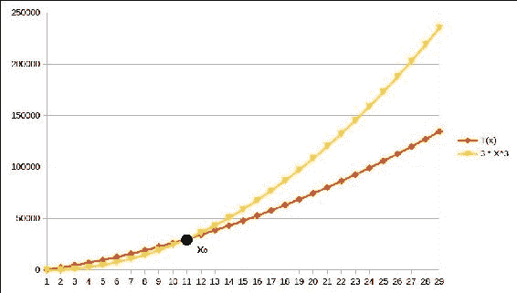

# 第一章. 为何要费心？ – 基础

由于你已经了解了 Java，你当然已经编写了一些程序，这意味着你已经编写了算法。“那么，那是什么？”你可能会问。算法是一系列明确的步骤，处理器可以机械地遵循，或者不涉及任何形式的智能，在有限的时间内产生期望的输出。嗯，这是一个很长的句子。用更简单的话说，算法就是完成某事的明确步骤列表。它听起来就像我们正在谈论一个程序。程序不也是我们给计算机的一串指令，以便得到期望的结果吗？是的，这意味着算法实际上就是一个程序。嗯，其实不是，但几乎如此。算法是一个没有特定编程语言细节的程序；它是程序的基本思想；把它想象成一个程序抽象，你不需要担心程序的语法细节。

嗯，既然我们已经了解了编程，而且算法只是一个程序，我们就完成了，对吧？其实不是。关于程序和算法有很多东西要学习，也就是说，如何编写一个算法来实现特定的目标。当然，通常有解决特定问题的许多方法，并不一定都是平等的。一种方法可能比另一种方法快，这是算法的一个重要特性。当我们研究算法时，执行所需的时间是最重要的。事实上，这是它们的第二重要特性，第一重要的是它们的正确性。

在本章中，我们将更深入地探讨以下概念：

+   测量算法的性能

+   渐近复杂度

+   为什么渐近复杂度很重要

+   为什么算法的显式研究很重要

# 算法的性能

没有人愿意永远等待某件事情完成。让程序运行得更快当然很重要，但我们如何知道程序是否运行得快呢？第一个逻辑步骤就是测量程序运行所需的时间。假设我们有一个程序，给定三个数字，*a*、*b* 和 *c*，确定 *a* 的 *b* 次幂除以 *c* 的余数。

例如，假设 *a=2*、*b=10* 和 *c = 7*，*a* 的 *b* 次幂等于 *2¹⁰* = 1024*，*1024 % 7 = 2*。所以，给定这些值，程序需要输出 `2`。下面的代码片段展示了实现这一点的简单且明显的方法：

```java
public static long computeRemainder(long base, long power, long divisor){ 
  long baseRaisedToPower = 1;
  for(long i=1;i<=power;i++){ 
    baseRaisedToPower *= base;
  }
  return baseRaisedToPower % divisor;
}
```

我们现在可以通过运行程序十亿次并检查它运行所需的时间来估计所需的时间，如下面的代码所示：

```java
public static void main(String [] args){
  long startTime = System.currentTimeMillis();
  for(int i=0;i<1_000_000_000;i++){
    computeRemainder(2, 10, 7);
  }
  long endTime = System.currentTimeMillis();
  System.out.println(endTime - startTime);
}
```

在我的计算机上，它需要 4,393 毫秒。所以每次调用的耗时是 4,393 除以十亿，即大约 4.4 纳秒。看起来做任何计算都是一个合理的时间。但如果输入不同呢？如果我传递 power = `1000`会怎样？让我们检查一下。现在运行一亿次需要大约 420,000 毫秒，或者每次运行大约 420 纳秒。显然，做这个计算所需的时间依赖于输入，这意味着任何关于程序性能的合理讨论都需要考虑程序的输入。

好吧，所以我们可以说，我们的程序运行所需的时间大约是 0.42 X 次幂纳秒。

如果你用输入（`2`，`1000`和`7`）运行程序，你会得到一个输出为`0`的结果，这是不正确的。正确的输出应该是`2`。那么这里发生了什么？答案是，长整型变量可以持有的最大值是 2 的 63 次幂减 1，即 9223372036854775807L。2 的 1000 次幂当然比这个大得多，导致值溢出，这把我们带到了下一个问题：程序运行需要多少空间？

通常，运行程序所需的内存空间可以用程序操作所需的字节数来衡量。当然，它需要至少存储输入和输出的空间。它可能还需要额外的空间来运行，这被称为辅助空间。很明显，就像时间一样，运行程序所需的内存空间在一般情况下也会依赖于输入。

在时间的情况下，除了时间依赖于输入之外，它还取决于你在哪台计算机上运行它。在我的计算机上运行需要 4 秒钟的程序，在 90 年代的一台非常旧的计算机上可能需要 40 秒钟，而在你的计算机上可能只需要 2 秒钟。然而，你实际运行的计算机只通过一个常数倍数来提高时间。为了避免过多地详细说明程序运行的硬件细节，我们不说程序大约需要 0.42 X 次幂毫秒，而可以说所需时间是常数乘以次幂，或者简单地说它是与次幂成比例的。

说计算时间与次幂成比例实际上使得它与硬件无关，甚至与程序编写的语言也无关，我们可以仅通过查看程序并分析它来估计这种关系。当然，运行时间在某种程度上与次幂成比例，因为有一个循环执行了次幂次，除非，当然，次幂非常小，以至于循环外的其他一次操作实际上开始变得重要。

## 最佳情况、最坏情况和平均情况复杂度

通常，算法处理特定输入所需的时间或空间不仅取决于输入的大小，还取决于输入的实际值。例如，如果输入已经排序，则用于按升序排列值列表的某些算法可能花费的时间要少得多，而如果它是一个任意无序列表，则花费的时间要多。这就是为什么，通常，我们必须有不同的函数来表示不同情况下所需的时间或空间。然而，最佳情况是，对于特定大小的输入所需资源最少。也会有最坏情况，其中算法需要为特定大小的输入最多资源。平均情况是对给定大小输入的资源消耗的估计，通过对具有该大小的所有输入值进行加权平均，权重为它们发生的概率。

## 渐近复杂性的分析

我们似乎已经找到了一个想法，一个关于运行时间的抽象概念。让我们把它讲清楚。以抽象的方式，我们通过使用所谓的渐近复杂性来分析程序的运行时间和所需空间。

我们只关心当输入非常大时会发生什么，因为处理小输入所需的时间实际上并不重要；无论如何它都会很小。所以，如果我们有 *x³* *+ x²*，并且如果 *x* 非常大，它几乎等同于 *^(x3)*。我们也不考虑函数的常数因子，因为我们之前已经指出，它依赖于我们运行程序的特定硬件和特定语言。用 Java 实现的算法将比用 C 语言编写的相同算法慢一个常数倍。处理这些抽象定义算法复杂性的正式方法称为渐近界。严格来说，渐近界是针对函数的，而不是针对算法。其想法是首先将给定算法处理输入所需的时间或空间表示为输入大小的函数，然后寻找该函数的渐近界。

我们将考虑三种类型的渐近界——上界、下界和紧界。我们将在以下章节中讨论这些内容。

### 函数的渐近上界

如其名所示，上界为函数的增长设定了一个上限。上界是至少与原始函数一样快速增长的另一个函数。谈论一个函数代替另一个函数有什么意义呢？我们使用的函数通常比实际用于计算处理特定大小输入所需运行时间或空间的函数要简单得多。比较简化函数比比较复杂函数容易得多。

对于一个函数 *f*，我们以下列方式定义符号 *O*，称为**大 O**：

1.  *f(x) = O(f(x))*.

    +   例如，*x³* *= O(x³**)*。

1.  如果 *f(x) = O(g(x))*，那么对于任何非零常数 *k*，*k f(x) = O(g(x))*。

    +   例如，*5x³* *= O(x³**)*，*2 log x = O(log x)* 和 *-x³* *= O(x³**)*（取 *k= -1*）。

1.  如果 *f(x) = O(g(x))* 并且对于所有足够大的 *x*，*|h(x)|<|f(x)|*，那么 *f(x) + h(x) = O(g(x))*。

    +   例如，*5x³* *- 25x²* *+ 1 = O(x³**)*，因为对于足够大的 *x*，*|- 25x²* *+ 1| = 25x²* *- 1* 远小于 *| 5x³**| = 5x³*。所以，*f(x) + g(x) = 5x³* *- 25x²* *+ 1 = O(x³**)*，因为 *f(x) = 5x³* *= O(x³**)*。

    +   我们可以用类似的逻辑证明 *x³* *= O( 5x³* *- 25x²* *+ 1)*。

1.  如果 *f(x) = O(g(x))* 并且对于所有足够大的 *x*，*|h(x)| > |g(x)|*，那么 *f(x) = O(h(x))*。

    +   例如，*x³* *= O(x⁴**)*，因为如果 *x* 足够大，*x⁴* > *x³*。

注意，每当函数上有不等式时，我们只对 *x* 大时发生的情况感兴趣；我们不会关心 *x* 小时发生的情况。

### 注意

为了总结上述定义，你可以省略常数乘数（规则 2）并忽略低阶项（规则 3）。你也可以进行高估（规则 4）。你也可以对这些组合进行所有操作，因为规则可以多次应用。

我们必须考虑函数的绝对值，以适应值可能为负的情况，这在运行时永远不会发生，但我们仍然保留它以示完整。

### 注意

关于符号 *=* 有一点不寻常。仅仅因为 *f(x) = O(g(x))*，并不意味着 *O(g(x)) = f(x)*。事实上，后者甚至没有任何意义。

对于所有目的来说，只需要知道前面的大 O 符号的定义就足够了。如果你感兴趣，可以阅读以下正式定义。否则，你可以跳过本小节的其余部分。

上述想法可以用一种正式的方式总结。我们说表达式 *f(x) = O(g(x))* 的意思是存在正的常数 *M* 和 *x⁰*，使得当 *x > x⁰* 时，*|f(x)| < M|g(x)|*。记住，你只需要找到一个满足条件的 *M* 和 *x⁰* 的例子，就可以断言 *f(x) = O(g(x))*。

例如，*图 1* 展示了一个函数 *T(x) = 100x²* *+2000x+200* 的例子。这个函数是 *O(x²* *)*，其中 *x⁰* *= 11* 和 *M = 300*。当 *x=11* 时，*300x²* 的图像超过了 *T(x)* 的图像，然后一直保持在 *T(x)* 之上直到无穷大。注意，对于较小的 *x* 值，*300x²* 的图像低于 *T(x)*，但这并不影响我们的结论。



图 1\. 渐近上界

为了证明它与前面的四点相同，首先考虑 *x⁰* 是确保 *x* 足够大的方式。我把它留给你去证明上述四个条件来自形式定义。

我将展示一些使用形式定义的例子：

+   *5x²* *= O(x²**)*，因为我们可以说，例如，*x⁰* *= 10* 和 *M = 10*，因此当 *x > x⁰* 时，*f(x) < Mg(x)*，即 *5x²* *< 10x²* 当 *x > 10*。

+   同样，*5x²* *= O(x³**)* 也是正确的，因为我们可以说，例如，*x⁰* *= 10* 和 *M = 10*，因此 *f(x) < Mg(x)* 当 *x > x⁰*，也就是说，*5x²* *< 10x³* 当 *x > 10*。这强调了这样一个观点：如果 *f(x) = O(g(x))*，那么当 *h(x)* 是至少以与 *f(x)* 一样快的速度增长的函数时，*f(x) = O(h(x))* 也是正确的。

+   那么函数 *f(x) = 5x²* *- 10x + 3* 呢？我们可以很容易地看出，当 *x* 足够大时，*5x²* 将远远超过项 *10x*。为了证明我的观点，我可以说 *x>5, 5x²**> 10x*。每次我们将 *x* 增加 1，*5x²* 的增量是 *10x + 1*，而 *10x* 的增量只是一个常数，*10*。对于所有正的 *x*，*10x+1 > 10*，所以很容易看出为什么 *5x²* 总是会高于 *10x*，随着 *x* 的增加而增加。

一般而言，任何形式为 *a[n]* *x^n* *+ a[n-1]* *x^(n-1)* *+ a[n-2]* *x^(n-2)* *+ … + a[0]* *= O(x^n)* 的多项式。为了证明这一点，我们首先会看到 *a[0] = O(1)*。这是真的，因为我们可以有 *x⁰ = 1* 和 *M = 2|a[0]|*，并且当 *x > 1* 时，我们将有 *|a[0]**| < 2|a[0]* *|*。

现在，让我们假设对于某个 n 是正确的。因此，*a[n]* *x^n* *+ a[n-1]* *x^(n-1)* *+ a[n-2]* *x^(n-2)* *+ … + a[0]* *= O(x^n)*。当然，这意味着存在某个 *M[n]* 和 *x⁰*，使得当 *x>x⁰* 时，*|a[n]* *x^n* *+ a[n-1]* *x^(n-1)* *+ a[n-2]* *x^(n-2)* *+ … + a[0]* *| < M[n]* *x^n*。我们可以安全地假设 *x⁰* *>2*，因为如果不是这样，我们只需将其增加 *2* 以得到一个新的 *x⁰*，这个新的 *x⁰* 至少是 *2*。

现在，*|a[n]* *x^n* *+ a[n-1]* *x^(n-1)* *+ a[n-2]* *x^(n-2)* *+ … + a[0]* *| < M[n]* *x^n* 蕴含 *|a[n+1]* *x^(n+1) + a[n]* *x^n* *+ a[n-1]* *x^(n-1)* *+ a[n-2]* *x^(n-2)* *+ … + a[0]* *| ≤ |a[n+1]* *x^(n+1)* *| + |a[nxn]* *+ a[n-1]* *x^(n-1)* *+ a[n-2]* *x^(n-2)* *+ … + a[0]* *| < |a[n+1]* *x^(n+1)* *| + M[n]* *x^n*.

这意味着 *|a[n+1]* *x^(n+1)* *| + M[n]* *x^n* *> |a[n]* *x^n* *+ a[n-1]* *x^(n-1)* *+ a[n-2]* *x^(n-2)* *+ … + a[0]* *|*.

如果我们取 *M[n+1]* *= |a[n+1]* *| + M[n]*，我们可以看到 *M[n+1]* *x[n+1]* *= |a[n+1]* *| x[n+1]* *+ M[n]* *x^(n+1)* *=|a[n+1]* *x^(n+1)* *| + M[n]* *x^(n+1)* *> |a[n+1]* *x^(n+1)* *| + M[n]* *x^n* *> |a[n+1]* *x^(n+1)* *+ a[n]* *x^n* *+ a[n-1]* *x^(n-1)* *+ a[n-2]* *x^(n-2)* *+ … + a[0]* *|*.

也就是说，*|a[n+1]* *x^(n+1)* *+ a[n-1]* *x^(n-1)* *+ a[n-2]* *x^(n-2)* *+ … + a[0]* *|< M[n+1]* *x^(n+1)* 对于所有 *x > x[0]*，也就是说，*a[n+1]* *x^(n+1)* *+ a[n]* *x^n* *+ a[n-1]* *x^(n-1)* *+ a[n-2]* *x^(n-2)* *+ … + a[0]* *= O(x^(n+1)* *)*.

现在，我们已经证明了对于 *n=0* 是正确的，即 *a0 = O(1)*。这意味着，根据我们最后的结论，*a* *1[x] + a[0]* *= O(x)*。这意味着，按照同样的逻辑，*a[2]* *x²* *+ a[1]* *x + a[0]* *= O(x²* *)*，以此类推。我们可以很容易地看出，这意味着对于所有正整数次的多项式都是正确的。

### 算法的渐近上界

好的，所以我们找到了一种抽象地指定一个单参数函数上界的方法。当我们谈论程序的运行时间时，这个参数必须包含有关输入的信息。例如，在我们的算法中，我们可以说，执行时间等于 O(幂)。这种直接指定输入的方法对于所有解决相同问题的程序或算法都是完美的，因为它们的输入都是相同的。然而，我们可能还想用同样的技术来衡量问题的复杂性：这是解决该问题的最有效程序或算法的复杂性。如果我们试图比较不同问题的复杂性，那么我们会遇到障碍，因为不同的问题会有不同的输入。我们必须用所有问题共有的某个东西来指定运行时间，那就是输入的大小，以比特或字节为单位。当我们需要表达足够大的参数，幂时，我们需要多少比特？大约 *log[2]* *(幂)*。因此，在指定运行时间时，我们的函数需要一个大小为 *log[2]* *(幂)* 或 *lg (幂)* 的输入。我们已经看到，我们算法的运行时间与幂成正比，即常数乘以幂，这是常数乘以 *2 lg(power) = O(2x)*，其中 *x= lg(power)*，这是输入的大小。

### 函数的渐近下界

有时候，我们不想赞扬一个算法，我们想避开它；例如，当算法是由我们不喜欢的某人编写的，或者当某个算法表现真的很差时。当我们想因为它糟糕的性能而避开它时，我们可能想谈谈它在最佳输入下表现得多糟糕。渐近下界可以定义得就像大于等于可以用小于等于来定义一样。

一个函数 *f(x) = Ω(g(x))* 当且仅当 *g(x) = O(f(x))*. 以下是一些例子：

+   由于 *x³* = O(x³)*，*x³* = Ω(x³)*

+   由于 *x³* = O(x³)*，*5x³* = Ω(x³)*

+   由于 *x³* = O(5x³ - 25x² + 1)，*5x³ - 25x² + 1 = Ω(x³)*

+   由于 *x³* = O(x⁴)*，*x⁴* = O(x³)*

再次，对于那些感兴趣的人，我们说表达式 *f(x) = Ω(g(x))* 意味着存在正的常数 *M* 和 *x[0]*，使得当 *x > x[0]* 时，*|f(x)| > M|g(x)|*，这等同于说当 *x > x[0]* 时，*|g(x)| < (1/M)|f(x)|*，也就是说，*g(x) = O(f(x))*。

上述定义是由唐纳德·克努特提出的，这是一个更强、更实用的定义，用于计算机科学。在此之前，有一个更复杂、覆盖更多边缘情况的下界 *Ω* 的不同定义。我们在这里不会讨论边缘情况。

当谈论一个算法有多糟糕时，我们可以使用最佳情况的渐近下界来真正地表达我们的观点。然而，即使是对算法最坏情况的批评也是一个相当有说服力的论点。当我们不想找出渐近紧界时，我们也可以使用最坏情况的渐近下界。一般来说，渐近下界可以用来显示当输入足够大时函数的最小增长率。

### 函数的渐近紧界

还有一种界限，在渐近复杂性的意义上相当于相等。theta 界被指定为*f(x) = ω(g(x))*当且仅当*f(x) = O(g(x))*和*f(x) = Ω(g(x))*. 让我们通过一些例子来更好地理解这一点：

+   由于*5x³ = O(x³)*和*5x³ = Ω(x³)*，因此*5x³ = ω(x³)*

+   由于*5x³ + 4x² = O(x³)*和*5x³ + 4x² = Ω(x³)*，因此*5x³ + 4x² = O(x³)*

+   然而，尽管*5x³ + 4x² = O(x⁴)*，因为它不是*Ω(x⁴)*，所以它也不是*ω**(x⁴)*

+   同样，*5x³ + 4x²*不是*ω**(x²)*，因为它不是*O(x²)*

简而言之，在确定紧界时，你可以忽略常数乘数和低阶项，但不能选择一个比给定函数增长更快或更慢的函数。检查界是否正确最好的方法是分别检查*O*和条件，只有当它们相同时，才可以说它有一个 theta 界。

注意，由于算法的复杂性取决于特定的输入，一般来说，当复杂性不受输入性质的影响时，使用紧界。

在某些情况下，我们试图找到平均情况复杂度，特别是在上限仅在极端病态输入的情况下发生时。但由于平均必须根据输入的概率分布来取，它不仅仅依赖于算法本身。界限本身只是特定函数的界限，而不是算法的界限。然而，算法的总运行时间可以表示为一个根据输入改变公式的广义函数，该函数可能具有不同的上界和下界。讨论渐近平均界是没有意义的，因为我们已经讨论过，平均情况不仅仅依赖于算法本身，还依赖于输入的概率分布。因此，平均情况被表述为一个函数，它将是所有输入的概率平均运行时间，并且通常报告该平均函数的渐近上界。

# 我们算法的优化

在我们深入优化算法之前，我们首先需要纠正大幂次算法的错误。我们将使用一些技巧来实现这一点，如下所述。

# 解决大幂次问题

配备了所有渐近分析的工具箱，我们将开始优化我们的算法。然而，既然我们已经看到我们的程序对于即使是适度的大的幂值也无法正常工作，那么让我们首先解决这个问题。有两种方法可以解决这个问题；一种是为存储所有中间产品所需的空间量实际给出一个数值，另一种是通过一个技巧将所有中间步骤限制在`long`数据类型可以支持的值范围内。我们将使用二项式定理来完成这部分工作。

作为提醒，二项式定理说，对于正整数*n*，有*(x+y)^n* = *x^n* + ^n* *C[1]* *x^(n-1)* *y + ^n* *C[2]* *x^(n-2)* *y²* + ^n* *C[3]* *x^(n-3)* *y³* + ^n* *C[4]* *x^(n-4)* *y⁴* + … ^n* *C[n-1]* *x¹* *y^(n-1)* + *y^n*。这里的重要点是所有系数都是整数。假设*r*是除以*b*后 a 的余数。这使得*a = kb + r*对于某个正整数*k*成立。这意味着*r = a-kb*，并且*r^n* = (a-kb)^n*。

如果我们使用二项式定理展开这个式子，我们得到*r^n* = *a^n* - ^n* *C[1]* *a^(n-1)* *.kb + ^n* *C[2]* *a^(n-2)* *.(kb)² - ^n* *C[3]* *a^(n-3)* *.(kb)³ + ^n* *C[4]* *a^(n-4)* *.(kb)⁴ + … ^n* *C[n-1]* *a¹* *.(kb)^(n-1)* ± (kb)^n*。

注意，除了第一项之外，所有其他项都有*b*作为因子。这意味着我们可以写出*r^n* = *a^n* + *bM*，其中*M*是一个整数。如果我们现在将等式两边都除以*b*并取余数，我们得到*r^n* % *b* = *a^n* % *b*，其中*%*是 Java 中用于找到余数的运算符。

现在的想法是在每次求幂时都取除数的余数。这样，我们永远不需要存储比余数范围更大的值：

```java
public static long computeRemainderCorrected(long base, long power, long divisor){
  long baseRaisedToPower = 1;
  for(long i=1;i<=power;i++){
    baseRaisedToPower *= base;
    baseRaisedToPower %= divisor;
  }
  return baseRaisedToPower;
}
```

这个程序显然不会改变程序的时间复杂度；它只是解决了大幂值的问题。程序还保持常数空间复杂度。

## 提高时间复杂度

当前运行时间复杂度是*O(2^x*)*，其中*x*是我们已经计算过的输入大小。我们能做得比这更好吗？让我们看看。

我们需要计算的是*(base^(power) *) % divisor*。这当然等同于*(base²)^(power/2) * % divisor*。如果我们有一个偶数*power*，我们就将操作次数减半。如果我们能一直这样做，我们就可以在*n*步内将*base*的*power*提高到*2^n*，这意味着我们的循环只需要运行*lg(power)*次，因此，复杂度是*O(lg(2^x* *)) = O(x)*，其中*x*是存储*power*所需的位数。这对于计算大幂值的步骤数量是一个实质性的减少。

然而，有一个陷阱。如果`power`不能被`2`整除会发生什么？嗯，那么我们可以写成`(base^(power) % divisor) = (base ((base^(power-1) % divisor) = (base ((base²)^(power-1) % divisor*)，其中`power-1`当然是偶数，计算可以继续。我们将把这个代码写在一个程序中。想法是从最高有效位开始，逐渐向不那么重要的比特移动。如果一个带有`1`的比特后面有`n`个比特，它表示将结果乘以基数，然后在此比特之后平方`n`次。我们通过平方后续步骤来累积这个平方。如果我们找到一个零，我们为了累积之前比特的平方而继续平方：

```java
public static long computeRemainderUsingEBS(long base, long power, long divisor){
  long baseRaisedToPower = 1;
  long powerBitsReversed = 0;
  int numBits=0;
```

首先反转我们的`power`比特，使其更容易从最不重要的侧面访问，这更容易访问。我们还计算比特的数量以供以后使用：

```java
  while(power>0){
    powerBitsReversed <<= 1;
    powerBitsReversed += power & 1;
    power >>>= 1;
    numBits++;
  }
```

现在我们一次提取一个比特。由于我们已经反转了比特的顺序，所以我们首先得到的是最高有效位。为了对顺序有一个直观的认识，我们收集的第一个比特最终会被平方最多的次数，因此它将像最高有效位一样起作用：

```java
  while (numBits-->0){
    if(powerBitsReversed%2==1){
      baseRaisedToPower *= baseRaisedToPower * base;
    }else{
      baseRaisedToPower *= baseRaisedToPower;
    }
    baseRaisedToPower %= divisor;
    powerBitsReversed>>>=1;
  }
  return baseRaisedToPower;
}
```

我们测试算法的性能；我们通过以下代码比较相同计算与早期和最终算法所需的时间：

```java
public static void main(String [] args){
  System.out.println(computeRemainderUsingEBS(13, 10_000_000, 7));

  long startTime = System.currentTimeMillis();
  for(int i=0;i<1000;i++){
    computeRemainderCorrected(13, 10_000_000, 7);
  } 
  long endTime = System.currentTimeMillis();
  System.out.println(endTime - startTime);

  startTime = System.currentTimeMillis();
  for(int i=0;i<1000;i++){
    computeRemainderUsingEBS(13, 10_000_000, 7);
  }
  endTime = System.currentTimeMillis();
  System.out.println(endTime - startTime);
}
```

第一个算法在我的电脑上完成所有 1,000 次执行需要 130,190 毫秒，而第二个算法只需 2 毫秒就能完成同样的任务。这清楚地显示了对于像 1000 万这样的大幂次，性能的巨大提升。我们反复平方项以实现像我们那样进行指数运算的算法被称为...嗯，平方乘法。这个例子应该能够激励你研究算法，因为它可以明显地提高计算机程序的性能。

# 摘要

在本章中，你看到了我们如何分别以秒和字节为单位考虑算法的运行时间和所需的内存。由于这取决于特定的实现、编程平台和硬件，我们需要一个关于以抽象方式讨论运行时间的概念。渐进复杂度是当输入非常大时函数增长的度量。我们可以用它来抽象我们对运行时间的讨论。这并不是说程序员不应该花时间使程序运行速度提高一倍，但这只有在程序已经以最小渐进复杂度运行之后才会发生。

我们还看到，渐近复杂度不仅是我们试图解决的特定问题的属性，而且是我们解决它的特定方式（即我们使用的特定算法）的属性。我们还看到，两个解决相同问题但在运行时使用不同算法和不同渐近复杂度的程序，对于大输入可以执行得非常不同。这应该足以激发我们专门研究算法的动机。

在接下来的章节中，我们将研究在日常生活中最常用的算法技巧和概念。我们将从非常简单的那些开始，这些也是更高级技术的基础。当然，这本书绝不是全面的；目标是提供足够的背景知识，让你对基本概念感到舒适，然后你可以继续阅读。
