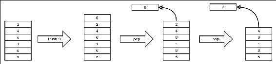
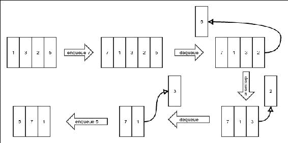
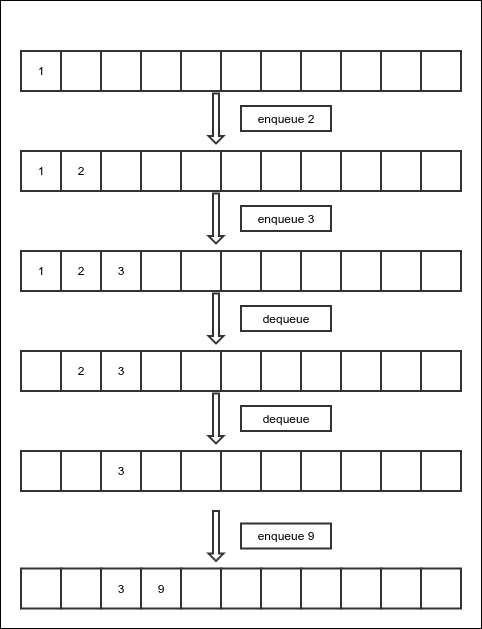
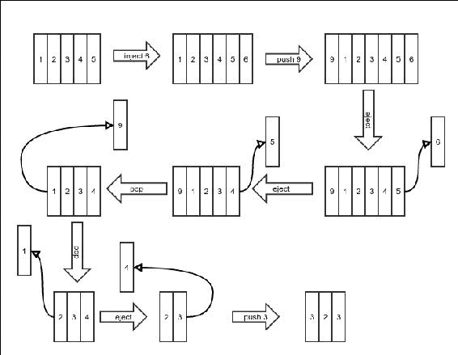

# 第三章。协议 - 抽象数据类型

在上一章中，我们看到了一些基本的数据结构和一些操作它们的算法。然而，有时我们可能想要隐藏数据结构的实现细节，只想知道它们如何与其他算法交互。我们可能只想指定它们必须允许的一些操作，并忘记它们是如何实现的。这与任何大型软件应用中程序部分抽象并不太不同。例如，在 Java 中，我们创建接口，只定义一个对象类必须实现的方法，然后我们使用这种接口类型，有信心它们将被正确实现。我们不想考虑实现类会如何提供它们的实现。这种数据结构的接口被称为抽象数据类型。换句话说，一个**抽象数据类型**（ADT）是对数据结构应该为用户做什么的描述。它是一系列任何实现都必须支持的运算，以及这些运算的完整描述。其中一些使用非常频繁，并且被赋予了名称。我们将在下面讨论一些这些。

在本章中，你将学习以下概念：

+   一些常见 ADT 及其操作的定义

+   如何使用简单的数组和上一章中学习的数据结构来实现这些 ADT

# 栈

**栈**是一个非常常用的抽象数据类型（ADT）。它之所以被这样命名，是因为它类似于餐厅里用来堆叠的盘子。在这样的堆叠中，最后被清洗并放置的盘子会保持在顶部。当需要盘子时，这个盘子将是第一个被取出的。最先放入的盘子将位于堆叠的底部，将是最后一个被取出的。因此，最后放入堆叠的盘子是第一个被取出的，我们也可以称之为**后进先出**（LIFO）。

类似地，栈 ADT 有一个协议，其中最后放入的值必须在第一次尝试获取值时返回，而最先放入的值必须最后出来。下面的图将使它更清晰：



将新值放入栈的操作称为 push，从栈中检索值的操作称为 pop。最后被推入的元素必须首先弹出。允许一个人看到下一个弹出将返回什么的操作称为 peek。peek 操作返回栈顶元素而不修改栈。我们期望所有栈实现都具有所有操作在时间复杂度为*O(1)*的情况下实现。这也是我们栈协议的一部分。

栈 ADT 有以下操作：

+   **Push**：这个操作在栈顶添加一个元素

+   **Pop**：这个操作移除栈顶的元素

+   **Peek**：这个操作检查将要弹出的下一个值

由于我们知道 ADT 是数据结构对类的作用，就像接口对类的作用一样，我们将用接口编写 ADT。以下是我们为栈编写的接口：

```java
public interface Stack<E> {
  void push(E value);
  E pop();
  E peek();
}
```

当然，我们不会就此止步。我们将看到如何实际实现一个栈。为此，我们将看到使用数组存储数据的固定大小栈，以及使用链表存储数据的增长栈。我们首先从第一个开始。

## 使用数组的固定大小栈

固定大小的栈使用预分配的数组来存储值，也就是说，当这个栈用完了整个数组，它就不能再接受新的值，直到旧的值被弹出。这与实际的盘子栈没有太大区别，盘子栈肯定有一个它能处理的最大高度。

和往常一样，我们首先从类的基本结构开始，如下所示：

```java
public class StackImplArray<E> implements Stack<E> {

```

我们需要一个数组来存储元素，并且我们需要记住栈顶在那个数组中的位置。栈顶总是标记下一个将被弹出的元素的索引。当没有更多元素要弹出时，它被设置为`-1`。为什么是`-1`？因为这是自然的选择，当第一个元素被插入时不需要任何特殊处理：

```java
protected E[] array;
  int top=-1;

  public StackImplArray(int size){
    array = (E[])new Object[size];
  }
}
```

栈中的`push`操作可以是简单地将值放入数组中当前`top`旁边，然后将`top`设置为新的位置，如下面的代码所示：

```java
@Override
public void push(E value) {
```

我们首先检查栈是否已经满了，或者当前的`top`是否等于可能的最大索引，如下所示：

```java
  if(top == array.length-1){
    throw new NoSpaceException("No more space in stack");
  }
```

现在，我们将`top`设置为新的位置，并将我们需要存储的值放入其中，如下所示：

```java
  top++;
  array[top] = value;
}
```

我们使用的异常是为此目的定制的异常。异常的代码很简单，如下面的代码所示：

```java
public class NoSpaceException extends RuntimeException{
  public NoSpaceException(String message) {
    super(message);
  }
}
```

`pop`操作正好相反。我们需要首先获取当前`top`的值，然后将`top`更新到新的位置，这个位置比当前的位置少一个，如下面的代码所示：

```java
@Override
public E pop() {
```

我们首先检查栈是否已经为空，如果是，我们返回一个特殊值`null`。如下面的代码所示：

```java
  if(top==-1){
    return null;
  }
```

然后我们更新`top`并返回当前`top`的值，如下所示：

```java
  top--;
  return array[top+1];
}
```

`peek`操作不会改变栈的状态，因此它甚至更简单：

```java
@Override
public E peek() {
```

就像`pop`操作一样，如果栈为空，我们返回`null`：

```java
  if(top==-1){
    return null;
  }
```

否则，我们返回`top`元素，如下所示：

```java
  return array[top];
}
```

实际上，可以有一个没有上限的栈，它由数组支持。我们真正需要做的是，每次我们用完空间时，我们可以调整数组的大小。实际上，数组是不能调整大小的，所以操作就是创建一个具有更高大小的新的数组（可能比原始大小大一倍），并将所有旧元素复制到这个数组中。由于这个操作涉及到将所有*n*个元素逐个复制到新数组中，这个操作的复杂度是*O(n)*。

## 使用链表的变长栈

基于数组的实现的问题在于，由于数组的大小是固定的，栈不能超过固定的大小。为了解决这个问题，我们必须做我们为解决数组相同问题所做的事情，即使用链表。我们从一个以下这样的裸骨类开始这样的实现。链表将存储值。我们不是给它分配一个新的链表，而是使用可重写的`getNewLinkedList()`方法来这样做。这将在从该类扩展的类中很有用：

```java
public class StackImplLinkedList<E> implements Stack<E> {
  protected LinkedList<E> list = getNewLinkedList();

  protected LinkedList<E> getNewLinkedList(){
    return new LinkedList<>();
  }
}
```

要看到哪个链表端必须用作栈顶，我们需要记住我们的栈协议期望操作是*O(1)*，因此我们必须选择一个允许在*O(1)*时间内插入和删除的端。当然，这个端就是列表的前端，正如我们在上一章所看到的。这使得以下`push`操作的代码变得不言自明：

```java
@Override
public void push(E value) {
  list.appendFirst(value);
}
```

注意这次，我们没有检查栈是否已满，因为这种栈的实现永远不会满，它会根据需要增长，而底层的链表会处理这一点。

然而，`pop`操作确实需要检查栈是否为空，并在该点返回`null`。以下`pop`操作的代码也是相当直观的：

```java
@Override
public E pop() {
  if(list.getLength()==0){
    return null;
  }
  E value = list.getFirst();
  list.removeFirst();
  return value;
}
```

`peek`操作当然是一样的，只不过它不会移除顶部元素：

```java
@Override
public E peek() {
  if(list.getLength()==0){
    return null;
  }
  return list.getFirst();
}
```

这就结束了我们的基于链表的栈实现。在下一节，我们将检查另一个称为**队列**的 ADT。

# 队列

栈的反面是什么？这可能是一个奇怪的问题。然而，栈遵循 LIFO（后进先出）。其对立面是**先进先出**（**FIFO**）。因此，在某种意义上，FIFO ADT 可以被认为是栈的对立面。这与人们排队等公交车或医生诊所的情况没有太大区别。第一个到达的人将首先有机会上公交车或看医生。第二个人将获得第二个机会。难怪，这样一个抽象数据类型被称为队列。将元素添加到队列的末尾称为**入队**，从队列中移除称为**出队**。当然，合同是，首先入队的值将是第一个出队的值。以下图示说明了这个操作：



队列抽象数据类型（ADT）具有以下操作：

+   **入队**: 这将在队列的末尾添加一个元素

+   **出队**: 这将从队列的前端移除一个元素

+   **查看**: 这将检查下一个出队的元素

队列将由以下接口表示：

```java
public interface Queue<E> {
  void enqueue(E value);
  E dequeue();
  E peek();
}
```

## 使用数组实现的固定大小队列

就像栈一样，我们有一个基于数组的队列实现。然而，由于队列从相对的两端接收新值和移除旧值，队列的主体也会移动。以下图示将说明这一点：



这意味着在一系列这样的操作之后，队列的末尾将到达数组的末尾，数组开头将留下空间。在这个时候，我们不想停止接收新值，因为还有空间，所以我们回滚到数组的开头。也就是说，我们继续在数组的开头添加新值。

为了进行所有这些操作，我们必须有单独的变量来存储队列起始和结束的索引。此外，由于回滚，有时末尾的索引可能小于起始索引，因此我们单独存储长度以避免混淆。我们像之前一样从类的基本实现开始。起始表示下一个将被出队的元素的索引，而结束表示下一个将要入队的值的索引。这在下述代码中说明：

```java
public class QueueImplArray<E>  implements Queue<E>{
  protected E[] array;
  protected int start=0;
  protected int end=0;
  protected int length=0;
  public QueueImplArray(int size){
    array = (E[]) new Object[size];
  }
}
```

`enqueue` 操作不会改变起始位置。新值被放置在数组的末尾，然后末尾增加一。当然，如果末尾超过了数组的最大索引，需要将其回滚，如下述代码所示：

```java
@Override
public void enqueue(E value) {
  if(length>=array.length){
    throw new NoSpaceException("No more space to add an element");
  }
  array[end] = value;
```

模运算符将确保当索引到达数组的 `end` 时，它会回到数组的开头，如下所示：

```java
  end = (end+1) % array.length;
  length++;
}
```

`dequeue` 操作不会改变末尾位置。我们从起始索引读取，然后带回滚增加起始索引，如下所示：

```java
@Override
public E dequeue() {
  if(length<=0){
    return null;
  }
  E value = array[start];
  start = (start+1) % array.length;
  length--;
  return value;
}
```

`peek` 操作允许我们查看下一个将被出队的元素，而不移除它。当然，这很简单。我们只需返回下一个将被出队的元素。这在下述代码中显示：

```java
@Override
public E peek() {
  if(length<=0){
    return null;
  }
  return array[start];
}
```

由数组支持的队列可以以类似于描述栈的方式调整大小，这同样将是 *O(n)*，因为我们必须逐个将所有旧元素复制到新分配的数组中。

## 使用链表的变量大小队列

就像栈一样，我们希望使用链表来实现一个队列。我们需要记住，所有操作都必须在运行时达到 *O(1)*。如果我们通过在链表开头添加新元素来入队，那么在出队时我们需要从链表末尾移除元素。这行不通，因为从链表末尾移除元素是 *O(n)*。但是，在链表末尾添加元素是 *O(1)*，同样从链表开头移除也是 *O(1)*。因此，队列的末尾，即新元素入队的地方，将是链表的末尾。而队列的起始处，即元素出队的地方，将是链表的开头。

基于此，使用链表实现队列的实现是直接的。再次强调，我们通过仅使用 `getNewLinkedList()` 方法创建列表的实例，这个方法可以被子类覆盖以使用不同的链表，如下所示：

```java
public class QueueImplLinkedList<E> implements Queue<E>{
  protected LinkedList<E> list = getNewLinkedList();

  protected LinkedList<E> getNewLinkedList(){
    return new LinkedList<>();
  }
```

`enqueue` 操作简单地如下在列表末尾添加元素：

```java
  @Override
  public void enqueue(E value) {
    list.appendLast(value);
  }
```

`dequeue`操作首先检查列表是否为空，以便它可以返回`null`，然后它简单地从列表中移除第一个元素。它还必须返回它刚刚移除的元素：

```java
  @Override
  public E dequeue() {
    if(list.getLength()==0){
      return null;
    }
    E value = list.getFirst();
    list.removeFirst();
    return value;
  }
```

就像`dequeue`操作一样，`peek`操作首先需要检查列表是否为空，在这种情况下，它必须返回一个`null`值，否则它简单地返回列表中下一个`dequeue`操作将要出队的元素，如下面的代码所示：

```java
  @Override
  public E peek() {
    if(list.getLength()==0){
      return null;
    }
    return list.getFirst();
  }
}
```

# 双端队列

双端队列是栈和队列的组合。想法是，你可以在队列的两端插入和移除元素。如果你从插入的一侧移除元素，它将表现得像栈。另一方面，如果你在相对的两端插入和移除，它将表现得像队列。你可以混合这些操作，并以你喜欢的任何顺序使用它们。以下图示显示了几个操作以阐明这个想法：



双端队列有以下操作，所有操作的复杂度都是*O(n)*：

+   **Push**：这从开始插入一个元素

+   **Pop**：这从开始移除一个元素

+   **Inject**：这在末尾插入一个元素

+   **Eject**：这从末尾移除一个元素

+   **Peek**：这检查第一个元素

+   **PeekLast**：这检查最后一个元素

双端队列将由以下接口表示：

```java
public interface DoubleEndedQueue<E> extends Stack<E> {
  void inject(E value);
  E eject();
  E peekLast();
}
```

注意，由于双端队列具有与栈相同的`push`和`pop`操作，并且它保留了相同的意义，我们创建了这个接口，它扩展了`Stack`接口。

## 使用数组实现的固定长度双端队列

由于我们将双端队列视为栈的扩展，因此人们可能会预期其实现也会扩展栈的实现。然而，请记住，双端队列既是栈也是队列。由于索引的回滚，基于数组的队列实现比栈的实现更复杂。我们不希望重新编程这些，因此我们选择扩展队列实现而不是栈实现，如下面的代码所示：

```java
public class DoubleEndedQueueImplArray<E> extends QueueImplArray<E> implements DoubleEndedQueue<E> {
```

我们将队列初始化为固定长度，如下所示：

```java
  public DoubleEndedQueueImplArray(int size) {
    super(size);
  }
```

这被添加到双端队列的末尾，这与队列的`enqueue`操作相同：

```java
  @Override
  public void inject(E value) {
    enqueue(value);
  }
```

`eject`操作是从双端队列的末尾移除一个元素。在简单的队列中没有等效的操作。因此，我们必须像以下这样为其编写代码：

```java
  @Override
  public E eject() {
    if (length <= 0) {
      return null;
    }
```

`end`必须减一，并考虑到回滚。但是，如果`end`已经为零，它将变成负数，这不会很好地与模运算符一起工作，因为它将返回一个负值。为了始终保持其正值，我们将其添加到数组的长度。请注意，这不会改变除以数组长度时的余数。以下代码显示了这一点：

```java
    end = (end + array.length - 1) % array.length;
    E value = array[end];
    length--;
    return value;
  }
```

peekLast 操作只需简单地返回 eject 操作将返回的元素，而不做任何修改，如下面的代码所示：

```java
  @Override
  public E peekLast() {
    if (length <= 0) {
      return null;
    }
    return array[(end + array.length - 1) % array.length];
  }
```

push 操作是在双端队列的开头插入一个元素。在简单队列中没有等效的操作。因此，我们需要如下编写代码：

```java
  @Override
  public void push(E value) {
    if (length >= array.length) {
      throw new NoSpaceException("No more space to add an element");
    }
```

这个操作与更新末尾索引的 eject 操作非常相似，如下面的代码所示：

```java
    start = (start + array.length - 1) % array.length;
    array[start] = value;
    length++;
  }
```

pop 操作是移除队列开头的元素，这与普通队列的 dequeue 操作相同。如下面的代码所示：

```java
  @Override
  public E pop() {
    return dequeue();
  }
}
```

注意，我们不需要为 peek 操作编写任何代码，因为这个操作应该返回双端队列开头的元素，因为它与简单队列的 peek 操作相同。

基于数组的实现当然是固定大小的，不能容纳比其固定大小更多的元素。接下来，我们开发基于链表的实现。

## 使用链表的变量大小双端队列

我们之前使用简单的链表实现了队列和栈。然而，请再次记住，所有操作都必须是*O(1)*。现在，我们必须在底层链表的两侧添加和移除元素。我们知道从单链表的末尾移除是*O(n)*，我们不能使用它。因此，我们必须使用双链表。

这次我们不必担心回滚，因此我们将扩展栈的链表实现，这是自然的选择。我们将通过重写 getLinkedList()方法将其单链表替换为双链表，如下所示：

```java
public class DoubleEndedQueueImplLinkedList<E> extends StackImplLinkedList<E> implements DoubleEndedQueue<E> {

  @Override
  protected LinkedList<E> getNewLinkedList() {
    return new DoublyLinkedList<E>();
  }
```

inject 操作将新元素插入到列表的末尾，如下面的代码所示：

```java
  @Override
  public void inject(E value) {
    list.appendLast(value);
  }
```

eject 操作必须移除并返回列表的最后一个元素。如下面的代码所示：

```java
  @Override 
  public E eject() {
    if(list.getLength()==0){
      return null;
    }
    E value = list.getLast();
    list.removeLast();
    return value;
  }
```

最后，peekLast()方法将简单地返回双链表的最后一个元素，如下所示：

```java
  @Override
  public E peekLast() {
    if(list.getLength()==0){
      return null;
    }
    return list.getLast();
  }
}
```

我们只需要实现 inject()、eject()和 peekLast()方法，因为其他方法已经被我们扩展的栈实现了。

# 摘要

在本章中，我们了解到抽象数据类型或 ADT 是数据结构的抽象。它是一个约定，即底层数据结构应该遵守的。该约定涉及数据结构上的不同操作及其特定行为。然后我们看到了几个简单的 ADT 作为示例。然而，这些 ADT 非常实用，正如我们在本书的其余部分遇到其他算法时将看到的那样。抽象允许不同的结构实现。我们还将在本书中看到更多的 ADT 及其实现。

在下一章中，我们将转向一个新的算法领域，称为**函数式编程**。请记住，算法是一系列可能遵循以实现所需处理的步骤；事实证明，还有另一种看待它的方式，我们将在下一章中探讨。
