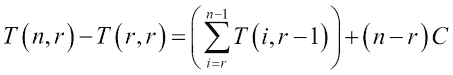
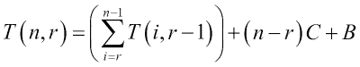
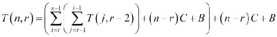
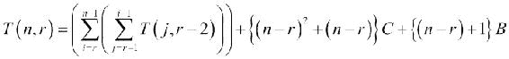
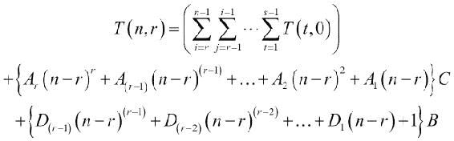

# 第四章。绕道——函数式编程

在本书的开头，我们看到了算法是一系列步骤以实现结果。通过遵循一系列指令来解决问题的这种方式被称为命令式编程。程序中的每个语句都可以被视为一个命令句，要求计算机做某事。然而，这并不是看待问题的唯一方式。函数式编程将算法视为组件的组合，而不是步骤的序列。要解决的问题被视为更小问题的组合。我们不是使用循环，而是将相同问题的较小版本组合起来。函数式编程使用递归作为基本组件。递归不过是针对较小规模的问题进行求解，然后将结果与其它东西组合起来以获得给定规模问题的解决方案。这在如何轻松阅读和理解程序方面有着深远的影响。这使得研究它变得非常重要。

在编程范式中有两个世界。命令式编程风格受到 C 语言族，如 C、C++和 Java 的青睐。在纯函数式方面，有 Lisp、Haskell 和 Scheme 等语言。除此之外，一些语言试图兼得两者之优，如 Python 或 Scala。这说起来容易做起来难；试图在语言中混合这两种思想意味着你需要有支持两者的特性，但有效地使用它们确实是一种艺术。

那么，如果 Java 本质上是命令式的，为什么我们在这本书中要讨论函数式编程呢？好吧，正如我指出的，有时候，混合这两种概念会更好，取其精华。最近，Java 社区已经注意到这一点，并在 Java 8 版本中引入了 lambda 特性，以提供一定程度的函数式编程支持。因此，我们的意图并不是完全以函数式风格编程，因为那不是 Java 首选的编程风格，但我们会做到足以使我们的程序更加美观，并有助于我们理解算法。

本章将向您介绍这个相对陌生的概念，并提供一些在函数式编程中常用的一些基本工具。您将学习以下概念：

+   递归算法和变量的不可变性

+   单子

+   单子上的聚合

+   Java 对函数式编程的支持，即 lambda。

# 递归算法

正如我已经指出的，递归算法是解决问题的一种不同思维方式。例如，假设我们的问题是编写一个程序，给定一个正整数 `n`，返回从零到 `n` 的数字之和。已知的过程式编写方式很简单：

```java
public int sum_upto(int n){
  int sum=0;
  for(int i=0;i<=n;i++){
    sum+=i;
  }
  return sum;
}
```

以下将是该问题的函数式版本：

```java
public int sum_upto_functional(int n){
  return n==0?0:n+sum_upto_functional(n-1);
}
```

就这样——只是一行代码！这或许对 Java 程序员来说并不新鲜，因为他们确实理解递归函数。然而，命令式程序员只有在其他方法都不奏效时才会使用递归。但这是一种不同的思维方式。我们如何证明这种方法等同于先解决一个较小输入的问题，然后再将其与其他东西组合起来？嗯，我们当然首先计算一个比输入小一的相同函数，然后仅仅给它加上*n*。这里还有一点需要注意：在命令式版本中，我们为循环变量*i*的每个值更新名为`sum`的变量。然而，在函数式版本中，我们并没有更新任何变量。我们通过这样做达到了什么效果？当一个变量在程序中被多次更新时，理解或调试它都很困难，因为你需要跟踪最新的值。当这种情况没有发生时，理解正在发生的事情就简单得多。事实上，它使事情变得如此简单，以至于我们甚至可以完全形式化地证明程序的正确性，这对于变量值变化的命令式程序来说是非常困难的。

让我们来看另一个例子。这个例子是关于从*n*个对象中选择*r*个对象，其中顺序并不重要。让我们有一个包含有限数量对象的集合*A*。设这个集合中的对象数量为*n*。这个集合*A*有多少个子集*B*恰好有*r*个元素？当然，任何子集*A*的最大元素数量是*n*；因此*r ≤ n*。我们将这个函数称为`choose`。所以，我们写成`choose(n,r)`。现在，唯一与*A*具有相同元素数量的子集就是*A*本身。所以，`choose(n,n)`等于 1。

我们如何将这个问题分解成具有相似性质但输入更小的子问题？为了找出有多少个包含 *r* 个元素的子集 *B*，我们首先将集合 *A* 视为包含一个具有 `n-1` 个元素的子集 *C* 和一个特定元素 *a* 的组合。因此，我们可以表示 *A = C* *⋃* *{a}*. 现在，我们考虑两种不相交的情况：元素 *a* 是子集 *B* 的成员，以及当它不是子集 *B* 的成员时。当 *a* 不是子集 *B* 的成员时，*B* 也是子集 *C* 的一个子集。具有恰好 `r` 个元素的这种子集 *B* 的数量是 `choose(n-1,r)`，因为 *C* 有 `n-1` 个元素。另一方面，当 *a* 是集合 *B* 的成员时，那么 *B* 可以被视为两个集合的并集——一个是除了 *a* 以外包含 *B* 所有元素的集合 *D*，另一个是仅包含 *{a}* 的集合。因此，*B = D* *⋃* *{a}*. 现在，你可以看到 *D* 是我们定义的 *C* 的一个子集。*C* 中有多少个这样的子集 *D*？有 `choose(n-1,r-1)` 个子集，因为 *C* 有 `n-1` 个元素，而 *D* 有 `r-1` 个元素。因此，这种子集 *B* 的数量是 `choose(n-1,r-1)`。这意味着包含或不包含 *a* 作为元素的子集 *B* 的总数是 `choose(n-1,r) + choose(n-1,r-1)`。如果我们将其放入递归调用中，`r` 和 `n` 将会减少，直到 `r` 等于零或 `n` 等于 `r`。我们已经考虑了 `n` 等于 `r` 的情况，即 `choose(n,n)`。当 `r` 等于零时，这意味着 *B* 是空集。由于只有一个空集，`choose(n,0)` 等于 `1`。现在，我们将这个结果放入代码中：

```java
public long choose(long n, long r){
  if(n<r){
    return 0;
  }else if(r==0){
    return 1;
  }else if(n==r){
    return 1;
  }else{
    return choose(n-1,r) + choose(n-1,r-1);
  }
}
```

这有点复杂，但请注意，我们不仅计算了 `choose` 函数的值，我们还证明了它将如何工作。`choose` 函数是整数指数的二项式系数函数。

上述实现并不高效。为了了解原因，只需考虑当 `choose` 函数的每次递归调用都落在最终的 else 情况时，它们将评估为什么：`choose(n-1,r) = choose(n-2,r) + choose(n-2,r-1)` 和 `choose(n-1,r-1) = choose(n-2,r-1) + choose(n-2,r-2)`。现在请注意，`choose(n-2,r-1)` 在两种情况下都被评估，这将导致它自己的递归调用。这实际上显著增加了渐近复杂度。我们将把对这种复杂度的分析推迟到本章的末尾。

# Java 中的 Lambda 表达式

在继续之前，我们需要了解 Java 中一个名为 **Lambda** 的特性。你们中的许多人可能已经了解它了。然而，由于该特性仅在版本 8 中引入，如果你还不熟悉它，最好了解一下。它允许你将一个称为 lambda 表达式的代码块作为参数传递给另一个函数。为了讨论 lambda，我们首先必须了解什么是函数式接口。

## 函数式接口

功能接口是一个只有一个未实现方法的接口，也就是说，实现它的类需要恰好实现一个方法。功能接口可以声明或继承多个方法，但只要我们可以通过实现一个方法来实现它，它就是一个功能接口。以下示例显示了一个这样的接口：

```java
@FunctionalInterface
public interface SampleFunctionalInterface {
  int modify(int x);
}
```

注意，我们还将它标记为一个带有注解的功能接口，但这并不是必需的。标记它确保如果接口没有恰好一个需要实现的方法，Java 将在编译时显示错误。以下示例显示了另一个有效的功能接口：

```java
public interface AnotherFunctionalInterface{
  public void doSomething(int x);
  public String toString();
}
```

它中有两个方法。然而，由于 `toString()` 方法已经在对象类中实现，你只需要实现一个方法。

同样，如果一个接口有多个方法，但除了一个之外都有默认实现，那么它也可以是一个功能接口。例如，看看以下接口。

```java
@FunctionalInterface
public interface FunctionalInterfaceWithDefaultMethod {
    int modify(int x);
    default int modifyTwice(int x){return modify(modify(x));}
}
```

尽管这个接口有两个方法，但任何实现只需要实现一个。这使得它成为一个功能接口。

## 使用 lambda 实现功能接口

那么，如果我们有一个功能接口会发生什么呢？我们可以使用一个称为 lambda 的酷语法来提供它的内联实现，如下所示：

```java
SampleFunctionalInterface sfi = (x)->x+1;
int y = sfi.modify(1);
```

注意括号和箭头符号。括号包含所有参数。参数的类型没有指定，因为它们已经在接口方法中指定了。可以有零个或多个参数。

有两种类型的 lambda 语法——一种是以表达式作为主体，另一种是以一个或多个步骤作为主体。这些 lambda 表达式看起来略有不同。作为一行代码实现的 lambda 表达式看起来就像我们刚才看到的。这被称为**表达式**语法。如果 lambda 表达式是一行代码，则可以使用表达式语法。对于多行代码，我们使用如下所示的块语法：

```java
Thread t = new Thread(()->{for(int i=0;i<500;i++) System.out.println(i);});
```

对于返回值的函数，也可以使用块语法，尤其是在使用多行代码时。在这种情况下，只需要使用一个返回语句来返回值。

### 注意

由于在函数式程序中所有变量都不应该被重新赋值，我们应该将它们声明为 final 以避免意外修改它们。然而，由于为每个变量键入 `final` 会使代码略显杂乱，我们避免这样做。在纯函数式语言中，变量默认是不可变的。即使在半函数式语言，如 Scala 中，如果它通常鼓励函数式风格，也是如此。然而，由于 Java 主要偏好命令式风格，`final` 关键字是必要的，这导致了一点点杂乱。

现在我们已经了解了 lambda，我们可以开始学习功能数据结构。

# 功能数据结构和单子

函数式数据结构是遵循不可变性和归纳（或递归）定义原则的数据结构。不可变性意味着对数据结构的任何修改都会导致一个新的数据结构，并且任何对原始版本的旧引用仍然可以访问原始版本。归纳定义意味着结构的定义被定义为相同数据结构较小版本的组合。以我们的链表为例。当我们向列表的起始位置添加一个元素或从列表的起始位置删除一个元素时，它会修改链表。这意味着对链表的任何引用现在都将持有对修改后链表的引用。这不符合不可变性的原则。一个函数式链表将确保旧引用仍然引用未修改的版本。我们将在下一节讨论如何实现它。

## 函数式链表

要创建一个不可变的链表，我们考虑链表由两部分组成：

+   包含列表第一个元素的头部

+   包含另一个包含剩余元素的链表的尾部

注意，我们现在已经递归地定义了链表，忠实于我们的函数式设计。这种递归表明，链表是：

+   一个空列表

+   或者是一组两个对象，如下所示：

    +   包含其元素类型的一个元素的头部

    +   包含另一个相同类型链表的尾部

这个定义版本与之前的简化版本相同，只是我们现在已经指定了如何表示列表的终止位置。列表在元素不再存在时终止，即当尾部是一个空列表时。让我们将这些全部放入代码中。

首先，我们根据简化的定义定义一个版本：

```java
public class LinkedList<E> {
  private E head;
  private LinkedList<E> tail;

  private LinkedList(){

}

  private LinkedList(E head, LinkedList<E> tail){
    this.head = head;
    this.tail = tail;
  }

  public E head(){
    return head;
  }
  public LinkedList<E> tail(){
    return tail;
  }
```

这是我们的链表不可变性的核心。请注意，每次我们向链表添加新值时，我们都会创建一个新的链表，这样旧引用仍然持有对未修改列表的引用：

```java
  public LinkedList<E> add(E value){
    return new LinkedList<E>(value,this);
  }
}
```

代码现在已经很直观了，因为我们已经知道我们是如何思考我们的链表的。但请注意，我们已经将构造函数设为私有。我们不希望人们创建不一致的链表版本，比如一个空的`tail`或类似的东西。我们坚持要求每个人都通过首先创建一个空链表然后向其中添加元素来创建我们的链表。因此，我们添加以下`EmptyList`类和`add()`方法：

```java
public static final class EmptyList<E> extends LinkedList<E>{
  @Override
  public E head() {
    throw new NoValueException("head() invoked on empty list"); 
  }

  @Override
  public LinkedList<E> tail() { 
    throw new NoValueException("tail() invoked on empty list"); 
  }
}

public static <E> LinkedList<E> emptyList(){
  return new EmptyList<>();
}
```

现在，我们可以这样使用链表：

```java
LinkedList<Integer> linkedList = LinkedList.<Integer>emptyList()
.add(5).add(3).add(0);
while(!(linkedList instanceof LinkedList.EmptyList)){
  System.out.println(linkedList.head());
  linkedList = linkedList.tail();
}
```

但等等，我们在`while`循环中是否修改了`linkedList`变量？是的，但那并不符合不可变性的原则。为了解决这个问题，让我们看看我们通常会对列表做什么。一般来说，我们想要执行以下操作：

+   对列表的每个元素执行某些操作。例如，将所有元素打印到控制台。

+   获取一个新列表，其中每个元素都使用提供的函数进行转换。

+   计算列表中所有元素的函数。这是元素的总和。例如，找出所有元素的总和。

+   创建一个只包含列表中选定元素的新列表。这被称为**过滤**。

我们将逐个处理它们。在下一节的末尾，你将准备好学习关于单子（monads）的内容。

### 链表的`forEach`方法

链表上的`forEach()`方法将对列表的每个元素执行某些操作。这个操作将作为 lambda 传递。为此，我们首先创建一个功能接口，它消耗一个参数但不返回任何内容：

```java
@FunctionalInterface
public interface OneArgumentStatement<E> {
  void doSomething(E argument);
}
```

使用此接口，我们将为列表定义`forEach()`方法，如下所示：

```java
public class LinkedList<E> {
…

  public static class EmptyList<E> extends LinkedList<E>{
  …

  @Override
  public void forEach(OneArgumentStatement<E> processor) {}
  }

  …

  public void forEach(OneArgumentStatement<E> processor){
    processor.doSomething(head());
    tail().forEach(processor);
  }
}
```

省略号表示我们已讨论过的更多代码，无需重复。`forEach()`方法简单地处理头部，然后递归地对自己调用尾部。再次强调，根据我们的递归哲学，我们使用递归实现了`forEach()`方法。当然，这不会在空列表上工作，因为头部和尾部都是 null。空列表表示当方法需要停止调用自身时的情况。我们通过在`EmptyList`类中重写`forEach()`方法来不执行任何操作来实现这一点。

现在我们可以使用以下代码打印所有元素：

```java
linkedList.forEach((x) -> {System.out.println(x);});
```

我们传递一个 lambda，它对任何元素`x`调用`System.out.println`。但是，如果你看到，这个 lambda 只是作为对已经具有所需 lambda 形式的`System.out.println`方法的代理。Java 允许你使用以下语法将方法用作 lambda：`::`运算符用于告诉编译器你正在寻找的不是具有该名称的字段，而是具有该名称的方法：

```java
linkedList.forEach(System.out::println);
```

注意，这次我们在打印元素时甚至没有修改列表，与上次不同，上次我们是使用循环来做的。

### 链表的映射

现在我们继续进行下一项我们想要对列表做的事情，那就是创建一个新列表，其中所有元素都根据提供的 lambda 表达式进行了转换。我的意思是，我们想要做以下事情：

```java
LinkedList<Integer> tranformedList = linkedList.map((x)->x*2);
```

我们需要以这种方式实现`map()`方法，即`transformedList`包含`linkedList`中所有元素乘以`2`，顺序保持不变。以下是`map()`方法的实现：

```java
public class LinkedList<E> {
…
  public static class EmptyList<E> extends LinkedList<E>{
  …

  @Override
  public <R> LinkedList<R> map(OneArgumentExpression<E, R> transformer) {

  return LinkedList.emptyList();
  }
}
…

  public <R> LinkedList<R> map(OneArgumentExpression<E,R> transformer){
    return new LinkedList<>(transformer.compute(head()),
    tail.map(transformer));
  }
}
```

如同往常，方法是通过递归定义的。转换后的列表只是头部转换后跟尾部转换。我们还在`EmptyList`类中重写了该方法，以返回一个空列表，因为转换后的空列表只是另一个可能不同类型的空列表。有了这种实现，我们可以做以下事情：

```java
LinkedList<Integer> tranformedList = linkedList.map((x)->x*2);
tranformedList.forEach(System.out::println);
```

这应该会打印出一个所有值都乘以`2`的列表。你甚至可以通过转换来更改元素的类型，如下所示：

```java
LinkedList<String> tranformedListString
 = linkedList.map((x)->"x*2 = "+(x*2));
tranformedListString.forEach(System.out::println);
```

`tranformedListString`列表是一个字符串列表，打印每个元素到下一行显示了获得的字符串。

现在我们继续进行下一件事，我们想要对列表做的，那就是计算使用列表中所有值的函数。这被称为**聚合**操作。但在看一般情况之前，我们将专注于一个特定的操作，称为**折叠**操作。

### 列表的折叠操作

列表的折叠操作是一种可以逐个元素进行的聚合操作。例如，如果我们想要计算列表中所有元素的总和，我们可以通过将列表的每个元素加到一个移动的总和中来实现，这样当我们处理完所有元素后，我们将得到所有元素的总和。

有两个操作适合这个目的：`foldLeft`和`foldRight`。`foldLeft`操作首先聚合头部，然后移动到尾部。`foldRight`方法首先聚合尾部，然后移动到头部。让我们从`foldLeft`开始。但在做任何事情之前，我们需要一个表示两个参数表达式的函数接口：

```java
@FunctionalInterface
public interface TwoArgumentExpression<A,B,R> {
  R compute(A lhs, B rhs);
}
```

使用这个接口，我们以下这种方式定义了`foldLeft`方法：

```java
public class LinkedList<E> {
  …
  …

  public static class EmptyList<E> extends LinkedList<E>{

    …

    @Override
    public <R> R foldLeft(R initialValue, TwoArgumentExpression<R, E, R> computer) {
      return initialValue; 
    }
  }

  …

  public <R> R foldLeft(R initialValue, TwoArgumentExpression<R,E,R> computer){
    R newInitialValue = computer.compute(initialValue, head());
    return tail().foldLeft(newInitialValue, computer);
  }
}
```

我们使用传递的 lambda 从`initialValue`和头部计算一个新的值，然后我们使用这个更新的值来计算尾部的`foldLeft`。空列表覆盖了这个方法，只返回`initialValue`本身，因为它只是标记了列表的结束。现在我们可以如下计算所有元素的总和：

```java
int sum = linkedList.foldLeft(0,(a,b)->a+b);
System.out.println(sum);
```

我们将`0`作为初始值，并将求和的 lambda 传递给这个值。这个看起来很复杂，直到你习惯了这个想法，但一旦习惯了，它就非常简单。让我们一步一步地看看发生了什么；从`head`到`tail`的列表是`{0,3,5}`：

1.  在第一次调用中，我们传递了初始值`0`。计算出的`newInitialValue`是`0+0 = 0`。现在，我们将这个`newInitialValue`传递给尾部进行`foldLeft`，即`{3,5}`。

1.  `{3,5}`有一个`head 3`和`tail {5}`。`3`被加到`initialValue 0`上得到`newInitialValue 0+3=3`。现在，这个新值`3`被传递到尾部进行`foldLeft`。

1.  `{5}`有一个`head 5`和空`tail`。`5`被加到`initialValue 3`上得到`8`。现在这个`8`被作为`initialValue`传递给尾部，它是一个空列表。

1.  当然，空列表在`foldLeft`操作中只返回初始值。因此它返回`8`，我们得到了`sum`。

我们甚至可以计算一个列表作为结果，而不是计算一个值。以下代码反转了一个列表：

```java
LinkedList<Integer> reversedList = linkedList.foldLeft(LinkedList.emptyList(),(l,b)->l.add(b) );
reversedList.forEach(System.out::println);
```

我们只是传递了一个空列表作为初始操作，然后我们的操作简单地添加一个新元素到列表中。在`foldLeft`的情况下，头部将添加到尾部之前，导致它在新构造的列表中更靠近尾部。

如果我们想要首先处理最右侧的端点（或远离头部）并移动到左侧，这个操作被称为 `foldRight`。这可以通过非常相似的方式实现，如下所示：

```java
public class LinkedList<E> {
  …

  public static class EmptyList<E> extends LinkedList<E>{
    …

    @Override
    public <R> R foldRight(TwoArgumentExpression<E, R, R> computer, R initialValue) {
      return initialValue;
    }
  }

  …

  public <R> R foldRight(TwoArgumentExpression<E,R,R> computer, R initialValue){
    R computedValue = tail().foldRight(computer, initialValue);
    return computer.compute(head(), computedValue);
  }
}
```

我们交换了参数的顺序，使其直观地表明 `initialValue` 是从列表的右侧开始组合的。与 `foldLeft` 的区别在于我们首先在尾部计算值，然后调用 `foldRight`。然后我们返回从尾部组合到头部以获得结果的计算值的结果。在计算总和的情况下，调用哪个折叠没有区别，因为总和是交换的，即 `a+b` 总是等于 `b+a`。我们可以以下方式调用 `foldRight` 操作来计算总和，这将给出相同的总和：

```java
int sum2 = linkedList.foldRight((a,b)->a+b, 0);
System.out.println(sum2);
```

然而，如果我们使用一个非交换的运算符，我们将得到不同的结果。例如，如果我们尝试使用 `foldRight` 方法反转列表，它将给出相同的列表而不是反转：

```java
LinkedList<Integer> sameList = linkedList.foldRight((b,l)->l.add(b), LinkedList.emptyList());
sameList.forEach(System.out::println);
```

我们想要对列表做的最后一件事是过滤。你将在下一小节中学习它。

### 链表过滤操作

过滤是一个操作，它接受一个 lambda 作为条件，并创建一个新的列表，其中只包含满足条件的元素。为了演示这一点，我们将创建一个实用方法，用于创建一系列元素的列表。

首先，我们创建一个辅助方法，将一系列数字追加到现有列表的头部。此方法可以递归地调用自己：

```java
private static LinkedList<Integer> ofRange(int start, int end, LinkedList<Integer> tailList){
  if(start>=end){
    return tailList;
  }else{
    return ofRange(start+1, end, tailList).add(start);
  }
}
```

然后，我们使用辅助方法生成一系列数字的列表：

```java
public static LinkedList<Integer> ofRange(int start, int end){
  return ofRange(start,end, LinkedList.emptyList());
}
```

这将使我们能够创建一个整数范围的列表。范围包括起始值，但不包括结束值。例如，以下代码将创建一个从 1 到 99 的数字列表，然后打印该列表：

```java
LinkedList<Integer> rangeList = LinkedList.ofRange(1,100);
rangeList.forEach(System.out::println);
```

现在，我们想要创建一个包含所有偶数的列表，比如说。为此，我们在 `LinkedList` 类中创建一个 `filter` 方法：

```java
public class LinkedList<E> {

  …

    public static class EmptyList<E> extends LinkedList<E>{

    …

    @Override
    public LinkedList<E> filter(OneArgumentExpression<E, Boolean> selector) {
      return this;
    }
  }

  …

  public LinkedList<E> filter(OneArgumentExpression<E, Boolean> selector){
    if(selector.compute(head())){
      return new LinkedList<E>(head(), tail().filter(selector));
    }else{
      return tail().filter(selector);
    }
  }
}
```

`filter()` 方法检查条件是否满足。如果是，则包括 `head` 并在 `tail` 上调用 `filter()` 方法。如果不是，则仅调用 `tail` 上的 `filter()` 方法。当然，`EmptyList` 需要重写此方法以仅返回自身，因为我们只需要一个空列表。现在，我们可以做以下操作：

```java
LinkedList<Integer> evenList = LinkedList.ofRange(1,100).filter((a)->a%2==0);
evenList.forEach(System.out::println);
```

这将打印出 1 到 99 之间的所有偶数。让我们通过一些更多示例来熟悉所有这些内容。我们如何计算从 1 到 100 的所有数字之和？以下代码将完成这个任务：

```java
int sumOfRange = LinkedList.ofRange(1,101).foldLeft(0, (a,b)->a+b);
System.out.println(sumOfRange);
```

注意，我们使用了 `(1,101)` 的范围，因为生成的链表不包括结束数字。

我们如何使用这个方法来计算一个数的阶乘？我们定义一个 `factorial` 方法如下：

```java
public static BigInteger factorial(int x){
  return LinkedList.ofRange(1,x+1)
  .map((a)->BigInteger.valueOf(a))
  .foldLeft(BigInteger.valueOf(1),(a,b)->a.multiply(b));
}
```

我们使用了 Java 的`BigInteger`类，因为阶乘增长得太快，`int`或`long`无法容纳很多。此代码演示了我们在使用`foldLeft`方法之前，如何使用`map`方法将整数列表转换为`BigIntegers`列表。现在我们可以使用以下代码计算`100`的阶乘：

```java
System.out.println(factorial(100));
```

这个例子也展示了我们可以将我们开发的方法结合起来解决更复杂的问题的想法。一旦你习惯了这种方法，阅读一个函数式程序并理解它所做的工作，要比阅读它们的命令式版本简单得多。我们甚至使用了单字符变量名。实际上，我们可以使用有意义的名称，在某些情况下，我们应该这样做。但在这里，程序如此简单，所使用的变量又如此接近它们的定义位置，以至于甚至没有必要用描述性的名称来命名它们。

假设我们想要重复一个字符串。给定一个整数`n`和一个字符串，我们想要的结果字符串是原始字符串重复`n`次。例如，给定整数`5`和字符串`Hello`，我们想要输出为`HelloHello HelloHello Hello`。我们可以使用以下函数来完成：

```java
public static String repeatString(final String seed, int count){
  return LinkedList.ofRange(1,count+1)
  .map((a)->seed)
  .foldLeft("",(a,b)->a+b);
}
```

我们在这里所做的是首先创建一个长度为`count`的列表，然后将所有元素替换为`seed`。这给我们一个新的列表，其中所有元素都等于`seed`。这可以通过折叠得到所需的重复字符串。这很容易理解，因为它非常类似于`sum`方法，只不过我们添加的是字符串而不是整数，这导致了字符串的重复。但我们甚至不需要这样做。我们甚至可以在不创建一个所有元素都被替换的新列表的情况下完成它。以下是如何做到这一点的：

```java
public static String repeatString2(final String seed, int count){
  return LinkedList.ofRange(1,count+1)
  .foldLeft("",(a,b)->a+seed);
}
```

在这里，我们只是忽略列表中的整数，并添加`seed`。在第一次迭代中，`a`将被设置为初始值，即一个空字符串。每次，我们只是忽略内容，而不是添加`seed`到这个字符串中。请注意，在这种情况下，变量`a`是`String`类型，而变量`b`是`Integer`类型。

因此，我们可以使用链表做很多事情，使用它的特殊方法和带有 lambda 参数的 lambda 表达式。这是函数式编程的力量。然而，我们使用 lambda 所做的是，我们将接口的实现作为可插入的代码传递。这并不是面向对象语言中的新概念。然而，没有 lambda 语法，定义一个匿名类来完成等效操作将需要大量的代码，这会极大地增加代码的复杂性，从而破坏了简洁性。但改变的是不可变性，导致了方法链和其他概念的出现。我们在分析程序时并没有考虑状态；我们只是将其视为一系列转换。变量更像是代数中的变量，其中`x`的值在整个公式中保持不变。

### 链接列表上的追加

我们已经完成了我们想要做的列表中的所有事情。可能还有一些。一个重要的事情，例如，是`append`操作。这个操作将一个列表粘接到另一个列表上。这可以使用我们已定义的`foldRight`方法来完成：

```java
public LinkedList<E> append(LinkedList<E> rhs){
  return this.foldRight((x,l)->l.add(x),rhs);
}
```

现在，我们执行以下操作：

```java
LinkedList<Integer> linkedList = 
LinkedList.<Integer>emptyList().add(5).add(3).add(0);
LinkedList<Integer> linkedList2 =
 LinkedList.<Integer>emptyList().add(6).add(8).add(9);
linkedList.append(linkedList2).forEach(System.out::print);
```

这将输出`035986`，这是第一个列表被附加到第二个列表的前面。

要理解它是如何工作的，首先记住`foldRight`操作的作用。它从一个初始值开始——在这个例子中，是**右侧**（**RHS**）。然后它逐个从列表的尾部取一个元素，并使用提供的操作与初始列表进行操作。在我们的例子中，操作只是简单地将一个元素添加到初始列表的头部。所以，最终我们得到整个列表附加到 RHS 的开始处。

我们还想对列表做另一件事，但我们直到现在还没有讨论过。这个概念需要理解前面的概念。这被称为`flatMap`操作，我们将在下一小节中探讨它。

### 链表上的 flatMap 方法

`flatMap`操作就像`map`操作一样，只不过我们期望传递的操作返回一个列表而不是一个值。`flatMap`操作的任务是将获得的列表展平并一个接一个地粘合在一起。例如，以下代码：

```java
LinkedList<Integer> funnyList 
=LinkedList.ofRange(1,10)
.flatMap((x)->LinkedList.ofRange(0,x));
```

传递的操作返回从`0`到`x-1`的数字范围。由于我们从 1 到 9 的数字列表开始`flatMap`，`x`将获得从 1 到 9 的值。然后我们的操作将为每个`x`值返回一个包含 0 和 x-1 的列表。`flatMap`操作的任务是将所有这些列表展平并一个接一个地粘合在一起。看看以下打印`funnyList`的代码行：

```java
funnyList.forEach(System.out::print);
```

它将在输出上打印`001012012301234012345012345601234567012345678`。

那么，我们如何实现`flatMap`操作呢？让我们看看：

```java
public class LinkedList<E> {

  public static class EmptyList<E> extends LinkedList<E>{

    …

    @Override
    public <R> LinkedList<R> flatMap(OneArgumentExpression<E, LinkedList<R>> transformer) {
      return LinkedList.emptyList();
    }
  }

  …

  public <R> LinkedList<R> flatMap(OneArgumentExpression<E, LinkedList<R>> transformer){
    return transformer.compute(head())
    append(tail().flatMap(transformer));
  }
}
```

这里发生了什么？首先，我们计算由`head`和`tail`上的`flatMap`操作得到的结果列表。然后我们将操作在列表的`head`上的结果`append`到由`tail`上的`flatMap`得到的结果列表前面。在空列表的情况下，`flatMap`操作只返回一个空列表，因为没有东西可以调用转换。

# 单子概念

在上一节中，我们看到了许多针对链表的运算。其中一些，比如`map`和`flatMap`，在函数式编程中的许多对象中都是一个常见的主题。它们的意义不仅仅局限于列表。`map`和`flatMap`方法，以及从值构造单子的方法，使得这样的包装对象成为单子。单子是函数式编程中遵循的一种常见设计模式。它是一种容器，某种存储其他类对象的容器。它可以直接包含一个对象，正如我们将要看到的；它可以包含多个对象，正如我们在链表案例中看到的；它可以包含在调用某些函数后才会可用的对象，等等。单子有一个正式的定义，不同的语言对其方法的命名也不同。我们只考虑 Java 定义的方法。单子必须有两个方法，称为`map()`和`flatMap()`。`map()`方法接受一个 lambda，作为单子所有内容的转换。`flatMap`方法也接受一个方法，但它返回的不是转换后的值，而是另一个单子。然后`flatMap()`方法从单子中提取输出并创建一个转换后的单子。我们已经看到了一个以链表形式存在的单子例子。但直到你看到几个例子而不是一个，这个一般主题才变得清晰。在下一节中，我们将看到另一种类型的单子：选项单子。

## 选项单子

选项单子是一个包含单个值的单子。这个概念的全部意义在于避免在我们的代码中处理空指针，这会掩盖实际的逻辑。选项单子的目的是能够以一种方式持有空值，这样在每一步中就不需要空值检查。在某种程度上，选项单子可以被视为零个或一个对象的列表。如果它只包含零个对象，那么它代表一个空值。如果它包含一个对象，那么它作为该对象的包装器工作。`map`和`flatMap`方法的行为将完全像在只有一个参数的列表中的行为一样。表示空选项的类称为`None`。首先，我们为选项单子创建一个抽象类。然后，我们创建两个内部类，分别称为`Some`和`None`，分别表示包含值和不包含值的`Option`。这是一个更通用的模式，可以满足非空`Option`必须存储值的实际情况。我们也可以用列表来做这件事。让我们首先看看我们的抽象类：

```java
public abstract class Option<E> {
  public abstract E get();
  public abstract <R> Option<R> map(OneArgumentExpression<E,R> transformer);
  public abstract <R> Option<R> flatMap(OneArgumentExpression<E,Option<R>> transformer);
  public abstract void forEach(OneArgumentStatement<E> statement);

  …
}
```

一个静态方法`optionOf`返回`Option`类的适当实例：

```java
public static <X> Option<X>  optionOf(X value){
  if(value == null){
    return new None<>();
  }else{
    return new Some<>(value);
  }
}
```

我们现在定义一个内部类，称为`None`：

```java
public static class None<E> extends Option<E>{

  @Override
  public <R> Option<R> flatMap(OneArgumentExpression<E, Option<R>> transformer) {
    return new None<>();
  }

  @Override
  public E get() {
    throw new NoValueException("get() invoked on None");
  }

  @Override
  public <R> Option<R> map(OneArgumentExpression<E, R> transformer) {
    return new None<>();
  }

  @Override
  public void forEach(OneArgumentStatement<E> statement) {
  }
}
```

我们创建另一个类，`Some`，来表示非空列表。我们在`Some`类中将值存储为一个单独的对象，并且没有递归尾：

```java
public static class Some<E> extends Option<E>{
  E value;
  public Some(E value){
    this.value = value;
  }
  public E get(){
    return value;
  }
  …
}
```

`map`和`flatMap`方法相当直观。`map`方法接受一个转换器并返回一个新的`Option`，其值被转换。`flatMap`方法做的是相同的，但它期望转换器将返回的值包装在另一个`Option`中。这在转换器有时会返回 null 值时很有用，在这种情况下，`map`方法将返回一个不一致的`Option`。相反，转换器应该将其包装在`Option`中，我们需要使用`flatMap`操作来实现这一点。看看以下代码：

```java
public static class Some<E> extends Option<E>{
  …

  public <R> Option<R> map(OneArgumentExpression<E,R> transformer){
    return Option.optionOf(transformer.compute(value));
  }
  public <R> Option<R> flatMap(OneArgumentExpression<E,Option<R>> transformer){
    return transformer.compute(value);
  }
  public void forEach(OneArgumentStatement<E> statement){
    statement.doSomething(value);
  }
}
```

要理解`Option`单子的用法，我们首先创建一个**JavaBean**。JavaBean 是一个专门用于存储数据的对象。它在 C 语言中的等价物是结构体。然而，由于封装是 Java 的一个基本原则，JavaBean 的成员不能直接访问。相反，它们通过特殊的方法（getter 和 setter）来访问。然而，我们的函数式风格规定 bean 是不可变的，所以不会有任何 setter 方法。以下一系列类给出了一些 JavaBean 的示例：

```java
public class Country {
  private String name;
  private String countryCode;

  public Country(String countryCode, String name) {
    this.countryCode = countryCode;
    this.name = name;
  }

  public String getCountryCode() {
    return countryCode;
  }

  public String getName() {
    return name;
  }
}
public class City {
  private String name;
  private Country country;

  public City(Country country, String name) {
    this.country = country;
    this.name = name;
  }

  public Country getCountry() {
    return country;
  }

  public String getName() {
    return name;
  }

}
public class Address {
  private String street;
  private City city;

  public Address(City city, String street) {
    this.city = city;
    this.street = street;
  }

  public City getCity() {
    return city;
  }

  public String getStreet() {
    return street;
  }
}
public class Person {
  private String name;
  private Address address;

  public Person(Address address, String name) {
    this.address = address;
    this.name = name;
  }

  public Address getAddress() {
    return address;
  }

  public String getName() {
    return name;
  }
}
```

这四个类中没有什么难以理解的。它们的存在是为了存储一个人的数据。在 Java 中，遇到一个非常类似的对象的情况并不少见。

现在，假设我们有一个类型为`Person`的变量`person`，我们想要打印他/她居住的国家名称。如果状态变量中的任何一个可以是 null，那么使用所有 null 检查的正确方式将如下所示：

```java
if(person!=null
 && person.getAddress()!=null
 && person.getAddress().getCity()!=null
 && person.getAddress().getCity().getCountry()!=null){
  System.out.println(person.getAddress().getCity().getCountry());
}
```

这段代码可以工作，但坦白说——它包含了很多 null 检查。我们可以通过使用我们的`Options`类简单地获取地址，如下所示：

```java
String countryName = Option.optionOf(person)
.map(Person::getAddress)
.map(Address::getCity)
.map(City::getCountry)
.map(Country::getName).get();
```

注意，如果我们只是打印这个地址，有可能打印出 null。但这不会导致空指针异常。如果我们不想打印 null，我们需要一个类似于我们链表中的`forEach`方法：

```java
public class Option<E> {
  public static class None<E> extends Option<E>{

  …

    @Override
    public void forEach(OneArgumentStatement<E> statement) {
    }
  }

…

  public void forEach(OneArgumentStatement<E> statement){
    statement.doSomething(value);
  }
}
```

`forEach`方法只是调用传递给它的 lambda 表达式，`None`类重写了它以执行无操作。现在，我们可以这样做：

```java
Option.optionOf(person)
.map(Person::getAddress)
.map(Address::getCity)
.map(City::getCountry)
.map(Country::getName)
.forEach(System.out::println);
```

如果`country`中的名称为 null，这段代码现在将不会打印任何内容。

现在，如果`Person`类本身是函数式感知的，并返回`Options`以避免返回 null 值，会发生什么呢？这就是我们需要`flatMap`的地方。让我们制作一个`Person`类中所有类的新的版本。为了简洁起见，我将只展示`Person`类的修改以及它是如何工作的。然后你可以检查其他类的修改。以下是代码：

```java
public class Person {
  private String name;
  private Address address;

  public Person(Address address, String name) {
    this.address = address;
    this.name = name;
  }

  public Option<Address> getAddress() {
    return Option.optionOf(address);
  }

  public Option<String> getName() {
    return Option.optionOf(name);
  }
}
```

现在，代码将修改为使用`flatMap`而不是`map`：

```java
Option.optionOf(person)
.flatMap(Person::getAddress)
.flatMap(Address::getCity)
.flatMap(City::getCountry)
.flatMap(Country::getName)
.forEach(System.out::println);
```

现在代码完全使用了`Option`单子。

## 尝试 monad

我们还可以讨论另一个我们可以讨论的 monad 是 `Try` monad。这个 monad 的目的是使异常处理更加紧凑，并避免隐藏实际程序逻辑的细节。`map` 和 `flatMap` 方法的语义是显而易见的。同样，我们再次创建了两个子类，一个用于成功，一个用于失败。`Success` 类持有计算出的值，而 `Failure` 类持有抛出的异常。像往常一样，`Try` 在这里是一个抽象类，包含一个静态方法来返回适当的子类：

```java
public abstract class Try<E> {
  public abstract <R> Try<R> map(
OneArgumentExpressionWithException<E, R> expression);

  public abstract <R> Try<R> flatMap(
OneArgumentExpression<E, Try<R>> expression);

  public abstract E get();

  public abstract void forEach(
OneArgumentStatement<E> statement);

  public abstract Try<E> processException(
OneArgumentStatement<Exception> statement);
  …
  public static <E> Try<E> of(
NoArgumentExpressionWithException<E> expression) {
    try {
      return new Success<>(expression.evaluate());
    } catch (Exception ex) {
      return new Failure<>(ex);
    }
  }
  …
}
```

我们需要一个名为 `NoArgumentExpressionWithException` 的新类和一个允许其体内出现异常的 `OneArgumentExpressionWithException` 类。它们如下所示：

```java
@FunctionalInterface
public interface NoArgumentExpressionWithException<R> {
  R evaluate() throws Exception;
}

@FunctionalInterface
public interface OneArgumentExpressionWithException<A,R> {
  R compute(A a) throws Exception;
}
```

`Success` 类存储传递给 `of()` 方法的表达式的值。请注意，`of()` 方法已经执行了表达式以提取值。

```java
protected static class Success<E> extends Try<E> {
  protected E value;

  public Success(E value) {
    this.value = value;
  }
```

事实上，这是一个代表早期表达式成功的一个类；`flatMap` 只需处理以下表达式中出现的异常，而以下传递给它的 `Try` 会自己处理这些异常，所以我们只需返回那个 `Try` 实例本身：

```java
  @Override
  public <R> Try<R> flatMap(
    OneArgumentExpression<E, Try<R>> expression) {
      return expression.compute(value);
  }
```

然而，`map()` 方法必须执行传递的表达式。如果有异常，它返回一个 `Failure`；否则返回一个 `Success`：

```java
  @Override
  public <R> Try<R> map(
    OneArgumentExpressionWithException<E, R> expression) {
    try {
      return new Success<>(
        expression.compute(value));
    } catch (Exception ex) {
      return new Failure<>(ex); 
    }
  }
```

`get()` 方法返回预期的值：

```java
  @Override
  public E get() {
    return value;
  }
```

`forEach()` 方法允许你在值上运行另一段代码，而不返回任何内容：

```java
  @Override 
  public void forEach(
    OneArgumentStatement<E> statement) {
      statement.doSomething(value);
  }
```

这个方法不做任何事情。`Failure` 类上的相同方法会在异常上运行一些代码：

```java
  @Override
  public Try<E> processException(
    OneArgumentStatement<Exception> statement) {
      return this;
  }
}
```

现在，让我们看看 `Failure` 类：

```java
protected static class Failure<E> extends Try<E> {
  protected Exception exception;

  public Failure(Exception exception) {
    this.exception = exception;
  }
```

在这里，在 `flatMap()` 和 `map()` 方法中，我们只是改变了 `Failure` 的类型，但返回了一个具有相同异常的实例：

```java
  @Override
  public <R> Try<R> flatMap(
    OneArgumentExpression<E, Try<R>> expression) {
      return new Failure<>(exception);
  }

  @Override
  public <R> Try<R> map(
    OneArgumentExpressionWithException<E, R> expression) {
      return new Failure<>(exception);
  }
```

在 `Failure` 的情况下没有值需要返回：

```java
  @Override
  public E get() {
    throw new NoValueException("get method invoked on Failure");
  }
```

在 `forEach()` 方法中我们不做任何事情，因为没有值需要处理，如下所示：

```java
  @Override
  public void forEach(
    OneArgumentStatement<E> statement) {
    …
  }
```

以下方法在 `Failure` 实例中包含的异常上运行一些代码：

```java
  @Override
  public Try<E> processException(
    OneArgumentStatement<Exception> statement) {
      statement.doSomething(exception);
      return this;
  }
}
```

通过这个 `Try` monad 的实现，我们现在可以继续编写涉及处理异常的代码。以下代码将打印文件 demo 的第一行，如果它存在的话。否则，它将打印异常。它还会打印任何其他异常：

```java
Try.of(() -> new FileInputStream("demo"))
.map((in)->new InputStreamReader(in))
.map((in)->new BufferedReader(in))
.map((in)->in.readLine())
.processException(System.err::println)
.forEach(System.out::println);
```

注意它如何处理异常中的杂乱。在这个阶段，你应该能够看到正在发生的事情。每个 `map()` 方法，像往常一样，转换之前获得的一个值，但在这个情况下，`map()` 方法中的代码可能会抛出异常，并且会被优雅地包含。前两个 `map()` 方法从一个 `FileInputStream` 创建一个 `BufferedReader`，而最后的 `map()` 方法从 `Reader` 中读取一行。

通过这个例子，我总结了 monad 部分。monadic 设计模式在函数式编程中无处不在，理解这个概念非常重要。我们将在下一章看到更多 monad 和一些相关概念。

# 递归算法复杂度的分析

在本章中，我方便地跳过了我所讨论的算法的复杂度分析。这是为了确保你在被其他事情分散注意力之前先掌握函数式编程的概念。现在是时候回到这个话题上了。

分析递归算法的复杂度首先需要创建一个方程。这是自然而然的，因为函数是以较小输入的形式定义的，复杂度也是以较小输入计算自身函数的形式表达的。

例如，假设我们正在尝试找到`foldLeft`操作的复杂度。`foldLeft`操作实际上是两个操作，第一个操作是对当前初始值和列表头部的固定操作，然后是对列表尾部的`foldLeft`操作。假设*T(n)*代表在长度为*n*的列表上运行`foldLeft`操作所需的时间。现在，假设固定操作需要时间*A*。那么，`foldLeft`操作的定义表明*T(n) = A + T(n-1)*。现在，我们将尝试找到一个解决这个方程的函数。在这种情况下，这非常简单：

*T(n) = A + T(n-1)*

*=> T(n) – T(n-1) = A*

这意味着*T(n)*是一个等差数列，因此可以表示为*T(n) = An + C*，其中*C*是初始起点，或*T(0)*。

这意味着*T(n) = O(n)*。我们已经看到了`foldLeft`操作如何在线性时间内工作。当然，我们假设涉及的运算与时间无关。更复杂的运算将导致不同的复杂度。

建议您尝试计算其他算法的复杂度，这些算法与这个算法差别不大。然而，我还会提供一些类似的算法。

在本章的早期，我们是这样实现`choose`函数的：

```java
choose(n,r) = choose(n-1,r) + choose(n-1, r-1)
```

如果我们假设所需的时间由函数`T(n,r)`给出，那么`T(n,r) = T(n-1,r) + T(n-1,r-1) + C`，其中`C`是一个常数。现在我们可以做以下操作：

```java
 T(n,r) = T(n-1,r) + T(n-1,r-1) + C
=>T(n,r) -  T(n-1,r) = T(n-1,r-1) + C
```

同样，`T(n-1,r) - T(n-2,r) = T(n-2,r-1) + C`，只需将*n*替换为*n-1*。通过堆叠这样的值，我们得到以下结果：

```java
T(n,r) -  T(n-1,r) = T(n-1,r-1) + C
T(n-1,r) -  T(n-2,r) = T(n-2,r-1) + C
T(n-2,r) -  T(n-3,r) = T(n-3,r-1) + C
…
T(r+1,r) -  T(r,r) = T(r,r-1) + C
```

前面的等式考虑了总共*n-r*个步骤。如果我们对栈的两边进行求和，我们得到以下结果：



当然，*T(r,r)*是常数时间。让我们称它为*B*。因此，我们有以下结果：



注意，我们也可以将相同的公式应用于*T(i,r-1)*。这将给我们以下结果：



简化后得到以下结果：



我们可以继续这样下去，最终我们会得到一个包含多个嵌套求和的表达式，如下所示：



在这里，A 和 D 也是常数。当我们谈论渐近复杂度时，我们需要假设一个变量足够大。在这种情况下，有两个变量，条件是*r*总是小于或等于*n*。因此，首先我们考虑*r*固定而*n*正在增加并变得足够大的情况。在这种情况下，会有总共*r*个嵌套的求和。*T(t,0)*是常数时间。求和有*r*层深度，每层最多有*(n-r)*个元素，所以它是*O((n-r)r)*。其他项也是*O((n-r)r)*。因此，我们可以得出以下结论：

```java
T(n,r) = O((n-r)r) = O(nr)
```

输入的大小当然不是*n*；它是*log n = u (即)*。然后，我们有*T(n,r) = O(2sr)*的计算复杂度。

另一个有趣的案例是当我们同时增加*r*和*n*，并且增加它们之间的差异时。为了做到这一点，我们可能想要两个之间的特定比率，我们假设*r/n= k, k<1*始终。然后我们可以看到函数*T(n, kn)*的渐近增长。但计算这个需要微积分，并且超出了本书的范围。

这表明，尽管函数形式的算法分析可能更容易，但时间复杂度的分析可能相当困难。很容易理解为什么计算函数算法的复杂度更困难。最终，计算复杂度涉及到计算所需步骤的数量。在命令式风格中，计算步骤是直接的，所以很容易计数。另一方面，递归风格是一种更高层次的抽象，因此，计数步骤更困难。在接下来的章节中，我们将看到更多这些分析。

# 函数式编程的性能

如果我们仔细思考，函数式编程的整个要点就是拥有不可变性和程序的递归定义（或归纳定义），这样它们就可以被轻易分析。一般来说，在程序上添加额外的约束会使分析变得更加简单，但会减少你可以用它做的事情。当然，函数式编程通过不可变性这种形式，在命令式编程上添加了额外的约束，也就是说，你不再被允许重新分配变量。这样做是为了使程序的分析，即理解程序是如何工作的，现在变得更加简单。证明关于程序的理论也更加简单。然而，我们也失去了一些没有这些限制时可以做的事情。结果发现，任何程序都可以以产生相同结果的方式重写为函数式风格。然而，对于它们的性能或复杂性并没有任何保证。所以，一个函数式版本的程序可能比它的命令式对应版本要低效得多。实际上，在现实生活中，我们确实面临许多这样的场景。因此，这实际上是在性能和简单性之间的一种权衡。那么，一般方向应该是，当处理大量输入数据时，最好去除限制，以便能够进行更多的优化。另一方面，当输入数据量较小时，坚持函数式风格是有意义的，因为性能可能不会受到太大影响。

尽管如此，也有一些情况下，函数式版本的运行时间复杂性与命令式版本相同。在这种情况下，由于它的简单性，可能会更倾向于选择函数式版本。需要注意的是，由于 Java 没有提供任何显式的垃圾回收方式，实际上，它是由偶然或程序员无法控制的情况发生的，因此，由于不可变性，函数式编程风格会非常快地填满堆，因为一旦创建就会被丢弃。所以，在性能真正成为问题的地方，不建议使用它们。

这似乎与许多大型数据处理系统，如 Spark，使用函数式编程风格的事实相矛盾。然而，这些系统只拥有一种专门的语言，给人一种函数式编程风格的外观；在它们被执行之前，它们几乎被转换成了一种几乎非函数式的形式。为了更详细地说明，一个在单子中的映射方法可能根本不会评估任何东西；相反，它可能只是创建一个新的对象，包含这个操作符。然后，一个通用程序可以分析这些结构，并构建一个执行相同工作的命令式程序。这为框架的使用者提供了一个简单的接口，同时保持资源使用在可控范围内。在下一章中，我们将探讨一些这些想法。

# 摘要

在本章中，我们学习了一种新的看待算法的方法。以函数式风格编写程序可以简化对其正确性的分析，也就是说，你可以轻松理解为什么程序会产生正确的输出。我们看到了函数式编程中的一些模式，特别是单子（monads）。我们还看到了 Java 如何通过 lambda 语法提供对函数式编程风格的支持，这种语法从 Java 9 版本开始就存在了。最后，我们看到了如何有效地使用 lambda 进行函数式编程。

函数式程序通常更容易验证其正确性，但计算其复杂度则较为困难。它们通常的运行速度要么与命令式程序相同，要么更慢。这是开发努力和计算效率之间的权衡。对于较小的输入，采用函数式编程风格是理想的，而对于处理大量输入，则可能更倾向于命令式风格。
