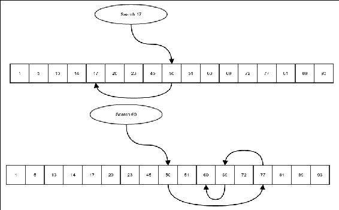
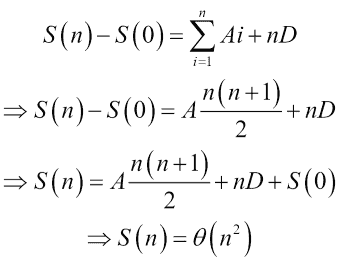

# 第五章. 高效搜索 – 二分搜索和排序

什么是搜索？搜索是在一组值中定位给定值的过程。例如，你被给了一个整数数组，你的问题是检查整数 *5* 是否在该数组中。这是一个搜索问题。除了决定整数 *5* 是否在数组中之外，我们还可能对其位置感兴趣，当找到它时。这也是一个搜索问题。

对此的一个有趣的看法是想象一个字典，即值和关联值的数组。例如，你有一个包含学生名字和分数的数组，如下表所示：

| 姓名 | 分数 |
| --- | --- |
| 汤姆 | 63 |
| 哈里 | 70 |
| 梅里 | 65 |
| 阿伊莎 | 85 |
| 阿卜杜拉 | 72 |
| … | ... |

列表继续。假设，我们的系统允许学生查看自己的分数。他们会输入他们的名字，系统会显示他们的分数。为了简单起见，让我们假设没有重复的名字。现在，我们必须搜索提供的名字并返回相应的值。因此，这又是一个搜索问题。正如我们将看到的，搜索问题在编程中相当普遍。

在本章中，你将学习以下内容：

+   搜索算法

+   在有序列表中进行高效搜索

+   一些排序算法

# 搜索算法

假设你被给了一个值数组，你需要检查特定的值是否在该数组中，最自然的方法是逐个检查每个元素是否与给定的值匹配。如果任何一个匹配，我们就找到了那个元素，我们可以返回索引；如果没有，我们可以在处理完所有元素后返回特殊值 `-1` 来报告找不到这样的元素。这就是我们所说的**线性搜索**。以下演示了在数组中的线性搜索算法：

```java
    public static <E, F extends E> int linearSearch(E[] values, 
    valueToLookup) { 
        for (int i = 0; i < values.length; i++) { 
            if (values[i].equals(valueToLookup)) { 
                return i; 
            } 
        } 
        return -1; 
    }
```

函数 `linearSearch` 接收一个值数组和要搜索的值，如果找到该值则返回索引。如果没有找到，它返回一个特殊值 `-1`。程序简单地遍历每个元素并检查当前元素是否与要查找的值匹配；如果匹配，则返回当前索引，否则继续查找。数组的末尾返回特殊值 `-1`。现在以下代码块应该在第一种情况下返回 `-1`，在第二种情况下返回值 `5`：

```java
        Integer[] integers = new Integer[]{232,54,1,213,654,23,6,72,21}; 
        System.out.println(ArraySearcher.linearSearch(integers,5)); 
        System.out.println(ArraySearcher.linearSearch(integers,23));
```

现在，如果我们想解决本章引言中描述的学生分数问题，我们只需要将学生的分数存储在同一个顺序的不同数组中，如下所示：

```java
    static String[] students = new String[]{"Tom","Harry","Merry","Aisha", "Abdullah"}; 
    static int[] marks = new int[]{63,70, 65, 85, 72}; 
```

现在我们可以编写一个函数来搜索一个名字：

```java
    public static Integer marksForName(String name){ 
        int index = linearSearch(students, name); 
        if(index>=0){ 
            return marks[index]; 
        }else{ 
            return null; 
        } 
    }
```

首先，我们在学生名单中查找学生的名字。如果找到名字，相应的索引将被分配给变量 index，并且值将大于或等于零。在这种情况下，我们返回与分数数组相同索引存储的值。如果没有找到，我们返回 null。例如，要查找 Merry 的分数，我们可以像下面这样调用：

```java
        System.out.println(marksForName("Merry"));
```

我们正确地获得了她的分数，即`65`。

线性搜索的复杂度是多少？我们有一个`for`循环，它遍历长度为*n*（比如说）的数组中的每个元素；在最坏的情况下，我们会遍历所有元素，所以最坏情况复杂度是*θ(n)*。即使在平均情况下，我们也会在找到正确元素之前访问一半的元素，所以平均情况复杂度是*θ(n/2) = θ(n)*。

## 二分查找

线性搜索就是我们能做的最好的吗？好吧，结果证明，如果我们正在查看一个任意数组，这就是我们必须做的事情。毕竟，在一个任意数组中，没有方法可以知道一个元素是否存在，而不可能查看所有元素。更具体地说，我们无法确定某个元素不存在，除非验证所有元素。原因是单个元素的价值对其他元素的价值没有任何说明。

但是，一个元素能有多少信息可以告诉我们数组中的其他元素？让元素具有关于其他元素信息的一种方法是将数组排序，而不是仅仅是一个任意数组。什么是排序数组？排序数组是一个将所有元素按其值排序的数组。当一个数组被排序时，每个元素都包含有关左侧一切小于该特定元素的信息，以及右侧一切更大的信息（或者如果元素的顺序相反，但我们将考虑从左到右递增排序的数组）。这种信息惊人地使这个搜索变得更快。以下是我们要做的事情：

+   检查数组的中间元素。如果它与我们要查找的元素匹配，我们就完成了。

+   如果中间元素小于我们要查找的值，则在当前数组的右侧子数组中进行搜索。这是因为左侧的一切都更小。

+   如果中间元素大于我们要查找的值，则只搜索左侧子数组。

为了避免在创建子数组时创建数组的副本，我们只需传递整个数组，但我们要记住我们正在查看的起始和结束位置。起始位置包含在范围内，结束位置不包含。因此，只有位于起始位置右侧和结束位置左侧的元素包含在正在搜索的子数组中。以下图示给出了二分查找的直观理解：



图 1：二分查找。

一个表示在搜索过程中将一个元素移动到另一个位置的箭头。

但是，在实现这个算法之前，我们需要理解 `Comparable` 的概念。`Comparable` 是 Java 标准库中的一个接口，其形式如下：

```java
package java.lang; 
public interface Comparable<T> { 
    public int compareTo(T o); 
} 
```

实现此接口的任何类都必须与自己比较不同的对象。必须要求类型参数 *T* 使用实现它的相同类实例化，如下所示：

```java
public class Integer implements Comparable<Integer>{
    public int compareTo(Integer o){
        …
    } 
}
```

`compareTo` 方法旨在比较相同类型的对象。如果当前对象（`this` 引用指向的对象）小于传入的对象，`compareTo` 必须返回一个负值。如果传入的对象较小，该方法必须返回一个正值。否则，如果它们相等，它必须返回 `0`。`compareTo` 方法必须满足以下条件：

+   如果 `a.compareTo(b) == 0`，那么 `a.equals(b)` 必须为 `true`

+   如果 `a.compareTo(b) < 0` 且 `b.compareTo(c) < 0`，那么 `a.compareTo(c) <0`

+   如果 `a.compareTo(b) <0`，那么 `b.compareTo(a) > 0`

+   如果 `b.equals(c)` 为真且 `a.compareTo(b) <0`，那么 `a.compareTo(c) <0`

+   如果 `b.equals(c)` 为真且 `a.compareTo(b) >0`，那么 `a.compareTo(c) >0`

基本上，对于表示相等性的等价关系，条件是相同的。它基本上概括了 `<` 和 `<=` 操作符的概念，这些操作符用于数字。当然，`Wrapper` 对象的 `compareTo` 方法实现与它们内部的原始类型上的 `<` 和 `<=` 操作符完全相同。

现在，我们按照前面的步骤编写搜索函数来执行搜索：

```java
    private static <E extends Comparable<E>, 
      F extends E> int binarySearch( E[] sortedValues, 
      F valueToSearch, int start, int end) { 
        if(start>=end){ 
            return -1; 
        } 
        int midIndex = (end+start)/2; 
        int comparison = sortedValues[midIndex].compareTo(valueToSearch); 
        if(comparison==0){ 
            return midIndex; 
        }else if(comparison>0){ 
            return binarySearch(sortedValues, valueToSearch, start, midIndex); 
        }else{ 
            return binarySearch(sortedValues, valueToSearch, midIndex+1, end); 
        } 
    }
```

注意，在这种情况下，我们规定数组中的对象必须是可比较的，这样我们才能知道一个对象是否大于或小于另一个对象。这个关系是如何确定的并不重要；数组必须使用相同的比较方式排序——即两个连续元素之间的比较将确保左边的元素小于右边的元素，正如 `Comparable` 所提供的。

第一个 `if` 条件检查传入的数组是否为空，如果是，那么显然要搜索的元素未找到，我们返回 `-1` 来表示这一点。然后，我们找到 `midIndex` 并递归地在左子数组或右子数组中搜索元素。一旦我们有了这个函数，我们再创建另一个包装函数来运行搜索，而不必提及起始和结束位置：

```java
    public static <E extends Comparable<E>, F extends E> int binarySearch( 
            E[] sortedValues, F valueToSearch) { 
        return binarySearch(sortedValues, valueToSearch, 0, sortedValues.length); 
    }
```

### 二分查找算法的复杂度

在每一步中，我们都在将整个数组划分为两个部分，除了我们正在比较的那个元素。在最坏的情况下，即搜索的元素不在数组中，我们将不得不一直下降到我们正在处理空数组的位置，在这种情况下，我们返回 `-1` 并停止递归。在前一步中，我们必须只有一个元素的数组。为了我们的分析，我们将这一步视为最后一步。所以，让我们有一个包含 *n* 个元素的已排序数组，*T(.)* 是在数组中搜索所需的时间。因此，我们有以下：

```java
T(n) = T((n-1)/2) + C, where C is a constant.
```

通常，每一步中的两个搜索分支的大小会有所不同，一个可能比另一个部分小一个。但我们将忽略这些小的差异，这对大的 *n* 几乎没有影响。因此，我们将使用以下方程：

```java
T(n) = T(n/2) + C
```

现在，让我们假设 *n* 是 *2* 的整数次幂，即 *n = 2m*，其中 *m* 是某个整数。因此，我们有以下：

```java
T(2m) = T(2m-1) + C
```

现在我们取另一个函数 *S(.)*，使得 *S(m) = T(2m)* 对所有 *m* 都成立。然后，我们有：

```java
S(m) = S(m-1) + C
```

这是等差数列的公式。因此，我们有：

```java
S(m) = mC + D, where D is also a constant.
=> T(2m) = mC + D
=> T(n) = C lg(n) + D
```

因此，我们得到 *T(n)* 的渐近复杂度：

```java
T(n) = O(lg(n))
```

函数 *T(n)* 的增长速度仅与传递给数组的数组大小对数相同，这非常慢。这使得二分搜索成为一个极其高效的算法。

为了对算法进行某种程度的现场测试，我们使用以下代码在包含一亿个元素的数组上运行线性搜索和二分搜索算法：

```java
        int arraySize = 100000000; 
        Long array[] = new Long[arraySize]; 
        array[0] = (long)(Math.random()*100); 
        for(int i=1;i<array.length;i++){ 
            array[i] = array[i-1] + (long)(Math.random()*100); 
        } 

        //let us look for an element using linear and binary search 
        long start = System.currentTimeMillis(); 
        linearSearch(array, 31232L); 
        long linEnd = System.currentTimeMillis(); 
        binarySearch(array, 31232L); 
        long binEnd = System.currentTimeMillis(); 

        System.out.println("linear search time :=" + (linEnd -start)); 
        System.out.println("binary search time :=" + (binEnd -linEnd));
```

在我的电脑上，线性搜索耗时 282 毫秒，二分搜索耗时 0 毫秒。此外，请注意，我们正在寻找的值预计将非常接近数组的开始部分；在中间附近的值，二分搜索将具有更高的优势。

# 排序

好的，所以我们确信，如果我们有一个已排序的数组，在其中查找一个元素所需的时间会少得多。但我们是怎样得到一个已排序的数组呢？从一个任意数组中获取一个已排序的数组，同时保持所有元素不变，即只重新排列输入数组的元素，这个过程被称为排序。有很多排序算法。但在这个章节中，我们将从一些不太高效的简单算法开始。在下一章中，我们将探讨高效的排序算法。

## 选择排序

这是排序的最自然算法。我们选择数组的每个位置，并找到属于该位置的数组元素。选择排序的功能定义如下：

+   在数组中查找最小元素

+   将此元素与数组的第一个元素交换

+   递归地对第一个元素之后的数组其余部分进行排序

查找最小元素的函数结构如下：

+   将数组视为第一个元素和数组其余部分的组合。

+   在数组的其余部分中查找最小元素的索引。

+   将此元素与第一个元素进行比较。如果此元素小于第一个元素，那么它是整个数组中的最小元素。否则，第一个元素是最小元素。

我们不是复制数组，而是通过简单地存储我们想要考虑的起始索引来表示子数组，然后我们递归地工作在索引上。

首先，我们编写一个函数来找到给定数组中从某个位置开始的最小元素的索引：

```java
    public static <E extends Comparable<E>> int findMin(E[] array, int start){ 
```

然后，我们检查起始位置是否是数组的最后一个位置，如果是，我们只需简单地返回起始位置，因为没有更多元素：

```java
        if(start==array.length-1){ 
            return start; 
        } 
```

我们找到当前起始位置右侧数组中最小元素的索引，并将其与当前起始元素进行比较。我们返回具有最小元素的任何一个，如下所示：

```java
        int restMinIndex = findMin(array, start+1); 
        E restMin = array[restMinIndex]; 
        if(restMin.compareTo(array[start])<0){ 
            return restMinIndex; 
        }else { 
            return start; 
        } 
    }
```

`swap`函数在给定的位置交换或交换数组中的两个元素。这个函数相当直接：

```java
    public static <E> void swap(E[] array, int i, int j){ 
        if(i==j) 
            return; 
        E temp = array[i]; 
        array[i]=array[j]; 
        array[j] = temp; 
    }
```

在我们的仓库中，有了`findMin`和`swap`函数，我们最终可以放下`selectionSort`算法。我们首先通过将起始位置零作为起始参数的值开始：

```java
    public static <E extends Comparable<E>> void selectionSort(
    E[] array, int start){ 
```

首先，如果数组为空，则不需要排序：

```java
        if(start>=array.length){ 
            return; 
        } 
```

现在，我们只需找到最小元素的索引，并将当前位置与最小位置的索引进行交换。这将把最小元素放到当前位置：

```java
        int minElement = findMin(array, start); 
        swap(array,start, minElement); 
```

然后，我们递归地对数组的其余部分进行排序：

```java
        selectionSort(array, start+1); 
    }
```

现在，我们可以编写一个包装函数来仅执行`selectionSort`，而无需传递起始索引：

```java
    public static <E extends Comparable<E>> void selectionSort( 
    E[] array) { 
        selectionSort(array, 0); 
    }
```

我们可以通过创建一个任意数组并使用我们的算法对其进行排序来测试我们的代码：

```java
        Integer[] array = new Integer[]{10, 5, 2, 3, 78, 53, 3}; 
        selectionSort(array); 
        System.out.println(Arrays.toString(array));
```

输出如下：

```java
[2, 3, 3, 5, 10, 53, 78]
```

注意看所有元素是如何按升序重新排列的，这意味着数组已经排序。

### 注意

所示的选择排序形式在严格意义上不是功能性的，因为我们正在修改数组的元素。一个真正的数组排序将在每次修改时复制数组。然而，这非常昂贵。另一方面，像我们这样做，从相同问题的较小版本来考虑算法，确实使算法更容易理解。我试图找到一个恰到好处的点，在这里我有递归算法的简单性，但不需要不断创建数组的副本。

### 选择排序算法的复杂度

要计算选择排序算法的复杂度，首先我们必须计算`findMin`和`swap`函数的复杂度。让我们从`findMin`函数开始。与任何递归函数一样，我们首先假设对于一个长度为*n*（在这种情况下，数组的有效长度，从起始位置开始）的数组，计算`findMin`函数需要我们*T(n)*时间。在递归调用自身时，它传递一个长度为*n-1*的有效数组。因此，我们得到以下方程：

```java
T(n) = T(n-1) + A where A is a constants
=> T(n) – T(n-1) = A, so it is an arithmetic progression
=> T(n) = An + B where B is a constant
=> T(n) = θ(n)
```

现在，让我们继续到 `swap` 函数。它没有递归也没有循环，因此其复杂度是常数或 *θ(1)*。

最后，我们准备计算函数 `selectionSort` 的复杂度。假设，对于一个数组的有效长度 *n*，所需的时间是 *T(n)*。它以有效长度 *n-1* 调用自身，还调用了 `findMin` 和 `swap` 函数，分别对应 *θ(n)* 和 *θ(1)*。因此，我们有以下：

```java
T(n) = T(n-1) + θ(n) + θ(1)
```

注意，一些表示为 *θ (n)* 的表达式已经被写成 *θ (n)* 本身。它应该读作，“*n 的某个函数，其渐近复杂度为 θ (n)*。”结果，对于计算 *T(n)* 的计算复杂度，我们实际上不必知道实际的表达式，我们可以简单地用 *Cn* 和 *D* 分别代表 *θ (n)* 和 *θ (1)* 的函数，其中 *C* 和 *D* 是常数。因此，我们得到以下方程：

```java
T(n) = T(n-1) + Cn + D
=> T(n) – T(n-1) = Cn + D
```

同样，*T(n-1) - T(n-2) = C(n-1) + D* 等等。如果我们堆叠这些方程，我们得到以下：

```java
T(n) – T(n-1) = Cn + D
 T(n-1) – T(n-2) = C(n-1) + D
 T(n-2) – T(n-3) = C(n-2) + D
 T(n-3) – T(n-4) = C(n-3) + D
…
 T(1) – T(0) = C(1) + D
```

将两边相加，我们得到如下：


因此，选择排序的复杂度为 *θ(n²)*，其中 *n* 是正在排序的数组的大小。现在，我们将看到下一个排序算法，即插入排序。

## 插入排序

在选择排序中，我们首先选择一个位置，然后找到应该坐在那里的元素。在插入排序中，我们做相反的操作；我们首先选择一个元素，然后将该元素插入到它应该坐的位置。因此，对于每个元素，我们首先找出它应该在哪里，然后将其插入到正确的位置。因此，我们首先看看如何将一个元素插入到已排序数组中。想法是，我们被给了一个已排序元素的数组，并且我们需要将另一个元素插入到正确的位置，以便结果数组仍然保持排序。我们将考虑一个更简单的问题。我们被给了一个除了最后一个元素之外已排序的数组。我们的任务是插入最后一个元素到正确的位置。实现这种插入的递归方式如下：

+   如果要插入的元素大于已排序数组中的最后一个元素，它应该位于末尾，插入完成。

+   否则，我们将最后一个元素与要插入的元素交换，并递归地将此元素插入到它前面的较小数组中。

我们使用以下函数来完成这个操作。该函数接受一个数组和表示最后一个位置的索引：

```java
    public static <E extends Comparable<E>> void insertElementSorted( 
    E[] array, int valueIndex) { 

        if (valueIndex > 0 && array[valueIndex].compareTo(array[valueIndex - 1]) < 0) { 
            swap(array, valueIndex, valueIndex - 1); 
            insertElementSorted(array, valueIndex - 1); 
        } 

    }
```

如果最后一个位置或`valueIndex`是`0`，则不需要做任何事情，因为元素已经在正确的位置，即`0`。在这种情况下，`valueIndex`左侧没有数组。如果不是，我们比较最后一个元素和前一个元素。由于假设左侧的数组已经排序，前一个元素是数组排序部分中的最大元素。如果最后一个元素甚至比这个元素大，则不需要做更多的事情。如果不是，我们将最后一个元素与前一个元素交换，并在元素数量少一个的数组上递归地运行插入操作。最后一个元素已经移动到前一个位置，它现在必须与前一个元素比较，依此类推。

在有排序数组可用插入函数的情况下，我们现在可以编写插入排序的算法。在插入排序的每一步中，我们考虑数组中的一个边界。边界左侧的所有内容都已经排序。我们当前步骤的工作是将边界索引处的元素插入到左侧已排序的数组中，我们使用`insertElementSorted`函数来实现这一点。我们使用以下简单的策略来实现这种排序。在任何步骤中，我们执行以下操作：

+   我们首先对边界左侧进行排序，以便实现我们对它已排序的假设

+   然后我们调用`insertElementSorted`函数将当前边界元素插入到已排序的数组中

当然，当`boundary`为零时，这意味着没有要排序的数组，我们只需返回：

```java
    public static <E extends Comparable<E>> void insertionSort( 
    E[] array, int boundary) { 
        if(boundary==0){ 
            return; 
        } 
        insertionSort(array, boundary-1); 
        insertElementSorted(array, boundary); 
    }
```

### 插入排序的复杂度

为了计算插入排序的复杂度，我们首先必须计算`insertElementSorted`函数的复杂度。设有效长度（即从`0`到`boundary-1`）的数组所需的时间为*T(n)*。从那里，我们递归地使用*n-1*调用它。所以，我们有以下：

```java
T(n) = T(n-1) + C where C is a constant 
=> T(n) = θ(n)
```

现在假设排序*n*个元素的数组所需的时间是*S(n)*。除了基本情况外，它使用一个更少的参数调用自己，然后使用有效长度*n-1*的数组调用`insertElementSorted`函数。因此，我们有以下：

```java
S(n) = S(n-1) + T(n) + D where D is a constant.
```

再次，当*n*很大时，*T(n) = θ(n)*；因此，它可以近似为*An*，其中*A*是一个常数。所以，我们有以下：

```java
S(n)  = S(n-1) + An + D
=> S(n) – S(n-1) = An + D,
```

由于这对于所有*n*都成立，所以我们有：

```java
 S(n) – S(n-1) = An + D
 S(n-1) – S(n-2) = A(n-1) + D
 S(n-2) – S(n-3) = A(n-2) + D
…
 S(1) – S(0) = A + D
```

将两边相加，我们得到以下：



因此，插入排序与选择排序具有相同的渐进复杂度。

## 冒泡排序

另一个有趣的排序算法是冒泡排序。与之前的算法不同，这个算法在非常局部层面上工作。策略如下：

+   扫描数组，寻找顺序错误的连续元素对。然后找到*j*，使得*array[j+1] < array[j]*。

+   每当找到这样的对时，交换它们，并继续搜索直到数组的末尾，然后再从开始处再次搜索。

+   当扫描整个数组甚至找不到一对时停止。

实现这一点的代码如下：

```java
    public static <E extends Comparable<E>> void bubbleSort( 
    E[] array) { 
        boolean sorted = false; 
        while (!sorted) { 
            sorted = true; 
            for (int i = 0; i < array.length - 1; i++) { 
                if (array[i].compareTo(array[i + 1]) > 0) { 
                    swap(array, i, i + 1); 
                    sorted = false; 
                } 
            } 
        } 
    }
```

标志`sorted`跟踪在扫描过程中是否找到了任何逆序对。`while`循环的每次迭代都是对整个数组的扫描，这个扫描是在`for`循环内部完成的。在`for`循环中，我们当然是在检查每一对元素，如果找到一个逆序对，我们就交换它们。当`sorted`为`true`时，即当我们整个数组中没有找到任何逆序对时，我们停止。

为了证明这个算法确实可以排序数组，我们必须检查两件事：

+   当没有逆序对时，数组是有序的。这证明了我们的停止条件。

    ### 注意

    这当然是正确的，因为当没有逆序对时，对于所有*j< array.length-1*，我们有*array[j+1]>=array[j]*。这是数组按递增顺序排列的定义，即数组是有序的。

+   无论输入如何，程序最终都会在有限步数后达到前面的条件。也就是说，我们需要程序在有限步数内完成。为了理解这一点，我们需要了解**逆序**的概念。我们将在下一节中探讨它们。

### 逆序

数组中的逆序是一对顺序错误的元素。这对元素在数组中可能相邻，也可能相隔很远。例如，考虑以下数组：

```java
Integer[] array = new Integer[]{10, 5, 2, 3, 78, 53, 3};
```

这个数组有多少个逆序？让我们来数一数：

```java
10>5, 10>2, 10>3, 10<78,  10<53, 10>3
            5>2,    5>3,     5<78,    5<53,   5>3
                  ,    2<3,     2<78,    2<53,   2<3
                             ,        3<78,    3<53,   3=3
                                               , 78>53,  78>3
                                                          53>3
```

在这个列表中，每个元素都被与它后面的元素比较。当存在一个大于号时，表示逆序，用粗体字符突出显示。数一数粗体字符，我们看到有 10 个逆序。

对于任何输入数组，都有一个逆序的数量。在一个有序数组中，逆序的数量将是零。现在，考虑当进行交换时逆序数量会发生什么。交换交换了一对连续元素，从而打破了一个逆序（交换仅在连续元素之间存在逆序时发生）。为了更清楚地看到这一点，考虑以下在*j*和*j+1*索引之间进行交换的例子：

```java
 …......., j, j+1, …....
```

让我们先考虑*j*次元素。假设它与数组左边的部分有*x*个逆序。由于这些元素在左边，所有这种类型的逆序都是与大于*j*次元素的元素进行的。当*j*次元素移动到*(j+1)*次位置时，它们仍然保持在左边，并且*j*次元素左边添加的唯一元素是它与之交换的元素。因此，除了由于*(j+1)*次元素之外，*j*次元素的逆序数量不会发生变化。同样的逻辑可以应用于它与数组右边部分的逆序，以及数组的两边对于*(j+1)*次元素。由于交换，*j*次和*(j+1)*次元素之间断开了一个逆序。因此，每个逆序减少一个逆序。这意味着冒泡排序中的交换次数将正好等于输入数组中的逆序数量，这是有限的。由于每次扫描数组都需要在上一次扫描中进行交换，所以总的扫描次数最多比交换次数多一次；这也是有限的。这确保了算法总是能够完成。

### 冒泡排序算法的复杂性

要理解冒泡排序的复杂性，我们必须计算步骤的数量。步骤的数量是否等于交换的数量？答案是，并不完全是。在进行渐进分析时，我们必须始终计算发生次数最多的步骤。在这种情况下，这个步骤就是比较。每次扫描数组时有多少次比较？当然是*n-1*。因此，现在复杂性的分析就简化为排序数组所需的扫描次数。

让我们看看第一次扫描后最大元素发生了什么变化。假设最大元素位于索引*j*。因此，它将与*j+1*位置的元素进行比较。为了简化，我们假设所有元素都是不同的。现在，由于它是最大元素，*j+1*位置的元素将小于它，因此它将被交换。现在最大元素位于*j+1*位置，并与*j+2*位置的元素进行比较，同样的事情发生了。它将继续进行，直到最大元素位于数组的末尾。如果元素不是唯一的，右端的最大元素也会发生相同的事情。在下一轮中，最大元素已经位于数组的末尾，我们将在数组中的某个位置遇到第二个最大值（或另一个最大元素）。现在，由于一个最大元素位于数组的末尾，我们可以将除了最后一个元素之外的其他数组部分视为独立。在这个数组中，当前的最大值是最大值，它将在当前扫描的末尾到达当前部分的末尾。

这表明在每个扫描结束时，至少有一个元素达到了正确的最终位置，而没有改变在扫描之前已经到达那里的元素的正确位置，这意味着在*n*次扫描结束时，所有元素都会处于正确的位置，数组将被排序。也就是说，在最坏的情况下，冒泡排序最多需要*n*次扫描。在每个这样的扫描中，都有*O(n)*个操作。因此，冒泡排序的最坏情况复杂度是*O(n²)*。

这并不是分析的终点；我们仍然需要证明存在需要这么多步骤的情况，然后我们才能对最坏情况有一个 theta 界限。我们考虑所有元素都按相反顺序排序的情况，即它们是递减顺序且都是不同的。在这种情况下，每个元素都与所有其他元素都有一个逆序。这意味着*n*个元素中的每一个都与*n-1*个其他元素有一个逆序，即总共有*n(n-1)*个逆序。但由于每个逆序都会被计算两次，一次是从逆序中的每个元素那里，所以实际上只有*n(n-1)/2*。现在，注意在一个扫描中可以进行的最大交换次数是*n-1*，这会在每次比较都导致交换的情况下发生，因为每个扫描有*n-1*次比较。所以，我们需要至少*(n(n-1)/2)/(n-1) = n/2*次扫描来完成所有交换，每次交换需要*n-1*次比较。因此，复杂度至少是*n(n-1)/2 = Ω(n²)*。当然，由于最坏情况是定义上最复杂的情况，所以最坏情况的复杂度至少是这个程度。

因此，最坏情况既是*O(n²)*也是*Ω(n²)*，也就是说它是*θ(n²)*。

# 递归调用的问题

递归调用的问题在于它们代价高昂；方法调用在处理器上涉及相当大的开销。一般来说，如果你想将性能提升到极致，最好避免调用方法。此外，函数调用的深度有一个限制，超过这个限制程序就会崩溃。这是因为程序有一个栈来启用方法调用语义，实际上会将包含所有变量和当前指令位置的元素推入栈中。这个栈不会无限增长，而是固定大小；通常，它可以存储几千个值，这意味着如果你的方法调用深度超过这个值，它就会崩溃，程序会因错误而退出。这意味着我们的插入排序会在包含超过几千个条目的数组上崩溃。另一方面，通常在函数形式中解释算法更容易。为了在这两个方面之间取得平衡，我们需要能够将同一算法的递归和非递归版本相互转换。我们将从最简单形式逐步到更复杂形式进行这一转换。

## 尾递归函数

如果函数中所有对自身的递归调用都是最后一个操作，则称该递归函数为尾递归函数。我这样说是因为可能有多个调用，并且所有这些调用都必须是最后一个操作。这是怎么可能的呢？我的意思是，可以从函数内部代码的不同条件分支中进行不同的调用。然而，无论何时函数调用自身，都必须是该函数条件分支中的最后一个操作。例如，再次考虑我们的二分搜索算法：

```java
   private static <E extends Comparable<E>, F extends E> int binarySearch( 
        E[] sortedValues, F valueToSearch, int start, int end) { 
        if(start>=end){ 
            return -1; 
        } 
        int midIndex = (end+start)/2; 
        int comparison = sortedValues[midIndex].compareTo(valueToSearch); 
        if(comparison==0){ 
            return midIndex; 
        }else if(comparison>0){ 
            return binarySearch(sortedValues, valueToSearch, start, midIndex); 
        }else{ 
            return binarySearch(sortedValues, valueToSearch, midIndex+1, end); 
        } 
    }
```

注意，函数在两个不同的条件分支中调用自身。然而，在每个分支中，递归调用是最后一个操作。在调用自身之后没有其他操作要做。这是一个尾递归函数。

尾递归函数可以绝对机械地转换成循环。实际上，所有函数式语言编译器在编译优化期间都会自动执行这个转换。然而，Java 编译器并不这样做，因为 Java 通常更倾向于在代码中使用循环而不是递归，至少直到最近。但我们可以自己进行这种转换。

理念是，由于递归调用之后没有更多的操作，程序不需要记住调用函数的变量值。因此，它们可以被被调用函数的相同变量的值简单地覆盖，我们只需要再次处理函数的代码。所以，以下是实现这一点的机械步骤：

将整个内容包裹在一个无限`while`循环中。

将所有递归调用替换为更新参数的值，这些值是在递归调用中传递的。

以下是在二分搜索算法中展示了这种更新：

```java
    private static <E extends Comparable<E>, F extends E> int binarySearchNonRecursive( 
        E[] sortedValues, F valueToSearch, int start, int end) { 
        while(true) { 
            if (start >= end) { 
                return -1; 
            } 
            int midIndex = (end + start) / 2; 
            int comparison = sortedValues[midIndex]
                               .compareTo(valueToSearch); 
            if (comparison == 0) { 
                return midIndex; 
            } else if (comparison > 0) { 
                end = midIndex; 
            } else { 
                start = midIndex + 1; 
            } 
       } 
    }
```

注意，我们只更新了那些改变的参数，在这种情况下，每个分支只有一个更新。这将产生与之前函数完全相同的结果，但现在它不会导致栈溢出。尽管在二分搜索的情况下这种转换并不是必需的，因为你只需要`lg n`步就能搜索长度为`n`的数组。所以，如果你的调用深度允许为`1000`，那么你可以搜索最大大小为`2¹⁰⁰⁰`的数组。这个数字远远超过整个宇宙中原子总数的总和，因此我们永远无法存储如此巨大的数组。但这个例子展示了将尾递归转换为循环的原则。

另一个例子是`insertElementSorted`函数，它用于我们的插入排序算法：

```java
          public static <E extends Comparable<E>> void insertElementSorted( 
            E[] array, int valueIndex) { 

              if (valueIndex > 0 && array[valueIndex].compareTo(array[valueIndex - 1]) < 0) { 
                swap(array, valueIndex, valueIndex - 1); 
                insertElementSorted(array, valueIndex - 1); 
        } 

    }
```

注意，在递归调用自身之后没有待执行的操作。但在这里我们需要更加小心。注意，调用只发生在代码分支内部。这里的 else 情况是隐式的，即`else { return; }`。我们首先需要在代码中将其明确化，如下所示：

```java
     public static <E extends Comparable<E>> void insertElementSorted( 
     E[] array, int valueIndex) { 

        if (valueIndex > 0 && array[valueIndex].compareTo(array[valueIndex - 1]) < 0) { 
            swap(array, valueIndex, valueIndex - 1); 
            insertElementSorted(array, valueIndex - 1); 
        } else{
 return;
 } 
     }
```

现在我们可以使用我们旧的技巧来使其非递归，也就是说，将其包裹在一个无限循环中，并用参数更新来替换递归调用：

```java
   public static <E extends Comparable<E>> void insertElementSortedNonRecursive( 
        E[] array, int valueIndex) { 
        while(true) { 
            if (valueIndex > 0 && array[valueIndex].compareTo(array[valueIndex - 1]) < 0) { 
                swap(array, valueIndex, valueIndex - 1); 
                valueIndex =  valueIndex – 1; 
            }else{ 
                return; 
            } 
        } 

    }
```

这给出了与之前递归版本的函数完全相同的结果。因此，更正后的步骤如下：

1.  首先，将所有隐式分支和所有隐式返回都明确化。

1.  将整个内容包裹在一个无限 while 循环中。

1.  将所有递归调用替换为更新参数值为递归调用中传递的值。

## 非尾单递归函数

单递归的意思是函数在每个函数条件分支中最多调用自身一次。它们可能是尾递归的，但并不总是这样。考虑我们插入排序算法的递归示例：

```java
   public static <E extends Comparable<E>> void insertionSort( 
        E[] array, int boundary) { 
        if(boundary==0){ 
            return; 
        } 
        insertionSort(array, boundary-1); 
        insertElementSorted(array, boundary); 
    }
```

注意函数只调用自身一次，因此它是单递归。但由于我们在递归调用之后有对`insertElementSorted`的调用，所以它不是一个尾递归函数，这意味着我们不能使用之前的方法。在这样做之前，让我们考虑一个更简单的例子。考虑阶乘函数：

```java
    public static BigInteger factorialRecursive(int x){ 
        if(x==0){ 
            return BigInteger.ONE; 
        }else{ 
            return factorialRecursive(x-1).multiply(BigInteger.valueOf(x)); 
        } 
    }
```

首先，注意函数是单递归的，因为代码的每个分支最多只有一个递归调用。此外，注意它不是尾递归，因为递归调用之后你必须进行乘法操作。

要将其转换为循环，我们首先必须确定正在乘以的数字的实际顺序。函数调用自身直到遇到`0`，此时返回`1`。因此，乘法实际上是从`1`开始的，然后累积较高的值。

由于它在上升过程中累积值，我们需要一个累加器（即存储一个值的变量）来在循环版本中收集这个值。步骤如下：

1.  首先，将所有隐式分支和所有隐式返回都明确化。

1.  创建一个与函数返回类型相同的累加器。这是为了存储中间返回值。累加器的起始值是递归基本情况下返回的值。

1.  找到递归变量的起始值，即每次递归调用中逐渐减小的那个值。起始值是导致下一次递归调用进入基本情况的值。

1.  递归变量的退出值与最初传递给函数的值相同。

1.  创建一个循环，并将递归变量作为循环变量。从起始值到之前计算出的结束值，以表示值从递归的较高深度到较低深度的变化。较高深度的值在较低深度值之前。

1.  移除递归调用。

累加器`prod`的初始值是多少？它与递归退出分支中返回的值相同，即`1`。正在乘以的最高值是什么？它是`x`。因此，我们现在可以将其转换为以下循环：

```java
   public static BigInteger factorialRecursiveNonRecursive(int x){ 
        BigInteger prod = BigInteger.ONE; 
        for(int i=1;i<=x;i++){ 
            prod = prod.multiply(BigInteger.valueOf(x)); 
        } 
        return prod; 
    }
```

现在，让我们考虑`insertionSort`算法。什么是累加器？它就是最终输出，即排序后的元素数组。起始值是什么？它与递归版本中退出分支返回的值相同。这是一个长度为零的数组。最终值是什么？提供排序长度的排序后的元素数组。再次，就像我们的递归版本一样，我们用边界值简单地表示这些部分数组。因此，代码如下：

```java
    public static <E extends Comparable<E>> void insertionSortNonRecursive( 
        E[] array) { 
        for(int boundary = 0;boundary<array.length;boundary++) { 
            insertElementSortedNonRecursive(array, boundary); 
        } 
    } 
```

注意，在这种情况下，函数的`return`类型是`void`。但我们的真正返回的是排序后的数组；我们只是重新排序了同一个数组，以避免创建重复的数组。

最一般的情况是多重递归，即函数在函数的同一条件分支中多次调用自身。这种情况没有栈是无法完成的。在递归调用的情况下，我们使用方法调用栈。否则，我们甚至可以使用外部栈。由于我们本章没有这样的例子，我们将将其解释推迟到下一章，届时我们将有一个例子。

# 摘要

在本章中，我们学习了如何在有序数组中进行高效搜索。这种搜索被称为二分搜索。你还学习了从无序数组中获得有序数组的一些方法。这个过程被称为排序。我们看到了三种基本的排序算法。虽然它们并不特别高效，但它们的概念很容易理解。你还学习了如何将递归算法转换为使用循环的非递归算法。在下一章中，我们将看到高效的排序算法。
