# 第六章. 高效排序 – quicksort 和 mergesort

在上一章中，我们探索了几种简单的排序算法。这些算法的问题在于它们不够高效。在本章中，我们将介绍两种高效的排序算法，我们还将了解它们的效率。

在本章中，你将学习以下主题：

+   quicksort

+   mergesort

+   排序算法效率的最优性

# quicksort

我们希望开发一个能够高效排序元素数组的算法。我们的策略将很简单；我们将以某种方式尝试将数组分成两半，使得对每个半部分的排序将完成排序。如果我们能实现这一点，我们可以以这种方式递归地调用排序算法。我们已经知道递归调用的层数将是 *lg n* 的数量级，其中 *lg m* 是以 *2* 为底的对数 *m*。因此，如果我们能以 *n* 的数量级切割数组，我们仍然会有 *O(n lg n)* 的复杂度。这比我们在上一章中看到的 *O(n²)* 要好得多。但是，我们如何以这种方式切割数组呢？让我们尝试以下方式切割以下数组：

```java
10, 5, 2, 3, 78, 53, 3,1,1,24,1,35,35,2,67,4,33,30
```

如果我们简单地切割这个数组，每个部分将包含各种值。对这些单独的部分进行排序不会导致整个数组被排序。相反，我们必须以某种方式切割数组，使得左边的所有元素都小于右边的所有元素。如果我们能实现这一点，对部分的排序将实现整个数组的排序。但是，当然，我们需要进行一些交换，以便我们能够以这种方式切割数组。因此，我们使用以下技巧：

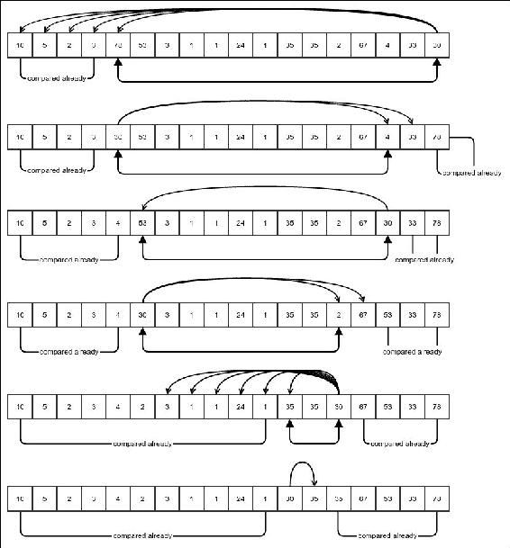

这是 quicksort 中枢轴定位的一个示例。指向箭头表示比较，双向箭头表示交换。

我们首先选择最后一个元素，并将其称为 *枢轴*。我们的目标是使所有小于枢轴的元素都位于其左侧，而所有大于枢轴的元素都位于其右侧。请注意，这意味着枢轴已经位于数组的正确位置。前面的图示展示了如何通过一个示例来完成这个过程。在图中，我们的枢轴是 **30**。我们开始与第一个元素进行比较，并继续进行。当我们找到逆序时，我们将枢轴与该元素交换，并保持相反方向的比较。我们继续这样做，每次发现逆序时都进行交换，并每次反转比较的方向。当我们比较完所有元素时停止。请注意，在此过程之后，所有小于枢轴的元素都位于其左侧，而所有大于枢轴的元素都位于其右侧。这是为什么？让我们更仔细地看看。

假设我们从左边开始比较。第一次交换后，枢轴位于找到的比它大的元素的位子上。它左边的所有元素都已经与枢轴比较过，并且发现它们都比枢轴小。前一个图显示了已经比较过的部分。现在它从其较早的位置开始向相反方向比较。第二次交换后，它坐在与它交换过的元素的位子上。它右边的所有元素都已经与它比较过，并且发现它们都比它大。我们继续以同样的方式进行，始终确保已经比较过的部分遵循以下规则：枢轴左边的部分只包含小于或等于它的元素，枢轴右边的部分只包含大于或等于它的元素。因此，当我们完成比较后，我们仍然保持这个条件，从而实现结果。一旦我们知道枢轴左边的所有元素都小于或等于其右边的所有元素，我们就可以分别对这些部分进行排序，从而整个数组将被排序。当然，我们以相同的方式递归地对这些部分进行排序。

然而，在我们深入代码之前，我想介绍一个不同的比较接口。它被称为`java.util.Comparator`，允许我们在排序时指定任何比较逻辑，从而提供更大的灵活性。以下是它的样子：

```java
@FunctionalInterface 
public interface Comparator<T> { 
     int compare(T o1, T o2); 
}
```

这当然是一个非常简化的实际接口版本，但它包含了我们所有关心的内容。正如你所见，这是一个函数式接口，因此可以使用 lambda 表达式实现。它应该返回与`o1.compareTo(o2)`返回的概念上相似但不同的值，但不同的排序可以使用不同的比较 lambda 表达式。比较方法必须遵循我们在上一章中研究的`java.util.Comparable`接口中`compareTo`方法相同的规则。

现在让我们进入快速排序的代码。我们知道，当要处理的数组为空时，我们不需要再进行排序，这将是我们的基本情况。否则，我们创建两个索引 `i` 和 `j`，一个存储左侧部分的当前末尾，另一个存储在任意给定时间点已经与枢轴比较过的右侧部分的当前开始，同时枢轴被放置在其正确的位置。这两个索引变量存储的是下一个要比较的索引。在任意给定时间点，这些变量中的一个持有枢轴的位置，另一个存储正在与之比较的当前值。当前存储枢轴位置的变量通过布尔变量 `movingI` 标记。如果它是真的，这意味着我们目前正在移动 `i`，因此 `j` 指向枢轴。我们更新位置变量并持续在循环中比较，直到两个索引都指向枢轴，当比较表明存在逆序时，我们交换并反转移动方向。我们反转移动方向是因为枢轴已经移动到由相反变量索引的位置，由 `movingI` 的值改变标记。否则，我们只是持续更新适当的位置变量。

当 `movingI` 为假时，这意味着 `i` 存储枢轴的位置。最后，当枢轴处于正确的位置，并且其左侧的所有元素都小于或等于其右侧的所有元素时，我们递归地对每个部分调用 **quicksort**：

```java
public static <E> void quicksort(E[] array, int start, int end,
Comparator<E> comparator) {

    if (end - start <= 0) {
        return;
    }

    int i = start;
    int j = end - 1;
    boolean movingI = true;

    while (i < j) {

    if (comparator.compare(array[i], array[j]) > 0) {
        swap(array, i, j);
        movingI = !movingI;
    } else {
        if (movingI) {
            i++;
        } else {
            j--;
            }
        }
    }

    quicksort(array, start, i, comparator);
    quicksort(array, i + 1, end, comparator);
}
```

我们可以将此方法包装起来，以避免需要传递起始和结束参数：

```java
public static <E> void quicksort(E[] array, Comparator<E> comparator){
    quicksort(array, 0, array.length, comparator);
}
```

我们可以使用此方法来排序一个数组。让我们看看如何对整数数组进行排序：

```java
Integer[] array =
new Integer[]{10, 5, 2, 3, 78, 53, 3, 1, 1, 24, 1, 35,
35, 2, 67, 4, 33, 30};

quicksort(array, (a, b) -> a - b);
System.out.println(Arrays.toString(array));
```

以下将是输出：

```java
[1, 1, 1, 2, 2, 3, 3, 4, 5, 10, 24, 30, 33, 35, 35, 53, 67, 78]
```

注意我们是如何使用 lambda 传递简单的比较器的。如果我们传递一个 lambda `(a,b)->b-a`，我们将得到一个反转的数组。实际上，这种灵活性让我们可以根据任何比较来对包含复杂对象的数组进行排序。例如，使用 lambda `(p1, p2)->p1.getAge() - p2.getAge()`，很容易根据年龄对 `Person` 对象的数组进行排序。

## 快速排序的复杂度

像往常一样，我们将尝试找出快速排序的最坏情况。首先，我们注意到枢轴被正确放置后，它不会位于数组的中间。实际上，它的最终位置取决于它与数组中其他元素相比的值。由于它总是按照其排名来定位，其排名决定了最终位置。我们还注意到，快速排序的最坏情况是枢轴根本不切割数组，也就是说，所有其他元素要么在它的左边，要么在它的右边。这将在枢轴是最大或最小元素时发生。这将在最高或最低元素位于数组末尾时发生。因此，例如，如果数组已经排序，则每个步骤中最大的元素都会位于数组的末尾，我们将选择这个元素作为枢轴。这给出了一个反直觉的结论，即已经排序的数组将是快速排序算法的最坏情况。按相反方向排序的数组也是最坏情况之一。

那么，如果发生最坏情况，其复杂度是多少呢？由于最坏情况是每一步都由两个递归调用组成，其中一个是对空数组的调用，因此需要常数时间来处理，另一个是少一个元素的数组。此外，在每一步中，枢轴都与每个其他元素进行比较，因此对于包含 *n* 个元素的步骤，所需时间与 *(n-1)* 成正比。因此，我们得到时间 `T(n)` 的递归方程如下：

```java
T(n) = T(n-1) + a(n-1) + b where a and b are some constants.
=> T(n) – T(n-1) = a(n-1) + b
```

由于这对于所有 `n` 的值都成立，我们有：

```java
T(n) – T(n-1) = a(n-1) + b
T(n-1) – T(n-2) = a(n-2) + b
T(n-2) – T(n-3) = a(n-3) + b
...
T(2) – T(1) = a(1) + b
```

将两边相加，我们得到以下结果：

```java
T(n) – T(1) = a (1+2+3+...+(n-1)) + (n-1)b
=> T(n) – T(1) = an(n-1)/2 + (n-1)b
=> T(n) = an(n-1)/2 + (n-1)b + T(1)
=> T(n) = O(n2)
```

这并不好。它仍然是 `O(n²)`。这真的是一个高效的算法吗？好吧，为了回答这个问题，我们需要考虑平均情况。平均情况是所有可能输入的复杂性的概率加权平均值。这相当复杂。因此，我们将使用我们可以称之为典型情况的东西，这有点像是通常情况的复杂度。那么，在一个典型的随机未排序数组中会发生什么呢？也就是说，输入数组被相当随机地排列？枢轴的排名将等可能地是 `1` 到 `n` 之间的任何值，其中 `n` 是数组的长度。因此，它通常会在中间附近分割数组。那么，如果我们成功将数组分成两半，其复杂度是多少呢？让我们来看看：

```java
T(n) = 2T((n-1)/2) + a(n-1) + b
```

这一点有点难以解决，所以我们取 `n/2` 而不是 `(n-1)/2`，这只会增加复杂度的估计。因此，我们有以下结果：

```java
T(n) = 2T(n/2) + a(n-1) + b
```

令 `m = lg n` 和 `S(m) = T(n)`，因此 `n = 2m`。所以我们有如下结果：

```java
S(m) = 2S(m-1) + a 2m + (b-a)
```

由于这对于所有 `m` 都成立，我们可以将相同的公式应用于 `S(m-1)`。因此，我们有以下结果：

```java
S(m) = 2(2S(m-2) + a 2m-1 + (b-a)) + a 2m + (b-a)
=> S(m) = 4 S(m-2) + a (2m + 2m) + (b-a)(2+1)
```

以类似的方式继续，我们得到如下结果：

```java
S(m) = 8 S(m-3) + a (2m + 2m  + 2m) + (b-a)(4+2+1)
…
S(m) = 2m S(0) + a (2m+ 2m  + 2m+ 2m) + (b-a)(2m-1+ 2m-2+ … + 2+1)
=>S(m) = 2m S(0) + a m . 2m+ (b-a) (2m – 1)
=> T(n) = nT(1) + a . (lg n) . n + (b-a) (n-1)
=> T(n) =  θ(n lg n)
```

这相当不错。事实上，这比我们在上一章中看到的二次复杂度要好得多。实际上，*n lg n*增长得非常慢，以至于对于任何大于*1*的`a`，*n lg n = O(na)*。这意味着函数*n1.000000001*增长速度比*n lg n*快。因此，我们找到了一个在大多数情况下表现相当好的算法。记住，快速排序的最坏情况仍然是*O(n²)*。我们将在下一小节中尝试解决这个问题。

## 快速排序中的随机枢轴选择

快速排序的问题在于，如果数组已经排序或反向排序，它的性能会非常糟糕。这是因为我们总是会选择数组的最大或最小元素作为枢轴。如果我们能避免这种情况，我们也可以避免最坏情况的时间复杂度。理想情况下，我们希望选择数组的所有元素的中位数作为枢轴，即在数组排序时的中间元素。但是，无法高效地计算中位数。一个技巧是在所有元素中随机选择一个元素并将其用作枢轴。因此，在每一步中，我们随机选择一个元素并将其与末尾元素交换。之后，我们可以像之前一样执行快速排序。因此，我们将快速排序方法更新如下：

```java
public static <E> void quicksort(E[] array, int start, int end,
Comparator<E> comparator) {
    if (end - start <= 0) {
        return;
    }
 int pivotIndex = (int)((end-start)*Math.random()) + start;
 swap(array, pivotIndex, end-1);
    //let's find the pivot.
    int i = start;
    int j = end - 1;
    boolean movingI = true;
    while (i < j) {
        if (comparator.compare(array[i], array[j]) > 0) {
            swap(array, i, j);
            movingI = !movingI;
        } else {
            if (movingI) {
                i++;
            } else {
                j--;
            }
        }
    }
    quicksort(array, start, i, comparator);
    quicksort(array, i + 1, end, comparator);
}
```

即使现在我们每次都非常不幸地选择末尾元素，但这非常不可能发生。在这种情况下，我们几乎总是能得到期望的*n lg n*复杂度。

# 归并排序

在上一节中，我们试图以这种方式分割数组，即当我们对每个部分进行排序时，整个数组也会被排序。我们遇到了一个问题，当我们尝试这样做时，两个部分的大小并不相等，导致算法有时需要二次时间复杂度。如果我们不尝试以排序部分来排序整个数组的方式分割数组，而是将数组分成两个大小相等的部分呢？当然，然后，排序部分不会排序整个数组。然而，如果我们有两个已各自排序的数组部分，我们能否将它们合并在一起以产生一个整体排序的数组？如果我们能足够高效地做到这一点，我们就会有一个保证高效的算法。实际上，这是可能的。但是，我们需要考虑合并数组将存储在哪里。由于值是从源数组复制的，结果需要存储在另一个地方。因此，我们需要为归并排序提供另一个大小相等的存储空间。

.

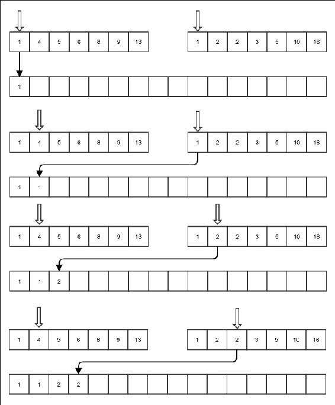

排序数组的合并

前面的图显示了合并操作的一部分。我们保持每个数组的当前位置。在每一步中，我们比较两个输入排序数组中当前位置的值。

我们将较小的那个复制到目标位置，并递增相应的当前位置。我们一直这样做，直到完成一个数组，之后另一个数组的元素可以直接复制过来。以下显示了归并操作的代码。需要注意的是，由于归并将用于归并排序，它假定输入数组是同一个数组，具有不同的索引，目标数组具有相同的大小。源数组有三个索引：`start`、`mid`和`end`。假设源部分在源数组中相邻。变量`start`指向第一部分的开始。整数`mid`存储第二部分开始的索引，也作为第一部分的结束，因为部分是连续的。最后，`end`变量存储第二数组的结束：

```java
private static <E> void merge(E[] array, int start, int mid, int end, E[] targetArray, Comparator<E> comparator) {
    int i = start;
    int j = mid;
    int k = start;
    while (k < end) {
```

前两个情况是当其中一个源数组耗尽时的情况：

```java
        if (i == mid) {
            targetArray[k] = array[j];
            j++;
        } else if (j == end) {
            targetArray[k] = array[i];
            i++;
        } 
```

如果没有任何数组耗尽，从正确的数组复制：

```java
        else if (comparator.compare(array[i], array[j]) > 0) {
            targetArray[k] = array[j];
            j++;
        } else {
            targetArray[k] = array[i];
            i++;
        }
```

最后，目标位置也必须递增：

```java
        k++;
    }
}
```

现在我们有了这个`merge`函数，我们可以继续进行归并排序。它包括以下步骤：

1.  将数组分成两等份。

1.  对部分进行归并排序。

1.  将排序好的部分合并成一个完整的排序数组。

当然，对于零个或一个元素的数组，我们不需要做任何事情。所以，那将是我们的退出情况：

```java
public static <E> void mergeSort(E[] sourceArray, int start,
int end, E[] tempArray, Comparator<E> comparator) {
```

对于零个或一个元素的数组，直接返回调用函数。这是我们的基本情况：

```java
    if (start >= end - 1) {
        return;
    }
```

对于任何大于`1`的数组，将其分成两半——从开始到中间和从中间到结束。然后分别对它们进行归并排序，然后将两个排序好的子数组合并到`tempArray`中，这是一个辅助空间，我们正在使用：

```java
    int mid = (start + end) / 2;
    mergeSort(sourceArray, start, mid, tempArray, comparator);
    mergeSort(sourceArray, mid, end, tempArray, comparator);
    merge(sourceArray, start, mid, end, tempArray, comparator);
```

最后，将`tempArray`的内容复制到`sourceArray`中，这样源数组现在就是排序好的：

```java
    System.arraycopy(tempArray, start, sourceArray, start,
        end - start);
}
```

## 归并排序的复杂度

让我们从归并操作的复杂度开始。归并操作不是递归的。在每一步中，它要么增加`i`，要么增加`j`。当这两个变量都达到各自数组的末尾时，归并结束。比较最多在每个增量发生一次。这意味着比较的次数最多与两个子数组中元素的总数相同。当然，将`tempArray`的内容复制到`sourceArray`的操作也与`tempArray`中的元素数量成比例，这与`sourceArray`中的元素数量相同。因此，每一步的操作数量与*n*成比例，除了递归调用。递归调用作用于数组的两部分，这两部分本身是整个数组大小的一半。因此，如果*T(n)*是所需时间，我们有以下结果：

```java
T(n) = 2T(n/2) + an + b
```

在这里，`a`和`b`是常数。

这与快速排序算法典型情况得到的方程式相同，我们知道这个解给出了*T(n) = θ(n lg n)*。这是对平均情况和最坏情况的估计，因为在两种情况下，数组都将始终被分成两个大小相等的部分，无论数组的内容如何。实际上，最坏的情况是所有的复制也需要比较，这正是我们考虑的情况。

在最佳情况下，其中一个数组在复制第二个数组的第一个元素之前就已经复制了所有元素，因此只需要一半的比较次数。但这种情况给出了相同的复杂度*T(n) = θ(n lg n)*。所以，无论我们开始时的数组实际内容如何，归并排序都将具有相同的渐进复杂度。

## 避免复制`tempArray`

在我们相当简单的例子中，我们首先将子数组合并到`tempArray`中，然后将其复制回`sourceArray`。能否避免复制？我们能否将`tempArray`本身用作合并的结果？结果是我们可以这样做。在这种情况下，`sourceArray`和`tempArray`将被相当对称地使用，唯一的区别是`sourceArray`持有原始输入数组。否则，它们是大小相同的预分配数组。然而，代码将变得稍微复杂一些。

让我们先考虑如果我们没有将`tempArray`的内容复制到`sourceArray`，而是试图直接使用`tempArray`作为排序数组的内容会发生什么。然后，在每一步中，`sourceArray`和`tempArray`都需要进行交换，也就是说`tempArray`会变成`sourceArray`，反之亦然。由于在每一步中，`tempArray`和`sourceArray`都在进行交换，所以实际持有结果的数组取决于排序数组所需的步数是奇数还是偶数。

现在，如果开始时的数组元素数量等于 2 的精确整数次幂，源数组可以始终被分成两个大小完全相同的子数组。这意味着，排序每个子数组所需的步数将完全相同。这意味着在排序任一子数组后，实际持有排序结果的数组将是相同的。然而，在现实中，数组中的元素数量大多数情况下不是 2 的精确整数次幂，因此，一个子数组会比另一个稍微大一点。这导致排序任一子数组所需的步数不同，它们可能会将结果排序数组存储在不同的数组中。我们必须考虑这些情况。所以，当排序任一子数组的结果存储在同一个数组中时，我们将合并的输出存储在另一个数组中。如果不是，我们总是将合并的输出存储在持有数组第二部分排序结果的那个数组中。

首先，我们将`merge`函数修改为处理包含两个不同输入内容的两个不同数组：

```java
    private static <E> void merge(E[] arrayL, E[] arrayR, 
    int start, int mid, int end, E[] targetArray, 
    Comparator<E> comparator) { 
        int i = start; 
        int j = mid; 
        int k = start; 
        while (k < end) { 
            if (i == mid) { 
                targetArray[k] = arrayR[j]; 
                j++; 
            } else if (j == end) { 
                targetArray[k] = arrayL[i]; 
                i++; 
            } else if (comparator.compare(arrayL[i], arrayR[j]) > 0) { 
                targetArray[k] = arrayR[j]; 
                j++; 
            } else { 
                targetArray[k] = arrayL[i]; 
                i++; 
            } 
            k++; 
        } 
}
```

有了这个`merge`函数可用后，我们以以下方式编写我们的高效归并排序。注意，我们需要某种方式来通知调用函数哪个预分配的数组包含结果，因此我们返回那个数组：

```java
public static <E> E[] mergeSortNoCopy(E[] sourceArray, int start,
int end, E[] tempArray, Comparator<E> comparator) {
    if (start >= end - 1) {
        return sourceArray;
    }
```

首先，像往常一样分割并归并排序子数组：

```java
    int mid = (start + end) / 2;
    E[] sortedPart1 =
    mergeSortNoCopy(sourceArray, start, mid, tempArray,
                    comparator);
    E[] sortedPart2 =
    mergeSortNoCopy(sourceArray, mid, end, tempArray,
                    comparator);
```

如果两个排序后的子数组都存储在同一个预分配的数组中，则使用另一个预分配的数组来存储归并的结果：

```java
    if (sortedPart2 == sortedPart1) {
        if (sortedPart1 == sourceArray) {
            merge(sortedPart1, sortedPart2, start, mid, end,
                  tempArray, comparator);
            return tempArray;
        } else {
            merge(sortedPart1, sortedPart2, start, mid, end,
            sourceArray, comparator);
            return sourceArray;
        }
    } else {
```

在这种情况下，我们将结果存储在`sortedPart2`中，因为它有第一部分是空的：

```java
        merge(sortedPart1, sortedPart2, start, mid, end,
              sortedPart2, comparator);
        return sortedPart2;
    }
}
```

现在我们可以这样使用这个归并排序：

```java
Integer[] anotherArray = new Integer[array.length];
array = mergeSortNoCopy(array, 0, array.length, anotherArray,
(a, b)->a-b);
System.out.println(Arrays.toString(array));
```

这里是输出：

```java
[1, 1, 1, 2, 2, 3, 3, 4, 5, 10, 24, 30, 33, 35, 35, 53, 67, 78]
```

注意这次，我们必须确保我们使用方法返回的输出，因为在某些情况下，`anotherArray`可能包含最终的排序值。归并排序的高效无复制版本并没有任何渐近性能提升，但它通过常数提高了时间。这是值得做的事情。

# 任何基于比较的排序的复杂度

现在我们已经看到了两种比上一章描述的算法更高效的排序算法，我们如何知道它们是排序可能达到的最高效率呢？我们能否创造出更快算法？在本节中，我们将看到我们已经达到了效率的渐近极限，也就是说，基于比较的排序将具有最小的时间复杂度为*θ(m lg m)*，其中*m*是元素的数量。

假设我们从一个包含 *m* 个元素的数组开始。暂时，让我们假设它们都是不同的。毕竟，如果这样的数组是可能的输入，我们需要考虑这种情况。这些元素可能的不同排列数量是 *m!*。其中一种排列是正确的排序。任何使用比较来排序这个数组的算法都必须能够仅通过元素对之间的比较来区分这个特定的排列和其他所有排列。任何比较都将排列分为两组——一组在比较这两个确切值时会导致反转，另一组则不会。这意味着，给定数组中的任何两个值 *a* 和 *b*，返回 *a<b* 的比较将排列集分为两个部分；第一组将包含所有 *b* 在 *a* 之前的所有排列，而第二组将包含所有 *a* 在 *b* 之前的所有排列。排序排列当然是第二组的一个成员。任何基于比较的排序算法都必须进行足够的比较，以确定单个正确的排列，即排序排列。基本上，它将首先执行一个比较，选择正确的子集，然后执行另一个比较并选择子集的正确子集，依此类推，直到它达到只包含一个排列的排列集。这个特定的排列是数组的排序版本。找到 *m!* 个排列中的特定排列所需的最小比较次数是多少？这等同于询问你需要将 *m!* 个元素的集合减半多少次才能达到只包含一个元素的集合。当然，是 *lg (m!)*。这是一个粗略估计；实际上，所需的比较次数会略多于这个数字，因为每个比较创建的两个子集可能大小不等。但我们知道，所需的比较次数至少是 *lg (m!)*。

现在，*lg m!* 是多少呢？嗯，它是 *(ln (m!)) (lg e)*，其中 *ln (x)* 是 *x* 的自然对数。我们将找到函数 *ln(m!)* 的一个更简单的渐近复杂度。这需要一点微积分知识。

让我们看看以下图：

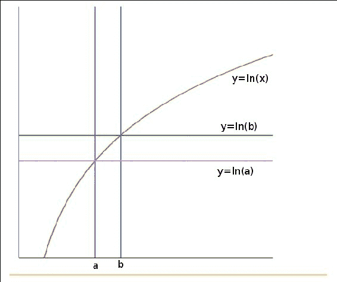

曲线 y = ln x 下的面积。

该图显示了某些图表。我们知道积分衡量的是函数曲线下的面积。现在，曲线 *y=ln b* 在 *a* 和 *b* 之间的面积是 *(b-a)ln b*，而曲线 *y=ln a* 下的面积是 *(b-a) ln a*。在相同区间内，曲线 *y=lg x* 下的面积如下：

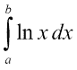

从前一个图中的图形，以下内容是清晰的：

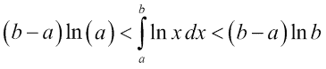

特别是，当 *b=a+1* 时，我们得到以下结果：

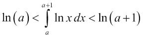

因此，我们设 *a = 1* 并逐步增加到 *a = m-1*，得到以下一系列不等式：

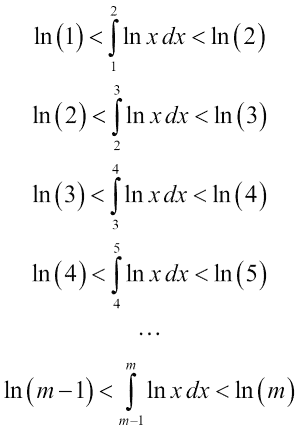

将相应的两边相加，我们得到以下结果：

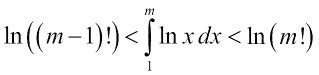

现在，当然我们知道以下内容：

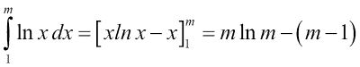

因此，我们得到以下不等式：

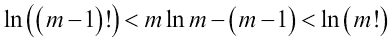

在左边的不等式中，如果我们用 m 代替 *m-1*，我们将得到以下结果：

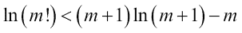

这与右边的不等式相结合，给出了以下关系：

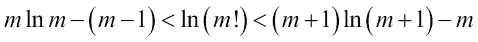

这给出了对 *ln(m!)* 值的一个很好的上界和下界。上界和下界都是 *θ(m ln m)*。因此，我们可以得出结论，*ln(m!) = θ(m ln m)*。这意味着 *lg(m!) = (ln (m!))(lg e)* 也是 *θ(m ln m) = θ(m lg m)*，因为 *lg(m) = (ln m )(lg e)*。

因此，基于比较的排序算法的最小时间复杂度至少必须是 *θ(m lg m)*，仅仅是因为完成这个任务所需的比较的最小数量。因此，归并排序和快速排序的典型情况在渐近上是最佳的。

# 排序算法的稳定性

排序算法的稳定性是指比较相等的元素在排序后保持其原始顺序的性质。例如，如果我们有一个包含某些人的 ID 号和年龄的对象数组，并且我们想要按年龄递增的顺序对它们进行排序，一个稳定的排序算法将保持具有相同年龄的人的原始顺序。如果我们尝试多次排序，这可能会很有帮助。例如，如果我们想将具有相同年龄的人的 ID 按递增顺序排列，我们首先可以按 ID 对数组进行排序，然后再次按年龄排序。如果排序算法是稳定的，它将确保最终排序数组按年龄递增，对于相同年龄，则是按 ID 递增。当然，这种效果也可以通过在单个排序操作中进行更复杂的比较来实现。快速排序不是稳定的，但归并排序是。很容易看出为什么归并排序是稳定的。在合并过程中，我们保持顺序，即当它们比较相等时，左半部分的值先于右半部分的值。

# 摘要

在本章中，我们探讨了两种高效的排序算法。在两种情况下，基本原理都是将数组分割，并分别对部分进行排序。如果我们确保对部分进行排序会导致通过重新调整元素使整个数组排序，那么这就是快速排序。如果我们首先将数组分成两个相等的部分，然后对每个部分进行排序，最后合并结果以使整个数组排序，那么这就是归并排序。这种将输入分割成更小部分，对较小部分解决问题，然后合并结果以找到整个问题的解决方案的方法是解决计算问题中的一种常见模式，称为分而治之模式。

我们也看到了任何使用比较进行排序的排序算法的渐近下界。快速排序和归并排序都达到了这个下界，因此它们在渐近意义上是最佳的。在下一章中，我们将转向另一种称为树的数据结构。
