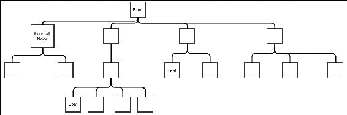
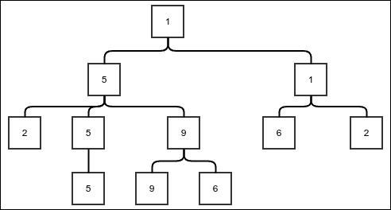
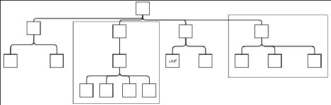
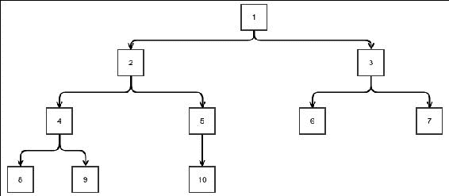

# 第七章 树的概念

我们已经看到了像链表和数组这样的数据结构。它们以线性方式表示存储的数据。在本章中，我们将讨论一种新的数据结构，称为树。树是链表的泛化。虽然链表节点有一个指向下一个节点的引用，但树节点有指向可能超过一个下一个节点的引用。这些下一个节点被称为节点的子节点，持有子节点引用的节点称为父节点。在本章中，我们将探讨以下主题：

+   树作为数据结构的概念

+   树作为 ADT 的概念

+   二叉树

+   不同的树遍历方式

+   树搜索算法

所以，让我们立即开始吧。

# 树数据结构

树数据结构看起来非常像一棵真正的树，就像你在花园或路边看到的那种。如果我们观察一棵树，我们会看到它有一个根，使茎从地面外露出来。茎分成树枝，在树枝的末端，我们找到叶子。在我们的树数据结构中，我们从根开始。根是没有父节点的节点。子节点可以想象成通过线连接到茎上，就像真实树上的树枝一样。最后，我们找到一些没有子节点的节点，因此被称为叶子。以下图显示了树的示例：



一个示例树

注意，树是倒置的。根在顶部，叶子在下面。这只是大多数人喜欢的一种惯例。把这想象成树在水中的倒影。

树可以用多种方式表示，但我们将从**链表**的泛化概念开始。在链表的情况下，一个节点存储一个指向下一个节点的单一引用。在树中，一个节点需要存储所有子节点的引用。多个子节点可以存储在数组中，但由于我们有对`LinkedList`类的访问，我们将使用它。我们将使用我们非功能的链表版本，因为我们的第一个树将是非功能的，并允许修改。

我们从以下类开始：

```java
public class Tree<E> {
    public static class Node<E>{
        private E value;
        private LinkedList<Node<E>> children;
        private Tree<E> hostTree;
        private Node<E> parent;

        public LinkedList<Node<E>> getChildren() {
            return children;
        }

        public E getValue() {
            return value;
        }

        private Node(LinkedList<Node<E>> children, Tree<E> hostTree, 
        E value, Node<E> parent) {
            this.children = children;
            this.hostTree = hostTree;
            this.value = value;
            this.parent = parent;
        }
    }

...
}
```

我们将我们的`Node`类定义为内部类。除了记住它内部存储的值和子节点列表外，它还存储其父节点以及它是其成员的树。一旦我们创建了一个树的实例，我们必须能够将一个节点存储在其中。没有父节点的节点被称为树的根。因此，我们添加了一个`addRoot`方法来向树中添加一个根。树本身只需要存储根节点的引用，因为所有其他节点都可以通过遍历引用从这个节点访问：

```java
    private Node<E> root;

    public void addRoot(E value){
        if(root == null){
            root = new Node<>(new LinkedList<>(), this, value, null );
        }else{
            throw new IllegalStateException(
                "Trying to add new node to a non empty tree");
        }
    }
```

注意，我们测试树是否已经有一个根节点，如果有，则抛出异常。

好的，现在我们已经有了添加根节点的方法，我们需要有一个方法来添加我们想要的节点。这个方法接受一个父节点和一个值以添加一个新节点。这个方法将返回新添加的节点，这样我们就可以继续添加更多节点作为其子节点：

```java
    public Node<E> addNode(Node<E> parent, E value){
        if(parent==null){
            throw new NullPointerException("Cannot add child to null parent");
        }else if(parent.hostTree != this){
            throw new IllegalArgumentException(
                "Parent node not a part of this tree");
        }else{
            Node<E> newNode = new Node<>(new LinkedList<>(), this, value, parent);
            parent.getChildren().appendLast(newNode);
            return newNode;
        }
    }
```

在前面的代码中，我们首先检查父节点是否为 null，或者父节点是否是不同树实例的节点。在任何情况下，都必须抛出异常。否则，我们只需将新节点添加为作为参数传递的父节点的子节点。

但等等！如果我们没有在调用代码中获取根节点的引用，我们如何传递父节点呢？因此，我们添加了一个名为`getRoot`的方法来访问树的根节点：

```java
    public Node<E> getRoot() {
        return root;
    }
```

好的，现在让我们创建一个`Tree`实例：

```java
    public static void main(String [] args){
        Tree<Integer> tree = new Tree<>();
        tree.addRoot(1);
        Node<Integer> node1 = tree.getRoot();
        Node<Integer> node2 = tree.addNode(node1, 5);
        Node<Integer> node3 = tree.addNode(node1, 1);
        Node<Integer> node4 = tree.addNode(node2, 2);
        Node<Integer> node5 = tree.addNode(node2, 5);
        Node<Integer> node6 = tree.addNode(node2, 9);
        Node<Integer> node7 = tree.addNode(node3, 6);
        Node<Integer> node8 = tree.addNode(node3, 2);
        Node<Integer> node9 = tree.addNode(node5, 5);
        Node<Integer> node10 = tree.addNode(node6, 9);
        Node<Integer> node11 = tree.addNode(node6, 6);
    }
```

代码是自我解释的。我们只是通过逐个添加节点来创建树。但我们如何看到树的样子呢？为此，我们将学习树的遍历。前面的代码将创建以下图中所示的树：



示例树

## 树的遍历

树遍历是一种算法，用于恰好访问或处理树的所有节点一次。这显然涉及到递归地查看节点的子节点。子节点处理的顺序取决于我们使用的特定算法。遍历树的简单算法是深度优先遍历。

### 深度优先遍历

在深度优先遍历中，我们递归地处理一个节点的每个子节点，并在继续处理下一个子节点之前等待它及其所有后代的完成。为了理解深度优先搜索，我们必须理解什么是子树。子树是一个节点及其所有后代的集合，直到叶子节点。以下图显示了子树的一些示例。



子树示例

现在，如果你仔细想想，每个节点不仅存储了对子节点的引用，而且似乎还持有对以子节点为根的整个子树的引用。因此，深度优先遍历算法实际上就是以下步骤：

1.  处理当前节点中的值。

1.  对于当前节点的每个子节点，递归遍历以子节点为根的整个子树。

以下方法正是这样做的：

```java
protected void traverseDepthFirst(OneArgumentStatement<E> processor, Node<E> current){
    processor.doSomething(current.value);
    current.children.forEach((n)-> traverseDepthFirst(processor, n));
}
```

这个方法接受一个 lambda 表达式和一个节点以进行遍历。这个方法所做的只是首先在当前值上运行 lambda 表达式，然后递归地对其每个子树调用自身。现在，我们可以编写一个不带父节点参数的包装方法：

```java
public void traverseDepthFirst(OneArgumentStatement<E> processor){
    traverseDepthFirst(processor, getRoot());
}
```

尽管如此，这种遍历方式为什么被称为深度优先遍历仍然不清楚。如果你考虑节点处理的顺序，你可以看到，由于任何子节点的完整子树必须在处理下一个子节点之前完全处理，因此树的深度将在宽度之前被覆盖。

我们已经使用递归函数来进行深度优先搜索。或者，我们也可以使用栈来完成这个任务：

```java
public void traverseDepthFirstUsingStack(
    OneArgumentStatement<E> processor){

    Stack<Node<E>> stack = new StackImplLinkedList<>();
    stack.push(getRoot());
    while(stack.peek()!=null){
        Node<E> current = stack.pop();
        processor.doSomething(current.value);
        current.children.forEach((n)->stack.push(n));
    }
}
```

让我们看看前面那段代码中发生了什么。我们首先将根节点推入栈，然后进入一个循环，直到栈中的所有元素都被清除。每次弹出节点时，我们处理它并将所有子节点推入栈。现在，由于栈是后进先出（LIFO），所有这些子节点都会被弹出并处理，在处理任何其他节点之前。然而，当第一个子节点被弹出时，其子节点将被推入栈，并且会在处理其他任何内容之前被处理。这将一直持续到我们到达叶节点，这些叶节点将没有更多的子节点。实际上，这几乎与递归版本相同。

此代码的输出与递归版本之间略有不同，尽管两者实际上都是深度优先。然而，请注意，在递归版本的情况下，靠近链表头部的子节点首先被处理。在栈版本的情况下，我们以相同的顺序压入子节点，但由于栈是后进先出（LIFO），我们以相反的顺序弹出子节点。为了反转这个顺序，我们可以在将子节点推入栈之前，将子节点的列表以相反的顺序存储在一个临时列表中，如下面的代码所示：

```java
public void traverseDepthFirstUsingStack(
    OneArgumentStatement<E> processor){

    Stack<Node<E>> stack = new StackImplLinkedList<>();
    stack.push(getRoot());
    while(stack.peek()!=null){
        Node<E> current = stack.pop();
        processor.doSomething(current.value);
 LinkedList<Node<E>> reverseList = new LinkedList<>();
 current.children.forEach((n)->reverseList.appendFirst(n));
 reverseList.forEach((n)->stack.push(n));
    }
}
```

通过将元素追加到其开头，我们通过一个名为`reverseList`的临时列表来反转列表。然后，元素从`reverseList`中推入栈。

### 广度优先遍历

广度优先遍历与深度优先遍历相反，其含义是深度优先遍历先处理子节点再处理兄弟节点，而广度优先遍历则先处理同一层的节点再处理下一层的节点。换句话说，在广度优先遍历中，节点是按层处理的。这可以通过将深度优先遍历的栈版本中的栈替换为队列来实现。这就是它所需要的全部：

```java
public void traverseBreadthFirst(OneArgumentStatement<E> processor){
    Queue<Node<E>> queue = new QueueImplLinkedList<>();
    queue.enqueue(getRoot());
    while(queue.peek()!=null){
        Node<E> current = queue.dequeue();
        processor.doSomething(current.value);
        current.children.forEach((n)->queue.enqueue(n));
    }
}
```

注意，其他所有内容都与深度优先遍历完全相同。我们仍然从队列中取出一个元素，处理其值，然后将其子节点入队。

要理解为什么使用队列可以让我们按层处理节点，我们需要以下分析：

+   根节点最初被压入，因此根节点首先出队并处理。

+   当根节点被处理时，根节点的子节点，即第 1 层的节点，被入队。这意味着第 1 层的节点会在任何其他层的节点之前出队。

+   当从第 1 级中下一个节点出队时，其子节点，即第 2 级的节点，都将被入队。然而，由于第 1 级中的所有节点在之前步骤中都已入队，因此第 2 级的节点在未从第 1 级节点出队之前不会出队。当第 1 级的所有节点都出队并处理完毕后，所有第 2 级节点都会被入队，因为它们都是第 1 级节点的子节点。

+   这意味着所有第 2 级节点都会在处理任何更高级别的节点之前出队并处理。当所有第 2 级节点都已处理完毕后，所有第 3 级节点都会被入队。

+   以类似的方式，在所有后续级别中，特定级别的所有节点都会在处理下一级别的所有节点之前被处理。换句话说，节点将按级别处理。

# 树的抽象数据类型

现在我们对树有了些了解，我们可以定义树的 ADT。树的 ADT 可以以多种方式定义。我们将检查两种。在命令式设置中，即当树是可变的时，我们可以将树 ADT 定义为具有以下操作：

+   获取根节点

+   给定一个节点，获取其子节点

这就是创建树模型所需的所有内容。我们还可以包括一些适当的变异方法。

树的 ADT 的递归定义可以如下所示：

+   树是一个包含以下内容的有序对：

    +   一个值

    +   其他树的一个列表，这些树是它的子树

我们可以以与在函数式树 ADT 中定义的完全相同的方式开发树实现：

```java
public class FunctionalTree<E> {
    private E value;
    private LinkedList<FunctionalTree<E>> children;
```

如 ADT 定义，树是一个值和另一个树列表的有序对，如下所示：

```java
    public FunctionalTree(E value, LinkedList<FunctionalTree<E>> children) {
        this.children = children;
        this.value = value;
    }

    public  LinkedList<FunctionalTree<E>> getChildren() {
        return children;
    }

    public E getValue() {
        return value;
    }

    public void traverseDepthFirst(OneArgumentStatement<E> processor){
        processor.doSomething(value);
        children.forEach((n)-> n.traverseDepthFirst(processor));
    }

}
```

实现相当简单。可以通过对子节点的递归调用来实现深度优先遍历，这些子节点实际上是子树。没有子节点的树需要有一个空的子节点列表。有了这个，我们可以创建与命令式版本相同的相同树的函数式版本：

```java
public static void main(String [] args){
    LinkedList<FunctionalTree<Integer>> emptyList = LinkedList.emptyList();

    FunctionalTree<Integer> t1 = new FunctionalTree<>(5, emptyList);
    FunctionalTree<Integer> t2 = new FunctionalTree<>(9, emptyList);
    FunctionalTree<Integer> t3 = new FunctionalTree<>(6, emptyList);

    FunctionalTree<Integer> t4 = new FunctionalTree<>(2, emptyList);
    FunctionalTree<Integer> t5 = new FunctionalTree<>(5, emptyList.add(t1));
    FunctionalTree<Integer> t6 = new FunctionalTree<>(9, 
         emptyList.add(t3).add(t2));
    FunctionalTree<Integer> t7 = new FunctionalTree<>(6, emptyList);
    FunctionalTree<Integer> t8 = new FunctionalTree<>(2, emptyList);

    FunctionalTree<Integer> t9 = new FunctionalTree<>(5,
         emptyList.add(t6).add(t5).add(t4));
    FunctionalTree<Integer> t10 = new FunctionalTree<>(1,
         emptyList.add(t8).add(t7));

    FunctionalTree<Integer> tree = new FunctionalTree<>(1,
         emptyList.add(t10).add(t9));
```

最后，我们可以进行深度优先遍历来查看它是否输出与之前相同的树：

```java
    tree.traverseDepthFirst(System.out::print);
}
```

# 二叉树

二叉树是一种每个节点最多有两个子节点的树。这两个子节点可以称为节点的左子节点和右子节点。以下图显示了二叉树的一个示例：



示例二叉树

这个特定的树之所以重要，主要是因为它的简单性。我们可以通过继承通用树类来创建一个`BinaryTree`类。然而，阻止某人添加超过两个节点将非常困难，并且仅为了执行检查就需要大量的代码。因此，我们将从头开始创建一个`BinaryTree`类：

```java
public class BinaryTree<E>  {
```

`Node`的实现与通用树非常明显：

```java
    public static class Node<E>{
        private E value;
        private Node<E> left;
        private Node<E> right;
        private Node<E> parent;
        private BinaryTree<E> containerTree;

        protected Node(Node<E> parent,
        BinaryTree<E> containerTree, E value) {
            this.value = value;
            this.parent = parent;
            this.containerTree = containerTree;
        }

        public E getValue(){
            return value;
        }
    }
```

添加根节点与通用树相同，只是我们不检查根的存在。这只是为了节省空间；您可以按需实现：

```java
    private Node<E> root;

    public void addRoot(E value){
        root = new Node<>(null, this,  value);
    }

    public Node<E> getRoot(){
        return root;
    }
```

以下方法让我们添加一个子节点。它接受一个布尔参数，当要添加的子节点是左子节点时为`true`，否则为`false`：

```java
    public Node<E> addChild(Node<E> parent, E value, boolean left){
        if(parent == null){
            throw new NullPointerException("Cannot add node to null parent");
        }else if(parent.containerTree != this){
            throw new IllegalArgumentException
                   ("Parent does not belong to this tree");
        }else {
            Node<E> child = new Node<E>(parent, this, value);
            if(left){
                parent.left = child;
            }else{
                parent.right = child;
            }
            return child;
        }
    }
```

我们现在创建了两个包装方法，专门用于添加左子节点或右子节点：

```java
    public Node<E> addChildLeft(Node<E> parent, E value){
        return addChild(parent, value, true);
    }

    public Node<E> addChildRight(Node<E> parent, E value){
        return addChild(parent, value, false);
    }

}
```

当然，通用树的遍历算法也适用于这个特殊情况。然而，对于二叉树，深度优先遍历可以是三种不同类型之一。

## 深度优先遍历的类型

根据父节点相对于子树处理的时间，二叉树的深度优先遍历可以分为三种类型。顺序可以总结如下：

+   先序遍历：

    1.  处理父节点。

    1.  处理左子树。

    1.  处理右子树。

+   中序遍历：

    1.  处理左子树。

    1.  处理父节点。

    1.  处理右子树。

+   后序遍历：

    1.  处理左子树。

    1.  处理右子树。

    1.  处理父节点。

这些不同的遍历类型在遍历时会产生略微不同的顺序：

```java
public static enum DepthFirstTraversalType{
    PREORDER, INORDER, POSTORDER
}

public void traverseDepthFirst(OneArgumentStatement<E> processor,
                      Node<E> current, DepthFirstTraversalType tOrder){
    if(current==null){
        return;
    }
    if(tOrder == DepthFirstTraversalType.PREORDER){
        processor.doSomething(current.value);
    }
    traverseDepthFirst(processor, current.left, tOrder);
    if(tOrder == DepthFirstTraversalType.INORDER){
        processor.doSomething(current.value);
    }
    traverseDepthFirst(processor, current.right, tOrder);
    if(tOrder == DepthFirstTraversalType.POSTORDER){
        processor.doSomething(current.value);
    }
}
```

我们创建了一个`enum` `DepthFirstTraversalType`，将其传递给`traverseDepthFirst`方法。我们根据其值处理当前节点。请注意，唯一改变的是调用处理器处理节点的时间。让我们创建一个二叉树，看看在每种排序情况下结果有何不同：

```java
public static void main(String [] args){
    BinaryTree<Integer> tree = new BinaryTree<>();
    tree.addRoot(1);
    Node<Integer> n1 = tree.getRoot();
    Node<Integer> n2 = tree.addChild(n1, 2, true);
    Node<Integer> n3 = tree.addChild(n1, 3, false);
    Node<Integer> n4 = tree.addChild(n2, 4, true);
    Node<Integer> n5 = tree.addChild(n2, 5, false);
    Node<Integer> n6 = tree.addChild(n3, 6, true);
    Node<Integer> n7 = tree.addChild(n3, 7, false);
    Node<Integer> n8 = tree.addChild(n4, 8, true);
    Node<Integer> n9 = tree.addChild(n4, 9, false);
    Node<Integer> n10 = tree.addChild(n5, 10, true);

    tree.traverseDepthFirst(System.out::print, tree.getRoot(),
     DepthFirstTraversalType.PREORDER);
    System.out.println();

    tree.traverseDepthFirst(System.out::print, tree.getRoot(),
     DepthFirstTraversalType.INORDER);
    System.out.println();

    tree.traverseDepthFirst(System.out::print, tree.getRoot(),
     DepthFirstTraversalType.POSTORDER);
    System.out.println();
} 
```

我们创建了与之前图示相同的二叉树。以下是程序的输出。尝试关联位置是如何受到影响：

```java
1 2 4 8 9 5 10 3 6 7
8 4 9 2 10 5 1 6 3 7
8 9 4 10 5 2 6 7 3 1
```

在匹配程序输出时，你可以注意以下要点：

+   在先序遍历的情况下，从根到任何叶子的任何路径中，父节点总是会先于任何子节点被打印。

+   在中序遍历的情况下，如果我们观察从根到特定叶子的任何路径，每当我们从父节点移动到左子节点时，父节点的处理会被推迟。但每当我们从父节点移动到右子节点时，父节点会立即被处理。

+   在后序遍历的情况下，所有子节点都会在处理任何父节点之前被处理。

## 非递归深度优先搜索

我们之前看到的通用树的深度优先搜索是先序的，因为父节点是在处理任何子节点之前被处理的。因此，我们可以使用相同的实现来处理二叉树的先序遍历：

```java
public void traversePreOrderNonRecursive(
    OneArgumentStatement<E> processor) {
    Stack<Node<E>> stack = new StackImplLinkedList<>();
    stack.push(getRoot());
    while (stack.peek()!=null){
        Node<E> current = stack.pop();
        processor.doSomething(current.value);
        if(current.right!=null)
            stack.push(current.right);
        if(current.left!=null)
            stack.push(current.left);
    }
}
```

### 注意

我们必须检查子节点是否为空。这是因为子节点的缺失用空引用表示，而不是像通用树那样用空列表表示。

中序和后序遍历的实现有点复杂。即使在子节点被展开并推入栈中时，我们也需要暂停对父节点的处理。我们可以通过将每个节点推入两次来实现这一点。第一次，我们在由于父节点被展开而首次发现该节点时将其推入，下一次是在其自己的子节点被展开时。因此，我们必须记住这些推入中哪一个导致节点在弹出时位于栈中。这是通过使用一个额外的标志来实现的，然后将其封装在一个名为`StackFrame`的类中。中序算法如下：

```java
public void traverseInOrderNonRecursive(
  OneArgumentStatement<E> processor) {
    class StackFame{
        Node<E> node;
        boolean childrenPushed = false;

        public StackFame(Node<E> node, boolean childrenPushed) {
            this.node = node;
            this.childrenPushed = childrenPushed;
        }
    }
    Stack<StackFame> stack = new StackImplLinkedList<>();
    stack.push(new StackFame(getRoot(), false));
    while (stack.peek()!=null){
       StackFame current = stack.pop();
        if(current.childrenPushed){
            processor.doSomething(current.node.value);
        }else{
            if(current.node.right!=null)
                stack.push(new StackFame(current.node.right, false));
            stack.push(new StackFame(current.node, true));
            if(current.node.left!=null)
                stack.push(new StackFame(current.node.left, false));
        }
    }
}
```

注意，栈是后进先出（LIFO），所以需要稍后弹出的元素必须先被推入。后序版本极其相似：

```java
public void traversePostOrderNonRecursive(OneArgumentStatement<E> processor) {
    class StackFame{
        Node<E> node;
        boolean childrenPushed = false;

        public StackFame(Node<E> node, boolean childrenPushed) {
            this.node = node;
            this.childrenPushed = childrenPushed;
        }
    }
    Stack<StackFame> stack = new StackImplLinkedList<>();
    stack.push(new StackFame(getRoot(), false));
    while (stack.peek()!=null){
        StackFame current = stack.pop();
        if(current.childrenPushed){
            processor.doSomething(current.node.value);
        }else{
 stack.push(new StackFame(current.node, true));
 if(current.node.right!=null)
 stack.push(new StackFame(current.node.right, false));

            if(current.node.left!=null)
                stack.push(new StackFame(current.node.left, false));
            }
    }
}
```

注意，唯一改变的是子节点和父节点的推送顺序。现在我们编写以下代码来测试这些方法：

```java
public static void main(String [] args){
    BinaryTree<Integer> tree = new BinaryTree<>();
    tree.addRoot(1);
    Node<Integer> n1 = tree.getRoot();
    Node<Integer> n2 = tree.addChild(n1, 2, true);
    Node<Integer> n3 = tree.addChild(n1, 3, false);
    Node<Integer> n4 = tree.addChild(n2, 4, true);
    Node<Integer> n5 = tree.addChild(n2, 5, false);
    Node<Integer> n6 = tree.addChild(n3, 6, true);
    Node<Integer> n7 = tree.addChild(n3, 7, false);
    Node<Integer> n8 = tree.addChild(n4, 8, true);
    Node<Integer> n9 = tree.addChild(n4, 9, false);
    Node<Integer> n10 = tree.addChild(n5, 10, true);

    tree.traverseDepthFirst((x)->System.out.print(""+x), tree.getRoot(), DepthFirstTraversalType.PREORDER);
    System.out.println();
    tree.traverseDepthFirst((x)->System.out.print(""+x), tree.getRoot(), DepthFirstTraversalType.INORDER);
    System.out.println();
    tree.traverseDepthFirst((x)->System.out.print(""+x), tree.getRoot(), DepthFirstTraversalType.POSTORDER);
    System.out.println();

    System.out.println();
 tree.traversePreOrderNonRecursive((x)->System.out.print(""+x));
 System.out.println();
 tree.traverseInOrderNonRecursive((x)->System.out.print(""+x));
 System.out.println();
 tree.traversePostOrderNonRecursive((x)->System.out.print(""+x));
 System.out.println();

}
```

我们也保留了递归版本，以便我们可以比较输出，如下所示：

```java
1 2 4 8 9 5 10 3 6 7
8 4 9 2 10 5 1 6 3 7
8 9 4 10 5 2 6 7 3 1

1 2 4 8 9 5 10 3 6 7
8 4 9 2 10 5 1 6 3 7
8 9 4 10 5 2 6 7 3 1
```

前三行与最后三行相同，表明它们产生相同的结果。

# 摘要

在本章中，你学习了什么是树。我们从实际实现开始，然后从中设计了一个 ADT。你还了解到了二叉树，它就是一个每个节点最多有两个子节点的树。我们还看到了针对通用树的不同的遍历算法。它们是深度优先遍历和广度优先遍历。在二叉树的情况下，深度优先遍历可以以三种不同的方式进行：前序、中序和后序。即使在通用树的情况下，我们也可以找到深度优先遍历的前序和后序遍历的等价形式。然而，指出中序遍历的任何特定等价形式是困难的，因为可能存在超过两个子节点的情况。

在下一章中，我们将看到二叉树在搜索中的应用，同时也会介绍一些其他的搜索方法。
