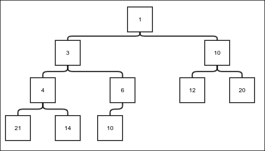
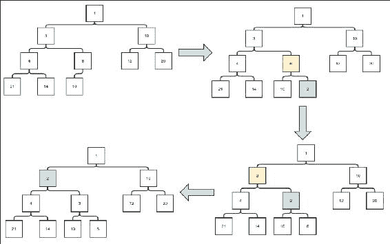
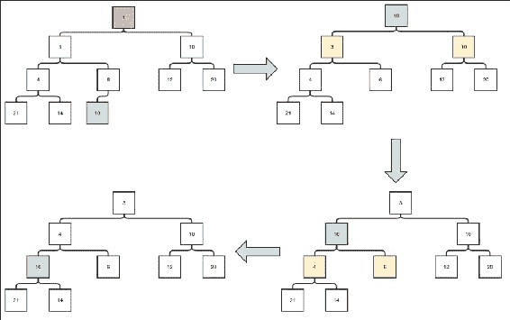
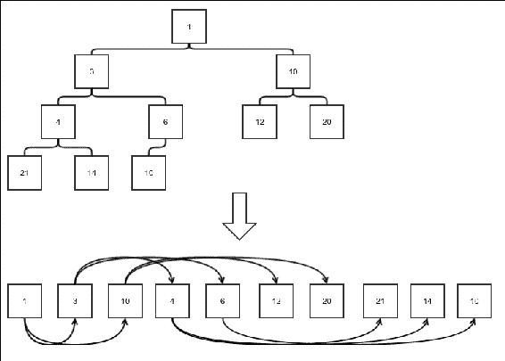
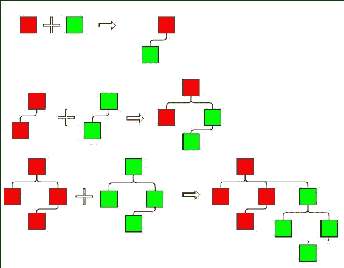
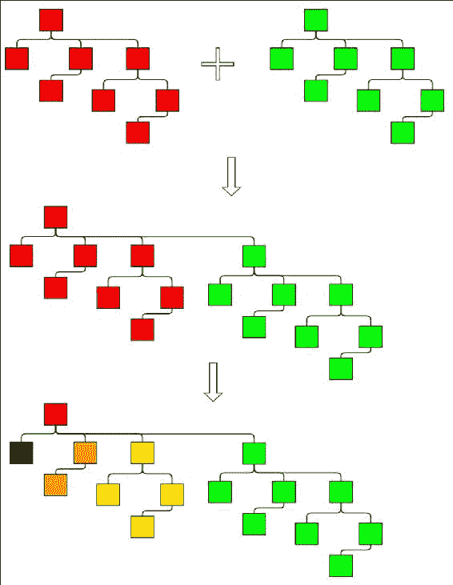
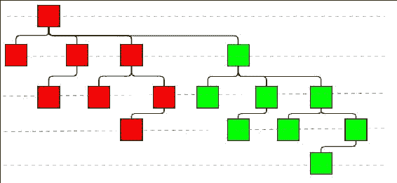
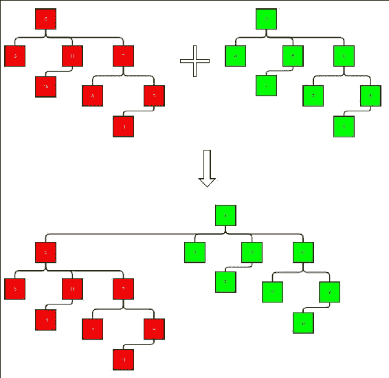

# 第九章. 高级通用数据结构

在本章中，我们将探讨一些常用的有趣的数据结构。我们将从优先队列的概念开始。我们将看到一些优先队列的高效实现。简而言之，本章将涵盖以下主题：

+   优先队列抽象数据类型（ADT）

+   堆

+   二项式森林

+   使用优先队列和堆进行排序

# 优先队列 ADT

优先队列就像一个队列，你可以入队和出队元素。然而，出队的元素是具有最小特征值的元素，称为其优先级。我们将使用比较器来比较元素并学习哪个具有最低优先级。我们将使用以下接口来实现优先队列：

```java
public interface PriorityQueue<E> {
    E checkMinimum();
    E dequeueMinimum();
    void enqueue(E value);
}
```

我们需要从方法中获取以下行为集：

+   `checkMinimum`：这个方法必须返回下一个要移除的值，而不移除它。如果队列空，它必须返回 null。

+   `dequeueMinimum`：这个操作必须移除具有最小优先级的元素并返回它。当队列空时，它应该返回 null。

+   `enqueue`：这个操作应该在优先队列中插入一个新元素。

我们也希望尽可能高效地执行这些操作。我们将看到两种不同的实现方式。

# 堆

堆是一个遵循仅两个约束的平衡二叉树：

+   任何节点中的值都小于其子节点中的值。这个特性也称为堆属性。

+   树尽可能平衡——即在下一级插入单个节点之前，任何一级都是完全填满的。

以下图显示了示例堆：



图 1. 一个示例堆

直到我们实际讨论如何插入元素和移除最小元素之前，这并不真正清楚。所以让我们直接进入正题。

## 插入

插入的第一步是将元素插入到下一个可用的位置。下一个可用的位置是同一级别的另一个位置或下一级别的第一个位置；当然，这适用于现有级别没有空位的情况。

第二步是迭代比较元素与其父节点，并持续交换，直到元素大于父节点，从而恢复约束。以下图显示了插入的步骤：



图 2. 堆插入

灰色框代表当前节点，黄色框代表父节点，其值大于当前节点。首先，新元素被插入到下一个可用的位置。它必须交换，直到满足约束。父节点是**6**，比**2**大，所以它被交换。如果父节点是**3**，也比**2**大，它也被交换。如果父节点是**1**，比**2**小，我们停止并完成插入。

## 最小元素的移除

父节点总是小于或等于子节点的约束保证了根节点是具有最小值的元素。这意味着移除最小元素只会导致移除顶部元素。然而，根节点的空位必须被填充，并且为了保持约束**2**，元素只能从最后一层删除。为了确保这一点，首先将最后一个元素复制到根节点，然后将其删除。现在必须迭代地将新根节点向下移动，直到满足约束**1**。以下图显示了删除操作的示例：



堆删除

然而，有一个问题，由于任何父节点都可以有两个子节点：我们应该比较和交换哪一个？答案是简单的。我们需要父节点小于两个子节点；这意味着我们必须比较和交换子节点的最小值。

## 复杂度分析

首先，让我们检查给定节点数量的堆的高度。第一层只包含根节点。第二层最多包含两个节点。第三层包含四个。确实，如果任何一层包含*m*个元素，下一层将包含这些*m*个元素的所有子节点。由于每个节点可以有最多两个子节点，下一层的最大元素数将是*2m*。这表明第*l*层的元素数是*2*^(l-1)。因此，高度为*h*的满堆将有总节点数*1+2+4+...+ 2*^(h-1) *= 2*^h*-1*。因此，高度为*h*的堆可以有最大*2* *h+1* *-1*个节点。那么，高度为*h*的堆的最小节点数是多少呢？由于只有最后一层可以有未填充的位置，堆除了最后一层必须满。最后一层至少有一个节点。因此，高度为*h*的堆的最小节点数是*(2*^(h-1) *-1) + 1 = 2*^(h-1)。因此，如果节点数为*n*，那么我们有以下内容：

```java
2h-1 ≤ n ≤ 2h –1
=>  h-1 ≤ lg n ≤ lg(2h –1) <lg( 2h)
=> h-1 ≤ lg n < h
```

我们还有以下内容：

```java
2h-1 ≤ n ≤ 2h –1
=> 2h≤ n ≤ 2h+1 –1
=>h ≤ lg (2n)< h+1
```

结合前面的两个表达式，我们得到以下内容：

```java
lg n < h ≤ lg (2n)
=> h = θ(lg n)
```

现在，让我们假设向堆的末尾添加一个新元素是一个常数时间操作或*θ(lg n)*。我们将看到这个操作可以变得如此高效。现在我们来处理上滤操作的复杂度。由于在每次比较和交换操作中，我们只与父节点比较，而从不回溯，上滤操作中可能发生的最大交换次数等于堆的高度*h*。因此，插入操作是*O(lg n)*。这意味着插入操作本身也是*O(lg n)*。

同样，对于下滤操作，我们只能进行与堆高度相同的交换次数。因此，下滤操作也是*O(lg n)*。现在如果我们假设移除根节点并将最后一个元素复制到根节点的操作最多是*O(lg n)*，我们可以得出结论，删除操作也是*O(lg n)*。

## 序列化表示

堆可以表示为一个没有中间空白的数字列表。技巧是在每级之后按顺序列出元素。对于具有 *n* 个元素的堆，位置从 1 到 *n* 采取以下约定：

+   对于索引为 *j* 的任何元素，其父元素在索引 *j/2*，其中 '*/*' 表示整数除法。这意味着将 *j* 除以二并忽略任何余数。

+   对于索引为 *j* 的任何元素，其子元素是 *j*2 和 *j*2+1。可以验证这和之前写的第一个公式相反。

我们示例树的表示如图所示。我们只是将树的一级一级展开。我们保留了树边，可以看到父子和关系正如之前所描述的那样：



堆的数组表示

在了解堆的基于数组的存储函数后，我们可以继续实现我们的堆。

## 数组支持的堆

数组支持的堆是一个固定大小的堆实现。我们从一个部分实现类开始：

```java
public class ArrayHeap<E> implements PriorityQueue<E>{

    protected E[] store;

    protected Comparator<E> comparator;
    int numElements = 0;
    public ArrayHeap(int size, Comparator<E> comparator){
        store = (E[]) new Object[size];
        this.comparator = comparator;
}
```

对于数组的任何索引（从 `0` 开始），找到父元素索引。这涉及到将索引转换为基于 `1` 的形式（因此加 `1`），除以 `2`，然后将其转换回基于 `0` 的形式（因此减 `1`）：

```java
    protected int parentIndex(int nodeIndex){
        return ((nodeIndex+1)/2)-1;
    }
```

使用以下方法找到左子元素的索引：

```java
    protected int leftChildIndex(int nodeIndex){
        return (nodeIndex+1)*2 -1;
    }
```

使用以下方法交换两个索引处的元素：

```java
    protected void swap(int index1, int index2){
        E temp = store[index1];
        store[index1] = store[index2];
        store[index2] = temp;
    }
    …
}
```

要实现插入，首先实现一个方法，将值逐级上移直到满足约束 `1`。我们比较当前节点和父节点，如果父节点的值更大，则进行交换。我们继续递归向上移动：

```java
    protected void trickleUp(int position){
        int parentIndex = parentIndex(position);

        if(position> 0 && comparator.compare(store[parentIndex], store[position])>0){
            swap(position, parentIndex);
            trickleUp(parentIndex);
        }
    }
```

现在我们可以实现插入。新元素总是添加到当前列表的末尾。进行检查以确保当堆满时，抛出适当的异常：

```java
    public void insert(E value){
        if(numElements == store.length){
            throw new NoSpaceException("Insertion in a full heap");
        }
        store[numElements] = value;
        numElements++;
        trickleUp(numElements-1);
    }
```

类似地，对于删除，我们首先实现一个逐级下移方法，该方法比较一个元素与其子元素，并做出适当的交换，直到恢复约束 1。如果存在右子元素，则必须也存在左子元素。这是因为堆的平衡性质。在这种情况下，我们只需要与最少两个子元素进行比较，并在必要时进行交换。当左子元素存在但右子元素不存在时，我们只需要与一个元素进行比较：

```java
    protected void trickleDown(int position){
        int leftChild = leftChildIndex(position);
        int rightChild = leftChild+1;
        if(rightChild<numElements) {
            if (comparator.compare(store[leftChild], store[rightChild]) < 0) {
                if (comparator.compare(store[leftChild], store[position]) < 0) {
                    swap(position, leftChild);
                    trickleDown(leftChild);
                }
            } else {
                if (comparator.compare(store[rightChild], store[position]) < 0) {
                    swap(position, rightChild);
                    trickleDown(rightChild);
                }
            }
        }else if(leftChild<numElements){
            if (comparator.compare(store[leftChild], store[position]) < 0) {
                  swap(position, leftChild);
                  trickleDown(leftChild);
            }
        }
    }
```

在 `trickleDown` 方法可用后，删除最小元素变得简单。我们首先保存当前根节点作为最小元素，然后将最后一个元素复制到根位置。然后调用 `trickleDown` 方法来恢复约束 1：

```java
    public E removeMin(){
        if(numElements==0){
            return null;
        }else{
            E value  = store[0];
            store[0] = store[numElements-1];
            numElements--;
            trickleDown(0);
            return value;
        }
    }
```

现在我们可以将其用作优先队列的实现。因此，我们使用我们的 `insert` 和 `removemin` 方法实现相关方法：

```java
@Override
public E checkMinimum() {
if(numElements==0){
return null;
}else{
return store[0];
}
}

    @Override
    public E dequeueMinimum() {
        return removeMin();
    }

    @Override
    public void enqueue(E value) {
        insert(value);
    }
```

这就完成了我们的基于数组的堆实现。它和我们的基于数组的队列实现有相同的问题，即我们需要事先知道其最大大小。接下来，我们将有一个具有链式二叉树形式的堆实现。

# 链式堆

链式堆是一个实际的二叉树，其中每个节点都持有对其子节点的引用。我们首先为我们的堆创建一个骨架结构：

```java
public class LinkedHeap<E> implements PriorityQueue<E>{

    protected static class Node<E>{
        protected E value;
        protected Node<E> left;
        protected Node<E> right;
        protected Node<E> parent;
        public Node(E value, Node<E> parent){
            this.value = value;
            this.parent = parent;
        }
    }
    …
}
```

为了追踪下一个位置，每个位置都被赋予一个数字，就像我们在基于数组的表示中做的那样。我们对父节点和子节点的索引也有相同的计算。但是，在这种情况下，查找特定索引的值需要从根节点遍历到该节点。我们创建一个方法来完成这个操作。请注意，由于我们不是使用数组，位置从 1 开始。我们首先通过递归查找父节点。父节点当然是子节点位置的一半。除以 2 的余数是告诉我们节点是在父节点的左边还是右边的位。我们相应地返回节点：

```java
    protected Node<E> findNodeAtPostion(int position){
        if(position == 1){
            return root;
        }else{
            int side = position % 2;
            int parentPosition = position / 2;
            Node<E> parent = findNodeAtPostion(parentPosition);
            switch (side){
                case 0:
                    return parent.left;
                case 1:
                    return parent.right;
            }
        }
        return null;
    }
```

接下来，我们转向交换。在基于数组的堆的情况下，我们可以在任何两个索引之间交换值。然而，这个通用实现在这种情况下需要多次遍历。我们只需要在节点和其父节点之间交换值。`swapWithParent`方法接受父节点作为参数。另一个参数是知道当前节点是父节点的左子节点还是右子节点，并相应地切换引用：

```java
    protected void swapWithParent(Node<E> parent, boolean left){
        Node<E> node = left? parent.left:parent.right;
        Node<E> leftChild = node.left;
        Node<E> rightChild = node.right;
        Node<E> sibling = left? parent.right:parent.left;
        Node<E> grandParent = parent.parent;
        parent.left = leftChild;
        if(leftChild!=null){
            leftChild.parent = parent;
        }
        parent.right = rightChild;
        if(rightChild!=null){
            rightChild.parent = parent;
        }
        parent.parent = node;
        if(left){
            node.right = sibling;
            node.left = parent;
        }else{
            node.left = sibling;
            node.right = parent;
        }
        node.parent = grandParent;
        if(sibling!=null)
            sibling.parent = node;

        if(parent == root){
            root = node;
        }else{
            boolean parentLeft = grandParent.left==parent;
            if(parentLeft){
                grandParent.left = node;
            }else{
                grandParent.right = node;
            }
        }
    }
```

## 插入

插入涉及首先在末尾插入一个新元素，然后向上渗透。首先，我们创建一个向上渗透的方法，类似于`ArrayHeap`类中的方法：

```java
protected void trickleUp(Node<E> node){
    if(node==root){
        return;
    }else if(comparator.compare(node.value, node.parent.value)<0){
        swapWithParent(node.parent, node.parent.left == node);
        trickleUp(node);
    }
}
```

现在，我们实现插入方法。如果树为空，我们只需添加一个根节点。否则，新元素的位子是*(numElements+1)*。在这种情况下，它的父节点必须是*((numElements+1)/2)*。它是否应该是其父节点的左子节点还是右子节点由*( (numElements+1)%2)*的值决定。然后创建一个新的节点并将其添加为父节点的子节点。最后，将`numElements`递增以跟踪元素数量：

```java
    public void insert(E value){
        if(root==null){
            root = new Node<>(value, null);
        }else{
            Node<E> parent = findNodeAtPostion((numElements+1)/2);
            int side = (numElements+1)%2;
            Node<E> newNode = new Node<>(value, parent);
            switch (side){
                case 0:
                    parent.left = newNode;
                    break;
                case 1:
                    parent.right = newNode;
                    break;
            }
            trickleUp(newNode);
        }
        numElements++;
    }
```

## 最小元素的移除

与基于数组的堆类似，我们需要实现一个向下渗透的方法。由于如果右子节点存在，则左子节点也必须存在，如果左子节点为空，则节点没有子节点。但是，如果右子节点为空且左子节点不为空，我们只需要比较当前节点的值与左子节点的值。否则，与具有最小值的子节点进行比较和交换：

```java
    protected void trickleDown(Node<E> node){
        if(node==null){
            return;
        }
        if(node.left == null){
            return;
        }else if(node.right == null){
            if(comparator.compare(node.left.value, node.value)<0){
                swapWithParent(node, true);
                trickleDown(node);
            }
        }else{
            if(comparator.compare(node.left.value, node.right.value)<0){
                if(comparator.compare(node.left.value, node.value)<0){
                    swapWithParent(node, true);
                    trickleDown(node);
                }
            }else{
                if(comparator.compare(node.right.value, node.value)<0){
                    swapWithParent(node, false);
                    trickleDown(node);
                }
            }
        }

    }
```

现在我们可以实现移除最小元素的方法。如果根为空，这意味着队列是空的。如果最后一个元素是根，只有一个元素，我们只需移除并返回它。否则，我们将根的值复制到一个临时变量中，然后将最后一个元素的值复制到根中，最后，将根向下传递：

```java
    public E removeMin(){
        if(root==null){
            return null;
        }
        Node<E> lastElement = findNodeAtPostion(numElements);
        if(lastElement==root){
            root = null;
            numElements--;
            return lastElement.value;
        }
        E value = root.value;
        root.value = lastElement.value;
        Node<E> parent = lastElement.parent;
        if(parent.left==lastElement){
            parent.left = null;
        }else{
            parent.right=null;
        }
        numElements--;
        trickleDown(root);
        return value;
    }
```

最后，我们实现使它成为一个有效优先队列所需的方法：

```java
    @Override
    public E checkMinimum() {
        return root==null? null : root.value;
    }

    @Override
    public E dequeueMinimum() {
        return removeMin();
    }

    @Override
    public void enqueue(E value) {
        insert(value);
    }
```

这就完成了我们使用堆实现的优先队列。现在我们将介绍实现优先队列的另一种方式。它被称为二项式森林，这是下一节的内容。

## ArrayHeap 和 LinkedHeap 中操作的复杂度

我们已经看到，如果我们能在堆的末尾最多以*O(lg n)*的时间复杂度添加一个元素，其中 n 是堆中已有的元素数量，我们就可以以*θ(lg n)*的时间复杂度执行插入和删除最小元素的操作。在`ArrayHeap`的情况下，插入新元素意味着只需设置数组中已知索引的元素值。这是一个常数时间操作。因此，在`ArrayHeap`中，插入和删除最小元素的操作都是*θ(lg n)*。检查最小元素只是检查数组索引 0 的值，因此是常数时间。

在`LinkedHeap`的情况下，在末尾插入新元素需要遍历树到末尾位置。由于树的高度是*θ(lg n)*，这个操作也是*θ(lg n)*。这意味着，在`LinkedHeap`中的插入和删除操作也是*θ(lg n)*。检查最小元素只是检查根的值，这个操作是常数时间。

# 二项式森林

二项式森林是一种非常有趣的数据结构。但是，要讨论它，我们首先需要从二项式树开始。二项式树是一种树，其中两个相同大小的较小的二项式树以特定方式组合在一起：



二项式树

前面的图显示了二项式树如何组合成更大的二项式树。在第一行，两个高度为 1 的二项式树组合成一个新的高度为 2 的二项式树。在第二行，两个高度为 2 的二项式树组合成一个新的高度为 3 的二项式树。在最后的例子中，两个高度为 3 的二项式树组合成一个高度为 4 的二项式树，以此类推。组合在一起的两个树不是对称处理的。相反，一个树的根成为另一个树的父节点。下一图显示了序列中的另一个步骤，然后展示了看待二项式树的不同方式。在最后一行，我以不同的方式突出了子树。注意：



图 6.看待二项式树的另一种方式

每个子树都是一个二项树。不仅如此，第一个子树是一个高度为 1 的二项树，第二个子树的高度为 2，第三个子树的高度为 3，以此类推。所以，另一种思考二项树的方式是，它是一个根和一系列子树，这些子树是连续高度的二项树，直到比整个树的高度少一个。这两种观点在我们的讨论中都是必要的。分析想法时需要第一种观点，实现时需要第二种观点。

## 为什么叫它二项树？

记得我们在第四章中讨论的**选择函数**吗？*旁路 - 函数式编程*？在那里，我指出它也被称为二项式系数。让我们看看它与二项树有何关联。假设我们有一个高度为 h 的二项树，我们想要找出第 l 层的节点数量。让我们假设对于高度为 h 的树，节点数量是*f(t,r)*，其中*t=h-1*和*r = l-1*。取比高度和级别小一的变量的原因稍后将会变得清晰。基本上，*t*是从*0*而不是*1*开始的树的高度，*r*是从零开始的级别。现在这棵树显然是只有一个元素的树，或者它是由两个高度为*h-1 = t*的树组成的：



图 7. 将其命名为二项树的理由

我们将称这两个子树为：红色子树和绿色子树。这是因为它们在前面的图中被这样着色。使用虚线突出显示级别。从图中可以看出，完整树中级别*r*的节点要么在红色树的级别*r*，要么在绿色树的级别*r-1*。红色和绿色树都是高度*h-1*的树。这意味着以下内容：*f(t,r) = f(t-1,r) + f(t-1,r-1)*。这个方程与我们已讨论的选择函数相同。我们唯一要检查的是边界条件。顶层（即*t=0*）总是只有一个节点，所以*f(t,0) = 1*。我们还知道树中的级别数量必须小于或等于树的高度，所以当*t <r*时，我们有*f(t,r) = 0*。因此，*f(t,t) = f(t-1,t) + f(t-1,t-1) = 0 + f(t-1,t-1) = f(t-1,t-1)*对于任何*t*都成立。同样，*f(t-1,t-1) = f(t-2,t-2) = f(t-3,t-3) = … = f(0,0) = 1*（因为*f(t,0) = 1*）。因此，所有`choose`函数的条件都得到了满足；因此我们可以看到*f(t,r) = choose(t,r) = choose(h-1, l-1)*。由于`choose`函数也被称为二项式系数，这为二项树提供了它的名字。

## 节点数量

在高度为*h*的二叉树中，节点数*n*是多少？当*h=1*时，我们只有一个节点。高度为 2 的树由两个高度为 1 的树组成，高度为 3 的树由两个高度为 2 的树组成，以此类推。因此，当高度增加 1 时，节点数必须是原始数的两倍。也就是说，当*h=1, n=1; h=2, n=2; h=3, n=4,...*。一般来说，情况应该是这样的：*n = 2*^(h-1)*= 2*t。这里的*t*是从零开始的树的高度。

注意，我们还可以说，树中的节点数*n*是每层节点数的总和，即*choose(t, r)*，其中*r*是从*0*开始的层。这两个公式必须相等，所以总和*choose(t, 0) + choose(t, 1) + choose(t, 2) + … + choose(t, t)*等于*2*t。这是这个关系的证明。还有其他证明，但这也是一个有效的证明。

## 堆属性

当然，仅凭这种结构，我们无法确保有一种简单的方法来找出最小元素。因此，我们还在二叉树上强制执行堆属性：



图 8. 合并时保持堆属性。

这是这个属性：任何节点的值都小于其每个子节点的值。当合并两个树以形成一个树时，为了保持堆属性，我们只需要做的一件事就是使用顶部节点值较小的堆作为顶级子树，而顶部节点值较大的堆作为从属子树。这在前面的图中有所展示。红色树在根节点上的值恰好高于绿色树。因此，红色树必须是从属树。堆属性确保任何二叉树的根节点包含最小元素。

## 二叉森林

那么，我们如何从这构建一个队列呢？首先，请注意，任何树都将有至少 2 的幂次方的节点。但是，在队列中，我们希望有任意数量的元素。因此，我们在多个树中存储这些元素。任何数字都可以表示为 2 的幂次方的和，因为任何数字都可以用二进制形式表示。假设我们需要存储 20 个节点。数字 20 的二进制是 10100。因此，我们需要两个二叉树：一个高度为 5，有 16 个节点，另一个高度为 3，有 4 个节点。队列是通过使用一组二叉树来存储节点来构建的。因此，它被称为二叉森林。

在我们讨论如何插入新元素和移除最小元素之前，我们需要了解如何合并两个二项森林。我们已经看到，元素的数量是按照二进制形式表示的。只需将数字写成二进制形式，如果存在 1，则表示有一个高度等于从右到左位置加一的树。当我们合并两个森林时，合并后森林的元素数量是需要合并的森林中元素数量的总和。这意味着结果将具有大小为二进制表示中存在 1 的树。我们可以通过执行节点源数的二进制表示的二进制加法来找到这个二进制表示。例如，让我们合并两个森林：一个有 12 个元素，另一个有 10 个元素。它们的二进制表示分别是 1100 和 1010。如果我们进行二进制加法，我们有 1100 + 1010 = 10110。这意味着原始树有高度为 3、5 和 4、5 的树，结果必须有高度为 3、4 和 6 的树。合并的方式与进行二进制加法相同。树按顺序存储，我们有空位代表二进制表示中的 0。在合并过程中，每棵树代表一个比特，它有代表该比特的节点数。我们从每个森林中取出相应的比特，并考虑进位。所有这些树必须要么为空，要么有恰好相同数量的节点。然后，我们将它们合并以创建结果比特。

要进行任何二进制加法，我们需要为每个位输入三个比特：一个来自输入，一个来自进位。我们需要计算输出位和下一个进位。同样，在合并两棵树时，我们需要从给定的输入树（两个）和一个进位树中计算输出树和进位树。一旦合并完成，插入和移除`min`就变得简单了。

`insert`操作简单地将一棵树与一个森林合并，使用一个节点即可。移除最小元素的操作稍微复杂一些。第一步是找出最小元素。我们知道每个树的最小元素都在其根节点上。因此，我们需要遍历所有树，同时比较根节点以找到最小元素及其所在的树。移除它就是移除根节点，留下一个由连续树高度组成的森林的子树列表。因此，我们可以将主森林中的子树合并以完成移除过程。

让我们看看实现。首先，我们创建一个骨架类。二项树有一个根节点，包含一个值和一系列子树。子树列表就像一个密集的森林。森林中的树列表存储在一个链表中。我们使用`DoublyLinkedList`是因为我们需要移除最后一个元素：

```java
public class BinomialForest<E> implements PriorityQueue<E>{

    protected Comparator<E> comparator;
    protected static class BinomialTree<E>{
        E value;
        LinkedList<BinomialTree<E>> subTrees = new LinkedList<>();
        public BinomialTree(E value){
            this.value = value;
        }
    }

    public BinomialForest(Comparator<E> comparator){
        this.comparator = comparator;
    }

    DoublyLinkedList<BinomialTree<E>> allTrees = new DoublyLinkedList<>();
    …
}
```

如前所述，我们现在将开始合并操作。首先，我们需要合并两棵树，我们将使用它们来合并两个森林。合并两棵树是一个简单的常数时间操作。与空树合并不会改变树。正在合并的两棵树应该具有相同的大小。我们需要简单地比较根元素。根值较小的树将作为子树获得：

```java
    protected BinomialTree<E> merge(BinomialTree<E> left, 
      BinomialTree<E> right){

        if(left==null){
            return right;
        }else if(right==null){
            return left;
        }
        if(left.subTrees.getLength() != right.subTrees.getLength()){
            throw new IllegalArgumentException(
                  "Trying to merge two unequal trees of sizes " +
                    left.subTrees.getLength() + " and " + right.subTrees.getLength());
        }
        if(comparator.compare(left.value, right.value)<0){
            left.subTrees.appendLast(right);
            return left;
        }else{
            right.subTrees.appendLast(left);
            return right;
        }
    }
```

由于我们希望在常数时间内检查最小元素，就像在堆中一样，我们将最小元素存储在一个状态变量中。我们还将存储它在`allTrees`列表中的位置：

```java
    BinomialTree<E> minTree = null;
    int minTreeIndex = -1;
```

我们将定义一个方法来找出和更新变量。由于任何树中最小的元素是根，我们只需要遍历根来找到最小元素：

```java
    protected void updateMinTree(){
        if(allTrees.getLength()==0){
            minTree = null;
            minTreeIndex = -1;
        }
        E min = null;
        int index = 0;
        for(BinomialTree<E> tree:allTrees){
            if(tree==null){
                index++;
                continue;
            }
            if(min == null || comparator.compare(min, tree.value)>0){
                min = tree.value;
                minTree = tree;
                minTreeIndex = index;
            }
            index++;
        }
    }
```

要实现两个森林的合并，我们首先需要实现如何从两个输入树和一个携带树中计算输出并将树携带出来。这些方法相当简单。我们需要理解，如果它们不为空，输入和携带必须具有相同的大小。输出的高度必须与输出的高度相同，携带的高度必须比输入的高度多一个：

```java
    protected BinomialTree<E> computeOutputWithoutCarry(BinomialTree<E> lhs, BinomialTree<E> rhs, BinomialTree<E> carry){
        if(carry==null){
            if(lhs==null){
                return rhs;
            }else if(rhs==null){
                return lhs;
            }else{
                return null;
            }
        }else{
            if(lhs==null && rhs==null){
                return carry;
            }else if(lhs == null){
                return null;
            }else if(rhs == null){
                return null;
            }else{
                return carry;
            }
        }
    }
    protected BinomialTree<E>  computeCarry(
      BinomialTree<E> lhs, BinomialTree<E> rhs, BinomialTree<E> carry){
        if(carry==null){
            if(lhs!=null && rhs!=null){
                return merge(lhs, rhs);
            }else{
                return null;
            }
        }else{
            if(lhs==null && rhs==null){
                return null;
            }else if(lhs == null){
                return merge(carry, rhs);
            }else if(rhs == null){
                return merge(carry, lhs);
            }else{
                return merge(lhs, rhs);
            }
        }
    }
```

我们还需要增强我们命令式`LinkedList`实现中的`ListIterator`类，以便在遍历过程中修改任何节点的值。我们使用以下实现来完成这个任务：

```java
    public class ListIterator implements Iterator<E> {
        protected Node<E> nextNode = first;
        protected Node<E> currentNode = null;
        protected Node<E> prevNode = null;

        @Override
        public boolean hasNext() {
            return nextNode != null;
        }

        @Override
        public E next() {
            if (!hasNext()) {
                throw new IllegalStateException();
            }
            prevNode = currentNode;
            currentNode = nextNode;
            nextNode = nextNode.next;
            return currentNode.value;
        }

        @Override
        public void remove() {
            if(currentNode==null || currentNode == prevNode){
                throw new IllegalStateException();
            }
            if(currentNode==first){
                first = nextNode;
            }else{
                prevNode.next = nextNode;
            }
            currentNode=prevNode;

        }

        public void setValue(E value){
            currentNode.value = value;
        }

    }
```

有这些方法可用，我们可以实现两个森林或两个树列表的合并：

```java
    protected void merge(LinkedList<BinomialTree<E>> rhs){
        LinkedList<BinomialTree<E>>.ListIterator lhsIter
          = (LinkedList<BinomialTree<E>>.ListIterator)allTrees.iterator();
        Iterator<BinomialTree<E>> rhsIter = rhs.iterator();
        BinomialTree<E> carry = null;
        while(lhsIter.hasNext() || rhsIter.hasNext()){
            boolean lhsHasValue = lhsIter.hasNext();
            BinomialTree<E> lhsTree = lhsHasValue? lhsIter.next():null;
            BinomialTree<E> rhsTree = rhsIter.hasNext()? rhsIter.next():null;
            BinomialTree<E> entry = computeOutputWithoutCarry(lhsTree, rhsTree, carry);
            carry = computeCarry(lhsTree, rhsTree, carry);
            if(lhsHasValue) {
                lhsIter.setValue(entry);
            }else{
                this.allTrees.appendLast(entry);
            }
        }
        if(carry!=null){
            this.allTrees.appendLast(carry);
        }
        updateMinTree();
    }
```

`Insert`方法在合并可用时实现起来非常简单。只需合并一个包含值为 1 的树的列表：

```java
    public void insert(E value){
        BinomialTree<E> newTree = new BinomialTree<E>(value);
        DoublyLinkedList<BinomialTree<E>> newList 
               = new DoublyLinkedList<>();
        newList.appendLast(newTree);
        merge(newList);
    }
```

移除最小元素稍微复杂一些。它涉及到移除具有最小值的树，然后将其根视为最小元素。一旦完成，子树需要与原始森林合并。如果正在移除最后一棵树，我们必须实际上从列表中移除它。这就像在二进制表示中不写前导零一样。否则，我们只设置值为`null`，这样我们知道它是一个零位：

```java
    public E removeMin(){
        if(allTrees.getLength()==0){
            return null;
        }
        E min = minTree.value;
        if(minTreeIndex==allTrees.getLength()-1){
            allTrees.removeLast();
        }else {
            allTrees.setValueAtIndex(minTreeIndex, null);
        }
        merge(minTree.subTrees);
        return min;
    }
```

最后，我们可以实现所需的方法，以便将其用作优先队列：

```java
    @Override
    public E dequeueMinimum() {
        return removeMin();
    }

    @Override
    public void enqueue(E value) {
        insert(value);
    }

    @Override
    public Iterator<E> iterator() {
        return null;
    }
```

这完成了我们对二项队列的实现。

## 二项森林中操作复杂度

我们已经知道，高度为*h*的二项树中的节点数是*2h-1*。问题是，如果我们想存储 n 个元素，森林中树的最高高度应该是多少？我们已经看到，我们需要的树是按照整数*n*的二进制表示来确定的。*n*的二进制表示中最显著的位是(*lg n*)的 floor 值，即小于或等于*lg n*的最大整数。我们将这个值写成*lg n*。表示这个位的树的长度是*1 + lg n*。持有森林中树的列表的长度也是*1 + lg n= θ(lg n)*。在插入和删除新元素的情况下，都涉及到合并操作。合并操作对于每一对输入树和一位进位来说是常数时间。所以，两个森林合并操作的次数是这个：*常数乘以最大森林中的树的数量 = θ(lg n)*，其中*n*是最大森林中树的数量。

在插入时，我们只是合并一个只包含一棵树和一个元素的新的森林。所以这个操作是*θ(lg n)*，其中 n 是原始森林中元素的数量。

删除过程涉及两个步骤。第一步是删除最小元素。这涉及到一个常数时间操作，用于删除包含最小元素的树，以及一个合并操作，如之前所见，其复杂度为*θ(lg n)*。第二步/操作是更新包含最小元素的树。这涉及到扫描所有树的根，因此，其复杂度也是*θ(lg n)*，就像合并操作一样。所以，整体上，删除过程也是*θ(lg n)*。

检查最小元素当然是常数时间，因为我们已经引用了它。

# 使用优先队列进行排序

由于优先队列总是返回最小元素，如果我们插入所有输入元素然后不断出队，它们就会按顺序出队。这可以用来对元素列表进行排序。在我们的例子中，我们将添加一个名为`LinkedList`实现的新方法。这个实现使用`PriorityQueue`对元素进行排序。首先将所有元素插入到优先队列中。然后，出队元素并将它们重新连接到链表中：

```java
public void sort(Comparator<E> comparator){
    PriorityQueue<E> priorityQueue = new LinkedHeap<E>(comparator);

    while (first!=null){
        priorityQueue.enqueue(getFirst());
        removeFirst();
    }

    while (priorityQueue.checkMinimum()!=null){
        appendLast(priorityQueue.dequeueMinimum());
    }
}
```

入队和出队都具有*θ(lg n)*的复杂度，我们必须对每个元素进行入队和出队操作。我们已经看到了这一点：*lg 1 + lg 2 + … + lg n = θ(n lg n)*。所以，元素的入队和出队是*θ(n lg n)*，这意味着排序是*θ(n lg n)*，这是渐近最优的。

# 堆排序的就地实现

我们可以使用基于数组的堆实现来对数组的元素进行原地排序。技巧是使用相同的数组来支持堆。一开始，我们只需从数组的开始处将元素插入堆中。我们通过替换堆中的数组来实现这一点，除了传递的那个。由于堆也使用从开始的空间，它不会覆盖我们尚未插入的元素。在出队元素时，我们从数组的末尾开始保存它们，因为这是堆正在释放的部分。这意味着我们希望首先出队的是最大的元素。这可以通过简单地使用一个与传递的相反的比较器来实现。我们将这个静态方法添加到我们的 `ArrayHeap` 类中：

```java
public static <E> void heapSort(E[] array, Comparator<E> comparator){

    ArrayHeap<E> arrayHeap = new ArrayHeap<E>(0, (a,b) -> comparator.compare(b,a));

    arrayHeap.store = array;

    for(int i=0;i<array.length;i++){
        arrayHeap.insert(array[i]);
    }

    for(int i=array.length-1;i>=0;i--){
        array[i] = arrayHeap.removeMin();
    }
}
```

这实际上是一种使用先前所示优先队列的排序方法，只不过在这里我们与优先队列共享数组。因此，这种排序也是 *θ(n lg n)*，就像之前一样。

# 摘要

在本章中，我们讨论了优先队列及其实现。优先队列是重要的数据结构，在许多问题中使用。我们看到了优先队列的两种实现，一个是堆，另一个是二叉森林。我们还看到了如何使用优先队列进行排序，这是渐近最优的。这种变化的变体允许我们使用基于数组的堆原地排序数组。

在下一章中，我们将讨论图的概念，这是一种非常有用、几乎无处不在的 ADT，以及用于许多实际应用的数据结构。
