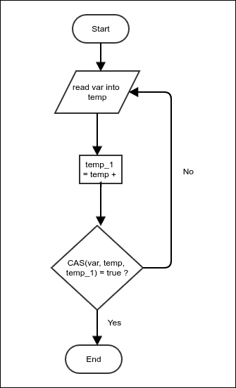
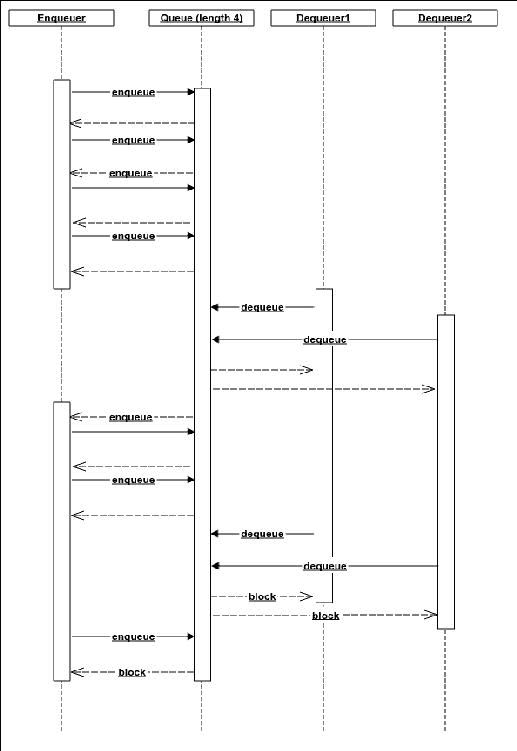

# 第十一章. 响应式编程

本章是对响应式编程的一个小插曲。它让我们在某些情况下处理应用程序的并发需求。它提供了一个处理并发的抽象。尽管这些概念很古老，但由于大数据流量的开始，近年来它引起了人们的兴趣。在现代社会，每天都有数十亿设备生成数据。挖掘这些数据对于业务增长至关重要；在某些情况下，对数据进行统计分析或将数据输入到某些机器学习算法中可能是整个业务的全部。这使得支持处理这种大量流入的数据、提供快速响应和具有容错能力变得至关重要。当然，即使使用传统的或命令式编程范式也可以做这些事情，就像理论上可以使用汇编语言构建任何应用程序一样。然而，这使得应用程序的维护变得极其复杂，并且无法根据业务需求进行修改。在本章中，我们将讨论以下主题：

+   响应式编程的基本思想

+   构建一个示例响应式框架

+   使用我们的框架构建示例程序

# 什么是响应式编程？

假设我们有一个允许我们查询或保存数据的 Web 服务器。这个 Web 服务器可以同时处理多个请求，每个请求都是一个涉及一些计算的短暂任务。通常如何实现这一点呢？好吧，天真的方式是为每个请求创建一个新的线程。但人们很容易意识到这会导致应用程序中线程数量的激增。此外，线程的创建和删除是重量级活动；它们会减慢整个应用程序的速度。

接下来，你可以使用线程池，这样相同的线程可以反复使用，以避免创建和删除线程的开销。然而，如果你想要同时处理数千个请求，这将需要一个拥有数千个线程的线程池。操作系统的线程调度非常复杂，涉及许多逻辑，包括优先级等。操作系统不期望线程只是运行短时间的计算；它们不是为此优化的。因此，解决方案是使用相同的线程来处理多个同时请求。一般来说，如果我们停止阻塞 IO，并在一个任务等待 I/O 时使用同一线程执行另一个任务，就可以这样做。然而，管理这些事情是非常复杂的。因此，我们需要一个框架来为我们执行这些活动。这样的框架可以被称为响应式框架。

响应式编程负责以下内容：

+   **可扩展性**：这个属性是指应用程序能够随着可用资源的增加而提供成比例数量的请求的能力。如果一个处理器每秒处理 500 个请求，那么两个处理器应该处理 1,000 个。

+   **响应性**：我们希望应用程序具有响应性；例如，当它在计算某个结果或从其他地方获取它时，应该显示状态。

+   **弹性**：由于我们使用相同的线程执行多个任务，错误处理比通常情况下更复杂。我们如何让用户知道错误信息呢？因此，我们不是将异常传播回调用栈，而是向前移动并显式处理错误情况。

使用响应式编程有不同的技术；这取决于我们试图解决的实际问题。我们不会讨论所有这些技术，但会关注常用的那些。

# 生产者-消费者模型

生产者-消费者模型是一种将处理过程划分为向其他组件发送消息的小组件的设计。一个生产消息，另一个消费并对其采取行动。它提供了一个抽象，可以轻松实现一个优化以利用所有资源的应用程序。生产者-消费者模型从消息队列开始。生产者在队列中发布消息，消费者接收它们。这个队列与我们之前研究过的队列在几个方面不同。我们希望这个队列是线程安全的，这对于队列在多线程环境中的正确工作来说是必需的。我们不需要担心消息出队的确切顺序。毕竟，当它们被不同线程接收时，消息的顺序并不重要。在这些条件下，我们优化了消息的传递。在实现这个队列之前，让我们讨论一些使用 synchronized 关键字之外的一些线程同步技术。这些技术对于在保持程序正确性的同时更优化地使用资源是必需的。

## 信号量

信号量是一种特殊的变量，它允许我们限制可以访问特定资源的线程数量。以下代码展示了信号量的一个示例，它提供了一个线程安全的计数器：

```java
public class SemaphoreExample {
    volatile int threadSafeInt = 0;
    Semaphore semaphore = new Semaphore(1);
    public int incremementAndGet() throws InterruptedException{
        semaphore.acquire();
        int previousValue = threadSafeInt++;
        semaphore.release();
        return previousValue;
    }
}
```

在这里，信号量已被初始化为`1`，这意味着它只允许一个线程获取它。其他线程在它释放之前无法获取它。与同步不同，这里没有要求必须由获取它的同一个线程调用释放方法，这使得它特别灵活。

对信号量的`acquire`方法的调用将被阻塞，直到它成功获取。这意味着调用线程将被从线程调度器中移除并放置在一边，这样操作系统的线程调度器就无法看到它。一旦信号量准备好被获取，这个线程将被放回原位，以便线程调度器可以看到它。

## 比较并设置

比较和设置是一个原子操作，它允许你仅在现有值匹配特定值时更新变量的值。这使我们能够根据变量的先前值更新变量。CAS 操作返回一个布尔值。如果比较匹配，这意味着设置操作成功，它返回`true`；否则，它返回`false`。想法是持续尝试，直到设置操作成功。以下图表显示了基本策略：



图 1：使用比较和设置操作进行原子更新

在*图 1*中，我们试图增加共享变量**var**的值。这个操作需要我们在线程特定的临时位置读取值，然后增加临时值并将其重新分配给共享变量。然而，如果有多个线程同时尝试执行更新，这可能会引起问题。可能会发生的情况是，这两个线程同时读取值以获取相同的临时值。这两个线程都可以使用增加的值更新共享变量。这将只增加一次值，但实际上应该增加两次。为了避免这种情况，我们检查**var**的值是否仍然相同，并且只有在它是这样的时候才更新；否则，我们再次读取**var**的值并重复该过程。由于这个比较和设置操作是原子的，它保证了不会丢失任何增加。以下是与之相同的 Java 代码：

```java
public class ThreadSafeCounter {
    AtomicInteger counter;
    public int incrementAndGet(){
        while (true){
            int value = counter.get();
            if(counter.compareAndSet(value, value+1)){
                return value;
            }
        }
    }
}
```

要使用任何原子操作，我们需要使用`java.util.concurrent.atomic`包中的类。`AtomicInteger`是一个封装整数的类，它允许在该整数上执行`compareAndSet`操作。还有其他一些实用方法。特别是，它有执行原子增加和减少的方法，就像我们在这里实现的那样。

## Volatile 字段

假设我们有一个字段，它被多个线程写入和读取。如果所有线程都在同一个单 CPU 上运行，写入可以直接在 CPU 缓存中发生；它们不需要经常同步到主内存。这不会成为问题，因为值也可以从相同的缓存中读取。然而，多个 CPU 可以有自己的缓存，在这种情况下，一个 CPU 对缓存的写入对在另一个 CPU 上运行的线程是不可见的。大多数程序接受这一点并相应地工作。例如，Java 为每个线程维护共享变量的单独副本，这些副本偶尔会同步。如果我们想强制一个线程的写入对另一个线程可见，我们需要声明该字段为 volatile。所有涉及原子操作的字段都被声明为 volatile。

## 线程安全的阻塞队列

现在我们已经准备好实现我们的线程安全的阻塞队列。线程安全意味着多个线程可以共享同一个队列；阻塞意味着如果一个线程尝试出队一个元素而队列当前为空，出队调用将被阻塞，直到其他线程入队一个元素。同样，如果一个线程尝试入队一个新元素而队列已满，对队列的调用将被阻塞，直到另一个线程出队一个元素并释放一些空间。

我们的队列将在一个固定长度的数组中存储元素，并维护两个计数器，它们将存储入队和出队的下一个索引。两个信号量在队列空或满时阻塞线程。此外，每个数组位置都提供了两个信号量，确保入队和出队操作不会覆盖或重复任何元素。它是通过确保一旦新元素被入队到特定位置，在它被出队之前不会被覆盖来实现的。同样，一旦特定数组索引被出队，它将永远不会在另一个入队操作存储另一个元素之前再次被出队：

```java
public class ThreadSafeFixedLengthBlockingQueue<E> {
```

`underflowSemaphore` 确保当队列空时出队操作被阻塞，而 `overflowSemaphore` 确保当队列满时入队操作被阻塞：

```java
    Semaphore underflowSemaphore;
    Semaphore overflowSemaphore;

    AtomicInteger nextEnqueueIndex;
    AtomicInteger nextDequeueIndex;
```

数组存储是持有元素的空间：

```java
    E[] store;
```

`enqueueLocks` 和 `dequeueLocks` 都是基于位置的独立锁，它们只允许在入队之后进行出队，反之亦然：

```java
    Semaphore [] enqueueLocks;
    Semaphore [] dequeueLocks;

    int length;
```

`alive` 标志可以被出队线程用来知道何时停止运行，并且不再期望有更多元素。这个标志需要由入队线程设置：

```java
    boolean alive = true;
```

所有初始化基本上都是显而易见的：

```java
    public ThreadSafeFixedLengthBlockingQueue(int length){
        this.length = length;
        store = (E[]) new Object[length];
        nextEnqueueIndex = new AtomicInteger();
        nextDequeueIndex = new AtomicInteger();
        underflowSemaphore = new Semaphore(length);
        overflowSemaphore = new Semaphore(length);
        underflowSemaphore.acquireUninterruptibly(length);
        enqueueLocks = new Semaphore[length];
        dequeueLocks = new Semaphore[length];
        for(int i=0;i<length;i++){
            enqueueLocks[i] = new Semaphore(1);
            dequeueLocks[i] = new Semaphore(1);
            dequeueLocks[i].acquireUninterruptibly();
        }
    }
```

入队操作首先确保队列不满，通过获取 `overflowSemaphore`：

```java
    public void enqueue(E value) throws InterruptedException {
        overflowSemaphore.acquire();
```

然后 `nextEnqueueIndex` 被增加，并返回其前一个值，这个值随后被用来计算元素将被存储在数组中的索引。这个看似复杂的表达式确保了即使在 `nextEnqueueIndex` 整数溢出之后，索引也能正确地回滚，前提是队列的长度是 2 的整数次幂：

```java
        int index = (length + nextEnqueueIndex.getAndIncrement() % length) 
          % length;
```

一旦选择了索引，我们必须在位置上获取一个入队锁，存储值，然后释放出队锁以标记这个位置为准备出队。最后，我们释放 `underflowSemaphore` 上的一个计数，以标记队列中有一个更多元素待出队：

```java
        enqueueLocks[index].acquire();
        store[index] = value;
        dequeueLocks[index].release();
        underflowSemaphore.release();
    }
```

出队操作与入队操作非常相似，只是信号量的角色被反转。在实际操作开始之前有一些稍微复杂的代码。这是为了使出队线程在没有更多元素可用时能够退出：

```java
    public E dequeue() throws InterruptedException {
```

我们不是直接获取 `underflowSemaphore`，而是使用 `tryAcquire`，如果没有任何元素可供脱队，它将在 1 秒后唤醒线程。这给了我们检查 `alive` 布尔标志值的机会，并在它不再活跃的情况下退出脱队操作。如果队列不再活跃，我们中断当前线程并退出。否则，我们计算索引并以类似的方式从入队操作中脱队元素：

```java
        while (alive && !underflowSemaphore.tryAcquire(1, TimeUnit.SECONDS));
        if(!alive){
            Thread.currentThread().interrupt();
        }
        int index = (length + nextDequeueIndex.getAndIncrement() % length) 
                 % length;
        dequeueLocks[index].acquire();
        E value = store[index];
        enqueueLocks[index].release();
        overflowSemaphore.release();
        return value;
    }
```

这是一个实用方法，用于返回队列中的当前元素数量。这在知道何时终止队列（将 `alive` 标志设置为 `false`）在生产者-消费者设置中很有用：

```java
    public int currentElementCount(){
        return underflowSemaphore.availablePermits();
    }

    public void killDequeuers(){
        alive = false;
    }

}
```

## 生产者-消费者实现

现在我们可以使用我们创建的队列实现生产者-消费者设置。简单来说，生产者-消费者队列是生产者生产并由消费者消费的事件队列。有三种类型的事件。`INVOCATION` 类型指的是传播处理的常规事件。当需要传播异常时，会引发 `ERROR` 类型的事件。当需要终止脱队线程并关闭队列时，会产生 `COMPLETION` 事件。`ProcerConsumer` 队列接受 `Consumer` 作为输入：

```java
public interface Consumer<E> {
    void onMessage(E message);
    default void onError(Exception error){
        error.printStackTrace();
    }
    default void onComplete(){

    }
}

public class ProducerConsumerQueue<E> {
    enum EventType{
        INVOCATION, ERROR, COMPLETION
    }
```

`Event` 类表示单个事件。根据类型，它可以有一个值或异常：

```java
    class Event{
        E value;
        Exception error;
        EventType eventType;
    }
    ThreadSafeFixedLengthBlockingQueue<Event> queue;
    boolean alive = true;
    Thread [] threads;
```

`ProducerConsumerQueue` 构造函数创建消费者线程。它还接受消费者代码作为输入。消费者必须实现 `Consumer` 接口：

```java
    public ProducerConsumerQueue(int bufferSize, int threadCount, 
                 Consumer<E> consumer){
        queue = new ThreadSafeFixedLengthBlockingQueue<>(bufferSize);
        threads = new Thread[threadCount];
```

消费者线程运行代码，脱队事件并按照事件类型在循环中调用 `consumerCode` 的方法。循环在接收到终止事件且队列中没有更多事件需要处理时结束：

```java
        Runnable consumerCode = ()->{
            try{
                while(alive || queue.currentElementCount()>0){
                    Event e = queue.dequeue();
                    switch (e.eventType) {
                        case INVOCATION:
                            consumer.onMessage(e.value);
                            break;
                        case ERROR:
                            consumer.onError(e.error);
                            break;
                        case COMPLETION:
                            alive = false;
                            consumer.onComplete();
                    }
                }

            } catch (InterruptedException e) {

            } finally{

            }
        };
```

创建消费者线程：

```java
        for(int i=0;i<threadCount;i++) {
            threads[i] = new Thread(consumerCode);
            threads[i].start();
        }
    }
```

`produce` 方法由生产者线程调用。请注意，队列不管理生产者线程；它们需要单独管理：

```java
    public void produce(E value) throws InterruptedException {
        Event event = new Event();
        event.value = value;
        event.eventType = EventType.INVOCATION;
        queue.enqueue(event);
    }
```

一旦生产者线程标记事件流已完成，就不会再生成新事件，并且脱队线程在处理完所有事件后将被终止：

```java
    public void markCompleted() throws InterruptedException {
        Event event = new Event();
        event.eventType = EventType.COMPLETION;
        queue.enqueue(event);
    }
```

这是为了传播一个异常：

```java
    public void sendError(Exception ex) throws InterruptedException {
        Event event = new Event();
        event.error = ex;
        event.eventType = EventType.ERROR;
        queue.enqueue(event);
    }
```

如果我们需要等待所有脱队线程终止，我们使用这个：

```java
    public void joinThreads() throws InterruptedException {
        for(Thread t: threads){
            t.join();
        }
    }
}
```

要了解如何使用这个生产者-消费者队列实际解决问题，我们将考虑一个示例问题。我们将处理一个文件——`com-orkut.ungraph.txt`——它是公开的，包含过去社交网站 Orkut 中用户之间的所有友谊。该文件可以从[`snap.stanford.edu/data/bigdata/communities/com-orkut.ungraph.txt.gz`](https://snap.stanford.edu/data/bigdata/communities/com-orkut.ungraph.txt.gz)下载。为了保护隐私，所有用户都通过一些任意的 ID 进行引用，并且没有共享与实际用户的映射。我们还将使用另一个名为`ulist`的文件，其中将包含我们感兴趣的 ID 列表。我们的任务是找出第二个文件中每个用户的朋友数量。以下命令显示了这两个文件的外观：

```java
$ head com-orkut.ungraph.txt 
1	2 
1	3 
1	4 
1	5 
1	6 
1	7 
1	8 
1	9 
1	10 
1	11 
$ head ulist 
2508972 
1081826 
2022585 
141678 
709419 
877187 
1592426 
1013109 
1490560 
623595 
```

`com-orkut.ungraph.txt`中的每一行都有两个通过空格分隔的 ID。这意味着这两个用户之间存在友谊。已知文件中每个友谊只被提及一次，并且是无向的。请注意，这意味着每一行应增加两个 ID 的朋友数量。`ulist`中的每一行只有一个 ID。所有 ID 都是唯一的，我们必须找到这些 ID 中每个的朋友数量。请注意，其中一些没有朋友，因此在`com-orkut.ungraph.txt`中没有被提及。

我们将首先创建一个实用程序类，它将使我们能够从文件中读取整数 ID。这个类的作用是从任何文本文件中读取整数值，以便在过程中不会创建太多的对象。这只是为了在一定程度上减少垃圾收集。在这种情况下，我们使用了基于文件通道的逻辑，该逻辑使用`ByteBuffer`作为缓冲区：

```java
public class FileReader {
    ByteBuffer buf= ByteBuffer.allocate(65536);
    FileChannel channel;
```

`readCount`变量跟踪缓冲区中剩余的字节数：

```java
    int readCount = 0;

    public FileReader(String filename) throws FileNotFoundException {
        channel = new FileInputStream(filename).getChannel();
        buf.clear();
    }
```

要读取一个`int`，在一个循环中继续读取字节，直到遇到一个不是数字的字节。在此期间，继续计算字符串表示的整数：

```java
    public int readIntFromText() throws IOException {
        int value = 0;
        while(true){
```

首先检查缓冲区是否为空；如果是，则通过从文件中读取来重新填充它：

```java
            if(readCount<=0){
                buf.clear();
                readCount = channel.read(buf);
```

如果文件中没有更多的字节可用，不必关心翻转缓冲区：

```java
                if(readCount<0){
                    break;
                }
                buf.flip();
            }
```

我们读取一个字节并减少`readCount`，因为现在缓冲区少了一个字节：

```java
            byte nextChar = buf.get();
            readCount--;
```

如果字符是数字，继续计算整数；否则，中断循环并返回计算出的整数值：

```java
            if(nextChar>='0' && nextChar<='9') {
                value = value * 10 + (nextChar - '0');
            }else{
                break;
            }

        }
        return value;
    }
}
```

在此帮助下，我们将创建一个程序来创建一个文件输出，其中将包含`ulist`中提供的用户 ID 以及相应的朋友数量。想法是通过计算朋友数量来异步读取文件。由于计数涉及二分搜索，我们希望有两个线程来完成这项工作而不是一个：

```java
public class FriendCountProblem {
    private static final String USER_LIST_FILE = "ulist";
    private static final String EDGES_PATH = "com-orkut.ungraph.txt";
    private static final String OUTPUT_FILE_PATH = "output";

    public static void main(String [] args)
      throws Exception {
        FileReader userListReader = new FileReader(USER_LIST_FILE);
```

首先，我们简单地计算`ulist`中存在的行数。这将使我们能够创建正确大小的数组：

```java
        int count = 0;

        while(true){

            int lineValue = userListReader.readIntFromText();
            if(lineValue==0){
                break;
            }
            count++;
        }
```

我们创建了两个数组：一个包含键，另一个包含每个键的朋友计数。计数存储在`AtomicInteger`对象中，以便可以从多个线程中递增：

```java
        Integer [] keys = new Integer[count];
        AtomicInteger [] values = new AtomicInteger[count];
```

我们从`ulist`中读取`userIDs`到一个数组中：

```java
        userListReader = new FileReader(USER_LIST_FILE);

        int index = 0;

        while(true){

            int uid = userListReader.readIntFromText();
            if(uid==0){
                break;
            }
            keys[index] = uid;
            values[index] =  new AtomicInteger(0);
            index++;

        }
```

现在我们对`userID`数组进行排序，以便我们可以对其执行二分搜索：

```java
        ArraySorter.quicksort(keys,(a,b)->a-b);
```

我们消费者的任务是搜索在`com-orkut.ungraph.txt`中遇到的每个用户，并在数组 values 中递增相应的计数。请注意，创建`ProducerConsumerQueue`不会启动任何处理；只有通过这种方式创建消费者线程。处理只有在产生事件后才会开始，我们将在读取`com-orkut.ungraph.txt`后进行：

```java
        ProducerConsumerQueue<Integer> queue 
                = new ProducerConsumerQueue<>(4092, 2, (v)->{
            int pos  = ArraySearcher.binarySearch(keys,v);
            if(pos<0){
                return;
            }
            values[pos].incrementAndGet();
        });
```

我们使用主线程来产生事件。我们使用相同的`FileReader`类来单独读取每个用户 ID。这是因为`com-orkut.ungraph.txt`中每一行的用户都有一个朋友（即同一行中的另一个用户），所以我们可以简单地读取用户并将它们作为事件发布，以便消费者可以处理它们：

```java
        FileReader edgeListFileReader = new FileReader(EDGES_PATH);
        while(true){
            int val = edgeListFileReader.readIntFromText();
            if(val == 0){
                break;
            }
            queue.produce(val);
        }
```

一旦我们处理完整个`com-orkut.ungraph.txt`文件，我们只需将队列标记为完成并等待消费者线程终止：

```java
        queue.markCompleted();
        queue.joinThreads();
```

现在必须更新值数组中的所有计数。所以我们逐个读取它们，并将它们输出到文件 output 中：

```java
        PrintStream out = new PrintStream(OUTPUT_FILE_PATH);
        for(int i=0;i<count;i++){
            out.println(keys[i] +" : "+values[i].get());
        }
        out.flush();
    }
}
```

上述示例演示了如何使用**生产者-消费者**的响应式技术解决实际问题。现在我们将讨论实现我们的事件队列的另一种方式；它不涉及在信号量上阻塞。

## 自旋锁和忙等待

信号量通常在线程获取它之前阻塞线程。操作系统通过从准备在 CPU 上分配处理时间的线程列表中移除线程来实现这种阻塞。准备就绪的线程列表被称为运行线程。每个信号量都有一个等待在其上的线程列表，这些线程被从运行线程列表中移除。一旦信号量被释放，附加到信号量的线程列表中的线程将被移除并放回运行线程列表。这个操作相当重量级，需要处理时间。另一种阻止线程访问共享资源的方法是使用自旋锁。自旋锁通常使用原子变量和比较和设置操作实现。自旋锁中的线程简单地尝试在循环中执行变量的比较和设置操作；它一直这样做，直到成功。对于操作系统来说，这个线程就像一个运行线程一样，会被像任何其他线程一样调度。然而，线程本身会不断尝试比较和设置操作，消耗处理器时间。这就是为什么它被称为忙等待。一旦比较和设置操作成功，线程就可以继续做有意义的事情。自旋锁在资源不会长时间不可用时很有用。如果资源只是短暂不可用，就没有必要进行所有重负载操作，比如从运行线程列表中移除线程并在信号量上阻塞。

我们可以使用自旋锁而不是信号量来实现我们的线程安全队列，如下面的代码所示。每个用于存储队列元素的数组位置都由两个`AtomicBoolean`变量保护，这些变量存储在`enqueueLocks`和`dequeueLocks`数组中。我们唯一想要确保的是，每次出队后，只有一个入队，每次入队后，特定数组位置只有一个出队。不同的数组位置应该相互独立：

```java
public class ThreadSafeFixedLengthSpinlockQueue<E> {
    int nextEnqueueIndex;
    int nextDequeueIndex;
    E[] store;
    AtomicBoolean[] enqueueLocks;
    AtomicBoolean[] dequeueLocks;
    AtomicInteger currentElementCount = new AtomicInteger(0);
    int length;
    volatile boolean alive = true;
    public ThreadSafeFixedLengthSpinlockQueue(int length){
        this.length = length;
        store = (E[]) new Object[length];
        enqueueLocks = new AtomicBoolean[length];
        dequeueLocks = new AtomicBoolean[length];
```

当`enqueueLocks[i]`为`false`时，意味着位置`i`没有存储元素。当`dequeueLock[i]`为`true`时，意味着相同的事情。我们需要两者的原因是在元素正在入队或出队的过程中进行保护：

```java
        for(int i=0;i<length;i++){
            enqueueLocks[i] = new AtomicBoolean(false);
            dequeueLocks[i] = new AtomicBoolean(true);
        }
    }
```

这里是锁的核心。我们简单地取下一个索引进行入队，并尝试获取`enqueueLock`。如果它是`false`，这意味着还没有任何元素入队，它会被原子性地设置为`true`，并开始入队过程；否则，我们会在忙循环中重复做同样的事情，直到比较和设置操作成功。一旦过程完成，我们只需将`dequeueLock`设置为`false`来释放它。比较和设置操作在这里不是必要的，因为它保证是`true`。元素的数量使用另一个原子变量来维护：

```java
    public void enqueue(E value) throws InterruptedException {

        while (true) {
            int index = nextEnqueueIndex;
            nextEnqueueIndex = (nextEnqueueIndex+1) % length;
            if(enqueueLocks[index].compareAndSet(false,true)){
                currentElementCount.incrementAndGet();
                store[index] = value;
                dequeueLocks[index].set(false);
                return;
            }
        }
    }
```

出队操作非常相似，只是入队和出队锁的位置互换了：

```java
    public E dequeue() throws InterruptedException {
        while(alive) {
            int index = nextDequeueIndex;
            nextDequeueIndex = (nextDequeueIndex+1) % length;
            if(dequeueLocks[index].compareAndSet(false,true)){
                currentElementCount.decrementAndGet();
                E value = store[index];
                enqueueLocks[index].set(false);
                return value;
            }
        }
        throw new InterruptedException("");
    }
```

代码的其余部分是显而易见的：

```java
    public int currentElementCount(){
        return currentElementCount.get();
    }

    public void killDequeuers(){
        alive = false;
    }

}
```

我们可以将`ProducerConsumerQueue`类中的队列简单地替换为使用基于自旋锁的队列。在我们的示例问题中，队列的自旋锁版本性能更好。

让我们使用`ProducerConsumerQueue`解决另一个问题。我们的问题是找出 2 到 500,000 之间的所有完美数。什么是完美数？完美数是指除了它本身之外，所有除数的和等于该数的数。第一个完美数是 6。6 有三个除数（不包括它本身），即 1、2 和 3，且 6=1+2+3。这就是 6 成为完美数的原因。为了找出 2 到 500,000 之间的所有完美数，我们将检查该范围内的每个数是否是完美数。我们可以编写以下代码来判断一个给定的数是否是完美数。对于每个除数`div`，我们检查数`x`是否能被`div`整除；如果是，我们将其加到和中。在这种情况下，如果我们用`div`除以`x`，我们当然会得到另一个作为结果存储在变量`quotient`中的`x`的除数。这也必须加到和中，除非它等于`div`。当我们通过`x`的平方根时，即当我们通过用`div`除以`x`得到的商时，我们停止这个过程。由于我们最初排除了`1`作为除数以避免添加该数本身，我们在最后将`1`加到和中并检查它是否等于`x`；如果是，则`x`是完美数：

```java
public static boolean isPerfect(long x){
        long div = 2;
        long sum=0;
        while(true){
            long quotient = x/div;
            if(quotient<div){
                break;
            }
            if(x%div==0){
                sum+=div;
                if(quotient!=div){
                    sum+=quotient;
                }
            }
            div++;
        }
        return 1+sum==x;
    }
```

如您所见，检查一个给定的数是否是完美数是一个计算密集型操作，这使得使用所有 CPU 来计算它变得很有吸引力。我们将使用我们的生产者-消费者框架来完成这项工作。代码是自解释的。我们的消费者代码简单地检查一个给定的数是否是完美数，如果是，就打印该数。生产者简单地生成并排队所有数字。由于消费者在多个线程中运行，并且是计算密集型的部分，它应该比单线程版本运行得更快：

```java
public static void findPerfectNumberWithProducerConsumer() throws InterruptedException{
        long start = System.currentTimeMillis();
        ProducerConsumerQueue<Long> queue 
                 = new ProducerConsumerQueue<>(4096, 4, (x)->{
            if(isPerfect(x)){
                System.out.println(x);
            }
        });

        for(long i=2;i<5_00_000;i++){
            queue.produce(i);
        }
        queue.markCompleted();
        queue.joinThreads();
        System.out.println("Time in ms: "+(System.currentTimeMillis()-start));
    }
```

由于我的计算机有四个 CPU 核心，我使用了四个线程来处理重负载。在我的计算机上，这个程序耗时 1,596 毫秒，而单线程程序耗时 4,002 毫秒，如下面的代码所示：

```java
public static void findPerfectNumberWithSingleThread(){
        long start = System.currentTimeMillis();
        for(long i=2;i<5_00_000;i++){
            if(isPerfect(i)){
                System.out.println(i);
            }
        }
        System.out.println("Time in ms: "+(System.currentTimeMillis()-start));
    }
```

# 反应式编程的函数式方法

大多数反应式编程框架都提供了用于反应式编程的功能性 API，这使得使用起来更加方便。在本节中，我们将构建一个功能性反应式 API，并使用它来解决一个问题。思路是使用流的概念。流是一个数据生成器或源，可以在请求时提供输入。功能性 API 在流上提供了 map、filter 和 consume 操作。map 和 filter 操作创建一个新的流，而 consume 操作则返回一个`EventConsumer`实例。思路是当`EventConsumer`被要求开始处理时，它会启动自己的生产者线程和消费者线程，并将每个 map、filter 或 consume 操作视为生产者-消费者队列中的单独调度操作。这只是为了强调我们真正试图实现的目标。

例如，我将放置使用功能性 API 解决相同完美数问题的代码。我们将用实际创建流的代码替换伪方法`someWayCreateAStream`。重点是展示如何使用 map、filter 和 consume 方法来操作事件流。处理实际上是在调用 process 方法时开始的，在 map、filter 和 consume 的每个步骤中，处理步骤是解耦的，并且可能在不同的线程中运行：

```java
  public static void findPerfectNumbersWithFunctionalAPI(){
        EventStream<Long> stream = someWayCreateAStream();
        stream.filter((x)->x>1)
                .filter(EventStream::isPerfect)
                .consume((x)->{System.out.println(x);})
                .onError((x)->System.out.println(x))
                .process(4096,1,4);

    }
```

当我们创建`EventStream`或`EventConsumer`的实例时，不会发生任何处理；只会创建元数据。只有在调用 process 方法时，处理才会开始。这是通过 process 方法启动生产者和消费者线程来完成的。生产者线程创建并排队包含初始值和处理代码（如 map、filter 或 consume 操作）的事件。一个去队列运行第一部分处理，并为下一级处理排队另一个事件；它对 map 和 filter 操作都这样做。consume 操作是处理链的终点，它不返回任何值。这是没有更多事件被排队的时刻。

这要求去队列线程也必须执行一些入队操作。这可能会出现什么问题？有两种类型的线程进行入队操作。其中一种线程还负责出队。当队列满时，这些线程在尝试执行入队操作时可能会被阻塞。但这也意味着它们将无法执行任何出队操作；这是因为如果它们这样做，队列将再也没有空间了。这种情况是一个死锁；所有线程都被阻塞，并期待其他线程做些什么来解锁它们。

为了了解为什么会出现这种死锁，让我们想象一个长度为 4 的队列。假设有两个出队线程，在某些情况下也会执行一次入队操作。我们再添加一个入队线程。由于线程可以以任何顺序运行，所以可能的情况是入队线程首先运行，并将四个新元素入队，使队列满。现在假设有两个出队线程运行，每个线程出队一个元素。在这些线程再次入队之前，入队线程再次运行，这次它又入队了两个新元素，使队列满。现在运行出队线程，但它们被阻塞了，因为队列已满。它们甚至不能出队任何元素，因为它们自己被阻止了入队更多元素。这是一个死锁情况。*图 2*展示了这种情况：



我们真正想要的是线程不仅能够执行入队操作，而且在队列完全满之前将其阻塞。这样，出队线程就可以利用一些空间来持续地进行出队和入队操作，直到它们达到一个点，它们将不再需要入队（因为它们已经到达了处理链的最后一个步骤）。最终，队列会变为空，入队线程可以再次被解除阻塞。为了做到这一点，我们需要有两种不同的入队操作。一种是在队列满之前不会阻塞的操作，另一种是在队列半满或更满时阻塞的操作。我们可以在`ThreadSafeFixedLengthSpinlockQueue`类中使用以下代码来实现第二种类型。`enqueueProducerOnly`方法与`enqueue`方法类似，但它执行的是对`currentElementCount`变量的原子检查，而不是简单地增加它。如果在入队过程中发现队列已经满了，我们就释放入队锁并重新开始。只执行入队操作而不执行出队操作的线程必须使用这个方法而不是常规的`enqueue`方法：

```java
public void enqueueProducerOnly(E value ) throws InterruptedException{
        int halfLength = length/2;
        while (true) {

            int index = nextEnqueueIndex;
            nextEnqueueIndex = (nextEnqueueIndex+1) % length;
            if(enqueueLocks[index].compareAndSet(false,true)){
                int numberOfElements = currentElementCount.get();
                if(numberOfElements>=halfLength
                   || (!currentElementCount.compareAndSet(numberOfElements, numberOfElements+1))){
                    enqueueLocks[index].set(false);
                    continue;
                }
                store[index] = value;
                dequeueLocks[index].set(false);
                return;
            }
        }
    }
```

现在，我们可以使用这个方法在`ProducerConsumerQueue`类中实现相应的方法。这个方法与生产方法完全相同，只是在这里，入队调用被替换为对`enqueueProducerOnly`方法的调用：

```java
public void produceExternal(E value) throws InterruptedException {
        Event event = new Event();
        event.value = value;
        event.eventType = EventType.INVOCATION;
        queue.enqueueProducerOnly(event);
 }
```

现在让我们看看`EventStream`类。`EventStream`类的全部目的是以功能方式创建元数据。它是一个只有`read()`这个抽象方法的抽象类。对`read`方法的调用应该返回下一个需要处理的对象。该类维护一个指向之前`EventStream`的指针，这个`EventStream`将在此工作。这意味着`EventStream`表示的操作将在所有之前的`EventStream`处理完数据后工作。它实际上是一个`EventStream`的链表。根据当前`EventStream`表示的操作类型，它可能有一个映射器、一个过滤器或什么都没有。`read`方法仅适用于生成数据的第一个`EventStream`。映射和过滤方法都返回另一个`EventStream`，它表示相应的处理。在所有映射和过滤调用之后，由`EventStream`链接的列表将存储从最后一个到第一个的所有操作：

```java
public abstract class EventStream<E> {
    EventStream previous;
    OneArgumentExpressionWithException mapper;
    OneArgumentExpressionWithException filter;
    public <R> EventStream<R> map(OneArgumentExpressionWithException<E,R> mapper){
        EventStream<R> mapped = new EventStream<R>() {

            @Override
            public R read() {
                return null;
            }
        };
        mapped.mapper = mapper;
        mapped.previous = this;
        return mapped;
    }
    public EventStream<E> filter(OneArgumentExpressionWithException<E, Boolean> filter){
        EventStream<E> mapped = new EventStream<E>() {

            @Override
            public E read() {
                return null;
            }
        };
        mapped.filter = filter;
        mapped.previous = this;
        return mapped;
    }
```

然而，`consume`方法返回一个`EventConsumer`实例。这是任何不计算新值的链的终端处理。稍后将会展示的`EventConsumer`类包含启动处理的全部逻辑：

```java
    public EventConsumer<E> consume(
      OneArgumentStatementWithException<E> consumer){
            EventConsumer eventConsumer = new EventConsumer(consumer, this) {
        };
        return eventConsumer;
    }
    public abstract E read();
}
```

由于我们需要在`EventConsumer`实例内部存储处理的详细信息，我们将首先创建几个类来存储这些信息。第一个是一个`Task`接口，它代表任何映射、过滤或消费操作：

```java
public interface Task {
}
```

该接口由三个类实现，分别代表每种操作。为了存储代码，我们需要两个额外的功能接口，它们代表一个表达式和一个语句，这将允许你抛出异常：

```java
@FunctionalInterface
public interface OneArgumentExpressionWithException<A,R> {
    R compute(A a) throws Exception;
}
@FunctionalInterface
public interface OneArgumentStatementWithException<E> {
    void doSomething(E input) throws Exception;
}
```

以下类实现了`Task`接口：

```java
public class MapperTask implements Task {
    OneArgumentExpressionWithException mapper;
    Task nextTask;

    public MapperTask(
            OneArgumentExpressionWithException mapper,
            Task nextTask) {
        this.mapper = mapper;
        this.nextTask = nextTask;
    }

}

public class FilterTask implements Task{
    OneArgumentExpressionWithException filter;
    Task nextTask;

    public FilterTask(
            OneArgumentExpressionWithException filter,
            Task nextTask) {
        this.filter = filter;
        this.nextTask = nextTask;
    }
}
```

由于`MapperTask`和`FilterTask`是中间操作，它们都有一个指向下一个任务的指针。它们还存储与处理相关的代码片段。`ProcessorTask`代表终端操作，因此它没有指向下一个任务的指针：

```java
public class ProcessorTask<E> implements Task{
    OneArgumentStatementWithException<E> processor;

    public ProcessorTask(
            OneArgumentStatementWithException<E> processor) {
        this.processor = processor;
    }
}
```

我们现在将创建一个`EventConsumer`类，该类将创建一个任务链并运行它：

```java
public abstract class EventConsumer<E> {
    OneArgumentStatementWithException consumptionCode;
    EventStream<E> eventStream;
    Task taskList = null;
    private ProducerConsumerQueue<StreamEvent> queue;
    private OneArgumentStatement<Exception> errorHandler = (ex)->ex.printStackTrace();
```

`StreamEvent`是一个处理请求，它是生产者-消费者队列的一个元素。它将`value`存储为`Object`和`task`。`task`可以通过其下一个引用指向更多任务：

```java
    class StreamEvent{
        Object value;
        Task task;
    }
```

`EventStream`存储其上一个操作——也就是说，如果我们读取列表的头部，那将是最后一个操作。当然，我们需要按照执行顺序而不是反向顺序来安排操作。这正是`eventStreamToTask`方法所做的。`MapperTask`或`FilterTask`存储下一个操作，因此列表的头部是第一个要执行的操作：

```java
        private Task eventStreamToTask(EventStream stream){
        Task t = new ProcessorTask(consumptionCode);
        EventStream s = stream;
        while(s.previous !=null){
            if(s.mapper!=null)
                t = new MapperTask(s.mapper, t);
            else if(s.filter!=null){
                t = new FilterTask(s.filter, t);
            }
            s = s.previous;
        }
        return t;
    }
```

构造函数是包访问权限的；它打算只从`EventStream`的`consume`方法内部进行初始化：

```java
    EventConsumer(
            OneArgumentStatementWithException consumptionCode,
            EventStream<E> eventStream) {
        this.consumptionCode = consumptionCode;
        this.eventStream = eventStream;
        taskList = eventStreamToTask(eventStream);
    }
```

以下代码块负责实际执行操作。`ConsumerCodeContainer` 类实现了 `Consumer` 并作为生产者-消费者队列的事件消费者：

```java
    class ConsumerCodeContainer implements Consumer<StreamEvent>{
        @Override
        public void onError(Exception error) {
            errorHandler.doSomething(error);
        }
```

`onMessage` 方法在生产者-消费者队列中的每个事件上都会被调用。根据实际的任务，它采取相应的行动。请注意，对于 `MapperTask` 和 `FilterTask`，会入队一个新的带有下一个操作的事件：

```java
        @Override
        public void onMessage(StreamEvent evt) {
```

`ProcessorTask` 总是处理链的终点。操作简单地在一个值上调用，并且不会排队新的事件：

```java
            if(evt.task instanceof ProcessorTask){
                try {
                    ((ProcessorTask) evt.task).processor
                            .doSomething(evt.value);
                } catch (Exception e) {
                    queue.sendError(e);
                }
            }
```

对于 `FilterTask`，只有当条件满足时，带有下一个任务的事件才会入队：

```java
            else if(evt.task instanceof FilterTask){
                StreamEvent nextEvent = new StreamEvent();
                try {
                    if((Boolean)((FilterTask) evt.task).filter.compute(evt.value)) {
                        nextEvent.task =
                                ((FilterTask) evt.task).nextTask;
                        nextEvent.value = evt.value;
                        queue.produce(nextEvent);
                    }
                } catch (Exception e) {
                    queue.sendError(e);
                }
            }
```

对于 `MapperTask`，下一个任务使用当前映射操作计算出的值入队：

```java
             else if(evt.task instanceof MapperTask){
                StreamEvent nextEvent = new StreamEvent();
                try {
                    nextEvent.value = ((MapperTask) evt.task).mapper.compute(evt.value);
                    nextEvent.task = ((MapperTask) evt.task).nextTask;
                    queue.produce(nextEvent);
                } catch (Exception e) {
                    queue.sendError(e);
                }
            }
        }
    }
```

`process` 方法负责启动实际的任务处理。它使用 `ProducerConsumerQueue` 来安排由之前讨论的消费者处理的事件：

```java
    public void process(int bufferSize, int numberOfProducerThreads, int numberOfConsumerThreads) {
      queue = new ProducerConsumerQueue<>(bufferSize,
      numberOfConsumerThreads, new ConsumerCodeContainer());
```

只有在调用映射和过滤的原始 `EventStream` 上实现了 `read` 方法。所以我们只需获取原始 `EventStream` 的引用：

```java
        EventStream s = eventStream;
        while(s.previous !=null){
            s = s.previous;
        }
```

`startingStream` 变量指向原始的 `EventStream`：

```java
        EventStream startingStream = s;
```

生产者代码也在单独的线程中运行。`Runnable producerRunnable` 包含生产者代码。它简单地不断调用 `EventStream` 的 `read` 方法，直到返回 `null`（这标志着流的结束），并使用 `eventStreamToTask` 方法创建的值和任务链将一个 `StreamEvent` 入队：

```java
        Runnable producerRunnable = ()->{
            while(true){
                Object value = startingStream.read();
                if(value==null){
                    break;
                }
                StreamEvent nextEvent = new StreamEvent();
                try {
                    nextEvent.value = value;
                    nextEvent.task = taskList;
                    queue.produceExternal(nextEvent);
                } catch (Exception e) {
                    queue.sendError(e);
                }
            }
            try {
                queue.markCompleted();
            } catch (InterruptedException e) {
                e.printStackTrace();
            }
        };
```

现在我们启动 `producer` 线程，并使用 `join` 调用等待它们完成：

```java
        Thread [] producerThreads = new Thread[numberOfProducerThreads];
        for(int i=0;i<numberOfProducerThreads;i++){
            producerThreads[i] = new Thread(producerRunnable);
            producerThreads[i].start();
        }
        for(int i=0;i<numberOfProducerThreads;i++){
            try {
                producerThreads[i].join();
            } catch (InterruptedException e) {
                e.printStackTrace();
            }
        }

    }
```

这是一个注册自定义错误处理器并返回新的 `EventConsumer` 的方法：

```java
    public EventConsumer<E> onError(
               OneArgumentStatement<Exception> errorHandler){
        EventConsumer<E> consumer 
         = new EventConsumer<E>(consumptionCode, eventStream) {};
        consumer.taskList = taskList;
        consumer.errorHandler = errorHandler;
        return consumer;
    }
}
```

回到我们最初关于完美数的问题，我们现在需要做的是定义一个带有读取方法的 `EventStream`，该方法生成所有数字，然后按照以下方式对它们进行映射和过滤。请注意，如果使用多个生产者线程，`EventStream.read()` 方法可能会被多个线程同时调用，因此它最好是线程安全的。

`read` 方法简单地增加一个 `AtomicLong` 并返回前一个值，除非前一个值大于 `5_00_000L`；在这种情况下，它返回 `null`，标志着流的结束。我们已经看到了其余的代码：

```java
  public static void findPerfectNumbersWithFunctionalAPI(){
        long start = System.currentTimeMillis();
        EventStream<Long> stream = new EventStream<Long>() {
            AtomicLong next = new AtomicLong(0L);
            @Override
            public Long read() {
                Long ret = next.incrementAndGet();
                if(ret<=5_00_000L){
                    return ret;
                }
                return null;
            }
        };
        stream.filter((x)->x>1)
                .filter(EventStream::isPerfect)
                .consume((x)->{System.out.println(x);})
                .onError((x)->System.out.println(x))
                .process(4096,1,4);

        System.out.println("Time in ms: "+(System.currentTimeMillis()-start));
    }
```

这段代码运行时间几乎与之前没有功能 API 的响应式版本相同。我将把它留给你，使用功能 API 来实现朋友计数解决方案，因为它相当简单，一旦掌握了它就很容易。你需要考虑的只是如何实现 `read` 方法以从文件中返回整数。

# 摘要

在本章中，我们学习了如何使用可变字段、原子操作和信号量进行高级线程同步。我们利用这些技术创建了自己的响应式编程框架，并为响应式编程创建了一个功能 API。我们使用我们的框架来解决示例问题，并看到了如何使用响应式框架轻松编写多线程可扩展应用程序。

可用的响应式编程框架有很多，例如 RxJava、Akka 等。它们在实现和功能上略有不同。它们都提供了比我们使用的更多功能。本章只是对该主题的介绍；感兴趣的读者可以从专门针对该主题的书籍中了解更多关于响应式编程的信息。

在这本书中，我尝试通过 Java 实现让您在算法的世界中领先一步。算法是一个广泛的研究领域。每个计算问题都需要通过算法来解决。进一步的研究将包括算法的复杂度类别、算法的等价性和针对高度复杂问题的近似算法。复杂问题是指任何解决它的算法都必须具有一定复杂性的问题。这导致了问题复杂度类别的概念。还有正式/数学的方法来证明算法的正确性。所有这些领域都可以由您追求。

本书还简要介绍了函数式和响应式编程。这应该可以作为这些领域的入门；您可以在专门针对这些主题的书籍中了解更多关于它们的信息。
