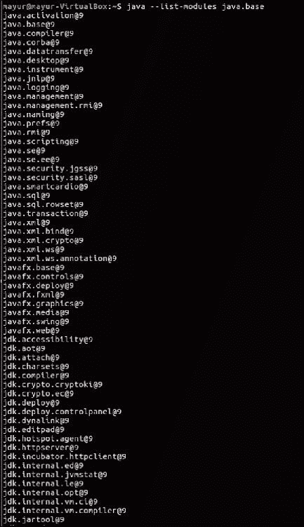
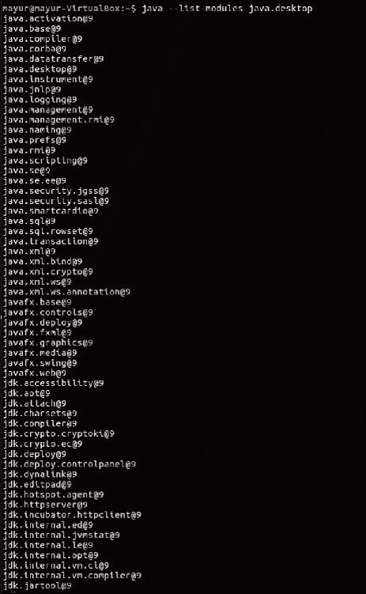
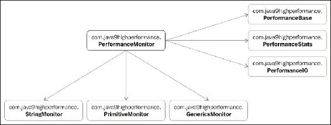
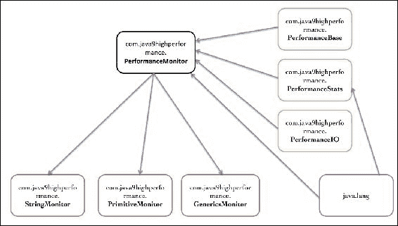
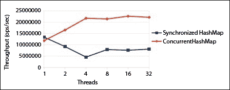

# 第一章：学习 Java 9 的底层性能改进

当你认为你已经掌握了 lambda 和 Java 8 中所有与性能相关的特性时，Java 9 就出现了。以下是一些被纳入 Java 9 的功能，你可以使用它们来帮助提高应用程序的性能。这些功能不仅限于字节级别的变化，如字符串存储或垃圾回收的变化，这些变化你几乎无法控制。此外，忽略那些针对更快对象锁定的实现变化，因为你不需要做任何不同的事情，你将自动获得这些改进。相反，有新的库功能和全新的命令行工具，可以帮助你快速创建应用程序。

在本课中，我们将涵盖以下主题：

+   模块化开发及其对性能的影响

+   多种与字符串相关的性能改进，包括紧凑字符串和 indify 字符串连接

+   并发性的进步

+   各种底层编译器改进，例如分层属性和**即时编译**（**AOT**）

+   安全管理器的改进

+   图形光栅化器的增强

# 介绍 Java 9 的新特性

在本课中，我们将探讨许多在新的环境中运行应用程序时自动获得的性能改进。内部，字符串的变化也极大地减少了在不需要全面 Unicode 支持的字符字符串时的内存占用需求。如果你的大多数字符串可以编码为 ISO-8859-1 或 Latin-1（每个字符 1 个字节），它们在 Java 9 中将存储得更加高效。因此，让我们深入核心库，了解底层性能改进。

# 模块化开发及其影响

在软件工程中，模块化是一个重要的概念。从性能和可维护性的角度来看，创建称为**模块**的独立单元非常重要。这些模块可以组合在一起形成一个完整的系统。模块提供了封装，其中实现被隐藏在其他模块中。每个模块都可以暴露独特的 API，这些 API 可以作为连接器，以便其他模块可以与之通信。这种设计很有用，因为它促进了松散耦合，有助于关注单一功能以使其具有凝聚力，并允许在隔离状态下进行测试。它还减少了系统复杂性并优化了应用程序开发过程。提高每个模块的性能有助于提高整体应用程序的性能。因此，模块化开发是一个非常重要的概念。

我知道你可能正在想，等等，Java 不是已经模块化了吗？Java 的面向对象特性不是已经提供了模块化操作吗？嗯，面向对象确实在数据封装的同时强加了唯一性。它只推荐松耦合，但并不强制执行。此外，它未能提供对象级别的标识，也没有为接口提供任何版本控制方案。现在你可能想知道，关于 JAR 文件呢？它们不是模块化的吗？嗯，尽管 JAR 文件在某种程度上提供了模块化，但它们没有模块化所需的唯一性。它们确实有指定版本号的方案，但这很少使用，并且隐藏在 JAR 的清单文件中。

因此，我们需要一个与我们已有的不同的设计。简单来说，我们需要一个模块化系统，其中每个模块可以包含多个包，并且与标准 JAR 文件相比提供更强大的封装。

这就是 Java 9 模块系统提供的内容。除此之外，它还通过显式声明依赖项来替换了易出错的类路径机制。这些增强提高了整体应用程序的性能，因为开发者现在可以优化单个自包含单元，而不会影响整个系统。

这也使得应用程序更具可扩展性并提供高完整性。

让我们来看看模块系统的一些基本概念以及它是如何整合在一起的。首先，你可以运行以下命令来查看模块系统的结构：

```java
$java --list-modules

```


如果你对某个特定模块感兴趣，你只需在命令末尾添加模块名称即可，如下面的命令所示：

```java
$java --list-modules java.base

```



之前的命令将显示来自基本模块的包中的所有导出项。Java 的基本模块是系统的核心。

这将显示所有图形用户界面包。这也会显示`requires`，即依赖项：

```java
$java --list-modules java.desktop

```



到目前为止一切顺利，对吧？现在你可能想知道，我已经开发了我的模块，但如何将它们集成在一起呢？让我们来看看。Java 9 的模块系统附带了一个名为**JLink**的工具。我知道你现在可以猜到我接下来要说什么。你说对了，它将一组模块链接起来并创建一个运行时镜像。现在想象一下它所能提供的可能性。你可以创建自己的可执行系统，并使用自己的自定义模块。我希望你的生活将变得更加有趣！哦，另一方面，你将能够控制执行并移除不必要的依赖项。

让我们看看如何将模块链接在一起。嗯，这非常简单。只需运行以下命令：

```java
$jlink --module-path $JAVA_HOME/jmods:mlib --add-modules java.desktop --output myawesomeimage

```

这个链接器命令将为你链接所有模块并创建一个运行时镜像。你需要提供一个模块路径，然后添加你想要生成图像的模块，并给出一个名称。这不是很简单吗？

现在，让我们检查之前的命令是否正确执行。让我们验证图中的模块：

```java
$myawesomeimage/bin/java --list-modules

```

输出看起来像这样：


通过这种方式，你现在将能够与你的应用程序一起分发一个快速的运行时。这真是太棒了，不是吗？现在你可以看到我们是如何从一个相对单一的设计转变为一个自包含且一致的设计。每个模块都包含自己的导出和依赖项，JLink 允许你创建自己的运行时。有了这个，我们就得到了我们的模块化平台。

注意，本节的目的只是向你介绍模块化系统。还有很多东西可以探索，但这超出了本书的范围。在本书中，我们将关注性能提升的领域。

## 模块快速入门

我相信，在了解了模块化平台之后，你一定很兴奋地想要深入了解模块架构，看看如何开发一个模块。请保持你的兴奋，我很快就会带你进入模块的精彩世界。

如你所猜，每个模块都有一个属性 `name`，并且按照包进行组织。每个模块作为一个自包含的单元，可能包含原生代码、配置、命令、资源等等。模块的详细信息存储在一个名为 `module-info.java` 的文件中，该文件位于模块源代码的根目录下。在该文件中，模块可以被定义为如下：

```java
module <name>{
}
```

为了更好地理解它，让我们通过一个例子来讲解。假设，我们的模块名称是 `PerformanceMonitor`。这个模块的目的是监控应用程序的性能。输入连接器将接受方法名称和该方法的所需参数。这个方法将从我们的模块中调用以监控模块的性能。输出连接器将为给定模块提供性能反馈。让我们在我们的性能应用程序的根目录下创建一个 `module-info.java` 文件，并插入以下部分：

```java
module com.java9highperformance.PerformanceMonitor{
}
```

太棒了！你已经完成了第一个模块声明。但是等等，它现在还没有做任何事情。别担心，我们只是为它创建了一个骨架。让我们在这个骨架上添加一些内容。假设我们的模块需要与我们的其他（出色的）模块进行通信，这些模块我们已经创建并命名为--`PerformanceBase`、`StringMonitor`、`PrimitiveMonitor`、`GenericsMonitor`等等。换句话说，我们的模块有一个外部依赖。你可能想知道，我们如何在模块声明中定义这种关系？好吧，请耐心等待，这就是我们现在要看到的：

```java
module com.java9highperformance.PerformanceMonitor{
    exports com.java9highperformance.StringMonitor;
    exports com.java9highperformance.PrimitiveMonitor;
    exports com.java9highperformance.GenericsMonitor;
    requires com.java9highperformance.PerformanceBase;
    requires com.java9highperformance.PerformanceStat;
    requires com.java9highperformance.PerformanceIO;
}
```

是的，我知道你已经注意到了两个子句，那就是 `exports` 和 `requires`。我敢肯定你对它们的意义以及为什么要在那里使用它们感到好奇。我们将首先讨论这些子句及其在模块声明中的含义：

+   `exports`：当你的模块依赖于另一个模块时使用这个子句。它表示此模块仅向其他模块公开公共类型，且内部包不可见。在我们的例子中，模块 `com.java9highperformance.PerformanceMonitor` 依赖于 `com.java9highperformance.StringMonitor`、`com.java9highperformance.PrimitiveMonitor` 和 `com.java9highperformance.GenericsMonitor`。这些模块分别导出它们的 API 包 `com.java9highperformance.StringMonitor`、`com.java9highperformance.PrimitiveMonitor` 和 `com.java9highperformance.GenericsMonitor`。

+   `requires`：这个子句表示模块在编译和运行时都依赖于声明的模块。在我们的例子中，`com.java9highperformance.PerformanceBase`、`com.java9highperformance.PerformanceStat` 和 `com.java9highperformance.PerformanceIO` 模块被我们的 `com.java9highperformance.PerformanceMonitor` 模块所需要。模块系统随后定位所有可观察的模块以递归地解决所有依赖关系。这个传递闭包给我们一个模块图，它显示了两个依赖模块之间的有向边。

### 注意

**注意**：每个模块即使没有明确声明，也依赖于 `java.base`。正如你所知道的那样，Java 中的所有东西都是一个对象。

现在你已经了解了模块及其依赖关系。那么，让我们绘制一个模块表示图来更好地理解它。以下图显示了依赖于 `com.java9highperformance.PerformanceMonitor` 的各种包。



底部的模块是 `exports` 模块，右边的模块是 `requires` 模块。

现在让我们探索一个称为 **可读性关系** 的概念。可读性关系是两个模块之间的关系，其中一个模块依赖于另一个模块。这种可读性关系是可靠配置的基础。所以，在我们的例子中，我们可以说 `com.java9highperformance.PerformanceMonitor` 读取 `com.java9highperformance.PerformanceStat`。

让我们看看 `com.java9highperformance.PerformanceStat` 模块的描述文件 `module-info.java`：

```java
module com.java9highperformance.PerformanceStat{
    requires transitive java.lang;
}
```

这个模块依赖于 `java.lang` 模块。让我们详细看看 `PerformanceStat` 模块：

```java
package com.java9highperformance.PerformanceStat;
import java.lang.*;

public Class StringProcessor{
    public String processString(){...}
}
```

在这种情况下，`com.java9highperformance.PerformanceMonitor` 只依赖于 `com.java9highperformance.PerformanceStat`，但 `com.java9highperformance.PerformanceStat` 依赖于 `java.lang`。`com.java9highperformance.PerformanceMonitor` 模块没有意识到来自 `com.java9highperformance.PerformanceStat` 模块的 `java.lang` 依赖。这种类型的问题由模块系统处理。它增加了一个新的修饰符，称为 **transitive**。如果你查看 `com.java9highperformance.PerformanceStat`，你会发现它需要传递的 `java.lang`。这意味着任何依赖于 `com.java9highperformance.PerformanceStat` 的模块都会读取 `java.lang`。

看以下图，它显示了可读性图：



现在，为了编译`com.java9highperformance.PerformanceMonitor`模块，系统必须能够解决所有依赖项。这些依赖项可以从模块路径中找到。这很明显，不是吗？然而，不要将类路径与模块路径混淆。它们是完全不同的类型。它没有包所存在的问题。

# 字符串操作性能

如果你不是编程新手，字符串必须是你迄今为止最好的朋友。在许多情况下，你可能比配偶或伴侣更喜欢它。众所周知，没有字符串你无法生活，实际上，没有使用字符串你甚至无法完成你的应用程序。好吧，关于字符串我们已经说得够多了，我甚至已经因为字符串的使用而感到头晕，就像早期版本的 JVM 一样。玩笑归玩笑，让我们谈谈 Java 9 中发生了哪些变化，这将有助于你的应用程序性能提升。尽管这是一个内部变化，但作为一个应用程序开发者，了解这个概念是很重要的，这样你知道在哪里集中精力进行性能改进。

Java 9 朝着提高字符串性能迈出了第一步。如果你曾经遇到过 JDK 6 的失败尝试`UseCompressedStrings`，那么你一定在寻找提高字符串性能的方法。由于`UseCompressedStrings`是一个实验性特性，容易出错，并且设计得不是很好，它在 JDK 7 中被移除了。对此不要感到难过，我知道它很糟糕，但就像往常一样，黄金时代最终会到来。JEP 团队经历了巨大的痛苦，添加了一个紧凑字符串特性，这将减少字符串及其相关类的占用空间。

紧凑字符串将改善字符串的占用空间，并有助于高效地使用内存空间。它还保留了与所有相关 Java 和本地接口的兼容性。第二个重要特性是**Indify 字符串连接**，它将在运行时优化字符串。

在本节中，我们将深入探讨这两个特性及其对整体应用程序性能的影响。

## 紧凑字符串

在我们讨论这个特性之前，了解我们为什么关心这一点是很重要的。让我们深入 JVM（或者像任何星球大战粉丝可能会说的，力量的黑暗面）的地下世界。首先，让我们了解 JVM 是如何处理我们心爱的字符串的，这将帮助我们理解这个新的闪亮的紧凑字符串改进。让我们进入堆的神奇世界。事实上，没有关于这个神秘世界的讨论，任何性能书籍都是不完整的。

### 堆的世界

每次 JVM 启动时，它从底层操作系统获取一些内存。这些内存被分为两个不同的区域，称为**堆空间**和**Permgen**。这些区域是所有应用程序资源的家。正如生活中所有美好的事物一样，这个家的大小是有限的。这个大小是在 JVM 初始化时设置的；然而，你可以通过指定 JVM 参数`-Xmx`和`-XX:MaxPermSize`来增加或减少这个大小。

堆大小被分为两个区域，即幼年空间或年轻空间和旧空间。正如其名所示，年轻空间是新生对象的家园。这一切听起来都很棒，但每个房子都需要清理。因此，JVM 有最有效的清洁工，称为**垃圾收集器**（最有效？好吧……让我们先不谈这个）。像任何有生产力的清洁工一样，垃圾收集器有效地收集所有未使用的对象并回收内存。当年轻空间因新对象而填满时，垃圾收集器接管并移动那些在年轻空间中存活足够长的时间的对象。这样，年轻空间中总是有空间容纳更多对象。

同样地，如果旧空间被填满，垃圾收集器将回收使用的内存。

## 为什么需要压缩字符串？

现在你对堆有了一些了解，让我们看看`String`类以及字符串在堆上的表示方式。如果你剖析你的应用程序的堆，你会注意到有两个对象，一个是 Java 语言的`String`对象，它引用第二个对象`char[]`，后者实际处理数据。`char`数据类型是 UTF-16，因此占用多达 2 个字节。让我们看看以下示例，看看两种不同语言的字符串是如何表示的：

```java
2 byte per char[]
Latin1 String : 1 byte per char[]
```

所以你可以看到，`Latin1 String`只占用 1 个字节，因此我们在这里损失了大约 50%的空间。有机会以更密集的形式表示它并改进占用空间，这最终有助于加快垃圾回收的速度。

在对这一部分进行任何更改之前，了解其对实际应用的影响非常重要。了解应用程序是否使用每个`char[]`字符串 1 个字节或 2 个字节是至关重要的。

为了得到这个答案，JPM 团队分析了大量真实世界数据的堆转储。结果显示，大多数堆转储中大约有 18%到 30%的整个堆被`chars[]`消耗，这些`chars[]`来自字符串。此外，很明显，大多数字符串都是由每个`char[]`的单个字节表示的。因此，很明显，如果我们尝试通过单个字节来改进字符串的占用空间，这将显著提高许多实际应用的性能。

### 他们做了什么？

在经过许多不同的解决方案之后，JPM 团队最终决定在字符串构建过程中采用压缩策略。首先，乐观地尝试以 1 字节压缩，如果失败，则将其复制为 2 字节。有一些可能的捷径，例如，使用特殊的 ISO-8851-1 编码器，它将始终输出 1 字节。

这个实现比 JDK 6 的`UseCompressedStrings`实现要好得多，后者仅对少数应用程序有帮助，因为它在每次实例上重新打包和拆包字符串进行压缩。因此，性能提升来自于它现在可以处理这两种形式。

### 什么是逃生路线？

尽管听起来很棒，但如果它只使用 2 字节来表示每个`char[]`字符串，它可能会影响应用程序的性能。在这种情况下，不使用之前提到的检查，直接以每个`char[]`的 2 字节存储字符串是有意义的。因此，JPM 团队提供了一个“关闭开关”`--XX: -CompactStrings`，使用它可以禁用此功能。

### 什么是性能提升？

之前的优化会影响堆，因为我们之前看到字符串是在堆中表示的。因此，它正在影响应用程序的内存占用。为了评估性能，我们真的需要关注垃圾收集器。我们将在稍后探讨垃圾收集主题，但现在，让我们只关注运行时性能。

## 简化字符串连接

我相信您一定对刚刚学到的紧凑字符串功能感到兴奋。现在让我们看看字符串最常见的使用方式，即连接。您是否曾经想过当我们尝试连接两个字符串时，实际上会发生什么？让我们来探索。以下是一个例子：

```java
public static String getMyAwesomeString(){
    int javaVersion = 9;
    String myAwesomeString = "I love " + "Java " + javaVersion + " high       performance book by Mayur Ramgir";
    return myAwesomeString;
}
```

在前面的例子中，我们正在尝试使用`int`值连接几个字符串。然后编译器将初始化一个新的`StringBuilder`实例，并将所有这些单独的字符串附加到它上面。看看以下由`javac`生成的字节码。我使用了**ByteCode Outline**插件来可视化此方法的反汇编字节码。您可以从[`andrei.gmxhome.de/bytecode/index.html`](http://andrei.gmxhome.de/bytecode/index.html)下载它：

```java
// access flags 0x9
public static getMyAwesomeString()Ljava/lang/String;
  L0
  LINENUMBER 10 L0
  BIPUSH 9
  ISTORE 0
  L1
  LINENUMBER 11 L1
  NEW java/lang/StringBuilder
  DUP
  LDC "I love Java "
  INVOKESPECIAL java/lang/StringBuilder.<init> (Ljava/lang/String;)V
  ILOAD 0
  INVOKEVIRTUAL java/lang/StringBuilder.append (I)Ljava/lang/StringBuilder;
  LDC " high performance book by Mayur Ramgir"
  INVOKEVIRTUAL java/lang/StringBuilder.append (Ljava/lang/String;)Ljava/lang/StringBuilder;
  INVOKEVIRTUAL java/lang/StringBuilder.toString ()Ljava/lang/String;
  ASTORE 1
  L2
  LINENUMBER 12 L2
  ALOAD 1
  ARETURN
  L3
  LOCALVARIABLE javaVersion I L1 L3 0
  LOCALVARIABLE myAwesomeString Ljava/lang/String; L2 L3 1
  MAXSTACK = 3
  MAXLOCALS = 2
```

快速笔记：我们如何解释这个？

+   `INVOKESTATIC`: 这对于调用静态方法很有用

+   `INVOKEVIRTUAL`: 这用于调用公共和受保护的非静态方法，使用动态调度

+   `INVOKEINTERFACE`: 这与`INVOKEVIRTUAL`非常相似，只是方法调度是基于接口类型的

+   `INVOKESPECIAL`: 这对于调用构造函数、超类的方法和私有方法很有用

然而，在运行时，由于 JIT 编译器中包含了`-XX:+OptimizeStringConcat`，它现在可以识别`StringBuilder`的追加和`toString`链。如果匹配被识别，将生成用于最佳处理的低级代码。计算所有参数的长度，确定最终容量，分配存储空间，复制字符串，并对原始数据进行就地转换。之后，无需复制即可将此数组传递给`String`实例。这是一个有利可图的优化。

但在连接方面也存在一些缺点。一个例子是，对于包含长字符串或双精度浮点数的连接字符串，它无法正确优化。这是因为编译器必须首先执行 `.getChar`，这增加了开销。

此外，如果你将`int`追加到`String`，那么它工作得很好；然而，如果你有一个增量运算符，如`i++`，那么它就会失效。背后的原因是你需要回滚到表达式的开头并重新执行，所以你实际上是在做`++`两次。现在，Java 9 紧凑字符串最重要的变化。长度拼写为`value.length >> coder`；`C2`无法像处理 IR 那样优化它。

因此，为了解决编译器优化和运行时支持的问题，我们需要控制字节码，我们不能期望`javac`来处理这个问题。

我们需要延迟在运行时可以执行哪种连接的决定。我们是否可以有这样一个`String.concat`方法，它将完成魔法般的操作。好吧，不要急于行动，因为你怎么设计`concat`方法。让我们看看。一种方法是可以接受一个`String`实例的数组：

```java
public String concat(String... n){
    //do the concatenation
}
```

然而，这种方法不适用于原始数据类型，因为你现在需要将每个原始数据类型转换为`String`实例，而且，正如我们之前看到的，问题是长字符串和双精度浮点数连接将不允许我们优化它。我知道，我能感觉到你脸上的光芒，就像你得到了一个解决这个痛苦问题的绝妙想法。你是在想用`Object`实例而不是`String`实例，对吧？正如你所知，`Object`实例是通用的。让我们看看你的绝妙想法：

```java
public String concat(Object... n){
    //do the concatenation
}
```

首先，如果你使用`Object`实例，那么编译器需要进行自动装箱。此外，你正在传递一个`varargs`数组，所以它不会表现最佳。所以，我们是不是陷入了僵局？这意味着我们无法使用字符串连接的突出紧凑字符串功能？让我们再思考一下；也许我们可以让`javac`处理连接，只给我们优化后的字节码。这听起来是个好主意。等等，我知道你也在想同样的事情。如果 JDK 10 进一步优化这个功能，这意味着什么？这意味着当我升级到新 JDK 时，我必须重新编译我的代码并重新部署它吗？在某些情况下，这不是问题，在其他情况下，这是一个大问题。所以，我们又回到了起点。

我们需要能够在运行时处理的东西。好吧，这意味着我们需要能够动态调用方法的东西。嗯，这让我想起了什么。如果我们回到 JDK 7 时代的起点，它给了我们`invokedynamic`。我知道你能看到解决方案，我能感觉到你眼中的光芒。是的，你是对的，`invokedynamic`可以帮我们解决这个问题。如果你不了解`invokedynamic`，让我们花点时间来理解它。对于那些已经掌握了这个主题的人来说，你可以跳过这部分，但我建议你再次阅读。

### Invokedynamic

`invokedynamic`特性是 Java 历史上最显著的特征。我们不再受限于 JVM 字节码，现在我们可以定义自己的操作方式。那么什么是`invokedynamic`呢？简单来说，它是由用户定义的字节码。这个字节码（而不是 JVM）决定了执行和优化策略。它提供了各种方法指针和适配器，这些指针以方法处理 API 的形式存在。然后 JVM 根据字节码中给出的指针进行工作，并使用类似反射的方法指针来优化它。这样，作为开发者的你，可以完全控制代码的执行和优化。

它本质上是由用户定义的字节码（被称为**字节码 + 引导**)和方法句柄混合而成的。我知道你也在想关于方法句柄的问题——它们是什么，如何使用？好吧，我听到了你的声音，让我们来谈谈方法句柄。

方法句柄提供各种指针，包括字段、数组和方法，用于传递数据和返回结果。有了这个，你可以进行参数操作和流程控制。从 JVM 的角度来看，这些是原生指令，它可以像字节码一样进行优化。然而，你可以选择程序性地生成这种字节码。

让我们放大方法句柄，看看它们是如何相互关联的。主包的名称是`java.lang.invoke`，它包含`MethodHandle`、`MethodType`和`MethodHandles`。`MethodHandle`是用于调用函数的指针。`MethodType`是方法中参数集合和返回值的表示。实用类`MethodHandles`将作为指向方法的指针，它将获取`MethodHandle`的实例并映射参数。

我们不会深入探讨这一部分，因为我们的目标只是让你了解`invokedynamic`特性是什么以及它是如何工作的，这样你就能理解字符串连接解决方案。所以，这就是我们回到关于字符串连接讨论的地方。我知道，你在享受`invokedynamic`的讨论，但我猜我给你提供了足够的洞察力，让你理解 Indify 字符串连接的核心思想。

让我们回到我们寻找解决方案以连接我们出色的紧凑字符串的部分。为了连接紧凑字符串，我们需要注意类型和方法的数量，这正是 `invokedynamic` 给我们的。

所以让我们为 `concat` 使用 `invokedynamic`。嗯，别那么快，我的朋友。这种方法有一个基本问题。我们不能简单地使用 `invokedynamic` 来解决这个问题。为什么？因为存在循环引用。`concat` 函数需要 `java.lang.invoke`，它又使用了 `concat`。这样继续下去，最终你会得到 `StackOverflowError`。

看看下面的代码：

```java
String concat(int i, long l, String s){
    return s + i + l
}
```

所以如果我们在这里使用 `invokedynamic`，`invokedynamic` 调用将看起来像这样：

```java
InvokeDynamic #0: makeConcat(String, int, long)
```

需要打破循环引用。然而，在当前的 JDK 实现中，你无法控制 `java.invoke` 从完整的 JDK 库中调用什么。此外，从 `java.invoke` 中移除完整的 JDK 库引用会产生严重的副作用。我们只需要 `java.base` 模块来进行 Indify 字符串连接，如果我们能找到一种方法只调用 `java.base` 模块，那么这将显著提高性能并避免不愉快的异常。我知道你在想什么。我们刚刚学习了 Java 9 中最酷的新增功能，**Project Jigsaw**。它提供了模块化源代码，现在我们只能接受 `java.base` 模块。这解决了我们在连接两个字符串、原始数据等方面面临的最大问题。

经过几个不同的策略后，Java 性能管理团队已经确定以下策略：

1.  对所有引用参数调用 `toString()` 方法。

1.  调用 `tolength()` 方法，或者由于所有底层方法都已公开，只需在每个参数上调用 `T.stringSize(T t)`。

1.  找出编码者并对所有引用参数调用 `coder()`。

1.  分配 `byte[]` 存储空间，然后复制所有参数。然后，就地转换原始数据。

1.  通过传递用于连接的数组来调用私有的 `String` 构造函数。

通过这种方式，我们能够在相同的代码中而不是在 `C2 IR` 中获得优化的字符串连接。这种策略给我们带来了 2.9 倍的性能提升和 6.4 倍的垃圾减少。

# 在 CDS 存档中存储内部字符串

这个特性的主要目标是减少由在每一个 JVM 进程中创建新的字符串实例所造成的内存占用。在任何 JVM 进程中加载的所有类都可以通过 **Class Data Sharing** (**CDS**) 存档与其他 JVM 进程共享。

哦，我没有告诉你关于 CDS 的信息。我认为花些时间了解 CDS 是很重要的，这样你才能理解底层性能提升。

许多时候，特别是小型应用程序在启动操作上花费的时间相对较长。为了减少启动时间，引入了一个称为 CDS 的概念。CDS 允许在 JRE 安装期间将系统 JAR 文件中加载的一组类共享到一个私有的内部表示中。这非常有帮助，因为这样任何进一步的 JVM 调用都可以利用这些已加载类的表示，而不是再次加载这些类。这些类的相关元数据在多个 JVM 进程之间共享。

CDS 以 UTF-8 的形式在常量池中存储字符串。当从这些加载的类开始初始化过程时，这些 UTF-8 字符串会根据需要转换为 `String` 对象。在这个结构中，每个受限字符串中的每个字符在 `String` 对象中占用 2 个字节，在 UTF-8 中占用 1 到 3 个字节，这实际上浪费了内存。由于这些字符串是动态创建的，不同的 JVM 进程无法共享这些字符串。

共享字符串需要一个称为**固定区域**的功能才能利用垃圾收集器。由于唯一支持固定功能的 HotSpot 垃圾收集器是 G1；它只与 G1 垃圾收集器一起工作。

# 并发性能

多线程是一个非常流行的概念。它允许程序同时运行多个任务。这些多线程程序可能有多个可以并发运行的单元。每个单元可以处理不同的任务，保持可用资源的最佳使用。这可以通过并行运行的多个线程来管理。

Java 9 改进了竞争锁。你可能想知道什么是竞争锁。让我们来探讨一下。每个对象都有一个可以被一个线程一次拥有的监视器。监视器是并发的基石。为了使一个线程能够执行在对象上标记为同步的代码块或对象声明的同步方法，它必须拥有这个对象的监视器。由于有多个线程试图访问提到的监视器，JVM 需要协调这个过程，并且一次只允许一个线程访问。这意味着其余的线程进入等待状态。这个监视器因此被称为竞争的。因为这个规定，程序在等待状态下浪费了时间。

此外，**Java 虚拟机**（**JVM**）在协调锁竞争方面做了一些工作。此外，它还需要管理线程，所以一旦现有线程完成其执行，它就可以允许一个新的线程进入。这无疑增加了开销，并会对性能产生不利影响。Java 9 已经采取了一些步骤来改进这个领域。这个规定细化了 JVM 的协调，这将最终导致在高度竞争的代码中性能的提高。

以下基准测试和测试可以用来检查竞争的 Java 对象监视器的性能改进：

+   `CallTimerGrid`（这更像是一个压力测试而不是基准测试）

+   `Dacapo-bach`（早期的 dacapo2009）

+   `_ avrora`

+   `_ batik`

+   `_ fop`

+   `_ h2`

+   `_ luindex`

+   `_ lusearch`

+   `_ pmd`

+   `_ sunflow`

+   `_ tomcat`

+   `_ tradebeans`

+   `_ tradesoap`

+   `_ xalan`

+   `DerbyContentionModelCounted`

+   `高冲突模拟器`

+   `LockLoops-JSR166-Doug-Sept2009`（早期版本 LockLoops）

+   `PointBase`

+   `SPECjbb2013-critical`（早期版本 specjbb2005）

+   `SPECjbb2013-max`

+   `specjvm2008`

+   `volano29`（早期版本 volano2509）

# 编译器改进

已经做出了几项努力来提高编译器的性能。在本节中，我们将重点关注编译器方面的改进。

## 层级归因

提供编译器改进的第一个和最重要的变化与**层级归因**（**TA**）相关。这个变化更多地与 lambda 表达式相关。目前，多态表达式的类型检查是通过多次对同一棵树进行不同目标类型检查来完成的。这个过程被称为**推测性归因**（**SA**），它允许使用不同的重载解析目标来检查 lambda 表达式。

这种类型检查的方式，虽然是一种稳健的技术，但会对性能产生显著的不利影响。例如，采用这种方法，每个重载候选者都会在重载阶段对相同的参数表达式进行一次检查，直到重载的严格、宽松和可变参数阶段，检查次数达到 *n * 3。此外，还有一个最终的检查阶段。当 lambda 返回多态方法调用结果时，会导致归因调用组合爆炸，这会引起巨大的性能问题。因此，我们确实需要为多态表达式寻找不同的类型检查方法。

核心思想是确保每次方法调用都为每个多态参数表达式创建自下而上的结构化类型，这些类型将用于在执行重载解析适用性检查之前。

总结来说，性能提升能够通过减少尝试的总次数来实现给定表达式的属性。

## 预编译

编译器改进的第二个显著变化是预编译。如果你不熟悉这个术语，让我们看看 AOT 是什么。正如你可能知道的，任何语言的每个程序都需要一个运行时环境来执行。Java 也有自己的运行时，被称为**Java 虚拟机**（**JVM**）。我们大多数人使用的典型运行时是一个字节码解释器，它也是一个即时编译器。这个运行时被称为**HotSpot JVM**。

这个 HotSpot JVM 因其通过即时编译（JIT）以及自适应优化来提高性能而闻名。到目前为止一切顺利。然而，这并不是每个应用程序在实践中的最佳选择。假设你有一个非常轻的程序，比如说一个单独的方法调用？在这种情况下，即时编译对你帮助不大。你需要一些能更快加载的东西。这就是 AOT 能帮到你的地方。与 JIT 相反，你不仅可以编译成字节码，还可以编译成本地机器码。然后运行时会使用这个本地机器码来管理新对象的 malloc 调用以及文件访问的系统调用。这可以提高性能。

# 安全管理器改进

好吧，让我们谈谈安全。如果你不是那些在发布新功能时更关心应用程序安全而不是安全的人，那么你脸上的表情可能就是**啊！那是什么？**如果你是那些人之一，那么让我们首先了解安全的重要性，并找到一种方法将其纳入你的应用程序开发任务中。在当今以 SaaS 主导的世界里，一切都被暴露在外部世界。一个有决心的个人（用一种好听的方式来说，就是一个**恶意黑客**），可以访问你的应用程序并利用你因疏忽而引入的安全漏洞。我很乐意深入讨论应用程序安全，因为这又是一个我非常感兴趣的领域。然而，应用程序安全不在这个书的范围之内。我们在这里谈论它的原因是因为 JPM 团队已经采取了一项改进现有安全管理器的举措。因此，在谈论安全管理器之前，首先了解安全的重要性是很重要的。

希望这一行描述能激发你对安全编程的兴趣。然而，我明白有时你可能因为时间紧迫而没有足够的时间来实现一个完整的安全编程模型。所以，让我们找到一个适合你紧张日程的方法。让我们思考一下；有没有自动化的安全方法？我们能否有一种创建蓝图并要求我们的程序在边界内运行的方法？好吧，你很幸运，Java 确实有一个叫做**安全管理器**的功能。它不过是一个定义应用程序安全策略的策略管理器。听起来很吸引人，不是吗？但是这个策略看起来是什么样子？它包含什么？这两个问题都是合理的。这个安全策略基本上声明了那些本质上是危险或敏感的操作。如果你的应用程序不遵守这个策略，那么安全管理器会抛出`SecurityException`。另一方面，你可以让应用程序调用这个安全管理器来了解允许的操作。现在，让我们详细看看安全管理器。

在网络小程序的情况下，浏览器提供安全管理者，或者 Java Web Start 插件运行此策略。在许多情况下，除了网络小程序之外的应用程序在没有安全管理者的情况下运行，除非那些应用程序实现了它。如果既没有安全管理者也没有安全策略附加，应用程序将无限制地运行。

现在我们对安全管理者有了一些了解，让我们看看这个领域的性能改进。据 Java 团队所说，一个运行带有安全管理者安装的应用程序可能会降低 10%到 15%的性能。然而，不可能完全消除所有性能瓶颈，但缩小这个差距不仅可以提高安全性，还可以提高性能。

Java 9 团队考虑了一些优化，包括执行安全策略和权限评估，这将有助于提高使用安全管理器的整体性能。在性能测试阶段，突出指出尽管权限类是线程安全的，但它们在 HotSpot 中显示出来。已经做出了许多改进，以减少线程竞争并提高吞吐量。

`java.security.CodeSource`的`hashCode`方法已经改进，使用代码源 URL 的字符串形式来避免可能昂贵的 DNS 查找。此外，包含包检查算法的`java.lang.SecurityManager`的`checkPackageAccess`方法也得到了改进。

安全管理者改进的其他一些显著变化如下：

+   第一个明显的改变是，用`ConcurrentHashMap`代替`Collections.synchronizedMap`有助于提高`Policy.implie`方法的吞吐量。请看以下来自 OpenJDK 网站的图表，它突出了使用`ConcurrentHashMap`后吞吐量的显著提升：

+   此外，`HashMap`，它一直被用于在`java.security.SecureClassLoader`中维护`CodeSource`的内部集合，已经被`ConcurrentHashMap`所取代。

+   还有一些其他的小改进，比如通过从`getPermissions`方法（`CodeSource`）中移除兼容性代码来提高吞吐量，该方法在身份上进行了同步。

+   使用`ConcurrentHashMap`而不是在权限检查代码中用同步块包围的`HashMap`，实现了性能的显著提升，这带来了更高的线程性能。

# 图形光栅化器

如果你热衷于 Java 2D 并且使用 OpenJDK，你会赞赏 Java 9 团队所做的努力。Java 9 主要与图形光栅化器相关，它是当前 JDK 的一部分。OpenJDK 使用 Pisces，而 Oracle JDK 使用 Ductus。Oracle 的闭源 Ductus 光栅化器比 OpenJDK 的 Pisces 性能更好。

这些图形光栅化器对抗锯齿渲染很有用，除了字体。因此，对于图形密集型应用程序，这个光栅化器的性能非常重要。然而，Pisces 在许多方面都失败了，其性能问题非常明显。因此，团队决定用名为 Marlin 图形渲染器的不同光栅化器来替换它。

Marlin 是用 Java 开发的，最重要的是，它是 Pisces 光栅化器的分支。对它进行了各种测试，结果非常令人鼓舞。它始终比 Pisces 表现得更好。它展示了多线程的可伸缩性，甚至在单线程应用程序中优于闭源 Ductus 光栅化器。

# 摘要

在本课中，我们看到了一些令人兴奋的特性，这些特性将提高您的应用程序性能，而无需您做出任何努力。

在下一课中，我们将学习关于 JShell 和 **即时编译器**（**AOT**）（**AOT**）以及 **读取-评估-打印循环**（**REPL**）工具。

# 评估

1.  JLink 是 Java 9 模块化系统的 _________。

1.  两个模块之间的关系是什么，其中一个模块依赖于另一个模块？

    1.  可读性关系

    1.  可操作性关系

    1.  模块关系

    1.  实体关系

1.  判断以下陈述是对还是错：每次 JVM 启动时，它从底层操作系统获取一些内存。

1.  以下哪个执行了一些协调锁竞争的工作？

    1.  锁定区域

    1.  可读性关系

    1.  Java 虚拟机

    1.  类数据共享

1.  以下哪个允许使用不同的重载解析目标来检查 lambda 表达式？

    1.  分层分配

    1.  HotSpot JVM

    1.  投机性分配

    1.  Permgen
