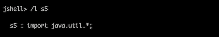
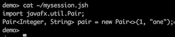
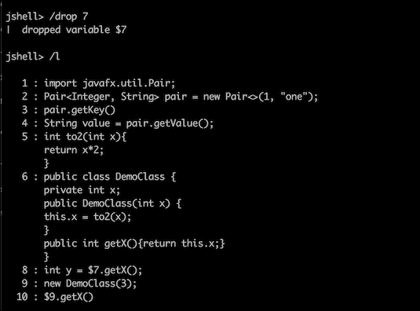

# 第二章. 提高生产力和快速应用工具

```java
/list), and /-<n> allow re-running of the snippets that have been run previously.
JShell was able to provide the suggestion because the JAR file with the compiled Pair class was on the classpath (set there by default as part of JDK libraries). You can also add to the classpath any other JAR file with the compiled classes you need for your coding. You can do it by setting it at JShell startup by the option --class-path (can be also used with one dash -class-path):
```


```java
Shift + *Tab* and then *I* as described earlier.
`<name or id>`: This is the name or ID of a specific snippet or method or type or variable (we will see examples later)`-start`: This shows snippets or methods or types or variables loaded at the JShell start (we will see later how to do it)`-all`: This shows snippets or methods or types or variables loaded at the JShell start and entered later during the session
```

```java
s5:
```



```java
pair), saved the session entries in the file mysession.jsh (in the home directory), and closed the session. Let's look in the file mysession.jsh now:
```



```java
7:
```



```java
/o <file> that opens the file as the source input.
```

命令 `/en`、`/res` 和 `/rel` 具有重叠的功能：

+   `/en [options]`: 这允许查看或更改评估上下文

+   `/res [options]`: 这将丢弃所有输入的片段并重新启动会话

+   `/rel[options]`: 这以与命令 `/en` 相同的方式重新加载会话

有关更多详细信息和建议选项，请参阅官方 Oracle 文档([`docs.oracle.com/javase/9/tools/jshell.htm`](http://docs.oracle.com/javase/9/tools/jshell.htm))。

命令 `[/se [setting]` 设置配置信息，包括外部编辑器、启动设置和反馈模式。此命令还用于创建具有自定义提示、格式和截断值的自定义反馈模式。如果没有输入设置，则显示编辑器、启动设置和反馈模式的当前设置。前面提到的文档详细描述了所有可能的设置。

当 JShell 集成到 IDE 中时，它将更加有用，这样程序员就可以即时评估表达式，甚至更好的是，它们可以像编译器今天评估语法一样自动评估。

# 预编译（AOT）

Java 的宏伟主张是“一次编写，到处运行”。这是通过为几乎所有平台创建 Java 运行时环境（**JRE**）的实现来实现的，因此 Java 编译器（`javac`工具）从源代码生成的一次字节码可以在安装了 JRE 的任何地方执行，前提是编译器`javac`的版本与 JRE 的版本兼容。

JRE 的最初版本主要是字节码的解析器，其性能比 C 和 C++等一些语言及其编译器要慢。然而，随着时间的推移，JRE 得到了显著改进，现在能够产生相当不错的成果，与许多其他流行的系统相当。在很大程度上，这归功于即时编译器（JIT），它将最常用方法的字节码转换为本地代码。一旦生成，编译的方法（特定平台的机器代码）在需要时执行，无需任何解释，从而减少了执行时间。

为了利用这种方法，JRE 需要一些时间来确定应用程序中使用最频繁的方法。在这个编程领域工作的人称它们为“热点方法”。这个发现期，直到达到峰值性能，通常被称为 JVM 的预热时间。对于更大、更复杂的 Java 应用程序来说，这个时间更长，而对于较小的应用程序来说，可能只有几秒钟。然而，即使达到了峰值性能，由于特定的输入，应用程序可能会开始使用之前从未使用过的执行路径，调用尚未编译的方法，从而突然降低性能。当尚未编译的代码属于在罕见的关键情况下调用的复杂过程时，这可能会特别严重，这正是需要最佳性能的时候。

自然解决方案是允许程序员决定哪些应用程序组件需要预先编译成本地机器代码——那些使用频率较高的（从而减少应用程序的预热时间），以及那些虽然使用频率不高但需要尽可能快地执行（以支持关键情况和整体稳定性能）的组件。这就是**Java 增强提案 JEP 295：提前编译**的动机：

即时编译器速度快，但 Java 程序可能会变得非常大，以至于即时编译器完全预热需要很长时间。不常用的 Java 方法可能根本不会被编译，这可能会因为重复的解释调用而造成性能损失。

值得注意的是，即使在即时编译器（JIT compiler）中，通过设置编译阈值（即一个方法被调用多少次后才会编译成本地代码）也可以减少预热时间。默认情况下，这个数字是 1,500。因此，如果我们将其设置为低于这个数字，预热时间将会缩短。这可以通过使用`java`工具的`-XX:CompileThreshold`选项来实现。例如，我们可以将阈值设置为 500，如下所示（其中`Test`是包含`main()`方法的编译后的 Java 类）：

```java
java -XX:CompileThreshold=500 -XX:-TieredCompilation Test
```

选项`-XX:-TieredCompilation`被添加来禁用分层编译，因为它默认启用且不遵守编译阈值。可能的缺点是 500 的阈值可能太低，导致编译的方法太多，从而降低性能并增加预热时间。这个选项的最佳值会因应用程序而异，甚至可能取决于同一应用程序的特定数据输入。

## 静态编译与动态编译

许多高级编程语言，如 C 或 C++，从一开始就使用了 AOT 编译。它们也被称作**静态编译**语言。由于 AOT（或静态）编译器不受性能要求的限制（至少不像运行时的解释器那样受限制，也称为**动态编译器**），它们可以承担起花费时间产生复杂代码优化的成本。另一方面，静态编译器没有运行时（配置文件）数据，这在动态类型语言的情况下尤其受限，Java 就是其中之一。由于 Java 中动态类型的能力——向下转型到子类型、查询对象以获取其类型以及其他类型操作——是面向对象编程（多态原则）的支柱，因此 Java 的 AOT 编译变得更加有限。Lambda 表达式对静态编译又提出了另一个挑战，并且目前尚不支持。

动态编译器的另一个优点是它可以做出假设并相应地优化代码。如果假设被证明是错误的，编译器可以尝试另一个假设，直到达到性能目标。这样的过程可能会减慢应用程序的速度和/或增加预热时间，但长期来看可能会带来更好的性能。基于配置文件的优化可以帮助静态编译器沿着这条路径前进，但它与动态编译器相比，在优化的机会上始终有限。

话虽如此，我们不应该对当前 JDK 9 中的 AOT（即时编译）实现是实验性的以及仅限于 64 位 Linux 系统感到惊讶，因为目前它只支持并行或 G1 垃圾收集，并且唯一支持的模块是 `java.base`。此外，AOT 编译应该在执行生成的机器代码的同一系统或配置相同的系统上执行。尽管如此，JEP 295 中声明：

性能测试表明，一些应用程序从 AOT 编译的代码中受益，而其他应用程序则明显出现性能下降。

值得注意的是，AOT 编译在 **Java 微版**（**ME**）中已经得到了长期支持，但 **Java 标准版**（**SE**）中 AOT 的用例尚未确定，这也是实验性 AOT 实现在 JDK 9 中发布的原因之一——为了便于社区尝试并报告实际需求。

## AOT 命令和过程

JDK 9 中底层的 AOT 编译基于 Oracle 项目 `Graal`——这是一个与 JDK 8 一起引入的开源编译器，旨在提高 Java 动态编译器的性能。AOT 小组不得不对其进行修改，主要围绕常量处理和优化。他们还添加了概率配置文件和特殊的内联策略，从而使 Graal 更适合静态编译。

除了现有的编译工具 `javac` 之外，JDK 9 安装中还包括一个新的 `jaotc` 工具。使用 `libelf` 库生成的 AOT 共享库 `.so` 文件。该依赖关系将在未来的版本中删除。

要开始 AOT 编译，用户必须启动 `jaotc` 并指定需要编译的类、JAR 文件或模块。输出库（包含生成的机器代码）的名称也可以作为 `jaotc` 参数传递。如果没有指定，输出将默认为 `unnamed.so`。以下是一个例子，看看 AOT 编译器如何与 `HelloWorld` 类一起工作：

```java
public class HelloWorld {
   public static void main(String... args) {
       System.out.println("Hello, World!");
   }
}
```

首先，我们将使用 `javac` 生成字节码并生成 `HelloWorld.class`：

```java
javac HelloWorld.java
```

然后，我们将使用 `HelloWorld.class` 文件中的字节码将机器代码生成到库 `libHelloWorld.so` 中：

```java
jaotc --output libHelloWorld.so HelloWorld.class
```

现在，我们可以使用 `java` 工具和 `-XX:AOTLibrary` 选项执行生成的库（在 `jaotc` 执行的平台具有相同规范的情况下）：

```java
java -XX:AOTLibrary=./libHelloWorld.so HelloWorld
```

`-XX:AOTLibrary` 选项允许我们通过逗号分隔列出几个 AOT 库。

注意，`java` 工具除了需要所有应用程序的字节码外，还需要其一些组件的原生代码。这一事实削弱了静态编译的所谓优势，一些 AOT 爱好者声称它可以更好地保护代码免遭反编译。在将来，如果相同的类或方法已经在 AOT 库中，字节码可能不再需要在运行时使用。然而，截至今天，情况并非如此。

要查看是否使用了 AOT 编译的方法，可以添加 `-XX:+PrintAOT` 选项：

```java
java -XX:AOTLibrary=./libHelloWorld.so -XX:+PrintAOT HelloWorld
```

它将允许你在输出中看到加载的行 `./libHelloWorld.so` AOT 库。

如果一个类的源代码已更改但未通过 `jaotc` 工具推送到 AOT 库中，JVM 将在运行时注意到这一点，因为每个编译类的指纹都存储在 AOT 库中与其原生代码一起。然后 JIT 将忽略 AOT 库中的代码，而使用字节码。

JDK 9 中的 `java` 工具支持一些其他与 AOT 相关的标志和选项：

+   `-XX:+/-UseAOT` 告诉 JVM 使用或忽略 AOT 编译的文件（默认设置为使用 AOT）

+   `-XX:+/-UseAOTStrictLoading` 打开/关闭 AOT 严格加载；如果打开，它将指示 JVM 如果任何 AOT 库是在与当前运行时配置不同的配置平台上生成的，则退出。

JEP 295 描述了 `jaotc` 工具的命令格式如下：

```java
jaotc <options> <name or list>
```

`name` 是类名或 JAR 文件。`list` 是冒号 `:` 分隔的类名、模块、JAR 文件或包含类文件的目录列表。`options` 是以下列表中的一个或多个标志：

+   `--output <文件>`: 这是输出文件名（默认为 `unnamed.so`）

+   `--class-name <类名>`: 这是需要编译的 Java 类列表

+   `--jar <jar 文件>`: 这是需要编译的 JAR 文件列表

+   `--module <modules>`: 这是要编译的 Java 模块列表

+   `--directory <dirs>`: 这是您可以搜索编译文件的目录列表

+   `--search-path <dirs>`: 这是搜索指定文件的目录列表

+   `--compile-commands <file>`: 这是包含编译命令的文件名；以下是一个示例：

    ```java
    exclude sun.util.resources..*.TimeZoneNames_.*.getContents\(\)\[\[Ljava/lang/Object;
    exclude sun.security.ssl.*
    compileOnly java.lang.String.*

    ```

AOT 目前识别两个编译命令：

+   `exclude`: 排除指定方法的编译

+   `compileOnly`: 仅编译指定的方法

正则表达式用于指定类和方法，这里提到的有：

+   `--compile-for-tiered`: 为分层编译生成分析代码（默认情况下，不生成分析代码）

+   `--compile-with-assertions`: 生成带有 Java 断言的代码（默认情况下，不生成断言代码）

+   `--compile-threads <number>`: 这是要使用的编译线程数（默认情况下，为 16 和可用 CPU 数中的较小值）

+   `--ignore-errors`: 忽略在类加载期间抛出的所有异常（默认情况下，如果类加载抛出异常，则退出编译）

+   `--exit-on-error`: 在编译错误时退出（默认情况下，跳过失败的编译，而其他方法的编译继续）

+   `--info`: 打印编译阶段的信息

+   `--verbose`: 打印编译阶段的更多详细信息

+   `--debug`: 打印更多详细信息

+   `--help`: 打印帮助信息

+   `--version`: 打印版本信息

+   `-J<flag>`: 将标志直接传递给 JVM 运行时系统

如我们之前提到的，一些应用程序可以使用 AOT 提高性能，而其他应用程序可能会变慢。只有测试才能为每个应用程序关于 AOT 有用性的问题提供明确的答案。在任何情况下，提高性能的一种方法是通过编译和使用`java.base`模块的 AOT 库：

```java
jaotc --output libjava.base.so --module java.base
```

在运行时，AOT 初始化代码会在`$JAVA_HOME/lib`目录或由`-XX:AOTLibrary`选项列出的库中查找共享库。如果找到共享库，它们将被选中并使用。如果没有找到共享库，AOT 将被关闭。

# 摘要

在本课中，我们介绍了两个可以帮助开发者提高生产力的新工具（JShell 工具）以及如何通过监控了解瓶颈后提高 Java 应用程序性能（`jaotc`工具）。使用它们的示例和步骤将帮助您了解它们使用的优势，并在您决定尝试时让您入门。

在下一课中，我们将讨论如何使用命令行工具程序化地监控 Java 应用程序。我们还将探讨如何通过多线程提高应用程序性能，以及如何在监控了解瓶颈后调整 JVM 本身。

# 评估

1.  ________ 编译器将 Java 字节码转换为本地机器代码，以便生成的二进制文件可以本地执行。

1.  以下哪个命令用于根据名称或 ID 删除引用的片段？

    1.  `/d <name or id>`

    1.  `/drop <name or id>`

    1.  `/dr <name or id>`

    1.  `/dp <name or id>`

1.  判断对错：Shell 是一种预编译工具，对于 Scala 和 Ruby 程序员来说非常知名。它接收用户输入，评估它，并在一段时间后返回结果。

1.  以下哪个命令用于列出你在 JShell 中输入的源代码？

    1.  `/l [<name or id>|-all|-start]`

    1.  `/m [<name or id>|-all|-start]L`

    1.  `/t [<name or id>|-all|-start]`

    1.  `/v [<name or id>|-all|-start]`

1.  以下哪个正则表达式在类加载过程中忽略所有抛出的异常？

    1.  `--exit-on-error`

    1.  `–ignores-errors`

    1.  `--ignore-errors`

    1.  `--exits-on-error`
