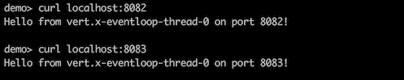
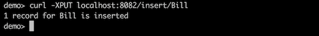
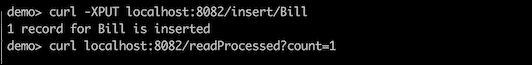
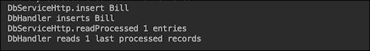
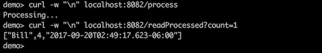
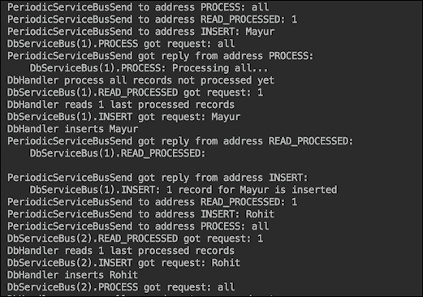
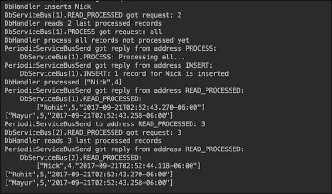
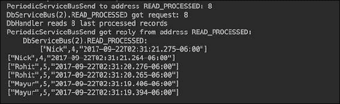

# 第四章：微服务

只要我们一直在谈论一个过程的设计、实施和调整，我们就能用金字塔建造的生动图像（尽管只是我们想象中的）来展示它。基于线程池成员之间平等民主原则的多线程管理，也有一种集中规划和监督的感觉。线程的优先级被程序性地分配，在程序员经过深思熟虑后（对于大多数情况）硬编码，并根据预期的负载进行调整。可用的资源上限是固定的，尽管在再次做出相对较大的集中决策后，它们可以被增加。

这些系统取得了巨大的成功，并且仍然构成了目前部署到生产中的大多数网络应用。其中许多是单体应用，密封在单个`.ear`或`.war`文件中。这对相对较小的应用和相应的支持团队规模来说效果很好。如果代码结构良好，它们易于维护、构建，并且如果生产负载不是非常高，它们可以轻松部署。如果业务没有增长或对公司的互联网存在影响不大，它们将继续完成工作，并且可能会在可预见的未来继续这样做。许多服务提供商都渴望通过收取少量费用来托管此类网站，从而减轻网站所有者与业务无关的生产维护的技术担忧。但并非所有人都如此。

负载越高，扩展就越困难、成本越高，除非代码和整体架构被重构以变得更加灵活和能够应对不断增长的压力。本课程描述了行业领导者们在解决该问题及其背后的动机时采用的解决方案。

在本课程中我们将讨论的微服务的特定方面包括以下内容：

+   微服务兴起的动机

+   最近为支持微服务而开发的框架

+   带有实际案例的微服务开发过程，包括在构建微服务时的考虑和决策过程

+   三种主要部署方法（如无容器、自包含和在容器内）的优缺点

# 为什么选择微服务？

一些企业对部署计划的需求更高，因为需要跟上更大流量的需求。应对这一挑战的自然答案，并且也是实际的做法，就是添加具有相同 `.ear` 或 `.war` 文件的服务器，并将所有服务器加入到一个集群中。这样，一个失败的服务器可以被集群中的另一个服务器自动替换，而网站用户永远不会体验到服务的断开。支持所有集群服务器的数据库也可以进行集群。每个集群的连接都通过负载均衡器进行，确保集群中的任何成员都不会比其他成员工作得更多。

网络服务器和数据库集群虽然有所帮助，但仅限于一定程度，因为随着代码库的增长，其结构可能会产生一个或多个瓶颈，除非用可扩展的设计来解决类似问题。实现这一目标的一种方法是将代码分成层：前端（或网络层）、中间层（或应用层）和后端（或后端层）。然后，再次，每一层都可以独立部署（如果层之间的协议没有改变），并在其自己的服务器集群中部署，因为每一层可以根据需要独立地水平扩展，而不依赖于其他层。这种解决方案为扩展提供了更多的灵活性，但使得部署计划更加复杂，尤其是在新代码引入破坏性更改的情况下。其中一种方法是为新代码创建第二个集群，然后逐个从旧集群中取出服务器，部署新代码，并将它们放入新集群。一旦每个层的至少一个服务器都部署了新代码，新集群就会启动。这种方法对于网络和应用层来说效果良好，但对于后端来说则更为复杂，后端偶尔需要数据迁移和类似的愉快练习。再加上在部署过程中由于人为错误、代码缺陷、纯粹的事故或上述所有因素的某种组合而导致的意外中断，就不难理解为什么很少有人喜欢将主要版本发布到生产环境中了。

程序员作为天生的问题解决者，通过编写防御性代码、弃用而不是更改、测试等方式，尽可能地防止早期场景的发生。其中一种方法是将应用程序分解成更多独立部署的部分，希望避免同时部署所有内容。他们将这些独立单元称为**服务**，从而诞生了**面向服务的架构**（**SOA**）。

不幸的是，在许多公司中，代码库的自然增长并没有及时调整以适应新的挑战。就像最终在慢慢加热的水壶中被煮青蛙一样，他们从未有时间通过改变设计跳出热点。总是比重新设计整个应用程序更便宜，只需向现有功能的块中添加另一个功能。当时的时间到市场指标和保持底线不变的业务指标一直是决策的主要标准，直到结构不良的源代码最终停止工作，带着所有的商业交易一起崩溃，或者，如果公司运气好，让他们度过风暴，并显示出对重新设计的投资的重要性。

由于所有这些，一些幸运的公司仍然在业务中，他们的单体应用程序仍然按预期运行（也许不会太久，但谁知道呢），一些公司倒闭了，一些从错误中学习并进步到充满新挑战的勇敢世界，还有一些从错误中学习并设计他们的系统，从一开始就是 SOA。

在社会领域观察类似的趋势也很有趣。社会从强大的中央政府转向了更松散耦合的、由互惠互利的经济和文化交流联系在一起的半独立国家联盟。

不幸的是，维持这种松散的结构是要付出代价的。每个参与者都必须在维护合同（在社会的情况下是社交，在软件的情况下是 API）方面更加负责，不仅形式上，而且在精神上。否则，例如，从一个组件的新版本中流出的数据，虽然按类型正确，但可能因为值（太大或太小）而被另一个组件不接受。保持跨团队的理解和责任重叠需要不断保持文化的活力和启迪。鼓励创新和冒险，这可能导致商业突破，与来自同一商业人士的稳定性和风险规避的倾向相矛盾。

从单体单团队开发转向多团队和基于独立组件的系统需要企业在所有层面上的努力。你说的**不再有质量保证部门**是什么意思？那么谁会关心测试人员的职业发展？至于 IT 团队呢？你说的**开发者将支持生产**是什么意思？这样的变化影响人们的生活，并且不容易实施。这就是为什么 SOA 架构不仅仅是一个软件原则。它影响公司中的每个人。

同时，那些成功发展到我们十年前无法想象的地步的行业领导者，被迫解决更多令人畏惧的问题，并带着他们的解决方案回到了软件社区。这就是我们的金字塔建造类比不再适用之处。因为新的挑战不仅仅是建造一个前所未有的巨大事物，而且还要快速完成，不是以年为单位，而是以几周甚至几天为单位。结果必须能够持续不断进化，并且足够灵活，能够实时适应新的、意外的需求。如果只有功能的一个方面发生了变化，我们应当能够仅重新部署这一项服务。如果对任何服务的需求增加，我们应当能够仅在这一项服务上进行扩展，并在需求下降时释放资源。

为了避免大规模部署和全员参与，并更接近持续部署（这减少了上市时间，因此得到了商业的支持），功能继续细分为更小的服务块。为了应对需求，更复杂和稳健的云环境、部署工具（包括容器和容器编排）以及监控系统支持了这一转变。在前一课中描述的响应式流，甚至在响应式宣言发布之前就开始发展，并填补了现代框架堆栈中的漏洞。

将应用程序拆分为独立的部署单元带来了几个并非完全预期的益处，这些益处增加了继续前进的动力。服务的物理隔离使得在选择编程语言和实现平台方面具有更大的灵活性。这不仅有助于选择最适合工作的技术，而且还能雇佣能够实现这些技术的人员，而不会受到公司特定技术栈的限制。这也帮助招聘人员扩大搜索范围，并使用更小的团队来吸引新人才，这对于可用专家数量有限且数据处理行业需求无限增长的情况来说，是一个不小的优势。

此外，这种架构强制对复杂系统较小部分的接口进行讨论和明确定义，从而为处理复杂性的进一步增长和调整奠定了坚实的基础。

正是这样，微服务进入了视野，并被像 Netflix、Google、Twitter、eBay、Amazon 和 Uber 这样的流量巨头所采用。现在，让我们谈谈这项努力的成果和学到的教训。

# 构建微服务

在深入构建过程之前，让我们回顾一下，一段代码必须具备哪些特性才能被认定为微服务。我们将按无特定顺序进行：

+   一个微服务的源代码大小应该小于 SOA，一个开发团队应该能够支持多个微服务。

+   它必须独立于其他服务进行部署。

+   每个微服务都应该有自己的数据库（或模式或一组表），尽管这个说法仍在争议中，特别是在多个服务修改相同数据集或相互依赖的数据集的情况下；如果同一个团队拥有所有相关的服务，那么完成它更容易。否则，我们将在稍后讨论几种可能的策略。

+   它必须是无状态的且幂等的。如果一个服务的实例失败了，另一个应该能够完成该服务预期的任务。

+   它应该提供一种检查其**健康状态**的方法，这意味着该服务正在运行并且准备好执行工作。

在设计、开发和部署后，必须考虑资源共享，并在部署后进行监控以验证假设。在上一课中，我们讨论了线程同步。你可以看到这个问题并不容易解决，我们已经提出了几种可能的解决方案。类似的方法也可以应用于微服务。尽管它们在不同的进程中运行，但在需要时它们可以相互通信，因此它们可以协调和同步它们的行为。

在修改跨数据库、模式或同一模式内的表中的相同持久数据时，必须特别小心。如果最终一致性是可以接受的（例如，对于用于统计目的的大型数据集通常是这种情况），则不需要采取特殊措施。然而，事务完整性的需求提出了一个更困难的问题。

支持跨多个微服务的交易的一种方法是为扮演**分布式事务管理器**（**DTM**）角色的服务创建一个服务。需要协调的其他服务会将新的修改后的值传递给它。DTM 服务可以将并发修改的数据暂时存储在数据库表中，并在所有数据准备（并且一致）后，在一个事务中将它移动到主表（们）中。

如果访问数据的时间是一个问题，或者你需要保护数据库免受过多并发连接的影响，为某些服务分配一个数据库可能是一个解决方案。或者，如果你想尝试另一种选择，内存缓存可能是可行的。添加一个提供对缓存访问（并在需要时更新它）的服务可以增加与使用它的服务的隔离性，但需要在管理同一缓存的对等体之间进行（有时是困难的）同步。

在考虑了所有数据共享的选项和可能的解决方案之后，重新审视为每个微服务创建自己的数据库（或模式）的想法通常是有帮助的。人们可能会发现，与动态同步数据相比，数据隔离（以及在数据库层面的后续同步）的努力看起来不再那么令人畏惧。

话虽如此，让我们来看看微服务实现框架的领域。当然可以从头开始编写微服务，但在这样做之前，总是值得看看已经存在的东西，即使最终发现没有什么适合您的特定需求。

目前用于构建微服务的框架超过一打。其中最受欢迎的两个是 Spring Boot ([`projects.spring.io/spring-boot/`](https://projects.spring.io/spring-boot/)) 和原生 J2EE。J2EE 社区成立了 MicroProfile ([`microprofile.io/`](https://microprofile.io/)) 初始化项目，其目标是**优化企业 Java**以适应微服务架构。KumuluzEE ([`ee.kumuluz.com/`](https://ee.kumuluz.com/)) 是一个轻量级的开源微服务框架，与 MicroProfile 集成。

一些其他框架的列表如下（按字母顺序排列）：

+   **Akka**：这是一个用于构建高度并发、分布式和健壮的消息驱动应用的 Java 和 Scala 工具包 ([akka.io](https://akka.io/))

+   **Bootique**：这是一个对可运行 Java 应用有最小观点的框架 ([bootique.io](http://bootique.io))

+   **Dropwizard**：这是一个用于开发操作友好、高性能、RESTful 网络服务的 Java 框架 ([www.dropwizard.io](http://www.dropwizard.io))

+   **Jodd**：这是一个包含 Java 微框架、工具和实用程序的集合，大小不到 1.7 MB ([jodd.org](http://jodd.org))

+   **Lightbend Lagom**：这是一个基于 Akka 和 Play 的有观点的微服务框架 ([www.lightbend.com](http://www.lightbend.com))

+   **Ninja**：这是一个全栈式 Java 网络框架 ([www.ninjaframework.org](http://www.ninjaframework.org))

+   **Spotify Apollo**：这是一套 Spotify 用于编写微服务的 Java 库 ([spotify.github.io/apollo](http://spotify.github.io/apollo))

+   **Vert.x**：这是一个用于在 JVM 上构建反应式应用的工具包 ([vertx.io](http://vertx.io))

所有框架都支持微服务之间的 HTTP/JSON 通信；其中一些还提供了发送消息的额外方式。如果不是后者，可以使用任何轻量级消息系统。我们在这里提到它是因为，如您所回忆的那样，消息驱动的异步处理是微服务组成的反应式系统弹性和响应性的基础。

为了演示微服务构建的过程，我们将使用 Vert.x，这是一个事件驱动、非阻塞、轻量级和多种语言（组件可以用 Java、JavaScript、Groovy、Ruby、Scala、Kotlin 和 Ceylon 编写）的工具包。它支持异步编程模型和分布式事件总线，甚至可以扩展到浏览器中的 JavaScript（从而允许创建实时网络应用程序）。

开始使用 Vert.x，通过创建一个实现 `io.vertx.core.Verticle` 接口的 `Verticle` 类：

```java
package io.vertx.core;
public interface Verticle {
  Vertx getVertx();
  void init(Vertx vertx, Context context);
  void start(Future<Void> future) throws Exception;
  void stop(Future<Void> future) throws Exception;
}
```

之前提到的方法名称是自解释的。`getVertex()` 方法提供了访问 `Vertx` 对象的途径，这是 Vert.x 核心 API 的入口点。它提供了构建微服务所需的功能：

+   创建 TCP 和 HTTP 客户端和服务器

+   创建 DNS 客户端

+   创建数据报套接字

+   创建周期性服务

+   提供对事件总线文件系统 API 的访问

+   提供对共享数据 API 的访问

+   部署和卸载 verticle

使用这个 Vertx 对象，可以部署各种 verticle，它们相互通信，接收外部请求，并像任何其他 Java 应用程序一样处理和存储数据，从而形成一个微服务系统。使用来自 `io.vertx.rxjava` 包的 RxJava 实现，我们将展示如何创建一个反应式微服务系统。

在 Vert.`x` 世界中，一个垂直（verticle）是一个构建块。它可以很容易地通过扩展 `io.vertx.rxjava.core.AbstractVerticle` 类来创建：

```java
package io.vertx.rxjava.core;
import io.vertx.core.Context;
import io.vertx.core.Vertx;
public class AbstractVerticle 
               extends io.vertx.core.AbstractVerticle {
  protected io.vertx.rxjava.core.Vertx vertx;
  public void init(Vertx vertx, Context context) {
     super.init(vertx, context);
     this.vertx = new io.vertx.rxjava.core.Vertx(vertx);
  }
}
```

之前提到的类反过来又扩展了 `io.vertx.core.AbstractVerticle`：

```java
package io.vertx.core;
import io.vertx.core.json.JsonObject;
import java.util.List;
public abstract class AbstractVerticle 
                               implements Verticle {
    protected Vertx vertx;
    protected Context context;
    public Vertx getVertx() { return vertx; }
    public void init(Vertx vertx, Context context) {
        this.vertx = vertx;
        this.context = context;
    }
    public String deploymentID() {
        return context.deploymentID();
    }
    public JsonObject config() {
        return context.config();
    }
    public List<String> processArgs() {
        return context.processArgs();
    }
    public void start(Future<Void> startFuture) 
                                throws Exception {
        start();
        startFuture.complete();
    }
    public void stop(Future<Void> stopFuture) 
                                throws Exception {
        stop();
        stopFuture.complete();
    }
    public void start() throws Exception {}
    public void stop() throws Exception {}

}
```

通过扩展类 `io.vertx.core.AbstractVerticle` 也可以创建 verticle。然而，我们将编写反应式微服务，因此我们将扩展其 rx-fied 版本，`io.vertx.rxjava.core.AbstractVerticle`。

要使用 Vert.x 并运行提供的示例，你需要做的只是添加以下依赖项：

```java
<dependency>
    <groupId>io.vertx</groupId>
    <artifactId>vertx-web</artifactId>
    <version>${vertx.version}</version>
</dependency>

<dependency>
    <groupId>io.vertx</groupId>
    <artifactId>vertx-rx-java</artifactId>
    <version>${vertx.version}</version>
</dependency>
```

根据需要，可以通过包含其他 Maven 依赖项来添加其他 Vert.x 功能。

使 `Vert.x` 的 `Verticle` 具有反应性的是其底层事件循环（一个线程）的实现，该循环接收事件并将其传递给 `Handler`（我们将展示如何编写该代码）。当 `Handler` 获取结果时，事件循环将调用回调。

### 注意

如你所见，不要编写阻塞事件循环的代码是很重要的，这是 Vert.x 的黄金法则：不要阻塞事件循环。

如果没有被阻塞，事件循环运行得非常快，在短时间内处理大量事件。这被称为反应器模式 ([`en.wikipedia.org/wiki/Reactor_pattern`](https://en.wikipedia.org/wiki/Reactor_pattern))。这种事件驱动的非阻塞编程模型非常适合反应式微服务。对于某些本质上阻塞的代码类型（JDBC 调用和长时间计算是很好的例子），可以通过 `vertx.executeBlocking()` 方法异步执行工作端点（不是通过事件循环，而是通过一个单独的线程），这样就可以保持黄金法则。

让我们看看几个示例。以下是一个作为 HTTP 服务器的 `Verticle` 类：

```java
import io.vertx.rxjava.core.http.HttpServer;
import io.vertx.rxjava.core.AbstractVerticle;

public class Server extends AbstractVerticle{
  private int port;
  public Server(int port) {
    this.port = port;
  }
  public void start() throws Exception {
    HttpServer server = vertx.createHttpServer();
    server.requestStream().toObservable()
       .subscribe(request -> request.response()
       .end("Hello from " + 
          Thread.currentThread().getName() + 
                       " on port " + port + "!\n\n")
       );
    server.rxListen(port).subscribe();
    System.out.println(Thread.currentThread().getName()
               + " is waiting on port " + port + "...");
  }
}
```

在前面的代码中，服务器被创建，可能请求的数据流被包装在一个 `Observable` 中。然后我们订阅了来自 `Observable` 的数据，并传递了一个函数（一个请求处理器），该函数将处理请求并生成必要的响应。我们还告诉服务器要监听哪个端口。使用这个 `Verticle`，我们可以部署多个监听不同端口的 HTTP 服务器实例。以下是一个示例：

```java
import io.vertx.rxjava.core.RxHelper;
import static io.vertx.rxjava.core.Vertx.vertx;
public class Demo01Microservices {
  public static void main(String... args) {
    RxHelper.deployVerticle(vertx(), new Server(8082));
    RxHelper.deployVerticle(vertx(), new Server(8083));
  }
}
```

如果我们运行这个应用程序，输出将如下所示：


正如你所见，相同的线程正在监听两个端口。如果我们现在向每个运行的服务器发送请求，我们将得到我们硬编码的响应：



我们从 `main()` 方法运行了我们的示例。一个插件 `maven-shade-plugin` 允许你指定你希望作为应用程序起点的端点。以下是从 [`vertx.io/blog/my-first-vert-x-3-application`](http://vertx.io/blog/my-first-vert-x-3-application) 的一个示例：

```java
<plugin>
  <groupId>org.apache.maven.plugins</groupId>
  <artifactId>maven-shade-plugin</artifactId>
  <version>2.3</version>
  <executions>
    <execution>
      <phase>package</phase>
      <goals>
        <goal>shade</goal>
      </goals>
      <configuration>
        <transformers>
          <transformer
            implementation="org.apache.maven.plugins.shade.resource.ManifestResourceTransformer">
            <manifestEntries>
              <Main-Class>io.vertx.core.Starter</Main-Class>
              <Main-Verticle>io.vertx.blog.first.MyFirstVerticle</Main-Verticle>
            </manifestEntries>
          </transformer>
        </transformers>
        <artifactSet/>
        <outputFile>${project.build.directory}/${project.artifactId}-${project.version}-fat.jar</outputFile>
      </configuration>
    </execution>
  </executions>
</plugin>
```

现在，运行以下命令：

```java
mvn package

```

它将生成一个指定的 JAR 文件（在这个例子中称为 `target/my-first-app-1.0-SNAPSHOT-fat.jar`）。它被称为 `fat`，因为它包含了所有必要的依赖项。此文件还将包含 `MANIFEST.MF`，其中包含以下条目：

```java
Main-Class: io.vertx.core.Starter
Main-Verticle: io.vertx.blog.first.MyFirstVerticle
```

你可以使用任何端点代替此示例中使用的 `io.vertx.blog.first.MyFirstVerticle`，但 `io.vertx.core.Starter` 必须存在，因为它是知道如何读取清单并执行指定端点的 `start()` 方法的 `Vert.x` 类的名称。现在，你可以运行以下命令：

```java
java -jar target/my-first-app-1.0-SNAPSHOT-fat.jar

```

此命令将以与我们的示例中 `main()` 方法执行相同的方式执行 `MyFirstVerticle` 类的 `start()` 方法，我们将继续使用它以简化演示。

为了补充 HTTP 服务器，我们也可以创建一个 HTTP 客户端。然而，首先，我们将修改 `server` 端点的 `start()` 方法以接受参数 `name`：

```java
public void start() throws Exception {
    HttpServer server = vertx.createHttpServer();
    server.requestStream().toObservable()
       .subscribe(request -> request.response()
       .end("Hi, " + request.getParam("name") + 
             "! Hello from " + 
             Thread.currentThread().getName() + 
                       " on port " + port + "!\n\n")
       );
    server.rxListen(port).subscribe();
    System.out.println(Thread.currentThread().getName()
               + " is waiting on port " + port + "...");
}
```

现在，我们可以创建一个 HTTP `客户端` 端点，该端点每秒发送一个请求并打印出响应，持续 3 秒后停止：

```java
import io.vertx.rxjava.core.AbstractVerticle;
import io.vertx.rxjava.core.http.HttpClient;
import java.time.LocalTime;
import java.time.temporal.ChronoUnit;

public class Client extends AbstractVerticle {
  private int port;
  public Client(int port) {
    this.port = port;
  }
  public void start() throws Exception {
    HttpClient client = vertx.createHttpClient();
    LocalTime start = LocalTime.now();
    vertx.setPeriodic(1000, v -> {
       client.getNow(port, "localhost", "?name=Nick",
         r -> r.bodyHandler(System.out::println));
         if(ChronoUnit.SECONDS.between(start, 
                             LocalTime.now()) > 3 ){
           vertx.undeploy(deploymentID());
       }
    });
  }
}
```

假设我们以以下方式部署两个端点：

```java
RxHelper.deployVerticle(vertx(), new Server2(8082));
RxHelper.deployVerticle(vertx(), new Client(8082));
```

输出将如下所示：


在这个最后的例子中，我们展示了如何创建一个 HTTP 客户端和周期性服务。现在，让我们给我们的系统添加更多功能。例如，让我们添加另一个 verticle，它将与数据库交互并通过我们已创建的 HTTP 服务器使用它。

首先，我们需要添加这个依赖项：

```java
<dependency>
    <groupId>io.vertx</groupId>
    <artifactId>vertx-jdbc-client</artifactId>
    <version>${vertx.version}</version>
</dependency>
```

新添加的 JAR 文件允许我们创建一个内存数据库和一个处理器来访问它：

```java
public class DbHandler {
  private JDBCClient dbClient;
  private static String SQL_CREATE_WHO_CALLED = 
    "CREATE TABLE IF NOT EXISTS " +
          "who_called ( name VARCHAR(10), " +
          "create_ts TIMESTAMP(6) DEFAULT now() )";
  private static String SQL_CREATE_PROCESSED = 
    "CREATE TABLE IF NOT EXISTS " +
         "processed ( name VARCHAR(10), " +
         "length INTEGER, " +
         "create_ts TIMESTAMP(6) DEFAULT now() )";

  public DbHandler(Vertx vertx){
    JsonObject config = new JsonObject()
      .put("driver_class", "org.hsqldb.jdbcDriver")
      .put("url", "jdbc:hsqldb:mem:test?shutdown=true");
    dbClient = JDBCClient.createShared(vertx, config);
    dbClient.rxGetConnection()
      .flatMap(conn -> 
                 conn.rxUpdate(SQL_CREATE_WHO_CALLED)
                       .doAfterTerminate(conn::close) )
      .subscribe(r -> 
        System.out.println("Table who_called created"),
                           Throwable::printStackTrace);
    dbClient.rxGetConnection()
      .flatMap(conn -> 
                 conn.rxUpdate(SQL_CREATE_PROCESSED)
                      .doAfterTerminate(conn::close) )
      .subscribe(r -> 
        System.out.println("Table processed created"),
                          Throwable::printStackTrace);

  }
}
```

熟悉 RxJava 的人可以观察到 Vert.x 代码紧密遵循 RxJava 的风格和命名约定。尽管如此，我们仍然鼓励您阅读 Vert.x 文档，因为它拥有一个非常丰富的 API，涵盖了比演示中展示的更多情况。在前面的代码中，操作 `flatMap()` 接收运行脚本的函数，然后关闭连接。在这种情况下，`doAfterTerminate()` 操作相当于在传统代码中的 finally 块内执行，无论成功与否都会关闭连接。`subscribe()` 方法有几个重载版本。对于我们的代码，我们选择了接受两个函数的版本，一个在成功情况下执行（我们打印关于创建表的消息），另一个在异常情况下执行（我们只打印堆栈跟踪）。

要使用创建的数据库，我们可以向 `DbHandler` 添加 `insert()`、`process()` 和 `readProcessed()` 方法，这将允许我们展示如何构建一个响应式系统。`insert()` 方法的代码可能看起来像这样：

```java
private static String SQL_INSERT_WHO_CALLED = 
             "INSERT INTO who_called(name) VALUES (?)";
public void insert(String name, Action1<UpdateResult> 
                onSuccess, Action1<Throwable> onError){
  printAction("inserts " + name);
  dbClient.rxGetConnection()
    .flatMap(conn -> 
        conn.rxUpdateWithParams(SQL_INSERT_WHO_CALLED, 
                            new JsonArray().add(name))
                       .doAfterTerminate(conn::close) )
    .subscribe(onSuccess, onError);
}
```

`insert()` 方法，以及我们将要编写的其他方法，充分利用了 Java 函数式接口。它在 `who_called` 表中创建一个记录（使用传入的参数 `name`）。然后，`subscribe()` 操作执行调用此方法的代码传入的两个函数之一。我们只使用 `printAction()` 方法来提高可追踪性：

```java
private void printAction(String action) {  
  System.out.println(this.getClass().getSimpleName() 
                                     + " " + action);
}
```

方法 `process()` 也接受两个函数，但不需要其他参数。它处理表 `who_called` 中尚未处理的全部记录（未列入表 `processed`）：

```java
private static String SQL_SELECT_TO_PROCESS = 
  "SELECT name FROM who_called w where name not in " +
  "(select name from processed) order by w.create_ts " +
  "for update";
private static String SQL_INSERT_PROCESSED = 
     "INSERT INTO processed(name, length) values(?, ?)";
public void process(Func1<JsonArray, Observable<JsonArray>> 
                     process, Action1<Throwable> onError) {
  printAction("process all records not processed yet");
  dbClient.rxGetConnection()
    .flatMapObservable(conn -> 
       conn.rxQueryStream(SQL_SELECT_TO_PROCESS)
           .flatMapObservable(SQLRowStream::toObservable)
           .flatMap(process)
           .flatMap(js -> 
              conn.rxUpdateWithParams(SQL_INSERT_PROCESSED, js)
                  .flatMapObservable(ur->Observable.just(js)))
           .doAfterTerminate(conn::close))
    .subscribe(js -> printAction("processed " + js), onError);
}
```

如果两个线程正在读取 `who_called` 表以选择尚未处理的记录，SQL 查询中的 `for update` 子句确保只有一个线程获取每个记录，因此它们不会被处理两次。`process()` 方法代码的显著优势是其对 `rxQUeryStream()` 操作的使用，该操作一次发出一个找到的记录，这样它们就可以独立地处理。在存在大量未处理记录的情况下，这种解决方案保证了结果的平稳交付，而不会导致资源消耗的峰值。接下来的 `flatMap()` 操作使用传入的函数进行处理。对该函数的唯一要求是它必须返回一个整数值（在 `JsonArray` 中），该值将用作 `SQL_INSERT_PROCESSED` 语句的参数。因此，决定处理性质的代码取决于调用此方法的代码。其余的代码与 `insert()` 方法类似。代码缩进有助于跟踪操作的嵌套。

方法 `readProcessed()` 的代码看起来与 `insert()` 方法的代码非常相似：

```java
private static String SQL_READ_PROCESSED = 
  "SELECT name, length, create_ts FROM processed 
                       order by create_ts desc limit ?";
public void readProcessed(String count, Action1<ResultSet> 
                  onSuccess, Action1<Throwable> onError) {
  printAction("reads " + count + 
                            " last processed records");
  dbClient.rxGetConnection()
   .flatMap(conn -> 
      conn.rxQueryWithParams(SQL_READ_PROCESSED, 
                          new JsonArray().add(count))
                      .doAfterTerminate(conn::close) )
   .subscribe(onSuccess, onError);
}
```

前面的代码读取指定数量的最新处理的记录。与 `process()` 方法不同的是，`readProcessed()` 方法将所有读取的记录作为一个结果集返回，因此用户必须决定如何批量或逐个处理结果。我们展示所有这些可能性只是为了演示可能的选项的多样性。有了 `DbHandler` 类，我们就准备好使用它并创建 `DbServiceHttp` 微服务，该服务通过围绕它包装一个 HTTP 服务器来允许远程访问 `DbHandler` 的功能。以下是新微服务的构造函数：

```java
public class DbServiceHttp extends AbstractVerticle {
  private int port;
  private DbHandler dbHandler;
  public DbServiceHttp(int port) {
    this.port = port;
  }
  public void start() throws Exception {
    System.out.println(this.getClass().getSimpleName() + 
                            "(" + port + ") starts...");
    dbHandler = new DbHandler(vertx);
    Router router = Router.router(vertx);
    router.put("/insert/:name").handler(this::insert);
    router.get("/process").handler(this::process);
    router.get("/readProcessed")
                         .handler(this::readProcessed);
    vertx.createHttpServer()
          .requestHandler(router::accept).listen(port);
  }
}
```

在之前提到的代码中，你可以看到在 Vert.x 中如何进行 URL 映射。对于每个可能的路由，都会分配一个相应的 `Verticle` 方法，每个方法都接受包含 HTTP 上下文所有数据的 `RoutingContext` 对象，包括 `HttpServerRequest` 和 `HttpServerResponse` 对象。一系列便利方法使我们能够轻松访问 URL 参数和其他处理请求所需的数据。以下是 `start()` 方法中提到的 `insert()` 方法：

```java
private void insert(RoutingContext routingContext) {
  HttpServerResponse response = routingContext.response();
  String name = routingContext.request().getParam("name");
  printAction("insert " + name);
  Action1<UpdateResult> onSuccess = 
    ur -> response.setStatusCode(200).end(ur.getUpdated() + 
                 " record for " + name + " is inserted");
  Action1<Throwable> onError = ex -> {
    printStackTrace("process", ex);
    response.setStatusCode(400)
        .end("No record inserted due to backend error");
  };
  dbHandler.insert(name, onSuccess, onError);
}
```

它所做的只是从请求中提取参数 `name`，并构建调用我们之前讨论过的 `DbHandler` 的 `insert()` 方法的两个必要函数。方法 `process()` 与之前的方法 `insert()` 非常相似：

```java
private void process(RoutingContext routingContext) {
  HttpServerResponse response = routingContext.response();
  printAction("process all");
  response.setStatusCode(200).end("Processing...");
  Func1<JsonArray, Observable<JsonArray>> process = 
    jsonArray -&gt; { 
      String name = jsonArray.getString(0);
      JsonArray js = 
            new JsonArray().add(name).add(name.length());
       return Observable.just(js);
  };
  Action1<Throwable> onError = ex -> {
     printStackTrace("process", ex);
     response.setStatusCode(400).end("Backend error");
  };
  dbHandler.process(process, onError);
}
```

之前提到的函数 `process` 定义了在 `DbHandler` 类的 `process()` 方法内部，对来自 `SQL_SELECT_TO_PROCESS` 语句的记录应该执行的操作。在我们的例子中，它计算调用者名称的长度，并将它作为参数（连同名称本身作为返回值）传递给下一个 SQL 语句，该语句将结果插入到 `processed` 表中。

下面是 `readProcessed()` 方法：

```java
private void readProcessed(RoutingContext routingContext) {
  HttpServerResponse response = routingContext.response();
  String count = routingContext.request().getParam("count");
  printAction("readProcessed " + count + " entries");
  Action1<ResultSet> onSuccess = rs -> {
     Observable.just(rs.getResults().size() > 0 ? 
       rs.getResults().stream().map(Object::toString)
                   .collect(Collectors.joining("\n")) : "")
       .subscribe(s -> response.setStatusCode(200).end(s) );
  };
  Action1<Throwable> onError = ex -> {
      printStackTrace("readProcessed", ex);
      response.setStatusCode(400).end("Backend error");
  };
  dbHandler.readProcessed(count, onSuccess, onError);
}
```

那就是之前代码中在 `onSuccess()` 函数中从查询 `SQL_READ_PROCESSED` 读取结果集并用于构建响应的地方。请注意，我们首先创建一个 `Observable`，然后订阅它，并将订阅的结果作为响应传递到 `end()` 方法中。否则，响应可以在不等待构建响应的情况下返回。

现在，我们可以通过部署 `DbServiceHttp` 纵列来启动我们的响应式系统：

```java
RxHelper.deployVerticle(vertx(), new DbServiceHttp(8082));
```

如果我们这样做，在输出中我们将看到以下代码行：

```java
DbServiceHttp(8082) starts...
Table processed created
Table who_called created
```

在另一个窗口中，我们可以发出生成 HTTP 请求的命令：



如果我们现在读取已处理的记录，应该没有：



日志消息显示以下内容：



现在，我们可以请求处理现有记录，然后再次读取结果：



在原则上，已经足够构建一个响应式系统。我们可以在不同的端口上部署许多 `DbServiceHttp` 微服务，或者将它们集群起来以增加处理能力、弹性和响应性。我们可以在 HTTP 客户端或 HTTP 服务器中包装其他服务，并让它们相互通信，处理输入并通过处理管道传递结果。

然而，Vert.x 还有一个功能，它更适合消息驱动架构（而不使用 HTTP）。它被称为事件总线。任何纵列都可以访问事件总线，并可以使用 `send()` 方法（在响应式编程中为 `rxSend()`）或 `publish()` 方法将任何消息发送到任何地址（它只是一个字符串）。一个或多个纵列可以注册自己作为某个地址的消费者。

如果许多纵列是同一地址的消费者，那么 `send()` 方法（在响应式编程中为 `rxSend()`）只将消息发送给其中之一（使用轮询算法选择下一个消费者）。正如预期的那样，`publish()` 方法将消息发送到具有相同地址的所有消费者。让我们通过使用已经熟悉的 `DbHandler` 作为主要工作马来看一个例子。

基于事件总线的一个微服务看起来与我们之前讨论的基于 HTTP 协议的微服务非常相似：

```java
public class DbServiceBus extends AbstractVerticle {
  private int id;
  private String instanceId;
  private DbHandler dbHandler;
  public static final String INSERT = "INSERT";
  public static final String PROCESS = "PROCESS";
  public static final String READ_PROCESSED 
                              = "READ_PROCESSED";
  public DbServiceBus(int id) { this.id = id; }
  public void start() throws Exception {
    this.instanceId = this.getClass().getSimpleName()
                                     + "(" + id + ")";
    System.out.println(instanceId + " starts...");
    this.dbHandler = new DbHandler(vertx);
    vertx.eventBus().consumer(INSERT).toObservable()
      .subscribe(msg -> {
         printRequest(INSERT, msg.body().toString());
         Action1<UpdateResult> onSuccess 
                               = ur -> msg.reply(...);
         Action1<Throwable> onError 
                   = ex -> msg.reply("Backend error");
         dbHandler.insert(msg.body().toString(), 
                                 onSuccess, onError);
    });

    vertx.eventBus().consumer(PROCESS).toObservable()
        .subscribe(msg -> {
                  .....
                 dbHandler.process(process, onError);
        });

    vertx.eventBus().consumer(READ_PROCESSED).toObservable()
        .subscribe(msg -> {
                 ...
            dbHandler.readProcessed(msg.body().toString(), 
                                        onSuccess, onError);
        });
    }
```

我们通过跳过一些部分（这些部分与 `DbServiceHttp` 类非常相似）并尝试突出代码结构来简化了前面的代码。为了演示目的，我们将部署这个类的两个实例，并向地址 `INSERT`、`PROCESS` 和 `READ_PROCESSED` 发送三条消息：

```java
void demo_DbServiceBusSend() {
  Vertx vertx = vertx();
  RxHelper.deployVerticle(vertx, new DbServiceBus(1));
  RxHelper.deployVerticle(vertx, new DbServiceBus(2));
  delayMs(200);
  String[] msg1 = {"Mayur", "Rohit", "Nick" };
  RxHelper.deployVerticle(vertx, 
    new PeriodicServiceBusSend(DbServiceBus.INSERT, msg1, 1));
  String[] msg2 = {"all", "all", "all" };
  RxHelper.deployVerticle(vertx, 
    new PeriodicServiceBusSend(DbServiceBus.PROCESS, msg2, 1));
  String[] msg3 = {"1", "1", "2", "3" };
  RxHelper.deployVerticle(vertx, 
     new PeriodicServiceBusSend(DbServiceBus.READ_PROCESSED, 
                                                     msg3, 1));
}
```

注意我们使用 `delayMs()` 方法插入的 200 毫秒延迟：

```java
void delayMs(int ms){
    try {
        TimeUnit.MILLISECONDS.sleep(ms);
    } catch (InterruptedException e) {}
}
```

延迟是必要的，以便让 `DbServiceBus` 纵列被部署并启动（以及与地址注册的消费者）。否则，发送消息的尝试可能会失败，因为消费者尚未在地址上注册。`PeriodicServiceBusSend()` 纵列代码如下：

```java
public class PeriodicServiceBusSend 
                           extends AbstractVerticle {
  private EventBus eb;
  private LocalTime start;
  private String address;
  private String[] caller;
  private int delaySec;
  public PeriodicServiceBusSend(String address, 
                     String[] caller, int delaySec) {
        this.address = address;
        this.caller = caller;
        this.delaySec = delaySec;
  }
  public void start() throws Exception {
    System.out.println(this.getClass().getSimpleName() 
      + "(" + address + ", " + delaySec + ") starts...");
    this.eb = vertx.eventBus();
    this.start  = LocalTime.now();
    vertx.setPeriodic(delaySec * 1000, v -> {
       int i = (int)ChronoUnit.SECONDS.between(start,
                                    LocalTime.now()) - 1;
       System.out.println(this.getClass().getSimpleName()
          + " to address " + address + ": " + caller[i]);
       eb.rxSend(address, caller[i]).subscribe(reply -> {
         System.out.println(this.getClass().getSimpleName() 
                    + " got reply from address " + address 
                               + ":\n    " + reply.body());
          if(i + 1 >= caller.length ){
               vertx.undeploy(deploymentID());
          }
       }, Throwable::printStackTrace);
    });
  }
}
```

之前的代码会在每`delaySec`秒向一个地址发送一次消息，发送次数与数组`caller[]`的长度相同，然后卸载这个垂直（即自身）。如果我们运行这个演示，输出结果的开头将如下所示：



如您所见，对于每个地址，只有`DbServiceBus(1)`是第一条消息的接收者。第二条发送到同一地址的消息被`DbServiceBus(2)`接收。这就是我们之前提到的轮询算法（round-robin algorithm）在起作用。输出结果的最后部分看起来如下所示：



我们可以根据需要部署相同类型的垂直。例如，让我们部署四个发送消息到地址`INSERT`的垂直：

```java
String[] msg1 = {"Mayur", "Rohit", "Nick" };
RxHelper.deployVerticle(vertx, 
  new PeriodicServiceBusSend(DbServiceBus.INSERT, msg1, 1));
RxHelper.deployVerticle(vertx, 
  new PeriodicServiceBusSend(DbServiceBus.INSERT, msg1, 1));
RxHelper.deployVerticle(vertx, 
  new PeriodicServiceBusSend(DbServiceBus.INSERT, msg1, 1));
RxHelper.deployVerticle(vertx, 
  new PeriodicServiceBusSend(DbServiceBus.INSERT, msg1, 1));
```

为了查看结果，我们还将要求读取垂直读取最后八条记录：

```java
String[] msg3 = {"1", "1", "2", "8" };
RxHelper.deployVerticle(vertx, 
  new PeriodicServiceBusSend(DbServiceBus.READ_PROCESSED, 
                                               msg3, 1));
```

结果（输出结果的最后部分）将如预期的那样：


四个垂直发送了相同的消息，所以每个名称发送了四次，这就是我们在之前的输出中看到的内容。

现在，我们将回到一个插入周期垂直，但将其从使用`rxSend()`方法更改为`publish()`方法：

```java
PeriodicServiceBusPublish(String address, String[] caller, int delaySec) {
  ...
  vertx.setPeriodic(delaySec * 1000, v -> {
    int i = (int)ChronoUnit.SECONDS.between(start, 
                                      LocalTime.now()) - 1;
    System.out.println(this.getClass().getSimpleName()
            + " to address " + address + ": " + caller[i]);
    eb.publish(address, caller[i]);
    if(i + 1 == caller.length ){
        vertx.undeploy(deploymentID());
    }
  });
}
```

这个更改意味着消息必须发送到在该地址注册为消费者的所有垂直。现在，让我们运行以下代码：

```java
Vertx vertx = vertx();
RxHelper.deployVerticle(vertx, new DbServiceBus(1));
RxHelper.deployVerticle(vertx, new DbServiceBus(2));
delayMs(200);
String[] msg1 = {"Mayur", "Rohit", "Nick" };
RxHelper.deployVerticle(vertx, 
  new PeriodicServiceBusPublish(DbServiceBus.INSERT, 
                                               msg1, 1));
delayMs(200);
String[] msg2 = {"all", "all", "all" };
RxHelper.deployVerticle(vertx, 
  new PeriodicServiceBusSend(DbServiceBus.PROCESS, 
                                               msg2, 1));
String[] msg3 = {"1", "1", "2", "8" };
RxHelper.deployVerticle(vertx, 
  new PeriodicServiceBusSend(DbServiceBus.READ_PROCESSED, 
                                               msg3, 1));
```

我们为发布垂直发送消息留出 200 毫秒的延迟，以便发布垂直有时间发送消息。输出（在最后部分）现在显示每条消息都被处理了两次：



这是因为部署了两个消费者`DbServiceBus(1)`和`DbServiceBus(2)`，每个都收到了发送到地址`INSERT`的消息并将其插入到`who_called`表中。

我们之前运行的所有示例都是在单个 JVM 进程中运行的。如果需要，可以通过在运行命令中添加`-cluster`选项将 Vert.x 实例部署在不同的 JVM 进程中并实现集群。因此，它们共享事件总线，地址对所有 Vert.x 实例都是可见的。这样，可以根据需要向每个地址添加资源。例如，我们可以仅增加处理微服务的数量，以补偿负载的增加。

我们之前提到的其他框架也有类似的功能。它们使微服务的创建变得容易，并可能鼓励将应用程序分解成微小的单方法操作，期望组装一个非常健壮和响应迅速的系统。

然而，这些并非是衡量高质量的唯一标准。系统分解增加了其部署的复杂性。此外，如果一个开发团队负责许多微服务，那么在不同阶段（开发、测试、集成测试、认证、预发布、生产）对这些多个部分进行版本控制可能会引起混淆，并导致一个极具挑战性的部署过程，这反过来可能会减缓系统与市场需求保持同步所需的变更速度。

除了开发微服务之外，还必须解决许多其他方面的问题以支持反应式系统：

+   必须设计一个监控系统，以便深入了解应用程序的状态，但它不应过于复杂，以至于将开发资源从主要应用程序中拉走。

+   必须安装警报来及时提醒团队关于可能和实际问题的信息，以便在影响业务之前得到解决。

+   如果可能的话，必须实施自我纠正的自动化流程。例如，系统应该能够根据当前负载添加和释放资源；重试逻辑必须实现一个合理的尝试上限，在宣布失败之前。

+   必须有一层断路器来保护系统免受单点故障的连锁反应，当一个组件的故障剥夺了其他组件所需资源时。

+   内嵌的测试系统应该能够引入中断并模拟处理负载，以确保应用程序的弹性和响应性不会随着时间的推移而降低。例如，Netflix 团队引入了一个名为 **混沌猴子** 的系统，该系统能够关闭生产系统的各个部分以测试恢复能力。他们甚至在生产环境中使用它，因为生产环境有一个特定的配置，而在其他环境中进行的任何测试都无法保证发现所有可能的问题。

反应式系统设计的主要考虑之一是选择部署方法，这可以是无容器、自包含或在容器内。我们将在本课程的后续部分探讨这些方法的优缺点。

# 无容器部署

人们使用术语**容器**来指代非常不同的事物。在原始用法中，容器是一种将内容从一个地方运送到另一个地方而不改变内容内部任何东西的东西。然而，当服务器被引入时，只强调了一个方面，即能够容纳应用程序以包含它。此外，还增加了一个含义，提供生命支持的基础设施，以便容器的内容（一个应用程序）不仅能够生存，而且能够活跃并对外部请求做出响应。这种重新定义的容器概念被应用于 Web 服务器（servlet 容器）、应用程序服务器（带有或没有 EJB 容器的应用程序容器）以及其他提供应用程序支持环境的软件设施。有时，JVM 本身甚至被称为容器，但这种联系可能没有持续下去，可能是因为积极参与（执行）内容的能力与容器的原始含义不太一致。

正因如此，后来当人们开始谈论无容器部署时，他们通常指的是将应用程序直接部署到 JVM 中的能力，而无需首先安装 WebSphere、WebLogic、JBoss 或任何其他提供应用程序运行环境的中间件软件。

在前面的章节中，我们描述了许多框架，这些框架允许我们构建和部署应用程序（或者更确切地说，是一个无容器微服务系统），而无需使用 JVM 之外的任何其他容器。你所需做的只是构建一个包含所有依赖项（除了来自 JVM 本身的依赖项）的胖 JAR 文件，然后作为一个独立的 Java 进程运行它：

```java
$ java -jar myfatjar.jar

```

嗯，你还需要确保你的 JAR 文件中的`MANIFEST.MF`有一个指向具有`main()`方法的完全限定类名并将在启动时运行的`main`类的条目。我们已经在之前的章节中描述了如何做到这一点，*构建微服务*。

这就是 Java 承诺的一次编译，到处运行的特点，这里的“到处”指的是安装了某个版本或更高版本的 JVM 的任何地方。这种方法的优点和缺点有很多。我们将讨论它们，而不是相对于传统服务器容器部署的情况。不使用传统容器进行部署的优点非常明显，从更少的（如果有的话）许可成本开始，到更轻量级的部署和可扩展性过程，更不用说资源消耗更少了。相反，我们将比较无容器部署，不是与传统的部署相比，而是与几年前开发的新一代容器中的自包含和在容器内的部署相比。

它们不仅允许包含和执行包含的代码，这与传统的容器也做到了，而且还可以将其移动到不同的位置，而无需对包含的代码进行任何更改。从现在起，当我们提到容器时，我们只指新的容器。

无容器部署的优点如下：

+   很容易在同一个物理（或虚拟或云）机器内部或在新硬件上添加更多的 Java 进程。

+   进程之间的隔离级别很高，这在共享环境中尤为重要，当你无法控制其他共同部署的应用程序时，可能有一个恶意应用程序会试图渗透相邻的执行环境。

+   它的占用空间很小，因为它不包含除应用程序本身或一组微服务之外的其他任何内容。

无容器部署的缺点如下：

+   每个 JAR 文件都需要特定版本或更高版本的 JVM，这可能会迫使你仅仅因为这个原因就启动一个新的物理或虚拟机来部署特定的 JAR 文件。

+   在你无法控制的环境中，你的代码可能会使用错误的 JVM 版本部署，这可能导致不可预测的结果。

+   在同一个 JVM 中的进程会竞争资源，这在由不同团队或不同公司共享的环境中尤其难以管理。

+   当多个微服务捆绑到同一个 JAR 文件中时，它们可能需要不同版本的第三方库，甚至是不兼容的库。

微服务可以单独每个 JAR 部署，也可以由团队、相关服务、规模单元或使用其他标准打包在一起。其中最不可忽视的考虑因素是此类 JAR 文件的总数。随着这个数字的增长（谷歌今天一次处理数十万个部署单元），可能无法通过简单的 bash 脚本来处理部署，而需要复杂的流程，以便对可能的不兼容性负责。如果是这种情况，那么考虑使用虚拟机或容器（在其新形态中，见下文）以实现更好的隔离和管理是合理的。

# 自包含的微服务

自包含的微服务看起来与无容器部署非常相似。唯一的区别是，JVM（或 JRE，实际上）或任何其他必要的应用程序运行的外部框架和服务器都包含在胖 JAR 文件中。有许多方法可以构建这样的全包含 JAR 文件。

例如，Spring Boot 提供了一个方便的 GUI 复选框列表，允许你选择你想要打包的 Spring Boot 应用程序和外部工具的部分。同样，WildFly Swarm 允许你选择你想要与应用程序捆绑的 Java EE 组件的部分。或者，你也可以使用`javapackager`工具自己完成。它将应用程序和 JRE 编译并打包在同一 JAR 文件中（也可以是`.exe`或`.dmg`）以进行分发。你可以在 Oracle 网站上了解有关该工具的更多信息[`docs.oracle.com/javase/9/tools/javapackager.htm`](https://docs.oracle.com/javase/9/tools/javapackager.htm)，或者你可以在安装了 JDK 的计算机上运行`javapackager`命令（它也包含在 Java 8 中），你将获得工具选项及其简要描述的列表。

基本上，要使用`javapackager`工具，你需要做的就是准备一个包含你想要打包在一起的所有内容的工程，包括所有依赖项（打包在 JAR 文件中），然后运行带有必要选项的`javapackager`命令，这些选项允许你指定你想要的输出类型（例如`.exe`或`.dmg`），你想要捆绑的 JRE 位置，要使用的图标，`MANIFEST.MF`的`main`类入口，等等。还有 Maven 插件可以使打包命令更简单，因为大部分设置都需要在`pom.xml`中配置。

自包含部署的优点如下：

+   它是一个文件（包含构成反应式系统的所有微服务或其部分），这对于用户和分销商来说都更简单

+   没有必要预先安装 JRE，也没有版本不匹配的风险

+   隔离级别很高，因为你的应用程序有一个专用的 JRE，所以来自共同部署的应用程序的入侵风险最小

+   你可以完全控制包含在捆绑包中的依赖项

缺点如下：

+   文件的大小更大，这可能会成为下载时的障碍

+   配置比无容器 JAR 文件的配置更复杂

+   捆绑包必须在与目标平台匹配的平台上生成，如果你无法控制安装过程，这可能会导致不匹配

+   在同一硬件或虚拟机上部署的其他进程可能会占用对应用程序需求至关重要的资源，如果你的应用程序不是由开发它的团队下载和运行，这将特别难以管理

# 容器内部署

那些熟悉**虚拟机**（**VM**）但不熟悉现代容器（如 Docker、CoreOS 的 Rocket、VMware Photon 或类似技术）的人可能会产生这样的印象：我们在谈论容器时，实际上是在谈论虚拟机，因为容器不仅能包含和执行代码，还能将其移动到不同的位置，而不会对包含的代码进行任何更改。如果是这样，那将是一个非常恰当的假设。虚拟机确实允许所有这些操作，而现代容器可以被视为轻量级的虚拟机，因为它也允许分配资源并提供独立机器的感觉。然而，容器并不是一个完整的独立虚拟计算机。

关键的区别在于，可以作为虚拟机传递的捆绑包包括整个操作系统（以及部署的应用程序）。因此，一个物理服务器上运行两个虚拟机可能会运行两个不同的操作系统。相比之下，一个物理服务器（或虚拟机）上运行三个容器化应用程序只有一个操作系统在运行，这两个容器共享（只读）操作系统内核，每个容器都有其自己的访问（挂载）权限，用于写入它们不共享的资源。这意味着，例如，启动时间会大大缩短，因为启动容器不需要我们引导操作系统（如虚拟机的情况）。

以社区容器领导者 Docker 为例，让我们更深入地了解一下。2015 年，一个名为**开放容器项目**的倡议被宣布，后来更名为**开放容器倡议**（**OCI**），得到了谷歌、IBM、亚马逊、微软、红帽、甲骨文、VMware、惠普、推特和许多其他公司的支持。其目的是为所有平台开发容器格式和容器运行时软件的行业标准。Docker 将其大约 5%的代码库捐赠给了该项目，因为其解决方案被选为起点。

在[`docs.docker.com`](https://docs.docker.com)有大量的 Docker 文档。使用 Docker，可以将 Java EE 容器和应用程序作为一个 Docker 镜像打包，从而实现与自包含部署基本相同的结果。然后，您可以通过在 Docker 引擎中启动 Docker 镜像来启动您的应用程序，使用以下命令：

```java
$ docker run mygreatapplication

```

它启动的过程类似于在物理计算机上运行操作系统，尽管它也可能发生在云中，在运行在物理 Linux 服务器上的虚拟机中，该服务器由许多不同的公司和个人共享。这就是为什么隔离级别（在容器的情况下，几乎与虚拟机一样高）在选择不同的部署模型时可能至关重要。

一个典型的建议是将每个微服务放入一个容器中，但没有任何东西阻止你将多个微服务放入一个 Docker 镜像（或者任何其他容器）。然而，已经存在成熟的容器管理系统（在容器世界中称为**编排**），可以帮助你进行部署，因此拥有许多容器的复杂性，尽管是一个有效的考虑因素，但如果涉及到弹性和响应性，不应该成为一个大的障碍。其中一种流行的编排称为**Kubernetes**，支持微服务注册、发现和负载均衡。Kubernetes 可以在任何云或私有基础设施中使用。

容器允许在几乎任何当前的部署环境中快速、可靠和一致地部署，无论是你的基础设施还是亚马逊、谷歌或微软的云。它们还允许应用程序轻松地在开发、测试和生产阶段之间移动。这种基础设施独立性允许你在必要时使用公共云进行开发和测试，并使用你自己的计算机进行生产。

一旦创建了一个基础操作系统镜像，每个开发团队就可以在其上构建他们的应用程序，从而避免了环境配置的复杂性。容器版本也可以在版本控制系统中跟踪。

使用容器的优点如下：

+   与无容器和自包含部署相比，隔离级别是最高的。此外，最近还投入了更多努力来增强容器的安全性。

+   每个容器都由同一组命令进行管理、分发、部署、启动和停止。

+   没有必要预先安装 JRE，也无需担心版本不匹配的风险。

+   你可以完全控制容器中包含的依赖项。

+   通过添加/删除容器实例，可以轻松地向上/向下扩展每个微服务。

使用容器的缺点如下：

+   你和你的团队必须学习一套全新的工具，并在生产阶段更加深入地参与。另一方面，这似乎是近年来的一般趋势。

# 摘要

微服务是针对高度负载处理系统的一种新的架构和设计解决方案，在亚马逊、谷歌、推特、微软、IBM 等巨头在生产中成功应用后变得流行。但这并不意味着你必须采用它，但你可以考虑这种新方法，看看它是否可以帮助你的应用程序更加弹性和响应。

使用微服务可以提供巨大的价值，但这并非没有代价。它伴随着管理更多单元的复杂性，这些单元需要从需求、开发、测试到生产的整个生命周期进行管理。在全面采用微服务架构之前，先尝试实现几个微服务并将它们全部部署到生产环境中。然后，让它运行一段时间并评估经验。这将对您的组织非常具体。任何成功的解决方案都不能盲目复制，而应该根据您的特定需求和能力进行采用。

通过逐步改进现有的内容，通常可以比通过彻底的重设计和重构实现更好的性能和整体效率。

在下一课中，我们将讨论和演示新的 API，它可以通过使代码更具可读性和更快的性能来改进您的代码。

# 评估

1.  使用该 _________ 对象，可以部署各种 verticles，它们相互通信，接收外部请求，并以任何其他 Java 应用程序的方式处理和存储数据，从而形成一个微服务系统。

1.  以下哪项是无容器部署的优势？

    1.  每个 JAR 文件都需要一定版本或更高版本的 JVM，这可能会迫使您仅为此原因启动一个新的物理或虚拟机来部署特定的 JAR 文件。

    1.  在您无法控制的环境中，您的代码可能会使用正确的 JVM 版本进行部署，这可能导致不可预测的结果。

    1.  同一个 JVM 中的进程会竞争资源，这在由不同团队或不同公司共享的环境中尤其难以管理。

    1.  由于它不包括除应用程序本身或一组微服务之外的其他任何内容，因此它具有很小的占用空间。

1.  判断对错：支持跨多个微服务的交易的一种方法是为扮演并行事务管理器角色的服务创建一个服务。

1.  以下哪些是 Java 9 中包含的 Java 框架？

    1.  Akka

    1.  Ninja

    1.  Orange

    1.  Selenium

1.  判断对错：与无容器和自包含部署相比，容器中的隔离级别是最高的。
