# 第五章：利用新 API 改进您的代码

在之前的课程中，我们讨论了提高 Java 应用程序性能的可能方法——从使用新的命令和监控工具到添加多线程，引入响应式编程，甚至将当前解决方案彻底重构为混乱而灵活的一组小型独立部署单元和微服务。由于不了解您的具体情况，我们无法猜测提供的建议中哪些建议对您有帮助。这就是为什么在本课中，我们将描述一些对您也有帮助的 JDK 的最新补充。正如我们在之前的课程中提到的，性能和整体代码改进的收益并不总是需要我们彻底重新设计。有时，小的增量变化可以带来比我们预期的更显著的改进。

以我们构建金字塔的类比为例，与其试图改变将石头运送到最终目的地的物流——为了缩短建设时间——通常更明智的做法是首先仔细看看建造者使用的工具。如果每个操作都可以在半数时间内完成，那么整个项目的交付时间可以相应缩短，即使每个石块移动的距离相同，甚至更长。

这些是我们将在本课中讨论的编程工具的改进：

+   使用流上的过滤器作为找到所需内容并减少工作负载的方法

+   一种新的堆栈跟踪 API，作为以编程方式分析堆栈跟踪以应用自动纠正的方法

+   新的方便的静态工厂方法，用于创建紧凑、不可修改的集合实例

+   新的`CompletableFuture`类作为访问异步处理结果的方法

+   JDK 9 流 API 的改进，可以在加快处理速度的同时使您的代码更易于阅读

# 过滤流

`java.util.streams.Stream`接口是在 Java 8 中引入的。它发出元素并支持基于这些元素执行计算的各种操作。流可以是有限的或无限的，缓慢或快速发出。自然地，总是存在一个担忧，即新发出的元素的速率可能高于处理速率。此外，跟上输入的能力反映了应用程序的性能。《Stream》实现通过使用缓冲区和各种其他技术调整发出和处理速率来解决背压（当元素处理的速率低于它们的发出速率时）。此外，如果应用程序开发者确保尽可能早地做出处理或跳过每个特定元素的决定，那么这总是有帮助的，这样就不会浪费处理资源。根据情况，可以使用不同的操作来过滤数据。

## 基本过滤

执行过滤的第一个且最直接的方法是使用`filter()`操作。为了展示所有以下功能，我们将使用`Senator`类：

```java
public class Senator {
    private int[] voteYes, voteNo;
    private String name, party;
    public Senator(String name, String party, 
                     int[] voteYes, int[] voteNo) {
        this.voteYes = voteYes;
        this.voteNo = voteNo;
        this.name = name;
        this.party = party;
    }
    public int[] getVoteYes() { return voteYes; }
    public int[] getVoteNo() { return voteNo; }
    public String getName() { return name; }
    public String getParty() { return party; }
    public String toString() {
        return getName() + ", P" + 
          getParty().substring(getParty().length() - 1);
    }
}
```

如您所见，这个类捕捉了参议员的姓名、所属党派以及他们如何对每个问题进行投票（`0`表示`否`，`1`表示`是`）。如果对于特定问题`i`，`voteYes[i]=0`且`voteNo[i]=0`，这意味着参议员缺席。对于同一问题，不可能同时有`voteYes[i]=1`和`voteNo[i]=1`。

假设有 100 位参议员，每位参议员属于两个党派之一：`Party1`或`Party2`。我们可以使用这些对象收集参议员在过去 10 个问题上的投票统计信息，使用`Senate`类：

```java
public class Senate {
  public static List<Senator> getSenateVotingStats(){
     List<Senator> results = new ArrayList<>();
     results.add(new Senator("Senator1", "Party1", 
                       new int[]{1,0,0,0,0,0,1,0,0,1}, 
                       new int[]{0,1,0,1,0,0,0,0,1,0}));
     results.add(new Senator("Senator2", "Party2", 
                       new int[]{0,1,0,1,0,1,0,1,0,0}, 
                       new int[]{1,0,1,0,1,0,0,0,0,1}));
     results.add(new Senator("Senator3", "Party1", 
                       new int[]{1,0,0,0,0,0,1,0,0,1}, 
                       new int[]{0,1,0,1,0,0,0,0,1,0}));
     results.add(new Senator("Senator4", "Party2", 
                       new int[]{1,0,1,0,1,0,1,0,0,1}, 
                       new int[]{0,1,0,1,0,0,0,0,1,0}));
     results.add(new Senator("Senator5", "Party1", 
                       new int[]{1,0,0,1,0,0,0,0,0,1}, 
                       new int[]{0,1,0,0,0,0,1,0,1,0}));
     IntStream.rangeClosed(6, 98).forEach(i -> {
       double r1 = Math.random();
       String name = "Senator" + i;
       String party = r1 > 0.5 ? "Party1" : "Party2";
       int[] voteNo = new int[10];
       int[] voteYes = new int[10];
       IntStream.rangeClosed(0, 9).forEach(j -> {
         double r2 = Math.random();
         voteNo[j] = r2 > 0.4 ? 0 : 1;
         voteYes[j] = r2 < 0.6 ? 0 : 1;
       });
       results.add(new Senator(name,party,voteYes,voteNo));
     });
     results.add(new Senator("Senator99", "Party1", 
                       new int[]{0,0,0,0,0,0,0,0,0,0}, 
                       new int[]{1,1,1,1,1,1,1,1,1,1}));
        results.add(new Senator("Senator100", "Party2",
                       new int[]{1,1,1,1,1,1,1,1,1,1}, 
                       new int[]{0,0,0,0,0,0,0,0,0,0}));
        return results;
    }
    public static int timesVotedYes(Senator senator){
        return Arrays.stream(senator.getVoteYes()).sum();
    }
}
```

我们为前五位参议员硬编码了统计数据，以便在测试过滤器时获得可预测的结果，并验证过滤器是否工作。我们还为最后两位参议员硬编码了投票统计数据，以便在寻找只对十个问题中的每一个投了`是`或只投了`否`的参议员时，有一个可预测的计数。我们还添加了`timesVotedYes()`方法，它提供了给定`senator`投`是`的次数。

现在，我们可以从`Senate`类中收集一些数据。例如，让我们看看每个党派的成员在`Senate`类中占多少比例：

```java
List<Senator> senators = Senate.getSenateVotingStats();
long c1 = senators.stream()
   .filter(s -> s.getParty() == "Party1").count();
System.out.println("Members of Party1: " + c1);

long c2 = senators.stream()
   .filter(s -> s.getParty() == "Party2").count();
System.out.println("Members of Party2: " + c2);
System.out.println("Members of the senate: " + (c1 + c2));
```

前述代码的结果因我们在`Senate`类中使用的随机值生成器而有所不同，因此不要期望在尝试运行示例时看到完全相同的数字。重要的是两个党派成员的总数应该等于 100--`Senate`类中参议员的总数：


表达式`s -> s.getParty()=="Party1"`是过滤条件，只过滤出属于`Party1`的参议员。因此，`Party2`的元素（`Senator`对象）无法通过，并且不计入总数。这相当直接。

现在，让我们看看一个更复杂的过滤示例。让我们计算每个党派的参议员在`issue 3`上投票的人数：

```java
int issue = 3;
c1 = senators.stream()
  .filter(s -> s.getParty() == "Party1")
  .filter(s -> s.getVoteNo()[issue] != s.getVoteYes()[issue])
  .count();
System.out.println("Members of Party1 who voted on Issue" + 
                                          issue + ": " + c1);

c2 = senators.stream()
  .filter(s -> s.getParty() == "Party2" &&
               s.getVoteNo()[issue] != s.getVoteYes()[issue])
  .count();
System.out.println("Members of Party2 who voted on Issue" + 
                                          issue + ": " + c2);
System.out.println("Members of the senate who voted on Issue" 
                                 + issue + ": " + (c1 + c2));
```

对于`Party1`，我们使用了两个过滤器。对于`Party2`，我们将它们结合起来，只是为了展示另一种可能的解决方案。这里的重要点是首先使用按党派过滤（`s -> s.getParty() == "Party1"`），然后再使用只选择那些投票的人的过滤器。这样，第二个过滤器只应用于大约一半的元素。否则，如果将只选择那些投票的人的过滤器放在第一位，它将应用于所有的 100 个`Senate`成员。

结果看起来像这样：


同样，我们可以计算每个党派有多少成员在`issue 3`上投了`是`：

```java
c1 = senators.stream()
        .filter(s -> s.getParty() == "Party1" &&
                     s.getVoteYes()[issue] == 1)
        .count();
System.out.println("Members of Party1 who voted Yes on Issue"
                                        + issue + ": " + c1);

c2 = senators.stream()
        .filter(s -> s.getParty() == "Party2" &&
                     s.getVoteYes()[issue] == 1)
        .count();
System.out.println("Members of Party2 who voted Yes on Issue"
                                        + issue + ": " + c2);
System.out.println("Members of the senate voted Yes on Issue"
                                 + issue + ": " + (c1 + c2));
```

前述代码的结果如下：


我们可以通过利用 Java 函数式编程能力（使用 lambda 表达式）对前述示例进行重构，并创建`countAndPrint()`方法：

```java
long countAndPrint(List<Senator> senators, 
       Predicate<Senator> pred1, Predicate<Senator> pred2, 
                                           String prefix) {
    long c = senators.stream().filter(pred1::test)
                              .filter(pred2::test).count();
    System.out.println(prefix + c);
    return c;
}
```

现在所有之前的代码都可以用更紧凑的方式表达：

```java
int issue = 3;

Predicate<Senator> party1 = s -> s.getParty() == "Party1";
Predicate<Senator> party2 = s -> s.getParty() == "Party2";
Predicate<Senator> voted3 = 
       s -> s.getVoteNo()[issue] != s.getVoteYes()[issue];
Predicate<Senator> yes3 = s -> s.getVoteYes()[issue] == 1;

long c1 = countAndPrint(senators, party1, s -> true, 
                                   "Members of Party1: ");
long c2 = countAndPrint(senators, party2, s -> true, 
                                   "Members of Party2: ");
System.out.println("Members of the senate: " + (c1 + c2));

c1 = countAndPrint(senators, party1, voted3, 
   "Members of Party1 who voted on Issue" + issue + ": ");
c2 = countAndPrint(senators, party2, voted3, 
   "Members of Party2 who voted on Issue" + issue + ": ");
System.out.println("Members of the senate who voted on Issue"
                                 + issue + ": " + (c1 + c2));

c1 = countAndPrint(senators, party1, yes3, 
  "Members of Party1 who voted Yes on Issue" + issue + ": ");
c2 = countAndPrint(senators, party2, yes3, 
  "Members of Party2 who voted Yes on Issue" + issue + ": ");
System.out.println("Members of the senate voted Yes on Issue" 
                                 + issue + ": " + (c1 + c2));
```

我们创建了四个谓词，`party1`、`party2`、`voted3`和`yes3`，并将它们中的每一个作为`countAndPrint()`方法的参数使用了几次。此代码的输出与先前的示例相同：

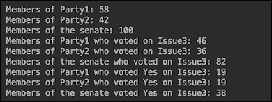

使用`Stream`接口的`filter()`方法是过滤的最流行方式。但也可以使用其他`Stream`方法来达到相同的效果。

### 使用其他流操作进行过滤

或者，除了上一节中描述的基本过滤之外，还可以使用其他操作（`Stream`接口的方法）来进行选择和过滤发出的流元素。

例如，让我们使用`flatMap()`方法过滤掉参议院的成员，根据他们的党派成员资格：

```java
long c1 = senators.stream()
        .flatMap(s -> s.getParty() == "Party1" ? 
                      Stream.of(s) : Stream.empty())
        .count();
System.out.println("Members of Party1: " + c1);
```

此方法利用了`Stream.of()`（产生一个元素的流）和`Stream.empty()`工厂方法（它产生一个没有元素的流，因此不会进一步发出任何内容）。或者，可以使用在 Java 9 中引入的新工厂方法`Stream.ofNullable()`达到相同的效果。

```java
c1 = senators.stream().flatMap(s -> 
  Stream.ofNullable(s.getParty() == "Party1" ? s : null))
                                                 .count();
System.out.println("Members of Party1: " + c1);
```

`Stream.ofNullable()`方法在非`null`的情况下创建一个包含一个元素的流；否则，它创建一个空流，就像之前的例子一样。如果我们以相同的参议院组成运行这两个先前的代码片段，它们会产生相同的输出：


然而，可以使用可能包含或不包含值的`java.util.Optional`类来达到相同的结果。如果存在值（且不是`null`），则其`isPresent()`方法返回`true`，而`get()`方法返回该值。以下是如何使用它来过滤掉一个党派的成员：

```java
long c2 = senators.stream()
  .map(s -> s.getParty() == "Party2" ? 
                         Optional.of(s) : Optional.empty())
  .flatMap(o -> o.map(Stream::of).orElseGet(Stream::empty))
  .count();
System.out.println("Members of Party2: " + c2);
```

首先，我们将一个元素（`Senator`对象）映射（转换）为一个带有或不带有值的`Optional`对象。然后，我们使用`flatMap()`方法生成一个包含单个元素的流或空流，然后计算通过这些元素的个数。在 Java 9 中，`Optional`类获得了一个新的工厂方法`stream()`，如果`Optional`对象包含非空值，则它产生一个包含一个元素的流；否则，它产生一个空流。使用这个新方法，我们可以将之前的代码重写如下：

```java
long c2 = senators.stream()
  .map(s -> s.getParty() == "Party2" ? 
                         Optional.of(s) : Optional.empty())
  .flatMap(Optional::stream)
  .count();
System.out.println("Members of Party2: " + c2);
```

如果我们以相同的参议院组成运行这两个先前的示例，它们会产生相同的输出：


当我们需要捕获流中发出的第一个元素时，我们可以应用另一种类型的过滤。这意味着我们在第一个元素发出后终止流。例如，让我们找到在`issue 3`上投票`Yes`的`Party1`的第一个参议员：

```java
senators.stream()
  .filter(s -> s.getParty() == "Party1" &&
                            s.getVoteYes()[3] == 1)    
  .findFirst()
  .ifPresent(s -> System.out.println("First senator "
         "of Party1 found who voted Yes on issue 3: " 
                                     + s.getName()));
```

```java
findFirst() method, which does the described job. It returns the Optional object, so we have added another ifPresent() operator that is invoked only if the Optionalobject contains a non-null value. The resulting output is as follows:
```


这正是我们在`Senate`类中播种数据时预期的结果。

同样，我们可以使用`findAny()`方法来找出在`issue 3`上投了`Yes`票的任何参议员：

```java
senators.stream().filter(s -> s.getVoteYes()[3] == 1)
        .findAny()
        .ifPresent(s -> System.out.println("A senator " +
                 "found who voted Yes on issue 3: " + s));
```

结果也正如预期的那样：


这通常是（但不一定是）流中的第一个元素。但不应依赖于这个假设，尤其是在并行处理的情况下。

`Stream`接口也有三个`match`方法，尽管它们返回一个布尔值，但如果不需要特定的对象，我们只需要确定这样的对象是否存在，也可以用于过滤。这些方法的名称是`anyMatch()`、`allMatch()`和`noneMatch()`。每个方法都接受一个谓词并返回一个布尔值。让我们首先演示`anyMatch()`方法。我们将使用它来找出是否有至少一位`Party1`的参议员在`issue 3`上投了`Yes`票：

```java
boolean found = senators.stream()
       .anyMatch(s -> (s.getParty() == "Party1" && 
                             s.getVoteYes()[3] == 1));
String res = found ? 
  "At least one senator of Party1 voted Yes on issue 3"
  : "Nobody of Party1 voted Yes on issue 3";
System.out.println(res);
```

运行前一段代码的结果应该如下所示：


为了演示`allMatch()`方法，我们将使用它来找出`Senate`类中`Party1`的所有成员是否都在`issue 3`上投了`Yes`票：

```java
boolean yes = senators.stream()
    .allMatch(s -> (s.getParty() == "Party1" &&
                           s.getVoteYes()[3] == 1));
String res = yes ? 
  "All senators of Party1 voted Yes on issue 3"
  : "Not all senators of Party1 voted Yes on issue 3";
System.out.println(res);
```

前一段代码的结果可能如下所示：


三种`match`方法中的最后一种——`noneMatch()`方法——将用于确定`Party1`中的某些参议员是否在`issue 3`上投了`Yes`票：

```java
boolean yes = senators.stream()
   .noneMatch(s -> (s.getParty() == "Party1" && 
                            s.getVoteYes()[3] == 1));
String res = yes ? 
  "None of the senators of Party1 voted Yes on issue 3"
  : "Some of senators of Party1 voted Yes on issue 3";
System.out.println(res);
```

早期示例的结果如下所示：


然而，在现实生活中，情况可能非常不同，因为`Senate`类中的许多问题都是按党派投票的。

当我们需要跳过流中的所有重复元素并仅选择唯一元素时，就需要另一种类型的过滤。`distinct()`方法就是为了这个目的设计的。我们将使用它来找出在`Senate`类中有成员的党派的名称：

```java
senators.stream().map(s -> s.getParty())
        .distinct().forEach(System.out::println);
```

结果，正如预期的那样，如下所示：


嗯，这并不令人惊讶？

我们还可以使用`limit()`方法过滤掉`stream`中的所有元素，除了前几个特定的数量：

```java
System.out.println("These are the first 3 senators " 
                          + "of Party1 in the list:");
senators.stream()
        .filter(s -> s.getParty() == "Party1")
.limit(3)
        .forEach(System.out::println);

System.out.println("These are the first 2 senators "
                           + "of Party2 in the list:");
senators.stream().filter(s -> s.getParty() == "Party2")
.limit(2)
        .forEach(System.out::println);
```

如果你记得我们是如何设置列表中的前五位参议员的，你可以预测结果如下所示：

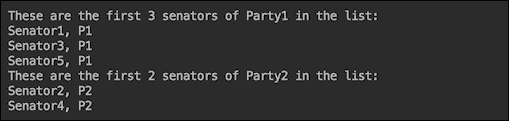

现在，让我们在流中找到唯一的一个元素——最大的一个。为此，我们可以使用`Stream`接口的`max()`方法和`Senate.timeVotedYes()`方法（我们将对每位参议员应用它）：

```java
senators.stream()
   .max(Comparator.comparing(Senate::timesVotedYes))
   .ifPresent(s -> System.out.println("A senator voted "
        + "Yes most of times (" + Senate.timesVotedYes(s) 
                                            + "): " + s));
```

```java
timesVotedYes() method to select the senator who voted Yes most often. You might remember, we have assigned all instances of Yes to Senator100. Let's see if that would be the result:
```


是的，我们已经将`Senator100`过滤为在所有 10 个问题上都投了`Yes`票的人。

同样，我们可以找到在所有 10 个问题上都投了`No`票的参议员：

```java
senators.stream()
  .min(Comparator.comparing(Senate::timesVotedYes))
  .ifPresent(s -> System.out.println("A senator voted "
       + "Yes least of times (" + Senate.timesVotedYes(s) 
                                            + "): " + s));
```

我们预计结果将是`Senator99`，以下是结果：


因此，我们在`Senate`类中硬编码了几个统计信息，以便我们可以验证我们的查询是否正确工作。

由于前两种方法可以帮助我们进行过滤，我们将演示 JDK 9 中引入的`takeWhile()`和`dropWhile()`方法。我们首先将打印前五位参议员的数据，然后使用`takeWhile()`方法打印直到我们遇到投票`Yes`超过四次的第一位参议员，然后停止打印：

```java
System.out.println("Here is count of times the first "
                            + "5 senators voted Yes:");
senators.stream().limit(5)
  .forEach(s -> System.out.println(s + ": " 
                           + Senate.timesVotedYes(s)));
System.out.println("Stop printing at a senator who "
                     + "voted Yes more than 4 times:");
senators.stream().limit(5)
        .takeWhile(s -> Senate.timesVotedYes(s) < 5)
        .forEach(s -> System.out.println(s + ": " 
                           + Senate.timesVotedYes(s)));
```

上一段代码的结果如下：

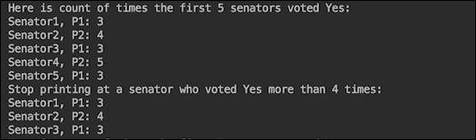

`dropWhile()`方法可以用于相反的效果，即过滤掉，跳过直到我们遇到投票`Yes`超过四次的第一位参议员，然后继续打印所有其他参议员：

```java
System.out.println("Here is count of times the first " 
                             + "5 senators voted Yes:");
senators.stream().limit(5)
        .forEach(s -> System.out.println(s + ": " 
                            + Senate.timesVotedYes(s)));
System.out.println("Start printing at a senator who "
                      + "voted Yes more than 4 times:");
senators.stream().limit(5)
        .dropWhile(s -> Senate.timesVotedYes(s) < 5)
        .forEach(s -> System.out.println(s + ": " 
                            + Senate.timesVotedYes(s)));
System.out.println("...");
```

结果将如下所示：

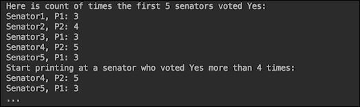

这就结束了我们对元素流过滤方式的演示。我们希望你已经学到了足够的知识，能够为你的任何过滤需求找到解决方案。尽管如此，我们鼓励你自己学习和实验 Stream API，这样你可以保留到目前为止所学到的知识，并形成自己对 Java 9 丰富 API 的个人看法。

# 堆栈跟踪 API

异常确实会发生，尤其是在开发期间或软件稳定期。但在一个大型复杂系统中，即使在生产环境中，出现异常的可能性也是可能的，尤其是在将多个第三方系统组合在一起并需要程序化分析堆栈跟踪以应用自动纠正时。在本节中，我们将讨论如何实现这一点。

## Java 9 之前的堆栈分析

使用`java.lang.Thread`和`java.lang.Throwable`类的对象的传统读取堆栈跟踪是通过从标准输出捕获来完成的。例如，我们可以在代码的任何部分包含以下行：

```java
Thread.currentThread().dumpStack();
```

上一行将产生以下输出：

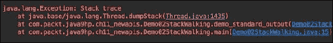

同样，我们可以在代码中包含以下行：

```java
new Throwable().printStackTrace();
```

输出将如下所示：

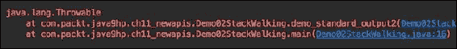

这种输出可以被捕获、读取和分析，但需要编写相当多的自定义代码。

JDK 8 通过使用流使这一过程变得简单。以下是从流中读取堆栈跟踪的代码：

```java
Arrays.stream(Thread.currentThread().getStackTrace())
        .forEach(System.out::println);
```

上一行将产生以下输出：

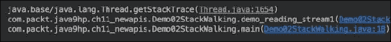

或者，我们可以使用以下代码：

```java
Arrays.stream(new Throwable().getStackTrace())
        .forEach(System.out::println);
```

上一段代码的输出以类似的方式显示了堆栈跟踪：

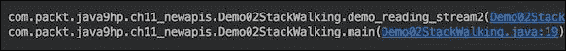

例如，如果你想找到调用者的完全限定名称，你可以使用以下方法之一：

```java
new Throwable().getStackTrace()[1].getClassName();

Thread.currentThread().getStackTrace()[2].getClassName();
```

这样的编码是可能的，因为`getStackTrace()`方法返回一个`java.lang.StackTraceElement`类的对象数组，每个对象代表堆栈跟踪中的一个堆栈帧。每个对象都携带可通过`getFileName()`、`getClassName()`、`getMethodName()`和`getLineNumber()`方法访问的堆栈跟踪信息。

为了演示它是如何工作的，我们创建了三个类，`Clazz01`、`Clazz02`和`Clazz03`，它们相互调用：

```java
public class Clazz01 {
  public void method(){ new Clazz02().method(); }
}
public class Clazz02 {
  public void method(){ new Clazz03().method(); }
}
public class Clazz03 {
  public void method(){
    Arrays.stream(Thread.currentThread()
                        .getStackTrace()).forEach(ste -> {
      System.out.println();
      System.out.println("ste=" + ste);
      System.out.println("ste.getFileName()=" + 
                                     ste.getFileName());
      System.out.println("ste.getClassName()=" +
                                    ste.getClassName());
      System.out.println("ste.getMethodName()=" + 
                                   ste.getMethodName());
      System.out.println("ste.getLineNumber()=" + 
                                   ste.getLineNumber());
    });
  }
}
```

现在，让我们调用`Clazz01`的`method()`方法：

```java
public class Demo02StackWalking {
    public static void main(String... args) {
        demo_walking();
    }
    private static void demo_walking(){
        new Clazz01().method();
    }
}
```

这里是前述代码打印出的六个堆栈跟踪帧中的两个（第二个和第三个）：

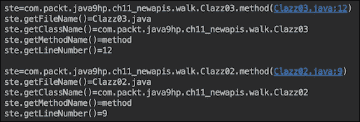

在原则上，每个被调用类都可以访问这些信息。但要找出哪个类调用了当前类可能并不容易，因为你需要确定哪个帧代表调用者。此外，为了提供这些信息，JVM 捕获整个堆栈（除了隐藏的堆栈帧），这可能会影响性能。

这就是引入`java.lang.StackWalker`类、其嵌套的`Option`类和`StackWalker.StackFrame`接口在 JDK 9 中的动机。

## 新的更好的堆栈遍历方式

`StackWalker`类有四个`getInstance()`静态工厂方法：

+   `getInstance()`: 这返回一个配置为跳过所有隐藏帧和调用者类引用的`StackWalker`类实例

+   `getInstance(StackWalker.Option option)`: 这创建一个具有给定选项的`StackWalker`类实例，指定它可以访问的堆栈帧信息

+   `getInstance(Set<StackWalker.Option> options)`: 这创建一个具有给定选项集的`StackWalker`类实例

+   `getInstance(Set<StackWalker.Option> options, int estimatedDepth)`: 这允许你传入`estimatedDepth`参数，该参数指定此实例将要遍历的堆栈帧的估计数量，以便 Java 机器可以分配它可能需要的适当缓冲区大小

作为选项传入的值可以是以下之一：

+   `StackWalker.Option.RETAIN_CLASS_REFERENCE`

+   `StackWalker.Option.SHOW_HIDDEN_FRAMES`

+   `StackWalker.Option.SHOW_REFLECT_FRAMES`

`StackWalker`类的其他三个方法如下：

+   `T walk(Function<Stream<StackWalker.StackFrame>, T> function)`: 这将传入的函数应用于堆栈帧流，第一个帧表示调用此`walk()`方法的调用方法

+   `void forEach(Consumer<StackWalker.StackFrame> action)`: 这对当前线程流中的每个元素（`StalkWalker.StackFrame`接口类型）执行传入的操作

+   `Class<?> getCallerClass()`: 这获取调用者类的`Class`类对象

如您所见，它允许更直接的堆栈跟踪分析。让我们使用以下代码修改我们的演示类，并在一行中访问调用者名称：

```java
public class Clazz01 {
  public void method(){ 
    System.out.println("Clazz01 was called by " +
      StackWalker.getInstance(StackWalker
        .Option.RETAIN_CLASS_REFERENCE)
        .getCallerClass().getSimpleName());
    new Clazz02().method(); 
  }
}
public class Clazz02 {
  public void method(){ 
    System.out.println("Clazz02 was called by " +
      StackWalker.getInstance(StackWalker
        .Option.RETAIN_CLASS_REFERENCE)
        .getCallerClass().getSimpleName());
    new Clazz03().method(); 
  }
}
public class Clazz03 {
  public void method(){
    System.out.println("Clazz01 was called by " +
      StackWalker.getInstance(StackWalker
        .Option.RETAIN_CLASS_REFERENCE)
        .getCallerClass().getSimpleName());
  }
}
```

之前的代码将产生以下输出：

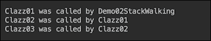

你可以欣赏这个解决方案的简单性。如果我们需要查看整个堆栈跟踪，我们可以在`Clazz03`中的代码中添加以下行：

```java
StackWalker.getInstance().forEach(System.out::println);
```

最终的输出将如下所示：

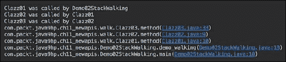

再次强调，仅用一行代码，我们就得到了更易读的输出。我们可以通过使用`walk()`方法达到相同的结果：

```java
StackWalker.getInstance().walk(sf -> { 
  sf.forEach(System.out::println); return null; 
});
```

我们不仅打印`StackWalker.StackFrame`，如果需要的话，还可以使用其 API 进行更深入的分析，该 API 比`java.lang.StackTraceElement`的 API 更广泛。让我们运行打印每个堆栈帧及其信息的代码示例：

```java
StackWalker stackWalker = 
   StackWalker.getInstance(Set.of(StackWalker
                   .Option.RETAIN_CLASS_REFERENCE), 10);
stackWalker.forEach(sf -> {
    System.out.println();
    System.out.println("sf="+sf);
    System.out.println("sf.getFileName()=" + 
                                       sf.getFileName());
    System.out.println("sf.getClass()=" + sf.getClass());
    System.out.println("sf.getMethodName()=" + 
                                     sf.getMethodName());
    System.out.println("sf.getLineNumber()=" + 
                                     sf.getLineNumber());
    System.out.println("sf.getByteCodeIndex()=" +
                                  sf.getByteCodeIndex());
    System.out.println("sf.getClassName()=" + 
                                      sf.getClassName());
    System.out.println("sf.getDeclaringClass()=" + 
                                 sf.getDeclaringClass());
    System.out.println("sf.toStackTraceElement()=" +
                               sf.toStackTraceElement());
});
```

上一段代码的输出如下：

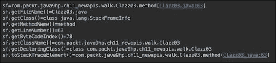

注意实现`StackWalker.StackFrame`接口并实际执行工作的`StackFrameInfo`类。API 还允许将它们转换回熟悉的`StackTraceElement`对象，以实现向后兼容性，以及让那些习惯于它且不想改变他们的代码和习惯的人感到愉快。

相比之下，在内存中生成并存储完整的堆栈跟踪（如传统堆栈跟踪实现的情况），`StackWalker`类只带来了请求的元素。这是其引入的另一个动机，除了演示的使用简单性之外。有关`StackWalker`类 API 及其使用的更多详细信息，请参阅[`docs.oracle.com/javase/9/docs/api/java/lang/StackWalker.html`](https://docs.oracle.com/javase/9/docs/api/java/lang/StackWalker.html)。

# 集合的便利工厂方法

随着 Java 中函数式编程的引入，对不可变对象的需求增加。传递给方法的功能可能在与它们创建时显著不同的上下文中执行，因此减少意外副作用的可能性使得不可变性更有说服力。此外，Java 创建不可修改集合的方式本身就相当冗长，因此这个问题在 Java 9 中得到了解决。以下是一个在 Java 8 中创建不可变`Set`接口集合的代码示例：

```java
Set<String> set = new HashSet<>();
set.add("Life");
set.add("is");
set.add("good!");
set = Collections.unmodifiableSet(set); 
```

在多次执行之后，方便方法的必要性自然地作为任何软件专业人士背景思维中始终存在的重构考虑因素而出现。在 Java 8 中，之前的代码可以修改为以下形式：

```java
Set<String> immutableSet = 
  Collections.unmodifiableSet(new HashSet<>(Arrays
                          .asList("Life", "is", "good!")));
```

或者，如果你是流的朋友，你可以写如下代码：

```java
Set<String> immutableSet = Stream.of("Life","is","good!")
  .collect(Collectors.collectingAndThen(Collectors.toSet(),
                             Collections::unmodifiableSet));
```

之前代码的另一个版本如下：

```java
Set<String> immutableSet =
  Collections.unmodifiableSet(Stream.of("Life","is","good!")
                               .collect(Collectors.toSet()));
```

然而，它比你要封装的值有更多的样板代码。因此，在 Java 9 中，之前代码的简短版本成为可能：

```java
Set<String> immutableSet = Set.of("Life","is","good!");
```

类似的生产厂被引入来生成不可变的`List`接口和`Map`接口的集合：

```java
List<String> immutableList = List.of("Life","is","good!");

Map<Integer,String> immutableMap1 = 
                   Map.of(1, "Life", 2, "is", 3, "good!");

Map<Integer,String> immutableMap2 = 
       Map.ofEntries(entry(1, "Life "), entry(2, "is"), 
                                        entry(3, "good!");

Map.Entry<Integer,String> entry1 = Map.entry(1,"Life");
Map.Entry<Integer,String> entry2 = Map.entry(2,"is");
Map.Entry<Integer,String> entry3 = Map.entry(3,"good!");
Map<Integer,String> immutableMap3 = 
                    Map.ofEntries(entry1, entry2, entry3);
```

## 为什么需要新的工厂方法？

能够以更紧凑的方式表达相同的功能非常有帮助，但这可能不足以成为引入这些新工厂的动机。更重要的是解决`Collections.unmodifiableList()`、`Collections.unmodifiableSet()`和`Collections.unmodifiableMap()`现有实现的弱点。尽管使用这些方法创建的集合在尝试修改或添加/删除其元素时将抛出`UnsupportedOperationException`异常，但它们只是传统可修改集合的包装，因此可能容易受到修改的影响，这取决于它们的构建方式。让我们通过示例来阐述这一点。顺便说一下，现有不可修改实现的另一个弱点是它不会改变源集合的构建方式，因此`List`、`Set`和`Map`之间的差异——它们可以构建的方式——仍然存在，这可能是程序员使用它们时出现错误或甚至挫败感的来源。新的工厂方法也解决了这个问题，通过仅使用`of()`工厂方法（以及为`Map`提供的附加`ofEntries()`方法）提供了一种更统一的方法。话虽如此，让我们回到示例。看看以下代码片段：

```java
List<String> list = new ArrayList<>();
list.add("unmodifiableList1: Life");
list.add(" is");
list.add(" good! ");
list.add(null);
list.add("\n\n");
List<String> unmodifiableList1 = 
                      Collections.unmodifiableList(list);
//unmodifiableList1.add(" Well..."); //throws exception
//unmodifiableList1.set(2, " sad."); //throws exception
unmodifiableList1.stream().forEach(System.out::print);

list.set(2, " sad. ");
list.set(4, " ");
list.add("Well...\n\n");
unmodifiableList1.stream().forEach(System.out::print);
```

直接修改`unmodifiableList1`的元素将导致`UnsupportedOperationException`异常。尽管如此，我们可以通过底层的`list`对象来修改它们。如果我们运行前面的示例，输出将如下所示：

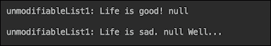

即使使用`Arrays.asList()`来创建源列表，它也只会保护创建的集合不被添加新元素，但不会阻止修改现有元素。以下是一个代码示例：

```java
List<String> list2 = 
           Arrays.asList("unmodifiableList2: Life", 
                        " is", " good! ", null, "\n\n");
List<String> unmodifiableList2 = 
                    Collections.unmodifiableList(list2);
//unmodifiableList2.add(" Well..."); //throws exception
//unmodifiableList2.set(2, " sad."); //throws exception
unmodifiableList2.stream().forEach(System.out::print);

list2.set(2, " sad. ");
//list2.add("Well...\n\n");  //throws exception
unmodifiableList2.stream().forEach(System.out::print);
```

如果我们运行前面的代码，输出将如下所示：

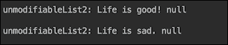

我们还添加了一个`null`元素来展示现有实现如何处理它们，因为相比之下，新的不可变集合工厂不允许包含`null`。顺便说一下，它们也不允许在`Set`中包含重复元素（而现有实现只是忽略它们），但我们将稍后在代码示例中使用新的工厂方法来展示这一点。

公平起见，使用现有实现也可以创建一个真正的不可变`List`接口集合。看看以下代码：

```java
List<String> immutableList1 =
        Collections.unmodifiableList(new ArrayList<>() {{
            add("immutableList1: Life");
            add(" is");
            add(" good! ");
            add(null);
            add("\n\n");
        }});
//immutableList1.set(2, " sad.");     //throws exception
//immutableList1.add("Well...\n\n");  //throws exception
immutableList1.stream().forEach(System.out::print);
```

创建不可变列表的另一种方法如下：

```java
List<String> immutableList2 =
  Collections.unmodifiableList(Stream
   .of("immutableList2: Life"," is"," good! ",null,"\n\n")
   .collect(Collectors.toList()));
//immutableList2.set(2, " sad.");     //throws exception
//immutableList2.add("Well...\n\n");  //throws exception
immutableList2.stream().forEach(System.out::print);
```

以下是对前面代码的变体：

```java
List<String> immutableList3 = 
  Stream.of("immutableList3: Life",
                             " is"," good! ",null,"\n\n")
  .collect(Collectors.collectingAndThen(Collectors.toList(),
                             Collections::unmodifiableList));
//immutableList3.set(2, " sad.");     //throws exception
//immutableList3.add("Well...\n\n");  //throws exception
immutableList3.stream().forEach(System.out::print);
```

如果我们运行前面的三个示例，我们将看到以下输出：

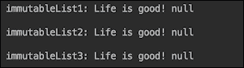

注意，尽管我们无法修改这些列表的内容，但我们可以在其中放置`null`。

`Set`的情况与之前看到的列表非常相似。以下是展示如何修改不可修改的`Set`接口集合的代码：

```java
Set<String> set = new HashSet<>();
set.add("unmodifiableSet1: Life");
set.add(" is");
set.add(" good! ");
set.add(null);
Set<String> unmodifiableSet1 = 
                       Collections.unmodifiableSet(set);
//unmodifiableSet1.remove(" good! "); //throws exception
//unmodifiableSet1.add("...Well..."); //throws exception
unmodifiableSet1.stream().forEach(System.out::print);
System.out.println("\n");

set.remove(" good! ");
set.add("...Well...");
unmodifiableSet1.stream().forEach(System.out::print);
System.out.println("\n");
```

即使我们将原始集合从数组转换为列表，然后再转换为集合，`Set` 接口的集合仍然可以被修改，如下所示：

```java
Set<String> set2 = 
   new HashSet<>(Arrays.asList("unmodifiableSet2: Life", 
                                " is", " good! ", null));
Set<String> unmodifiableSet2 = 
                       Collections.unmodifiableSet(set2);
//unmodifiableSet2.remove(" good! "); //throws exception
//unmodifiableSet2.add("...Well..."); //throws exception
unmodifiableSet2.stream().forEach(System.out::print);
System.out.println("\n");

set2.remove(" good! ");
set2.add("...Well...");
unmodifiableSet2.stream().forEach(System.out::print);
System.out.println("\n");
```

运行前两个示例的输出如下：

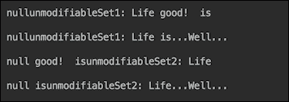

如果你没有在 Java 9 中使用过集合，你可能会对输出中集合元素的不寻常混乱顺序感到惊讶。实际上，这是 JDK 9 中引入的集合和映射的新特性之一。在过去，`Set` 和 `Map` 的实现并没有保证保留元素的顺序。但通常情况下，顺序是保留的，一些程序员编写了依赖于它的代码，从而将一个令人烦恼的不一致且难以复现的缺陷引入了应用程序。新的 `Set` 和 `Map` 实现更频繁地改变顺序，如果不是每次代码的新运行。这样，它可以在开发早期暴露潜在缺陷，并减少其传播到生产环境的机会。

与列表类似，即使不使用 Java 9 的新不可变集合工厂，我们也可以创建不可变集合。一种实现方式如下：

```java
Set<String> immutableSet1 =
     Collections.unmodifiableSet(new HashSet<>() {{
            add("immutableSet1: Life");
            add(" is");
            add(" good! ");
            add(null);
        }});
//immutableSet1.remove(" good! "); //throws exception
//immutableSet1.add("...Well..."); //throws exception
immutableSet1.stream().forEach(System.out::print);
System.out.println("\n");
```

此外，与列表的情况类似，这里还有另一种实现方式：

```java
Set<String> immutableSet2 =
     Collections.unmodifiableSet(Stream
        .of("immutableSet2: Life"," is"," good! ", null)
                           .collect(Collectors.toSet()));
//immutableSet2.remove(" good!");  //throws exception
//immutableSet2.add("...Well..."); //throws exception
immutableSet2.stream().forEach(System.out::print);
System.out.println("\n");
```

之前代码的另一种变体如下：

```java
Set<String> immutableSet3 = 
  Stream.of("immutableSet3: Life"," is"," good! ", null)
  .collect(Collectors.collectingAndThen(Collectors.toSet(),
                            Collections::unmodifiableSet));
//immutableList5.set(2, "sad.");  //throws exception
//immutableList5.add("Well...");  //throws exception
immutableSet3.stream().forEach(System.out::print);
System.out.println("\n");
```

如果我们运行我们刚刚介绍的创建不可变 `iSet` 接口集合的三个示例，结果如下：

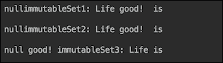

使用 `Map` 接口，我们只能找到一种修改 `unmodifiableMap` 对象的方法：

```java
Map<Integer, String> map = new HashMap<>();
map.put(1, "unmodifiableleMap: Life");
map.put(2, " is");
map.put(3, " good! ");
map.put(4, null);
map.put(5, "\n\n");
Map<Integer, String> unmodifiableleMap = 
                       Collections.unmodifiableMap(map);
//unmodifiableleMap.put(3, " sad.");   //throws exception
//unmodifiableleMap.put(6, "Well..."); //throws exception
unmodifiableleMap.values().stream()
                             .forEach(System.out::print);
map.put(3, " sad. ");
map.put(4, "");
map.put(5, "");
map.put(6, "Well...\n\n");
unmodifiableleMap.values().stream()
                             .forEach(System.out::print);
```

之前代码的输出如下：

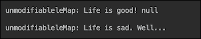

我们找到了四种不使用 Java 9 增强功能创建不可变 `Map` 接口集合的方法。以下是第一个示例：

```java
Map<Integer, String> immutableMap1 =
        Collections.unmodifiableMap(new HashMap<>() {{
            put(1, "immutableMap1: Life");
            put(2, " is");
            put(3, " good! ");
            put(4, null);
            put(5, "\n\n");
        }});
//immutableMap1.put(3, " sad. ");   //throws exception
//immutableMap1.put(6, "Well...");  //throws exception
immutableMap1.values().stream().forEach(System.out::print);
```

第二个示例有点复杂：

```java
String[][] mapping = 
       new String[][] {{"1", "immutableMap2: Life"}, 
                       {"2", " is"}, {"3", " good! "}, 
                          {"4", null}, {"5", "\n\n"}};

Map<Integer, String> immutableMap2 =
  Collections.unmodifiableMap(Arrays.stream(mapping)
    .collect(Collectors.toMap(a -> Integer.valueOf(a[0]), 
                          a -> a[1] == null? "" : a[1])));
immutableMap2.values().stream().forEach(System.out::print);
```

```java
null value in the source array:
```

```java
String[][] mapping = 
    new String[][]{{"1", "immutableMap3: Life"}, 
       {"2", " is"}, {"3", " good! "}, {"4", "\n\n"}};
Map<Integer, String> immutableMap3 =
   Collections.unmodifiableMap(Arrays.stream(mapping)
     .collect(Collectors.toMap(a -> Integer.valueOf(a[0]), 
a -> a[1])));
//immutableMap3.put(3, " sad.");   //throws Exception
//immutableMap3.put(6, "Well..."); //throws exception
immutableMap3.values().stream().forEach(System.out::print);
```

之前代码的另一种变体如下：

```java
mapping[0][1] = "immutableMap4: Life";
Map<Integer, String> immutableMap4 = Arrays.stream(mapping)
           .collect(Collectors.collectingAndThen(Collectors
             .toMap(a -> Integer.valueOf(a[0]), a -> a[1]),
                             Collections::unmodifiableMap));
//immutableMap4.put(3, " sad.");    //throws exception
//immutableMap4.put(6, "Well...");  //throws exception
immutableMap4.values().stream().forEach(System.out::print);
```

在运行完所有四个最后示例之后，输出如下：

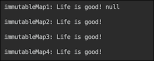

在对现有的集合实现进行修订之后，我们现在可以讨论和欣赏 Java 9 中集合的新工厂方法。

## 新工厂方法的应用

在回顾了现有的集合创建方法之后，我们现在可以回顾并享受 Java 9 中引入的相关 API。与前面的章节一样，我们从 `List` 接口开始。以下是使用新的 `List.of()` 工厂方法创建不可变列表的简单和一致的方式：

```java
List<String> immutableList = 
  List.of("immutableList: Life", 
      " is", " is", " good!\n\n"); //, null);
//immutableList.set(2, "sad.");    //throws exception
//immutableList.add("Well...");    //throws exception
immutableList.stream().forEach(System.out::print);
```

如前述代码注释所示，新的工厂方法不允许将 `null` 包含在列表值中。

`immutableSet` 的创建看起来如下：

```java
Set<String> immutableSet = 
    Set.of("immutableSet: Life", " is", " good!");
                                      //, " is" , null);
//immutableSet.remove(" good!\n\n");  //throws exception
//immutableSet.add("...Well...\n\n"); //throws exception
immutableSet.stream().forEach(System.out::print);
System.out.println("\n");
```

如前述代码注释所示，`Set.of()` 工厂方法在创建不可变 `Set` 接口集合时不允许添加 `null` 或重复的元素。

`Map` 接口的不可变集合也有类似的格式：

```java
Map<Integer, String> immutableMap = 
   Map.of(1</span>, "immutableMap: Life", 2, " is", 3, " good!");
                                    //, 4, null);
//immutableMap.put(3, " sad.");    //throws exception
//immutableMap.put(4, "Well...");  //throws exception
immutableMap.values().stream().forEach(System.out::print);
System.out.println("\n");
```

`Map.of()`方法也不允许`null`作为值。`Map.of()`方法的另一个特性是它允许在编译时检查元素类型，这减少了运行时问题的可能性。

对于那些喜欢更紧凑代码的人来说，这里有另一种表达相同功能的方法：

```java
Map<Integer, String> immutableMap3 = 
            Map.ofEntries(entry(1, "immutableMap3: Life"), 
                      entry(2, " is"), entry(3, " good!"));
immutableMap3.values().stream().forEach(System.out::print);
System.out.println("\n");
```

如果我们运行所有之前使用新工厂方法的示例，以下是输出结果：

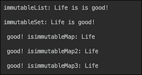

如我们之前提到的，拥有不可变集合的能力，包括空集合，对于函数式编程非常有帮助，因为这个特性确保了这样的集合不能作为副作用被修改，并且不会引入意外且难以追踪的缺陷。新的工厂方法包括多达 10 个显式条目，以及一个可以包含任意数量元素的条目。以下是`List`接口的示例：

```java
static <E> List<E> of()
static <E> List<E> of(E e1)
static <E> List<E> of(E e1, E e2)
static <E> List<E> of(E e1, E e2, E e3)
static <E> List<E> of(E e1, E e2, E e3, E e4)
static <E> List<E> of(E e1, E e2, E e3, E e4, E e5)
static <E> List<E> of(E e1, E e2, E e3, E e4, E e5, E e6)
static <E> List<E> of(E e1, E e2, E e3, E e4, E e5, E e6, E e7)
static <E> List<E> of(E e1, E e2, E e3, E e4, E e5, E e6, E e7, E e8)
static <E> List<E> of(E e1, E e2, E e3, E e4, E e5, E e6, E e7, E e8, E e9)
static <E> List<E> of(E e1, E e2, E e3, E e4, E e5, E e6, E e7, E e8, E e9, E e10)
static <E> List<E> of(E... elements)
```

`Set`的工厂方法看起来类似：

```java
static <E> Set<E> of()
static <E> Set<E> of(E e1)
static <E> Set<E> of(E e1, E e2)
static <E> Set<E> of(E e1, E e2, E e3)
static <E> Set<E> of(E e1, E e2, E e3, E e4)
static <E> Set<E> of(E e1, E e2, E e3, E e4, E e5)
static <E> Set<E> of(E e1, E e2, E e3, E e4, E e5, E e6)
static <E> Set<E> of(E e1, E e2, E e3, E e4, E e5, E e6, E e7)
static <E> Set<E> of(E e1, E e2, E e3, E e4, E e5, E e6, E e7, E e8)
static <E> Set<E> of(E e1, E e2, E e3, E e4, E e5, E e6, E e7, E e8, E e9)
static <E> Set<E> of(E e1, E e2, E e3, E e4, E e5, E e6, E e7, E e8, E e9, E e10)
static <E> Set<E> of(E... elements)
```

此外，`Map`的工厂方法也遵循同样的模式：

```java
static <K,V> Map<K,V> of()
static <K,V> Map<K,V> of(K k1, V v1)
static <K,V> Map<K,V> of(K k1, V v1, K k2, V v2)
static <K,V> Map<K,V> of(K k1, V v1, K k2, V v2, K k3, V v3)
static <K,V> Map<K,V> of(K k1, V v1, K k2, V v2, K k3, V v3, K k4, V v4)
static <K,V> Map<K,V> of(K k1, V v1, K k2, V v2, K k3, V v3, K k4, V v4, K k5, V   v5
static <K,V> Map<K,V> of(K k1, V v1, K k2, V v2, K k3, V v3, K k4, V v4, K k5, V v5, K k6, V v6)
static <K,V> Map<K,V> of(K k1, V v1, K k2, V v2, K k3, V v3, K k4, V v4, K k5, V v5, K k6, V v6, K k7, V v7
static <K,V> Map<K,V> of(K k1, V v1, K k2, V v2, K k3, V v3, K k4, V v4, K k5, V v5, K k6, V v6, K k7, V v7,
K k8, V v8)
static <K,V> Map<K,V> of(K k1, V v1, K k2, V v2, K k3, V v3, K k4, V v4, K k5, V v5, K k6, V v6, K k7, V v7,
K k8, V v8, K k9, V v9)
static <K,V> Map<K,V> of(K k1, V v1, K k2, V v2, K k3, V v3, K k4, V v4, K k5, V v5, K k6, V v6, K k7, V v7,
K k8, V v8, K k9, V v9, K k10, V v10)
static <K,V> Map<K,V> ofEntries(Map.Entry<? extends K,? extends V>... entries
```

决定不添加新的不可变集合接口，使得它们容易在程序员假设可以调用`add()`或`put()`时造成偶尔的混淆。这种假设如果没有经过测试，将导致运行时错误，抛出`UnsupportedOperationException`。尽管存在这种潜在的风险，但新的不可变集合创建工厂方法仍然是 Java 中非常有用的补充。

# 支持异步处理的 CompletableFuture

`java.util.concurrent.CompletableFuture<T>`类首次在 Java 8 中引入。它是`java.util.concurrent.Future<T>`接口异步调用控制的下一级。它实际上实现了`Future`，以及`java.util.concurrent.CompletionStage<T>`。在 Java 9 中，`CompletableFuture`通过添加新的工厂方法、支持延迟和超时以及改进子类化得到了增强——我们将在接下来的章节中更详细地讨论这些特性。但首先，让我们先概述一下`CompletableFuture` API。

## CompletableFuture API 概述

`CompletableFuture` API 包含超过 70 个方法，其中 38 个是`CompletionStage`接口的实现，5 个是`Future`的实现。因为`CompletableFuture`类实现了`Future`接口，所以它可以被当作`Future`来使用，而不会破坏基于`Future` API 的现有功能。

因此，API 的大部分内容来自`CompletionStage`。大多数方法返回`CompletableFuture`（在`CompletionStage`接口中，它们返回`CompletionStage`，但在`CompletableFuture`类中实现时，它们被转换为`CompletableFuture`），这意味着它们允许像`Stream`方法那样进行操作链。每个方法都有一个接受函数的签名。一些方法接受`Function<T,U>`，它将被应用于传入的值`T`并返回结果`U`。其他方法接受`Consumer<T>`，它接受传入的值并返回`void`。还有其他方法接受`Runnable`，它不接受任何输入并返回`void`。以下是一组这些方法：

```java
thenRun(Runnable action)
thenApply(Function<T,U> fn)
thenAccept(Consumer<T> action)
```

它们都返回`CompletableFuture`，它携带函数的结果或 void（在`Runnable`和`Consumer`的情况下）。每个方法都有两个伴随方法，它们以异步方式执行相同的功能。例如，让我们以`thenRun(Runnable action)`方法为例。以下是其伴随方法：

+   `thenRunAsync(Runnable action)`方法，它使用默认的`ForkJoinPool.commonPool()`池中的另一个线程来运行操作

+   `thenRun(Runnable action, Executor executor)`方法，它使用作为参数传入的池 executor 中的另一个线程来运行操作

因此，我们已经涵盖了`CompletionStage`接口的九种方法。

另一组方法包括以下内容：

```java
thenCompose(Function<T,CompletionStage<U>> fn)
applyToEither(CompletionStage other, Function fn)
acceptEither(CompletionStage other, Consumer action)
runAfterBoth(CompletionStage other, Runnable action)
runAfterEither(CompletionStage other, Runnable action)
thenCombine(CompletionStage<U> other, BiFunction<T,U,V> fn)
thenAcceptBoth(CompletionStage other, BiConsumer<T,U> action)
```

这些方法在`CompletableFuture`（或`CompletionStage`）对象产生一个结果并用作操作输入之后执行传入的操作。这里的“两者”指的是提供方法的`CompletableFuture`和作为方法参数传入的`CompletableFuture`。从这些方法的名称中，你可以相当可靠地猜测它们的意图。我们将在下面的示例中演示其中的一些。这七个方法中的每一个也有两个用于异步处理的方法。这意味着我们已经描述了`CompletionStage`接口的 30 种方法（共 38 种）。

有两组方法通常用作终端操作，因为它们可以处理前一个方法的结果（作为`T`传入）或异常（作为`Throwable`传入）：

```java
handle(BiFunction<T,Throwable,U> fn)
whenComplete(BiConsumer<T,Throwable> action)
```

我们将在稍后的示例中看到这些方法的用法。当链中的方法抛出异常时，直到遇到第一个`handle()`方法或`whenComplete()`方法，链中的其余方法都会被跳过。如果链中不存在这两种方法之一，则异常将像任何其他 Java 异常一样向上冒泡。这两个方法也有异步伴随方法，这意味着我们已经讨论了`CompletionStage`接口的 36 种方法（共 38 种）。

还有一个仅处理异常的方法（类似于传统编程中的 catch 块）：

```java
exceptionally(Function<Throwable,T> fn)
```

此方法没有异步的配套方法，就像最后一个剩余的方法一样：

```java
toCompletableFuture()
```

它只是返回一个与该阶段具有相同属性的`CompletableFuture`对象。这样，我们就描述了`CompletionStage`接口的所有 38 个方法。

在`CompletableFuture`类中也有一些不属于任何实现接口的 30 个方法。其中一些在异步执行提供的函数后返回`CompletableFuture`对象：

```java
runAsync(Runnable runnable)
runAsync(Runnable runnable, Executor executor)
supplyAsync(Supplier<U> supplier)
supplyAsync(Supplier<U> supplier, Executor executor)
```

其他对象并行执行几个`CompletableFuture`：

```java
allOf(CompletableFuture<?>... cfs)
anyOf(CompletableFuture<?>... cfs)
```

还有一组方法可以生成完成的未来，因此返回的`CompletableFuture`对象的`get()`方法将不再阻塞：

```java
complete(T value)
completedStage(U value)
completedFuture(U value)
failedStage(Throwable ex)
failedFuture(Throwable ex)
completeAsync(Supplier<T> supplier)
completeExceptionally(Throwable ex)
completeAsync(Supplier<T> supplier, Executor executor)
completeOnTimeout(T value, long timeout, TimeUnit unit)
```

其余的方法执行各种其他可能很有用的功能：

```java
join()
defaultExecutor()
newIncompleteFuture()
getNow(T valueIfAbsent)
getNumberOfDependents()
minimalCompletionStage()
isCompletedExceptionally()
obtrudeValue(T value)
obtrudeException(Throwable ex)
orTimeout(long timeout, TimeUnit unit)
delayedExecutor(long delay, TimeUnit unit)
```

请参阅官方 Oracle 文档，其中描述了这些以及其他`CompletableFuture` API 的方法，链接为[`download.java.net/java/jdk9/docs/api/index.html?java/util/concurrent/CompletableFuture.html`](http://download.java.net/java/jdk9/docs/api/index.html?java/util/concurrent/CompletableFuture.html)。

## Java 9 中 CompletableFuture API 的增强

Java 9 对`CompletableFuture`引入了几个增强：

+   `CompletionStage<U> failedStage(Throwable ex)`工厂方法返回一个带有给定异常的`CompletionStage`对象

+   `CompletableFuture<U> failedFuture(Throwable ex)`工厂方法返回一个带有给定异常的`CompletableFuture`对象

+   新的`CompletionStage<U> completedStage(U value)`工厂方法返回一个带有给定`U`值的`CompletionStage`对象

+   `CompletableFuture<T> completeOnTimeout(T value, long timeout, TimeUnit unit)`如果在未来给定超时时间内未完成，则使用给定的`T`值完成`CompletableFuture`任务

+   `CompletableFuture<T> orTimeout(long timeout, TimeUnit unit)`如果在未来给定超时时间内未完成，则使用`java.util.concurrent.TimeoutException`完成`CompletableFuture`

+   现在可以重写`defaultExecutor()`方法以支持另一个默认的执行器

+   新的方法`newIncompleteFuture()`使得子类化`CompletableFuture`类变得更加容易

## 使用 Future 的问题和解决方案

为了展示和欣赏`CompletableFuture`的强大功能，让我们从一个仅使用`Future`实现的问题开始，然后看看如何更有效地使用`CompletableFuture`来解决它。让我们想象一下，我们被分配了一个建模由四个阶段组成的建筑的任务：

+   收集地基、墙壁和屋顶的材料

+   安装地基

+   竖起墙壁

+   构建和完成屋顶

在传统的单线程顺序编程中，模型看起来是这样的：

```java
StopWatch stopWatch = new StopWatch();
Stage failedStage;
String SUCCESS = "Success";

stopWatch.start();
String result11 = doStage(Stage.FoundationMaterials);
String result12 = doStage(Stage.Foundation, result11);
String result21 = doStage(Stage.WallsMaterials);
String result22 = doStage(Stage.Walls, 
                       getResult(result21, result12));
String result31 = doStage(Stage.RoofMaterials);
String result32 = doStage(Stage.Roof, 
                       getResult(result31, result22));
System.out.println("House was" + 
       (isSuccess(result32)?"":" not") + " built in " 
                + stopWatch.getTime()/1000\. + " sec");
```

在这里，`Stage`是一个枚举：

```java
enum Stage {
    FoundationMaterials,
    WallsMaterials,
    RoofMaterials,
    Foundation,
    Walls,
    Roof
}
```

`doStage()`方法有两个重载版本。以下是第一个：

```java
String doStage(Stage stage) {
    String result = SUCCESS;
    boolean failed = stage.equals(failedStage);
    if (failed) {
        sleepSec(2);
        result = stage + " were not collected";
        System.out.println(result);
    } else {
        sleepSec(1);
        System.out.println(stage + " are ready");
    }
    return result;
}
```

第二个版本如下：

```java
String doStage(Stage stage, String previousStageResult) {
  String result = SUCCESS;
  boolean failed = stage.equals(failedStage);
  if (isSuccess(previousStageResult)) {
    if (failed) {
      sleepSec(2);
      result = stage + " stage was not completed";
      System.out.println(result);
    } else {
      sleepSec(1);
      System.out.println(stage + " stage is completed");
    }
  } else {
      result = stage + " stage was not started because: " 
                                    + previousStageResult;
      System.out.println(result);
  }
  return result;
}
```

`sleepSec()`、`isSuccess()`和`getResult()`方法看起来如下：

```java
private static void sleepSec(int sec) {
    try {
        TimeUnit.SECONDS.sleep(sec);
    } catch (InterruptedException e) {
    }
}
boolean isSuccess(String result) {
    return SUCCESS.equals(result);
}
String getResult(String result1, String result2) {
    if (isSuccess(result1)) {
        if (isSuccess(result2)) {
            return SUCCESS;
        } else {
            return result2;
        }
    } else {
        return result1;
    }
}
```

如果我们不将任何值分配给`failedStage`变量而运行之前的代码，成功的房屋建造看起来是这样的：

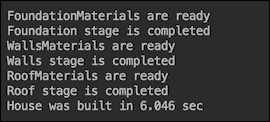

如果我们将`failedStage`设置为`Stage.Walls`，结果将如下所示：

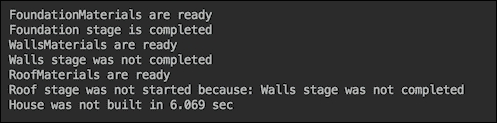

使用`Future`，我们可以缩短建造房屋所需的时间：

```java
ExecutorService execService = Executors.newCachedThreadPool();
Callable<String> t11 = 
                     () -> doStage(Stage.FoundationMaterials);
Future<String> f11 = execService.submit(t11);
List<Future<String>> futures = new ArrayList<>();
futures.add(f11);

Callable<String> t21 = () -> doStage(Stage.WallsMaterials);
Future<String> f21 = execService.submit(t21);
futures.add(f21);

Callable<String> t31 = () -> doStage(Stage.RoofMaterials);
Future<String> f31 = execService.submit(t31);
futures.add(f31);

String result1 = getSuccessOrFirstFailure(futures);

String result2 = doStage(Stage.Foundation, result1);
String result3 = 
       doStage(Stage.Walls, getResult(result1, result2));
String result4 = 
        doStage(Stage.Roof, getResult(result1, result3));
```

这里，`getSuccessOrFirstFailure()`方法看起来是这样的：

```java
String getSuccessOrFirstFailure(
                      List<Future<String>> futures) {
    String result = "";
    int count = 0;
    try {
        while (count < futures.size()) {
            for (Future<String> future : futures) {
                if (future.isDone()) {
                    result = getResult(future);
                    if (!isSuccess(result)) {
                        break;
                    }
                    count++;
                } else {
                    sleepSec(1);
                }
            }
            if (!isSuccess(result)) {
                break;
            }
        }
    } catch (Exception ex) {
        ex.printStackTrace();
    }
    return result;
}
```

由于材料收集是并行的，现在成功建造房屋的速度更快：

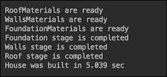

通过利用 Java 函数式编程，我们可以将实现的后半部分改为以下内容：

```java
Supplier<String> supplier1 = 
                 () -> doStage(Stage.Foundation, result1);
Supplier<String> supplier2 = 
                () -> getResult(result1, supplier1.get());
Supplier<String> supplier3 = 
              () -> doStage(Stage.Walls, supplier2.get());
Supplier<String> supplier4 = 
                () -> getResult(result1, supplier3.get());
Supplier<String> supplier5 = 
               () -> doStage(Stage.Roof, supplier4.get());
System.out.println("House was" + 
              (isSuccess(supplier5.get()) ? "" : " not") + 
      " built in " + stopWatch.getTime() / 1000\. + " sec");
```

之前嵌套函数的链是由最后一行的`supplier5.get()`触发的。它将阻塞，直到所有函数按顺序完成，因此没有性能提升：

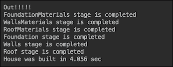

到此，我们使用`Future`所能做到的也就这样了。现在让我们看看是否可以使用`CompletableFuture`改进之前的代码。

## 使用 CompletableFuture 的解决方案

这是使用`CompletableFuture` API 链式调用相同操作的方法：

```java
stopWatch.start();
ExecutorService pool = Executors.newCachedThreadPool();
CompletableFuture<String> cf1 =
   CompletableFuture.supplyAsync(() -> 
           doStageEx(Stage.FoundationMaterials), pool);
CompletableFuture<String> cf2 =
   CompletableFuture.supplyAsync(() -> 
                doStageEx(Stage.WallsMaterials), pool);
CompletableFuture<String> cf3 =
   CompletableFuture.supplyAsync(() -> 
                 doStageEx(Stage.RoofMaterials), pool);
CompletableFuture.allOf(cf1, cf2, cf3)
  .thenComposeAsync(result -> 
      CompletableFuture.supplyAsync(() -> SUCCESS), pool)
  .thenApplyAsync(result -> 
                 doStage(Stage.Foundation, result), pool)
  .thenApplyAsync(result -> 
                      doStage(Stage.Walls, result), pool)
  .thenApplyAsync(result -> 
                       doStage(Stage.Roof, result), pool)
  .handleAsync((result, ex) -> {
       System.out.println("House was" +
         (isSuccess(result) ? "" : " not") + " built in " 
                 + stopWatch.getTime() / 1000\. + " sec");
       if (result == null) {
         System.out.println("Because: " + ex.getMessage());
         return ex.getMessage();
       } else {
         return result;
       }
  }, pool);
System.out.println("Out!!!!!");
```

为了让它工作，我们必须将其中一个`doStage()`方法的实现改为`doStageEx()`方法：

```java
String doStageEx(Stage stage) {
  boolean failed = stage.equals(failedStage);
  if (failed) {
    sleepSec(2);
    throw new RuntimeException(stage + 
                          " stage was not completed");
  } else {
    sleepSec(1);
    System.out.println(stage + " stage is completed");
  }
  return SUCCESS;
}
```

```java
Out!!!!!) came out first, which means that all the chains of the operations related to building the house were executed asynchronously
```

现在，让我们看看如果收集材料的第一个阶段之一失败（`failedStage = Stage.WallsMaterials`），系统将如何表现：

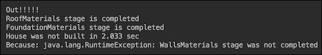

异常是由`WallsMaterials`阶段抛出并由`handleAsync()`方法捕获的，正如预期的那样。而且，再次，打印出`Out!!!!!`消息后，处理是异步完成的。

## CompletableFuture 的其他有用功能

`CompletableFuture`的一个巨大优点是它可以作为一个对象传递并多次使用以启动不同的操作链。为了展示这种能力，让我们创建几个新的操作：

```java
String getData() {
  System.out.println("Getting data from some source...");
  sleepSec(1);
  return "Some input";
}
SomeClass doSomething(String input) {
  System.out.println(
    "Doing something and returning SomeClass object...");
  sleepSec(1);
  return new SomeClass();
}
AnotherClass doMore(SomeClass input) {
  System.out.println("Doing more of something and " +
                    "returning AnotherClass object...");
  sleepSec(1);
  return new AnotherClass();
}
YetAnotherClass doSomethingElse(AnotherClass input) {
  System.out.println("Doing something else and " +
                "returning YetAnotherClass object...");
  sleepSec(1);
  return new YetAnotherClass();
}
int doFinalProcessing(YetAnotherClass input) {
  System.out.println("Processing and finally " +
                                "returning result...");
  sleepSec(1);
  return 42;
}
AnotherType doSomethingAlternative(SomeClass input) {
  System.out.println("Doing something alternative " +
               "and returning AnotherType object...");
  sleepSec(1);
  return new AnotherType();
}
YetAnotherType doMoreAltProcessing(AnotherType input) {
  System.out.println("Doing more alternative and " +
                  "returning YetAnotherType object...");
  sleepSec(1);
  return new YetAnotherType();
}
int doFinalAltProcessing(YetAnotherType input) {
  System.out.println("Alternative processing and " +
                         "finally returning result...");
  sleepSec(1);
  return 43;
}
```

这些操作的结果将由`myHandler()`方法处理：

```java
int myHandler(Integer result, Throwable ex) {
    System.out.println("And the answer is " + result);
    if (result == null) {
        System.out.println("Because: " + ex.getMessage());
        return -1;
    } else {
        return result;
    }
}
```

注意操作返回的所有不同类型。现在我们可以在某个点将链分成两个分支：

```java
ExecutorService pool = Executors.newCachedThreadPool();
CompletableFuture<SomeClass> completableFuture =
   CompletableFuture.supplyAsync(() -> getData(), pool)
     .thenApplyAsync(result -> doSomething(result), pool);

completableFuture
   .thenApplyAsync(result -> doMore(result), pool)
   .thenApplyAsync(result -> doSomethingElse(result), pool)
   .thenApplyAsync(result -> doFinalProcessing(result), pool)
   .handleAsync((result, ex) -> myHandler(result, ex), pool);

completableFuture
   .thenApplyAsync(result -> doSomethingAlternative(result), pool)
   .thenApplyAsync(result -> doMoreAltProcessing(result), pool)
   .thenApplyAsync(result -> doFinalAltProcessing(result), pool)
   .handleAsync((result, ex) -> myHandler(result, ex), pool);

System.out.println("Out!!!!!");
```

这个示例的结果如下所示：

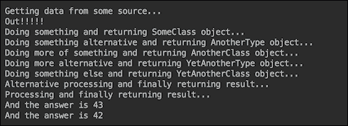

`CompletableFuture` API 提供了一个非常丰富且经过深思熟虑的 API，它支持许多其他功能，包括反应式微服务的最新趋势，因为它允许完全异步地处理传入的数据，如果需要，可以分割流，并扩展以适应输入的增加。我们鼓励您研究示例（本书附带的代码中提供了更多示例）并查看 API [`download.java.net/java/jdk9/docs/api/index.html?java/util/concurrent/CompletableFuture.html`](http://download.java.net/java/jdk9/docs/api/index.html?java/util/concurrent/CompletableFuture.html)。

# Stream API 改进

Java 9 中的大多数新`Stream` API 特性已在描述`Stream`过滤的章节中演示。为了提醒你，以下是我们在 JDK 9 的`Stream` API 改进基础上演示的例子：

```java
long c1 = senators.stream()
        .flatMap(s -> Stream.ofNullable(s.getParty() 
                              == "Party1" ? s : null))
        .count();
System.out.println("OfNullable: Members of Party1: " + c1);

long c2 = senators.stream()
        .map(s -> s.getParty() == "Party2" ? Optional.of(s) 
                                        : Optional.empty())
        .flatMap(Optional::stream)
        .count();
System.out.println("Optional.stream(): Members of Party2: "
                                                      + c2);

senators.stream().limit(5)
        .takeWhile(s -> Senate.timesVotedYes(s) < 5)
        .forEach(s -> System.out.println("takeWhile(<5): " 
                     + s + ": " + Senate.timesVotedYes(s)));

senators.stream().limit(5)
         .dropWhile(s -> Senate.timesVotedYes(s) < 5)
        .forEach(s -> System.out.println("dropWhile(<5): " 
                     + s + ": " + Senate.timesVotedYes(s)));
```

我们还没有提到的是新的重载`iterate()`方法：

```java
static <T> Stream<T> iterate(T seed, UnaryOperator<T> f)
```

其用法的一个例子如下：

```java
String result = 
    IntStream.iterate(1, i -> i + 2)
             .limit(5)
             .mapToObj(i -> String.valueOf(i))
             .collect(Collectors.joining(", "));
System.out.println("Iterate: " + result);
```

我们不得不添加`limit(5)`，因为此版本的`iterate()`方法创建了一个无限流整数。前述代码的结果如下：


在 Java 9 中，添加了重载的`iterate()`方法：

```java
static <T> Stream<T> iterate(T seed, 
     Predicate<? super T> hasNext, UnaryOperator<T> next)
```

如你所见，它现在有一个作为参数的`Predicate`函数式接口，允许根据需要限制流。例如，以下代码产生了与之前使用`limit(5)`的例子完全相同的结果：

```java
String result = 
   IntStream.iterate(1, i -> i < 11, i -> i + 2)
            .mapToObj(i -> String.valueOf(i))
            .collect(Collectors.joining(", "));
System.out.println("Iterate: " + result);
```

注意，流元素的类型不需要是整数。它可以是由源产生的任何类型。因此，新的`iterate()`方法可以用来提供任何类型数据的流终止条件。

# 摘要

在本课中，我们深入探讨了 Java 9 引入的新特性领域。首先，我们探讨了多种流过滤方法，从基本的`filter()`方法开始，最终使用 JDK 9 的`Stream` API 新增功能。然后，你学习了使用新的`StackWalker`类分析堆栈跟踪的更好方法。讨论通过具体的例子进行说明，帮助你看到真正的运行代码。

在介绍创建不可变集合的新便捷工厂方法和`CompletableFuture`类及其在 JDK 9 中的增强功能的新异步处理能力时，我们使用了相同的方法。

我们通过列举`Stream` API 的改进来结束本课——那些我们在过滤代码示例和新`iterate()`方法中演示的改进。

通过这种方式，我们来到了这本书的结尾。你现在可以尝试将所学到的技巧和技术应用到你的项目中，或者如果它不适合那样做，可以构建自己的 Java 项目以实现高性能。在这样做的时候，尝试解决实际问题。这将迫使你学习新的技能和框架，而不仅仅是应用你已经拥有的知识，尽管后者也很有帮助——它使你的知识保持新鲜和实用。

最佳的学习方式是亲自实践。随着 Java 的持续改进和扩展，请关注 Packt 出版的本和类似书籍的新版本。

# 评估

1.  Java 8 引入了`_______`接口，用于发出元素，并支持基于流元素执行计算的各种操作。

1.  以下哪个`StackWalker`类的工厂方法创建了一个具有指定堆栈帧信息的`StackWalker`类实例？

    1.  `getInstance()`

    1.  `getInstance(StackWalker.Option option)`

    1.  `getInstance(Set<StackWalker.Option> options)`

    1.  `getInstance(Set<StackWalker.Option> options, int estimatedDepth)`

1.  判断对错：`CompletableFuture` API 包含许多方法，这些方法是 `CompletionStage` 接口的实现，并且是 `Future` 的实现。

1.  在以下方法中，哪种方法用于在流中需要过滤掉所有重复元素并仅选择唯一元素时使用。

    1.  `distinct()`

    1.  `unique()`

    1.  `selectall()`

    1.  `filtertype()`

1.  判断对错：`CompletableFuture` 的一个巨大优点是它可以作为一个对象传递，并且可以多次使用来启动不同的操作链。
