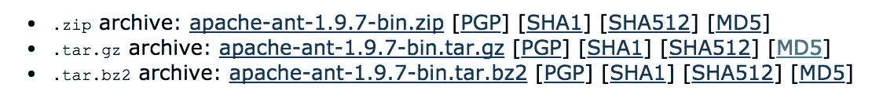
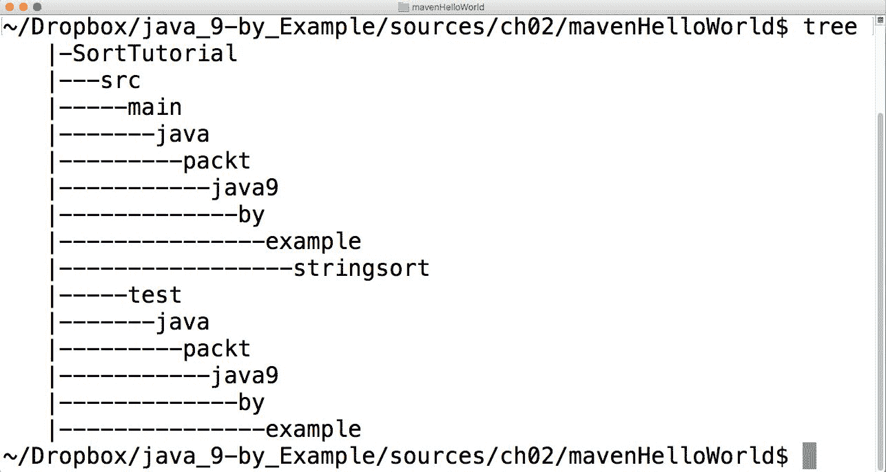
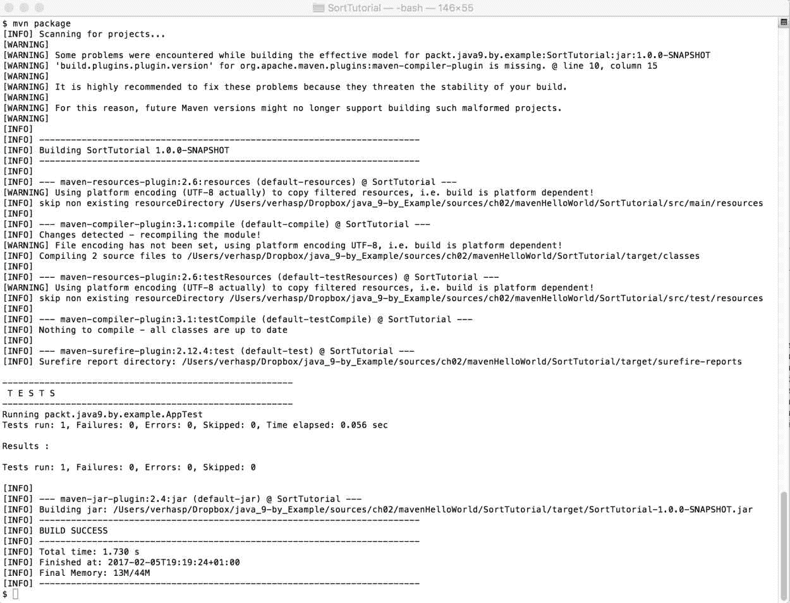
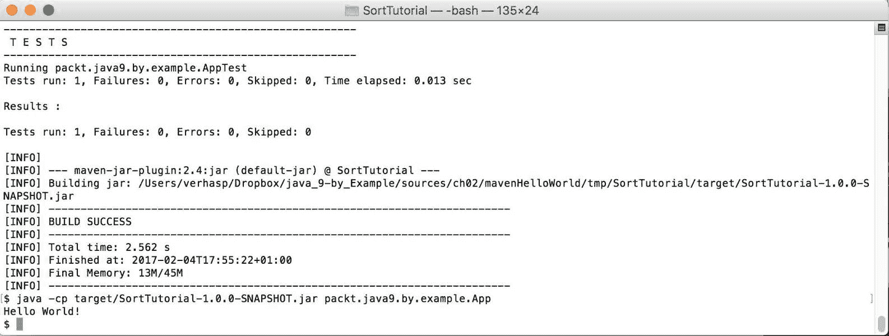
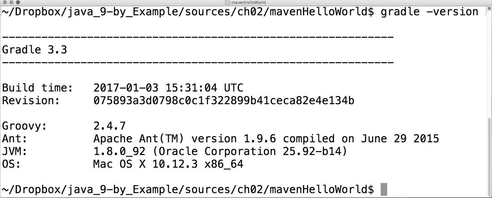
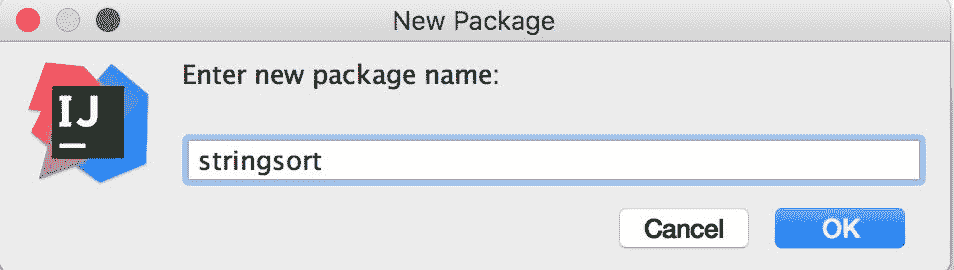
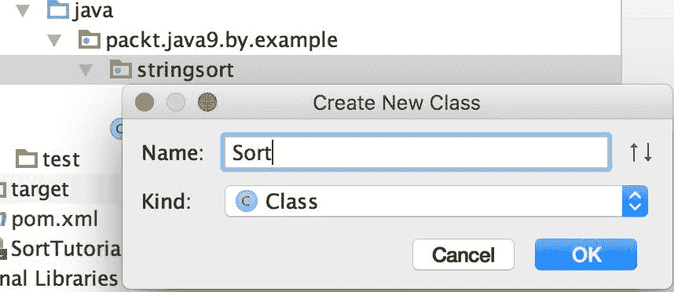
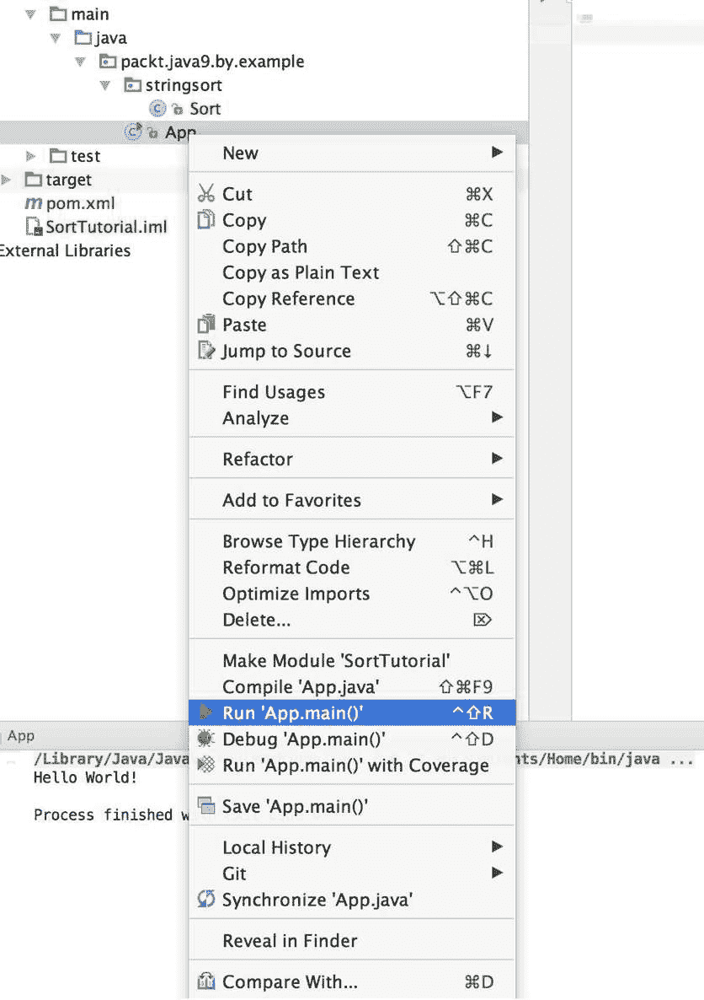
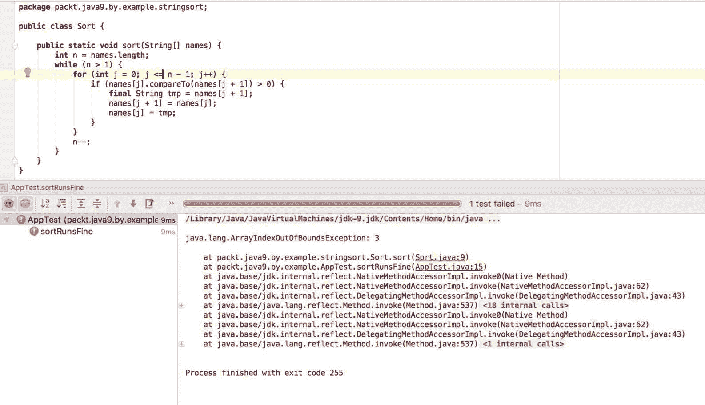

# 第二章：第一个真正的 Java 程序 - 排序姓名

在上一章中，我们熟悉了 Java，特别是使用 REPL 工具和交互式执行一些简单代码。这是一个好的开始，但我们还需要更多。在这一章中，我们将开发一个简单的排序程序。使用这段代码作为示例，我们将查看常用的构建工具，这些工具经常用于 Java 项目，并学习 Java 语言的基本特性。本章将涵盖以下主题：

+   排序问题

+   项目结构和构建工具

+   Make、Ant、Maven 和 Gradle 构建工具

+   与代码示例相关的 Java 语言特性

# 排序入门

排序问题是工程师处理的最古老的编程任务之一。我们有一组记录，我们知道我们会在以后某个时候找到特定的一个，并且我们希望快速找到它。为了找到它，我们将记录按照特定的顺序排序，这有助于我们快速找到我们想要的记录。

例如，我们有学生的名字和他们在一些卡片上的分数。当学生来到办公室询问他们的成绩时，我们会逐张查看所有卡片，以找到询问学生的名字。然而，如果我们将卡片按学生的名字字母顺序排序会更好。当学生询问时，我们可以更快地搜索附在名字上的分数。

我们可以查看中间的牌；如果它显示了学生的名字，那么我们就很高兴找到了名字和分数。如果这张牌在学生名字的字母顺序之前，那么我们将继续在下半部分搜索；否则，我们将检查上半部分。

按照这种方法，我们可以通过几个步骤找到学生的名字。步骤的数量不能超过将牌组对半分所需的次数。如果有两张牌，那么最多两步。如果是四张，那么最多需要三步。如果有八张牌，那么可能需要四步，但不会更多。如果有 1,000 张牌，那么可能最多需要 11 步，而原始的非排序集合则需要 1,000 步，最坏的情况。也就是说，大约提高了搜索速度 100 倍，所以排序卡片是值得的，除非排序本身花费太多时间。我们刚才描述的找到已排序集合中元素的算法称为**二分查找**（[`en.wikipedia.org/wiki/Binary_search_algorithm`](https://en.wikipedia.org/wiki/Binary_search_algorithm)）。

在许多情况下，对数据集进行排序是值得的，并且有许多排序算法可以完成这项任务。有简单和复杂的算法，而且在许多情况下，更复杂的算法运行得更快。

由于我们专注于 Java 编程部分而不是算法锻造，在这一章中，我们将开发一个实现简单且不太快的算法的 Java 代码。

# 冒泡排序

我们将在本章中实现的算法是众所周知的**冒泡排序**。方法非常简单。从卡片的开头开始，比较第一张和第二张卡片。如果第一张卡片在字典顺序上比第二张卡片晚，那么交换这两张卡片。然后对现在位于第二位的卡片重复此操作，然后是第三位，以此类推。有一张字典顺序上最新的卡片，比如说威尔逊。当我们得到这张卡片并开始与下一张卡片比较时，我们总是会交换它们；这样，威尔逊的卡片就会移动到最后一个位置，它必须在排序后放在那里。我们唯一要做的就是从开始重复这个移动，偶尔再次交换卡片，但这次只交换到最后一个元素。这次，第二最新的元素将到达它的位置——比如说，威尔金森将在威尔逊之前。如果我们有*n*张卡片，并且重复*n-1*次，所有卡片都将到达它们的位置。

在接下来的章节中，我们将创建一个实现此算法的 Java 项目。

# 开始学习项目结构和构建工具

当一个项目比单个类更复杂，这通常是这样的，那么定义一个项目结构是明智的。我们得决定在哪里存储源文件，资源文件（那些包含程序资源但不包含 Java 源文件的文件）在哪里，编译器应该将`.class`文件写入哪里，等等。一般来说，结构主要是目录设置和执行构建的工具配置。

使用命令行发出`javac`命令来编译复杂程序是不可行的。如果我们有 100 个 Java 源文件，编译将需要发出那么多的`javac`命令。可以使用通配符来缩短这个过程，例如`javac *.java`，或者我们可以编写一个简单的 bash 脚本或 BAT 命令文件来完成这个任务。首先，它将只有 100 行，每行编译一个源 Java 文件到类文件。然后，我们会意识到，编译自上次编译以来没有改变的文件只是浪费时间、CPU 和电力，因此我们可以添加一些 bash 编程来检查源文件和生成文件的时间戳。然后，我们可能会意识到……无论什么。最后，我们将得到一个本质上是一个构建工具的工具。构建工具是现成的，不值得重新发明轮子。

我们不会创建一个，而是会使用一个现成的构建工具。可以在[`en.wikipedia.org/wiki/List_of_build_automation_software`](https://en.wikipedia.org/wiki/List_of_build_automation_software)找到一些。在本章中，我们将使用一个名为 Maven 的工具；然而，在深入探讨这个工具的细节之前，我们将看看一些你作为 Java 专业人士在企业项目中可能会遇到的其他工具。

在接下来的章节中，我们将讨论四种构建工具中的几种：

+   Make

+   Ant

+   Maven

+   Gradle

我们将简要提及`Make`，因为它现在在 Java 环境中不再使用。然而，`Make`是第一个构建工具，现代 Java 构建工具的许多想法都源于“古老的”`make`。作为专业的 Java 开发者，您也应该熟悉`Make`，这样如果您在项目中偶然看到它的使用，就不会感到惊慌，并且可以了解它是什么以及其详细文档可以在哪里找到。

Ant 是多年前广泛用于 Java 的第一个构建工具，它仍然被许多项目使用。

Maven 比 Ant 更新，它采用了一种不同的方法。我们将详细探讨它。Maven 也是 Apache 软件基金会对 Java 项目的官方构建工具。我们也将在这个章节中使用 Maven 作为构建工具。

Gradle 甚至更新，并且它最近开始赶上 Maven。我们将在后面的章节中更详细地介绍这个工具。

# Make

`make`程序最初是在 1976 年 4 月创建的，所以这不是一个新工具。它包含在 Unix 系统中，因此这个工具在 Linux、Mac OS X 或任何其他基于 Unix 的系统上无需额外安装即可使用。此外，该工具在 Windows 上有许多端口，并且某些版本包含在 Visual Studio 编译器工具集中。

`Make`与 Java 无关。它是在主要编程语言是 C 的时候创建的，但它并不局限于 C 或任何其他语言。`make`是一种具有非常简单语法的依赖描述语言。

`make`，就像任何其他构建工具一样，由一个项目描述文件控制。在`make`的情况下，这个文件包含一组规则。描述文件通常命名为`Makefile`，但如果描述文件的名称不同，可以在`make`命令的命令行选项中指定。

`Makefile`中的规则依次排列，由一行或更多行组成。第一行从第一个位置开始（行首没有制表符或空格），接下来的行以制表符开头。因此，`Makefile`可能看起来像以下代码：

```java
run : hello.jar 
    java -cp hello.jar HelloWorld 

hello.jar : HelloWorld.class 
    jar -cf hello.jar HelloWorld.class 

HelloWorld.class : HelloWorld.java 
    javac HelloWorld.java

```

此文件定义了三个所谓的目标：`run`、`hello.jar`和`HelloWorld.class`。要创建`HelloWorld.class`，请在命令提示符下输入以下行：

```java
    make HelloWorld.class

```

`make`将查看规则并看到它依赖于`HelloWorld.java`。如果`HelloWorld.class`文件不存在，或者`HelloWorld.java`比 Java 类文件新，`make`将执行下一行上的命令，并编译 Java 源文件。如果类文件是在`HelloWorld.java`的最后一次修改后创建的，那么`make`知道不需要运行该命令。

在创建`HelloWorld.class`的情况下，`make`程序的任务很简单。源文件已经存在。如果你发出`make hello.jar`命令，过程会更复杂。`make`命令看到，为了创建`hello.jar`，它需要`HelloWorld.class`，而`HelloWorld.class`本身也是另一个规则上的目标。因此，它可能需要被创建。

首先，它以与之前相同的方式开始解决问题。如果存在`HelloWorld.class`文件，并且它的版本比`hello.jar`旧，那么就没有什么需要做的。如果它不存在，或者版本比`hello.jar`新，那么就需要执行`jar -cf hello.jar HelloWorld.class`命令，尽管不一定是在意识到需要执行的那一刻。`make`程序会记住，在未来某个时刻，当所有创建`HelloWorld.class`所需的命令都已成功执行后，这个命令需要被执行。因此，它会以与我之前描述的完全相同的方式继续创建类文件。

通常，一个规则可以有以下格式：

```java
target : dependencies 
    command

```

`make`命令可以通过首先计算要执行的命令，然后逐个执行它们，使用`make target`命令创建任何目标。这些命令是在不同的进程中执行的 shell 命令，可能在 Windows 下引起问题，这可能会使`Makefile`文件的操作系统依赖。

注意，`run`目标不是一个`make`实际创建的文件。目标可以是一个文件名，或者只是目标的名称。在后一种情况下，`make`永远不会认为目标是可以立即使用的。

由于我们不使用`make`进行 Java 项目，因此没有必要深入了解。此外，我在描述规则时稍微作弊了一点，使其比应有的描述更简单。`make`工具具有许多超出本书范围的功能。还有几个实现彼此略有不同。你很可能会遇到由自由软件基金会制作的版本——GNU make。当然，对于任何 Unix 命令行工具，`man`是你的朋友。`man make`命令将在屏幕上显示工具的文档。

关于`make`你应该记住的主要点如下：

+   它以声明式的方式定义了各个工件（目标）的依赖关系

+   它以命令式的方式定义了创建缺失工件的动作

这种结构是在几十年前发明的，并且至今为止在大多数构建工具中仍然存在，你将在接下来的几章中看到这一点。

# Ant

`ant` 构建工具是在 2000 年左右专门为 Java 项目构建的。Java 希望成为*一次编写，到处运行*的语言，这需要一个可以在不同环境中使用的工具。尽管`make`在 Unix 机器和 Windows 上都有，但`Makefiles`并不总是兼容。使用制表符字符存在一个小问题，一些编辑器将其替换为空格，导致`Makefile`无法使用，但这不是主要原因。`make`的主要问题，也是激发 Ant 开发的原因是，它的命令是 shell 命令。即使`make`程序的实现被制作成可以在不同的操作系统上兼容，但使用的命令很多时候是不兼容的，这是`make`本身无法改变的事情。因为`make`向外部命令发出构建目标，开发者可以自由使用他们在开发机器上可用的任何外部工具。使用相同操作系统的另一台机器可能没有`make`调用的相同工具集。这削弱了`make`构建项目的可移植性。

同时，Ant 遵循`make`的主要原则。有一些目标可能相互依赖，有一些命令需要按照适当的顺序执行以创建目标，并遵循依赖顺序。依赖和命令的描述是 XML（解决了制表符问题），命令是用 Java 实现的（解决了系统依赖问题，嗯...更多或更少）。

由于 Ant 既不是操作系统的一部分，也不是 JDK 的一部分，如果您想使用它，您必须单独下载和安装。

# 安装 Ant

您可以从其官方网站([`ant.apache.org`](http://ant.apache.org))下载 Ant。您可以下载源代码或预编译版本。最简单的方法是下载`tar.gz`格式的二进制文件。

无论何时您从互联网下载软件，都强烈建议您检查下载文件的完整性。HTTP 协议不包含错误检查，可能发生网络错误仍然隐藏或恶意内部代理修改了下载的文件。下载网站通常为可下载文件提供校验和。这些通常是 MD5、SHA1、SHA512 或其他校验和。

当我以`tar.gz`格式下载 Apache Ant 1.9.7 版本时，我也打开了指向 MD5 校验和的页面。校验和值是`bc1d9e5fe73eee5c50b26ed411fb0119`。



您可以使用以下命令行检查下载的文件：

`$ md5 apache-ant-1.9.7-bin.tar.gz`

`MD5 (apache-ant-1.9.7-bin.tar.gz) = bc1d9e5fe73eee5c50b26ed411fb0119`

计算出的 MD5 校验和与网站上的相同，这意味着文件完整性没有受损。

在 Windows 操作系统上，没有包含计算 MD5 摘要的工具。有一个由微软提供的工具，称为**文件完整性校验和验证工具**，可通过页面[`support.microsoft.com/en-us/help/841290/availability-and-description-of-the-file-checksum-integrity-verifier-utility`](https://support.microsoft.com/en-us/help/841290/availability-and-description-of-the-file-checksum-integrity-verifier-utility)获取。如果你使用 Linux，可能会发生`md5`或`md5sum`实用工具未安装的情况。在这种情况下，你可以使用`apt-get`或你的 Linux 发行版支持的任何安装工具来安装它。

文件下载后，你可以使用以下命令将其展开到子目录：

```java
    tar xfz apache-ant-1.9.7-bin.tar.gz

```

创建的子目录是 Ant 的可用二进制发行版。通常，我会将其移动到`~/bin`目录下，使其仅在 OS X 上对我的用户可用。之后，你应该设置环境变量`ANT_HOME`指向此目录，并将安装的`bin`目录添加到`PATH`中。为此，你应该编辑`~/.bashrc`文件，并向其中添加以下行：

```java
export ANT_HOME=~/bin/apache-ant-1.9.7/ 
export PATH=${ANT_HOME}bin:$PATH

```

然后，重新启动终端应用程序，或者只需输入`. ~/.bashrc`并测试 Ant 的安装，通过输入以下命令：

```java
    $ ant
Buildfile: build.xml does not exist!
Build failed

```

如果安装正确，你应该看到前面的错误信息。

# 使用 Ant

当你看到 Ant 要构建的项目时，你会看到一个`build.xml`文件。这是项目构建文件，即 Ant 在检查安装是否正确时缺失的那个文件。它可以有其他任何名称，你可以将文件的名称作为 Ant 的命令行选项指定，但这是默认文件名，就像`Makefile`对于`make`一样。一个`build.xml`示例如下：

```java
<project name="HelloWorld" default="jar" basedir="."> 
<description> 
    This is a sample HelloWorld project build file. 
</description> 
    <property name="buildDir" value="build"/> 
    <property name="srcDir" value="src"/> 
    <property name="classesDir" value="${buildDir}/classes"/> 
    <property name="jarDir" value="${buildDir}/jar"/> 

    <target name="dirs"> 
        <mkdir dir="${classesDir}"/> 
        <mkdir dir="${jarDir}"/> 
    </target> 

    <target name="compile" depends="dirs"> 
        <javac srcdir="${srcDir}" destdir="${classesDir}"/> 
    </target> 

    <target name="jar" depends="dirs,compile"> 
        <jar destfile="${jarDir}/HelloWorld.jar" basedir="${classesDir}"/> 
    </target> 
</project>

```

最高级别的 XML 标签是`project`。每个构建文件描述一个项目，因此得名。该标签有三个可能的属性，如下所示：

+   `name`：这定义了项目的名称，并被一些 IDE 用于在左侧面板中标识项目

+   `default`：当在启动 Ant 时命令行上没有定义目标时，使用此目标

+   `basedir`：这定义了在构建文件中用于任何其他目录名称计算的初始目录

构建文件可以包含项目的描述，以及属性标签中的属性。这些属性可以用作`${`和`}`字符之间的任务属性中的变量，并在构建过程中发挥重要作用。

目标在目标 XML 标签中定义。每个标签都应该有一个唯一标识构建文件中目标的名称，并且可能有一个 `depends` 标签，指定一个或多个此目标所依赖的其他目标。如果有多个目标，则目标在属性中以逗号分隔。属于目标的任务将按照目标依赖链要求的顺序执行，这与我们在 `make` 的情况中看到的方式非常相似。

你还可以为 Ant 打印的具有 `-projecthelp` 命令行选项的目标添加一个 `description` 属性。这有助于构建文件的用户了解有哪些目标以及它们的作用。随着目标数量的增加，构建文件往往会变得很大，当你有十个或更多目标时，很难记住每一个目标。

包含 `HelloWorld.java` 的示例项目现在已按以下目录排列：

+   项目根目录下的 `build.xml`

+   项目 `src` 文件夹中的 `HelloWorld.java`

+   `build/` 文件夹不存在；它将在构建过程中创建

+   `build/classes` 和 `build/jar` 也尚未存在，将在构建过程中创建

当你第一次为 `HelloWorld` 项目启动构建时，你会看到以下输出：

```java
$ ant  
Buildfile: /Users/verhasp/Dropbox/java_9-by_Example/sources/ch02/build.xml 

dirs: 
    [mkdir] Created dir: /Users/verhasp/Dropbox/java_9-by_Example/sources/ch02/build/classes 
    [mkdir] Created dir: /Users/verhasp/Dropbox/java_9-by_Example/sources/ch02/build/jar 

compile: 
... 
    [javac] Compiling 1 source file to /Users/verhasp/Dropbox/java_9-by_Example/sources/ch02/build/classes 

jar: 
      [jar] Building jar: /Users/verhasp/Dropbox/java_9-by_Example/sources/ch02/build/jar/HelloWorld.jar 

BUILD SUCCESSFUL 
Total time: 0 seconds

```

从实际输出中删除了一些不重要的行。

Ant 实现了首先需要创建目录，然后需要编译源代码，最后才能将 `.class` 文件打包成 `.jar` 文件。现在，你需要记住执行 `HelloWorld` 应用程序的命令。它已在第一章中列出。请注意，这次，JAR 文件名为 `HelloWorld.jar`，它不在当前目录中。你也可以尝试阅读 Ant 的在线文档，创建一个名为 `run` 的目标，以执行编译和打包的程序。

Ant 内置了一个名为 `java` 的任务，它以几乎与你在终端中输入 `java` 命令相同的方式执行 Java 类。

# Maven

由于 Ant 是为了克服 `make` 的不足而创建的，Maven 也是出于类似的目的——为了克服 Ant 的不足而创建的。你可能还记得，`make` 不能保证构建的可移植性，因为 `make` 执行的命令是任意的 shell 命令，可能具有系统特定性。只要 Java 在不同平台上以相同的方式运行，只要所有任务都在类路径上可用，Ant 构建就是可移植的。

Ant 的问题略有不同。当你下载项目的源代码并想要构建时，将会使用什么命令？你应该要求 Ant 列出所有目标并选择看起来最合适的一个。任务的名称取决于编写 `build.xml` 文件的工程师。有一些约定，但它们不是严格的规则。

你在哪里可以找到 Java 源文件？它们是否在`src`目录下？如果项目是多语言的，是否还会有 Groovy 或其他编程语言的文件？这取决于。再次强调，可能会有一些某些团队或公司文化建议的惯例，但并没有普遍的最佳行业实践。

当你使用 Ant 开始一个新项目时，你必须创建编译、测试执行和打包的目标。这是你已经在其他项目中做过的。在第二个或第三个项目之后，你只需复制并粘贴你之前的`build.xml`到新项目中。这是问题吗？是的，是问题。这是复制/粘贴编程，即使它只是*仅仅*一些构建文件。

开发者意识到，使用 Ant 的项目中，相当一部分工作都投入到了项目构建工具的配置中，包括重复性任务。当新成员加入团队时，他们首先必须学习如何配置构建。如果启动了一个新项目，就必须创建构建配置。如果是重复性任务，那么最好让计算机来做。这不就是编程通常要做的事情吗？

Maven 在构建问题上的处理方式略有不同。我们想要构建 Java 项目。有时，可能会有一些 Groovy 或 Jython 的东西，但它们也是 JVM 语言；因此，说我们想要构建 Java 项目并不是一个很大的限制。Java 项目包含 Java 文件，有时还有一些其他编程语言的源文件、资源文件，通常就是这样。Ant 可以做任何事情，但我们不希望用构建工具做任何事情。我们想要构建项目。

好吧，在限制自己并接受我们不需要一个可以用于任何目的的构建工具之后，我们可以继续前进。我们可以要求源文件位于`src`目录下。有一些文件是操作代码所需的，还有一些文件包含一些测试代码和数据。因此，我们将有两个目录，`src/test`和`src/main`。Java 文件位于`src/main/java`以及`src/test/java`。资源文件位于`src/main/resources`和`src/test/resources`。

如果你想要将源文件放在其他地方，那就不要这么做。我是认真的。虽然可能可行，但我甚至不会告诉你如何做。没有人这么做。我甚至不知道为什么 Maven 允许这样做。无论何时你看到使用 Maven 作为构建工具的项目，源文件都是这样组织的。没有必要理解项目构建工程师所设想的目录结构。它总是相同的。

目标和任务又是如何的呢？在所有基于 Maven 的项目中，它们都是相同的。除了编译、测试、打包或部署 Java 项目之外，您还想用 Maven 做些什么？Maven 为我们定义了这些项目生命周期。当您想使用 Maven 作为构建工具编译项目时，您将需要输入 `$ mvn compile` 来编译项目。即使您还不了解项目实际上是什么，您也可以这样做。

由于我们有相同的目录结构和相同的目标，导致这些目标的实际任务也都是相同的。当我们创建 Maven 项目时，我们不必描述构建过程需要做什么以及如何做。我们将不得不描述项目，以及仅限于项目特定的部分。

Maven 项目的构建配置在一个 XML 文件中给出。这个文件的名称通常是 `pom.xml`，它应该位于项目的 `root` 目录中，这应该是启动 Maven 时的当前工作目录。**POM** 这个词代表 **项目对象模型**，它以分层的方式描述项目。源代码目录、打包和其他内容定义在一个所谓的超级 POM 中。这个 POM 是 Maven 程序的一部分。POM 中定义的任何内容都会覆盖超级 POM 中定义的默认值。当有一个包含多个模块的项目时，POMs 会按照层次结构排列，并且从父项目继承配置值到模块。由于我们将使用 Maven 来开发我们的排序代码，我们将在稍后看到更多细节。

# 安装 Maven

Maven 既不是操作系统的一部分，也不是 JDK 的一部分。它必须以与 Ant 非常相似的方式下载和安装。您可以从其官方网站的下载部分下载 Maven（[`maven.apache.org/`](https://maven.apache.org/)）。目前，最新稳定版本是 3.3.9。当您下载时，实际发布的版本可能不同；相反，请使用最新稳定版本。您可以下载源代码或预编译版本。最简单的方法是下载 `tar.gz` 格式的二进制文件。

我不能忽视提醒您检查下载完整性的重要性，使用校验和进行详细说明已在 Ant 安装部分的章节中。

文件下载完成后，您可以使用以下命令将其解压到子目录：

```java
tar xfz apache-maven-3.3.9-bin.tar.gz

```

创建的子目录是 Maven 的可用二进制发行版。通常，我会将它移动到 `~/bin` 目录下，使其仅在 OS X 上对我的用户可用。之后，您应该将安装的 `bin` 目录添加到 `PATH` 中。为此，您应该编辑 `~/.bashrc` 文件，并向其中添加以下行：

```java
export M2_HOME=~/bin/apache-maven-3.3.9/ 
export PATH=${M2_HOME}bin:$PATH

```

然后，重新启动终端应用程序，或者只需输入 `. ~/.bashrc` 并通过以下方式测试 Maven 的安装：

```java
    $ mvn -v
Apache Maven 3.3.9 (bb52d8502b132ec0a5a3f4c09453c07478323dc5; 2015-11-10T17:41:47+01:00)
Maven home: /Users/verhasp/bin/apache-maven-3.3.9
Java version: 9-ea, vendor: Oracle Corporation
Java home: /Library/Java/JavaVirtualMachines/jdk-9.jdk/Contents/Home
Default locale: en_US, platform encoding: UTF-8
OS name: "mac os x", version: "10.11.6", arch: "x86_64", family: "mac"

```

您应该在屏幕上看到类似的消息，显示已安装的 Maven 版本和其他信息。

# 使用 Maven

与 Ant 不同，Maven 帮助您创建新项目的骨架。为此，您必须输入以下命令：

```java
    $ mvn archetype:generate

```

Maven 首先会从网络上下载实际可用的项目类型，并提示您选择想要使用的一个。当 Maven 还比较新的时候，这种方法看起来是个好主意。当我第一次开始使用 Maven 时，列出的项目数量在 10 到 20 之间。今天，当我写这本书的时候，它列出了 1,635 种不同的原型。这个数字看起来更像是一个历史日期（法国科学院的宪法），而不是一个可用的不同原型的列表大小。然而，请不要慌张。当 Maven 询问您的选择时，它会提供一个默认值，这对于我们想要的 `HelloWorld` 来说是很好的。

```java
    Choose a number: 817: 

```

实际的数字可能因您的安装而异。无论是什么，接受建议并按 *Enter* 键。之后，Maven 将询问项目的版本：

```java
    Choose version: 
1: 1.0-alpha-1
2: 1.0-alpha-2
3: 1.0-alpha-3
4: 1.0-alpha-4
5: 1.0
6: 1.1
Choose a number: 6: 5

```

选择列表中编号为 `5` 的 `1.0` 版本。接下来，Maven 会询问项目的组 ID 和工件 ID。我们将在后面讨论的依赖关系管理使用这些信息。我根据书籍和出版社选择了组 ID。项目的工件是 `SortTutorial`，因为我们将从这个项目的章节示例开始。

```java
Define value for property 'groupId': : packt.java9.by.example
Define value for property 'artifactId': : SortTutorial

```

接下来的问题是项目的当前版本。我们已经选择了 `1.0`，Maven 提供了 `1.0-SNAPSHOT`。在这里，我选择了 `1.0.0-SNAPSHOT`，因为我更喜欢语义版本控制。

```java
Define value for property 'version':  1.0-SNAPSHOT: : 1.0.0-SNAPSHOT

```

语义版本控制，定义在 [`semver.org/`](http://semver.org/) 上，是一种建议使用三位数字版本号作为 *M.m.p.* 的版本控制方案，分别代表 *主*、*次* 和 *修补* 版本号。这对于库来说非常有用。如果自上次发布以来只有错误修复，您将增加最后一个版本号。当新版本包含新功能，但库与旧版本兼容时，您将增加次要号；换句话说，任何使用旧版本的程序仍然可以使用新版本。当新版本与旧版本有显著不同时，增加主发布号。

在应用程序程序的情况下，没有使用应用程序 API 的代码；因此，次要版本号并不那么重要。尽管如此，它并不妨碍，而且它通常被证明是有用的，可以用来表示应用程序中的较小变化。我们将在最后一章讨论如何对软件进行版本控制。

Maven 将带有 `-SNAPSHOT` 后缀的版本视为非发布版本。在我们开发代码的过程中，我们将有许多 *版本* 的代码，所有这些代码都具有相同的快照版本号。另一方面，非快照版本号只能用于单个版本。

```java
Define value for property 'package':  packt.java9.by.example: :

```

程序骨架生成中的最后一个问题是 Java 包的名称。默认值是我们为 `groupId` 给定的值，我们将使用这个值。使用其他东西的情况很少。

当我们指定了所有需要的参数后，最后的请求是确认设置：

```java
Confirm properties configuration: 
groupId: packt.java9.by.example 
artifactId: SortTutorial 
version: 1.0.0-SNAPSHOT 
package: packt.java9.by.example 
 Y: : Y

```

在输入 `Y` 后，Maven 将生成项目所需的文件并显示关于此的报告：

```java
[INFO] ----------------------------------------------------------- 
[INFO] Using following parameters for creating project from Old (1.x) Archetype: maven-archetype-quickstart:1.0 
[INFO] ----------------------------------------------------------- 
[INFO] Parameter: basedir, Value: .../mavenHelloWorld 
[INFO] Parameter: package, Value: packt.java9.by.example 
[INFO] Parameter: groupId, Value: packt.java9.by.example 
[INFO] Parameter: artifactId, Value: SortTutorial 
[INFO] Parameter: packageName, Value: packt.java9.by.example 
[INFO] Parameter: version, Value: 1.0.0-SNAPSHOT 
[INFO] *** End of debug info from resources from generated POM *** 
[INFO] project created from Old (1.x) Archetype in dir: .../mavenHelloWorld/SortTutorial 
[INFO] ----------------------------------------------------------- 
[INFO] BUILD SUCCESS 
[INFO] ----------------------------------------------------------- 
[INFO] Total time: 01:27 min 
[INFO] Finished at: 2016-07-24T14:22:36+02:00 
[INFO] Final Memory: 11M/153M 
[INFO] -----------------------------------------------------------

```

你可以查看以下生成的目录结构：



你还可以看到它生成了以下三个文件：

+   `SortTutorial/pom.xml` 包含 **项目对象模型**

+   `SortTutorial/``src/main/java/packt/java9/by/example/App.java` 包含一个 `HelloWorld` 示例应用程序

+   `SortTutorial/src/test/java/packt/java9/by/example/AppTest.java` 包含一个使用 `junit4` 库的单元测试框架

我们将在下一章讨论单元测试。现在，我们将专注于排序应用程序。由于 Maven 非常友好，为应用程序生成了一个示例类，我们可以编译并运行它，而不需要实际编码，只是为了看看我们如何使用 Maven 构建项目。通过执行 `cd SortTutorial` 将默认目录更改为 `SortTutorial`，然后执行以下命令：

```java
    $ mvn package

```

我们将得到以下输出：



Maven 会自动启动、编译和打包项目。如果不这样做，请阅读下一个信息框。

当你第一次启动 Maven 时，它会从中央仓库下载大量的依赖项。这些下载需要时间，并且会在屏幕上报告，所以实际的输出可能与前面代码中看到的不同。

Maven 使用 Java 版本 1.5 的默认设置编译代码。这意味着生成的类文件与 Java 版本 1.5 兼容，并且编译器只接受在 Java 1.5 中已经可用的语言结构。如果我们想使用更新的语言特性，本书中我们使用了很多，那么应该编辑 `pom.xml` 文件以包含以下行：

`<build>`

`    <plugins>`

`      <plugin>`

`        <groupId>org.apache.maven.plugins</groupId>`

`        <artifactId>maven-compiler-plugin</artifactId>`

`        <configuration>`

`          <source>1.9</source>`

`          <target>1.9</target>`

`        </configuration>`

`      </plugin>`

`    </plugins>`

`  </build>`

当使用 Java 9 的 Maven 默认设置时，它变得更加复杂，因为 Java 9 不生成类格式，也不限制比 Java 1.6 更早的源兼容性。在我写下这些行的时候，最新的 Maven 版本是 3.3.9。当我尝试不进行修改编译前面的代码时，Java 编译器会停止并显示以下错误：

`[ERROR] 源选项 1.5 已不再支持。请使用 1.6 或更高版本。`

**`[ERROR] 目标选项 1.5 已不再支持。请使用 1.6 或更高版本。**`

以后，Maven 的发布可能会表现出不同的行为。

现在，你可以使用以下命令开始代码：

```java
    $ java -cp target/SortTutorial-1.0.0-SNAPSHOT.jar packt.java9.by.example.App

```

你可以在以下图片中看到示例运行的输出结果：



# Gradle

Ant 和 Maven 是两个世界，使用其中一个可能会导致在互联网论坛上引发激烈的争论。Ant 赋予开发者创建符合自己口味的构建过程的自由。Maven 则限制团队使用更标准的构建过程。某些不符合任何标准构建过程但有时在某些环境中需要的特殊过程，使用 Maven 很难实现。在 Ant 中，您可以使用内置任务几乎编写任何脚本，几乎就像您编写 bash 脚本一样。使用 Maven 并不简单，并且通常需要编写插件。尽管编写插件并非难事，但开发者通常更喜欢有以更简单的方式完成任务的可能性：脚本。我们有两种方法，两种思维方式和风格，而不是一个能满足所有需求的单一工具。因此，在 Java 技术发展过程中，一个新的构建工具应运而生。

Gradle 试图融合两者的优点，使用在 Maven 和 Ant 最初开发时不可用的技术。

Gradle 具有内置的目标和生命周期，但与此同时，您也可以编写自己的目标。您可以通过配置项目，就像使用 Maven 一样，而不需要编写脚本任务来完成，但与此同时，您也可以像在 Ant 中一样编写自己的目标。更重要的是，Gradle 集成了 Ant，因此任何为 Ant 实现的任务也可以在 Gradle 中使用。

Maven 和 Ant 使用 XML 文件来描述构建过程。如今，XML 已经成为一种过时的技术。我们仍然在使用它，并且开发者应该熟练掌握处理、读取和编写 XML 文件，但一个*现代*的工具不会使用 XML 进行配置。新的、花哨的格式，如 JSON，更为流行。Gradle 也不例外。Gradle 的配置文件使用基于 Groovy 的**领域特定语言**（**DSL**）。这种语言对程序员来说更易读，并为编程构建过程提供了更多自由。这也是 Gradle 的危险所在。

将强大的 JVM 语言 Groovy 掌握在开发者手中，以创建构建工具，赋予了他们创建看似不错但后来可能证明过于复杂和难以维护的复杂构建过程的自由和诱惑。这正是 Maven 最初被实施的原因。

在进入另一个可能引发激烈且无意义的争论的领域之前，我必须停下来。Gradle 是一个非常强大的构建工具。您应该小心使用它，就像您使用武器一样——不要射击自己的腿。

# 安装 Gradle

要安装 Gradle，您需要从[`gradle.org/gradle-download/`](https://gradle.org/gradle-download/)网站下载编译后的二进制文件。

再次强调，使用校验和检查下载完整性非常重要。我在关于 Ant 安装的部分中给出了详细的操作方法。

不幸的是，Gradle 网站没有提供可下载文件的校验和值。

Gradle 可以以 ZIP 格式下载。要解压文件，您必须使用 unzip 命令：

```java
    $ unzip gradle-3.3-bin.zip

```

创建的子目录是 Gradle 的可用二进制发行版。通常，我会将它移动到 `~/bin` 目录下，使其仅对我的 OS X 用户可用。之后，您应该将安装的 `bin` 目录添加到 `PATH` 中。为此，您应该编辑 `~/.bashrc` 文件并添加以下行：

```java
export GRADLE_HOME=~/bin/gradle-3.3/ 
export PATH=${GRADLE_HOME}bin:$PATH

```

然后，重新启动终端应用程序，或者只需输入 `. ~/.bashrc` 并测试 Gradle 的安装，输入以下内容：

```java
    $ gradle -version

```

我们得到了以下输出，如这个截图所示：



# 使用 Maven 设置项目

要启动项目，我们将使用 Maven 在以下命令行启动时创建的目录结构和 `pom.xml` 文件：

```java
    $ mvn archetype:generate

```

它创建了目录，`pom.xml` 文件和 `App.java` 文件。现在，我们将通过创建新文件来扩展这个项目。我们首先将在 `packt.java9.by.example.stringsort` 包中编写排序算法的代码：



当我们在 IDE 中创建新包时，编辑器将自动在已存在的 `src/main/java/packt/java9/by/example` 目录下创建 `stringsort` 子目录：



使用 IDE 创建新的 `Sort` 类也会自动在这个目录下创建一个名为 `Sort.java` 的新文件，并填充类的骨架：

```java
package packt.java9.by.example.stringsort; 

public class Sort { 
}

```

我们现在将拥有包含以下代码的 `App.java`：

```java
package packt.java9.by.example; 

public class App  
{ 
    public static void main( String[] args ) 
    { 
        System.out.println( "Hello World!" ); 
    } 
}

```

Maven 以起始版本创建了它。我们将编辑这个文件以提供一个排序算法可以排序的样本列表。我建议您使用 IDE 编辑文件，并编译和运行代码。IDE 提供了一个快捷菜单来启动代码，这比在终端中输入命令要简单一些。通常，建议您熟悉 IDE 功能以节省时间，避免重复性任务，例如输入终端命令。专业开发者几乎只使用命令行来测试命令行功能，并在可能的情况下使用 IDE。



# 编写排序代码

Maven 和 IDE 为排序程序创建了文件。它们形成了我们代码的骨架，现在是我们让它们变得有肌肉的时候了。我们花费了相当多的时间通过访问不同的构建工具来设置项目，只是为了学习如何编译代码。我希望这没有让您分心太多，但无论如何，我们应看到一些真正的代码。

首先，我们将编写排序代码，然后编写调用排序的代码。调用排序的代码是一种测试代码。为了简单起见，我们现在将简单地使用 `public static void main` 方法来启动代码。我们将在后面的章节中使用测试框架。

目前，排序的代码将看起来像这样：

```java
package packt.java9.by.example.stringsort; 

public class Sort { 

    public void sort(String[] names) { 
        int n = names.length; 
        while (n > 1) { 
            for (int j = 0; j < n - 1; j++) { 
                if (names[j].compareTo(names[j + 1]) > 0) { 
                    final String tmp = names[j + 1]; 
                    names[j + 1] = names[j]; 
                    names[j] = tmp; 
                } 
            } 
            n--; 
        } 
    } 
}

```

这是一个执行排序的类。这个类中只有一个方法用于排序。该方法接受一个包含字符串的数组作为参数，并对这个数组进行排序。这个方法没有返回值。在声明中，这通过伪类型`void`表示。方法使用它们的参数执行一些任务，并且可能返回一个值。方法的参数是通过值传递的，这意味着方法不能修改作为参数传递的变量。然而，它可以修改参数包含的对象。在这种情况下，数组将被修改，我们将对其进行排序。另一方面，`actualNames`变量将指向同一个数组，而`sort`方法无法做任何操作来使这个变量指向不同的数组。

这个类中没有`main`方法，这意味着它不能从命令行自行启动。这个类只能从其他类中使用，因为每个 Java 程序都应该有一个包含`public static void main`方法的类，这是我们单独创建的。

我也可以在类中放入一个`main`方法使其可执行，但这不是好的做法。真正的程序由许多类组成，一个类不应该做很多事情。相反，应该是相反的。*单一职责原则*指出，一个类应该只负责一件事情；因此，`class sort`执行排序。执行应用程序是不同的任务，因此它必须在不同的类中实现。

通常，我们不会实现包含`main`方法的类。通常，一个框架会提供它。例如，编写在 servlet 容器中运行的*servlet*需要包含一个实现`javax.servlet.Servlet`接口的类。在这种情况下，程序表面上没有`main`方法。servlet 容器的实际实现有。Java 命令行启动容器，容器在需要时加载 servlets。

在下面的示例代码中，我们实现了包含`main`方法的`App`类：

```java
package packt.java9.by.example; 

import packt.java9.by.example.stringsort.Sort; 

public class App { 
    public static void main(String[] args) { 
        String[] actualNames = new String[]{ 
                "Johnson", "Wilson", 
                "Wilkinson", "Abraham", "Dagobert" 
        }; 
        final Sort sorter = new Sort(); 
        sorter.sort(actualNames); 
        for (final String name : actualNames) { 
            System.out.println(name); 
        } 
    } 
}

```

这段代码包含一个初始化为包含常量值的字符串数组，创建了一个`Sort`类的新实例，调用了`sort`方法，然后将其打印到标准输出。

在真正的程序中，我们几乎从不将这样的常量放在程序代码中；我们将它们放入资源文件中，并有一些代码来读取实际的值。这使代码与数据分离，便于维护，消除了仅更改数据时意外修改代码结构的风险。同样，我们几乎不会使用`System.out`将任何内容写入标准输出。通常，我们将使用来自不同来源的日志记录可能性。有不同库提供日志记录功能，日志记录也可以从 JDK 本身获得。

至今为止，我们将专注于简单的解决方案，以免不同库和工具的众多选择分散你对 Java 的注意力。在下一节中，我们将查看我们用来编写算法的 Java 语言结构。首先，我们将一般地查看它们，然后，在更详细地查看。这些语言特性不是相互独立的：一个建立在另一个之上，因此，解释将首先是一般的，我们将在子节中深入细节。

# 理解算法和语言结构

算法在章节的开始处已经解释过了。实现位于`Sort`类中的`sort`方法内，并且只有几行代码：

```java
        int n = names.length; 
        while (n > 1) { 
            for (int j = 0; j < n - 1; j++) { 
                if (names[j].compareTo(names[j + 1]) > 0) { 
                    final String tmp = names[j + 1]; 
                    names[j + 1] = names[j]; 
                    names[j] = tmp; 
                } 
            } 
            n--; 
        }

```

`n`变量在排序开始时持有数组的长度。Java 中的数组总是有一个属性来给出长度，这个属性叫做`length`。当我们开始排序时，我们将从数组的开始到结束进行遍历，正如你可能记得的，最后一个元素，*Wilson*，将在第一次迭代中走到最后一个位置。后续的迭代将会更短，因此变量`n`将会减少。

# 块

Java 中的代码是在代码块中创建的。任何位于`{`和`}`字符之间的内容都是一个块。在上一个示例中，方法的代码就是一个块。它包含命令，其中一些命令，如`while`循环，也包含一个块。在这个块内部，有两个命令。其中一个是`for`循环，同样包含一个块。虽然我们可以使用单个表达式来形成循环体，但我们通常使用块。我们将在接下来的几页中详细讨论循环。

正如前一个示例中所看到的，循环可以嵌套，因此`{`和`}`字符形成一对。一个块可以位于另一个块内部，但两个块不能重叠。当代码包含一个`}`字符时，它是在关闭最后打开的块。

# 变量

在 Java 中，就像在几乎任何编程语言中一样，我们使用变量。Java 中的变量是有类型的。这意味着一个变量只能持有单一类型的值。在程序中的某个时刻，一个变量不能同时持有`int`类型和`String`类型。当声明变量时，它们的类型会写在变量名之前。

变量也有可见作用域。方法中的局部变量只能在其定义的块内部使用。变量可以在方法中使用，或者它们可以属于一个类或一个对象。为了区分这两种，我们通常将这些变量称为*字段*。

# 类型

每个变量都有一个类型。在 Java 中，主要有两大类型组：原始类型和引用类型。原始类型是预定义的，你不能定义或创建一个新的原始类型。有八个原始类型：`byte`、`short`、`int`、`long`、`float`、`double`、`boolean`和`char`。

前四种类型，`byte`、`short`、`int` 和 `long`，是有符号的数值整数类型，能够在 8、16、32 和 64 位上存储正数和负数。

`float` 和 `double` 类型在 IEEE 754 浮点格式上以 32 位和 64 位存储浮点数。

`boolean` 类型是一种原始类型，它只能是 `true` 或 `false`。

`char` 类型是一种字符数据类型，存储单个 16 位 Unicode 字符。

对于每种原始类型，都有一个可以存储相同类型值的类。当一个原始类型需要转换为相应的类类型时，这是自动完成的。这被称为自动装箱。这些类型包括 `Byte`、`Short`、`Integer`、`Long`、`Float`、`Double`、`Boolean` 和 `Character`。以以下变量声明为例：

```java
Integer a = 113;

```

这将值 `113`，它是一个 `int` 数字，转换为 `Integer` 对象。

这些类型是运行时的一部分，也是语言的一部分。尽管没有它的原始对应类型，但有一个非常重要且无处不在的类，我们已经在使用它了：`String`。字符串包含字符。

原始类型和对象之间的主要区别是，原始类型不能用来调用方法，但它们消耗的内存更少。在数组的情况下，内存消耗及其对速度的影响非常重要。

# 数组

变量可以是原始类型，根据其声明，或者它们可能持有对象的引用。一个特殊的对象类型是数组。当一个变量持有数组的引用时，它可以使用 `[` 和 `]` 字符以及一个由 0 或一个正值组成的整数值（该值小于数组的长度），来访问数组的特定元素。Java 支持多维数组，当数组有也是数组的元素时。Java 中的数组从零开始索引。在运行时检查下标越界，结果是异常。

异常是特殊条件，它中断了正常的执行流程，并停止代码的执行或跳转到最近的 `catch` 语句。我们将在下一章讨论异常及其处理方法。

当代码有一个原始类型的数组时，数组包含许多内存槽，每个槽存储该类型的值。当数组是引用类型时，换句话说，当它是一个对象数组时，那么数组元素是对象的引用，每个对象包含该类型。以 `int` 为例，数组的每个元素是 32 位，即 4 字节。如果数组是 `Integer` 类型，那么元素是对象的引用，可以说是指针，通常在 64 位 JVM 上是 64 位，在 32 位 JVM 上是 32 位。此外，还有一个包含 4 字节值的 `Integer` 对象存储在内存中，还有一个可能多达 24 字节的对象头。

管理每个对象所需额外信息的实际大小在标准中未定义。在不同的 JVM 实现中可能不同。实际的编码，甚至是在某个环境中的代码优化，都不应依赖于实际的大小。然而，开发者应该意识到这种开销存在，并且每个对象大约在 20 个字节左右。从内存消耗的角度来看，对象是昂贵的。

内存消耗是一个问题，但还有其他问题。当程序处理大量数据并且工作需要数组的连续元素时，CPU 会将一大块内存加载到处理器缓存中。这意味着 CPU 可以更快地访问数组的连续元素。如果数组是原始类型，那么它很快。如果数组是某些类类型，那么 CPU 必须访问内存以获取实际值，这可能会慢 50 倍。

# 表达式

Java 中的表达式与其他编程语言非常相似。你可以使用类似于 C 或 C++ 这样的语言中的运算符。它们如下所示：

+   一元前缀和后缀增量运算符 (`--` 和 `++` 在变量前后)

+   一元符号 (`+` 和 `-`) 运算符

+   逻辑 (`!`) 和位运算 (`~`) 取反

+   乘法 (`*`), 除法 (`/`), 和取模 (`%`)

+   加法和减法 (`+` 和 - 再次，但这次作为二元运算符)

+   移位运算符将值按位移动，有左 (`<<`) 和右 (`>>`) 移位，以及无符号右移 (`>>>`)

+   比较运算符是 `<`, `>`, `<=`, `>=`, `==`, `!=` 和 `instanceof`，它们的结果是 `boolean` 值

+   有按位或 (`|`), 与 (`&`), 异或 (`^`) 运算符，以及类似的逻辑或 (`||`), 与 (`&&`) 运算符

当逻辑运算符被评估时，它们是短路评估。这意味着只有当无法从左操作数的结果中识别出结果时，才会评估右操作数。

三元运算符与 C 语言中的类似，根据某些条件从表达式中选择一个：`condition ? expression 1 : expression 2`。通常，三元运算符没有问题，但有时你必须小心，因为当两个表达式不是同一类型时，有一个复杂的规则控制类型转换。最好让两个表达式具有相同的类型。

最后，有一个赋值运算符 (`=`)，它将表达式的值赋给一个变量。对于每个二元运算符，都有一个赋值版本，它将 `=` 与二元运算符组合起来执行涉及右操作数的操作，并将结果赋给左操作数，该操作数必须是变量。这些是 `+=`, `-=`, `*=`, `/=`, `%=`, `&=`, `^=`, `|=`, `<<=`, `>>=`, 和 `>>>=`。

运算符有优先级，并且可以通过括号覆盖，就像通常一样。

表达式的一个重要部分是调用方法。可以通过类名和方法名来调用静态方法。例如，为了计算 1.22 的正弦值，我们可以编写以下行：

```java
double z = Math.sin(1.22);

```

在这里，`Math` 是来自 `java.lang` 包的类。方法 `sin` 是在不使用 `Math` 的任何实例的情况下调用的。这个方法是 `static` 的，我们不太可能需要 `Math` 类中提供的其他实现。

可以使用实例和方法的名称来调用非静态方法，方法名称之间用点分隔。例如，以下代码行是一个例子：

```java
System.out.println("Hello World");

```

上述代码使用了一个 `PrintStream` 类的实例，这个实例可以通过 `System` 类中的一个静态字段轻松获得。这个变量被称为 `out`，当我们编写代码时，我们必须将其引用为 `System.out`。`println` 方法是在 `PrintStream` 类中定义的，我们通过变量 `out` 引用的对象来调用它。这个例子还表明，静态字段也可以通过类名和字段名之间用点分隔的方式来引用。同样，当我们需要引用非静态字段时，我们可以通过类的实例来引用。

在同一类中定义的静态方法，或者是从该类继承而来的类中定义的静态方法，可以在不使用类名的情况下调用。在同一个类或继承的类中定义的非静态方法，可以在没有实例的情况下调用。在这种情况下，实例是执行中的当前对象。这个对象也可以通过 `this` 关键字来访问。同样，当我们使用与我们的代码相同的类的字段时，我们只需使用名称。在静态字段的情况下，默认情况下我们所在的类。在非静态字段的情况下，实例是由 `this` 关键字引用的对象。

您还可以使用 `import static` 语言特性将静态方法导入到您的代码中，在这种情况下，您可以在不使用类名的情况下调用该方法。

方法调用参数之间使用逗号分隔。方法和方法参数传递是我们将在单独的小节中详细讨论的重要主题。

# 循环

`while` 循环内部的 `for` 循环将遍历从第一个（在 Java 中用零索引）到最后一个（在 Java 中用 `n-1` 索引）的所有元素。通常，`for` 循环的语法与 C 语言中的相同：

```java
for( initial expression ; condition ; increment expression ) 
  block

```

首先，评估初始表达式。它可能包含变量声明，如我们的例子所示。在先前的例子中，变量 `j` 只在循环的块内部可见。之后，评估条件，并在每次执行块之后执行增量表达式。只要条件为真，循环就会重复。如果条件在执行初始表达式后立即为假，则循环根本不会执行。块是由分号分隔的命令列表，并用 `{` 和 `}` 字符括起来。

与 `{` 和 `}` 包围的代码块不同，Java 允许你在 `for` 循环的头部之后使用单个命令。在 `while` 循环的情况下也是如此，以及 `if...else` 构造。实践表明，这并不是专业人士应该使用的东西。专业的代码总是使用大括号，即使在只有单个命令的地方也是如此。这防止了悬挂的 `else` 问题，并且通常使代码更易于阅读。这与许多类似 C 的语言相似。它们中的大多数在这些地方允许使用单个命令，而专业的程序员为了避免可读性，在这些语言中避免使用单个命令。

这是一种讽刺，唯一严格要求在这些地方使用 `{` 和 `}` 大括号的编程语言是 Perl——这种语言以其难以阅读的代码而闻名。

在 `for (int j = 0; j < n - 1; j++) {` 样例中，循环从零开始，到 `n-2` 结束。在这种情况下，写 `j < n-1` 与 `j <= n-2` 是相同的。我们将限制 `j` 在到达数组末尾之前停止循环，因为我们通过比较和有条件地交换索引为 `j` 和 `j+1` 的元素时，已经越过了索引 `j`。如果我们再走一步，我们就会尝试访问一个不存在的数组元素，这将导致运行时异常。尝试将循环条件修改为 `j < n` 或 `j <= n-1`，你将得到以下错误信息：



这是 Java 的重要特性，运行时会检查内存访问，并在出现不良数组索引的情况下抛出异常。在那些美好的旧日子里，当我们用 C 语言编码时，我们经常遇到无法解释的错误，这些错误在代码的完全不同的位置停止了我们的代码，而真正的错误却在那里。C 语言中的数组索引在无声中破坏了内存。Java 会在你犯错时立即阻止你。它遵循了 *fail-fast* 方法，你也在你的代码中应该使用这种方法。如果有什么问题，程序应该失败。没有任何代码应该试图忍受或克服来自编码错误的错误。编码错误应该在它们造成更多损害之前得到修复。

Java 中还有两个额外的循环结构：`while` 循环和 `do` 循环。示例中包含一个 `while` 循环：它是外层循环，只要数组中至少有两个可能需要交换的元素就会运行：

```java
while (n > 1) {

```

如此可见，`while` 循环的通用语法和语义非常简单：

```java
while ( condition ) block

```

只要条件为真，就重复执行该块。如果循环开始时条件不为真，则根本不执行该块。`do` 循环也类似，但它是在每次执行块之后检查条件的：

```java
do block while( condition );

```

由于某种原因，程序员很少使用 `do` 循环。

# 条件执行

排序的核心是循环中的条件和值交换。

```java
                if (names[j].compareTo(names[j + 1]) > 0) { 
                    final String tmp = names[j + 1]; 
                    names[j + 1] = names[j]; 
                    names[j] = tmp; 
                }

```

Java 中只有一个条件命令，即 `if` 命令。它具有以下格式：

```java
if( condition ) block else block

```

代码结构的含义非常直接。如果条件为真，则执行第一个块，否则执行第二个块。`else`关键字以及第二个块是可选的。如果条件为假时没有要执行的代码，那么就不需要`else`分支，就像示例中那样。如果用`j`索引的数组元素在排序顺序上比`j+1`的元素靠后，那么我们就交换它们，但如果它们已经是有序的，就没有必要对它们做任何事情。

为了交换两个数组元素，我们将使用一个名为`tmp`的临时变量。这个变量的类型是`String`，并且这个变量被声明为`final`。`final`关键字在 Java 中的使用位置不同，其含义也不同。除非你被警告，否则这可能会让初学者感到困惑，就像现在这样。一个`final`类或方法与一个`final`字段完全不同，而`final`字段又与`final`局部变量不同。

# `final`变量

在我们的例子中，`tmp`是一个`final`局部变量。这个变量的作用域仅限于`if`语句之后的块，并且在这个块内部，这个变量只获得一次值。这个块在代码执行期间会执行多次，每次变量进入作用域时，它都会获得一个值。然而，这个值在块内不能被改变。这可能会有些令人困惑。你可以把它想象成每次块执行时都有一个新的`tmp`。变量被声明并具有未定义的值，并且只能获得一次值。

最终局部变量不需要在声明的地方获取值。你可以在稍后某个时间点为`final`变量赋值。重要的是不应该有代码执行将值赋给已经赋过值的`final`变量。编译器会检查这一点，如果存在`final`变量被重新赋值的可能性，则不会编译代码。

声明一个变量为`final`通常是为了提高代码的可读性。当你看到代码中声明的`final`变量时，你可以假设变量的值不会改变，并且变量的意义在方法中任何使用的地方都将保持一致。这也有助于你在尝试修改某些`final`变量时避免一些错误，IDE 会立即对此提出警告。在这种情况下，这很可能是编程错误，而且会在非常早期被发现。

在原则上，可以编写一个所有变量都是`final`的程序。通常，将所有可以声明为`final`的变量声明为`final`是一个好的实践。如果某些变量可能不会被声明为`final`，那么尝试以不同的方式编写方法。

如果你需要引入一个新变量来完成这个任务，这可能意味着你正在使用一个变量来存储两件不同的事情。这些事情在逻辑上仍然是不同的，尽管它们在相同类型的变量中存储，并在不同时间使用。不要试图优化变量的使用。永远不要因为你的代码中已经有了同类型的可用变量就使用它。如果它逻辑上是不同的事情，那么就声明一个新的变量。

在编码时，始终优先考虑源代码的清晰度和可读性。在 Java 中，尤其是即时编译器会为你优化所有这些。

尽管我们通常不会在方法参数列表中显式使用`final`关键字，但确保如果参数被声明为`final`，你的方法仍然可以编译和运行是一个好的实践。一些专家，包括我自己，认为语言中方法参数应该默认是`final`的。但这在任何版本的 Java 中都不会发生，只要 Java 继续遵循向后兼容的哲学。

# 类

现在我们已经查看实际的代码行并理解了算法的工作原理，让我们看看代码的更全局的结构，这些结构将它们组合在一起：封装方法的类和包。

Java 程序中的每个文件都定义了一个类。Java 程序中的任何代码都在一个类内部。Java 中没有像 C、Python、Go 或其他语言中的全局变量或全局函数。Java 是完全面向对象的。

单个文件中可以有多个类，但通常一个文件对应一个类。稍后，我们将看到当类在另一个类内部时，会有内部类。但就目前而言，我们将把一个类放入一个文件中。

Java 语言中有些特性我们没有使用。当语言被创建时，这些特性看起来是个好主意。CPU、内存和其他资源，包括平庸的开发者，都比现在更有限。一些特性可能因为这些环境限制而更有意义。有时，我会提到这些。在类的例子中，只要只有一个类是`public`的，你就可以在一个文件中放入多个类。这是不好的实践，我们永远不会这样做。

Java 永远不会使这些特性过时。Java 的哲学是保持与所有先前版本的兼容性。这种哲学对已经编写的大量遗留代码是有益的。使用旧版本编写的 Java 代码在新环境中也能运行。同时，这些特性可能会诱使初学者走向错误的风气。因此，有时我甚至不会提到这些特性。例如，在这里，我可以说：“一个文件中有一个类。”这并不完全正确。同时，详细解释一个我不建议使用的特性多少有些无意义。以后，我可能会简单地跳过它们并“撒谎”。这些特性并不多。

类使用`class`关键字定义，每个类都必须有一个名称。该名称应在包内（见下一节）是唯一的，并且必须与文件名相同。一个类可以实现一个接口或扩展另一个类，我们将在稍后看到示例。一个类也可以是`abstract`、`final`和`public`。这些是通过适当的关键字定义的，正如你将在示例中看到的那样。

我们的程序有两个类。它们都是`public`的。`public`类可以在任何地方访问。不是`public`的类只能在包内部可见。内部和嵌套类也可以是`private`的，仅在文件级别的顶层类内部可见。

包含要由 Java 环境调用的`main`方法的类应该是`public`的。这是因为它们是由 JVM 调用的。

类从文件的开始处开始，紧随包声明之后，`{`和`}`字符之间的所有内容都属于类。方法、字段、内部或嵌套类等都是类的一部分。通常，大括号在 Java 中表示某个块。这是在 C 语言中发明的，许多语言都遵循这种表示法。类声明是某个块，方法是通过某个块定义的，循环和条件命令使用块。

当我们使用类时，我们需要创建类的实例。这些实例是对象。换句话说，对象是通过实例化一个类来创建的。为了做到这一点，在 Java 中使用`new`关键字。当在`App`类中执行`final Sort sorter = new Sort();`这一行时，它通过实例化`Sort`类创建了一个新的对象。我们也可以说我们创建了一个新的`Sort`对象，或者该对象类型是`Sort`。当创建一个新的对象时，会调用对象的构造函数。我可能有点草率地说，构造函数是类中的一个特殊*方法*，它具有与类本身相同的名称，并且没有返回值。这是因为它*返回*创建的对象。为了更精确，构造函数不是方法。它们是初始化器，并且不返回新对象。它们在*尚未准备好*的对象上工作。当一个构造函数执行的对象尚未完全初始化时，一些最终字段可能尚未初始化，如果构造函数抛出异常，整体初始化仍然可能失败。在我们的例子中，代码中没有构造函数。在这种情况下，Java 会创建一个接受无参数且不修改已分配但未初始化的对象的默认构造函数。如果 Java 代码定义了一个初始化器，那么 Java 编译器不会创建一个默认的。

一个类可以有多个构造函数，每个构造函数都有不同的参数列表。

除了构造函数之外，Java 类还可以包含初始化块。它们是类级别的块，与构造函数和方法处于同一级别。这些块中的代码被编译到构造函数中，并在构造函数执行时执行。

还可以在静态初始化块中初始化静态字段。这些是带有`static`关键字的类顶级块。它们只在类加载时执行一次。

我们在我们的例子中将类命名为`App`和`Sort`。这是 Java 中的一个约定，几乎所有的东西都使用驼峰式命名法。

驼峰式命名法是指单词之间没有空格。第一个单词可能以小写或大写字母开头，而为了表示第二个和后续单词的开始，它们以大写字母开头。`ForExampleThisIsALongCamelCase`名称。

类名以大写字母开头。这并不是语言形式上的要求，但这是每个程序员都应该遵循的约定。这些编码约定有助于你创建其他程序员更容易理解的代码，并有助于更容易的维护。静态代码分析工具，如 Checkstyle ([`checkstyle.sourceforge.net/`](http://checkstyle.sourceforge.net/))，也会检查程序员是否遵循这些约定。

# 内部、嵌套、局部和匿名类

我已经在上一节中提到了内部和嵌套类。现在我们更详细地看看它们。

到目前为止，内部和嵌套类的细节可能很难理解。如果你没有完全理解这一节，不要感到羞愧。如果太难，可以跳到下一节，阅读有关包的内容，稍后再回来。尽管嵌套、内部和局部类在 Java 中很少使用，但它们有自己的角色和用途。匿名类在具有 Swing 用户界面的 GUI 编程中非常流行，它允许开发者创建 Java GUI 应用程序。随着 Java 8 和 lambda 功能的出现，匿名类现在不再那么重要了，随着 JavaScript 和浏览器技术的兴起，Java GUI 变得不那么受欢迎。

当一个类在单独的文件中定义时，它被称为顶级类。显然，位于另一个类内部的类不是顶级类。如果它们在字段（不是某些方法或其他代码块局部变量的变量）所在的同一级别类内部定义，它们就是内部或嵌套类。它们之间有两个区别。一个是嵌套类在其定义中有`static`关键字在`class`关键字之前，而内部类则没有。

另一个区别是，嵌套类的实例可以在没有外围类实例的情况下存在。内部类实例始终有一个对外围类实例的引用。

因为内部类实例不能在没有周围类实例的情况下存在，它们的实例只能通过提供外部类的实例来创建。如果周围类实例是实际的`this`变量，我们不会看到任何区别，但如果我们想从外部创建一个内部类的实例，那么我们必须在`new`关键字之前提供一个实例变量，通过点号分隔，就像`new`是一个方法一样。例如，我们可以有一个名为`TopLevel`的类，它有一个名为`InnerClass`的类，如下面的代码片段所示：

```java
public class TopLevel { 

    class InnerClass { } 
}

```

然后，我们只需使用一个`TopLevel`对象就可以从外部创建`InnerClass`的实例，就像以下代码片段所示：

```java
TopLevel tl = new TopLevel(); 
InnerClass ic = tl.new InnerClass();

```

内部类有一个对封装类实例的隐式引用，因此内部类中的代码可以访问封装类的字段和方法。

嵌套类没有对封装类实例的隐式引用，并且可以使用`new`关键字实例化，而不需要引用任何其他类的实例。正因为如此，除非是静态字段，否则它们不能访问封装类的字段。

局部类是在方法、构造函数或初始化代码块内部定义的类。我们很快就会讨论初始化代码块和构造函数。局部类可以在定义它们的代码块内部使用。

匿名类可以在单个命令中定义和实例化。它们是嵌套类、内部类或局部类的一种简写形式，并且包含类的实例化。匿名类始终实现一个接口或扩展一个命名类。新关键字后面跟着接口或类的名称，以及括号内的构造函数参数列表。定义匿名类主体的代码块紧接在构造函数调用之后。在扩展接口的情况下，构造函数只能是无参的。没有名称的匿名类不能有自己的构造函数。在现代 Java 中，我们通常使用 lambda 表达式而不是匿名类。

最后但同样重要的是——实际上，我应该先提到的是，嵌套类和内部类也可以在更深层次的结构中嵌套。内部类不能包含嵌套类，但嵌套类可以包含内部类。为什么？我从未遇到过任何能可靠地告诉我真正原因的人。没有架构上的原因。它可能就是这样。Java 不允许这样做。然而，这并不真正有趣。如果你碰巧编写了具有多级类嵌套的代码，那么请停止这样做。你很可能会做错事。

# 包

类被组织成包，文件中的第一行代码应该指定类所在的包。

```java
package packt.java9.by.example.stringsort;

```

如果你没有指定包，那么类将位于 *默认* 包中。这不应该被使用，除非在最简单的情况下你想尝试一些代码。在 Java 9 中，你可以使用 `jshell` 来实现这个目的，因此，与 Java 的先前版本相比，现在的建议变得非常简单——永远不要将任何类放在默认包中。

包的名称是分层的。名称的部分由点分隔。使用包名称可以帮助你避免名称冲突。类的名称通常保持简短，将它们放入包中有助于程序的组织。类的完整名称包括该类所在的包的名称。通常，我们会将那些以某种方式相关的类放入一个包中，并为程序的类似方面添加一些内容。例如，在 MVC 模式程序中的控制器被保存在一个单独的包中。包也有助于避免类的名称冲突。然而，这仅仅是将问题从类名冲突推到了包名冲突。我们必须确保包的名称是唯一的，并且在使用我们的代码与其他任何库一起使用时不会引起任何问题。在开发应用程序时，我们根本无法知道在以后的版本中会使用哪些其他库。为了应对意外情况，惯例是按照某些互联网域名来命名包。当一个开发公司的域名是 `acmecompany.com` 时，他们的软件通常位于 `com.acmecompany...` 包下。这并不是严格的语言要求，而是一种惯例，即从右到左书写域名，并将其用作包名，但实践证明这相当有效。有时，就像我在这本书中所做的那样，可以偏离这一惯例，这样你就可以看到这条规则并非一成不变。

当橡胶接触地面，代码编译成字节码时，包名就变成了类的名称。因此，`Sort` 类的完整名称是 `packt.java9.by.example.stringsort.Sort`。当你使用来自另一个包的类时，你可以使用这个完整名称或者将类导入到你的类中。再次强调，这在语言层面上是如此。使用完全限定名称或导入在 Java 成为字节码时没有区别。

# 方法

我们已经讨论了方法，但不是非常详细，还有一些方面在我们继续之前我们应该了解。

样本类中有两种方法。一个类中可以有多个方法。按照惯例，方法名也是驼峰式命名，并且以小写字母开头，与类名不同。方法可以返回一个值。如果一个方法返回一个值，那么该方法必须声明返回值的类型，并且在这种情况下，任何代码执行都必须以一个`return`语句结束。`return`语句在关键字后有表达式，该方法执行时该表达式将被评估并由方法返回。只有一个单一返回值的方法是一种良好的编程习惯，但在某些简单情况下，违反这一编程习惯可能会被原谅。编译器检查可能的方法执行路径，如果某些路径没有返回值，则是一个编译时错误。

当一个方法不返回任何值时，它必须声明为`void`。这是一个特殊类型，表示没有值。`void`类型的方法，如`public static void main`方法，可以简单地省略返回语句并直接结束。如果有`return`语句，则在`return`关键字之后就没有地方放置定义返回值的表达式了。再次强调，这是一个编程习惯，在不需要返回任何值的方法中不使用`return`语句，但在某些编程模式中，可能不会遵循这一习惯。

方法可以是`private`、`protected`、`public`和`static`，我们将在后面讨论它们的含义。

我们已经看到，当程序启动时调用的`main`方法是一个`static`方法。这样的方法属于类，可以在没有类的实例的情况下调用。静态方法使用`static`修饰符声明，并且不能访问任何非静态的字段或方法。

在我们的例子中，`sort`方法不是静态的，但由于它不访问任何字段也不调用任何非静态方法（实际上，它根本不调用任何方法），它完全可以是静态的。如果我们将方法的声明更改为`public static void sort(String[] names) {`（注意单词`static`），程序仍然可以工作，但在编辑时，IDE 会给出警告，例如：

```java
    Static member 'packt.java9.by.example.stringsort.Sort.sort(java.lang.String[])' accessed via instance reference

```

这是因为你可以直接通过`Sort.sort(actualNames);`类的名称来访问方法，而不需要`sorter`变量。在 Java 中，通过实例变量调用静态方法是可能的（这再次似乎是 Java 诞生时的一个好主意，但可能不是），但它可能会误导代码的读者，使他们认为该方法是一个实例方法。

将`sort`方法定义为`static`，`main`方法可以如下所示：

```java
public static void main(String[] args) { 
    String[] actualNames = new String[]{ 
            "Johnson", "Wilson", 
            "Wilkinson", "Abraham", "Dagobert" 
    }; 
    Sort.sort(actualNames); 
    for (final String name : actualNames) { 
        System.out.println(name); 
    } 
}

```

这似乎要简单得多（确实如此），而且，如果方法没有使用任何字段，你可能认为没有必要将方法设为非静态。在 Java 的前十年里，静态方法被广泛使用。甚至有一个术语，工具类，指的是只包含静态方法且不应被实例化的类。随着**控制反转**容器的出现，我们倾向于使用更少的静态方法。当使用静态方法时，使用**依赖注入**会更困难，创建测试也会更加困难。我们将在下一章讨论这些高级主题。现在，你已经了解到静态方法是什么以及它们可以被使用；然而，通常，除非有非常特殊的需求，我们通常会避免使用它们。

之后，我们将探讨在层次结构中类是如何实现的，以及类如何实现接口和扩展其他类。当这些特性被考虑时，我们会看到所谓的抽象类，它们可能包含抽象方法。这些方法具有`abstract`修饰符，并且没有被定义——只有名称、参数类型（和名称）以及返回类型被指定。扩展抽象类（非抽象）的具体类应该定义这些方法。

抽象方法的相反面是使用`final`修饰符声明的最终方法。一个`final`方法不能在子类中被覆盖。

# 接口

方法也可以在接口中声明。接口中声明的方法并不定义方法的实际行为；它们不包含代码。它们只有方法头；换句话说，它们是隐式抽象的。尽管没有人这样做，你甚至可以在接口中定义方法时使用`abstract`关键字。

接口看起来与类非常相似，但我们使用`interface`关键字而不是`class`关键字。因为接口主要用于定义方法，所以如果没有使用修饰符，方法默认是`public`的。

接口也可以定义字段，但由于接口不能有实例（只有实现类可以有实例），这些字段都是`static`的，并且也必须是`final`的。这是接口中字段的默认行为，因此如果我们定义了接口中的字段，我们不需要写这些。

在某些接口中只定义常量，然后在类中使用这些常量的做法很常见。为此，最简单的方法是实现该接口。由于这些接口没有定义任何方法，实现只是将`implements`关键字和接口名称写入类声明头部的实现。这是不好的做法，因为这样接口就成为了类公共声明的一部分，尽管这些常量在类内部是需要的。如果你需要定义不是局部于类的常量，但被许多类使用，那么在类中定义它们，并使用`import static`导入字段，或者只需使用类名和字段名。

接口也可以有嵌套类，但不能有内部类。显然的原因是内部类实例有一个对封装类实例的引用。在接口的情况下，没有实例，所以嵌套类不能有对封装接口实例的引用，因为那根本不存在。令人高兴的是，在这种情况下，我们不需要在嵌套类中使用`static`关键字，因为这是默认的，就像字段的情况一样。

随着 Java 8 的推出，你还可以在接口中有`default`方法，为实现该接口的类提供默认的方法实现。从 Java 9 开始，接口中也可以有`static`和`private`方法。

方法通过其名称和参数列表来识别。你可以为方法重用名称并具有不同的参数类型；Java 将根据实际参数的类型来确定使用哪个方法。这被称为**方法重载**。通常，很容易判断调用的是哪个方法，但当存在相互扩展的类型时，情况变得更加复杂。标准定义了非常精确的规则，编译器会遵循这些规则来实际选择方法，因此没有歧义。然而，阅读代码的其他程序员可能会误解重载方法，或者至少在识别实际调用的是哪个方法时会遇到困难。方法重载也可能在你想扩展你的类时阻碍向后兼容性。一般的建议是在创建重载方法之前三思而后行。它们是有利可图的，但有时可能会付出代价。

# 参数传递

在 Java 中，参数是通过值传递的。当方法修改一个参数变量时，只有原始值的副本被修改。任何原始值在方法调用期间都会被复制。当一个对象作为参数传递时，传递的是对该对象的引用的副本。

这样，对象就可以被方法修改。对于有原始类型对应类的类，以及对于`String`和一些其他类类型，对象根本不提供修改状态的方法或字段。这对于语言的完整性很重要，并且当对象和原始值自动转换时，可以避免麻烦。

在其他情况下，当对象是可修改的，方法可以有效地对其传递给它的对象本身进行操作。这也是我们示例中的`sort`方法对数组进行操作的方式。相同的数组，它本身也是一个对象，被修改了。

这种参数传递方式比其他语言要简单得多。其他语言允许开发者混合使用*按引用传递*和*按值传递*的参数传递方式。在 Java 中，当你仅用变量本身作为表达式来向方法传递参数时，你可以确信该变量本身永远不会被修改。然而，它所引用的对象，如果它是可变的，则可能会被修改。

一个对象如果是可变的，那么它可以被修改，直接或通过某些方法调用改变其某些字段的值。当一个类被设计成在对象创建后没有正常的方式来修改对象的状态时，该对象就是不可变的。`Byte`、`Short`、`Integer`、`Long`、`Float`、`Double`、`Boolean`、`Character`以及`String`类在 JDK 中被设计成不可变的对象。

使用反射可以克服某些类不可变实现方式的限制，但这样做是黑客行为，而不是专业的编码。这样做可以用于单一目的——更好地了解某些 Java 类的内部工作原理，但别无其他。

# 字段

字段是类级别的变量。它们代表了一个对象的状态。它们是变量，具有定义的类型和可能的初始值。字段可以是`static`、`final`、`transient`和`volatile`，并且可以通过`public`、`protected`和`private`关键字修改访问权限。

静态字段属于类。这意味着类中的所有实例共享一个。普通的非静态字段属于对象。如果你有一个名为`f`的字段，那么类的每个实例都有自己的`f`。如果`f`被声明为`static`，那么实例将共享同一个`f`字段。

`final`字段在初始化后不能被修改。初始化可以在声明它们的行上完成，在初始化块中或在构造函数代码中完成。严格的要求是初始化必须在构造函数返回之前发生。这样，在这种情况下，`final`关键字的意义与在类或方法的情况下有很大的不同。一个`final`类不能被扩展，一个`final`方法不能在扩展类中被覆盖，正如我们将在下一章中看到的。`final`字段要么在实例创建期间未初始化，要么在实例创建期间获得一个值。编译器还会检查代码是否在对象实例创建期间或类加载期间初始化了所有`final`字段，如果`final`字段是`static`的，并且代码没有访问/读取尚未初始化的任何`final`字段。

人们普遍认为`final`字段必须在声明时初始化。可以在初始化代码或构造函数中完成。限制是，无论调用哪个构造函数（如果有多个），`final`字段必须恰好初始化一次。

`transient`字段不是对象序列化状态的一部分。序列化是将对象的实际值转换为物理字节的操作。反序列化是当对象从字节创建时的相反操作。它用于在框架中保存状态。执行序列化的代码`java.lang.io.ObjectOutputStream`仅与实现`Serializable`接口的类一起工作，并且仅使用那些对象中不是`transient`的字段。很明显，`transient`字段也不会从表示对象序列化形式的字节中恢复，因为它们的值不存在。

序列化通常用于分布式程序中。一个很好的例子是 servlet 的会话对象。当 servlet 容器在集群节点上运行时，存储在会话对象中的某些对象字段可能在 HTTP 请求之间神奇地消失。这是因为序列化保存和重新加载会话以在节点之间移动会话。在这种情况下，如果开发者不知道会话中存储的大型对象的副作用，序列化可能也会成为性能问题。

`volatile` 关键字是一个告诉编译器该字段可能被不同线程使用的关键字。当一个 `volatile` 字段被任何代码访问时，JIT 编译器会生成代码以确保访问的字段值是最新的。当一个字段不是 `volatile` 时，编译器生成的代码可能会将字段的值存储在处理器缓存或寄存器中，以便在它看到后续代码片段很快需要该值时，可以更快地访问。在 `volatile` 字段的情况下，这种优化不能进行。此外，请注意，将值保存到内存中并始终从那里加载可能比从寄存器或缓存中访问值慢 50 倍或更多。

# 修饰符

方法、构造函数、字段、接口和类可以有访问修饰符。一般规则是，如果没有修饰符，方法、构造函数等的范围是包。同一包中的任何代码都可以访问它。

当使用 `private` 修饰符时，作用域被限制在所谓的编译单元内。这意味着在一个文件中的类。一个文件内部的内容可以看到并使用被声明为 `private` 的任何内容。这样，内部和嵌套类可以访问彼此的 `private` 变量，这可能并不是一个好的编程风格，但 Java 允许这样做。

`private` 的对立面是 `public`。它将可见性扩展到整个 Java 程序，或者至少在项目是一个 Java 9 模块的情况下，扩展到整个模块。

有一个折中的方法：`protected`。任何带有此修饰符的内容都可以在包内部访问，也可以在扩展了包含受保护方法、字段等的类的类（无论包如何）中访问。

# 对象初始化器和构造函数

当一个对象被实例化时，会调用适当的构造函数。构造函数声明看起来像是一个方法，但有以下差异：构造函数没有返回值。这是因为构造函数在 `new` 命令操作符被调用时工作在尚未完全准备好的实例上，并且不返回任何内容。具有与类相同名称的构造函数无法区分彼此。如果需要多个构造函数，它们必须被重载。因此，构造函数可以相互调用，几乎就像它们是具有不同参数的 `void` 方法一样。然而，有一个限制——当构造函数调用另一个时，它必须是构造函数中的第一条指令。您可以使用带有适当参数列表的 `this()` 语法（可能为空）来从另一个构造函数中调用构造函数。

对象实例的初始化也会执行初始化器块。这些块包含在 `{` 和 `}` 字符之外的方法和构造函数内部的可执行代码。它们按照在代码中出现的顺序执行，与字段初始化一起，如果它们的声明包含值初始化的话。

如果你看到初始化块前有 `static` 关键字，则该块属于类，并在类加载时与静态字段初始化器一起执行。

# 编译和运行程序

最后，我们将从命令行编译并执行我们的程序。这里没有什么新东西；我们只会应用本章学到的知识，使用以下两个命令：

```java
    $ mvn package

```

这将编译程序，将结果打包成 JAR 文件，并最终执行以下命令：

```java
    $ java -cp target/SortTutorial-1.0.0-SNAPSHOT.jar packt.java9.by.example.App

```

这将在命令行上打印以下结果：

**

# 摘要

在本章中，我们开发了一个非常基础的排序算法。它是故意设计得如此简单，以便我们可以重复介绍基本的和最重要的 Java 语言元素，如类、包、变量、方法等。我们还探讨了构建工具，这样在下一章中，当项目包含的不仅仅是两个文件时，我们就不至于两手空空。在下一章中，我们将使用 Maven 和 Gradle。

在下一章中，我们将使排序程序更加复杂，实现更有效的算法，并使我们的代码更加灵活，给我们学习更多高级 Java 语言特性的机会。
