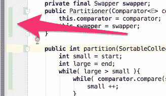
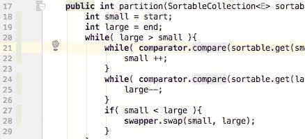

# 第三章：优化排序 - 使代码专业

在本章中，我们将开发排序代码并使其更加通用。我们不仅想要排序字符串数组。本质上，我们将编写一个可以排序任何可排序内容的程序。这样，我们将把编码推向其极限，朝着 Java 的一个主要优势：*抽象*。

然而，抽象并不是没有代价的。当你有一个排序字符串的类，你意外地将一个整数或其他不是字符串的东西混合到可排序的数据中，编译器将会抱怨：Java 不允许你将`int`放入`String`数组中。当代码更加抽象时，这样的编程错误可能会悄悄溜进来。我们将探讨如何通过捕获和抛出异常来处理这样的异常情况。

为了识别错误，我们将使用单元测试，应用行业标准 JUnit 4 版本。由于 JUnit 大量使用注解，并且因为注解很重要，你将对其有所了解。

之后，我们将修改代码以使用 Java 5 版本中引入的*泛型*特性。利用这个可能性，我们将在编译时捕获编码错误，这比在运行时更好。越早发现错误，修复成本就越低。

对于构建，我们仍然会使用 Maven，但这次，我们将代码拆分成小的模块。这样，我们将有一个多模块项目。我们将为排序模块的定义和不同的实现分别创建模块。这样，我们将研究类如何相互扩展并实现接口，并且，总的来说，我们将真正开始以面向对象的方式编程。

我们还将讨论**测试驱动开发**（**TDD**），在章节的结尾，我们将开始使用 Java 9 的新特性：模块支持。

在本章中，我们将涵盖以下主题：

+   面向对象编程原则

+   单元测试实践

+   算法复杂性和快速排序

+   异常处理

+   递归方法

+   模块支持

# 通用排序程序

在上一章中，我们实现了一个简单的排序算法。这段代码可以排序`String`数组中的元素。我们这样做是为了学习。对于实际应用，JDK 中有一个现成的排序解决方案，可以排序`collections`中的可比较成员。

JDK 中包含一个名为`Collections`的实用工具类。这个类包含一个静态的`Collections.sort`方法，能够对任何包含`Comparable`成员的`List`进行排序。`List`和`Comparable`是在 JDK 中定义的接口。因此，如果我们想对一个字符串列表进行排序，最简单的解决方案如下：

```java
public class SimplestStringListSortTest { 
    @Test 
    public void canSortStrings() { 
        ArrayList actualNames = new ArrayList(Arrays.asList( 
                "Johnson", "Wilson", 
                "Wilkinson", "Abraham", "Dagobert" 
        )); 
        Collections.sort(actualNames); 
        Assert.assertEquals(new ArrayList<String>(Arrays.<String>asList( 
                "Abraham", "Dagobert", "Johnson", "Wilkinson", "Wilson")), actualNames); 
    } 
}

```

这段代码片段来自一个示例 JUnit 测试，这也是我们在方法前有`@Test`注解的原因。我们将在稍后详细讨论这一点。要执行这个测试，你可以输入以下命令：

```java
$ mvn -Dtest=SimplestStringListSortTest test

```

然而，这个排序实现并不符合我们的需求。首先，因为它已经准备好了（无需编码）并且使用它不需要你在前几章中学到的新东西。除了方法前面的注解外，代码中没有你无法理解的新内容。你可以通过翻回一些页面来刷新，或者查阅 JDK 的在线文档（[`docs.oracle.com/javase/8/docs/api/`](https://docs.oracle.com/javase/8/docs/api/))，但这就足够了。你已经知道这些了。

你可能会想知道我为什么把 Java 版本 8 的 API 的 URL 写成了链接。嗯，那么这就是诚实和真实的时候——当我写这本书的时候，Java 9 JDK 还没有最终形式。我大多数示例都是在我的 Mac Book 上使用 Java 8 创建的，我只测试了 Java 9 特有的功能。目前 IDE 对 Java 9 的支持并不完美。当你读这本书的时候，Java 9 将会可用，所以你可以尝试将 URL 中的那个单个数字从 8 改为 9，以获取版本 9 的文档。目前，我得到的是 HTTP ERROR 404。

有时候，你可能需要查看旧版本的文档。你可以在 URL 中使用 3、4、5、6 或 7 代替 8。3 和 4 版本的文档无法在线阅读，但可以下载。希望你永远不会再需要它了。也许版本 5 会是这样。版本 6 在大公司中仍然被广泛使用。

虽然你可以从阅读其他程序员编写的代码中学到很多东西，但我不建议你在学习初期尝试从 JDK 源代码中学习。这些代码块经过了高度优化，不是教程代码，而且已经过时。它们在多年中并未生锈，但它们并没有被重构以遵循 Java 成熟后的编码风格。在某些地方，你可以在 JDK 中找到真正丑陋的代码。

好吧，说我们需要开发一个新的排序代码，因为我们可以从中学到东西，这有点牵强。我们真正需要排序实现的原因是我们想要一个能够对不仅`List`数据类型和实现了`Comparable`接口的`List`进行排序的东西。我们想要对一组对象进行排序。我们唯一的要求是包含对象的这组提供简单的方法，这些方法足以对它们进行排序并得到一个排序后的组。

最初我想用“collection”这个词代替“bunch”，但 Java 中有一个`Collection`接口，我想强调我们不是在谈论`java.util.Collection`对象。

我们也不希望对象实现`Comparable`接口。如果我们要求对象实现`Comparable`接口，可能会违反**单一职责原则**（**SRP**）。

当我们设计一个类时，它应该模拟现实世界中的某个对象类。我们将使用类来模拟问题空间。该类应该实现代表其模型对象行为的特征。如果我们看看第二章中的学生例子，那么一个`Student`类应该代表所有学生共有的特征，并且从建模角度来看是*重要的*。一个`Student`对象应该能够说出学生的名字、年龄、去年平均分数等等。所有学生都有脚，而且当然每只脚都有大小，所以我们可能会认为一个`Student`类也应该实现一个返回学生脚大小的方法（一只左脚和一只右脚，为了精确起见），但我们没有这么做。我们之所以没有这么做，是因为脚的大小从模型角度来看是不相关的。如果我们想要对一个包含`Student`对象的列表进行排序，`Student`类必须实现`Comparable`接口。但是等等！你怎么比较两个学生？是通过名字、年龄，还是通过他们的平均分数？

将一个学生与另一个学生进行比较不是`Student`类的特征。每个类，或者更确切地说，每个包、库或编程单元都应该有一个职责，并且它应该只实现那个职责，不实现其他任何职责。这不是精确的。这不是数学。有时，很难判断一个特征是否适合于职责。有一些简单的技术。例如，在学生的例子中，你可以询问真实的人关于他的名字和年龄，他们可能也能告诉你他们的平均分数。如果你要求他们中的一个`compareTo`（另一个学生），正如`Comparable`接口所要求的这个方法，他们可能会反过来问，但是通过什么属性？或者怎么比较？或者只是，什么？在这种情况下，你可以怀疑实现这个特征可能不在该类和这个关注点的领域内；比较应该从原始类的实现中分离出来。这也被称为**关注点分离**，它与 SRP 密切相关。

JDK 开发者对此有所了解。`Collections.sort`方法用于对一个包含`Comparable`元素的`List`进行排序，但这并不是这个类中唯一的排序方法。还有一个方法，如果你传递一个实现了`Comparator`接口的对象作为第二个参数，并且这个对象能够比较列表中的两个元素，那么它就可以对任何`List`进行排序。这是一种干净的分离关注点的模式。在某些情况下，不需要分离比较。在其他情况下，这是可取的。`Comparator`接口声明了一个实现类必须提供的一个单一方法：`compare`。如果两个参数相等，则此方法返回`0`。如果它们不同，则应根据哪个参数在前返回一个负数或正数`int`。

在 JDK 类 `java.util.Arrays` 中也有 `sort` 方法。它们可以排序数组，或者只排序数组的一部分。这个方法是方法重载的一个好例子。有同名的多个方法，但具有不同的参数，用于为每种原始类型排序整个数组，为每个切片排序，以及为实现了 `Comparable` 接口的对象数组排序，还有为使用 `Comparator` 排序的对象数组排序。正如您所看到的，JDK 中有整个系列的排序实现可用，在 99% 的情况下，您不需要自己实现排序。排序使用相同的算法，一种稳定的归并排序，并进行了优化。

我们将要实现的是一个通用方法，可以用来排序列表、数组或任何具有元素且可以交换任意两个元素的东西；解决方案将能够使用我们已开发的冒泡排序以及其他算法。

# 各种排序算法的简要概述

有许多不同的排序算法。正如我所说，有简单和复杂的算法，在许多情况下，更复杂的算法运行得更快。在本章中，我们将实现冒泡排序和快速排序。我们在上一章已经实现了字符串的冒泡排序，所以在这种情况下，实现将主要关注通用可排序对象排序的编码。实现快速排序将涉及一些算法兴趣。

警告：本节旨在为您提供算法复杂性的初步了解。它远非精确，我抱有一种徒劳的希望，即没有数学家会阅读这篇文章并对我施加诅咒。一些解释可能比较模糊。如果您想深入学习计算机科学，那么在阅读这本书之后，请寻找其他书籍或访问在线课程。

当我们谈论通用排序问题时，我们会考虑一些可以比较的通用对象集，在排序过程中，任何两个对象都可以交换。我们还将假设这是一个就地排序；因此，我们不会创建另一个列表或数组来收集已排序的对象。当我们谈论算法的速度时，我们谈论的是一些抽象的东西，而不是毫秒。当我们想要谈论毫秒时，实际的现实世界持续时间，我们已经在某种编程语言中运行了一些实现，在真实的计算机上。

在其抽象形式中，算法没有实现是不会那样做的。尽管如此，讨论算法的时间和内存需求仍然是有价值的。当我们这样做时，我们通常会研究算法在大量数据集上的行为。对于小数据集，大多数算法都运行得很快。排序两个数字通常不是问题，对吧？

在排序的情况下，我们通常会检查排序*n*个元素集合需要多少比较。冒泡排序大约需要 n²（n 乘以 n）次比较。我们不能说这正好是*n*²，因为当*n=2*时，结果是 1，对于*n=3*它是 3，对于*n=4*它是 6，以此类推。然而，当*n*开始变得更大时，实际需要的比较次数和*n*²将趋于相同的值。我们说冒泡排序的算法复杂度是*O(n²)*。这也被称为大 O 符号。如果你有一个*O(n²)*的算法，并且它对于 1,000 个元素在 1 秒内运行良好，那么你应该预期这个算法在 1 百万个元素上大约需要 10 天或一个月。如果一个算法是线性的，即*O(n)*，那么在 1 秒内完成 1,000 个元素应该让你预期 1 百万个元素将在 1,000 秒内完成。这比咖啡休息时间长，但比午餐时间短。

这使得如果我们想要进行一些严肃的商业排序对象，我们需要比冒泡排序更好的方法。这么多的不必要的比较不仅浪费我们的时间，还浪费 CPU 功率，消耗能源，污染环境。然而，问题是：排序可以有多快？是否存在一个无法克服的证明最小值？

答案是肯定的。

当我们实现任何排序算法时，实现将执行比较和元素交换。这是排序对象集合的唯一方法。比较的结果可以有两个值。比如说，这些值是*0*或*1*。这是一位信息。如果比较的结果是*1*，那么我们进行交换，如果结果是*0*，那么我们不交换。

在开始比较之前，我们可以有不同顺序的对象，不同顺序的数量是*n!*（*n*的阶乘）。也就是说，从 1 乘到*n*的数，换句话说，*n!* = 1 * 2 * 3 * ... * (*n*-1)**n*。

假设我们将单个比较的结果存储为一个数字，作为排序中每个可能输入的位序列。现在，如果我们反转排序的执行，从已排序的集合开始运行算法，使用描述比较结果的位来控制交换，并且我们以相反的方式使用这些位，即先进行最后一次交换，然后是排序过程中最先进行的交换，我们应该能够恢复对象的原始顺序。这样，每个原始顺序都与一个以位序列表示的数字唯一对应。

现在，我们可以这样表达原始问题：描述*n*阶乘的不同数字需要多少位？这正是我们需要对*n*个元素进行排序的比较次数。位数是*log2*。通过一些数学运算，我们可以知道*log2*等于*log2+ log2+...+ log2*。如果我们观察这个表达式的渐近值，那么我们可以说这等同于*O(n*log n)*。我们不应该期望任何通用排序算法会更快。

对于特殊情况，存在更快的算法。例如，如果我们想要对每个介于 1 到 10 之间的 100 万个数字进行排序，我们只需要计算不同数字的数量，然后创建一个包含这么多 1、2 等数字的集合。这是一个*O(n)*算法，但这种方法不适用于一般情况。

再次强调，这并不是一个正式的数学证明。

# 快速排序

查尔斯·安东尼·理查德·霍华爵士于 1959 年开发了快速排序算法。这是一个典型的分而治之算法。为了对一个长数组进行排序，从数组中选取一个元素作为枢轴元素。然后，对数组进行分区，使得左侧将包含所有小于枢轴的元素，右侧将包含所有大于或等于枢轴的元素。完成此操作后，可以通过递归调用对数组的左侧和右侧进行排序。为了停止递归，当我们数组中只有一个元素时，我们将它声明为已排序。

当算法部分地使用自身定义时，我们谈论递归算法。最著名的递归定义是斐波那契数列，前两个元素是 0 和 1，任何后续元素的第*n*个元素是第(*n-1)*个元素和第(*n-2)*个元素的和。递归算法在现代编程语言中经常实现，通过一种执行某些计算但有时会调用自身的方。在设计递归算法时，拥有某种停止递归调用的机制至关重要；否则，递归实现将分配程序栈中所有可用的内存，并导致程序出错而停止。

分区算法的步骤如下：我们将从数组的开始和结束使用两个索引开始读取数组。我们首先从小的索引开始，增加索引直到它小于大的索引，或者直到我们找到一个大于或等于枢轴的元素。之后，我们将开始减少大的索引，只要它大于小的索引，并且索引处的元素大于或等于枢轴。当我们停止时，如果两个索引不相同，我们将交换两个索引指向的元素，然后分别开始增加和减少小和大索引。如果索引相同，那么分区就完成了。数组的左侧是从开始到两个索引相遇的索引减一；右侧从索引开始，一直持续到待排序数组的末尾。

这个算法通常是 *O(n log n)*，但在某些情况下可能会退化到 *O(n²)*，这取决于枢轴的选择。对于枢轴的选择有不同的方法。在这本书中，我们将使用最简单的方法：我们将选择可排序集合的第一个元素作为枢轴。

# 项目结构和构建工具

这次的项目将包含许多模块。我们将在本章继续使用 Maven。我们将在 Maven 中设置一个所谓的多模块项目。在这样的项目中，目录包含模块的目录和 `pom.xml` 文件。顶级目录中没有源代码。这个目录中的 `pom.xml` 文件有以下两个作用：

+   它引用了模块，并且可以用来一起编译、安装和部署所有模块

+   它为所有模块定义了相同的参数

每个 `pom.xml` 都有一个父级，这个 `pom.xml` 是模块目录中 `pom.xml` 文件的父级。为了定义模块，`pom.xml` 文件包含以下行：

```java
<project> 
... 
    <modules> 
        <module>SortInterface</module> 
        <module>bubble</module> 
        <module>quick</module> 
    </modules> 
</project>

```

这些是模块的名称。这些名称被用作目录名称，也用作 `pom.xml` 模块中的 `artifactId`。在这个设置中的目录看起来如下：

```java
$ tree 
   |-SortInterface 
   |---src/main/java/packt/java9/by/example/ch03 
   |-bubble 
   |---src 
   |-----main/java/packt/java9/by/example/ch03/bubble 
   |-----test/java/packt/java9/by/example/ch03/bubble 
   |-quick/src/ 
   |-----main/java 
   |-----test/java

```

# Maven 依赖管理

依赖关系在 POM 文件中也很重要。之前的项目没有依赖关系，但这次我们将使用 JUnit。依赖关系使用 `pom.xml` 中的 `dependencies` 标签定义。例如，冒泡排序模块包含以下代码片段：

```java
<dependencies> 
    <dependency> 
        <groupId>packt.java9.by.example</groupId> 
        <artifactId>SortInterface</artifactId> 
    </dependency> 
    <dependency> 
        <groupId>junit</groupId> 
        <artifactId>junit</artifactId> 
    </dependency> 
</dependencies>

```

你可以下载的代码集中的实际 `pom.xml` 将包含比这更多的代码。在印刷品中，我们经常展示一个版本或仅展示有助于理解我们当时讨论的主题的片段。

它告诉 Maven，模块代码使用了在这些模块中定义的类、接口和 `enum` 类型，这些类型可以从某个仓库中获取。

当您使用 Maven 编译代码时，您的代码所使用的库可以从仓库中获取。当 Ant 被开发时，仓库的概念尚未发明。当时，开发者将库的所用版本复制到源代码结构中的一个文件夹中。通常，用于此目的的目录是 `lib`。这种方法有两个问题。一个是源代码仓库的大小。例如，如果有 100 个不同的项目使用了 JUnit，那么 JUnit 库的 JAR 文件就被复制了 100 次。另一个问题是收集所有库。当一个库使用了另一个库时，开发者必须阅读描述（许多时候过时且不精确）需要使用此库的其他库的库的文档。这些库必须以相同的方式下载和安装。这既耗时又容易出错。当一个库缺失时，开发者没有注意到，错误会在编译时显现，当编译器找不到类，甚至在运行时 JVM 无法加载类时。

为了解决这个问题，Maven 内置了一个仓库管理器客户端。仓库是一个包含库的存储空间。由于仓库中可能包含其他类型的文件，而不仅仅是库，因此 Maven 术语中使用了工件。`groupId`、`artifactId` 和 `version` 版本号用于标识一个工件。有一个非常严格的要求，即工件只能放入仓库一次。即使发布过程中出现了错误，在错误发布上传后才发现，该工件也不能被覆盖。对于相同的 `groupId`、`artifactId` 和 `version`，只能有一个文件，该文件永远不会改变。如果出现错误，则需要创建一个新的工件，并使用新的版本号，错误的工件可以被删除但不能被替换。

如果版本号以 `-SNAPSHOT` 结尾，则这种唯一性没有保证或要求。快照通常存储在单独的仓库中，并且不会向全世界发布。

仓库包含在目录中组织得井井有条的工件。当 Maven 运行时，它可以使用 `https` 协议访问不同的仓库。

以前，也使用了 `http` 协议，对于非付费客户，中央仓库只能通过 `http` 访问。然而，发现从仓库下载的模块可能成为中间人安全攻击的目标，Sonatype ([`www.sonatype.com`](http://www.sonatype.com)) 改变了政策，只使用 `https` 协议。永远不要配置或使用带有 `http` 协议的仓库。永远不要信任从 HTTP 下载的文件。

开发者机器上有一个本地仓库，通常位于`~/.m2/repository`目录下。当你执行`mvn install`命令时，Maven 会将创建的构件存储在这里。当通过 HTTPS 从仓库下载构件时，Maven 也会在这里存储构件。这样，后续的编译就不需要从网络上获取构件。

公司通常会设置自己的仓库管理器（由支持 Maven 的公司 Sonatype 提供的 Nexus）。这些应用程序可以配置为与多个其他仓库通信，并按需从那里收集构件，本质上实现了代理功能。构件从远端仓库传输到本地仓库，再到更近的仓库，形成一个层次结构，如果项目的打包类型是`war`、`ear`或其他包含依赖构件的格式，最终传输到最终构件。这本质上是一种文件缓存，没有重新验证和缓存淘汰。这可以做到，因为构件唯一性的严格规则。这就是如此严格规则的原因。

如果项目泡沫是一个独立的项目，而不是多模块项目的一部分，那么依赖关系看起来是这样的：

```java
<dependencies> 
    <dependency> 
        <groupId>packt.java9.by.example</groupId> 
        <artifactId>SortInterface</artifactId> 
        <version>1.0.0-SNAPSHOT</version> 
    </dependency> 
    <dependency> 
        <groupId>junit</groupId> 
        <artifactId>junit</artifactId> 
        <version>4.12</version> 
    </dependency> 
</dependencies>

```

如果没有为依赖项定义`version`，Maven 将无法识别要使用哪个构件。在多模块项目中，`version`可以在父项目中定义，模块可以继承这个版本。由于父项目不依赖于实际的依赖项，它只定义与`groupId`和`artifactId`关联的版本；XML 标签不是`dependencies`，而是在顶级`project`标签下的`dependencyManagement/dependencies`，如下例所示：

```java
<dependencyManagement> 
    <dependencies> 
        <dependency> 
            <groupId>packt.java9.by.example</groupId> 
            <artifactId>SortInterface</artifactId> 
            <version>${project.version}</version> 
        </dependency> 
        <dependency> 
            <groupId>junit</groupId> 
            <artifactId>junit</artifactId> 
            <version>4.12</version> 
            <scope>test</scope> 
        </dependency> 
    </dependencies> 
</dependencyManagement>

```

如果父 POM 直接使用 dependencies 标签，Maven 无法决定父项目是否依赖于该构件或某些模块。当模块想要使用`junit`时，它们不需要指定版本。它们将从定义为 4.12 的父项目中获取，这是 JUnit 4 的最新版本。如果将来会有一个新版本 4.12.1，修复了一些严重错误，那么唯一修改版本号的地方是父 POM，模块将在下一次执行 Maven 编译时使用新版本。

然而，当新的版本 JUnit 5 发布时，所有模块都必须进行修改，因为 JUnit 不仅仅是一个新版本。JUnit 5 被拆分为几个模块，因此`groupId`和`artifactId`也会发生变化。

值得注意的是，实现`SortInterface`模块接口的模块最终都会依赖于这个模块。在这种情况下，版本定义如下：

```java
<version>${project.version}</version>

```

这似乎有点自相矛盾（实际上确实如此）。`${project.version}`属性是项目的版本，并且由`SortInterface`模块继承。这是其他模块所依赖的工件版本。换句话说，模块总是依赖于我们目前正在开发的版本。

# 编写排序代码

要实现排序，首先，我们将定义一个排序库应该实现的接口。在实际编码之前定义接口是一个好习惯。当有多个实现时，有时建议首先创建一个简单的实现并开始使用它，这样接口可以在该阶段演变，当更复杂的实现即将到来时，要实现的接口已经大致确定。

# 创建接口

在我们的情况下，接口非常简单。

```java
package packt.java9.by.example.ch03; 

public interface Sort { 
    void sort(SortableCollection collection); 
}

```

接口应该只做一件事——对可排序的东西进行排序。由于我们希望这种方法非常通用，我们还需要定义什么是可排序的。为此，我们需要另一个接口。

```java
package packt.java9.by.example.ch03; 

public interface SortableCollection { 
}

```

# 创建 BubbleSort

现在，我们可以开始创建实现`Sort`接口的冒泡排序：

```java
package packt.java9.by.example.ch03.bubble; 

import packt.java9.by.example.ch03.*; 
import java.util.Comparator; 

public class BubbleSort implements Sort { 
    @Override 
    public void sort(SortableCollection collection) { 
        int n = collection.size(); 
        while (n > 1) { 
            for (int j = 0; j < n - 1; j++) { 
                if (comparator.compare(collection.get(j), 
                        collection.get(j + 1)) > 0) { 
                    swapper.swap(j, j + 1); 
                } 
            } 
            n--; 
        } 
    }

```

通常，执行算法需要两个我们在上次代码中实现的操作，针对`String`数组特定：比较两个元素和交换两个元素。由于这次排序实现本身并不知道元素的类型是什么，也不知道它排序的是数组、列表还是其他什么，它需要某种在需要时进行排序的东西。更精确地说，它需要一个能够比较两个元素的`comparator`对象，以及一个能够交换集合中两个元素的`swapper`对象。

为了获得这些，我们可以实现两个 setter 方法，在调用排序之前设置这些对象。由于这并不特定于冒泡排序算法，而是更通用的，这两个方法也应该成为接口的一部分，因此实现会覆盖它。

```java
    private Comparator comparator = null; 

    @Override 
    public void setComparator(Comparator comparator) { 
        this.comparator = comparator; 
    } 

    private Swapper swapper = null; 

    @Override 
    public void setSwapper(Swapper swapper) { 
        this.swapper = swapper; 
    } 
}

```

`@Override`注解向 Java 编译器指示该方法正在覆盖父类或接口中的方法。一个方法可以不使用此注解覆盖父方法；然而，如果我们使用此注解，如果方法实际上没有覆盖任何东西，编译将失败。这有助于我们在编译时发现父类或接口中发生了变化，而我们没有在实现中遵循这种变化，或者我们只是犯了一些错误，认为我们将覆盖一个方法，而实际上我们没有。由于注解在单元测试中大量使用，我们将在稍后更详细地讨论注解。

# 修改接口

修改后的`Sort`接口将看起来像这样：

```java
public interface Sort { 
    void sort(SortableCollection collection); 
    void setSwapper(Swapper swap); 
    void setComparator(Comparator compare); 
}

```

这也意味着我们需要两个新的接口：`Swapper` 和 `Comparator`。幸运的是，Java 运行时已经定义了一个 `Comparator` 接口，正好符合我们的需求。你可能已经从下面的导入语句中猜到了：

```java
import java.util.Comparator;

```

当你需要一些非常基本的东西，比如一个 `comparator` 接口时，它很可能已经在运行时定义了。在编写自己的版本之前咨询运行时是明智的。然而，`Swapper` 接口我们却必须自己创建。

```java
package packt.java9.by.example.ch03; 

public interface Swapper { 
    void swap(int i, int j); 
}

```

由于它用于交换 `SortableCollection` 中指定索引的两个元素，因此有一个名为 `swap` 的方法，这个名字相当简单。但是，我们还没有准备好。如果你尝试编译前面的代码，编译器将会对 `get` 和 `size` 方法提出抱怨。算法实现排序需要这些方法，但它们本身并不是排序的固有部分。这是一个不应该在排序中实现的责任。由于我们不知道我们将对什么类型的集合进行排序，因此在排序中实现这些功能不仅不妥，而且是不可能的。看起来我们根本无法对任何东西进行排序。我们必须设置一些限制。排序算法必须知道我们排序的集合的大小，并且应该能够通过索引访问元素，以便将其传递给比较器。

这些限制在 `SortableCollection` 接口中得到表达，我们之前在不知道第一次排序实现需要什么时，将其留空。

```java
package packt.java9.by.example.ch03; 

public interface SortableCollection { 
    Object get(int i); 
    int size(); 
}

```

现在，我们已经准备好了接口和实现，可以继续测试代码。但在那之前，我们将简要回顾一下我们所做的工作以及为什么这样做。

# 架构考虑

我们创建了一个接口及其简单的实现。在实现过程中，我们发现接口需要其他接口和方法来支持算法。这通常发生在代码的架构设计阶段，在实现之前。出于教学目的，我遵循了接口的构建过程，在我们开发代码的同时。在现实生活中，当我创建接口时，我一次创建所有接口，因为我有足够的经验。我大约在 1983 年用 Fortran 编写了我的第一个快速排序代码。然而，这并不意味着我只要遇到任何问题就能一击即中，并得出最终解决方案。只是恰好排序是一个太为人所知的问题。如果你在开发过程中需要修改接口或其他设计方面，不要感到尴尬。这是自然的结果，也是你随着时间的推移对事物理解越来越好的证明。如果架构需要改变，最好是进行改变，而且越早越好。在现实生活中的企业环境中，我们设计接口只是为了在开发过程中学习到我们忘记了一些方面。它们是非常真实且比排序集合更复杂的操作。

在排序问题的情况下，我们将我们想要排序的“某物”抽象到了最极端的可能。Java 内置的排序方法可以排序数组或列表。如果你想要排序的不是列表或数组，你必须创建一个类，该类实现了需要超过 24 个方法的 `java.util.List` 接口，以便将你的可排序对象包装起来，使其可以通过 JDK 排序。说实话，这并不多，在一个实际的项目中，我会将其视为一个选项。

然而，我们并不知道，内置排序使用了接口的哪些方法。应该功能实现那些使用的方法，而没有使用的方法可以包含一个简单的 `return` 语句，因为它们根本不会被调用。开发者可以查阅 JDK 的源代码，看看实际使用了哪些方法，但这不是搜索实现的合同。不能保证新版本仍然只会使用那些方法。如果新版本开始使用我们用单个 `return` 语句实现的方法，排序可能会神奇地失败。

另一个有趣的问题是，如何仅使用 `List` 接口通过搜索来交换两个元素。`List` 接口中没有 `put(int, Object)` 方法。有 `add(int, Object)`，但它会插入一个新元素，如果对象存储在磁盘上，例如，那么将列表的所有元素向上推可能非常昂贵（消耗 CPU、磁盘、能源）。此外，下一步可能是删除我们刚刚插入的元素之后的一个元素，再次进行昂贵的移动列表尾部的操作。也就是说，排序可能或可能不会遵循的 `put(int, Object)` 的简单实现。同样，这不应该被假设。

当开发者使用 JDK、开源或商业库中的库、类和方法时，开发者可以查阅源代码，但他们不应该依赖于实现。你应该只依赖于库附带 API 的合同和定义。当你从某个外部库实现一个接口，并且你不需要实现它的某些部分，并创建一些虚拟方法时，感受到空气中的危险。这是一个伏击。很可能是库质量差，或者你没有理解如何使用它。

在我们的案例中，我们将交换和比较从排序中分离出来。集合应该实现这些操作，并为排序提供它们。合同是接口，要使用排序，你必须实现我们定义的所有接口方法。

`Sort`接口定义了设置`Swapper`和`Comparator`的设置器。以这种方式设置依赖可能会导致创建实现`Sort`接口的新实例的代码，但在调用`Sort`之前没有设置`Swapper`和`Comparator`。这将导致在第一次调用`Comparator`（或当实现首先调用`Swapper`时，这不太可能，但有可能）时抛出`NullPointerException`。调用方法应该在使用类之前注入依赖。当它通过设置器完成时，这被称为**设置器注入**。这个术语在我们使用 Spring、Guice 或其他容器等框架时被大量使用。创建这些服务类并将实例注入到我们的类中通常是相似的。

容器实现以通用方式包含功能并提供配置选项来配置要注入到哪些其他对象中的实例。通常，这会导致代码更短、更灵活、更易读。然而，依赖注入并不局限于容器。当我们编写下一节的测试代码并调用设置器时，我们实际上是在进行依赖注入。

另一种依赖注入的方式可以避免依赖未设置的问题。这被称为**构造函数注入**。依赖是`final private`字段，没有值。记住，这些字段应该在构造函数完成时获得它们的最终值。构造函数注入将注入的值作为参数传递给构造函数，构造函数设置字段。这样，字段在对象构造时就被保证了。然而，这种注入不能定义在接口中。

现在，我们已经有代码了，我们也知道接口是如何创建的考虑因素。这是进行一些测试的时候了。

# 创建单元测试

当我们编写代码时，我们应该对其进行测试。没有任何代码在投入生产之前至少进行过一些测试运行。存在不同级别的测试，它们有不同的目标、技术、行业实践和名称。

单元测试，正如其名所示，测试代码的一个单元。集成测试测试单元如何集成在一起。冒烟测试测试有限的功能，只是为了看看代码是否完全损坏。还有其他测试，直到最后的测试，即工作的证明：用户验收测试。甜点的证明是吃它。如果用户接受它，代码就是好的。

许多时候，我会告诉新手，用户验收测试这个名称有点误导性，因为接受项目结果的不是用户，而是客户。根据定义，客户是支付账单的人。专业发展需要付费；否则，就不算专业。然而，术语却是用户验收测试。只是碰巧客户只有在用户能够使用程序的情况下才会接受项目。

当我们在 Java 中开发时，单元测试是测试独立类。换句话说，在 Java 开发中，当我们谈论单元测试时，单元是一个类。为了提供单元测试，我们通常使用 JUnit 库。还有其他库，如 TestNG，但 JUnit 是最广泛使用的，所以我们将使用*JUnit*。要将其作为库使用，首先，我们必须将其添加到 Maven POM 中作为依赖项。

# 添加 JUnit 作为依赖项

回想一下，我们有一个多模块项目，依赖项版本在父 POM 的`dependencyManagement`标签下维护。

```java
<dependencyManagement> 
    <dependencies> 
        ... 
        <dependency> 
            <groupId>junit</groupId> 
            <artifactId>junit</artifactId> 
            <version>4.12</version> 
            <scope>test</scope> 
        </dependency> 
    </dependencies> 
</dependencyManagement>

```

依赖项的作用域是测试，这意味着这个库只需要编译测试代码并在测试执行期间使用。JUnit 库不会进入最终发布的产品；不需要它。如果你在某个部署的生产**Web Archive**（**WAR**）文件中找到 JUnit 库，怀疑有人没有正确管理库的作用域。

Maven 支持在项目的生命周期中编译和执行 JUnit 测试。如果我们想执行测试，只有我们可以发出`mvn test`命令。IDEs 也支持单元测试的执行。通常，可以用来执行具有`public static main`方法的类的相同菜单项可以用来执行。如果类是一个使用 JUnit 的单元测试，IDE 将识别它并执行测试，通常会在图形界面上给出关于哪些测试执行良好以及哪些失败的反馈，以及失败的原因。

# 编写 BubbleSortTest 类

测试类与生产类分开。它们放入`src/test/java`目录。当我们有一个名为，例如，`BubbleSort`的类时，测试将命名为`BubbleSortTest`。这个约定有助于执行环境将测试与那些不包含测试但需要执行测试的类分开。为了测试我们刚刚创建的排序实现，我们可以提供一个包含，目前只有一个`canSortStrings`方法的类。

单元测试方法名称用于记录正在测试的功能。由于 JUnit 框架调用每个带有`@Test`注解的方法，因此测试方法的名称在我们的代码中没有任何地方被引用。我们可以大胆地使用任意长的方法名；它不会妨碍在方法被调用处的可读性。

```java
package packt.java9.by.example.ch03.bubble; 

// imports deleted from print 

public class BubbleSortTest { 

    @Test 
    public void canSortStrings() { 
        ArrayList actualNames = new ArrayList(Arrays.asList( 
                "Johnson", "Wilson", 
                "Wilkinson", "Abraham", "Dagobert" 
        ));

```

方法包含`ArrayList`，其中包含我们已经熟悉的实际名称。由于我们有一个需要`SortableCollection`的排序实现和接口，我们将创建一个由`ArrayList`支持的实现。

```java
        SortableCollection namesCollection = new SortableCollection() { 

            @Override 
            public Object get(int i) { 
                return actualNames.get(i); 
            } 

            @Override 
            public int size() { 
                return actualNames.size(); 
            } 
        };

```

我们声明了一个具有`SortableCollection`类型的新对象，这是一个接口。为了实例化实现`SortableCollection`的对象，我们需要一个类。我们不能实例化一个接口。在这种情况下，在实例化的地方定义这个类。这在 Java 中被称为匿名类。这个名字来源于新类的名称在源代码中没有定义。Java 编译器将自动为新类创建一个名称，但这对于程序员来说并不重要。我们将简单地写`new SortableCollection()`，并在大括号`{}`之间立即提供所需实现。在方法内部定义这个匿名类非常方便，这样它就可以访问`ArrayList`，而无需在类中传递`ArrayList`的引用。

实际上，需要引用，但 Java 编译器会自动完成这个操作。在这种情况下，Java 编译器还会确保通过这种方式自动传递的引用只能用于在匿名类实例化后初始化且不会改变的变量。变量`actualNames`已被设置，并且在后续的方法中不应更改。实际上，我们甚至可以将`actualNames`定义为 final，如果我们在 Java 1.7 或更早版本中使用，这将是一个要求。从 1.8 版本开始，要求变量实际上是 final 的，但您不需要声明它为 final。

下一步我们需要的是`ArrayList`的`Swapper`实现。在这种情况下，我们将在方法内部定义整个类。它也可以是一个匿名类，但这次我决定使用一个命名类来展示一个类可以在方法内部定义。通常，在生产项目中我们不会这样做。

```java
        class SwapActualNamesArrayElements implements Swapper { 
            @Override 
            public void swap(int i, int j) { 
                final Object tmp = actualNames.get(i); 
                actualNames.set(i,actualNames.get(j)); 
                actualNames.set(j, tmp); 

            } 
        }

```

最后，但同样重要的是，在调用排序之前，我们需要一个比较器。由于我们要比较的是`String`，这很简单且直接。

```java
        Comparator stringCompare = new Comparator() { 
            @Override 
            public int compare(Object first, Object second) { 
                final String f = (String) first; 
                final String s = (String) second; 
                return f.compareTo(s); 
            } 
        };

```

在排序准备工作完成后，我们最终需要 Sort 实现的实例，设置`comparator`和`swapper`，然后调用排序。

```java
        Sort sort = new BubbleSort(); 
        sort.setComparator(stringCompare); 
        sort.setSwapper(new SwapActualNamesArrayElements()); 
        sort.sort(namesCollection);

```

测试的最后一个，但最重要的部分是断言结果是我们预期的。JUnit 通过`Assert`类帮助我们做到这一点。

```java
        Assert.assertEquals(Arrays.asList("Abraham", "Dagobert", "Johnson", "Wilkinson", "Wilson"), actualNames); 
    } 

}

```

`assertEquals`的调用检查第一个参数，即预期结果，是否等于第二个参数，即排序后的`actualNames`。如果它们不同，则抛出`AssertionError`；否则，测试将正常结束。

# 好的单元测试

这是一个好的单元测试吗？如果您在像这样的教程书中阅读它，它必须是。实际上，它不是。这是一段很好的代码，用于展示 JUnit 提供的一些工具和一些 Java 语言特性，但作为一个真正的 JUnit 测试，我将在实际项目中不会使用它。

什么是好的单元测试？为了回答这个问题，我们必须找到单元测试的好处以及我们用它来做什么。

我们将创建单元测试来验证单元的操作并记录文档。

单元测试不是为了找 bug。开发者最终会在调试会话中使用单元测试，但很多时候，为调试创建的测试代码是临时的。当 bug 被修复时，用于找到它的代码不会进入源代码。对于每个新的 bug，都应该创建一个新的测试来覆盖那些没有正确工作的功能，但这几乎不是用来找到 bug 的测试代码。这是因为单元测试主要是为了文档。你可以使用*JavaDoc*来记录一个类，但经验表明，文档往往会过时。开发者修改了代码，但他们没有修改文档，文档变得过时且具有误导性。然而，单元测试是由构建系统执行的，如果使用**持续集成**（**CI**）（在专业环境中应该使用），那么如果测试失败，构建将会中断，所有开发者都会收到关于它的邮件通知，这将迫使破坏构建的开发者修复代码或测试。这样，测试可以验证持续开发没有在代码中破坏任何东西，或者至少不是可以用单元测试发现的东西。

# 一个好的单元测试是可读的

我们的测试远远达不到可读性。一个测试用例是可读的，如果你看它，在 15 秒内就能知道它做什么。当然，这假设读者有一些 Java 经验，但你的观点是明确的。我们的测试用例中充斥着非核心的辅助类。

我们的测试几乎不能验证代码是否正常工作。实际上，它并没有。其中有一些我故意放入的 bug，我们将在下面的章节中找到并消除。一个单独的测试用例对单个`String`数组进行排序，远远不能验证排序实现。如果我要扩展这个测试到实际的测试，我们需要有名为`canSortEmptyCollection`、`canSortOneElementCollection`、`canSortTwoElements`、`canSortReverseOrder`或`canSortAlreadySorted`的方法。如果你看这些名字，你会看到我们需要哪些测试。从排序问题的本质来看，实现可能对特殊情况的错误非常敏感。

我们单元测试的优点是什么，除了它是一个可接受的演示工具之外？

# 单元测试是快速的

我们的单元测试运行得很快。每次执行单元测试时，CI 都会启动构建，测试的执行不应持续很长时间。你不应该创建一个对数十亿个元素进行排序的单元测试。那是一种稳定性或负载测试，它们应该在单独的测试期间运行，而不是每次构建运行时。我们的单元测试对五个合理的元素进行排序。

# 单元测试是确定的

我们的单元测试是确定的。非确定性的单元测试是开发者的噩梦。如果你在一个团队中，有些构建在 CI 服务器上失败，当一个构建失败时，你的同事说你需要再试一次；不可能！如果一个单元测试运行了，它应该每次都运行。如果它失败了，它应该无论你启动多少次都失败。在我们的案例中，一个非确定性的单元测试将是生成随机数并将它们排序。我们将在每次测试运行中结束于不同的数组，如果代码中存在某些数组会显示的 bug，我们将无法重现它。更不用说断言代码运行良好也是困难的。

如果我们在单元测试中对一个随机数组进行排序（我们实际上并没有这样做），理论上我们可以断言数组已排序，通过逐个比较元素来检查它们是否按升序排列。这也会是一个完全错误的做法。

# 断言应该尽可能简单

如果断言复杂，引入断言中的 bug 的风险更高。断言越复杂，风险越高。我们将编写单元测试来简化我们的生活，而不是增加更多的代码来调试。

此外，一个测试应该只断言一件事。这个断言可能通过多个`Assert`类方法编码，一个接一个。然而，这些方法的目的是断言单元的一个单一特性的正确性。记住 SRP：一个测试，一个特性。一个好的测试就像一个好的狙击手：一枪，一命。

# 单元测试是隔离的

当我们测试单元*A*时，另一个单元*B*的任何变化或不同单元中的错误都不应该影响我们针对单元*A*的单元测试。在我们的案例中，这很容易，因为我们只有一个单元。稍后，当我们为快速排序开发测试时，我们会看到这种分离并不那么简单。

如果单元测试被正确地分离，一个失败的单元测试可以清楚地指出问题的位置。问题就在单元测试失败的单元中。如果测试没有分离单元，那么一个测试的失败可能是由我们预期的不同单元中的错误引起的。在这种情况下，这些测试实际上并不是单元测试。

在实践中，你应该找到一个平衡点。如果单元的隔离成本过高，你可以决定创建集成测试；如果它们仍然运行得很快，可以让它们由*CI 系统*执行。同时，你也应该试图找出隔离困难的原因。如果你不能轻易地在测试中隔离单元，这意味着单元之间的耦合太强，这可能不是一个好的设计。

# 单元测试覆盖代码

单元测试应该测试所有常规情况以及所有功能性的特殊案例。如果存在某个代码的特殊案例没有被单元测试覆盖，那么代码就处于危险之中。在排序实现的例子中，一般情况是排序，比如五个元素。特殊案例通常更多。我们的代码在只有一个元素或没有元素的情况下会如何表现？如果有两个元素呢？如果元素是逆序的呢？如果它们已经排序了呢？

通常，特殊案例在规范中没有被定义。程序员在编码之前必须考虑它，并且在编码过程中可能会发现一些特殊案例。困难之处在于你根本无法确定是否覆盖了所有特殊案例和代码的功能。

你可以判断的是，在测试过程中是否执行了所有代码行。如果 90%的代码行在测试中执行了，那么代码覆盖率就是 90%，这在现实生活中已经相当不错了，但你永远不应该满足于低于 100%的覆盖率。

代码覆盖率不等于功能覆盖率，但它们之间存在关联。如果代码覆盖率低于 100%，那么以下两个陈述中的至少一个是真的：

+   功能覆盖率不是 100%

+   在被测试的单元中存在未使用的代码，这些代码可以直接删除

代码覆盖率是可以测量的，而功能覆盖率则不行。工具和 IDE 支持代码覆盖率测量。这些测量被集成到编辑器中，所以你不仅会得到覆盖率百分比，编辑器还会显示哪些行没有被覆盖率覆盖，通过给这些行着色（例如在 Eclipse 中）或编辑器窗口左侧的空白区域（IntelliJ）。图片显示在 IntelliJ 中，测试覆盖了左侧空白区域上用绿色标出的行。（在打印版本中这只是一个灰色矩形）。



# 优化测试

现在我们已经讨论了什么是好的单元测试，让我们改进我们的测试。首先，我们需要将辅助类移动到单独的文件中。我们将创建`ArrayListSortableCollection`：

```java
package packt.java9.by.example.ch03.bubble; 

import packt.java9.by.example.ch03.SortableCollection; 

import java.util.ArrayList; 

public class ArrayListSortableCollection implements SortableCollection { 
    final private ArrayList actualNames; 

    ArrayListSortableCollection(ArrayList actualNames) { 
        this.actualNames = actualNames; 
    } 

    @Override 
    public Object get(int i) { 
        return actualNames.get(i); 
    } 

    @Override 
    public int size() { 
        return actualNames.size(); 
    } 
}

```

这个类封装了`ArrayList`并实现了`get`和`size`方法以访问`ArrayList`。`ArrayList`本身被声明为`final`。回想一下，一个`final`字段必须在构造函数完成时定义。这保证了当我们开始使用对象时字段已经存在，并且在对象的生命周期内不会改变。然而，请注意，对象的内容，在这个例子中是`ArrayList`的元素，可能会改变。如果不是这样，我们就无法对其进行排序。

下一个类是`StringComparator`。这个类非常简单，所以我不会在这里列出它；我会留给你来实现一个可以比较两个字符串的`java.util.Comparator`接口。这不应该很难，特别是因为这个类已经是`BubbleSortTest`类前一个版本的组成部分（提示：它是一个存储在名为`stringCompare`的变量中的匿名类）。

我们还必须实现`ArrayListSwapper`，这也不应该是一个大的惊喜。

```java
package packt.java9.by.example.ch03.bubble; 

import packt.java9.by.example.ch03.Swapper; 

import java.util.ArrayList; 

public class ArrayListSwapper implements Swapper { 
    final private ArrayList actualNames; 

    ArrayListSwapper(ArrayList actualNames) { 
        this.actualNames = actualNames; 
    } 

    @Override 
    public void swap(int i, int j) { 
        Object tmp = actualNames.get(i); 
        actualNames.set(i, actualNames.get(j)); 
        actualNames.set(j, tmp); 
    } 
}

```

最后，我们的测试将看起来是这样的：

```java
package packt.java9.by.example.ch03.bubble; 

// ... imports deleted from print ... 
public class BubbleSortTest { 
    @Test 
    public void canSortStrings() { 
        ArrayList actualNames = new ArrayList(Arrays.asList( 
                "Johnson", "Wilson", 
                "Wilkinson", "Abraham", "Dagobert" 
        )); 
        ArrayList expectedResult = new ArrayList(Arrays.asList( 
                "Abraham", "Dagobert", 
                "Johnson", "Wilkinson", "Wilson" 
        )); 
        SortableCollection names = 
                new ArrayListSortableCollection(actualNames); 
        Sort sort = new BubbleSort(); 
        sort.setComparator( 
                new StringComparator()); 
        sort.setSwapper( 
                new ArrayListSwapper(actualNames)); 
        sort.sort(names); 
        Assert.assertEquals(expectedResult, actualNames); 
    } 
}

```

现在这是一个可以在 15 秒内理解测试。它很好地记录了我们如何使用我们定义的排序实现。它仍然有效，并且没有揭示任何错误，正如我承诺的那样。

# 包含错误元素的集合

这个错误不是微不足道的，而且像往常一样，这并不是算法的实现问题，而是在定义上，或者说是定义不足。如果我们在排序的集合中不仅有字符串，程序应该做什么呢？

如果我创建一个新的测试，以以下行开始，它将抛出`ClassCastException`：

```java
@Test 
public void canNotSortMixedElements() { 
    ArrayList actualNames = new ArrayList(Arrays.asList( 
            42, "Wilson", 
            "Wilkinson", "Abraham", "Dagobert" 
    )); 
... the rest of the code is the same as the previous test

```

这里的问题在于 Java 集合可以包含任何类型的元素。你永远不能确定一个集合，比如`ArrayList`，只包含你期望的类型。即使你使用泛型（我们还没有学习，但我们将在本章中学习），某种方式将不适当类型的对象意外地放入集合中的机会更小，但仍然存在。不要问我如何；我无法告诉你。这就是错误的本质——你无法知道它们是如何工作的，直到你解决了它们。关键是你要为这样的异常情况做好准备。

# 处理异常

在 Java 中，应该使用异常来处理异常情况。`ClassCastException`是存在的，当排序尝试使用`StringComparator`比较`String`和`Integer`时发生，为了做到这一点，它试图将一个`Integer`转换为`String`。

当程序使用`throw`命令或 Java 运行时抛出异常时，程序执行将在该点停止，而不是执行下一个命令，而是继续在异常被捕获的地方。它可能是在同一个方法中，或者在上面的调用链中的某个调用方法中。为了捕获异常，抛出异常的代码应该在一个`try`块内部，并且跟随`try`块的`catch`语句应该指定一个与抛出的异常兼容的异常。

如果异常没有被捕获，那么 Java 运行时会打印出异常的消息，以及一个包含所有在异常发生时调用栈上的类、方法和行号的堆栈跟踪。在我们的情况下，`mvn test`命令将在输出中产生以下跟踪：

```java
java.lang.ClassCastException: java.lang.Integer cannot be cast to java.lang.String 
    at packt.java9.by.example.ch03.bubble.StringComparator.compare(StringComparator.java:9) 
    at packt.java9.by.example.ch03.bubble.BubbleSort.sort(BubbleSort.java:13) 
    at packt.java9.by.example.ch03.bubble.BubbleSortTest.canNotSortMixedElements(BubbleSortTest.java:49) 
    at sun.reflect.NativeMethodAccessorImpl.invoke0(Native Method) 
    at sun.reflect.NativeMethodAccessorImpl.invoke(NativeMethodAccessorImpl.java:62) 
    at sun.reflect.DelegatingMethodAccessorImpl.invoke(DelegatingMethodAccessorImpl.java:43) 
    at java.lang.reflect.Method.invoke(Method.java:498) 
... some lines deleted from the print 
    at org.apache.maven.surefire.junit4.JUnit4Provider.executeTestSet(JUnit4Provider.java:141) 
    at org.apache.maven.surefire.junit4.JUnit4Provider.invoke(JUnit4Provider.java:112) 
    at sun.reflect.NativeMethodAccessorImpl.invoke0(Native Method) 
    at sun.reflect.NativeMethodAccessorImpl.invoke(NativeMethodAccessorImpl.java:62) 
... some lines deleted from the print 
    at org.apache.maven.surefire.booter.ProviderFactory.invokeProvider(ProviderFactory.java:85) 
    at org.apache.maven.surefire.booter.ForkedBooter.runSuitesInProcess(ForkedBooter.java:115) 
    at org.apache.maven.surefire.booter.ForkedBooter.main(ForkedBooter.java:75)

```

这个堆栈跟踪并不长。在生产环境中，运行在应用服务器上的应用程序的堆栈跟踪可能包含几百个元素。在这个跟踪中，你可以看到 Maven 正在启动测试执行，涉及到 Maven surefire 插件，然后是 JUnit 执行器，直到我们通过测试到达比较器，在那里实际异常被抛出。

这个异常没有被 Java 运行时打印到控制台。这个异常被 JUnit 库代码捕获，并且使用 Maven 日志记录功能将堆栈跟踪记录到控制台。

这种方法的缺点是真正的问题不是类转换失败。真正的问题是集合中包含混合元素。只有在 Java 运行时尝试将两个不兼容的类进行转换时才会意识到这一点。我们的代码可以更智能。我们可以修改比较器。

```java
package packt.java9.by.example.ch03.bubble; 
import java.util.Comparator; 
public class StringComparator implements Comparator { 
    @Override 
    public int compare(Object first, Object second) { 
        try { 
            final String f = (String) first; 
            final String s = (String) second; 
            return f.compareTo(s); 
        } catch (ClassCastException cce) { 
            throw new NonStringElementInCollectionException ( 
                    "There are mixed elements in the collection.", cce); 
        } 
    } 
}

```

这段代码捕获了 `ClassCastException` 并抛出了一个新的异常。抛出新异常的优势在于你可以确信这个异常是从比较器抛出的，并且真正的问题确实是集合中存在混合元素。类转换问题也可能发生在代码的其他地方，例如某些排序实现中。一些应用程序代码可能想要捕获异常并处理这种情况；例如，发送一个特定于应用程序的错误消息，而不仅仅是向用户显示堆栈跟踪。这段代码也可以捕获 `ClassCastException`，但它不能确定异常的真正原因。另一方面，`NonStringElementInCollectionException` 是确定的。

`NonStringElementInCollectionException` 是一个在 JDK 中不存在的异常。我们必须创建它。异常是 Java 类，我们的异常看起来如下：

```java
package packt.java9.by.example.ch03.bubble; 

public class NonStringElementInCollectionException extends RuntimeException { 
    public NonStringElementInCollectionException (String message, Throwable cause) { 
        super(message, cause); 
    } 
}

```

Java 有检查异常的概念。这意味着任何不扩展 `RuntimeException` 的异常都应该在方法定义中声明。假设我们的异常被声明如下：

```java
public class NonStringElementInCollectionException extends Exception

```

然后，我们必须将 `compare` 方法声明如下：

```java
public int compare(Object first, Object second) throws NonStringElementInCollectionException

```

问题在于方法抛出的异常是方法签名的一部分，因此这种方式 `compare` 不会覆盖接口的 `compare` 方法，并且，这样，类就不会实现 `Comparator` 接口。因此，我们的异常必须是一个运行时异常。

应用程序中可能存在异常的层次结构，而且通常，新手程序员会创建大量的层次结构。如果你能做某事，并不意味着你应该做。层次结构应该尽可能保持扁平，这对于异常来说尤其如此。如果 JDK 中有描述异常情况的异常，那么就使用现成的异常。就像对任何其他类一样：如果它是现成的，就不要再次实现它。

还要注意的是，抛出异常只应在异常情况下进行。这不是为了表示某种正常操作条件。这样做会阻碍代码的可读性，并消耗 CPU 资源。对于 JVM 来说，抛出异常并不是一件容易的事情。

不仅异常可以被抛出。`throw`命令可以抛出，`catch`命令可以捕获任何扩展`Throwable`类的对象。`Throwable`有两个子类：`Error`和`Exception`。如果在 Java 代码执行过程中发生某些错误，将抛出`Error`异常。最臭名昭著的错误是`OutOfMemoryError`和`StackOverflowError`。如果发生这些错误中的任何一个，你将无法可靠地捕获错误。

JVM 中也有`InternalError`和`UnknownError`，但由于 JVM 相当稳定，你几乎不会遇到这些错误。

当这些错误中的任何一个发生时，尝试调试代码并找出为什么你使用了这么多内存或如此深的调用方法，并尝试优化你的解决方案。我刚才提到的创建异常层次结构对于捕获错误也是适用的。你可以捕获错误这一事实并不意味着你应该这样做。相反，你永远不应该捕获一个错误，尤其是永远不应该捕获一个`Throwable`。

这样，我们处理了这种特殊情况，即当某个程序员不小心在名称中写下了 42 时，但在编译时识别错误会更好吗？为了做到这一点，我们将引入泛型。

在我们继续之前，先思考一下。我们使用`canNotSortMixedElements`单元测试测试哪个类的行为？这个测试在`BubbleSortTest`测试类内部，但功能在比较器实现`StringComparator`中。这个测试检查的是单元测试类范围之外的东西。我可以用它来演示，但这不是一个单元测试。排序实现的真正功能可以这样表述：比较器抛出的任何异常都会由排序实现抛出。你可以尝试编写这个单元测试，或者继续阅读；我们将在下一节中介绍它。

`StringComparator`类没有测试类，因为`StringComparator`是测试的一部分，我们永远不会为测试编写测试。否则，我们将陷入无尽的兔子洞。

# 泛型

泛型特性是在 Java 5 版本中引入的。以一个例子开始，我们之前的`Sortable`接口是这样的：

```java
package packt.java9.by.example.ch03; 
public interface SortableCollection { 
    Object get(int i); 
    int size(); 
}

```

在引入泛型之后，它将如下所示：

```java
package packt.java9.by.example.ch03; 

public interface SortableCollection<E> { 
    E get(int i); 
    int size(); 
}

```

`E`标识符表示一个类型。它可以是指任何类型。它表示，如果一个类实现了该接口，即实现了两个方法——`size`和`get`，那么这个类就是一个可排序的集合。`get`方法应该返回一个类型为`E`的对象，无论`E`是什么。这可能现在还不太容易理解，但很快你就会明白。毕竟，泛型是一个复杂的话题。

`Sort`接口将变成以下形式：

```java
package packt.java9.by.example.ch03; 
import java.util.Comparator; 
public interface Sort<E> { 
    void sort(SortableCollection<E> collection); 
    void setSwapper(Swapper swap); 
    void setComparator(Comparator<E> compare); 
}

```

这与没有泛型的上一个版本相比，并没有提供更多的价值，但至少它做了些什么。在实际实现`Sort`接口的类中，`Comparator`应该接受与`SortableCollection`使用的相同类型。不可能`SortableCollection`在字符串上工作，而我们注入一个用于整数的比较器。

`BubbleSort`的实现如下：

```java
package packt.java9.by.example.ch03.bubble; 
import packt.java9.by.example.ch03.*; 
import java.util.Comparator; 
public class BubbleSort<E> implements Sort<E> { 
    @Override 
    public void sort(SortableCollection<E> collection) { 
        ... sort code same as before 
    } 
    private Comparator<E> comparator = null; 
    @Override 
    public void setComparator(Comparator<E> comparator) { 
        this.comparator = comparator; 
    } 
        ... method swapper same as before 
}

```

泛型的真正力量将在我们编写测试时显现出来。第一个测试变化不大，尽管有了泛型，它更加明确。

```java
@Test 
public void canSortStrings() { 
    ArrayList<String> actualNames = new ArrayList< >(Arrays.asList( 
            "Johnson", "Wilson", 
            "Wilkinson", "Abraham", "Dagobert" 
    )); 
    ArrayList<String> expectedResult = new ArrayList<>(Arrays.asList( 
            "Abraham", "Dagobert", 
            "Johnson", "Wilkinson", "Wilson" 
    )); 
    SortableCollection<String> names = 
            new ArrayListSortableCollection<>(actualNames); 
    Sort<String> sort = new BubbleSort<>(); 
    sort.setComparator(String::compareTo); 
    sort.setSwapper(new ArrayListSwapper<>(actualNames)); 
    sort.sort(names); 
    Assert.assertEquals(expectedResult, actualNames); 
}

```

当我们定义`ArrayList`时，我们也会声明列表的元素将是字符串。当我们分配新的`ArrayList`时，没有必要再次指定元素是字符串，因为它是从实际元素那里来的。每个元素都是一个字符串；因此，编译器知道在`<`和`>`字符之间只能出现`String`。

两个字符`<`和`>`，中间没有类型定义，被称为**菱形运算符**。类型是推断出来的。如果你习惯了泛型，这段代码会给你更多关于集合操作类型的信息，代码也变得更易读。可读性和额外信息并不是唯一的目的。

正如我们所知，现在的`Comparator`参数是`Comparator<String>`，我们可以使用自 Java 8 以来可用的 Java 高级特性，并将`String::compareTo`方法引用传递给比较器设置器。

第二个测试对我们来说现在很重要。这是确保`Sort`不会干扰比较器抛出的异常的测试。

```java
@Test(expected = RuntimeException.class) 
public void throwsWhateverComparatorDoes () { 
    ArrayList<String> actualNames = new ArrayList<>(Arrays.asList( 
            42, "Wilson", 
            "Wilkinson", "Abraham", "Dagobert" 
    )); 
    SortableCollection<String> names = 
            new ArrayListSortableCollection<>(actualNames); 
    Sort<String> sort = new BubbleSort<>(); 
    sort.setComparator((String a, String b) -> { 
        throw new RuntimeException(); 
    }); 
    final Swapper neverInvoked = null; 
    sort.setSwapper(neverInvoked);  
    sort.sort(names); 
}

```

问题是，它甚至无法编译。编译器表示它无法在第三行推断`ArrayList<>`的类型。当`asList`方法的全部参数都是字符串时，该方法返回一个包含`String`元素的列表，因此新操作符已知会生成`ArrayList<String>`。这次，有一个整数，因此编译器无法推断`ArrayList<>`是用于`String`元素的。

将类型定义从`ArrayList<>`更改为`ArrayList<String>`并不是一个解决办法。在这种情况下，编译器会抱怨值`42`。这就是泛型的力量。当你使用有类型参数的类时，编译器可以检测到你提供了错误类型的值。为了将值放入`ArrayList`以检查实现是否真的抛出了异常，我们必须将值放入其中。我们可以尝试将值`42`替换为空字符串，然后添加以下行，这将仍然无法编译：

```java
actualNames.set(0,42);

```

编译器仍然知道你想要在`ArrayList`中设置的值应该是`String`。为了得到包含`Integer`元素的数组，你必须显式解锁安全控制并扣动扳机，即自杀：

```java
((ArrayList)actualNames).set(0,42);

```

现在，测试看起来是这样的：

```java
@Test(expected = RuntimeException.class) 
public void throwsWhateverComparatorDoes() { 
    ArrayList<String> actualNames = new ArrayList<>(Arrays.asList( 
            "", "Wilson", 
            "Wilkinson", "Abraham", "Dagobert" 
    )); 
    ((ArrayList) actualNames).set(0, 42); 
    SortableCollection<String> names = 
            new ArrayListSortableCollection<>(actualNames); 
    Sort<String> sort = new BubbleSort<>(); 
    sort.setComparator((a, b) -> { 
        throw new RuntimeException(); 
    }); 
    final Swapper neverInvoked = null; 
    sort.setSwapper(neverInvoked); 
    sort.sort(names); 
}

```

我们将设置 Swapper 为 null，因为它从未被调用。当我第一次写这段代码时，对我来说很明显。几天后，我阅读了代码，然后停了下来。*为什么 swapper 是 null？*然后我几秒钟就回想起来了。但每次阅读和理解代码遇到困难时，我往往会考虑重构。

我可以在表示`//never invoked`的行上添加注释，但注释往往会在功能改变后仍然存在。我在 2006 年学到了这一点，当时一个错误的注释阻止了我看到代码的执行方式。我在调试时阅读注释，而不是代码，修复错误花了两天时间，而系统一直处于关闭状态。

而不是注释，我倾向于使用使代码表达所发生情况的构造。额外的变量可能会使类文件大几字节，但 JIT 编译器会将其优化掉，所以最终的代码不会运行得更慢。

抛出异常的比较器被提供为一个 lambda 表达式。Lambda 表达式可以在需要使用只有一个简单方法的匿名类或命名类的情况下使用。Lambda 表达式是存储在变量中或作为参数传递以供稍后调用的匿名方法。我们将在第八章，*扩展我们的电子商务应用*中讨论 lambda 表达式的细节。

现在，我们将继续实现`QuickSort`，为此，我们将使用 TDD 方法。

# 测试驱动开发

测试驱动开发（TDD）是一种代码编写方法，其中开发者首先根据规范编写测试，然后编写代码。这与开发者社区习惯的做法正好相反。我们遵循的传统方法是先编写代码，然后为它编写测试。说实话，许多时候真正的实践是先编写代码，然后用即兴测试测试它，甚至没有单元测试。无论如何，作为一个专业人士，你永远不会那样做。你总是编写测试。（现在，把它写下百遍：我会总是编写测试。）

TDD 的一个优点是测试不依赖于代码。由于代码在测试创建时不存在，开发者不能依赖于单元的实现，因此它不能影响测试创建过程。这通常是好的。单元测试应该尽可能多地是黑盒测试。

黑盒测试是一种不考虑被测试系统实现的测试。如果一个系统被重构，以不同的方式实现，但提供给外部世界的接口相同，那么黑盒测试应该能够正常运行。

白盒测试依赖于被测试系统的内部工作。当代码发生变化时，白盒测试可能也需要调整以适应变化。白盒测试的优点可能是更简单的测试代码。并不总是这样。

灰盒测试是两者的混合体。

单元测试应该是黑盒测试，但很多时候，编写黑盒测试并不简单。开发者会编写他们认为的黑盒测试，但很多时候，这种信念被证明是错误的。当实现发生变化时，某些东西被重构，测试不再工作，需要被修正。恰好知道实现，开发者，尤其是编写单元测试的开发者，会编写依赖于代码内部工作的测试。在编写代码之前编写测试是防止这种情况的工具。如果没有代码，你无法依赖它。

TDD 还表示开发应该是一个迭代的过程。你一开始只写一个测试。如果你运行它，它会失败。当然会失败！因为没有代码，它必须失败。然后，你将编写满足这个测试的代码。没有更多，只有使这个测试通过的代码。然后，你将继续为规范的其他部分编写一个新的测试。你将运行它，它会失败。这证明了新的测试确实测试了尚未开发的内容。然后，你将开发代码以满足新的测试，并且可能还需要修改之前迭代中已经编写的一段代码。当代码准备好时，测试将通过。

许多时候，开发者不愿意修改代码。这是因为他们害怕破坏已经正常工作的东西。当你遵循 TDD 时，你不应该这样做，同时，你也不必为此感到害怕。所有已开发的功能都有测试。如果某些代码修改破坏了某些功能，测试将立即发出错误信号。关键是，在代码修改时，尽可能频繁地运行测试。

# 实现快速排序

如我们之前讨论的，快速排序由两个主要部分组成。一个是分区，另一个是递归地进行分区，直到整个数组排序。为了使我们的代码模块化并准备好演示 Java 9 模块处理功能，我们将分区和递归排序开发成单独的类和单独的包。代码的复杂性不足以证明这种分离是合理的。

# 分区类

分区类应该提供一个方法，该方法根据枢轴元素移动集合中的元素，并且方法完成后我们需要知道枢轴元素的位置。方法的签名应该看起来像这样：

```java
public int partition(SortableCollection<E> sortable, int start, int end, E pivot);

```

该类还应能够访问`Swapper`和`Comparator`。在这种情况下，我们定义了一个类而不是接口；因此，我们将使用构造函数注入。

这些结构，如设置器和构造函数注入器，如此常见且频繁发生，以至于集成开发环境（IDEs）支持生成这些。你需要在代码中创建`final`字段，并使用*代码生成*菜单来创建构造函数。

分区类将如下所示：

```java
package packt.java9.by.example.ch03.qsort; 

import packt.java9.by.example.ch03.SortableCollection; 
import packt.java9.by.example.ch03.Swapper; 

import java.util.Comparator; 

public class Partitioner<E> { 

    private final Comparator<E> comparator; 
    private final Swapper swapper; 
    public Partitioner(Comparator<E> comparator, Swapper swapper){ 
        this.comparator = comparator; 
        this.swapper = swapper; 
    } 

    public int partition(SortableCollection<E> sortable, int start, int end, E pivot){ 
        return 0; 
    } 
}

```

这段代码没有任何作用，但这就是 TDD 的开始。我们将创建一个需求的定义，提供代码的骨架和将调用它的测试。为此，我们需要可以分割的东西。最简单的选择是 `Integer` 数组。`partition` 方法需要一个 `SortableCollection<E>` 类型的对象，我们需要一个可以包装数组并实现此接口的东西。我们将这个类命名为 `ArrayWrapper`。这个类具有通用目的，不仅用于测试。因此，我们将其作为生产代码创建，并将其放在 `main` 目录中，而不是 `test` 目录中。由于这个包装器与 `Sort` 的实现无关，这个类的正确位置是在一个新的 `SortSupportClasses` 模块中。我们将创建新的模块，因为它不是接口的一部分。实现依赖于接口，但不依赖于支持类。也可能有一些应用程序使用我们的库，可能需要接口模块和一些实现，但仍然不需要支持类，当它们自己提供包装功能时。毕竟，我们不能实现所有可能的包装功能。SRP 也适用于模块。

Java 库往往包含不相关的功能。从短期来看，这使得库的使用更加简单。你只需要在 POM 文件中指定一个依赖项，你就可以拥有所有需要的类和 API。从长远来看，应用程序会变得更大，携带许多库中的类，但应用程序永远不会使用它们。

要添加新模块，必须创建模块目录以及源目录和 POM 文件。该模块必须添加到父 POM 中，并且还必须添加到 `dependencyManagement` 部分，以便 `QuickSort` 模块的测试代码可以使用它而无需指定版本。新模块依赖于接口模块，因此必须将其添加到支持类的 POM 中。

`ArrayWrapper` 类简单且通用。

```java
package packt.java9.by.example.ch03.support; 
import packt.java9.by.example.ch03.SortableCollection; 
public class ArrayWrapper<E> implements SortableCollection<E> { 
    private final E[] array; 
    public ArrayWrapper(E[] array) { 
        this.array = array; 
    } 
    public E[] getArray() { 
        return array; 
    } 
    @Override 
    public E get(int i) { 
        return array[i]; 
    } 
    @Override 
    public int size() { 
        return array.length; 
    } 
}

```

我们还需要 `ArraySwapper` 类，它也属于同一个模块。它和包装器一样简单。

```java
package packt.java9.by.example.ch03.support; 
import packt.java9.by.example.ch03.Swapper; 
public class ArraySwapper<E> implements Swapper { 
    private final E[] array; 
    public ArraySwapper(E[] array) { 
        this.array = array; 
    } 
    @Override 
    public void swap(int k, int r) { 
        final E tmp = array[k]; 
        array[k] = array[r]; 
        array[r] = tmp; 
    } 
}

```

有这些类后，我们可以创建我们的第一个测试。

```java
package packt.java9.by.example.ch03.qsort; 

// imports deleted from print 

public class PartitionerTest {

```

在创建 `@Test` 方法之前，我们需要两个辅助方法来进行断言。断言并不总是简单的，在某些情况下，它们可能涉及一些编码。一般规则是，测试及其中的断言应该尽可能简单；否则，它们只是可能成为编程错误的来源。此外，我们创建它们是为了避免编程错误，而不是创造新的错误。

`assertSmallElements` 方法断言 `cutIndex` 之前的所有元素都小于 `pivot`。

```java
    private void assertSmallElements(Integer[] array, int cutIndex, Integer pivot) { 
        for (int i = 0; i < cutIndex; i++) { 
            Assert.assertTrue(array[i] < pivot); 
        } 
    }

```

`assertLargeElements` 方法确保所有在 `cutIndex` 之后的所有元素至少与 `pivot` 一样大。

```java
    private void assertLargeElemenents(Integer[] array, int cutIndex, Integer pivot) { 
        for (int i = cutIndex; i < array.length; i++) { 
            Assert.assertTrue(pivot <= array[i]); 
        } 
    }

```

测试使用一个常量 `Integers` 数组，并将其包装在 `ArrayWrapper` 类中。

```java
    @Test 
    public void partitionsIntArray() { 
        Integer[] partitionThis = new Integer[]{0, 7, 6}; 
        Swapper swapper = new ArraySwapper<>(partitionThis); 
        Partitioner<Integer> partitioner = 
                new Partitioner<>((a, b) -> a < b ? -1 : a > b ? +1 : 0, swapper); 
        final Integer pivot = 6; 
        final int cutIndex = partitioner.partition(new ArrayWrapper<>(partitionThis), 0, 2, pivot); 
        Assert.assertEquals(1, cutIndex); 
        assertSmallElements(partitionThis, cutIndex, pivot); 
        assertLargeElemenents(partitionThis, cutIndex, pivot); 
    } 
}

```

JDK 中没有为 `Integer` 类型定义 `Comparator`，但定义一个作为 lambda 函数很容易。现在我们可以编写 `partition` 方法，如下所示：

```java
public int partition(SortableCollection<E> sortable, int start, int end, E pivot){ 
    int small = start; 
    int large = end; 
    while( large > small ){ 
        while( comparator.compare(sortable.get(small), pivot) < 0 && small < large ){ 
            small ++; 
        } 
        while( comparator.compare(sortable.get(large), pivot) >= 0 && small < large ){ 
            large--; 
        } 
        if( small < large ){ 
            swapper.swap(small, large); 
        } 
    } 
    return large; 
}

```



如果我们运行测试，它会正常运行。然而，如果我们用覆盖率运行测试，IDE 会告诉我们覆盖率只有 92%。测试只覆盖了 `partition` 方法的 14 行中的 13 行。

在第 **28** 行的页边空白处有一个红色矩形。这是因为测试数组已经被分区了。当枢轴值是 `6` 时，不需要在其中交换任何元素。这意味着我们的测试是好的，但还不够好。如果那一行有错误怎么办？

为了解决这个问题，我们将扩展测试，将测试数组从 `{ 0, 7, 6 }` 改为 `{ 0, 7, 6, 2}`。运行测试，它失败了。为什么？经过一些调试后，我们会意识到我们使用固定参数 `2` 作为数组的最后一个索引调用了 `partition` 方法。但是，我们使数组变长了。为什么一开始我们要在那里写一个常量呢？这是一个坏习惯。让我们将其替换为 `partitionThis.length-1`。现在，它说 `cutIndex` 是 `2`，但我们期望的是 `1`。我们忘记调整断言以适应新的数组。让我们修复它。现在它工作了。

最后，我们需要重新思考断言。代码越少越好。断言方法相当通用，我们将用它来对一个单一的测试数组进行测试。断言方法如此复杂，以至于它们值得拥有自己的测试。但是，我们没有编写测试代码。相反，我们可以简单地删除这些方法，并拥有测试的最终版本。

```java
@Test 
public void partitionsIntArray() { 
    Integer[] partitionThis = new Integer[]{0, 7, 6, 2}; 
    Swapper swapper = new ArraySwapper<>(partitionThis); 
    Partitioner<Integer> partitioner = 
            new Partitioner<>((a, b) -> a < b ? -1 : a > b ? +1 : 0, swapper); 
    final Integer pivot = 6; 
    final int cutIndex = partitioner.partition(new ArrayWrapper<>(partitionThis), 0, partitionThis.length-1, pivot); 
    Assert.assertEquals(2, cutIndex); 
    final Integer[] expected = new Integer[]{0, 2, 6, 7}; 
    Assert.assertArrayEquals(expected,partitionThis); 
}

```

然后，这又是一个黑盒测试吗？如果分区返回 `{2, 1, 7, 6}` 呢？它符合定义。我们可以创建更复杂的测试来覆盖这种情况。但是，更复杂的测试本身也可能有错误。作为不同的方法，我们可以创建可能更简单但依赖于实现内部结构的测试。这些不是黑盒测试，因此不是理想的单元测试。我将选择第二种方法，但如果有人选择其他方法，我不会争论。

# 递归排序

我们将在 `qsort` 包中实现快速排序，该包包含分区类以及一个额外的类，如下所示：

```java
package packt.java9.by.example.ch03.qsort; 

// imports deleted from the print 

public class Qsort<E>  { 
// constructor injected final fields deleted from the print 
    public void qsort(SortableCollection<E> sortable, int start, int end) { 
        if (start < end) { 
            final E pivot = sortable.get(start); 
            final Partitioner<E> partitioner = new Partitioner<>(comparator, swapper); 
            int cutIndex = partitioner.partition(sortable, start, end, pivot); 
            if (cutIndex == start) { 
                cutIndex++; 
            } 
            qsort(sortable, start, cutIndex - 1); 
            qsort(sortable, cutIndex, end); 
        } 
    } 
}

```

该方法接收 `SortableCollection<E>` 和两个索引参数。它不会对整个集合进行排序；它只对 `start` 和 `end` 索引之间的元素进行排序。

总是极其精确地处理索引非常重要。通常，Java 中的起始索引没有问题，但很多错误都源于如何解释 `end` 索引。

在这个方法中，`end`的值可能意味着索引已经不再是待排序区间的部分。在这种情况下，应该使用`end-1`调用`partition`方法，并使用`cutIndex`作为最后一个参数进行第一次递归调用。这取决于个人喜好。重要的是要精确并定义索引参数的解释。

如果只有一个元素（`start == end`），那么就没有东西要排序，方法返回。这是递归的结束条件。该方法还假设`end`索引永远不会小于`start`索引。由于这个方法只在我们目前正在开发的库中使用，这样的假设风险并不太大。

如果有东西要排序，那么方法会取待排序区间的第一个元素作为枢轴，并调用`partition`方法。当分区完成后，方法会递归地对自己调用两次，分别针对两个半区。

这个算法是递归的。这意味着该方法会调用自身。当方法调用执行时，处理器在称为**栈**的区域分配一些内存，并将局部变量存储在那里。这个属于栈中的方法区域称为**栈帧**。当方法返回时，这个区域被释放，栈被恢复，简单地将栈指针移动到之前的状态。这样，方法可以在调用另一个方法后继续执行；局部变量仍然存在。

当一个方法调用自身时，并没有什么不同。局部变量是方法实际调用的局部变量。当方法调用自身时，它会在栈上再次为局部变量分配空间。换句话说，这些都是局部变量的新**实例**。

当算法的定义是递归时，我们将在 Java 和其他编程语言中使用递归方法。极其重要的是要理解，当处理器代码运行时，它不再是递归的。在那个层面上，有指令、寄存器存储和内存加载和跳转。没有函数或方法，因此在那个层面上，也没有递归。

如果你明白了这一点，那么理解任何递归都可以编码为循环就很容易了。

实际上，反过来也是真的——每个循环都可以编码为递归，但直到你开始函数式编程，这并不是很有趣。

Java 中的递归问题，以及许多其他编程语言中的问题，是它可能会耗尽栈空间。在快速排序的情况下，这并不是问题。你可以安全地假设 Java 中方法调用的栈有几百层。快速排序需要一个深度大约为 *log[2]n* 的栈，其中 *n* 是要排序的元素数量。对于十亿个元素，这是 30 层，刚好合适。

为什么栈没有被移动或调整大小？这是因为耗尽栈空间的代码通常是不良的编程风格。它们可以用某种循环的形式表达得更易于阅读。一个更健壮的栈实现只会诱导新手程序员编写一些不太易于阅读的递归代码。

递归有一个特殊的案例，称为尾递归。尾递归方法在方法中的最后一个指令处调用自己。当递归调用返回代码时，执行该方法除了释放用于此方法调用的栈帧外，不再做其他任何事情。换句话说，我们将在递归调用期间保留栈帧，只是为了之后将其丢弃。为什么不在调用之前丢弃？在这种情况下，具有相同大小和调用的实际帧将分配，因为这只是保留的方法，递归调用被转换成跳转指令。这是一个 Java 没有做的优化。函数式语言正在这样做，但 Java 并不是真正的函数式语言，因此尾递归函数应该尽量避免，并在 Java 源级别转换为循环。

# 非递归排序

为了证明即使是非尾递归方法也可以用非递归的方式表达，这里以快速排序为例：

```java
public class NonRecursiveQuickSort<E> { 
    // injected final fields and constructor deleted from print  
    private static class Stack { 
        final int begin; 
        final int fin; 
        public Stack(int begin, int fin) { 
            this.begin = begin; 
            this.fin = fin; 
        } 
    } 

    public void qsort(SortableCollection<E> sortable, int start, int end) { 
        final List<Stack> stack = new LinkedList<>(); 
        final Partitioner<E> partitioner = new Partitioner<>(comparator, swapper); 
        stack.add(new Stack(start, end)); 
        int i = 1; 
        while (!stack.isEmpty()) { 
            Stack iter = stack.remove(0); 
            if (iter.begin < iter.fin) { 
                final E pivot = sortable.get(iter.begin); 
                int cutIndex = partitioner.partition(sortable, iter.begin, iter.fin, pivot); 
                if( cutIndex == iter.begin ){ 
                    cutIndex++; 
                } 
                stack.add(new Stack(iter.begin, cutIndex - 1)); 
                stack.add(new Stack(cutIndex, iter.fin)); 
            } 
        } 
    } 
}

```

这段代码在 Java 级别实现了栈。当它看到`stack`中仍有待排序的内容时，它会从栈中取出它，进行排序分区，并为排序的两个部分安排排序。

这段代码比之前的更复杂，你必须理解`Stack`类的作用以及它是如何工作的。另一方面，程序只使用一个`Partitioner`类的实例，也可以使用线程池来安排后续的排序，而不是在单个进程中处理任务。这可能会在多 CPU 机器上执行排序时加快排序速度。然而，这是一个更复杂的任务，本章包含了许多新内容，没有多任务处理；因此，我们将在稍后的两章中仅查看多线程代码。

在排序的第一个版本中，我编写代码时没有包含比较`cutIndex`与区间起始和增加它的三条代码行。这非常必要。但是，我们在这本书中创建的单元测试如果没有这些行，就无法发现这个错误。我建议你直接删除这些行，并尝试编写一些失败的单元测试。然后尝试理解当这些行至关重要时的特殊情况，并尝试修改你的单元测试，使其尽可能简单但仍能发现这个错误。（最后，将这四行代码放回，看看代码是否还能工作。）

此外，找出一些架构上的原因，说明为什么不要将这个修改放入`partition`方法中。如果`large == start`，该方法只需返回`large+1`。

# 实现 API 类

做了所有这些之后，我们最后需要的是将 `QuickSort` 作为一个非常简单的类（所有真正的工都已经在不同类中完成）。

```java
public class QuickSort<E> implements Sort<E> { 
    public void sort(SortableCollection<E> sortable) { 
        int n = sortable.size(); 
        Qsort<E> qsort = new Qsort<>(comparator,swapper); 
        qsort.qsort(sortable, 0, n-1); 
    } 
// ... setter injectors were deleted from the print 
}

```

不要忘记我们还需要一个测试！但是，在这种情况下，这并不比 `BubbleSort` 的测试有太大不同。

```java
@Test 
public void canSortStrings() { 
    final String[] actualNames = new String[]{ 
            "Johnson", "Wilson", 
            "Wilkinson", "Abraham", "Dagobert" 
    }; 
    final String[] expected = new String[]{"Abraham", "Dagobert", "Johnson", "Wilkinson", "Wilson"}; 
    Sort<String> sort = new QuickSort<>(); 
    sort.setComparator(String::compareTo); 
    sort.setSwapper(new ArraySwapper<String>(actualNames)); 
    sort.sort(new ArrayWrapper<>(actualNames)); 
    Assert.assertArrayEquals(expected, actualNames); 
}

```

这次，我们使用了 `String` 数组而不是 `ArrayList`。这使得这个测试更简单，这次我们已经有支持类了。

你可能会意识到这并不是一个单元测试。在 `BubbleSort` 的情况下，算法是在一个单独的类中实现的。测试这个单个类是一个单元测试。在 `QuickSort` 的情况下，我们将功能分离到单独的类中，甚至分离到单独的包中。对 `QuickSort` 类的真实单元测试将揭示该类对其他类的依赖性。当这个测试运行时，它涉及到 `Partitioner` 和 `Qsort` 的执行；因此，这并不是真正的单元测试。

我们应该为此烦恼吗？实际上不必。我们想要创建涉及单个单元的单元测试，以便在单元测试失败时知道问题在哪里。如果只有集成测试，失败的测试用例在指出问题所在方面帮助不大。它所表明的只是测试中涉及的某些类中存在问题。在这种情况下，只有有限数量的类（三个）涉及到这个测试，并且它们是相互关联的。实际上，它们是如此紧密地相互关联，以至于在真正的生产代码中，我会将它们实现为一个单独的类。我在这里将它们分开，以展示如何测试单个单元，同时也展示需要比单个类在 JAR 文件中更多支持的 Java 9 模块支持。

# 创建模块

模块处理，也称为项目 **Jigsaw**，是仅在 Java 9 中提供的一项功能。这是一个开发者们期待已久的长期计划的功能。最初它计划在 Java 7 中实现，但由于其复杂性，它被推迟到了 Java 8，然后又推迟到了 Java 9。一年前，它似乎还会再次被推迟，但最终，项目代码进入了早期发布，现在没有什么可以阻止它成为发布的一部分。

# 为什么需要模块

我们已经看到，Java 中有四个访问级别。一个方法或字段可以是 `private`、`protected`、`public` 或 `default`（也称为包私有），如果没有提供修饰符。当你开发一个要在多个项目中使用的复杂库时，该库本身将包含许多包中的许多类。肯定会有一些类和方法、字段，这些是在库内部由来自不同包的其他类使用的，但不是要由库外部的代码使用的。使它们比 `public` 更不可见将使它们在库内部不可用。使它们 `public` 将使它们对外可见。

在我们的代码中，编译成 JAR 的 Maven 模块 `quick` 只能在方法 `sort` 可以调用 `qsort` 的情况下使用。但是，我们不希望 `qsort` 被直接从外部使用。在下一个版本中，我们可能希望开发一个使用 `NonRecursiveQuickSort` 类中的 `qsort` 的排序版本，我们不希望因为库的微小升级而导致客户代码无法编译或工作而抱怨。我们可以记录内部方法和类仍然是公共的，但不建议使用，但这是徒劳的。使用我们库的开发者不会阅读文档。这也是我们不写过多注释的原因。没有人会阅读它，甚至执行代码的处理程序也不会。

这个问题的最著名且臭名昭著的例子是 JDK 中的 `sun.misc.Unsafe` 类。正如其名所示，其中包含了一些非常不安全的代码。你可以访问堆外的内存，创建未初始化的对象等等。你不应该这样做。为什么费这个劲？你是一个行为良好的开发者，你只是遵守规则，不使用那个包。每当 JDK 的新版本中有所改变，你的程序只使用公共和良好文档化的 JDK API，程序就是安全的，对吧？

错误！没有意识到这一点，你可能会使用一些依赖其他库的库，而这些库又使用了这个包。Mockito 和 Spring 框架只是众多处于危险中的库中的两个。此外，Java 9 一定会带来这个包的新版本。然而，它也会带来模块处理。虽然 Java 9 将为使用 `Unsafe` 包的库提供一些有用的 API，因为这些库没有提供它们需要的功能，但它将提供模块来避免再次出现同样的问题。

# 什么是 Java 模块

Java 模块是一组类，这些类在一个 JAR 文件或目录中，同时包含一个名为 `module-info` 的特殊类。如果在 JAR 文件或目录中存在这个文件，那么它就是一个模块，否则它只是一个位于 `classpath`（或不在）上的类的集合。Java 8 及更早的版本将忽略这个类，因为它永远不会被用作代码。这样，使用较旧的 Java 不会造成伤害，并且保持了向下兼容性。

模块信息定义了模块导出什么以及它需要什么。它有一个特殊的格式。例如，我们可以将 `module-info.java` 放入我们的 `SortInterface` Maven 模块中。

```java
module packt.java9.by.example.ch03{ 
        exports packt.java9.by.example.ch03; 
        }

```

这意味着任何 `public` 类，位于 `packt.java9.by.example.ch03` 包内，都可以从外部使用。此包由模块导出，但来自其他包的其他类即使在它们是 `public` 的情况下，也无法从模块外部可见。模块的名称与包的名称相同，但这仅是一种惯例，以防只有一个包被导出。要求与包的情况相同：应该有一个不太可能与其他模块名称冲突的名称。反向域名是一个不错的选择，但并非必须，正如你在本书中看到的那样。目前还没有顶级域名 `packt`。

我们还应该配置父 POM，以确保我们使用的编译器是 Java 9，

```java
<build> ... 
    <plugins> ... 
        <plugin> 
            <groupId>org.apache.maven.plugins</groupId> 
            <artifactId>maven-compiler-plugin</artifactId> 
            <version>3.5.1</version> 
            <configuration> 
                <source>1.9</source> 
                <target>1.9</target> 
            </configuration> 
        </plugin> 
...

```

旧版本可能会与 `module-info.java` 文件混淆。（顺便说一句，即使是这本书中使用的 Java 9 的早期访问版本有时也会给我带来麻烦。）

我们还在 Maven 模块 `quick` 中创建了一个 `module-info.java` 文件，内容如下：

```java
module packt.java9.by.example.ch03.quick{ 
        exports packt.java9.by.example.ch03.quick; 
        requires packt.java9.by.example.ch03; 
        }

```

此模块导出另一个包，并需要我们刚刚创建的 `packt.java9.by.example.ch03` 模块。现在，我们可以编译模块和创建的 JAR 文件，位于 `./quick/target` 和 `./SortInterface/target` 目录中的现在都是 Java 9 模块。

由于 Maven 尚未完全支持模块，当我发出 `mvn install` 命令时，我得到了以下错误信息：

`[ERROR] .../genericsort/quick/src/main/java/module-info.java:[3,40] 模块未找到：packt.java9.by.example.ch03`

Maven 将编译的模块放在 `classpath` 上，但 Java 9 寻找 `modulepath` 以查找模块。Maven 尚未处理 `modulepath`。为了将 `modulepath` 欺骗到编译器中，我们必须向父 POM 的编译器插件的 `configuration` 中添加以下配置行：`<compilerArgs>`

`<arg>-modulepath</arg>`

`<arg>${project.parent.basedir}/SortInterface/target/SortInterface-1.0.0-SNAPSHOT.jar: ...</arg>`

`</compilerArgs>`

实际的文件应列出所有由 Maven 生成的以冒号分隔的 JAR 文件，以及一些模块所依赖的文件。这些是 `SortInterface`、`quick` 和 `SortSupportClasses`。

为了测试模块支持的功能，我们将创建另一个名为 `Main` 的 Maven 模块。它只有一个名为 `Main` 的类，其中包含一个 `public static void main` 方法：

```java
package packt.java9.by.example.ch03.main; 

// ... imports deleted from the print 

public class Main { 
    public static void main(String[] args) throws IOException { 
        String fileName = args[0]; 
        BufferedReader br = new BufferedReader(new InputStreamReader(new FileInputStream(new File(fileName)))); 
        List<String> lines = new LinkedList<>(); 
        String line; 
        while ((line = br.readLine()) != null) { 
            lines.add(line); 
        } 
        br.close(); 
        String[] lineArray = lines.toArray(new String[0]); 
        Sort<String> sort = new QuickSort<>(); 
        Qsort<String> qsort = new Qsort<>(String::compareTo,new ArraySwapper<>(lineArray)); 
        sort.setComparator(String::compareTo); 
        sort.setSwapper(new ArraySwapper<>(lineArray)); 
        sort.sort(new ArrayWrapper<>(lineArray)); 
        for (final String outLine : lineArray) { 
            System.out.println(outLine); 
        } 
    } 
}

```

它接受第一个参数（不检查是否存在一个，我们不应该在生产代码中使用它）并将其用作文件名。然后，它将文件的行读入一个 `String` 数组中，对其进行排序，并将其打印到标准输出。

由于模块支持仅适用于模块，因此此 Maven 模块也必须是一个 Java 模块，并有一个 `module-info.java` 文件。

```java
module packt.java9.by.example.ch03.main{ 
        requires packt.java9.by.example.ch03.quick; 
        requires packt.java9.by.example.ch03; 
        requires packt.java9.by.example.ch03.support; 
        }

```

此外，我们还需要为支持模块创建一个 `module-info.java` 文件；否则，我们将无法从我们的模块中使用它。

使用 `mvn install` 编译模块后，我们可以运行它以打印出父 POM。

```java
    java -cp Main/target/Main-1.0.0-SNAPSHOT.jar:SortInterface/target/SortInterface-1.0.0-SNAPSHOT.jar:quick/target/quick-1.0.0-SNAPSHOT.jar:SortSupportClasses/target/SortSupportClasses-1.0.0-SNAPSHOT.jar packt.java9.by.example.ch03.main.Main pom.xml 

```

注意，这是一条命令行，它将输出内容分成多行。

现在，如果我们尝试直接在 `main` 方法中插入以下行 `Qsort<String> qsort = new Qsort<>(String::compareTo,new ArraySwapper<>(lineArray));` 来访问 `Qsort`，Maven 将会抱怨，因为模块系统将其隐藏在我们的 `Main` 类中：

```java
    [ERROR] Failed to execute goal org.apache.maven.plugins:maven-compiler-plugin:3.5.1:compile (default-compile) on project Main: Compilation failure: Compilation failure:
[ERROR] .../Main/src/main/java/packt/java9/by/example/ch03/main/Main.java:[4,41] package packt.java9.by.example.ch03.qsort does not exist
[ERROR] .../Main/src/main/java/packt/java9/by/example/ch03/main/Main.java:[25,9] cannot find symbol

```

模块系统还支持基于 `java.util.ServiceLoader` 的类加载机制，我们在这本书中不会讨论这个机制。这是一个旧技术，在企业环境中当使用 Spring、Guice 或其他依赖注入框架时很少使用。如果你看到一个包含 `uses` 和 `provides` 关键字的 `module-info.java` 文件，那么首先查阅关于 [ServiceLoader 类](http://docs.oracle.com/javase/8/docs/api/java/util/ServiceLoader.html) 的 Java 文档，然后查阅 Java 9 语言文档中的模块支持部分 ([`openjdk.java.net/projects/jigsaw/quick-start`](http://openjdk.java.net/projects/jigsaw/quick-start))。

# 摘要

在本章中，我们开发了一个通用的排序算法，实现了快速排序。我们将我们的项目修改为多模块 Maven 项目，并使用 Java 模块定义。我们使用 JUnit 开发单元测试，并使用 TDD 开发代码。我们将代码从旧式 Java 转换为新式，使用了泛型，并使用了异常处理。这些是接下来章节所需的基本工具，在这些章节中，我们将开发一个猜谜游戏。首先，我们将开发一个更简单的版本，然后在下一章中，我们将开发一个使用并行计算和多个处理器的版本。
