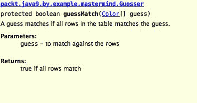

# Mastermind - 创建一个游戏

在本章中，我们将开始开发一个简单的游戏。这个游戏是两人玩的 Mastermind 游戏。玩家一从六种可能的颜色中选择四个不同颜色的针，并将它们按行排列在隐藏给另一个玩家的板上。另一个玩家试图猜测针的颜色和位置。每次尝试后，玩家一告诉匹配的颜色数量以及匹配颜色和位置的针的数量。程序将扮演玩家一和玩家二。我们的代码将独立运行。然而，我们最重要的任务是代码本身。

这个例子足够复杂，可以加深我们对面向对象原则的理解以及如何设计类和模拟现实世界。我们已经使用了 Java 运行时提供的类。这次，我们将使用集合并讨论这个重要领域。这些类和接口在 JDK 中广泛使用，对于专业 Java 开发者来说，它们的重要性不亚于语言本身。

这次的构建工具是 Gradle。

在本章中，我们将介绍：

+   Java 集合

+   依赖注入

+   如何注释我们的代码以及创建 JavaDoc 文档

+   如何创建集成测试

# 游戏

Mastermind ([`zh.wikipedia.org/wiki/Mastermind_(board_game)`](https://zh.wikipedia.org/wiki/Mastermind_(board_game))) 是一款老游戏。那个在每家每户都有孩子的家庭中无处不在的塑料版本是在 1970 年发明的。我大约在 1980 年收到了一个作为圣诞礼物的板子，用 BASIC 语言解决游戏谜题是我 1984 年左右编写的第一个程序之一。

游戏板在四列的几行中都有孔。有六种不同颜色的塑料针可以插入孔中。每个针都有一个颜色。它们通常是红色、绿色、蓝色、黄色、黑色和白色。有一行是隐藏给一个玩家（猜测者）的。

为了玩游戏，一个玩家（隐藏者）必须从一组针中选择四个。所选的针应该有不同的颜色。针一个接一个地放置在隐藏行中，每个针都放在一个位置。

猜测者试图通过猜测颜色和位置来找出颜色。每次猜测都涉及选择四个针并将它们放在一行中。隐藏者告诉猜测者有多少针在正确的位置，以及有多少针颜色在桌面上，但不在隐藏颜色的位置。


一场典型的游戏可能如下进行：

+   隐藏者用蓝色、黄色、白色和黑色的四个针进行隐藏。

+   猜测者猜测黄色、蓝色、绿色和红色。

+   隐藏者告诉猜测者有两个颜色匹配，但它们都不在隐藏行的位置。隐藏者之所以这么说，是因为黄色和蓝色在隐藏行，但不在猜测者猜测的位置。实际上它们是交换过的，但这个信息隐藏者保密。她只说有两个颜色匹配，没有颜色在正确的位置。

+   下一个猜测是 ...

当猜谜者找到正确的颜色并按正确顺序排列时，游戏结束。如图所示的相同游戏也可以用文本表示法来描述，`B`代表蓝色，`Y`代表黄色，`G`代表绿色，`W`代表白色，`R`代表红色，`b`代表黑色（幸运的是，我们在电脑上有大小写字母）。

```java
RGBY 0/0
GRWb 0/2
YBbW 0/2
BYGR 0/4
RGYB 2/2
RGBY 4/0

```

猜猜看！这是我们在这个章节中开发的程序的真正输出。

# 游戏的模型

当我们用面向对象的心态编写一段代码时，我们试图模拟现实世界，并将现实世界的对象映射到程序中的对象。你肯定听说过用非常典型的几何对象、汽车和发动机等例子来解释面向对象。我个人认为这些例子太简单了，无法获得良好的理解。它们可能适合初学者，但我们已经在书的第四章了。Mastermind 游戏要好得多。它比简单的矩形和三角形复杂一些，但不如电信计费应用或原子能电站控制复杂。

在那个游戏中我们有哪些现实世界的对象呢？我们有一个台球桌，还有不同颜色的球。我们肯定需要两个 Java 类。台球桌里有什么呢？每一行有四个位置。也许我们需要一个代表行的类。台球桌将有行。我们还需要一些隐藏秘密的东西。这也可能是一个行，每一行也可能包含有关位置数和匹配颜色的信息。对于秘密行来说，这个信息是显而易见的：4 和 0。

什么是球？每个球都有一个颜色，通常就是这样。球没有其他特征，除了它可以插入到台球桌上的一个洞里，但这是现实生活中我们不会模拟的特征。本质上，球就是一个颜色，没有其他。这样，我们可以在早期就消除球类从我们的模型中，甚至在 Java 创建它之前。相反，我们有颜色。

什么是颜色？这可能是第一次难以沉浸其中的东西。我们都知道颜色是什么。它是不同频率的光的混合，正如我们的眼睛所感知的那样。我们可以有不同颜色的油漆和印刷品，等等。在这个程序中，我们有很多东西没有模拟。在代码中很难说我们模拟了关于颜色的哪些内容，因为这些特征如此明显，我们在现实生活中都认为是理所当然的；我们可以描述两种颜色是不同的。这是我们唯一需要的特征。为此，我们可以使用 Java 中最简单的类：

```java
package packt.java9.by.example.mastermind; 
public class Color {}

```

如果你有两个**Color**类型的变量，你可以判断它们是否相同。你可以使用对象身份比较`a`和`b`的表达式`a == b`，或者你可以使用从`Object`类继承的`equals`方法，`a.equals(b)`。用字母编码颜色或使用`String`常量来表示它们可能更容易，但后来会有严重的缺点。当代码变得复杂时，它会导致错误；很容易传递也编码为 String 的东西而不是颜色，只有单元测试可能拯救这一天。更好的是，当你输入错误的参数时，编译器已经在 IDE 中抱怨了。

当我们玩游戏时，球针在小盒子里。我们从盒子里拔出球针。我们如何在程序中获取颜色？我们需要从我们可以获取颜色的地方，或者从另一个角度看，我们可以提供颜色的地方。我们将称之为`ColorManager`。`ColorManager`知道我们有多少种不同的颜色，任何我们需要颜色的时候，我们都可以要求它。

再次，有一种诱惑要设计一个**ColorManager**，它可以按照序列号提供颜色。如果我们有四种颜色，我们可以要求颜色编号 0、1、2 或 3。但再次，它只是隐式地将颜色编码为整数，这是我们同意不会做的。我们应该找到我们需要的最小特征来模拟游戏。

为了描述类的结构，专业开发者通常使用 UML 类图。UML 是一种标准化的图表符号，几乎专门用于可视化软件架构。UML 中有许多图表类型来描述程序的静态结构和动态行为。这次，我们将查看一个非常简化的类图。


我们没有空间深入了解 UML 类图。矩形表示类，普通箭头表示当类具有其他类类型的字段时的关系，三角形箭头表示一个类扩展了另一个类。箭头指向被扩展的类的方向。

一个**Game**包含一个秘密的**Row**和一个**Table**。**Table**有一个**ColorManager**和一个**Row**的**List<>**。**ColorManager**有一个第一个颜色和一个**Color**的**Map<>**。我们还没有讨论为什么是这种设计，我们将会到达那里，图表帮助我们走这条路。一个**Row**本质上是一个**Color**的数组。

玩游戏的人有一个功能：它必须猜测很多次，直到找到隐藏的秘密。为了得到**ColorManager**的模型，我们不得不设计**Guesser**的算法。

当玩家第一次猜测时，任何颜色的组合都和其他任何组合一样好。后来，猜测应该考虑之前猜测得到的回应。尝试只有可能是实际秘密的颜色变化是一种合理的方法。玩家选择一个变化，并查看所有之前的猜测，假设所选的变化是秘密。如果他对已经做出的行回应与游戏中未知秘密的回应相同，那么尝试这个变化是合理的。如果有任何差异，那么这个变化肯定不是隐藏的变化。

为了遵循这种方法，猜测者必须一个接一个地生成所有可能的颜色变化，并将其与表格进行比较。猜测者的代码不会提前创建和存储所有可能的变化，但它必须知道它在哪里，并且必须能够计算出下一个变化。这假设了变化的顺序。暂时让我们忘记在一个变化中可能不会出现两次颜色。简单的排序可以像我们排序十进制数字一样进行。如果我们有一个三位数，那么第一个是 000，下一个是 001，以此类推，直到 009，总是为最后一个位置获取下一个数字。之后，010 出现。我们增加最后一个旁边的数字，并将最后一个数字设置为 0。现在，我们有 011，012，以此类推。你知道我们是如何数数的。现在，用颜色替换数字，我们只有六种颜色而不是十种。或者，当我们实例化一个`ColorManager`对象时，我们可以有我们想要的任何数量。

这导致了`ColorManager`的功能。它必须完成以下两件事：

+   将第一种颜色分配给呼叫者

+   分配给给定颜色之后的下一个颜色（我们将该方法命名为`nextColor`）

后者功能还应该以某种方式在没有任何下一个颜色时发出信号。这将通过另一个名为`thereIsNextColor`的方法来实现。

以`is`开头是返回布尔值的方法名的惯例。这将导致遵循此惯例的名称为`isThereNextColor`或`isNextColor`。这两个名称中的任何一个都解释了该方法的功能。如果我提出问题`isThereNextColor`，该方法将回答我`true`或`false`。但是，我们不会这样使用该方法。我们将用简单的句子来交流。我们将使用简短的句子。我们将避免不必要的、混乱的表达。我们也将这样编程。很可能会在`if`语句中使用这个方法。他们将写下以下内容：

`If( thereIsNextColor(currentColor)){...}`

而不是

`if( isThereNextColor(currentColor)){...}`

我认为第一个版本更易于阅读，可读性是最重要的。最后但同样重要的是，如果你遵循旧惯例，没有人会责怪你，如果这是公司的标准，你无论如何都必须这样做。

要完成这些操作，`ColorManager` 还需要创建颜色对象，并且应该将它们存储在一个有助于执行操作的机构中。

```java
package packt.java9.by.example.mastermind; 

 import java.util.HashMap; 
 import java.util.Map; 

 public class ColorManager { 
     final protected int nrColors; 
     final protected Map<Color, Color> successor = new HashMap<>(); 
     final private Color first; 

     public ColorManager(int nrColors) { 
         this.nrColors = nrColors; 
         first = new Color(); 
         Color previousColor = first; 

         for (int i = 1; i < nrColors; i++) { 
             final Color thisColor = new Color(); 
             successor.put(previousColor, thisColor); 
             previousColor = thisColor; 
         } 
         successor.put(previousColor, Color.none); 
     } 

     public Color firstColor() { 
         return first; 
     } 

     boolean thereIsNextColor(Color color) { 
         return successor.get(color) != Color.none; 
     } 

     public Color nextColor(Color color) { 
         return successor.get(color); 
     } 
 }

```

我们使用的结构是 `Map`。`Map` 是在 Java 运行时中定义的一个接口，并且从 Java 的早期版本开始就可用。`Map` 有键和值，对于任何键，你可以轻松地检索分配给该键的值。

您可以在定义变量 `successor` 的那一行看到，我们定义了变量的类型为接口，但值是一个类的实例。显然，值不能是一个接口的实例，因为这样的生物是不存在的。但，我们为什么要把变量定义为接口呢？原因是抽象和编码实践。如果我们需要因为某种原因更改使用的实现，变量类型仍然可能保持不变，而且不需要在其他地方更改代码。将变量声明为接口也是一个好的实践，这样我们就不会因为方便而使用接口中不可用的某些特殊 API。当真正需要时，我们可以更改变量的类型并使用特殊的 API。毕竟，API 存在是有原因的，但仅仅因为某些特殊的东西存在就使用它的诱惑被阻止了。这有助于编写更简单、更干净的程序。

`Map` 只是 Java 运行时中定义的属于 Java 集合的接口之一。还有很多其他的接口和类。尽管 JDK 和所有类都非常庞大，几乎没有人知道所有存在的类，但集合是一个专业开发者应该了解的特殊领域。在深入探讨为什么在这段代码中使用 `HashMap` 之前，我们将对集合类和接口有一个概述。这将帮助我们理解这个程序中使用的其他集合。

# Java 集合

集合是帮助我们存储多个对象的接口和类。我们已经在之前的章节中看到了可以做到这一点的数组，以及 `ArrayList`，但我们没有详细讨论 JDK 中还有哪些其他可能性。在这里，我们将更详细地探讨，但将流和函数式方法留到后面的章节，我们也将避免深入探讨，这更像是参考书的任务。

使用集合类和接口的实现可以减少编程工作量。首先，你不需要编写已经存在的东西。其次，这些类在实现和功能上都非常优化。它们有非常精心设计的 API，代码运行速度快，内存占用小。遗憾的是，它们的代码是多年前编写的，很多时候风格不佳，难以阅读和理解。

当你使用 JDK 中的集合时，你更有可能与某些库进行交互。如果你自己编写版本的链表，你不太可能找到一个现成的解决方案来排序你的列表。如果你使用 JDK 标准类库中的`LinkedList`类，你将从`Collections`类中获得一个现成的解决方案，直接来自 JDK。也值得提到的是，Java 语言本身支持这些类，例如，你可以使用简化的特殊语法轻松遍历`Collection`的元素。

JDK 中的集合包含定义不同集合类型、实现类以及执行某些操作（如排序）的算法的接口。很多时候，这些算法在不同的实现版本上工作，得到相同的结果，但针对特定类进行了优化。

你可以使用接口提供的 API，如果你在代码中更改实现，你将得到一个适合实现的优化版本。


集合接口可以分为两类。一类包含扩展`Collection`接口的接口，另一类包含`Map`和扩展`Map`的`SortedMap`。这样，`Map`实际上不是一个集合，因为它不仅包含其他对象，还包含键值对。

# 界面集合

收集是界面层次结构中的顶层。这个界面定义了所有实现应该提供的方法，无论它们是否直接实现了`Set`、`SortedSet`、`List`、`Queue`或`Deque`接口。正如`Collection`所简单说明的，实现`Collection`接口的对象只是一个收集其他对象的集合，它定义的方法就像向集合中添加一个新对象、从那里清除所有元素、检查一个对象是否已经是集合的成员以及遍历元素。

对于接口的最新定义，请参阅 Java pi 文档([`download.java.net/java/jdk9/docs/api/overview-summary.html`](http://download.java.net/java/jdk9/docs/api/overview-summary.html))。你可以随时在线查看 API，并且建议这样做。

Java 语言本身直接支持这个接口。你可以使用增强的`for`循环语法遍历`Collection`的元素，就像你可以遍历数组中的元素一样，其中集合应该是一个表达式，该表达式结果是一个实现`Collection`接口的对象：

```java
for( E element : collection ){...}

```

在前面的代码中，`E`是 Object 或者是`Collection`元素的类型参数。

`Collection`接口在 JDK 中不是直接实现的。类实现了`Collection`的一个子接口。

# 集合

`Set` 是一个特殊的集合，不能包含重复的元素。当你想要将一个对象添加到一个已经包含与实际对象相同或相等的对象的集合中时，`add` 方法将不会添加实际的对象。`add` 方法将返回 `false` 表示失败。

当你需要一个包含唯一元素的集合，你只需要检查一个元素是否是集合的成员或不是，一个对象是否属于某个特定组时，你可以在你的程序中使用 `Set`。

当我们回到程序代码时，我们会看到 `UniqueGuesser` 类必须实现一个算法，该算法检查猜测中的颜色只出现一次。这个算法是用于 `Set` 的理想候选：

```java
private boolean isNotUniqueWithSet(Color[] guess) { 
     final Set<Color> alreadyPresent = new HashSet<>(); 
     for (Color color : guess) { 
         if (alreadyPresent.contains(color)) { 
             return true; 
         } 
         alreadyPresent.add(color); 
     } 
     return false; 
 }

```

代码创建了一个集合，当方法开始时它是空的。之后，它检查每个颜色（注意对数组元素的增强型 `for` 循环）是否之前已经存在。为了做到这一点，代码检查颜色是否已经在集合中。如果它在其中，那么猜测就不唯一，因为我们已经发现了一个至少出现两次的颜色。如果颜色不在集合中，那么猜测在颜色上仍然可以是唯一的。为了能够稍后检测到这一点，代码将颜色放入集合中。

我们将要使用的 `Set` 的实际实现是 `HashSet`。在 JDK 中，有许多类实现了 `Set` 接口。最广泛使用的是 `HashSet`，也值得提一下 `EnumSet`、`LinkedHashSet` 和 `TreeSet`。最后一个也实现了 `SortedSet` 接口，所以我们将在那里详细说明。

要理解 `HashSet`（以及稍后的 `HashMap`）是什么以及它们是如何工作的，我们必须讨论哈希是什么。它们在许多应用中扮演着非常重要和核心的角色。它们在 JDK 的底层执行其工作，但程序员必须遵循一些非常重要的约束，否则会出现非常奇怪且极其难以发现的错误，这将使他们的生活变得痛苦。我敢说，违反 `HashSet` 和 `HashMap` 中的哈希契约是仅次于多线程问题的第二难以发现的错误的原因。

因此，在继续不同的集合实现之前，我们将探讨这个主题。我们已经在这个关于集合的偏离中深入了一层，现在我们将再深入一层。我保证这是最后一个深入的偏离层次。

# 哈希函数

哈希是一种数学函数，它将一个数字分配给一个元素。比如说你在大学行政部门工作，你需要判断 Wilkinson 是否是你们班的学生。你可以将名字写在小纸条上，然后放入信封中，每个信封对应一个首字母。这样，你就不需要搜索一万名学生，只需查看标题为 W 的信封中的纸条。这个非常简单的哈希函数将名字的第一个字母分配给该名字（或者说是字母的序号，因为我们说过哈希函数的结果是一个数字）。这并不是一个好的哈希函数，因为它只将少数几个元素（如果有的话）放入标记为 X 的信封中，而将许多元素放入例如 A 的信封中。

一个好的哈希函数以相似的概率将每个可能的序号分配给每个元素。在哈希表中，我们通常有比要存储的元素数量更多的桶（如前例中的信封）。因此，当搜索一个元素时，很可能只有一个元素在那里。至少这是我们希望得到的。如果单个桶中有多个元素，这被称为冲突。一个好的哈希函数具有尽可能少的冲突。

为了保持向后兼容性，JDK 中有一个`Hashtable`类。这是 Java 中第一个哈希表实现之一，就在第一个版本中，由于 Java 具有向后兼容性，它没有被丢弃。`Map`接口是在版本 1.2 中引入的。`Hashtable`有很多缺点，并且不建议使用。（甚至它的名字也违反了 Java 的命名约定。）我们在这本书中不讨论这个类。当我们谈论哈希表时，它指的是`HashSet`、`HashMap`或任何使用某种哈希索引表的集合实现中的实际数组。

哈希表是使用哈希函数的结果来索引数组的数组。通常，链表管理冲突。哈希表实现还实现了一种策略，当要存储的元素数量变得过高且冲突的可能性增加时，调整数组的大小。这个操作可能需要相当长的时间，在此期间，各个元素会在桶之间移动。

在这个操作过程中，哈希表无法可靠地使用，这可能是多线程环境中出现问题的来源之一。在单线程代码中，你不会遇到这个问题。当你调用`add`方法时，哈希表（集合或映射）决定表需要调整大小。`add`方法调用调整大小的方法，并且直到完成才返回。单线程代码在这个期间没有可能使用哈希表：唯一的一条线程正在执行调整大小操作。在多线程环境中，然而...

`HashSet` 和 `HashMap` 使用存储在集合中的 `Object` 提供的哈希函数。`Object` 类实现了 `hashCode` 和 `equals` 方法。您可以覆盖它们，如果您这样做，应该以一致的方式覆盖它们。首先，我们将了解它们是什么，然后了解如何一致地覆盖它们。

# `equals` 方法

集合的文档说明“集合不包含任何元素对 `e1` 和 `e2`，使得 `e1.equals(e2)`”。`equals` 方法返回 `true` 如果 `e1` 和 `e2` 以某种方式相等。它们可能不同于两个完全相同的对象。可能存在两个不同的对象相等。例如，我们可以有一个颜色实现，其中颜色的名称作为属性，当两个字符串相等时，两个颜色对象在其中一个上调用 `equals` 方法并将另一个作为参数传递，它们会返回 `true`。`equals` 方法的默认实现位于 `Object` 类的代码中，并且仅在 `e1` 和 `e2` 完全相同且是单个对象时返回 `true`。

虽然看起来很明显，但我的经验表明，强调对象中 `equals` 的实现必须如下所示是不够的：

+   **自反性**：这意味着一个始终等于自身的对象

+   **对称性**（交换性）：这意味着如果 `e1.equals(e2)` 为 `true`，则 `e2.equals(e1)` 也应该是 `true`

+   **传递性**：这意味着如果 `e1.equals(e2)` 和 `e2.equals(e3)`，则 `e1.equals(e3)`

+   **一致性**：这意味着如果对象在调用之间未被更改，则返回值不应改变

# `hashCode` 方法

`hashCode` 方法返回一个 `int`。文档说明，任何重新定义此方法的类都应该提供以下实现：

+   如果对象未被修改，则始终返回相同的值

+   对于两个相等的对象返回相同的 `int` 值（`equals` 方法返回 `true`）

文档还提到，这不是为不相等的对象返回不同的 `int` 值的要求，但支持实现哈希集合的性能是可取的。

如果在 `equals` 和 `hashCode` 的实现中违反了这些规则中的任何一个，那么使用它们的 JDK 类将失败。您可以确信 `HashSet`、`HashMap` 和类似类已经完全调试过，看到您向集合中添加了一个对象，然后集合报告它不在那里将会是一个令人困惑的经历。然而，只有当您发现存储在集合中的两个相等的对象具有不同的 `hashCode` 值时，`HashSet` 和 `HashMap` 才会在由 `hashCode` 值索引的桶中查找对象。

也将是一个常见的错误，将对象存储在`HashSet`或`HashMap`中，然后修改它。对象在集合中，但你找不到它，因为`hashCode`返回不同的值。存储在集合中的对象不应该被修改，除非你知道你在做什么。

许多时候，对象包含从相等性角度来看不感兴趣的字段。`hashCode`和`equals`方法应该对这些字段是幂等的，你甚至可以在将对象存储在`HashSet`或`HashMap`之后修改这些字段。

例如，你可能在对象中管理三角形的顶点坐标和三角形的颜色。然而，你并不关心颜色用于相等性，只关心两个三角形在空间中的位置是否完全相同。在这种情况下，`equals`和`hashCode`方法不应考虑字段颜色。这样，我们可以给我们的三角形上色；无论颜色字段是什么，它们仍然可以在`HashSet`或`HashMap`中找到。

# 实现`equals`和`hashCode`

实现这些方法相当简单。由于这是一个非常常见的任务，IDE 支持生成这些方法。这些方法紧密相连，以至于 IDE 中的菜单项不是分开的；它们提供一次性生成这些方法。

要求 IDE 生成`equals`方法将产生如下代码：

```java
@Override 
 public boolean equals(Object o) { 
     if (this == o) return true; 
     if (o == null || getClass() != o.getClass()) return false; 
     MyObjectJava7 that = (MyObjectJava7) o; 
     return Objects.equals(field1, that.field1) && 
             Objects.equals(field2, that.field2) && 
             Objects.equals(field3, that.field3); 
 }

```

对于这个示例，我们有三个名为`field1`、`field2`和`field3`的`Object`字段。任何其他类型和字段的代码看起来非常相似。

首先，该方法检查对象身份。一个`Object`总是`equals`自身。如果作为参数传递的引用是`null`且不是对象，或者它们属于不同的类，那么这个生成的方法将返回`false`。在其他情况下，将使用类的静态方法`Objects`（注意复数形式）来比较每个字段。

实用类`Objects`是在 Java 7 中引入的，因此示例类的名称。静态方法`equals`和`hash`支持覆盖`Object equals`和`hashCode`方法。在 Java 7 之前创建`hashCode`相当复杂，需要实现带有一些难以仅通过查看代码而不了解其背后的数学原理的魔数模运算。

这种复杂性现在被隐藏在下面的`Objects.hash`方法之后。

```java
@Override 
 public int hashCode() { 
     return Objects.hash(field1, field2, field3); 
 }

```

生成的简单方法调用`Objects.hash`方法，并将重要字段作为参数传递。

# HashSet

现在，我们基本上对哈希了解很多，因此我们可以大胆地讨论`HashSet`类。`HashSet`是实现`Set`接口的类，内部使用哈希表。一般来说，就是这样。你将对象存储在那里，你可以看到对象是否已经存在。当需要`Set`实现时，几乎总是选择`HashSet`。几乎...

# 枚举集

`EnumSet` 可以包含来自某个枚举的元素。回想一下，枚举是声明在 `enum` 内部的固定数量实例的类。由于这限制了不同对象实例的数量，并且这个数量在编译时是已知的，因此 `EnumSet` 代码的实现相当优化。内部，`EnumSet` 被实现为一个位字段，并且当可以使用位字段操作时是一个很好的选择。

# LinkedHashSet

`LinkedHashSet` 是一个 `HashSet`，同时维护了一个包含其元素的循环链表。当我们遍历一个 `HashSet` 时，元素没有保证的顺序。当 `HashSet` 被修改时，新元素会被插入到一个桶中，并且可能需要调整哈希表的大小。这意味着元素会被重新排列，并进入完全不同的桶中。在 `HashSet` 中遍历元素只是按照某种任意顺序取桶及其中的元素。

然而，`LinkedHashSet` 使用它维护的链表遍历元素，并且遍历保证按照元素插入的顺序进行。

# SortedSet

`SortedSet` 是一个接口，它保证实现它的类将按排序顺序遍历集合。顺序可能是如果对象实现了 `Comparable` 接口，则为对象的自然排序；或者可能由一个 `Comparator` 对象驱动。当创建实现 `SortedSet` 的类的实例时，应该提供这个对象；换句话说，它必须是构造函数的参数。

# NavigableSet

`NavigableSet` 扩展了 `SortedSet` 接口，提供了允许你在集合中进行邻近搜索的方法。这实际上允许你搜索一个在搜索中且小于被搜索对象的元素，小于或等于被搜索元素，大于或等于，或大于被搜索对象。

# TreeSet

`TreeSet` 是 `NavigableSet` 的一个实现，因此它也是一个 `SortedSet`，实际上也是一个 `Set`。根据 `SortableSet` 文档的说明，有两种类型的构造函数，尽管每种都有多个版本。一种需要一些 `Comparator`，另一种则依赖于元素的默认排序。

# List

`List`是一个接口，要求实现类跟踪元素的顺序。还有通过索引访问元素和由`Collection`接口定义的迭代定义的方法，该接口保证了元素的顺序。该接口还定义了`listIterator`方法，该方法返回一个实现`ListIterator`接口的`Iterator`。此接口提供了允许调用者在迭代列表的同时插入元素的方法，也可以在迭代中前后移动。在`List`中搜索特定元素也是可能的，但大多数实现接口的接口在搜索时提供较差的性能，因为搜索只是简单地遍历所有元素，直到找到要搜索的元素。在 JDK 中有许多实现此接口的类。在这里，我们将提到两个。

# LinkedList

这是一个双向链表实现的 List 接口，每个元素都有一个指向列表中前一个元素和后一个元素的引用。该类还实现了 Deque 接口。从列表中插入或删除元素相对便宜，因为它只需要调整少数几个引用。另一方面，通过索引访问元素将需要从列表的开始迭代，或者从列表的末尾迭代， whichever is closer to the specified indexed element。

# ArrayList

这个类是实现`List`接口的类，它将元素的引用存储在数组中。这样，通过索引访问元素相对较快。另一方面，向`ArrayList`插入元素可能代价高昂。它需要将插入元素以上的所有引用向上移动一个索引，并且如果原始数组中没有空间存储新元素，可能还需要调整底层数组的大小。本质上，这意味着分配一个新的数组并将所有引用复制到它上面。

如果我们知道数组将如何增长，我们可以调用`ensureCapacity`方法来优化数组的重新分配。这将根据提供的参数大小调整数组的大小，即使当前使用的槽位数量较少。

我的经验是，新手程序员在需要列表而不考虑不同实现算法性能的情况下使用`ArrayList`。我实际上不知道为什么`ArrayList`会有这种流行度。程序中实际使用的实现应该基于正确的决策，而不是习惯。

# Queue

队列是一个通常存储元素以供以后使用的集合。你可以将元素放入队列中，也可以将它们取出。实现可能指定给定的顺序，可能是**先进先出**（**FIFO**）或**后进先出**（**LIFO**）或基于优先级的排序。

在队列中，你可以调用 `add` 方法添加元素，`remove` 方法移除头元素，以及 `element` 方法访问头元素而不从队列中移除它。当存在容量问题时，`add` 方法将抛出异常，并且元素无法添加到队列中。当队列空时，没有头元素，`element` 和 `remove` 方法将抛出异常。

由于异常只能在异常情况下使用，并且调用程序可能在代码的正常流程中处理这些情况，因此所有这些方法都有一个只返回一些特殊值的版本，以表示这种情况。而不是 `add`，调用者可以调用 `offer` 来存储元素。如果队列无法存储元素，它将返回 `false`。同样，`peek` 将尝试获取头元素或在没有头元素时返回 `null`，而 `poll` 将移除并返回头元素，如果没有头元素则只返回 `null`。

注意，这些返回 `null` 的方法在实现，例如 `LinkedList` 允许 `null` 元素时，只会使情况变得模糊不清。永远不要在队列中存储 `null` 元素。

# Deque

`Deque` 是一个双端队列的接口。它通过提供访问队列两端的方法扩展了 `Queue` 接口，这些方法允许从两端添加、查看和移除元素。

对于 `Queue` 接口，我们需要六个方法。具有两个可管理端点的 `Dequeue` 需要 12 个方法。我们不是 `add`，而是有 `addFirst` 和 `addLast`。同样，我们还可以 `offerFirst`、`offerLast` 以及 `peekFirst`、`peekLast` 和 `pollFirst`、`pollLast`。由于某种原因，实现 `Queue` 上 `element` 方法功能的方法被命名为 `getFirst` 和 `getLast`。

由于这个接口扩展了 `Queue` 接口，因此也可以使用那里定义的方法来访问队列的头。除了这些，这个接口还定义了 `removeFirstOccurrence` 和 `removeLastOccurrence` 方法，可以用来在队列内部移除特定元素。我们无法指定要移除元素的索引，也无法根据索引访问元素。`removeFirst`/`LastOccurrence` 方法的参数是要移除的对象。如果我们需要这个功能，即使从队列的同一边添加和移除元素，我们也可以使用 `Deque`。

为什么 `Deque` 中有这些方法，而 `Queue` 中没有？这些方法与 `Deque` 的双头特性无关。原因是方法不能在接口发布后添加。如果我们向接口添加一个方法，就会破坏向后兼容性，因为所有实现该接口的类都必须实现新方法。Java 8 引入了默认方法，这放宽了这一限制，但 `Queue` 接口是在 Java 1.5 中定义的，而 `Deque` 接口是在 Java 1.6 中定义的。当时没有方法可以将新方法添加到已经存在的接口中。

# Map

`Map`将键和值配对。如果我们想从`Collection`的角度来接近`Map`，那么`Map`是一组键/值对。你可以将键值对放入`Map`中，并且可以根据键获取值。键是唯一的，就像`Set`中的元素一样。如果你查看`Set`接口的不同实现的源代码，你可能会看到其中一些是作为`Map`实现的包装实现的，其中值被简单地丢弃。

使用`Map`既简单又吸引人。许多语言，如 Python、Go、JavaScript、Perl 等，在语言级别上支持这种数据结构。然而，当数组足以满足需求时使用`Map`是一种不良实践，我见过很多次，尤其是在脚本语言中。Java 不太容易犯这种新手程序员的错误，但你可能仍然会遇到想要使用`Map`的情况，而且仍然有更好的解决方案。一个普遍的规则是，应该使用最简单的数据结构来实现算法。

# HashMap

`HashMap`是`Map`接口的基于哈希表的实现。由于映射基于哈希表，基本的`put`和`get`方法是在常数时间内执行的。此外，由于`Map`非常重要，并且因为 JDK 中最常用的实现是`HashMap`，所以实现相当可配置。你可以使用不带参数的默认构造函数来实例化`HashMap`，但还有一个构造函数可以定义初始容量和加载因子。

# IdentityHashMap

`IdentityHashMap`是一个特殊的`Map`，它直接实现了`Map`接口，但实际上它违反了`Map`接口文档中定义的契约。它这样做是有充分理由的。该实现使用哈希表，就像`HashMap`一样，但在决定桶中找到的键与作为 get 方法参数提供的键元素是否相等时，它使用`Object`引用（`==`运算符）而不是`equals`方法，这是`Map`接口文档所要求的。

当我们想要区分不同`Object`实例作为键，而这些键在其他情况下是相等的，使用这种实现是合理的。出于性能原因使用这种实现几乎肯定是一个错误的决定。此外，请注意，JDK 中没有`IdentityHashSet`实现。可能这样的集合很少使用，它的存在在 JDK 中可能会造成比好处更多的伤害，吸引新手程序员误用。

# 依赖注入

在上一章中，我们简要地讨论了**依赖注入**（**DI**）。现在我们将更深入地探讨它。

对象通常不会独立工作。大多数时候，实现依赖于其他类的服务。当我们想要向控制台写入内容时，我们使用`System`类。当我们管理猜测表时，我们需要`Color`对象和`ColorManager`。

在向控制台写入的情况下，我们可能没有意识到这种依赖，因为作为 JDK 类库的一部分的类始终可用，我们只需要编写`System.out.println`。在这种情况下，这种依赖已经通过代码连接。除非我们更改代码，否则我们无法将输出发送到其他地方。这并不太灵活，在许多情况下，我们需要一个可以与不同输出、不同颜色管理器或不同服务（我们的代码依赖于这些服务）一起工作的解决方案。为此，第一步是有一个字段，该字段包含一个引用对象，该对象为我们类提供服务。在输出方面，该字段的类型可以是`OutputStream`类型。接下来，更有趣的一步是如何获取这个字段的值。

其中一种解决方案是使用 DI。在这种方法中，一些外部代码准备依赖关系并将它们注入到对象中。当首次调用类的方法时，所有依赖关系都已填充并准备好使用。

在这个结构中，我们有四个不同的参与者：

+   客户端对象是在过程中获取注入服务对象的那个对象

+   服务对象或对象被注入到客户端对象中

+   注入器是执行注入的代码

+   接口定义了客户端需要的服务

如果我们将服务对象的创建逻辑从客户端代码中移除，代码就会变得更短、更干净。客户端类的实际能力几乎不应该包括服务对象的创建。例如，一个`Game`类包含一个`Table`实例，但游戏并不负责创建`Table`。它被赋予它来与之工作，就像我们在现实生活中所模拟的那样。

服务对象的创建有时就像使用`new`运算符一样简单。有时服务对象也依赖于其他服务对象，因此也在依赖注入过程中充当客户端。在这种情况下，服务对象的创建可能需要很多行代码。依赖的结构可以用声明式的方式表达，描述了哪些服务对象需要哪些其他服务对象，以及要使用哪些服务接口的实现。依赖注入注入器与这种声明性描述一起工作。当需要这样一个对象，该对象本身需要其他服务对象时，注入器会按照匹配声明性描述的实现顺序创建服务实例。注入器发现所有依赖关系，并创建依赖关系的传递闭包图。

需要的依赖项的声明性描述可以是 XML，或者为依赖注入特别开发的语言，甚至可以使用特别设计的 Java 流畅 API（[`blog.jooq.org/2012/01/05/the-java-fluent-api-designer-crash-course/`](https://blog.jooq.org/2012/01/05/the-java-fluent-api-designer-crash-course/))。XML 最初用于**DI**注入器。后来，基于**Groovy**的**领域特定语言**（[`martinfowler.com/books/dsl.html`](https://martinfowler.com/books/dsl.html)）和 Java 流畅 API 方法出现。我们将只使用最后一种，因为它是最现代的，我们将使用**Spring**和**Guice****DI**容器，因为它们是最知名的注入器实现。

# 游戏实现

没有示例的集合是无聊的。幸运的是，我们有一个游戏，我们在其中使用了一些集合类，以及我们将在本章中检查的其他方面。

# ColorManager

我们从`ColorManager`类的实现中跳入了充满集合类的泳池。现在让我们回顾一下对我们来说有趣的类部分——构造函数：

```java
final protected int nrColors; 
 final protected Map<Color, Color> successor = new HashMap<>(); 
 final private Color first; 

 public ColorManager(int nrColors) { 
     this.nrColors = nrColors; 
     first = new Color(); 
     Color previousColor = first; 

     for (int i = 1; i < nrColors; i++) { 
         final Color thisColor = new Color(); 
         successor.put(previousColor, thisColor); 
         previousColor = thisColor; 
     } 
     successor.put(previousColor, Color.none); 
 }

```

我们将使用`HashMap`来保持颜色的有序列表。起初，选择`HashMap`看起来很奇怪。确实如此，在编写`ColorManager`代码时，我也考虑了`List`，这似乎是一个更明显的选择。当我们有一个`List<Color> colors`变量时，那么`nextColor`方法就像这样：

```java
public Color nextColor(Color color) { 
     if (color == Color.none) 
         return null; 
     else 
         return colors.get(colors.indexOf(color) + 1); 
 }

```

构造函数将非常简单，如下所示的一段代码：

```java
final List<Color> colors = new ArrayList<>(); 

     public ColorManager(int nrColors) { 
         this.nrColors = nrColors; 
         for (int i = 0; i < nrColors; i++) { 
             colors.add(new Color()); 
         } 
         colors.add(Color.none); 
     } 

     public Color firstColor() { 
         return colors.get(0); 
     }

```

我为什么选择了更复杂且不明显的解决方案？原因在于性能。当调用`nextColor`方法时，列表实现首先找到元素，检查列表中的所有元素，然后获取下一个元素。所需时间是颜色数量的比例。当颜色数量增加时，获取下一个颜色所需的时间也会增加，仅仅是为了得到一个颜色。

同时，如果我们关注的是不是来自我们想要解决的问题的口头表达的数据结构（按排序顺序获取颜色），而是关注我们想要实现的实际方法`nextColor(Color)`，那么我们很容易得出结论，`Map`更合理。我们需要的正是`Map`：有一个元素我们想要另一个与之相关的元素。键和值也是`Color`。使用`HashMap`获取下一个元素是常数时间。这种实现可能比基于`ArrayList`的实现更快。

问题在于它可能只是更快一点。当你考虑重构代码以获得更好的性能时，你的决定应该始终基于测量。如果你实现了一个你认为更快的代码，实践表明，你会失败。在最好的情况下，你将优化代码以使其非常快，并在应用程序服务器设置期间运行。同时，优化后的代码通常可读性较差。有所得必有所失。

优化永远不应该过早进行。首先编写易于阅读的代码。然后，评估性能，如果性能存在问题，那么分析执行情况，并在对整体性能影响最大的地方优化代码。微优化不会有所帮助。

我在选择了`HashMap`实现而不是`List`时是否过早进行了优化？如果我真的使用了`List`来实现代码然后进行了重构，那么是的。如果我在考虑`List`解决方案时，后来想到`Map`解决方案更好，而没有先进行编码，那么我没有。经过多年的经验，这样的考虑会更容易，因为你也会经历。

# 类颜色

我们已经查看过类代码的代码，它是世界上最简单的类。实际上，正如 GitHub 仓库([`github.com/j9be/chapter04`](https://github.com/j9be/chapter04)或[`github.com/PacktPublishing/Java-9-Programming-By-Example/tree/master/Chapter04`](https://github.com/PacktPublishing/Java-9-Programming-By-Example/tree/master/Chapter04))中所示，代码要复杂一些：

```java
package packt.java9.by.example.mastermind; 

 /** 
  * Represents a color in the MasterMind table. 
  */ 
 public class Color { 
     /** 
      * A special object that represents a 
      * value that is not a valid color. 
      */ 
     public static final Color none = new Color(); 
 }

```

我们有一个名为`none`的特殊颜色常量，我们用它来表示一个类型为`Color`但不是有效`Color`的引用。在专业开发中，我们长期以来一直使用`null`值来表示无效引用，因为我们具有向后兼容性，所以我们仍然使用它。然而，建议尽可能避免使用`null`引用。

托尼·霍尔（[`en.wikipedia.org/wiki/Tony_Hoare`](https://en.wikipedia.org/wiki/Tony_Hoare)），他在 1965 年发明了`null`引用，曾承认这是一个代价数十亿美元的 IT 行业的错误。

`null`值的问题在于它将控制权从类中移走，从而打开了封装。如果某个方法在某种情况下返回`null`，调用者必须严格检查其空值并根据该值采取行动。例如，你不能在`null`引用上调用方法，也不能访问任何字段。如果方法返回，一个特殊对象实例，这些问题就不那么严重了。如果调用者忘记检查特殊返回值并在特殊实例上调用方法，被调用的方法仍然有可能实现一些异常或错误处理。类具有封装控制权，可以抛出一个特殊异常，这可能提供更多关于由调用者未检查特殊值而导致的程序错误的信息。

# JavaDoc 和代码注释

我们在这里之前展示的内容和列表之间还有一个区别。这是代码注释。代码注释是程序的一部分，被编译器忽略或过滤掉。这些注释仅针对维护或使用代码的人。

在 Java 中，有两种不同的注释。在 `/*` 和 `*/` 之间的代码是注释。注释的开始和结束不需要在同一行上。另一种类型的注释以 `//` 字符开始，并在行尾结束。

要对代码进行文档化，可以使用 JavaDoc 工具。JavaDoc 是一种特殊的工具，它读取源代码并提取有关类、方法、字段和其他实体的 HTML 文档，这些实体的注释以 `/**` 字符开始。文档将以格式化的方式包含 JavaDoc 注释，以及从程序代码中提取的信息。

文档还以在线帮助的形式出现在 IDE 中，当你将鼠标移至方法调用或类名上时，如果存在的话。JavaDoc 注释可以包含 HTML 代码，但通常不应这样做。如果确实需要，你可以使用 `<p>` 标签来开始一个新段落，或者使用 `<pre>` 标签将一些预格式化的代码示例包含到文档中，但不要添加更多内容。文档应尽可能简短，并包含尽可能少的格式。

JavaDoc 文档中会出现特殊的标签。当你开始以 `/**` 输入 JavaDoc 并按下 *Enter* 键时，IDE 会预先填充这些标签。这些标签位于注释中，并以 `@` 字符开始。有一组预定义的标签：`@author`、`@version`、`@param`、`@return`、`@exception`、`@see`、`@since`、`@serial` 和 `@deprecated`。最重要的标签是 `@param` 和 `@return`。它们用于描述方法参数和返回值。虽然我们还没有到达那里，但让我们提前看看 `Guesser` 类中的 `guessMatch` 方法。

```java
/** 
  * A guess matches if all rows in the table matches the guess. 
  * 
  * @param guess to match against the rows 
  * @return true if all rows match 
  */ 
 protected boolean guessMatch(Color[] guess) { 
     for (Row row : table.rows) { 
         if (!row.guessMatches(guess)) { 
             return false; 
         } 
     } 
     return true; 
 }

```

参数的名称由 IDE 自动生成。当你创建文档时，写一些有意义的、非同义反复的内容。很多时候，新手程序员会迫切地想要编写 JavaDoc，并认为必须对参数进行说明。他们创建的文档如下：

```java
* @param guess is the guess

```

真的吗？我绝不会猜到。如果你不知道在那里写什么来文档化参数，可能发生的情况是你选择了参数的名称非常优秀。我们前面示例的文档将如下所示：



专注于方法、类和接口的功能以及如何使用它们。不要解释其内部工作原理。JavaDoc 不是解释算法或编码的地方。它用于帮助使用代码。然而，如果有人偶然解释了方法的工作原理，这并不是灾难。注释可以很容易地被删除。

然而，有一个注释比没有还糟糕：过时的文档，它已经不再有效。当元素的合约发生变化时，但文档没有跟随变化，并且误导了想要调用方法、接口或类的用户，那么他们将会遇到严重的错误，并且会毫无头绪。

从现在起，JavaDoc 注释将不会在打印中列出以节省树木，以及电子书版本中的电子，但它们在存储库中，并且可以被检查。

# Row

现在，如果我们需要有一个`ColorManager`，我们就有`Color`s 和实例。这是在`Row`s 中存储`Color`s 的时候。`Row`类稍微长一点，但并不复杂。

```java
package packt.java9.by.example.mastermind; 

 import java.util.Arrays; 

 public class Row { 
     final Color[] positions; 
     private int matchedPositions; 
     private int matchedColors;

```

`Row`包含三个字段。一个是`positions`数组。数组的每个元素都是一个`Color`。`matchedPositions`是匹配的位置数，`matchedColors`是匹配隐藏行中的颜色但不在位置上的颜色数。

```java
    public static final Row none = new Row(Guesser.none);

```

`none`是一个包含特殊`Row`实例的常量，我们将在需要使用`null`的地方使用它。构造函数获取一个数组，该数组应该位于行中。

```java
  public Row(Color[] positions) { 
         this.positions = Arrays.copyOf(positions, positions.length); 
     }

```

构造函数会复制原始数组。这是一段重要的代码，我们将稍作探讨。让我们再次强调，Java 通过值传递参数。这意味着当你将一个数组传递给一个方法时，你传递的是包含该数组的变量的值。然而，在 Java 中，数组就像任何其他东西一样是一个对象（除了像`int`这样的原始类型）。因此，变量包含的是指向一个恰好是数组的对象的引用。如果你更改数组的元素，实际上你更改的是原始数组的元素。当参数传递时，数组引用被复制，但数组本身及其元素则不是。

`java.util.Arrays`实用工具类提供了许多有用的工具。我们可以在 Java 中轻松地编码数组复制，但为什么要重新发明轮子呢？除此之外，数组是内存中的连续区域，可以非常有效地使用低级机器代码从一个地方复制到另一个地方。我们调用的`copyOf`方法调用`System.arraycopy`方法，这是一个本地方法，因此执行本地代码。

注意，没有保证`Arrays.copyOf`调用本地实现，并且在大数组的情况下这将非常快。我正在测试和调试的版本就是这样做的，我们可以假设一个好的 JDK 会做类似的事情，既有效又快。

在我们复制数组之后，如果调用者修改了传递给构造函数的数组，这不会成为问题。类将有一个指向包含相同元素的副本的引用。然而，请注意，如果调用者更改数组中存储的任何对象（不是数组中的引用，而是被数组元素引用的对象），则相同的对象将被修改。`Arrays.copyOf`不会复制数组引用的对象，只会复制数组元素。

行与颜色一起创建，因此我们为`Color`数组使用了`final`字段。然而，当行被创建时，无法知道匹配项。一位玩家创建`Row`，之后另一位玩家会告知两个`int`值。但我们没有为这两个值创建两个 setter，因为在游戏中它们总是同时定义的。

```java
  public void setMatch(int matchedPositions, int matchedColors) { 
         if (matchedColors + matchedPositions > positions.length) { 
             throw new IllegalArgumentException( 
                     "Number of matches can not be more that the position."); 
         } 
         this.matchedColors = matchedColors; 
         this.matchedPositions = matchedPositions; 
     }

```

`setMatch`方法不仅设置值，还检查这些值是否一致。这两个值的和不能超过列数。这个检查确保调用者，即使用`Row`类 API 的人，不会不一致地使用它。如果这个 API 只从我们的代码内部使用，这个断言不应该成为代码的一部分。在这种情况下，良好的编码风格将确保该方法在单元测试中不会被不一致地调用。当我们创建超出我们控制的 API 时，我们应该检查使用是否一致。如果不这样做，我们的代码在不一致使用时可能会表现得非常奇怪。当调用者设置的匹配值与任何可能的猜测都不匹配时，游戏可能永远无法结束，调用者可能很难弄清楚发生了什么。这种弄清楚可能需要调试我们的代码执行。

如果在这种情况下抛出异常，程序将在出现错误的地方停止。没有必要调试库。

```java
public boolean guessMatches(Color[] guess) { 
     return nrMatchingColors(guess) == matchedColors && 
             nrMatchingPositions(guess) == matchedPositions; 
 }

```

下一个方法决定给定的猜测是否与实际行匹配。此方法检查行中猜测的答案是否在当前猜测是隐藏行的情况下有效。实现相当简短且简单。如果猜测匹配的颜色数量和位置匹配的数量与行中给出的数量相同，则猜测匹配行。不要害羞地编写简短的方法。不要认为本质上只包含一个语句的一行方法是没用的。无论我们在哪里使用这个方法，我们也可以写出紧随返回语句之后的表达式，但我们没有这样做，原因有两个。第一个也是最重要的原因是，决定一行是否匹配猜测的算法属于`Row`类的实现。如果实现发生变化，代码需要更改的唯一位置就是这里。另一个原因也很重要，那就是可读性。在我们的代码库中，我们从`abstract class Guesser`调用这个方法。它包含一个`if`语句，其中包含以下表达式：

```java
if (!row.guessMatches(guess)) {

```

以下方式是否更易于阅读：

```java
if( !(nrMatchingColors(guess) == matchedColors && nrMatchingPositions(guess) == matchedPositions)) {

```

我确信大多数程序员更容易理解第一个版本的目的。我甚至建议实现`doesNotMatchGuess`方法来进一步提高代码的可读性。

```java
  public int nrMatchingColors(Color[] guess) { 
         int count = 0; 
         for (int i = 0; i < guess.length; i++) { 
             for (int j = 0; j < positions.length; j++) { 
                 if (i != j && guess[i] == positions[j]) { 
                     count++; 
                 } 
             } 
         } 
         return count; 
     }

```

匹配的颜色数量是同时出现在行和猜测中，但不在同一位置的颜色数量。在隐藏行中，颜色不能重复出现的情况下，这个定义以及我们如何计算它是相当简单和明确的。如果隐藏行中可能重复出现颜色，此实现将计算猜测中该颜色的所有出现次数，就像它在隐藏行中出现的次数一样。例如，如果我们有一个隐藏的`RRGB`行，猜测是`bYRR`，计算将得出 4。玩家如何计数的问题取决于玩家之间的协议。重要的是他们使用相同的算法，在我们的情况下应该是真实的，因为我们将会让程序为两个玩家进行游戏。由于我们将自己编写代码，我们可以相信它不会作弊。

```java
public int nrMatchingPositions(Color[] guess) { 
         int count = 0; 
         for (int i = 0; i < guess.length; i++) { 
             if (guess[i] == positions[i]) { 
                 count++; 
             } 
         } 
         return count; 
     }

```

计算颜色数量是否正确，以及它们所在的位置是否正确，甚至更加简单。

```java
public int nrOfColumns() { 
     return positions.length; 
 }

```

此方法告诉`Row`中的列数。这个方法在控制整个游戏流程的`Game`类中是必需的。由于这个类与`Row`位于同一个包中，它可以访问字段位置。我创建了代码来获取列数作为`row.positions.length`。但是，第二天我阅读代码时告诉自己：这太难看了，难以阅读！我这里感兴趣的不是一些神秘的位置长度；而是列数。列数是`Row`类的责任，而不是其他任何类的业务。如果我开始将位置存储在一个没有`length`（它有`size`方法）的`List`中，那么这将是`Row`的唯一责任，不应该影响任何其他代码。因此，我创建了`nrOfColumns`方法来改进代码。

剩余的类包含一些更简单的方法，这些方法仅用于显示游戏，而不是用于算法进行游戏：

```java
  public int nrColumns() { 
         return positions.length; 
     } 

     public Color position(int i) { 
         return positions[i]; 
     } 

     public int matchedPositions() { 
         return matchedPositions; 
     } 

     public int matchedColors() { 
         return matchedColors; 
     } 
 }

```

如果你是一个纯粹主义者，你可以将这些方法封装在一个名为`Output`或`Print`的内部类中，并通过在`Row`类中创建的该类的最终实例来调用它们。也有可能将这些字段的可见性从`private`改为`protected`，并在一个可以由现有的`Row`实例化并实现这些方法的`PrintableRow`中实现这些方法。

`PrintableRow`的第一个版本将如下所示：

```java
public class PrintableRow extends Row { 
     public PrintableRow(Row row) { 
         super(row.positions); 
         super.setMatch(row.matchedPositions,row.matchedColors); 
     } 
 // the methods are deleted from the print ... 
 }

```

这些方法与前面的打印方法完全相同；它们是通过 IDE 重构支持从一类剪切粘贴，或者更确切地说，是从一个类移动到另一个类。

当你编写代码时，请永远不要使用复制粘贴。然而，你可以使用剪切粘贴来移动代码片段。危险在于复制粘贴的使用。许多开发者声称他们实际使用的复制粘贴并不是复制粘贴编程。他们的理由是，他们修改了粘贴的代码，以至于它与原始代码几乎没有关系。

真的吗？在这种情况下，为什么你在修改代码时需要复制的代码？为什么不从头开始呢？那是因为如果你使用 IDE 的复制粘贴功能，那么无论如何，你都会进行复制粘贴编程。

`PrintableRow`类相当整洁，将输出关注点与核心功能分离。当你需要一个实例时，如果你已经手头有一个`Row`实例，这并不是问题。构造函数本质上会克隆原始类并返回一个可打印版本。让我烦恼的是克隆的实现。构造函数中的代码调用父构造函数，然后是一个方法，所有这些都与`Row`类的原始功能有关。它们与`PrintableRow`实现的打印功能无关。这个功能实际上属于`Row`类。我们应该创建一个受保护的构造函数来完成克隆：

```java
protected Row(Row cloneFrom) { 
     this(cloneFrom.positions); 
     setMatch(cloneFrom.matchedPositions, cloneFrom.matchedColors); 
 }

```

`PrintableRow`的构造函数应该简单地调用`super(row)`，然后就是它了。

代码永远不会完成，也永远不会完美。在专业环境中，程序员很多时候会在代码足够好时停止对代码的打磨。没有不能变得更好的代码，但是有截止日期。软件必须传递给测试人员和用户，并用于帮助经济发展。毕竟，这是专业开发者的最终目标：拥有支持业务的代码。一个永远不会运行的代码毫无价值。

我不希望你认为我提供的示例一开始就是完美的。原因是（你仔细阅读了吗？）因为它们并不完美。正如我所说，代码永远不会完美。

当我第一次创建 Row 时，它在一个内部类中包含了打印方法。我不喜欢这样。代码很糟糕。所以，我决定将功能移动到`Row`类。然而，我仍然不喜欢这个解决方案。然后，我上床睡觉，工作，几天后再次回到它。我前一天无法创造的东西现在看起来很明显——这些方法必须移动到子类。

现在又遇到了另一个困境。我应该展示这个最终解决方案，还是应该展示不同的版本？在某些情况下，我只会展示最终版本。在其他情况下，比如这个，我们可以从开发步骤中学到东西。在这些情况下，我不仅展示代码，还展示其如何创建的部分演变。如果你想看到那些我不敢发布的，看看 Git 历史。我承认，有时我创建的代码甚至让我第二天都感到尴尬。

# 表格

`Table`是一个只有一个非常简单功能的简单类。

```java
public class Table { 
     final ColorManager manager; 
     final int nrColumns; 
     final List<Row> rows; 

     public Table(int nrColumns, ColorManager manager) { 
         this.nrColumns = nrColumns; 
         this.rows = new LinkedList<>(); 
         this.manager = manager; 
     } 

     public void addRow(Row row) { 
         rows.add(row); 
     } 
 }

```

有一点需要提及，这并不是什么新内容，但值得重复。`rows` 变量被声明为`final`，并在构造函数中获取其值。这是一个`List<Row>`类型的变量。它是`final`的事实意味着在其生命周期内将保持相同的列表对象。列表的长度、成员和其他特性可能会改变，也可能改变。我们将向这个列表中添加新的行。`final`对象变量引用一个对象，但这并不保证对象本身是不可变的。只有变量本身是不变的。

当你进行代码审查并向你的同事解释一个类的作用时，如果你发现自己多次以“这个类非常简单”开始解释，这意味着代码是好的。

嗯，在其他方面可能不正确，但这个类的粒度看起来是合适的。

# Guesser

`Guesser`及其子类`UniqueGuesser`和`GeneralGuesser`是程序中最有趣的类。它们实际上执行了游戏核心的任务。给定一个带有隐藏行的`Table`，猜测器必须创建越来越新的猜测。

为了做到这一点，`Guesser`需要在创建时获取一个`Table`。这作为构造函数参数传递。它应该实现的方法只有一个，即`guess`，它根据表格和其实际状态返回一个新的猜测。

由于我们想要实现一个假设隐藏行中所有颜色都不同的猜测器，以及一个不做出这种假设的猜测器，我们将实现三个类。`Guesser`是一个抽象类，它只实现了与假设无关的逻辑。这些方法将由实际的实现继承：`UniqueGuesser`和`GeneralGuesser`。

让我们来看看这个类的实际代码：

```java
package packt.java9.by.example.mastermind; 

 public abstract class Guesser { 
     protected final Table table; 
     private final ColorManager manager; 
     public Guesser(Table table) { 
         this.table = table; 
         this.lastGuess = new Color[table.nrColumns]; 
         this.manager = table.manager; 
     }

```

猜测器的状态是它最后做出的猜测。尽管这位于表格的最后一行，但它更多的是猜测器的一个内部问题。猜测器拥有所有可能的猜测，一个接一个；`lastGuess`是它上次停止的地方，当它再次被调用时，它应该从那里继续。

```java
    abstract protected void setFirstGuess();

```

设置第一个猜测很大程度上取决于颜色唯一性的假设。如果隐藏行中没有重复的颜色（至少在我们的实现中是这样），第一个猜测不应该包含重复的颜色，而`GeneralGuesser`可以随时猜测，甚至可以将所有颜色都猜测为相同的`firstGuess`。

```java
    protected final Color[] lastGuess; 
    public static final Color[] none = new Color[]{Color.none};

```

再次强调，这个类中的`none`只是一个我们试图在需要返回一个指向`Guess`的引用但不是真正的猜测时使用的对象。

```java
  protected Color[] nextGuess() { 
         if (lastGuess[0] == null) { 
             setFirstGuess(); 
             return lastGuess; 
         } else { 
             return nextNonFirstGuess(); 
         } 
     }

```

`nextGuess`方法是一个内部方法，它生成下一个猜测，就像我们按顺序排列可能的猜测一样。它不对`Table`进行检查；它只是几乎不加思考地生成下一个猜测。我们如何进行第一次猜测以及如何进行连续猜测的实现方式不同。因此，我们将这些算法实现为不同的方法，并从这里调用它们。

`nextNonFirstGuess`方法代表在猜测不是第一个的特殊情况下的下一个猜测：

```java
  private Color[] nextNonFirstGuess() { 
         int i = 0; 
         boolean guessFound = false; 
         while (i < table.nrColumns && !guessFound) { 
             if (manager.thereIsNextColor(lastGuess[i])) { 
                 lastGuess[i] = manager.nextColor(lastGuess[i]); 
                 guessFound = true; 
             } else { 
                 lastGuess[i] = manager.firstColor(); 
                 i++; 
             } 
         } 
         if (guessFound) { 
             return lastGuess; 
         } else { 
             return none; 
         } 
     }

```

回顾一下几页之前我们详细说明算法是如何工作的。我们做出了这样的陈述：这种工作方式非常类似于我们用十进制数计数的方式。到现在为止，你已经有了足够的 Java 知识和编程技能来理解这个方法做了什么。更有趣的是知道为什么它被这样编码。

提示：像往常一样，为了可读性。

有一种诱惑要消除`guessFound`变量。当我们找到幸运的猜测时，从方法中间返回不是更简单吗？如果我们这样做，我们就不需要在返回`none`值之前检查`guessFound`的值。如果我们从循环中间返回，代码就不会到达那里。

是的，写起来会更简单。但是，我们编写代码是为了可读性，而不是为了可写性。是的，但代码越少，可读性越好。但在这个情况下不是这样！从循环中返回会降低可读性。更不用说，`return`语句在方法的不同执行阶段散布开来。

```java
private Color[] nextNonFirstGuess() { 
     int i = 0; 
     while (i < table.nrColumns) { 
         if (manager.thereIsNextColor(lastGuess[i])) { 
             lastGuess[i] = manager.nextColor(lastGuess[i]); 
             return lastGuess; 
         } else { 
             lastGuess[i] = manager.firstColor(); 
             i++; 
         } 
     } 
     return none; 
 }

```

当有人以这种方式编写优化过的代码时，它就像一个蹒跚学步的孩子第一次走路后自豪地看着妈妈。好吧，男孩/女孩，你很棒。现在继续走吧。当你成为邮递员时，走路就会变得无聊。那将是你的职业。所以，放下骄傲，写些无聊的代码。专业人士写无聊的代码。难道不会慢吗？

不！它不会慢。首先，只有在性能分析器证明代码不符合业务需求之前，它才不慢。如果它符合要求，那么它就足够快，不管它有多慢。只要对业务来说没问题，慢就是好的。毕竟，即时编译器应该有一些任务来优化代码的运行。

下一个方法检查猜测是否与之前的猜测及其在`Table`上的结果匹配：

```java
    private boolean guessMatch(Color[] guess) { 
         for (Row row : table.rows) { 
             if (!row.guessMatches(guess)) { 
                 return false; 
             } 
         } 
         return true; 
     } 
     private boolean guessDoesNotMatch(Color[] guess) { 
         return !guessMatch(guess); 
     }

```

由于我们在`Row`类中已经实现了猜测匹配，我们只需要对表中的每一行调用该方法。如果所有行都匹配，那么这个猜测对表来说就是好的。如果之前的任何猜测不匹配，那么这个猜测就失败了。

在检查匹配的否定表达式时，我们创建了一个方法的方法的英文版本。

在这种情况下，创建`guessDoesNotMatch`版本的方法可能就足够了。然而，如果方法没有被否定，代码的逻辑执行会更易读。因此，单独编写`guessDoesNotMatch`方法更容易出错。因此，我们将实现原始的、易读的版本，并将辅助方法仅仅作为一个否定。

在所有辅助方法之后，我们现在正在实现`Guesser`的公共方法。

```java
public Row guess() { 
         Color[] guess = nextGuess(); 
         while (guess != none && guessDoesNotMatch(guess)) { 
             guess = nextGuess(); 
         } 
         if (guess == none) { 
             return Row.none; 
         } else { 
             return new Row(guess); 
         } 
     } 

 }

```

它只是重复地取`nextGuess`，直到找到一个与隐藏行匹配的，或者没有更多的猜测。如果找到一个合适的猜测，它将封装成一个`Row`对象并返回它，以便稍后可以被`Game`对象添加到`Table`中。

# `UniqueGuesser`

`UniqueGuesser`类必须实现`setFirstGuess`（所有扩展抽象类的具体类都应该实现父类的抽象方法）并且它可以并且会覆盖受保护的`nextGuess`方法：

```java
package packt.java9.by.example.mastermind; 

 import java.util.HashSet; 
 import java.util.Set; 

 public class UniqueGuesser extends Guesser { 

     public UniqueGuesser(Table table) { 
         super(table); 
     } 

     @Override 
     protected void setFirstGuess() { 
         int i = lastGuess.length-1; 
         for (Color color = table.manager.firstColor(); 
              i >= 0; 
              color = table.manager.nextColor(color)) { 
             lastGuess[i--] = color; 
         } 
     }

```

`setFirstGuess`方法选择第一个猜测，以便任何可能的颜色变化在第一个之后按照算法依次创建猜测。

辅助的`isNotUnique`方法如果猜测包含重复的颜色则返回 true。看到有多少并不有趣。如果所有颜色都相同，或者只有一种颜色出现两次，那就没关系。猜测不是唯一的，也不适合我们的猜测器。这个方法就是这样的判断。

```java
   private boolean isNotUnique(Color[] guess) { 
         final Set<Color> alreadyPresent = new HashSet<>(); 
         for (Color color : guess) { 
             if (alreadyPresent.contains(color)) { 
                 return true; 
             } 
             alreadyPresent.add(color); 
         } 
         return false; 
     }

```

为了做到这一点，它使用了一个`Set`，并且每次在`guess`数组中找到新的颜色时，颜色都会被存储在集合中。如果我们找到集合中已经包含的颜色，这意味着颜色之前已经被使用过；猜测不是唯一的。

```java
     @Override 
     protected Color[] nextGuess() { 
         Color[] guess = super.nextGuess(); 
         while (isNotUnique(guess)) { 
             guess = super.nextGuess(); 
         } 
         return guess; 
     } 

```

重写的`nextGuess`方法很简单。它要求 super `nextGuess`实现进行猜测，但丢弃它不喜欢的那些猜测。

# `GeneralGuesser`

`GeneralGuesser`类也必须实现构造函数和`setFirstGuess`，但通常就是这样。

```java
package packt.java9.by.example.mastermind; 

public class GeneralGuesser extends Guesser { 

     public GeneralGuesser(Table table) { super(table); } 

     @Override 
     protected void setFirstGuess() { 
         int i = 0; 
         for (Color color = table.manager.firstColor();  
                                    i < lastGuess.length; ) { 
             lastGuess[i++] = color; 
         } 
     } 

 }

```

设置`lastGuess`只是将第一个颜色放在所有列上。猜测再简单不过了。其他所有内容都是继承自`abstract class Guesser`。

# 游戏类

`Game`类的一个实例包含一个`Row`，它持有秘密颜色值，并且还包含一个`Table`。当有新的猜测时，`Game`实例将猜测存储到`Table`中，并设置与秘密行匹配的位置和颜色数。

```java
package packt.java9.by.example.mastermind; 

 public class Game { 

     final Table table; 
     final private Row secretRow; 
     boolean finished = false; 

     public Game(Table table, Color[] secret ) { 
         this.table = table; 
         this.secretRow = new Row(secret); 
     } 

     public void addNewGuess(Row row) { 
         if( isFinished()){ 
             throw new IllegalArgumentException( 
                        "You can not guess on a finished game."); 
         } 
         final int positionMatch = secretRow. 
                           nrMatchingPositions(row.positions); 
         final int colorMatch = secretRow. 
                           nrMatchingColors(row.positions); 
         row.setMatch(positionMatch, colorMatch); 
         table.addRow(row); 
         if( positionMatch == row.nrOfColumns() ){ 
             finished = true; 
         } 
     } 

     public boolean isFinished() { 
         return finished; 
     } 
 }

```

想想我之前写的关于简短方法的内容，当你从 GitHub 下载代码来玩的时候，尽量让它看起来更易读。也许，你可以创建并使用一个名为`boolean itWasAWinningGuess(int positionMatch)`的方法。

# 创建集成测试

我们在上一章中创建了单元测试，并且本章中类的实现功能也有单元测试。我们只是不会在这里打印这些单元测试。而不是列出单元测试，我们将查看一个集成测试。

集成测试需要调用许多协同工作的类。它们检查整个应用程序或至少是应用程序的更大部分是否能够提供功能，而不是关注单个单元。它们被称为集成测试，因为它们测试了类之间的集成。单独的类都是好的。它们不应该有任何问题，因为它们已经被单元测试验证过了。集成关注的是它们如何协同工作。

如果我们要测试`Game`类，我们可能必须创建模拟其他`Game`类行为的模拟，或者我们只需编写一个集成测试。技术上，集成测试与单元测试非常相似。很多时候，完全相同的 JUnit 框架被用来执行集成测试。这个游戏的集成测试就是这样做的。

然而，构建工具需要配置为仅在需要时执行集成测试。通常，集成测试的执行需要更多的时间，有时还需要资源，例如可能不在每个开发者的桌面上都可用的外部数据库。单元测试每次编译应用程序时都会运行，因此它们必须很快。为了区分单元测试和集成测试，有不同的技术和配置选项，但没有像 Maven（后来被 Gradle 采用）引入的目录结构那样更或更实际的规范。

在我们的情况下，集成测试不需要任何额外的资源，并且运行时间也不会很长。它从头到尾玩一整局游戏，并且扮演着两个玩家的角色。这非常像某个人和自己下棋，走一步然后翻转棋盘。

这段代码的目标有两个。一方面，我们想看看代码能否运行并玩一整局游戏。如果游戏结束，那就足够了。这是一个非常弱的断言，而真正的集成测试会执行很多断言（尽管一个测试只测试一个断言）。我们将关注另一个目标——带来一些乐趣，并在控制台上以文本格式可视化游戏，这样读者就不会感到无聊。

为了做到这一点，我们将创建一个实用工具类，它会在运行时打印颜色并给`Color`实例分配字母。这就是`PrettyPrintRow`类。在这个类中存在一些限制，我们将在查看代码后讨论。可以说，这段代码在这里只是为了演示不应该做什么，为下一章建立一些推理，以及为什么我们需要重构在这一章中创建的代码。

```java
package packt.java9.by.example.mastermind; 

 import java.util.HashMap; 
 import java.util.Map; 

 public class PrettyPrintRow { 

     private static final Map<Color, Character> 
             letterMapping = new HashMap<>(); 
     private static final String letters = "RGBYWb"; 
     private static int counter = 0; 

     private static char colorToChar(Color color) { 
         if (!letterMapping.containsKey(color)) { 
             letterMapping.put(color, letters.charAt(counter)); 
             counter++; 

         } 
         return letterMapping.get(color); 
     }

```

这是这个类的心脏。当要打印颜色时，它会分配一个字母，除非它已经有一个了。由于包含每个正在 JVM 中运行的游戏的分配的`Map`将使用相同的映射，因此会启动一个新的`Game`。它分配新的`Color`，很快就会用完我们在`String`常量中分配的六个字符。

如果`Game`实例是并行运行的，那么我们遇到的麻烦就更大了。这个类根本不是线程安全的。如果有两个线程同时调用同一个`Color`实例的`colorToChar`方法（这不太可能，因为每个`Game`都使用自己的颜色，但请注意，编程中的“不太可能”非常类似于墓碑上著名的最后遗言引用），那么两个线程可能会同时看到没有字母分配给颜色，并且两者都会分配字母（根据运气可能是相同的字母或两个不同的字母）并增加计数器一次或两次。至少，我们可以说的是，执行是非确定性的。

你可能还记得我说违反哈希契约是继多线程问题之后最难找到的第二个 bug。这样的非确定性代码正是这样的：一个多线程问题。找到最难的 bug 没有奖励。当应用程序无法运行，并且一个 bug 影响了生产系统数小时或数天时，任何商人都会不高兴，而且在你找到 bug 后，他们也不会感到惊讶。这可能是一个智力挑战，但真正的价值不是最初就创建 bug。

总结来说，这段代码在 JVM 中只能由一个线程使用一次。对于本章来说，虽然它是一个有异味且令人羞愧的代码，但它将是下一章的好例子，在下一章中，我们将看到如何重构应用程序，使其不需要这样的黑客手段来打印颜色。

代码异味是由 Kent Back 提出的术语，根据 Martin Fowler（[`martinfowler.com/bliki/CodeSmell.html`](http://martinfowler.com/bliki/CodeSmell.html)）。这意味着某些代码看起来不好，也不明显不好，但某些结构会让开发者感觉到它可能不是好的。正如网页上定义的那样，“代码异味是通常对应于系统中更深层次问题的表面迹象。”这个术语被广泛接受并在过去 10 年的软件开发中被使用。

代码的其余部分是简单明了的：

```java
   public static String pprint(Row row) { 
         String string = ""; 
         PrintableRow pRow = new PrintableRow(row); 
         for (int i = 0; i < pRow.nrOfColumns(); i++) { 
             string += colorToChar(pRow.position(i)); 
         } 
         string += " "; 
         string += pRow.matchedPositions(); 
         string += "/"; 
         string += pRow.matchedColors(); 
         return string; 
     }

```

集成测试，或者更确切地说，演示代码（因为它除了运行不抛出异常之外不包含任何断言），定义了六种颜色和四列。这是原始游戏的大小。它创建了一个颜色管理器，然后创建了一个表格和一个秘密。秘密可以是六种可用颜色中的任何一种随机颜色选择（在 GitHub 上可用的`UniqueGuesserTest`单元测试中测试了 360 种不同的可能性）。正如我们所知，`Guesser`实现从颜色集的一端开始，并系统地创建新的猜测，我们希望设置一个秘密，这样它就能猜到最后一个。这并不是因为我们邪恶，而是因为我们想看到我们的代码真的能工作。

代码的目录结构与我们在使用 Maven 构建工具时的结构非常相似，如下面的屏幕截图所示，该截图是在 Windows 机器上创建的：


源代码位于`src`目录下，`main`和`test`源代码文件被分别放置在两个子目录结构中。当我们使用 Gradle 时，编译文件将在`build`目录下生成。集成测试类的代码如下：

```java
package packt.java9.by.example.mastermind.integration; 

 import org.junit.Assert; 
 import org.junit.Test; 
 import packt.java9.by.example.mastermind.*; 

 public class IntegrationTest { 

     final int nrColors = 6; 
     final int nrColumns = 4; 
     final ColorManager manager = new ColorManager(nrColors); 

     private Color[] createSecret() { 
         Color[] secret = new Color[nrColumns]; 
         int count = 0; 
         Color color = manager.firstColor(); 
         while (count < nrColors - nrColumns) { 
             color = manager.nextColor(color); 
             count++; 
         } 
         for (int i = 0; i < nrColumns; i++) { 
             secret[i] = color; 
             color = manager.nextColor(color); 
         } 
         return secret; 
     } 

     @Test 
     public void testSimpleGame() { 
         Table table = new Table(nrColumns, manager); 
         Color[] secret = createSecret(); 
         System.out.println( 
             PrettyPrintRow.pprint(new Row(secret))); 
         System.out.println(); 
         Game game = new Game(table, secret); 

         Guesser guesser = new UniqueGuesser(table); 
         while (!game.isFinished()) { 
             Row guess = guesser.guess(); 
             if (guess == Row.none) { 
                 Assert.fail(); 
             } 
             game.addNewGuess(guess); 
             System.out.println(PrettyPrintRow.pprint(guess)); 
         } 
     } 
 }

```

运行测试的最简单方法是直接在 IDE 中启动它。当 IDE 根据构建文件导入项目时，无论是 Maven 的`pom.xml`还是 Gradle 的`build.gradle`，IDE 通常会提供一个运行按钮或菜单来启动代码。运行游戏将打印出我们在本章中辛苦编写的一段代码：

```java
RGBY 0/0
GRWb 0/2
YBbW 0/2
BYGR 0/4
RGYB 2/2
RGBY 4/0

```

# 概述

在本章中，我们编写了一个桌游：Mastermind。我们不仅编写了游戏模型，还创建了一个可以猜测的算法。我们回顾了一些面向对象的原则，并讨论了为什么模型被创建成这样。在我们创建的游戏模型中，我们将在下一章对其进行完善，同时你学习了 Java 集合、什么是集成测试以及如何创建 JavaDoc。
