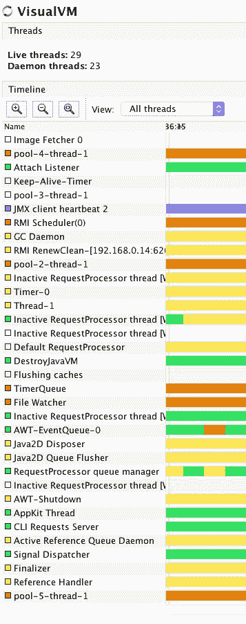

# 第五章：扩展游戏 - 并行运行，更快运行

在本章中，我们将扩展 Mastermind 游戏。现在，它不仅可以猜测隐藏的秘密，还可以隐藏柱子。测试代码甚至可以同时做这两件事。它可以与自己玩游戏，只留下编程的乐趣。它不能利用我们今天在笔记本电脑和服务器上拥有的所有处理器。代码是同步运行的，并且只利用单个处理器核心。

我们将修改代码，扩展猜测算法，将猜测分割成子任务，并并行执行代码。在这个过程中，我们将熟悉 Java 并发编程。这将是一个巨大的主题，其中隐藏着许多细微的角落和陷阱。我们将深入研究最重要的细节，这将为你需要并发程序时提供一个坚实的基础。

由于游戏的结果与之前相同，只是更快，我们必须评估“更快”是什么意思。为了做到这一点，我们将利用 Java 9 中引入的新功能：微基准测试工具。

在本章中，我们将涵盖以下主题：

+   进程、线程和纤维的含义

+   Java 中的多线程

+   多线程编程的问题以及如何避免它们

+   锁定、同步和阻塞队列

+   微基准测试

# 如何使 Mastermind 并行化

旧算法是遍历所有可能的变体，并尝试找到一个与当前表格状态匹配的猜测。假设当前检查的猜测是秘密，我们是否会得到与表格上实际答案相同的答案？如果是，那么当前的猜测可以是秘密，它和其他任何猜测一样好。

一种更复杂的方法可以实现最小-最大算法（[`en.wikipedia.org/wiki/Minimax`](https://en.wikipedia.org/wiki/Minimax)）。这个算法不仅得到下一个可能的猜测，还考虑了所有可能的猜测，并选择那个最能缩短游戏结果的猜测。如果一个猜测在最坏情况下可以跟随三个更多的猜测，而另一个只有两个，那么最小-最大算法将选择后者。这对感兴趣的读者来说是一个很好的练习。在六种颜色和四个柱子的游戏中，最小-最大算法最多在 5 步内解决游戏。我们实现的那种简单算法也在 5 步内解决游戏。然而，我们不走那条路。

我们想要的不是只用一个处理器的游戏版本。你该如何将算法转换成并行算法呢？这个问题没有简单的答案。当你有一个算法时，你可以分析算法的计算部分，并尝试找出依赖关系。如果有一些计算 *B* 需要另一计算 *A* 的数据，而 *A* 是 *B* 的结果，那么很明显，*A* 只能在 *B* 准备好的时候执行。如果算法中有不依赖于其他部分结果的计算部分，那么它们可以并行执行。

例如，快速排序有两个主要任务：分区和排序两个部分。很明显，分区必须在开始排序两个已分区的部分之前完成。然而，两个部分的排序任务并不相互依赖，它们可以独立完成。你可以将它们分配给两个不同的处理器。一个会高兴地排序包含较小元素的分区；另一个则会处理较重、较大的元素。

如果你翻到第三章，*优化排序 - 使代码专业化*，我们在这里以非递归的方式实现了快速排序，你可以看到我们将排序任务安排到栈中，然后通过在 `while` 循环中从栈中获取元素来执行排序。我们本可以在循环的核心处直接执行排序，但我们可以将任务传递给异步线程来执行，然后返回去处理下一个等待的任务。我们只是不知道如何做。目前还不知道。这就是我们为什么在这里的原因。

处理器、线程和进程是复杂且抽象的概念，它们很难想象。不同的程序员有不同的技巧来想象并行处理和算法。我可以告诉你我是如何做的，但这并不能保证这对你也有效。其他人可能在心中有不同的技巧。实际上，当我写这段话的时候，我实际上从未告诉过任何人。这听起来可能有些幼稚，但无论如何，就这样吧。

当我想象算法时，我会想象人。一个处理器就是一个人。这有助于我克服这样一个事实：处理器可以在一秒钟内进行数十亿次的计算。我实际上想象一个穿着棕色西装的官僚在进行计算。当我为并行算法编写代码时，我会想象他们中的许多人在他们的办公桌后面工作。他们独自工作，不交谈。重要的是他们不互相交谈。他们非常正式。当需要信息交流时，他们会站起来，拿着写有内容的纸，把它带给对方。有时，他们需要纸来完成工作。然后他们会站起来，走到纸所在的地方，取回纸，回到他们的办公桌继续工作。当他们准备好时，他们会回去取回纸。如果他们需要纸时纸不在那里，他们会排队等待，直到有纸的人把纸带来。

它如何帮助理解“大师心智”游戏？

我想象一个负责猜测的老板。办公室墙上有一张表格，上面记录了之前的猜测和每行的结果。老板太懒了，不想想新的猜测，所以他把这个任务交给下级。当一个下级提出一个猜测时，老板会检查这个猜测是否有效。他不信任下级，如果猜测好，他会将其作为官方猜测，放在表格上，并附上结果。

下级将写在小便签上的猜测交给老板，并将它们放在老板桌子上的一个盒子里。老板时不时地看看盒子，如果有便签，他会拿走。如果盒子满了，一个下级想要放一张纸进去，他会停下来等待，直到老板至少拿走一张便签，这样盒子里就有空间放新的便签。如果下级排队将猜测放入盒子，他们都会等待他们的时间。

下级应该协调一致；否则，他们只会提出相同的猜测。每个下级都应该有一个猜测的间隔。例如，第一个应该检查从 1234 到 2134 的猜测，第二个应该检查从 2134 到 3124，以此类推，如果我们用数字表示颜色的话。

这个结构能行得通吗？常识告诉我们它应该可以。然而，在这个例子中，官僚主义者是隐喻，而隐喻并不精确。官僚主义者是人，即使他们看起来不像，也比线程或处理器多得多。他们有时会表现得极其奇怪，做一些正常人类不太经常做的事情。然而，如果这个隐喻能帮助我们想象并行算法是如何工作的，我们仍然可以使用它。

我们可以想象老板去度假了，他没有触摸桌子上堆积如山的纸张。我们可以想象一些工人比其他人生产结果要快得多。由于这只是想象，加速可以高达 1000 倍（想想时间流逝的视频）。想象这些情况可能有助于我们发现很少发生但可能引起问题的特殊行为。由于线程并行工作，许多时候微小的差异可能会极大地影响整体行为。

在某些早期版本中，当我编写并行 Mastermind 算法时，官僚们开始工作，在老板能够将任何猜测放在桌子上之前，他们已经填满了老板的盒子。由于桌子上没有猜测，官僚们只是简单地在他们间隔中找到所有可能的变化，这可能是一个好的猜测。老板通过并行助手的帮助一无所获；他们必须从所有可能的猜测中选择正确的，而猜测者只是闲置。

另一次，当老板正在将一个事先创建的猜测放在桌子上时，官僚们正在检查猜测与表格的一致性。有些官僚惊慌失措地说，如果有人在更改它，就不可能检查一个猜测与表格的一致性。更确切地说，在一个线程中执行的代码，当表格的`List`被修改时，抛出了`ConcurrentModificationException`。

另一次，我试图避免官僚们过于快速的工作，我限制了他们可以放置包含猜测的纸张的盒子的大小。当老板最终找到秘密，游戏结束时，老板告诉官僚们他们可以回家了。老板通过创建一张小纸条这样做：你可以回家了，把它放在官僚们的桌子上。官僚们做了什么？他们继续等待盒子有空间放纸条！（直到进程被终止。这在 Mac OS 和 Linux 上与在 Windows 的任务管理器中结束进程相当。）

这样的编码错误会发生，为了尽可能避免，我们必须至少做两件事。首先，我们必须理解 Java 多线程是如何工作的；其次，编写尽可能干净的代码。对于第二点，我们将进一步清理代码，然后我们将看看如何将之前描述的并行算法在 Java 中实现，在 JVM 上运行而不是利用官僚们。

# 重构

当我们完成上一章时，我们已经以优雅且完全面向对象的方式设计了 Mastermind 游戏的类，并且没有违反任何*OO*原则。是这样吗？荒谬。除了某些琐碎的例子外，没有代码不能变得更好看或更优秀。通常，当我们开发代码并完成编码时，它看起来很棒。它运行正常，所有测试都通过了，文档也准备好了。从专业角度来看，这真的很完美。嗯，已经足够好了。我们还没有测试的大问题是可维护性。改变代码的成本是多少？

这不是一个容易的问题，尤其是因为它不是确定的。改变到什么程度？要对代码进行什么样的修改？当我们最初创建代码时，我们并不知道这一点。如果修改是为了修复一个错误，那么很明显，我们事先并不知道。如果我们知道，我们最初就不会引入这个错误。如果是新功能，那么有可能这个功能是事先预见的。然而，通常情况下并非如此。当开发者试图预测未来，以及程序将需要的未来功能时，他们通常都会失败。了解业务是客户的责任。在专业软件开发中，所需的功能是由业务驱动的。毕竟，这就是专业意味着什么。

即使我们并不确切知道代码的哪个部分需要稍后进行修改，但有些事情可能会给经验丰富的软件开发者提供线索。通常，面向对象的代码比临时编写的代码更容易维护，并且可以识别出代码的某些“异味”。例如，看看下面的代码行：

```java
while (guesser.guess() != Row.none) { 
    while (guesser.nextGuess() != Guesser.none) { 
        public void addNewGuess(Row row) { 
            Color[] guess = super.nextGuess();

```

我们可能察觉到某种奇怪气味的存在。（每一行都包含在我们在第四章，“思维大师 - 创建游戏”中完成的应用代码中。）`guess`方法的返回值与`Row.none`进行比较，`Row.none`是一个`Row`。然后，我们将`nextGuess`的返回值与`Guesser.none`进行比较，`Guesser.none`应该是一个`Guesser`。当我们向某个东西添加一个新的猜测时，我们实际上是在添加一个`Row`。最后，我们可以意识到`nextGuess`返回的猜测不是一个具有自己声明类的对象。一个`guess`只是一个颜色数组。

我们是否应该引入另一层抽象，创建一个`Guess`类？这将使代码更易于维护吗？还是只会使代码更复杂？通常情况下，代码行数越少，出现错误的可能性就越小。然而，有时缺乏抽象会使代码变得复杂和混乱。在这种情况下是什么情况？我们如何一般性地决定？

你的经验越多，你通过查看代码和敏锐地知道你想要进行的修改就越容易。很多时候，你不会费心使代码更加抽象，而在许多其他时候，你会毫不犹豫地创建新的类。当有疑问时，创建新的类并看看结果。重要的是不要破坏已经存在的功能。你只能在你有足够的单元测试的情况下做到这一点。

当你想引入一些新的功能或修复一个错误，但代码不合适时，你将不得不先修改它。当你修改代码而不改变功能的过程时，这个过程被称为**重构**。你在一个有限的时间内修改代码的一小部分，然后构建它。如果它能编译并且所有单元测试都运行，那么你可以继续。提示是经常运行构建。这就像在现有道路附近修建一条新道路。每隔几英里，你应该遇到旧线路。如果没有这样做，你最终会在沙漠的中间某个地方，完全错误的方向，而你唯一能做的就是回到起点——你旧的重构代码。这是徒劳的。

不仅安全性建议我们经常运行构建，还有时间限制。重构不会直接带来收入。程序的功能直接与收入挂钩。没有人会为我们无限期的重构工作付费。重构必须在某时停止，这通常不是没有更多重构要做的时候。代码永远不会完美，但你可以在它足够好的时候停止。而且，很多时候，程序员永远不会对代码的质量感到满意，当被某些外部因素（通常称为项目经理）阻止时，代码应该能编译，测试应该能运行，以便在实际代码库上执行新功能和错误修复。

重构是一个非常大的主题，在进行这样的活动时可以遵循许多技术。它如此复杂，以至于有一整本书是关于它的，由马丁·福勒所著([`martinfowler.com/books/refactoring.html`](http://martinfowler.com/books/refactoring.html))。

在我们的情况下，我们想要应用到我们的代码中的修改是实现一个并行算法。我们首先将修改的是`ColorManager`。当我们想在终端上打印猜测和行时，我们必须实现一些糟糕的技巧。为什么不有可以打印的颜色实现呢？我们可以有一个扩展原始`Color`类并具有返回表示该颜色的方法的类。你有没有为这个方法想出一个候选名称？它是`toString`方法。它在`Object`类中实现，并且任何类都可以自由地覆盖它。当你将一个对象连接到一个字符串时，自动类型转换将调用此方法将对象转换为`String`。顺便说一句，使用`""+object`而不是`object.toString()`来避免`null`指针异常是一个老技巧。不言而喻，我们不使用技巧。`toString`方法也会在 IDEs 调用调试器显示某些对象的值时被调用，因此通常建议实现`toString`，即使不是为了别的，也是为了简化开发。如果我们有一个实现了`toString`的`Color`类，那么`PrettyPrintRow`类就变得相当直接，技巧也更少：

```java
package packt.java9.by.example.mastermind; 

 public class PrettyPrintRow { 

     public static String pprint(Row row) { 
         String string = ""; 
         PrintableRow pRow = new PrintableRow(row); 
         for (int i = 0; i < pRow.nrOfColumns(); i++) { 
             string += pRow.pos(i); 
         } 
         string += " "; 
         string += pRow.full(); 
         string += "/"; 
         string += pRow.partial(); 
         return string; 
     } 
 }

```

我们已经从打印类中移除了问题，但你可能会争辩说问题仍然存在，你是对的。很多时候，当类设计有问题时，解决问题的方法是将问题从类移动到另一个类。如果问题仍然存在，那么你可能需要将设计分割得越来越细，到最后阶段，你将意识到你遇到的是一个问题而不是一个难题。

实现一个`LetteredColor`类也很直接：

```java
package packt.java9.by.example.mastermind.lettered; 

 import packt.java9.by.example.mastermind.Color; 

 public class LetteredColor extends Color { 

     private final String letter; 
     public LetteredColor(String letter){ 
         this.letter = letter; 
     } 

     @Override 
     public String toString(){ 
         return letter; 
     } 
 }

```

再次，问题被推向前。但在现实中，这并不是一个问题。这是一个面向对象的设计。打印不负责为颜色的表示分配`String`。颜色实现本身也不负责这一点。分配必须在颜色创建的地方进行，然后`String`必须传递给`LetteredColor`类的构造函数。`color`实例在`ColorManager`中创建，所以我们必须在`ColorManager`类中实现这一点。或者不是吗？`ColorManager`做什么？它创建颜色，...

当你来到一个列出功能的类的解释或描述时，你可能立即会看到**单一职责原则**被忽略了。"ColorManager"应该管理颜色。管理意味着提供一种方式以确定顺序获取颜色，并在已知一个颜色时获取下一个颜色。我们应该实现另一个职责——在单独的类中创建颜色。

只有一个功能来创建另一个类实例的类被称为工厂。这几乎和使用`new`操作符一样，但与`new`不同，工厂可以更加灵活地使用。我们马上就会看到。`ColorFactory`接口包含一个方法，如下所示：

```java
package packt.java9.by.example.mastermind; 

 public interface ColorFactory { 
     Color newColor(); 
 }

```

只定义了一个方法的接口被称为函数式接口，因为它们的实现可以作为 lambda 表达式在需要使用实现函数式接口的类的实例的对象的地方提供。`SimpleColorFactory`实现创建了以下`Color`对象：

```java
package packt.java9.by.example.mastermind; 

 public class SimpleColorFactory implements ColorFactory { 
     @Override 
     public Color newColor() { 
         return new Color(); 
     } 
 }

```

这非常类似于我们创建一个接口，然后创建一个实现，而不是在`ColorManager`的代码中直接写`new Color()`。`LetteredColorFactory`有点更有趣：

```java
package packt.java9.by.example.mastermind.lettered; 

 import packt.java9.by.example.mastermind.Color; 
 import packt.java9.by.example.mastermind.ColorFactory; 

 public class LetteredColorFactory implements ColorFactory { 

     private final String letters = "0123456789ABCDEFGHIJKLMNOPQRSTVWXYZabcdefghijklmnopqrstvwxzy"; 
     private int counter = 0; 

     @Override 
     public Color newColor() { 
         Color color = new LetteredColor(letters.substring(counter, counter + 1)); 
         counter++; 
         return color; 
     } 
 }

```

现在，这里我们有在创建`Color`对象时分配`String`的功能。非常重要的一点是，跟踪已创建颜色的`counter`变量不是`static`的。前一章中类似的变量是`static`的，这意味着它可能会因为新的`ColorManager`创建了太多的颜色而耗尽字符。实际上，在我执行单元测试时发生了这种情况，每个测试都创建了`ColorManager`和新的`Color`实例，而打印代码试图为新颜色分配新的字母。测试是在同一个 JVM 和同一个类加载器下运行的，不幸的`static`变量根本不知道它可以从零开始为新测试计数。缺点是，某处某人有责任实例化工厂，而这个责任不是`ColorManager`的。`ColorManager`已经有了责任，那就是不是创建颜色工厂。`ColorManager`必须在构造函数中获取`ColorFactory`：

```java
package packt.java9.by.example.mastermind; 

 import java.util.HashMap; 
 import java.util.List; 
 import java.util.Map; 

 public class ColorManager { 
     final protected int nrColors; 
     final protected Map<Color, Color> successor = new HashMap<>(); 
     private Color first; 
     private final ColorFactory factory; 

     public ColorManager(int nrColors, ColorFactory factory) { 
         this.nrColors = nrColors; 
         this.factory = factory; 
         createOrdering(); 
     } 

     private Color[] createColors() { 
         Color[] colors = new Color[nrColors]; 
         for (int i = 0; i < colors.length; i++) { 
             colors[i] = factory.newColor(); 
         } 
         return colors; 
     } 

     private void createOrdering() { 
         Color[] colors = createColors(); 
         first = colors[0]; 
         for (int i = 0; i < nrColors - 1; i++) { 
             successor.put(colors[i], colors[i + 1]); 
         } 
     } 

     public Color firstColor() { 
         return first; 
     } 

     public boolean thereIsNextColor(Color color) { 
         return successor.containsKey(color); 
     } 

     public Color nextColor(Color color) { 
         return successor.get(color); 
     } 

     public int getNrColors() { 
         return nrColors; 
     } 
 }

```

你可能也注意到，我无法抗拒将`createColors`方法重构为两个方法，以遵循单一责任原则。

现在，创建`ColorManager`的代码必须创建一个工厂并将其传递给构造函数。例如，单元测试的`ColorManagerTest`类将包含以下方法：

```java
@Test
 public void thereIsAFirstColor() { 
     ColorManager manager  
          = new ColorManager(NR_COLORS, Color::new); 
     Assert.assertNotNull(manager.firstColor()); 
 }

```

这是有史以来实现由函数式接口定义的工厂的最简单方式。只需命名类并创建一个方法引用，就像使用`new`操作符一样引用它。

接下来，我们将重构`Guess`类，实际上，我们之前还没有这个类。`Guess`类包含猜测的针，可以计算完全匹配（颜色和位置）和部分匹配（颜色存在但位置错误）的数量，还可以计算在此猜测之后的下一个`Guess`。到目前为止，这个功能是在`Guesser`类中实现的，但这并不是我们在检查表格上已经做出的猜测时选择猜测的方式的功能。如果我们遵循为颜色设定的模式，我们可以在一个名为`GuessManager`的单独类中实现这个功能，但到目前为止，它不是必需的。再次强调，这不是非黑即白。

重要的是要注意，`Guess`对象只能创建一次。如果它在桌子上，玩家不允许更改它。如果我们有一个尚未放在桌子上的`Guess`，它仍然只是一个由珠子的颜色和顺序标识的`Guess`。`Guess`对象在创建后永远不会改变。这样的对象在多线程程序中很容易使用，被称为不可变对象：

```java
package packt.java9.by.example.mastermind; 

 import java.util.Arrays; 
 import java.util.HashSet; 
 import java.util.Set; 

 public class Guess { 
     final static public Guess none = new Guess(new Color[0]); 
     final private Color[] colors; 
     private boolean uniquenessWasNotCalculated = true; 
     private boolean unique; 

     public Guess(Color[] colors) { 
         this.colors = Arrays.copyOf(colors, colors.length); 
     }

```

构造函数正在创建传递的颜色数组的副本。由于`Guess`是不可变的，这非常重要。如果我们只是保留原始数组，任何在`Guess`类之外的代码都可以改变数组的元素，本质上改变了不应该改变的内容：

```java
public Color getColor(int i) { 
         return colors[i]; 
     } 

     public int nrOfColumns() { 
         return colors.length; 
     } 

     /** 
      * Calculate the next guess and return a new Guess object. 
      * The guesses are ordered in the order of the colors as 
      * specified by the color manager. 
      * 
      * @param manager that specifies the order of the colors 
      *                can return the next color after one color. 
      * @return the guess that comes after this guess. 
      */ 
     public Guess nextGuess(ColorManager manager) { 
         final Color[] colors = Arrays.copyOf( 
                                     this.colors, nrOfColumns()); 

         int i = 0; 
         boolean guessFound = false; 
         while (i < colors.length && !guessFound) { 
             if (manager.thereIsNextColor(getColor(i))) { 
                 colors[i] = manager.nextColor(colors[i]); 
                 guessFound = true; 
             } else { 
                 colors[i] = manager.firstColor(); 
                 i++; 
             } 
         } 
         if (guessFound) { 
             return new Guess(colors); 
         } else { 
             return Guess.none; 
         } 
     }

```

在这个方法中，我们从实际对象中包含的颜色数组开始计算下一个`Guess`。我们需要一个可修改的工作数组，所以我们将复制原始数组。这次，新的最终对象可以使用我们在计算期间使用的数组，因此需要一个不创建副本的单独构造函数。这可能需要额外的代码，但我们应该考虑只在看到这是代码瓶颈且我们对实际性能不满意时才这么做。

下一个方法只是检查传递的`Guess`是否有与实际相同的颜色数量。这只是下一个两个计算匹配的方法使用的一个安全检查：

```java
private void assertCompatibility(Guess guess) { 
         if (nrOfColumns() != guess.nrOfColumns()) { 
             throw new IllegalArgumentException("Cannot compare different length guesses"); 
         } 
     } 

     /** 
      * Count the number of colors that are present on the guess 
      * but not on the pos where they are in the other guess. 
      * If the same color is on multiple pos it is counted 
      * for each pos once. For example the secret is 
      * <pre> 
      *     RGRB 
      * </pre> 
      * and the guess is 
      * <pre> 
      *     YRPR 
      * </pre> 
      * then this method will return 2\. 
      * 
      * @param guess is the actual guess that we evaluate 
      * @return the number of good colors not in pos 
      */ 
     public int nrOfPartialMatches(Guess guess) { 
         assertCompatibility(guess); 
         int count = 0; 
         for (int i = 0; i < nrOfColumns(); i++) { 
             for (int j = 0; j < nrOfColumns(); j++) { 
                 if (i != j && 
                         guess.getColor(i) == this.getColor(j)) { 
                     count++; 
                 } 
             } 
         } 
         return count; 
     } 

     /** 
      * Count the number of colors that are correct and are in pos. 
      * 
      * @param guess is the actual guess that we evaluate 
      * @return the number of colors that match in pos 
      */ 
     public int nrOfFullMatches(Guess guess) { 
         assertCompatibility(guess); 
         int count = 0; 
         for (int i = 0; i < nrOfColumns(); i++) { 
             if (guess.getColor(i) == this.getColor(i)) { 
                 count++; 
             } 
         } 
         return count; 
     }

```

`isUnique`方法检查`Guess`中是否有任何颜色出现超过一次。由于`Guess`是不可变的，所以`Guess`可能在某个时间点是唯一的，而在另一个时间点不是唯一的。这个方法应该在每次被特定对象调用时都返回相同的结果。正因为如此，才有可能缓存结果。这个方法就是这样做的，将返回值保存到一个实例变量中。

你可能会说这是过早优化。是的，确实是。我决定这么做的一个原因是示范，基于这个，你可以尝试修改`nextGuess`方法来做到同样的事情：

```java
     /** 
      * @return true if the guess does not 
      *         contain any color more than once 
      */ 
     public boolean isUnique() { 
         if (uniquenessWasNotCalculated) { 
             final Set<Color> alreadyPresent = new HashSet<>(); 
             unique = true; 
             for (Color color : colors) { 
                 if (alreadyPresent.contains(color)) { 
                     unique = false; 
                     break; 
                 } 
                 alreadyPresent.add(color); 
             } 
             uniquenessWasNotCalculated = false; 
         } 
         return unique; 
     }

```

对于返回相同结果的方法，我们称之为幂等。如果该方法被多次调用且计算使用了大量资源，缓存返回值可能非常重要。当方法有参数时，结果缓存并不简单。对象方法必须记住所有已计算过的参数的结果，并且这种存储必须有效。如果查找存储结果所需的资源比计算它所需的资源还多，那么使用缓存不仅会使用更多内存，还会减慢程序的速度。如果在对象的整个生命周期中调用该方法多次，那么存储内存可能会变得过大。一些元素必须被清除——那些未来不再需要的元素。然而，我们无法知道缓存中哪些元素是不需要的，所以我们将不得不猜测。

正如你所见，缓存可以迅速变得复杂，为了专业地完成这项工作，几乎总是更好的使用一些现成的缓存实现。我们这里使用的缓存只是冰山一角。或者，甚至可以说只是阳光一瞥。

类的其余部分相当标准，这是我们之前详细讨论过的——一个很好的知识检查是理解`equals`、`hashCode`和`toString`方法是如何这样实现的。我实现了`toString`方法来帮助我在调试期间，但它也被用于以下示例输出中：

```java
     @Override 
     public boolean equals(Object other) { 
         if (this == other) return true; 
         if (other == null || !(other instanceof Guess)) 
                                               return false; 
         Guess guess = (Guess) other; 
         return Arrays.equals(colors, guess.colors); 
     } 

     @Override 
     public int hashCode() { 
         return Arrays.hashCode(colors); 
     } 

     @Override 
     public String toString() { 
         if (this == none) { 
             return "none"; 
         } else { 
             String s = ""; 
             for (int i = colors.length - 1; i >= 0; i--) { 
                 s += colors[i]; 
             } 
             return s; 
         } 
     } 
 }

```

这主要是我开发并行算法时需要的修改。现在，代码相当更新，描述的重点是本章的主要主题：如何在 Java 中并行执行代码。

Java 中的代码并行执行是通过线程来完成的。你可能知道 Java 运行时中有一个`Thread`对象，但如果不理解计算机中的线程是什么，那么这毫无意义。在接下来的小节中，我们将学习这些线程是什么，如何启动一个新的线程，如何同步线程间的数据交换，最后将所有这些整合起来并实现 Mastermind 并行猜测算法。

# 进程

当你启动你的计算机时，启动的程序是**操作系统**（**OS**）。操作系统控制机器硬件以及你可以在机器上运行的程序。当你启动一个程序时，操作系统会创建一个新的进程。这意味着操作系统在它管理进程的表中（数组）分配一个新的条目，并填写它所知道以及需要知道的关于进程的参数。例如，它会注册进程允许使用的内存段，进程的 ID，以及哪个用户从哪个其他进程启动。你不能凭空启动一个进程。当你双击一个 EXE 文件时，你实际上是在告诉文件浏览器，这是一个作为进程运行的程序，让它作为一个单独的进程启动 EXE 文件。浏览器通过某些 API 调用系统，并友好地请求操作系统这样做。操作系统会将浏览器进程注册为新进程的父进程。操作系统实际上并没有启动进程，而是创建了启动进程所需的所有数据，当有可用的 CPU 资源时，进程就会被启动，然后很快就会暂停。你不会注意到这一点，因为操作系统会不断地重新启动它，并反复暂停进程。它需要这样做，以便为所有进程提供运行的可能性。这样，我们体验到的所有进程都是同时运行的。实际上，在单个处理器上，进程并不是同时运行的，但它们会得到运行的时间槽。

如果机器中有多于一个 CPU，那么进程可以真正地同时运行，CPU 的数量有多少，进程就可以同时运行多少。随着技术的不断进步，现在的台式电脑中包含的 CPU 拥有多个核心，这些核心几乎可以像独立的 CPU 一样工作。在我的机器上，我有四个核心，每个核心可以同时执行两个线程；因此，我的 Mac 几乎就像一个 8CPU 的机器。

进程有各自的内存。它们被允许使用内存的一部分，如果一个进程试图使用不属于它的另一部分内存，处理器将停止这样做。操作系统将杀死该进程。

想象一下，原始 UNIX 的开发者给停止进程的程序命名为“kill”，停止进程被称为“杀死”，这就像中世纪时代他们砍掉罪犯的手一样。你触摸了内存的错误部分，就会被“杀死”。我不想成为一个进程。

操作系统对内存的处理非常复杂，除了将进程彼此分离之外。当内存不足时，操作系统会将部分内存写入磁盘，从而释放内存，并在需要时再次加载这部分内存。这是一个非常复杂、低级实现且高度优化的算法，这是操作系统的责任。

# 线程

当我说操作系统在时间槽中执行进程时，我并不是完全精确的。每个进程都有一个或多个线程，线程被执行。线程是外部调度器管理的最小执行单元。较老的操作系统没有线程的概念，它们只执行进程。实际上，最早的线程实现只是共享内存的进程的复制。

你可能会听到术语“轻量级进程”——这意味着线程。

重要的是，线程没有自己的内存。它们使用进程的内存。换句话说，在同一个进程中运行的线程对相同的内存段有未区分的访问权限。这是实现利用机器中多个核心的并行算法的极其强大的可能性，但同时也可能导致错误。



假设有两个线程增加同一个长整型变量。增加操作首先计算低 32 位的增加值，然后是高 32 位（如果有溢出位）。这些是可能被操作系统中断的两个或多个步骤。可能发生的情况是，一个线程增加了低 32 位，记得需要对高 32 位进行一些操作，开始计算，但在它被中断之前没有时间存储结果。然后，另一个线程增加了低 32 位，高 32 位，而第一个线程只是保存了它计算出的高 32 位。结果变得混乱。在旧的 32 位 Java 实现中，演示这种效果非常容易。在 64 位 Java 实现中，所有 64 位都一次性加载到寄存器中，并一次性保存回内存，因此演示多线程问题并不那么容易，但这并不意味着没有。

当一个线程被暂停而另一个线程被启动时，操作系统必须执行上下文切换。这意味着，在其他事情中，CPU 寄存器必须被保存，然后设置为其他线程应有的值。上下文切换始终保存线程的状态，并将之前保存的线程状态加载到要启动的线程中。这是在 CPU 寄存器级别上。这种上下文切换是耗时的；因此，执行的上下文切换越多，用于线程管理的 CPU 资源就越多，而不是让它们运行。另一方面，如果切换不够，一些线程可能得不到足够的时间片来执行，程序可能会挂起。

# 纤程

Java 没有纤程，但既然有一些库支持纤程处理，那么提一下也是有价值的。纤程是一个比线程更细小的单位。在一个线程中执行的程序代码可以决定放弃执行并告诉纤程管理器去执行其他纤程。这有什么意义，为什么它比使用另一个线程更好呢？原因在于这种方式，纤程可以避免部分上下文切换。上下文切换无法完全避免，因为开始执行它的不同部分的代码可能会以完全不同的方式使用 CPU 寄存器。由于它们是同一个线程，上下文切换不是操作系统的任务，而是应用程序的任务。

操作系统不知道寄存器的值是否被使用。寄存器中有位，仅通过查看处理器状态，没有人能说出这些位是否与当前代码执行相关，或者只是偶然以这种方式存在。编译器生成的程序知道哪些寄存器是重要的，哪些可以忽略。这些信息在代码的不同位置会变化，但当需要切换时，纤程会将需要在该点切换的信息传递给执行切换的代码。

编译器计算这些信息，但 Java 当前版本不支持纤程。在编译阶段之后，实现纤程的工具会分析和修改类的字节码来完成这项工作。

Go 语言的 goroutines 是纤程，这就是为什么在 Go 中可以轻松启动成千上万的 goroutines，但最好将 Java 中的线程数量限制在一个较低的数字。它们不是同一件事。

由于轻量级进程这个术语正在逐渐消失，并且越来越少地用于纤程，因此很多时候被称为轻量级线程。

# `java.lang.Thread`

由于 Java（几乎）中的所有东西都是对象，如果我们想启动一个新的线程，我们需要一个表示线程的类。这个类是内置在 JDK 中的`java.lang.Thread`。当你启动 Java 代码时，JVM 会自动创建几个`Thread`对象，并使用它们来运行它需要的不同任务。如果你启动**VisualVM**，你可以选择任何 JVM 进程的“线程”标签，并查看 JVM 中实际存在的线程。例如，我启动的 VisualVM 有 29 个活跃的线程。其中一个是名为`main`的线程。这就是开始执行`main`方法的线程（惊喜！）。`main`线程启动了大多数其他线程。当我们想要编写一个多线程应用程序时，我们必须创建新的`Thread`对象并启动它们。最简单的方法是`new Thread()`，然后在线程上调用`start`方法。它将启动一个新的线程，但由于我们没有给它分配任何任务，所以这个线程将立即结束。`Thread`类，正如它在 JDK 中一样，并不执行我们的业务逻辑。以下有两种指定业务逻辑的方法：

+   创建一个实现`Runnable`接口的类

+   创建一个扩展`Thread`类并重写`run`方法的类

以下代码块是一个非常简单的演示程序：

```java
public class ThreadIntermingling { 
     static class MyThread extends Thread { 
         private final String name; 
         MyThread(String name){ 
             this.name = name; 
         } 
         @Override 
         public void run(){ 
             for(int i = 1 ; i < 1000 ; i ++ ){ 
                 System.out.print(name + " " + i+ ", "); 
             } 
         } 
     } 
     public static void main(String[] args){ 
         Thread t1 = new MyThread("t1"); 
         Thread t2 = new MyThread("t2"); 
         t1.start(); 
         t2.start(); 
         System.out.print("started "); 

     } 
 }

```

上述代码创建了两个线程并依次启动它们。当调用`start`方法时，它将线程对象调度为执行，然后返回。因此，新线程将很快异步开始执行，而调用线程继续执行。在以下示例中，这两个线程以及`main`线程是并行运行的，并创建了一个类似以下输出的结果：

```java
started t2 1, t2 2, t2 3, t2 4, t2 5, t2 6, t2 7, t2 8, t1 1, t2 9, t2 10, t2 11, t2 12,...

```

实际输出每次运行都会变化。没有执行顺序或线程如何访问单个屏幕输出的确定顺序。甚至不能保证在每次执行中，`started`消息都会在任何一个线程消息之前打印出来。

为了更好地理解这一点，我们需要查看线程的状态图。Java 线程可以处于以下状态之一：

+   `NEW`

+   `RUNNABLE`

+   `BLOCKED`

+   `WAITING`

+   `TIMED_WAITING`

+   `TERMINATED`

这些状态在`enumThread.State`中定义。当你创建一个新的线程对象时，它处于`NEW`状态。在这个时候，线程并没有什么特别之处，它仅仅是一个对象，但操作系统的执行调度并不知道它。从某种意义上说，它只是 JVM 分配的一块内存。

当调用 start 方法时，线程的信息被传递给操作系统，操作系统调度线程，以便在适当的时间槽中由它执行。这样做是一种资源丰富的行为，这也是为什么我们不会仅在需要时创建和，尤其是启动新的 Thread 对象。相反，我们将保留现有的线程一段时间，即使它们目前不需要，如果有一个合适的线程，我们将重用现有的一个。

当操作系统调度并执行线程时，线程在 OS 中也可以处于运行状态以及可运行状态。Java JDK API 没有在这两者之间进行区分，这是有充分理由的。这样做是没有用的。当线程处于`RUNNABLE`状态并询问它是否实际上正在运行时，它将得到一个明显的答案：如果代码刚刚从`Thread`类中实现的`getState`方法返回，那么它正在运行。如果没有运行，它最初就不会从调用中返回。如果`getState`方法是从另一个线程调用的，那么在方法返回时关于其他线程的结果将是没有意义的。操作系统可能在此之前已经停止或启动了查询的线程几次。

当线程中正在执行的代码试图访问当前不可用的资源时，线程处于`BLOCKED`状态。为了避免对资源的持续轮询，操作系统提供了一个有效的通知机制，以便当线程需要的资源变得可用时，线程能够回到`RUNNABLE`状态。

当线程等待其他线程或锁时，它处于`WAIT`或`TIMED_WAITING`状态。`TIMED_WAITING`是等待开始调用具有超时版本的方法的状态。

最后，当线程完成其执行时，会达到`TERMINATED`状态。如果你将以下几行代码添加到我们之前的示例末尾，那么你会得到一个`TERMINATED`的输出，并且屏幕上还会抛出一个异常，抱怨非法的线程状态，这是因为你不能启动一个已经终止的线程：

```java
System.out.println(); 
System.out.println(t1.getState()); 
System.out.println(); 
t1.start();

```

我们不是通过扩展`Thread`类来定义异步执行的内容，而是可以创建一个实现`Runnable`接口的类。这样做更符合面向对象编程的方法。我们在类中实现的东西不是线程的功能。它更像是可以执行的东西。它是一种可以简单运行的东西。

如果这个执行是在不同的线程中异步进行的，或者它是在调用 run 方法的同一个线程中执行的，这是一个需要单独考虑的不同问题。如果我们那样做，我们可以将类作为构造函数参数传递给`Thread`对象。在`Thread`对象上调用`start`将启动我们传递的对象的 run 方法。这不是我们的收获。收获在于我们还可以将`Runnable`对象传递给一个`Executor`（名字听起来很糟糕，嗯！）。`Executor`是一个接口，它以高效的方式在`Thread`s 中执行`Runnable`（以及稍后将要提到的`Callable`）对象。`Executors`通常有一个准备好的`Thread`对象池，它们处于`BLOCKED`状态。当`Executor`有一个新的任务要执行时，它会将其分配给一个`Thread`对象，并释放阻塞线程的锁。`Thread`进入`RUNNABLE`状态，执行`Runnable`，然后再次被阻塞。它不会终止，因此可以稍后重新用于执行另一个`Runnable`。这样，`Executor`s 避免了将线程注册到操作系统的资源消耗过程。

专业应用程序代码永远不会创建一个新的`Thread`。应用程序代码使用某些框架来处理代码的并行执行，或者使用由某些`ExecutorService`提供的`Executor`s 来启动`Runnable`或`Callable`对象。

# 陷阱

我们已经讨论了许多在开发并行程序时可能遇到的问题。在本节中，我们将使用通常用于描述这些问题的术语来总结它们。术语不仅有趣，而且在与同事交谈时，为了轻松理解彼此，它也很重要。

# 死锁

死锁是并行编程中最臭名昭著的陷阱，因此，我们将从这里开始。为了描述这种情况，我们将遵循官僚主义的隐喻。

官僚必须在他手中的文件上盖章。为了做到这一点，他需要印章，也需要墨盒。首先，他走到放印章的抽屉那里，把它拿走。然后，他走到放墨盒的抽屉那里，拿走墨盒。他给印章上墨，按在纸上。然后，他把印章放回原位，然后把墨盒放回原位。一切都很完美，我们正处在天堂里。

如果另一个官僚先拿墨盒，然后拿印章，会发生什么？他们可能很快就会变成一个拿着印章等待墨盒的官僚，另一个拿着墨盒等待印章的官僚。而且，他们可能就这样僵在那里，永远冻结，然后越来越多的人开始等待这些锁，文件永远不会被盖章，整个系统陷入无政府状态。

为了避免这种情况，锁必须按顺序排列，并且应该始终按顺序获取锁。在先前的例子中，简单的协议是首先获取墨垫，然后是邮票，这解决了问题。任何获取邮票的线程都可以确信墨垫是空闲的或很快就会空闲。

# 竞态条件

当计算的结果可能基于不同并行运行的线程的速度和 CPU 访问时，我们谈论竞态条件。让我们看看以下两行代码：

```java
    void method1(){ 
1       a = b; 
2       b = a+1; 
        } 
    void method2(){ 
3       c = b; 
4       b = c+2; 
        }

```

如果在执行开始时`b`的值为 0，并且两个不同的线程执行这两个方法，那么行的顺序可以是 1234、1324、1342、3412、3142 或 3142。四个行的任何执行顺序都可能发生，这保证了 1 在 2 之前运行，3 在 4 之前运行，但没有其他限制。结果，`b`的值在段执行结束时为 1 或 2，这可能不是我们在编码时想要的，也不太好。

注意，并行 Mastermind 游戏的实现也有类似的情况。实际的猜测很大程度上取决于不同线程的速度，但从最终结果的角度来看，这是无关紧要的。我们可能在不同的运行中有不同的猜测，这样算法就不是确定性的，但我们保证能找到最终解决方案。

# 过度使用的锁

在许多情况下，可能会发生线程正在等待一个锁，该锁保护资源免受并发访问。如果资源不能被多个线程同时使用，并且有比可以服务的线程更多的线程，那么这些线程就会处于饥饿状态。然而，在许多情况下，资源可以被组织成一种方式，使得线程可以访问资源提供的一些服务，并且锁定结构可以不那么限制性。在这种情况下，锁被过度使用，并且可以通过为线程分配更多资源来修复这种情况。可能可以使用多个锁来控制对资源不同功能的访问。

# 饥饿

饥饿是当多个线程等待一个资源，试图获取一个锁，而一些线程只有在经过极长时间或永远之后才能获取到锁的情况。当锁被释放并且有线程等待它时，其中一个线程可以获取到锁。通常没有保证如果线程等待足够长的时间，它就能获取到锁。这种机制需要大量管理线程，对等待队列中的线程进行排序。由于锁定应该是低延迟和高性能的操作，即使是几个 CPU 时钟周期也是重要的；因此，锁默认不提供这种公平访问。如果锁只有一个线程等待，不浪费时间在线程调度中的公平性是一个好方法。锁的主要目标不是调度等待的线程，而是防止对资源的并行访问。

这就像在商店里。如果有人在收银台，你就得等。这是一个隐含的锁。如果人们不排队等待收银，只要几乎总是有一个空闲的收银台，那就没问题。然而，当收银台前有多个队伍时，如果没有排队和等待的顺序，肯定会给那些慢吞吞地到达收银台的人带来非常长的等待时间。通常，公平性和创建等待线程（顾客）的队列的解决方案并不是一个好的解决方案。好的解决方案是消除导致等待队列的情况。你可以增加收银员，或者你可以做一些完全不同的事情，以减少高峰负载。在商店里，你可以给在非高峰时段来店的顾客打折。在编程中，可以应用几种技术，通常，这取决于我们实际编写的业务代码和锁的公平调度，通常是一个解决方案。

# ExecutorService

`ExecutorService` 是 JDK 中的一个接口。该接口的实现可以以异步方式执行 `Runnable` 或 `Callable` 类。该接口仅定义了实现该接口的 API，并不要求调用必须是异步的，但实际上，这是实现此类服务的主要点。以同步方式调用 `Runnable` 接口的 `run` 方法仅仅是调用一个方法。我们不需要为这个目的创建一个特殊的类。

`Runnable` 接口定义了一个 `run` 方法。它没有参数，不返回任何值，也不抛出任何异常。`Callable` 接口是参数化的，它定义的唯一方法 `call` 没有参数，但返回一个泛型值，并且可能抛出 `Exception`。在我们的代码中，如果我们只想运行某些东西，我们将实现 `Runnable`，如果我们想返回某些东西，我们将实现 `Callable`。这两个接口都是函数式接口，因此，它们是使用 lambda 实现的好候选。

要有一个 `ExecutorService` 实现的实例，我们可以使用实用工具类 `Executors`。很多时候，当 JDK 中有一个 `XYZ` 接口时，可能有一个 `XYZs`（复数）实用工具类，它为该接口的实现提供工厂。如果我们想多次启动 `t1` 任务，我们可以这样做，而不需要创建一个新的 `Thread`。我们应该使用以下执行服务：

```java
public class ThreadIntermingling { 
      static class MyThread implements Runnable { 
          private final String name; 

          MyThread(String name) { 
              this.name = name; 
          } 

          @Override 
          public void run() { 
              for (int i = 1; i < 1000; i++) { 
                  System.out.print(name + " " + i + ", "); 
              } 
          } 
      } 
      public static void main(String[] args) 
                throws InterruptedException, ExecutionException { 
          ExecutorService es = Executors.newFixedThreadPool(2); 
          Runnable t1 = new MyThread("t1"); 
          Runnable t2 = new MyThread("t2"); 
          Future<?> f1 = es.submit(t1); 
          Future<?> f2 = es.submit(t2); 
          System.out.print("started "); 
          f1.get(); 
          f2.get(); 
          System.out.println(); 
          f1 = es.submit(t1); 
          es.shutdown(); 
      } 
  }

```

这次，我们没有遇到任何异常。相反，`t1`任务运行了第二次。在这个例子中，我们使用了一个固定大小的线程池，它包含两个`Thread`。由于我们只想同时启动两个线程，所以这已经足够了。有一些实现会动态地增加和减少池的大小。当我们想要限制线程的数量或者从其他信息源得知预先线程的数量时，应该使用固定大小的池。在这种情况下，将池的大小改为一个，并观察在这种情况下第二个任务不会启动，直到第一个任务完成，这是一个很好的实验。服务将不会有另一个线程用于`t2`，它必须等待池中唯一的`Thread`被释放。

当我们将任务提交给服务时，即使任务当前无法执行，它也会返回。任务被放入队列中，一旦有足够的资源启动它们，就会开始执行。`submit`方法返回一个`Future`对象，正如我们在前面的示例中所看到的。

这就像一张服务票。你把你的车带到维修技师那里，你得到一张票。你不需要在那里一直等到车修好，但任何时候你都可以询问车是否准备好了。你所需要的只是这张票。你也可以决定等到车修好。一个`Future`对象也是这样。你不会得到你需要的值。它将异步计算。然而，有一个`Future`承诺它将会在那里，你需要访问所需对象的票就是`Future`对象。

当你有一个`Future`对象时，你可以调用`isDone`方法来查看它是否已经准备好。你可以开始等待它，用或不用超时调用`get`，你也可以取消正在执行的任务，但在这种情况下，结果可能是可疑的。就像，在你的车的情况下，如果你决定取消任务，你可能会得到一辆发动机被拆解的车。同样，取消一个没有为此准备的任务可能会导致资源损失，打开且无法访问的数据库连接（这是我的一个痛苦记忆，即使是在 10 年后），或者只是一个混乱的无法使用的对象。为取消任务做好准备，或者不要取消它们。

在前面的例子中，`Future`没有返回值，因为我们提交了一个`Runnable`对象而不是`Callable`对象。在这种情况下，传递给`Future`的值不应该被使用。它通常是`null`，但这并不是可以依赖的。

许多开发者甚至包括我在内，在多年没有使用代码编写多线程 Java API 之后，常常会忽略的一个重要事情是关闭`ExecutorService`。`ExecutorService`被创建后，它包含`Thread`元素。当所有非守护线程都停止时，JVM 才会停止。没有到最后，胖女人还没有唱完。

如果一个线程在启动之前被设置为守护线程（调用`setDaemon(true)`），则该线程是一个守护线程。如果一个线程的启动线程是守护线程，则该线程自动成为守护线程。当所有其他线程完成并且 JVM 想要结束时，守护线程会被 JVM 停止。JVM 自己执行的某些线程是守护线程，但在应用程序程序中创建守护线程可能没有实际用途。

不关闭服务只是阻止 JVM 停止。在`main`方法完成后，代码将挂起。为了告诉`ExecutorService`它不需要它拥有的线程，我们必须`shutdown`服务。调用将仅启动关闭并立即返回。在这种情况下，我们不想等待。JVM 无论如何都会这样做。如果我们需要等待，我们必须调用`awaitTermination`。

# ForkJoinPool

`ForkJoinPool`是一个特殊的`ExecutorService`，它有执行`ForkJoinTask`对象的方法。当我们要执行的任务可以分解成许多小任务，然后当结果可用时聚合时，这些类非常有用。使用此执行器，我们不需要关心线程池的大小和关闭执行器。线程池的大小调整到给定机器上的处理器数量以获得最佳性能。由于`ForkJoinPool`是一个为短运行任务设计的特殊`ExecutorService`，它不期望有任何任务在任务运行完毕后仍然存在或被需要。因此，它作为守护线程执行；当 JVM 关闭时，`ForkJoinPool`自动停止，女士不再唱歌。

要创建一个任务，程序员应该扩展`RecursiveTask`或`RecursiveAction`之一。第一个用于任务有返回值的情况，第二个用于没有计算值返回的情况。它们被称为递归的，因为很多时候，这些任务将它们必须解决的问题分解成更小的子问题，并通过 fork-join API 异步调用这些任务。

使用此 API 要解决的问题的一个典型问题是快速排序。在第三章，*优化排序 - 使代码专业化*中，我们创建了快速排序算法的两个版本。一个使用递归调用，另一个不使用。我们也可以创建一个新的版本，它不是通过递归调用自己，而是调度要执行的任务，可能由另一个处理器执行。调度是`ForkJoinPool`实现`ExecutorService`的任务。

你可以回顾第三章中的`Qsort.java`代码，*优化排序 - 使代码专业化*。这里使用`ForkJoinPool`的版本：

```java
public class FJQuickSort<E> { 
     final private Comparator<E> comparator; 
     final private Swapper swapper; 

     public FJQuickSort(Comparator<E> comparator, Swapper swapper){ 
         this.comparator = comparator; 
         this.swapper = swapper; 
     } 

     public void qsort(SortableCollection<E> sortable, 
                       int start, int end) { 
         ForkJoinPool pool = new ForkJoinPool(); 
         pool.invoke(new RASort(sortable,start,end)); 
     } 

     private class RASort extends RecursiveAction { 

         final SortableCollection<E> sortable; 
         final int start, end; 

         public RASort(SortableCollection<E> sortable, 
                       int start, int end) { 
             this.sortable = sortable; 
             this.start = start; 
             this.end = end; 
         } 

         public void compute() { 
             if (start < end) { 
                 final E pivot = sortable.get(start); 
                 final Partitioner<E> partitioner =  
                          new Partitioner<>(comparator, swapper); 
                 int cutIndex = partitioner.partition( 
                                    sortable, start, end, pivot); 
                 if (cutIndex == start) { 
                     cutIndex++; 
                 } 
                 RecursiveAction left =  
                    new RASort(sortable, start, cutIndex - 1); 
                 RecursiveAction right =  
                    new RASort(sortable, cutIndex, end); 
                 invokeAll(left,right); 
                 left.join(); 
                 right.join(); 
             } 
         } 
     }

```

每当你可以将任务分解成类似于前面快速排序示例中的子任务时，我建议你使用`ForkJoinPool`作为`ExecutorService`。你可以在 Oracle 的 JavaDoc 文档中找到关于 API 和使用的良好文档。

# 变量访问

现在我们能够启动线程并创建并行运行的代码，是时候稍微谈谈这些线程之间如何交换数据了。乍一看，这似乎相当简单。线程使用相同的共享内存；因此，它们都可以读取和写入 Java 访问保护允许它们读取和写入的所有变量。这是真的，除非某些线程可能只是决定不读取内存。毕竟，如果它们刚刚读取了某个变量的值，为什么还要从内存中再次读取到寄存器，如果它没有被修改？谁会修改它们？让我们看看以下简短的例子：

```java
package packt.java9.by.example.thread; 

 public class VolatileDemonstration implements Runnable { 
     private Object o = null; 
     private static final Object NON_NULL = new Object(); 
     @Override 
     public void run() { 
         while( o == null ); 
         System.out.println("o is not null"); 
     } 
     public static void main(String[] args) 
                            throws InterruptedException { 
         VolatileDemonstration me = new VolatileDemonstration(); 
         new Thread(me).start(); 
         Thread.sleep(1000); 
         me.o = NON_NULL; 
     } 
 }

```

会发生什么？你可能预期代码会启动，启动新线程，然后一分钟，当`main`线程将对象设置为非`null`时，它就会停止？不会的。

在某些 Java 实现中，它可能会停止，但在大多数情况下，它只是会继续旋转。这是因为 JIT 编译器优化了代码。它看到循环什么也没做，而且变量永远不会是非`null`的。它被允许假设这一点，因为未声明为`volatile`的变量不应该被任何其他线程修改，JIT 编译器有资格进行优化。如果我们声明`Object o`变量为`volatile`（使用`volatile`关键字），那么代码就会停止。

如果你尝试移除调用 sleep 的代码，代码也会停止。然而，这并不能解决问题。原因是 JIT 优化只在代码执行大约 5000 次循环之后才会启动。在此之前，代码会以原始方式运行，并在优化消除额外的、定期不需要访问的非`volatile`变量之前停止。

如果这听起来如此糟糕，那么我们为什么不将所有变量都声明为`volatile`呢？为什么 Java 不为我们这样做？答案是速度，为了更深入地理解它，我们将使用我们的比喻，办公室和官僚主义者。

# CPU 的心跳

这些天，CPU 运行在 2 到 4 GHz 频率的处理器上。这意味着处理器每秒会接收到 2 到 4 次 10⁹个时钟信号来执行某些操作。处理器无法以比这更快的速度执行任何原子操作，也没有理由创建一个比处理器能跟上的更快的时钟。这意味着 CPU 执行一个简单的操作，比如在半纳秒或四分之一纳秒内增加一个寄存器。这是处理器的心跳，如果我们把官僚主义者比作人类，那么他们的心跳相当于大约一秒钟。

处理器在芯片上有不同级别的寄存器和缓存，L1、L2，有时还有 L3；有内存、SSD、磁盘、网络和可能需要检索数据的磁带。

访问位于 L1 缓存中的数据大约需要 0.5 纳秒。你可以抓起你桌上的纸张——半秒钟。L2 缓存是 7 纳秒。这就像从抽屉里拿出一张纸。你必须把椅子稍微往后推，弯腰坐好，拉开抽屉，拿出纸张，把抽屉推回去，然后站起来把纸张放在桌子上；这大概需要 10 秒，上下浮动。

主内存读取需要 100 纳秒。官僚站起来，走向墙上的共享文件，他等待其他官僚取回或放回他们的文件，选择抽屉，拉开它，拿出纸张，然后走回桌子。这是两分钟。这是每次你在文档上写一个单词并需要执行两次的易失性变量访问。一次读取，一次写入，即使你碰巧知道你接下来要做的就是填写同一张纸上的另一个字段。

现代架构，其中没有多个 CPU，而是有多个核心的单个 CPU，要快一些。一个核心可能会检查另一个核心的缓存，看看是否有相同的变量被修改，但这将易失性访问速度加快到大约 20 纳秒，这仍然比非易失性慢一个数量级。

虽然其余部分不太关注多线程编程，但在这里提一下是值得的，因为它能让我们对不同时间尺度有更好的理解。

从 SSD（通常是 4K 块）读取数据需要 150,000 纳秒。以人类速度来计算，这相当于 5 天多。在网络上的 Gb 本地以太网上读取或发送数据到服务器需要 0.5 毫秒，这就像等待几乎一个月的象征性官僚。如果网络上的数据在旋转的磁盘中，那么寻址时间（直到磁盘旋转到磁表面的一部分到达读取头）会增加到 20 毫秒。在人类术语中，这大约是一年。

如果我们在互联网上通过大西洋发送一个网络数据包，它大约需要 150 毫秒。这就像 14 年一样，而这只是一个单一的数据包；如果我们想要通过海洋发送数据，可能就是几秒钟的时间，这可以追溯到历史时期，甚至几千年。如果我们把机器启动一分钟算作时间，那么它就相当于我们整个文明的时间跨度。

当我们想要了解 CPU 大部分时间在做什么时，我们应该考虑这些数字：它是在等待。此外，当你想到现实生活中官僚的速度时，这也帮助你冷静下来。实际上，他们并不那么慢，如果我们考虑到他们的心跳，这意味着他们有心脏的假设。然而，让我们回到现实生活，回到 CPU，以及 L1、L2 缓存和易失性变量。

# 易失性变量

让我们修改我们样本代码中`o`变量的声明如下：

```java
private volatile Object o = null;

```

前面的代码运行良好，大约一秒后停止。任何 Java 实现都必须保证多个线程可以访问`volatile`字段，并且字段的值是一致更新的。这并不意味着`volatile`声明将解决所有同步问题，但它保证了不同变量及其值变化关系的一致性。例如，让我们考虑我们在一个方法中递增以下两个字段：

```java
private volatile int i=0,j=0; 

 public void method(){ 
     i++; j++; 
 }

```

在前面的代码中，从另一个线程读取`i`和`j`永远不会导致`i>j`。如果没有`volatile`声明，编译器在需要时可以自由重新组织增量操作的执行，因此它不能保证异步线程读取一致值。

# 同步块

声明变量不是确保线程之间一致性的唯一工具。Java 语言中还有其他工具，其中之一就是`synchronized`块。`synchronized`关键字是语言的一部分，它可以用在方法或方法内部程序块的前面。

Java 程序中的每个对象都有一个可以被任何运行线程锁定和解锁的监视器。当一个线程锁定一个监视器时，我们说该线程持有锁，并且任何时候不会有两个线程同时持有监视器的锁。如果一个线程尝试锁定已经锁定的监视器，它将`BLOCKED`直到监视器被释放。一个`synchronized`块以`synchronized`关键字开始，然后是一个在括号中指定的对象实例和块。以下小程序演示了`synchronized`块：

```java
public class SynchronizedDemo implements Runnable { 
     public static final int N = 1000; 
     public static final int MAX_TRY = 1_000_000; 

     private final char threadChar; 
     private final StringBuffer sb; 
     public SynchronizedDemo(char threadChar, StringBuffer sb) { 
         this.threadChar = threadChar; 
         this.sb = sb; 
     } 
     @Override 
     public void run() { 
         for (int i = 0; i < N; i++) { 
             synchronized (sb) { 
                 sb.append(threadChar); 
                 sleep(); 
                 sb.append(threadChar); 
             } 
         } 
     } 
     private void sleep() { 
         try { 
             Thread.sleep(1); 
         } catch (InterruptedException ignored) {} 
     } 
     public static void main(String[] args) { 
         boolean failed = false; 
         int tries = 0; 
         while (!failed && tries < MAX_TRY) { 
             tries++; 
             StringBuffer sb = new StringBuffer(4 * N); 
             new Thread(new SynchronizedDemo('a', sb)).start(); 
             new Thread(new SynchronizedDemo('b', sb)).start(); 
             failed = sb.indexOf("aba") != -1 || 
                      sb.indexOf("bab") != -1; 
         } 
         System.out.println(failed ?  
               "failed after " + tries + " tries" : "not failed"); 
     } 
 }

```

代码启动了两个不同的线程。其中一个线程将`aa`追加到`StringBuffer`中。另一个线程追加`bb`。这种追加是在两个独立的步骤中完成的，中间有一个睡眠时间。睡眠是必要的，以避免 JIT 将两个独立的步骤优化为一个步骤。每个线程执行`append` 1000 次，每次追加`a`或`b`两次。由于两个连续的`append`操作都在`synchronized`块内部，所以不可能出现`aba`或`bab`序列进入`StringBuffer`。当一个线程执行`synchronized`块时，另一个线程不能执行它。

如果我移除`synchronized`块，那么我用来测试 Java HotSpot (TM) 64 位服务器虚拟机（构建 9-ea+121，混合模式）的 JVM 将打印出失败，尝试计数大约几百次。

这清楚地展示了同步的含义，但它也引起了我们对另一个重要现象的关注。错误只会在每执行几百万次之后才会发生。尽管这个例子是为了展示这种意外情况而提供的，但它仍然极其罕见。如果错误如此罕见，那么重现它就非常困难，更不用说调试和修复了。大多数同步错误以神秘的方式表现出来，它们的修复通常是通过细致的代码审查而不是调试来实现的。因此，在开始商业多线程应用程序之前，清楚地理解 Java 多线程行为的真正性质至关重要。

`synchronized`关键字也可以用于方法之前。在这种情况下，获取锁的对象是当前对象。如果是`static`方法，则同步是在整个类上完成的。

# 等待和通知

在`Object`类中实现了五种方法，可以用来获取更高级的同步功能：带有三个不同超时参数签名的`wait`，`notify`和`notifyAll`。要调用`wait`，调用线程应该拥有被`wait`调用的`Object`的锁。这意味着你只能从`synchronized`块内部调用`wait`，当它被调用时，线程会进入`BLOCKED`状态并释放锁。当另一个线程在同一个`Object`上调用`notifyAll`时，该线程会进入`RUNNABLE`状态。它不能立即继续执行，因为它无法获取对象的锁。此时，锁被刚刚调用`notifyAll`的线程持有。然而，在其他线程释放锁之后的一段时间内，锁会从`synchronized`块中退出，等待的线程将继续执行。

如果有更多线程正在等待一个对象，它们都会从`BLOCKED`状态中退出。`notify`方法只会唤醒其中一个等待的线程。无法保证哪个线程会被唤醒。

`wait`、`notify`和`notifyAll`的典型用法是在一个或多个线程创建由其他线程或线程消费的`Object`时。对象在线程之间传输的存储通常是某种类型的队列。消费者会等待直到可以从队列中读取到内容，生产者则依次将对象放入队列。当生产者将对象存入队列时，它会通知消费者。如果队列中没有剩余空间，生产者必须停止并等待直到队列中有空间。在这种情况下，生产者会调用`wait`方法。为了唤醒生产者，消费者在读取到内容时会调用`notifyAll`。

消费者从队列中以循环的方式消费对象，并且只有在队列中没有东西可读时才调用`wait`。当生产者调用`notifyAll`，但没有消费者等待时，通知就被忽略了。它飞走了，但这不是问题；消费者没有在等待。当消费者消费一个对象并调用`notifyAll`，但没有生产者等待时，情况相同。这不是问题。

不可能出现消费者消费了，调用了`notifyAll`，但在通知在空中飞舞时没有找到任何等待的生产者，然后一个生产者开始等待的情况。这种情况不可能发生，因为整个代码都在一个`synchronized`块中，并且它确保没有生产者在临界区。这就是为什么`wait`、`notify`和`notifyAll`只能在获取了`Object`类的锁时调用。

如果有多个消费者，它们正在执行相同的代码，并且消费对象的能力相当，那么调用`notify`而不是`notifyAll`是一种优化。在这种情况下，`notifyAll`将唤醒所有消费者线程，但幸运的那个会意识到他们被唤醒了，但有人已经用诱饵逃脱了。

我建议你至少实践一次实现一个可以用于在线程之间传递`Object`的阻塞队列。然而，永远不要在生产环境中使用那段代码：从 Java 1.5 开始，就有`BlockingQueue`接口的实现。使用适合你需求的实现。在我们的示例代码中，我们也会这样做。

感谢你能在 Java 9 中编码。我开始使用 Java 是在 1.4 版本时，那时我不得不实现一个阻塞队列。随着 Java 的使用，生活变得越来越美好和简单。

在专业代码中，我们通常避免使用`synchronized`方法或块以及`volatile`字段，以及`wait`和`notify`方法，`notifyAll`也是如此，如果可能的话。我们可以使用线程间的异步通信，或者将整个多线程传递给框架处理。在某些特殊情况下，当代码的性能很重要，或者我们找不到更好的结构时，`Synchronized`和`volatile`是无法避免的。有时，对特定代码和数据结构的直接同步比 JDK 类提供的方法更有效。然而，需要注意的是，这些类也使用这些低级同步结构，所以它们的工作方式并不是魔法；在你想实现自己的版本之前，你可以查看 JDK 类的代码。你会意识到实现这些队列并不简单；类的代码不是没有理由地复杂和复合。如果你觉得代码简单，这意味着你已经足够资深，知道什么不要重写。或者，也许你没有意识到你读到的代码。

# 锁

`Lock`是 Java 内置的；每个`Object`都有一个锁，线程在进入`synchronized`块时可以获取这个锁。我们已经讨论过这一点了。在某些编程代码中，这种结构可能不是最优的。

在某些情况下，锁的结构可能被排列以避免死锁。可能需要先获取锁*A*，然后再获取锁*B*，以及先获取锁*B*，然后再获取锁*C*。然而，*A*应该尽快释放，不仅是为了防止访问由锁*D*保护的资源，也是因为需要在使用锁*A*之前获取它。在复杂且高度并行的结构中，锁通常被多次结构化为树，线程在访问资源时应该沿着树向下爬到代表资源的叶子节点。在这个过程中，线程会获取一个节点的锁，然后是它下面的节点的锁，然后释放上面的锁，就像真正的登山者下降（或者如果你想象树叶在顶部的树，这更现实，尽管图形通常将树倒置显示）一样。

你不能让一个`synchronized`块留在另一个块中，该块位于第一个块内部。`synchronized`块是可以嵌套的。《java.util.concurrent.Lock》接口定义了处理这种情况的方法，JDK 中也提供了相应的实现，可以在我们的代码中使用。当你拥有锁时，你可以调用`lock`和`unlock`方法。实际的顺序由你控制，你可以编写以下代码行来获取锁定顺序：

```java
a.lock(); b.lock(); a.unlock(); c.lock()

```

然而，这种自由也伴随着责任。锁和解锁并不绑定到代码的执行顺序，就像在`synchronized`块的情况下，这可能会非常容易创建出在某些情况下只是丢失了锁而没有解锁，导致某些资源无法使用的代码。这种情况类似于内存泄漏：你会分配（锁定）某物，却忘记了释放（解锁）它。过了一段时间，程序将耗尽资源。

我个人的建议是尽可能避免使用锁，并使用线程之间的高级构造和异步通信，例如阻塞队列。

# Condition

Java 的`java.util.concurrent.Condition`接口在功能上类似于内置的`wait`、`notify`和`notifyAll`。任何`Lock`的实现都应该创建新的`Condition`对象，并将它们作为`newCondition`方法调用的结果返回。当线程拥有`Condition`时，它可以在拥有创建该条件对象的锁时调用`await`、`signal`和`signalAll`。

功能与前面提到的`Object`方法非常相似。然而，最大的区别是你可以为单个`Lock`创建多个`Condition`，它们将相互独立工作，但不是独立于`Lock`。

# ReentrantLock

`ReentrantLock` 是 JDK 中接口锁的最简单实现。创建此类锁有两种方式：带有公平策略和不带有公平策略。如果使用 `ReentrantLock(Boolean fair)` 构造函数并传入 true 参数，那么在存在多个等待线程的情况下，锁将被分配给等待时间最长的线程。这将避免线程被无限期地等待，从而避免饥饿。

# ReentrantReadWriteLock

这个类是 `ReadWriteLock` 的实现。`ReadWriteLock` 是一种可以用于并行读访问和独占写访问的锁。这意味着多个线程可以读取由锁保护的资源，但当线程写入资源时，其他线程无法访问它，甚至在那个期间也不能读取。`ReadWriteLock` 简单来说就是由 `readLock` 和 `writeLock` 方法返回的两个 `Lock` 对象。要获取 `ReadWriteLock` 的读访问，代码必须调用 `myLock.readLock().lock()`，要获取写锁访问，则调用 `myLock.writeLock().lock()`。在实现中获取一个锁并释放它与另一个锁是耦合的。例如，要获取写锁，不应有任何线程持有活动的读锁。

在使用不同锁的过程中存在一些复杂性。例如，你可以获取一个读锁，但只要你有读锁，就无法获取写锁。你必须先释放读锁才能获取写锁。这只是简单细节中的一个，但这是新手程序员经常遇到的问题。为什么它要以这种方式实现？为什么程序在还不确定是否要写入资源时，应该获取更昂贵的写锁（在意义上是更高的概率锁定其他线程）？代码想要读取它，并且基于内容，它可能稍后会决定想要写入它。

问题不在于实现。库的开发者决定了这个规则，并不是因为他们只是喜欢这种方式，也不是因为他们意识到并行算法和死锁的可能性。当两个线程都持有读锁并且每个线程都决定将锁升级为写锁时，它们本质上会创建一个死锁。每个线程都会持有读锁等待写锁，而它们中的任何一个都不会再得到它。

在另一方面，你可以将写锁降级为读锁，而不用担心在此期间有人获取了写锁并修改了资源。

# 原子类

原子类将原始值封装到对象中，并提供了对它们的原子操作。我们讨论了竞态条件和`volatile`变量。例如，如果我们有一个用作计数的`int`变量，并希望为处理的对象分配一个唯一的值，我们可以递增值并使用结果作为唯一 ID。然而，当多个线程使用相同的代码时，我们无法确保在递增后读取的值。可能发生的情况是，在同时，另一个线程也递增了该值。为了避免这种情况，我们必须将递增和将递增后的值赋给对象的操作封装在一个`synchronized`块中。这也可以使用`AtomicInteger`来完成。

如果我们有一个`AtomicInteger`类型的变量，那么调用`incrementAndGet`会递增类中封装的`int`值，并返回递增后的值。为什么不用同步块来做这件事呢？第一个答案是，如果这个功能已经在 JDK 中存在，那么使用它比再次实现它要少写很多代码。维护你创建的代码的开发者预期应该了解 JDK 库，但不得不研究你的代码，这需要时间和金钱。

另一个原因是这些类高度优化，很多时候，它们使用特定平台的本地代码来实现功能，这比我们使用同步块实现的版本性能要好得多。过早担心性能并不好，但并行算法和线程间的同步通常在性能至关重要的场合使用；因此，使用原子类编写的代码的性能可能很重要。

在`java.util.concurrent.atomic`包中，有几个类，其中包括`AtomicInteger`、`AtomicBoolean`、`AtomicLong`和`AtomicReference`。它们都提供了针对封装值的特定方法。

每个原子类都实现了一个方法，即`compareAndSet`。这是一个条件值设置操作，其格式如下：

```java
boolean compareAndSet(expectedValue, updateValue);

```

当它应用于原子类时，它会比较实际值与`expectedValue`，如果它们相同，则将值设置为`updateValue`。如果值已更新，则方法返回`true`，并且它所有这些操作都是在原子操作中完成的。

你可能会问，如果这个方法在所有这些类中都有，为什么没有定义这个方法的`Interface`？原因在于根据封装的类型，参数类型不同，而这些类型是原始类型。由于原始类型不能用作泛型类型，甚至不能定义泛型接口。在`AtomicXXXArray`的情况下，方法有一个额外的第一个参数，即调用中处理的数组元素的索引。

封装变量在重新排序方面的处理方式与`volatile`相同，但有一些特殊方法稍微放宽了条件，以便在可能的情况下使用，并且性能是关键。

通常建议考虑使用原子类，如果有一个可用的，你会发现自己在创建用于检查和设置、原子递增或加法操作的同步块。

# BlockingQueue

`BlockingQueue`是一个接口，它通过提供适合多线程应用程序使用的方法扩展了标准的`Queue`接口。任何实现此接口的类都提供了允许不同线程将元素放入队列、从队列中取出元素以及等待队列中元素的机制。

当有新元素要存储在队列中时，你可以`add`它，`offer`它，或者`put`它。这些是存储元素的名称，它们做的是同一件事，但略有不同。如果队列已满且没有空间容纳元素，`add`元素会抛出异常。`offer`元素不会抛出异常，但根据成功与否返回`true`或`false`。如果它可以将元素存储在队列中，则返回`true`。还有一个指定超时的`offer`版本。该版本的方法会等待，如果在指定的时间内无法将值存储到队列中，则返回`false`。`put`元素是最简单的版本；它会等待直到可以执行其任务。

当谈论队列中的可用空间时，不要感到困惑，并将其与一般的 Java 内存管理混淆。如果没有更多内存，并且垃圾收集器也无法释放任何内存，你肯定会得到`OutOfMemoryError`错误。当队列达到限制时，`add`方法会抛出异常，而`offer`方法会返回`false`。

从`BlockingQueue`实现中获取元素也有四种不同的方式。在这种情况下，特殊情况是当队列为空时。在这种情况下，`remove`方法会抛出异常而不是返回元素，`poll`在没有元素时返回`null`，而`take`会等待直到可以返回一个元素。

最后，有两个从`Queues`接口继承的方法，它们不会从队列中消耗元素，只是*查看*。`element`方法返回队列的头部，如果队列为空，则抛出异常，而`peek`方法在没有元素在队列中时返回`null`。以下表格总结了从接口文档中借用的操作：

|  | **抛出异常** | **特殊值** | **阻塞** | **超时** |
| --- | --- | --- | --- | --- |
| **插入** | `add(e)` | `offer(e)` | `put(e)` | `offer(e, time, unit)` |
| **移除** | `remove()` | `poll()` | `take()` | `poll(time, unit)` |
| **检查** | `element()` | `peek()` | `不适用` | `不适用` |

# LinkedBlockingQueue

这是`BlockingQueue`接口的一个实现，它由一个链表支持。队列的大小默认不受限制（确切地说，是`Integer.MAX_VALUE`），但可以在构造函数参数中可选地限制。在这个实现中限制大小的原因是为了帮助当并行算法在有限大小的队列上表现更好时使用，但实现本身对大小没有任何限制。

# LinkedBlockingDeque

这是`BlockingQueue`最简单的实现，也是其子接口`BlockingDeque`的实现。正如我们在上一章所讨论的，`Deque`是一个双端队列，它具有`add`、`remove`、`offer`等类型的方法，以`xxxFirst`和`xxxLast`的形式出现，用于对队列的一端或另一端进行操作。`Deque`接口定义了`getFirst`和`getLast`，而不是始终使用`elementFirst`和`elementLast`来命名，所以这是你应该习惯的东西。毕竟，IDEs 可以帮助自动完成代码，所以这不应该是一个真正的大问题。

# ArrayBlockingQueue

`ArrayBlockingQueue`实现了`BlockingQueue`接口，因此也实现了 Queue 接口。这个实现管理一个具有固定大小元素的队列。在实现中，存储是一个数组，元素以*FIFO*（先进先出）的方式处理。这是我们将在 Mastermind 游戏的并行实现中使用，以实现老板和下属官僚之间的通信的类。

# LinkedTransferQueue

`TransferQueue`接口扩展了`BlockingQueue`，在 JDK 中，它的唯一实现是`LinkedTransferQueue`。当线程想要将一些数据传递给另一个线程并确保有其他线程接收该元素时，`TransferQueue`非常有用。这个`TransferQueue`有一个`transfer`方法，它将一个元素放入队列，但不会返回，直到另一个线程`remove`（或`poll`）它。这样，生产线程可以确信队列中放置的对象已落入另一个处理线程手中，而不会在队列中等待。`transfer`方法还有一个`tryTransfer`格式，你可以指定一个超时值。如果方法超时，元素将不会放入队列。

# IntervalGuesser

我们讨论了所有可用于实现并行算法的不同 Java 语言元素和 JDK 类。现在，我们将看到如何使用这些方法来实现 Masterrmind 游戏的并行猜数器。

执行猜测创建的类被命名为`IntervalGuesser`。它创建介于起始猜测和结束猜测之间的猜测，并将它们发送到一个`BlockingQueue`。这个类实现了`Runnable`接口，因此它可以在一个单独的`Thread`中运行。纯粹的实施将把`Runnable`功能与区间猜测分开，但由于整个类只有 50 行左右，将两个功能实现在一个类中是可以原谅的罪过。

```java
public class IntervalGuesser extends UniqueGuesser implements Runnable { 
     private final Guess start; 
     private final Guess end; 
     private Guess lastGuess; 
     private final BlockingQueue<Guess> guessQueue; 

     public IntervalGuesser(Table table, Guess start, Guess end, BlockingQueue<Guess> guessQueue) { 
         super(table); 
         this.start = start; this.end = end; 
         this.lastGuess = start; 
         this.guessQueue = guessQueue; 
         nextGuess = start; 
     } 
     @Override 
     public void run() { 
         Guess guess = guess(); 
         try { 
             while (guess != Guess.none) { 
                 guessQueue.put(guess); 
                 guess = guess(); 
             } 
         } catch (InterruptedException ignored) { 
         } 
     } 
     @Override 
     protected Guess nextGuess() { 
         Guess guess; 
         guess = super.nextGuess(); 
         if (guess.equals(end)) { 
             guess = Guess.none; 
         } 
         lastGuess = guess; 
         return guess; 
     } 

     public String toString() { 
         return "[" + start + "," + end + "]"; 
     } 
 }

```

实现非常简单，因为大部分功能已经在前置的 `Guesser` 抽象类中实现。更有趣的代码是调用 `IntervalGuesser` 的代码。

# ParallelGamePlayer

`ParallelGamePlayer` 类实现了定义了 `play` 方法的 `Player` 接口：

```java
@Override 
 public void play() { 
     Table table = new Table(NR_COLUMNS, manager); 
     Secret secret = new RandomSecret(manager); 
     Guess secretGuess = secret.createSecret(NR_COLUMNS); 
     Game game = new Game(table, secretGuess); 
     final IntervalGuesser[] guessers = createGuessers(table); 
     startAsynchronousGuessers(guessers); 
     final Guesser finalCheckGuesser = new UniqueGuesser(table); 
     try { 
         while (!game.isFinished()) { 
             final Guess guess = guessQueue.take(); 
             if (finalCheckGuesser.guessMatch(guess)) { 
                 game.addNewGuess(guess); 
             } 
         } 
     } catch (InterruptedException ie) { 

     } finally { 
         stopAsynchronousGuessers(guessers); 
     } 
 }

```

此方法创建一个表，一个 `RandomSecret`，它以随机方式创建用于秘密猜测的代码，一个 `Game` 对象，`IntervalGuesser`s 和一个 `UniqueGuesser`。`IntervalGuesser`s 是官僚主义者；`UniqueGuesser` 是老板，他交叉检查 `IntervalGuesser`s 创建的猜测。该方法启动异步猜测器，然后循环读取它们的猜测，如果它们是正确的，就将它们放在桌子上，直到游戏结束。在方法结束时，在 `finally` 块中，异步猜测器被停止。

异步猜测器的启动和停止方法使用 `ExecutorService`。

```java
private ExecutorService executorService; 

 private void startAsynchronousGuessers( 
                                   IntervalGuesser[] guessers) { 
     executorService = Executors.newFixedThreadPool(nrThreads); 
     for (IntervalGuesser guesser : guessers) { 
         executorService.execute(guesser); 
     } 
 } 

private void stopAsynchronousGuessers( 
                                   IntervalGuesser[] guessers) { 
     executorService.shutdown(); 
     guessQueue.drainTo(new LinkedList<>()); 
 }

```

代码相当直接。唯一可能需要提及的是，猜测的队列被排空到一个我们之后不再使用的集合中。这是为了帮助任何手持建议猜测并试图将其放入队列中的 `IntervalGuesser`。当我们排空队列时，猜测器线程会从 `IntervalGuesser` 中的 `guessQueue.put(guess);` 行返回方法，并可以捕获中断。其余的代码不包含任何与我们之前看到的截然不同之处，你可以在 GitHub 上找到它。

我们在本章中还想讨论的最后一个问题是，我们通过使代码并行化获得了多少速度？

# 微基准测试

微基准测试是测量一小段代码的性能。当我们想要优化我们的代码时，我们必须对其进行测量。没有测量，代码优化就像蒙着眼睛射击。你不会击中目标，但你很可能会射中其他人。

射击是一个好的隐喻，因为你通常不应该这样做，但当你真的不得不这样做时，你别无选择。如果没有性能问题，软件满足要求，那么任何优化，包括速度测量，都是金钱的浪费。这并不意味着你被鼓励编写缓慢和草率的代码。当我们测量性能时，我们会将其与要求进行比较，而要求通常在用户层面。例如，应用程序的响应时间应小于 2 秒。为了进行此类测量，我们通常在测试环境中创建负载测试，并使用不同的分析工具，这些工具告诉我们什么消耗了最多时间，我们应该在哪里进行优化。很多时候，不仅限于 Java 代码，还包括配置优化、使用更大的数据库连接池、更多内存等类似的事情。

微基准测试是一个不同的话题。它关乎一小段 Java 代码的性能，因此更接近 Java 编程。

这种用法很少见，在开始为真实商业环境进行微基准测试之前，我们必须三思而后行。微基准测试是一个诱人的工具，可以在不知道是否值得优化代码的情况下优化一些小东西。当我们有一个由多个模块组成的大型应用程序，这些模块运行在多个服务器上时，我们如何确保改进应用程序的某个特殊部分会显著提高性能？这将通过增加的收入来偿还我们在性能测试和开发中投入的成本吗？从统计学的角度来看，几乎可以肯定，包括微基准测试在内的这种优化不会带来回报。

曾经我负责维护一位资深同事的代码。他编写了一个高度优化的代码来识别文件中存在的配置关键字。他创建了一个程序结构，该结构基于关键字字符串中的字符表示一个决策树。如果配置文件中存在拼写错误的关键字，代码会在第一个能够判断该关键字可能不正确的地方抛出异常。

要插入一个新关键字，需要通过代码结构找到代码中第一个新关键字与已存在的关键字不同的地方，并扩展深层嵌套的 if/else 结构。要读取处理的关键字列表，可以从注释中读取，注释中列出了他没有忘记记录的所有关键字。代码运行得非常快，可能节省了几个毫秒的 servlet 应用程序启动时间。应用程序仅在每几个月的系统维护后启动。

你感觉到了讽刺，不是吗？资深并不总是指年数。幸运的人可以保留他们的内心小孩。

那么，何时使用微基准测试呢？我可以看到两个领域：

+   你已经确定了消耗你应用程序大部分资源的代码段，并且可以通过微基准测试来测试改进效果。

+   你无法确定将消耗应用程序大部分资源的代码段，但你有所怀疑。

第一个是通常的情况。第二个是你开发了一个库，但你并不知道所有将使用它的应用程序。在这种情况下，你将尝试优化你认为对于大多数想象中的、怀疑的应用程序来说最关键的部分。即使在那种情况下，最好也收集一些由你的库的用户创建的示例应用程序，并收集一些关于它们使用的统计数据。

为什么我们要详细讨论微基准测试？有哪些陷阱？基准测试是一种实验。我写的第一个程序是 TI 计算器代码，我可以简单地计算程序执行分解两个大（当时是 10 位数）质数所需的步骤数。即使在那时，我也使用了一个老式的俄罗斯秒表来测量时间，因为懒得计算步骤数。实验和测量更容易。

现在，即使你想计算 CPU 的步骤数，也是不可能的。有太多微小的因素可能会改变应用程序的性能，而这些因素超出了程序员的控制范围，这使得计算步骤变得不可能。我们只剩下测量留给我们的，我们将获得所有测量问题。

最大的问题是什么？我们感兴趣的是某物，比如说 *X*，而我们通常无法测量它。所以，我们将测量 *Y* 而不是 *X*，并希望 *Y* 和 *X* 的值是相互关联的。我们想要测量房间的长度，但相反，我们测量激光束从一端到另一端所需的时间。在这种情况下，长度 *X* 和时间 *Y* 是强烈关联的。很多时候，*X* 和 *Y* 只是有一定的相关性。大多数时候，当人们进行测量时，*X* 和 *Y* 的值之间根本没有任何关系。尽管如此，人们还是把金钱和更多的东西押在了基于这种测量的决策上。

微基准测试也没有什么不同。第一个问题是如何测量执行时间？小代码运行时间短，`System.currentTimeMillis()` 可能会在测量开始和结束时返回相同的值，因为我们仍然在同一毫秒内。即使执行时间是 10ms，测量的误差至少也有 10%，纯粹是因为我们测量时间时的量化。幸运的是，有 `System.nanoTime()`。但是，它真的有吗？仅仅因为名字说它返回从特定开始时间以来的纳秒数，并不意味着它真的可以。

这在很大程度上取决于硬件和 JDK 中方法的实现。它被称为纳秒，因为这是我们无法肯定达到的精度。如果它是微秒，那么某些实现可能受到定义的限制，即使在某些特定的硬件上，有一个更精确的时钟。然而，这不仅仅是可用硬件时钟的精度；这是关于硬件的精度。

让我们记住官僚的心跳，以及从内存中读取某物所需的时间。调用一个方法，比如 `System.nanoTime()`，就像要求酒店的门童从二楼跑到大厅，向外窥视对面街道上塔楼上的时钟，然后回来，告诉我们在我们询问时的秒精度时间。荒谬。我们应该知道塔楼时钟的精度和门童从楼层跑到大厅再回来的速度。这不仅仅是调用 `nanoTime`。这就是微基准测试工具箱为我们做的事情。

**Java 微基准测试工具**（**JMH**）作为库已经存在一段时间了。它由 Oracle 开发，用于调整一些核心 JDK 类的性能，并且从 Java 9 开始，这些性能测量和结果成为分布式 JDK 的一部分。这对那些为新型硬件开发 Java 平台的开发者来说是个好消息，同样对开发者来说也是个好消息，因为这意味着 JMH 将由 Oracle 支持。

"*JMH 是一个 Java 工具，用于构建、运行和分析用 Java 和其他语言编写的针对 JVM 的纳米/微/毫/宏基准测试。"（摘自 JMH 官方网站，[`openjdk.java.net/projects/code-tools/jmh/`](http://openjdk.java.net/projects/code-tools/jmh/))。

你可以将 `jmh` 作为独立于实际测量项目的单独项目运行，或者你只需将测量代码存储在单独的目录中。工具将针对生产类文件进行编译并执行基准测试。在我看来，最简单的方法是使用 Gradle 插件来执行 JMH。你可以在名为 `jmh` 的目录（与 `main` 和 `test` 同级）中存储基准测试代码，并创建一个可以启动基准测试的 `main`。

Gradle 构建脚本通过以下行进行了扩展：

```java
buildscript { 
     repositories { 
         jcenter() 
     } 
     dependencies { 
         classpath "me.champeau.gradle:jmh-gradle-plugin:0.2.0" 
     } 
 } 
 apply plugin: "me.champeau.gradle.jmh" 

 jmh { 
     jmhVersion = '1.13' 
     includeTests = true 
 }

```

微基准测试类如下：

```java
public class MicroBenchmark { 
     public static void main(String... args) 
                              throws IOException, RunnerException { 
         Options opt = new OptionsBuilder() 
                 .include(MicroBenchmark.class.getSimpleName()) 
                 .forks(1) 
                 .build(); 
         new Runner(opt).run(); 
     } 

     @State(Scope.Benchmark) 
     public static class ThreadsAndQueueSizes { 
         @Param(value = {"1", "4", "8"}) 
         String nrThreads; 
         @Param(value = { "-1","1", "10", "100", "1000000"}) 
         String queueSize; 
     } 

     @Benchmark 
     @Fork(1) 
     public void playParallel(ThreadsAndQueueSizes t3qs) throws InterruptedException { 
         int nrThreads = Integer.valueOf(t3qs.nrThreads); 
         int queueSize = Integer.valueOf(t3qs.queueSize); 
         new ParallelGamePlayer(nrThreads, queueSize).play(); 
     } 

     @Benchmark 
     @Fork(1) 
     public void playSimple(){ 
         new SimpleGamePlayer().play(); 
     } 

 }

```

`ParallelGamePlayer` 是为了使用 -1、1、4 和 8 个 `IntervalGuesser` 线程来玩游戏而创建的，并且每种情况下都有一个长度为 1、10、100 和 100 万的队列进行测试。这些是 16 次测试执行。当线程数为负数时，构造函数使用 `LinkedBlockingDeque`。还有另一个单独的测量，用于测量非并行玩家。测试使用了独特的猜测和秘密（没有使用超过一次的颜色）以及十种颜色和六列。

当工具启动时，它会自动进行校准，并运行多次测试以让 JVM 启动。你可能还记得，除非我们使用了 `volatile` 修饰符来为用于通知代码停止的变量，否则代码永远不会停止。这是因为 JIT 编译器优化了代码。这只有在代码已经运行了几千次之后才会进行。工具执行这些执行以预热代码并确保测量是在 JVM 全速运行时进行的。

在我的机器上运行这个基准测试大约需要 15 分钟。在执行过程中，建议停止所有其他进程，让基准测试使用所有可用资源。如果在测量过程中有任何进程使用资源，那么它将反映在结果中。

```java
Benchmark     (nrThreads)  (queueSize) Score   Error 
playParallel            1           -1 15,636 &pm; 1,905 
playParallel            1            1 15,316 &pm; 1,237 
playParallel            1           10 15,425 &pm; 1,673 
playParallel            1          100 16,580 &pm; 1,133 
playParallel            1      1000000 15,035 &pm; 1,148 
playParallel            4           -1 25,945 &pm; 0,939 
playParallel            4            1 25,559 &pm; 1,250 
playParallel            4           10 25,034 &pm; 1,414 
playParallel            4          100 24,971 &pm; 1,010 
playParallel            4      1000000 20,584 &pm; 0,655 
playParallel            8           -1 24,713 &pm; 0,687 
playParallel            8            1 24,265 &pm; 1,022 
playParallel            8           10 24,475 &pm; 1,137 
playParallel            8          100 24,514 &pm; 0,836 
playParallel            8      1000000 16,595 &pm; 0,739 
playSimple            N/A          N/A 18,613 &pm; 2,040

```

程序的实际输出更为详细；为了打印目的进行了编辑。`Score` 列显示基准测试在一秒内可以运行多少次。`Error` 显示测量显示的散布小于 10%。

我们最快的性能是在算法在八个线程上运行时，这是在我的机器上处理器可以独立处理的线程数。有趣的是，限制队列的大小并没有帮助性能。我实际上预期它会不同。使用一个长度为一百万的数组作为阻塞队列有很大的开销，这并不奇怪，在这种情况下，执行速度比我们只有队列中 100 个元素时慢。另一方面，基于无限链表的队列处理相当快，并且清楚地表明，对于 100 个元素的有限队列，额外的速度并不是因为限制不允许`IntervalThreads`运行得太远。

当我们启动一个线程时，我们期望得到与运行串行算法相似的结果。串行算法打败了在单个线程上运行的并行算法并不令人惊讶。线程创建以及主线程和额外线程之间的通信都有开销。这种开销是显著的，尤其是在队列不必要地大时。

# 摘要

在本章中，你学到了很多东西。首先，我们将代码重构以准备进一步使用并行猜测的开发。我们熟悉了进程和线程，甚至提到了纤程。之后，我们研究了 Java 如何实现线程以及如何创建在多个线程上运行的代码。此外，我们还看到了 Java 为需要并行程序的开发者提供的不同手段，包括启动线程或只是启动现有线程中的某些任务。

本章最重要的部分可能是关于官僚和不同速度的隐喻。当你想要理解并发应用程序的性能时，这一点非常重要。我希望这是一个容易记住的生动画面。

关于 Java 提供的不同同步手段有一个很大的主题，你也学习了程序员在编写并发应用程序时可能会陷入的陷阱。

最后但同样重要的是，我们创建了 Mastermind 猜谜游戏的并发版本，并测量了它确实比仅使用一个处理器的版本快（至少在我的机器上）。我们使用了 Java Microbenchmark Harness 和 Gradle 构建工具，并讨论了如何进行微基准测试。

这是一个很长且不容易的一章。我可能倾向于认为这是最复杂和最理论化的一章。如果你第一次阅读时理解了一半，你可以感到自豪。另一方面，要意识到这只是一个好的基础，可以开始尝试并发编程，而在这个领域成为高级和专业人士还有很长的路要走。而且，这并不容易。但首先，在结束这一章时，要为自己感到自豪。

在接下来的章节中，我们将学习更多关于网页和网页编程的知识。在下一章，我们将开发我们的小游戏，使其能够在服务器上运行，玩家可以使用网页浏览器来玩。这将为我们建立网页编程的基本知识。稍后，我们将在此基础上开发基于网页的服务应用程序、响应式编程以及所有将使 Java 开发者成为专业人士的工具和领域。
