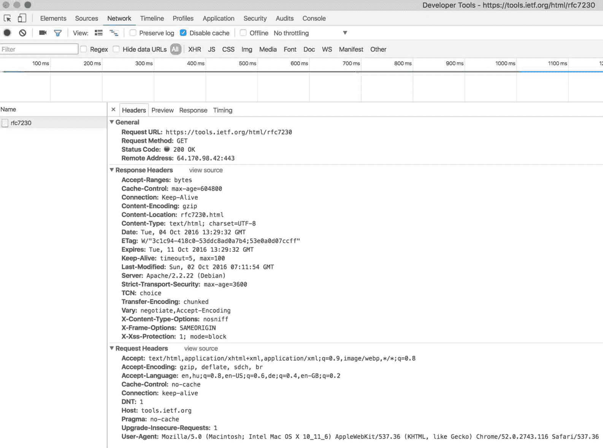
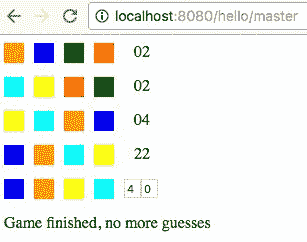
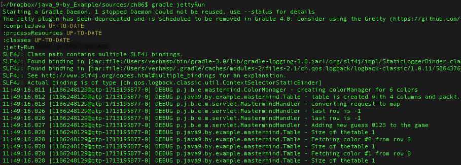

# 让我们的游戏变得专业 - 以 Web 应用程序的形式来实现

在本章中，我们将编写一个 Web 应用程序。我们将基于我们已经取得的成果，创建一个 Mastermind 游戏的 Web 版本。这次，它不仅会独立运行，猜测并回答位置数和匹配颜色，还会与用户沟通，请求猜测的答案。这将是一个真正的游戏。对于 Java 程序员来说，Web 编程极其重要。大多数程序都是 Web 应用程序。互联网上可用的通用客户端是 Web 浏览器。基于瘦客户端、Web 浏览器架构在企业中得到了广泛接受。只有当架构有其他东西而不是 Web 客户端时，才会有一些例外。如果你想成为一名专业的 Java 开发者，你必须熟悉 Web 编程。而且这也很有趣！

在开发过程中，我们将探讨许多技术主题。首先，我们将讨论网络和 Web 架构。这是整个建筑的具体基础。它并不太吸引人，就像你建造大楼时一样。你花费大量的金钱和努力挖掘沟渠，然后埋下混凝土，最终在阶段结束时得到你看似之前就有的平坦地面。只不过这次有了基础。没有这个基础，房子要么很快就会倒塌，要么在建造过程中倒塌。网络对于网络编程同样重要。有很多看似与编程无关的主题。尽管如此，它是建筑的基础，当你编写 Web 应用程序时，你也会在其中找到乐趣的部分。

我们也会简单谈谈 HTML、CSS 和 JavaScript，但不会过多。我们无法避免它们，因为它们对于网络编程同样重要，但它们也是你可以从其他地方学习的内容。如果你在这些领域不是专家，企业项目团队中通常有其他专家可以扩展你的知识。（在网络方面，没有宽容可言。）此外，JavaScript 是一个如此复杂和庞大的主题，以至于它值得从一本整本书开始学习。只有极少数专家能够深入理解 Java 和 JavaScript。我理解语言的总体结构和它运行的环境，但鉴于我专注于其他领域，我无法跟上每周发布的新的框架。

你将学习如何创建在应用服务器上运行的 Java 应用程序，这次是在 Jetty 上，我们将了解什么是 servlet。我们将创建一个快速启动的 Web *hello world* 应用程序，然后我们将创建 Mastermind 的 servlet 版本。请注意，我们几乎从不直接编写 servlet，而不借助某些实现处理参数、认证以及许多其他非特定于应用程序的框架。在本章中，我们仍将坚持使用裸露的 servlet，因为如果不首先了解什么是 servlet，就无法有效地使用框架，如 Spring。Spring 将在下一章中介绍。

我们将提及 **Java 服务器页面**（**JSP**）仅因为你可能遇到一些使用该技术开发的遗留应用程序，但现代 Web 应用程序不使用 JSP。尽管如此，JSP 是 servlet 标准的一部分，并且可供使用。还有一些最近开发的技术，但似乎在今天并不具备未来性。它们仍然可用，但只出现在遗留应用程序中，为新项目选择它们是相当可疑的。我们将在单独的部分中简要讨论这些技术。

到本章结束时，你将了解基本网络技术的工作原理以及主要架构元素是什么，你将能够创建简单的 Web 应用程序。这还不足以成为一名专业的 Java Web 开发者，但将为下一章打下良好的基础，在下一章中，我们将探讨当今企业在实际应用程序开发中使用的专业框架。

# 网络和网络

程序在计算机上运行，计算机连接到互联网。这个网络在过去 60 年里发展起来，最初是为了提供对火箭攻击具有弹性的军事数据通信，然后它被扩展为一个学术网络，后来它成为任何人都可以使用的商业网络，几乎遍布地球的每个角落。

网络的设计和研究始于对五十年代加加林飞越地球的反应。将加加林送入太空并在地球上方飞行是俄罗斯能够将火箭发射到地球上任何地方的证明，可能带有原子弹。这意味着任何需要某种中央控制的数据网络都无法抵御这种攻击。拥有一个中心位置的单一故障点的网络是不可行的。因此，开始进行研究以创建即使任何部分被摧毁也能继续工作的网络。

# IP

网络在连接到它的任意两台计算机之间传递数据包。网络使用的协议是 IP，这只是一个互联网协议的缩写。使用 IP，一台计算机可以向另一台发送数据包。数据包包含一个头部和数据内容。头部包含发送者和目标机器的互联网地址，其他标志和有关数据包的信息。由于机器之间不是直接连接的，因此路由器转发数据包。这就像邮局之间互相发送邮件，直到邮件落入你认识的邮递员手中，他可以直接将邮件送到你的邮箱。为了做到这一点，路由器使用头部中的信息。路由器交互的算法和组织结构很复杂，但我们不需要知道这些，因为我们不是 Java 专业人士。

如果你需要编程来直接发送 IP 数据包，你应该查看`java.net.DatagramPacket`，其余的由 JDK、操作系统和网络卡的固件实现。你可以创建一个数据包；发送它并改变网络卡上的调制电压或发射光子不是你的头疼事。然而，你们都将知道是否真的需要直接编程数据包。

IP 有两个版本。仍在使用的旧版本是 IPv4。与旧版本共存的新版本是 IPv6 或 IPng（*ng*代表*新一代*）。可能让 Java 开发者关心的主要区别是，版本 4 使用 32 位地址，而版本 6 使用 128 位地址。当你看到版本 4 的地址时，你会看到类似`192.168.1.110`的东西，它包含四个以点分隔的十进制格式的字节。IPv6 地址表示为`2001:db8:0:0:0:0:2:1`，这是以十六进制表示的八个 16 位数字，以冒号分隔。

网络比发送数据包要复杂一些。如果发送数据包就像发送一页信件，那么网页下载就像通过纸质邮件讨论合同。在最初的纸质邮件中应该有一个协议，说明要发送什么，要回答什么，等等，直到合同签署。在互联网上，这个协议被称为**传输控制协议**（**TCP**）。虽然遇到 IP 路由问题的可能性非常小（但有可能），但作为一个 Java 开发者，你肯定会遇到 TCP 编程。因此，我们将简要介绍 TCP 的工作原理。请注意，这非常简短。真的。阅读下一节后，你不会成为 TCP 专家，但你将了解影响网络编程的最重要问题。

# TCP/IP

TCP 协议在操作系统中得到实现，并且提供了比 IP 协议更高层次的接口。当你编程 TCP 时，你不需要处理数据报。相反，你有一个字节流通道，你可以将字节放入要发送到另一台计算机的通道中，你也可以从通道中读取由另一台计算机发送的字节，顺序与发送时的顺序相同。这是一种在两台计算机之间，以及两个程序之间的连接。

有其他协议是在 IP 协议之上实现的，并且不是面向连接的。其中之一是**用户数据报协议**（**UDP**），用于不需要连接的服务，当数据可能丢失时，及时到达目的地比丢失一些数据包更重要（视频流、电话）。当数据量小且未送达时，可以再次请求；丢失它的成本很低（DNS 请求，见下一节）。

当数据包在网络中丢失，或者发送了两次，或者比后续数据包先到达时，它将由操作系统实现的 TCP 软件层处理。这个层也通常被称为**TCP 栈**。

由于 TCP 是一个面向连接的协议，因此需要一个机制来告诉 TCP 栈当数据报到达时它属于哪个流。流通过两个端口号来识别。端口号是一个 16 位的整数。一个端口号用来标识发起连接的程序，称为源端口号。另一个端口号用来标识目标程序：目标端口号。这些信息包含在每个 TCP 数据包中。当一台机器运行一个**安全外壳**（**SSH**）服务器和一个 Web 服务器时，它们使用不同的端口号，通常是 22 号端口和 80 号端口。当一个包含目标端口号 22 的 TCP 头部的数据包到达时，TCP 栈就知道数据包中的数据属于由 SSH 服务器处理的流。同样，如果目标端口号是 80，那么数据就会发送到 Web 服务器。

当我们编程服务器时，通常需要定义端口号；否则，客户端将无法找到服务器程序。Web 服务器通常监听 80 号端口，客户端尝试连接到该端口。客户端端口号通常不重要且未指定；它由 TCP 栈自动分配。

从客户端代码连接到服务器很简单：只需要几行代码。有时，可能只需要一行代码。然而，在底层，TCP 栈做了很多工作，这是我们应当关注的——建立 TCP 连接需要时间。

为了建立连接，TCP 堆栈必须向目的地发送一个数据报以确认其存在。如果没有服务器在端口上监听，通过网络发送数据将没有任何结果，除了浪费网络带宽。因此，客户端首先发送一个名为 SYN 的空数据包。当另一端收到它时，它会发送一个类似的包，称为 SYN-ACK。最后，客户端发送一个名为 ACK 的包。如果数据包穿越大西洋，每个包大约需要 45ms，这在官僚时间中相当于 4500 万秒。这几乎是 1 年半的时间。我们需要三个这样的数据包来建立连接，而且还有更多。

当一个 TCP 连接开始时，客户端在没有控制的情况下不会开始发送数据。它会发送一些数据包，然后等待服务器确认它们的接收。如果发送服务器尚未准备接受的数据，那么发送这些数据不仅毫无用处，而且还会造成网络资源的浪费。TCP 被设计用来优化网络使用。因此，客户端发送一些数据后，它会等待确认。TCP 堆栈会自动管理这个过程。如果收到确认，它会发送更多的数据包。如果 TCP 堆栈中实现的一个精心设计的优化算法认为发送更多数据是合适的，它将发送比第一步更多的数据。如果有负确认告诉客户端服务器无法接受某些数据并不得不丢弃它们，那么客户端将减少未确认发送的数据包数量。但首先它会开始得慢而谨慎。这被称为 TCP 慢启动，我们必须对此有所了解。尽管这是一个低级网络特性，但它对我们的 Java 代码有影响，我们必须考虑：我们使用数据库连接池而不是每次需要数据时都创建新的数据库连接；我们尝试通过使用诸如*keep-alive*、*SPDY*协议或*http/2.0*（也取代了 SPDY）等技术来尽量减少与 Web 服务器的连接数。

首先，只要 TCP 是面向连接的，你就可以建立一个与服务器的连接，发送和接收字节，最后关闭连接。当你遇到网络性能问题时，你必须查看我列出的那些问题。

# DNS

TCP 协议使用机器的 IP 地址创建一个通道。当你在一个浏览器中输入一个 URL 时，它通常不包含 IP 号码。它包含机器名称。该名称通过一个称为**域名系统**（**DNS**）的分布式数据库转换为 IP 号码。这个数据库是分布式的，当一个程序需要将名称转换为地址时，它会向它所知道的 DNS 服务器之一发送 DNS 请求。这些服务器相互查询或告诉客户端向谁询问，直到客户端知道分配给该名称的 IP 地址。服务器和客户端还会缓存最近请求的名称，因此响应速度快。另一方面，当服务器的 IP 地址发生变化时，这个名称，全球上的所有客户端不会立即看到地址分配。DNS 查找可以很容易地编程，JDK 中有支持这一点的类和方法，但通常我们不需要关心这一点；当我们编程时，在 Web 编程中它是自动完成的。

# HTTP 协议

**超文本传输协议**（**HTTP**）建立在 TCP 之上。当你在一个浏览器中输入一个 URL 时，浏览器会打开一个 TCP 通道到服务器（当然是在 DNS 查找之后）并发送一个 HTTP 请求到 Web 服务器。服务器在收到请求后，生成一个响应并发送给客户端。之后，TCP 通道可能会关闭或保持活跃以进行进一步的 HTTP 请求-响应对。

请求和响应都包含一个头部和一个可选的（可能为零长度）正文。头部是文本格式，并且通过一个空行与正文分隔。

更精确地说，标题和正文之间由四个字节分隔：`0x0D`，`0x0A`，`0x0D`和`0x0A`，这是两个`CR`，`LF`行分隔符。HTTP 协议使用回车和换行符来终止标题中的行，因此，一个空行是两个`CRLF`连续出现。

头部的开始是一个状态行加上头部字段。以下是一个示例 HTTP 请求：

```java
GET /html/rfc7230 HTTP/1.1 
Host: tools.ietf.org 
Connection: keep-alive 
Pragma: no-cache 
Cache-Control: no-cache 
Upgrade-Insecure-Requests: 1 
User-Agent: Mozilla/5.0 (Macintosh; Intel Mac OS X 10_11_6) AppleWebKit/537.36 (KHTML, like Gecko) Chrome/52.0.2743.116 Safari/537.36 
Accept: text/html,application/xhtml+xml,application/xml;q=0.9,image/webp,*/*;q=0.8 
DNT: 1 
Referer: https://en.wikipedia.org/ 
Accept-Encoding: gzip, deflate, sdch, br 
Accept-Language: en,hu;q=0.8,en-US;q=0.6,de;q=0.4,en-GB;q=0.2

```

以下是一个响应：

```java
HTTP/1.1 200 OK 
Date: Tue, 04 Oct 2016 13:06:51 GMT 
Server: Apache/2.2.22 (Debian) 
Content-Location: rfc7230.html 
Vary: negotiate,Accept-Encoding 
TCN: choice 
Last-Modified: Sun, 02 Oct 2016 07:11:54 GMT 
ETag: "225d69b-418c0-53ddc8ad0a7b4;53e09bba89b1f" 
Accept-Ranges: bytes 
Cache-Control: max-age=604800 
Expires: Tue, 11 Oct 2016 13:06:51 GMT 
Content-Encoding: gzip 
Strict-Transport-Security: max-age=3600 
X-Frame-Options: SAMEORIGIN 
X-Xss-Protection: 1; mode=block 
X-Content-Type-Options: nosniff 
Keep-Alive: timeout=5, max=100 
Connection: Keep-Alive 
Transfer-Encoding: chunked 
Content-Type: text/html; charset=UTF-8 

<!DOCTYPE html PUBLIC "-//W3C//DTD XHTML 1.0 Transitional//EN" 
  "http://www.w3.org/TR/xhtml1/DTD/xhtml1-transitional.dtd"> 
<html  xml:lang="en" lang="en"> 
<head profile="http://dublincore.org/documents/2008/08/04/dc-html/"> 
    <meta http-equiv="Content-Type" content="text/html; charset=utf-8" /> 
    <meta name="robots" content="index,follow" />

```

请求不包含正文。状态行如下：

```java
GET /html/rfc7230 HTTP/1.1

```

它包含所谓的请求方法，请求的对象以及请求使用的协议版本。请求头部的其余部分包含格式为`label : value`的头部字段。在打印版本中，某些行被换行，但在头部行中没有换行符。

响应指定了它使用的协议（通常与请求相同），状态码以及状态的消息格式：

```java
HTTP/1.1 200 OK

```

之后，响应字段以与请求相同的语法出现。一个重要的头部是内容类型：

```java
Content-Type: text/html; charset=UTF-8

```

它指定响应体（在打印输出中被截断）是 HTML 文本。

实际请求被发送到了 URL，[`tools.ietf.org/html/rfc7230`](https://tools.ietf.org/html/rfc7230)，这是定义 HTTP 1.1 版本的规范。你可以轻松地自己查看通信，启动浏览器并打开开发者工具。如今，这样的工具已经内置在每一个浏览器中。你可以用它来在网络应用程序级别调试程序行为，查看实际的 HTTP 请求和响应的字节级信息。以下截图显示了开发者工具如何显示这种通信：



# HTTP 方法

请求状态行中的第一个单词所表示的方法告诉服务器如何处理该请求。标准定义了不同的方法，例如`GET`、`HEAD`、`POST`、`PUT`、`DELETE`以及一些其他方法。

当客户端想要获取资源的内 容时，它会使用`GET`方法。在`GET`请求的情况下，请求体是空的。这是浏览器在我们下载网页时使用的方法。它也是，很多时候，当在浏览器中运行的 JavaScript 程序请求一些信息时使用的方法，但它不想向服务器发送太多信息。

当客户端使用`POST`时，通常的意图是向服务器发送一些数据。服务器确实会回复，很多时候，回复中也有一个体，但请求/回复通信的主要目的是从客户端向服务器发送一些信息。这在某种程度上与`GET`方法相反。

`GET`和`POST`方法是使用最频繁的方法。尽管有一般性指南建议使用`GET`来检索数据，使用`POST`将数据发送到服务器，但这只是一个建议，两种情况之间没有清晰的分离。很多时候，`GET`也会用来向服务器发送一些数据。毕竟，它是一个带有状态行和头字段的 HTTP 请求，尽管请求中没有主体，但状态行中方法后面的对象（URL 的一部分）仍然能够传递参数。很多时候，测试响应`GET`请求的服务也很容易，因为你只需要一个浏览器，输入带有参数的 URL，然后在浏览器开发者工具中查看响应。如果你看到使用`GET`请求执行修改 Web 服务器状态的操作的程序，你不必感到惊讶。然而，不感到惊讶并不意味着认可。你应该意识到，在大多数情况下，这并不是好的做法。当我们使用`GET`请求发送敏感信息时，URL 中的参数在浏览器的地址行中可供客户端访问。当我们使用`POST`发送时，参数仍然可以被客户端访问（毕竟，客户端发送的信息是由客户端生成的，因此不能不可用），但对于一个简单的、对安全性无知的用户来说，复制粘贴信息并发送给第三方并不那么容易。使用`GET`和`POST`的决定应始终考虑实际性和安全问题。

`HEAD`方法与`GET`请求相同，但响应将不包含主体。当客户端对实际响应不感兴趣时，会使用这种方法。可能的情况是客户端已经拥有该对象，并想查看它是否已更改。`Last-Modified`头将包含资源最后更改的时间，客户端可以决定是否拥有更新的版本或需要在新请求中请求资源。

当客户端想要在服务器上存储某些内容时，使用`PUT`方法，而当客户端想要删除某些资源时，使用`DELETE`方法。这些方法通常只由用 JavaScript 编写的应用程序使用，而不是直接由浏览器使用。

标准中定义了其他方法，但这些都是最重要且最常使用的方法。

# 状态码

响应以状态码开始。这些代码也是定义好的，响应中可用的代码数量有限。最重要的是`200`，表示一切正常；响应包含请求所需的内容。这些代码始终在`100`到`599`的范围内，包含三位数字，并按第一位数字分组。

+   `1xx`: 这些代码是信息代码。它们很少使用，但在某些情况下可能非常重要。例如，`100` 表示继续。当服务器收到 `POST` 请求并且服务器想要向客户端发出信号以发送请求体，因为它可以处理它时，可以发送此代码。如果服务器和客户端正确实现此代码，并且客户端等待此代码，可能会节省大量带宽。

+   `2xx`: 这些代码表示成功。请求得到了适当的回答，或者请求的服务已经完成。标准中定义了诸如 `200`、`201`、`202` 等代码，并描述了何时使用其中一个或另一个。

+   `3xx`: 这些代码表示重定向。当服务器无法直接服务请求但知道可以服务的 URL 时，会发送这些代码之一。实际的代码可以区分永久重定向（当已知所有未来的请求都应该发送到新的 URL 时）和临时重定向（当任何后续请求都应该发送到这里，并且可能被服务或重定向时），但决定保留在服务器端。

+   `4xx`: 这些是错误代码。最著名的代码是 `404`，表示未找到，即服务器无法响应请求，因为找不到资源。`401` 表示可能可以提供请求的资源，但它需要身份验证。`403` 是一个表示请求有效但服务器仍然拒绝服务的代码。

+   `5xx`: 这些代码是服务器错误代码。当响应包含这些错误代码之一时，其含义是服务器存在某些错误。这种错误可能是临时的，例如，当服务器正在处理过多的请求并且无法以计算密集型的响应响应新的请求（这通常由错误代码 `503` 表示）或当功能未实现（代码 `501`）时。一般错误代码 `500` 被解释为内部错误，这意味着关于服务器上发生什么错误没有任何信息，但它并不好，因此没有有意义的响应。

# HTTP/2.0

自从上次 HTTP 发布以来近 20 年后，新的 HTTP 版本于 2015 年发布。这个新版本的协议在之前版本的基础上有几个增强。其中一些增强也将影响服务器应用程序的开发方式。

最重要和首次增强的是，新协议将使得在单个 TCP 连接中并行发送多个资源成为可能。保持连接的标志可用于避免 TCP 通道的重新创建，但当响应创建缓慢时，这并没有帮助。在新协议中，即使一个请求尚未完全服务，其他资源也可以在相同的 TCP 通道中传输。这需要在协议中处理复杂的包，但这一点对服务器应用程序程序员和浏览器程序员都是透明的。应用服务器、Servlet 容器和浏览器都透明地实现了这一点。

HTTP/2.0 将始终是加密的，因此不可能在浏览器 URL 中使用`http`作为协议。它始终是`https`。

在 Servlet 编程中需要修改以利用新版本协议优势的功能是服务器推送。Servlet 规范的第 4.0 版包括对 HTTP/2.0 的支持，而这个版本目前仍处于草案阶段。

服务器推送是对未来请求的 HTTP 响应。服务器如何回答一个尚未发出的请求呢？嗯，服务器是预测的。例如，应用程序发送一个包含许多小图片和图标的 HTML 页面。客户端下载 HTML 页面，构建 DOM 结构，分析它，并意识到需要这些图片，然后发送请求。应用程序程序员知道有哪些图片，并且可能编写代码让服务器在浏览器请求之前就发送图片。每个这样的响应都包含一个 URL，即这个响应是为哪个 URL 准备的。当浏览器需要资源时，它会意识到资源已经存在，因此不会发出新的请求。在`HttpServlet`中，程序应通过请求的新`getPushBuilder`方法访问`PushBuilder`，并使用它将资源推送到客户端。

# Cookies

Cookies 由浏览器维护，并在 HTTP 请求头中使用`Cookie`头字段发送。每个 cookie 都有一个名称、值、域名、路径、过期时间和一些其他参数。当请求发送到与域名匹配的 URL，且非过期的 cookie 路径时，客户端会将 cookie 发送到服务器。Cookies 通常由浏览器存储在客户端的小文件中，或者存储在本地数据库中。实际的实现是浏览器的事务，我们无需担心。它只是客户端不执行的文字信息。只有当某些规则（主要是域名和路径）匹配时，它才会被发送回服务器。Cookies 由服务器创建，并在 HTTP 响应中使用`Set-Cookie`头字段发送给客户端。因此，本质上服务器告诉客户端，嘿，这里有这个 cookie，当你下次来的时候，给我展示这条信息，这样我就知道是你了。

Cookies 通常用于记住客户端。广告商和需要记住与谁交流的在线商店大量使用它。但这并不是唯一用途。如今，任何维护用户会话的应用程序都使用 cookies 来链接来自同一用户的 HTTP 请求。当你登录到应用程序时，你用来识别自己的用户名和密码只发送到服务器一次，在随后的请求中，只发送一个特殊的 cookie 到服务器，用于识别已经登录的用户。这种使用 cookie 的方式强调了为什么使用难以猜测的 cookie 值非常重要。如果用于识别用户的 cookie 容易被猜测，那么攻击者只需创建一个 cookie 并发送到服务器，模仿其他用户即可。出于这个目的，cookie 值通常是长的随机字符串。

Cookies 并不总是被发送回它们起源的服务器。当设置 cookie 时，服务器会指定一个 URL 域名，该域名用于将 cookie 发送回。这通常发生在需要认证的服务器之外的其他服务器执行用户认证时。

应用程序有时会将值编码到 cookie 中。这并不一定不好，尽管在大多数实际情况下是这样的。当将某些内容编码到 cookie 中时，我们应始终考虑这样一个事实：cookie 会通过网络传输，并且随着越来越多的数据被编码其中，可能会变得非常大，从而给网络带来不必要的负担。通常，最好只发送一些独特的、否则无意义的随机密钥，并将值存储在数据库中，无论是磁盘上的还是内存中的。

# 客户端服务器和 Web 架构

我们迄今为止开发的应用程序都是在单个 JVM 上运行的。我们已经有了一些并发编程的经验，现在这将非常有用。当我们编写 Web 应用程序时，代码的一部分将在服务器上运行，而应用程序逻辑的一部分将在浏览器中执行。服务器部分将用 Java 编写，浏览器部分将用 HTML、CSS 和 JavaScript 实现。由于这是一本 Java 书，我们将主要关注服务器部分，但我们仍然应该意识到，许多功能可以也应该在浏览器中实现。这两个程序通过 IP 网络（即互联网）或企业内部应用程序的情况，即公司的网络相互通信。

今天，浏览器能够运行非常强大的应用程序，所有这些应用程序都是用 JavaScript 实现的。几年前，这样的应用程序需要用 Delphi、C++或 Java 编写的客户端应用程序，利用客户端操作系统的窗口功能。

最初，客户端-服务器架构意味着应用程序的功能是在客户端实现的，程序仅使用服务器的一般服务。服务器提供数据库访问和文件存储，但仅此而已。后来，三层架构将业务功能放在使用其他服务器进行数据库和其他一般服务的服务器上，客户端应用程序实现用户界面和有限业务功能。

当网络技术开始渗透企业计算时，网络浏览器开始取代许多用例中的客户端应用程序。在此之前，浏览器无法运行复杂的 JavaScript 应用程序。应用程序是在网络服务器上执行的，客户端显示服务器创建的 HTML，作为应用程序逻辑的一部分。每当用户界面发生变化时，浏览器就会与服务器建立通信，并在 HTTP 请求-响应对中，浏览器内容被替换。一个网络应用程序本质上是一系列表单填写和向服务器发送表单数据，服务器则以 HTML 格式的页面响应，可能包含新的表单。

开发了 JavaScript 解释器，并且变得越来越有效和标准化。今天，现代网络应用程序包含 HTML（它是客户端代码的一部分，不是由服务器动态生成的）、CSS 和 JavaScript。当代码从网络服务器下载时，JavaScript 开始执行并与服务器通信。它仍然是 HTTP 请求和响应，但响应不包含 HTML 代码。它包含纯数据，通常是 JSON 格式。这些数据被 JavaScript 代码使用，如果需要，一些数据也会在由 JavaScript 控制的网络浏览器显示上显示。这在功能上等同于三层架构，但有一些细微但非常重要的差异。

第一个不同之处在于代码没有安装在客户端。客户端从网络服务器下载应用程序，唯一安装的是现代浏览器。这减少了企业维护负担和成本。

第二个不同之处在于客户端无法或受限地访问客户端机器的资源。厚客户端应用程序可以在本地文件中保存任何内容或访问本地数据库。与在浏览器上运行的程序相比，这非常有限，出于安全原因。同时，这也是一个方便的限制，因为客户端不应且不应该是架构中受信任的部分。客户端计算机的硬盘又硬又贵，备份成本高昂。它可以被笔记本偷走，加密它也很昂贵。有工具可以保护客户端存储，但大多数情况下，仅在服务器上存储数据是一个更可行的解决方案。

信任客户端应用程序也是常见的程序设计错误。客户端实际上控制着客户端计算机，尽管在技术上可以使其变得非常困难，但客户端仍然可以克服客户端设备和客户端代码的安全限制。如果只有客户端应用程序检查某些功能或数据的有效性，那么服务器物理控制提供的物理安全就不会被利用。每当数据从客户端发送到服务器时，都必须检查数据的有效性，无论客户端应用程序是什么。实际上，由于客户端应用程序可以更改，我们实际上并不真正知道客户端应用程序是什么。

在本章中，实际上在整个书中，我们专注于 Java 技术；因此，示例应用程序将几乎不包含任何客户端技术。我忍不住创建了一些 CSS。另一方面，我肯定避免了 JavaScript。因此，我必须再次强调，示例是为了演示服务器端编程，并且仍然提供真正有效的东西。一个现代应用程序会使用 REST 和 JSON 通信，而不会在服务器端动态创建 HTML。最初，我想创建一个 JavaScript 客户端和 REST 服务器应用程序，但由于服务器端 Java 编程的焦点转移得太多，我放弃了这个想法。另一方面，你可以扩展应用程序，使其类似于那样。

# 编写 Servlet

Servlet 是 Java 类，在实现 servlet 容器环境的 Web 服务器中执行。最初的 Web 服务器只能向浏览器提供静态 HTML 文件。对于每个 URL，在 Web 服务器上都有一个 HTML 页面，服务器在浏览器发送请求后，将文件的內容作为响应发送。很快，就有必要扩展 Web 服务器，使其能够在处理请求时动态启动一些程序来计算响应的内容。

第一个实现这一功能的标准化方法是 CGI。它启动了一个新的进程来响应请求。新的进程从其标准输入获取请求，并将标准输出发送回客户端。这种方法浪费了大量的资源。正如你在上一章中学到的，仅仅为了响应一个 HTTP 请求而启动一个新的进程是非常昂贵的。甚至启动一个新的线程似乎也是不必要的，但在这方面，我们已经走得很远了。

下一个方法是 FastCGI，它持续执行外部进程并重用它，然后出现了不同的其他方法。在 Servlet 之后的方法是

FastCGIall use in-process extensions. In these cases, the code calculating the response runs inside the same process as the web server. Such standards or extension interfaces were ISAPI for the Microsoft IIS server, NSASPI for the Netscape server, and the Apache module interface. Each of these made it possible to create a **dynamically loaded library** (**DLL** on Windows or SO files on Unix systems) to be loaded by the web server during

startupand to map certain requests to be handled by the code implemented in these libraries.

当某人编写 PHP 程序时，例如，Apache 模块扩展是读取 PHP 代码并对其采取行动的 PHP 解释器。当某人编写用于 Microsoft IIS 的 ASP 页面时，执行 ASP 页面解释器的 ISAPI 扩展（好吧，这样说有点草率和简化，但可以作为例子）。

对于 Java 来说，接口定义是 JSR340 版本 3.1 中定义的 servlet。

JSR 代表 Java 规范请求。这些是对 Java 语言、库接口和其他组件修改的请求。这些请求经过评估过程，当它们被接受时，它们成为标准。这个过程由 Java 社区进程（JCP）定义。JCP 也有文档和版本。当前版本是 2.10，可以在[`jcp.org/en/procedures/overview`](https://jcp.org/en/procedures/overview)找到。JSR340 标准可以在[`jcp.org/en/jsr/detail?id=340`](https://jcp.org/en/jsr/detail?id=340)找到。

一个 servlet 程序实现了 servlet 接口。通常这是通过扩展 `HttpServlet`，即 `Servlet` 接口的抽象实现来完成的。这个抽象类实现了方法，如 `doGet`、`doPost`、`doPut`、`doDelete`、`doHead`、`doOption` 和 `doTrace`，这些方法可以由扩展它的实际类自由覆盖。如果一个 servlet 类没有覆盖这些方法之一，发送相应的 HTTP 方法，如 `GET`、`POST` 等，将返回 `405 Not Allowed` 状态码。

# Hello world servlet

在深入技术细节之前，让我们创建一个非常简单的 *hello world* servlet。为此，我们设置了一个 Gradle 项目，包括构建文件 `build.gradle`，在文件 `src/main/java/packt/java9/by/example/mastermind/servlet/HelloWorld.java` 中的 servlet 类，最后但同样重要的是，我们必须创建文件 `src/main/webapp/WEB-INF/web.xml`。`gradle.build` 文件将如下所示：

```java
apply plugin: 'java' 
 apply plugin: 'jetty' 

 repositories { 
     jcenter() 
 } 

 dependencies { 
     providedCompile "javax.servlet:javax.servlet-api:3.1.0" 
 } 

 jettyRun { 
     contextPath '/hello' 
 }

```

Gradle 构建文件使用了两个插件，`java` 和 `jetty`。我们已经在上一章中使用了 `java` 插件。`jetty` 插件添加了如 `jettyRun` 这样的任务，这些任务加载 Jetty servlet 容器并启动应用程序。`jetty` 插件也是 `war` 插件的扩展，它将 Web 应用程序编译成 **Web Archive** (**WAR**`) 包装格式。

WAR 打包格式实际上与 JAR 相同；它是一个 zip 文件，它包含一个`lib`目录，其中包含所有 Web 应用程序所依赖的 JAR 文件。应用程序的类位于`WEB-INF/classes`目录中，并且有一个`WEB-INF/web.xml`文件，该文件描述了 servlet URL 映射，我们将在不久的将来详细探讨。

由于我们想要开发一个非常简单的 servlet，我们将 servlet API 作为依赖项添加到项目中。然而，这并不是一个编译依赖项。当 servlet 在容器中运行时，API 是可用的。尽管如此，它必须在编译我们的代码时可用；因此，通过指定为`providedCompile`的工件提供了一个*虚拟*实现。因为是这样指定的，构建过程不会将库打包到生成的 WAR 文件中。生成的文件将不包含任何特定于 Jetty 或其他 servlet 容器的特定内容。

servlet 容器将提供 servlet 库的实际实现。当应用程序在 Jetty 中部署并启动时，servlet 库的 Jetty 特定实现将可在类路径上使用。当应用程序部署到 Tomcat 时，将可用 Tomcat 特定实现。

在我们的项目中创建一个类，如下所示：

```java
package packt.java9.by.example.mastermind.servlet; 

 import javax.servlet.ServletException; 
 import javax.servlet.http.HttpServlet; 
 import javax.servlet.http.HttpServletRequest; 
 import javax.servlet.http.HttpServletResponse; 
 import java.io.IOException; 
 import java.io.PrintWriter; 

 public class HelloWorld extends HttpServlet { 

     private String message; 

     @Override 
     public void init() throws ServletException { 
         message = "Hello, World"; 
     } 

     @Override 
     public void doGet(HttpServletRequest request, 
                       HttpServletResponse response) 
             throws ServletException, IOException { 
         response.setContentType("text/html"); 
         PrintWriter out = response.getWriter(); 
         out.println("<h1>" + message + "</h1>"); 
     } 

     @Override 
     public void destroy() { 
     } 
 }

```

当 servlet 启动时，将调用`init`方法。当它被移出服务时，将调用`destroy`方法。这些方法可以被重写，并提供比构造函数和其他最终化可能性更细粒度的控制。servlet 对象可以被多次放入服务，在调用`destroy`之后，servlet 容器可能会再次调用`init`；因此，这个周期并不严格绑定到对象的生命周期。通常，在这些方法中我们不会做很多事情，但有时你可能需要在其中添加一些代码。

此外，请注意，单个 servlet 对象可以用来处理多个请求，甚至可以同时处理；因此，其中的 servlet 类和方法应该是相当线程安全的。规范要求在容器在非分布式环境中运行时，servlet 容器只使用一个 servlet 实例。如果容器在同一个机器上的多个进程中运行，每个进程执行一个 JVM，或者甚至在不同的机器上运行，可能会有许多 servlet 实例来处理请求。通常，servlet 类应该设计成它们不假设只有一个线程在执行它们，但同时也不能假设实例对不同的请求是相同的。我们根本无法知道。

这在实践中意味着什么？你不应该使用特定于某个请求的实例字段。在示例中，初始化以保存消息的字段对每个请求都保持相同的值；本质上，这个变量几乎是一个最终的常量。它仅用于演示`init`方法的一些功能。

当 Servlet 容器接收到一个使用`GET`方法的 HTTP 请求时，会调用`doGet`方法。该方法有两个参数。第一个参数代表请求，第二个参数代表响应。可以使用`request`来收集请求中包含的所有信息。在先前的例子中，并没有这样的操作。我们并没有使用任何输入。如果有一个请求发送到我们的 Servlet，那么无论什么情况，我们都将返回`Hello, World`字符串。稍后，我们将看到从请求中读取参数的例子。`response`提供了可以用来处理输出的方法。在例子中，我们获取了`PrintWriter`，它将被用来向 HTTP 响应的主体发送字符。这是在浏览器中显示的内容。我们发送的 MIME 类型是`text/html`，这是通过调用`setContentType`方法设置的。这将进入 HTTP 头字段`Content-Type`。类的标准文档和 JavaDoc 文档定义了所有可以使用的的方法，以及如何使用这些方法。

最后，我们有一个`web.xml`文件，它声明了我们代码中实现的 Servlet。正如文件名所表明的，这是一个 XML 文件。它声明性地定义了存档中包含的所有 Servlet 以及其他参数。在例子中，参数没有被定义，只有 Servlet 和 URL 的映射。由于在这个例子中我们只有一个 Servlet，所以 WAR 文件被映射到根上下文。所有到达 Servlet 容器和这个存档的`GET`请求都将由这个 Servlet 来处理：

```java
<?xml version="1.0" encoding="UTF-8"?> 
<web-app version="2.5" 

         xsi:schemaLocation="http://java.sun.com/xml/ns/javaee http://java.sun.com/xml/ns/javaee/web-app_2_5.xsd"> 

    <servlet> 
        <display-name>HelloWorldServlet</display-name> 
        <servlet-name>HelloWorldServlet</servlet-name> 
        <servlet-class>packt.java9.by.example.mastermind.servlet.HelloWorld</servlet-class> 
    </servlet> 

    <servlet-mapping> 
        <servlet-name>HelloWorldServlet</servlet-name> 
        <url-pattern>/</url-pattern> 
    </servlet-mapping> 

</web-app>

```

# Java 服务器页面

我承诺过不会用 Java 服务器页面来让您感到无聊，因为那是一种过时的技术。尽管它是过时的，但它还没有成为历史，因为还有很多程序仍在使用 JSP，并且包含 JSP 代码。

JSP 页面是包含 HTML 和 Java 代码混合的网页。当一个 HTTP 请求由 JSP 页面服务时，Servlet 容器读取 JSP 页面，执行 Java 部分，将 HTML 部分原样保留，以这种方式将两者混合在一起，创建一个发送到浏览器的 HTML 页面。

```java
<%@ page language="java" 
         contentType="text/html; charset=UTF-8" 
         pageEncoding="UTF-8"%> 
<html> 
<body> 
<% for( int i = 0 ; i < 5 ; i ++ ){ %> 
  hallo<br/> 
<% } %> 
</body> 
</html>

```

前一页将创建一个包含`hallo`文本五次的 HTML 页面，每次都在新的行中，由`br`标签分隔。在幕后，Servlet 容器将 JSP 页面转换为 Java Servlet，然后使用 Java 编译器编译 Servlet，然后运行 Servlet。每次源 JSP 文件有变化时，它都会这样做；因此，使用 JSP 增量地编写一些简单的代码非常容易。从先前的 JSP 文件生成的代码有 138 行长（在 Tomcat 8.5.5 版本上），这里简单地列出会非常冗长且无聊，但有助于理解 Java 文件生成过程的部分只有几行。

如果你想查看生成的 servlet 类的所有行，可以将应用程序部署到 Tomcat 服务器，并查看目录`work/Catalina/localhost/hello/org/apache/jsp/`。这是一个很少为开发者所知的真相，即此代码实际上被保存到磁盘上，并且是可用的。有时当你需要调试一些 JSP 页面时，这很有帮助。

下面是从前面的代码生成的几行有趣的内容：

```java
      out.write("\n"); 
      out.write("<html>\n"); 
      out.write("<body>\n"); 
 for( int i = 0 ; i < 5 ; i ++ ){  
      out.write("\n"); 
      out.write("  hallo<br/>\n"); 
 }  
      out.write("\n"); 
      out.write("</body>\n"); 
      out.write("</html>\n");

```

JSP 编译器将 JSP 代码的内部移到外部，外部移到内部。在 JSP 代码中，Java 被 HTML 包围，而在生成的 servlet Java 源代码中，HTML 被 Java 包围。这就像当你想修补衣服时：首先要做的就是将裙子翻过来。

你不仅可以在 JSP 页面中将 Java 代码混合到 HTML 中，还可以混合所谓的标签。标签被收集到标签库中，用 Java 实现，并打包成 JAR 文件，它们应该在类路径上可用。使用某些库中标签的 JSP 页面应该声明使用：

```java
<%@ taglib prefix="c" 
           uri="http://java.sun.com/jsp/jstl/core" %>

```

标签看起来像 HTML 标签，但它们是由 JSP 编译器处理的，并由`taglib`库中实现的代码执行。JSP 还可以引用 JSP 作用域内可用的 Java 对象值。要在 HTML 页面内完成此操作，可以使用 JSP 表达式语言。

JSP 最初是为了简化 Web 应用程序的开发而创建的。主要优势是快速启动开发。在开发过程中没有长时间的配置、设置等，当 JSP 页面有任何更改时，也不需要再次编译整个应用程序：servlet 容器生成 Java 代码，将其编译成类文件，将其加载到内存中，并执行。JSP 是 Microsoft ASP 页面的竞争对手，它们混合了 HTML 和 VisualBasic 代码。

当应用程序开始变得庞大时，使用 JSP 技术会导致比好处更多的问题。混合业务逻辑和应用程序视图的代码，它在浏览器中的渲染变得混乱。开发 JSP 需要前端技术知识。Java 开发者预期需要了解一些前端技术，但很少是设计专家和 CSS 大师。现代代码还包含 JavaScript，很多时候嵌入在 HTML 页面中。毕竟，JSP 的大优势是它包含在服务器端以及客户端运行的代码。开发者多次遵循这种模式，所以看到一些包含 Java、HTML、CSS 和 JavaScript 的遗留代码混合在一个 JSP 文件中并不奇怪。由于 Java 和 JavaScript 在某些情况下语法相似，很难看出在服务器上执行的是什么，在客户端执行的是什么。我甚至看到过在 JSP 文件中从 Java 代码创建 JavaScript 代码的代码。这是一个不同责任的完全混合，几乎无法维护的混乱。这导致了 JSP 今天被完全废弃。

JSP 的弃用并不是官方的。这是我的专业意见。你可能会遇到一些仍然热爱 JSP 的资深开发者，你也可能会发现自己身处需要用 JSP 开发程序的项目中。这样做并不丢人。有些人为了钱做得更糟。

为了解决混乱的局面，越来越多的技术倡导将服务器代码和客户端功能分离。这些技术包括 Wicket、Vaadin、JSF 以及不同的 Java 模板引擎，如 Freemarker、Apache Velocity 和 Thymeleaf。这些后端技术在你从 Java 生成文本输出时也非常有趣，即使代码与 Web 无关。

这些技术，通过纪律性，有助于控制中等和大型 Web 项目的开发和维护成本，但架构的基本问题仍然存在：没有明确的关注点分离。

现在，现代应用程序在单独的项目中实现 Web 应用程序的代码：一个用于客户端，使用 HTML、CSS 和 JavaScript，另一个用于在 Java（或其它，但在此我们关注 Java）中实现服务器功能。两者之间的通信是 REST 协议，我们将在后续章节中介绍。

# HTML、CSS 和 JavaScript

HTML、CSS 和 JavaScript 是客户端技术。这些对于 Web 应用至关重要，一个专业的 Java 开发者应该对这些技术有所了解。虽然这并非不可能，但没有人期望你同时成为 Java 和 Web 客户端技术的专家。一定的理解是可取的。

HTML 是有结构文本的文本表示。文本以字符形式给出，就像任何文本文件一样。标签代表结构。一个开始标签以`<`字符开始，然后是标签名，然后是可选的`name="value"`属性，最后是一个闭合的`>`字符。一个结束标签以`</`开始，然后是标签名，然后是`>`。标签被嵌套在层次结构中；因此，你不应该在打开的标签之前关闭一个标签。首先，最后打开的标签必须关闭，然后是下一个，依此类推。这样，HTML 中的任何实际标签都有一个级别，并且所有在开始和结束标签之间的标签都位于此标签的*下方*。一些不能包含其他标签或文本的标签没有结束标签，它们独立存在。考虑以下示例：

```java
<html> 
  <head> 
    <title>this is the title</title> 
  </head> 
</html>

```

标签`head`位于`html`之下，`title`位于`head`之下。这可以结构化为一个树，如下所示：

```java
html 
+ head 
  + title 
    + "this is the title"

```

浏览器以树结构存储 HTML 文本，这个树是网页文档的对象模型，因此得名，**文档对象模型**（**DOM**）树。

原始的 HTML 概念将格式和结构混合在一起，即使在当前的 HTML5 版本中，我们仍然有`b`、`i`、`tt`这样的标签，提示浏览器将开始和结束标签之间的文本以粗体、斜体和电传打字机字体显示。

正如 HTML（超文本标记语言）这个名字所暗示的，文本可以包含以超链接形式指向其他网页的引用。这些链接使用`a`标签（代表锚点）或某些可能包含不同字段的形式分配，当表单的提交按钮被按下时，字段的内容以`POST`请求的形式发送到服务器。当表单被发送时，字段的内容被编码在所谓的`application/x-www-form-urlencoded`表单中。

HTML 结构总是试图促进结构和格式的分离。为此，格式被移动到样式。在**层叠样式表**（**CSS**）中定义的样式比 HTML 提供了更多的格式化灵活性；CSS 的格式化效果更有效。创建 CSS 的目的是使设计可以从文本的结构中分离出来。如果我要在这三个中选择一个，我会选择 CSS，因为它对于 Java 服务器端网络开发者来说最不重要，同时对于用户来说最重要（东西应该看起来很漂亮）。

JavaScript 是客户端技术的第三根支柱。JavaScript 是一种由浏览器执行的完整功能、解释型编程语言。它可以访问 DOM 树，并读取和修改它。当 DOM 树被修改时，浏览器会自动显示修改后的页面。JavaScript 函数可以被安排和注册，以便在某个事件发生时调用。例如，你可以注册一个函数，当文档完全加载、用户按下按钮、点击链接或鼠标悬停在某个部分上时调用该函数。尽管 JavaScript 最初仅用于在浏览器上创建有趣的动画，但如今，使用浏览器的功能来编写完全功能性的客户端是可能的，并且已经成为一种常见的做法。确实有一些用 JavaScript 编写的强大程序，甚至包括像 PC 模拟器这样耗能的应用程序。

在这本书中，我们专注于 Java，并在演示技术所需的最大程度上使用客户端技术。然而，作为一个 Java 网络开发者专业人士，你至少在一定程度上必须学习这些技术，以便理解客户端能做什么，并能与负责前端技术的专业人士合作。

# 大脑.servlet

通过网络玩 Mastermind 游戏与过去有点不同。到目前为止，我们没有用户交互，我们的类也是相应设计的。例如，我们可以向表格添加一个新的猜测，包括程序计算出的部分和完全匹配。现在我们必须分离新猜测的创建、将其添加到游戏中以及设置完全和部分匹配。这次，我们必须首先显示表格，然后用户必须计算并提供匹配的数量。

我们必须修改一些类才能做到这一点。我们需要向`Game.java`添加一个新方法：

```java
public Row addGuess(Guess guess, int full, int partial) { 
    assertNotFinished(); 
    final Row row = new Row(guess, full, partial); 
    table.addRow(row); 
    if (itWasAWinningGuess(full)) { 
        finished = true; 
    } 
    return row; 
}

```

到目前为止，我们只有一个方法，那就是添加一个新的猜测，因为程序知道秘密，所以它立即计算出`full`和`partial`的值。这个方法的名字可以是`addNewGuess`，它覆盖了原始方法，但这次，这个方法不仅用于添加新的猜测，还用于添加旧的猜测以重建表格。

当程序启动时，没有猜测。程序创建一个，第一个。后来，当用户告诉程序完整的和部分的匹配时，程序需要包含`Guess`对象以及`full`和`partial`匹配值的`Game`结构体和`Table`以及`Row`对象。这些已经可用，但当新的 HTTP 请求到来时，我们必须从某处获取它。在编写 servlet 时，我们必须将游戏状态存储在某处，并在新的 HTTP 请求击中服务器时恢复它。

# 存储状态

状态的存储可以在两个地方进行。一个地方，我们将在我们的代码中首先做，是客户端。当程序创建一个新的猜测时，它将其添加到表格中，并发送一个包含不仅新的猜测，还包括所有之前的猜测以及用户为每一行提供的`full`和`partial`匹配值的 HTML 页面。为了将数据发送到服务器，这些值存储在表单的字段中。当表单提交时，浏览器收集字段中的信息，从字段内容创建一个编码字符串，并将内容放入`POST`请求的主体中。

存储实际状态的另一种可能性是在服务器上。服务器可以存储游戏状态，并在创建新的猜测时重建结构。在这种情况下的问题是我们知道使用哪个游戏。服务器可以也应该存储许多游戏，每个用户一个，用户可能并发使用应用程序。这并不一定意味着像我们在上一章中检查的那样强并发。

即使用户不是在多个线程中同时被服务，也可能存在一些活跃的游戏。想象一下`cnn.com`告诉你现在不能阅读新闻，因为其他人正在阅读。可能有多个用户在玩多个游戏，而在处理 HTTP 请求时，我们应该知道我们正在为哪个用户服务。

Servlets 维护会话，我们将在下一节中看到，这些会话可以用于此目的。

# HTTP 会话

当客户端从同一浏览器向同一 Servlet 发送请求时，一系列请求属于一个会话。为了知道请求属于同一个会话，Servlet 容器会自动向客户端发送一个名为`JSESSIONID`的 cookie，并且这个 cookie 有一个长、随机、难以猜测的值（例如，我在 Jetty 中运行应用程序时，值为`tkojxpz9qk9xo7124pvanc1z`）。Servlet 维护一个包含`HttpSession`实例的会话存储。在`JSESSIONID`cookie 的值中传递的键字符串标识了这些实例。当一个 HTTP 请求到达 Servlet 时，容器将存储中的会话附加到请求对象。如果没有为键创建会话，那么就会创建一个，代码可以通过调用`request.getSession()`方法来访问会话对象。

`HttpSession`对象可以存储属性。程序可以通过调用`setAttribute(String,Object)`、`getAttribute(String)`和`removeAttribute(String)`方法来存储、检索或删除属性对象。每个属性都分配给一个`String`，可以是任何`Object`。

尽管会话属性存储在本质上看起来就像一个`Map<String,?>`对象一样简单，但实际上并非如此。当 Servlet 容器在集群或其他分布式环境中运行时，存储在会话中的值可以从一个节点移动到另一个节点。为了做到这一点，这些值会被序列化；因此，存储在会话中的值应该是`Serializable`。未能这样做是一个非常常见的初学者错误。在开发过程中，在简单的开发 Tomcat 或 Jetty 容器中执行代码几乎永远不会将会话序列化到磁盘，也永远不会从序列化形式加载它。这意味着使用`setAttribute`设置的值将通过调用`getAttribute`来可用。当应用程序第一次在集群环境中安装时，我们会遇到麻烦。一旦不同的节点上有 HTTP 请求到达，`getAttribute`可能会返回`null`。在第一个节点上调用`setAttribute`，而在处理下一个请求时，在另一个节点上的`getAttribute`无法从节点之间共享的磁盘上反序列化属性值。这通常，并且遗憾的是，是在生产环境中发生的。

作为一名开发者，你应该知道序列化和反序列化对象是一项耗时的操作，它需要消耗几个 CPU 周期。如果应用程序的结构只使用客户端状态的一部分来服务大多数 HTTP 请求，那么从序列化形式在内存中创建整个状态然后再进行序列化是一种 CPU 资源的浪费。在这种情况下，更明智的做法是只在会话中存储一个键，并使用某些数据库（SQL 或 NoSQL）或其他服务来存储由键引用的实际数据。企业应用程序几乎完全使用这种结构。

# 在客户端存储状态

首先，我们将开发我们的代码，将状态存储在客户端。所需的表单用于发送用户输入和新的完全匹配和部分匹配的数量，还包含用户在那时给出的所有猜测和答案的先前颜色。为此，我们创建了一个新的辅助类来格式化 HTML 代码。这是在现代企业环境中使用模板、JSP 文件或完全避免使用纯 REST 和单页应用程序所做的事情。尽管如此，在这里我们将使用旧技术来演示现代引擎底下的齿轮：

```java
package packt.java9.by.example.mastermind.servlet; 

import packt.java9.by.example.mastermind.Color; 
import packt.java9.by.example.mastermind.Table; 

import javax.inject.Inject; 
import javax.inject.Named; 

public class HtmlTools { 
    @Inject 
    Table table; 

    @Inject 
    @Named("nrColumns") 
    private int NR_COLUMNS; 

    public String tag(String tagName, String... attributes) { 
        StringBuilder sb = new StringBuilder(); 
        sb.append("<").append((tagName)); 
        for (int i = 0; i < attributes.length; i += 2) { 
            sb.append(" "). 
                    append(attributes[i]). 
                    append("=\""). 
                    append(attributes[i + 1]). 
                    append("\""); 
        } 
        sb.append(">"); 
        return sb.toString(); 
    } 

    public String inputBox(String name, String value) { 
        return tag("input", "type", "text", "name", name, "value", value, "size", "1"); 
    } 

    public String colorToHtml(Color color, int row, int column) { 
        return tag("input", "type", "hidden", "name", paramNameGuess(row, column), 
                "value", color.toString()) + 
                tag("div", "class", "color" + color) + 
                tag("/div") + 
                tag("div", "class", "spacer") + 
                tag("/div"); 
    } 

    public String paramNameFull(int row) { 
        return "full" + row; 
    } 

    public String paramNamePartial(int row) { 
        return "partial" + row; 
    } 

    public String paramNameGuess(int row, int column) { 
        return "guess" + row + column; 
    } 

    public String tableToHtml() { 
        StringBuilder sb = new StringBuilder(); 
        sb.append("<html><head>"); 
        sb.append("<link rel=\"stylesheet\" type=\"text/css\" href=\"colors.css\">"); 
        sb.append("<title>Mastermind guessing</title>"); 
        sb.append("<body>"); 
        sb.append(tag("form", "method", "POST", "action", "master")); 

        for (int row = 0; row < table.nrOfRows(); row++) { 
            for (int column = 0; column < NR_COLUMNS; column++) { 
                sb.append(colorToHtml(table.getColor(row, column), row, column)); 
            } 

            sb.append(inputBox(paramNameFull(row), "" + table.getFull(row))); 
            sb.append(inputBox(paramNamePartial(row), "" + table.getPartial(row))); 
            sb.append("<p>"); 
        } 
        return sb.toString(); 
    } 
}

```

除了`@Inject`注解之外，其余的代码简单直接。我们将在稍后专注于`@Inject`，但很快就会进行。我们必须关注的是代码生成的 HTML 结构。生成的页面将看起来像这样：

```java
<html> 
    <head> 
        <link rel="stylesheet" type="text/css" href="colors.css"> 
        <title>Mastermind guessing</title> 
        <body> 
            <form method="POST" action="master"> 
                <input type="hidden" name="guess00" value="3"> 
                <div class="color3"></div> 
                <div class="spacer"></div> 
                <input type="hidden" name="guess01" value="2"> 
                <div class="color2"></div> 
                <div class="spacer"></div> 
                <input type="hidden" name="guess02" value="1"> 
                <div class="color1"></div> 
                <div class="spacer"></div> 
                <input type="hidden" name="guess03" value="0"> 
                <div class="color0"></div> 
                <div class="spacer"></div> 
                <input type="text" 
                       name="full0" value="0" size="1"> 
                <input type="text" 
                       name="partial0" value="2" size="1"> 
                <p> 
                <input type="hidden" name="guess10" value="5"> 
                <div class="color5"></div> 

...deleted content that just looks almost the same... 

                <p> 
                <input type="submit" value="submit"> 
            </form> 
        </body> 
    </head> 
</html>

```

表单包含以 DIV 标签形式呈现的颜色，并且它还包含颜色的“字母”在隐藏字段中。这些输入字段在表单提交时发送到服务器，就像任何其他字段一样，但它们不会出现在屏幕上，用户无法编辑它们。完全匹配和部分匹配显示在文本输入字段中。由于无法在 HTML 文本中显示`Color`对象，我们使用`LetteredColor`和`LetteredColorFactory`，它们将单个字母分配给颜色。前 6 种颜色简单地编号为`0`、`1`、`2`、`3`、`4`和`5`。CSS 文件可以控制颜色在浏览器窗口中的外观。你可能还记得我们介绍了如何和在哪里实现单个颜色的显示。首先，我们创建了一个特殊的打印类，它将字母分配给已经存在的颜色，但只能在非常有限的环境中（主要是单元测试）使用。现在，我们再次遇到了这个问题。我们有字母颜色，但现在我们需要真正的颜色，因为这次我们有一个能够显示颜色的客户端显示。现代网络技术的真正力量在这里闪耀。内容和格式可以彼此分离。不同颜色的木桩在 HTML 中以`div`标签的形式列出。它们有一个格式化类，但实际的外观由负责外观的 CSS 文件定义：

```java
.color0 { 
    background: red; 
    width : 20px; 
    height: 20px; 
    float:left 
} 
.color1 { 
    background-color: green; 
    width : 20px; 
    height: 20px; 
    float:left 
} 
... .color2 to .color5 is deleted, content is the same except different colors ... 

.spacer { 
    background-color: white; 
    width : 10px; 
    height: 20px; 
    float:left 
}

```

# 使用 Guice 进行依赖注入

如下所示，servlet 类非常简单：

```java
package packt.java9.by.example.mastermind.servlet; 

import com.google.inject.Guice; 
import com.google.inject.Injector; 
import org.slf4j.Logger; 
import org.slf4j.LoggerFactory; 

import javax.servlet.ServletException; 
import javax.servlet.http.HttpServlet; 
import javax.servlet.http.HttpServletRequest; 
import javax.servlet.http.HttpServletResponse; 
import java.io.IOException; 

public class Mastermind extends HttpServlet { 
    private static final Logger log = LoggerFactory.getLogger(Mastermind.class); 

    public void doGet(HttpServletRequest request, 
                      HttpServletResponse response) 
            throws ServletException, IOException { 
        doPost(request, response); 
    } 

    public void doPost(HttpServletRequest request, 
                       HttpServletResponse response) 
            throws ServletException, IOException { 

        Injector injector =  
            Guice.createInjector(new MastermindModule()); 
        MastermindHandler handler =  
            injector.getInstance(MastermindHandler.class); 
        handler.handle(request, response); 
    } 
}

```

由于许多线程并发使用 servlet，因此我们不能使用仅持有单个击中数据的实例字段，servlet 类除了创建一个`MastermindHandler`类的新实例并调用其`handle`方法之外，不做其他任何事情。由于每个请求都有一个新的`MastermindHandler`实例，它可以在特定于请求的字段中存储对象。要创建处理器，我们使用由 Google 创建的 Guice 库。

我们已经讨论了依赖注入。处理程序需要一个 `Table` 对象来玩游戏，一个 `ColorManager` 对象来管理颜色，以及一个 `Guesser` 对象来创建一个新的猜测，但创建这些或从某处获取预制的实例并不是处理程序的核心功能。处理程序必须做一件事：处理请求；完成此操作所需的所有实例应从外部注入。这是通过 `Guice` 注入器完成的。

要使用 Guice，我们必须在 `build.gradle` 的依赖项中列出库：

```java
apply plugin: 'java' 
apply plugin: 'jetty' 

repositories { 
    jcenter() 
} 

dependencies { 
    providedCompile "javax.servlet:javax.servlet-api:3.1.0" 
    testCompile 'junit:junit:4.12' 
    compile 'org.slf4j:slf4j-api:1.7.7' 
    compile 'ch.qos.logback:logback-classic:1.0.11' 
    compile 'com.google.inject:guice:4.1.0' 
} 

jettyRun { 
    contextPath '/hello' 
}

```

然后我们必须创建一个 `injector` 实例，该实例将执行注入。在 servlet 中，通过以下行创建 injector：

```java
Injector injector = Guice.createInjector(new MastermindModule());

```

`MastermindModule` 的实例指定了在哪里注入什么。这本质上是一个 Java 格式的配置文件。其他使用的依赖注入器框架和它们使用 XML 和注解来描述注入绑定以及在哪里注入什么，但 Guice 仅使用 Java 代码。以下是对 DI 配置代码的说明：

```java
public class MastermindModule extends AbstractModule { 
    @Override 
    protected void configure() { 
        bind(int.class) 
          .annotatedWith(Names.named("nrColors")).toInstance(6); 
        bind(int.class) 
          .annotatedWith(Names.named("nrColumns")).toInstance(4); 
        bind(ColorFactory.class).to(LetteredColorFactory.class); 
        bind(Guesser.class).to(UniqueGuesser.class); 
    } 
}

```

在 `configure` 方法中使用的方法是以流畅 API 的方式创建的，以便方法可以一个接一个地链接，并且代码可以几乎像英语句子一样阅读。可以在 [`blog.jooq.org/2012/01/05/the-java-fluent-api-designer-crash-course/`](https://blog.jooq.org/2012/01/05/the-java-fluent-api-designer-crash-course/) 找到流畅 API 的良好介绍。例如，第一配置行可以用英语这样阅读：

*将类* `int` *绑定到任何带有* `@Name` *注解且值为* `"nrColor"` *的实例* `6`。

（注意，`int` 值 `6` 被自动装箱为 `Integer` 实例。）

`MastermindHandler` 类包含带有 `@Inject` 注解的字段：

```java
@Inject 
@Named("nrColors") 
private int NR_COLORS; 
@Inject 
@Named("nrColumns") 
private int NR_COLUMNS; 
@Inject 
private HtmlTools html; 
@Inject 
Table table; 
@Inject 
ColorManager manager; 
@Inject 
Guesser guesser;

```

这个注解不是 Guice 特有的。`@Inject` 是 `javax.inject` 包的一部分，并且是 JDK 的标准部分。JDK 不提供 **依赖注入器**（**DI**）框架，但支持不同的框架，以便它们可以使用标准 JDK 注解，并且如果 DI 框架被替换，注解可能保持不变，而不是框架特定的。

当 injector 被调用以创建 `MastermindHandler` 的实例时，它会查看类，并看到它有一个带有 `@Inject` 和 `@Named("nrColors")` 注解的 `int` 字段，并在配置中找到这样一个字段应该具有值 6。在返回 `MastermindHandler` 对象之前，它将值注入到字段中。同样，它也将值注入到其他字段中，如果它应该创建任何要注入的对象，它也会这样做。如果这些对象中有字段，那么它们也将通过注入其他对象来创建，依此类推。

这样，DI 框架从程序员肩上移除了创建实例的负担。这本来就是一个相当无聊的事情，而且这并不是类的核心功能。相反，它创建了所有需要的对象以使 `MastermindHandler` 功能化，并通过 Java 对象引用将它们链接在一起。这样，不同对象之间的依赖关系（`MastermindHandler` 需要 `Guesser`、`ColorManager` 和 `Table`；`ColorManager` 需要 `ColorFactory`；`Table` 也需要 `ColorManager`，等等）变成了一个声明，通过在字段上使用注解来指定。这些声明在类的代码内部，这是它们正确的位置。我们还能在哪里指定一个类需要什么才能正常工作，除了在类本身之外？

我们示例中的配置指定了，无论何时需要 `ColorFactory`，我们将使用 `LetteredColorFactory`，而无论何时需要 `Guesser`，我们将使用 `UniqueGuesser`。这部分与代码分离，并且必须这样。如果我们想更改猜测策略，我们替换配置，代码应该可以在不修改使用猜测器的类的情况下正常工作。

Guice 足够聪明，你不需要指定无论何时需要 `Table`，我们将使用 `Table`：没有 `bind(Table.class).to(Table.class)`。最初我在配置中创建了一条这样的线，但 Guice 给我返回了一个错误信息，现在，用普通的英语再次写它，我觉得自己真的很愚蠢。如果我需要一个表格，我就需要一个表格。真的吗？

# MastermindHandler 类

我们已经开始了 `MastermindHandler` 类的列举，由于这个类有一百多行，所以我不会在这里全部列出。这个类最重要的方法是 `handle`：

```java
public void handle(HttpServletRequest request, 
                   HttpServletResponse response) 
        throws ServletException, IOException { 

    Game game = buildGameFromRequest(request); 
    Guess newGuess = guesser.guess(); 
    response.setContentType("text/html"); 
    PrintWriter out = response.getWriter(); 
    if (game.isFinished() || newGuess == Guess.none) { 
        displayGameOver(out); 
    } else { 
        log.debug("Adding new guess {} to the game", newGuess); 
        game.addGuess(newGuess, 0, 0); 
        displayGame(out); 
    } 
    bodyEnd(out); 
}

```

我们执行三个步骤。第一步是创建表格，我们从请求中创建它。如果不是游戏的开始，已经有一个表格，HTML 表单包含了所有之前的猜测颜色和相应的答案。然后，作为第二步，我们根据这些创建一个新的猜测。第三步是将新的 HTML 页面发送到客户端。

再次强调，这并不是一个现代的方法，在 servlet 代码中创建 HTML，但仅用 REST、JSON 和 JavaScript 以及一些框架来展示纯 servlet 功能，就会使这一章的内容达到几百页，这肯定会分散我们对 Java 的注意力。

将 HTML 文本打印到 `PrintWriter` 在这本书的这个阶段不应该对你来说是新事物；因此，我们这里不会列出那段代码。你可以在 GitHub 上下载工作示例。这个代码版本的分支是 `nosession`。我们不会关注打印，而是将重点放在 servlet 参数处理上。

请求参数可以通过 `getParameter` 方法获得，该方法返回参数的字符串值。此方法假设任何参数，无论是 `GET` 还是 `POST`，在请求中只出现一次。如果存在多次出现的参数，其值应该是一个字符串数组。在这种情况下，我们应该使用 `getParameterMap`，它返回包含 `String` 键和 `String[]` 值的整个映射。尽管这次我们没有任何键的多个值，我们也知道作为 `POST` 参数传入的键的值，我们仍然会使用后者。这样做的原因是，我们稍后会将这些值存储在会话中，我们希望有一个在这种情况下可重用的方法。

如果你查看 Git 仓库中的早期提交，你会看到第一个版本使用了 `getParameter`，而我只是在创建程序的第二个版本时对其进行了重构，该版本将状态存储在会话中。不要相信任何人告诉你程序在开发过程中一开始就完美无缺，没有任何重构。不要因为创建了愚蠢的代码而感到羞愧，稍后进行重构。如果你不重构，那才是可耻的。

为了达到这个目的，我们将请求的 `Map<String,String[]>` 转换为 `Map<String,String>`：

```java
private Game buildGameFromRequest(HttpServletRequest request) { 
    return buildGameFromMap(toMap(request)); 
} 
private Map<String, String> toMap(HttpServletRequest request) { 
    log.debug("converting request to map"); 
    return request.getParameterMap().entrySet(). 
            stream().collect( 
                    Collectors.toMap( 
                            Map.Entry::getKey, 
                            e -> e.getValue()[0])); 
}

```

然后，我们使用那个映射来重新创建游戏：

```java
private Game buildGameFromMap(Map<String, String> params) { 
    final Guess secret = new Guess(new Color[NR_COLUMNS]); 
    final Game game = new Game(table, secret); 
    for (int row = 0; 
         params.containsKey(html.paramNameGuess(row, 0)); 
         row++) { 
        Color[] colors = getRowColors(params, row); 
        Guess guess = new Guess(colors); 
        final int full = Integer.parseInt(params.get(html.paramNameFull(row))); 
        final int partial = Integer.parseInt(params.get(html.paramNamePartial(row))); 
        log.debug("Adding guess to game"); 
        game.addGuess(guess, full, partial); 
    } 
    return game; 
}

```

将 `String` 转换为 `int` 是通过 `parseInt` 方法完成的。当输入不是数字时，此方法会抛出 `NumberFormatException`。尝试运行游戏，使用浏览器，看看 Jetty 如何处理当 servlet 抛出异常的情况。浏览器中显示了多少有价值的信息，可以被潜在的黑客利用？修复代码，以便在数字格式不正确时再次询问用户！

# 在服务器上存储状态

应用程序的状态通常不应该保存在客户端。除了编写教育代码并演示如何操作的特殊情况外，可能还有一些特殊情况。通常，与实际使用相关的应用程序状态存储在会话对象或某些数据库中。这在应用程序请求用户输入大量数据且不希望用户在客户端计算机出现故障时丢失工作的情况下尤为重要。

你在在线商店中花费大量时间选择合适的商品，选择可以协同工作的商品，创建你新模型飞机的配置，突然，你家停电了。如果状态存储在客户端，你就不得不从头开始。如果状态存储在服务器上，状态会被保存到磁盘；服务器被复制，由电池供电，当你家恢复供电并重新启动客户端计算机时，你登录，奇迹般地，购物车里的商品都在那里。好吧，这不是奇迹；这是网络编程。

在我们的案例中，第二个版本会将游戏状态存储在会话中。这样，只要会话存在，用户就可以恢复游戏。如果用户退出并重新启动浏览器，会话就会丢失，可以开始新的一局游戏。

由于这次不需要在隐藏字段中发送实际的颜色和匹配信息，HTML 生成器也做了一些修改，生成的 HTML 也会更简单：

```java
<html> 
<head> 
    <link rel="stylesheet" type="text/css" href="colors.css"> 
    <title>Mastermind guessing</title> 
<body> 
<form method="POST" action="master"> 
    <div class="color3"></div> 
    <div class="spacer"></div> 
    <div class="color2"></div> 
    <div class="spacer"></div> 
    <div class="color1"></div> 
    <div class="spacer"></div> 
    <div class="color0"></div> 
    <div class="spacer"></div>0 
    <div class="spacer"></div>2<p> 
    <div class="color5"></div> 
... 
    <div class="spacer"></div> 
    <div class="color1"></div> 
    <div class="spacer"></div> 
    <input type="text" name="full2" value="0" size="1"><input type="text" name="partial2" value="0" size="1"> 
    <p> 
        <input type="submit" value="submit"> 
</form> 
</body> 
</head></html>

```

完全匹配和部分匹配的颜色数量以简单的数字形式显示，因此这个版本不允许*作弊*或更改之前的结果。（这些数字是 `0` 和 `2`，位于具有 `spacer` CSS 类的 `div` 标签之后。）

`MastermindHandler` 中的 `handle` 方法也发生了变化，如下所示：

```java
public void handle(HttpServletRequest request, 
                   HttpServletResponse response) 
        throws ServletException, IOException { 

    Game game = buildGameFromSessionAndRequest(request); 
    Guess newGuess = guesser.guess(); 
    response.setContentType("text/html"); 
    PrintWriter out = response.getWriter(); 
    if (game.isFinished() || newGuess == Guess.none) { 
        displayGameOver(out); 
    } else { 
        log.debug("Adding new guess {} to the game", newGuess); 
        game.addGuess(newGuess, 0, 0); 
        sessionSaver.save(request.getSession()); 
        displayGame(out); 
    } 
    bodyEnd(out); 
}

```

这个类的版本通过 Guice 注入器获取一个 `SessionSaver` 对象。这是一个我们创建的类。这个类将当前的表格转换为存储在会话中的内容，并且也可以从会话中存储的数据重新创建表格。`handle` 方法使用 `buildGameFromSessionAndRequest` 方法来恢复表格，并添加用户在请求中刚刚给出的完整和部分匹配答案。当方法创建一个新的猜测并填写到表格中，并将其发送到客户端的响应中时，它通过 `sessionSaver` 对象调用 `save` 方法来保存状态。

`buildGameFromSessionAndRequest` 方法替换了另一个版本，我们将其命名为 `buildGameFromRequest`：

```java
private Game buildGameFromSessionAndRequest(HttpServletRequest request) { 
    Game game = buildGameFromMap(sessionSaver.restore(request.getSession())); 
    Map<String, String> params = toMap(request); 
    int row = getLastRowIndex(params); 
    log.debug("last row is {}", row); 
    if (row >= 0) { 
        final int full = Integer.parseInt(params.get(html.paramNameFull(row))); 
        final int partial = Integer.parseInt(params.get(html.paramNamePartial(row))); 
        log.debug("setting full {} and partial {} for row {}", full, partial, row); 
        table.setPartial(row, partial); 
        table.setFull(row, full); 
        if (full == table.nrOfColumns()) { 
            game.setFinished(); 
        } 
    } 
    return game; 
}

```

注意，这个版本与使用 JDK 中 `Integer` 类的 `parseInt` 方法有相同的毛病，它会抛出异常。

# `GameSessionSaver` 类

这个类有三个公共方法：

+   `save`：将表格保存到用户会话中

+   `restore`：从用户会话中获取表格

+   `reset`：删除会话中可能存在的任何表格

类的代码如下：

```java
public class GameSessionSaver { 
    private static final String STATE_NAME = "GAME_STATE"; 
    @Inject 
    private HtmlTools html; 
    @Inject 
    Table table; 
    @Inject 
    ColorManager manager; 

    public void save(HttpSession session) { 
        Map<String,String> params = convertTableToMap(); 
        session.setAttribute(STATE_NAME,params); 
    } 

    public void reset(HttpSession session) { 
        session.removeAttribute(STATE_NAME); 
    } 

    public Map<String,String> restore(HttpSession session){ 
        Map<String,String> map= 
                    (Map<String,String>) 
                            session.getAttribute(STATE_NAME); 
        if( map == null ){ map = new HashMap<>(); } 
        return map; 
    } 

    private Map<String,String> convertTableToMap() { 
        Map<String, String> params = new HashMap<>(); 
        for (int row = 0; row < table.nrOfRows(); row++) { 
            for (int column = 0; 
                 column < table.nrOfColumns(); column++) { 
                params.put(html.paramNameGuess(row,column), 
                           table.getColor(row,column).toString()); 
            } 
            params.put(html.paramNameFull(row), 
                           ""+table.getFull(row)); 
            params.put(html.paramNamePartial(row), 
                           ""+table.getPartial(row)); 
        } 
        return params; 
    } 
}

```

当我们保存会话并将表格转换为映射时，我们使用 `HashMap`。在这个情况下，实现很重要。`HashMap` 类实现了 `Serializable` 接口；因此，我们可以安全地将它放入会话中。这本身并不能保证 `HashMap` 中的所有内容都是 `Serializable`。在我们的案例中，键和值是字符串，幸运的是，`String` 类也实现了 `Serializable` 接口。这样，转换后的 `HashMap` 对象就可以安全地存储在会话中。

还要注意，尽管序列化可能会很慢，但将 `HashMap` 存储在会话中是如此频繁，以至于它实现了自己的序列化机制。这个实现是经过优化的，避免了序列化依赖于映射的内部结构。

是时候思考为什么我们在类中有`convertTableToMap`方法，而在`MastermindHandler`中有`buildGameFromMap`。将游戏及其中的表格转换为`Map`以及相反的操作应该一起实现。它们只是同一转换的两个方向。另一方面，`Table`到`Map`方向的实现应该使用一个`Serializable`版本的`Map`。这与会话处理有很大关系。通常，将`Map`对象转换为`Table`对象是更高一级的操作，从任何存储位置恢复表格：客户端、会话、数据库，或在云的湿度中。会话存储只是可能的实现之一，并且应该在满足抽象级别的类中实现这些方法。

最好的解决方案是在一个单独的类中实现这些功能。你有家庭作业！

`reset`方法不是从处理器中使用的。它是从`Mastermind`类中调用的，即 servlet 类，在我们启动游戏时重置游戏：

```java
public void doGet(HttpServletRequest request, 
                  HttpServletResponse response) 
        throws ServletException, IOException { 
    GameSessionSaver sessionSaver = new GameSessionSaver(); 
    sessionSaver.reset(request.getSession()); 
    doPost(request, response); 
}

```

没有这个，与机器玩一次游戏就会在每次我们想要再次启动时显示完成的游戏，直到我们退出浏览器并重新启动它，或者明确地在浏览器的高级菜单中删除`JSESSIONID`cookie。调用`reset`不会删除会话。会话保持不变，因此`JSESSIONID`的值也保持不变，但游戏已从 servlet 容器维护的会话对象中删除。

# 运行 Jetty 网络 servlet

由于我们已经将 Jetty 插件包含到我们的 Gradle 构建中，插件的目标现在是可用的。要启动 Jetty，只需输入以下命令即可：

```java
    gradle jettyRun

```

这将编译代码，构建 WAR 文件，并启动 Jetty servlet 容器。为了帮助我们记住，它还在命令行上打印以下内容：

```java
    Running at http://localhost:8080//hello

```

我们可以打开这个 URL，查看游戏的开场屏幕，其中包含了程序作为第一次猜测所创建的颜色：


现在是时候享受一些乐趣，玩我们的游戏，向程序给出答案。不要让代码变得容易！参考以下截图：



同时，如果你查看你输入`gradle jettyRun`的终端，你会看到代码正在打印日志消息，如下面的截图所示：



这些打印输出是通过我们代码中的记录器完成的。在前面的章节中，我们使用了`System.out.println`方法调用将信息消息发送到控制台。这种做法不应该在任何比“hello world”更复杂的程序中使用

# 记录日志

对于 Java，有几种日志框架可供选择，每种都有其优缺点。有一个内置在 JDK 的`java.util.logging`包中，通过`System.getLogger`方法支持访问记录器：`System.Logger`和`System.LoggerFinder`类。尽管`java.util.logging`自 JDK 1.4 以来就可用，但许多程序使用其他日志解决方案。除了内置的日志记录外，我们还需要提及`log4j`、`slf4j`和 Apache Commons Logging。在深入探讨不同框架的细节之前，让我们讨论一下为什么使用日志而不是仅仅打印到标准输出是很重要的。

# 可配置性

最重要的原因是可配置性和易用性。我们使用日志来记录代码运行的信息。这并不是应用程序的核心功能，但拥有一个可操作的程序是不可避免的。我们打印到日志的消息可以被操作人员用来识别环境问题。例如，当抛出`IOException`并被记录时，操作人员可能会查看日志并确定磁盘已满。他们可能会删除文件，或者添加新磁盘并扩展分区。没有日志，唯一的信息就是程序无法工作。

日志也被多次用于查找错误。有些错误在测试环境中不会显现，并且很难重现。在这种情况下，打印出代码执行详细信息的日志是找到某些错误根本原因的唯一来源。

由于日志记录需要 CPU、IO 带宽和其他资源，因此需要仔细考虑记录什么和何时记录。这项检查和决策可以在编程期间完成，实际上，如果我们使用`System.out.println`进行日志记录，那才是唯一可能的方式。如果我们需要查找错误，我们应该记录很多。如果我们记录很多，系统的性能将会下降。结论是我们只有在需要时才进行记录。如果系统中存在无法重现的错误，开发者会要求运维在短时间内开启调试日志。当使用`System.out.println`时，无法切换开启和关闭不同的日志部分。当开启调试级别的日志时，性能可能会暂时下降，但同时，日志将可用于分析。同时，当我们需要找到相关的日志行（而你事先并不知道哪些是相关的）时，分析会变得更加简单，尤其是当日志文件较小（几百兆字节）而不是大量 2GB 的压缩日志文件时，要找到这些行。

使用日志框架，你可以定义记录器来标识日志消息的来源和日志级别。一个字符串通常用来标识记录器，并且使用创建日志消息的类的名称作为记录器的名称是一种常见的做法。这是一个如此常见的做法，以至于不同的日志框架提供了工厂类，这些类获取类本身，而不是它的名称，以获取记录器。

不同的日志框架中可能的日志级别可能略有不同，但最重要的级别如下：

+   `FATAL`：当日志消息是关于某些错误，阻止程序继续执行时使用。

+   `ERROR`：当存在某些严重错误时使用，尽管程序可能仍然可以继续运行，但可能是在某些有限的方式下。

+   `WARNING`：当存在某种条件不是直接问题，但如果不注意可能会后来导致错误时使用。例如，程序识别到磁盘快满了，一些数据库连接在限制内但接近超时值，以及类似的情况。

+   `INFO`：用于创建关于正常操作的消息，这些消息可能对操作有趣，但不是错误或警告。这些消息可能有助于调试操作环境设置。

+   `DEBUG`：用于记录关于程序的详细信息，这些信息足够详细（希望如此），可以找到代码中的错误。技巧是，当我们将日志语句放入代码中时，我们不知道它可能是什么错误。如果我们知道了，我们最好修复它。

+   `TRACE`：这是关于代码执行的更详细的信息。

日志框架通常使用一些配置文件进行配置。配置可能限制了日志记录，关闭某些级别。在正常操作环境中，通常前三个级别是开启的，当真正需要时，会开启`INFO`、`DEBUG`和`TRACE`级别。也有可能只为某些日志记录器开启或关闭特定级别。如果我们知道错误肯定在`GameSessionSaver`类中，那么我们只为该类开启`DEBUG`级别。

日志文件可能还包含我们没有直接编码的其他信息，直接打印到标准输出会非常繁琐。通常，每个日志消息都包含消息创建的确切时间、记录器的名称，以及很多时候线程的标识符。想象一下，如果你被迫将所有这些信息放入每个`println`参数中，你可能会很快编写一个额外的类来做这件事。不要这样做！这已经由专业人士完成了：这就是日志框架。

记录器也可以配置为将消息发送到不同的位置。将日志记录到控制台只是其中一种可能性。日志框架准备将消息发送到文件、数据库、Windows 事件记录器、syslog 服务或任何其他目标。这种灵活性，即打印什么消息，打印什么额外信息，以及打印在哪里，是通过将记录器框架执行的不同任务分离成几个类，遵循单一责任原则来实现的。

日志框架通常包含创建日志的记录器，格式化原始日志信息的格式化器，很多时候还会添加线程 ID 和时间戳等信息，以及将格式化后的消息追加到某个目标位置的追加器。这些类实现了日志框架中定义的接口，而阻止我们创建自己的格式化和追加器的，仅仅是书籍的大小。

当配置日志时，会配置追加器和格式化器，给定实现它们的类。因此，当你想要将一些日志发送到某个特殊位置时，你不仅限于框架作者提供的追加器。有许多独立的开源项目为不同的日志框架提供针对不同目标的追加器。

# 性能

使用日志框架的第二个原因是性能。尽管在分析代码之前优化性能（过早优化）并不好，但使用已知较慢的方法并在性能关键代码中插入几行，调用慢速方法也不是真正的专业做法。以行业最佳实践的方式使用经过良好建立、高度优化的框架，不应存在问题。

使用 `System.out.println` 将消息发送到流中，并且只有在 IO 操作完成后才返回。使用真正的日志处理会将信息传递给记录器，并让记录器异步进行日志记录，而不等待完成。如果发生系统故障，日志信息可能会丢失，但这通常不是一个严重的问题，考虑到这种情况发生的频率很低，以及权衡的另一面：性能。如果磁盘满了，丢失了调试日志行，我们到底失去了什么？这会导致系统无法使用。

这里有一个例外：审计日志——当系统事务的某些日志信息必须保存以供法律原因审计操作和实际交易时。在这种情况下，日志信息以事务方式保存，使日志成为交易的一部分。因为这是一个完全不同的要求，审计日志通常不使用这些框架中的任何一个。

此外，`System.out.println` 不是同步的，因此不同的线程可能会混乱输出。日志框架关注这个问题。

# 日志框架

最广泛使用的日志框架是**Apache**log4j。它目前有一个第二版，是对第一版的完全重写。它非常灵活，拥有许多附加器和格式化工具。log4j 的配置可以是 XML 或属性文件格式，也可以通过 API 进行配置。

log4j 版本 1 的作者创建了一个新的日志框架：**slf4j**。这个日志库本质上是一个外观，可以与任何其他日志框架一起使用。因此，当你在开发的库中使用 slf4j，并且你的代码作为一个依赖项添加到使用不同日志框架的程序中时，很容易配置 slf4j 将日志发送到其他框架的日志记录器。这样，日志将一起处理，而不是分别存储在不同的文件中，这有助于降低运营成本。在开发你的库代码或使用 slf4j 的应用程序时，没有必要选择另一个日志框架来替代 slf4j。它有一个名为 backlog 的简单实现。

如果其他方法都失败，Apache Commons Logging 也是一个具有自己日志实现的日志外观。与 slf4j 的主要区别在于它在配置和选择底层日志方面更加灵活，并实现了一个运行时算法来发现可用的日志框架以及要使用的框架。行业最佳实践表明，这种灵活性（同时也伴随着更高的复杂性和成本）并不是必需的。

# Java 9 日志

Java 9 包含一个日志外观的实现。使用非常简单，我们可以预期日志框架很快就会开始支持这个外观。这个外观内置在 JDK 中的事实有两个主要优势：

+   想要记录日志的库不再需要依赖任何日志框架或日志外观。唯一的依赖是 JDK 日志外观，它无论如何都是存在的。

+   JDK 中记录日志的库使用这个外观，因此它们将记录到与应用程序相同的日志文件中。

如果我们使用 JDK 提供的日志外观，`ColorManager`类的开始将变为以下内容：

```java
package packt.java9.by.example.mastermind; 

import javax.inject.Inject; 
import javax.inject.Named; 
import javax.inject.Singleton; 
import java.util.HashMap; 
import java.util.Map; 
import java.lang.System.Logger; 

import static java.lang.System.Logger.Level.DEBUG; 

@Singleton 
public class ColorManager { 
    protected final int nrColors; 
    protected final Map<Color, Color> successor = new HashMap<>(); 
    private Color first; 
    private final ColorFactory factory; 
    private static final Logger log = System.getLogger(ColorManager.class.getName()); 

    @Inject 
    public ColorManager(@Named("nrColors") int nrColors, 
                                           ColorFactory factory) { 
        log.log(DEBUG,"creating colorManager for {0} colors", 
                                           nrColors);

```

在这个版本中，我们不导入 slf4j 类。相反，我们导入`java.lang.System.Logger`类。

注意，我们不需要导入 System 类，因为`java.lang`包中的类会自动导入。对于`System`类中的嵌套类，则不适用此规则。

要获取访问日志记录器的权限，需要调用 `System.getLogger` 静态方法。此方法找到可用的实际日志记录器，并返回一个与作为参数传递的名称相对应的日志记录器。没有 `getLogger` 方法的版本接受类作为参数。如果我们想坚持约定，那么我们必须编写 `ColorManager.class.getName()` 来获取类的名称，或者我们可以直接将类的名称作为字符串写入。第二种方法的缺点是它不会跟随类名称的变化。像 IntelliJ、Eclipse 或 Netbeans 这样的智能 IDE 会自动重命名对类的引用，但当类名称被用作字符串时，它们会遇到困难。

接口 `System.Logger` 没有声明类似于其他日志框架和外观中常见的便利方法 `error`、`debug`、`warning` 等。这里只有一个名为 `log` 的方法，该方法的第一个参数是我们实际发出的日志级别。定义了八个级别：`ALL`、`TRACE`、`DEBUG`、`INFO`、`WARNING`、`ERROR` 和 `OFF`。在创建日志消息时，我们应该使用中间六个级别之一。`ALL` 和 `OFF` 是用来传递给 `isLoggable` 方法的。这个方法可以用来检查实际的日志级别是否会被记录。例如，如果级别设置为 `INFO`，那么使用 `DEBUG` 或 `TRACE` 发送的消息将不会被打印。

实际实现是通过 JDK 使用服务加载器功能定位的。日志实现必须在一个提供 `java.lang.System.LoggerFinder` 接口的模块中。换句话说，该模块应该有一个实现 `LoggerFinder` 接口的类，并且 `module-info.java` 应该声明它使用的代码：

```java
provides java.lang.System.LoggerFinder with 
                            packt.java9.by.example.MyLoggerFinder;

```

`MyLoggerFinder` 类必须扩展 `LoggerFinder` 抽象类，并实现 `getLogger` 方法。

# 日志记录实践

日志记录实践非常简单。如果你不想花太多时间实验不同的日志解决方案，也没有特殊要求，那么只需使用 slf4j，将其 JAR 添加到依赖列表中作为编译依赖项，然后在源代码中开始使用日志记录。

由于日志记录不是实例特定的，并且日志记录器实现了线程安全，我们通常使用的日志对象存储在 `static` 字段中，并且只要类被使用，它们就会被使用，因此运行字段的程序也是 `final` 的。例如，使用 slf4j 外观，我们可以使用以下命令获取日志记录器：

```java
private static final Logger log = 
           LoggerFactory.getLogger(MastermindHandler.class);

```

要获取日志记录器，使用日志记录器工厂，它只是创建日志记录器或返回已存在的日志记录器。

变量的名称通常是 `log` 或 `logger,` 但如果你看到 `LOG` 或 `LOGGER` 也不会感到惊讶。将变量名称大写的原因是，一些静态代码分析检查器将 `static final` 变量视为常量，正如它们确实那样，Java 社区的惯例是使用大写名称来表示这类变量。这纯粹是个人喜好问题；很多时候 `log` 和 `logger` 都使用小写。

要创建日志项，`trace`、`debug`、`info`、`warn` 和 `error` 方法会创建一个消息，其名称表示相应的级别。例如，考虑以下行：

```java
log.debug("Adding new guess {} to the game", newGuess);

```

它创建一个调试消息。Slf4j 支持使用字符串中的 `{}` 文字符号进行格式化。这样，就没有必要将字符串从小的部分拼接起来，并且如果实际的日志项没有发送到日志目标，格式化将不会执行。如果我们以任何形式使用 `String` 连接来传递字符串作为参数，那么即使不需要调试日志，格式化也会发生。

记录方法也有只接受两个参数的版本：一个 `String` 消息和一个 `Throwable`。在这种情况下，记录框架将负责输出异常及其堆栈跟踪。如果你在异常处理代码中记录某些内容，请记录异常并让记录器格式化它。

# 其他技术

我们讨论了 servlet 技术、一点 JavaScript、HTML 和 CSS。在实际的专业编程环境中，这些技术通常会被使用。然而，应用程序用户界面的创建并不总是基于这些技术。较老的操作系统原生 GUI 应用程序以及 Swing、AWT 和 SWT 使用不同的方法来创建 UI。它们从程序代码中构建面向用户的 UI，UI 被构建为一个组件的分层结构。当网络编程开始时，Java 开发者对这些技术有经验，并创建了尝试隐藏网络技术层的框架。

值得一提的一项技术是 Google Web Toolkit，它使用 Java 实现了服务器和浏览器代码，但由于浏览器中没有实现 Java 环境，它将客户端代码的部分从 Java 转译（转换）为 JavaScript。该工具包的最后一个版本是在两年前的 2014 年创建的，从那时起，Google 已经发布了支持原生 JavaScript、HTML 和 CSS 客户端开发的其它类型的网络编程工具包。

**Vaadin** 也是一个你可能遇到的工具包。它允许你在服务器上用 Java 编写 GUI 代码。它建立在 GWT 之上，并得到商业支持。如果有一些有 Java GUI 开发经验的开发者，但不是在原生网络技术方面，并且应用程序不需要在客户端进行特殊可用性调整，那么它可能是一个不错的选择。一个典型的企业内部网络应用程序可以选择它作为技术。

**Java 服务器端面**（**JSF**）是一种试图将应用程序的客户端开发从提供现成小部件的开发者那里卸载下来的技术，同时也处理服务器端。它是一系列**Java 规范请求**（**JSR**）的集合，并且有多个实现。组件及其关系在 XML 文件中配置，服务器创建客户端本地代码。在这个技术中，没有从 Java 到 JavaScript 的编译。它更像是使用一个有限但庞大的小部件集，限制使用仅限于这些小部件，并放弃直接编程 Web 浏览器的做法。然而，如果一个人有经验和知识，他们可以在 HTML、CSS 和 JavaScript 中创建新的小部件。

为了支持 Java 中的 Web 应用程序，还开发了其他许多技术。大多数大型玩家提倡的现代方法是使用不同的工具集和方法来开发服务器端和客户端，并通过 REST 通信将两者连接起来。

# 摘要

在本章中，你学习了 Web 编程的结构。没有理解 TCP/IP 网络的基础知识，这是互联网的协议，这是不可能的。在之上使用的应用层协议是 HTTP，目前是全新的 2.0 版本，但 Servlet 标准仍然不支持它。我们创建了一个 Mastermind 游戏的版本，这次它真的可以通过浏览器来玩，我们使用 Jetty 在开发环境中启动了它。我们研究了如何存储游戏状态，并实现了两个版本。最后，我们学习了日志记录的基础知识，并探讨了其他技术。同时，我们还研究了 Google 的依赖注入实现 Guice，并研究了它在内部是如何工作的，以及为什么以及如何使用它。

在本章之后，你将能够开始使用 Java 开发一个 Web 应用程序，并理解此类程序的结构。当你开始学习如何使用 Spring 框架编程 Web 应用程序时，你将了解其内部的工作原理，Spring 框架隐藏了许多 Web 编程的复杂性。
