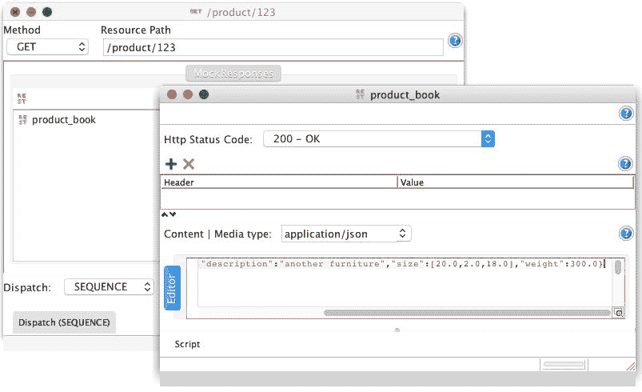

# 使用 REST 构建商业 Web 应用

到目前为止，我们一直在玩弄，但 Java 不是玩具。我们希望用 Java 做一些真实和严肃的事情，商业和专业的事情。在本章中，我们将这样做。示例不仅仅是有趣的玩具，比如前三章中的 Mastermind，而是一个真正的商业应用。实际上，它不是一个真实生活的应用。你不应该期望在书中看到这样的东西。那会太长，而且教育意义不足。然而，在本章中我们将开发的应用可以扩展，并且可以作为你决定这样做时真实生活应用的核心。

在上一章中，我们创建了 servlets。为了做到这一点，我们使用了 servlet 规范，并且手动实现了 servlets。这在当今时代是非常少见的。相反，我们将使用一个现成的框架，这次是 Spring。它是 Java 商业应用中最广泛使用的框架，我敢说它已经成为事实上的标准。它将完成我们在上一章中必须做的所有繁琐工作（至少是理解和学习 servlet 是如何工作的）。我们还将使用 Spring 进行依赖注入（为什么使用两个框架，当其中一个就能完成所有工作的时候？），并且我们将使用 Tomcat。

在上一章中，我们使用了 Guice 作为 DI 框架和 Jetty 作为 servlet 容器。它们对于某些项目来说可能是一个完美的选择。对于其他项目，其他框架可能做得更好。为了有机会在本书中查看不同的工具，我们将使用不同的框架，尽管所有示例都可以简单地使用 Tomcat 和 Spring 来创建。

我们将要开发的商业应用将是一个面向分销商的订购系统。我们将提供给用户的接口将不是一个网络浏览器；而是一个 REST。用户将自行开发与我们的系统通信并订购不同产品的应用程序。我们将开发的应用的结构将是微服务架构，我们将使用 soapUI 来测试应用程序，除了标准的 Chrome 开发者工具功能之外。

# MyBusiness 网络商店

想象一下，我们有一个庞大的贸易和物流公司。货架上有着成千上万种不同的产品；数百辆卡车来到我们的仓库运送新商品，还有数百辆卡车将商品运送到我们的客户那里。为了管理信息，我们有一个库存系统，每天、每小时、每分钟跟踪商品，以便知道我们实际上在仓库里有什么。我们不通过人工管理仓库信息来服务我们的客户。以前，我们有电话、传真机，甚至电传，但今天，我们只使用互联网和 Web 服务。我们不为我们客户提供网站。在我们想象中的业务中，我们从未直接为最终用户服务，但如今，我们有一个子公司，我们最初将其作为一个独立公司来开展这项业务。他们有一个网站，并且完全独立于我们。他们只是我们数百个注册合作伙伴之一，每个合作伙伴都使用 Web 服务接口查看我们拥有的产品、订购产品以及跟踪订单状态。

# 样本业务架构

我们的合作伙伴也是拥有自动化管理的大型公司，在多台机器上运行着几个程序。我们对他们的架构和他们使用的科技没有兴趣，但我们想整合他们的运营。我们希望以不需要任何人为交互的方式为他们提供服务，以便在我们的任何一方订购商品。为此，提供了一个可以无论他们使用什么 IT 基础设施都可以利用的 Web 服务接口。

在我们的例子中，我们想象一下，我们最近将我们的单体应用替换成了微服务架构，尽管系统中仍然有一些基于 SOAP 的解决方案，但大多数后端模块都是通过 HTTPS 和 REST 协议进行通信的。一些模块仍然依赖于每天通过 UNIX `cron`作业启动的 FTP 异步文件传输。总账系统是用 COBOL 编写的。幸运的是，我们不需要处理这些恐龙。

所有这些结构都是一个想象中的但却是现实的设置。我编造并描述了这些部分，以便您了解在一个大型企业中您可能会看到混合技术的样子。我在这里描述的是一个非常简单的设置。有些公司在其系统中使用超过一千个软件模块，这些模块使用不同的技术和完全不同的接口，所有这些模块相互连接。这并不是因为他们喜欢混乱，而是在经过 30 年的持续 IT 发展之后，新技术出现而旧技术逐渐消失。业务在变化，如果您想保持竞争力，就不能坚持使用旧技术。同时，您也不能立即替换整个基础设施。结果是，我们在企业中看到相当老旧的技术仍在运行，很多时候还有新技术。旧技术随着时间的推移而被淘汰。它们不会永远存在，而且有时当一种“恐龙”出现在我们面前时，我们还是会感到惊讶。

我们必须处理的是我们将要开发的两个前端组件。具体如下：

+   产品信息

+   订单放置和跟踪

在以下图像中，您可以查看我们所查看的结构体系结构的 UML 图。我们将与之交互的部分仅限于前端组件，但如果有一个更大的图景，这有助于理解其工作方式和它们的作用：


产品信息提供有关单个产品的信息，但它也可以根据查询标准提供产品列表。订单放置和跟踪提供放置订单的功能，并允许客户查询过去订单的状态。

为了提供产品信息，我们需要访问包含实际产品详情的产品目录模块。

产品目录可能还有许多其他任务，这也是它成为一个独立模块的原因。例如，它可以有一个工作流和审批引擎，允许产品管理员输入产品数据，经理检查和批准数据。审批通常是一个复杂的过程，考虑到拼写错误和法律问题（我们不希望交易未经许可的药物、爆炸物等），以及检查商品来源的质量和审批状态。包含了许多复杂任务，使其成为一个后端模块。在大型的企业应用程序中，前端系统很少执行除了为外部各方提供非常基本的功能之外的其他任何事情。但这对我们来说是个好事；我们可以专注于我们必须提供的服务。这对架构来说也是好事。这与面向对象编程中的原则相同：单一责任。

产品信息模块还必须咨询访问控制模块，以查看是否可以将某种产品实际交付给客户，以及与库存查看是否有任何产品剩余，这样我们就不提供缺货的产品。

订单放置和跟踪也需要访问产品库存和访问控制模块，以检查订单是否可以履行。同时，它还需要来自定价模块的服务，该模块可以计算订单的价格，以及来自物流模块的服务，该模块从库存位置触发货物的收集并运送给客户。物流还与开票系统相连，而开票系统与总账相连，但这些只是为了说明信息的流动并没有结束。还有许多其他模块在运行公司，所有这些目前都不是我们的兴趣所在。

# 微服务

上一章中描述的架构并不是一个干净的微服务架构。在任何企业中，你永远都不会遇到其纯粹的形式。它更像是我们在从单体架构迁移到微服务架构的真正公司中遇到的东西。

当应用以许多小型服务的形式开发，这些服务通过一些简单的 API（通常是通过 HTTP 和 REST）相互通信时，我们谈论微服务架构。这些服务实现业务功能，并且可以独立部署。很多时候，自动化服务部署是可取的。

单个服务可以使用不同的编程语言开发，可以使用不同的数据存储，并可以在不同的操作系统上运行；因此，它们彼此之间高度独立。它们可以，并且通常是由不同的团队开发的。重要的要求是它们可以合作；因此，一个服务实现的 API 可以被构建在其上的其他服务使用。

微服务架构并不是所有架构的圣杯。它对一些问题给出了与单体架构不同的答案，而且很多时候，这些答案使用现代工具效果更好。应用仍然需要测试和调试，性能需要管理，并且需要解决错误和问题。区别在于测试可以沿着不同的技术分离；调试可能需要更多的网络相关工作。这些可能是好的，坏的，或者同时是两者。然而，对于开发者来说，优势是明显的。他们可以独立地在更小的单元上工作，并且可以更快地看到他们工作的结果。在开发单体应用的单一模块时，结果只有在整个应用部署后才能看到。在大型应用的情况下，这可能很少见。在大型企业中，单体应用的典型部署周期是每几个月一次，比如 3 个月，但每年发布两次或一次并不罕见。开发微服务时，新模块可以在准备好并测试后立即部署。

如果你想了解更多关于微服务的信息，最原始和最权威的来源是 Martin Fowler 的文章（[`www.martinfowler.com/articles/microservices.html`](http://www.martinfowler.com/articles/microservices.html))。

# 服务接口设计

我们设计了我们将要实现的两个接口。当我们设计接口时，我们首先关注功能。格式化和协议随后考虑。接口通常应该是简单的，同时应该适应未来的变化。这是一个难题，因为我们无法预知未来。商业、物流以及所有其他专家可能看到未来的一部分：世界将如何变化，以及它将对公司的运营，尤其是对我们为合作伙伴提供的接口施加什么影响。

接口的稳定性至关重要，因为合作伙伴是外部实体。我们无法重构他们使用的代码。当我们更改代码中的 Java 接口时，编译器会在所有需要跟随更改的代码位置发出警告。对于在领域外使用的接口，情况并非如此。即使它只是一个我们在*GitHub*上发布的开源 Java 接口，我们也应该准备好，如果以不兼容的方式更改库，我们的用户将面临问题。在这种情况下，他们的软件将无法编译并与我们的库一起工作。在订单系统的例子中，这意味着他们不会从我们这里订购，我们很快就会失去业务。

这是接口应该简单的一个原因。尽管这在生活中大多数事情上都是普遍适用的，但对于这样的接口来说，这一点尤为重要。提供便利功能给合作伙伴是有吸引力的，因为这些功能易于实现。然而，从长远来看，这些功能可能会变得非常昂贵，因为它们需要维护，应该保持向后兼容，而且从长远来看，可能不会带来与成本相匹配的收益。

要访问产品信息，我们需要两个函数。其中一个列出某些产品，另一个返回特定产品的详细信息。如果它是一个 Java API，它看起来如下：

```java
List<ProductId> query(String query); 
ProductInformation byId(ProductId id);

```

类似地，订单放置可能看起来如下：

```java
OrderId placeOrder(Order order);

```

我们通过 Web 服务接口提供这些功能，更具体地说，是通过使用 JSON 的 REST。我们将更详细地讨论这些技术，包括 Spring 框架和模型-视图-控制器设计模式，但首先让我们看看产品信息控制器，以了解我们的程序将如何看起来：

```java
package packt.java9.by.example.mybusiness.productinformation; 

import ... 

@RestController 
public class ProductInformationController { 

    @Autowired 
    ProductLookup lookup; 

    @RequestMapping("/pi/{productId}") 
    public ProductInformation 
           getProductInformation(@PathVariable String productId) { 
        ProductInformation productInformation = 
                                lookup.byId(productId); 
        return productInformation; 
    } 

    @RequestMapping("/query/{query}") 
    public List<String> lookupProductByTitle(@PathVariable String query, HttpServletRequest request) { 
        //to be developed later 
    } 
}

```

如果你将 servlet 的代码与前面的代码进行比较，你可以看到这要简单得多。我们不需要处理`HttpServletRequest`对象，调用 API 获取参数，或者创建 HTML 输出并将其写入响应。框架会做这些。我们注解`@RestController`类，告诉 Spring 这是一个利用*REST*网络服务的控制器；因此，它将默认从我们返回的对象创建**JSON**响应。我们不需要关心对象到*JSON*的转换，尽管如果真的需要，我们也可以这样做。对象将自动使用类中使用的字段名和返回实例的字段值转换为*JSON*。如果对象包含比简单的`String`、`int`和`double`值更复杂的结构，则转换器已准备好嵌套结构和最常见的数据类型。

要在 servlet 上实现不同的代码处理和不同的 URL，我们只需要注解方法为`@RequestMapping`，提供 URL 的路径部分。映射字符串中的`{productId}`表示法是可读的，易于维护。Spring 将从那里剪切值并将其放入我们请求的`productId`变量中，正如`@PathVariable`注解所要求的。

实际上，产品的查找并没有在控制器中实现。这不是控制器的功能。控制器只决定调用什么业务逻辑以及使用什么视图。其中一部分是在框架中实现的，你可以看到前面代码中的非常小的一部分。业务逻辑是在一个服务类中实现的。这个类的实例被注入到`lookup`字段中。这也是 Spring 做的。我们实际上需要做的工作是调用业务逻辑，这次，因为我们只有一个，所以相当简单。

在没有更多关于框架为我们做了什么的具体细节的情况下，这些事情看起来像是魔法。因此，在继续之前，我们将查看构建块：JSON、REST、MVC 以及 Spring 框架的一些内容。

# JSON

**JSON**代表**JavaScript 对象表示法**。它在[`www.json.org/`](http://www.json.org/)网站上定义。这是一种与 JavaScript 中对象字面量定义相同的文本表示法。对象表示法以`{`字符开始，以`}`字符结束。之间的文本定义了对象的字段，形式为`string : value`。字符串是字段的名称，由于 JSON 希望是语言无关的，它允许任何字符成为字段名称的一部分，因此这个字符串（以及 JSON 中的任何字符串）应该以`"`字符开始和结束。

这可能看起来很奇怪，很多时候，当你开始使用 JSON 时，很容易忘记，并写成`{ myObject : "has a string" }`而不是正确的`{ "myObject" : "has a string" }`表示法。

字段之间用逗号分隔。在 JSON 中也可以有数组。它们分别以`[`和`]`字符开始和结束，并包含逗号分隔的值。对象字段或数组中的值可以是字符串、数字、对象、数组或常量之一，如`true`、`false`和`null`。

通常来说，JSON 是一种非常简单的表示法，可以用来描述可以存储在对象中的数据。使用文本编辑器编写它很容易，而且阅读起来也很方便，因此使用 JSON 而不是更复杂的格式进行通信时，调试起来更容易。在本章中我们将使用的库中，提供了将 JSON 转换为 Java 对象以及相反方向的转换方法。描述我们示例代码中产品的 JSON 对象样本也包含在程序的源代码中，如下所示：

```java
{"id":"125","title":"Bar Stool","description":"another furniture","size":[20.0,2.0,18.0],"weight":300.0}

```

注意，JSON 的格式不需要换行，但同时也可能这样做。程序生成的 JSON 对象通常很紧凑，并且没有格式化。当我们使用文本编辑器编辑某些对象时，我们倾向于以与我们在 Java 编程中通常所做的方式相同的方式来格式化字段的缩进。

# REST

REST 协议没有确切的定义。它代表**表示状态转移**，这可能对从未听说过它的人来说没有什么意义。当我们编写 REST API 时，我们使用 HTTP(S)协议。我们向服务器发送简单的请求，并得到我们编程的简单回答。这样，Web 服务器的客户端也是一个程序（顺便说一句，浏览器也是一个程序），它消耗来自服务器的响应。因此，响应的格式不是使用 CSS 格式化的 HTML，也不是通过 JavaScript 增强客户端功能，而是某种数据描述格式，如 JSON。REST 不对实际格式设置限制，但如今，JSON 是最广泛使用的。

描述 REST 的维基页面可在[`en.wikipedia.org/wiki/Representational_state_transfer`](https://en.wikipedia.org/wiki/Representational_state_transfer)找到。REST 接口通常很简单。HTTP 请求几乎总是使用`GET`方法。这也使得测试 REST 服务变得简单，因为没有什么比从浏览器发出`GET`请求更容易了。`POST`请求仅在服务在服务器上执行某些事务或更改时使用，这样请求就是向服务器发送数据，而不是获取某些数据。

在我们的应用程序中，我们将使用`GET`方法查询产品列表并获取有关产品的信息，我们只使用`POST`来订购产品。处理这些请求的应用程序将在 servlet 容器中运行。你已经学会了如何在不使用框架的情况下创建裸露的 servlet。在本章中，我们将使用 Spring 框架，它将许多任务从开发者那里卸载。在 servlet 编程中有很多程序结构，大多数时候都是相同的。它们被称为样板代码。Spring 框架利用模型-视图-控制器设计模式来开发 Web 应用程序；因此，在讨论 Spring 的一般情况之前，我们将简要地看看它。

# 模型-视图-控制器

**模型-视图-控制器**（**MVC**）是一种设计模式。设计模式是编程结构：一些简单的结构，为解决某些特定问题提供了一些提示。术语“设计模式”是由 Erich Gamma、Richard Helm、Ralph Johnson 和 John Vlissides 在他们的著作《设计模式：可复用面向对象软件元素》中提出并正式描述的。这本书将设计模式定义为具有*名称*、*问题*和*解决方案*的结构。*名称*描述了模式，并为开发者在讨论这些模式时提供了词汇。重要的是，不同的开发者使用相同的语言术语以便相互理解。*问题*描述了情况，即模式可以应用的设计问题。*解决方案*描述了类和对象及其之间的关系，这些关系有助于良好的设计。

其中之一是 MVC，它适合于编程 Web 应用程序，但通常适用于任何具有用户界面的应用程序。在我们的情况下，我们没有传统的用户界面，因为客户端也是一个程序；尽管如此，MVC 可以并且是一个好的选择。


如同其名称所暗示的，MVC 模式有三个部分：一个模型、一个视图和一个控制器。这种分离遵循单一责任原则，要求每个部分对应一个不同的责任。控制器负责处理系统的输入，并决定使用哪个模型和视图。它控制执行，但通常不执行任何业务逻辑。模型执行业务逻辑并包含数据。视图将模型数据转换为客户端可消费的表示形式。

MVC 是一个众所周知且广泛使用的架构模式，Spring 直接支持它，这样当您创建一个 Web 应用程序时，您可以通过使用注解来编程框架内构建的控制器，从而本质上对其进行配置。您可以编程视图，但更有可能的是您将使用框架内构建的视图。您希望将数据以 XML、JSON**、**或 HTML 的形式发送到客户端。如果您非常独特，您可能希望发送 YAML，但通常就是这样。您不希望实现一个需要在服务器上编程的新格式，而且由于这是新的，也需要在客户端上编程。

我们创建模型，这次我们还对它进行编程。毕竟，那是业务逻辑。框架可以为我们做很多事情，主要是大多数应用程序都相同的事情，但对于业务逻辑。业务逻辑是区分我们的代码与其他程序的代码。这正是我们必须编写的代码。

另一方面，这正是我们所希望的。专注于业务代码，避免框架提供的所有样板代码。

现在我们已经了解了 JSON、REST 以及通用的模型视图控制器设计模式，让我们看看 Spring 如何管理这些技术，以及我们如何将这些技术付诸实践。

# Spring 框架

Spring 框架是一个庞大的框架，包含多个模块。该框架的第一个版本于 2003 年发布，自那时起，已有四个主要版本发布，提供了新的和增强的功能。目前，Spring 是事实上的企业级框架，可能比标准的 **EJB 3.0** 更广泛地被使用。

Spring 支持依赖注入、**面向切面编程（AOP**）、以传统和对象关系映射方式对 **SQL** 和 **NoSQL** 数据库进行持久化、事务支持、消息传递、Web 编程以及许多其他功能。您可以使用 **XML** 配置文件、注解或 Java 类来配置它。

# Spring 架构

Spring 不是单体架构。您可以使用它的一部分，或者只使用一些功能。您可以包含 Spring 需要的一些模块，并排除其他模块。一些模块依赖于其他模块，但 Gradle、Maven 或其他构建工具会处理这一点。

下图显示了 Spring 框架版本 4 的模块：


Spring 自从首次发布以来一直在不断发展，它仍然被视为一个现代框架。框架的核心是一个类似于我们在上一章中看到的依赖注入容器。随着框架的发展，它还支持 AOP 和许多其他企业功能，例如面向消息的模型和基于 Model View Controller 的 Web 编程，不仅支持 servlets，还支持 portlets 和 WebSockets。由于 Spring 面向企业应用领域，它还支持多种数据库处理方式。它支持使用模板的 JDBC、**对象关系映射**（**ORM**）和事务管理。

在示例程序中，我们使用了一个相当新的模块：Spring Boot。这个模块使得开始编写和运行应用程序变得极其容易，假设了很多通常对许多程序都相同的配置。它包含一个嵌入的 servlet 容器，它为默认设置进行配置，并在可能的地方配置 Spring，这样我们就可以专注于编程方面，而不是 Spring 配置。

# Spring 核心

核心模块的核心元素是上下文。当 Spring 应用程序启动时，容器需要一个上下文，以便容器可以在其中创建不同的 bean。这对于任何依赖注入容器来说都是非常通用和真实的。如果我们以编程方式创建两个不同的上下文，它们可能独立存在于同一个 **JVM** 中。如果声明了一个作为单例的 bean，那么应该只有一个实例，那么容器在需要时将为上下文创建一个单例 bean 的实例。代表上下文的对象引用了我们已经创建的对象。然而，如果有多个上下文，它们将不知道 JVM 中已经存在另一个上下文，并且已经有一个实例，容器将为另一个上下文创建单例 bean 的新实例。

通常，我们不会在程序中使用超过一个上下文，但在单个 JVM 中存在多个上下文的例子却很多。当不同的 servlet 在同一个 servlet 容器中运行时，它们在同一个 JVM 中运行，由类加载器分隔，并且它们可能各自使用 Spring。在这种情况下，上下文将属于 servlet，并且每个 servlet 都将有一个新的上下文。

在上一章中，我们使用了 Guice。Spring 上下文类似于 Guice 注入器。在上一章中，我有点作弊，因为我正在编程 Guice 以为每个请求创建一个新的注入器。这远远不是最优的，Guice 提供了一个可以处理 servlet 环境的注入器实现。作弊的原因是我想要更多地关注 DI 架构的基本要素，并且我不想通过引入复杂的（好吧，更复杂的）注入器实现来使代码复杂化。

在 Spring 上下文行为中，它所执行的操作由`ApplicationContext`接口定义。这个接口有两个扩展和许多实现。`ConfigurableApplicationContext`扩展了`ApplicationContext`，定义了设置器，而`ConfigurableWebApplicationContext`定义了在 Web 环境中需要的方 法。当我们编程 Web 应用程序时，我们通常不需要直接与上下文交互。框架以编程方式配置 servlet 容器，并包含创建上下文和调用我们方法的 servlet。这些都是为我们创建的样板代码。

上下文跟踪创建的豆，但它不会创建它们。要创建豆，我们需要豆工厂（至少一个）。Spring 中豆工厂的最顶层接口是`BeanFactory`。对象和豆之间的区别在于，豆工厂创建豆，它在上下文中注册，并且有一个`String`名称。这样，程序可以通过名称引用豆。

在 Spring 中，不同的豆（bean）可以以几种不同的方式配置。最古老的方法是创建一个 XML 文件来描述不同的豆，指定名称、需要实例化的类以创建豆，以及如果豆需要注入其他豆以进行创建的字段。

这种方法的动机在于，这样豆的连接和配置可以完全独立于应用程序代码。它变成一个可以单独维护的配置文件。如果我们有一个可能在不同环境中运行的大型应用程序，库存数据的访问可能有多种方式。在一个环境中，库存可以通过调用 SOAP 服务来获取。在另一个环境中，数据可以通过 SQL 数据库访问。在第三个环境中，它可以在某些 NoSQL 存储中可用。每种访问都作为实现一个公共库存访问接口的单独类来实现。应用程序代码只依赖于接口，而容器必须提供一种或另一种实现。

当豆连接配置在 XML 中时，则只需编辑此 XML 文件，并且可以使用适合该环境的接口实现来启动代码。

下一个可能性是使用注解来配置豆（Beans）。很多时候，我们使用豆和 Spring 并不是因为存在许多针对豆功能的实现，而是因为我们想将对象实例的创建与功能分离。这是一种良好的风格：即使实现是单一的，没有替代方案，也要分离关注点。然而，在这种情况下，创建 XML 配置是多余的。如果我们的代码中有一个接口以及它的单一实现，那么为什么我要在 XML 中指定通过创建一个实现该接口的类的对象，我应该使用实现该接口的类呢？这显然是很明显的，不是吗？我们不喜欢编程那些可以被自动化的东西。

为了表示一个类可以用作豆，并且可能提供名称，我们可以使用`@Component`注解。我们不需要提供名称作为参数。在这种情况下，名称将是一个空字符串，但如果我们不引用它，为什么要有一个名称呢？Spring 扫描类路径上的所有类，并识别注解的类，并且知道它们是用于创建豆的候选者。当一个组件需要注入另一个豆时，字段可以注解为`@Autowired`或`@Inject`。`@Autowired`注解是 Spring 注解，在`@Inject`注解标准化之前就已经存在。如果你打算在 Spring 容器之外使用你的代码，建议使用标准注解。功能上，它们是等效的。

在我们的代码中，当 Spring 创建`ProductInformationController`组件的实例时，它会看到需要一个`ProductLookup`的实例。这是一个接口，因此 Spring 开始寻找实现这个接口的某个类，创建它的实例，可能首先创建其他豆，然后注入它，设置字段。你可以选择注解字段的 setter 而不是字段本身。在这种情况下，即使 setter 是私有的，Spring 也会调用 setter。你可以通过构造函数参数注入依赖项。setter 注入、字段注入和构造函数注入之间的主要区别是，如果你使用构造函数注入，你不能在没有依赖项的情况下创建豆。当豆被实例化时，它应该并且将会注入所有其他豆，以便它依赖于使用构造函数注入。同时，需要通过 setter 注入或直接注入字段的依赖项，可以在容器在实例化类和准备豆之间某个时间点实例化。

这种细微的差异可能在你构造函数代码可能比简单的依赖设置更复杂或依赖变得复杂之前，看起来并不有趣或不重要。在复杂构造函数的情况下，代码应该注意对象尚未完全创建的事实。这通常适用于任何构造函数代码，但在由依赖注入容器创建的 bean 的情况下，这一点尤为重要。因此，可能建议使用构造函数注入。在这种情况下，依赖项已经存在；如果程序员犯了一个错误，忘记了对象尚未完全初始化，并在构造函数或从构造函数调用的方法中使用它，那么依赖项就在那里。此外，使用构造函数初始化依赖项并将这些字段声明为`final`是干净且结构良好的。

另一方面，构造函数注入有其缺点。

如果不同的对象相互依赖，并且依赖图中存在环，那么如果你使用构造函数依赖，Spring 将面临困难。当类*A*需要类*B*，反之亦然，作为最简单的循环，如果依赖注入是构造函数依赖，那么没有另一个类*A*或*B*可以创建。在这种情况下，构造函数注入不能使用，至少应该打破一个依赖的环。在这种情况下，setter 注入是不可避免的。

当存在可选依赖时，setter 注入可能也更好。很多时候，某个类可能不需要同时使用所有依赖。有些类可能同时使用数据库连接或 NoSQL 数据库句柄，但不是同时使用。尽管这也可能是一个代码异味，可能是糟糕的 OO 设计的迹象，但这种情况可能发生。这可能是出于故意，因为纯 OO 设计会导致对象层次结构太深，类太多，超出了可维护的极限。如果这种情况发生，可选依赖可能更适合使用 setter 注入。一些被配置并设置；一些保留默认值，通常是`null`。

最后但同样重要的是，如果注解不够用，我们可以使用 Java 类来配置容器。例如，在我们的代码库中，`ProductLookup`接口有多个实现，正如它现在所做的那样。（如果你没有认出这一点，不用担心；我还没有告诉你。）有一个`ResourceBasedProductLookup`类，它从包中读取属性文件，主要用于测试应用程序，还有一个`RestClientProductLookup`，它是接口的生产型实现。如果我没有其他配置，只是用`@Autowired`注解`lookup`字段，Spring 将不知道使用哪个实现，并在启动时返回以下错误信息：

```java
Error starting ApplicationContext. To display the auto-configuration report re-run your application with 'debug' enabled. 
2016-11-03 07:25:01.217 ERROR 51907 --- [  restartedMain] o.s.b.d.LoggingFailureAnalysisReporter   :  

*************************** 
APPLICATION FAILED TO START 
*************************** 

Description: 

Parameter 0 of constructor in packt.java9.by.example.mybusiness.productinformation.ProductInformationController required a single bean, but 2 were found: 
        - resourceBasedProductLookup: defined in file [/.../sources/ch07/productinformation/build/classes/main/packt/java9/by/example/mybusiness/productinformation/lookup/ResourceBasedProductLookup.class] 
        - restClientProductLookup: defined in file [/.../sources/ch07/productinformation/build/classes/main/packt/java9/by/example/mybusiness/productinformation/lookup/RestClientProductLookup.class] 

Action: 

Consider marking one of the beans as @Primary, updating the consumer to accept multiple beans, or using @Qualifier to identify the bean that should be consumed

```

这是一个相当直白的错误消息；它告诉了我们很多。现在是我们可以在 XML 中配置 bean 的时候，但与此同时，我们也可以使用 Java 来配置它。

许多开发者第一次没有理解这个要点。我自己也没有理解。整个 XML 配置是为了将配置与代码分离。是为了创建系统管理员更改配置并自由选择某个接口的一个或另一个实现，将应用程序连接起来的可能性。现在 Spring 告诉我，返回到程序化方式更好？

同时，多年来我听到很多人对 XML 并不比 Java 代码更好的担忧。XML 编写本质上是一种编程，只是工具和 IDE 对 XML 的支持不如 Java 代码（尽管后者在近年来发展了很多，尽管对于 Spring XML 配置）。

要理解从 XML 返回 Java 代码的概念，我们必须回到 XML 配置方式的纯粹原因和目标。XML Spring 配置的主要优势不在于格式不是程序性的，而在于配置代码与应用程序代码的分离。如果我们用 Java 编写配置并保持那些配置类尽可能少，并且它们保持应有的状态，那么应用程序代码与配置代码的分离仍然存在。我们只是将配置的格式从 XML 改为 Java。优势众多。其中之一是，当我们编辑时，IDE 会识别类名，我们可以在 Java 中实现自动完成（注意，这也在一些 IDE 中使用插件扩展的情况下使用 XML 实现）。在 Java 的情况下，IDE 支持无处不在。Java 比 XML 更易读。好吧，这是一个口味问题，但大多数人更喜欢 Java 而不是 XML。

系统管理员也可以编辑 Java 代码。当他们编辑 XML 配置时，通常需要从 JAR 或 WAR 文件中提取它，编辑它，然后再次打包存档。在 Java 编辑的情况下，他们还必须发出`gradle war`命令或类似命令。这对于在服务器上运行 Java 应用程序的系统管理员来说不应该是一个阻止因素。再次强调，这并不是 Java 编程。这只是编辑一些 Java 代码文件和替换一些类名字面量和字符串常量。

我们在我们的示例应用程序代码中遵循这种方法。在应用程序中我们有两个配置文件：一个用于本地部署和测试，另一个用于生产。`@Profile`注解指定了配置应该使用哪个配置文件。当代码执行时，配置文件可以在命令行上指定为一个系统属性，如下所示：

```java
    $ gradle -Dspring.profiles.active=local bootRun

```

配置类被注解为`@Configuration`。作为 bean 工厂的方法被注解为`@Bean`：

```java
package packt.java9.by.example.mybusiness.productinformation; 
import ... 
@Configuration 
@Profile("local") 
public class SpringConfigurationLocal { 
    @Bean 
    @Primary 
    public ProductLookup productLookup() { 
        return new ResourceBasedProductLookup(); 
    } 
    @Bean 
    public ProductInformationServiceUrlBuilder urlBuilder(){ 
        return null; 
    } 
}

```

Bean 工厂简单地返回一个实现了`ProductLookup`接口的`ResourceBasedProductLookup`类的新实例。这个实现可以在没有外部服务可依赖的情况下用于本地测试应用程序。这个实现从打包到 JAR 应用程序中的本地资源文件中读取产品数据。

配置的生产版本与之前没有太大不同，但正如预期的那样，有一些更多的事情需要配置：

```java
@Configuration 
@Profile("production") 
public class SpringConfiguration { 

    @Bean 
    @Primary 
    public ProductLookup productLookup() { 
        return new RestClientProductLookup(urlBuilder()); 
    } 

    @Bean 
    public ProductInformationServiceUrlBuilder urlBuilder(){ 
        return new ProductInformationServiceUrlBuilder( 
                                         "http://localhost"); 
    } 
}

```

这个版本的`ProductLookup`服务类使用外部 REST 服务来检索它将向客户端展示的数据。为此，它需要这些服务的 URL。这些 URL 通常应该进行配置。在我们的例子中，我们实现了一个解决方案，这些 URL 可以即时计算。我试图构造一个可能在实际生活中需要的情况，但所有推理都变得扭曲，我放弃了。真正的理由是，这样我们可以看到包含需要另一个 Bean 注入的 Bean 的代码。现在，请注意，`ProductInformationServiceUrlBuilder`实例 Bean 的定义方式与`ProductLookup`Bean 相同，当它需要注入到`ProductLookup`Bean 的构造函数中时，使用的是定义 Bean 的方法，而不是直接使用下面的表达式：

```java
new ProductInformationServiceUrlBuilder("http://localhost");

```

后者可能工作，但并非在所有情况下都适用，我们不应该使用它。关于原因，我们将在后续章节讨论 Spring 的 AOP 时再返回。

还要注意，没有必要定义一个接口来定义一个 Bean。Bean 方法返回的类型也可以是一个类。上下文将使用适合所需类型的那个方法，如果有多个合适的类型并且配置不够精确，就像我们看到的，容器将记录一个错误并且不会工作。

在为本地配置文件提供服务的配置中，我们为`ProductInformationServiceBuilder`创建了一个`null`值。这是因为我们在使用本地测试时不需要它。此外，如果调用这个类的任何方法，它将是一个错误。错误应该尽快被发现；因此，`null`值是一个不错的选择。

`ProductInformationServiceUrlBuilder`类非常简单：

```java
package packt.java9.by.example.mybusiness.productinformation; 

public class ProductInformationServiceUrlBuilder { 
    private final String baseUrl; 

    public ProductInformationServiceUrlBuilder(String baseUrl) { 
        this.baseUrl = baseUrl; 
    } 

    public String url(String service, String parameter) { 
        final String serviceUrl; 
        switch (service) { 
            case "pi": 
                serviceUrl =  
                  baseUrl + ":8081/product/{id}"; 
                break; 
            case "query": 
                serviceUrl =  
                  baseUrl + ":8081/query/{query}"; 
                break; 
            case "inventory": 
                serviceUrl =  
                  baseUrl + ":8083/inventory/{id}"; 
                break; 
            default: 
                serviceUrl = null; 
                break; 
        } 
        return serviceUrl; 
    } 
}

```

这个类也需要一个构造函数参数，我们在配置中使用了字符串常量。这清楚地表明，可以使用简单的对象来初始化一些依赖项（毕竟，这还是纯 Java），但它可能会妨碍某些 Spring 特性的工作。

# 服务类

我们有两个服务类。这些类为控制器提供数据并实现业务逻辑，无论它们多么简单。其中一个服务类实现调用基于 REST 的服务，而另一个从属性文件中读取数据。后者可以用于离线测试应用程序。调用 REST 服务的那个用于生产环境。它们都实现了`ProductLookup`接口：

```java
package packt.java9.by.example.mybusiness.productinformation; 
import java.util.List; 
public interface ProductLookup { 
    ProductInformation byId(String id); 
    List<String> byQuery(String query); 
}

```

`ResourceBasedProductLookup` 将整个数据库存储在一个名为 `products` 的映射中。当调用其中一个服务方法时，它会从属性文件中填充。当服务方法开始时，会从每个服务方法中调用 `private` 方法 `loadProducts`，但只有当数据尚未加载时才会加载数据：

```java
package packt.java9.by.example.mybusiness.productinformation.lookup; 
import... 

@Service 
public class ResourceBasedProductLookup implements ProductLookup { 
    private static Logger log = LoggerFactory.getLogger(ResourceBasedProductLookup.class);

```

该类使用 `@Service` 注解。这个注解实际上等同于 `@Component` 注解。这仅仅是相同注解的另一个名称。Spring 也处理 `@Component` 注解，使得如果一个注解接口被 `@Component` 注解，那么这个注解也可以用来表示一个类是 Spring 组件。如果你想表示一个类不是简单的组件而是其他特殊类型，以便提高可读性，你可以编写自己的注解接口。

例如，启动你的 IDE 并导航到 `org.springframework.stereotype.Service` 接口的源代码：

```java
    private ProductInformation 
                  fromProperties(Properties properties) { 
        final ProductInformation pi = new ProductInformation(); 
        pi.setTitle(properties.getProperty("title")); 
        pi.setDescription(properties.getProperty("description")); 
        pi.setWeight( 
           Double.parseDouble(properties.getProperty("weight"))); 
        pi.getSize()[0] = 
           Double.parseDouble(properties.getProperty("width")); 
        pi.getSize()[1] =  
           Double.parseDouble(properties.getProperty("height")); 
        pi.getSize()[2] =  
           Double.parseDouble(properties.getProperty("depth")); 
        return pi; 
    }

```

`fromProperties` 方法创建一个 `ProductInformation` 实例，并从 `Properties` 对象中提供的参数填充它。`Properties` 类是一个古老且广泛使用的类型。尽管有更多现代的格式和类，但它仍然被广泛使用，你可能会遇到这个类。这正是我们在这里使用它的原因。

`ProductInformation` 是一个简单的 **数据传输对象**（**DTO**），它不包含任何逻辑，只有字段、setter 和 getter。它还包含一个常量，`emptyProductInformation`，它持有具有空值的类实例的引用。

一个 `Properties` 对象类似于一个 `Map` 对象。它包含用 `String` 键分配的 `String` 值。正如我们将在示例中看到的那样，有一些方法可以帮助程序员从一个所谓的属性文件中加载 `Properties` 对象。这样的文件通常具有 `.properties` 扩展名，并且包含以下格式的键值对：

```java
key=value

```

例如，`123.properties` 文件包含以下内容：

```java
id=123 
title=Book Java 9 by Example 
description=a new book to learn Java 9 
weight=300 
width=20 
height=2 
depth=18

```

`properties` 文件用于存储简单的配置值，并且几乎仅用于包含特定语言的常量。这是一个非常扭曲的使用，因为 `properties` 文件是 **ISO Latin-1** 编码的文件，如果你需要使用一些特殊的 UTF-8 字符，你必须使用 `\uXXXX` 格式或使用 native2ascii 转换程序来输入它们。你不能简单地以 UTF-8 格式保存它们。尽管如此，这是用于程序国际化的特定语言字符串所使用的文件格式（也简称为 i18n，因为从起始的 i 到最后的 n 之间有 18 个字符）。

要获取 `Properties` 对象，我们必须读取项目中的文件，并将它们打包成一个 JAR 文件。Spring 类 `PathMatchingResourcePatternResolver` 帮助我们这样做。

哎呀，是的，我知道！当我们使用 Spring 时，我们必须习惯这些长名称。无论如何，在企业环境中广泛使用这样的长且描述性的名称，它们是解释类功能所必需的。

我们声明一个将包含所有产品的映射，在测试期间：

```java
    final private Map<String, ProductInformation> 
                            products = new HashMap<>();

```

键是产品 ID，在我们的例子中是一个字符串。值是我们使用`fromProperties`方法填充的`ProductInformation`对象：

```java
    private boolean productsAreNotLoaded = true;

```

下一个字段表示产品尚未加载：

新手程序员通常使用名为`productsAreLoaded`的相反值，并将其默认设置为`false`。在这种情况下，我们只会在否定值的地方读取值，或者`if`命令的主分支成为不执行部分。这两种做法都不是最佳实践。

```java
    private void loadProducts() { 
        if (productsAreNotLoaded) { 
            try { 
                Resource[] resources = 
                   new PathMatchingResourcePatternResolver() 
                            .getResources( 
                               "classpath:products/*.properties"); 
                for (Resource resource : resources) { 
                    loadResource(resource); 
                    } 
                } 
                productsAreNotLoaded = false; 
            } catch (IOException ex) { 
                log.error("Test resources can not be read",ex); 
            } 
        } 
    }

```

`getResources`方法返回所有位于`products`目录下且具有`.properties`扩展名的资源（文件）：

```java
private void loadResource(Resource resource) throws IOException { 
    final int dotPos = resource.getFilename().lastIndexOf('.'); 
    final String id = resource.getFilename().substring(0, dotPos); 
    Properties properties = new Properties(); 
    properties.load(resource.getInputStream()); 
    final ProductInformation pi = fromProperties(properties); 
    pi.setId(id); 
    products.put(id, pi); 
}

```

产品 ID 由文件名给出。这是通过简单的字符串操作计算的，切除了扩展名。`Resource`也可以提供一个输入流，`Properties`类的`load`方法可以使用它一次性从文件中加载所有属性。最后，我们将新的`ProductInformation`对象保存到映射中。

我们还有一个特殊的空`noProduct`列表。当我们想要搜索产品但没有产品时，会返回这个列表：

```java
    private static final List<String> noProducts = 
                                            new LinkedList<>();

```

产品查找服务只是从`Map`中取一个产品并返回它，或者如果不存在，则返回一个空产品：

```java
@Override 
public ProductInformation byId(String id) { 
    loadProducts(); 
    if (products.containsKey(id)) { 
        return products.get(id); 
    } else { 
        return ProductInformation.emptyProductInformation; 
    } 
}

```

查询要复杂一些。它实现了通过标题搜索产品的功能。现实生活中的实现可能实现更复杂的逻辑，但这个版本仅用于本地测试；因此，通过标题搜索就足够了，可能甚至比实际必要的还要复杂：

```java
@Override 
public List<String> byQuery(String query) { 
    loadProducts(); 
    List<String> pis = new LinkedList<>(); 
    StringTokenizer st = new StringTokenizer(query, "&="); 
    while (st.hasMoreTokens()) { 
        final String key = st.nextToken(); 
        if (st.hasMoreTokens()) { 
            final String value = st.nextToken(); 
            log.debug("processing {}={} query", key, value); 
            if (!"title".equals(key)) { 
                return noProducts; 
            } 
            for (String id : products.keySet()) { 
                ProductInformation pi = products.get(id); 
                if (pi.getTitle().startsWith(value)) { 
                    pis.add(id); 
                } 
            } 
        } 
    } 
    return pis; 
}

```

实现生产功能的服务类要简单得多。奇怪的是，但很多时候测试代码比生产代码复杂：

```java
package packt.java9.by.example.mybusiness.productinformation.lookup; 

import ... 

@Component 
public class RestClientProductLookup implements ProductLookup { 
    private static Logger log = LoggerFactory.getLogger(RestClientProductLookup.class); 

    final private ProductInformationServiceUrlBuilder piSUBuilder; 

    public RestClientProductLookup( 
               ProductInformationServiceUrlBuilder piSUBuilder) { 
        this.piSUBuilder = piSUBuilder; 
    }

```

构造函数用于注入 URL 构建器 bean，这就是该类所有的辅助代码。其余的是两个服务方法：

```java
    @Override 
    public ProductInformation byId(String id) { 
        Map<String, String> uriParameters = new HashMap<>(); 
        uriParameters.put("id", id); 
        RestTemplate rest = new RestTemplate(); 
        InventoryItemAmount amount = rest.getForObject( 
                        piSUBuilder.url("inventory"), 
                        InventoryItemAmount.class, 
                        uriParameters); 
        if ( amount.getAmount() > 0) { 
            return rest.getForObject(piSUBuilder.url("pi"), 
                    ProductInformation.class, 
                    uriParameters); 
        } else { 
            return ProductInformation.emptyProductInformation; 
        } 
    }

```

`byId`方法首先调用库存服务以查看库存中是否有任何产品。这个 REST 服务返回一个具有以下格式的 JSON，`{ amount : nnn }`；因此，我们需要一个具有`int amount`字段、setter 和 getter 的类（如此简单，我们在此不列出）。

Spring 的`RestTemplate`提供了一个访问 REST 服务的简单方法。它只需要 URL 模板、用于转换结果的类型以及一个带有参数的`Map`对象。URL 模板字符串可以像 Spring 控制器中的请求映射一样包含参数，参数名称位于`{}`字符之间。模板类提供了访问 REST 服务的简单方法。它自动执行序列化、发送参数和反序列化、接收响应。在`GET`请求的情况下，不需要序列化。数据在请求 URL 中，`{xxx}`占位符被作为第三个参数提供的映射中的值替换。对于大多数格式，反序列化都是现成的。在我们的应用程序中，REST 服务发送 JSON 数据，并在响应的`Content-Type` HTTP 头中指示。`RestTemplate`将 JSON 转换为作为参数提供的类型。如果服务器决定以 XML 格式发送响应，并且它也会在 HTTP 头中指示，`RestTemplate`将自动处理这种情况。实际上，查看代码，我们无法知道响应是如何编码的。这也是一件好事，因为它使客户端变得灵活，同时我们也不需要处理这些技术细节。我们可以专注于业务逻辑。

同时，在序列化或其他一些功能需要配置参数的情况下，该类也提供了配置参数，以便它自动需要这些参数。例如，您可以提供序列化方法，尽管我建议您使用默认可用的任何方法。在大多数情况下，当开发者认为需要任何这些函数的特殊版本时，他们的代码原始设计是有缺陷的。

商业逻辑非常简单。我们首先询问库存是否有任何产品在库存中。如果有（超过零），那么我们查询产品信息服务并返回详细信息。如果没有，则返回一个空记录。

另一个服务甚至更简单。它只是调用基础服务并返回结果：

```java
    @Override 
    public List<String> byQuery(String query) { 
        Map<String, String> uriParameters = new HashMap<>(); 
        uriParameters.put("query", query); 
        RestTemplate rest = new RestTemplate(); 
        return rest.getForObject( 
                  piSUBuilder.url("query"), 
                  List.class, 
                  uriParameters); 
    } 
}

```

# 编译和运行应用程序

我们使用`gradle`来编译和运行应用程序。由于应用程序没有在大多数类似应用程序中出现的特定配置，因此使用 Spring Boot 是明智的。Spring Boot 使得创建和运行 Web 应用程序变得极其简单。我们需要一个 Java 标准的`public static void main`方法，通过 Spring 启动应用程序：

```java
package packt.java9.by.example.mybusiness.productinformation; 
import ... 
@SpringBootApplication( 
        scanBasePackageClasses = 
          packt.java9.by.example.mybusiness.SpringScanBase.class) 
public class Application { 
    public static void main(String[] args) { 
        SpringApplication.run(Application.class, args); 
    } 
}

```

该方法只是启动`StringApplication`类的`run`方法。它传递原始参数以及应用程序所在的类。Spring 使用这个类来读取注解。`@SpringBootApplication`注解表示这个类是一个 Spring Boot 应用程序，并提供配置包含应用程序的包的参数。为此，你可以提供包含类的包的名称，但你也可以提供一个位于基础包中的类，该基础包包含 Spring 需要了解的所有类。你可能无法使用注解参数的类版本，因为根包可能不包含任何类，只有子包。同时，将根包的名称作为`String`提供，在编译时不会揭示任何错误或错位。一些*IDE*可能认识到参数应该是包名，或者在你重构或重命名包时，它可能会扫描程序中的字符串以查找包名，并为你提供支持，但这只是启发式方法。通常的做法是在根包中创建一个什么也不做的占位符类，以防那里没有类。这个类可以用作将`scanBasePackageClasses`作为注解参数而不是需要`String`的`scanBasePackages`。在我们的例子中，我们有一个空的接口`SpringScanBase`作为占位符。

Spring 扫描类路径上的所有类，识别它可以解释的组件和字段注解，并使用这些知识在需要时创建配置为无配置的 bean。

注意，包含在 JDK 中的抽象类`ClassLoader`不提供任何类扫描方法。由于 Java 环境和框架可以实施自己的`ClassLoaders`，因此有可能（但非常不可能）某些实现没有提供`URLClassLoader`提供的扫描功能。`URLClassLoader`是类加载功能的非抽象实现，就像`ClassLoader`一样，也是 JDK 的一部分。我们将在后续章节中讨论类加载机制的复杂性。

`gradle`构建文件包含通常的东西。它指定了仓库、Java 插件、IDE 以及 Spring Boot 插件。它还指定了在构建过程中生成的 JAR 文件的名称。最重要的部分是依赖列表：

```java
buildscript { 
    repositories { 
        mavenCentral() 
    } 
    dependencies { 
        classpath("org.springframework.boot:spring-boot-gradle-plugin:1.4.1.RELEASE") 
    } 
} 

apply plugin: 'java' 
apply plugin: 'eclipse' 
apply plugin: 'idea' 
apply plugin: 'spring-boot' 

jar { 
    baseName = 'packt-ch07-microservice' 
    version =  '1.0.0' 
} 

repositories { 
    mavenCentral() 
} 

bootRun { 
    systemProperties System.properties 
} 

sourceCompatibility = 1.9 
targetCompatibility = 1.9 

dependencies { 
    compile("org.springframework.boot:spring-boot-starter-web") 
    compile("org.springframework.boot:spring-boot-devtools") 
    compile("org.springframework:spring-aop") 
    compile("org.springframework:spring-aspects") 
    testCompile("org.springframework.boot:spring-boot-starter-test") 
}

```

我们依赖于 Spring Boot 包，一些测试包，AOP 支持（我们很快将探讨），以及 Spring Boot devtools。

Spring Boot devtools 使得在重新编译时能够重新启动 Web 应用程序，而无需重新启动内置的 Tomcat 服务器。假设我们使用以下命令行启动应用程序：

```java
    gradle -Dspring.profiles.active=production bootRun

```

Gradle 启动应用程序，并且每当它看到它运行的类被修改时，它会重新加载它们，我们可以在几秒钟内测试修改后的应用程序。

`-Dspring.profiles.active=production`参数指定生产配置文件应该处于活动状态。为了能够使用此命令行参数，我们还需要在构建文件中包含`bootRun{}`配置闭包。

# 测试应用程序

应用程序应该为每个类编写单元测试，除了可能不包含任何功能的 DTO 类。设置器和获取器是由 IDE 创建的，而不是由程序员输入的，因此在这些设置中不太可能出现错误。如果有与这些类相关的错误，更有可能是一些无法通过单元测试发现的集成问题。由于我们在前面的章节中详细讨论了单元测试，因此我们将更多地关注集成测试和应用测试。

# 集成测试

集成测试与单元测试非常相似，很多时候，新手程序员声称他们在进行单元测试，而实际上他们正在进行集成测试。

集成测试驱动代码，但不单独测试单个类（单元），模拟类可能使用的所有内容。相反，它们测试了执行测试所需的大多数类的功能。这样，集成测试确实测试了类能够协同工作，不仅满足它们自己的规范，而且确保这些规范能够协同工作。

在集成测试中，外部世界（如外部服务）和数据库的访问仅进行模拟。这是因为集成测试应该在集成服务器上运行，在执行单元测试的相同环境中，在这些外部接口可能不可用。很多时候，数据库使用内存 SQL 进行模拟，外部服务使用一些模拟类进行模拟。

Spring 提供了一个很好的环境来执行此类集成测试。在我们的项目中，我们有一个示例集成测试：

```java
package packt.java9.by.example.mybusiness.productinformation; 
import ...  
@RunWith(SpringRunner.class) 
@SpringBootTest(classes = Application.class) 
@AutoConfigureMockMvc 
@ActiveProfiles("local") 
public class ProductInformationControllerTest { 
    @Autowired 
    private MockMvc mockMvc; 
    @Test 
    public void noParamGreetingShouldReturnDefaultMessage()  
                                             throws Exception { 
        this.mockMvc.perform(get("/pi")).andDo(print()) 
                .andExpect(status().isNotFound()); 
    } 
    @Test 
    public void paramGreetingShouldReturnTailoredMessage() 
                                             throws Exception { 

        this.mockMvc.perform(get("/pi/123")) 
                .andDo(print()).andExpect(status().isOk()) 
                .andExpect(jsonPath("$.title") 
                .value("Book Java 9 by Example")); 
    } 

}

```

这远非一个完整且功能齐全的集成测试。有许多情况没有被测试，但在这里它作为一个例子是很好的。为了支持 Spring 环境，我们必须使用`SpringRunner`类。`@RunWith`注解由 JUnit 框架处理，所有其他注解都是针对 Spring 的。当 JUnit 框架看到存在一个`@RunWith`注解和一个指定的运行器类时，它将启动该类而不是标准运行器。`SpringRunner`为测试设置 Spring 上下文并处理注解。

`@SpringBootTest`指定了我们需要测试的应用程序。这有助于 Spring 读取该类及其上的注解，识别要扫描的包。

`@AutoConfigureMockMvc`告诉 Spring 配置一个模拟的模型视图控制器框架版本，可以在没有 servlet 容器和 Web 协议的情况下执行。使用它，我们可以测试我们的 REST 服务而无需真正进入网络。

`@ActiveProfiles`告诉 Spring 活动配置是本地配置，并且 Spring 必须使用由注解`@Profile("local")`表示的配置。这是一个使用`.properties`文件而不是外部 HTTP 服务的版本；因此，这对于集成测试是合适的。

测试在模拟框架内部执行`GET`请求，执行控制器中的代码，并使用模拟框架和流畅 API 以非常可读的方式测试返回的值。

注意，使用属性文件并且服务实现基于属性文件有点过度。我创建这个是为了能够交互式地启动应用程序而不需要任何真实的服务支持。考虑以下命令：`gradle -Dspring.profiles.active=local bootRun`。

如果我们发出前面的命令，那么服务器将使用这个本地实现启动。如果我们只是为了进行集成测试，那么服务类的本地实现应该位于`test`目录下，并且应该非常简单，主要只对任何预期的请求返回常量响应，如果收到任何非预期的请求则抛出错误。

# 应用程序测试

考虑以下命令：

```java
    gradle -Dspring.profiles.active=production bootRun

```

如果我们发出前面的命令启动应用程序，并打开浏览器到 URL `http://localhost:8080/pi/123`，我们将在浏览器屏幕上看到一个巨大的错误消息。哎呀...

它显示`Internal Server Error, status=500`或类似错误。这是因为我们的代码想要连接到支持服务，但我们还没有。为了在这个级别上测试应用程序，我们应该创建支持服务或者至少是它们的模拟。最简单的方法是使用 soapUI 程序。

soapUI 是一个可以从[`www.soapui.org/`](https://www.soapui.org/)获取的 Java 程序。它有一个开源免费版本和一个商业版本。对于我们的目的，免费版本就足够了。我们可以通过简单的点击下一步的方式安装它，因为它有一个设置向导。安装后，我们可以启动它并使用图形用户界面。

我们创建一个新的测试项目，目录和库存，并在其中设置两个 REST 模拟服务：目录和库存，如下面的截图所示：


我们为每个模拟服务设置请求匹配和响应。响应的内容是文本，可以输入到用户界面的文本字段中。重要的是我们不要忘记将响应的媒体类型设置为`application/json`（默认是 XML）。



在启动服务之前，我们必须通过点击齿轮图标来设置端口号，使其在服务器上可用。由于 8080 被 Gradle 执行的 Tomcat 服务器使用，而 8082 被 soapUI 用于列出当前运行的模拟服务，我将目录设置为监听 8081，库存设置为 8083。您也可以在`ProductInformationServiceUrlBuilder`类的列表中看到这些端口号。

soapUI 将项目保存为 XML 文件，并且该项目在 GitHub 的`project`目录中可供您使用。

在启动模拟服务后，当我们点击刷新时，错误信息会从浏览器屏幕上消失：


我们看到的就是我们在 soapUI 中输入的内容。

如果我现在将库存模拟服务更改为返回 0 而不是 100，就像原始版本一样，我得到的是以下空记录：

```java
{"id":"","title":"","description":"","size":[0.0,0.0,0.0],"weight":0.0}

```

即使在这个层面上，测试也可以自动化。现在，我们使用浏览器进行了一些实验，这是件好事。不知何故，我觉得当有一个真正在做事的程序时，当我能在浏览器窗口中看到一些响应时，我好像在创造些什么。然而，过了一会儿，这变得无聊了，手动测试应用程序是否仍然工作变得繁琐。对于那些没有改变的功能来说，这尤其无聊。事实上，即使我们没有触摸影响它们的代码，它们也会奇迹般地多次改变。我们触摸了影响功能的代码，只是我们没有意识到这一点。糟糕的设计、糟糕的编码，或者也许我们只是忘记了，但事情就是这样发生了。回归测试是不可避免的。

虽然浏览器测试用户界面也可以自动化，但这次我们有一个可以测试的 REST 服务，这正是 soapUI 的作用。我们已经安装了该工具，已经启动它，并且其中运行了一些模拟服务。接下来，我们需要从 URI 添加一个新的 REST 服务到项目中，并指定 URL，`http://localhost:8080/pi/{id}`，这与我们为 Spring 所做的方式完全相同：


当我们在项目中定义了一个 REST 服务时，我们可以在套件内创建一个新的测试套件和一个测试用例。然后我们可以向测试用例中添加一个步骤，该步骤将使用参数`123`调用 REST 服务，如果我们修改默认值，该默认值与参数名称相同，在这种情况下，`id`。我们可以通过在窗口左上角使用绿色三角形来运行测试步骤，并且由于我们正在运行测试应用程序和 soapUI 模拟服务，我们应该得到一个 JSON 格式的答案。我们必须在响应侧选择 JSON；否则，soapUI 会尝试将响应解释为 XML，而由于我们有 JSON 响应，这并不是很有成效。我们看到的是以下窗口：


这是我们之前在浏览器中看到的相同响应。编程计算机时没有奇迹。有时，我们不理解发生了什么，有些事情非常复杂，似乎是个奇迹，但实际上并不是。每件事都有解释，可能只是我们不知道。在这种情况下，我们当然知道发生了什么，但为什么在 soapUI 的屏幕上看到 JSON 比在浏览器上更好呢？原因在于 soapUI 可以执行断言，在某些情况下，基于 REST 调用的结果进一步执行测试步骤，最终结果是简单的 YES 或 NO。测试是 OK，或者它失败。

要添加一个断言，请点击窗口左下角的“断言”文本。正如你在前面的屏幕截图中所见，我已经添加了一个比较返回 JSON 的 `"title"` 字段与文本 `"Bar Stool"` 的断言。当我们添加断言时，它建议的默认值是实际返回的值，这只是一个非常方便的功能。

然后，再次运行整个测试套件将运行所有测试用例（我们只有一个），然后依次运行所有测试步骤（我们再次只有一个），最后它将在 UI 上显示一个绿色的“完成”条，如下面的屏幕截图所示：


这并不是 soapUI 能做的全部。这是一个经过良好发展的测试工具，已经在市场上存在很多年了。soapUI 可以测试 SOAP 服务和 REST 服务，并且它可以处理 JMS 消息。你可以使用这些调用、循环和断言在调用或单独的测试中创建多步骤的测试，如果所有其他方法都失败了，你还可以通过在 Groovy 语言中创建程序步骤或在 Java 中创建扩展来做到任何事情。

# Servlet 过滤器

服务现在运行良好，任何人都可以查询我们产品的详细信息。这可能会成为一个问题。产品的详细信息不一定是公开信息。我们必须确保我们只向有资格查看这些数据的合作伙伴提供数据。

为了确保这一点，我们需要在请求中包含一些信息来证明请求来自合作伙伴。这种信息通常是密码或其他秘密。它可以被放置在 `GET` 请求参数中或 HTTP 请求头中。将其放入头中更好，因为信息是秘密的，不应该被任何人看到。

GET 参数是 URL 的一部分，浏览器历史记录会记住这一点。也很容易将此信息输入到浏览器的位置窗口中，复制粘贴，并通过聊天频道或电子邮件发送。这样，应用程序的用户，如果他们对安全不太了解且不关心，可能会泄露秘密信息。尽管使用发送在 HTTP 头中的信息做同样的事情并非不可能，但这种情况不太可能发生。如果信息在头中，并且有人通过电子邮件发送信息，他们可能知道自己在做什么；他们自愿跨越安全边界，而不是简单的疏忽。

为了在 HTTP 请求中发送认证信息，Spring 提供了一个可以通过注解和配置 XMLs 以及/或类轻松配置的安全模块。这次，我们将采取不同的方法来介绍 servlet 过滤器。

我们将要求供应商在请求中插入`X-PartnerSecret`头。这是一个非标准头，因此它必须具有`X-`前缀。遵循这种方法还有一些额外的安全功能。这样，我们可以防止用户通过简单的浏览器访问服务。至少，需要一些额外的插件来插入自定义头或肥皂 UI 等程序。这样，将确保我们的合作伙伴将程序化地使用接口，或者如果他们需要临时测试接口，只有具备一定技术水平的人才能够这样做。这对于控制支持成本非常重要。

由于这个秘密需要在每个服务的情况下进行检查，所以我们最好不要将检查代码插入到每个服务控制器中。即使我们正确地创建了代码并将对秘密的检查分解为单独的类，也必须在每个控制器中插入断言秘密存在且正确的方法的调用。控制器执行服务；检查客户端的真实性是一个基础设施问题。它们是不同的关注点，因此必须分离。

服务器端过滤器标准为我们提供的最佳方式是 servlet 过滤器。servlet 过滤器是一个在配置了过滤器的情况下由 servlet 容器在 servlet 本身之前调用的类。过滤器可以在 servlet 容器的`web.xml`配置文件中配置，或者在我们使用 Spring Boot 时使用注解。过滤器不仅接收请求和响应作为参数，还接收一个`FilterChain`类型的第三个参数，它应该使用该参数来调用 servlet 或链中的下一个过滤器。

可以定义多个过滤器，并且它们会被链式调用。过滤器可以自行决定是否调用链中的下一个。


我们将我们的 servlet 过滤器放入应用程序的`auth`子包中：

```java
package packt.java9.by.example.mybusiness.productinformation.auth; 

import ... 

@Component 
public class AuthFilter implements Filter { 
    private static Logger log = 
           LoggerFactory.getLogger(AuthFilter.class); 
    public static final int NOT_AUTHORIZED = 401; 

    @Override 
    public void init(FilterConfig filterConfig) 
                                throws ServletException { 
    } 
    @Override 
    public void doFilter(ServletRequest request, 
                         ServletResponse response, 
                         FilterChain chain) 
                          throws IOException, ServletException { 
        HttpServletRequest httpRequest = 
                     (HttpServletRequest) request; 
        final String secret = 
                     httpRequest.getHeader("X-PartnerSecret"); 
        log.info("Partner secret is {}", secret); 
        if ("packt".equals(secret)) { 
            chain.doFilter(request, response); 
        } else { 
            HttpServletResponse httpResponse = 
                     (HttpServletResponse) response; 
            httpResponse.sendError(NOT_AUTHORIZED); 
        } 
    } 
    @Override 
    public void destroy() { 
    } 
}

```

过滤器实现了定义了三个方法的`Filter`接口。在我们的情况下，我们在过滤器中没有要考虑的任何参数，也没有分配任何资源来释放；因此，`init`和`destroy`方法都是空的。过滤器的主要工作是`doFilter`方法。它有三个参数，其中两个与 servlet 的参数相同，第三个是`FilterChain`。

请求被转换为`HttpServletRequest`，这样我们就可以通过`getHeader`方法访问`X-PartnerSecret`头。如果这个头字段发送的值是好的，我们就调用链中的下一个。在我们的应用程序中，没有配置更多的过滤器；因此，链中的下一个是 servlet。如果秘密不可接受，那么我们不调用链中的下一个。相反，我们向客户端返回*401 未授权*的 HTTP 错误。

在这个应用程序中，秘密非常简单。这是一个常量字符串`packt`。这并不是一个真正的秘密，尤其是在它被发表在这本书之后。一个现实生活中的应用需要更隐秘且不太为人所知的秘密。很可能每个合作伙伴都会使用不同的秘密，而且秘密需要不时地更改。

当我们的程序处理的 servlet 中出现错误条件时，使用 HTTP 错误处理机制是一个好的做法。而不是发送带有状态代码*200 OK*的消息并解释，例如，以 JSON 格式说明认证未成功，我们必须发送回*401*代码。这是由标准定义的，不需要任何进一步的解释或文档。

在我们的程序中，还剩下一点，那就是审计日志。

# 审计日志和 AOP

在我们的示例代码中，我们使用了 slf4j 进行日志记录，这在上一章中已经介绍过。日志记录基本上是开发者的决定，并支持技术操作级别。在那里，我们也提到了一些句子审计日志。这种类型的日志通常在功能需求中明确要求。

通常，面向切面编程（AOP）是将代码功能的不同方面分离成独立的代码片段，并独立实现它们。这非常符合单一责任原则。这次，它是以一种不仅不同的功能是独立实现的，而且连接它们的方式也是独立定义的方式实现的。在执行其他部分之前和之后执行的操作被单独编码到 Spring 配置中。我们已经看到过类似的情况。一个类为了正确运行所需的依赖关系被定义在单独的段（XML 或 Java 代码）中。在 AOP 的情况下，同样也是使用 Spring 来实现的。方面是在配置文件或类中配置的。

一个典型的方面是审计日志，我们将以此为例。有许多主题可以使用方面实现，其中一些甚至值得那样实现。

我们不希望在需要审计日志的每个业务方法或类中实现审计日志代码。相反，我们实现一个通用方面，并配置连接，使得每当需要审计日志的 bean 方法被调用时，Spring 都会调用审计日志。

有其他一些重要的术语我们需要理解，特别是关于 AOP 如何在 Spring 中配置。

第一件也是最重要的事情是方面。这是我们想要实现的功能，在我们的例子中，是审计日志。

连接点是方面被调用的执行点。当在 Java 中使用全功能的方面解决方案修改生成的类的字节码时，连接点可以是几乎任何东西。它可以是对字段的访问、读取或写入；它可以是方法的调用或异常抛出。在 Spring 的情况下，类字节码没有被修改；因此，Spring 无法识别字段的访问或异常抛出。使用 Spring 时，连接点总是在方法被调用时使用。

通知是方面在连接点被调用的方式。它可以是前置通知、后置通知或环绕通知。当通知是前置时，方面在方法调用之前被调用。当通知是后置时，方面在方法调用之后被调用。环绕意味着方面在方法调用之前被调用，并且方面还有一个调用方法并在方法调用之后执行一些操作的参数。这样，环绕通知非常类似于 servlet 过滤器。

在方法调用之前调用前置通知，并在它返回后，框架将调用方法。方面没有阻止原始方法调用的方法。唯一的例外是当方面抛出异常时。

后置通知也会受到异常的影响。当方法返回时，可以有一个返回后通知被调用。只有当方法抛出异常时，才会调用抛出异常通知。在异常或返回的情况下，最终通知会被调用。

切入点是一个特殊的字符串表达式，用于标识连接点。切入点表达式可以匹配零个、一个或多个连接点。当方面与切入点表达式关联时，框架将知道连接点以及何时何地调用方面。换句话说，切入点是告诉何时以及为哪个方法调用方面的字符串。

尽管 Spring 的 AOP 实现不使用 AspectJ，也不修改为类创建的字节码，但它支持切点表达式语言。尽管这种表达式语言提供的功能比 Spring 实现的功能更多，但它是一个经过良好建立、广泛使用并被接受的用于描述切点的表达式语言，因此发明新的东西是没有意义的。

*引入*是在运行时向已存在的类型添加方法或字段，并在运行时完成。Spring 允许这种 AOP 功能向现有类型添加一个接口，并以建议类的形式添加接口的实现。在我们的例子中，我们没有使用这个功能。

*目标对象*是被切面建议的对象。这是包含切面方法（即切面之前或之后）的 bean。

这只是一个简化的定义集合，几乎就像在数学书中一样。如果你只是阅读它而没有理解，不要担心。我也没有理解。这就是为什么我们有了以下示例，之后我们刚刚覆盖的所有内容都会更有意义：

```java
package packt.java9.by.example.mybusiness.productinformation; 

import ... 

@Configuration 
@Aspect 
public class SpringConfigurationAspect { 
    private static Logger log = 
              LoggerFactory.getLogger("AUDIT_LOG"); 

    @Around("execution(* byId(..))") 
    public ProductInformation byIdQueryLogging( 
                            ProceedingJoinPoint jp) 
                                         throws Throwable { 
        log.info("byId query is about to run"); 
        ProductInformation pi = 
             (ProductInformation) jp.proceed(jp.getArgs()); 
        log.info("byId query was executed"); 
        return pi; 
    } 

    @Around("execution(* url(..))") 
    public String urlCreationLogging(ProceedingJoinPoint jp) 
                                            throws Throwable { 
        log.info("url is to be created"); 
        String url = (String) jp.proceed(jp.getArgs()); 
        log.info("url created was "+url); 
        return url; 
    } 
}

```

该类被`@Configuration`注解标记，这样 Spring 就知道这个类包含配置。`@Aspect`注解表示这个配置也可能包含切面定义。方法上的`@Around`注解给出了建议的类型，注解的参数字符串是切点表达式。如果建议的类型不同，应使用以下注解之一：`@Before`、`@After`、`@AfterReturning`或`@AfterThrowing`。

在我们的例子中，我们使用`@Around`切面来演示最复杂的场景。我们在方法执行前后记录目标方法的执行情况，并且通过`ProceedingJoinPoint`对象调用原始方法。由于这两个对象返回不同的类型，而我们希望以不同的方式记录，因此我们定义了两个切面方法。

建议注解的参数是切点字符串。在这种情况下，它很简单。第一个是`execution(* byId(..))`，表示对于任何名为 byId 且具有任何参数的方法的执行，都应该调用切面。第二个与第一个非常相似，只是方法名不同。这些都是简单的切点表达式，但在一个大量使用 AOP 的大型应用程序中，它们可能非常复杂。

Spring 中切点表达式语法主要遵循 AspectJ 使用的语法。该表达式使用**切点设计符**（**PCD**）的概念，通常是 execution。它后面跟着定义要拦截哪个方法的模式。一般格式如下：

```java
execution(modifiers-pattern? ret-type-pattern declaring-type-pattern?name-pattern(param-pattern) throws-pattern?)

```

除了返回类型部分外，其他所有部分都是可选的。例如，我们可以写出以下内容：

```java
execution(public * *(..))

```

这将拦截所有`public`方法。以下表达式拦截所有以 set 开头的方法名：

```java
execution(* set*(..))

```

我们可以使用`*`字符作为通配符，就像在 Windows 或 Unix shell 的命令行中一样使用。参数匹配定义稍微复杂一些。`(..)`表示任何参数，`()`表示没有参数，而`(*)`表示恰好一个任意类型的参数。当有更多参数时，最后一个也可以使用；例如，`(*,Integer)`表示有两个参数，第二个是`Integer`类型，而我们并不关心第一个参数的类型。

切入点表达式可以更复杂，通过`&&`（和）和`||`（或）逻辑运算符将匹配表达式连接起来，或者使用`!`（否定）一元运算符。

使用`@Pointcut()`注解，配置可以定义带有方法注解的切入点。例如，考虑以下：

```java
@Pointcut("execution(* packt.java.9.by.example.service.*.*(..))")  
public void businessService() {}

```

它将为`packt.java.9.by.example.service`包中任何实现的任何方法定义一个连接点。这仅仅定义了切入点表达式并将其分配给名为`businessService`的名称，该名称由方法的名称给出。稍后，我们可以在方面注解中引用此表达式，例如：

```java
@After("businessService()")

```

注意，使用该方法纯粹是为了它的名称。这个方法不是由 Spring 调用的。它仅用于将`@Pointcut`注解定义在其上的表达式的名称借用过来。需要某种东西，比如一个方法，来放置这个注解，并且由于方法有名称，为什么不使用它：Spring 就是这样做的。当它扫描配置类并看到注解时，它将其内部结构分配给方法的名称，当使用该名称（连同括号，以混淆模仿方法调用的初学者程序员）时，它会查找该名称的表达式。

AspectJ 定义了其他设计符。Spring AOP 识别其中的一些，但它会抛出`IllegalArgumentException`，因为 Spring 只实现了方法执行切入点。另一方面，AspectJ 还可以拦截对象创建，其中 PCD 是初始化，例如。除了执行之外，一些其他 PCD 可以限制执行 PCD。例如，PCD `within` 可以用来限制方面到属于某些包的类的连接点，或者`@target` PCD 可以用来限制匹配到具有在`@target`关键字之后`(`和`)`之间给出的注解的对象中的方法。

Spring 使用的一个 PCD 在 AspectJ 中不存在。这是一个 bean。你可以定义一个包含`bean(name pattern)`的切入点表达式，以限制连接点到命名 bean 中的方法执行。该模式可以是整个名称，也可以像几乎任何 PCD 表达式匹配一样，使用`*`作为通配符。

# 基于动态代理的 AOP

当 Spring AOP 首次向 Java 程序员介绍时，看起来像是魔法。我们是如何拥有一个`class` `X`的变量，并在该对象上调用某个方法，但结果却是在方法执行之前或之后，甚至围绕它执行某些方面，拦截调用

Spring 所使用的技术称为动态代理。当我们有一个实现接口的对象时，我们可以创建另一个对象——代理对象，它也实现了该接口，但每个方法实现都会调用一个不同的对象，称为处理者，实现 JDK 接口`InvocationHandler`。当在代理对象上调用接口的方法时，它将在处理者对象上调用以下方法：

```java
public Object invoke(Object target, Method m, Object[] args)

```

这个方法可以自由地做任何事情，甚至可以调用目标对象上的原始方法，使用原始或修改后的参数。


当我们没有可用的接口，该接口是即将被代理的类实现的，我们无法使用 JDK 方法。幸运的是，有一些广泛使用的库，例如`cglib`，Spring 也使用这些库，并且可以执行类似操作。`Cglib`可以创建一个代理对象，它扩展了原始类并实现了其方法，以类似于 JDK 版本对接口方法的方式调用处理对象的`invoke`方法。

这些技术会在 Java 运行时创建和加载类到内存中，它们是非常深入的技术工具。它们是高级主题。我并不说作为一个初学者 Java 程序员不应该玩弄它们。毕竟，会发生什么？Java 不是一把装满子弹的枪。然而，当你不理解一些细节或者某些事情一开始（或者第二次、第三次）不工作时，不要失去兴趣是很重要的。继续前进。

Spring 中的 AOP 实现是通过为目标对象生成代理对象来工作的，处理器调用我们在 Spring 配置中定义的方面。这就是为什么你不能在`final`类或`final`方法上放置方面。同样，你也不能在`private`或`protected`方法上配置方面。原则上，`protected`方法可以被代理，但这不是好的做法，因此 Spring AOP 不支持它。同样，你也不能在不是 Spring bean 的类上放置方面。它们是由代码直接创建的，而不是通过 Spring，并且当对象被创建时，没有机会返回一个代理而不是原始对象。简单来说，如果我们不要求 Spring 创建对象，它就不能创建一个自定义的。我们最不想做的事情就是执行程序并看到方面是如何表现的。我们审计日志的实现非常简单。我们使用标准的日志记录，这实际上并不足以用于实际的审计日志应用。我们唯一特别做的事情是使用名为`AUDIT_LOG`的记录器，而不是类的名称。这是大多数日志框架中记录器的合法使用。尽管我们通常使用类来识别记录器，但绝对可以使用字符串来识别记录器。在我们的日志记录中，这个字符串也将打印在日志行中的控制台上，并且它将视觉上突出显示。

考虑以下命令：

```java
    gradle -Dspring.profiles.active=production bootRun

```

如果我们再次使用前面的命令启动应用程序，启动项目的 soapUI，启动模拟服务，并执行测试，我们将在控制台上看到以下方面打印的日志行：

```java
    2016-11-10 19:14:09.559  INFO 74643 --- [nio-8080-exec-1] o.a.c.c.C.[Tomcat].[localhost].[/]       : Initializing Spring FrameworkServlet 'dispatcherServlet'
2016-11-10 19:14:09.567  INFO 74643 --- [nio-8080-exec-1] o.s.web.servlet.DispatcherServlet        : FrameworkServlet 'dispatcherServlet': initialization started
2016-11-10 19:14:09.626  INFO 74643 --- [nio-8080-exec-1] o.s.web.servlet.DispatcherServlet        : FrameworkServlet 'dispatcherServlet': initialization completed in 59 ms
2016-11-10 19:14:09.629  INFO 74643 --- [nio-8080-exec-1] p.j.b.e.m.p.auth.AuthFilter              : Partner secret is packt
2016-11-10 19:14:09.655  INFO 74643 --- [nio-8080-exec-1] AUDIT_LOG                                : byId query is about to run
2016-11-10 19:14:09.666  INFO 74643 --- [nio-8080-exec-1] AUDIT_LOG                                : url is to be created
2016-11-10 19:14:09.691  INFO 74643 --- [nio-8080-exec-1] AUDIT_LOG                                : url created was http://localhost:8083/inventory/{id}
2016-11-10 19:14:09.715  INFO 74643 --- [nio-8080-exec-1] p.j.b.e.m.p.l.RestClientProductLookup    : amount {id: 123, amount: 100}.
2016-11-10 19:14:09.716  INFO 74643 --- [nio-8080-exec-1] p.j.b.e.m.p.l.RestClientProductLookup    : There items from 123\. We are offering
2016-11-10 19:14:09.716  INFO 74643 --- [nio-8080-exec-1] AUDIT_LOG                                : url is to be created
2016-11-10 19:14:09.716  INFO 74643 --- [nio-8080-exec-1] AUDIT_LOG                                : url created was http://localhost:8081/product/{id}
2016-11-10 19:14:09.725  INFO 74643 --- [nio-8080-exec-1] AUDIT_LOG                                : byId query was executed

```

# 摘要

在本章中，我们构建了一个简单的业务应用程序，支持企业间交易。我们使用事实上的企业框架标准特性：Spring，在微服务（几乎）架构中实现了 REST 服务。回顾本章，令人惊讶的是我们只写了很少的代码就实现了所有功能，这是很好的。我们需要编写的代码越少，我们想要实现的东西就越好。这证明了框架的力量。

我们讨论了微服务、HTTP、REST、JSON 以及如何使用 MVC 设计模式来使用它们。我们学习了 Spring 是如何构建的，有哪些模块，Spring 中依赖注入的工作原理，甚至我们还稍微接触了一点 AOP。这非常重要，因为随着 AOP，我们发现了 Spring 是如何使用动态代理对象来工作的，这在需要调试 Spring 或使用类似解决方案的其他框架时非常有价值（而且有一些是经常使用的）。

我们开始使用简单的浏览器测试我们的代码，但之后我们意识到使用一些专业的测试工具来测试 REST 服务会更好，为此我们使用了 soapUI，并构建了一个简单的 REST 测试套件，包括 REST 测试步骤和模拟服务。

学会了这一切，没有什么能阻止我们利用非常现代和先进的 Java 技术来扩展这个应用，例如反射（在我们讨论 JDK 动态代理时已经稍微涉及过），Java 流，lambda 表达式，以及服务器端的脚本编写。
