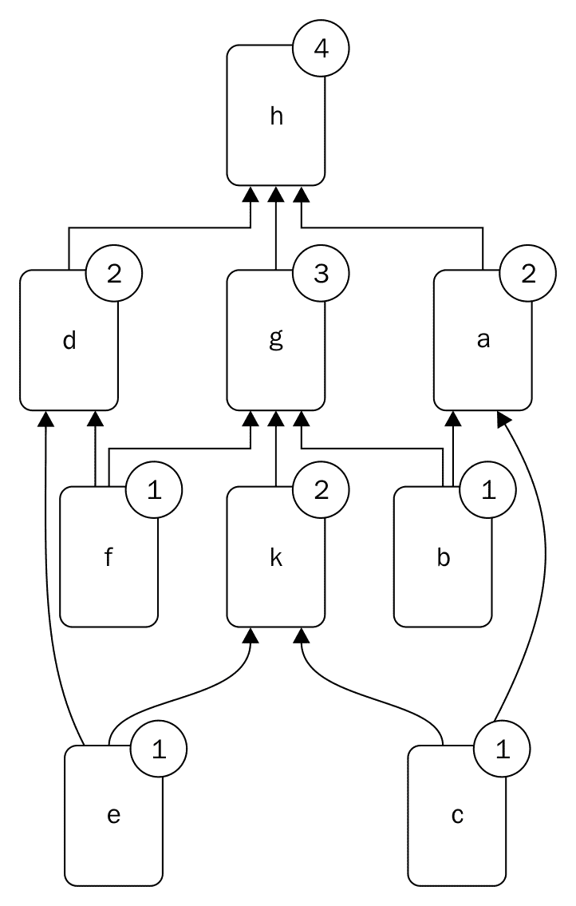
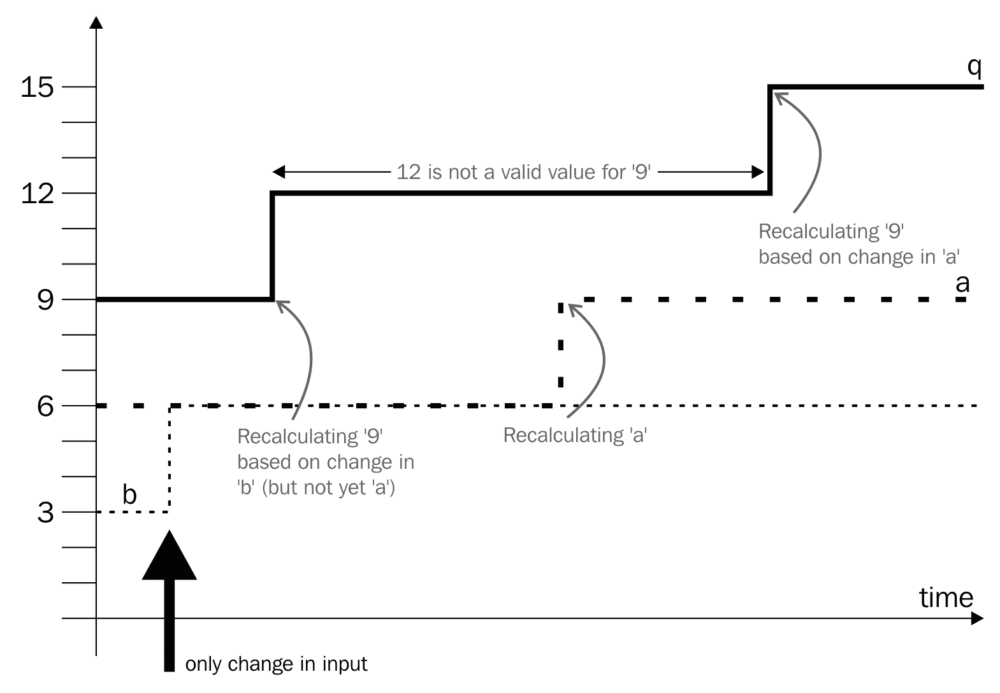
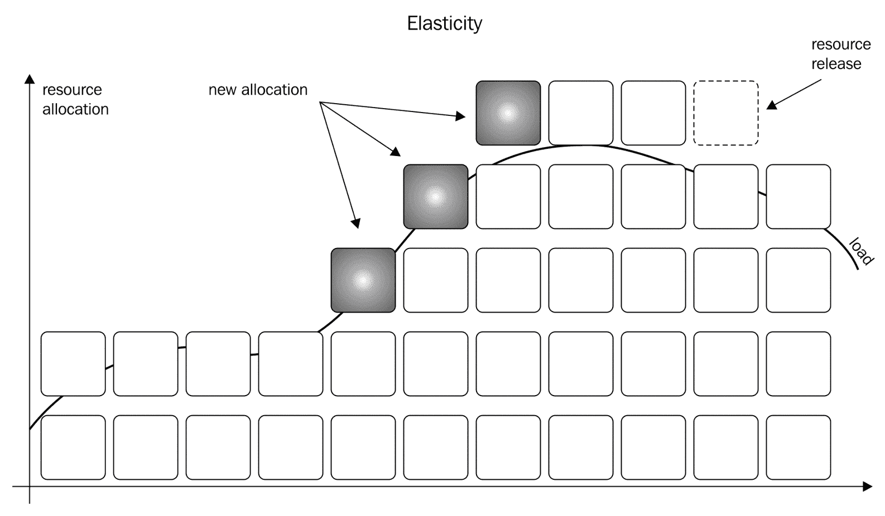
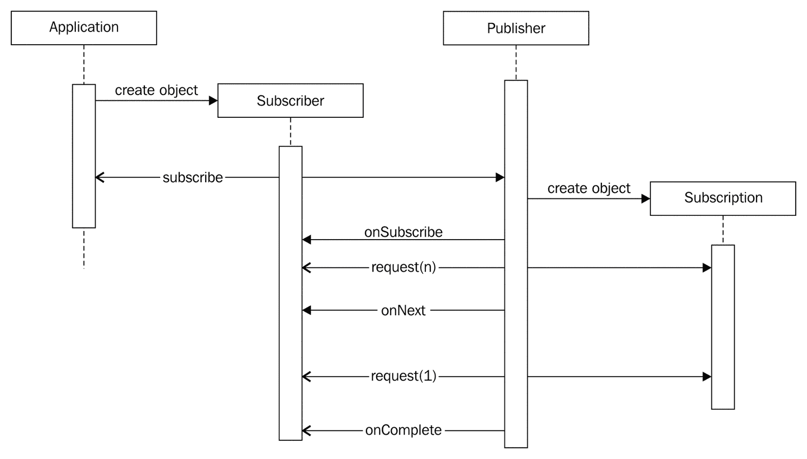

# 第九章：使用响应式编程构建会计应用程序

在本章中，我们将开发一个示例程序，该程序负责我们为创建订单处理代码的公司所做的库存管理部分。不要期待一个完全开发、可直接使用的专业应用程序，也不要期待我们会深入探讨会计和簿记的细节。这不是我们的目标。我们将更多地关注我们感兴趣的编程技术——响应式编程。抱歉，我知道会计和簿记很有趣，但这不是那个话题。

响应式编程是一种古老的（嗯，在计算机科学中什么是古老的呢？）方法，最近才被引入 Java。Java 9 是第一个支持标准 JDK 中一些响应式编程方面的版本。简单来说，响应式编程是关于更多地关注数据流如何流动，而不是如何处理数据流。你可能还记得，这也是从“如何做”的描述转向“我们想做什么”的一个步骤。

在阅读完本章后，你将了解响应式编程是什么，以及 Java 中有哪些工具可以利用。你还将了解响应式编程的优点，以及何时以及如何在未来利用这一原则，因为越来越多的框架将支持 Java 中的响应式编程。在本章中，你将学习以下主题：

+   响应式编程概述

+   Java 中的响应式流

+   如何以响应式方式实现我们的示例代码

# 响应式...是什么？

有响应式编程、响应式系统和响应式流。这三者之间是相互关联的三个不同的事物。三者都被称为“响应式”并非没有原因。

**响应式编程**是一种与面向对象编程和函数式编程类似的编程范式。**响应式系统**是一种系统设计，它对某种类型的信息系统应该如何设计以实现响应性设定了某些目标和技术限制。在这其中有很多与响应式编程原则相似之处。**响应式流**是一组接口定义，有助于实现与响应式系统相似的编码优势，并且可以用来创建响应式系统。响应式流接口是 JDK 9 的一部分，不仅限于 Java，也适用于其他语言。

我们将在单独的章节中探讨这些内容，在每个章节的结尾，你可能会对为什么每个都被称为响应式有更好的理解。

# 响应式编程概述

反应式编程是一种范式，它更关注计算过程中数据流向，而不是如何计算结果。如果问题最好描述为几个相互依赖的计算，但其中一些可能独立于其他计算执行，那么反应式编程可能就会派上用场。作为一个简单的例子，我们可以有以下计算，它从一些给定的`b`、`c`、`e`和`f`值计算出`h`的值，使用`f1`、`f2`、`f3`、`f4`和`f5`作为简单的计算步骤：

```java
a = f1(b,c) 
d = f2(e,f) 
k = f3(e,c) 
g = f4(b,f,k) 
h = f5(d,a,g)

```

如果我们以传统的方式用 Java 编写这些代码，方法`f1`到`f5`将依次被调用。如果我们有多个处理器并且能够并行化执行，我们可能会并行执行一些方法。当然，这假设这些方法是纯粹的计算方法，不会改变环境的状态，并且可以独立于彼此执行。例如，`f1`、`f2`和`f3`可以独立执行。函数`f4`的执行依赖于`f3`的输出，而函数`f5`的执行依赖于`f1`、`f2`和`f4`的输出。

如果我们有两个处理器，我们可以同时执行`f1`和`f2`，然后执行`f3`，接着是`f4`，最后是`f5`。这共有四个步骤。如果我们把前面的计算不是看作命令，而是看作表达式以及计算如何相互依赖，那么我们并不指定实际的执行顺序，环境可能会决定同时计算`f1`和`f3`，然后是`f2`和`f4`，最后是`f5`，这样可以节省一个步骤。这样，我们可以专注于数据流，让反应式环境对其产生影响，而不需要额外的约束。



这是一个非常简单的反应式编程方法。以表达式形式描述的计算描述了数据流，但在解释中，我们仍然假设计算是同步执行的。如果计算在不同的处理器上执行，这些处理器连接到网络上不同的机器，那么计算可能不需要也不必是同步的。如果环境是异步的，反应式程序可以异步执行。可能发生的情况是，不同的计算，从`f1`到`f4`，在不同的机器上实现和部署。在这种情况下，计算出的值通过网络从一个发送到另一个，节点在输入发生变化时执行计算。这与使用简单构建块和模拟信号进行计算的好老式模拟计算机非常相似。

该程序被实现为一个电子电路，当输入电压或电流（通常是电压）在输入端发生变化时，模拟电路以光速跟随变化，结果出现在输出端。在这种情况下，信号传播受限于电线上的光速和在有线模块中的模拟电路速度，这非常快，可能比数字计算机还要快。

当我们谈论数字计算机时，信号的传播是数字的，因此需要从一个计算节点发送到另一个节点，无论是 JVM 中的某个对象还是网络上的某个程序。如果节点需要执行其计算，则：

+   输入中的一些值已经发生了变化

+   需要计算的结果

如果输入没有变化，那么结果最终应该与上次相同；因此，不需要再次执行计算——这将是一种资源浪费。如果计算的结果不需要，那么即使结果与上次不同，也不需要执行计算。没有人关心。

为了适应这一点，反应式环境实施了两种传播值的方法。节点可以从其他模块的输出中拉取值。这将确保不会执行不必要的计算。模块可以将它们的输出推送到依赖于它们的下一个模块。这种方法将确保只有更改的值才会引发计算。一些环境可能会实施混合解决方案。

当系统中的值发生变化时，这种变化会传播到其他节点，这些节点再次将变化传播到另一个节点，依此类推。如果我们把计算依赖看作一个有向图，那么变化会沿着连接的节点传播到更改值的传递闭包。数据可能携带所有值从一个节点的输出到另一个节点的输入，或者只携带变化。第二种方法更复杂，因为它需要更改的数据以及描述更改了什么的元信息。另一方面，当输出和输入数据集很大，而只有一小部分发生变化时，这种收益可能是显著的。在有很大可能性某些节点对于许多不同的输入不会更改输出时，计算和传播实际的变化差分可能也很重要。在这种情况下，即使输入值发生了变化，变化传播可能会在没有任何实际变化的节点停止。这可以在某些网络中节省大量的计算。

在数据传播的配置中，有向无环图可以通过程序的代码来表示，它可以被配置，甚至可以在代码执行过程中动态地设置和更改。当程序代码包含图的架构时，路由和依赖关系相对静态。要更改数据传播，必须更改程序代码，重新编译并部署。在多个网络节点程序的情况下，可能甚至需要多次部署，这些部署应该仔细安排以避免不同节点上运行不同不兼容版本。当图以某些配置描述时，也应考虑类似的问题。在这种情况下，如果只是更改图的连接，可能不需要重新编译程序，但在网络执行的情况下，确保不同节点上配置兼容的负担仍然存在。

允许图动态更改也不能解决这个问题。设置和结构更加灵活，同时，也更加复杂。沿着图边传播的数据可能不仅包含计算数据，还包含驱动图变化的数据。很多时候，这导致一个非常灵活的模型，称为高阶反应式编程。

反应式编程有很多好处，但与此同时，对于简单问题来说，它可能非常复杂，有时过于复杂。当要解决的问题可以很容易地使用数据图和简单的数据传播来描述时，应考虑使用它。我们可以将问题的描述与不同模块执行顺序的描述分开。这与我们在上一章中讨论的相同考虑。我们更多地描述“做什么”，而不是“如何做”。

另一方面，当反应式系统决定执行顺序、更改内容以及如何反映在其他模块的输出上时，它应该在不了解它正在解决的问题的核心时这样做。在某些情况下，根据原始问题手动编码执行顺序可能会表现得更好。

这与内存管理问题类似。在现代运行时环境中，例如 JVM、Python 运行时、Swift 编程或甚至 Golang，都存在一些自动内存管理。当用 C 语言编程时，程序员对内存分配和内存释放有完全的控制权。在实时应用中，性能和响应时间至关重要，无法让自动垃圾回收器占用时间并时不时地延迟执行。在这种情况下，C 代码可以被优化以在需要时分配内存；当可能时，有资源进行内存的分配和释放，并且有时间来管理内存。这些程序的性能比使用垃圾回收器创建的相同目的的程序更好。尽管手动管理内存的代码可能会更快，但自动代码的速度比普通程序员使用 C 语言编写的代码要快，而且编程错误的频率也低得多。

正如在使用自动内存管理时我们必须注意一些问题一样，在反应性环境中，我们必须注意一些在手动编码情况下不存在的问题。尽管如此，我们仍然使用反应性方法，因为它有其优点。

最重要的问题是避免依赖图中的循环。虽然编写计算的定义绝对完美，但反应性系统可能无法处理这些定义。一些反应性系统可能在某些简单情况下的循环冗余中解决，但这是一种额外功能，我们通常只需要避免这种情况。考虑以下计算：

```java
a = b + 3 
b = 4 / a

```

在这里，`a` 依赖于 `b`，所以当 `b` 发生变化时，`a` 被计算。然而，`b` 也依赖于 `a`，它将被重新计算，这样系统就会陷入无限循环。前面的例子看起来很简单，但这正是好例子的特点。现实生活中的问题并不简单，在分布式环境中，有时很难找到循环冗余。

另一个问题被称为**故障**。考虑以下定义：

```java
a = b + 3 
q = b + a

```

当参数 `b` 发生变化时，例如，从 `3` 变为 `6`，`a` 的值将从 `6` 变为 `9`，因此，`q` 的值将从 `9` 变为 `15`。这非常简单。然而，基于对变化的识别的执行顺序可能会首先将 `q` 的值从 `9` 改变为 `12`，然后再在第二步中将其修改为 `15`。这种情况可能会发生，如果负责计算 `q` 的计算节点在 `a` 的值因 `b` 的值变化而变化之前就识别到了 `b` 的变化。在短时间内，`q` 的值将是 `12`，这既不符合之前的状态，也不符合变化后的状态。这个值只是系统在输入变化后发生的一个小故障，而且在没有进一步改变输入的情况下，这个值会消失。



如果你曾经学习过逻辑电路的设计，那么静态故障可能让你想起一些东西。它们确实是相同的现象。

响应式编程还假设计算是无状态的。执行计算的各个节点在实践中可能具有状态，很多时候确实如此。在某些计算中具有状态本身并不是固有的坏事。然而，调试具有状态的东西比调试无状态、函数式的要复杂得多。

它也是响应式环境的重要辅助工具，允许它根据计算是函数性的这一事实执行不同的优化。如果节点具有状态，那么计算可能无法自由重排，因为结果可能取决于实际的评估顺序。这些系统可能真的不是 *响应式* 的，或者至少，这可能会引起争议。

# 响应式系统

响应式系统在响应式宣言中定义，见 [`www.reactivemanifesto.org/`](http://www.reactivemanifesto.org/)。宣言的制作者意识到，随着技术的变化，企业计算中需要开发新的系统模式来利用新技术并获得更好的结果。宣言设想了以下系统：

+   响应式

+   弹性

+   弹性

+   消息驱动。

前三个特性是用户值；最后一个更像是获取值的技术方法。

# 响应式

一个系统如果能够以可靠的方式给出结果，那么它是响应的。如果你和我交谈，我会回答你的问题，或者至少告诉你我不知道答案或者我没有理解你的问题。如果你得到了答案，那就更好了，但如果一个系统不能给你提供答案，它仍然应该给出一些反馈。如果你有十年前客户操作系统的经验，以及一些旧电脑，你就能理解这一点。得到一个旋转的沙漏图标是非常令人沮丧的。你根本不知道系统是在努力为你获取答案，还是完全冻结了。

一个反应性系统必须具有响应性。响应应该及时到来。实际的时间取决于实际的系统。它可能是毫秒、秒，甚至在系统运行在前往木星另一侧的宇宙飞船上时，可能是数小时。重要的是，系统应该保证响应时间有一个*软*的上限。这并不一定意味着系统应该是一个实时解决方案，这是一个更加严格的要求。

响应性的优势不仅仅是用户在电脑前不会感到紧张。毕竟，这些服务中的大多数都是由其他服务使用的，它们主要相互通信。真正的优势是错误发现更加可靠。如果一个反应性系统元素变得无响应，这肯定是一个错误状态，应该对此采取措施，超出正常操作的范围（更换故障的通信卡、重启系统等）。我们越早能够识别错误状态，修复它就越便宜。我们能够识别问题的位置越多，我们花费在定位错误上的时间和金钱就越少。响应性不是关于速度，而是关于更好的操作，更好的质量。

# 弹性

弹性系统即使在出现某些错误的情况下也能继续工作。好吧，不是任何错误。那将是奇迹，或者简单地说就是胡说八道！错误通常就是错误。如果世界末日来临，我们所知道的世界就此终结，即使是弹性系统也不会响应。然而，对于较小的干扰，可能有一些方法可以使系统具有弹性。

如果只有磁盘失败、断电或出现编程错误，有一些技术可能有所帮助。系统可以被复制，因此当其中一个实例停止响应时，另一个实例可以接管失败实例的任务并继续工作。易于出错的系统可以在空间或时间上相互隔离。当一个地点发生地震或洪水时，另一个地点仍然可以继续工作。如果不同的组件不需要实时通信，并且消息以可靠的方式存储和转发，那么即使两个系统永远不会同时可用，这也不是问题。它们仍然可以合作接收消息，执行它们应该执行的任务，并在之后发送结果消息。

即使系统保持响应，系统中的错误也必须得到解决。错误不会影响弹性系统的响应性，但弹性水平会降低，应该得到恢复。

# 弹性

弹性意味着系统正在适应负载。我们可以有一个庞大的系统，拥有大量的处理器，能够满足最大的预期需求。但这不是弹性。由于需求不是恒定的，而且大多数时候，需求小于最大值，这样的系统的资源是闲置的。这导致了时间、CPU 周期、能源的浪费，从而增加了生态足迹。



在云上运行系统可以避免此类损失。云不过是许多由某人运营的多台计算机，用于多个应用程序，甚至多个公司，每个租户只租用其实际需要的 CPU 周期，并且只在需要时租用。在其他时候，当负载较小时，CPU 和电力可以被其他人使用。由于不同应用程序和不同公司的峰值时间不同，这种模式下的资源损失较少。有许多问题需要解决，例如数据隔离和防止信息被窃听，但这些主要已经解决了。秘密服务公司不会从云服务中租用资源来运行他们的计算（也许，他们会为了其他目的这么做）以及一些其他偏执的公司也可能避免这么做，但大多数公司都会这么做。这更加有效，因此即使考虑了所有可以考虑的副作用，成本也更低。

弹性意味着分配的资源会跟随，或者更确切地说，会预测即将到来的需求。当系统预测到更高的容量需求时，它会分配更多资源，在非高峰时间，它会释放资源，以便其他云客户可以使用。

弹性还假设系统是可扩展的。弹性和可扩展性这两个概念密切相关，但并不相同。可扩展性意味着应用程序可以适应更高的负载，分配更多资源。可扩展性并不关心这种分配是静态购买和供电给一个专门用于应用程序的计算中心的巨大计算机箱，还是按需从云中动态分配资源。可扩展性仅仅意味着如果需求加倍，那么资源也可以成倍增加以满足需求。如果所需资源的乘数与需求的乘数相同或不超过需求乘数，那么该应用程序是可扩展的。如果我们需要更多资源来满足需求，或者即使需求适度增加，我们也不能满足需求，那么该应用程序是不可扩展的。弹性应用程序总是可扩展的；否则，它们就不能是弹性的。

# 消息驱动

反应式系统是消息驱动的；不是因为我们需要消息驱动的系统，而是因为消息驱动的系统能够同时提供响应性、弹性和弹性。

消息驱动架构意味着信息在断开连接的组件之间传递。一个组件发送一条消息，然后*忘记*它。它不会等待另一个组件对消息采取行动。当消息发送时，代表发送组件的所有任务都会执行，并且处理这些任务所需的所有资源都会释放，从而使消息被释放并准备好用于下一个任务。

消息驱动不一定意味着网络。消息可以在同一台机器内的对象、线程和进程之间传递。另一方面，如果消息架构的接口设计得很好，那么在基础设施发生变化时，组件不需要修改，之前在线程之间传递的消息现在将不得不通过 IP 数据包穿越海洋。

发送消息使得在空间和时间上隔离发送者和接收者成为可能，正如我们描述的那样，作为一种弹性的手段。接收者可能在收到消息一段时间后取走它，当它有资源这样做的时候。然而，响应性要求这个时间不是在遥不可及的将来，而是在某个有限的距离内。如果消息无法成功处理，另一个消息可能会发出错误信号。错误消息不是我们期望的结果，但它仍然是一种响应，系统仍然保持响应性，并带来所有它意味着的好处。

# 背压

消息处理，通过适当的消息接口和实现，支持背压。背压是一种在组件无法或几乎无法处理更多消息时减轻其负担的手段。消息可能会排队等待处理，但现实中没有任何队列具有无限容量，反应式系统不应无控制地丢失消息。背压向消息生产者发出信号，要求它们减少生产。这就像一个水管。如果你开始关闭水管的出口，水管背面的压力开始增加，水源迫使它减少和减少水的供应。

背压是一种有效的处理负载的方法，因为它将负载处理转移到了真正能够做到这一点的组件。在传统的队列系统中，有一个队列存储项目，直到接收它们的组件可以消费它们，完成其工作。如果对负载大小和队列最大大小有明确的限制，队列设计可以是好的。如果队列满了，项目就无法交付，系统就会停滞。

应用反压略有不同。队列仍然可以用于组件前面进行性能优化和确保响应性。项目的生产者仍然可以将生产的项目放入队列，并返回处理自己的职责，而不需要等待消费者能够处理该项目。这就是我们之前提到的解耦。看到队列已满或几乎满也可以作为一个非常简单的反压。如果有人说队列完全缺少这个功能，那是不正确的。有时，仅仅查看队列的容量以及其中的项目，看看是否需要减轻队列所属接收器的负载，可能就足够了。但是，这是生产者而不是接收者所做的，这是一个基本问题。

生产者看到接收者没有跟上供应的速度，但生产者没有关于原因的任何信息，不知道原因就无法预测未来的行为。从接收器到生产者的反压信息通道使得故事更加细致。

生产者可能看到队列中有，比如说，10 个槽位，并且认为没有问题；生产者决定在接下来的 150ms 内再交付 8 个项目。一个项目通常需要 10ms 来处理，上下浮动；因此预计项目将在不到 100ms 内处理完毕，这正好比所需的 200ms 最大值要好。生产者只知道一个项目*通常*需要 10ms 来处理。

另一方面，接收者看到它最后放入队列的项目需要如此多的处理，以至于仅靠它本身就需要 200ms。为了发出信号，它可以通过反压告诉生产者不要在进一步通知之前交付新项目。接收者知道这些项目可以很好地放入队列，但不会及时处理。利用这些信息，生产者将向云控制发送一些命令来分配另一个处理，并将下一个八个项目发送到新的接收器，让旧的接收器处理它必须处理的比平均水平高的项目。

反压允许你通过接收器提供的信息来协助数据加载控制，这些接收器拥有关于处理项目最多的信息。

# 反应式流

反应式流最初是一个旨在通过调节数据流的推送来提供一个在异步模式下处理数据流的标准，这个项目的原始网站是[`www.reactive-streams.org/`](http://www.reactive-streams.org/)。

反应式流现在已在 JDK 9 的 `java.util.concurrent` 包中实现。

反应式流定义的目的是定义一个接口，该接口能够以完全异步的方式处理生成数据的传播，无需接收方缓冲无限创建的数据。当数据在流中创建并可供工作者处理时，工作者必须足够快，能够处理所有生成的数据。容量应足够高，以处理最高产量。一些中间缓冲区可以处理峰值，但如果没有控制机制在消费者达到容量极限时停止或延迟生产，系统将失败。反应式系统接口旨在提供一种支持背压的方式。背压是一种向数据生产者发出信号的过程，指示其减慢或甚至停止生产，以达到适合消费者的水平。接口定义的每个调用都是异步的，这样一部分的性能就不会受到其他部分执行延迟的影响。

该倡议的目标不是定义数据在生产与消费之间的传输方式。它专注于接口，为程序提供清晰的架构，并提供一个将适用于所有实现的 API。

# Java 中的反应式编程

Java 不是一种反应式语言。这并不意味着我们无法在 Java 中创建反应式程序。有一些库支持不同的反应式编程方法。这里要提到的是 Akka 框架和 ReactiveX，它们也存在于其他语言中。从 Java 9 开始，JDK 开始支持反应式编程，提供了一些类和接口来实现这一目的。我们将关注这些特性。

JDK 包含了 `java.util.concurrent.Flow` 类，该类包含相关接口和一些静态方法，以支持流控制程序。该类支持的模型基于 `Publisher`、`Subscriber` 和 `Subscription`。

用一个非常简单的解释来说，`Publisher` 接受来自 `Subscriber` 的订阅。当数据可用时，`Subscriber` 会获取其订阅的数据。接口专注于通信数据流控制的非常核心部分，因此有些抽象。毫不奇怪，它们是接口。然而，一开始可能并不容易理解它们的工作方式。

`Publisher` 接口定义了 `subscribe` 方法。这是该接口定义的唯一方法，这也是因为这是唯一一个真正的发布者可能被要求做的事情。你可以订阅发布。该方法的一个参数是订阅发布的 `Subscriber`：

```java
void subscribe(Flow.Subscriber<? super T> subscriber)

```

JDK 中有一个现成的 `Publisher` 类，我们稍后会查看。当 `Publisher` 的 `subscribe` 方法被调用时，它必须决定订阅者是否能获得订阅。通常，订阅会被接受，但实现有自由拒绝订阅尝试。例如，如果实际订阅者的订阅已经完成，并且 `Publisher` 实现不允许同一个订阅者进行多次订阅，`Publisher` 可能会拒绝订阅。

方法实现需要调用 `subscriber` 的 `onError` 方法，参数为 `Throwable`。在多个订阅的情况下，`IllegalStateException` 似乎很合适，因为 JDK 文档目前是这样定义的。

如果订阅成功，`Publisher` 预期会调用 `subscriber` 的 `onSubscribe` 方法。此方法的参数是一个 `Subscription` 对象（实现 `Subscription` 接口的一个类的实例）。这样，`Publisher` 就会通知 `Subscriber` 订阅请求已被接受，并且传递一个对象来管理订阅。

将订阅作为一个抽象来管理可能看起来是一个复杂任务，但在响应式流的情况下，它非常简单。所有订阅者能且应该做的就是设置它当前可以接收的项目数量，并且可以取消订阅。

为什么 `Publisher` 要回调 `Subscriber` 的 `onSubscribe` 方法？为什么它不直接返回订阅或抛出一些错误？这种复杂行为的理由是，可能不是 `Subscriber` 调用了 `subscribe` 方法。正如现实生活中，我可以作为圣诞礼物订阅并支付一年的杂志订阅。 (这是我在写这本书的这一部分的时候。) 在我们的代码中，一些负责通知谁关于某些数据变化的连接组件调用 `subscribe`，而不一定是订阅者。`Subscriber` 只负责订阅者应该负责的最基本的事情。

另一个原因是整个方法是非同步的。当我们订阅某物时，订阅可能不会立即可用和就绪。可能有一些需要完成的长运行过程，直到订阅可用，调用 `subscribe` 的调用者不需要等待过程的完成。当订阅就绪时，它会被传递给订阅者，传递给真正需要它的实体。

`Subscriber` 接口定义了 `onSubscribe`、`onError`（我们已经讨论过这些）、`onComplete` 和 `onNext` 方法。

在定义这些接口时，重要的是让订阅者能够从`Publisher`或通过某种推送方式委托给其他对象的`Publisher`获取项目。订阅者不需要去*报亭*获取下一期；调用`onNext`方法的人会直接将期号传递给它。

这也意味着，除非`Subscriber`手中有一些控制措施，否则可能会发生`Publisher`向`Subscriber`发送大量项目的情况。并非每个`Subscriber`都能够处理无限量的项目。在执行订阅操作后，`Subscriber`会获得一个`Subscription`对象，并且可以使用该对象来控制项目对象的流动。

`Publisher`创建`Subscription`对象，并且接口定义了两个方法：`cancel`和`request`。`Subscriber`应该调用`cancel`方法来通知`Publisher`它不应该再发送更多项目。订阅将被取消。`request(long n)`方法指定订阅者准备通过后续调用`onNext`方法获取最多`n`个项目：



如果订阅者已经调用了`request`方法，指定的数量将添加到订阅计数器中。换句话说，指定的`long`值并不反映订阅者的实际状态。它是一个增量，增加由`Publisher`维护的一些计数器，这些计数器通过将`long`参数的值添加到可以交付的项目数量中，并在每个交付给`Subscriber`的项目上递减一个。

如果使用`Long.MAX_VALUE`参数调用`request`方法，`Publisher`可能会发送任何它能够发送的项目，而不进行计数和限制。这本质上就是关闭了背压机制。

规范还提到，调用`cancel`并不一定意味着将不再发送任何期号。取消操作是尽力而为的。就像现实生活中，当你把邮件寄给日报，意图取消订阅时，出版商不会派代理人去阻止邮递员在你邮箱里放下期号。如果取消到达出版商时，期号已经在路上，它就会继续前进。如果`Publisher`已经开始了一些无法合理停止的异步过程，那么`onNext`方法将使用一些元素被调用。

`Publisher` 和 `Subscriber` 接口有一个泛型参数 `T`。这是 `Publisher` 接口发布的项目类型和 `Subscriber` 接口在 `onNext` 方法中获取的类型。为了更精确一点，`Subscriber` 接口可以有一个 `R` 类型，它是 `T` 的超类；因此，它与 `Publisher` 接口兼容。例如，如果 `Publisher` 发布 `Long` 值，那么 `Subscriber` 接口可以在 `onNext` 方法的参数中接受 `Long`、`Number` 或 `Object`，具体取决于实现 `Subscriber` 的类的声明。

`Flow` 类还包含一个扩展了 `Publisher` 和 `Subscriber` 接口的 `Processor` 接口。这个接口是为了由那些也接受数据并将数据发送到反应流中其他组件的类来实现。这样的元素在反应流程序中非常常见，因为许多执行某些任务的元素从其他反应流元素中获取要处理的项目；因此，它们是 `Subscriber`，同时，在完成它们的任务后，它们也会发送数据；因此，它们也是 `Publisher`。

# 实现库存

现在我们已经讨论了很多技术和编程方法，现在是时候实现一些示例代码了。我们将使用反应流在我们的应用程序中实现库存管理。例如，库存将非常简单。它是一个 `Map<Product,InventoryItem>`，它保存了每个产品的项目数量。实际的映射是 `ConcurrentHashMap`，而 `InventoryItem` 类比 `Long` 数字更复杂，以便正确处理并发问题。当我们设计基于响应流的程序时，我们不需要处理太多的并发锁定，但我们仍然应该意识到代码是在多线程环境中运行的，如果我们不遵循一些规则，可能会表现出奇怪的行为。

`Inventory` 类的代码相当简单，因为它只处理一个映射：

```java
package packt.java9.by.example.mybusiness.inventory; 

import ...; 

@Component 
public class Inventory { 
    private final Map<Product, InventoryItem> inventory = 
            new ConcurrentHashMap<>(); 

    private InventoryItem getItem(Product product) { 
        inventory.putIfAbsent(product, new InventoryItem()); 
        return inventory.get(product); 
    } 

    public void store(Product product, long amount) { 
        getItem(product).store(amount); 
    } 

    public void remove(Product product, long amount) 
            throws ProductIsOutOfStock { 
        if (getItem(product).remove(amount) != amount) 
            throw new ProductIsOutOfStock(product); 
    } 
}

```

维护库存项的类稍微复杂一些，因为这是我们需要处理一些并发或至少是这个我们必须注意的类：

```java
package packt.java9.by.example.mybusiness.inventory; 

import java.util.concurrent.atomic.AtomicLong; 

public class InventoryItem { 
    private final AtomicLong amountOnStock = 
            new AtomicLong(0); 
    void store(long n) { 
        amountOnStock.accumulateAndGet(n, 
                (stock, delta) -> stock + delta); 
    } 
    long remove(long delta) { 
        class ClosureData { 
            long actNr; 
        } 
        ClosureData d = new ClosureData(); 
        amountOnStock.accumulateAndGet(delta, 
                (stock, n) -> 
                        stock >= n ? 
                                stock - (d.actNr = n) 
                                : 
                                stock - (d.actNr = 0) 
        ); 
        return d.actNr; 
    } 
}

```

当我们向库存中添加产品时，我们没有限制。存储货架非常大，我们没有模拟它们可能会满的情况，库存可能无法容纳更多项目。然而，当我们想要从存储库中移除项目时，我们必须处理可能没有足够项目的情况。在这种情况下，我们不会从存储库中移除任何项目。我们为客户提供完全满意的服务，或者我们根本不提供服务。

为了维护库存中项目的数量，我们使用`AtomicLong`。这个类有`accumulateAndGet`方法。这个方法接受一个`Long`参数和一个我们用 lambda 表达式提供的`LongBinaryOperator`。这段代码由`accumulateAndGet`方法调用以计算库存的新值。如果有足够的物品，则移除请求的数量。如果没有足够的库存，则移除零。该方法返回实际返回的项目数量。由于这个数字是在 lambda 内部计算的，所以它必须从那里逃逸出来。为了做到这一点，我们使用方法内部定义的`ClosureData`。

注意，例如，在 Groovy 中，我们可以简单地使用一个`Long d`变量并在闭包内部更改该变量。Groovy 将 lambda 称为闭包。在 Java 中，我们无法这样做，因为我们从方法内部可以访问的变量应该是有效最终的。然而，这不过是闭包环境中的一个更明确的表示法。`ClosureData d`对象是最终的，与类中可以修改的字段相对，该字段可以在 lambda 内部被修改。

在本章中我们真正感兴趣的最有趣的类是`InventoryKeeper`。这个类实现了`Subscriber`接口，能够消费订单以维护库存：

```java
package packt.java9.by.example.mybusiness.inventory; 

import ... 

public class InventoryKeeper implements Flow.Subscriber<Order> { 
    private static final Logger log = 
            LoggerFactory.getLogger(InventoryKeeper.class); 
    private final Inventory inventory; 

    public InventoryKeeper(@Autowired Inventory inventory) { 
        this.inventory = inventory; 
    } 

    private Flow.Subscription subscription = null; 
    private static final long WORKERS = 3; 

    @Override 
    public void onSubscribe(Flow.Subscription subscription) { 
        log.info("onSubscribe was called"); 
        subscription.request(WORKERS); 
        this.subscription = subscription; 
    }

```

`onSubscribe`方法在对象被订阅后调用。订阅传递给对象，并也存储在一个字段中。由于订阅者需要在后续调用中需要这个订阅，当`onNext`中传递的项目被处理并且可以接受新项目时，字段是一个存储这个对象的不错的地方。在这个方法中，我们还设置了初始请求为三个项目。实际值只是示范性的。企业环境应该能够配置这样的参数：

```java
    private ExecutorService service =  
                   Executors.newFixedThreadPool((int) WORKERS);

```

代码中最重要的部分是`onNext`方法。它的作用实际上是遍历订单中的所有项目，并从库存中移除相应的项目数量。如果某些项目缺货，那么它会记录一个错误。这部分很无聊。有趣的部分是它通过一个执行器服务来完成这个操作。这是因为对`onNext`的调用应该是异步的。发布者调用`onNext`来传递项目，但我们不应该让它等待实际的处理。当邮递员送来你最喜欢的杂志时，你不会立即开始阅读并让邮递员等待你的签名确认接收。在`onNext`中你只需要获取下一个订单并确保它将及时处理：

```java
    @Override 
    public void onNext(Order order) { 
        service.submit(() -> { 
                    int c = counter.incrementAndGet(); 
                    for (OrderItem item : order.getItems()) { 
                        try { 
                            inventory.remove(item.getProduct(), 
                                               item.getAmount()); 
                        } catch (ProductIsOutOfStock exception) { 
                            log.error("Product out of stock"); 
                        } 
                    } 
                    subscription.request(1); 
                    counter.decrementAndGet(); 
                } 
        ); 
    } 

    @Override 
    public void onError(Throwable throwable) { 
        log.info("onError was called for {}", throwable); 
    } 

    @Override 
    public void onComplete() { 
        log.info("onComplete was called"); 
    } 
}

```

代码的实际实现使用了包含三个线程的 `ThreadPool`。此外，所需项目的数量也是三个。这是一个逻辑巧合：每个线程处理一个单独的项目。它不需要这样，尽管在大多数情况下是这样的。如果这样做有意义，我们无法阻止我们创建更多线程来处理同一个项目。相反的情况也是真实的。可能只需要一个线程来处理多个项目。这些代码可能会更复杂，而整个复杂执行模型的想法是使编码和逻辑更简单，将多线程、编码和实现问题移入框架，并专注于应用程序代码中的业务逻辑。但我不能保证没有示例是订阅者同时在多个项目上使用多个线程，这些线程是交织在一起的。

在本章中，我们需要查看的最后一段代码是使用一些示例驱动的单元测试：

```java
    public void testInventoryRemoval() { 
        Inventory inventory = new Inventory(); 
        SubmissionPublisher<Order> p = 
                         new SubmissionPublisher<>();

```

我们使用 JDK 类 `SubmissionPublisher` 创建 `Publisher`，它优雅地实现了这个接口，为我们提供了多线程功能，而无需太多麻烦：

```java
        p.subscribe(new InventoryKeeper(inventory));

```

我们创建了一个库存管理员并订阅了发布者。由于还没有发布，所以它不会开始交付任何东西，但它会在订阅者和发布者之间建立联系，告诉他们，每当有产品提交时，订阅者都想要它。

之后，我们创建了产品并将它们存储在库存中，总共 20 件，我们还创建了一个需要交付 10 件产品的订单。我们将多次执行这个订单。这有点简化，但为了测试，没有必要创建具有相同产品和相同数量列表的单独订单对象：

```java
        Product product = new Product(); 
        inventory.store(product, 20); 
        OrderItem item = new OrderItem(); 
        item.setProduct(product); 
        item.setAmount(10); 
        Order order = new Order(); 
        List<OrderItem> items = new LinkedList<>(); 
        items.add(item); 
        order.setItems(items);

```

在完成所有这些之后，我们将订单提交给 `Publisher` 10 次。这意味着有 10 个相同产品的订单，每个订单要求 10 件，即总共 100 件。这些是 100 件与仓库中的 20 件相抗衡。我们应该预期的是，只有前两个订单会被满足，其余的将被拒绝，这就是当我们执行此代码时实际发生的情况：

```java
        for (int i = 0; i < 10; i++) 
            p.submit(order); 
        log.info("All orders were submitted");

```

在所有订单发布完毕后，我们等待半秒钟，以便其他线程有时间执行，然后我们结束：

```java
        for (int j = 0; j < 10; j++) { 
            log.info("Sleeping a bit..."); 
            Thread.sleep(50); 
        } 
        p.close(); 
        log.info("Publisher was closed"); 
    }

```

注意，这并不是一个常规的单元测试文件。这是一些用于探索的测试代码，我也推荐您执行、调试并查看不同的日志输出。

# 摘要

在这个简短的章节中，我们探讨了响应式编程、响应式系统和响应式流。我们讨论了这些之间的相似之处和不同之处，这些可能会导致混淆。我们特别关注 Java 9 响应式流，它与 `Stream` 类和方法实际上没有什么关系。

在本章的后半部分，我们讨论了一个非常简单的示例，它使用了响应式流。

在阅读完本章之后，你已经对 Java 语言和编程有了很多了解。我们没有详细讲解 Java 的所有细节，但在一本书中这是不可能的。我敢说，在这个地球上，无论在地球表面还是在轨道上，无论人类在哪里，没有人（或女人）能知道关于 Java 的一切。然而，我们现在已经足够了解，可以开始在企业环境中编码，并在旅途中不断学习更多，直到退休，甚至退休之后。剩下的是一点编程知识。在上一个句子中，我说的是编码，以区分编程。编码是编程职业中使用的技巧。在接下来的，也是最后一章中，我们将看到编程的各个方面以及它应该如何以专业的方式进行。这通常不是入门书籍的一部分，但我很高兴我们与出版商就这个话题达成了一致。这样，你不仅可以学到这本书中的知识，还可以有一个展望，展望你将攀登的山坡之路。你会知道你可以继续学习的主题、领域和学科。
