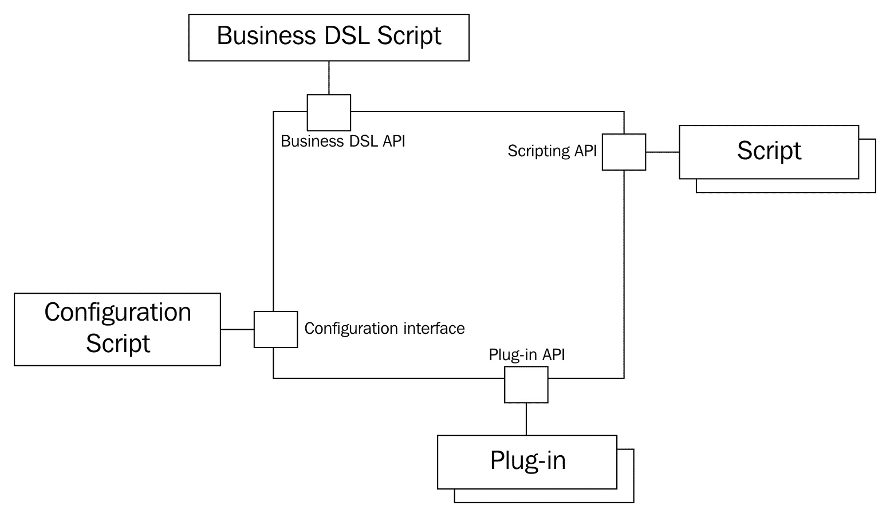
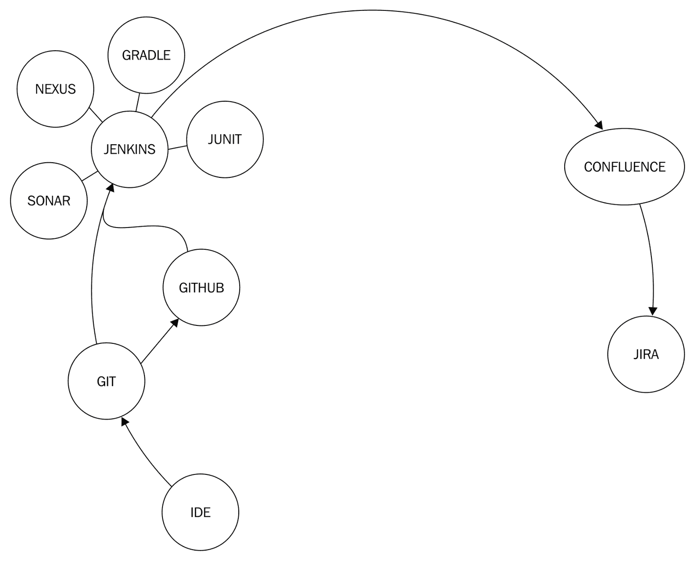
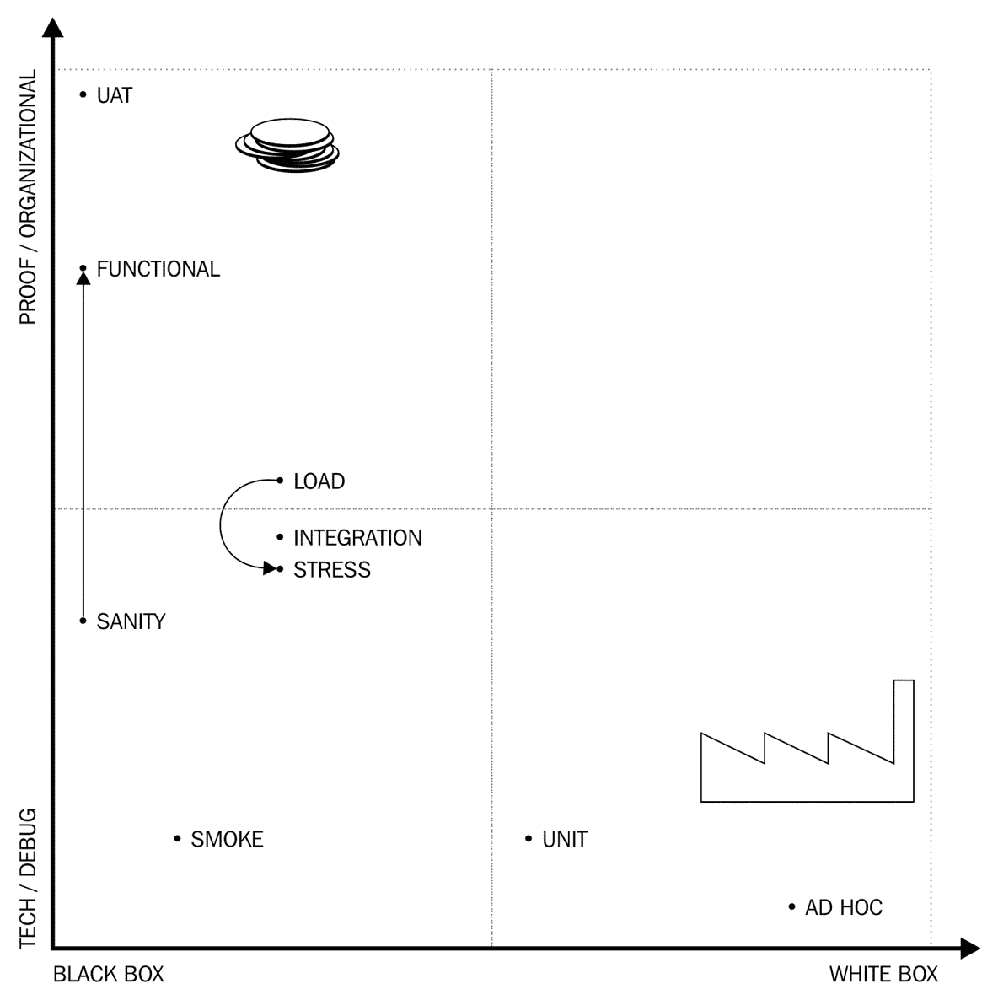
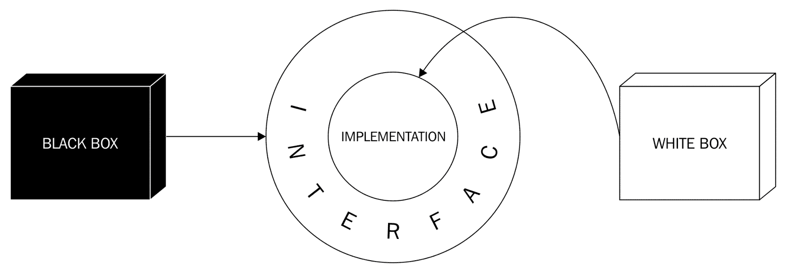
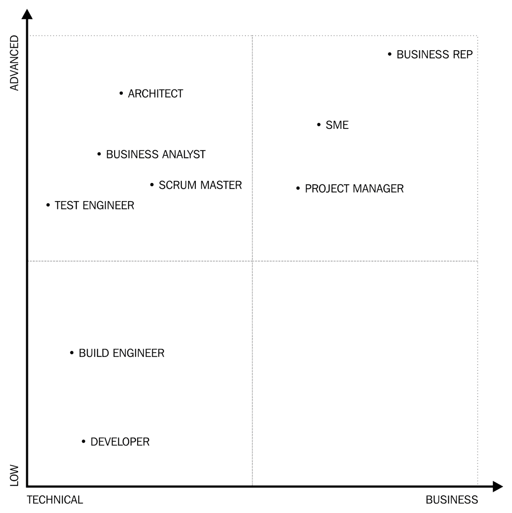

# 将 Java 知识提升到专业水平

到目前为止，你已经学到了成为一名专业 Java 开发者所需的最重要领域和主题。在这本书中，我们接下来要讨论的一些主题将引导你从初级开发者成长为高级开发者。尽管阅读这一章不会使任何人成为高级开发者，但前几章是我们走过的路。这一章只是地图。如果前几章涵盖了在编码之旅中到达港口前的一段几英里的短途旅行，那么这一章就是探索新大陆的航海图。

我们将简要地涉猎一些非常深入和高级的专业领域，例如创建一个 Java 代理、编译时注解处理、多语言编程、一点架构设计和工具，以及团队协作的技术。我们这样做只是为了尝尝鲜。现在，你已经拥有了足够的知识来理解这些主题的重要性，而尝试这些将激发你对未来几年自我发展的渴望，至少，这是我想要让你，作为读者，上瘾的意图。

# Java 深度技术

在本节中，我们将列出三种技术：

+   Java 代理

+   多语言编程

+   注解处理

对于 Java 专业人士来说，了解它们不是必须的。了解它们是必须的。Java 代理主要用于开发环境和运营中。它们是与已经运行的*JVM*交互的复杂运行时技术。注解处理是另一端。注解处理器被连接到 Java 编译器。多语言编程位于中间。它是 JVM 编程，就像用 Java 编程一样，但通过使用一些不同的语言，或者可能是某种不同的语言和 Java 一起。甚至可能是多种语言，例如 Jython、Groovy、Clojure 和 Java 一起。

我们将讨论这些技术，以便我们能够了解它们是什么，以及如果我们想要了解更多关于它们的信息，我们应该在哪里寻找更多信息。

# Java 代理

Java 代理是一种以特殊方式由 Java 运行时加载的 Java 程序，可以用来干扰已加载类的字节码，从而改变它们。它们可以用来：

+   在运行时列出或记录，并报告加载的类，就像它们被加载时一样

+   修改类，使方法包含额外的代码来报告运行时行为

+   支持调试器在开发者修改源代码时更改类的内容

这种技术被用于，例如，来自[`zeroturnaround.com/`](https://zeroturnaround.com/)的**JRebel**和**XRebel**产品。

虽然 Java 代理在 Java 的深层细节中工作，但它们并不是魔法。它们有点复杂，你需要深入理解 Java，但任何能够用 Java 编程的人都可以编写 Java 代理。所需的一切只是将代理类（即代理）打包到一个*JAR*文件中，其中包含代理的其他类，并且有一个`META-INF/MANIFEST.MF`文件，该文件定义了实现`premain`和/或`agentmain`方法的类的名称，以及一些其他字段。

详细且精确的参考文档是`java.lang.instrument`包文档中可用的*JDK JavaDoc*的一部分，可在[`download.java.net/java/jdk9/docs/api/`](http://download.java.net/java/jdk9/docs/api/)找到。

当使用 Java 代理启动 Java 应用程序时，命令行必须包含以下选项：

```java
    -javaagent:jarpath[=options]

```

在这里，`jarpath`指向包含代理类和清单文件的 JAR 文件。该类必须有一个名为`premain`或`agentmain`的方法。它可能有一个或两个参数。JVM 在 JVM 初始化后尝试首先调用两个参数版本：

```java
public static void premain(String agentArgs, Instrumentation inst);

```

如果不存在两个参数版本，则使用一个参数版本，它本质上与两个参数版本相同，但缺少了仪器参数，在我看来，这并不太有意义，因为 Java 代理没有`Instrumentation`对象就无法做很多事情：

```java
public static void premain(String agentArgs);

```

`agentArgs`参数是作为命令行选项传递的字符串。第二个参数`Instrumentation`提供了注册类转换器的方法，这些转换器可以修改类字节码，以及可以请求 JVM 在运行时重新定义或重新转换类的方法。

Java 应用程序也可以在程序启动后加载代理。在这种情况下，由于程序已经启动，代理不能在 Java 应用程序的主方法之前被调用。为了区分这两种情况，JVM 在这种情况下调用`agentmain`。请注意，对于代理来说，要么调用`premain`，要么调用`agentmain`，永远不会同时调用。单个代理可以实现两者，使其能够在启动时执行其任务，指定在命令行上或在 JVM 启动后。

如果使用`agentmain`，它具有与`premain`相同的参数。

`premain`和`agentmain`的调用之间存在一个主要且重要的区别。如果代理在启动期间无法加载，例如，如果找不到它，如果 JAR 文件不存在，如果类没有`premain`方法，或者如果它抛出异常，JVM 将终止。如果代理在 JVM 启动后加载（在这种情况下，应使用`agentmain`），即使代理中存在某些错误，JVM 也不会终止。

这种方法相当合理。想象一下，有一个在 Tomcat 服务器容器上运行的服务器应用程序。当启动新版本时，系统会停机进行维护。如果由于代理表现不佳而无法启动新版本，那么最好不启动。调试这种情况并修复它，或者将应用程序回滚到旧版本并请求更长时间的修复会话可能比启动应用程序而没有适当的代理功能造成的损害要小。如果应用程序仅在没有代理的情况下启动，那么次优操作可能不会立即被识别。

另一方面，当代理稍后附加时，应用程序已经正在运行。将代理附加到已运行的应用程序是为了从已运行的实例中获取信息。停止已运行的实例并使其失败，特别是在操作环境中，比仅仅不附加代理更有害。无论如何，这可能会被注意到，因为最有可能附加的代理可能被操作人员使用。

`premain` 或 `agentmain` 代理获取一个 `Instrumentation` 对象作为第二个参数。此对象实现了几个方法。其中之一是：

```java
void addTransformer(ClassFileTransformer transformer)

```

代理实现了转换器，并具有 `transform` 方法签名：

```java
byte[] transform(Module module, ClassLoader loader, 
                 String className, 
                 Class<?> classBeingRedefined, 
                 ProtectionDomain protectionDomain, 
                 byte[] classfileBuffer) 
throws IllegalClassFormatException

```

当 JVM 在类加载时或要转换时调用此方法。该方法获取类对象本身，但更重要的是，它获取包含类字节码的字节数组。该方法预期返回转换后的类的字节码。修改字节码需要对字节码的构建方式和类文件的结构有所了解。有一些库可以帮助完成这项工作，例如 Javassist ([`www.javassist.org/`](http://www.javassist.org/)) 或 ASM ([`asm.ow2.org/`](http://asm.ow2.org/))。尽管如此，我将在熟悉字节码结构之前不会开始编码。

代理在单独的线程中运行，并假设在任何时候都与用户或文件系统交互，基于某些外部观察，可以调用以下方法来使用已注册的转换器重新转换类：

```java
void retransformClasses(Class<?>... classes)

```

代理还可以调用以下方法，这将重新定义作为参数给出的类：

```java
void redefineClasses(ClassDefinition... definitions)

```

`ClassDefinition` 类只是一个 `Class` 和 `byte[]` 对的简单组合。这将通过 JVM 的类维护机制重新定义类。

注意，这些方法和 Java 代理与 JVM 的深层、低级部分交互。这也意味着，很容易破坏整个 JVM。与类加载时的字节码检查不同，字节码不会被检查，因此，如果其中存在错误，后果可能不仅是一个异常，还可能是 JVM 的崩溃。此外，重新定义和转换不应改变类的结构。它们不应改变它们的继承足迹，添加、重命名或删除方法，或更改方法的签名，这也适用于字段。

还要注意，已经创建的对象不会受到更改的影响；它们仍然使用类的旧定义，只有新的实例才会受到影响。

# 多语言编程

多语言编程是在同一应用程序中使用不同编程语言的技术。这种做法不仅适用于应用程序的不同部分运行在不同的环境中。例如，客户端在浏览器中使用 JavaScript、CSS 和 HTML 执行，而服务器是用 Java 编程以在 Tomcat 环境中运行。这是一个不同的情况，通常，当人们谈论多语言编程时，这并不是典型的用法。

当运行在服务器上的应用程序部分运行在 Java 中，同时也运行在某些其他语言中时，我们就可以谈论多语言编程。例如，我们用 Java 创建订单处理应用程序，而检查订单正确性的某些代码（基于订单包含的产品特定代码）是用 JavaScript 编写的。这让你想起什么了吗？我们已经在本书中这样做来演示 JDK 的脚本 API。即使我们没有那样说，那也是一个真正的多语言程序。

运行编译后的 Java 代码的 JVM 是不同语言编译器的良好目标，因此，有许多语言可以为其编译。当 JVM 运行一个类的字节码时，它不知道源语言是什么，它并不真正关心；某个编译器创建了字节码，它只是执行它。

我们可以使用不同的语言，例如 Jython、Groovy 和 Scala，仅举几个编译为 JVM 的流行语言。我们可以使用一种语言编写一个类，而使用另一种语言编写另一个类。当它们被组合成 JAR、WAR 或 EAR 文件时，运行时系统将直接运行它们。

我们在什么情况下使用多语言编程？

# 多语言配置

通常，当我们想要创建一个更加灵活和可配置的应用程序时，我们会转向多语言编程。通常，这些被安装在多个实例中的应用程序，通常在不同的客户站点，都有一些配置。这些配置可以是 XML 文件、属性文件和 INI 文件（这些来自 Windows）。随着程序的不断发展，这些静态配置的可能性最终会达到极限。应用程序开发者很快就会意识到，他们需要配置一些使用这些技术难以描述的功能。配置文件开始变得越来越大，同时，读取和解释配置文件的代码也变得庞大。优秀的开发者必须意识到这种情况，并且在配置文件和它们所处理的代码变得难以管理之前，必须实施一些脚本配置和多语言编程。



优秀的开发者团队可能会达到一个阶段，即他们开发自己的配置语言和该语言的解释器。它可以基于 XML，也可以是任何其他语言。毕竟，编写一种语言很有趣；我自己也做过几次。然而，这些大多数都是爱好，而不是专业项目。通常，创造另一种语言并没有客户价值。我们最好使用现有的语言。

在配置的情况下，Groovy 是一种非常实用的语言，它支持复杂的闭包和元类语法和实现。这样，这种语言非常适合创建领域特定语言。由于 Groovy 编译到 JVM，Groovy 类可以直接从 Java 调用，反之亦然，读取配置本质上就是调用从配置文件编译的类。编译可以在应用程序构建时进行，但在配置的情况下，在应用程序启动时进行更有意义。我们已经看到，Groovy 脚本 API 的实现或 Groovy 提供的特殊 API 完全能够做到这一点。

我们在书中看到过这样的例子吗？这可能对你来说是个惊喜，但事实上，我们已经多次使用 Groovy 来描述一些配置。*Gradle*构建文件不过是主要用 Groovy 开发的 Groovy DSL，用于支持项目构建配置。

# 多语言脚本

配置并不是多语言编程的唯一应用。配置在程序启动时执行，配置数据随后用作静态数据。我们可以在应用程序执行过程中任何时间执行脚本，而不仅仅是启动时。这可以用来为使用相同应用程序但配备了不同脚本的安装提供额外的功能。

提供这种脚本能力的第一个应用之一是 emacs 编辑器。该应用程序的核心是用 C 语言编写的，并包含一个 Lisp 解释器，允许用户编写脚本，这些脚本在编辑器环境中执行。工程程序 AutoCAD 也为了类似的目的使用了 Lisp 解释器。为什么 Lisp 被用于这个目的？

Lisp 的语法非常简单，因此解析 Lisp 代码很容易。同时，这种语言功能强大，而且最重要的是，在那时已经有了开源的 Lisp 解释器（至少有一个）。

为了获得这种灵活性，应用程序通常会提供插件 API，开发者可以使用它来扩展应用程序。然而，这要求开发者设置编码工具，包括 IDE、构建工具、持续集成等，即一个专业的编程环境。当插件要解决的问题很简单时，这种开销就太大了。在这种情况下，脚本解决方案会更加方便。

脚本并不是解决所有问题的方案。当扩展应用程序的脚本变得过于复杂时，这意味着脚本的可能性太多了。然而，要从一个孩子的玩具中拿回玩具是困难的。如果用户习惯了脚本的可能性，那么当我们的下一个版本的应用程序不提供这种可能性时，他们可能不会轻易接受。因此，评估我们应用程序中脚本能力的潜在用途非常重要。脚本以及我们程序的任何功能都不会被用于我们原本打算它们被用的目的。它们将被用于它们可能被用于的任何目的。当涉及到滥用某些功能时，用户可以超越所有想象。事先考虑限制脚本的可能性可能是一个好主意，限制脚本的运行时间或我们程序同意处理的脚本大小。如果这些限制设置得合理，并且用户理解和接受这些限制，那么除了脚本能力之外，还需要考虑插件结构。

应用程序的安全性，包括插件或脚本扩展，也非常重要。脚本或插件在核心应用程序相同的 JVM 上运行。一些脚本语言为脚本提供了一些围栏，限制了它们对核心应用程序的对象和类的访问，但这只是一个例外。通常，脚本与核心应用程序具有相同的权限，因此它们可以做任何事情。因此，脚本应该像核心应用程序一样被信任。应用程序的无权限用户不应可能安装或修改脚本。这种操作几乎总是留给系统管理员。

如果一个无权限的用户可以将脚本上传到服务器并执行它，那么我们就在我们的应用程序中打开了一个安全漏洞。由于访问限制是由应用程序实施的，因此很容易使用不受控制的脚本覆盖这些限制。黑客可以轻易地访问他无权访问的其他用户的数据，并读取和修改我们的数据库。

# 业务 DSL

当应用程序的代码可以被分为业务代码和技术代码时，多语言编程也可能成为问题。业务代码包含我们实际编写应用程序的顶层业务逻辑，这是客户支付逻辑的代码。技术代码是为了支持在业务 DSL 中编写的算法。

大多数企业应用程序包含这两种类型的代码，但许多没有将它们分开。这导致了一个包含重复代码的单一应用程序。当你感觉到在需要持久性或网络时需要编写相同类型的代码，而在编写一些业务规则时又需要编写相同类型的代码，那么这就是表明这两种代码类型没有分开的代码异味。领域特定语言（DSL）和脚本并不是一个魔杖，并不能解决所有源于错误的应用程序结构的问题。在这种情况下，首先必须重构代码以分离业务逻辑和基础设施代码，然后才是实施支持它的 DSL 和业务 API，并将业务代码重写为 DSL。这样的项目的每一步都对应用程序产生价值，即使它永远达不到 DSL 和脚本，所投入的努力也不会白费。

业务 DSL 脚本与可插拔脚本非常相似，但这次不是应用程序时不时地调用脚本以执行一些特殊扩展功能。相反，DSL 代码通过它提供的业务 API 调用应用程序。提供 API 和使用 DSL 的优势在于，实现业务逻辑的代码摆脱了技术细节，可以非常抽象，并且这样就可以更接近问题的业务级描述，而不是仅仅的程序代码。甚至一些业务人员也能理解业务 DSL，尽管在现实生活中的例子中这不是一个目标，他们甚至可以编写代码。

在维也纳科技大学，我们也采用了类似的方法，使半导体模拟对半导体设计工程师更加可用。核心计算代码是用 Fortran 编写的。一个处理大量模拟数据输入和输出并嵌入 XLISP 解释器的 C 语言框架执行了这些程序。Lisp 代码包含模拟配置数据，当模拟需要针对许多配置点执行时，也可以包含简单的循环。

这是一种多语言编程，只是我们不知道在几年后的应用程序编码风格中，这个名字将会是什么。

# 多语言编程的问题

多语言编程不仅仅是关于优势。在跳入这个方向之前，做出决定的开发者必须考虑很多因素。

使用另一种语言进行应用程序开发需要知识。找到能够使用这些语言的程序员最终比找到只懂 Java 的开发者更困难。（如果核心应用程序语言不是 Java，这也同样适用。）不同的语言需要不同的思维方式，很多时候，不同的人。团队也应该有一些精通两种语言的成员，如果大多数人至少对另一种语言有一些了解，这也是一个优势。

支持 Java 的工具集非常出色。构建工具、集成开发环境、库、调试可能性以及日志框架等，与其他语言相比都非常好。多语言开发还需要支持其他语言，这可能不如 Java 的支持先进。很多时候，调试 DSL 解决方案真的是一个问题，IDE 支持也可能落后。

当我们用 Java 编程时，很多时候，我们都会想当然地认为 IDE 读取库的元数据，无论何时我们需要调用一个方法或引用一个类，IDE 都会建议最佳的可能性。XML 和属性文件也可能得到支持，IDE 可能知道一些最常用的框架，如*Spring*，并理解处理类名的 XML 配置，即使类名位于某些属性字符串中。

在其他语言的情况下，这远非如此简单。对于拥有广泛用户基础的语言，工具支持可能很好，但如果你选择了一些异国情调的语言，你就得自己解决了。语言越异国情调，你可能拥有的支持就越少。

你可以创建一些工具来支持你开发的领域特定语言（DSL）。使用像[`www.eclipse.org/Xtext/`](http://www.eclipse.org/Xtext/)这样的工具来做这件事并不难。在这种情况下，你可能会被绑定到*Eclipse*，这可能会或可能不会成为一个问题。你可以选择一种特殊的语言，例如*Kotlin*，它被*IntelliJ*广泛支持，因为同一家公司支持该语言和 IDE，但再次，你购买了一种可能在你需要更换时昂贵的特殊技术。这不仅仅适用于语言，也适用于你包含到你的开发中的任何技术。当你选择一种时，你应该考虑支持和退出该技术的成本，如果或当它开始衰落时。

# 注解处理

我们已经详细讨论了注解。你可能还记得，我们使用以下注解定义了我们的注解接口：

```java
@Retention(RetentionPolicy.RUNTIME)

```

这告诉 Java 编译器保留注解并将其放入 JVM 代码中，以便代码在运行时可以通过反射访问它。默认值是`RetentionPolicy.CLASS`，这意味着注解会进入字节码，但 JVM 不会将其提供给运行时系统。如果我们使用`RetentionPolicy.SOURCE`，注解甚至不会进入类文件。在这种情况下，唯一能够对注解做任何事情的可能性就是编译时。

我们如何编写在编译时运行的代码？Java 支持注解处理器的概念。如果编译器的类路径上有一个实现了`javax.annotation.processing.Processor`接口的类，那么编译器将调用实现的方法一次或多次，传递编译器实际处理的源文件的信息。这些方法将能够访问编译的方法、类或任何被注解的内容，以及触发处理器调用的注解。然而，重要的是，这种访问与运行时不同。注解处理器访问的既不是编译的也不是加载的类，也就是说，当代码使用反射时它是可用的。此时，源文件正在编译中；因此，描述代码的数据结构实际上是编译器的结构，正如我们将在下一个示例中看到的那样。

注解处理器被调用一次或多次。它被多次调用的原因是因为编译器使得注解处理器能够根据其在部分编译的源代码中看到的内容生成源代码。如果注解处理器生成了任何 Java 源文件，编译器就必须编译新的源代码，也许还需要重新编译一些已经编译过的文件。这个新的编译阶段需要注解处理器的支持，直到没有更多的执行轮次。

注解处理器一个接一个地执行，并且它们在相同的源文件集上工作。无法指定注解处理器执行的顺序；因此，两个一起工作的处理器应该按照它们被调用的顺序执行任务。此外，请注意，这些代码是在编译器内部运行的。如果一个注解处理器抛出异常，那么编译过程很可能会失败。因此，只有在有无法恢复的错误并且注解处理器决定在该错误之后的编译无法完成时，才应该在注解处理器中抛出异常。

当编译器到达执行注解处理器的阶段时，它会查看实现`javax.annotation.processing.Processor`接口的类，并创建这些类的实例。这些类必须有一个公共的无参数构造函数。为了简化处理器的执行，并且只为处理器可以处理的注解调用处理器，该接口包含两个方法：

+   `getSupportedSourceVersion`以返回注解处理器可以支持的最新版本

+   `getSupportedAnnotationTypes`以返回一个包含此处理器可以处理的注解的完全限定类名的`String`对象集合

如果为 Java 1.8 创建了一个注解处理器，它可能与 Java 9 一起工作，但也可能不工作。如果它声明最新支持版本是 1.8，那么 Java 9 环境中的编译器将不会调用它。最好不调用注解处理器，而不是调用它并搞乱编译过程，这甚至可能创建编译但错误的代码。

这些方法返回的值对于注解处理器来说是相当恒定的。注解处理器将返回它可以处理的相同源版本，并将返回相同的注解集合。因此，在源代码中以声明方式定义这些值将是明智的。

这可以通过扩展`javax.annotation.processing.AbstractProcessor`类而不是直接实现`Processor`接口来完成。这个抽象类实现了这些方法。它们都从注解中获取信息，以便我们可以装饰扩展抽象类的类。例如，`getSupportedAnnotationTypes`方法查看`SupportedAnnotationTypes`注解，并返回一个包含在注解中列出的注解类型字符串的数组。

现在这一点有点让人费解，一开始也可能令人困惑。我们是在编译时执行注解处理器。但编译器本身是一个 Java 应用程序，以这种方式，编译器内部运行的代码的时间是运行时。`AbstractProcessor`的代码使用反射方法将`SupportedAnnotationTypes`注解作为运行时注解访问。这里没有魔法。JDK 9 中的方法是这样的：

```java
public Set<String> getSupportedAnnotationTypes() { 
    SupportedAnnotationTypes sat = this.getClass().getAnnotation 
    (SupportedAnnotationTypes.class); 
    if  (sat == null) { 
        ... error message is sent to compiler output ... 
        return Collections.emptySet(); 
    } 
    else 
        return arrayToSet(sat.value()); 
}

```

（代码已被编辑以缩短篇幅。）

为了举例，我们将大致查看一个多语言注解处理器的代码。我们非常简单的注解处理器将处理一个简单的注解：`com.javax0.scriapt.CompileScript`，它可以指定一个脚本文件。注解处理器将加载脚本文件并使用 Java 9 的脚本接口执行它。

这段代码是由本书作者几年前开发的一个演示代码，并且可以从 GitHub 上以 Apache 许可证获取。因此，类的包保持不变。

注解处理器包含两个代码文件。一个是处理器将要工作的注解本身：

```java
@Retention(RetentionPolicy.SOURCE) 
@Target(ElementType.TYPE) 
public @interface CompileScript { 
    String value(); 
    String engine() default ""; 
}

```

如您所见，这个注解在编译后不会进入类文件；因此，在运行时不会有任何痕迹，这样任何类源代码都可能偶尔使用这个注解。注解的`Target`是`ElementType.TYPE`，这意味着这个注解只能应用于那些 Java 9 语言结构中的一些类型：`class`、`interface`和`enum`。

注解有两个参数。值应指定脚本文件名，引擎可以可选地定义该文件中脚本的类型。我们将创建的实现将尝试从文件名扩展名中识别脚本类型，但如果有人想在具有`.jy`扩展名的文件（通常用于 Jython）中隐藏一些 Groovy 代码，那也行。

处理器扩展了`AbstractProcessor`，因此，以牺牲一些类中使用的注解为代价，继承了一些方法：

```java
package com.javax0.scriapt; 
import ... 
@SupportedAnnotationTypes("com.javax0.scriapt.CompileScript") 
@SupportedSourceVersion(SourceVersion.RELEASE_9) 
public class Processor extends AbstractProcessor {

```

没有必要实现`getSupportedAnnotationTypes`和`getSupportedSourceVersion`方法。这些方法被类上的注解所取代。在这个处理器中，我们只支持一个注解，即我们在之前列出的源文件中定义的注解，并且我们准备管理到 Java 版本 9 的源代码。我们唯一需要重写的方法是`process`：

```java
@Override 
public boolean process( 
    final Set<? extends TypeElement> annotations, 
    final RoundEnvironment roundEnv) { 
        for (final Element rootElement : 
            roundEnv.getRootElements()) { 
                try { 
                    processClass(rootElement); 
                }  
                catch (Exception e) { 
                    throw new RuntimeException(e); 
                } 
            } 
        return false; 
    }

RunTimeException. If any of these exceptions are thrown by the called method, then the compilation could not run the scripts and it should be treated as failed. The compilation should not succeed in such a case:
```

```java
private void processClass(final Element element) 
    throws ScriptException, FileNotFoundException { 
        for (final AnnotationMirror annotationMirror : 
            element.getAnnotationMirrors()) { 
                processAnnotation(annotationMirror); 
        } 
    }

```

正如我们之前提到的，实际的注解在编译时是不可用的。因此，我们所能得到的是注解的编译时镜像。它具有`AnnotationMirror`类型，可以用来获取注解的实际类型以及注解的值。注解的类型在编译时是可用的。编译器需要它；否则，它无法编译注解。值可以从注解本身获得。我们的`processAnnotation`方法处理它作为参数接收到的每个注解：

```java
private void processAnnotation( 
    final AnnotationMirror annotationMirror) 
    throws ScriptException, FileNotFoundException { 
        final String script = 
            FromThe.annotation(annotationMirror). 
            getStringValue(); 
        final String engine = 
            FromThe.annotation(annotationMirror). 
            getStringValue("engine"); 
        execute(script, engine); 
    }

```

我们的`@CompileScript`注解定义了两个参数。第一个值是脚本文件名，第二个值是脚本引擎名。如果第二个值没有指定，则将空字符串设置为默认值。对于注解的每个实例，都会调用`execute`方法：

```java
private void execute(final String scriptFileName, 
                    final String engineName) 
    throws ScriptException, FileNotFoundException { 
        final ScriptEngineManager factory = 
        new ScriptEngineManager(); 
        final ScriptEngine engine; 
        if (engineName != null && engineName.length() > 0) { 
            engine = factory.getEngineByName(engineName); 
        }  
        else { 
            engine = 
            factory.getEngineByExtension 
            (getExtensionFrom(scriptFileName)); 
        } 
        Reader scriptFileReader = new FileReader 
        (new File(scriptFileName)); 
        engine.eval(scriptFileReader); 
    }

```

该方法尝试根据文件名加载脚本，并根据给定的名称尝试实例化脚本引擎。如果没有给出名称，则使用文件名扩展名来识别脚本引擎。默认情况下，JavaScript 引擎在类路径上，因为它是 JDK 的一部分。如果使用任何其他基于 JVM 的脚本引擎，那么它必须放在类路径或模块路径上。

类的最后一个方法是简单的脚本操作方法，没有什么特别之处。它只是切掉了文件名扩展名，以便根据扩展字符串来识别引擎：

```java
private String getExtensionFrom(final String scriptFileName) { 
    final int indexOfExtension = scriptFileName.lastIndexOf('.'); 
    if (indexOfExtension == -1) { 
        return ""; 
    }  
    else { 
        return scriptFileName.substring(indexOfExtension + 1); 
    } 
}

```

仅为了完整性，我们还有类的结束括号：

```java
}

```

# 企业中的编程

当一个专业人士为企业工作时，她并不是独自工作。有很多很多人，包括开发者和其他同事，我们必须与他们合作。企业的 IT 部门越老，企业规模越大，人们的专业角色就越多样化。你肯定会遇到业务分析师、项目经理、测试工程师、构建工程师、领域专家、测试员、架构师、敏捷教练和自动化工程师等角色。其中一些角色可能存在重叠，没有人可能承担超过一个的责任，而在其他情况下，一些角色甚至可能更加专业化。有些角色非常技术性，需要较少的业务相关知识；而另一些则更偏向于业务导向。

与众多不同角色的人一起作为一个团队工作并不简单。任务的复杂性可能对新手开发者来说是压倒性的，而且没有所有操作成员都遵循的明确政策是无法完成的，或多或少都是如此。也许你的经验会表明，这更多的是少而不是多，但这又是另一个故事了。

对于开发者如何协作，有成熟的行业实践。这些实践支持使用瀑布、敏捷或两种模型的某种组合的**软件开发生命周期**（**SDLC**）。在接下来的章节中，我们将探讨在每一个软件开发组织中，至少应该使用过的工具和技术。这些包括：

+   静态代码分析工具，通过检查源代码来控制代码质量

+   源代码版本控制，存储所有源代码版本，并帮助获取任何旧版本开发的源代码

+   软件版本控制，以保持我们对不同版本标识的某种顺序，并避免在众多版本中迷失

+   代码审查和帮助定位测试未揭示的缺陷的工具，以及促进知识共享

+   知识库工具，用于记录和文档化发现

+   问题跟踪工具，用于记录缺陷、客户问题和其他人必须处理的任务

+   外部产品和库的选择流程和考虑因素

+   持续集成，保持软件的一致状态，并在错误传播到其他版本或其他代码之前立即报告错误，这取决于错误代码是如何开发的

+   版本管理，它跟踪软件的不同版本

+   代码仓库，存储编译和打包的工件

以下图表显示了这些任务最广泛使用的工具：



# 静态代码分析

静态代码分析工具读取代码的方式就像编译器一样，并对其进行分析，但它们不是进行编译，而是试图在其中找到错误或错误。不是语法错误。对于这一点，我们已经有 Java 编译器了。错误，例如在循环外部使用循环变量，这可能是绝对有效的，但通常是糟糕的风格，而且很多时候，这种用法可能源于一些简单的错误。它们还检查代码是否遵循我们设定的样式规则。

静态代码分析器有助于识别代码中的许多小而明显的错误。有时，它们可能会令人烦恼，警告某些可能并不是真正的问题。在这种情况下，最好是稍微改变一下程序代码，不是因为我们要让静态代码分析工具在没有警告的情况下运行。我们永远不应该因为一个工具而修改代码。如果我们以某种方式编写代码，使其通过某些质量检查工具，而不是因为它这样做更好，那么我们就是在为工具服务，而不是让工具为我们服务。

将代码修改为通过代码分析的原因是，如果代码不违反编码风格，那么它对普通程序员来说更有可能是可读的。你或其他团队成员可能是优秀的程序员，即使代码使用了某些特殊结构，也能很容易地理解代码。然而，你不能说所有将来会维护你的代码的程序员都是这样。代码的生命周期很长。我工作的一些程序是 50 年前编写的。它们仍在运行，并由大约 30 岁的年轻专业人士维护。这意味着它们在代码开发时甚至还没有出生。很容易发生的情况是，维护你代码的人在你编写代码的时候甚至还没有出生。你不能对他们的聪明才智和编码实践有任何了解。我们能做的最好的事情就是为平均水平做准备，这正是静态代码分析工具设定的目的。

这些工具执行的检查不是硬编码在工具中的。工具内部有一些特殊的语言描述了规则，可以删除某些规则，可以添加其他规则，并且可以修改规则。这样，你可以适应你工作的企业的编码标准。不同的规则可以分为外观、轻微、重要和关键。外观问题主要是警告，我们并不真正关心它们，尽管修复这些问题也很不错。有时，这些小问题可能预示着一些真正的大问题。我们可以在检查被宣布为失败之前设置轻微和重要错误的数量限制，也可以为关键错误设置限制。在最后一种情况下，这个限制通常是零。如果一个编码错误似乎很关键，那么最好代码中没有任何这样的错误。

最常用的工具是 **Checkstyle**、**FindBugs** 和 **PMD**。这些工具的执行通常自动化，尽管可以从 IDE 或开发者的命令行执行，但它们的主要用途是在 **持续集成** (**CI**) 服务器上。在构建过程中，这些工具在 CI 服务器上配置为运行，并且可以配置为如果静态代码分析失败达到某些限制时构建应中断。执行静态代码分析通常是编译和单元测试执行之后的下一步，以及实际打包之前。

**SonarQube** 工具 ([`www.sonarqube.org/`](https://www.sonarqube.org/)) 除了是一个静态代码分析工具外，还是一个特殊的工具。SonarQube 维护了之前检查的历史记录，同时支持单元测试代码覆盖率，并能报告质量随时间的变化。这样，你可以看到质量、覆盖率百分比以及代码风格错误的不同质量级别的数量是如何变化的。很多时候，你可以看到，当接近发布日期时，由于人们急于完成工作，代码质量会下降。这是非常糟糕的，因为这是大多数错误应该被消除的时候。有关质量的统计数据可能有助于通过在质量恶化之前看到趋势来改变实践，从而使代码的可维护性失控。

# 源代码版本控制

源代码版本控制系统存储源代码的不同版本。如今，我们无法想象没有它进行专业软件开发。这并非一直如此，但免费在线仓库的可用性鼓励了业余开发者使用某些版本控制，而当这些开发者后来为企业工作时，很明显，使用这些系统是必不可少的。

存在着许多不同的版本控制系统。最广泛使用的是 Git。之前广泛使用的版本控制是 **SVN**，甚至在那之前是 **CVS**。这些系统现在越来越不常用。我们可以将 **SVN** 视为 **CVS** 的继承者，Git 视为 **SVN** 的继承者。除此之外，还有其他版本控制系统，如 **Mercurial**、**Bazaar** 或 **Visual Studio Team Services**。要查看可用工具的完整列表，请访问维基百科页面 [`en.wikipedia.org/wiki/List_of_version_control_software`](https://en.wikipedia.org/wiki/List_of_version_control_software)。

我的猜测是，你首先会遇到 Git，并且在你为企业编程时遇到 SVN 的可能性很高。Mercury 可能会在你的实践中出现，但任何目前存在的其他系统都非常罕见，它们用于特定领域，或者它们已经灭绝。

版本控制系统允许开发团队以有组织的方式在维护的存储（以可靠的方式定期备份）上存储软件的不同版本。这对于不同的目的都很重要。

第一件事是，软件的不同版本可能部署到不同的实例中。如果我们为客户端开发软件，并且我们有很多希望与之建立卓越业务的客户，那么不同的客户可能有不同的版本。这不仅是因为一些客户不愿意为升级付费，我们也不想免费提供新版本。很多时候，客户方面的成本上升会长期阻止升级。软件产品不会在孤立的环境中自行工作。不同的客户有不同的集成环境；软件与不同的其他应用程序进行通信。当要在企业环境中引入新版本时，必须测试它是否与所有必须合作的系统兼容。这项测试需要大量的努力和资金。如果新版本提供的新功能或其他价值不足以证明成本合理，那么部署新版本将是金钱的浪费。我们软件有新版本的事实并不意味着旧版本不可用。

如果客户端存在一些错误，那么我们修复该版本中的错误至关重要。为此，必须在开发环境中重现该错误，这意味着该版本的源代码必须对开发者可用。

这确实需要客户数据库包含对客户站点上安装的我们软件产品不同版本的引用。更复杂的是，客户可能在不同的系统中同时拥有多个版本，也可能拥有不同的许可证，因此问题比最初看起来更复杂。如果我们不知道客户拥有哪个版本，那么我们就麻烦了。

由于为顾客和现实生活注册版本的数据库可能会不同步，软件产品在启动时记录其版本。在本章中，我们专门有一节关于版本控制的内容。

如果客户端所使用的版本中已经修复了该错误，那么在部署后，客户端的故障可能就会得到解决。然而，如果版本不是软件的上一版本，问题仍然存在。对旧版本软件引入的错误修复可能仍然潜伏在后续版本，甚至可能是早期版本。开发团队必须确定哪些版本与客户相关。例如，不再安装在任何客户站点上的旧版本不值得调查。之后，必须调查相关版本以检查它们是否表现出该错误。这只有在我们有源版本的情况下才能完成。如果导致错误的代码是在后续版本中引入的，那么一些旧版本可能没有错误。一些新版本也可能对错误免疫，因为错误已经在上一版本中修复，或者简单地因为导致错误的代码在错误出现之前就已经重构。一些错误甚至可能只影响特定版本而不是一系列产品。对不同的版本可能需要应用不同的修复，所有这些都需要维护一个源版本库。

即使我们没有不同版本的客户，我们很可能在开发中拥有我们软件的多个版本。主要发布版本的开发即将结束，因此，负责测试和错误修复的团队的一部分专注于这些活动。同时，下一版本的特性开发仍在继续。实现下一版本功能的代码不应该进入即将发布的版本。新代码可能非常新鲜，未经测试，并可能引入新的错误。在发布过程中引入冻结时间是很常见的。例如，可能禁止实现即将发布版本的新功能。这被称为特性冻结。

版本控制系统处理这些冻结期，维护代码的不同分支。发布将维护在一个分支上，而后续发布的版本将维护在另一个分支上。当发布推出时，应用于它的错误修复也应该传播到新版本；否则，可能会发生这样的情况，即下一版本将包含已经在上一版本中修复的错误。为此，发布分支将与正在进行的分支合并。因此，版本控制系统维护一个版本图，其中每个代码版本是图中的一个节点，而更改是顶点。

Git 在这方面做得非常出色。它很好地支持分支创建和合并，以至于开发者为每个创建的更改创建单独的分支，然后在功能开发完成后将其合并回主分支。这也为代码审查提供了良好的机会。进行功能开发或错误修复的开发者在 GitHub 应用程序中创建一个拉取请求，并请求另一位开发者审查更改并执行拉取。这是一种将四眼原则应用于代码开发的方法。

一些版本控制系统将仓库保存在服务器上，任何更改都会发送到服务器。这种做法的优势在于，任何提交的更改都会存储在定期备份的服务器磁盘上，因此是安全的。由于服务器端访问受到控制，发送到服务器的任何代码都无法无痕迹地回滚。所有版本，即使是错误的版本，都会存储在服务器上。这可能是由某些法律控制所要求的。另一方面，如果提交需要网络访问和服务器交互，可能会很慢，这最终会促使开发者不经常提交更改。更改在本地机器上停留的时间越长，我们丢失代码的风险就越大，随着时间的推移，合并变得越来越困难。为了解决这个问题，Git 将仓库分散到各个地方，提交操作发生在本地仓库上，这与服务器上的远程仓库完全相同。当一个仓库将更改推送到另一个仓库时，仓库会同步。这鼓励开发者频繁地向仓库提交更改，提供简短的提交信息，这有助于跟踪对代码所做的更改。

一些较老的版本控制系统支持文件锁定。这种方式下，当开发者检出代码文件时，其他人不能在相同的代码片段上工作。这本质上避免了代码合并时的冲突。多年来，这种方法似乎并不适合开发方法。合并问题不如检出并遗忘的文件问题严重。SVN 支持文件锁定，但这并不是真正的锁定，并不能阻止一个开发者提交更改到另一个开发者锁定的文件。这更像是一种建议，而不是真正的锁定。

源代码仓库非常重要，但不应该与存储编译后发布版本的代码的二进制文件的发布仓库混淆。源代码仓库和发布仓库协同工作。

# 软件版本控制

软件版本化是神奇的。想想 Windows 或星球大战电影的各个版本。嗯，后者其实并不是软件版本化，但它表明这个问题是非常普遍的。在 Java 的情况下，版本化并不那么复杂。首先，我们现在使用的 Java 版本是 9。之前的版本是 1.8，再之前是 1.7，以此类推，直到 1.0。早期的 Java 版本被称为 Oak，但那是历史。毕竟，谁又能说清楚 Java 2 是什么？

幸运的是，当我们创建一个 Java 应用程序时，情况要简单得多。从 Java 1.3 时代起，Oracle 就提出了关于如何版本化 JAR 的建议：

[`docs.oracle.com/javase/7/docs/technotes/guides/extensions/versioning.html`](http://docs.oracle.com/javase/7/docs/technotes/guides/extensions/versioning.html)

本文档区分了规范版本和实现版本。如果 JAR 内容的规范发生变化，代码必须以不同的方式运行，与之前的行为不同；规范版本应该改变。如果规范没有改变，但实现发生了变化——例如，当我们修复一个错误时——那么实现版本就会改变。

在实践中，没有人使用这个方案，尽管在理论上将实现版本和规范版本分开是一个绝妙的主意。我甚至打赌，你们中的大多数同事甚至从未听说过这种版本化。我们在实践中使用的是语义版本化。

语义版本化([`semver.org/`](http://semver.org/))将规范版本和实现版本混合成一个单一的版本号三元组。这个三元组的格式为**mmp**，即：

+   **m**：主版本号

+   **m**：次版本号

+   **p**：补丁号

规范说明这些数字从零开始，每次增加一。如果主版本号是零，这意味着软件仍在开发中。在这种情况下，API 是不稳定的，可能会在没有新的主版本号的情况下发生变化。当软件发布时，主版本号达到 1。之后，当应用程序（库）的 API 从上一个版本发生变化，并且应用程序与上一个版本不向后兼容时，主版本号必须增加。当变化仅影响实现但变化是显著的，也许 API 也在变化，但以向后兼容的方式时，次版本号会增加。当修复了一些错误，但变化不是主要的，API 没有变化时，补丁版本号会增加。如果任何三元组中的版本号增加，则次要和补丁级别必须重置为零：主版本号增加重置次要和补丁版本；次版本号增加重置补丁号。

这样，语义版本控制保持了三元组中规范版本的第一个元素。次要版本是规范版本和实现版本的混合。补丁版本的变化显然是实施版本的变化。

除了这些，语义版本控制允许附加预发布字符串，例如 `-RC1` 和 `-RC2`。它还允许附加元数据，例如在加号之后的日期，例如，`+20160120` 作为日期。

语义版本控制的使用有助于那些使用软件的人轻松地找到兼容版本，并看到哪个版本更老，哪个版本更新。

# 代码审查

当我们以专业的方式创建程序时，是在团队中完成的。除了在业余爱好或跟随教程之外，没有单打独斗的编程。这不仅是因为团队合作更有效，而且因为一个人是脆弱的。如果你独自工作，被撞到或中了彩票而失去了工作项目的能力或动力，你的客户就会陷入麻烦。这不是专业。专业项目应该能够抵御任何成员的退出。

团队合作需要合作，代码审查就是其中一种合作形式。这是当开发者或一组开发者阅读其他团队成员编写的代码的一部分时的过程。从这个活动中可以直接获得收益；

+   阅读代码的开发者可以更多地了解代码；他们学习了代码。这样，如果创建代码的开发者因任何原因退出流程，其他人可以以最小的干扰继续工作。

+   编码风格可以统一。即使是经验丰富的开发者，在仔细注意的情况下也会犯编码错误。这可能是错误，也可能是编码风格违规。编码风格很重要，因为代码越易读，出现未注意到的错误的可能性就越小。（也参见下一个要点。）同样重要的是，编码风格对团队来说应该是统一的。所有团队成员都应该使用相同的风格。查看与我编写的代码风格不同的代码有点难以跟随和理解。这些差异可能会分散读者的注意力，团队成员必须能够阅读代码。代码属于团队，而不是单个开发者。任何团队成员都应该了解代码，并能够修改它。

+   在代码审查过程中，可以发现很多错误。审查代码并试图理解其工作原理的各方可能会偶尔从代码结构中发现错误，这些错误在其他情况下很难通过测试发现。如果您愿意，代码审查就是最纯粹的白盒测试。人们有不同的思维方式，不同的思维模式可以捕捉到不同的错误。

代码审查可以在线上和线下进行。它可以在团队内部或对等之间进行。

大多数团队遵循 GitHub 支持的代码审查流程，这是最简单的。代码更改被提交到一个分支，而不是直接与代码合并，而是在网页界面上创建一个拉取请求。本地政策可能要求不同的开发者执行拉取。网页界面将突出显示更改，我们可以在更改的代码上添加评论。如果评论很重要，那么请求拉取的原开发者应该修改代码以回应评论，并再次请求拉取。这确保至少有两个开发者看到任何更改；知识得到了共享。

反馈是同侪之间的。这不是一个资深人士在教一个初级人士。这需要不同的渠道。GitHub 上的评论并不适合这个目的；至少，有更好的渠道。也许面对面交谈更好。评论可能来自资深人士对初级人士或初级人士对资深人士。在这项工作中，对代码质量的反馈，资深人士和初级人士是平等的。

最简单也许是最常见的评论如下：

*我可以看到 Xyz.java 在修改中有所改变，但我看不到对**XyzTest.java**的任何更改。这几乎是对合并的即时拒绝。如果开发了一个新功能，必须创建单元测试来测试该功能。如果修复了一个错误，那么必须创建单元测试以防止错误再次出现。我个人收到了很多这样的评论，甚至来自初级人士。其中一个人告诉我，“我们知道如果你敢给出反馈，你是在考验我们。”

上帝知道我并不是。他们不相信。

虽然在开发过程中，变更审查和 GitHub 是一个好工具，但当需要审查大量代码时，可能并不合适。在这种情况下，必须使用其他工具，例如**FishEye**。在这个工具中，我们可以选择要审查的源文件，即使它们最近没有更改。我们还可以选择审查人员和截止日期。评论与 GitHub 类似。最后，这种代码审查以代码审查会议结束，开发人员聚集在一起亲自讨论代码。

在组织此类会议时，一个有管理他人经验的人调解这些会议是很重要的。代码和关于风格的讨论可能会变得非常个人化。同时，在参加会议时，你也应该注意不要变得个人化。会有足够的参与者可能不知道这一点或纪律性较差。

在使用在线工具审查代码之前，永远不要参加审查会议。当你发表评论时，语言应该非常礼貌，原因我已经提到。最后，会议的调解者应该能够区分重要和不那么重要的问题，并停止对琐事进行辩论。不知何故，不那么重要的问题更为敏感。我个人并不关心格式化制表符的大小，如果它是两个或四个空格，以及文件是否应仅包含空格或是否允许制表符字符，但人们往往喜欢在这些问题上浪费时间。

在代码审查会议期间，最重要的问题是我们要专业，可能发生的情况是，我今天会审查并评论你的代码，但明天情况可能正好相反，我们必须一起工作，并且我们必须作为一个团队一起工作。

# 知识库

知识库几年前还是一个热门词汇。当时很少有公司在宣扬维基技术的理念，也没有人使用它。如今，知识库的格局已经完全不同。所有企业都在使用某种维基实现，目的是为了分享知识。他们主要使用 Confluence，但也有其他商业和免费的维基解决方案可供选择。

知识库存储的信息是你作为开发者可能会写在纸笔记本上以供日后参考的信息，例如，开发服务器的 IP 地址、安装 JAR 文件的目录、要使用的命令、你收集的库以及为什么使用它们。主要区别在于你以格式化的方式将其写入维基，这样其他开发者可以立即访问。对于开发者来说，编写这些页面是一种负担，并且首先需要一定的自律。以开发服务器的 IP 地址和安装目录为例，你必须不仅写下服务器的 IP 地址，还要写一些解释信息是什么的文字，因为其他人可能不理解。将包含信息的页面放置在维基系统中并取一个好名字、将其链接到其他页面或找到页面在页面树中的适当位置，也是一项工作。如果你使用的是纸笔记本，你只需在书的第一个空白页上写下 IP 地址和目录，然后你就可以记住所有其他信息。

当同事不需要自己寻找信息时，维基方法将得到回报；你可以通过更简单的方式找到信息，因为其他同事也已经将他们的发现记录在知识库中，最后但并非最不重要的是，几个月后，你找到了自己记录的信息。在纸笔记本的情况下，你会翻页以找到 IP 地址，你可能记得或不记得哪个是主服务器，哪个是辅助服务器。你甚至可能忘记那时有两个服务器（或者是一个双集群？）。

要查看可用的长列表的 wiki 软件，请访问[`en.wikipedia.org/wiki/Comparison_of_wiki_software`](https://en.wikipedia.org/wiki/Comparison_of_wiki_software)。

# 问题跟踪

问题跟踪系统跟踪问题、错误和其他任务。最初的问题跟踪系统是为了维护错误列表以及错误修复过程的状况，以确保已识别和记录的错误不会遗忘。后来，这些软件解决方案发展并成为完整的跟踪器，成为每个企业中不可避免的项目管理工具。

在许多企业中，最广泛使用的跟踪问题应用是 Jira，但您可以在[`en.wikipedia.org/wiki/Comparison_of_issue-tracking_systems`](https://en.wikipedia.org/wiki/Comparison_of_issue-tracking_systems)页面上找到列出的许多其他应用。

问题跟踪应用最重要的功能是必须以可编辑的方式详细记录问题。在处理问题期间需要更多信息时，必须记录记录问题的人员。问题的来源很重要。同样，问题必须分配给某个负责人员，该人员对问题处理进度负责。

现代问题跟踪系统提供复杂的访问控制、工作流程管理、关系管理和与其他系统的集成。

访问控制只会允许与问题有关的人员访问该问题，因此其他人无法更改问题的状态，甚至无法阅读附加到其上的信息。

问题的处理步骤可能因问题的类型而异：错误可能被报告或重现，根本原因分析，修复开发或测试，补丁创建，修复与下一个发布版本合并或发布在发布中。这是一个具有几个状态简单的工作流程。

关系管理允许设置不同的问题关系，并允许用户通过这些关系从一个问题导航到另一个问题。例如，客户报告了一个错误，并且该错误被识别为与另一个已修复的错误相同。在这种情况下，通过原始工作流程并创建相同错误的新的补丁将是愚蠢的。相反，问题会得到一个指向原始问题的关系，并将状态设置为已关闭。

与其他系统的集成也有助于保持一致的开发状态。版本控制可能需要，对于每次提交，提交信息包含对描述代码修改支持的必要、错误或更改的问题的引用。问题可能通过网页链接链接到知识库文章或敏捷项目管理软件工具。

# 测试

当我们谈论单元测试时，我们已经讨论了测试。单元测试在敏捷开发中非常重要，它有助于保持代码清洁并减少错误数量。但这是你在企业开发中看到的测试类型之一。

# 测试类型

进行测试的原因有很多，但至少有两个原因我们必须提到。一个是寻找错误并尽可能多地创建无错误代码。另一个是证明应用程序是可用的，并且可以用于其预期目的。从企业角度来看，这很重要，并考虑了许多单元测试没有考虑的方面。虽然单元测试专注于一个单元，因此是指出错误位置的极好工具，但在发现来自模块之间错误接口的错误时，它完全不可用。单元测试模拟外部模块，因此测试单元是否按预期工作。然而，如果这个期望有错误，并且其他模块的行为与单元测试模拟不同，错误将不会被发现。

为了发现这个层次上的错误，这是单元测试之上的下一个层次，我们必须使用集成测试。在集成测试期间，我们测试单个单元如何协同工作。当我们用 Java 编程时，单元通常是类；因此，集成测试将测试不同的类如何协同工作。虽然关于 Java 编程中的单元测试有一个共识（或多或少），但在集成测试的情况下则不然。

在这方面，外部依赖项，例如通过网络或数据库层可访问的其他模块，可能被模拟，或者可以在集成测试期间使用某些测试实例来设置。这个论点并不是关于这些部分是否应该被模拟，而仅仅是术语问题。模拟某些组件，如数据库，既有优点也有缺点。就像任何模拟一样，缺点是设置模拟的成本以及模拟的行为与真实系统不同。这种差异可能会导致系统中仍然存在一些错误，直到后来的测试案例或，愿上帝宽恕，在生产中使用时才会被发现。

集成测试通常以类似于单元测试的方式自动化。然而，它们通常需要更多的时间来执行。这就是为什么这些测试不是在每次源代码更改时都执行的原因。通常，会创建一个单独的 maven 或 Gradle 项目，该项目依赖于应用程序 JAR，并且只包含集成测试代码。这个项目通常每天编译和执行一次。

可能会发生的情况是，日常执行并不频繁，无法及时发现集成问题，但更频繁地执行集成测试仍然不可行。在这种情况下，会更频繁地执行集成测试用例的子集，例如，每小时一次。这种测试称为冒烟测试。

以下图表显示了不同测试类型的定位：



当应用程序在完全设置的环境中测试时，这种测试称为系统测试。这种测试应该发现之前测试阶段中潜伏和覆盖的所有集成错误。不同类型的系统测试也可以发现非功能性问题。功能测试和性能测试都在这个层面上进行。

功能测试检查应用程序的功能。它确保应用程序按预期工作，或者至少具有在生产环境中安装的功能，可以导致成本节约或利润增加。在现实生活中，程序几乎从未实现任何需求文档中设想的所有功能，但如果程序以合理的方式可用，则值得安装，前提是没有安全问题或其他问题。

如果应用程序中有许多功能，功能测试可能会花费很多。在这种情况下，一些公司会进行合理性测试。这种测试并不检查应用程序的全部功能，而只是检查一部分，以确保应用程序达到最低质量要求，并且值得在功能测试上花钱。

可能存在一些在设计应用程序时未设想到的测试用例，因此在功能测试计划中没有相应的测试用例。这可能是一些奇怪的用户行为，例如，当没有人认为可能时，用户按下屏幕上的按钮。用户，即使心地善良，也可能按下或触摸任何东西，并将所有可能的不切实际输入输入到系统中。即兴测试试图弥补这种不足。在即兴测试期间，测试人员尝试所有可能的、在测试执行时他能想象到的应用程序使用方式。

这也与安全测试相关，当发现系统的漏洞时，也称为渗透测试。这些是专业人员进行的专业测试，他们的核心专业领域是安全。开发者通常没有这种专业知识，但至少，开发者应该能够讨论在测试期间发现的问题，并修改程序以修复安全漏洞。这在互联网应用程序的情况下尤为重要。

性能测试检查应用程序在合理的环境下能否处理用户对系统施加的预期负载。负载测试模拟攻击系统的用户并测量响应时间。如果响应时间合适，即低于最大负载下的所需最大值，则测试通过；否则，测试失败。如果负载测试失败，并不一定是软件错误。可能的情况是应用程序需要更多或更快的硬件。负载测试通常只以有限的方式测试应用程序的功能，并且只测试对应用程序产生读负载的使用场景。

多年前，我们正在测试一个必须达到 2 秒响应时间的 Web 应用程序。负载测试非常简单：发出`GET`请求，使得同时最多有 10,000 个请求处于活动状态。我们开始时使用 10 个客户端，然后一个脚本将并发用户数增加到 100，然后是 1,000，之后每分钟增加 1,000。这样，负载测试持续了 12 分钟。脚本打印出平均响应时间，我们准备在周五下午 4:40 执行负载测试。

随着负载增加到 5,000 个并发用户，平均响应时间从几毫秒上升到 1.9 秒，然后随着负载增加到 10,000 用户，从那里下降到 1 秒。你可以理解周五下午人们的态度，因为我们的要求得到了满足而感到高兴。我的同事们高兴地离开了周末。我继续测试了一段时间，因为我被这样一个现象所困扰：当负载增加到 5,000 以上时，响应时间会下降。首先，我重复了测量，然后开始查看日志文件。晚上 7 点，我已经知道了原因。

当负载超过 5,000 时，Apache 服务器管理的连接开始耗尽，Web 服务器开始返回 500 内部错误代码。这是 Apache 可以非常有效地做到的事情。它非常快地告诉你你无法被服务。当负载大约为 10,000 个并发用户时，70%的响应已经出现了 500 错误。平均响应时间下降了，但实际上用户并没有得到服务。我重新配置了 Apache 服务器，使其能够处理所有请求并将每个请求转发到我们的应用程序，只是为了了解在最大负载下我们的应用程序的响应时间大约是 10 秒。大约晚上 10 点，当我的妻子第三次给我打电话时，我也知道了在 JVM 启动文件中为 Tomcat 设置多大的内存才能在 10,000 个并发用户的情况下获得所需的 2 秒响应时间。

压力测试也是一种你可能遇到的性能测试类型。这种测试会增加系统负载，直到系统无法处理。这个测试应该确保系统能够自动或手动从极端负载中恢复，但在任何情况下，都不应该做它不应该做的事情。例如，烘焙系统永远不应该提交未确认的交易，无论负载有多大。如果负载过高，那么它应该让面团保持原样，但不应该烤出额外的面包。

层次结构中最重要的测试是用户验收测试。这通常是一个官方测试，由购买软件的客户执行，如果执行成功，客户将支付软件的费用。因此，这在专业开发中非常重要。

# 测试自动化

测试可以自动化。这不是一个是否能够自动化测试的问题，而是一个是否值得这样做的问题。单元测试和集成测试已经自动化，随着时间的推移，越来越多的测试在向更高层次的**用户验收测试**（**UAT**）迈进的过程中被自动化。UAT 不太可能被自动化。毕竟，这个测试检查的是应用程序与用户之间的集成。虽然用户作为一个外部模块，可以在较低级别使用自动化进行模拟，但我们应该达到集成测试发生时无需模拟的水平。

有许多工具可以帮助测试自动化。目前，测试自动化的障碍是进行测试的工具成本、学习和开发测试的成本，以及担心自动测试可能没有发现一些错误。

确实，用程序做错事情比不用程序更容易。这一点对于几乎所有的事情都适用，不仅仅是测试。尽管如此，我们仍然在使用程序；否则，你为何要读这本书？一些错误可能在自动功能测试中没有被发现，而这些错误本可以通过手动测试发现。同时，当同一个测试由同一个开发者执行第一百次时，很容易忽略一个错误。自动测试永远不会这样做。最重要的是，自动测试的成本并不是运行一次的成本的 100 倍。

我们在这本书中使用了测试自动化工具。**SoapUI**是一个帮助你创建可以自动执行的测试的工具。其他值得关注的测试工具有**Cucumber**、**Concordion**、**Fintnesse**和**JBehave**。在[`www.qatestingtools.com/`](https://www.qatestingtools.com/)上有一个很好的工具比较。

# 黑盒与白盒

你可能多次听说过测试是黑盒测试。这仅仅意味着测试不知道关于被测试系统（SUT）是如何实现的任何信息。测试仅依赖于 SUT 对外界公开的接口。在测试的另一端，白盒测试测试 SUT 的内部工作，并且非常依赖于实现：



这两种方法都有优点和缺点。我们应该选择其中一种，或者两种方法的混合，最符合实际测试需求的方法。一个不依赖于实现的黑盒测试，如果实现发生变化，则不需要改变。如果被测试系统的接口发生变化，那么测试也应该随之改变。白盒测试在实现发生变化时可能需要改变，即使接口保持不变。白盒测试的优势在于，很多时候，创建这样的测试更容易，测试也可以更有效。

为了兼得两者之利，系统被设计成可测试的。但要注意，这意味着很多时候，被测试系统内部的函数被传播到接口。这样，测试将仅使用接口，因此可以声明为黑盒，但这并没有帮助。如果被测试系统的内部工作发生变化，测试必须跟随它。唯一的区别是，如果你认为接口也发生了变化，你可以称之为黑盒测试。这并不会节省任何工作，反而会增加工作量：我们必须检查所有依赖于接口的模块，看看它们是否也需要任何更改。

我并不是说我们不应该注意创建可测试的系统。很多时候，使系统可测试会导致代码更干净、更简单。然而，如果代码因为我们要使其可测试而变得杂乱无章且过长，那么我们可能没有走对路。

# 选择库

为企业编程或甚至为一个中等规模的项目编程，没有使用外部库是不可能的。在 Java 领域，我们使用的多数库都是开源的，或多或少是免费使用的。当我们购买需要付费的库时，通常由采购部门强制执行一个标准流程。在这种情况下，有一个关于如何选择供应商和库的书面政策。在“免费”软件的情况下，他们通常不太关心，尽管他们应该关心。在这种情况下，选择过程主要取决于 IT 部门，因此了解在选择库之前需要考虑的主要因素非常重要，即使对于免费软件也是如此。

在上一段中，我把“免费”这个词放在了引号里。这是因为没有软件是免费的。正如他们所说，没有免费的午餐。你听过很多次，但在你将要选择的开源代码库或框架的情况下可能并不明显。任何购买或实施的最重要的选择因素是成本，即价格。如果软件是免费的，这意味着你不需要为软件支付预付费。然而，集成和使用它是有成本的。支持需要花钱。有人可能会说，支持是社区支持，也是免费的。问题是，你花费寻找解决方案以帮助你克服错误的时间仍然是钱。这是你的时间，或者如果你是经理，这是你部门的专业人员的时间，你为他们支付的时间，或者，实际上，它可能是一个外部承包商，如果你内部没有解决这个问题的专业知识，他将会给你开一张大账单。

由于免费软件没有价格标签，我们在选择过程中必须考虑其他重要因素。最终，它们都会以某种方式影响成本。有时，一个标准如何改变成本并不明显或难以计算。然而，对于每一个，我们都可以设定基于技术决策的不可接受水平，并且我们可以比较库在各个标准上的优劣。

# 适合目的

也许，这是最重要的因素。其他因素可能在重要性规模上存在争议，但如果一个库不适合我们想要使用的目的，那么这绝对不是我们应该选择的东西，无论什么情况。在很多情况下，这可能是显而易见的，但你可能会惊讶于我见过多少次因为某个产品是其他项目的宠儿，而该库被强制用于新项目，尽管需求完全不同。

# 许可证

许可证是一个重要的问题，因为并非所有免费软件都对所有用途免费。一些许可证允许免费用于爱好项目和教育活动，但要求你在专业、盈利性使用时购买软件。

最常用的许可证及其解释（以及许可证的全文）可在开源倡议组织的网页上找到（[`opensource.org/licenses`](https://opensource.org/licenses)）。它列出了九种不同的许可证，为了使情况更加复杂，这些许可证还有版本。

最古老的许可证之一是代表 GNU 的**通用公共许可证**（**GPL**）。此许可证包含以下句子：

例如，如果你分发此类程序的副本，无论是免费还是付费，你必须将你收到的相同自由传递给接收者。你必须确保他们也能收到或获取源代码。

如果你为盈利企业创建软件，并且公司打算销售软件，你可能不能使用任何来自 GPL 许可软件的代码行。这可能意味着你必须传递你自己的源代码，这可能不是最好的销售策略。另一方面，Apache 许可证可能适合你的公司。这是律师应该决定的事情。

尽管这是律师的工作，但有一个重要的观点，我们作为开发者必须意识到并密切关注。有时，库包含来自其他项目的代码，其许可证，如广告中所说，可能不是真实的。一个库可能在 Apache 许可证下分发，但包含 GPL 许可的代码。这显然是违反 GPL 许可证的行为，这是由一些开源开发者犯下的。你为什么会关心？下面通过一个想象的情况来解释。

你为一家企业开发软件。假设这家公司是世界上最大的汽车制造商之一，或者是一家最大的银行、制药公司，等等。GPL 软件的所有者寻求对其软件滥用的补救措施。她会起诉拥有 20K 总财富的软件开发者 John Doe，还是起诉你的公司，声称你没有妥善检查代码的许可证？她当然不会在没有金子的地方挖金子。起诉你所在的公司可能不会成功，但这绝对不是你或公司任何人都希望的过程。

我们作为软件专业人士能做什么？

我们必须使用广为人知、广泛使用的库。我们可以检查库的源代码，看看是否有抄袭的代码。一些包名可能提供一些线索。你可以通过谷歌搜索源代码的一部分来找到匹配项。最后但同样重要的是，公司可以订阅提供类似研究的库的服务。

# 文档

文档是一个重要的方面。如果文档不合适，将很难学习如何使用这个库。一些团队成员可能已经了解这个库，但再次强调，这可能并不适用于后来的团队成员。我们应该考虑我们的同事，他们预计是平均程序员，他们将不得不学习库的使用。因此，文档非常重要。

当我们谈论文档时，我们不仅应该考虑*JavaDoc*参考文档，如果有的话，还应该考虑教程和书籍。

# 项目活跃

重要的是不要选择一个不活跃的库来使用。看看库的路线图，最后一次发布的时间，以及提交的频率。如果一个库不活跃，我们应该考虑不使用它。库在一个环境中工作，环境会发生变化。库可能连接到数据库。如果库被修改以适应这些新功能，数据库的新版本可能只提供给我们更好的性能。库通过 HTTP 进行通信；它是否会支持新的 2.0 版本协议？至少，Java 环境的版本会在几年内发生变化，我们使用的库迟早应该跟随它以利用新功能。

没有保证一个活跃的库会一直保持活跃。然而，一个已经死亡的库肯定不会复活。

即使项目目前是活跃的，也有一些可能预示着库未来发展的线索。如果开发该公司的建立稳固且财务状况良好，并且库是以合理的商业模式开发的，那么项目死亡的风险很低。如果有许多公司使用该库，那么即使原始团队停止工作或原始融资结构发生变化，项目也很可能保持活跃。然而，这些只是小因素，并不是确凿的事实。没有保证，预测未来更多的是艺术而非科学。

# 成熟度

成熟度与之前的标准类似。一个项目可能非常好地处于起步阶段，但如果它处于婴儿期，我们最好不要在大型项目中使用该库。当一个项目处于早期阶段时，代码中可能会有很多错误，API 可能会发生根本性的变化，并且可能只有少数公司依赖该代码。这也意味着社区支持较低。

当然，如果所有项目只选择成熟的开源代码，那么没有任何开源项目会达到成熟状态。我们应该评估项目的重要性。项目是否是业务关键性的？项目是否会变得业务关键性？

如果项目不是业务关键性的，公司可能负担得起发明一个不那么成熟的全新库。如果没有成熟的库可用，因为你要使用的科技相对较新，这可能是有道理的。在这种情况下，公司中的项目可能也是新的，并且目前还不是业务关键性的。我们希望，在一段时间后，它将成为业务关键性的，但到那时，库将变得成熟，或者可能只是死亡，我们可以在项目变得过于昂贵之前选择一个竞争性解决方案。

判断一个库的成熟度总是困难的，并且必须与我们要使用该库的项目成熟度和重要性相一致。

# 用户数量

如果库活跃且成熟，但用户不多，那么就有问题。为什么人们不喜欢一个好的库呢？如果一个库或框架的用户数量很少，且用户中没有大型企业，那么它可能不是一个好的选择。没有人使用它可能意味着我们对其他标准的评估可能不合适。

还要注意，如果库的用户很少，那么社区中的知识也很稀缺，我们可能无法获得社区支持。

# “我喜欢它”这个因素

最后但同样重要的是，*我喜欢它*这个因素极其重要。问题不在于你是否喜欢这个库，而在于开发者有多喜欢它。开发者会喜欢易于使用且工作愉快的库，这将导致成本降低。如果库难以使用且开发者不喜欢它，那么他们不会学习到达到高质量所需的专业水平，而只会达到基本需求水平。最终结果将是次优的软件。

# 持续集成和部署

持续集成意味着每当有新版本推送到源代码仓库时，持续集成服务器就会启动，将代码拉到其磁盘上，并开始构建。它首先编译代码，然后运行单元测试，启动静态代码分析工具，如果一切顺利，它将打包快照版本并在开发服务器上部署。

CI 服务器有网络界面，可以用来创建发布。在这种情况下，部署甚至可以到测试服务器，甚至根据本地业务需求和相应创建的政策部署到生产环境。

自动化构建和部署过程与其他自动化一样具有相同的优势：重复的任务可以在没有人工干预的情况下执行，这既繁琐又无聊，如果由人来完成，则容易出错。突出的优势是，如果源代码中存在自动化构建过程可以发现的错误，那么它将被发现。新手开发者说，在本地构建代码更便宜、更容易，开发者通常也会这样做，如果构建过程已经过检查，那么只需将代码推送到服务器即可。这在一定程度上是正确的。在将代码发送到中央仓库之前，开发者必须检查代码的质量良好且构建良好。然而，这并不总是能够实现。一些错误可能不会在本地环境中表现出来。

有可能发生这样的情况，一位开发者不小心使用了比支持版本更新的 Java 新版本，并使用了新版本的新特性。企业通常不会使用最新的技术。他们倾向于使用经过验证、用户众多且成熟的版本。今年，2017 年，当 Java 9 计划在 7 月份发布时，大型企业仍在使用 Java 1.6 和 1.7。由于 Java 9 有许多新特性，这些特性并非易事实现，我预计技术的采用可能比 Java 1.8 的采用时间更长，Java 1.8 为我们带来了函数式编程和 lambda 表达式。

也可能发生这样的情况，一个新的库被添加到构建的依赖中，而添加它到构建文件（`pom.xml`或`build.gradle`）的开发者可以在她的本地机器上无任何问题地使用它。这并不意味着库被正式添加到项目中，它可能不在中央代码仓库（Artifactory、Nexus 或其他代码仓库的实现）中。这个库可能只存在于开发者的本地仓库中，她可能认为既然代码可以编译，构建就是好的。

一些大型组织为不同的项目使用不同的代码仓库。库在经过细致的审查和决策后进入这些仓库。一些库可能进入其中，而另一些可能不会。拥有不同仓库的原因可能有很多。有些项目是为一个客户开发的，这个客户对开源项目的政策与其他客户不同。如果企业为自己开发代码，可能发生某些库被淘汰或不再支持的情况，并且只能用于旧项目。维护版本可能不需要替换库，但新项目可能不允许使用即将淘汰的软件库。

CI 服务器可以运行在一台机器上，也可以运行在多台机器上。如果它服务于许多项目，它可能被设置为一个中央服务器，有多个代理在不同的机器上运行。当某个构建过程需要启动时，中央服务器将这个任务委托给一个代理。代理可能有不同的负载，运行几个不同的构建过程，并且可能有不同的硬件配置。构建过程可能有关于处理器速度或可用内存的要求。某些代理可能运行较小项目的简单构建，但可能无法执行大型项目的构建或某些小型项目的构建，这些小型项目仍然有巨大的内存需求来执行一些测试。

当构建失败时，构建服务器会向开发者发送电子邮件，并且最后向代码库发送更新的人有义务立即修复错误。这鼓励开发者频繁提交。更改越小，构建问题的可能性就越小。构建服务器网络界面可以用来查看项目的实际状态，哪个项目构建失败，哪个项目构建正常。如果构建失败，构建行上会有红色标志，如果构建正常，标志是绿色的。

许多时候，这些报告会持续显示在一些旧机器上，使用大屏幕，以便每个进入房间的人都能看到构建的实际状态。甚至还有专门的硬件可以购买，它有红色、黄色和绿色的灯来跟踪构建状态，并在构建失败时响起铃声。

# 发布管理

开发软件意味着代码库持续变化。并非每个软件版本都应安装在生产环境中。大多数版本都推送到分支上的半完成状态。有些版本仅用于测试，而只有少数版本打算安装在生产环境中，即使最终只有其中一些会进入生产。

几乎所有时候，发布都遵循我们在前面章节讨论的语义版本控制。仅用于测试的版本通常在版本号末尾带有 `-SNAPSHOT` 修饰符。例如，`1.3.12-SNAPSHOT` 版本曾经是调试过的版本，并即将成为 `1.3.12` 版本。快照版本不是确定性的版本。它们是那时存在的代码。因为快照发布从未在生产环境中安装，所以不需要为维护重现快照版本。因此，快照版本不会持续增加。有时，它们可能会改变，但这是一种罕见的例外。

有可能我们在修复一个错误，`1.3.12-SNAPSHOT`，在开发过程中，我们修改了太多代码，以至于我们决定在发布时它必须是 `1.4.0`，并将快照重命名为 `1.4.0-SNAPSHOT`。这是一个罕见的情况。很多时候，发布创建是从 `1.3.12-SNAPSHOT` 创建 `1.4.0` 版本，因为新发布号的决策是在创建发布时做出的。

当开始发布流程时，通常是从 CI 服务器的 Web 界面开始的，创建发布的开发者必须指定发布版本。这通常与不带`-SNAPSHOT`后缀的快照版本相同。在这种情况下，构建过程不仅创建构建，还标记了使用的源代码仓库版本，并将打包的程序（工件）加载到代码仓库中。这个标签可以用来访问创建发布时使用的确切源代码版本。如果特定版本存在错误，那么这个版本必须在开发机上检出以重现错误并找到根本原因。

如果一个发布版本的构建失败，它可以被回滚，或者你最好直接跳过那个发布号，并注明为一个失败的发布构建。一个现有的发布版本永远不能有两个版本。源代码是唯一一个属于那个发布的，生成的代码必须与任何存储中的代码完全一致。使用相同源代码的后续编译可能会产生略微不同的代码，例如，如果使用不同版本的 Java 创建后者。即使在这样的情况下，最初由构建服务器创建的版本才是属于该发布的版本。当重现了一个错误，并且从完全相同的源代码重新编译代码时，它已经是一个快照版本。可能从同一个源版本产生多个发布版本，例如，使用 Java 版本从 1.5 到 1.8 和版本 9 编译，但一个发布版本总是属于完全相同的源代码。

如果一个本应作为发布版本的发布版本在 QA 检查期间失败，那么必须创建一个新的发布版本，并将失败的发布版本注明为失败。营销用来命名不同版本的版本不应与我们所工作的技术版本号有联系。很多时候，它们是相关的，这会导致很多麻烦。如果你意识到这两者完全是不同的事情，一个不需要与另一个有任何关系，生活就会变得简单。看看 Windows 操作系统或 Java 的不同版本。作为营销，Java 使用了 1.0 然后是 1.1，但 Java 1.2 被宣传为 Java 2，代码仍然包含 1.2（现在在七个主要版本发布后也变成了 9 而不是 1.9）。

发布管理的一部分是部署应该注册版本号。公司必须知道哪个版本发布安装在了哪个服务器上，以及哪个客户端。

# 代码仓库

代码仓库存储库和帮助管理不同库的依赖关系。在旧时代，当 Java 项目使用 ANT 作为构建工具，并且没有后来添加的 Ivy 依赖关系管理时，项目需要的库被下载到源代码中，通常到`lib`库。如果一个库需要另一个库，那么这些库也会被下载并手动存储，这个过程会一直持续到所有已下载库需要的库都被复制到源代码树中。

这是一项大量的手动工作，而且，库代码以许多副本的形式存储在源代码仓库中。编译后的库不是源代码，与源代码仓库无关。可以自动化的手动工作必须自动化。不是因为开发者懒惰（是的，我们是，而且我们必须是）而是因为手动工作容易出错，因此成本高昂。

这就是 Apache Ivy 被发明的时候，Maven 在 ANT 之后已经内置了仓库管理支持。它们都存储了结构化的库，并支持描述其他库依赖关系的元数据。幸运的是，Gradle 没有发明自己的代码仓库。相反，它支持 Maven 和 Ivy 仓库。

使用仓库，构建工具会自动下载所需的库。如果一个库有新版本，那么开发者只需更新构建配置中所需库的版本，所有任务，包括下载该版本所需的所有其他库的新版本，都会自动完成。

# 逐步攀登

到目前为止，你已经获得了大量的信息，这将使你作为企业 Java 开发者的起步更加迅速。你已经获得了可以在此基础上构建的基础知识。要成为一名专业的 Java 开发者还有很长的路要走。有很多文档需要阅读，有很多代码需要扫描和理解，还有大量的代码需要编写，直到你可以声称自己是一名专业的 Java 开发者。你可能需要面对多年的持续教育。好事是，即使在那之后，你还可以继续你的旅程，你可以自学，因为成为一名专业的 Java 开发者很少是人们退休的工作。不，不！不是因为他们在做这件事的时候死了！而是因为随着经验的积累，专业的软件开发者开始越来越少地编写代码，并以不同的方式支持开发过程，这更多地利用了他们的经验。他们可以成为业务分析师、项目经理、测试工程师、领域专家、架构师、敏捷大师、自动化工程师等等。这是一个熟悉的列表吗？是的，这些是作为开发者你会与之共事的人。他们中的许多人可能自己就是从开发者开始的。

下面的图示显示了这些角色之间的相对位置：



让我们更详细地了解一下这些角色在企业开发中的表现：

+   业务分析师与客户合作，创建开发者开发代码所需的文档、规范、用例和用户故事。

+   项目经理负责管理项目，并与其他团队协作，帮助团队完成工作，关心所有开发者无法处理或会浪费他们本应用于编码时间的项目事务。

+   主题专家在了解业务需求方面更为先进，因此开发者成为主题专家的情况相对较少，但如果你所在的行业是技术导向的，那么成为主题专家可能并不令人惊讶。

+   测试工程师控制着质量保证过程，不仅了解测试方法和测试要求，还了解开发过程，以便他们能够支持错误修复，而不仅仅是识别它们，这将是糟糕的。

+   架构师与业务分析师合作，设计应用程序和代码的高级结构，并以一种帮助开发者专注于他们必须执行的实际任务的方式进行文档记录。架构师还负责选择适合目的、具有前瞻性、经济实惠的技术、解决方案和结构等。

+   Scrum 团队成员帮助开发团队遵循敏捷方法论，并帮助团队控制管理并解决问题。

作为软件开发者，有众多的发展道路，我仅列出了今天在企业中可以找到的一些职位。随着技术的发展，我可以想象，从今天起 20 年后，软件开发者将教授和培育人工智能系统，而这将是今天我们所指的编程。谁能说得准呢？

# 摘要

沿着这个方向前进是一个不错的选择。成为一名 Java 开发者并成为该领域的专业人士，在未来 10 到 20 年内肯定能获得良好的回报，甚至可能更久。同时，我个人发现这项技术非常吸引人，有趣，在超过 10 年的 Java 编程和超过 35 年的编程生涯中，我每天都在其中学到新的东西。

在这本书中，你学习了 Java 编程的基础知识。不时地，我也提到了问题、建议的方向，并警告你关于非 Java 特定的问题。然而，我们也完成了学习 Java 语言、基础设施、库、开发工具和 Java 网络的学习作业。你还学习了只有 Java 8 和 9 才带来的最现代的方法，例如 Java 中的函数式编程、流和响应式编程。如果你知道这本书中我写的一切，你就可以开始作为 Java 开发者工作了。接下来是什么？去寻找你在编程和 Java 中的宝藏吧！
