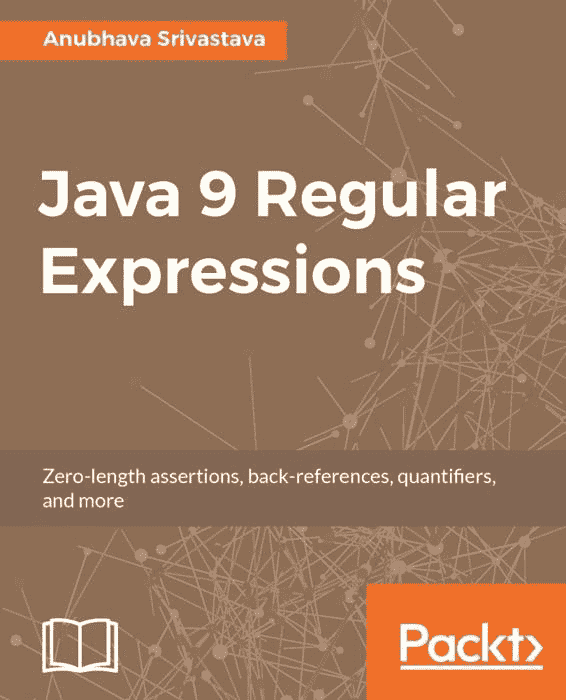

**Java 9 正则表达式**

零长度断言、后向引用、量词等，安布哈瓦·斯里瓦斯塔瓦

**伯明翰 - 孟买**

< html PUBLIC "-//W3C//DTD HTML 4.0 Transitional//EN"

"http://www.w3.org/TR/REC-html40/loose.dtd">

**Java 9 正则表达式**

版权所有 © 2017 Packt Publishing

所有权利保留。未经出版者事先书面许可，本书的任何部分不得以任何形式或通过任何手段进行复制、存储在检索系统中或以任何方式传输，但简要引用包含在评论或评论文章中的情况除外。

在准备本书的过程中，已尽一切努力确保所提供信息的准确性。然而，本书中的信息销售时不附带任何明示或暗示的保证。作者、Packt Publishing 及其经销商和分销商不对由此书直接或间接造成的任何损害承担责任。

Packt Publishing 已努力通过适当使用大写字母提供本书中提到的所有公司和产品的商标信息。

然而，Packt Publishing 无法保证此信息的准确性。

首次出版：2017 年 7 月

生产参考：1210717

由 Packt Publishing Ltd.出版

利弗里广场

35 利弗里街

伯明翰

英国 B3 2PB。

ISBN 978-1-78728-870-6

[www.packtpub.com](http://www.packtpub.com)

**致谢**

**作者**

**复制编辑**

安布哈瓦·斯里瓦斯塔瓦

毛蒂坎特·加里梅拉

**审稿人**

**项目协调员**

彼得·韦哈斯

乌尔哈斯·坎巴利

**委托编辑**

**校对者**

梅林特·托马斯·马修

Safis 编辑

**采购编辑**

**索引者**

尼廷·达桑

弗兰西·普蒂里

**内容开发编辑**

**图形**

维卡斯·提瓦里

阿比纳什·萨胡

**技术编辑**

**生产协调员**

吉约·马里亚卡尔

梅尔温·达萨

**关于作者**

**安布哈瓦·斯里瓦斯塔瓦**在架构、设计和软件开发方面拥有超过 22 年的专业经验。他主要专长于 J2EE。

技术堆栈、网络技术、CICD、测试驱动开发和基于 AWS 云的开发。

他积极为 Stack Overflow 社区做出贡献。他目前在 750 万 Stack Overflow 用户中，以声誉排名前 35 位。

他对正则表达式充满热情，并总是愿意进一步提高自己的正则表达式技能。他在 Stack Overflow 上回答了近 10,000 个正则表达式问题。

他编写并发布了一个名为 GenericFixture 的测试驱动框架。

[FitNesse 作为开源软件。他在 http://anubhava.wo](http://anubhava.wordpress.com) 维护一个技术博客。

[rdpress.com](http://anubhava.wordpress.com)

安布哈瓦可在 LinkedIn 上找到 [`www.linkedin.com/in/anubhava/`](https://www.linkedin.com/in/anubhava/)

您可以在 Twitter 上关注他 @anubhava。

*首先，我想对 Packt 出版公司整个编辑和出版团队表示衷心的感谢，因为他们给我提供了撰写这本书的机会。在整个过程中，他们的支持和指导鼓励我探索更多，深入研究。*

*这本书的完成离不开我妻子和孩子的支持和鼓励。我非常感激我的家人对我的能力充满信任，并理解我在周末和节假日长时间面对电脑。*

*我想感谢 Stack Overflow 的知识渊博的贡献者和开源社区，他们教会了我高级正则表达式概念。*

*最后，我想对我的管理团队 AOL 表示衷心的感谢，因为他们允许我在业余时间开始这本书的写作之旅。*

**关于审稿人**

**彼得·韦哈斯**是一位具有电气工程和经济背景的高级软件工程师和软件架构师。他在布达佩斯技术大学获得了硕士学位，在匈牙利佩奇技术经济大学获得了 MBA 学位。他还曾在代尔夫特技术大学和维也纳技术大学学习。他在 1979 年创建了第一个程序，从那时起，他一直是几个开源项目的作者。他在电信和金融行业担任过多个职位，并在 index.hu 这个匈牙利初创公司的初期担任了首席信息官。

彼得在瑞士为 EPAM Systems 工作，参与各种客户站点的软件开发项目。他还通过面试候选人支持人才招聘，并为开发者设计内部辅导计划和培训计划。

彼得是《Java 9 编程实例》的作者，也是 Packt 出版的《精通 Java 9》的合著者。

您可以在 Twitter 上关注彼得 @verhas，LinkedIn 和 GitHub。您还可以阅读他的技术博客 Java Deep，网址为 [`javax0.wordpress.com`](http://javax0.wordpress.com)。

**www.PacktPub.com**

有关您书籍的支持文件和下载，请访问 [www.PacktPub.com.](http://www.PacktPub.com)

您知道 Packt 为每本书提供电子书版本，包括 PDF

您是否想知道是否提供 ePub 文件？您可以通过升级到电子书版本来获取。

[www.PacktPub.coma](http://www.PacktPub.com)以及作为印刷版书籍的客户，您有权获得电子书副本的折扣。有关更多详情，请联系我们 service@packtpub.com。

在 [www.PacktPub.com](http://www.PacktPub.com)，您还可以阅读一系列免费的技术文章，订阅各种免费通讯，并享受 Packt 书籍和电子书的独家折扣和优惠。

[`www.packtpub.com/mapt`](https://www.packtpub.com/mapt)

使用 Mapt 获得最热门的软件技能。Mapt 为您提供对所有 Packt 书籍和视频课程的全面访问权限，以及领先的行业工具，帮助您规划个人发展并提升职业生涯。

**为什么要订阅？**

全文可搜索 Packt 出版的每一本书

复制粘贴、打印和收藏内容

按需通过网页浏览器访问

**客户反馈**

感谢您购买 Packt 这本书。在 Packt，质量是我们编辑过程的核心。为了帮助我们改进，请在亚马逊上这本书的页面[`www.amazon.com/dp/1787288706`](https://www.amazon.com/dp/1787288706)上留下一个诚实的评价。

如果你想加入我们团队的常规审稿人，你可以通过 customerreviews@packtpub.com 给我们发邮件。我们以免费电子书和视频作为回报，以换取他们宝贵的反馈。帮助我们不懈地改进我们的产品！

**目录**

前言

本书涵盖的内容

您需要为此书准备什么

本书面向的对象

约定

读者反馈

客户支持

下载示例代码

勘误表

盗版

问题

1\. 正则表达式入门

正则表达式简介

正则表达式的一些历史

正则表达式的各种风味

需要正则表达式解决的问题类型

正则表达式的基本规则

标准正则表达式和元字符的构造

一些基本的正则表达式示例

贪婪匹配

贪婪匹配对正则表达式交替的影响

总结

2\. 理解 Java 正则表达式的核心构造

理解正则表达式的核心构造

量词

基本量词

使用量词的示例

使用量词的贪婪匹配与懒惰匹配

占有量词

边界构造

使用边界构造的示例

字符类

字符类示例

字符类内的范围

字符范围的示例

转义特殊正则表达式元字符和字符类内的转义规则

es

字符类内的转义

字符类内转义规则的示例

字面匹配可能包含特殊正则表达式元字符的字符串

否定字符类

否定字符类的示例

预定义的简写字符类

POSIX 字符类

Java 正则表达式中的 Unicode 支持

常用的 Unicode 字符属性

否定前面的正则表达式指令

Unicode 脚本支持

正则表达式中匹配 Unicode 文本的示例

在定义正则表达式时 Java 字符串中的双重转义

内嵌正则表达式模式修饰符

Java 正则表达式内嵌模式的放置

禁用模式修饰符

总结

3\. 使用组、捕获和引用

捕获组

组编号

命名组

非捕获组

非捕获组的优势

向后引用

命名组的向后引用

命名组的替换引用

向前引用

无效（不存在）的向后或向前引用

总结

4\. 使用 Java String 和 Scanner API 进行正则表达式编程

Java 字符串 API 中正则表达式评估的介绍

方法 - boolean matches(String regex)

matches 方法的示例

方法 - String replaceAll(String regex, String replacement)

replaceAll 方法的示例

方法 - String replaceFirst(String regex, String replacement)

replaceFirst 方法的示例

方法 - String split 方法

限制参数规则

split 方法的示例

使用限制参数的 split 方法示例

在 Java Scanner API 中使用正则表达式

总结

5\. Java 正则表达式 API 简介 - Pattern 和 Matcher 类

MatchResult 接口

Pattern 类

使用 Pattern 类的示例

使用 asPredicate()方法过滤令牌列表

Matcher 类

使用 Matcher 类的示例

方法 Boolean lookingAt()

matches()方法

find()和 find(int start)方法

appendReplacement(StringBuffer sb, String replacement)方法

appendTail(StringBuffer sb)方法

appendReplacement 和 appendTail 方法的示例

总结

6\. 探索零宽断言、向前查看和原子组

零宽断言

预定义的零宽断言

正则表达式定义的零宽断言

\G 边界断言

原子组

向前断言

正向向前断言

负向前断言

向后断言

正向向后断言

负向后断言

从重叠匹配中捕获文本

注意在向前或向后原子组内部使用捕获组

Java 正则表达式中的向后断言限制

总结

7. 理解字符类的并集、交集和减法

字符类并集

字符类交集

字符类减法

为什么你应该使用复合字符类？

摘要

8. 正则表达式陷阱、优化和性能改进

编写正则表达式时常见的陷阱和避免方法

不要忘记在字符类外转义正则表达式元字符

避免对每个非单词字符进行转义

避免不必要的捕获组以减少内存消耗

然而，不要忘记在交替周围使用所需的组

使用预定义的字符类而不是较长的版本

使用限制量词而不是重复字符或模式多次

不要在字符类中间使用未转义的破折号

在调用 matcher.group() 之前没有先调用 matcher.find() 或 match 的错误

er.matches() 或 matcher.lookingAt()

不要使用正则表达式解析 XML / HTML 数据

如何测试和基准测试你的正则表达式性能

灾难性或指数回溯

如何避免灾难性回溯

优化和性能提升技巧

使用正则表达式的编译形式

使用否定字符类代替贪婪且缓慢的 .* 或 .+

避免不必要的分组

有策略地使用懒惰量词而不是导致过度贪婪的量词

回溯

利用所有格量词避免回溯

从交替中提取常见的重复子串

使用原子组避免回溯并快速失败

摘要

**前言**

在当今的信息技术世界中，数据的大小正在飞速增长。IT 组织正在处理和存储来自各种来源的大量文本数据，例如用户行为、线索、搜索、购物数据、页面浏览量、页面点击量以及各种其他用户交互形式。搜索算法用于解析大量文本以提取有意义的相关信息。正则表达式是许多此类搜索算法的基础。

正则表达式（或简称 regex）如今无处不在。所有现代编程语言都附带了一个正则表达式模块或库，以便程序员可以编写基于正则表达式的程序。正则表达式是程序员工具箱中的强大工具，允许进行模式匹配。它们也用于操作文本和数据。本书将为您提供必要的知识（以及实际示例），以使用 Java 中的正则表达式解决现实世界的问题。

这本易于理解的正则表达式书籍是您熟悉正则表达式核心概念并掌握其使用 Java 9 新特性的实现的好地方。您将学习如何通过匹配特定单词、字符和模式来匹配、提取和转换文本。读者将学习如何编写高效的正则表达式来解决涉及文本数据的日常问题。

**本书涵盖内容**

第一章，*正则表达式入门*，介绍了正则表达式是什么，哪些问题最适合使用正则表达式解决，以及编写正则表达式时应遵循的规则。

第二章，*理解 Java 正则表达式的核心构造*，涵盖了量词、锚点、边界匹配器和 Java 中所有可用的字符类和属性。我们还将学习使用 Java 中的正则表达式进行 Unicode 文本匹配。

第三章，*使用组、捕获和引用进行操作*，探讨了如何在正则表达式中匹配和捕获文本，我们可用的各种组类型，捕获组的命名和编号，以及我们应如何使用反向引用来引用捕获的组。

第四章，*使用 Java String 和 Scanner API 进行正则表达式编程*，介绍了 Java 正则表达式使用 Java String 方法，然后我们将继续学习 Java Scanner API 中的正则表达式功能。

第五章，*Java 正则表达式 API 简介 - Pattern 和 Matcher 类*，讨论了用于完整正则表达式功能的专用 Java API，即 java.util.regex.Pattern 和 java.util.regex.Matcher。

第六章，*探索零宽断言、前瞻和原子组*，专注于正则表达式中的零宽断言。本章涵盖了各种零宽断言及其用法。然后我们将继续学习正则表达式中的前瞻这一重要主题。

第七章，*理解字符类交集、并集和差集*，说明 Java 语言增加了在正则表达式中使用字符类交集和并集的功能。本章涵盖了这些功能。

第八章，*正则表达式陷阱、优化和性能改进*，解释了如何测试和优化性能不佳的正则表达式以及各种其他性能提示。

**本书所需内容**

本书中的软件在 Java 9 版本和 Ubuntu 16.10 版本上进行了测试。

然而，所有示例也可以在 Windows 和 macOS X 操作系统上运行。

**本书面向对象**

这本书是为希望理解和使用正则表达式的 Java 开发者所写。如果你正在处理文本处理问题，如文本验证、搜索和文本操作，那么学习正则表达式对你来说非常重要，因为它可以使你的工作更加容易。本书不期望读者有任何先前的正则表达式知识，因为本书将涵盖正则表达式的各个方面，从正则表达式的绝对基础开始。然而，为了能够编写和执行本书中提供的示例程序，假设读者具备 Java 的基本知识。

**约定**

在本书中，你会发现许多不同的文本样式，用于区分不同类型的信息。以下是一些这些样式的示例及其含义的解释。

文本中的代码单词、数据库表名、文件夹名、文件名、文件扩展名、路径名、虚拟 URL、用户输入和 Twitter 昵称如下所示："接下来的代码行读取链接并将其分配给 BeautifulSoup 函数。"。

代码块设置如下：

package example.regex;

public class StringMatches

{

public static void main(String[] args)

}

当我们希望将你的注意力引到代码块的一个特定部分时，相关的行或项目将以粗体显示：

[默认]

exten => s,1,Dial(Zap/1|30)

**exten => s,2,Voicemail(u100)**

**exten => s,102,Voicemail(b100)**

exten => i,1,Voicemail(s0)

任何命令行输入或输出都如下所示：

**C:\Python34\Scripts> pip install -upgrade pip**

**C:\Python34\Scripts> pip install pandas**

**新术语**和**重要词汇**以粗体显示。屏幕上看到的单词，例如在菜单或对话框中，在文本中如下所示："为了下载新模块，我们将转到文件 | 设置 | 项目名称 | 项目解释器。"

*警告或重要提示如下所示。*

*技巧和窍门如下所示。*

**读者反馈**

我们欢迎读者的反馈。告诉我们你对这本书的看法——你喜欢什么或不喜欢什么。读者反馈对我们来说很重要，因为它帮助我们开发出你真正能从中获得最大收益的标题。

要向我们发送一般反馈，请简单地发送电子邮件至 feedback@packtpub.com，并在邮件主题中提及书籍标题。如果您在某个主题领域有专业知识，并且对撰写或为书籍做出贡献感兴趣，请参阅我们的作者指南 [www.packtpub.com/authors](http://www.packtpub.com/authors)。

**客户支持**

现在，您是 Packt 图书的骄傲拥有者，我们有一些事情可以帮助您从您的购买中获得最大收益。

**下载示例**

**代码**

您可以从 http://ww [下载本书的示例代码文件](http://www.packtpub.com)

[如果您在其他地方购买了本书，您可以访问 http://www.packtpub.c](http://www.packtpub.com)

[通过注册并支持，我们将直接将文件通过电子邮件发送给您](http://www.packtpub.com/support)

您可以通过以下步骤下载代码文件：1. 使用您的电子邮件地址和密码登录或注册我们的网站。

2. 将鼠标指针悬停在顶部的“支持”标签上。

3. 点击“代码下载与勘误”。

4. 在搜索框中输入书籍名称。

5. 选择您想要下载代码文件的书籍。

6. 从下拉菜单中选择您购买本书的来源。

7. 点击“代码下载”。

文件下载完成后，请确保使用最新版本的软件解压缩或提取文件夹：

Windows 上的 WinRAR / 7-Zip

Mac 上的 Zipeg / iZip / UnRarX

Linux 上的 7-Zip / PeaZip

[本书的代码包也托管在 GitHub 上，网址为 https://github.com/PacktPublishing/Java-9-Regular-Expressions](https://github.com/PacktPublishing/Java-9-Regular-Expressions)

[我们还有来自我们丰富目录的其他代码包](https://github.com/PacktPublishing/Java-9-Regular-Expressions)

在 [`github.com/PacktPublishing/`](https://github.com/PacktPublishing/) 上可找到本书的书籍和视频资源。查看它们！

**勘误表**

尽管我们已经尽最大努力确保内容的准确性，但错误仍然可能发生。如果您在我们的书中发现错误——可能是文本或代码中的错误——如果您能向我们报告，我们将不胜感激。这样做可以帮助其他读者避免挫败感，并帮助我们改进本书的后续版本。如果您发现任何勘误，请通过访问 [`www.packtpub.com/submit-errata`](http://www.packtpub.com/submit-errata) 来报告它们。

选择您的书籍，点击勘误提交表单链接，并输入您的勘误详情。一旦您的勘误得到验证，您的提交将被接受，勘误将被上传到我们的网站或添加到该标题的勘误部分下的现有勘误列表中。

[要查看之前提交的勘误表，请访问 https://www.packtpub.com/books/content/supp](https://www.packtpub.com/books/content/support)

[在搜索字段中输入书籍名称，以获取所需信息](https://www.packtpub.com/books/content/support)

出现在勘误表部分。

**盗版**

互联网上对版权材料的盗版是一个跨所有媒体的持续问题。

在 Packt，我们非常重视我们版权和许可证的保护。如果您在互联网上以任何形式遇到我们作品的非法副本，请立即提供位置地址或网站名称，以便我们可以寻求补救措施。

请通过 copyright@packtpub.com 联系我们，并提供涉嫌盗版材料的链接。

我们感谢您的帮助，保护我们的作者和为您提供有价值内容的能力。

**问题**

如果您在这本书的任何方面遇到问题，您可以联系我们在 questions@packtpub.com，我们将尽力解决问题。

**正则表达式入门**

**表达式**

在本章中，您将了解正则表达式（或简称 regex）。您将了解一些可以使用正则表达式解决的问题以及正则表达式的基本构建块。

我们将在本章中介绍以下主题：正则表达式简介

正则表达式简史

正则表达式的各种版本

需要正则表达式解决的问题类型

编写正则表达式的基本规则

标准正则表达式元字符

基本正则表达式示例

**正则表达式简介**

**表达式**

正则表达式（简称 regex）是一个非常有用的工具，用于描述用于匹配文本的搜索模式。正则表达式不过是定义搜索模式的一些字符序列。正则表达式用于解析、过滤、验证和从大量文本（如日志和其他程序生成的输出）中提取有意义的信息。

我们在许多网站上日常使用正则表达式。例如，在搜索引擎上搜索您最喜欢的食谱时，在填写表格并输入用户名和密码等数据时，等等。在许多网站上设置密码时，我们会遇到密码验证错误，例如密码必须包含一个数字或至少一个大写字母或至少一个特殊字符，等等。所有这些检查都可以使用正则表达式完成。一些更典型的正则表达式示例包括验证电话号码或验证邮政/邮编/PIN 码。

**正则表达式的简史**

**表达式**

著名数学家斯蒂芬·克莱尼在 1956 年使用有限自动机为简单代数构建了一个模型。他使用他称为“正则集”的数学符号描述了正则语言。计算机程序员在 20 世纪 70 年代开始使用正则表达式，当时 Unix 操作系统及其一些文本编辑器和文本处理实用程序（如 ed、sed、emacs、lex、vi、grep、awk 等）被构建。

正则表达式在 20 世纪 80 年代和 90 年代 Perl 和 Tcl 脚本语言的到来后变得更加流行。从那时起，所有流行的编程语言，如 Java、Python、Ruby、R、PHP 和.NET 都构建了非常好的正则表达式支持。

**正则表达式的各种版本**

**表达式**

现在，所有编程和脚本语言都内置了对正则表达式的支持。定义和执行正则表达式的基本规则在所有语言中几乎相同。然而，这些正则表达式实现在其高级水平上各有特色。本书我们将使用 Java 来介绍正则表达式。

一些流行的正则表达式版本如下：

.NET

Java

Perl

PCRE（PHP）

JavaScript

VBScript

Python

R

Ruby

std::regex

boost::regex

**基本正则表达式**（**BRE**）- 由 Unix 工具 ed、vi、sed、grep 等使用

**扩展正则表达式**（**ERE**）- 由 Unix 工具 sed、grep、awk 等使用

**需要解决什么类型的问题**

**正则表达式用于解决**

一些程序员想知道为什么他们甚至需要学习正则表达式。以下是一些用例：

在搜索某些文本时，有时我们事先不知道文本的值。我们只知道一些文本的规则或模式。例如，在日志消息中搜索 MAC 地址，或者在 IP 地址中搜索。

在 Web 服务器访问日志中搜索地址，或者搜索可能以*0*或*+<2 位国家代码>.*为前缀的 10 位手机号码。

有时，我们试图提取的文本长度是未知的，例如，在 CSV 文件中搜索以 http://或 https://开始的 URL。

有时，我们需要根据变量类型和长度将给定文本分割成分隔符，并生成标记。

有时，我们需要提取位于两个或更多搜索模式之间的文本。

经常，我们需要验证各种用户输入的形式，例如银行账户号码、密码、用户名、信用卡信息、电话号码、出生日期等。

有时，你可能只想从一行中捕获所有重复的单词。

将输入文本转换为某些预定义格式，例如在每三位数字后插入逗号或仅从括号内删除逗号。

在全局搜索替换时跳过所有转义字符。

**正则表达式的规则**

**表达式**

许多人都熟悉文本的通配符匹配（在 Unix 世界中，它被称为**全局模式**）。在这里：

**?** 匹配任意单个字符

***** 匹配任意字符序列

前一个元素。

匹配任何除

前一个字符的

将在接下来的章节中介绍

章节）。

使用否定字符类来匹配除字符类匹配之外的任何字符

通过保持贪婪（急切）、懒惰（犹豫）或占有性来改变匹配的行为

使用以下零宽断言：

开始和结束锚点

单词边界

使用我们捕获的组的回溯和前溯

从上一个匹配的末尾开始匹配

例如，在匹配 a 或 b 的正则表达式中，我们可以使用以下交替：a|b

**m** 是这里的**可选**匹配。

在交替中使用布尔“或”以匹配少数几个可选选项。在正则表达式模式中使用组来捕获我们想要从给定输入中提取或替换的子串

**标准**

**正则表达式和元**

**字符**

字母 **m.**

要匹配一个或多个数字 5 的实例，我们可以使用以下格式：5+

**.** (点或

**示例**

组。

由|分隔的

匹配 **#**, **@**, **A**, **f**, **5**, 或 **.**

期)

比换行符。

**符号**

发生次数

m* 匹配前一个字符的 0 个或多个

**+** (加号)

字母 **m.**

**m|n|p** 表示匹配以下任一

**m+** 匹配一个或多个

**nm?** 表示匹配 **n** 或 **nm**，即

仅匹配某些字符类别，例如仅匹配数字、仅匹配大写字母或仅匹配标点符号

用于匹配零个或一个

发生次数

匹配长度范围，例如只允许输入中包含 6 到 10 位数字或匹配至少 8 个字符的输入

***** (星号)

**?** 表示可选匹配。它

字母 **m** 或字母 **n** 或

**+** 匹配一个或多个

**?** (问题

的字母或字母 **n**。

元素。它也用于

标记)

**意义**

匹配行的开始

让我们熟悉正则表达式的核心结构和一些在正则表达式中具有特殊意义的保留元字符。我们将在接下来的章节中详细讨论这些结构：

要匹配以 p 开头并以 w 结尾的任何子串，我们可以使用以下格式：p.*w

**|** 表示交替。它是

与正则

**|** (管道)

用于匹配以下

匹配特定长度的字符或字符组。

**[abc]** 匹配方括号内的任何单个字符，因此它将匹配 a、b 或 c。正则表达式模式比通配符更复杂，可以在正则表达式模式中设置许多规则，例如以下内容：可选地匹配一个或一组字符（0 或 1 次）使用量词在正则表达式模式中匹配可变长度的文本使用字符类来匹配列表中的字符或匹配字符范围

字母 p

^m 仅当它是

的第一个字符

我们正在测试的

**^** 被称为锚点，它

**^** (捕获)

前瞻和后瞻断言

***** 匹配 0 个或多个

表达式。此外，请注意

你没有在

正则表达式的中间

表达式。

**$**被称为锚点，它

**$**（美元）

**m$**只匹配行尾的 m。

匹配行尾。

**\b**

字母表、数字和

**\bjava\b**匹配单词，java。

（反斜杠

下划线被认为是

因此，它不会匹配 javascript

后跟

单词字符。**\b**断言

由于单词，javascript，将在

由

单词边界，即

在 java 之后未能断言\b

字母 b）

位置在正前方和

正则表达式。

在单词之后。

**\B**

对于输入文本*abc*，

（反斜杠

**\B**断言为真，当**\b**

后跟

不，即，在两个

**\B**将在两个地方断言：

由

单词字符。

大写

1. 在*a*和*b*之间。

B）

2. 在*b*和*c*之间。

**(...)**一个子-

这是用于分组一部分

**m(ab)*t**匹配 m，后跟

模式

的文本，可以用来

后跟零个或多个出现

里面

捕获某个子串

的子串，**ab**，后跟

圆

或用于设置优先级。

由**t**。

括号内

一个量词范围来匹配

**mp{2,4}**匹配 m 后跟**2**

前一个元素

{min,max}

到**4**个字母的字母

之间的最小和

p.

的最大数量。

这被称为一个字符

**[A-Z]**匹配任何大写

**[...]**

类。

英语字母。

**\d**

（反斜杠

**\d**匹配 0-9 之间的任何数字

后跟

这将匹配任何数字。

9 范围。

由

字母 d）

**\D**

（反斜杠

后跟

这匹配任何字符

**\D**匹配 a，$，或 _。

由

那不是数字。

大写

D）

**\s**

（反斜杠

匹配任何空白，

后跟

包括制表符、空格或

**\s**匹配**[ \t\n]**。

由

换行符。

字母 s）

**\S**

（反斜杠

后跟

匹配任何非-

**\S**匹配\s 的相反

由

空白。

大写

S）

**\w**

**\w**将匹配[a-zA-Z0-9_]，因此

（反斜杠

匹配任何单词字符

它将匹配这些中的任何一个

后跟

这意味着所有字母数字

字符串：“ *abc*”，“ *a123*”，或通过

字符或下划线。

“ *pq_12_ABC*”

字母 w）

匹配任何非单词

**\W**

包括

（反斜杠

空白。在正则表达式中，任何

它将匹配这些中的任何一个

后跟

字符，它不是

字符串：“ *+/=*”，“ *$*”，或“ *!~*”

由

匹配\w 的可以是

字母 W）

使用\W 匹配。

**一些基本的正则**

**表达式示例**

让我们看看一些基本的正则表达式示例：ab*c

这将匹配字母 a，后跟零个或多个 b，然后是字母 c。

ab+c

这将匹配字母 a 后跟一个或多个 b，然后是字母 c。

ab?c

这将匹配字母 a 后跟零个或一个 b，然后是字母 c。因此，它将匹配 abc 或 ac。

^abc$

这将匹配一行中的 abc，并且由于在正则表达式的两侧使用了起始和结束锚点，该行除了字符串 abc 外不应有任何其他内容。

a(bc)*z

这将匹配字母 a，后跟零个或多个字符串 bc，然后是字母 z。因此，它将匹配以下字符串：az，abcz，abcbcz，abcbcbcz，依此类推。

ab{1,3}c

这将匹配 a，后面跟一个到三个 b 的出现，然后是 c。因此，它将匹配以下字符串：abc，abbc 和 abbbc。

red|blue

这将匹配字符串 red 或字符串 blue。

\b(cat|dog)\b

这将匹配字符串 cat 或字符串 dog，确保 cat 和 dog 必须是完整的单词；因此，如果输入是 cats 或 dogs，则匹配将**失败**。

[0-9]

这是一个具有字符范围的字符类。前面的示例将匹配介于 0 和 9 之间的数字。

[a-zA-Z0-9]

这是一个具有字符范围的字符类。前面的示例将匹配任何字母数字字符。

^\d+$

这个正则表达式将匹配只包含一个或多个数字的输入。

^\d{4,8}$

这个正则表达式将只允许包含四个到八个数字的输入。例如，1234，12345，123456 和 12345678 都是有效的输入。

^\d\D\d$

这个正则表达式不仅允许在开始和结束处只有一个数字，而且强制在这两个数字之间必须有一个非数字字符。例如，1-5，3:8，8X2 等等都是有效的输入。

^\d+\.\d+$

这个正则表达式匹配一个浮点数。例如，1.23，1548.567，和 7876554.344 都是有效的输入。

.+

这将匹配任意字符一次或多次。例如，qwqewe，12233，或 f5^h_=!bg 都是有效的输入：

^\w+\s+\w+$

这将匹配一个单词，后面跟一个或多个空格，然后是另一个单词。例如，hello word，John Smith 和 United Kingdom 将使用此正则表达式进行匹配。

***引擎**是一个术语，通常用于评估提供的正则表达式并匹配输入字符串的底层模块。***

**贪婪匹配**

在这一点上，理解正则表达式引擎的一个重要行为非常重要，称为贪婪。正则表达式引擎从左到右在输入字符串中执行匹配操作。当将正则表达式模式与输入字符串匹配时，正则表达式引擎从左到右移动，并且总是渴望完成匹配，即使正则表达式中还有其他替代方式可以完成匹配。一旦匹配了子字符串，它就会停止进一步处理并返回匹配结果。只有当字符位置无法匹配正则表达式的所有可能的排列时，正则表达式引擎才会逐字符移动，尝试在输入字符串的下一个位置进行匹配。在评估正则表达式模式时，正则表达式引擎可能会逐个位置向后移动（回溯）以尝试匹配。

**贪婪匹配的效果**

**在正则表达式上**

**交替**

如果在正则表达式模式中不仔细排序交替，这种正则表达式引擎的行为可能会在交替中返回意外的匹配。

以这个正则表达式模式为例，它匹配字符串 white 或 whitewash：white|whitewash

当我们将这个正则表达式应用于输入 *whitewash* 时，正则表达式引擎发现第一个备选的 white 匹配了输入字符串 *whitewash* 中的 *white* 子串，因此，正则表达式引擎停止进一步处理并返回匹配结果为 white。

注意，我们的正则表达式模式有更好的第二个备选 whitewash，但由于正则表达式引擎急于完成并返回匹配结果，第一个备选被作为匹配返回，而第二个备选被忽略。

然而，考虑交换我们正则表达式模式中的第三和第四个备选的位置，使其如下所示：

whitewash|white

如果我们将这个正则表达式应用于相同的输入，*whitewash*，那么正则表达式引擎会正确地返回匹配结果为 whitewash。

我们也可以在正则表达式中使用锚点或边界匹配器来使其匹配一个完整的单词。以下两种模式中的任何一种都会匹配并返回 whitewash 作为匹配结果：

^(white|whitewash)$

\b(white|whitewash)\b

让我们看看一个更有趣的例子，它尝试使用以下模式匹配一个已知的字面字符串 " *cat & rat*" 或输入中的完整单词：

\b(\w+|cat & rat)\b

如果输入字符串是 *story of cat & rat*，并且我们反复应用我们的正则表达式模式，那么以下四个匹配的子串将被返回：

1\. story

2\. of

3\. cat

4\. rat

这是因为正则表达式引擎正急切地使用第一个备选模式 \w+ 来匹配一个完整的单词，并返回所有匹配的单词。引擎从未尝试第二个备选的字符串，cat & rat，因为总是使用第一个备选来找到成功的匹配。然而，让我们将正则表达式模式更改为

following:

\b(cat & rat|\w+)\b

如果我们将这个正则表达式应用于相同的字符串，*story of cat & rat*，并且我们反复应用我们的正则表达式模式，那么以下三个匹配的子串将被返回：1\. story

2\. of

3\. cat & rat

这是因为现在 cat & rat 是第一个备选，当正则表达式引擎移动到输入中字母 c 之前的位置时，它能够使用第一个备选匹配并返回一个成功的匹配。

**总结**

在本章中，你通过一些历史背景和它们的风格了解了正则表达式。你学习了需要正则表达式的一些用例。最后，我们介绍了编写正则表达式的基本规则和构建块，并附带了一些示例。你还学习了正则表达式引擎的贪婪匹配行为及其如何可能影响备选匹配。

在下一章中，我们将深入探讨正则表达式的核心概念，详细讲解量词、懒惰匹配与贪婪匹配、锚点、否定字符类、Unicode 和预定义字符类、特殊转义序列以及字符类内转义的规则。

**理解核心**

**Java 正则表达式结构**

**表达式**

使用 Java 作为正则表达式风味，在本章中，我们将深入探讨并详细学习关于锚点、量词、边界匹配器、所有可用的字符类、否定字符类、预定义字符类和字符类转义规则，以 Java 作为参考点。你还将学习使用 Java 中的*正则表达式*进行 Unicode 文本匹配。我们还将涵盖贪婪与非贪婪（懒惰匹配）以及正则表达式行为在懒惰匹配中的变化。

我们将在本章中介绍以下主题：

锚点和量词

边界匹配器

字符类

正则表达式转义规则

字符类内的转义

否定字符类

预定义字符类

Unicode 字符匹配

贪婪量词

懒惰量词

占有性量词

正则表达式中的各种嵌入模式及其意义 在正则表达式内启用/禁用正则表达式模式

**理解核心**

**正则表达式的结构**

**表达式**

在 Java 正则表达式中，某些特殊字符结构可以按字面意思使用。

这里是它们：

**特殊**

**意义**

**字符**

**\0c**

一个八进制值为 c 的字符

**\0cc**

一个八进制值为 cc 的字符

一个八进制值为 ncc 的字符，其中 n 不能是

**\0ncc**

超过 3

**\xhh**

一个十六进制值为 0xhh 的字符

**\uhhhh**

一个十六进制值为 0xhh 的字符

一个十六进制值为 0xh...h 的字符，其中 h

**\x{h...h}**

必须是一个有效的 CODE_POINT

**\n**

换行字符或 u000A

**\t**

制表符或 u0009

**\r**

回车字符或 u000D

**\f**

换页字符或 u000C

**\e**

转义字符或 u\u001B

**\a**

铃声字符或\u0007

**\cn**

由 n 表示的控制字符

**量词**

我们在第一章简要介绍了量词。量词允许我们量化匹配的次数。我们可以以各种方式匹配输入，例如可选匹配、开放式范围、封闭范围以及使用固定数量。

让我们更仔细地看看它们，因为量词对于大多数正则表达式都是至关重要的。

**基本量词**

以下表格列出了 Java 正则表达式中所有可用的量词：**量词**

**意义**

**m*** 

匹配**m**零次或多次

**m+**

匹配**m**一次或多次

**m?**

匹配**m**一次或零次（也称为可选匹配）**m{X}**

匹配**m**正好**X**次

**m{X,}**

匹配**m**至少**X**次

**m{X,Y}**

匹配**m**至少**X**次和最多**Y**次*在所有上述情况下，**m**可以是一个单个字符或一组字符。我们将在稍后更详细地讨论分组。*

**使用量词的示例**

让我们通过几个示例来更好地理解这些基本量词。

哪个正则表达式模式应该用于匹配两位数年份或四位数年份？

\d{2}|\d{4}

应该使用哪个正则表达式模式来匹配一个有符号的十进制数？该模式还应匹配有符号的整数数：

^[+-]?\d*\.?\d+$

下面是先前正则表达式模式的分解：

^ 和 $ 符号是开始/结束锚点

[+-]? 模式使起始处的 + 符号或 - 符号（由于 ? 而是可选的）

\d* 模式匹配零个或多个数字

\.? 模式匹配一个可选的点（.）字面量

\d+ 模式匹配一个或多个数字

先前的正则表达式将匹配以下所有输入：

.45

123789

5

123.45

+67.66

-987.34

要匹配至少为 10 但不超过 9999 的数字，应该使用什么正则表达式？

^\d{2,4}$

由于我们至少有两个数字，10 是最小的匹配，而允许的最大数字数量是四个，因此 9999 是最高的匹配。

对于一个有七个数字且开头可以有 + 或 - 的输入，正则表达式是什么？

^[+-]?\d{7}$

The [+-]? pattern makes it an optional match at the start before we match the seven digits using \d{7}.

*先前的正则表达式也可以写成 ^[+-]?[0-9]{7}$，因为 \d 是* *一个简写属性，用于匹配 [0-9]*

**贪婪与懒惰**

**(懒惰)匹配使用**

**量词**

到目前为止，我们已经讨论了正则表达式中可用于匹配固定大小或可变长度文本的所有量词。这些量词默认是 **贪婪** 的。贪婪性在于它们的匹配。在正则表达式中，量词尝试匹配尽可能长的文本，从左到右。只有当正则表达式引擎无法完成匹配时，它才会逐个字符地向后移动输入文本，以完成所需的匹配。有时，正则表达式引擎会在复杂（嵌套）正则表达式中多次来回移动，以尝试完成匹配。

例如，如果输入是 pqrstmprt，我们的正则表达式是 p.+r，那么我们的匹配将从起始处的 p 到最后一个 r，即 pqrstmpr**,**，而不是 pqr。这是由于之前提到的相同贪婪性，当使用量词时，正则表达式引擎尝试匹配尽可能长的匹配。

正则表达式还提供了一种改变正则表达式引擎贪婪行为的方法。如果我们将一个 ?（称为懒惰或不愿意的量词）放在任何量词之前，那么正则表达式引擎的行为将从 **贪婪** 变为 **懒惰**。在有懒惰量词的情况下，正则表达式引擎尝试匹配最短的匹配，只有在需要时才会进一步扩展以完成与懒惰量词旁边的正则表达式模式的匹配。

所以，在先前的例子中，如果我们使用正则表达式 p.+?r，那么我们的匹配文本将是 pqr，因为 *pqr* 是 p 和 r 之间可能的最小匹配。

下面是所有贪婪量词及其对应懒惰量词的列表：**贪婪量词**

**懒惰量词**

**m*** 

**m*?**

**m+**

**m+?**

**m?**

**m??**

**m{X}**

**m{X}?**

**m{X,}**

**m{X,}?**

**m{X,Y}**

**m{X,Y}?**

**占有量词**

占有量词是像贪婪量词一样在匹配文本时贪婪的量词。贪婪和占有量词都试图匹配尽可能多的字符。然而，重要的区别是占有量词不会回溯（后退），与贪婪量词不同；因此，如果占有量词走得太远，正则表达式匹配可能会失败。

此表显示了所有三种类型的量词并排：**贪婪量词**

**懒惰量词**

**占有** **量词**

**m*** 

**m*?**

**m*+**

**m+**

**m+?**

**m++**

**m?**

**m??**

**m?+**

**m{X}**

**m{X}?**

**m{X}+**

**m{X,}**

**m{X,}?**

**m{X,}+**

**m{X,Y}**

**m{X,Y}?**

**m{X,Y}+**

让我们用一个示例输入字符串 a1b5，看看贪婪、懒惰和占有量词的行为。

如果我们使用贪婪量词的正则表达式，\w+\d，那么它将使用\w+匹配 a1b（回溯开始之前的最长匹配），并使用\d 匹配 5；因此，完整的匹配将是 a1b5\。

现在，如果我们使用非贪婪量词的正则表达式，\w+?\d，那么它将使用\w+?匹配（在扩展开始之前的最短匹配），然后匹配相邻的数字 1

将使用\d 进行匹配。因此，第一个完整的匹配将是 a1\.如果我们让正则表达式再次执行，那么它将找到另一个匹配，b5\。

最后，如果我们使用占有量词的正则表达式，\w++\d，那么它将使用\w++匹配所有字符 a1b5（不回退的最长匹配）。

由于这个原因，\d 没有匹配，因此正则表达式无法找到任何匹配。

让我们再举一个例子。要求是匹配一个以小写英文字母或连字符开头的字符串。字符串可以在字母/连字符之后有任意字符，但不能是冒号。冒号之后可以有任何数量和长度的任意字符，直到字符串结束。

一个有效输入的例子是 as-df999，无效输入的例子是 asdf-:123\.

现在，让我们尝试使用贪婪量词正则表达式来解决这个正则表达式问题：

^[a-z-]+[^:].*$

不幸的是，这不是正确的正则表达式模式，因为这个正则表达式将匹配以下两种

上述有效和无效的输入。这是因为贪婪量词的正则表达式引擎的回溯行为。模式[a-z-]+将找到最长可能的匹配形式为 asdf-，但由于否定字符类模式[^:]，正则表达式引擎将回溯一个位置到 asdf，并匹配下一个*连字符*用于[^:]。所有剩余的文本，即：123，将使用.*进行匹配。

让我们尝试使用以下占有量词正则表达式来解决这个正则表达式问题：

^[a-z-]++[^:].*$

这个正则表达式模式仍然会匹配我们的有效输入，但它将无法匹配无效输入，因为没有回溯；因此，正则表达式引擎不会在第二个示例字符串匹配 asdf- 之后回到任何位置。由于下一个字符是冒号，并且我们的正则表达式子模式是 [^:]，正则表达式引擎将停止匹配，并正确地宣布我们的无效输入为失败匹配。

占有量词对底层正则表达式引擎的性能有益，因为引擎不需要在内存中保留任何回溯信息。

当正则表达式无法匹配时，性能提升更为显著，因为占有量词失败得更快。所以，记住占有量词的好处是提高正则表达式的性能，尤其是在使用嵌套量词时。

**边界构造**

边界构造允许我们通过限制匹配的起始或结束位置来指定我们的匹配应该在哪里开始或停止。我们通过在匹配文本的起始和结束位置添加限制来避免匹配不需要的文本。以下是 Java 正则表达式中所有可用的边界构造：**边界**

**匹配器**

**意义**

**名称**

单词边界；位于单词和非单词之间

**\b**

字符

非单词边界；它与 **\b** 相辅相成并断言为真

**\B**

在 **\b** 断言为假的地方

**^**

行首锚点，匹配行的开始

行尾锚点，匹配在可选行 **$** 之前

行尾的换行符

输入的永久起始位置；在多行输入中使用

**\A**

多行模式，**\A** 只匹配在最开始的位置，而 **^** 在每一行的起始位置匹配

输入的永久结束位置；在多行输入中使用

**\z**

多行模式，**\z** 只匹配在最后的位置，而 **$**

匹配在每一行的末尾位置

与 **\z** 类似，唯一的区别是它匹配

**\Z**

仅在输入的最后一个可选换行符之前。

上一个匹配的末尾；我们将在高级课程中讨论它

**\G**

书籍下一章中的部分。

*让我们回顾第一章的内容，[a-zA-Z0-9_] 被称为单词* *字符。所有其他字符都被视为非单词字符。*

**示例使用边界**

**构造**

当输入是 'Hat at work' 时，应该使用哪个正则表达式来匹配 "at"？

\bat\b

应该使用前面的正则表达式，因为 \b（单词边界）阻止正则表达式引擎在 Hat 中匹配 at，因为 \bat\b 只能匹配完整的单词。

如果我们只想匹配 Hat 中的 at 而不是前一个正则表达式匹配的 at，那么正则表达式应该是什么？

\Bat\b

现在，这个正则表达式将匹配 Hat 中的 at，因为 \B 断言的位置是在两个单词字符之间或两个非单词字符之间。由于正则表达式中存在 \B，它只匹配 Hat 中的 at，而不匹配单词 at。

如果输入是抑制表**达**式 按压表**达**，那么如果正则表达式是 \Bpress\B，将会匹配什么？

抑制表**达**式 按压表**达**

这是因为 \B 匹配单词字符之间的位置，而其他实例，抑制和按压，在按压后有非单词字符。

如果输入是 ppp\n555\n，那么使用以下两个正则表达式显示匹配的文本：

\Ap+\n5{3}\Z

\Ap+\n5{3}\z

这里是匹配结果：

**A)** ppp\n555

**B)** 无匹配

正则表达式模式中的起始部分，\Ap+\n5{3}，在两种模式中都是共同的，并且两次都匹配 ppp\n555。然而，由于 \Z 和 \z 断言之间的细微差别，我们在第二种情况下没有匹配。\Z 断言在末尾或最后一个换行符之前的位置，而 \z 总是断言在非常末尾的位置。由于文件末尾存在 \n，我们的第二个正则表达式没有匹配。如果我们将第二个正则表达式更改为 \Ap+\n5{3}\n\z，那么它将匹配整个输入。

*注意，如果输入文本中有多行且没有启用 MULTILINE 标志* *(稍后讨论) *，则末尾锚点 $ 也像 \Z 一样行为。因此，也可以使用前面的输入字符串进行匹配*

*^p+\n5{3}$.*

**字符类**

我们在第一章中简要介绍了字符类。字符类（或字符集）让我们匹配类中定义的许多字符之一。

字符类被括号包围。字符类内部字符的顺序并不重要。

**字符示例**

**类别**

哪个正则表达式可以匹配字母 *p*、*m* 或 *z*？

**解决方案 1：**

[pmz]

**解决方案 2：**

[zmp]

**解决方案 3：**

[mzp]

所有的前三个正则表达式将以完全相同的方式表现，因为字符类内部字符的顺序并不重要。

哪个正则表达式可以匹配英语语言元音 *a*、*e*、*i*、*o* 和 *u*？

[aeiou]

哪个正则表达式可以匹配字段扩展名 .mp3 或 .mp3？

\.mp[34]

哪个正则表达式可以匹配字母 **@**、**#** 或 **=**？

[@#=]

**字符范围内的范围**

**类别**

我们还可以通过在两个字符之间使用连字符（-）来指定字符类内的字符范围。你只需确保范围左侧的字符在 ASCII 表中的位置低于右侧的字符。我们可以使用正则表达式模式匹配所有数字，例如 [0123456789]，或者更短的 [0-9]。

**字符范围示例**

以下是一个匹配英语语言中任何大写或小写字母的正则表达式：

[a-zA-Z]

a-z 模式用于小写字母范围，A-Z 用于大写字母范围。

以下正则表达式匹配任何字母数字字符：

[a-zA-Z0-9]

阿拉伯数字字符由任何英语字母和数字组成。

以下正则表达式匹配任何十六进制字符：

[a-fA-F0-9]

我们知道十六进制字符由数字组成，0 到 9，以及字母，A 到 F

(忽略大小写)。前面的正则表达式模式显示了一个包含这两个字符范围的字符类。我们使用 a-f 和 A-F 范围来使其匹配大写或小写字母。

**特殊正则表达式的转义**

**元字符和转义**

**字符内部的规则**

**类**

我们知道 . 匹配任何字符，[ 和 ] 用于字符类，{ 和 }

用于限制量词，而 ? , *, 和 + 用于各种量词。为了匹配元字符 *literally*，需要使用 *escape* 这些字符，通过一个 *backslash (*\ ) 来抑制它们的特殊意义。同样，^ 和 $ 是锚点，也被认为是正则表达式元字符。

让我们看看一些在正则表达式中转义元字符的示例。

以下正则表达式匹配字符串，a.b?:

a\.b\?

以下正则表达式匹配字符串，{food}:

\{food\}

以下正则表达式匹配字符串，abc:][}{:

abc:\]\\}\{

以下正则表达式匹配字符串，$25.50:

\$\d+\.\d+

以下正则表达式匹配字符串，^*+.:

\^\*\+\.

![Image 11

**字符类内部的转义**

**类**

在 Java 正则表达式引擎中，所有特殊正则表达式元字符在字符类内部都失去了它们的特殊意义，除了 ^ (**胡萝卜**)、- (**连字符**)、] (**右方括号**) 和 \ (**反斜杠**) 字符。

*在字符类内部，连字符也不需要转义，当用作第一个或最后一个字符时，因为字符范围* *需要左右两侧的字符。*

*同样，^ (胡萝卜) 只需要在作为字符类内部第一个字符时进行转义。*

**转义规则的示例**

**字符类内部**

以下正则表达式匹配包含一个或多个 ap.9 字符的字符串：

^[ap9.]+$

点 (.) 在字符类内部不需要转义。

以下正则表达式匹配包含一个或多个@#$%.*字符的字符串：

^[$#@%.*]+$

前面的所有特殊字符在字符类内部都不需要转义。

以下正则表达式匹配包含一个或多个?*+.字符的字符串：

^[*+?.]+$

以下正则表达式匹配允许任何数字、]，或 ^ 的输入：

^[\^\]0-9]+$

我们也可以将我们的正则表达式写成 ^[\]0-9^]+$，通过将 ^ 移离第一个位置并避免转义。

以下正则表达式匹配允许任何字母数字字符、连字符、点或反斜杠的输入，例如 xyzTR-4.5\00：

^[a-zA-Z0-9.\-\\]+$

我们也可以通过将 - 移到字符类内的最后一个位置来避免转义，从而写成以下正则表达式：

^[a-zA-Z0-9.\\-]+$

**字面匹配字符串**

**可能包含特殊**

**正则表达式元字符**

我们已经看到，我们需要转义所有特殊正则表达式元字符才能字面匹配它们。

Java 正则表达式引擎为此提供了特殊的转义序列，\Q 和 \E。

任何被\Q 和\E 包裹的字符串都会丢失包裹字符串中所有正则表达式元字符的解释。

例如，要编写一个匹配字符串^*+.,的正则表达式，我们可以避免所有转义并使用此正则表达式：

\Q^*+.\E

注意，\Q 和\E 序列之间不得有任何字符转义。

要匹配一个输入字符串 "[a-z0-9]"，我们可以将我们的正则表达式写成如下：

\Q[a-z0-9]\E

Java 提供了一个方便的方法来返回给定字符串的文本模式字符串，称为 Pattern.quote(String)。我们将在本书的第五章，*Java 正则表达式 API 介绍 - Pattern 和 Matcher 类*中学习此方法。

**否定字符类**

通过在字符类内部的第一位置放置胡萝卜字符（^）（紧挨着）**否定**了字符类的匹配。否定字符类匹配不在类中的任何字符。否定字符类还通过匹配字符范围之外的任何字符来否定字符范围。

*您在[第一章* *中学习了关于正则表达式的入门知识，即点（.）匹配除换行符以外的任何字符。然而，*请注意，否定字符类也匹配换行符* *如\r、\n 等。*

**否定示例**

**字符类**

以下正则表达式匹配除正斜杠以外的任何字符：

[^/]

此外，记住以下事实：一个否定字符，如[^/]，必须匹配单个字符。它不匹配零宽断言，如^、$、\Z、\z、\b、\B 等。

以下正则表达式匹配任何字符但 a 和 A：

[^aA]

以下正则表达式匹配英语语言中的所有**辅音**：

[^aeiou]

所有非元音都被认为是**辅音**；因此，我们只需要否定元音字符类。

以下正则表达式匹配除数字、点和换行符之外的所有字符：

[⁰-9.\r\n]

在这个正则表达式中，我们也可以使用预定义属性\d 来表示[0-9]：

[^\d.\r\n]

此正则表达式匹配 http 后跟除 s 以外的任何字符：http[^s]

**预定义简写**

**字符类**

如前所述的示例，某些字符类，如数字

[0-9]或单词字符[0-9A-Za-z_]，在大多数正则表达式模式中使用。Java 语言，像所有正则表达式变体一样，为这些字符类提供了方便的预定义字符类。以下是列表：

**简写**

**意义**

**字符类**

**类别**

**\d**

一个数字 0-9

[0-9]

**\D**

一个非数字

[^\d]

**\w**

一个单词字符

[a-zA-Z0-9_]

**W**

一个非单词字符

[^\w]

一个空白字符，

**\s**

[ \t\r\n\f\x0B]

包括换行符

一个非空白

**\S**

[^\s]

字符

一个水平空白

**\h**

[ \t\xA0\u1680\u180e\u2000-

字符

\u200a\u202f\u205f\u3000]

一个非水平

**\H**

[^\h]

空白字符

一个垂直空白

**\v**

[\n\x0B\f\r\x85\u2028\u2029]

字符

非垂直空白

**\V**

[^\v]

字符

**POSIX 字符类**

Java 还支持许多 POSIX 字符类以匹配 ASCII 文本。以下是列表：

**POSIX 字符**

**意义**

**字符类**

**类**

**\p{ASCII}**

所有 ASCII 字符

[\x00-\x7F]

**\p{Digit}**

任何数字

[0-9]

**\p{Lower}**

小写字母

[a-z]

**\p{Upper}**

大写字母

[A-Z]

**\p{Alpha}**

任何字母表

[\p{Lower}\p{Upper}]

任何字母数字

**\p{Alnum}**

[\p{Lower}p{Upper}\p{Digit}]

字符

一个标点符号

**\p{Punct}**

[!"\#$%&'()*+,-./:;<=>?@\\]

字符

[\\\]^_`{|}~]

**\p{Blank}**

空格或制表符

[空格或制表符]

空白

**\p{Space}**

[ \t\n\x0B\f\r]

字符

可见的 ASCII

**\p{Graph}**

[\p{Alnum}\p{Punct}]

字符

**\p{Print}**

可打印字符

[\p{Graph}\x20]

**\p{Cntrl}**

控制字符

[\x00-\x1F\x7F]

**\p{XDigit}**

一个十六进制数字

[0-9a-fA-F]

Java 还支持基于 java.lang.Character 方法的四个额外的预定义字符类：

**类名**

**实现方法**

**\p{javaLowerCase}**

等同于 java.lang.Character.isLowerCase()

**\p{javaUpperCase}**

等同于 java.lang.Character.isUpperCase()

**\p{javaWhitespace}**

等同于 java.lang.Character.isWhitespace()

**\p{javaMirrored}**

等同于 java.lang.Character.isMirrored()

**Java 中的 Unicode 支持**

**正则表达式**

到目前为止，我们在前两章中看到的所有示例都仅适用于英语。然而，正则表达式需要完全支持所有使用 Unicode 字符的语言。Java 具有基于 Unicode 的正则表达式引擎，并广泛支持各种 Unicode 字符脚本、块和类别。

在 Java 中，可以以两种不同的方式匹配特定的 Unicode 字符：1\. **Unicode 转义序列** **或** \u **表示法**：这可以写成 "\u1234" 或

"\\u1234".

2\. **十六进制表示法**：这可以写成 "\x{1234}"。

**常用 Unicode**

**字符属性**

以下是正则表达式中常用的 Unicode 字符属性列表，这些属性需要匹配 Unicode 文本：

**Unicode**

**字符**

**意义**

**类**

**\p{L}**

匹配任何语言的任何字母

**\p{Lu}**

匹配任何语言的任何大写字母

**\p{Ll}**

匹配任何语言的任何小写字母

**\p{N}**

匹配任何语言的任何数字

**\p{P}**

匹配任何语言的任何标点字母

**\p{Z}**

匹配任何类型的空白或不可见分隔符

**\p{C}**

匹配任何不可见的控制字母

**\p{Sc}**

匹配任何货币符号

任何 Unicode 行分隔序列；等同于

\u000D\u000A|[\u000A\u000B\u000C\u000D\u0085\u2028\u2029]

**\R**

***建议使用** \R **来匹配任何换行符***

***即使处理 ASCII 文本时也是如此。***

**前一个类的否定**

**正则表达式指令**

要匹配属于特定 *类别* 的单个字符，我们使用

\p{propertyName} 指令。

要匹配不属于特定 *类别* 的单个字符 **不**，我们使用

\P{propertyName} 指令（注意大写 **P** 而不是小写 **p**）。

**Unicode 脚本支持**

Java 支持由 Unicode 标准定义的所有 Unicode 脚本。以下是所有支持的 Unicode 脚本列表：

\p{IsCommon}

\p{IsArabic}

\p{IsArmenian}

\p{IsBengali}

\p{IsBopomofo}

\p{IsBraille}

\p{IsBuhid}

\p{IsCanadian_Aboriginal}

\p{IsCherokee}

\p{IsCyrillic}

\p{IsDevanagari}

\p{IsEthiopic}

\p{IsGeorgian}

\p{IsGreek}

\p{IsGujarati}

\p{IsGurmukhi}

\p{IsHan}

\p{IsHangul}

\p{IsHanunoo}

\p{IsHebrew}

\p{IsHiragana}

\p{IsInherited}

\p{IsKannada}

\p{IsKatakana}

\p{IsKhmer}

\p{IsLao}

\p{IsLatin}

\p{IsLimbu}

\p{IsMalayalam}

\p{IsMongolian}

\p{IsMyanmar}

\p{IsOgham}

\p{IsOriya}

\p{IsRunic}

\p{IsSinhala}

\p{IsSyriac}

\p{IsTagalog}

\p{IsTagbanwa}

\p{IsTaiLe}

\p{IsTamil}

\p{IsTelugu}

\p{IsThaana}

\p{IsThai}

\p{IsTibetan}

\p{IsYi}

**Unicode 区块**: Java 支持之前列出的所有脚本以匹配 Unicode 区块。我们只需将前面的表达式中的 Is 替换为 In。例如，要检查 **泰语** 区块，我们可以使用：

\p{InThai}

**匹配示例**

**正则表达式中的 Unicode 文本**

**表达式**

以下正则表达式将匹配带音标的字符，例如 " **à**":

^\p{L}+$

以下正则表达式将匹配由拉丁字符和 Unicode 空白符组成的文本：

^[\p{IsLatin}\p{Zs}]+$

以下正则表达式应用于检测输入中是否存在 **希伯来语** 字符：

\p{InHebrew}

以下正则表达式应用于检测仅包含 **阿拉伯语** 文本的输入：

^\p{InArabic}+$

我们如何匹配乌尔都语文本？由于乌尔都语不是一个脚本，我们需要匹配某些 Unicode 代码范围。这些如下所示：

U+0600 到 U+06FF

U+0750 到 U+077F

U+FB50 到 U+FDFF

U+FE70 到 U+FEFF

检测任何乌尔都语字符的 Java 正则表达式如下：

[\u0600-\u06FF\u0750-\u077F\uFB50-\uFDFF\uFE70-\uFEFF]

**Java 中的双重转义**

**定义正则表达式时的字符串**

**表达式**

在 Java 中，所有正则表达式都作为 String 类型输入，其中 \ 作为转义字符，用于解释某些特殊字符，如 \t、\n 等。因此，必须使用两个反斜杠来转义所有预定义类，如 \w、\d、\s 等，并在字符串字面量中转义元字符，如 \[、\(、\+ 等。

如果我们必须在 Java 中使用前面的正则表达式来匹配金额，则如下所示：

final String re = "\\$\\d+\\.\\d+";

之前匹配有符号十进制数的示例在 Java 中必须写成如下：

final String re = "^[+-]?\\d*\\.?\\d+$";

由于同样的原因，如果我们必须匹配单个反斜杠字符，则如下所示：

\\\\

如何编写一个正则表达式字符串，以匹配允许任何字母数字字符、连字符、点或反斜杠的输入，例如 xyzTR-4.5\00？以下是方法：final String re = "^[a-zA-Z0-9.\-\\\\]+$";

如何在 Java 中编写一个正则表达式，使其接受任何拉丁字符、Unicode 空白或 Unicode 数字？请参考以下正则表达式：final String re = "^[\\p{IsLatin}\\p{Zs}\\p{N}]+$"; 如何在 Java 中编写一个正则表达式，使其接受任何 Unicode 字符、Unicode 空白、Unicode 数字或 Unicode 标点字符？查看以下正则表达式：

final String re = "^[\\p{L}\\p{Z}\\p{N}\\p{P}]+$"; 以下 Java 正则表达式匹配字符串 " **abc:][**": final String re = "abc:\\]\\[\\}\\{";

**内嵌正则**

**表达式模式修饰符**

与所有其他正则表达式风味一样，Java 也允许在正则表达式本身中嵌入一些标准模式。这些模式修饰符用于以某种方式更改正则表达式的行为。在以下表中，我们将列出所有这些模式及其含义：

模式

名称

含义

忽略大小写

启用 US-ASCII 不区分大小写的匹配

**(?i)**

模式

文本

DOTALL

使 DOT 匹配所有字符，包括

**(?s)**

模式

换行符

多行

使得 carrot 和 dollar 匹配开始和

**(?m)**

模式

每行的末尾

Unicode-

**(?u)**

感知大小写

启用 Unicode 感知的大小写折叠

折叠

Unicode

启用预定义模式的 Unicode 版本

**(?U)**

匹配

字符类和 POSIX 字符类。

Unix 行

**(?d)**

启用 Unix 行模式

模式

注释

允许在多行输入中存在空白和

**(?x)**

模式

正则表达式模式中的注释

让我们检查一些示例，以更好地理解这些模式。

如何匹配一个以 **Java** 开头并以 **Mode** 结尾的输入，我们不知道这两个词之间有什么内容？此外，输入可能还包含换行符。

考虑以下示例输入文本，它分为两行：Java 正则表达式

内嵌模式

让我们使用以下正则表达式：

\AJava.*Mode\z

如果我们使用前面的正则表达式，那么匹配将失败，因为我们知道 DOT

默认情况下匹配所有字符（除了换行符）。因此，我们需要使用以下内容启用 DOTALL 模式：

(?s)\AJava.*Mode\z

我们的正则表达式将匹配输入，因为 (?s) 将启用 **DOTALL** 模式，然后

.* 将匹配 **Java** 和 **Mode** 之间的文本。

在复杂且长的正则表达式中插入注释和换行符是一种良好的做法。为了允许这样做，我们需要使用 (?x) 启用注释模式。

这是一个包含多个修饰符（包括 (?x)）的带有注释和额外空白的正则表达式示例：

String regex = "(?ixs)\\A # 断言字符串的开始\n"

+ "java\n"

+ "\\s\n"

+ "regex\n"

+ ".* # 匹配 0 或多个任何字符，包括换行符\n"

+ "模式\n"

+ "\\z # 断言字符串的末尾";

有趣的是，这个正则表达式仍然会匹配我们在上一个例子中使用的输入文本。你可以清楚地看到如何使用(?x)允许我们在正则表达式中使用任意空白和内联注释。

让我们考察**多行**模式的使用。在相同的输入文本中，即 Java 正则表达式\n 嵌入模式，验证只包含文本*Java 正则表达式*的第一行的正则表达式是什么？

让我们使用锚点（尖号和美元符号）并将正则表达式写成如下：

^Java regex$

此正则表达式将**失败**匹配我们的输入，因为输入包含两行，并且$不会在没有启用**多行**模式的情况下断言每行的末尾位置。

模式。

将你的正则表达式更改为以下：

(?m)^Java regex$

然后 bingo！我们的正则表达式现在工作正常了，因为我们已经在正则表达式的开头使用了(?m)启用了**多行**模式。

**嵌入模式的放置**

**Java 正则表达式中的模式**

**表达式**

所有上述嵌入模式都可以放置在正则表达式的开头，以启用整个正则表达式的单个或多个模式。我们也可以将这些模式放置在正则表达式的中间，以使其适用于特定的组或正则表达式模式的剩余部分。

我们还可以**组合**多个模式修饰符到一个单独的表达式，如下所示：(?is)

这启用了 DOTALL 和忽略大小写模式。

**禁用模式修饰符**

要禁用之前启用的模式，我们可以在正则表达式的任何位置放置修饰符符号之前放置一个连字符（-）。

让我们看看一些例子。

要禁用 DOTALL，我们可以使用以下正则表达式：

(?-s)

要禁用忽略大小写匹配，我们可以使用以下正则表达式：(?-i)

要禁用 MULTILINE 模式，我们可以使用以下正则表达式：(?-m)

要禁用忽略大小写和 MULTILINE 模式，我们可以使用以下正则表达式：(?-im)

要禁用忽略大小写、DOTALL 和 MULTILINE 模式，我们可以使用以下正则表达式：

(?-ism)

**总结**

在本章中，我们深入探讨了正则表达式的核心结构。你学习了锚点、量词、边界匹配器、各种字符类、否定字符类和预定义字符类。我们发现 Java 语言中转义字符需要被转义两次。你还学习了在 Java 中使用正则表达式进行 Unicode 文本匹配。我们涵盖了贪婪、非贪婪和占有量词。你学习了 Java 正则表达式中的嵌入模式修饰符以及它们如何改变正则表达式的解释。

在下一章中，我们将介绍正则表达式的另一个非常重要的功能，称为分组。你将学习 Java 正则表达式中的各种分组类型以及如何使用它们。

**与组一起工作，**

**捕获和引用**

在本章中，你将学习如何使用正则表达式匹配、捕获和引用给定输入文本中的子字符串。我们将介绍 Java 中可用的各种类型的组，以及捕获组的命名和编号。读者还将学习如何使用捕获组的后向引用或前向引用。

在本章中，我们将介绍以下主题：分组

捕获组

组编号

非捕获组

后向引用

命名组

前向引用

无效引用

**捕获组**

组是一个非常有用的正则表达式特性，它被所有正则表达式的变体所支持。组用于将多个字符或正则表达式的多个较小组件组合成一个单一的单位。我们通过在圆括号或括号（）内放置一系列字符或子模式来创建组。例如，考虑以下正则表达式模式：(blue|red)

这意味着一个使用交替的捕获组。它要么匹配字母 b、l、u 和 e，要么匹配字母 r、e 和 d。换句话说，它匹配字符串 blue 或 red，更重要的是，它创建了一个捕获组，可以是这两个匹配字符串中的任何一个。每个组成为一个单独的单位，可以用来对整个组应用某些结构。例如，锚点、边界断言、量词或交替可以限制在由组表示的正则表达式的一部分。例如，看看以下正则表达式模式：

^Regular(Expression)?$

这个正则表达式将匹配字符串，Regular，在开头。之后，有一个捕获组，字符串为，Expression；然而，由于?的位置

组后面的量词，它将匹配前一个组的 0 或 1 次出现，使其成为一个**可选捕获组**。因此，这个正则表达式将要么匹配字符串，Regular，并且第一个捕获组为**空**，要么匹配字符串 RegularExpression，并且子字符串，Expression，位于第一个捕获组中。

如果我们得到一个编写正则表达式的问题，要求匹配输入中的偶数个数字，那么我们可以使用这个模式：

^([0-9]{2})+$

由于+量词（一个或多个）紧接匹配一对数字的组之后，这个量词应用于整个组。因此，这个正则表达式将匹配一个或多个数字对（2、4、6、8、10、...），或者简单地说，它匹配偶数个数字。

正则表达式可以有多个捕获组，这些组可以嵌套在彼此内部。

例如，在以下正则表达式中，有三个捕获组：

^((\d+)-([a-zA-Z]+))$

前面的表达式将匹配输入字符串，即 1234-aBc，并具有以下组：

1. 组 1：1234-aBc

2. 组 2：1234

3. 组 3：aBc

**组编号**

捕获组按递增顺序编号，从数字一开始。Java 正则表达式支持最多 99 个捕获组。组零始终代表整个匹配文本。

对于嵌套捕获组，组号从左到右根据开括号的出现在递增。

为了更好地理解这一点，让我们考虑以下具有嵌套多个捕获组的正则表达式：

(((a|b)-(c|d))/(\d+))

它将按照以下方式匹配输入字符串：

a-c/15

a-d/99

b-c/567

b-d/1000

对于输入字符串 a-c/15，我们将得到以下捕获组：**组号**

**捕获文本**

**组 0**

a-c/15

**组 1**

a-c/15

**组 2**

a-c

**组 3**

a

**组 4**

c

**组 5**

15

还要注意，在捕获组中使用量词进行重复匹配的情况下，它将捕获给定组中的最后一个匹配文本。

例如，考虑以下正则表达式：

(\w+\s+){3}

如果输入文本位于单词周围，那么捕获组号一将包含正则表达式执行后的单词，即使它也匹配周围，并且在完成与最后一个单词的匹配之前。

**命名组**

在 Java 正则表达式中，捕获组可以通过两种方式定义：1. 使用自动递增的数字（如我们之前讨论的）。

2. 使用名称。

从 Java 7 开始，正则表达式 API 提供了对命名捕获组的支持。命名捕获组在存在大量捕获组的情况下特别有用。如果我们需要插入新组或删除现有组，那么每个新或删除组之后的捕获组的数字顺序都会改变，因此需要更新所有这些引用。

定义捕获组的语法如下：

(?<name>RE)

在上一行中，RE 是我们用于捕获组的模式。

在 Java 中指定命名组有一些规则：1. 名称区分大小写，因此这四个命名捕获组是不同的：(?<name>RE)

(?<Name>RE)

(?<NAME>RE)

(?<naME>RE)

2. 一个名称必须满足以下正则表达式：

[a-zA-Z][a-zA-Z0-9]*

这意味着名称必须以字母开头，并且第一个位置之后可以包含字母或数字。

3. Java 正则表达式中的名称不能重复。

请记住，即使我们使用名称来定义组，组仍然按 \1、\2、\3 等顺序编号，并且这些数字也可以用于引用。

例如，在以下正则表达式中，我们指定了四个命名组，id、subject、score 和 term，它们通过冒号分隔：(?<id>\d+):(?<subject>[a-zA-Z]+):(?<score>\d+):(?<term>[A-Z]+) 如果与 123456:Science:97:II 匹配，则以下组将被捕获：组 " **id**": "123456"

组 " **subject**": "Science"

组 " **score**": "97"

组 " **term**": "II"

组 **1**: "123456"

组 **2**: "Science"

组 **3**: "97"

组 **4**: "II"

**非捕获组**

在构建正则表达式时，有时我们并不真的想捕获任何文本，而只是想分组一个子模式以应用边界断言或量词。这就是使用非捕获组的情况。我们可以通过在开括号后立即添加一个问号和一个冒号来标记一个组为非捕获组。

注意，我们还可以在问号和冒号之间放置一个或多个模式修改符。以这种方式使用的修改符的作用范围仅限于该组。

例如，我们可以在我们的正则表达式中使用非捕获组来匹配偶数个数字：

^(?:\d{2})+$

由于我们并不真的对从匹配的字符串中捕获任何文本感兴趣，因此在这里使用非捕获组是一个不错的选择。

一个带有忽略大小写修改符的非捕获组示例如下：(?i:red|green|blue|white)

由于存在 i 修改符，此捕获组将通过忽略大小写来匹配所有交替项。因此，它可以匹配 red、RED、White、blue、Green、BluE、greeN、WHITE 等等。

以下三个正则表达式模式之间存在重大差异：(?:abc)

(?mi:abc)

((?:abc)?)

在第一种情况下，我们使用模式 abc 定义了一个非捕获组。

在第二种情况下，我们定义了一个带有 m（**多行**）和 i（**忽略大小写**）修改符的非捕获组。这允许正则表达式匹配 abc、ABC、Abc 或 aBC。

在第三种情况下，我们在捕获组内定义了一个可选的非捕获组，该组匹配 abc 或捕获组中的空字符串。

**非捕获组的优势**

**组**

非捕获组允许我们在正则表达式中使用分组，而不改变分配给回溯引用的数字（在下一节中解释）。

这在构建大型和复杂的正则表达式时非常有用。

非捕获组还使我们能够灵活地在具有多个组的长时间正则表达式中添加或删除组。如果我们必须插入一个新组或删除现有组，那么新或删除组右侧的每个组的数字顺序都会改变。

使用非捕获组代替捕获组可以节省内存，因为正则表达式引擎不需要在缓冲区中存储组，从而优化整体正则表达式执行。当我们不希望提取分组子串或在任何地方引用它们时，建议将每个组标记为非捕获组。

**回溯引用**

回溯引用提供了一种方便的方法来匹配输入文本中的重复字符或重复标记。通过使用回溯引用，正则表达式引擎可以匹配与之前由捕获组匹配的**完全相同的文本**。

回溯引用的语法是一个反斜杠后跟一个捕获组编号，如下例所示：

\3

之前的示例是第三个捕获组的回溯引用。

在 Java 正则表达式中，可以有最多 99 个反向引用，每个数字引用一个捕获组编号。

例如，如果我们需要匹配一个两位数，且两个数字都必须相同，那么我们需要捕获第一个数字，然后使用第一个捕获组的反向引用，如下所示：

`^(\d)\1$`

现在，这个正则表达式将匹配以下任何字符串：11，22，55 和 88。

我们也可以在反向引用后面使用量词，就像我们在捕获组或非捕获组中使用它们一样。

例如，如果我们必须匹配一个五位数，且所有数字都相同，那么我们可以使用以下正则表达式：

`^(\d)\1{4}$`

例如，我们想要创建一个匹配四个数字对的正则表达式，这些数字对由冒号（:）、破折号（-）或斜杠（/）字符分隔。我们还要求数字对在第一和第三位置相同，同样，它们在第二和第四位置也必须相同。例如，12-45:12-45 和 56/00:56-00 将是一个匹配的字符串，但 57-13-58:13 不会匹配，因为第一对数字中的 57 与第三对数字中的 58 不相同。我们可以写出以下正则表达式：

`^(\d{2}):/-[:/-]\1[:/-]\2$

让我们看看一些使用捕获组和反向引用的更有用的正则表达式。假设我们需要编写一个正则表达式来匹配两个重复的单词，这两个单词之间由一个或多个非单词字符分隔。我们可以写出我们的正则表达式如下：

`^(\w+)\W+\1$`

反向引用 \1 将确保我们匹配与这个正则表达式的第一个捕获组匹配的完全相同的单词。

接下来，我们需要编写一个用于匹配引号内单词的正则表达式。单词可以用单引号或双引号括起来，但不能混合使用引号。然后我们可以写出我们的正则表达式如下：

`^(['"])\w+\1$`

这里，这个正则表达式模式匹配并捕获了单词开头的单引号或双引号，使用字符类。在单词的另一侧，我们使用 \1 反向引用来确保在结尾匹配相同的引号。

反向引用不能在字符类内部使用，正如我们之前所学的。字符类内部没有分组，并且大多数特殊元字符在字符类内部只是字面量。

**命名组的反向引用**

**group**

命名组的反向引用语法如下：

`\k<group1>`

在这里，group1 是命名捕获组的名称。

例如，我们可以使用命名组和命名反向引用来编写我们的重复数字正则表达式，如下所示：

`^(?<matchedDigits>\d+)\s+\k<matchedDigits>$`

这里，我们定义了一个名为 num 的捕获组，用于捕获一个数字，然后使用命名组的反向引用 \k<num>。

这将匹配类似于 1234 1234 或 989 989 的输入。

由于命名捕获组也会自动编号，我们可以写出相同的正则表达式如下：

`^(?<num>\d+)\s+\1$`

**a 的替换引用**

**命名组**

我们还没有讨论 Java 的正则表达式替换 API，但仅作为参考，讨论替换字符串中命名组引用的语法是相关的：

${group1}: 这将在结果字符串中由命名捕获组 group1 的匹配内容替换

$1: 这将在结果字符串中由捕获组编号 1 的匹配内容替换

注意，在定义 Java 正则表达式时，字符串的双重转义应该应用于此处，用于定义命名组、命名后引用和编号后引用。因此，重复在 Java 代码中使用的先前正则表达式：

final String regex = "^(?<num>\\d+)\\s+\\k<num>$"; 或者使用编号后引用：

final String regex = "^(\\d+)\\s+\\1$";

**前向引用**

后向引用是在我们捕获捕获组之后引用捕获组时使用的术语。同样，前向引用是在使用捕获组捕获文本之前引用组的术语。换句话说，前向引用是指正则表达式模式中出现较晚的捕获组。前向引用只有在我们在重复组内部使用它们时才有用，因为正则表达式引擎将能够在使用量词重复匹配时解析捕获组和填充前向引用。

如同大多数现代语言一样，Java 允许我们使用捕获组的前向引用。前向引用是正则表达式中一个相当复杂的概念。

让我们考虑一个示例正则表达式来更好地理解：

^(\d+)-(?:\2[\dA-Fa-f]{4}|(\d*\.?\d+:))+$

在这个模式中，你可以看到我们在定义捕获组编号 2 之前使用了组引用\2，该编号在正则表达式模式中稍后出现：（\d*\.?\d+:）。因此，\2 是一个前向引用而不是后向引用。

使用前面的正则表达式，以下字符串匹配：

666-6.6:6.6:abcd3.3:

字符串匹配，因为在非捕获组的第一次重复中，第二个捕获组变为 6.6:，这可以在稍后引用。

以下字符串也匹配，因为每次匹配时第二个捕获组都会被覆盖：

666-3.3:5.5:5.5:abcd

第二个捕获组捕获的第一个值是 3.3:，但后来被 5.5:覆盖，这是在非捕获组的第一个部分匹配时第三次匹配的。

然而，以下字符串不匹配，尽管在需要前向引用时第二个组的第一次捕获将是字符串，3.3:：

666-3.3:abcd3.3:

因此，由于它是未定义的，它不会匹配任何内容，甚至不是空字符串。

因此，选择组的第一个部分不匹配，此时第二个部分也不匹配，从而导致匹配失败。这样，捕获组，在这种情况下，永远不会捕获字符串，3.3:。

为了总结这种行为，前引用确实引用了在正则表达式后面定义的内容，但仅当表达式已经至少匹配一次时。

因此，在某个重复构造作为交替匹配的一部分之外使用前引用是没有意义的。

作为交替匹配的一个成员的一部分。

类似地，在以下示例中，正则表达式模式使用了一个前引用：

^(?:\1#color|(red|blue|white))+$

这个锚定正则表达式在匹配文本之前使用了**前引用**，\1，

#color，在交替表达式的左侧。在交替表达式的右侧，它匹配给定的颜色之一并将其捕获在第一个捕获组中。整个交替表达式在后面跟有+量词，以进行重复匹配。

在第一次尝试中，\1 失败匹配并迫使正则表达式引擎尝试交替的右侧并匹配一个颜色，用匹配的颜色填充\1。

如果输入中还有任何文本需要匹配，正则表达式引擎在第二次尝试中，将匹配现在已填充的引用\1，后跟#color 作为第一个交替或允许的颜色作为第二个交替。这个过程会重复进行，直到正则表达式引擎要么匹配整个字符串，要么失败匹配。

这将匹配以下任何字符串：

blue

redblue

blueblueblue

redbluewhite

redred#color

whitewhite#color

blueredred#color

然而，它不会匹配以下字符串：

#color

red#color

bluered#color

redbluefruit

redbluered#color

**无效（不存在）**

**向后或向前**

**参考文献**

Java 正则表达式引擎以与现有组相同的方式处理对不存在组的后引用。无效或不存在的前引用不参与匹配。这意味着具有无效前引用的正则表达式总是失败，尽管它不会引发任何异常。

例如，考虑以下正则表达式示例：

(apple|orange|banana)\2

\2 后引用将是无效的，因为在这个正则表达式中只有一个捕获组。因此，\2 的后引用总是使它对任何输入都成为失败的匹配。

即使当我们有一个如下正则表达式模式时，同样会发生这种情况：

\1

由于类似的规则，它也会失败匹配空字符串。

**总结**

在本章中，你学习了如何使用正则表达式从输入文本中捕获和引用子字符串。我们讨论了如何使用非捕获组来优化我们的正则表达式模式。我们讨论了 Java 正则表达式中的各种组类型、捕获组的编号和命名组。你还学习了如何使用编号和命名的引用来使用捕获组的后向和前向引用。在下一章中，你将学习如何在 Java 中编写代码来评估正则表达式。你还将通过 Java String API 了解 Java 正则表达式，然后我们将继续讨论 Java Scanner API 中的正则表达式功能。

**正则表达式**

**使用 Java 编程**

**String 和 Scanner API**

在本章中，你将通过 Java String 方法了解 Java 正则表达式，然后我们将继续讨论 Java Scanner API 中的正则表达式功能。

本章我们将涵盖以下主题：

使用正则表达式的 Java String 方法

这些方法的使用目的以及如何使用它们

Java Scanner 中正则表达式的使用

到目前为止，我们已经深入探讨了编写正则表达式的许多理论概念。现在是时候看看一些正则表达式在实际中的应用了。我们将介绍使用 java.lang.String 和 java.util.Scanner API 评估这些正则表达式的 Java 程序。

**Java 简介**

**正则表达式 String API**

**正则表达式评估**

Java String API 为使用 String 对象表示的文本提供了一些有用的方法来评估正则表达式。以下是 String 类中的这些方法：

方法签名

目的

boolean

与匹配给定正则表达式的字符串匹配(String

调用此方法的对象并返回 true/false，表示正则表达式)

匹配是否成功（true）或未成功（false）。

String

替换主体字符串中与匹配的每个子字符串 replaceAll(String

给定正则表达式和替换字符串，并

正则表达式，String

返回带有替换内容的新字符串。

replacement)

此方法与上一个方法相同，使用

String

异常是它只替换第一个子字符串 replaceFirst(String

使用正则表达式与给定的正则表达式匹配的字符串主体，String

替换字符串并返回带有替换内容的新字符串)

替换内容。

String[]

使用给定的正则表达式拆分主体字符串 split(String regex)

到一个子字符串数组中（以下给出示例）。

此重载方法与上一个方法相同

String[]

split(String regex,

但还有一个额外的第二个参数。限制

int limit)

参数控制正则表达式在拆分中应用的次数。

[关于 String 类的完整参考，请参阅 https://docs.oracle.com/javase/8/docs/](https://docs.oracle.com/javase/8/docs/api/java/lang/String.html)

[api/java/lang/String.html.](https://docs.oracle.com/javase/8/docs/api/java/lang/String.html)

**方法 - boolean**

**matches(String regex)**

此方法尝试将给定的正则表达式与整个主题字符串进行匹配，并返回 **true**/**false**，表示匹配是否成功。以下是一些需要注意的重要点：

正则表达式应用于整个字符串；没有部分匹配

正则表达式不需要使用 ^ 和 $ 锚定，因为它是对整个输入进行匹配

Pattern.matches(**String regex**, CharSequence**input**) 方法的等效（将在后面介绍）

**matches 方法示例**

**方法**

让我们通过几个示例来更好地理解此方法。

使用 matches 方法编写的以下代码片段将返回 false：

"1234".matches("\\d");

这是因为 matches 方法尝试将给定的正则表达式应用于整个输入，并有效地运行以下代码：

"1234".matches("^\\d$");

这显然会失败，因为我们输入中有三个数字，而不仅仅是单个数字。

匹配字符串 "1234" 并调用返回 true 的 matches() 方法的代码将在 \\d 后使用 + 或 * 量词。因此，以下两个方法调用将返回 true：

"1234".matches("\\d+");

"1234".matches("\\d+");

要验证包含颜色 **red**、**blue** 或 **green** 的给定字符串，我们将使用以下代码：

package example.regex;

public class StringMatches

{

public static void main(String[] args)

{

boolean result;

String regex;

String input = "Sky is blue"; // 第一个正则表达式 regex = "\\b(red|blue|green)\\b";

result = input.matches(regex);

System.out.printf("匹配结果: %s%n", result);

// 打印 false

// 第二个正则表达式

regex = ".*\\b(red|blue|green)\\b.*";

result = input.matches(regex);

System.out.printf("匹配结果: %s%n", result);

// 打印 true

}

}

关于此正则表达式的一些要点如下：

使用交替（**red**|**blue**|**green**）来匹配任何允许的颜色。第一个正则表达式未能匹配，因为我们只是使用交替匹配允许的颜色，但没有匹配交替两边的文本。第二个正则表达式成功，因为我们使用 . ***** 在交替的两边来匹配输入文本中允许颜色之前和之后的任何文本。我们还在交替表达式周围使用 **边界断言**，以确保只匹配完整的单词

要验证给定的输入以英语字母开头和结尾，同时允许中间有数字、字母、下划线和连字符，我们可以在 matches() 方法中使用以下正则表达式：

input.matches("[a-zA-Z][a-zA-Z0-9_-]*[a-zA-Z]"); 否则，我们还可以使用预定义的类，\w:

input.matches("[a-zA-Z][\\w-]*[a-zA-Z]");

此外，我们还可以使用修饰符，(?i)：

input.matches("(?i)[a-z][\\w-]*[a-z]");

要验证输入是否包含六到九位数字，可以使用以下方法：input.matches("\\d{6,9}");

**方法 - String**

**replaceAll(String regex,**）

**String 替换**）

此方法将主题字符串中与给定正则表达式匹配的每个子字符串替换为替换字符串。正如其名所示，replaceAll 替换输入字符串中所有匹配的实例。请注意，我们还可以在第一个参数中提供一个不包含正则表达式元字符的简单字符串。

调用此方法相当于调用以下方法：Pattern.compile(regex).matcher(input).replaceAll(replacement);

***注意**：我们将在第五章 Pattern 和 Matcher API 中介绍 Pattern 和 Matcher API* *—— Java 正则表达式 API 的介绍 - Pattern 和 Matcher 类* *。

替换字符串允许使用对子字符串的引用，这些引用由正则表达式中使用的捕获组表示。这些引用可以是两种类型之一：**编号引用**：这些以 $n 的形式书写，其中 n 是一个数字，例如 $1, $2, $3，它们代表对正则表达式中每个捕获组的引用

**命名引用**：这些以 ${groupName} 的形式书写，其中 groupName 是正则表达式中捕获组的名称

要在替换字符串中放置字面量美元符号或字面量反斜杠，我们需要使用双反斜杠（\\）来转义这些字符。

在这里，在这个点上，你应该理解反向引用和替换引用之间的区别。反向引用用于正则表达式模式本身，并写成 **\1,\2,\3**，等等，用于编号组的反向引用

**\k<groupName>** 用于命名组的反向引用。然而，替换引用要么以 **$1, $2, $3** 的形式书写，用于编号组的引用，要么以 **${groupName}** 的形式书写，用于命名组的引用。

**replaceAll 的示例**

**方法**

要将所有分号替换为破折号，可以使用以下方法：input = input.replaceAll(";", "-");

要从输入中删除所有非数字字符，可以使用：

input = input.replace("\\D+", "");

要替换输入中的所有前导和尾随逗号，我们可以使用交替正则表达式：

input = input.replaceAll("^,+|,+$", ""); 要替换所有两个或多个空白字符为单个空格，可以使用：

input = input.replaceAll("\\s{2,}, " ");

我们如何转义所有位于 % 字符之前的美元符号？换句话说，要替换所有 $% 的出现，我们可以使用：input = input.replaceAll("\\$%", "\\\\\\$%"); 注意，我们使用 \\\\（四个反斜杠）来输入单个 \，并且我们使用 \\

要在替换中输入单个 $，而 % 将只是一个字面量。

考虑以下输入：

$200 $%apple% $%banana% $%orange%

它将被转换为：

$200 \$%apple% \$%banana} \${orange}

我们还可以利用这里的组引用$0，它使用正则表达式填充了整个匹配文本。因此，我们的代码可以简化为如下，因为$0 将引用正则表达式中的匹配文本$%：

input = input.replaceAll("\\$%", "\\\\$0"); 另一个我们可以使用的技巧是，在 Matcher API 中使用静态方法 Matcher.quoteReplacement。此方法处理替换字符串中的所有特殊字符，并适当地转义它们。现在，我们的代码可以变成这样：input = input.replaceAll("\\$%", Matcher.quoteReplacement("\\") + "$0"); 让我们解决一个有趣的问题。我们需要将所有非单词字符的多个出现替换为该字符的单个实例。

考虑以下输入文本：

让我们学习：如何编写酷炫的正则表达式...

预期的输出是：

让我们学习：如何编写酷炫的正则表达式。

注意，我们只替换非单词字符的多个出现，而不是单词字符的多个出现。

这里是解决这个问题的代码列表：

package example.regex;

public class StringReplaceAll

{

public static void main(String[] args)

{

// 我们输入的字符串

String input = "Let''''''s learn::: how to write cool regex...";

// 调用 replaceAll 并将替换后的字符串赋值给相同的变量 input = input.replaceAll("(\\W)\\1+", "$1");

// 打印结果

System.out.printf("替换后的结果: %s%n", input);

}

}

关于这个解决方案的几点说明：

我们使用预定义的类\W 来匹配非单词字符。我们围绕要稍后在正则表达式和替换中使用回溯引用的非单词字符使用捕获组。模式(\\W)\\1+用于匹配相同非单词字符的两个或多个出现

\1 代表对第一个捕获组的回溯引用。在替换中，我们使用引用$1 将捕获的非单词字符放回替换后的字符串中

$1 代表第一个捕获组的引用

使用你在上一章中学到的命名组指令，我们也可以将 replaceAll 方法的调用写成如下形式：

input = input.replaceAll("(?<nwchar>\\W)\\k<nwchar>+", "${nwchar}");

**方法 - 字符串**

**replaceFirst(String regex,**）

**字符串替换**）

此方法替换主字符串中与给定正则表达式匹配的第一个子字符串，并用替换字符串替换。正如其名所示，replaceFirst 只替换输入字符串的第一个匹配项。请注意，我们也可以在第一个参数中提供一个不包含正则表达式元字符的简单字符串作为正则表达式。

调用此方法等同于以下调用：

Pattern.compile(regex).matcher(input).replaceFirst(replacement); *注意：我们将在后面的章节中介绍 Pattern 和 Matcher API。*

替换字符串允许使用组引用，例如 $1, $2, $3 等，用于编号引用，或者使用 ${groupName} 用于命名引用，这些引用代表正则表达式中的每个捕获组。要在替换中放置字面美元符号或字面反斜杠，我们需要使用双反斜杠来转义这些字符。

**replaceFirst 的示例**

**方法**

要只替换第一个分号为连字符，我们可以使用以下代码：input = input.replaceFirst(";", "-"); 如果我们必须在输入文本 "$%apple% $%banana% $%orange%" 中使用 replaceFirst 方法而不是 replaceAll 来转义美元符号，输出将会是什么？

代码将如下所示：

input = input.replaceFirst("\\$", "\\\\\\$"); 它将只替换第一个美元符号；因此，输出将只将第一个美元符号转义如下：

\$%apple% $%banana% $%orange%

要将 IPv4 IP 地址的第一个点替换为冒号，我们可以使用以下代码：

String newip = ipaddress.replaceFirst("\\.", ":"); 只会将第一个点替换为冒号；因此，IP 值 10.11.22.123 将变为 10:11.22.123\. 

**方法 - String split**

**方法**

String 类有两个 split 方法，其签名如下：String[] split(String regex, int limit)

String[] split(String regex)

这些分割方法将主题字符串分割成一个数组，围绕给定的正则表达式匹配项，也称为分隔符。

当输入字符串的开头存在 *正宽度* 匹配时，结果数组的开头将包含一个空字符串。然而，正则表达式的 *零宽度* 匹配不会在结果数组的开头包含任何空字符串。

此方法返回的数组包含以下元素的组合：由分隔符分割的标记子字符串，使用给定的正则表达式匹配

使用给定的正则表达式输入分隔符之后的子字符串

当存在 *正宽度* 分隔符时，会有一个前导空字符串。当分割正则表达式不匹配输入的任何部分时，结果数组将只有一个元素，即完整的输入字符串。

split(String regex) 是一个具有相同功能的方法，它调用具有限制参数的两个参数分割方法，该参数为零，因此调用如下：split(regex, 0)

**限制参数规则**

限制参数控制正则表达式模式在分割主题字符串时应用的次数。它影响结果数组的长度，以下是一些规则：

1. 如果限制大于 0，则模式最多应用一次，结果数组的长度不会超过限制，并且数组的最后一个条目将包含所有输入子字符串，这些子字符串在最后一个匹配的分隔符之后。

2. 如果限制为负数，则模式将被尽可能多次应用，并且结果数组可以具有任何长度。

3. 如果限制为零（如在单参数 split 方法调用中），则模式将被尽可能多次应用，数组可以具有任何长度，并且**尾随空字符串将被丢弃**。

**split 方法的示例**

让我们看看以下代码列表，它根据每个连字符拆分主题字符串：

package example.regex;

导入 java.util.*;

class StringSplit

{

public static void main (String[] args)

{

final String input = "green-red-blue-yellow";

Arrays.stream(input.split("-"))

.forEach(System.out::println);

}

}

这将生成以下输出：

"green"

"red"

"blue"

"yellow"

现在，让我们将代码更改为以下内容，通过在每个字母 e 的出现处进行拆分：

Arrays.stream(input.split("e"))

.forEach(System.out::println);

上述代码将生成以下输出：

"gr"

""

"n-r"

"d-blu"

"-y"

"llow"

我们得到一个空的结果，因为我们根据每个 e 进行拆分，绿色中有两个 e 字母，因此在这两个 e 字母之间得到一个空字符串。

现在，让我们通过拆分一个或多个 e 的出现来更改我们的代码：

Arrays.stream(input.split("e+"))

.forEach(System.out::println);

我们将得到以下输出：

"gr"

"n-r"

"d-blu"

"-y"

"llow"

现在我们没有得到任何空的结果，因为我们根据每个 e+进行拆分，绿色中的两个 e 字母在单个匹配中匹配。

**split 方法的示例**

**使用 limit 参数**

为了了解 limit 参数的影响，让我们考虑一个以逗号分隔的输入字符串，有两个尾随逗号：

fox,tiger,wolf,,

我们可以以两种方式调用 split 方法。我们可以使用 limit=0 调用 split 方法：String[] arr = input.split(",", 0);

我们也可以将单参数 split 方法调用称为：String[] arr = input.split(",");

它在逗号周围拆分输入字符串，并且丢弃尾随空字符串，split 方法返回以下值：

"fox"

"tiger"

"wolf"

现在，让我们使用 limit=1 调用 split 方法：

String[] arr = input.split(",", 1);

它在逗号周围拆分输入字符串，然后得到结果数组中的一个元素，即输入字符串本身。split 方法返回以下值：

"fox,tiger,wolf,,"

让我们使用 limit=2 调用 split 方法：

String[] arr = input.split(",", 2);

它在逗号周围拆分输入字符串，然后得到结果数组中的两个元素。split 方法返回以下两个值：

"fox"

"tiger,wolf,,"

让我们使用 limit=3 调用 split 方法：

String[] arr = input.split(",", 3);

它在逗号周围拆分输入字符串，然后我们得到结果数组中的三个元素。split 方法返回以下三个值：

"fox"

"tiger"

"wolf,,"

让我们使用负数限制调用 split 方法：

String[] arr = input.split(",", -1); 它将输入字符串在逗号周围分割**尽可能多次，包括分割数组中的尾随空字符串**，我们在结果数组中获取这些元素。split 方法返回以下值。注意分割数组末尾的两个空字符串：

"fox"

"tiger"

"wolf"

""

""

**在 Scanner 中使用正则表达式**

**Java Scanner API**

Scanner 是一个用于解析输入文本并将输入分解为各种类型标记（如 Boolean、int、float、double、long 等）的实用工具类。它使用基于正则表达式的分隔符生成各种类型的标记。默认分隔符是空白。使用 Scanner API，我们可以生成除了字符串标记之外的所有原始类型的标记。

String、Pattern 和 Matcher 类能够解析输入并仅生成 String 类型的标记，但 Scanner 类对于从输入源检查和生成不同类型的标记非常有用。Scanner 实例可以使用 File、InputStream、Path、Readable、ReadableByteChannel 和 String 参数构建。

*Pattern 和 Matcher 将在第五章中详细介绍 Chapter 5*，*Java 正则表达式 API 简介 - Pattern 和 Matcher 类*。

扫描器中有许多支持正则表达式的方法。让我们列出这些方法并更好地理解它们：

**方法签名**

**目的**

Scanner

将此扫描器的分隔符正则表达式模式设置为 String

useDelimiter(String

regex argument。

pattern)

此方法几乎与上一个方法相同

但得到一个 Pattern 作为参数而不是 String。

这意味着我们可以传递一个正则表达式

已经编译。如果我们被迫使用版本

Scanner

使用

useDelimiter(Pattern

String argument，如果扫描器使用该参数，则会编译

字符串转换为一个

pattern)

Pattern 对象，即使我们已经

在其他部分的代码中执行了编译。

我们将在下一章中讨论 Pattern 和 Matcher 类

下一章。

返回此扫描器正在使用的模式，返回一个 Pattern 对象而不是 String。

Pattern delimiter()

匹配分隔符。

MatchResult match()

返回最新扫描操作的匹配结果

由此扫描器执行。

boolean hasNext(String

如果下一个标记与模式匹配，则返回 true

pattern)

从指定的字符串构建。

boolean hasNext(Pattern

此方法几乎与上一个方法相同

pattern)

但得到 Pattern 作为参数而不是 String。

如果下一个标记与模式匹配，则返回下一个标记

String next(String pattern)

从指定的字符串构建。

String

此方法几乎与上一个方法相同

next(Pattern pattern)

但得到 Pattern 作为参数而不是 String。

尝试找到下一个模式的出现

String findInLine(String

从指定的字符串构建，忽略

pattern)

delimiters.

String findInLine(Pattern

此方法几乎与上一个相同

pattern)

但将 Pattern 作为参数而不是 String。

Scanner skip(String

跳过与构造的图案匹配的输入

pattern)
