# 第一章 JBoss EAP6 概述

在本章中，我们将学习关于高可用性的基本概念，并概述 JBoss EAP6 在这个领域为我们提供的功能。然后我们将学习如何安装 JBoss EAP6 以及它的基本用法。

# 理解高可用性

要理解“高可用性”这个术语，以下是来自维基百科的定义：

> “高可用性是一种系统设计方法和相关的服务实现，它确保在合同测量期间将满足预定的操作性能水平。用户希望他们的系统，例如医院、生产计算机和电网，能够随时为他们提供服务。 ... 如果用户无法访问系统，则称其为不可用。”

在 IT 领域，当我们提到“高可用性”这个词时，我们通常想到的是服务器的正常运行时间，而诸如聚类和负载均衡等技术可以用来实现这一点。

聚类意味着使用多个服务器形成一个组。从用户的角度来看，他们将集群视为一个单一实体，并像访问单个点一样访问它。以下图显示了集群的结构：

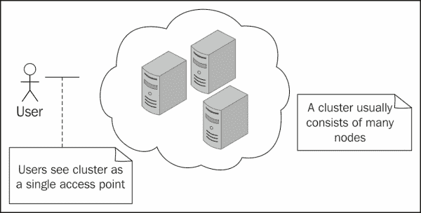

为了实现之前提到的目标，我们通常使用集群的控制器，即负载均衡器，位于集群前面。它的任务是接收和调度用户请求到集群内的节点，节点将执行处理用户请求的真正工作。节点处理完用户请求后，响应将被发送到负载均衡器，负载均衡器将把它发送回用户。以下图显示了工作流程：

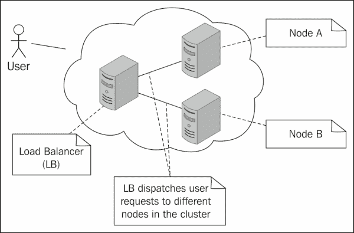

除了负载均衡用户请求外，集群系统还可以在其内部进行故障转移。

### 提示

故障转移意味着当一个节点崩溃时，负载均衡器可以切换到其他正在运行的节点来处理用户请求。

在集群中，一些节点可能在运行时失败。如果发生这种情况，应该将失败的节点的请求重定向到健康的节点。这个过程在以下图中显示：

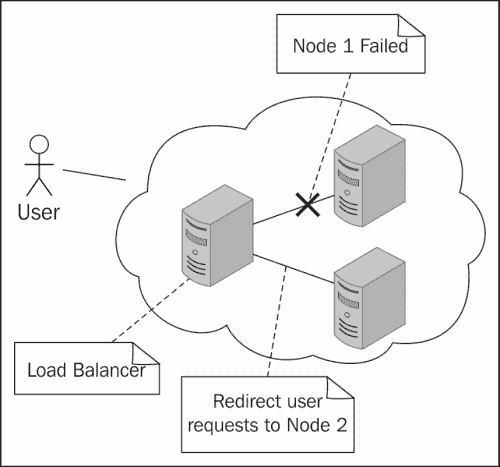

为了使故障转移成为可能，集群中的节点应该能够从一端复制用户数据到另一端。

### 提示

在 JBoss EAP6 中，Infinispan 模块，这是 JBoss 社区提供的数据网格解决方案，负责 Web 会话复制。

如果一个节点失败，用户请求可以被重定向到另一个节点；然而，与用户的会话不会丢失。以下图说明了故障转移：

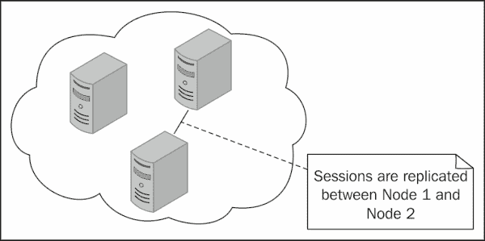

为了实现之前提到的目标，JBoss 社区为我们提供了一套强大的工具。在下一节中，我们将对其进行概述。

# JBoss EAP6 高可用性

作为 Java EE 应用服务器，JBoss EAP6 使用了来自不同开源项目的模块：

+   Web 服务器（JBossWeb）

+   EJB（JBoss EJB3）

+   Web 服务（JBossWS/RESTEasy）

+   消息传递（HornetQ）

+   JPA 和事务管理（Hibernate/Narayana）

如我们所见，JBoss EAP6 使用了更多的开源项目，每个部分可能都有其自己的考虑，以实现高可用性的目标。现在让我们简要介绍一下这些部分与高可用性的关系：

## JBoss Web、Apache httpd、mod_jk 和 mod_cluster

对于 Web 服务器的集群可能是最热门的话题，并且被大多数人所理解。市场上有很多好的解决方案。

对于 JBoss EAP6，它采用的解决方案是使用 Apache `httpd`作为负载均衡器。`httpd`将用户请求分发到 EAP 服务器。Red Hat 领导了两个与`httpd`一起工作的开源项目，分别称为`mod_jk`和`mod_cluster`。在这本书中，我们将学习如何使用这两个项目。

## EJB 会话 Bean

JBoss EAP6 提供了`@org.jboss.ejb3.annotation.Clustered`注解，我们可以在`@Stateless`和`@Stateful`会话 Bean 上使用它。

### 提示

集群注解是 JBoss EAP6/WildFly 的特定实现。

当使用`@Clustered`与`@Stateless`一起时，会话 Bean 可以进行负载均衡；当使用`@Clustered`与`@Stateful` Bean 一起时，Bean 的状态将在集群中复制。

## JBossWS 和 RESTEasy

JBoss EAP6 提供了两种内置的 Web 服务解决方案。一个是 JBossWS，另一个是 RESTEasy。JBossWS 是一个实现了 JAX-WS 规范的 Web 服务框架。RESTEasy 是实现 JAX-RS 规范的实现，可以帮助你构建 RESTful Web 服务。

## HornetQ

HornetQ 是 JBoss 社区提供的高性能消息传递系统。该消息系统设计为异步的，并在负载均衡和故障转移方面有自己的考虑。

## Hibernate 和 Narayana

在数据库和事务管理领域，高可用性是一个巨大的话题。例如，每个数据库供应商可能都有自己的数据库查询负载均衡解决方案。例如，PostgreSQL 有一些开源解决方案，例如 Slony 和 pgpool，这些解决方案可以让我们从主数据库复制到从数据库，并将用户查询分布到集群中的不同数据库节点。

在 ORM 层，Hibernate 也有如**Hibernate Shards**这样的项目，可以将数据库以分布式的方式部署。

## JGroups 和 JBoss Remoting

JGroups 和 JBoss Remoting 是 JBoss EAP6 集群特性的基石，它使它能够支持高可用性。JGroups 是一个基于 IP 多播的可靠通信系统。

### 提示

JGroups 不仅限于多播，也可以使用 TCP。

JBoss Remoting 是 JBoss EAP6 中多个部分的底层通信框架。

# 域管理

除了之前讨论的主题外，JBoss EAP6 还引入了一个名为**域管理**的新功能。这个功能可以帮助我们集中管理作为集群部署的 EAP6 服务器。在本书的后续章节中，我们将学习如何使用这个功能。

# 安装 JBoss EAP6

在前面的章节中，我们概述了高可用性以及 JBoss EAP6 在这方面为我们提供了什么。如果你没有完全理解所有内容，没关系。我们将在本书中逐步触及这些部分，帮助你构建整个画面。第一步是安装 JBoss EAP6。请从以下 URL 下载`JBoss EAP 6.1.0.Final`：

[`www.jboss.org/jbossas/downloads/`](http://www.jboss.org/jbossas/downloads/)

定位到**6.1.0.Final**版本并下载 ZIP 文件。下载完成后，解压它。内容如下所示截图：

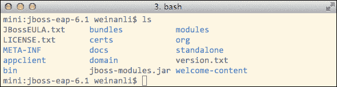

从前面的截图，我们可以看到一个名为`jboss-modules.jar`的 JAR 文件。这个 JAR 文件将帮助我们加载服务器的组件。EAP6 服务器的组件位于`modules`目录中。这个目录包含 EAP6 可以通过`jboss-modules.jar`加载的组件。

`bin`目录包含我们将要使用的启动脚本和其他工具。

`standalone`和`domain`目录与 EAP6 启动模式相关。我们将在下一节中更详细地介绍它。

# JBoss EAP6 启动模式

启动模式是 JBoss EAP6 中引入的新概念。目前 EAP6 提供了两种模式：

+   独立模式

+   域模式

在`bin`目录中有两个启动脚本用于这两种模式：

```java
domain.sh     standalone.sh
```

让我们看看这两种模式的意义。

## 域模式

域模式是 EAP6 中引入的新概念。域指的是一组可以共享配置/部署信息的服务器，这在集群环境中非常有用。

例如，我们有三个运行的 JBoss EAP6 服务器，它们形成一个集群。假设我们有一个名为`cluster-demo`的项目，并希望将其部署到集群中。传统的方法是将此项目手动部署到每个 EAP6 实例。

幸运的是，借助 EAP6 中的域管理功能，我们现在可以将许多 EAP6 服务器配置为服务器组，并将项目部署到这个组中。然后，该项目将被部署到属于此组的所有 EAP6 服务器上。域模式为我们提供了集群的集中管理点。服务器组还共享相同的配置，该配置会自动分发到所有节点。我们将在后续章节中看到其用法。

## 独立模式

独立模式类似于传统的 JBoss AS 运行模式，并且在运行时没有提供任何域管理功能。

# 以独立模式启动 JBoss EAP6

现在我们尝试以独立模式启动 JBoss EAP6。进入`bin`目录并运行`standalone.sh`。服务器输出如下截图所示：

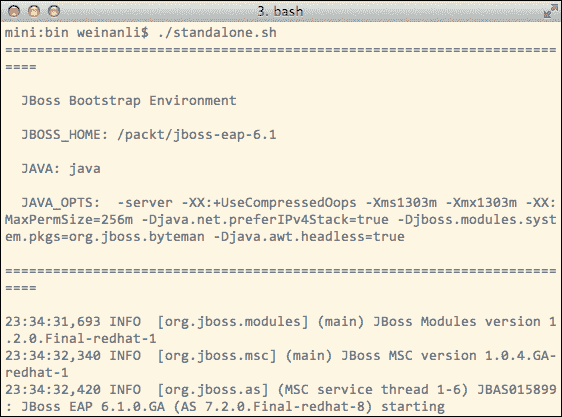

现在让我们看看服务器输出的详细信息，以了解启动过程。

## 理解启动过程

我们可以从服务器输出中看到几个重要的事情。以下是最重要的一点：

```java
Started 123 of 177 services (53 services are passive or on-demand)
```

从之前的日志中，我们可以看到在 EAP6 启动过程中并非所有组件都被启动。这种设计大大加快了 EAP6 的启动时间。我们可以看到在启动过程中默认启动了一些服务：

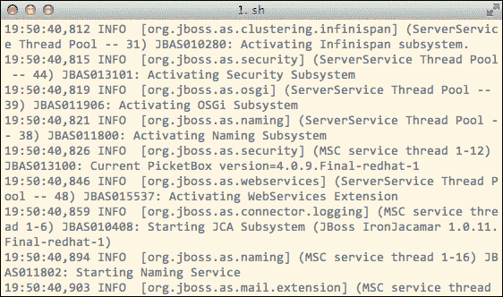

这些组件被称为子系统。这些子系统在通过`standalone/configuration`导航时配置在`standalone.xml`文件中。

现在让我们看看`standalone.sh`中启动 EAP6 服务器的实际命令：

```java
eval \"$JAVA\" -D\"[Standalone]\" $JAVA_OPTS \
     \"-Dorg.jboss.boot.log.file=$JBOSS_LOG_DIR/server.log\" \
     \"-Dlogging.configuration=file:$JBOSS_CONFIG_DIR/logging.properties\"   \
     -jar \"$JBOSS_HOME/jboss-modules.jar\" \
     -mp \"${JBOSS_MODULEPATH}\" \
     -jaxpmodule "javax.xml.jaxp-provider" \
org.jboss.as.standalone \
     -Djboss.home.dir=\"$JBOSS_HOME\" \
-Djboss.server.base.dir=\"$JBOSS_BASE_DIR\" \
     "$SERVER_OPTS" "&"
```

### 提示

**下载示例代码**

您可以从您在[`www.packtpub.com`](http://www.packtpub.com)的账户中下载您购买的所有 Packt Publishing 书籍的示例代码文件。如果您在其他地方购买了这本书，您可以访问[`www.packtpub.com/support`](http://www.packtpub.com/support)并注册，以便将文件直接通过电子邮件发送给您。

从之前的命令中，我们可以看到`jboss-modules.jar`是整个 EAP6 服务器的引导 JAR 文件，入口点是`org.jboss.as.standalone`，在以下命令中指定：

```java
-jar \"$JBOSS_HOME/jboss-modules.jar\" org.jboss.as.standalone

```

我们将在稍后看到关于启动过程的更多详细信息。现在让我们检查独立模式的配置文件。

## standalone.xml 文件

`standalone.xml`的结构如下：

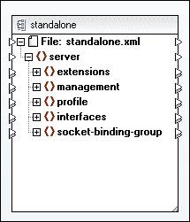

如前一个截图所示，**standalone.xml**定义了独立服务的多个方面。让我们简要查看：

| **extensions** | 此部分包含一个扩展模块的列表。列出的组件将由`jboss-modules`加载。 |
| --- | --- |
| **management** | 此部分包含与 EAP6 管理接口及其安全设置相关的配置。 |
| **profile** | 在此部分，我们可以为每个子系统配置设置。大多数子系统是扩展部分中加载的组件，一些子系统是 EAP6 内部需要的，并在启动时默认加载。 |
| **interfaces** | 此部分定义了一个命名网络接口的列表。 |
| **socket-binding group** | 此部分包含一个 socket 绑定组的列表，包括不同模块可能使用的接口集合。 |

## 替代配置文件

除了默认的`standalone.xml`文件外，EAP6 还为独立模式提供了一些其他配置文件。

### 提示

每个独立配置文件只有一个配置文件。相比之下，在域配置文件中可以定义多个配置文件。

我们可以在 `standalone/configuration` 目录中检查它们：

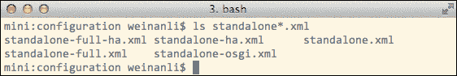

这些文件定义了不同目的的不同配置文件。以下是对它们差异的总结：

| **standalone.xml** | 这是独立模式的默认设置。 |
| --- | --- |
| **standalone-full.xml** | 与默认设置相比，此配置文件添加了消息子系统（HornetQ 及相关组件）。 |
| **standalone-ha.xml** | 与默认设置相比，此配置文件添加了与集群相关的组件：`mod_cluster` 和 `JGroups`，由 Infinispan 驱动的可复制缓存以及其他相关组件。 |
| **standalone-full-ha.xml** | 与默认设置相比，此配置文件提供了 `-full` 和 `-ha` 中的功能组合。 |

要在启动时使用这些替代配置，我们可以在调用 `standalone.sh` 时使用 `-c` 选项。例如，如果我们想使用 `standalone-ha.xml`，命令如下：

```java
$ ./standalone.sh -c standalone-ha.xml

```

请注意，`-c` 选项假定配置位于 `$JBOSS_HOME/standalone/`。

## --help 选项

`standalone.sh` 和 `domain.sh` 都为我们提供了帮助文档。我们可以始终使用 `--help` 选项来检查它：

```java
$ standalone.sh --help

```

## 配置文件

在 `bin` 目录中，有几个配置文件将在启动过程中被包含：

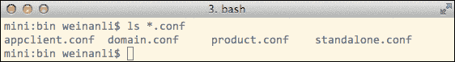

我们可以将自己的配置放入这些文件中，启动脚本将包含它们。

# 在域模式下启动 JBoss EAP6

在本节中，让我们看看域模式。在 `bin` 目录中使用以下命令在域模式下启动 EAP6 服务器：

```java
$ ./domain.sh

```

我们可以看到，与独立模式相比，启动过程有所不同。首先，在域模式下加载了更多的组件：

```java
Started 274 of 401 services (126 services are passive or on-demand)

```

在 `domain.sh` 中，我们还可以看到启动命令也有所不同：

```java
eval \"$JAVA\" -D\"[Process Controller]\" $PROCESS_CONTROLLER_JAVA_OPTS \
      \"-Dorg.jboss.boot.log.file=$JBOSS_LOG_DIR/process-controller.log\" \
      \"-Dlogging.configuration=file:$JBOSS_CONFIG_DIR/logging.properties\"   \
      -jar \"$JBOSS_HOME/jboss-modules.jar\" \
      -mp \"${JBOSS_MODULEPATH}\" \
org.jboss.as.process-controller \
      -jboss-home \"$JBOSS_HOME\" \
      -jvm \"$JAVA_FROM_JVM\" \
      -mp \"${JBOSS_MODULEPATH}\" \
      -- \
      \"-Dorg.jboss.boot.log.file=$JBOSS_LOG_DIR/host-controller.log\" \
      \"-Dlogging.configuration=file:$JBOSS_CONFIG_DIR/logging.properties\"   \
      $HOST_CONTROLLER_JAVA_OPTS \
      -- \
      -default-jvm \"$JAVA_FROM_JVM\" \
      '"$@"'
'jboss-modules.jar' is still used for bootstrap:
-jar \"$JBOSS_HOME/jboss-modules.jar\" \
```

与独立模式相比，入口点不再是 `org.jboss.as.standalone`；而是变为 `process-contoller`：

```java
org.jboss.as.process-controller

```

还有一个名为 `host-controller` 的进程：

```java
-Dorg.jboss.boot.log.file=$JBOSS_LOG_DIR/host-controller.log

```

以下图显示了当 EAP6 在域模式下运行时这些过程之间的关系：

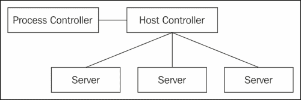

正如在域模式下一样，首先启动了一个轻量级的 **进程控制器**，然后它启动了一个 **主机控制器** 进程，该进程将控制多个服务器进程。这是因为域模式允许同时运行多个服务器实例，每个服务器都将有自己的 JVM 进程。

## 域模式

正如我们之前所看到的，当 EAP6 在域模式下运行时，多个服务器可以同时运行。此外，这些服务器可以属于不同的服务器组。属于同一组的服务器将共享部署和配置信息。

例如，我们有一个名为 **main-server-group** 的服务器组，在这个组中，我们有两个名为 **server-one** 和 **server-two** 的服务器。如果我们在这个 **main-server-group** 中部署一个名为 `cluster-demo.war` 的项目，那么它将同时部署到这两个服务器上。如果我们在这个组中更改一些设置，这两个服务器的设置都将同步更新：

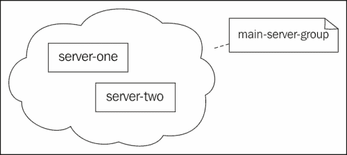

在前面的例子中，同一组的两个服务器位于同一台机器和同一 EAP6 实例中。但实际上，它们可以存在于不同的 EAP6 服务器中，并且同一组的服务器可以在网络上同步。

## 配置文件

与独立模式不同，域模式使用两个配置文件：

+   `domain.xml`

+   `host.xml`

这些配置文件位于 `domain/configuration/` 位置。现在让我们首先看看 `domain.xml`。

### 域.xml 文件

`domain.xml` 文件的结构及其与 `standalone.xml` 的区别如下截图所示：

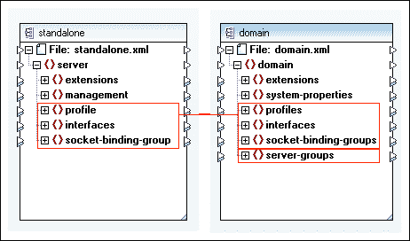

如果我们将它的结构与独立模式进行比较，我们可以看到差异。首先，有三个复数形式的章节：

+   **配置文件**

+   **接口**

+   **socket-binding-groups**

这种差异的原因很容易猜测。在域模式中，有多个服务器在不同的服务器组中运行，EAP6 支持每个服务器组拥有自己的设置集。因此，需要不同的配置文件、接口和套接字绑定组。

此外，我们还可以看到一个名为 **server-groups** 的新部分。这是它在 `domain.xml` 中的默认设置：

```java
<server-groups>
  <server-group name="main-server-group" profile="full">
  <socket-binding-group ref="full-sockets"/>
</server-group>
<server-group name="other-server-group" profile="full-ha">
  <socket-binding-group ref="full-ha-sockets"/>
  </server-group>
</server-groups>
```

前面的设置如下图所示：

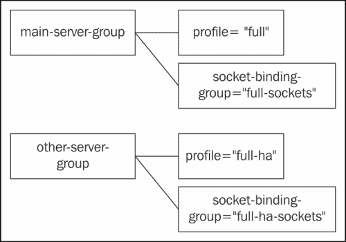

这样，不同的服务器组绑定到不同的设置。

### host.xml 文件

现在，让我们检查 `host.xml`。以下截图显示了其结构：

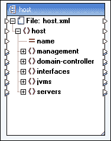

`host.xml` 文件是主机控制器的设置文件。它包含一些与 `standalone.xml` 类似的部分，例如管理和接口。它们的目的也是相同的。现在让我们看看 **domain-controller** 部分。

### 域控制器部分

**domain-controller** 部分定义了哪个主机用作域控制器。域控制器实际上是一个主机控制器，但它充当域的管理者。默认的 **domain-controller** 设置为 `local`，这意味着 EAP6 将默认使用其主机控制器作为域控制器。

我们还可以定义一个远程主机控制器作为域控制器。然后多个 EAP6 可以连接到同一个域控制器并接受其管理。现在让我们看看 **servers** 部分。

#### 服务器部分

**servers** 部分如下截图所示：

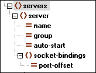

在域模式下，一个主机控制器可以同时管理多个服务器，每个服务器都有自己的名称并属于一个服务器组；这些服务器绑定到不同的套接字以避免冲突。

**auto-start** 选项检查是否在 EAP6 启动时启动此服务器。我们可能可以通过此选项选择在 EAP6 启动时启动哪个服务器。

**port-offset** 选项用于将不同的服务器绑定到不同的端口以避免冲突。让我们看看 `host.xml` 中的默认配置：

```java
<servers>
  <server name="server-one" group="main-server-group">
    <socket-bindings port-offset="0"/>
  </server>
  <server name="server-two" group="main-server-group">
    <socket-bindings port-offset="150"/>
  </server>
  <server name="server-three" group="other-server-group">
    <socket-bindings port-offset="250"/>
  </server>
</servers>
```

下面的部署图显示了之前讨论的服务器和服务器组之间的关系：

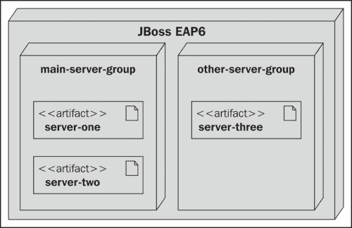

这里是 `domain.xml` 中的服务器组设置：

```java
<server-groups>
  <server-group name="main-server-group" profile="full">
    <socket-binding-group ref="full-sockets"/>
  </server-group>
  <server-group name="other-server-group" profile="full-ha">
    <socket-binding-group ref="full-ha-sockets"/>
  </server-group>
</server-groups>
```

我们可以看到 **main-server-group** 绑定到 `full-sockets`，而 **other-server-group** 绑定到 `full-ha-sockets`。这两个套接字定义如下：

```java
<socket-binding-group name="full-sockets" default-interface="public">
  <socket-binding name="http" port="8080"/>
</socket-binding-group>
<socket-binding-group name="full-ha-sockets" default-interface="public">
  <socket-binding name="http" port="8080"/>
</socket-binding-group>
```

`full-sockets` 绑定到 HTTP 端口 8080，`port-offset` 为 0。因此，**server-one** 使用的 Web 端口是 8080；对于 **server-two**，因为它的 `port-offset` 是 150，它的 Web 端口是 8080 + 150 = 8230。同样，**server-three** 使用的 HTTP 端口是 8080 + 250 = 8330。

现在让我们将所有三个服务器的 **auto-start** 设置为 `true`，以便它们将在 EAP6 启动时启动：

```java
<servers>
  <server name="server-one" group="main-server-group" auto-start="true">...</server>
  <server name="server-two" group="main-server-group" auto-start="true">...</server>
  <server name="server-three-master" group="other-server-group" auto-start="true">...</server>
</servers>
```

现在让我们通过调用 `domain.sh` 在域模式下启动 EAP6。EAP6 启动后，让我们尝试使用 `telnet` 命令访问 8080、8230 和 8330：

```java
$ telnet localhost 8080
Trying localhost...
Connected to localhost.

$ telnet localhost 8230
Trying localhost...
Connected to localhost.

$ telnet localhost 8330
Trying localhost...
Connected to localhost.

```

我们可以看到现在所有服务器都在监听连接。

# XSD 文档

JBoss EAP6 在 `docs/schema` 中提供了架构文档。每个架构都定义了 EAP6 配置文件使用的命名空间。例如，我们可以检查 `standalone.xml` 的开头，看看它使用的 xml 命名空间：

```java
<?xml version='1.0' encoding='UTF-8'?>
<server >
...
```

我们可以看到使用的命名空间是 `urn:jboss:domain:1.4`。让我们通过使用 `grep` 命令在 `docs/schema` 目录中找到定义的命名空间：

```java
$ grep -rl 'urn:jboss:domain:1.4' *
jboss-as-config_1_4.xsd

```

我们可以看到 `jboss-as-config_1_4.xsd` 包含了我们正在寻找的 xml 命名空间的定义。现在我们可以检查该命名空间中每个元素的定义。例如，如果我们想了解 `standalone.xml` 中 **server** 部分的含义，我们可以在 `xsd` 文件中检查其定义：

```java
<xs:element name="server">
  <xs:annotation>
  <xs:documentation>
    Root element for a document specifying the configuration
    of a single "standalone" server that does not operate
    as part of a domain...
  </xs:documentation>
  </xs:annotation>
    ...
</xs:element>
```

如前一个代码片段所示，`xsd` 架构是非常有用的文档。它们可以帮助我们理解配置文件中元素的含义。

# 摘要

在本章中，我们学习了高可用性的基本概念，我们学习了如何安装 JBoss EAP6 并以不同的模式运行它。我们还了解了 EAP6 的两种运行模式。在下一章中，我们将学习如何使用 EAP6 管理控制台，并使用它将项目部署到 EAP6。
