# 第二章。使用 JBoss EAP6

在上一章中，我们学习了如何下载和安装 JBoss EAP6。我们还了解了 EAP6 的独立模式和域模式；在本章中，我们将开始学习其基本用法。我们将学习如何管理和配置 EAP6 服务器。本章将涵盖以下主题：

+   使用 JBoss EAP6 管理控制台部署 Web 应用程序

+   命令行界面管理控制台的基本用法

+   JBoss EAP6 管理模型的设计

首先，我们需要了解 EAP6 管理控制台的一些基本配置。配置正确后，我们可以启动 EAP6 服务器并使用其管理控制台。

# 配置 JBoss EAP6 管理控制台

JBoss EAP6 提供了两个管理控制台——一个是基于 Web 的，另一个是基于 **命令行界面**（**CLI**）。在使用它们之前，我们需要正确配置管理模块。

## 安全领域

要使用管理控制台，我们必须了解其认证方案。JBoss EAP6 使用的认证模块被称为 **安全领域**。

### 小贴士

EAP6 使用安全领域来获取对管理接口的安全访问。

在 `standalone.xml` 的独立配置中打开。相对设置如下：

```java
<management>
  <security-realms>
    <security-realm name="ManagementRealm">
      <authentication>
        <local default-user="$local"/>
        <properties path="mgmt-users.properties" relative-to="jboss.server.config.dir"/>
      </authentication>
    </security-realm>
  </security-realms>
  <management-interfaces>
    <native-interface security-realm="ManagementRealm">
      <socket-binding native="management-native"/>
    </native-interface>
    <http-interface security-realm="ManagementRealm">
      <socket-binding http="management-http"/>
    </http-interface>
  </management-interfaces>
</management>
```

如前图配置所示，管理模块所使用的领域被称为 `ManagementRealm`。它使用一个名为 `mgmt-users.properties` 的属性文件来存储用户的密码信息。`management-interfaces` 定义了绑定到管理控制台的网络套接字。默认情况下，Web 管理控制台绑定到地址 `127.0.0.1:9990`，而 CLI 绑定到地址 `127.0.0.1:9999`。以下图表给出了管理控制台配置的概述：

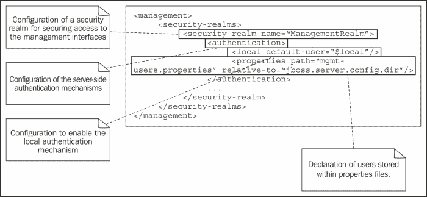

由于我们已经了解了 JBoss EAP6 使用的认证方案，我们现在需要创建一个用户账户来访问管理控制台。

## 设置管理员账户

JBoss EAP6 为我们提供了一个命令行工具来生成用户账户。您可以在 `bin` 文件夹中找到名为 `add-user.sh` 的工具。让我们使用它来生成一个管理员账户。此过程在以下屏幕截图中显示：

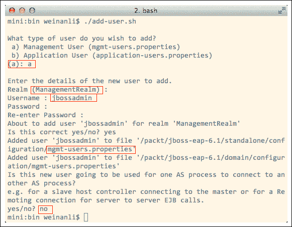

在前一个屏幕截图所示的过程中，我们创建了一个名为 `jbossadmin` 的 **管理用户** 类型的用户。此用户属于 `ManagementRealm`，因此我们可以使用它来访问管理控制台。请注意，密码长度必须超过八个字符，并且至少应包含一个字母、一个数字和一个符号。因此，我为 `jbossadmin` 使用密码 `@packt000`。

对于最后一个选项 **此新用户是否将被用于一个 AS 进程连接到另一个 AS 进程？**，我们选择 **否**。在后面的章节中，我们将为域模式中的远程服务器连接创建用户账户。

# 使用基于网络的网络管理控制台

现在，让我们尝试在独立模式下使用 EAP6 网络管理控制台。在 EAP6 的 `bin` 文件夹中运行 `standalone.sh` 来启动服务器。然后，我们通过默认地址 `http://127.0.0.1:9990` 访问网络管理控制台。管理控制台将弹出一个登录窗口；输入我们刚刚创建的用户账户。整个过程如下面的截图所示：

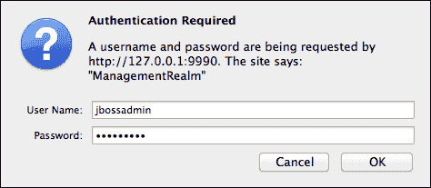

登录后，我们可以看到管理控制台的主窗口，如下面的截图所示：

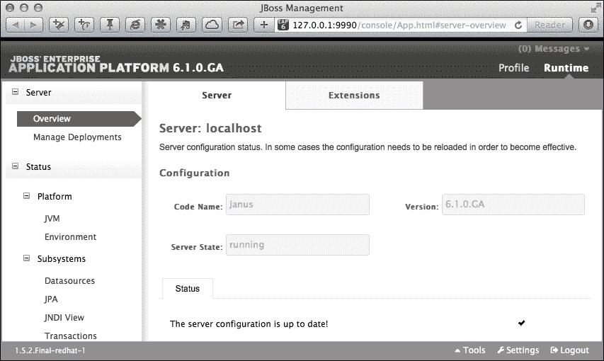

在下一节中，我们将使用基于网络的网络管理控制台来部署网络应用程序。

## 在独立模式下部署项目

现在，我们可以尝试将一个非常简单的名为 `cluster-demo1` 的网络项目部署到 EAP6 中。这是一个简单的“你好，世界”项目，包含一个简单的问候页面，显示浏览器上的当前时间。要将此项目部署到 EAP6 中，我们可以在管理控制台中点击 **Manage Deployments** 选项卡，然后点击 **Add**。

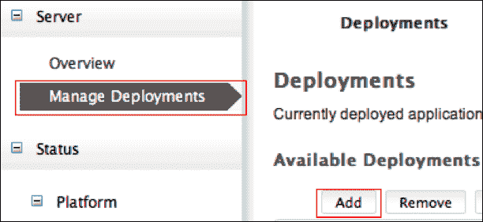

然后，我们选择 `cluster-demo1.war` 并点击 **Next>>**。

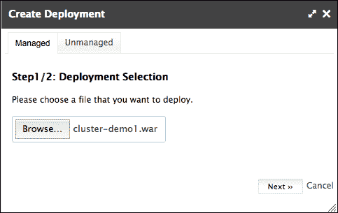

EAP6 将要求我们验证部署名称。我们应该接受默认名称并点击 **Save**。这个过程如下面的截图所示：

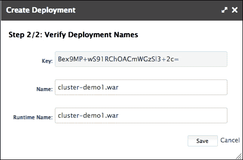

由于项目已部署，控制台将重定向到 **Available Deployments** 页面。要启动已部署的项目，我们需要选择它并点击 **En/Disable**。这个过程如下面的截图所示：

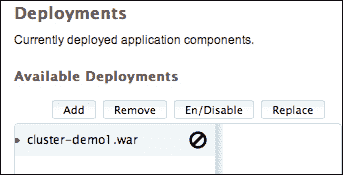

我们还需要确认以启用此项目。这是通过点击 **Confirm** 来完成的，如下面的截图所示：

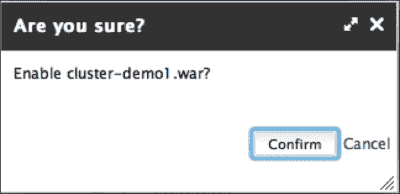

最后，我们可以看到项目已启动，如下面的截图所示：

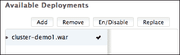

现在，如果我们检查控制台的服务器输出，我们可以看到 `cluster-demo1.war` 已按如下方式部署：

```java
18:55:46,557 INFOorg.jboss.as.server.deploymentJBEAP6015876: Starting deployment of "cluster-demo1.war"(runtimename: "cluster-demo1.war")
18:55:46,622 INFOorg.jboss.webJBEAP6018210: Register webcontext: /cluster-demo1
18:55:46,638 INFOorg.jboss.as.serverJBEAP6018559: Deployed "cluster-demo1.war"(runtime-name : "cluster-demo1.war")
```

现在，让我们看看 `standalone.xml`。我们可以看到，已添加了如下所示的部署描述：

```java
<deployments>
  <deployment name="cluster-demo1.war" runtime-name="cluster-demo1.war">
    <content sha1="3afbf9c1d6fe967e0ff7eb190b862700b693e431"/>
  </deployment>
</deployments>
</server>
```

从前面的代码片段中，我们可以看到配置文件的内容已被管理控制台更新。最后，让我们检查 `standalone/data/content` 如下：

```java
mini:jboss-eap-6.1weinanli$ tree standalone/data/content
standalone/data/content
└── 3a
└── fbf9c1d6fe967e0ff7eb190b862700b693e431
└── content
```

从前面的代码片段中，我们可以看到已部署项目的内容已被哈希并存储在 `standalone/data/content` 目录中。

### 测试

现在，我们可以尝试访问已部署的项目，以查看它是否运行正确。在下面的代码片段中，我使用了 `curl` 命令来测试连接：

```java
$ curl http://127.0.0.1:8080/cluster-demo1/index.jsp
<html>
  <body>
    <h2>Hello World!</h2>
    Hello! The time is now Wed Nov 20 15:50:22 CST 2013
</body>
</html>
```

如前所述的过程所示，我们可以从控制台输出中看到 hello 页面。

## 部署扫描器

独立模式支持在 JBoss AS 先前版本中使用的传统热部署。此方法允许您将复制的项目放入目录中，然后 JBoss EAP6 将定期扫描该目录以部署其中复制的项目。此功能由部署扫描器子系统支持，该子系统在`standalone.xml`中定义如下：

```java
<extension module="org.jboss.as.deployment-scanner"/>
```

`standalone.xml`中子系统的默认设置如下所示：

```java
<subsystem >
  <deployment-scanner path="deployments" relativeto="jboss.server.base.dir" scan-interval="5000"/>
</subsystem>
```

它将每 5 秒扫描一次独立部署目录，并部署新添加的项目。我们可以尝试使用部署扫描器部署`cluster-demo1.war`。在此之前，我们需要从 Web 管理控制台卸载此项目。

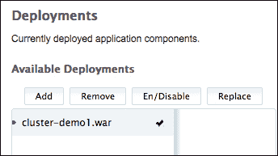

要卸载项目，请点击**启用/禁用**，然后点击**移除**。项目卸载后，我们可以使用以下代码将`cluster-demo1.war`文件放入`standalone/deployments`目录：

```java
$ mv cluster-demo1/target/cluster-demo1.war jboss-eap-6.1/standalone/deployments
```

由于部署扫描器被设置为每 5 秒扫描此目录一次，我们将等待一会儿，然后我们会看到项目从服务器输出中部署如下：

```java
00:21:05,963 INFOorg.jboss.as.serverJBAS018559: Deployed "cluster-demo1.war"(runtime-name : "cluster-demo1.war")
```

现在让我们看一下以下所示的`deployments`目录：

```java
README.txt                 cluster-demo1.war.deployed
cluster-demo1.warmod_cluster.sar
```

我们可以看到一个名为`cluster-demo1.war.deployed`的新文件被自动创建。这是部署扫描器创建的标记文件，用于标记我们项目的状态。现在，让我们使用以下代码删除此文件：

```java
$ rm cluster-demo1.war.deployed
```

等待一会儿，你可以看到以下服务器输出：

```java
00:26:21,289 INFOorg.jboss.as.serverJBEAP6018558: Undeployed"cluster-demo1.war"(runtime-name: "cluster-demo1.war")
```

由于我们已删除`cluster-demo1.war.deployed`标记文件，扫描器得知我们想要卸载项目。因此，它采取了行动。现在让我们再次使用以下代码检查`deployments`目录：

```java
README.txt                   cluster-demo1.war.undeployed
cluster-demo1.warmod_cluster.sar
```

我们可以看到扫描器创建了一个名为`cluster-demo1.war.undeployed`的另一个标记文件，该文件标记了`cluster-demo1.war`文件为已卸载。如果我们使用以下代码删除`cluster-demo1.war.undeployed`文件：

```java
$ rm cluster-demo1.war.undeployed
```

然后，扫描器将重新部署此项目如下：

```java
00:29:41,499 INFOorg.jboss.as.serverJBEAP6018559: Deployed "cluster-demo1.war"(runtime-name : "cluster-demo1.war")
```

现在让我们看一下`deployments`目录。我们可以看到`cluster-demo1.war.deployed`标记文件再次出现，如下所示：

```java
README.txt                 cluster-demo1.war.deployed
cluster-demo1.warmod_cluster.sar
```

### 注意

部署扫描器只能在独立模式下使用。

# 介绍 JBoss DMR

JBoss DMR 是 JBoss 管理模块的基石。所有管理操作都将转换为封装在 DMR 格式中的管理命令。部署扫描器或管理控制台使用的部署操作最终都将转换为 DMR 命令。例如，当部署扫描器想要将项目部署到 EAP6 时，它将向部署模块发送以下类似 JSON 的 DMR 命令。以下是该命令的裁剪文本：

```java
[{
  "operation" =>"composite",
  "address" => [],
  "steps" => [
    {
      "operation" =>"add",
      "address" => [("deployment" =>"cluster-demo1.war")],
      "content" => [{
        "path" =>"deployments/cluster-demo1.war",
        "relative-to" =>"jboss.server.base.dir",
      }],
    },
    {
    "operation" =>"deploy",
    "address" => [("deployment" =>"cluster-demo1.war")]
    }
  ]
}]
```

我们可以看到部署扫描器已发送一个包含两个操作：`添加`和`部署`的操作。这意味着 EAP6 将首先将此项目添加到其作用域中，然后启动它。在 Web 管理控制台中，我们看到这两个动作是分开的——我们首先将一个项目添加到 EAP6 中，然后点击**启用/禁用**来启动它。Web 管理控制台和命令行界面都会向部署控制台发送此类 DMR 命令。

# 在域模式下部署项目

现在，让我们学习如何在域模式下部署项目。当 JBoss EAP6 在域模式下运行时，多个服务器可以形成一个服务器组。当我们向服务器组部署项目时，该组中的所有服务器都将部署该项目。首先，让我们通过`domain.sh`启动 JBoss EAP6 的域模式。然后，我们将访问管理控制台地址，`http://127.0.0.1:9990`。域模式下的管理控制台与独立模式不同。如下截图所示：

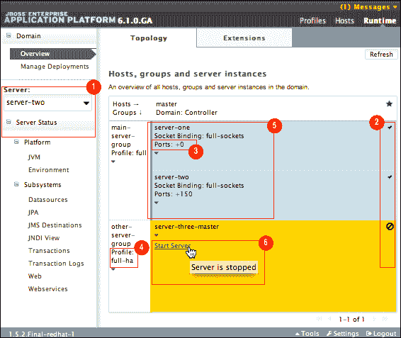

以下是一些关于前一个截图所示的管理控制台内容的笔记：

1.  在侧边栏中有一个**服务器**部分，我们可以检查不同服务器组中的所有服务器。

1.  标记表示每个服务器的运行状态。

1.  **端口**：显示每个服务器的端口偏移量。因为这些服务器运行在同一台机器上，它们的端口必须偏移以避免冲突。

1.  **配置文件**：显示服务器组绑定的配置文件。

1.  属于同一组的服务器在管理控制台上有相同的颜色。

1.  我们可以在管理控制台中启动或停止服务器。

默认情况下有两个服务器组。让我们在下一节检查**主服务器组**。

## 主服务器组

我们可以看到，默认情况下**主服务器组**包括两个服务器。让我们将这些组部署`cluster-demo1.war`。请确保这两个服务器已启动。如果没有，我们可以使用管理控制台提供的**启动服务器**功能。

现在，让我们部署`cluster-demo1.war`。首先，我们需要点击侧边栏上出现的**管理部署**选项卡。然后点击**内容仓库**选项卡，并点击**添加**。此过程如下截图所示：

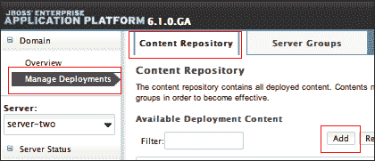

现在，我们将选择`cluster-demo1.war`，如下截图所示：


现在，我们点击**下一步>>**然后点击**保存**。然后，我们可以看到项目已部署到**内容仓库**。结果如下截图所示：

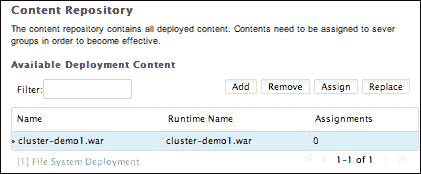

我们可以看到，在域模式下的部署过程与独立模式不同。我们不会直接将项目部署到服务器上。相反，我们首先将其添加到**内容库**中，然后将其部署到服务器组。EAP6 将帮助我们部署项目到组中的所有服务器。

现在，让我们将`cluster-demo1.war`部署到 main-server-group。首先点击**服务器组**标签，然后点击 main-server-group 的**查看>**，如图所示：

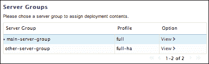

点击**查看>**后，我们进入**main-server-group**的网页。然后，我们点击**分配名称**并选择`cluster-demo1.war`进行保存。这如图所示：

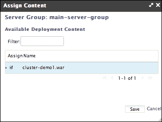

最后，让我们启用项目。点击**启用/禁用**，然后点击**确认**，如图所示：

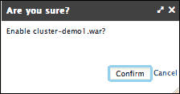

确认部署后，项目应该部署到**server-one**和**server-two**。让我们验证这一点。

### 测试

现在我们尝试访问两个服务器。请注意，主服务器位于端口 8080，从服务器有一个 150 的端口偏移量，因此 Web 端口是 8080+150=8230。结果如下：

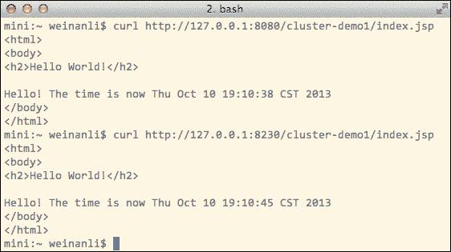

从前面的截图可以看出，`cluster-demo1.war`已部署在两个服务器上。

# CLI 使用方法

CLI 为我们提供了一个纯文本环境来管理 EAP6 服务器，并且它与 Web 管理控制台共享相同的 DMR 模型。在本节中，让我们简要讨论 CLI 的使用。

## 连接到 CLI

启动 CLI 的命令是`jboss-cli.sh`，它位于`bin`文件夹中。确保您已以独立模式启动 EAP6。现在让我们运行 CLI 命令。这个过程如图所示：

```java
$ ./jboss-cli.sh
You are disconnected at the moment. Type 'connect' to connect to the server or 'help' for the list of supported commands.
[disconnected /]
```

现在我们已经进入了 CLI 控制台，下一步是使用`connect`命令进入管理控制台，如下所示：

```java
[disconnected /] connect localhost
[standalone@localhost:9999 /]
```

我们已经使用了`connect`命令来连接到管理控制台。

### 注意

你可能已经注意到 CLI 没有要求我们使用管理员账户登录。在 CLI 中，当我们连接到本地 EAP 服务器时，身份验证被绕过。

既然我们已经连接到文本管理控制台，现在让我们学习一些基本命令。

### ls

我们将要学习的第一个命令是`ls`。它类似于在 shell 环境中使用的`ls`命令。此命令列出 JBoss EAP6 中的资源，如图所示：

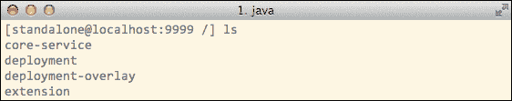

我们可以看到资源是以树状结构组织的。这类似于文件系统，我们可以使用`ls`命令来检查资源的内容，就像检查目录一样。例如，我们可以检查子系统中的资源，如图所示：

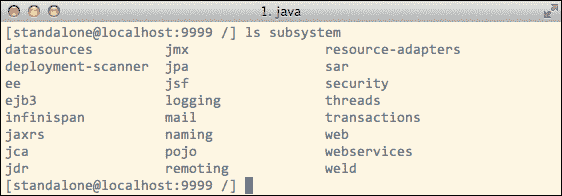

### cd

我们可以使用`cd`命令查看资源，就像它们是目录一样。用法如下面的截图所示：


如前一个截图所示，我们可以使用`cd`命令遍历资源。

## Basic commands

CLI 为我们提供了一套基本命令。我们可以按两次*Tab*键来查看这些命令的列表，如下面的截图所示：

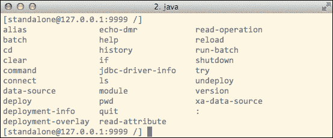

要理解这些命令的含义，我们可以在命令名后使用`--help`选项。例如，如果我们想了解 connect 的用法，我们可以使用`--help`选项，如下面的截图所示：

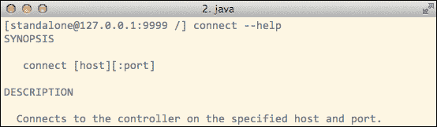

在基本命令中，我想特别介绍`echo-dmr`和`read-operation`，因为它们是最常用的。

### echo-dmr

`echo-dmr`用于为命令或操作构建 DMR 请求。它就像一个翻译器，将动作翻译成 DMR 请求。例如，如果我们想了解`deploy`命令如何构建 DMR 请求，我们可以使用`echo-dmr`来翻译它：

```java
[standalone@127.0.0.1:9999 /] echo-dmr deploy /cluster-demo1/cluster-demo1.war
{
  "operation" =>"composite",
  "address" => [],
  "steps" => [
    {
      "operation" =>"add",
      "address" => {"deployment" =>"cluster-demo1.war"},
      "content" => [{"bytes" => bytes {
        ...
      }}]
    },
    {
      "operation" =>"deploy",
      "address" => {"deployment" =>"cluster-demo1.war"}
    }
  ]
}
```

从前面的 DMR 请求中，我们可以清楚地看到`deploy`命令的底层细节。

### read-operation

在 CLI 控制台中，每个资源都有一组我们可以对其执行的操作。我们可以使用`read-operation`来帮助我们了解可以操作的资源上的操作。例如，如果我们想找出 Web 子系统支持哪些操作，我们可以使用`read-operation`，如下面的截图所示：

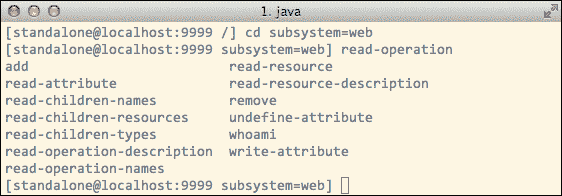

例如，在前面截图所示的列表中，我们看到一个名为**read-operation-names**的操作。让我们尝试使用它，如下面的截图所示：


我们可以看到`read-operation-names`操作与`read-operation`命令非常相似；那么它们之间有什么区别呢？让我们使用`echo-dmr`来检查它，如下面的截图所示：

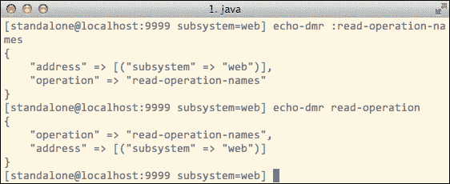

从 DMR 层面来看，我们可以看到它们的翻译 DMR 请求完全相同。

## GUI

EAP CLI 还支持 GUI 界面，实际上是一个 Swing 应用程序。我们可以通过使用`--gui`选项来启动它，如下所示：

```java
$ ./jboss-cli.sh --gui
```

接口如下面的截图所示：

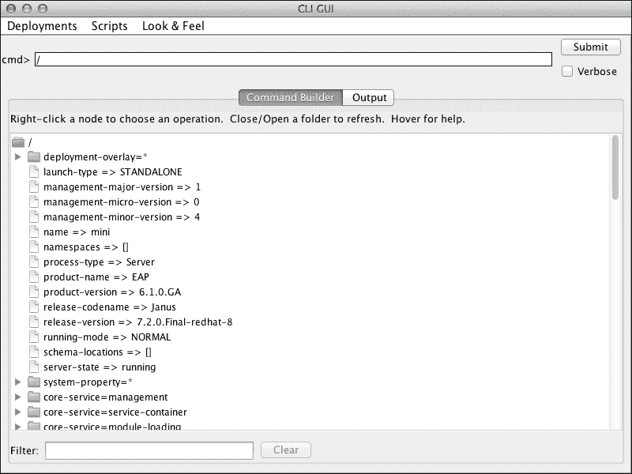

GUI 界面也可以远程使用。例如，如果我们的管理控制台绑定了一个公网 IP 地址，我们可以使用以下命令通过另一个机器上的 GUI 访问它：

```java
power:binweli$ ./jboss-cli.sh --controller=10.0.1.3:9999 --connect --gui
```

GUI 将从远程机器启动。

## 部署项目

现在让我们使用 CLI 来部署项目。以下命令用于部署：

```java
[standalone@localhost:9999 /] deploy /cluster-demo1/target/cluster-demo1.war
```

项目部署后，我们可以在`deployment`下看到它，如下所示：

```java
[standalone@localhost:9999 /] ls deployment
cluster-demo1.war
```

现在，让我们使用`undeploy`命令来删除它，如下所示：

```java
[standalone@localhost:9999 /] undeploy cluster-demo1.war
```

检查`deployment`中的内容，我们可以看到它被删除，如下所示：

```java
[standalone@localhost:9999 /] ls deployment
[standalone@localhost:9999 /]
```

# 摘要

在本章中，我们学习了如何将管理员账户添加到 JBoss EAP6。我们还学习了在 EAP6 以独立模式或域模式运行时，如何使用管理模型将项目部署到 EAP6。然后，我们更深入地了解了 EAP6 管理模型和 DMR 层的设计。有了这些知识，我希望你对 JBoss EAP6 的结构有一个良好的理解，并掌握了其基本用法。从下一章开始，我们将开始设置 EAP6 集群。
