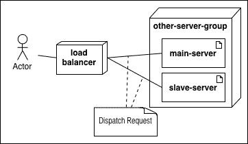
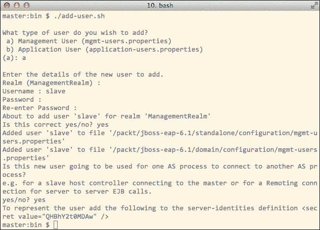
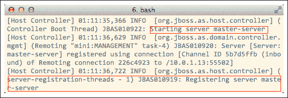
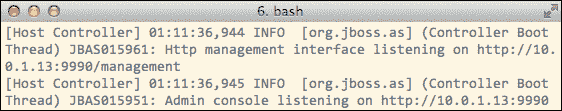
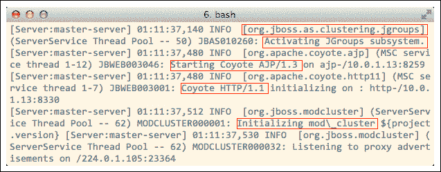
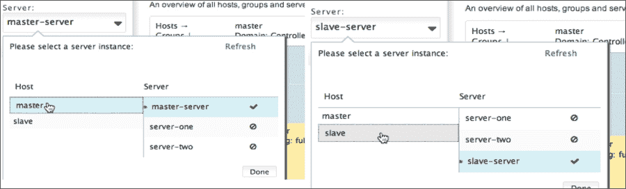
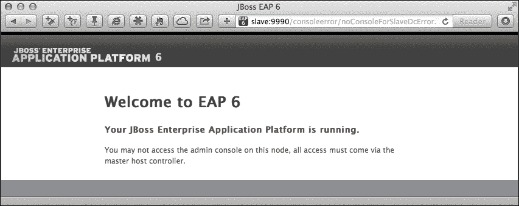
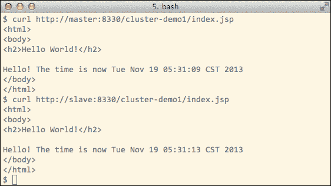

# 第三章。设置 JBoss EAP6 集群

在上一章中，我们学习了如何使用管理控制台将项目部署到 JBoss EAP6 的独立模式和域模式。我们还看到，当需要管理多个服务器时，域模式对我们帮助很大。它通过将管理任务集中到域控制器中来实现这一目标。

EAP6 提供的域模式为我们设置集群提供了良好的支持，但它本身并不是集群。正如我们在第二章中看到的，*使用 JBoss EAP6*，尽管服务器在服务器组中管理，但它们并没有形成一个集群。为了使服务器形成一个集群，我们需要执行以下两个任务：

+   正确设置 EAP6 服务器，确保与集群相关的所有组件都处于正确状态

+   设置负载均衡器，以便将用户请求分发到集群中包含的不同 EAP6 服务器

在本章中，我们将重点关注第一个任务。

# 设计一个集群

在上一章中，我们了解到 EAP6 在`domain.xml`中提供了两个服务器组。一个是**main-server-group**，另一个是**other-server-group**。在本章中，我们将使用**other-server-group**来设置集群，因为它使用的是`full-ha`配置文件，而这个配置文件包含了我们将用于设置集群的所有组件。

使用集群，我们可以将请求负载分配到多个服务器。利用 EAP6 域管理功能，我们可以在域控制器的管理控制台中将项目部署到多个 EAP6 服务器。

在本书中，我们将使用三台机器来设置一个集群。其中两台将用于运行 EAP6 服务器，另一台将用于运行负载均衡器。在本章中，我们将使用两台机器来运行 EAP6 服务器。

### 小贴士

您也可以使用虚拟化技术，让所有服务器在一个物理盒子里运行。只需确保它们有独立的 IP 地址，可以相互通信，并且防火墙已关闭。

部署过程在以下图中展示：



在本章中，我们将使用两台机器并在它们上安装 EAP6，我们将在下一章讨论负载均衡器。以下图中展示了两个 EAP6 服务器的部署图：


这两台机器被称为**master**和**slave**。我已经将这些服务器的 IP 地址放入图中供您参考。这些地址用于我的本地环境。在图中，**master**上的 EAP6 服务器将被配置为域控制器，而**slave**上运行的 EAP6 服务器将接受**master**的管理。

在 `domain/configuration/host.xml` 中，EAP6 为我们提供了一个属于 other-server-group 的默认服务器。我们将把这个服务器在 **master** 上的名称重命名为 `master-server`，并在 **slave** 上的名称重命名为 `slave-server`。

在 EAP6 域模式中，每个服务器实例都在自己的 JVM 进程中运行。以下是在 **master** 上将运行的进程：

```java
/usr/bin/java -D[Process Controller]
/usr/bin/java -D[Host Controller]
/usr/bin/java -D[Server:master-server]
```

以下是在 **slave** 上将运行的进程：

```java
/usr/bin/java -D[Process Controller]
/usr/bin/java -D[Host Controller]
/usr/bin/java -D[Server:slave-server]
```

在 **master** 上运行的宿主控制器将充当域控制器；在 **slave** 上运行的宿主控制器将接受域控制器的管理。此外，master-server 和 slave-server 都属于 other-server-group。当我们向 other-server-group 部署项目时，项目将被部署到两个服务器上，因为它们属于同一个服务器组，即使它们运行在不同的机器上，使用不同的 JVM。 

# 设置服务器组

在本节中，我们将开始在 EAP6 中进行一些配置。正如我们所知，在 JBoss EAP6 中已经为我们设置了两个服务器组：

+   main-server-group

+   other-server-group

在 第二章，*使用 JBoss EAP6* 中，我们已经玩过 main-server-group。在本章中，我们将使用 other-server-group。

## main-server-group 与 other-server-group 的比较

主要区别在于它们使用两个不同的配置文件。您可以在 `domain.xml` 中看到这一点：

```java
<server-group name="main-server-group" profile="full">...
<server-group name="other-server-group" profile="full-ha">...
```

如前述配置所示，在域模式中，我们不会将不同的配置文件定义在不同的配置文件中。相反，它们在 `domain` `.xml` 中的不同配置部分中定义。

## 服务器配置

现在，让我们开始配置我们的服务器组。因为我们需要在两台不同的机器上配置两个 EAP6 实例，让我们逐一进行。让我们从 **master** 开始。

### 设置 master

在 **master** 上的 EAP6 将用作域控制器。让我们开始配置它。

#### 配置 host.xml

我们应该做的第一件事是在 `domain/configuration/host.xml` 中设置主机名。让我们将主机名设置为 `master`：

```java
<host name="master" >
```

然后让我们设置服务器组和服务器。因为我们在这个章节中不需要使用 main-server-group 及其服务器，所以最好关闭它们以节省一些系统资源。打开 `host.xml` 并将 **server-one** 和 **server-two** 的 `auto-start` 选项设置为 `false`：

```java
<server name="server-one" group="main-server-group" auto-start="false">...
<server name="server-two" group="main-server-group" auto-start="false">...
```

下次我们在域模式中启动 EAP6 时，这两个服务器将不会启动。然后我们将 `server-three` 重命名为 `master-server` 并将其 `auto-start` 设置为 `true`：

```java
<server name="master-server" group="other-server-group" auto-start="true">
  <socket-bindings port-offset="250"/>
</server>
```

请注意，`master-server` 的端口偏移量是 `250`，我们将用它来计算 `master-server` 的服务端口。接下来，我们应该做的是将多个套接字的绑定地址更改为公共 IP 地址。因为我们将使用两台不同机器上的两个 EAP6 服务器来形成一个服务器组，我们需要将套接字绑定到适当的地址，以确保它们可以相互通信。

```java
<interfaces>
  <interface name="management">
  <inet-address value="${jboss.bind.address.management:10.0.1.13}"/>
  </interface>
  <interface name="public">
    <inet-address value="${jboss.bind.address:10.0.1.13}"/>
  </interface>
  <interface name="unsecure">
  <inet-address value="${jboss.bind.address.unsecure:10.0.1.13}"/>
  </interface>
</interfaces>
```

请注意，**从**服务器将连接到主管理接口以接受其管理，因此它也应该绑定到之前代码片段中显示的公共地址。我们将在后面的章节中介绍 **从**服务器的配置。

这里的公共地址指的是除了回环地址之外的其他 IP 地址。它应该是一个仅限于局域网内部访问的内部 IP 地址。在实际场景中，管理接口不会是公开的。他们会因为安全原因只使用内部网络。因此，我们通常将所有 EAP6 服务器放在局域网中，并且只将负载均衡器公开，让它代理用户请求到内部网络。我们将在下一章讨论这个问题。

#### 为从服务器添加用户账户

两个服务器（主服务器和从服务器）将由域管理，我们需要使用主机控制器来连接到域。两个主机控制器之间的通信需要经过认证。如果从服务器想要连接到域控制器，我们需要为连接设置一个用户账户，这是由 JBoss EAP6 的安全要求强制执行的。

我们将在 `bin` 目录中使用 `add-user.sh` 为从服务器创建用户。过程如下截图所示：



以下是我们创建的用户摘要：

+   用户类型为 **Management User**

+   用户名为 **slave**

+   用户密码设置为 **@packt000**

+   该用户属于 **ManagementRealm**

+   **此新用户是否将被用于一个 AS 进程连接到另一个 AS 进程** 设置为 **是**

最后一点很重要；我们已经将此用户设置为用于 AS 进程连接，并为该用户生成了一个秘密值：

```java
<secret value="QHBhY2t0MDAw" />
```

这是 `slave-server` 连接到 `master-server` 所需要的秘密值。我们需要将此秘密值输入到 **slave** EAP6 中。另一件重要的事情是，这里的用户名必须与 **slave** EAP6 的 `host.xml` 中的 `name` 属性相同。如果您不遵循此规则，当您尝试在 **slave** 上启动 EAP6 时，您将收到以下错误消息：

```java
    [Host Controller] 22:31:40,341 DEBUG [org.jboss.remoting.remote.client] (Remoting "slave:MANAGEMENT" read-1) Client received authentication rejected for mechanism DIGEST-MD5
    [Host Controller] 22:31:40,344 ERROR [org.jboss.remoting.remote.connection] (Remoting "slave:MANAGEMENT" read-1) JBREM000200: Remote connection failed: javax.security.sasl.SaslException: Authentication failed: all available authentication mechanisms failed
```

因此，此规则由 EAP6 强制执行。

#### 设置 HornetQ

配置 **master** 服务器还需要进行一个额外的步骤。打开 `domain.xml` 并找到 **HornetQ** 的安全设置：

```java
<profile name="full-ha">
  <subsystem >
    <hornetq-server>
    <cluster-password>${jboss.messaging.cluster.password:CHANGE ME!!}
</cluster-password>
...
```

### 注意

`domain.xml` 中的 `full-ha` 和 `full` 配置文件都包含 `hornetq-server` 的设置。请确保您正在 `full-ha` 配置文件下编辑配置。

将前面的设置更改为以下内容：

```java
<hornetq-server>
  <cluster-user>foo</cluster-password>
  <cluster-password>bar</cluster-password>
</hornetq-server>
```

如果您觉得这不太有用，您也可以禁用它：

```java
<hornetq-server>
  <security-enabled>false</security-enabled>
</hornetq-server>
```

本书不会涵盖 HornetQ 的主题。我们只是正确配置它，以确保 EAP6 服务器能够正确启动。

### 设置从服务器

现在让我们配置**slave**上的 EAP6。因为它将接受来自**master** EAP6 的管理，所以这个服务器上的`domain.xml`变得无用。我们只需要配置`host.xml`。现在让我们看看它。

#### 配置 host.xml

与**master** EAP6 上的配置相似，我们首先需要配置主机名：

```java
<host name="slave" >
```

如在*设置 master*的*配置 host.xml*部分所述，这里的名称必须与我们已在**master** EAP6 中添加的账户的用户名相同。然后我们需要将密钥值分配给`ManagementRealm`：

```java
<security-realm name="ManagementRealm">
  <server-identities>
    <secret value="QHBhY2t0MDAw"/>
  </server-identities>
  ...
</security-realm name="ManagementRealm">
```

然后**slave**的主机控制器将使用此密钥值进行身份验证。下一步是设置`domain-controller`：

```java
<domain-controller>
  <remote host="10.0.1.13" port="9999" security-realm="ManagementRealm"/>
</domain-controller>
```

如前所述，**slave** EAP6 将连接到**master** EAP6，并使用它作为域控制器。

### 小贴士

记住，`10.0.1.13`是**master**的 IP 地址，而`10.0.1.19`是**slave**的地址。

下一步是将**slave** EAP6 的接口绑定到适当的 IP 地址，以便**master** EAP6 可以与其通信：

```java
<interfaces>
  <interface name="management">
    <inet-address value="${jboss.bind.address.management:127.0.0.1}"/>
  </interface>
  <interface name="public">
    <inet-address value="${jboss.bind.address:10.0.1.19}"/>
  </interface>
  <interface name="unsecure">
    <inet-address value="${jboss.bind.address.unsecure:10.0.1.19}"/>
  </interface>
</interfaces>
```

请注意，我们没有更改`management`接口的绑定。因为域控制器将承担管理任务，所以**slave**上的本地管理将不会使用。所以我们就让它保持不变。

接下来，我们还将关闭`server-one`和`server-two`以节省一些资源：

```java
<server name="server-one" group="main-server-group" auto-start="false">
<server name="server-two" group="main-server-group" auto-start="false">
```

最后，让我们将`server-three`重命名为`slave-server`并将`auto-start`设置为`true`：

```java
<server name="slave-server" group="other-server-group" auto-start="true">
```

那就是我们需要为 slave EAP6 配置的所有内容。

#### 在 slave 上配置 domain.xml

**slave** EAP6 上的`domain.xml`未使用，因为**master** EAP6 正在充当域控制器，并将承担管理任务。

# 测试服务器组

现在我们已经正确设置了**master**和**slave** EAP6，是时候对它们进行测试了。

## 运行 master

首先在**master** EAP6 上运行以下命令：

```java
$ ./domain.sh
```

主服务器启动后，让我们检查以下屏幕截图所示的服务器输出：



在前面的屏幕截图中，我们可以看到`master-server`已启动。然后我们可以看到管理接口和行政控制台也已启动。日志输出如下所示。



现在我们可以看到与集群相关的多个组件已经启动：

+   JGroups 子系统已启动。

+   AJP 连接器已启动。负载均衡器将使用它进行代理请求。我们将在下一章中介绍这个主题。

+   HTTP 连接器已启动。因为`master-server`的端口号偏移量为`250`，HTTP 端口绑定到`8080`，所以 8080+250 = `8330`。

+   `mod_cluster`已启动。我们将在第五章*使用 mod_cluster 进行负载均衡*中了解`mod_cluster`。

描述的过程如下所示：



## 运行 slave

现在，让我们使用`domain.sh`启动**从**服务器。其主机控制器将尝试连接到**主**服务器上的远程域控制器。在**从**服务器启动后，我们可以检查**主**EAP6 控制台的输出以确认**从**服务器已注册：

```java
[Host Controller] 01:22:48,527 INFO  [org.jboss.as.domain] (slave-request-threads - 1) JBAS010918: Registered remote slave host "slave", JBoss EAP 6.1.0.GA (AS 7.2.0.Final-redhat-8)
```

## 检查服务器状态

现在，让我们访问**主**EAP6 上的 Web 管理控制台，网址为`http://master:9990`。

使用账户`jbossadmin`登录后，我们可以检查`master-server`和`slave-server`的状态。以下是它们的状态：



如截图所示，**主**和**从**服务器都显示在管理控制台中。这意味着域控制器正在管理所有服务器。现在让我们转到**从**服务器并尝试访问其管理控制台。结果如下：



我们可以看到**从**EAP6 现在处于域控制器的管理之下。

# 项目部署

现在让我们将`cluster-demo1`部署到`other-server-group`。

## 将项目部署到其他服务器组

在上一章中，我们已经学习了如何将项目部署到服务器组，所以在这里我将简要描述这个过程：

1.  登录到**主**EAP6 的管理控制台。

1.  在侧边栏中点击**管理部署**。

1.  在**内容库**选项卡下点击**添加**并添加**cluster-demo1.war**。

1.  按照说明并保存部署。

1.  点击**服务器组**选项卡。

1.  点击**其他服务器组**的**查看**。

1.  点击**分配**并选择**cluster-demo1.war**。

1.  保存部署并点击**启用/禁用**以启动**cluster-demo1.war**文件。

如果一切顺利，你应该会看到来自**主**和**从**服务器的输出。以下是在主服务器上的输出：

```java
[Server:master-server] 23:31:58,223 INFO  [org.jboss.as.server] (host-controller-connection-threads - 3) JBAS018559: Deployed "cluster-demo1.war" (runtime-name : "cluster-demo1.war")
```

以下是在**从**服务器上的输出：

```java
[Server:slave-server] 23:31:58,246 INFO  [org.jboss.as.server] (host-controller-connection-threads - 3) JBAS018559: Deployed "cluster-demo1.war" (runtime-name : "cluster-demo1.war")
```

在域模式帮助下，项目被部署到属于同一组的两个服务器上。现在我们可以通过使用**cURL**来验证项目是否已部署到这两个服务器：



## 使用独立模式进行集群

在前面的章节中，我们看到了域模式为我们提供了一个集中管理服务器的地方。问题是，我们是否需要使用域模式来构建 EAP6 集群？答案是，不一定。

使用独立模式构建集群是完全可以的。我们只需要启用构建集群所需的相对子系统。EAP6 在独立模式下为我们提供了一套配置。`*-ha.xml`文件包含集群配置文件。我们可以在启动时使用它们。以下是一个命令：

```java
$ ./standalone.sh -c standalone-full-ha.xml
```

在集群环境中使用独立模式的一些缺点如下：

+   我们必须分别配置每个 EAP6 服务器

+   没有一个集中点来管理这些服务器

这意味着我们必须将项目分别部署到每个 EAP6 服务器上，并确保在重新部署期间它们保持同步。此外，如果我们在同一台机器上运行多个独立的 EAP6 服务器，我们必须仔细设置所有端口的偏移量，以防止它们相互冲突。除了这些缺点之外，独立模式在集群中还有一些优点：

+   您可以独立配置每个服务器。例如，我们可以在服务器 A 上关闭 HornetQ 子系统，并在服务器 B 和 C 上启用它。

+   在独立模式下运行的服务器可以轻松地进行调试。在域模式下，EAP6 将启动多个进程：一个进程控制器进程、一个主机控制器进程以及多个服务器进程（每个服务器实例都在自己的 JVM 空间中运行），这将为调试增加一些困难。

# 摘要

在本章中，我们探讨了 EAP6 集群的配置，并已设置两个以域模式运行 EAP6 服务器以形成一个服务器组。尽管如此，我们还没有完成构建集群的所有工作：现在我们有两个独立运行的 EAP6 服务器，我们仍然需要一个负载均衡器来将用户请求分发到这两个服务器。在下一章中，我们将专注于设置负载均衡器。
