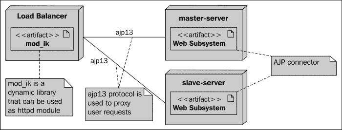
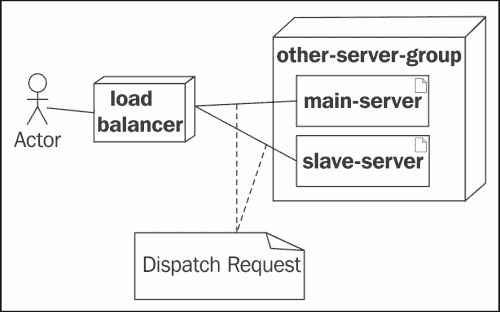
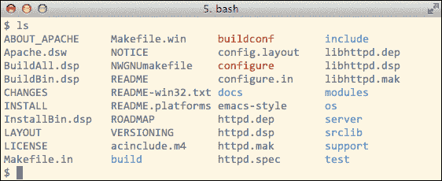
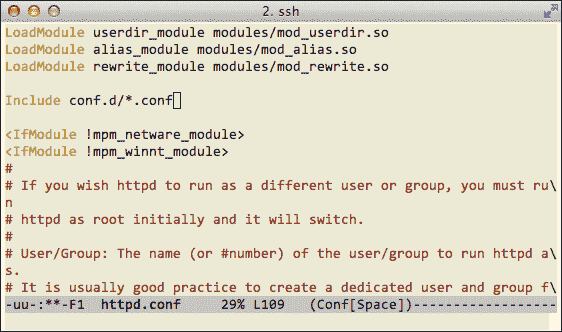
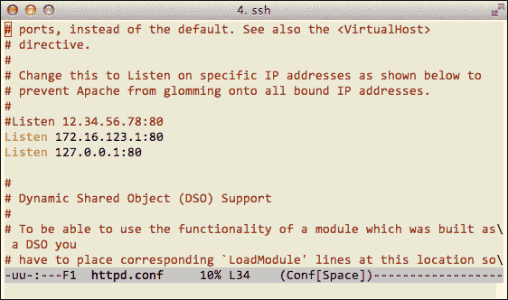
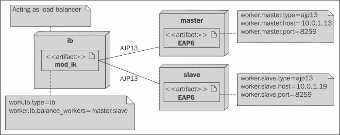
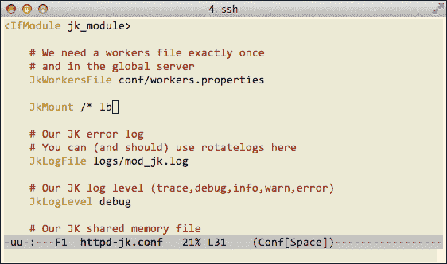
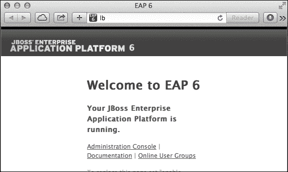
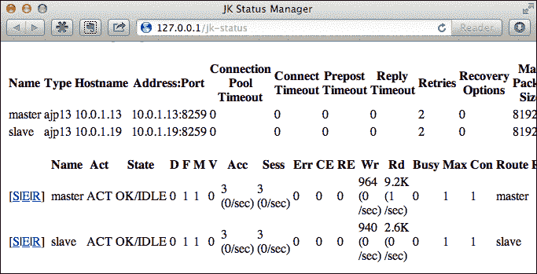

# 第四章。使用 mod_jk 进行负载均衡

在上一章中，我们设置了两个以域模式运行并使用`full-ha`配置文件的 EAP6 服务器。在本章中，我们将设置一个负载均衡器，以便将用户请求分发到这两个 EAP6 服务器。

本章中使用的负载均衡器是由 Apache 社区提供的 mod_jk。它易于使用且功能强大。以下图表显示了其工作原理：



以下是对上一张图表的一些说明：

+   mod_jk 是一个可以作为 Apache httpd 模块使用的动态库。在本章中，我们将学习如何使用它。

+   AJP13 是 mod_jk 用于代理用户请求到 JBoss EAP6 服务器的二进制协议。AJP13 代表 Apache JServ Protocol 1.3，并被 Tomcat、Jetty 和其他 Web 服务器广泛使用。

+   当 Apache httpd 收到用户请求时，mod_jk 模块将 HTTP 请求包装成 AJP13 格式，并将其传递给 JBoss EAP6，JBoss EAP6 中的 AJP 连接器将接收来自 httpd 的代理请求。然后，EAP6 将处理请求并将响应发送回 Apache httpd。最后，Apache httpd 将处理来自 JBoss EAP6 的 AJP 响应，并将其转换为真实的 HTTP 响应并发送给用户。

在实际操作中，我们通常将负载均衡器绑定到公网 IP 地址，以便它可以监听来自互联网的用户请求，并将 EAP6 工作节点放在本地网络中。此外，我们还应该为负载均衡器绑定一个本地 IP 地址，以便它可以与 EAP6 服务器通信。用户只需要与负载均衡器通信即可访问服务，他们不需要了解负载均衡器背后的架构。此外，将集群的内部架构暴露给公众是不必要的，可能会引入潜在的安全风险。

# 准备安装 Apache httpd 的机器

正如我们在上一章中看到的，我们的集群部署结构将如下所示：



我们在上一章中配置了两个 EAP6 服务器。现在，我们将在一台机器上安装 Apache httpd 和 mod_jk 作为负载均衡器，让我们称它为`lb`。这台机器将有两个 IP 地址：

+   一个用于服务用户请求的公网 IP 地址

+   一个可以与本地网络中的 JBoss EAP6 服务器通信的本地 IP 地址

    ### 提示

    如果您的计算机只有一个本地 IP 地址，您可以使用它来服务用户请求并与 EAP6 服务器通信。但在实际操作中，我们通常在防火墙后面隐藏集群架构。

# 编译和安装 Apache httpd

现在，让我们学习如何编译和安装 Apache httpd。您可能会问为什么我们需要自己编译 Apache httpd。有多个原因。通常，httpd 由不同平台提供，这些平台有不同的版本和配置。例如，如果您使用 Ubuntu Linux，而我使用 MacOS，我们的 httpd 版本将不同，我们的 httpd 配置也将不同。

在实践中，编译 httpd、mod_jk 和 mod_cluster 也是常见的。这是因为有时 mod_jk 和 mod_cluster 的新版本在二进制格式发布之前以源代码格式发布。因此，我们需要自己构建它们。

## 下载 httpd

首先，让我们从 Apache httpd 的网站上下载其源代码。在这本书中，我们将使用 httpd 2.2.x。这个分支是目前与 mod_jk 和 mod_cluster 一起工作的最稳定版本。在撰写本文时，2.2.x 分支的最新版本是 httpd 2.2.25，所以让我们使用这个版本来构建我们的负载均衡器。请注意，httpd、mod_jk 和 mod_cluster 的版本非常重要，所以请坚持使用本书中使用的版本，否则您可能会在一些错误上浪费时间。您可以从 [`archive.apache.org/dist/httpd/httpd-2.2.25.tar.gz`](http://archive.apache.org/dist/httpd/httpd-2.2.25.tar.gz) 下载 httpd 2.2.25。

下载后，请将其解压到您有完全访问权限的目录中。我已经将其解压到 `/packt/`：

```java
$ pwd
/packt
$ tar zxvf httpd-2.2.25.tar.gz
...
$ ls
httpd-2.2.25        httpd-2.2.25.tar.gz
```

由于我们将在某些情况下使用绝对路径，请不要将源代码放在非常深的路径中，否则您在引用绝对路径时将创建不必要的困难。

## 编译 httpd

要编译 httpd，首先让我们看一下以下所示的源代码内容：



在内容中，有一个名为 `configure` 的文件，它将检测您的系统设置并为您生成构建脚本 `Makefile`。让我们先运行它：

```java
./configure --prefix=/packt/httpd \
    --with-mpm=worker \
    --enable-mods-shared=most \
    --enable-maintainer-mode \
    --with-expat=builtin \
    --enable-ssl \
    --enable-proxy \
    --enable-proxy-http \
    --enable-proxy-ajp \
    --disable-proxy-balancer
```

如前一个代码片段所示，我们向 `configure` 脚本提供了几个选项。让我们逐一检查它们：

| `prefix=/packt/httpd` | `prefix` 选项定义了二进制安装位置。 |
| --- | --- |
| `with-mpm=worker` | MPM 是 httpd 进程引擎。`worker` 引擎目前与 httpd 2.2.x 稳定工作，所以我们将使用它。 |
| `enable-mods-shared=most` | 此选项将模块编译到共享库中。如果我们不启用它，模块将被编译为静态链接库，我们无法在稍后的 `httpd.conf` 中的 `LoadModule` 指令中单独禁用它们。 |
| `enable-maintainer-mode` | 一个用于控制 `Automake` 工具的选项。 |
| `with-expat=builtin` | Expat 是用 C 语言编写的 XML 解析库。 |
| `enable-ssl` | 在涉及集群环境中 SSL 支持的章节中需要 SSL 库。 |
| `enable-proxy` | `proxy` 库是 mod_cluster 的依赖项。我们将在下一章中学习 mod_cluster。 |
| `enable-proxy-http` | `proxy-http` 是由 mod_cluster 需要的。 |
| `enable-proxy-ajp` | `proxy-ajp` 是由 mod_jk 和 mod_cluster 需要的。 |
| `disable-proxy-balancer` | `proxy-balancer` 与 mod_cluster 冲突，因此我们必须禁用它。 |

在理解了这些选项的含义之后，请使用前面的选项运行 `configure` 命令。现在让我们运行 `make` 来编译 httpd：

```java
httpd-2.2.25$ make
Making all in srclib
Making all in pcre
...

```

等待几分钟，编译应该会完成。

## 安装 httpd

编译完成后，使用以下命令安装编译后的二进制文件：

```java
httpd-2.2.25$ make install
Making install in srclib
Making install in pcre
...
mkdir /packt/httpd
mkdir /packt/httpd/modules
... 
Installing man pages and online manual
mkdir /packt/httpd/man
...

```

如我们所见，编译的二进制文件安装在我们设置的 `--prefix` 选项指定的目录中。对我来说，它是 `/packt/httpd`。

## 启动 httpd

现在，让我们尝试启动 httpd 来查看它是否正确安装。前往你安装的 httpd 的 `bin` 目录并运行以下命令：

```java
httpd/bin$ sudo ./httpd -k start -f /packt/httpd/conf/httpd.conf

```

我们在启动命令中使用了 `-k` 选项来告诉 httpd 开始，并使用 `-f` 选项和 `httpd.conf` 的完整路径来确保 httpd 服务器正在使用我们安装的配置文件。

我们使用 `sudo` 命令是因为我们需要根权限将 httpd 服务绑定到端口 80。如果服务器启动成功，它将显示一些警告：

```java
httpd: Could not reliably determine the server's fully qualified domain name, using localhost.local for ServerName
```

警告是由 `httpd.conf` 中缺少 `ServerName` 配置引起的。我们稍后会正确配置它。现在，让我们检查日志输出。前往日志目录并检查 `error_log`：

```java
httpd/logs$ tail -f error_log
...
[Thu Oct 03 15:19:18 2013] [notice] Apache/2.2.25 (Unix) mod_ssl/2.2.25 OpenSSL/1.0.1c DAV/2 configured -- resuming normal operations
```

`error_log` 文件可以帮助我们检查在运行 httpd 服务器时是否有任何错误。在这里，我们使用了 tail 命令来检查这个日志文件的尾部内容，并且 `-f` 选项会持续更新 `error_log` 的内容到控制台。所以，请保持控制台窗口开启；当我们对 httpd 进行操作时，我们可以随时检查是否有错误。现在，我们可以使用 cURL 命令来测试 httpd 服务：

```java
$ curl http://localhost
<html><body><h1>It works!</h1></body></html>
```

如我们所见，HTTP 服务正在运行。现在，让我们停止 httpd 服务器并在 `httpd.conf` 中做一些基本的配置。

## 停止 httpd

停止 httpd 的命令与启动它的命令类似；只需将 `start` 替换为 `stop`：

```java
sudo httpd -k stop -f /packt/httpd/conf/httpd.conf

```

从 `error_log` 我们可以看到服务器已经停止：

```java
[Thu Oct 03 16:23:59 2013] [notice] caught SIGTERM, shutting down

```

## 配置 httpd

现在，让我们为 httpd 进行一些基本的配置。第一步是备份你的原始 `httpd.conf`：

```java
httpd/conf$ cp httpd.conf httpd.conf.orig
```

保留配置的原始副本是一个好习惯；以防我们弄错了，我们可以在以后恢复它。下一步是使用你喜欢的编辑器打开 `http.conf` 并找到以下代码行：

```java
Listen 80
```

我们需要更改它，以便 httpd 监听公共地址：

```java
Listen 172.16.123.1:80
```

我已经在机器 lb 上配置了这个 IP 地址，它将被用来监听用户请求。请注意，将 httpd 绑定到特定的 IP 地址和端口是一个良好的习惯，可以防止潜在的安全风险。除了公共 IP 地址外，机器 lb 还有一个本地 IP 地址，`10.0.1.32`。前者将用于用户从公共访问；后者与两个 EAP6 服务器位于同一局域网中。如果你的机器没有两个 IP 地址，可以使用单个地址来满足这两个目的。只需记住，在实际操作中，我们通常将集群架构放在防火墙后面。

现在让我们进入下一步。我们需要找到以下这一行：

```java
#ServerName www.example.com:80
```

让我们把我们的服务器名称放在这一行下面：

```java
ServerName lb
```

目前我们只需要在`httpd.conf`中进行这些配置。让我们保存配置并退出编辑。接下来，我们需要确保主机名 lb 映射到我们的公共 IP 地址。对于类 Linux 的环境，我们可以将映射放在`/etc/hosts`中。打开`httpd.conf`文件，在底部添加以下行：

```java
172.16.123.1 lb
```

保存配置文件后，我们可以使用`ping`命令来测试主机名：

```java
$ ping -c 3 lb
PING lb (172.16.123.1): 56 data bytes
64 bytes from 172.16.123.1: icmp_seq=0 ttl=64 time=0.036 ms
64 bytes from 172.16.123.1: icmp_seq=1 ttl=64 time=0.079 ms
64 bytes from 172.16.123.1: icmp_seq=2 ttl=64 time=0.087 ms

```

现在，让我们启动 httpd 来检查我们的配置：

```java
sudo httpd -k start -f /packt/httpd/conf/httpd.conf

```

如果你仍然保留了尾随的`-f logs/error_log`控制台，你可以在启动过程中立即检查是否有任何错误。如果一切顺利，我们现在可以通过主机名访问 httpd 服务器了：

```java
$ curl http://lb
<html><body><h1>It works!</h1></body></html> 
```

如前一个代码片段所示，主机名 lb 被绑定到了 httpd 服务器上。此外，在 httpd 服务器启动过程中，请注意，警告**httpd: 无法可靠地确定服务器的完全限定域名**已经消失。这是因为我们已经配置了`ServerName`在`httpd.conf`中。

既然我们已经配置了 httpd，下一步就是学习如何使用 mod_jk。

# 编译和安装 mod_jk

mod_jk 的全称是 Apache Tomcat Connector。它最初是为了代理 httpd 到 Tomcat 的 HTTP 请求而设计的，但由于它是一个标准的 AJP 连接器，因此它可以用于支持 AJP 协议的 Web 容器。因为 JBoss EAP6 支持 AJP13 协议，所以我们可以使用 mod_jk 作为其连接器。

### 提示

为了节省一些输入，在接下来的文本中，我会用 JK 来指代 mod_jk。

## 安装 JK

JK 的下载页面位于[`tomcat.apache.org/download-connectors.cgi`](http://tomcat.apache.org/download-connectors.cgi)。

在撰写本文时，最新版本是 1.2.37，这是我们在这本书中将使用的版本。请从之前提到的网站下载 1.2.37 源代码包，并在下载后解压。完成所有这些后，让我们看看源代码包的内容：

```java
tomcat-connectors-1.2.37-src$ ls
HOWTO-RELEASE.txt conf              support
LICENSE           docs              tools
NOTICE            jkstatus          xdocs
README.txt        native
```

如我们所见，mod_jk 包含许多组件，但我们只需要在 native 目录下构建代码。让我们进入这个目录并运行里面的`configure`脚本：

```java
$ ./configure --with-apxs=/packt/httpd/bin/apxs
```

请注意，我们提供了`—with-apxs`选项进行配置，因为在构建过程中，它需要 httpd 的二进制文件。配置过程如下所示：

```java
tomcat-connectors-1.2.37-src/native$ ./configure --with-apxs=/packt/httpd/bin/apxs
checking build system type... 
checking host system type... 
...
config.status: executing depfiles commands
After configure process finished, run make to compile it:
tomcat-connectors-1.2.37-src/native$ make
libtool: install: warning: remember to run `libtool --finish /packt/httpd/modules'
...
Making all in common
Making all in apache-2.0
make[1]: Nothing to be done for `all'.
```

现在，让我们通过运行`make install`来安装它：

```java
tomcat-connectors-1.2.37-src/native$ make install
Making install in apache-2.0

Installing files to Apache Modules Directory...
cp .libs/mod_jk.so /packt/httpd/modules/mod_jk.so
chmod 755 /packt/httpd/modules/mod_jk.so

Please be sure to arrange /packt/httpd/conf/httpd.conf...
```

我已经剪掉了日志输出，只留下了重要的部分。从前面的日志中，我们可以看到编译后的共享二进制文件`mod_jk.so`已被复制到`/packt/httpd/modules/`。因为我们使用`--with-apxs`选项设置了 httpd 路径，在安装过程中，构建脚本知道将编译的二进制文件放在哪里。

在日志的末尾，JK 提醒我们配置`httpd.conf`以启用它。在下一节中，我们将执行此任务。

## 配置 JK

在 JK 源中，有一个名为`conf`的目录。在这个目录中，JK 为我们提供了一些可以参考的示例配置文件：

```java
$ ls /packt/tomcat-connectors-1.2.37-src/conf 
httpd-jk.conf              workers.properties
uriworkermap.properties    workers.properties.minimal
```

让我们将这些文件复制到 httpd 中。首先，让我们在 httpd 中创建一个名为`conf.d`的新目录：

```java
/packt/httpd$ mkdir conf.d
```

然后，让我们将配置文件从 JK 源复制到`conf.d`：

```java
$ cp /packt/tomcat-connectors-1.2.37-src/conf/httpd-jk.conf /packt/httpd/conf.d/
```

我们希望 httpd 在启动时加载`conf.d/httpd-jk.conf`。为了实现这个目标，请打开`conf/httpd.conf`并找到以`LoadModule`开头的多行。在这些`LoadModule`指令的底部，让我们添加一行新代码：

```java
Include conf.d/*.conf
```

修改如下所示：



`Include`指令将告诉 httpd 在启动时加载`conf.d`中后缀为`.conf`的文件。由于我们已经将`httpd-jk.conf`放入`conf.d`，它将在 httpd 启动时被加载。现在让我们转到 JK 配置。

### 配置 httpd-jk.conf

我们需要正确配置 JK。请打开`conf.d`中的`httpd-jk.conf`文件，并检查一些重要的配置：

```java
LoadModule jk_module modules/mod_jk.so
```

如前一行代码所示，我们可以看到`mod_jk.so`库已被加载。

```java
JkWorkersFile conf/workers.properties
```

默认情况下，JK 将在`conf`目录中查找`workers.properties`文件。此属性文件用于定义我们的集群结构。让我们将 JK 源目录中的示例`config`文件`workers.properties.minimal`复制到`conf.d`：

```java
$ cp /packt/tomcat-connectors-1.2.37-src/conf/workers.properties.minimal /packt/httpd/conf/workers.properties
```

之后，我们将详细讨论此文件。现在，让我们回到检查`httpd-jk.conf`：

```java
JkLogFile logs/mod_jk.log
```

`JkLogFile`指令定义了 JK 使用的日志文件。

```java
JkLogLevel info
```

`JkLogLevel`指令定义了 JK 的日志级别。您可以将它更改为`debug`以在 JK 运行时查看更多详细信息。

```java
JkShmFile logs/mod_jk.shm
```

这是 JK 共享内存文件。只需保持原样即可。现在，让我们看看以下两个 JK 模块：

```java
 <Location /jk-status>
    JkMount jk-status
    Order deny,allow
    Deny from all
    Allow from 127.0.0.1
</Location>
<Location /jk-manager>
    JkMount jk-manager
    Order deny,allow
    Deny from all
    Allow from 127.0.0.1
</Location>
```

之前提到的两个位置是 JK 管理组件的位置。我们可以在`workers.properties`中定义它们：

```java
worker.list=jk-status
worker.jk-status.type=status
worker.jk-status.read_only=true

worker.list=jk-manager
worker.jk-manager.type=status
```

我们可以看到`jk-status`和`jk-manager`实际上是同一件事：

```java
worker.jk-status.type=status
```

其中之一是`read_only`：

```java
worker.jk-status.read_only=true
```

另一个可以接受管理命令。在这本书中，我们将仅使用配置文件来配置 JK，而不会涵盖 `jk-manager` 的使用话题。现在，让我们回到配置文件。`jk-status` 和 `jk-manager` 的访问范围在 `Location` 设置中定义：

```java
Allow from 127.0.0.1
```

这意味着我们只能从本地主机访问 `/jk-status` 和 `/jk-manager`。这是安全的，因为我们不希望这些管理组件被远程访问。为了支持它，我们需要在 `conf/httpd.conf` 中添加一行。在现有的 `Listen` 部分下，添加另一个指令：

```java
Listen 127.0.0.1:80
```

它应该看起来像以下这样：



这将让 httpd 接受来自本地的连接。这就是我们启用管理控制台所需做的全部工作。现在，让我们检查 `worker` `s.properties`。

### 工作节点配置文件

我们将在 `conf` 目录中复制的 `workers.properties` 文件中定义我们的集群结构。该文件的内容很简单，如下所示：

```java
worker.list=lb,jk-status

worker.node1.type=ajp13
worker.node1.host=localhost
worker.node1.port=8009

worker.lb.type=lb
worker.lb.balance_workers=node1

worker.jk-status.type=status
```

配置的第一行定义了两个工作节点：`lb` 和 `jk-status`。我们知道 `jk-status` 用于挂载 JK 的管理组件，其类型是 `status`。

对于工作 `lb`，我们看到它的类型是 `lb`：

```java
worker.lb.type=lb
```

`lb` 类型在 JK 中定义了一个负载均衡器，它可以用来将用户请求分发到工作节点。我们看到 JK 提供的示例中有一个名为 `node1` 的工作节点：

```java
worker.lb.balance_workers=node1
```

默认情况下，`node1` 是一个支持 AJP13 协议的节点：

```java
worker.node1.type=ajp13
worker.node1.host=localhost
worker.node1.port=8009
```

上述配置需要修改。我们有两个工作节点，即运行在主节点和从节点上的两个 EAP6 服务器，它们的 IP 地址如我们所知分别是 `10.0.1.13` 和 `10.0.1.19`。

我们知道两个 EAP6 服务器以域模式运行，我们正在使用 `other-server-group`，主节点作为域控制器运行。因此，让我们检查主节点上的 `domain.xml`：

```java
<server-group name="other-server-group" profile="full-ha">
    <socket-binding-group ref="full-ha-sockets"/>
</server-group>
<socket-binding-group name="full-ha-sockets" default-interface="public">
    <socket-binding name="ajp" port="8009"/>
    ...
</socket-binding-group>
```

`other-server-group` 使用了 `full-ha-sockets` 绑定组。并且 AJP 端口绑定到了 8009。但别忘了在主节点和从节点上的 `host.xml` 中的 `port-offset` 设置。在主节点系统上，我们有以下代码片段：

```java
<server name="master-server" group="other-server-group" auto-start="true">
    <socket-bindings port-offset="250"/>
</server>
```

在从节点系统上，我们有以下代码片段：

```java
<server name="slave-server" group="other-server-group" auto-start="true">
    <socket-bindings port-offset="250"/>
</server>
```

因此，它们绑定的 AJP 端口是 *8009 + 250 = 8259*。根据这两个工作节点的设置，让我们修改 `workers.properties` 中的配置。以下是其全部内容：

```java
worker.list=lb,jk-status

worker.master.type=ajp13
worker.master.host=10.0.1.13
worker.master.port=8259

worker.slave.type=ajp13
worker.slave.host=10.0.1.19
worker.slave.port=8259

worker.lb.type=lb
worker.lb.balance_workers=master,slave

worker.jk-status.type=status
```

在之前的配置文件中，我们将我们的两个 EAP6 服务器配置为 `lb` 的工作节点。以下图表显示了它们之间的关系：



在配置 `workers.properties` 之后，我们需要回到 `conf.d/httpd-jk.conf` 以向我们的集群添加一个挂载点。在 `JkWorkersFile` 指令下，添加以下代码行：

```java
JkMount /* lb
```

配置如下所示：



它将告诉 httpd 将所有 HTTP 请求重定向到`lb`，而`lb`将通过 AJP13 协议代理请求到 EAP6 服务器。这就是配置的全部内容。现在让我们测试我们的集群。

# 测试集群

请关闭 httpd 服务器然后重新启动它。如果你已经遵循了前几节中的所有说明，服务器应该可以正确启动。

确保你已经以域模式启动了两个 EAP6 服务器，并且项目`cluster-demo1`已经部署到了`other-server-group`。我们将使用这两个工作节点进行测试。

由于我们已经将负载均衡器的公网 IP 地址绑定到了主机名`lb`，让我们通过主机名来访问它。打开一个网页浏览器并输入 URL `http://lb`。

如果一切顺利，我们现在应该能看到 EAP 主页：



从之前的截图，我们看到请求被转发到了 EAP6 服务器。现在让我们尝试访问`cluster-demo1`：

```java
$ curl http://lb/cluster-demo1/index.jsp
<html>
  <body>
    <h2>Hello World!</h2>

    Hello! The time is now Fri Oct 04 00:31:54 CST 2013
  </body>
</html>
```

我们可以检查两个 EAP6 服务器的服务器输出，以查看哪个实际上正在处理这个请求。在我的集群中，这个请求由`master-server`处理：

```java
[Server:master-server] 00:31:54,264 INFO  [stdout] (ajp-/10.0.1.13:8259-3) Hello! The time is now Fri Oct 04 00:31:54 CST 2013
```

让我们关闭正在处理这个请求的 EAP6 服务器。对于我的集群，我在`master-server`上按下*Ctrl* + *C*来关闭：

```java
00:36:32,078 INFO  [org.jboss.as.process] (Shutdown thread) JBAS012015: All processes finished; exiting
```

然后，我使用`cURL`再次访问负载均衡器。请求被转发到了另一个 EAP 服务器。这次是`slave-server`在处理用户请求：

```java
[Server:slave-server] 00:36:39,966 INFO  [stdout] (ajp-/10.0.1.19:8259-4) Hello! The time is now Fri Oct 04 00:36:39 CST 2013
```

从用户的角度来看，集群中一个工作节点关闭不会对他们产生影响。

## jk-status 模块

最后，让我们简要看看`jk-status`模块。从你的负载均衡器机器上打开你的网页浏览器。然后，通过其 URL 访问`jk-status`：`http://localhost/jk-status`。

我们将看到两个工作节点的状态：



从之前的截图，我们可以检查两个 EAP6 服务器的运行状态以及它们处理了多少请求。

# 摘要

在本章中，我们学习了如何使用 JK 作为负载均衡器代理用户请求。正如你所见，JK 非常易于使用且功能强大。它依赖于`workers.properties`来定义集群的结构。当一个集群中的工作节点崩溃时，JK 会将用户请求故障转移到集群中的其他节点。我们还没有触及 JK 为我们提供的所有功能，例如，细粒度路由匹配和`jk-status`在管理任务中的使用。你可以参考 JK 在线文档了解这些主题。
