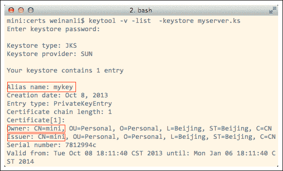
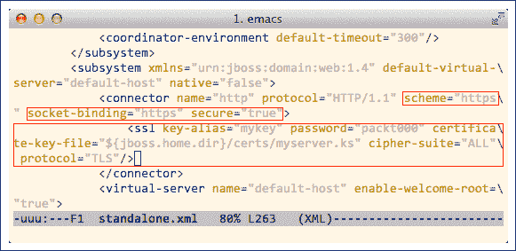
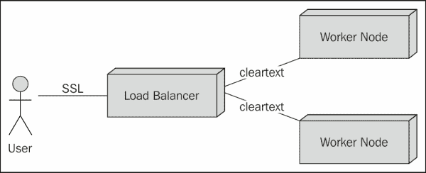
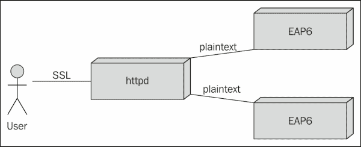
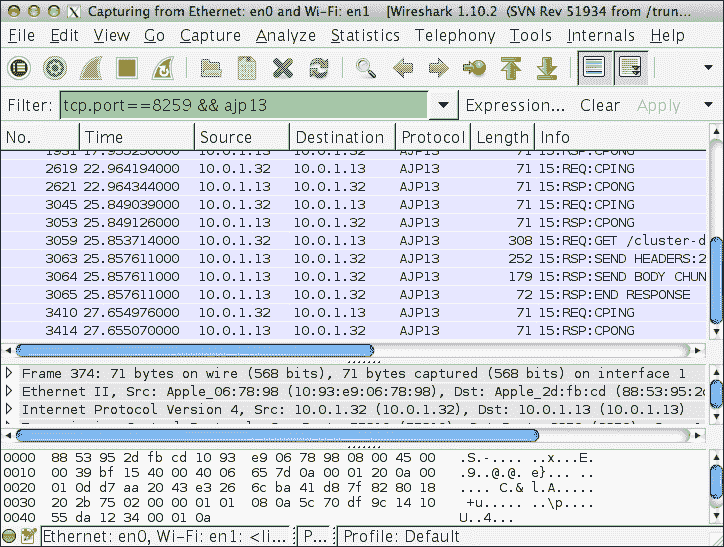

# 第六章. 使用 SSL 进行集群

在前两个章节中，我们学习了如何使用`JK`和`mod_cluster`作为负载均衡器代理用户请求到 EAP6 后端服务器，并且负载均衡器和 EAP6 服务器之间的所有通信都是明文传输的。在实践中，有时我们需要通过启用**SSL**来确保传输层的安全。在本章中，我们将学习如何在集群环境中启用 SSL。我们首先将学习如何在独立使用 JBoss EAP6 时启用 SSL，然后我们将学习如何在 httpd 和 EAP6 服务器一起运行的集群环境中启用 SSL。对于集群环境，在本章中我们将使用`JK`作为负载均衡器。因为使用`mod_cluster`已经提供了与 SSL 更精细的集成，我们将在下一章讨论这个话题。

### 注意

在阅读本章之前，您需要具备一些关于公钥加密和 SSL 的基本知识。

# 在 JBoss EAP6 中使用 SSL

首先，让我们看看如何在 EAP6 中直接启用 SSL。当我们使用 EAP6 作为独立服务器且前面没有任何负载均衡器时，这很有用。JBoss EAP6 自带 SSL 支持，在本节中，我们将看看如何启用它。

## 在 EAP6 中启用 SSL

要在 EAP6 中启用 SSL，我们需要为 EAP6 服务器创建一个 x.509 证书。首先准备一个干净的`JBoss EAP 6.1.0.Final`副本，以确保配置是默认的。当 EAP6 服务器的干净副本准备好使用时，请以独立模式启动它，然后将`cluster-demo1`部署到运行的服务器上，然后停止服务器。这就是我们需要的准备工作。我们将用它来测试 HTTPS 连接。

现在让我们在 EAP6 基本路径下创建一个名为`certs`的目录。我们将用它来存储服务器证书。

然后，我们需要导航到`certs`目录，并使用**Java 运行时环境**（**JRE**）提供的`keytool`命令为 EAP6 服务器生成一个证书。以下是命令：

```java
$ keytool -genkey -keystore myserver.ks
```

运行过程如下截图所示：


**密钥库密码**和**密钥密码**是**packt000**。请注意，在生产环境中，我们必须将**CN**设置为我们的网站主机名。对于这个例子，我的主机名叫做**mini**，所以我将其用作证书的**CN**。现在让我们检查生成的`keystore`文件及其包含的密钥：



如前一个屏幕截图所示，我们生成的密钥及其证书存储在 `keystore` 中。密钥的默认 **别名** 是 **mykey**，其证书与之关联。如果我们仔细观察，我们可以看到这个证书的 **发行者** 和 **所有者** 是相同的。这意味着这是一个自签名证书。在生产环境中，我们需要找到一个权威机构（如 **VeriSign**）来签署这个证书。在权威机构签署后，**发行者** 将会变为该权威机构。

现在我们需要配置 EAP6 Web 子系统以使用密钥及其证书。让我们打开 `standalone.xml` 并找到子系统 `urn:jboss:domain:web:1.4`。然后我们需要找到一个 HTTP 连接器并将其方案更改为 HTTPS。接下来，我们需要添加一个 SSL 元素来告诉 EAP6 我们 `keystore` 的位置和我们的密钥的别名。修改应如下所示：



那就是我们需要在 `standalone.xml` 中配置的所有内容。此外，请注意配置文件中 HTTPS 使用的端口是 `8443`：

```java
<socket-binding name="https" port="8443"/>
```

因此，我们需要使用这个端口来访问 EAP6 Web 子系统。现在我们可以启动 EAP6 服务器并测试 HTTPS 连接：

```java
$ curl -k https://localhost:8443/cluster-demo1/index.jsp
<html>
<body>
<h2>Hello World!</h2>

Hello! The time is now Tue Nov 19 20:40:52 CST 2013
</body>
</html>
```

**cURL** 的 `-k` 选项是绕过证书验证。由于我们的证书未由权威机构签署，默认情况下它不被 cURL 或任何其他网络浏览器信任。

在本节中，我们学习了如何在 EAP6 独立模式下启用 SSL。在域模式下启用 SSL 类似；我们还需要将 Web 子系统设置为使用 HTTPS 方案，并在 SSL 元素中添加证书信息。我想把这个任务留给你。

# 在 JBoss EAP6 集群中使用 SSL

在集群环境中，应用 SSL 并不像在单服务器环境中那样直接。我们有一个集群中的负载均衡器和工作节点，因此我们需要决定在哪个位置启用 SSL。以下是两个可能的位置：

+   用户与负载均衡器之间的通信

+   负载均衡器与工作节点之间的通信

实际上，我们通常在用户和负载均衡器之间启用 SSL 以确保他们的通信安全，并在负载均衡器和工作节点之间使用 *明文* 通信。以下是部署图：



这是合理的，因为工作节点通常由防火墙保护，使用 SSL 的目的不仅是为了加密通信通道，而且由权威机构签署的证书还可以帮助客户的网络浏览器验证 Web 服务器的身份。

在负载均衡器和工作节点之间启用 SSL 通信也会在通信层创建许多开销，加密/解密网络数据会消耗 CPU 功率。

`JK` 不支持负载均衡器和工作节点之间的 SSL 通信，正如我之前解释的那样，在大多数情况下这不是问题，因为 `mod_cluster` 支持负载均衡器和工作节点之间的安全连接，我们将在下一章中看到如何配置它。

## 配置 JK 使用 SSL

现在让我们开始学习如何使用 `JK` 启用 SSL。首先，让我们看看部署图：



实际上我们只需要在 Apache httpd 中启用 SSL。正如我们所知，`mod_jk` 是一个轻量级负载均衡器，它只支持到工作节点的 AJP 连接。这意味着 `JK` 和 EAP6 服务器之间的通信将是 *明文* AJP13 协议。

要在 httpd 中启用 SSL，我们需要做一些准备工作。请使用 `JK` 安装恢复 httpd，我们将基于它配置 SSL。如果你忘记了如何正确配置 httpd 和 `JK`，请再次阅读第四章，*使用 mod_jk 进行负载均衡*。

### 为 httpd 生成证书

现在让我们为 httpd 准备服务器证书。首先，在 httpd 中创建一个 `certs` 目录：

```java
/packt/httpd$ mkdir certs 
```

然后，我们需要导航到 `certs` 目录并为 httpd 生成一个证书。对于 httpd，我们需要使用 **OpenSSL** 来生成证书，因为 httpd 不支持 Java 应用程序使用的 `keystore` 格式。实际上，证书格式都是相同的，但 `keytool` 和 OpenSSL 生成的存储结构是不同的。OpenSSL 将密钥和证书分离成独立的文件，而 `keytool` 则将它们存储在一个单独的 `keystore` 文件中。

现在，让我们生成一个密钥，以下是命令及其过程：

```java
$ openssl genrsa -des3 -out lb.key 1024
Generating RSA private key, 1024 bit long modulus
Enter pass phrase for lb.key: packt000
Verifying - Enter pass phrase for lb.key: packt000
```

接下来，我们需要为这个密钥文件生成一个相关的证书文件。以下是命令及其过程：

```java
$ openssl req -new -key lb.key -out lb.csr
Enter pass phrase for lb.key: packt000
Country Name (2 letter code) [AU]:CN
State or Province Name (full name) [Some-State]:Beijing
Locality Name (eg, city) []:Beijing
Organization Name (eg, company) [Internet Widgits Pty Ltd]:Personal
Organizational Unit Name (eg, section) []:Personal
Common Name (e.g. server FQDN or YOUR name) []: lb
Email Address []:
A challenge password []:
An optional company name []:
```

现在我们得到了证书请求文件 `lb.csr` 和相关的密钥文件 `lb.key`。接下来是签署证书请求文件。因为这个证书是用于测试的，我们不需要找到一个权威机构来签署它。我们可以使用密钥文件来签署其自己的证书请求文件。所以这是一个自签名证书。以下是命令和运行过程：

```java
$ openssl x509 -req -days 365 -in lb.csr -signkey lb.key -out lb.crt
Signature ok
subject=/C=CN/ST=Beijing/L=Beijing/O=Personal/OU=Personal/CN=kb
Getting Private key
Enter pass phrase for lb.key: packt000
```

签名的证书文件已生成，文件名为 `lb.crt`。这个文件是标准格式，因此我们也可以使用 `keytool` 来检查其内容，如下面的代码所示：

```java
$ keytool -v -printcert -file lb.crt
Owner: CN=kb, OU=Personal, O=Personal, L=Beijing, ST=Beijing, C=CN
Issuer: CN=kb, OU=Personal, O=Personal, L=Beijing, ST=Beijing, C=CN
```

从前面的代码片段中，我们可以看到这个证书的 `Owner` 和 `Issuer` 是相同的。这就是使用 OpenSSL 生成自签名证书的过程。实际上，我们可以将前面的过程合并成一个命令：

```java
$ openssl req -new -newkey rsa -days 365 -x509 -subj "/C=CN/ST=Beijing/L=Beijing/O=Personal/OU=Personal/CN=httpd" -keyout lb.key -out lb.crt
```

使用前面的命令，我们可以一步生成密钥文件及其自签名证书。

### 配置 httpd 使用证书

我们需要在`httpd.conf`中添加几个指令。第一步是让 httpd 监听端口`443`，这是 HTTPS 的标准端口。我正在重用前两章中的集群配置，所以我仍然在我的机器`lb`上运行 httpd，并将它配置为监听公共 SSL 端口：

```java
Listen 172.16.123.1:443
```

并且不要忘记注释掉对端口 80 的访问，因为我们不希望用户在不使用 HTTPS 的情况下连接：

```java
#Listen 172.16.123.1:80
```

现在我们需要配置`JK`，其配置文件位于`conf.d/httpd-jk.conf`。请删除其中的所有内容，并替换为以下内容：

```java
LoadModule jk_module modules/mod_jk.so

<IfModule jk_module>
  JkWorkersFile conf/workers.properties
  JkShmFile logs/mod_jk.shm
  JkWatchdogInterval 60

  <VirtualHost 172.16.123.1:443>
    SSLEngine on
    SSLCertificateFile /packt/httpd/certs/lb.crt
    SSLCertificateKeyFile /packt/httpd/certs/lb.key        

    JkMount /* lb
    JkLogFile logs/mod_jk.log
    JkLogLevel debug
  </VirtualHost>
</IfModule>
```

如前所述的配置所示，我们添加了一个绑定到端口`443`的`VirtualHost`。此外，我们已启用 SSL 引擎，并提供了服务器证书及其密钥文件以使用。此外，我们已将 JkMount 点放在此虚拟主机内，因此用户对 HTTPS 的请求将通过`JK`代理并发送到后面的 EAP6 服务器。

这就是在 httpd 中需要配置的所有内容。因为 httpd 和 EAP6 服务器之间的通信仍在使用明文的 AJP13 协议，所以我们不需要在 EAP6 中更改任何配置。现在我们可以启动 EAP6 服务器和 httpd 服务器。在 httpd 服务器启动过程中，它需要我们输入我们的密钥的密码短语。过程如下面的代码片段所示：

```java
$ sudo httpd -k start -f /packt/httpd/conf/httpd.conf
Apache/2.2.25 mod_ssl/2.2.25 (Pass Phrase Dialog)
```

由于安全原因，一些你的私钥文件已被加密。

为了阅读它们，你必须提供密码短语。

```java
Server localhost:443 (RSA)
Enter pass phrase: packt000

OK: Pass Phrase Dialog successful.
```

如果你已经在`httpd.conf`中将`LogLevel`设置为`debug`，你可以在`logs/error_log`中看到许多与 SSL 相关的日志输出。如果出现问题，这是一个很好的分析来源。现在我们可以通过 HTTPS 访问负载均衡器，并看到请求被转发到 EAP6 服务器：

```java
$ curl -k https://172.16.123.1/cluster-demo1/index.jsp
<html>
<body>
<h2>Hello World!</h2>

Hello! The time is now Tue Nov 19 22:40:52 CST 2013
</body>
</html>
```

如果我们使用**Wireshark**来监控 httpd 和 EAP6 之间的代理通道，我们可以看到它们仍在使用*明文*的 AJP13 协议进行通信：



# 摘要

在本章中，我们对将 SSL 应用于 EAP6 和集群环境进行了概述，并看到了如何将 SSL 和`JK`一起配置到 httpd 中。在下一章中，我们将学习如何使用`mod_cluster`应用 SSL。
