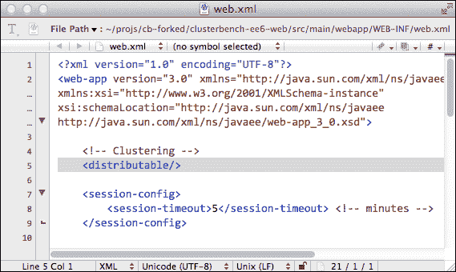
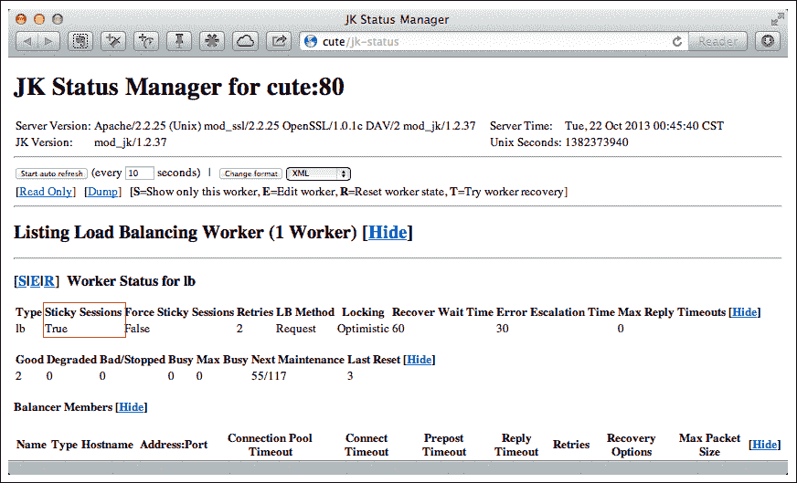
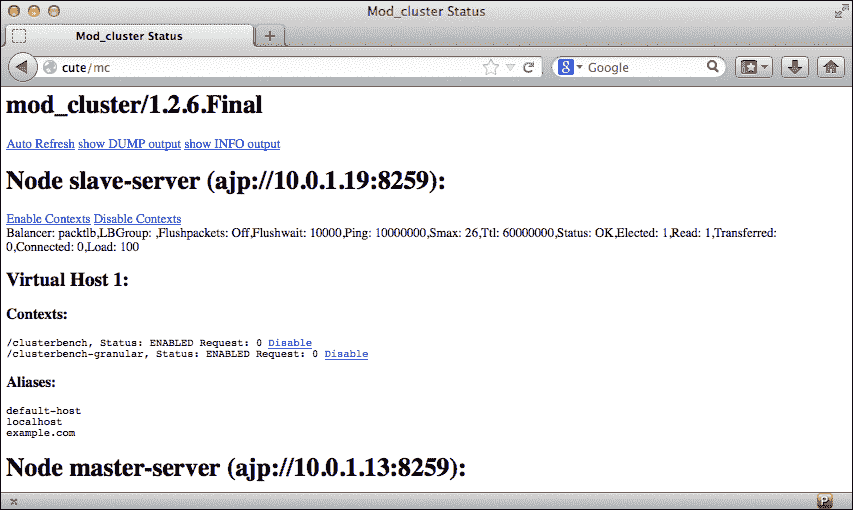

# 第八章. 开发分布式应用程序

在前面的章节中，我们一直专注于构建无状态集群。这意味着我们不需要为每个用户请求维护会话，负载均衡器可以自由选择一个工作节点来处理用户请求。

无状态集群更加灵活，并且可以很好地扩展，因此在我们构建集群时，它总是首选。本质上，HTTP 是一个无状态协议，因此它缺乏维护用户请求会话的能力。为了解决这个问题，Web 服务器通常会向用户的 Web 浏览器传递一个会话 ID 以维持长时间的对话。

例如，如果我们正在构建一个在线购物系统，我们必须为每个用户维护一个购物车。当用户检查他们的购物车时，购物车中商品的总价将被计算。所有这些数据都需要存储在服务器端或用户 Web 浏览器的 cookies 中，并且数据需要在多个页面之间保持，所以会话 ID 是引用这些用户数据的键。对于 JBoss EAP，会话 ID 被称为 JSESSIONID。

在集群环境中，情况变得更加复杂，因为这里有多台服务器而不是一台，所以需要复制它们的状态。例如，如果一个工作节点 `A` 正在处理一个用户的请求，那么购物车的数据可能就保存在工作节点 `A` 上。如果负载均衡器现在将用户请求重定向到工作节点 `B`，那么用户会发现他的/她的购物车变空了。即使 JSESSIONID 被传递给工作节点 `B`，与 JSESSIONID 相关的数据仍然存储在工作节点 `A` 上。所以用户的数据仍然会丢失。

有两种常用的方法来解决这个问题。第一种选择被称为**粘性会话**。这是一种直接解决问题的方法。这意味着负载均衡器将用户会话粘附到特定的一个工作节点上。例如，如果一个用户访问我们的网站，负载均衡器选择工作节点 `A` 来处理请求，那么这个工作节点将永远用于处理该用户后续的请求，直到他/她退出 Web 浏览器或会话结束。

这种解决方案易于应用，并且适合实践中的许多情况。然而，它只部分解决了问题，因为工作节点可能会失败，负载均衡器会希望将用户请求故障转移到另一个工作节点。在这种情况下，崩溃的工作节点上的所有会话仍然会丢失。

因此，这是避免上述问题的第二种解决方案，即工作节点之间相互复制会话数据会更好。这样，当一个工作节点崩溃时，它的会话可以从其他工作节点恢复。

在本章中，我们将学习如何配置 EAP6 服务器之间的会话复制，然后我们将看到如何配置 httpd 中的粘性会话。

# Web 会话复制

当 EAP6 以域模式（或启用`*-ha`配置文件的单机模式）运行时，它将默认提供 Web 会话复制。会话复制由 Infinispan 子系统支持，会话容器在`domain.xml`（和`standalone-*-ha.xml`）中定义：

```java
<cache-container name="web" aliases="standard-session-cache" default-cache="repl" module="org.jboss.as.clustering.web.infinispan">
  ...
</cache-container>
```

在本节中，我们将使用一个示例项目来演示 Web 会话复制的使用方法。该项目命名为`clusterbench`。它是由我的同事*Radoslav Husar*和*Michal Babacek*在 Red Hat 开发的。

### 注意

该项目位于[`github.com/clusterbench/clusterbench`](https://github.com/clusterbench/clusterbench)。

此项目为我们提供了一些优秀的演示代码。因此，我们将直接将其部署到我们的 EAP6 服务器上进行测试。

在演示项目中，有一个名为`clusterbench-ee6-web`的子模块。在这个模块中，我们可以看到如何在`web.xml`中启用会话。它使用一行配置来启用 Web 会话复制，如下面的截图所示：



在`web.xml`中启用`distributable`后，Web 会话将在 EAP6 服务器之间进行复制。这是一个 JavaEE 标准要求。由于 JBoss EAP6 符合 JavaEE 标准，因此它支持此功能。此 Web 项目还为我们提供了一个用于测试的 servlet：

```java
@WebServlet(name = "HttpSessionServlet", urlPatterns = {"/session"})
public class HttpSessionServlet extends CommonHttpSessionServlet {
}
```

前面的类`HttpSessionServlet`扩展了`CommonHttpSessionServlet`。`CommonHttpSessionServlet`在`clusterbench-common`中定义。以下是`CommonHttpSessionServlet`的摘要：

```java
public class CommonHttpSessionServlet extends HttpServlet {

@Override
protected void doGet(HttpServletRequestreq,
HttpServletResponseresp) 
throws ServletException, IOException {
HttpSession session = req.getSession(true);
if (session.isNew()) {
log.log(Level.INFO, "New session created: {0}",
session.getId());
session.setAttribute(KEY, new SerialBean());
        }

SerialBean bean = (SerialBean) session.getAttribute(KEY);

int serial = bean.getSerial();
bean.setSerial(serial + 1);

        // Now store bean in the session
session.setAttribute(KEY, bean);
System.out.println("***serial: " + serial);
resp.getWriter().print(serial);
    }
}
```

此 servlet 的主要目的是将计数器放入 Web 会话中，每次用户发送请求时，计数器将增加 1。请注意，我在前面的类中添加了一行代码：

```java
System.out.println("***serial: " + serial);
```

因此，我们可以在稍后查看服务器控制台输出。现在我们可以将此项目部署到我们的集群中，然后我们可以访问 servlet 来使用计数器。我们可以查看服务器输出以确定哪个节点正在实际处理此请求。然后关闭工作节点并再次访问集群。我们应该期望另一个 EAP6 服务器来处理请求。如果会话复制成功，我们应该看到计数器没有重置，而是继续增加。总之，这是一个演示 EAP6 服务器之间会话复制的示例。

为了进行测试，我们可以使用上一章中设置的集群，使用`JK`或`mod_cluster`作为负载均衡器，然后将项目`clusterbench-ee6.ear`部署到 EAP6 域中。

在完成前面的准备工作并且负载均衡器和 EAP6 服务器都运行后，让我们第一次通过**cURL**访问集群：

```java
$ curl -cmysession.txt http://172.16.123.1/clusterbench/session
0
```

我们可以看到计数器值被设置为`0`。`-cmysession.txt`选项告诉 cURL 将会话 cookie 存储在名为`mysession.txt`的文件中。我们稍后会检查这个文件。现在我们可以检查服务器端。从 EAP6 服务器控制台输出中，我们可以看到主服务器正在处理用户请求：

```java
[Server:master-server] 20:10:57,810 INFO  [org.jboss.test.clusterbench.common.session.CommonHttpSessionServlet] (ajp-/10.0.1.13:8259-1) New session created: 5LQpRPxdSCupM5eHYd93S2wR
[Server:master-server] 20:10:57,813 INFO  [stdout] (ajp-/10.0.1.13:8259-1) ***serial: 0
```

在主服务器的先前控制台输出中，我们可以看到为计数器创建了一个新的会话，会话 ID 为`5LQpRPxdSCupM5eHYd93S2wR`。此外，我们看到计数器被初始化为`0`，这与客户端的结果相匹配。

现在让我们回到客户端并检查`mysession.txt`文件。以下是文件内容：

```java
$ cat mysession.txt
# Netscape HTTP Cookie File
# http://curl.haxx.se/rfc/cookie_spec.html
# This file was generated by libcurl! Edit at your own risk.
172.16.123.1	FALSE	/clusterbench	FALSE	0	JSESSIONID	5LQpRPxdSCupM5eHYd93S2wR
```

我们可以看到 JSESSIONID 存储在 cookie 中。现在让我们使用这个 cookie 文件再次访问集群：

```java
$ curl -bmysession.txt http://172.16.123.1/clusterbench/session
1
```

`-b`选项将让 cURL 读取一个现有的 cookie 文件并将 cookie 发送到服务器，这意味着之前的会话将继续。因为计数器增加 1，这意味着我们的会话由 JSESSIONID 保持。我们可以再次检查 EAP6 服务器的输出：

```java
[Server:master-server] 20:26:12,496 INFO  [stdout] (ajp-/10.0.1.13:8259-1) ***serial: 1
```

因此，主服务器上的计数器没有重置，它在一个会话中持续增加。现在让我们关闭主服务器：

```java
20:31:04,851 INFO  [org.jboss.as.process] (Shutdown thread) JBAS012015: All processes finished; exiting
```

然后我们再次访问集群：

```java
$ curl -bmysession.txt http://172.16.123.1/clusterbench/session
2
```

因为主服务器已关闭，这次是从服务器在处理请求：

```java
[Server:slave-server] 21:07:46,266 INFO  [stdout] (ajp-/10.0.1.40:8259-2) ***serial: 2
```

尽管请求被重定向到从服务器，但会话保持不变，计数器从 1 增加到 2。这验证了两个服务器之间会话复制工作正常。

## CDI 会话作用域 bean 复制

CDI 会话作用域 bean 的使用与 web 会话 bean 类似。在演示项目中，它提供了一个`CdiServlet`用于测试：

```java
@WebServlet(name = "CdiServlet", urlPatterns = {"/cdi"})
public class CdiServlet extends HttpServlet {

@Inject
privateSessionScopedCdiSerialBean bean;

@Override
protected void doGet(HttpServletRequestreq,
HttpServletResponseresp) 
throws ServletException, IOException {
resp.setContentType("text/plain");

int serial = bean.getSerial();
bean.setSerial(serial + 1);

System.out.println("***bean: " + serial);

resp.getWriter().print(serial);
    }
}
```

这个 servlet 也是一个计数器，它使用一个名为`SessionScopedCdiSerialBean`的会话作用域 CDI bean。以下是这个 bean 的定义：

```java
@SessionScoped
public class SessionScopedCdiSerialBean extends SerialBean implements Serializable
```

该 bean 被声明为`SessionScoped`，因此它将在集群中复制。`SerialBean`是一个包含计数器的 POJO。现在我们可以在我们的集群中测试它。首先我们需要访问 servlet：

```java
$ curl -cmysession.txt http://172.16.123.1/clusterbench/cdi
0
```

然后我们需要检查哪个 EAP 服务器正在处理用户请求。在我的环境中，主服务器正在处理请求：

```java
[Server:master-server] 21:28:58,440 INFO  [stdout] (ajp-/10.0.1.13:8259-4) ***bean: 0
```

在`mysession.txt`中，我们可以看到 JESSIONID 被存储：

```java
172.16.123.1	FALSE	/clusterbench	FALSE	0	JSESSIONID	+3EWwwlqUniCic9mtm6c18w2
```

现在我通过关闭主服务器来断开连接，并再次使用会话 cookie 访问集群：

```java
$ curl -bmysession.txt  http://172.16.123.1/clusterbench/cdi
1
```

现在我们可以看到从服务器正在处理请求：

```java
[Server:slave-server] 21:29:58,032 INFO  [stdout] (ajp-/10.0.1.13:8259-1) ***bean: 1
```

如前述代码片段所示，我们可以看到会话已从主服务器复制到从服务器。

## 使用 JK 配置粘性会话

在前面的章节中，我们探讨了如何在 EAP6 中配置和使用会话复制。在本节中，让我们转向负载均衡器一侧，看看我们如何配置一个粘性会话。启用粘性会话后，负载均衡器将使用一个工作节点来处理来自一个用户的全部请求。让我们从 JK 配置开始。JK 会自动启用粘性会话。我们可以在其管理控制台中查看这一点，如下面的截图所示：



从前面的图中，我们可以看到 **粘性会话** 选项默认是启用的。现在我们需要考虑负载均衡器如何实现会话粘性：如果有成千上万的用户请求进入一个集群，并且启用了粘性会话，那么每个用户的请求都会粘附到一个特定的工作节点。因此，负载均衡器需要某种方式来记录这种关系。

在负载均衡器中存储这种关系不是一个好主意。关系数据将随着用户数量的线性增长而增加。如果有多个负载均衡器，情况会变得更糟，粘性关系必须在负载均衡器之间复制。负载均衡器无法承担维护如此大量数据的工作，并且其性能将因查询粘性关系而受限。

为了解决这个问题，`JK` 和 `mod_clusteruse` 都提供了一个更简单的解决方案：它将在 JSESSIONID 中放置一个名为 `jvmRoute` 的服务器 ID。`jvmRoute` 的值是 UUID，因此它可以用来识别每个工作节点。随着 `jvmRoute` 成为会话 ID 的一部分，负载均衡器将直接从 JSESSIONID 中提取它，并知道这个会话绑定到哪个服务器。

要启用粘性会话，我们需要编辑 EAP6 的配置来设置此服务器 ID。我们应该做的是打开 `domain.xml` 并在 web 子系统中添加一个 `instance-id` 元素：

```java
<subsystem  ... instance-id="${jboss.server.name}">
...
</subsystem>
```

`instance-id` 元素是 `jvmRoute` 的值。我们使用了 `${jboss.server.name}` 作为其值。这是一个由 EAP6 提供的变量，其值是 `host.xml` 中设置的服务器名称。因此，我们知道我们两个 EAP6 服务器的 `instance-id` 值分别是 `master-server` 和 `slave-server`。

要在 EAP6 中反映配置，我们需要将这些名称放入 httpd 侧的 `worker.properties` 中，这样 JK 就会知道其工作者的名称。以下是 `worker.properties` 的完整内容：

```java
worker.list=lb,jk-status

worker.master-server.type=ajp13
worker.master-server.host=10.0.1.13
worker.master-server.port=8259

worker.slave-server.type=ajp13
worker.slave-server.host=10.0.1.19
worker.slave-server.port=8259

worker.lb.type=lb
worker.lb.balance_workers=master-server,slave-server
worker.lb.sticky_session=1

worker.jk-status.type=status
```

### 注意

我们必须确保工作器名称与域控制器中的 `instance-id` 设置相匹配，这样 JK 才能找到会话粘附的正确服务器。

现在，我们可以测试之前章节中部署的 `clusterbench` 项目。我们仍然可以使用 cURL 命令访问集群：

```java
curl -cmysession.txt http://172.16.123.1/clusterbench/session
```

从 `mysession.txt` 中，JSESSIONID 是：

```java
JSESSIONID	8az1BX6Q+TQI+P4wids6BPMV.master-server
```

我们现在可以看到会话被分成两部分，由点分隔。第一部分仍然是会话 ID，第二部分是会话中携带的 `jvmRoute`，其值为 `master-server`。在服务器输出中，你还可以注意到会话已经创建，会话 ID 显示在 `stdout` 上：

```java
[Server:master-server] 22:34:42,700 INFO  [org.jboss.test.clusterbench.common.session.CommonHttpSessionServlet] (ajp-/10.0.1.13:8259-1) New session created: 8az1BX6Q+TQI+P4wids6BPMV.master-server
[Server:master-server] 22:34:42,701 INFO  [stdout] (ajp-/10.0.1.13:8259-1) ***serial: 0
```

根据 `jvmRoute` 中的信息，负载均衡器将粘附以下用户请求到 `mast` `er-server`。

## 使用 mod_cluster 配置粘性会话

要在`mod_cluster`中启用粘性会话，我们需要在 EAP6 的`mod_cluster`子系统中添加一些配置。对于独立模式，我们可以配置包含`mod_cluster`子系统的`*-ha.xml`配置文件；对于域模式，我们可以编辑域控制器的`domain.xml`。

默认情况下，`mod_cluster`子系统启用了粘性会话。同时，`mod_cluster`使用与 JK 相同的方案来处理会话粘性，因此我们还需要在 Web 子系统中添加`instance-id`配置：

```java
<subsystem  ... instance-id="${jboss.server.name}">
...
</subsystem>
```

这就是我们需要的所有配置。我们不需要在 httpd 端进行任何配置，因为`mod_cluster`将动态发现工作节点。现在我们可以启动我们的集群并检查`mod_cluster`的管理控制台：



从前面的截图，我们可以看到两个 EAP6 服务器名称变为`master-server`和`slave-server`，这意味着`instance-id`的设置已被启用。现在我们访问我们的集群：

```java
curl -cmysession.txt http://172.16.123.1/clusterbench/session
```

然后我们检查`mysession.txt`的内容：

```java
JSESSIONID	AcJIPZwHmlauwxi82s45VWWw.master-server
```

现在，我们可以看到 JSESSIONID 携带了`jvmRoute`信息。因此，httpd 将从用户发送以下请求到主服务器。

# 摘要

在本章中，我们讨论了两种处理集群中状态化应用的解决方案。一个是粘性会话，另一个是会话复制。这两个解决方案通常一起使用，以在状态化集群中提供高可用性。

当我们构建集群时，我们首先应该考虑构建无状态集群，因为无状态集群非常容易扩展，并且在会话复制上没有性能瓶颈。
