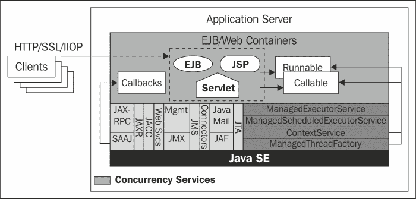
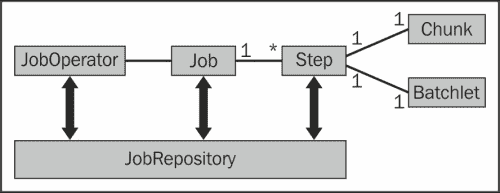

# 第二章 新规范

本章将仅讨论在 Java EE 7 中添加的新规范。具体来说，我们将介绍并展示如何使用以下 API：

+   Java EE 1.0 并发工具

+   Java 平台 1.0 批处理应用程序

+   Java API for JSON Processing 1.0

+   Java API for WebSocket 1.0

# Java EE 1.0 并发工具

Java EE 1.0 并发工具是在 JSR 236 下开发的。本节仅为您提供一个 API 的概述。完整的文档规范（更多信息）可以从[`jcp.org/aboutJava/communityprocess/final/jsr236/index.html`](http://jcp.org/aboutJava/communityprocess/final/jsr236/index.html)下载。

## 为什么需要并发？

在计算机科学中，**并发**是指一个应用程序或系统执行多个任务的能力。在多任务系统出现之前，计算机一次只能运行一个进程。当时，程序不仅难以设计，而且它们是从头到尾顺序执行的，当机器运行一个可以访问外围设备的程序时，正在运行的程序首先被中断以允许读取外围设备。

### 并发的益处

多任务操作系统的开发使得在机器内同时执行多个进程（运行程序的实例）和进程内的多个线程（也称为轻量级进程；它们是可以在彼此之间并发运行的进程的子集）成为可能。由于这一进步，现在可以同时运行多个应用程序，例如，在写文本文档的同时听音乐和下载文档。

在企业应用程序中，通过在线程中异步运行重处理，并发可以提高程序的交互性。它还可以通过将大任务分解成许多小单元，这些单元将由许多线程同时执行，来提高应用程序的响应时间。

### 并发的风险

尽管每个线程都有其适当的执行栈，但多个线程共享相同资源或相互依赖的情况非常普遍。在这种情况下，缺乏良好的同步会使线程行为不可预测，并可能降低系统性能。例如，相互关联的线程缺乏协调可能导致死锁和无限中断处理。

## 并发与 Java EE

正如我们之前所看到的，线程的误用可能对应用程序产生灾难性的后果。在容器的情况下，它不仅可能损害其完整性，而且可能未能充分利用提供给其他组件的资源。这也是为什么开发者不允许在容器中创建线程的原因之一。

为了在 Java EE 组件中实现并发，Java EE 7 平台集成了并发实用工具。使用此 API，Java EE 服务器可以了解线程使用的资源，并为它们提供良好的执行上下文。此外，它允许服务器管理线程池和生命周期。

## Java EE 并发 API

Java EE 1.0 并发实用工具的开发目标是以下内容：

+   提供一个简单且灵活的并发 API 给 Java EE 平台，同时不损害容器

+   通过提供一致性，促进从 Java SE 迁移到 Java EE

+   允许实现常见的和高级并发模式

并发实用工具是在 Java SE 下 JSR-166 开发的并发实用工具 API 之上构建的（这有助于从 Java SE 迁移到 Java EE）。它提供了四个主要的编程接口，其实例必须作为容器管理的对象提供给应用程序组件。提供的接口有：`ContextService`、`ManagedExecutorService`、`ManagedScheduledExecutorService`和`ManagedThreadFactory`。所有这些接口都包含在`javax.enterprise.concurrent`包中。

这四个接口可以这样解释：

+   **托管执行服务**：`ManagedExecutorService`接口扩展了`java.util.concurrent.ExecutorService`接口。它允许我们提交一个将在由容器创建和管理的单独线程上运行的异步任务。默认情况下，任何符合 Java EE 7 规范的服务器都必须提供一个`ManagedScheduledExecutorService`，可以通过**JNDI**名称`java:comp/DefaultManagedScheduledExecutorService`访问。但是，如果您想创建自己的，您必须首先在`web.xml`文件中声明`ManagedExecutorService`资源环境引用，对于 Web 应用程序或`ejb-jar.xml`中的 EJB 模块。规范建议将所有`ManagedExecutorService`资源环境引用组织在`java:comp/env/concurrent`子上下文中。

    +   以下配置是一个`ManagedExecutorService`资源环境引用的示例声明：

        ```java
        	<resource-env-ref>
        	  <resource-env-ref-name>
        	    concurrent/ReportGenerator
        	  </resource-env-ref-name>
        	  <resource-env-ref-type>
        	    javax.enterprise.concurrent.ManagedExecutorService
        	  </resource-env-ref-type>
        	</resource-env-ref>
        ```

        ### 提示

        **下载示例代码**

        您可以从您在[`www.packtpub.com`](http://www.packtpub.com)的账户下载您购买的所有 Packt 书籍的示例代码文件。如果您在其他地方购买了这本书，您可以访问[`www.packtpub.com/support`](http://www.packtpub.com/support)并注册，以便将文件直接通过电子邮件发送给您。

    +   在声明 JNDI 引用之后，您可以使用`@Resource`注解将其注入，如下面的代码所示：

        ```java
        	@Resource(name="concurrent/ReportGenerator")
        	ManagedExecutorService reportGenerator;
        ```

    +   提交给容器的任务必须实现`java.lang.Runnable`或`java.util.concurrent.Callable`接口。这两个接口之间的区别在下面的表格中展示：

        | Runnable | Callable |
        | --- | --- |
        | 自 JDK 1.0.0 以来。 | 自 JDK 5.0 以来。 |
        | 它具有 `run()` 方法来定义任务。 | 它具有 `Callable<V>` 实例的 `call()` 方法来定义任务。 |
        | 它具有 `run()` 方法来定义任务。 | 它具有 `Callable<V>` 实例的 `call()` 方法来定义任务。 |
        | `run()` 方法不能抛出受检异常。 | `call()` 方法可以抛出受检异常。 |

    +   以下代码演示了如何定义一个将异步运行报告的任务。

        ```java
        	public class ReportGeneratorTask implements Callable<String>{

        	  @Override
        	  public String call() throws Exception {
        	    //generate report
        	    return "The report was generated successfully";
        	  }   
        	}
        ```

    +   以下代码展示了如何提交任务。我们可以看到，`ManagedExecutorService` 实例的 `submit()` 方法返回一个 `Future` 类型的对象，当任务可用时，将返回运行任务的结果：

        ```java
        	Future<String> monitor = reportGenerator
        	.submit(new ReportGeneratorTask());
        	String result = monitor.get();         
        ```

+   **托管定时执行服务接口：** `ManagedScheduledExecutorService` 接口扩展了 `ManagedExecutorService` 和 `java.util.concurrent.ScheduledExecutorService` 接口，以便在特定时间执行任务。

    +   此接口的实例定义方式与 `ManagedExecutorService` 接口相同。以下代码演示了如何在提交后 10 秒执行任务：

        ```java
        	Future<String> monitor = reportGenerator
        	  .schedule(new ReportGeneratorTask(), 10,TimeUnit.SECONDS);
        ```

+   **托管线程工厂接口：** `ManagedThreadFactory` 接口提供在容器中创建托管线程实例的方法。任务必须实现 `java.lang.Runnable` 接口。以下代码演示了如何创建和运行一个容器管理的线程。

    ```java
    Thread myThread = threadFactory.newThread(new ReportManagedThread()); 
    myThread.start();
    ```

+   **上下文服务接口：** 此接口允许在不使用 `ManagedExecutorService` 或 `ManagedScheduledExecutorService` 接口的情况下创建上下文对象，正如我们在之前的案例中所做的那样，目的是为了允许扩展 Java EE 平台的并发能力。具体来说，使用此接口，您可以在容器内创建工作流系统或使用定制的 Java SE 平台 `ExecutorService` 实现。例如，如果您希望使用 Java SE 中 `java.util.concurrent.ThreadPoolExecutor` 类提供的池管理机制来管理 Java EE 组件上下文中的线程，您只需将 `ManagedThreadFactory`、`ExecutorService` 和 `ContextService` 对象组合起来即可。结果如下所示：

    ```java
    public class ReportCustomizedThread implements Runnable {

      public void run() {
        //Report processing ...
      }
    }

    @Resource(name=»concurrent/ReportManagedThreadGenerator»)
    ManagedThreadFactory threadFactory;

    @Resource(name=»concurrent/ReportContextServiceGenerator»)
    ContextService contextService; 

    ReportCustomizedThread reportThread = new ReportCustomizedThread();
    Runnable proxy =contextService.createContextualProxy(reportThread,Runnable.class);
    ExecutorService executorService =Executors.newFixedThreadPool(20, threadFactory);
    Future result = executorService.submit(proxy);
    //...
    ```

这可能是使用此功能的一个简单示例。对于更高级的示例，请参阅 *上下文服务* 部分的规范文档。

以下图表提供了并发工具与其他 Java EE 平台元素之间关系的概述：



此外，还可以优化不同资源的配置以获得更好的性能（详细信息请参阅规范文档），Java EE 1.0 的并发工具还提供了许多其他接口，如 `ManagedTaskListener`，可用于监控任务 `Future` 对象的状态。

# Java 平台 1.0 的批处理应用程序

Java 平台 1.0 的批处理应用程序 API 是在 JSR 352 下开发的。本节仅为你提供一个 API 的概述。完整的文档规范（更多信息）可以从[`jcp.org/aboutJava/communityprocess/final/jsr352/index.html`](http://jcp.org/aboutJava/communityprocess/final/jsr352/index.html)下载。

## 什么是批处理？

根据剑桥高级学习者词典，批处理是一组同时处理或被认为类型相似的事物或人。过程是一系列你为了达到某个结果而采取的行动。基于这两个定义，我们可以这样说，**批处理**是为了达到某个结果而在大量数据上重复执行的一系列操作。鉴于它必须处理的大量数据，批处理通常用于日终、月终、期终和年终处理。

以下是一些你可以使用批处理的领域简短列表：

+   从/到 XML 或 CSV 文件的数据导入/导出

+   会计处理，如合并

+   **ETL**（**提取-转换-加载**）在数据仓库中

+   数字文件处理（下载、处理或保存）

+   通知服务的订阅者（如论坛、群组等）

## 为什么需要一个专门的批处理 API？

在对批处理有了大致了解之后，有些人可能会问自己：为什么不直接设置一个`foreach`循环来启动多个线程呢？首先，你必须知道批处理并不仅仅关注执行速度。实际上，处理大量数据常常会受到许多异常的影响，这可能会产生许多担忧：在出现异常的情况下应该采取什么行动？我们应该因为任何异常而取消整个流程吗？如果不是，应该取消哪些操作？针对哪种类型的异常？如果你只需要取消一定数量的交易，你如何识别它们？在批处理结束时，了解有多少处理被取消总是很重要的。有多少被成功注册？有多少被忽略？

正如你所见，我们还没有完成识别批处理可能引发的问题，但我们发现这已经足够多了。试图自己构建这样的工具可能会不仅使你的应用程序复杂化，还可能引入新的错误。

## 理解批处理 API

Java 平台 1.0 的批处理应用程序 API 是为了解决前面列表中列出的不同需求而开发的。它针对 Java SE 和 Java EE 应用程序，并需要至少 JVM 的第 6 个版本。

这个 API 提供的功能可以概括如下：

+   它原生地提供了**读取器-处理器-写入器**模式，并赋予你实现自己的批处理模式的能力。这允许你根据具体情况选择最佳的模式。

+   它提供了为每种类型的错误定义批处理行为（跳过、重试、回滚等）的可能性。

+   它支持许多步骤级度量，例如：`rollbackCount`、`readSkipCount`、`writeSkipCount`等，用于监控。

+   它可以被配置为并行运行一些进程，并提供使用 JTA 或`RESOURCE_LOCAL`事务模式的可能性。

为了做到这一点，Java 平台 1.0 的批处理应用程序 API 基于一个稳固的架构，可以通过以下图表来概述。一个**工作**由一个`JobOperator`管理，并有一个或多个步骤，这些步骤可以是**块**或**批处理单元**。在其生命周期内，关于一个工作的信息（元数据）存储在`JobRepository`中，如下面的图表所示：



### JobRepository

如我们之前所述，`JobRepository`存储有关当前和过去运行的工作的元数据。它可以通过`JobOperator`访问。

### 工作

一个**工作**可以被视为封装一个批处理单元的实体。它由一个或多个步骤组成，这些步骤必须在名为**工作配置文件**或**工作 XML**的 XML 文件中进行配置。该文件将包含工作识别信息以及构成工作的不同步骤。下面的代码展示了工作 XML 文件的骨架。

```java
<job id="inscription-validator-Job" version="1.0">  

  <step id="step1" >        
    ... 
  </step>    
  <step id="step2" >        
    ...   
  </step>
</job>
```

工作 XML 文件按照约定命名为`<name>.xml`（例如，`inscriptionJob.xml`），并且应该存储在`META-INF/batch-jobs`目录下，以便于便携式应用程序。

### 步骤

**步骤**是批处理的一个自主阶段。它包含定义和控制一个批处理片段所需的所有必要信息。批处理步骤要么是块要么是批处理单元（两者互斥）。以下代码的步骤是一个块类型步骤：

```java
<job id="inscription-validator-Job" version="1.0">
  <step id="validate-notify" >        
    <chunk>
       <reader ref="InscriptionReader" />
       <processor ref="InscriptionProcessor" />
       <writer ref="StudentNotifier" />
    </chunk>     
  </step>    
</job>
```

### 块

**块**是一种实现读取-处理-写入模式的步骤类型。它在可配置的事务范围内运行，并且可以接收许多配置值。以下代码是前面代码中显示的**inscription-validator-Job**的更完善版本。在这个列表中，我们添加了一个配置来定义将用于管理块提交行为的单元元素（`checkpoint-policy="item"`），以及一个配置来定义在提交之前要处理的项目（单元元素）数量（`item-count="15"`）。我们还指定了如果块抛出任何配置的可跳过的异常，步骤将跳过的异常数量（`skip-limit="30"`）。

以下代码是一个具有一些配置的块类型步骤示例：

```java
<job id="inscription-validator-Job" version="1.0" 
  >   
  <step id="validate-notify" >        
    <chunk item-count="15" checkpoint-policy="item" 
      skip-limit="30">
      <reader ref="InscriptionReader" />
      <processor ref="InscriptionProcessor" />
      <writer ref="StudentNotifier" />
    </chunk>     
  </step>    
</job>
```

以下代码展示了块批处理批件实现的样子。`InscriptionCheckpoint`允许您知道正在处理哪一行。本节的源代码是一个验证程序，向候选人发送消息，让他们知道是否被接受。最后，它在网页上显示监控信息。处理是通过`ChunkStepBatchProcessing.java` Servlet 启动的。

以下代码是块批处理批件实现框架的示例：

```java
public class InscriptionReader extends AbstractItemReader {
  @Override
  public Object readItem() throws Exception {
    //Read data and return the item
  }
}

public class InscriptionProcessor implements ItemProcessor{
  @Override
  public Object processItem(Object o) throws Exception {
    //Receive item from the reader, process and return the result
  }    
}

public class StudentNotifier extends AbstractItemWriter {
  @Override
  public void writeItems(List<Object> items) throws Exception {
    //Receive items from the processor then write it out
  }
}
public class InscriptionCheckpoint implements Serializable {
  private int lineNumber;

  public void incrementLineNumber(){
    lineNumber++;
  }

  public int getLineNumber() {
    return lineNumber;
  }        
}
```

### 批处理步骤

**批处理步骤**是实现您自己的批处理模式的一种步骤类型。与执行三个阶段（读取、处理和写入）的任务的块不同，批处理步骤只被调用一次，并在处理结束时返回一个退出状态。以下代码展示了批处理批件实现的样子。本节的源代码向所有学生发送信息消息，并显示有关批处理的一些重要信息。处理是通过`BatchletStepBatchProcessing.java` Servlet 启动的。

以下代码是批处理批件实现框架的示例：

```java
public class StudentInformation extends AbstractBatchlet{

  @Override
  public String process() throws Exception {
    // process 
    return "COMPLETED";
  }    
}
```

## 批处理.xml 配置文件

`batch.xml`文件是一个包含批处理应用程序批处理批件的 XML 文件。它建立了批处理批件实现与在作业 XML 文件中使用的参考名称之间的对应关系。`batch.xml`文件必须存储在`META-INF`目录中，以便于便携式应用程序。以下代码给出了前面代码中显示的`inscription-validator-Job`作业的`batch.xml`文件内容。

以下代码是`batch.xml`的一个示例：

```java
<batch-artifacts > 
  <ref id="InscriptionReader" 
  class="com.packt.ch02.batchprocessing.chunk.InscriptionReader" /> 
  <ref id="StudentNotifier" 
  class="com.packt.ch02.batchprocessing.chunk.StudentNotifier" /> 
  <ref id="InscriptionProcessor" 
  class="com.packt.ch02.batchprocessing.chunk.InscriptionProcessor" /> 
</batch-artifacts>
```

## 任务操作员

`JobOperator`实例可以通过`BatchRuntime`类的`getJobOperator()`方法访问。它提供了一组操作来管理（`启动`、`停止`、`重启`等）作业并访问`JobRepository`（`getJobNames`、`getJobInstances`、`getStepExecutions`等）。以下代码展示了如何在没有特定属性的情况下启动前面显示的`inscription-validator-Job`作业。重要的是要注意，在`JobOperator.start`命令中指定的`inscriptionJob`值是作业 XML 文件的名称（而不是作业的 ID）。在 Servlet `ChunkStepBatchProcessing`中，您将看到如何检索状态以及如何从`JobOperator`实例监控批处理信息。

以下代码是启动作业的示例代码：

```java
JobOperator jobOperator = BatchRuntime.getJobOperator();
if(jobOperator != null)
  jobOperator.start("inscriptionJob", null);
```

# Java API for JSON Processing 1.0

Java API for JSON Processing 1.0 是在 JSR 353 下开发的。本节仅为您提供了 API 的概述。完整的文档规范（更多信息）可以从[`jcp.org/aboutJava/communityprocess/final/jsr353/index.html`](http://jcp.org/aboutJava/communityprocess/final/jsr353/index.html)下载。

## 什么是 JSON？

**JavaScript 对象表示法**（**JSON**）是一种轻量级的数据交换文本格式。它基于 JavaScript 的一个子集，但它完全与语言无关。JSON 格式常用于客户端和服务器或 Web 服务之间的数据交换。但是，当您需要存储或传输相对较小的数据，这些数据可以轻松地表示为键值对组合时，它也可以使用。

JSON 是基于两种结构构建的，这两种结构是：一组键值对集合和有序值列表。这些结构由三种数据类型组成：`对象`、`数组`和`值`。

### 对象

**对象**是无序的 `name:value` 对集合，用花括号（`{}`）括起来。每个名称后面都有一个冒号（`:`），名称值对用逗号（`,`）分隔。名称是 `字符串` 类型，而值的类型可以是 `字符串`、`对象` 等等。以下文本给出了一个 JSON 对象的示例，其中包含有关学生的某些信息：

```java
{"name":"Malinda","gender":"F","birthday":"14/03/1976","weight":78.5}
```

### 数组

**数组**是有序值集合，值之间用逗号（`,`）分隔，并用方括号（`[]`）括起来。以下文本给出了一个 JSON 数组的示例，其中包含按字母顺序排列的学生及其分数列表。

```java
[{"name":"Amanda","score"=12.9},{"name":"Paolo","score"=14},{"name":"Zambo","score"=12.3}]
```

#### 值

JSON 的 **值** 可以是双引号中的 `字符串`，`布尔` 值 `true` 或 `false`，`对象`、`数组` 或 `null`。

### 为什么选择 JSON？

**XML**（**可扩展标记语言**，**Extensible Markup Language**）在**SGML**（**标准化通用标记语言**，它功能强大且可扩展，但复杂）和**HTML**（**超文本标记语言**，SGML 的简单版本，专注于数据展示）之后发布，以克服这两种语言的不足。它的强大、灵活和简单使其在许多应用中受到青睐，如配置管理、存储、数据传输等。随着**AJAX**技术的出现，XML 在浏览器和 Web 服务器之间的交换中得到了广泛应用。但是，它也带来了一些限制：由于信息重复、加载和处理数据复杂，XML 文档在本质上较重，有时处理 XML 文档还依赖于浏览器。

为了解决这些问题，JSON 格式被开发出来作为 XML 的替代品。实际上，尽管 JSON 具有可移植性和灵活性，但它不支持命名空间，数据访问需要了解文档，并且到目前为止，还没有 **XSD** 或 **DTD** 来验证文档的结构。

以下表格展示了 XML 和 JSON 数据展示之间的简单比较：

| XML 数据展示 | JSON 数据展示 |
| --- | --- |

|

```java
<student>
  <id>854963</id>
  <name>LouisPoyer</name>
  <weight>78.6</weight>
  <gender>M</gender>
  <contact>
    <address>Rue9632</address>
    <phone>985-761-0</phone>
  </contact>   
</student>
```

|

```java
{"student": {
  "id":"854963", 
  "name":"LouisPoyer", 
  "weight":78.6,
  "gender":"M",
  "contact":[
    {"address":"Rue632"},
    {"phone":"985-761-0"} ]
  }  
}
```

|

### Java JSON 处理 API

Java JSON 处理 API 定义了一个 API，通过使用流式 API 或对象模型 API 来处理（解析、生成、转换和查询）JSON 文档。

#### 流式 API

**流式 API**是针对 JSON 的，就像**StAX API**是针对 XML 的。换句话说，流式 API 是一种基于事件的 JSON 解析。它按顺序解析 JSON 文件，并在遇到流中的新标签时触发事件（新的值字符串、新的对象开始、对象结束、新的数组开始……）。下面的示例展示了如何获取上一页上展示的 JSON 数据中的联系信息。

使用流式 API 处理 JSON 的示例：

```java
public String getStudentContact(String jsonData) {
  JsonParser parser = Json.createParser(new StringReader(jsonData));
  Event event = null;
  boolean found = false;
  String information = "";

  //Advance to the contact key
  while (parser.hasNext()) {
    event = parser.next();            
    if ((event == Event.KEY_NAME) && 
      "contact".equals(parser.getString())) {
        found = true;
        event = parser.next();              
        break;
      }
    }

    if (!found) {
      return "contact information does not exist";
    }

    //get contact information 
    while (event != Event.END_ARRAY) {         
    switch (event) {
      case KEY_NAME:
        information += parser.getString() + " = ";
        break;
      case START_ARRAY: break;
      case END_ARRAY: break;
      case VALUE_FALSE: break;
      case VALUE_NULL: break;
      case VALUE_NUMBER:
        if (parser.isIntegralNumber()) {
          information += parser.getLong()+", ";
        } else {
          information += parser.getBigDecimal()+", ";
        }
        break;
      case VALUE_STRING:
        information += parser.getString()+", ";
        break;
      case VALUE_TRUE:
        information += " TRUE, ";
        break;
    }
    event = parser.next();
  }
  return information;
}
```

流式 API 由五个接口、一个枚举类和两个异常组成。所有这些都在`javax.json.stream`包中。在这些接口中，我们有`JsonParser`接口，它包含用于逐步只读访问 JSON 数据的方法，以及`JsonGenerator`接口，它提供逐步生成（写入）JSON 的方法。这些接口的实例可以通过`JsonParserFactory`和`JsonGeneratorFactory`工厂分别创建。流式 API 触发的事件都包含在`JsonParser.Event`枚举类中。

建议使用流式 API 来解析大型 JSON 文件，因为与对象模型 API 不同，它不需要在处理之前加载整个文件。这确保了良好的内存管理。

#### 对象模型 API

对象模型 API 是针对 JSON 的，就像 DOM API 是针对 XML 的。这意味着它在内存中将 JSON 文档表示为树结构，在提供导航或查询文档的可能性之前。此 API 通过提供对任何数据的随机访问，提供了解析 JSON 文档的最灵活方式。但作为交换，它需要更多的内存。这就是为什么它不适合大型文档。

对象模型 API 由十三个接口、一个类、一个枚举类和一个异常组成。所有这些都在`javax.json`包中。在接口中，我们有`JsonArrayBuilder`和`JsonObjectBuilder`，分别用于从头开始构建 JSON 数组和 JSON 对象；`JsonArray`用于将 JSON 数组的有序值作为列表访问，`JsonObject`用于将 JSON 对象的值作为 Map 访问，以及`JsonBuilderFactory`用于创建`JsonObjectBuilder`或`JsonArrayBuilder`实例；`JsonReader`用于从输入源读取 JSON，`JsonReaderFactory`用于创建`JsonReader`实例；`JsonWriter`用于将 JSON 写入输出源，以及`JsonWriterFactory`用于创建`JsonWriter`实例。以下代码演示了如何从头创建对象模型并访问其中的数据。

以下代码是使用对象模型 API 处理 JSON 的示例：

```java
JsonObject objModel = Json.createObjectBuilder()
.add("student",Json.createObjectBuilder()
  .add("id", "854963")
  .add("name", "Louis Poyer")
  .add("weight", 78.6)
  .add("gender","M")
  .add("contact",Json.createArrayBuilder()
    .add(Json.createObjectBuilder()
    .add("address","Rue 632"))
    .add(Json.createObjectBuilder()
    .add("phone","985-761-0")))                        
).build();

JsonObject student = objModel.getJsonObject("student");
String name = student.getString("name");
JsonArray contact = student.getJsonArray("contact");
String address = contact.getJsonObject(0).getString("address");
String phone = contact.getJsonObject(1).getString("phone"));
```

# Java API for WebSocket 1.0

Java API for WebSocket 1.0 是在 JSR 356 下开发的。本节仅为您提供一个 API 的概述。完整的文档规范（更多信息）可以从[`jcp.org/aboutJava/communityprocess/final/jsr356/index.html`](http://jcp.org/aboutJava/communityprocess/final/jsr356/index.html)下载。

## 什么是 WebSocket？

在 HTML5 规范的先前版本中最初被称为**TCPConnection**，**WebSocket**是一个建立在**TCP**（**传输控制协议**）之上的独立协议，它使得客户端和服务器之间能够进行双向和全双工通信。

在 Web 应用程序中打开 WebSocket 连接时，Web 客户端使用 HTTP 请求请求服务器将连接升级为 WebSocket 连接。如果服务器支持并接受 WebSocket 协议连接请求，它将通过 HTTP 返回响应。从那一刻起，通信就建立了，双方可以通过仅使用 WebSocket 协议来发送和接收数据。

## 为什么选择 WebSocket？

现在，许多 Web 应用程序（即时通讯、交易平台、一些电子商务平台、在线游戏等）需要在客户端（浏览器）和服务器之间进行实时通信。如果您不知道，HTTP 协议是一个无状态的半双工协议。这意味着，为了访问新信息和更新网页，客户端必须始终打开到服务器的连接，发送请求，等待服务器响应，然后关闭连接。因此，在实时环境中，客户端将频繁地向服务器发送请求，以检测新数据的出现，并且即使没有新信息，也会进行许多请求-响应操作。

为了解决这个问题，已经提出了许多解决方案。其中最有效的方法无疑是长轮询，它可以这样描述：客户端向服务器发送请求；如果服务器有数据可用，则服务器响应。否则，它将等待直到有新信息出现后再响应。在收到响应后，客户端发送另一个请求，如此循环。尽管看起来不错，但这种技术需要专有解决方案（彗星），并且当数据频繁更新时，循环连接-请求-响应-断开连接可能会对网络产生负面影响。

WebSocket 不是基于 HTTP 的技术，它是一个提供了一种新的、更好的方式来克服 Web 客户端和 Web 服务器/服务之间实时通信中 HTTP 协议的不足的协议。

## WebSocket API

Java API for WebSocket 1.0 定义了一个标准 API，用于在 Java EE 平台上构建 WebSocket 驱动的应用程序。

一个 WebSocket 应用程序由两种类型的组件组成，称为端点：客户端端点和服务器端点。客户端端点是发起 WebSocket 连接的组件，而服务器端点则是等待连接。使用 Java API for WebSocket 1.0，这两种组件类型可以通过使用注解以编程方式或声明方式创建。在本章中，我们只将在一个小型学生聊天室应用程序中看到注解端点。

### 服务器端点

以下代码演示了如何创建一个 WebSocket 端点，该端点能够接受客户端连接并发送消息：

```java
@ServerEndpoint("/chatserver")
public class ChatServerEndPoint {    
  @OnOpen
  public void openConnection(Session session) throws Exception {
    //...
  }

  @OnMessage
  public void onMessage(Session session, String msg)throws Exception {
    //...
  }

  @OnClose
  public void closeConnection(Session session) throws Exception {
    //...
  }
}
```

`@ServerEndpoint` 注解定义了一个服务器类型端点以及它将被部署的路径。你也会注意到 API 提供了注解来描述端点生命周期中每个步骤要执行的方法。下表列出了 WebSocket 端点生命周期注解的列表及其作用。

下表列出了 WebSocket 端点生命周期注解：

| 注解 | 作用 |
| --- | --- |
| `@OnOpen` | 在连接打开时执行的方法 |
| `@OnMessage` | 在接收到消息时执行的方法 |
| `@OnError` | 在发生连接错误时执行的方法 |
| `@OnClose` | 在连接关闭时执行的方法 |

任何由 WebSocket 客户端发送的消息都会被`onMessage()`方法拦截，该方法接收客户端会话和消息作为参数（有关可以接受的其它参数，请参阅规范）。消息可以通过`Session.getBasicRemote()`方法同步发送，或者通过`Session.getAsyncRemote()`方法异步发送。这些方法中的每一个都用于发送类型为：`text`、`binary`、`object`、`ping`和`pong`帧的消息。以下代码演示了如何向所有已连接客户端发送文本消息：

```java
static Set<Session> users = Collections.synchronizedSet(new HashSet());

  @OnOpen
  public void openConnection(Session session) throws Exception {
    users.add(session);        
  }

  @OnMessage
  public void onMessage(Session session, String msg)throws Exception {
    for (Session s : users) {
      s.getBasicRemote().sendText(msg);
    }
  }
```

会话对象包含一个变量用于存储一些用户特定的信息。下面的代码演示了如何通过每次发送消息的人的名字与许多客户进行通信：

```java
//...
static Set<String> usersId = Collections.synchronizedSet(new HashSet());
//...

@OnMessage
  public void onMessage(Session session, String msg)throws Exception {
    if (msg.startsWith("ID")) {//if it is a connection message
      String id = msg.split("-")[1];
      session.getUserProperties().put("id", id);
      //save the ID of the user
      usersId.add(id);
      //add the ID in the list of connected users
      Object[] obj1 = new Object[]{"wel","Welcome to the chat room "+id +"!"};
      String jsonString = getJsonObject(obj1);
      //json message transformation
      //send a welcome message to the new user
      session.getBasicRemote().sendText(jsonString);
      //send the list of connected users to all users
      Object[] obj2 = new Object[]{"users",usersId};
      jsonString = getJsonObject(obj2);
      for (Session s : users) {
        s.getBasicRemote().sendText(jsonString);
      }
    } else { //if it is a message to the chat room
      //get ID of the user who sends message
      String id = (String) session.getUserProperties().get("id");
      Object[] obj = new Object[]{"msg",id + ">>" + msg.split("-")[1]};
      String jsonString = getJsonObject(obj);//json transformation
      //sends the message to all connected users
      for (Session s : users) {
        s.getBasicRemote().sendText(jsonString);
      }
    }
  }
```

### 客户端端点

我们的客户端 WebSocket 端点是基于 JavaScript 代码的`.jsp`网页（`websocketChatClient.jsp`）。正如你所见，客户端具有相同的生命周期方法，通过 JSON 的力量，我们可以轻松访问并显示服务器发送的消息。

以下代码是一个 Web 客户端 WebSocket 端点的示例：

```java
//complete URI of the chat server endpoint
var clientUri = "ws://"+document.location.host+"/chapter02NewSpecifications/chatserver";
var wsocket;

//connection request when loading the web page
window.addEventListener("load", connect, false);

//Connection method
function connect() {
  wsocket = new WebSocket(clientUri);
  //binding of the websocket lifecycle methods
  wsocket.onmessage = onMessage;
  wsocket.onerror = onError;
}

function joinChatRoom() {//method to join the chat room
    wsocket.send("ID-" + txtMessage.value);
}

function sendMessage() {//method to send a message to the chat room
    wsocket.send("M-" + txtMessage.value);
}

function onMessage(event) {//method to perform incoming messages
  var parsedJSON = eval('(' + event.data + ')');
  if (parsedJSON.wel != null) {//if welcome message
    userState.innerHTML = parsedJSON.wel;
  }
  if (parsedJSON.msg != null) {//if chat room message
    userMessage.innerHTML += "\n"+parsedJSON.msg;
  }
  if (parsedJSON.users.length > 0) {//if new new connection user
    userId.innerHTML = "";
    for (i = 0; i < parsedJSON.users.length; i++) {
      userId.innerHTML += i + "-" + parsedJSON.users[i] + "\n";
    }
  }
}
```

# 摘要

在本章中，我们试图展示 Java EE 7 新规范的有用性和实现。在接下来的章节中，我们将分析继承自 Java EE 6 的规范所进行的改进，并利用这个机会展示如何将新规范与现有规范集成。
