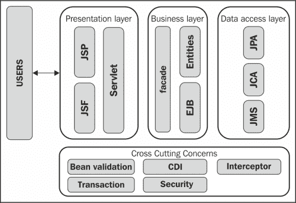
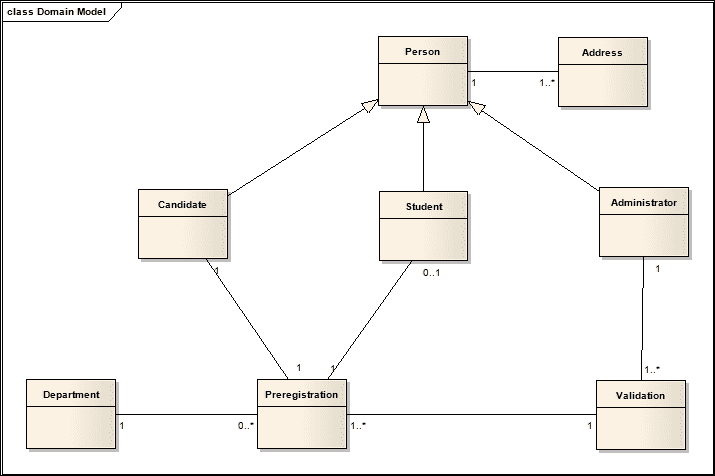
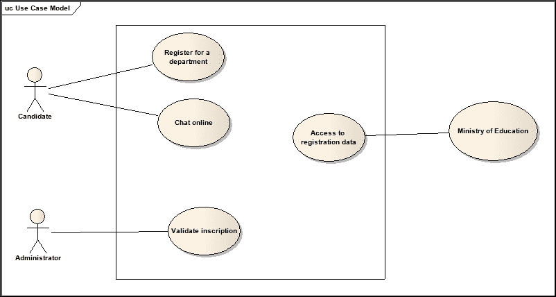
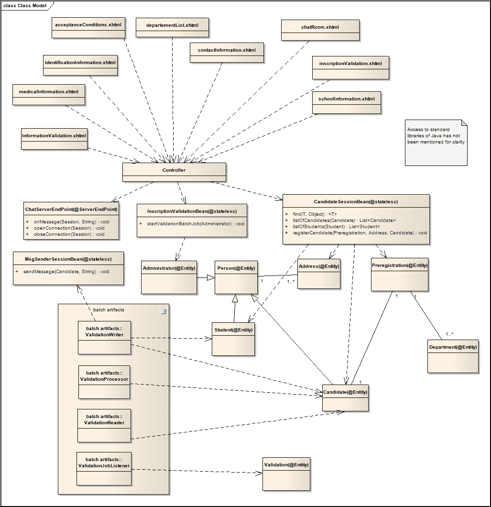
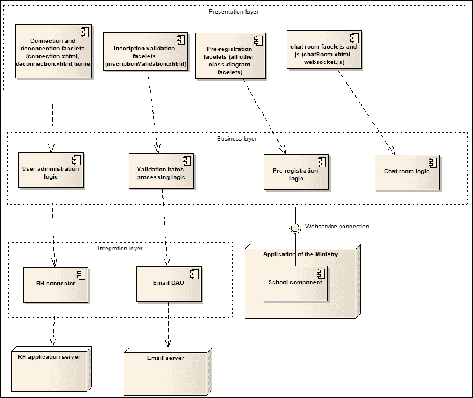

# 第五章：业务层

在这里，我们将从业务层的改进开始介绍，然后在一个小型项目中尝试将之前看到的某些规范组合起来。将要涉及的主题包括：

+   企业 JavaBeans 3.2

+   将所有 Java EE 7 规范合并在一起

# 企业 JavaBeans 3.2

企业 JavaBeans 3.2 规范是在 JSR 345 下开发的。本节仅为您概述 API 的改进。完整的文档规范（更多信息）可以从 [`jcp.org/aboutJava/communityprocess/final/jsr345/index.html`](http://jcp.org/aboutJava/communityprocess/final/jsr345/index.html) 下载。

应用程序的业务层位于表示层和数据访问层之间。以下图展示了简化的 Java EE 架构。正如您所看到的，业务层充当数据访问和表示层之间的桥梁。



它实现了应用程序的业务逻辑。为此，它可以使用一些规范，如 Bean Validation 用于数据验证，CDI 用于上下文和依赖注入，拦截器用于拦截处理等。由于此层可以位于网络中的任何位置，并且预期为多个用户服务，因此它需要最小限度的非功能性服务，如安全、事务、并发和远程访问管理。通过 EJB，Java EE 平台为开发者提供了在不担心不同必需的非功能性服务的情况下实现此层的机会。

通常，本规范不会引入任何新的主要功能。它继续上一版本开始的工作，将某些已过时的功能的实现变为可选，并对其他功能进行轻微修改。

## 修剪一些功能

在 Java EE 6 引入的移除过时功能的修剪过程之后，Java EE 7 平台对某些功能的支持已变为可选，其描述已移至另一份名为 *EJB 3.2 可选功能评估* 的文档中。涉及此迁移的功能包括：

+   EJB 2.1 及更早版本实体 Bean 组件合约，用于容器管理持久性

+   EJB 2.1 及更早版本实体 Bean 组件合约，用于 Bean 管理持久性

+   EJB 2.1 及更早版本实体 Bean 的客户端视图

+   EJB QL：容器管理持久性查询方法的查询语言

+   基于 JAX-RPC 的 Web 服务端点

+   JAX-RPC Web 服务客户端视图

## EJB 3.2 的最新改进

对于那些必须使用 EJB 3.0 和 EJB 3.1 的人来说，你会注意到 EJB 3.2 实际上只对规范进行了微小的修改。然而，一些改进不容忽视，因为它们提高了应用程序的可测试性，简化了会话 bean 或消息驱动 bean 的开发，并提高了对事务和有状态 bean 钝化管理控制的改进。

### 会话 bean 增强

会话 bean 是一种 EJB 类型，允许我们实现可被本地、远程或 Web 服务客户端视图访问的业务逻辑。会话 bean 有三种类型：**无状态**用于无状态处理，**有状态**用于需要在不同方法调用之间保持状态的过程，以及**单例**用于在不同客户端之间共享一个对象的单个实例。

以下代码展示了保存实体到数据库的无状态会话 bean 的示例：

```java
@Stateless
public class ExampleOfSessionBean  {

    @PersistenceContext EntityManager em;

    public void persistEntity(Object entity){
        em.persist(entity);
    }
}
```

讨论会话 bean 的改进时，我们首先注意到有状态会话 bean 中的两个变化：在用户定义的事务上下文中执行生命周期回调拦截器方法的能力，以及手动禁用有状态会话 bean 钝化的能力。

可以定义一个必须根据 EJB bean 的生命周期（构造后、销毁前）执行的过程。由于`@TransactionAttribute`注解，你可以在这些阶段执行与数据库相关的过程，并控制它们对系统的影响。以下代码在初始化后检索一个实体，并确保在 bean 销毁时将持久上下文中所做的所有更改发送到数据库。正如你在以下代码中所看到的，`init()`方法的`TransactionAttributeType`是`NOT_SUPPORTED`；这意味着检索到的实体将不会包含在持久上下文中，对其所做的任何更改也不会保存到数据库中：

```java
@Stateful
public class StatefulBeanNewFeatures  {

    @PersistenceContext(type= PersistenceContextType.EXTENDED)
    EntityManager em;

    @TransactionAttribute(TransactionAttributeType.NOT_SUPPORTED)
    @PostConstruct
    public void init(){
         entity = em.find(...);
    }

    @TransactionAttribute(TransactionAttributeType.REQUIRES_NEW)
    @PreDestroy
    public void destroy(){
        em.flush();
    }
}
```

以下代码演示了如何控制有状态 bean 的钝化。通常，在一段时间的不活跃后，会话 bean 会被从内存中移除并存储到磁盘上。这个过程需要数据序列化，但在序列化过程中，所有瞬态变量都会被跳过并恢复到其数据类型的默认值，对于对象来说是`null`，对于`int`来说是零等等。为了防止这种类型的数据丢失，你可以通过将`false`值传递给`@Stateful`注解的`passivationCapable`属性来简单地禁用有状态会话 bean 的钝化。

```java
@Stateful(passivationCapable = false)
public class StatefulBeanNewFeatures  {
   //...
}
```

为了简化，EJB 3.2 放宽了定义会话 bean 默认本地或远程业务接口的规则。以下代码展示了如何根据情况将一个简单的接口视为本地或远程：

```java
//In this example, yellow and green are local interfaces
public interface yellow { ... }
public interface green { ... }

@Stateless
public class Color implements yellow, green { ... }

//In this example, yellow and green are local interfaces
public interface yellow { ... }
public interface green { ... }

@Local
@Stateless
public class Color implements yellow, green { ... }

//In this example, yellow and green are remote interfaces
public interface yellow { ... }
public interface green { ... }

@Remote
@Stateless
public class Color implements yellow, green { ... }

//In this example, only the yellow interface is exposed as a remote interface
@Remote
public interface yellow { ... }
public interface green { ... }

@Stateless
public class Color implements yellow, green { ... }

//In this example, only the yellow interface is exposed as a remote interface
public interface yellow { ... }
public interface green { ... }

@Remote(yellow.class)
@Stateless
public class Color implements yellow, green { ... }
```

### EJB Lite 改进

在 EJB 3.1 之前，实现一个 Java EE 应用程序需要使用一个包含超过二十个规范的完整 Java EE 服务器。这对于只需要某些规范的应用程序来说可能过于沉重（就像有人要求你用锤子打死一只苍蝇一样）。为了适应这种情况，JCP（Java 社区进程）引入了配置文件和 EJB Lite 的概念。具体来说，EJB Lite 是 EJB 的一个子集，它将本地事务性和安全处理的基本功能分组在一起。有了这个概念，现在可以在不使用 Java EE 服务器的情况下对 EJB 应用程序进行单元测试，同时也使得在 Web 应用程序或 Java SE 中有效地使用 EJB 成为可能。

除了 EJB 3.1 中已有的特性之外，EJB 3.2 规范增加了对本地异步会话 bean 调用和非持久 EJB 定时服务的支持。这丰富了可嵌入的`EJBContainer`、Web 配置文件，并增加了可测试的特性的数量。以下代码展示了包含两个方法的 EJB 打包在 WAR 存档中。`asynchronousMethod()`是一个异步方法，允许你比较客户端方法调用结束和服务器端方法执行结束之间的时间差。`nonPersistentEJBTimerService()`方法演示了如何定义一个每分钟执行一次的非持久 EJB 定时服务：

```java
@Stateless
public class EjbLiteSessionBean {

    @Asynchronous
    public void asynchronousMethod(){
        try{
          System.out.println("EjbLiteSessionBean - start : "+new Date());
          Thread.sleep(1000*10);
          System.out.println("EjbLiteSessionBean - end : "+new Date());        
        }catch(Exception ex){
            ex.printStackTrace();
        }
    }    

    @Schedule(persistent = false, minute = "*", hour = "1")
    public void nonPersistentEJBTimerService(){
        System.out.println("nonPersistentEJBTimerService method executed");
    }
}
```

### 对 TimerService API 所做的更改

EJB 3.2 规范通过一个名为`getAllTimers()`的新方法增强了`TimerService` API。此方法使你能够访问 EJB 模块中的所有活动定时器。以下代码演示了如何创建不同类型的定时器、访问它们的信息以及取消它们；它使用了`getAllTimers()`方法：

```java
@Stateless
public class ChangesInTimerAPI implements ChangesInTimerAPILocal {

    @Resource
    TimerService timerService;
    public void createTimer(){
        //create a programmatic timer
        long initialDuration = 1000*5;
        long intervalDuration = 1000*60;
        String timerInfo = "PROGRAMMATIC TIMER";
        timerService.createTimer(initialDuration, intervalDuration, timerInfo);
    }

    @Timeout
    public void timerMethodForProgrammaticTimer(){
        System.out.println("ChangesInTimerAPI - programmatic timer : "+new Date());
    }

    @Schedule(info = "AUTOMATIC TIMER", hour = "*", minute = "*")
    public void automaticTimer(){
        System.out.println("ChangesInTimerAPI - automatic timer : "+new Date());
    }

    public void getListOfAllTimers(){
        Collection<Timer> alltimers = timerService.getAllTimers();

        for(Timer timer : alltimers){            
            System.out.println("The next time out : "+timer.getNextTimeout()+", "
                    + " timer info : "+timer.getInfo());
            timer.cancel();            
        }
    }
}
```

除了这种方法之外，规范还移除了仅允许在 bean 内部使用`javax.ejb.Timer`和`javax.ejb.TimerHandlereferences`的限制。

### 与 JMS 的新特性相协调

**消息驱动 Bean**（**MDB**）是一种 JMS 消息监听器，允许 Java EE 应用程序异步处理消息。要定义这样的 bean，只需用`@MessageDriven`注解装饰一个简单的 POJO 类，并使其实现`javax.jms.MessageListener`接口。该接口使 MDB 可用`onMessage`方法，该方法将在与 bean 关联的队列中发布新消息时被调用。这就是为什么你必须在其中放置处理传入消息的业务逻辑。以下代码给出了一个 MDB 的示例，该示例通过在控制台写入来通知你新消息的到达：

```java
@MessageDriven(activationConfig = {
    @ActivationConfigProperty(propertyName = "destinationType", 
                               propertyValue = "javax.jms.Queue"),
    @ActivationConfigProperty(propertyName = "destinationLookup", 
                              propertyValue = "jms/messageQueue")
})
public class MessageBeanExample implements MessageListener {

    public MessageBeanExample() {
    }

    @Override
    public void onMessage(Message message) {
        try{
          System.out.println("You have received a new message of type : "+message.getJMSType());
        }catch(Exception ex){
            ex.printStackTrace();
        }
    }
}
```

由于 JMS 2.0 规范的变化，EJB 3.2 规范对 JMS MDB 激活属性进行了修订，以符合标准属性的列表。这些属性包括：`destinationLookup`、`connectionFactoryLookup`、`clientId`、`subscriptionName`和`shareSubscriptions`。此外，它还在 MDB 中添加了实现无方法消息监听器的功能，从而将 bean 的所有公共方法暴露为消息监听器方法。

### 其他改进

正如我们之前所说的，EJB 3.1 规范给了开发者机会在完整的 Java EE 服务器之外测试 EJB 应用程序。这是通过一个可嵌入的`EJBContainer`实现的。以下示例演示了如何使用可嵌入的`EJBContainer`测试 EJB：

```java
@Test
public void testAddition(){            
    Map<String, Object> properties = new HashMap<String, Object>();  
    properties.put(EJBContainer.APP_NAME, "chapter05EmbeddableEJBContainer");
    properties.put(EJBContainer.MODULES, new File("target\\classes"));   
    EJBContainer container = javax.ejb.embeddable.EJBContainer.createEJBContainer(properties);
    try {
        NewSessionBean bean = (NewSessionBean) container.getContext().lookup("java:global/chapter05EmbeddableEJBContainer/NewSessionBean");
        int restult = bean.addition(10, 10);
        Assert.assertEquals(20, restult);
    } catch (NamingException ex) {
        Logger.getLogger(AppTest.class.getName()).log(Level.FINEST, null, ex);
    } finally {
       container.close();
    }
}
```

由于在编写本书时（这导致了错误“`没有可用的 EJBContainer 提供程序`”），maven 引用的可嵌入`EJBContainer`没有更新，所以我直接以以下方式处理了`glassfish-embedded-static-shell.jar`文件：

+   Maven 变量声明：

    ```java
    <properties>
       <glassfish.installed.embedded.container>glassfish_dir\lib\embedded\glassfish-embedded-static-shell.jar</glassfish.installed.embedded.container>
    </properties>
    ```

+   依赖声明：

    ```java
    <dependency>
        <groupId>glassfish-embedded-static-shell</groupId>
        <artifactId>glassfish-embedded-static-shell</artifactId>
        <version>3.2</version>
        <scope>system</scope>           
        <systemPath>${glassfish.installed.embedded.container}</systemPath>
    </dependency>
    ```

在运行过程中，可嵌入的`EJBContainer`会获取通常在进程结束时释放的资源，以便其他应用程序能够利用机器的最大功率。在规范的前一个版本中，开发者使用`EJBContainer.close()`方法在一个`finally`块中执行这个任务。但是，随着 Java SE 7 中引入的`try-with-resources`语句，EJB 3.2 在`EJBContainer`类中添加了对`java.lang.AutoCloseable`接口的实现，以使开发者摆脱一个容易忘记的任务，并可能对机器的性能产生负面影响。现在，只要在`try-with-resources`语句中将可嵌入的`EJBContainer`声明为资源，它将在语句结束时自动关闭。因此，我们不再需要像早期示例中那样的`finally`块，这简化了代码。以下示例演示了如何在测试使用可嵌入的`EJBContainer`的 EJB 时利用`try-with-resources`语句：

```java
@Test
public void testAddition(){
    //...           
    try(EJBContainer container = javax.ejb.embeddable.EJBContainer.createEJBContainer(properties);) {
         //...
    } catch (NamingException ex) {
       Logger.getLogger(AppTest.class.getName()).log(Level.FINEST, null, ex);
    }
}
```

本规范的最终改进涉及取消当你想要从 bean 中访问文件系统中的文件或目录时获取当前类加载器的限制。

# 将所有内容整合在一起

将使我们能够将自第一章以来已经学习的大多数 API 整合在一起的例子是一个在线预注册网站。在这个例子中，我们不会编写任何代码。我们限制自己只对分析一个问题的展示，这个问题将帮助你理解如何使用本书中用于说明各点的每一块代码，以便基于 Java EE 7 的最新功能制作一个高质量的应用程序。

## 展示项目

虚拟企业软件技术从一所私立大学获得了创建一个应用程序的订单，用于管理学生在线预注册（候选人注册、申请验证和不同候选人的通知），并为连接的学生提供一个实时聊天室。此外，出于统计目的，系统将允许教育部访问来自异构应用程序的某些信息。

被称为 `ONPRINS` 的系统必须在注册期间稳健、高效，并且全天候可用。

下面的业务领域模型表示了我们系统的主对象（所需的应用程序将基于这些对象构建）：



### 注意

**免责声明**

这些图是由 Sparx Systems 在 Enterprise Architect 中设计和构建的。

## 用例图 (UCD)

下面的图表示了我们系统将支持的所有功能。我们有以下三个参与者：

+   候选人是指任何希望为某个系进行预注册的用户。为此，它具有查看系列表、选择系以及完成和提交申请表的能力。通过聊天室，他/她可以与所有与给定主题相关的候选人分享他的/她的想法。

+   管理员是一个特殊用户，他有权运行预注册的验证过程。正是这个过程创建了学生并向不同候选人发送电子邮件，让他们知道他们是否被选中。

+   教育部是系统的次要参与者；它寻求访问一个学年内预注册学生的数量和学生名单。

## 类图

下面的类图显示了用于实现我们在线预注册的所有主要类。此图还突出了不同类之间存在的关系。

`CandidateSessionBean` 类是一个通过 `registerCandidate` 方法记录候选人预注册的 bean。它还提供了访问所有已注册候选人（`listOfCandidates`）和预注册学生（`listOfStudents`）的方法。

`InscriptionValidationBean`类包含`startValidationBatchJob`方法，正如其名所示，它启动批量处理以验证预注册并通知不同候选人。这里展示的批量处理是块类型，其中`ValidationReader`类用于读取验证有用的数据，`ValidationProcessor`类用于验证预注册，`ValidationWriter`类用于通知候选人。此类还用于在候选人被选中时创建学生。正如你所见，为了发送电子邮件，`ValidationWriter`类首先通过`MsgSenderSessionBean`将 JMS 消息发送到负责发送电子邮件的组件。这使我们能够在连接中断时避免`ValidationWriter`中的阻塞。此外，在批量处理中，我们还有`ValidationJobListener`监听器，它使我们能够在批量处理结束时在验证表中记录一定量的信息。

为了简化重用性，候选人在预注册期间（`departmentList.xhtml`、`acceptanceConditions.xhtml`、`identificationInformation.xhtml`、`contactInformation.xhtml`、`medicalInformation.xhtml`、`schoolInformation.xhtml`和`InformationValidation.xhtml`）在网页间的导航将使用 Faces Flow。另一方面，各个页面的内容将以资源库合同进行结构化，聊天室中的通信将通过 WebSocket 进行管理；这就是为什么你有`ChatServerEndPoint`类，它是这种通信的服务器端点。

预注册验证过程的执行是从`inscriptionValidation.xhtml`面页进行的。为了给管理员提供验证过程进度的反馈，面页将包含实时更新的进度条，这又使我们再次使用 WebSocket 协议。



## 组件图

以下图显示了构成我们系统的各种组件。正如你所见，部应用与`ONPRINS`之间的数据交换将通过 Web 服务进行，目的是使两个系统完全独立，而我们的系统使用连接器来访问存储在大学 ERP 系统上的用户信息。



# 摘要

如承诺的那样，在本章中，我们介绍了 EJBs 引入的创新，然后专注于在线预注册应用程序的分析和设计。在这个练习中，我们能够查看实际案例，使我们能够使用已经讨论过的几乎所有概念（WebSocket 和 Faces Flow）并发现新的概念（Web 服务、连接器和 Java 邮件）。在下一章中，我们将专注于这些新概念，以便尝试回答以下问题：何时以及如何实现这些概念？
