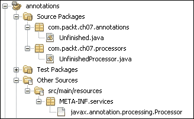

# 第七章 注解和 CDI

直至此刻，我们不得不使用注解和依赖注入，而不去尝试理解它们是如何工作的。因此，本章旨在介绍和强调相关 API 的改进。相关的 API 包括：

+   Java 平台通用注解 1.2

+   上下文和依赖注入 1.1

# Java 平台的通用注解

Java 平台通用注解 1.2 规范是在 JSR 250 下开发的。本节仅为您概述 API 的改进。完整的文档规范（更多信息）可以从 [`jcp.org/aboutJava/communityprocess/mrel/jsr250/index.html`](http://jcp.org/aboutJava/communityprocess/mrel/jsr250/index.html) 下载。

## 本规范的目标

注解是一种元数据，通常用于描述、配置或标记 Java 代码中的元素（如类、方法和属性）。在以下代码中，我们使用 `@Stateless` 注解将 `MySessionBean` 类配置为无状态会话 Bean，我们使用 `@Deprecated` 注解标记 `oldMethod()` 方法为过时，最后我们使用 `@TransactionAttribute` 注解设置 `save()` 方法，使其始终使用专用事务。

```java
@Stateless
public class MySessionBean {

  @Deprecated
  public void oldMethod(){}

    @TransactionAttribute(TransactionAttributeType.REQUIRES_NEW)
  public void save(){}
}
```

自 JDK 5 以来，注解已经集成到 Java 语言中，并且现在在许多 API 中被广泛使用。为了避免在多个 API 中重新定义一些注解，JCP 开发了 Java 平台规范的通用注解，目的是将不同 Java EE API 中的通用注解重新分组，从而避免冗余并简化重新分组注解的维护。以下代码展示了来自 Java 平台 API 的通用注解 `@Resource` 的示例，它允许我们在 Web 容器和 EJB 容器中访问 `SessionContext` 类型的对象。

```java
@Stateless
public class MySessionBean {

  @javax.annotation.Resource
  private SessionContext sctx;

  //...	
}
@ManagedBean
public class MyJsfManagedBean {
  @javax.annotation.Resource
  private SessionContext sctx;
  //...
}
```

## 构建自己的注解

尽管已经存在几个注解，但如果需要，Java 提供了创建自定义注解的机会。为此，你应该知道注解被声明为 Java 接口。唯一的区别是，在注解的情况下，关键字 `interface` 必须由字符 `@` 预先指定。以下代码展示了自定义注解 `Unfinished` 的声明。这个注解包含一个名为 `message` 的参数，其默认值为 `Nothing has been done`。

```java
public @interface Unfinished {
  String message() default "Nothing has been done";
}
```

一旦声明了你的注解，现在你必须定义其特性。注解的基本特性是通过包含在 `java.lang.annotation` 包中的专用注解来定义的。这些注解如下：

+   `@Target`：用于定义可以注解的元素类型（如类、方法和属性），例如 `@Target({ElementType.METHOD, ElementType.TYPE})`

+   `@Retention`：这是用来定义你的注解的保留级别（例如`RUNTIME`、`CLASS`或`SOURCE`），例如`@Retention(RetentionPolicy.RUNTIME)`

+   `@Inherited`：这是用来表示该注解将自动应用于继承具有该注解的类的类

+   `@Documented`：这是用来使你的注解出现在包含它的代码的**Javadoc**中

重要的是要注意，对于自定义 CDI 作用域注解，还有其他特性，如作用域（使用`@ScopeType`设置）。

在所有更改完成后，我们的注解形式如下所示。根据设置，此注解可以装饰方法、对象类型（如`class`、`interface`或`enum`）和属性。它将在编译时被移除（因为保留级别是`SOURCE`）。

```java
@Target({ElementType.METHOD, ElementType.TYPE, ElementType.FIELD})
@Retention(RetentionPolicy.SOURCE)
public @interface Unfinished {
  String message() default "Nothing has been done";
}
```

以下代码演示了`Unfinished`注解的使用：

```java
public class App {
    @Unfinished(message = "Make sure that this element is not null")
    String size;

    @Unfinished
    public static void main(String[] args) {
        System.out.println("Hello World annotation!");
    }
}
```

尽管我们的注解看起来像是一个标准的注解，但它还没有生效。为此，必须有一个名为`processor`的类可供编译器使用。这个类将描述当项目被我们的自定义注解标注时应采取的操作。

要为 Java 6 注解实现自定义处理器，我们主要需要实现`javax.annotation.processing.Processor`接口的`process()`方法，并使用`@SupportedAnnotationTypes`注解定义此处理器支持的注解。以下代码展示了我们自定义的`Unfinished`注解的处理器。如您所见，在实现`process()`方法时，我们使用了实现`Processor`接口的抽象类`AbstractProcessor`。（这防止了我们不得不实现该接口中定义的所有方法。）

```java
@SupportedAnnotationTypes("com.packt.ch07.annotations.Unfinished")
public class UnfinishedProcessor extends AbstractProcessor {

  /**
  * For the ServiceLoader
  */
  public UnfinishedProcessor() {
  }

  @Override
  public boolean process(Set<? extends TypeElement>annotations, RoundEnvironment roundEnv) {
    try {
      //For each annotated element do ...
      for (Element e :roundEnv.getElementsAnnotatedWith(Unfinished.class)) {        
        Unfinished unf = e.getAnnotation(Unfinished.class);
        System.out.println("***** Class :"+e.getEnclosingElement()+", "+ "Annotated element : " + e.getSimpleName()+", "+ " Kind : "+e.getKind()+", Message :"+unf.message()+"**** ");                
      }
    } catch (Exception ex) {
      ex.printStackTrace();
    }
    return true;
  }
}
```

一旦实现了处理器，我们现在必须声明它，以便编译器可以找到它。最简单的方法是使用以下步骤通过 Java 机制进行服务声明：

1.  将你的注解打包在一个`JAR`文件中。

1.  在此`JAR`文件中包含一个`META-INF/services`目录。

1.  在`META-INF/services`目录中包含一个名为`javax.annotation.processing.Processor`的文件。

1.  在此文件中指定包含在`JAR`文件中的处理器的完全限定名称（每行一个处理器）。

以下截图显示了包含`Unfinished`注解的项目结构。如果像我们的示例那样，没有将注解和处理器放在同一个项目中，你可以为注解和处理器使用一个项目。但无论你的选择如何，都不要忘记在包含处理器的`META-INF/services`项目目录中定义服务。



以下截图显示了文件 `javax.annotation.processing.Processor` 的内容。由于该包只包含一个处理器，因此很明显，在这个文件中我们将只有一行，如下面的截图所示：


对于使用 **Maven v2.3.2** 的用户，为了实现包含处理器的项目，他们必须在 `maven-compiler-plugin` 插件的配置中设置选项 `<compilerArgument>-proc:none</compilerArgument>`，以确保代码被正确编译。

现在，您可以将包含注解的包导入到另一个项目中，并按需使用它。在编译我们前面的 `App` 类时，我们得到以下结果：

```java
***** Class :com.packt.ch07.App, Annotated element : size,  Kind : FIELD, Message : Make sure that this element is not null****
***** Class :com.packt.ch07.App, Annotated element : main,  Kind : METHOD, Message : Nothing has been done****
```

## 最新改进措施

受维护版本的影响，通用注解规范没有发生很大变化。总的来说，我们增加了一个新的注解并更新了规范文档的一些部分。

## 新的注解

新增到规范中的注解涉及在使用一系列类时管理优先级。这是 `javax.annotation.priority` 注解。

这个注解的确切角色和可接受的值范围由使用它的每个规范定义。

例如，这个注解可以用来管理拦截器的执行顺序。

# 上下文和依赖注入

Java EE 1.1 规范中的上下文和依赖注入（CDI）是在 JSR 346 下开发的。本节仅为您概述 API 的改进。完整的规范文档（更多信息）可以从 [`jcp.org/aboutJava/communityprocess/final/jsr346/index.html`](http://jcp.org/aboutJava/communityprocess/final/jsr346/index.html) 下载。

## 什么是 CDI？

从 Java EE 平台 6.0 版本引入的上下文和依赖注入（CDI）是一个规范，它为平台带来了一组简化对象生命周期管理、标准化并鼓励在 Java EE 环境中使用依赖注入的服务。具体来说，这个规范使我们能够以松散耦合和类型安全的方式轻松地将不同层（表示层、业务层和数据访问层）连接起来。为了做到这一点，CDI 主要依赖于两个服务，它们是：

+   **上下文**：这是基于它们的范围来管理对象的生命周期（创建和销毁的时间）。

+   **依赖注入**：这包括将一个组件注入到另一个组件中、为给定接口选择要注入的实现以及提供用于访问注入依赖的对象类型：一个代理或直接访问实例的引用。

为了更好地了解 CDI 的强大功能，让我们举一些例子。

### 示例 1 – POJO 的实例化

假设我们有一个 JSF 管理 Bean，它想要访问实现接口的 POJO 的一个实例。基本方法是使用`new`关键字在管理 Bean 中创建 POJO 的实例，如下面的代码所示：

```java
@ManagedBean
public class MyManagedBean {

  IHelloWorld hw = new HelloWorld();

  public String getMyHelloWorld(){
    return hw.getHelloWorld();
  }
}
public class HelloWorld implements IHelloWorld{

  @Override
  public String getHelloWorld() {
    return "Hello World";
  }    
}
```

这种方法的缺点是`HelloWorld`类的实例是在硬编码中创建的，这导致管理 Bean 与`IHeloWorld`接口的实现之间有很强的耦合。因此，要更改`IHelloWorld`实现，你必须能够访问管理 Bean 并修改它。

使用 CDI，管理 Bean 只需声明对`IHelloWorld`实例的依赖并注入它。这给我们以下代码：

```java
@ManagedBean
public class MyManagedBean {

    @Inject
    IHelloWorld hw;

    public String getMyHelloWorld(){
        return hw.getHelloWorld();
    }
}
```

CDI 将查找`IHelloWorld`接口的实现，实例化并注入它。更好的是，CDI 将负责管理将被注入的 Bean 的生命周期。因此，要更改`IHelloWorld`接口的实现，我们只需更改`HelloWorld`类。我们将通过使用`@RequestScoped`注解指定 POJO 的作用域来完成我们的代码。

```java
@RequestScoped
public class HelloWorld implements IHelloWorld{

  //...    
}
```

### 示例 2 – 从 JSF 页面访问 EJB

假设我们有一个 JSF 页面，我们想要访问一个 EJB 组件的方法。典型的场景需要你首先从与 JSF 页面关联的管理 Bean 中访问 EJB 的一个实例，然后在 JSF 页面将要调用的管理 Bean 方法中调用 EJB 方法。以下代码展示了如何进行转换。

以下代码是一个 EJB 组件的示例：

```java
@Stateless
public class MyEJB implements IMyEJB{

  public String getHelloWorld(){
    return "Hello world By EJB";
  }
}
```

以下代码是一个 JSF 管理 Bean 的示例：

```java
@ManagedBean
public class MyManagedBean {

  @EJB
  IMyEJB ejb;

  public String getMyEjbHelloWorld(){
    return ejb.getHelloWorld();
  }
}
```

从 JSF 页面，我们可以调用`myEjbHelloWorld`方法。

```java
Hello EJB
 <br/>
 The message : #{myManagedBean.myEjbHelloWorld}
```

使用 CDI，我们不一定需要通过管理 Bean 来访问 EJB 的方法。实际上，我们只需在我们的 EJB 组件上添加`@Named`注解，它就可以像简单的 JSF 管理 Bean 一样从我们的 JSF 页面访问。这两个注解（`@Named`和`@ManagedBean`）之间的区别至少在两个点上很明显：第一个点是关于作用域的。确实，`@ManagedBean`注解是特定于 JSF 规范的，而`@Named`注解可以创建对更多规范（包括 JSF）可访问的管理 Bean，并在处理 JavaBean 组件方面提供更多灵活性。第二个点与组件可用的功能相关。`@Named`注解允许你创建 CDI Bean，这给你提供了使用你将无法在 JSF Bean 中访问的功能的机会，例如：拦截器、`Producer`和`Disposer`。一般来说，建议尽可能使用 CDI Bean。

以下代码展示了带有 CDI `@Named`注解的 EJB 组件：

```java
@Named
@Stateless
public class MyEJB implements IMyEJB {
  //...
}
```

以下代码展示了从 JSF 页面访问 EJB 的方法：

```java
CDI Hello EJB

<br/>
The message : #{myEJB.helloWorld}
```

### 示例 3 – 为简单操作设置具有特定作用域的 Bean

由于某种原因，你可能想实现单例模式。在传统方法中，即使你并不一定需要此类组件提供的服务（可伸缩性、基于角色的安全性、并发管理、事务管理等），你也将实现单例 EJB 类型。

使用 CDI，你可以创建具有所需作用域的 bean，而无需实现用于边际处理的重量级组件。实际上，CDI 提供了多种作用域类型，可以使用注解（`@ApplicationScoped`、`@RequestScoped` 和 `@SessionScoped`）来定义。因此，为了在不使 EJB 组件提供的服务杂乱无章的情况下实现单例模式，我们可以简单地使用 CDI 的应用程序作用域注解，如下面的代码所示：

```java
@ApplicationScoped
public class MySingletonBean {
    //...
}
```

### 示例 4 – 使用通常由工厂创建的对象

你想通过 JMS 从 EJB 发送异步消息。经典方法将需要你实例化许多对象，如下面的代码所示：

```java
@Stateless
public class SendMessageBean {

  @Resource(name = " java:global/jms/javaee7ConnectionFactory")
  private ConnectionFactory connectionFactory;
  @Resource(name = " java:global/jms/javaee7Queue")
  private Queue queue;

  public void sendMessage(String message) {
    try {
      Connection connection =connectionFactory.createConnection();
      Session session = connection.createSession(false,Session.AUTO_ACKNOWLEDGE);
      MessageProducer messageProducer =session.createProducer(queue);
      TextMessage textMessage =session.createTextMessage(message);
      messageProducer.send(textMessage);
      connection.close();
    } catch (JMSException ex) {
      // handle exception (details omitted)
    }
  }
}
```

使用 CDI，所有这些代码量可以缩减到一行，如下面的代码所示：

```java
@Stateless
public class SendMessageBean2 {

  @Inject
  JMSContext context;
  @Resource(lookup = "java:global/jms/javaee7Queue")
  Queue queue;

  public void sendMessage(String message) {
    context.createProducer().send(queue, message);
  }
}
```

## CDI 规范的最新改进

从 Java EE 6 平台引入以来，CDI 已成为 Java EE 平台中面向组件编程的重要解决方案。现在它只需将其触角扩展到平台几乎所有的规范中，以便能够无缝地连接更多组件和集成更多 API。在已经做出的众多改进中，我们将介绍其中的一些，包括：避免 bean 被 CDI 处理的可能性、访问当前 CDI 容器、访问 bean 的非上下文实例，以及最终能够显式销毁 bean 实例的能力。关于拦截器和装饰器的 CDI 改进将在下一章中介绍，届时我们将讨论相关规范。

### 避免在 bean 上进行 CDI 处理

CDI 规范的 1.1 版本引入了 `@vetoed` 注解，该注解防止对象被视为 CDI bean。然而，带有此注解的 bean 不能拥有与上下文实例类似的生命周期。因此，它不能被注入。

通过查看这个注解，有些人可能会对其有用性感到疑惑。为了保持某些数据的一致性，可能需要控制某些组件的使用。但是，通过使用 CDI，你的组件可以从任何其他组件中被操作。因此，`@vetoed` 注解的作用。以下代码展示了在 `Student` 实体上使用 `@vetoed` 注解，以避免可能导致不一致的未知操作：

```java
@Entity
@Vetoed
public class Student implements Serializable {
  @Id
  private String id;
  private String firstname;

  //...
}
```

### 访问 bean 的非上下文实例

此版本还增加了注入和执行未管理 bean 实例的生命周期回调的能力。以下代码演示了如何注入和执行 `Student` bean 非上下文实例的生命周期回调：

```java
Unmanaged<Student> unmanagedBean = newUnmanaged<Student>(Student.class);
UnmanagedInstance<Student> beanInstance =unmanagedBean.newInstance();
Student foo =beanInstance.produce().inject().postConstruct().get();
// Usage of the injected bean
beanInstance.preDestroy().dispose();
```

### 访问当前 CDI 容器

CDI 规范 1.1 增加了通过程序访问当前 CDI 容器并执行一些操作的能力。以下代码演示了如何访问 CDI 容器以显式销毁上下文对象：

```java
CDI container = CDI.current();
container.destroy(destroableManagedInstance);
```

### 显式销毁 CDI bean 实例

为了允许在应用程序中显式销毁 bean 实例，CDI 1.1 引入了`AlterableContext`接口，该接口包含`void destroy(Contextual<?> contextual)`方法。扩展应该实现此接口而不是`Context`接口。

# 摘要

在专注于使用 Java EE 7 平台实现完整系统的几个章节之后，本章让我们有机会休息一下，尝试回顾一些我们正在使用的关键概念。因此，我们学会了创建自己的注解并链接多层应用层。在下一章中，我们将继续通过集成来实施我们的应用程序，这次是集成不同层之间交换数据的验证。
