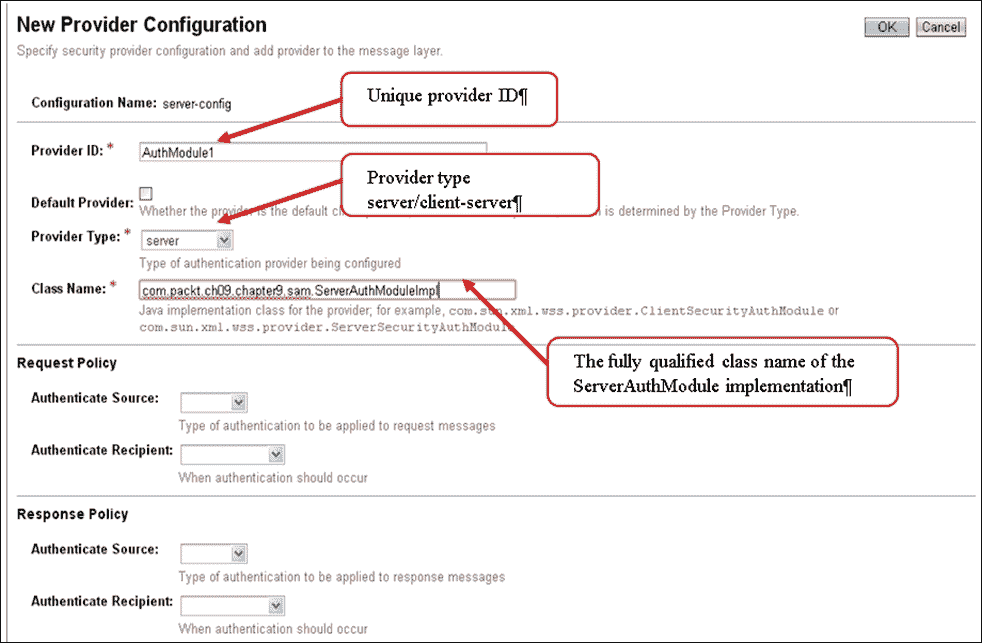
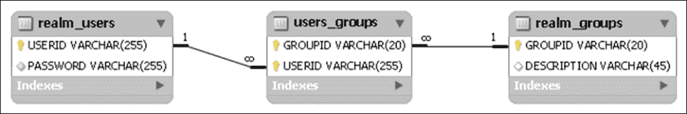
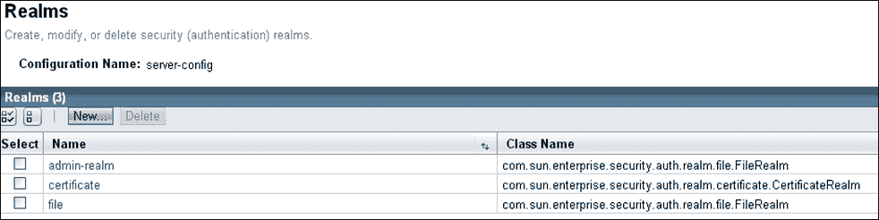
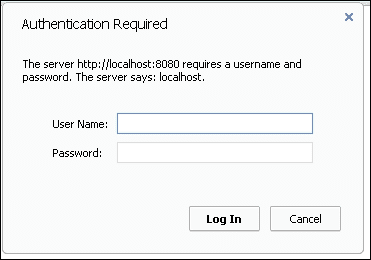

# 第九章。安全

我们将通过使用 Java EE 解决方案来保护我们的项目来完成我们的项目。但首先，我们将分析相关 API 的改进。本章的开发将专注于 JASPIC 1.1。

# JASPIC 1.1

**Java 容器认证 SPI**（**JASPIC**）规范是在 JSR 196 下开发的。本节仅为您概述 API 的改进。有关更多信息，可以下载完整的规范文档，链接为[`jcp.org/aboutJava/communityprocess/final/jsr349/index.html`](http://jcp.org/aboutJava/communityprocess/final/jsr349/index.html)。

## 表单的安全访问

也称为 JASPI，JASPIC 规范定义了一组标准接口，用于开发认证模块，允许安全访问网络资源（Servlets、JSP 等）。一般来说，JASPIC 规范是为了消息级安全而设计的；这意味着 JASPIC 模块被要求集成到消息处理容器中，从而为 SOAP 和 HttpServlet 等协议提供透明的安全机制。

### 实现认证模块

在您不想使用预定义的认证模块的情况下，JASPIC 规范允许您开发自己的模块。这需要实现`javax.security.auth.message.module.ServerAuthModule`接口。由于我们将在后面解释的原因，您可能需要实现以下接口：

+   `javax.security.auth.message.config.ServerAuthConfig`

+   `javax.security.auth.message.config.ServerAuthContext`

+   `javax.security.auth.message.config.AuthConfigProvider`

#### 实现 ServerAuthModule 接口

`ServerAuthModule`接口包含五个必须由认证模块实现的方法。这些方法如下：

+   `initialize()`: 此方法用于初始化模块并检索验证资源访问所需的必要对象。

+   `getSupportedMessageTypes()`: 此方法返回一个对象数组，指定模块支持的消息类型。例如，对于将兼容 Servlet 容器配置的模块，返回的数组将包含`HttpServletRequest.class`和`HttpServletResponse.class`对象。

+   `validateRequest()`: 当容器收到一个`HttpServletRequest`以处理传入的消息时，会调用此方法。为此，它从容器接收`HttpServletRequest`和`HttpServletResponse`对象作为`MessageInfo`参数。在请求处理结束时，此方法必须返回一个状态，以确定容器中的操作顺序。

+   `secureResponse()`: 当容器在向客户端返回响应时调用此方法。通常，它应该返回状态`SEND_SUCCESS`。

+   `cleanSubject()`: 此方法用于从主题参数中删除一个或多个原则。

以下代码提供了一个`ServerAuthModule`接口方法的示例实现：

```java
public class ServerAuthModuleImpl implements ServerAuthModule {

    private MessagePolicy requestPolicy;
    private CallbackHandler handler;
    public void initialize(MessagePolicy requestPolicy, MessagePolicy responsePolicy, CallbackHandler handler, Map options) throws AuthException {
        this.requestPolicy = requestPolicy;
        this.handler = handler;
    }

    public Class[] getSupportedMessageTypes() {
        return new Class[]{HttpServletRequest.class, HttpServletResponse.class};
    }

    public AuthStatus validateRequest(MessageInfo messageInfo, Subject clientSubject, Subject serviceSubject) throws AuthException {
        try {

            String username = validation(messageInfo, clientSubject);
            if (username == null && requestPolicy.isMandatory()) {

                HttpServletRequest request = (HttpServletRequest) messageInfo.getRequestMessage();

                HttpServletResponse response = (HttpServletResponse) messageInfo.getResponseMessage();

                String header = "Basic" + " realm=\"" + request.getServerName() + "\"";
                response.setHeader("WWW-Authenticate", header);

                response.setStatus(HttpServletResponse.SC_UNAUTHORIZED);
                return AuthStatus.SEND_CONTINUE;
            }

            handler.handle(new Callback[]{
                new CallerPrincipalCallback(clientSubject, username)});
            if (username != null) {
                messageInfo.getMap().put("javax.servlet.http.authType", "ServerAuthModuleImpl");
            }

            return AuthStatus.SUCCESS;
        } catch (Exception e) {
            e.printStackTrace();
            throw new AuthException(e.getMessage());
        }
    }

    public String validation(MessageInfo mInfo, Subject cSubject) throws Exception {
        HttpServletRequest request = (HttpServletRequest) mInfo.getRequestMessage();

        String headerAutho = request.getHeader("authorization");

        if (headerAutho != null && headerAutho.startsWith("Basic")) {

            headerAutho = headerAutho.substring(6).trim();

            String decodedAutho = new String(Base64.decode(headerAutho.getBytes()));

            int colon = decodedAutho.indexOf(':');
            if (colon <= 0 || colon == decodedAutho.length() - 1) {
                return null;
            }

            String username = decodedAutho.substring(0, colon);
            String password = decodedAutho.substring(colon + 1);

            //Container password validation, you can put your
            //own validation process instead of delegating it to the container
            PasswordValidationCallback pwdValidCallback =
                    new PasswordValidationCallback(cSubject, username, password.toCharArray());

            handler.handle(new Callback[]{pwdValidCallback});
            //Removes the stored password
            pwdValidCallback.clearPassword();
            password = null;

            if (pwdValidCallback.getResult()) {//if the user is authenticated
                return username;
            }
        }
        return null;
    }

    public AuthStatus secureResponse(MessageInfo messageInfo, Subject serviceSubject) throws AuthException {
        return AuthStatus.SEND_SUCCESS;
    }

    public void cleanSubject(MessageInfo messageInfo, Subject subject) throws AuthException {
    }
}
```

#### 安装和配置认证模块

通过将模块的 JAR 文件复制到 GlassFish 服务器`install_glassfish\ glassfish\domains\domain1\lib`目录中来安装认证模块。

一旦模块安装完成，您可以在 GlassFish 管理控制台中按照以下方式配置它：

1.  登录到 GlassFish 管理控制台。

1.  展开**server-config**菜单。

1.  在出现的菜单中，展开**Security**菜单。

1.  在子菜单中，展开**消息安全**菜单。

1.  点击**HttpServlet**菜单。

1.  在出现的表单中，点击**Providers**标签以添加一个新的提供者。

1.  点击**New**按钮并填写适当的表单。在记录您的输入之前，您的表单应如下截图所示：

#### 将认证模块绑定到 Web 应用

在 GlassFish 中，要将认证模块绑定到应用，您有两个选项：

+   第一个选项（到目前为止这是最简单的）是在应用的`glassfish-web.xml`文件中配置`glassfish-web-app`元素的`httpservlet-security-provider`属性。此配置的目的是让您使用 GlassFish 提供的`AuthConfigProvider`实现来实例化您的安全模块。以下代码显示了我们的应用`glassfish-web.xml`文件的内容。如您所见，我们将提供者的 ID 传递给了`httpservlet-security-provider`属性。因此，每当需要分析请求的安全性时，GlassFish 服务器将通过其`AuthConfigProvider`实现来实例化我们的安全模块，以便使其可用。

    ```java
    <glassfish-web-app error-url=""  httpservlet-security-provider="AuthModule1">
      <class-loader delegate="true"/>  
    </glassfish-web-app>
    ```

+   第二种方法是实现`AuthConfigProvider`接口的自定义实现。因此，在这种情况下，您需要实现`javax.security.auth.message.config.ServerAuthConfig`、`javax.security.auth.message.config.ServerAuthContext`和`javax.security.auth.message.config.AuthConfigProvider`接口。对于那些对这次冒险感到兴奋的人，您将在这个博客中找到所有必要的信息：[`arjan-tijms.blogspot.com/2012/11/implementing-container-authentication.html`](http://arjan-tijms.blogspot.com/2012/11/implementing-container-authentication.html)。

#### 创建一个域

我们将告诉 GlassFish 服务器所有可以访问我们应用安全部分的关联用户和组存储在哪里。换句话说，我们将配置我们应用的域。

为了您的信息，GlassFish 提供了定义多种类型域的能力。它们如下列出：

+   `file`域，用于在文件中存储用户信息。这是默认域。

+   `ldap`域，用于在 LDAP 目录服务器中存储。

+   `jdbc`域，用于在数据库中存储。

+   `solaris` 区域，用于基于 Solaris 用户名和密码的认证管理。

+   `certificate` 区域，用于使用证书进行认证管理。

+   如果这些区域中没有满足您需求的，请不要担心；GlassFish 提供了创建您自己的区域的可能性。

在我们的案例中，我们选择了 `jdbc` 区域；我们需要一个数据库结构来存储必要的信息（用户名、密码以及它所属的组）。以下截图显示了存储我们信息的表结构：



`realm_users` 表将存储所有用户 ID 和密码，`realm_groups` 表将存储所有应用程序的组 ID 及其描述，而 `users_groups` 表将告诉我们用户属于哪些组。因此，一个用户可以属于多个组。

一旦您定义了将托管不同用户的数据库结构，您必须配置 GlassFish 以使其能够连接到您的数据库（在我们的案例中是 MySQL 5）并访问认证信息。为此，您必须首先将数据库的 Java 连接器（在我们的案例中是 `mysql-connector-java-5.1.23-bin.jar`）复制到目录：`glassfish_install_dir\glassfish\domains\domain1\lib`。然后，您必须连接到 GlassFish 管理控制台，通过导航到 **配置** | **服务器配置** | **安全** | **区域** 来获取创建区域的表单。通过点击 **区域** 菜单，将显示以下表单；然后您需要点击 **新建** 按钮，区域创建表单将出现：



以下表格显示了您需要为 `JDBCRealm` 填写的字段：

| **字段** | **示例值** | **描述** |
| --- | --- | --- |
| **名称** | `MyJDBCRealm` | 将用于配置应用程序安全性的区域名称 |
| **类名** | `com.sun.enterprise.security.auth.realm.jdbc.JDBCRealm` | 实现要配置的区域（在我们的案例中为 `JDBCRealm`）的类 |
| **JAAS 上下文** | `jdbcRealm` | JAAS（Java 认证和授权服务）上下文 ID |
| **JNDI** | `jdbcRealmDataSource` | 连接到包含区域的数据库的 JDBC 资源的 JNDI 名称 |
| **用户表** | `realm_users` | 包含带有密码的系统用户列表的表名称 |
| **用户名列** | `USERID` | 包含用户在 `realm_users` 表中 ID 的列名称 |
| **密码列** | `PASSWORD` | 包含用户密码的列名称 |
| **组表** | `users_groups` | 关联组和用户的表名称 |
| **组表用户名列** | `USERID` | 关联表中包含用户 ID 的列名称 |
| **组名列** | `GROUPID` | 关联表中包含组标识符的列的名称 |
| **密码加密算法** | `SHA-256` | 设置密码加密算法 |
| **摘要算法** | `SHA-256`（即使它是默认值） | |

填写表单后，您可以保存您的领域。使用此配置，我们现在可以使用容器提供的密码验证机制来验证传入的连接。这就是我们在验证方法中使用以下语句所做的事情：

```java
PasswordValidationCallback pwdValidCallback = new PasswordValidationCallback(cSubject, username, password.toCharArray());
```

除了使用容器验证机制外，您还可以访问您的数据库并自行进行此验证。

#### 安全配置

要配置应用程序的安全性，您需要执行以下操作：

1.  确定应用程序的不同角色并在 `web.xml` 中声明它们。在我们的应用程序中，我们只需要一个管理员角色来执行批量处理和一些管理任务。以下代码演示了如何为此目的创建一个名为 `admin` 的角色：

    ```java
    <security-role>
       <role-name>admin</role-name>
    </security-role>
    ```

1.  在 `web.xml` 文件中将 URL 模式映射到适当的角色。这将定义每个角色可以访问的表单。在执行此配置之前，您必须根据您想要定义的访问约束对表单进行分组。在我们的应用程序中，我们将表单分为两个文件夹：注册文件夹中的预注册表单文件夹和行政文件夹中的管理表单文件夹。因此，为了确保只有管理员角色的用户才能访问管理表单，我们将 URL 模式 `/faces/administration/*` 关联到 `admin` 角色。以下代码演示了如何定义一个将 URL 模式 `/faces/administration/*` 关联到 `admin` 角色的约束（前一个模式中的 `faces` 单词代表 `web.xml` 文件中的 `<servlet-mapping>` 元素中定义的模式）。

    ```java
    <security-constraint>
            <display-name>Constraint1</display-name>
            <web-resource-collection>
                <web-resource-name>Administration</web-resource-name>
                <url-pattern>/faces/administration/*</url-pattern>
            </web-resource-collection>
            <auth-constraint>
                <role-name>admin</role-name>
            </auth-constraint>
    </security-constraint>
    ```

1.  在 `glassfish-web.xml` 文件中将每个角色与用户组关联。在领域内，每个用户都与一个用户组关联。然而，URL 模式与角色关联。因此，您需要告诉服务器一个角色属于哪个组。在 GlassFish 中，这可以通过 `<security-role-mapping>` 元素实现。以下代码显示了包含角色-组组合的 `glassfish-web.xml` 文件的完整内容：

    ```java
    <glassfish-web-app error-url="" httpservlet-security-provider="AuthModule1">
      <security-role-mapping>
        <role-name>admin</role-name>
        <group-name>administrator</group-name>
      </security-role-mapping>
      <class-loader delegate="true"/>
    </glassfish-web-app>
    ```

1.  在 `web.xml` 中声明我们的应用程序将使用的领域和认证类型。以下代码演示了如何声明我们在上一步中创建的 MyJDBCRealm。我们选择的认证类型是 `DIGEST`。它以加密形式传输密码。

    ```java
    <login-config>
        <auth-method>DIGEST</auth-method>
        <realm-name>MyJDBCRealm</realm-name>
    </login-config>
    ```

完成这些配置后，候选人可以无任何问题地访问注册表单。但是，如果他们尝试连接到管理表单，将显示类似于以下窗口的窗口：



在完成这个项目之前，你应该知道可以自定义登录屏幕，甚至将其集成到你的应用程序中。URL：[`blog.eisele.net/2013/01/jdbc-realm-glassfish312-primefaces342.html`](http://blog.eisele.net/2013/01/jdbc-realm-glassfish312-primefaces342.html)上的教程可以帮助你。

# 最新改进措施

JASPIC 规范维护发布 B 版本已经做出了一些重大更改，其中一些有助于标准化无论服务器如何使用规范；其他有助于丰富用户体验。在更改中，我们只介绍了一些相对重要的更改，并建议你浏览以下规范文档和博客：[`arjan-tijms.blogspot.com/2013_04_01_archive.html`](http://arjan-tijms.blogspot.com/2013_04_01_archive.html)，它将为你提供更多信息。

## 集成调用的认证、登录和注销方法

自 Servlet 3.0 版本以来，认证、登录和注销方法已添加到`HttpServletRequest`接口中，用于以编程方式管理登录和注销。然而，在调用这三个方法之一后，JASPIC 模块的行为并没有明确确定。它留给了服务器供应商来提供他们自己的登录和注销方法。直接后果是 Java EE 兼容服务器之间应用程序的非可移植性。

在最近的变化中，JASPIC 1.1 版本明确定义了在调用这三个方法之一后 JASPIC 模块的预期行为。我们现在知道：

+   `login`方法的容器实现必须在`login`方法和配置的认证机制之间存在不兼容性时抛出`ServletException`。

    ### 注意

    在这里，调用`login`方法后模块的行为没有明确定义。

+   对`authenticate`方法的调用必须调用`validateRequest`方法。如果`authenticate`方法不是在调用`validateRequest`的环境中调用，则这是正确的。

+   对`logout`方法的调用必须调用`cleanSubject`方法。如果`logout`方法不是在调用`cleanSubject`方法的环境中调用，则这是正确的。

## 标准化访问应用上下文标识符

应用上下文标识符是一个用于识别或选择给定应用程序中的`AuthConfigProvider`和`ServerAuthConfig`对象的 ID（它包含在`appContext`参数中）。在 JASPIC 1.1 之前，没有标准的方式来获取它。通常，每个服务器供应商都提出了一个特定于供应商的方法。现在，使用以下代码可以在标准中实现：

```java
ServletContext context = ...
 //...
String appContextID = context.getVirtualServerName() + " " + context.getContextPath();
```

## 支持前进和包含机制

JASPIC 1.1 规范强调，认证模块必须在处理`validateRequest`方法的过程中能够转发和包含。具体来说，这可以通过在`MessageInfo`参数类型中使用`request`和`response`来实现。以下代码概述了基于条件结果的重定向到错误页面的过程：

```java
public AuthStatus validateRequest(MessageInfo messageInfo, Subject clientSubject, Subject serviceSubject) throws AuthException {

    HttpServletRequest request = (HttpServletRequest) messageInfo.getRequestMessage();
    HttpServletResponse response = (HttpServletResponse) messageInfo.getResponseMessage();

    try{
      if(...)
        request.getServletContext().getRequestDispatcher("specificErrorPage")
               .forward(request, response);
    }catch(Exception ex){}

    return SEND_CONTINUE;
}
```

# 摘要

在达到本书的最后一章，也就是本章的结尾时，我们现在能够部署一个至少具备一定安全级别的 Java EE 公共解决方案。实际上，通过本章，读者已经了解到一个允许他们限制表单访问的规范。然而，重要的是要注意，鉴于本书的目标，我们仅仅处理了安全性的一个很小方面。我们要求您通过额外的阅读来完善您对安全性的知识。这是因为该领域由多个方面组成，例如数据在网络中的传输、方法执行、构建和执行 SQL 查询。
