# 第二章. 在 WildFly 上创建您的第一个 Java EE 应用程序

本章将为您提供关于新应用程序服务器的快速入门课程，以便您能够在下一章中创建我们第一个 Java EE 7 应用程序的部署框架。更具体地说，我们将涵盖以下主题：

+   WildFly 8 核心概念的介绍

+   WildFly 8 文件系统的结构

+   可用管理工具的介绍

+   发布您的第一个 Hello World 应用程序

# WildFly 8 核心概念

现在我们已经下载并安装了 WildFly 8，花几分钟时间熟悉一些基本概念是值得的。架构和大多数核心思想直接来自 JBoss AS 7；尽管如此，也有一些新机制是在最新版本中引入的（例如，管理系统的基于角色的安全性、使用的端口数量减少以及新的补丁系统）。就像 JBoss AS 7 一样，WildFly 可以以两种模式运行：独立模式和域模式。

在 **独立** 模式下，每个 WildFly 实例都是一个独立的过程（类似于之前的 JBoss AS 版本，如版本 4、版本 5、版本 6 以及版本 7 的独立模式）。独立配置文件位于应用程序服务器的 `standalone`/`configuration` 目录下。

在 **域** 模式下，您可以从一个中心点运行多个应用程序服务器并管理它们。一个域可以跨越多个物理（或虚拟）机器。在每台机器上，我们可以安装几个受主机控制器进程控制的 WildFly 实例。域模式下的配置文件位于应用程序服务器的 `domain`/`configuration` 文件夹下。

从进程的角度来看，一个域由三个元素组成：

+   **域控制器**: 域控制器是您域的管理控制点。在域模式下运行的 WildFly 实例最多只有一个进程实例充当域控制器。域控制器持有集中式配置，该配置由属于该域的节点实例共享。

+   **主机控制器**: 这是负责协调服务器进程生命周期以及从域控制器到服务器实例部署分布的过程。

+   **应用程序服务器节点**: 这些是映射应用程序服务器实例的常规 Java 进程。每个服务器节点反过来又属于一个服务器组。当讨论域配置文件时，将详细介绍域组。

此外，当启动域时，您将在您的机器上看到另一个 JVM 进程正在运行。这是进程控制器。这是一个非常轻量级的进程，其主要功能是生成服务器进程和主机控制器进程，并管理它们的输入/输出流。由于进程控制器不可配置，我们不会进一步讨论它。

下面的图显示了典型的域部署配置：

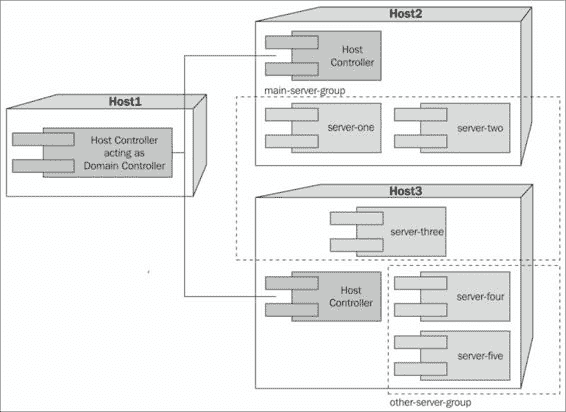

正如你在前面的图中可以看到的，一个主机（**Host1**）充当专用域控制器。这是在域管理的服务器中采用的一种常见做法，目的是为了在逻辑上和物理上将管理单元与托管应用程序的服务器分开。

其他主机（**Host2** 和 **Host3**）包含域应用程序服务器，这些服务器分为两个服务器组：**main-server-group** 和 **other-server-group**。服务器组是一组逻辑上的服务器实例，它们将一起被管理和配置。每个服务器组都可以配置不同的配置文件和部署；例如，在前面提到的域中，你可以使用 **main-server-group** 提供一些服务，而使用 **other-server-group** 提供其他服务。

这有一些优点。例如，当你不想为了新版本而关闭你的应用程序时，你可以一次只重新部署一个服务器组。当一个服务器不完全运行时，请求可以被第二个服务器处理。

详细了解域配置超出了本书的范围；然而，到本章结束时，我们将看到如何使用 WildFly 中可用的命令行界面在域中部署应用程序单元。

# WildFly 8 目录结构

独立和域之间的区别在以下图中显示了应用程序服务器的目录结构：

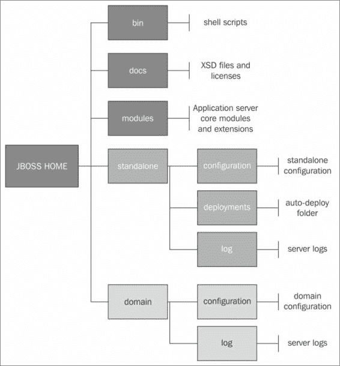

正如你在前面的图中可以看到的，WildFly 的目录结构分为两个主要部分：第一个与独立服务器模式相关，另一个是针对域服务器模式的。两种服务器模式都有的共同点是 `modules` 目录，这是应用程序服务器的心脏。

WildFly 基于 `JBoss Modules` 项目，该项目提供了一个模块化（非层次化）的类加载和 Java 执行环境实现。换句话说，而不是一个加载所有 JAR 到平坦类路径的单个类加载器，每个库都成为一个模块，它只链接到它所依赖的确切模块，不再链接其他任何内容。它实现了一个线程安全、快速且高度并发的委托类加载器模型，并配有一个可扩展的模块解析系统。这些结合在一起形成了一个独特、简单且强大的应用程序执行和分发系统。

下表详细说明了 `JBOSS_HOME` 的 `root` 目录中每个文件夹的内容：

| 文件夹 | 描述 |
| --- | --- |
| `bin` | 这个文件夹包含启动脚本、启动配置文件以及各种命令行实用程序，例如 vault、add-user 和适用于 Unix 和 Windows 环境的 Java 诊断报告 |
| `bin/client` | 此文件夹包含一个客户端 Jar 文件，用于远程 EJB、CLI 以及不使用任何具有自动依赖管理功能的构建系统（如 Maven、Ivy 的 Ant 或 Gradle）的客户。 |
| `bin/init.d` | WildFly 新增功能，此文件夹包含用于 Red Hat Linux 和 Debian 的脚本，这些脚本将 WildFly 注册为 Linux 服务。 |
| `bin/service` | WildFly 新增功能，此文件夹包含一个脚本，允许将 WildFly 注册为 Windows 服务。 |
| `docs/examples` | 此文件夹包含一些示例独立配置，例如最小化独立配置（`standalone-minimalistic.xml`）。 |
| `docs/schema` | 此文件夹包含 XML 模式定义文件。 |
| `domain` | 此文件夹包含由此安装的域模式进程使用的配置文件、部署内容和可写区域。 |
| `modules` | 此文件夹包含在应用程序服务器上安装的所有模块。 |
| `standalone` | 此文件夹包含由此安装的单个独立服务器使用的配置文件、部署内容和可写区域。 |
| `appclient` | 此文件夹包含由此安装的应用程序客户端容器使用的配置文件、部署内容和可写区域。 |
| `welcome-content` | 此文件夹包含默认欢迎页内容。 |

深入研究独立模式树，我们可以找到与独立独立进程相关的文件夹。如果你有早期服务器版本的经验，你会发现这些文件夹对你来说非常直观：

| 目录 | 描述 |
| --- | --- |
| `configuration` | 此目录包含从此安装运行的独立服务器的配置文件。所有运行服务器的配置信息都位于此处，并且是独立服务器配置修改的唯一位置。 |
| `data` | 此目录包含服务器写入的持久信息，以便在服务器重启后继续存在。 |
| `deployments` | 最终用户部署内容可以放置在此目录中，以便自动检测并将该内容部署到服务器的运行时。 |
| `lib/ext` | 此目录是安装的库 Jar 文件的存放位置，由使用扩展列表机制的应用程序引用。 |
| `log` | 此目录包含独立服务器日志文件。 |
| `tmp` | 此目录包含服务器写入的临时文件的位置。 |

`domain`目录结构与独立模式类似，但有一个重要区别。如以下表格所示，`deployments`文件夹不存在，因为域模式不支持基于扫描文件系统部署内容。我们需要使用 WildFly 管理工具（CLI 和 Web 管理控制台）来部署应用程序到域。 |

| 目录 | 描述 |
| --- | --- |
| `configuration` | 此目录包含域主机控制器和在此安装上运行的任何服务器的配置文件。域内管理的所有服务器的配置信息都位于此处，并且是配置信息的唯一位置。 |
| `data/content` | 此目录是主机控制器的一个内部工作区域，它控制这个安装。这是它内部存储部署内容的地方。此目录不打算由最终用户操作。它是在第一次服务器启动后创建的。 |
| `log` | 此目录是主机控制器进程写入其日志的位置。进程控制器，一个实际产生其他主机控制器进程和任何应用服务器进程的小型、轻量级进程，也在这里写入日志。它是在第一次服务器启动后创建的。 |

| `servers` | 此目录是每个从该安装运行的应用服务器实例的可写区域。每个应用服务器实例将有一个自己的子目录，在服务器第一次启动时创建。在每个服务器的子目录中，将存在以下子目录：

+   `data`: 这是服务器写入的、需要服务器重启后仍然存在的信息。

+   `log`: 这是服务器的日志文件。

+   `tmp`: 这是服务器写入的临时文件的位置。此文件夹在第一次服务器启动后创建。

|

| `tmp` | 此目录包含服务器写入的临时文件的位置。 |
| --- | --- |

# 管理应用服务器

WildFly 提供了三种不同的方式来配置和管理服务器：一个网页界面、一个命令行客户端和一组 XML 配置文件。无论你选择哪种方法，配置总是同步到不同的视图，并最终持久化到 XML 文件中。使用网页界面保存更改后，你将立即在你的服务器配置目录中看到更新的 XML 文件。

## 使用网页界面管理 WildFly 8

### 备注

WildFly 8 默认是安全的，默认的安全机制基于用户名或密码，并使用 HTTP 摘要。默认情况下保护服务器的理由是，如果管理接口意外地暴露在公共 IP 地址上，则需要认证才能连接。因此，分发中没有默认用户。

用户存储在`mgmt-users.properties`属性文件中，该文件位于独立配置或域配置下，具体取决于服务器的运行模式。此文件包含用户名信息以及预先计算的哈希值，以及域和用户的密码。

为了操作文件和添加用户，服务器已提供如`add-user.sh`和`add-user.bat`之类的实用程序来添加用户并生成散列。所以只需执行脚本并遵循引导过程。这在上面的屏幕截图中显示：

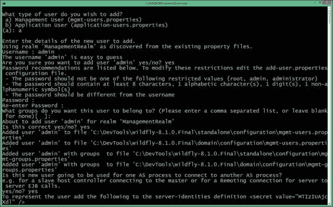

为了创建新用户，您需要提供以下信息：

+   **用户类型**：用户类型将是管理用户，因为它将管理应用程序服务器。

+   **域**：这必须与配置中使用的域名称匹配，除非您已更改配置以使用不同的域名称，否则请将此设置为`ManagementRealm`。

+   **用户名**：这是您要添加的用户的用户名。

+   **密码**：这是用户的密码。

+   **用户组**：这是一个逗号分隔的组列表，应分配给新创建的用户；它们用于 WildFly 中引入的角色基于访问控制和审计系统。用户组的信息存储在`mgmt-groups.properties`文件中。

如果验证成功，您将被要求确认是否要添加用户；只有在这种情况下，`properties`文件才会被更新。

最后一个问题（这个新用户是否将被用来连接一个 AS 进程到另一个？）可以用来**添加从属主机控制器**，这些控制器将验证主域控制器。这反过来又需要在从属主机的配置中添加密钥，以便与主域控制器进行验证。（有关域配置的更多信息，请访问[`docs.jboss.org/author/display/WFLY8/Admin+Guide#AdminGuide-ManagedDomain`](https://docs.jboss.org/author/display/WFLY8/Admin+Guide#AdminGuide-ManagedDomain)。）

# 启动 Web 控制台

现在我们已经添加了至少一个用户，我们可以在默认地址`http://<host>:9990/console`启动 Web 控制台（请注意，您必须首先启动服务器，例如使用`standalone.bat`或`standalone.sh`）。

将会提示登录界面。在**用户名**和**密码**字段中输入数据，这是我们之前创建的。这在上面的屏幕截图中显示：

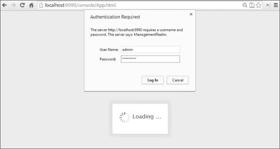

登录后，您将被重定向到 Web 管理主屏幕。当以独立模式运行时，Web 控制台将分为三个主要标签页：**配置**、**运行时**和**管理**。这在上面的屏幕截图中显示：

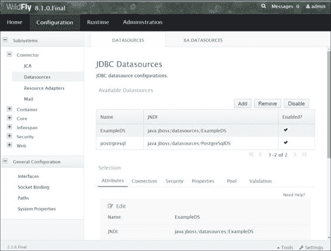

**配置**标签页包含所有作为服务器配置一部分的单个子系统。因此，一旦您在左侧框架中选择**配置**标签页，您就可以访问所有子系统并编辑它们的配置（在之前的屏幕截图中，我们看到了数据源子系统）。

另一个名为**运行时**的标签页可以用于两个主要目的：管理应用程序的部署和检查服务器指标。这在上面的屏幕截图中显示：

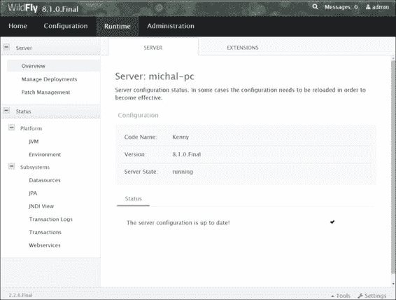

WildFly 和 Red Hat JBoss EAP 6.2 引入了**管理**标签页，目前它仅包含与基于角色的访问控制相关的选项。您现在可以限制管理用户的权限，例如，这样不是每个管理员都可以使用 Web 控制台卸载应用程序。默认情况下，此功能是禁用的。您必须手动使用 CLI 机制启用它。这在上面的屏幕截图中显示：

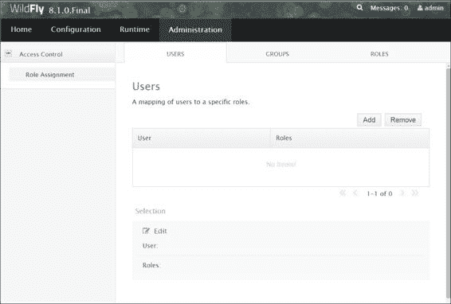

一旦您学会了如何访问 Web 控制台，现在是时候尝试您的第一个应用程序示例了。

# 将您的第一个应用程序部署到 WildFly 8

为了测试启动我们的第一个应用程序，我们将使用 Eclipse 创建一个`HelloWorld`网络项目。主要部分是一个`servlet`类，用于生成 HTML 标记。因此，启动 Eclipse，通过导航到**文件** | **新建** | **动态网络项目**来创建一个新的网络项目。这在上面的屏幕截图中显示：

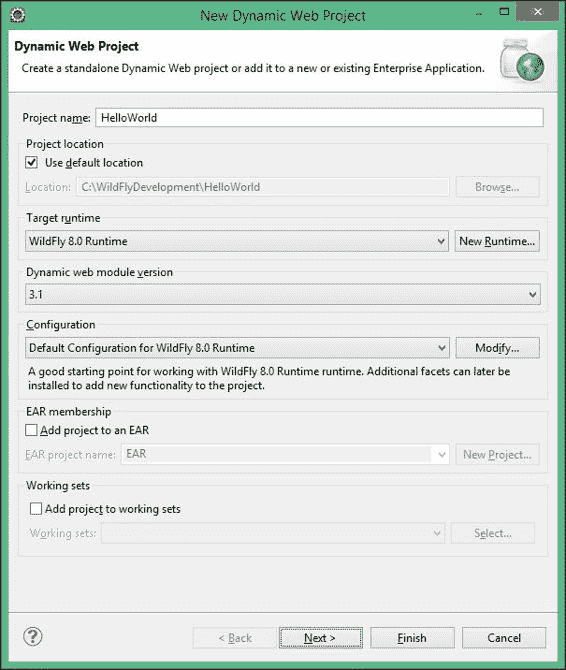

为您的应用程序选择一个名称，如果您想在 Eclipse 工作空间同一位置创建项目，请勾选**使用默认位置**复选框。如果您已在 Eclipse 中正确配置了新的 WildFly 服务器，您应该看到默认选中了**WildFly 8.0 运行时**选项，并且在**配置**框中预选了**WildFly 8.0 运行时**的**目标运行时**和**默认配置**。

选择**3.1**作为动态网络模块版本，这将通过使用 Servlet 3.1 规范使开发变得容易，并且也保留**EAR 成员资格**和**将项目添加到工作集**复选框未选中。

点击**完成**继续。

现在，让我们向我们的项目中添加一个典型的简单 servlet，它仅将一个**Hello World**消息作为 HTML 页面输出。从**文件**菜单，转到**新建** | **Servlet**，为您的 servlet 输入一个有意义的名称和包名，例如名称为`TestServlet`，包名为`com.packtpub.wflydevelopment.chapter2`。这在上面的屏幕截图中显示：

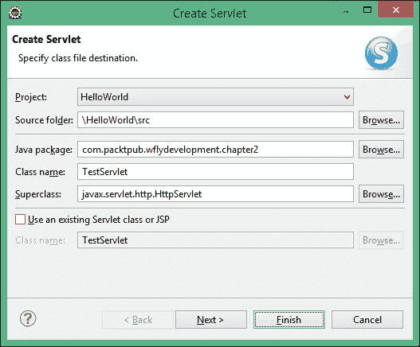

向导将生成一个基本的 servlet 骨架，需要通过以下代码行进行增强：

```java
@WebServlet("/test")
public class TestServlet extends HttpServlet {
    private static final long serialVersionUID = 1L;

    private static final String CONTENT_TYPE = 
      "text/html;charset=UTF-8";
    private static final String MESSAGE = "<!DOCTYPE html><html>" +
            "<head><title>Hello!</title></head>" +
            "<body>Hello World WildFly</body>" +
            "</html>";

    @Override
    protected void doGet(HttpServletRequest request, 
                         HttpServletResponse response)
            throws ServletException, IOException {
        response.setContentType(CONTENT_TYPE);
        try (PrintWriter out = response.getWriter()) {
            out.println(MESSAGE);
        }
    }
}
```

该 servlet 将对针对其 URL 地址发出的每个 GET HTTP 请求响应一个静态 HTML 页面（我们定义的内容类型为 Text/HTML，字符集为 UTF-8）。

### 注意

注意到 `TextServlet` 带有 `@WebServlet` 注解，这是由 Servlet 3.0 API 引入的，它允许在不使用 `web.xml` 配置文件的情况下注册一个 servlet。在我们的例子中，我们使用它来自定义 servlet URL 绑定，使用 `/test`，否则 Eclipse 会将其默认为类名。

我们将通过创建一个名为 `jboss-web.xml` 的 `JBoss` 文件描述符，位于 `/WebContent/WEB-INF/` 目录中，来完成应用程序；尽管这不是强制性的，但它可以用来重新定义上下文根，如下面的代码片段所示：

```java
<jboss-web>
    <context-root>/hello</context-root>
</jboss-web>
```

### 注意

`jboss-web.xml` 的模式定义文件命名为 `jboss-web_8_0.xsd`，可以位于 `JBOSS_HOME/docs/schema` 文件夹中。

请记住，创建 `jboss-web.xml` 使得应用程序无法在其他 Java EE 应用服务器上移植。当没有定义此类文件时，默认的应用程序路径是应用程序名称和版本的连接，例如，对于名为 `TestServlet` 且版本为 1.0 的应用程序，它将是 TestServlet-1.0。

现在，我们将通过在 Eclipse **服务器**选项卡上右键单击并选择**添加和移除**来将 Web 应用程序添加到已部署资源的列表中。这如图所示：

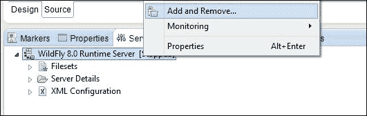

接下来，点击**添加**将项目添加到服务器上配置的资源列表中，如图所示：

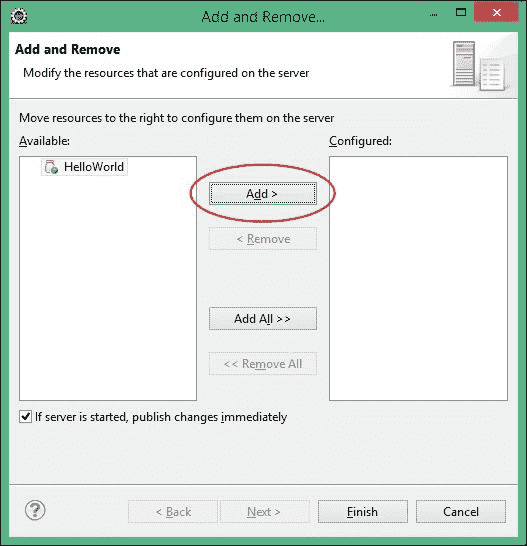

如果你已经在 Eclipse 内启动了 WildFly，资源将通过检查标志来自动部署，以查看服务器是否已启动，并立即发布更改。

另一方面，如果你在外部启动了应用程序服务器，那么你可以通过在应用程序上右键单击并选择**完全发布**来完全发布你的资源，如图所示：

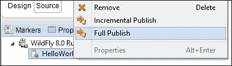

现在，转到浏览器并检查应用程序是否在配置的 URL 上响应，如图所示：

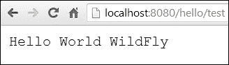

此示例也以 Maven（将在下一章介绍）项目的形式存在于您的 Packt Publishing 账户中。

## 高级 Eclipse 部署选项

如此一来，Eclipse 已经在 `JBOSS_HOME/standalone/deployments` 中发布了 `HelloWorld.war` 文件夹。

### 注意

你可能已经注意到，Eclipse 还添加了一个名为 `HelloWorld.war.dodeploy` 的标记文件。这一步是必要的，因为默认情况下，WildFly 中的展开部署不会自动部署。展开内容的自动部署默认是禁用的，因为部署扫描器可能会尝试部分部署复制的目录，这会导致许多错误。可以通过名为 `application.[jar/war/ear].dodeploy` 的标记文件手动触发展开存档的部署。

一旦应用程序部署完成，应用程序服务器将用部署的`HelloWorld.war`文件替换`.dodeploy`标记文件，或者在部署失败的情况下，用`HelloWorld.war.failed`文件替换。

您可以通过双击 WildFly 8.0（在**服务器**选项卡中），然后选择**部署**选项卡来更改默认的部署选项，如下截图所示：

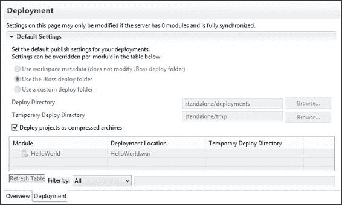

在**部署**选项卡中，您可以通过勾选**使用自定义部署文件夹**选项并在相应的文本框中输入适当的值来选择将您的应用程序部署到自定义部署文件夹。

请注意，自定义部署文件夹也必须在 WildFly 中定义；有关更多信息，请参阅下一节。

此外，请注意**将项目作为压缩存档部署**选项，在某些情况下可能很有用，例如，如果您通过其他工具（如 CLI）分发应用程序，这些工具只能部署压缩存档。

### 使用 Web 控制台管理部署

使用 Eclipse 部署应用程序是一个简单的任务，并且可能是您开发应用程序时的首选选项。我们将在此处了解如何使用 Web 控制台部署应用程序，这可以成为您箭袋中的另一支箭。

### 注意

此示例的一个典型场景可能是您正在以域模式运行 AS，或者简单地将应用程序部署到远程 WildFly 实例。

启动 Web 控制台并单击**运行时**选项卡。从左侧面板中，转到**服务器** | **管理部署**，如下截图所示：

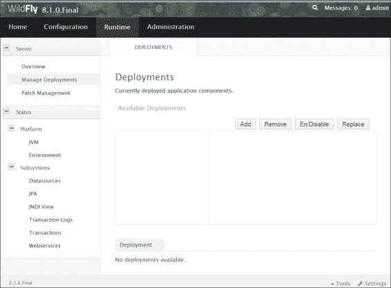

在中央面板中，我们可以使用**添加**、**删除**、**启**/**禁用**和**更新**按钮来管理部署。选择**添加**按钮以添加新的部署单元。在下一屏幕中，从您的本地文件系统中选择您想要部署的文件（例如，`HelloWorld.war`工件，可以通过在 Eclipse 测试项目中导航到**文件** | **导出** | **Web** | **WAR 文件**来创建），如下截图所示：

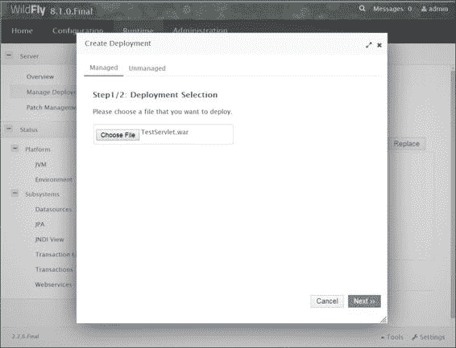

通过验证部署的名称并单击**保存**来完成向导，如下截图所示：

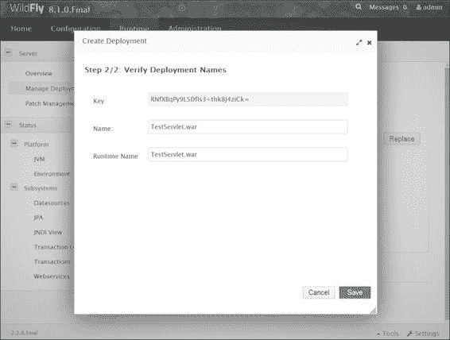

现在，部署已列在部署表中。然而，默认情况下它并未启用。单击**启**/**禁用**按钮以启用应用程序的部署，如下截图所示：

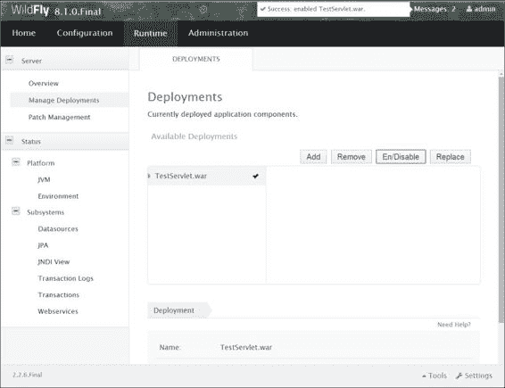

#### 修改部署扫描器属性

如我们之前所见，以独立模式运行的应用程序默认在 `deployments` 文件夹中进行扫描。你可以通过点击 **配置** 选项卡并从左侧菜单导航到 **子系统** | **核心** | **部署扫描器** 来更改此行为（以及部署扫描器的属性）。这如下面的截图所示：

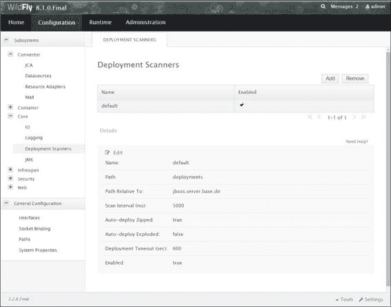

在 **部署扫描器** 中，你可以设置核心部署的属性。你可以点击 **编辑** 按钮来为这些属性定义新值。其中大部分是自解释的；然而，以下表格总结了它们：

| 属性 | 描述 |
| --- | --- |
| `name` | 这是部署扫描器的名称（默认情况下，提供名称 `default`）。 |
| `path` | 这是部署扫描扫描的绝对路径。如果设置了 `相对于路径` 属性，则将其附加到相对路径定义上。 |
| `启用` | 此属性确定部署扫描器是否启用。 |
| `相对于路径` | 如果包含，此属性必须指向用于构建相对路径表达式的系统路径。 |
| `扫描间隔` | 这是部署扫描的频率（以毫秒为单位）。 |
| `自动部署压缩包` | 将此设置为 `true` 将启用压缩应用的自动部署。其默认值是 `true`。 |
| `自动部署展开` | 将此设置为 `true` 将启用展开应用的自动部署。其默认值是 `true`。 |
| `部署超时` | 这指的是部署操作标记为 `失败` 之后的超时时间。 |

## 使用命令行界面部署应用程序

部署应用程序的另一种方式是通过 WildFly **命令行界面**（**CLI**），可以从 `jboss-cli.bat`（或 Linux 用户的 `jboss-cli.sh`）启动。不要害怕使用文本界面来管理你的应用程序服务器；事实上，控制台提供了内置的自动完成功能，你可以通过简单地按 *Tab* 键在任何时候显示可用的命令，如下面的截图所示：

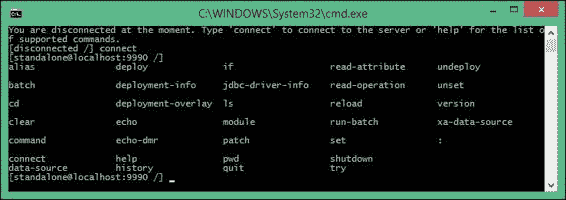

如你所猜，为了部署一个应用程序，你需要发出 `deploy` shell 命令。当不带参数使用时，`deploy` shell 命令提供当前已部署的应用程序列表。请参考以下代码：

```java
[standalone@localhost:9990 /] deploy
ExampleApp.war

```

如果你将一个资源存档，例如 `.war`，传递给 shell，它将立即在独立服务器上部署它，如下面的命令行所示：

```java
[standalone@localhost:9990 /] deploy ../HelloWorld.war 

```

如您从前面的命令行中看到的，CLI 使用您实际启动部署的文件夹的初始位置，默认情况下为`JBOSS_HOME/bin`。然而，当指定存档的位置时，您可以使用绝对路径；CLI 的扩展功能（使用*Tab*键）使此选项相当简单。以下命令行展示了这一点：

```java
[standalone@localhost:9990 /] deploy c:\deployments\HelloWorld.war

```

命令执行后没有错误消息；因此，应用程序已部署并激活，用户可以访问它。如果您只想执行应用程序的部署并将激活推迟到以后，您必须添加`--disabled`开关，如下所示：

```java
[standalone@localhost:9990 /] deploy ../HelloWorld.war --disabled 

```

为了激活应用程序，只需发出另一个不带`--disabled`开关的`deploy` shell 命令，如下所示：

```java
[standalone@localhost:9990 /] deploy -–name=HelloWorld.war 

```

重新部署应用程序需要为`deploy` shell 命令添加一个额外的标志。使用`-f`参数强制应用程序重新部署，如下所示：

```java
[localhost:9990 /] deploy -f ../HelloWorld.war

```

使用`undeploy`命令可以卸载应用程序，该命令将已部署的应用程序作为参数。以下命令行展示了这一点：

```java
[localhost:9990 /] undeploy HelloWorld.war

```

### 部署应用程序到域

在域模式下运行时部署应用程序与在独立模式下进行此操作略有不同。这种差异归结为应用程序可以仅部署到单个服务器组或所有服务器组。实际上，您可能将域拆分为不同的服务器组的原因之一可能是您计划为每个服务器组提供不同类型的服务（因此是应用程序）。

因此，为了将您的`HelloWorld.war`应用程序部署到所有服务器组，请发出以下命令：

```java
[domain@localhost:9990 /] deploy HelloWorld.war --all-server-groups

```

另一方面，如果您想从属于域的所有服务器组中卸载应用程序，您必须发出`undeploy`命令，如下所示：

```java
[domain@localhost:9990 /] undeploy HelloWorld.war --all-relevant-server-groups

```

您也可以通过指定一个或多个服务器组（用逗号分隔）并使用`--server-groups`参数，将应用程序仅部署到域的某个服务器组，如下所示：

```java
[domain@localhost:9990 /] deploy HelloWorld.war --server-groups=main-server-group

```

您可以使用 Tab 补全功能来完成为部署选择的`--server`组列表的值。

现在，假设我们希望仅从单个服务器组中卸载应用程序。可能有两种情况。如果应用程序仅在该服务器组中可用，您只需将服务器组传递给`--server-groups`标志，如下所示：

```java
[domain@localhost:9990 /] undeploy HelloWorld.war --server-groups=main-server-group

```

另一方面，如果您的应用程序在其他服务器组上也有可用，您需要提供额外的`--keep-content`标志；否则，CLI 将抱怨它无法删除由其他服务器组引用的应用程序，如下所示：

```java
[domain@localhost:9990 /] undeploy HelloWorld.war --server-groups=main-server-group --keep-content

```

# 摘要

在本章中，我们进行了一次关于应用服务器的快速课程，重点关注可用的管理工具：Web 界面和命令行界面。然后我们看到了如何使用这些工具将一个示例应用程序部署到独立环境和域环境。

在下一章中，我们将深入探讨 Java EE 7 组件，从企业 JavaBeans 开始，它在 Java 企业应用程序的发展场景中仍然扮演着重要的角色。
