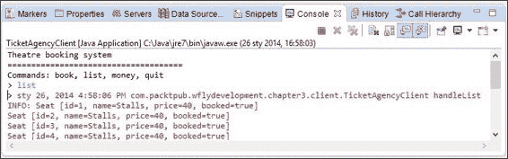

# 第三章. 介绍 Java EE 7 – EJBs

在上一章中，你学习了如何设置和部署 Hello World 应用程序在 WildFly 上的基础知识。在本章中，我们将更深入地学习如何创建、部署和组装企业 JavaBeans，它们是大多数企业应用程序的核心。此外，你还将学习如何使用 Maven，这是一个流行的构建工具，可以简化我们的 Bean 的打包过程。

更详细地说，以下是本章你将学习的内容：

+   新的 EJB 3.2 规范引入了哪些变化

+   如何创建一个 Java EE 7 Maven 项目

+   如何开发一个单例 EJB

+   如何创建无状态和有状态的 Enterprise JavaBeans

+   如何向你的应用程序添加和管理调度器和定时器

+   如何在 EJB 项目中使用异步 API

# EJB 3.2 – 概述

根据**企业 JavaBeans**（**EJB**）规范，企业 JavaBeans 是通常实现 Java 企业版应用程序（对于 Java EE，请注意，Oracle 建议不要使用 JEE 作为 Java 企业版的缩写；有关 Java 相关技术缩写的更多信息，请访问[`java.net/projects/javaee-spec/pages/JEE`](https://java.net/projects/javaee-spec/pages/JEE)）。由于它们的事务性，EJBs 也常用于许多应用程序的数据访问层构建。然而，在新版规范中，容器管理的交易不再是企业 JavaBeans 的专属，并且可以在 Java EE 平台的其它部分重用。

基本上，Enterprise JavaBeans 有三种类型：

+   **会话 Bean**：这是最常用的 EJB 类型。容器管理每个被定义为会话 Bean 的类的多个实例（单例除外，它只有一个实例）。当一个由 EJB 实现的操作必须执行时（例如，因为用户请求更新数据库中的实体），容器为特定用户分配一个会话 Bean 实例。然后，代表调用客户端执行此代码。容器负责为会话 Bean 提供多个系统级服务，例如安全、事务或 Bean 的分布。

+   **消息驱动 Bean**（**MDB**）：MDBs 是能够异步处理任何 JMS 生产者发送的消息的企业 Bean。（我们将在第六章，*使用 JBoss JMS 提供程序开发应用程序*中讨论 MDBs。）

+   **实体对象**：EJB 用于在数据库中表示实体。最新版本的规范使这种类型的 Enterprise JavaBeans 成为可选的，因此它们可能不在所有容器中得到支持（在 WildFly 中也已取消支持）。实体对象将在 Java EE 8 中从规范中删除。目前，在 Java EE 7 中，主要的持久化技术是 Java 持久化 API。我们将在第五章，*将持久化与 CDI 结合*中讨论 JPA。

此外，会话 Bean 可以根据其特性和使用场景分为三种子类型。

+   **无状态会话 Bean**（**SLSB**）：这些对象的实例与调用它们操作的客户端没有对话状态。这意味着当它们不服务客户端时，所有这些 Bean 实例都是相同的，并且容器可以为它们准备一个池来并行处理多个请求。因为它们不存储任何状态，所以它们的性能开销相当低。无状态服务负责从数据库检索对象的场景是 SLSB 的一个常见用法。

+   **有状态会话 Bean**（**SFSB**）：SFSB 支持与紧密耦合的客户端进行对话式服务。有状态会话 Bean 为特定客户端完成一项任务，并且不能在多个调用者之间共享。它在客户端会话期间维护状态。会话完成后，状态不会保留。容器可能会决定钝化（序列化并存储以供将来使用）一个过期的 SFSB。这样做是为了节省应用服务器的资源，或者在某些情况下，为了在应用服务器域中支持 SFSB 故障转移机制（这是 JBoss AS 7 和 WildFly 的情况）。从 EJB 3.2 开始，可以禁用特定 SFSB 的钝化，尽管这可能会影响服务器的稳定性和故障转移能力。购物车可以作为 SFSB 的一个简单用例。

+   **单例 EJB**：这本质上与无状态会话 bean 相似；然而，它使用单个实例来服务客户端请求。因此，你可以保证在调用之间使用相同的实例。单例可以使用更丰富的生命周期来处理一系列事件，以及控制 bean 初始化时间的可能性。此外，可以强制执行更严格的锁定策略来控制对实例的并发访问，以便多个客户端可以使用单例 bean 的共享状态。如果应用程序在域的多个节点上分布式部署，那么每个运行的 JVM 都将有自己的单例 bean 实例。我们将在第十一章中进一步讨论这个问题，*WildFly 应用程序的集群*。由于它们的特殊特性，单例可以用来保存应用程序的状态、缓存或在应用程序启动时初始化一些资源。

如我们之前提到的，容器管理 bean 的实例，但客户端应该通过业务接口来调用它们。会话 bean 有三种类型的视图可用：

+   **本地业务接口**：当 bean 及其客户端位于同一容器中时使用此会话 bean。它使用按引用传递的语义，因此返回值和方法参数基于引用，而不是对象的副本。

+   **远程业务接口**：在这个会话 bean 中，客户端和 bean 的位置是独立的（客户端可能位于另一个容器中，或者根本不需要容器，例如作为一个独立的应用程序）。每个参数和返回值都被序列化和复制。

+   **无接口视图**：这个会话 bean 是本地业务视图的一个变体，它不需要单独的接口，也就是说，bean 类的所有`public`方法都会自动暴露给调用者。

自 EJB 3.1 以来，可以使用异步方法。这些方法能够异步处理客户端请求，就像消息驱动 bean 一样，除了它们提供了一个类型化的接口，并采用更复杂的方法来处理客户端请求。可以使用两种方法来实现这种行为：

+   客户端调用的异步 void 方法，即“fire-and-forget”异步方法

+   返回类型为`Future<?>`的异步方法，即“检索结果稍后”方法

在继续之前，你还需要了解哪些关于 EJB 的知识？当你开发企业 JavaBean 时，你必须遵循一些通用规则，如下所示：

+   避免使用非 final 静态字段

+   不要手动创建线程（我们将在第十二章中更深入地讨论这个主题，*长期任务执行*）

+   不要使用同步原语（除了在 bean 管理的并发中的单例）

+   禁止在文件系统上手动执行文件操作和监听套接字

+   原生库不应被加载

违反这些规则可能会导致 EJB 容器出现安全和稳定性问题。可以在[`www.oracle.com/technetwork/java/restrictions-142267.html`](http://www.oracle.com/technetwork/java/restrictions-142267.html)找到不允许的活动列表，以及一些特定点的解释。

由于用实际例子更容易理解概念，在下一节中，我们将提供一个具体的应用程序示例，介绍本节中描述的一些特性。

# 开发单例 EJB

如其名所示，`javax.ejb.Singleton` 是一个会话 Bean，它保证应用程序中最多只有一个实例。

### 注意

此外，单例 EJB 填补了 EJB 应用程序中的一个知名空白，即当应用程序启动和停止时能够通知 EJB。因此，你可以用 EJB 做许多以前（在 EJB 3.1 之前）只能用启动时加载的 servlet 做的事情。EJB 还为你提供了一个可以存放与整个应用程序及其所有用户相关数据的地方，而不需要静态类字段。

为了将你的 EJB 转换为单例，你只需要在它上面应用 `@javax.ejb.Singleton` 注解。

### 注意

单例 Bean 类似于有状态的 Bean，因为状态信息在方法调用之间保持。然而，每个服务器 JVM 只有一个单例 Bean，它被应用程序的所有 EJB 和客户端共享。这种类型的 Bean 提供了一种方便的方式来维护应用程序的整体状态。但是，如果应用程序分布在多个机器（因此多个 JVM）上，那么每个机器上的单例都是唯一的。任何应用程序状态必须在节点之间同步。

值得学习的一个注释是 `@javax.ejb.Startup`，它会在应用程序启动时由容器实例化该 Bean。如果你在 EJB 中定义了带有 `@javax.annotation.PostConstruct` 注解的方法，它将调用该方法。

现在我们已经有了足够的信息来理解我们的第一个 EJB 示例。创建 Java Enterprise 项目有多种选择。在早期章节中，我们展示了如何从一个基于 Eclipse Java EE（一个动态 Web 项目）的项目开始，稍后将其绑定到 WildFly 运行时安装。这显然是最简单的选择，你可以很容易地使用这种模式运行本书中的示例；然而，当涉及到企业解决方案时，几乎每个项目现在都使用某种类型的构建自动化工具。对于本书，我们将提出 Apache Maven，因为它是最受欢迎的选择之一，但并非唯一。Gradle 是一个类似的项目，它使用 Groovy 语言来描述项目结构、依赖关系和构建工作流程。

当你转向 Maven 项目时，你将获得的某些好处包括定义良好的依赖结构、项目构建最佳实践的传统，以及项目模块化设计，仅举几例。此外，当你有一个自动化的构建过程时，你可以使用持续集成工具（如 Jenkins）来安排应用程序的自动化测试和部署。

所有主要的 IDE 都有内置的 Maven 支持。这包括 Eclipse Java EE Luna 版本。

因此，让我们直接从 Eclipse 创建我们的第一个 Maven 项目。导航到 **文件** | **新建** | **其他** | **Maven** | **Maven 项目**。这将在以下屏幕截图中显示：


点击 **下一步**；你将被带到以下中间屏幕：


Maven 允许在创建新项目时使用原型。它们定义了一个项目的基本依赖、资源、结构等等。例如，你可以使用一个网络应用程序原型来获取一个空的项目骨架，然后你可以直接构建和部署。不幸的是，原型通常过时，你仍然需要根据你的需求进行调整。为了使用一些 Java EE 7 原型，你必须首先定义一个仓库和你想要使用的原型，然后你才能创建一个项目。在现实生活中，你可能只是通过查看你之前的那些项目来创建每一个新项目，而不使用任何原型。因此，这里我们将展示如何从头开始创建一个项目。你可能还对一些额外的 Java EE 相关工具感兴趣，例如 JBoss Forge，你将在附录中找到其描述，*Rapid Development Using JBoss Forge*。

在可见的屏幕上，勾选 **创建一个简单项目** 复选框。使用此选项，我们将跳过原型选择。你可以点击 **下一步**。现在，你必须完成一些基本的项目信息。我们正在创建一个服务器端 EJB 应用程序，它还有一个独立的客户端。这两个项目可以共享一些共同信息，例如关于依赖及其版本的信息。因此，我们想要创建一个 Maven 多模块项目。在这个第一步中，让我们创建一个具有 POM 打包的父项目。POM 是 Maven 用来描述项目及其模块结构的一种约定。更多关于这个的信息可以在我们之前章节中提到的 Sonatype 免费书籍中找到。

你可以通过输入一些包特定信息来完成向导，如下面的屏幕截图所示：


对于 **组 ID**（一个具有类似 Java 包角色的抽象标识符），您可以使用 `com.packtpub.wflydevelopment.chapter3`。对于 **工件 ID**（我们项目的简化名称），只需使用 `ticket-agency`。将 **打包** 字段设置为 **pom**，并且可以保留项目 **版本** 字段的默认选择。点击 **完成** 以完成向导。

看看我们新创建的项目。目前，它只包含 `pom.xml`，这将是新模块的基础。再次导航到 **文件** | **新建** | **其他** | **Maven**，但现在选择 **新建 Maven 模块**。您现在可以看到以下截图：


再次，我们想跳过存档选择，因此请检查 **创建简单项目** 选项。在 **父项目** 下，点击 **浏览** 并选择我们之前创建的父项目。在 **模块名称** 下，输入 `ticket-agency-ejb`。点击 **下一步**。您将看到以下屏幕。


现在，让我们讨论打包类型。Java EE 部署有几种可能的存档类型：

+   **EJB 模块**：此模块通常包含 EJB 的类，打包为 `.jar` 文件。

+   **Web 模块**：此存档可以包含额外的 Web 元素，如 servlet、静态 Web 文件、REST 端点等。它打包为 `.war` 文件（Web 存档）。

+   **资源适配器模块**：此存档包含与 JCA 连接器相关的文件（在第六章开发使用 JBoss JMS 提供程序的应用程序中描述），打包为 `.rar` 文件。

+   **企业存档**：此存档聚合了多个 Java EE 模块（EJB、Web）及其相关描述符。它打包为 `.ear` 文件。

在这里，我们只想部署 EJB 而不包含任何 Web 元素，因此将打包设置为 EJB（如果它在 Eclipse 下拉菜单中不可见，只需手动输入即可）并点击 **完成**。

按照相同的步骤添加第二个模块，模块名为 `ticket-agency-ejb-client`，打包类型为 JAR。这将是一个简单的客户端，用于在 `ticket-agency-ejb` 中公开的服务。

现在，看看我们的父项目 `pom.xml`。它应该定义两个最近创建的模块，如下所示：

```java
    <modules>
        <module>ticket-agency-ejb</module>
        <module>ticket-agency-ejb-client</module>
    </modules>
```

这些操作的预期结果应与以下截图相匹配，该截图是从项目资源管理器视图获取的：


如您所见，`ticket-agency-ejb` 和 `ticket-agency-ejb-client` 项目已按标准 Maven 项目组织：

+   `src/main/java` 将包含我们的源代码

+   `src/main/resources` 用于配置（包含一个用于 EJB 项目的裸骨 `ejb-jar.xml` 配置文件）

+   `src/test/java` 用于存储测试类

目前，我们将关注主文件 `pom.xml`，它需要知道 Java EE 依赖项。

## 配置 EJB 项目对象模块（pom.xml）

在深入研究代码之前，首先你需要进一步配置 Maven 的 `pom.xml` 配置文件。这个文件相当冗长，所以我们在这里只展示理解我们的示例所必需的核心元素，完整的列表留到本书的代码示例包中。

我们将在属性部分之后添加对 Java EE 7 API 的引用，如下所示：

```java
<dependencies>
    <dependency>
        <groupId>javax</groupId>
        <artifactId>javaee-api</artifactId>
        <version>7.0</version>
        <scope>provided</scope>
    </dependency>
</dependencies>
```

这个依赖项将添加所有 Java EE 7.0 API 的定义。范围设置为 provided，这意味着依赖项在目标环境中（在我们的例子中，是应用程序服务器）可用，并且不需要包含在构建的存档中。这个依赖项是通用的，应该与所有兼容 Java EE 7.0 的应用程序服务器一起工作，而不仅仅是与 WildFly。

我们还希望添加第二个依赖项，即 JBoss 日志 API。将此定义放在相同的 `<dependencies> </dependencies>` 标签中，例如在 `javaee-api` 下方，如下所示：

```java
<dependency>
    <groupId>org.jboss.logging</groupId>
    <artifactId>jboss-logging</artifactId>
    <version>3.1.4.GA</version>
    <scope>provided</scope>
</dependency>
```

### 注意

提供的范围包括企业依赖项，相当于将库添加到编译路径。因此，它期望 JDK 或容器在运行时提供依赖项。除了依赖项之外，我们还想配置构建过程。创建的项目指定了 EJB 打包，但构建使用的是与 JDK 1.5 兼容的级别和一个旧的 EJB 版本。这就是为什么我们想在 `pom.xml` 中添加一个额外的代码块，如下所示：

```java
<build>
    <plugins>
        <plugin>
           <groupId>org.apache.maven.plugins</groupId>
           <artifactId>maven-compiler-plugin</artifactId>
            <version>3.1</version>
            <configuration>
                <!-- enforce Java 8 -->
                <source>1.8</source>
                <target>1.8</target>
           </configuration>
        </plugin>
        <plugin>
           <groupId>org.apache.maven.plugins</groupId>
           <artifactId>maven-ejb-plugin</artifactId>
           <version>2.3</version>
           <configuration>
                <ejbVersion>3.2</ejbVersion>
                <!-- Generate ejb-client for client project -->
                <generateClient>true</generateClient>
           </configuration>
        </plugin>
    </plugins>
</build>
```

此代码块执行以下两项操作：

+   `maven-compiler-plugin` 配置强制使用 Java 8

+   `maven-ejb-plugin` 配置定义了使用 EJB 3.2 版本，并启用了为 EJB 客户端应用程序生成 EJB 客户端（默认禁用）包

此外，检查 `src/main/resources/META-INF/ejb-jar.xml` 文件。它可能包含来自 EJB 2.1 的配置。相反，使用以下代码：

```java
<?xml version="1.0" encoding="UTF-8"?>
<ejb-jar 

         xsi:schemaLocation="http://xmlns.jcp.org/xml/ns/javaee"
         version="3.2">
    <display-name>ticket-agency-ejb</display-name>
    <ejb-client-jar>ticket-agency-ejbClient.jar</ejb-client-jar>
</ejb-jar>
```

到目前为止，你将能够编译你的项目；因此，我们将开始添加类，但在部署你的工件时，我们将回到 `pom.xml` 文件。

## 编写我们的 EJB 应用程序

创建 EJB 类不需要与复杂的向导混淆；你只需要添加裸 Java 类。因此，从**文件**菜单，转到**新建** | **Java 类**，并将 `TheatreBox` 作为类名，`com.packtpub.wflydevelopment.chapter3.control` 作为包名输入。

我们将在类中添加以下实现：

```java
@Singleton
@Startup
@AccessTimeout(value = 5, unit = TimeUnit.MINUTES)
public class TheatreBox {

    private static final Logger logger = Logger.getLogger(TheatreBox.class);

    private Map<Integer, Seat> seats;

    @PostConstruct
    public void setupTheatre() {
        seats = new HashMap<>();
        int id = 0;
        for (int i = 0; i < 5; i++) {
            addSeat(new Seat(++id, "Stalls", 40));
            addSeat(new Seat(++id, "Circle", 20));
            addSeat(new Seat(++id, "Balcony", 10));
        } 
        logger.info("Seat Map constructed.");
    }

    private void addSeat(Seat seat) {
        seats.put(seat.getId(), seat);
    }

    @Lock(READ)
    public Collection<Seat> getSeats() {
        return Collections.unmodifiableCollection(seats.values());
    }

    @Lock(READ)
    public int getSeatPrice(int seatId) throws NoSuchSeatException {
        return getSeat(seatId).getPrice();
    }

    @Lock(WRITE)
    public void buyTicket(int seatId) throws SeatBookedException, NoSuchSeatException {
        final Seat seat = getSeat(seatId);
        if (seat.isBooked()) {
            throw new SeatBookedException("Seat " + seatId + " already booked!");
        }
        addSeat(seat.getBookedSeat());
    }

    @Lock(READ)
    private Seat getSeat(int seatId) throws NoSuchSeatException {
        final Seat seat = seats.get(seatId);
        if (seat == null) {
            throw new NoSuchSeatException("Seat " + seatId + " does not exist!");
        }
        return seat;
    }
}
```

让我们详细看看我们的应用程序代码；void 方法 `setupTheatre` 在应用程序部署时被调用，负责组装剧院座位，创建一个简单的 `Seat` 对象映射。座位标识符是这个映射的关键因素。这发生在部署之后，因为我们的 bean 被注解为 `@Singleton` 和 `@Startup`，这强制容器在启动时初始化 bean。每个 `Seat` 对象都是使用一组三个字段构造函数构建的，包括座位 ID、其描述和价格（预订字段最初设置为 false）。这在下述代码中给出：

```java
public class Seat {
    public Seat(int id, String name, int price) {
        this(id, name, price, false);
    }
    private Seat(int id, String name, int price, boolean booked) {
        this.id = id;
        this.name = name;
        this.price = price;
        this.booked = booked;
    }
    public Seat getBookedSeat() {
        return new Seat(getId(), getName(), getPrice(), true);
    }
    // Other Constructors, Fields and Getters omitted for brevity
}
```

注意，我们的 `Seat` 对象是不可变的。在创建实例后，我们将无法更改其状态（字段的值，所有字段都是最终的，并且没有暴露设置器）。这意味着当我们向客户端（本地或远程）返回一个 `Seat` 对象时，它只能用于读取。

接下来，单例 bean 公开了四个公共方法；`getSeats` 方法返回一个不可修改的 `Seat` 对象集合，它将返回有关它们是否已被预订的信息给用户。该集合必须是不可修改的，因为我们的 Singleton 公开了一个无接口视图，这意味着我们正在使用引用传递语义。如果我们不保护集合，那么对返回集合中任何元素的更改都将在我们的缓存上完成。更重要的是，客户端可以向我们的内部集合添加或删除元素！

`getSeatPrice` 方法是一个实用方法，它将获取座位价格并将其作为 `int` 返回，因此可以用来验证用户是否有能力购买门票。

`getSeat` 方法返回一个给定 ID 的不可变 `Seat` 对象。再次强调，我们返回一个不可变的 `Seat` 对象，因为我们不希望客户端在不使用 `TheatherBox` bean 的情况下更改对象。

最后，`buyTicket` 方法是实际购买门票的方法，因此将门票设置为已预订。我们不能更改不可变对象的值，但我们可以用包含另一个值的新对象来替换它。新创建的对象被放置在 hashmap 中，而不是旧的一个。

## 控制 bean 并发

如您可能已经注意到的，bean 在管理我们的 `Seat` 对象集合的方法上包含了一个 `@Lock` 注解。这种类型的注解用于控制单例的并发。

默认情况下，对单例 EJB 的并发访问由容器控制。对单例的读写访问一次仅限于一个客户端。然而，通过使用注解，可以提供更细粒度的并发控制。这可以通过使用 `@Lock` 注解来实现，其参数决定了允许的并发访问类型。

通过使用类型为 `javax.ejb.LockType.READ` 的 `@Lock` 注解，将对 bean 的多线程访问将允许。这在下述代码中显示：

```java
 @Lock(READ)
    public Collection<Seat> getSeats() {
        return Collections.unmodifiableCollection(seats.values());
    }
```

另一方面，如果我们应用`javax.ejb.LockType.WRITE`，将强制执行单线程访问策略，如下面的代码所示：

```java
 @Lock(WRITE)
    public void buyTicket(int seatId) throws SeatBookedException, NoSuchSeatException {
        final Seat seat = getSeat(seatId);
        if (seat.isBooked()) {
            throw new SeatBookedException("Seat " + seatId + " already booked!");
        }
        addSeat(seat.getBookedSeat());
    }
```

通用思路是在只从缓存中读取值的`READ`类型锁方法上使用`READ`类型锁，对于更改缓存中元素值的`WRITE`类型锁方法使用`WRITE`类型锁。请记住，`WRITE`类型锁会阻塞所有带有`READ`类型锁的方法。确保单例对其状态的修改具有独占控制权至关重要。缺乏适当的封装与引用传递语义（在 EJB 的本地和无接口视图中使用）混合可能导致难以发现的并发错误。将不可变对象作为单例的返回值是一种解决这类问题的好策略。另一种策略是只返回我们对象的副本或切换到值传递语义。最后一种策略可以通过在单例中切换到远程业务接口来实现。

在`TheatreBox`代码中，你可能已经注意到了一个`@AccessTimeout`注解（值为`5`，单位为`TimeUnit.MINUTES`）。当你对一个带有`@Lock (WRITE)`的方法执行查询，并且如果有其他线程正在访问它，那么在等待 5 秒后，你会得到一个超时异常。为了改变这种行为（例如，通过延长允许的等待时间），你可以在方法或类级别指定一个`@javax.ejb.AccessTimout`注解。

### 使用 bean 管理的并发

另一个可能的选择是使用由`@javax.ejb.ConcurrencyManagement`注解（带有参数`ConcurrencyManagementType.BEAN`）实现的 bean 管理的并发策略。这个注解将禁用我们之前使用的`@Lock`注解的效果，将确保单例缓存不被损坏的责任放在开发者身上。

因此，为了确保我们的预订得到保留，我们将在`buyTicket`方法上使用一个众所周知的同步关键字，如下所示：

```java
@Singleton
@Startup
@ConcurrencyManagement(ConcurrencyManagementType.BEAN)
public class TheatreBox {
. . . .
  public synchronized void buyTicket(int seatId) {
    final Seat seat = getSeat(seatId);
    if (seat.isBooked()) {
        throw new SeatBookedException("Seat " + seatId + " already booked!");
    }
    addSeat(seat.getBookedSeat());
}
```

当一个线程进入同步块时，并发访问被限制，因此在此期间不允许其他方法访问该对象。使用同步块相当于拥有容器管理的并发性，所有方法默认使用类型为`WRITE`的锁。这是 Java EE 中少数几个开发者可以使用同步原语而不影响容器稳定性的地方之一。

## 编写会话 Bean

我们的单一 EJB 配备了处理我们的剧院座位库存的方法。现在我们将向我们的项目中添加几个会话 Bean 来管理业务逻辑，一个无状态会话 Bean 将提供剧院座位的视图，以及作为我们系统支付网关行为的会话 Bean。

### 注意

将我们的信息系统拆分为两个不同的 Bean 的选择并不属于特定的设计模式，而是服务于不同的目的。那就是，我们希望展示如何从远程客户端查找这两种类型的 Bean。

## 添加无状态的 Bean

因此，我们将首先创建的 Bean 是`com.packtpub.wflydevelopment.chapter3.boundary.TheatreInfo`，它几乎只包含查找剧院座位列表的逻辑。实际上，这个 Bean 充当了我们单例 Bean 的代理，如下面的代码所示：

```java
@Stateless
@Remote(TheatreInfoRemote.class)
public class TheatreInfo implements TheatreInfoRemote {
 @EJB
 private TheatreBox box;

    @Override
    public String printSeatList() {
        final Collection<Seat> seats = box.getSeats();
        final StringBuilder sb = new StringBuilder();
        for (Seat seat : seats) {
            sb.append(seat.toString());
            sb.append(System.lineSeparator());
        }
        return sb.toString();
    }
}
```

由于我们计划从远程客户端调用这个 EJB，我们使用`@Remote(TheatreInfoRemote.class)`注解为其定义了一个远程接口。

接下来，看看`@EJB TheatreBox` `box`，它可以用来安全地将 EJB 注入到您的类中，而无需手动 JNDI 查找。这种做法可以提高应用程序在不同应用服务器之间的可移植性，在这些服务器中可能存在不同的 JNDI 规则。

您的 Bean 的远程接口将像以下代码一样简单：

```java
public interface TheatreInfoRemote {
    String printSeatList();
}
```

### 注意

如果您计划仅将您的 EJB 暴露给本地客户端（例如，给一个 servlet），您可以省略远程接口定义，只需简单地用`@Stateless`注解您的 Bean 即可。应用服务器将创建一个无接口视图的会话 Bean，它可以安全地注入到您的本地客户端，如 servlet 或其他 EJB。请注意，这也改变了方法参数和返回值的语义。对于远程视图，它们将被序列化并通过值传递。

## 添加有状态的 Bean

为了跟踪我们的客户口袋里有多少钱，我们需要一个会话感知组件。将一个 Java 类转换成一个有状态的会话 Bean 只需在其上添加一个`@Stateful`注解，就像我们示例中的`com.packtpub.wflydevelopment.chapter3.boundary.TheatreBooker`类一样。这在上面的代码中有所展示：

```java
@Stateful
@Remote(TheatreBookerRemote.class)
@AccessTimeout(value = 5, unit = TimeUnit.MINUTES)
public class TheatreBooker implements TheatreBookerRemote {
    private static final Logger logger = Logger.getLogger(TheatreBooker.class);

    @EJB
    private TheatreBox theatreBox;
    private int money;

    @PostConstruct
    public void createCustomer() {
        this.money = 100;
    }

    @Override
    public int getAccountBalance() {
        return money;
    }

    @Override
    public String bookSeat(int seatId) throws SeatBookedException, NotEnoughMoneyException, NoSuchSeatException {
        final int seatPrice = theatreBox.getSeatPrice(seatId);
        if (seatPrice > money) {
            throw new NotEnoughMoneyException("You don't have enough money to buy this " + seatId + " seat!");
        }

 theatreBox.buyTicket(seatId);
        money = money - seatPrice;

        logger.infov("Seat {0} booked.", seatId);
        return "Seat booked.";
    }
}
```

如您所见，之前的 Bean 带有`@PostConstruct`注解，用于初始化一个会话变量（money），该变量将用于检查客户是否有足够的钱购买票。在使用 EJB 时，我们不使用`构造器`和`析构器`来对一个对象执行动作以创建或销毁。原因是该对象可能还没有注入它所依赖的所有对象。带有`@PostConstruct`注解的方法是在对象创建完成后执行的，也就是说，所有对象都已经注入到它中。还有一个与 EJB 生命周期相关的第二个注解，`@PreDestroy`，它在对象销毁之前执行。

此外，我们的 SFSB 的最终目的是在执行一些业务检查后调用我们的单例的`buyTicket`方法。

如果业务检查未通过，应用程序将抛出一些异常。例如，如果座位已经被预订或者如果客户没有足够的钱购买票，就会出现这种情况。为了保持我们的对话进行，我们的异常必须是通用`Exception`类的扩展。有关更多信息，请参考以下代码：

```java
public class SeatBookedException extends Exception {
  // some code 
}
```

如果我们使用运行时异常（例如，`EJBException`），则将丢弃 bean 实例，并且远程客户端与服务器之间的通信将被切断。因此，在处理 EJB 时，始终要小心选择适当的异常类型——如果您处理的是不可恢复的场景（与企业信息系统之间的连接被切断），则选择抛出运行时异常。这种异常被称为系统异常。另一方面，如果您处理的是业务类型的异常；例如，如果预订的座位已经被占用，则考虑抛出检查异常（或者简单地不抛出异常）。可恢复异常被称为应用程序异常。

使用`@ApplicationException`注解，还可以将运行时异常（通常为系统异常）标记为可恢复异常。您甚至可以使用`@ApplicationException`（带有`rollback true`）在异常类上或业务方法内的`EJBContext.setRollbackOnly`语句中决定当前事务是否应该回滚（系统异常的默认行为）。是否回滚事务的决定权在开发者手中，在大多数情况下，这取决于业务场景。

# 部署 EJB 应用程序

按照现状，您应该能够通过执行以下 Maven 目标并从项目根目录启动命令行提示符来打包您的 EJB 项目：

```java
mvn package

```

上述命令将编译并打包需要复制到应用程序服务器`deployments`文件夹中的应用程序。这是可以的；然而，通过仅安装几个插件，我们可以期待 Maven 提供更多功能。在我们的例子中，我们将通过添加以下部分来配置我们的项目以使用 Maven 的 WildFly 插件：

```java
<build>
 <finalName>${project.artifactId}</finalName>
    <plugins>
 <!-- WildFly plugin to deploy the application -->
 <plugin>
 <groupId>org.wildfly.plugins</groupId>
 <artifactId>wildfly-maven-plugin</artifactId>
 <version>1.0.2.Final</version>
 <configuration>
 <filename>${project.build.finalName}.jar</filename>
 </configuration>
 </plugin>
        <plugin>
            <groupId>org.apache.maven.plugins</groupId>
            <artifactId>maven-compiler-plugin</artifactId>
            <version>3.1</version>
            <configuration>
                <!-- enforce Java 8 -->
                <source>1.8</source>
                <target>1.8</target>
            </configuration>
        </plugin>
        <plugin>
            <groupId>org.apache.maven.plugins</groupId>
            <artifactId>maven-ejb-plugin</artifactId>
            <version>2.3</version>
            <configuration>
                <ejbVersion>3.2</ejbVersion>
                <!-- Generate ejb-client for client project -->
                <generateClient>true</generateClient>
            </configuration>
        </plugin>
    </plugins>
</build>
```

在 XML 片段的第一部分，我们指定了项目的`finalName`属性，这将决定打包构件的名称（在我们的例子中，项目的名称与我们的项目构件 ID 相对应，因此它将被命名为`ticket-agency-ejb.jar`）。

命名为`wildfly-maven-plugin`的构件 ID 将实际触发用于部署我们项目的 WildFly Maven 插件。

因此，一旦您配置了 WildFly 插件，您就可以通过从项目根目录进入来自动部署应用程序。这可以通过在控制台中键入以下命令来完成：

```java
mvn wildfly:deploy

```

由于部署对于开发者来说是一项重复性任务，因此从 Eclipse 环境中执行此操作将非常方便。您只需要从菜单中选择**运行** | **运行配置**来创建一个新的**运行配置**设置。

进入项目的基目录（提示：**浏览工作区...**实用程序可以帮助您从项目列表中选择项目）并在**目标**文本框中输入您的 Maven 目标，如下面的屏幕截图所示：


完成此操作后，请确保您的 WildFly 实例正在运行。单击**应用**以保存您的配置，然后单击**运行**以执行应用程序的部署。Maven 插件将激活，一旦验证所有类都已更新，它将开始使用远程 API 将应用程序部署到 WildFly。请注意，您不需要传递任何用户名或密码进行部署。这是因为您是从安装 WildFly 的同一台机器上部署应用程序的。在幕后进行本地用户身份验证，这样程序员就不需要在他们的开发机器上处理这个问题。

在执行命令后，你应该在 Maven 控制台上看到成功消息，如下面的代码所示：

```java
INFO: JBoss Remoting version 4.0.3.Final
[INFO] ---------------------------------------------------------------
[INFO] BUILD SUCCESS
[INFO] ---------------------------------------------------------------
```

另一方面，在 WildFly 控制台上，您会看到相当冗长的输出，指出一些重要的 EJB JNDI 绑定（我们将在下一分钟回到它），并告知我们应用程序已正确部署。如下面的代码所示：

```java
09:09:32,782 INFO  [org.jboss.as.server] (management-handler-thread - 1) JBAS018562: Deployed "ticket-agency-ejb.jar"
```

尽管我们正在开发 WildFly，但我们经常可以在控制台上看到来自 JBoss AS 子系统的信息。这是因为 WildFly 是直接基于 JBoss AS 7 代码库构建的，因此无需担心。

# 创建远程 EJB 客户端

为 WildFly 应用程序服务器创建远程 EJB 客户端与 AS7 非常相似。在 AS6 和较新版本之间可以明显看出差异。

实际上，WildFly 的早期版本（7.x 之前的 JBoss AS 版本）使用 JBoss 命名项目作为 JNDI 命名实现，因此开发者熟悉使用`jnp:// PROVIDER_URL`与应用程序服务器通信。

从 AS7 开始，JNP 项目不再使用——无论是在服务器端还是客户端。JNP 项目的客户端现在已被 jboss-remote-naming 项目取代。JNP 客户端被 jboss-remote-naming 项目取代的原因有很多，其中之一是 JNP 项目在与 JNDI 服务器通信时不允许进行细粒度的安全配置。jboss-remote-naming 项目由 jboss-remoting 项目支持，这允许对安全进行更多和更好的控制。

除了 AS7 和 WildFly 中的新命名实现外，不再支持将自定义 JNDI 名称绑定到 EJB。因此，这些豆总是绑定到规范要求的`java:global`、`java:app`和`java:module`命名空间。因此，通过注解或配置文件设置会话豆元素的 JNDI 名称不再受支持。

那么，将使用什么 JNDI 名称来调用无状态的会话豆？这里就是：

```java
ejb:<app-name>/<module-name>/<distinct-name>/<bean-name>!<fully-qualified-classname-of-the-remote-interface>
```

这有点啰嗦，不是吗？然而，以下表格将帮助你理解：

| 元素 | 描述 |
| --- | --- |
| `app-name` | 这是企业应用程序名称（不带`ear`），如果你的 EJB 被打包在一个 EAR 中 |
| `module-name` | 这是模块名称（不带`.jar`或`.war`），你的 EJB 已经被打包在这个模块中 |
| `distinct-name` | 使用此选项，你可以为每个部署单元设置一个不同的名称 |
| `bean-name` | 这是豆的类名 |
| `fully-qualified-classname-of-the-remote-interface` | 这是远程接口的完全限定类名 |

因此，你的`TheatreInfo EJB`对应的 JNDI 绑定，打包在一个名为`ticket-agency-ejb.jar`的文件中，将是：

```java
ejb:/ticket-agency-ejb//TheatreInfo! com.packtpub.wflydevelopment.chapter3.boundary.TheatreInfoRemote
```

另一方面，有状态的 EJB 将在 JNDI 字符串底部包含一个额外的属性，`?stateful`；这将导致以下 JNDI 命名结构：

```java
ejb:<app-name>/<module-name>/<distinct-name>/<bean-name>!<fully-qualified-classname-of-the-remote-interface>?stateful
```

此外，这里还有`TheatreBooker`类的对应绑定：

```java
ejb:/ticket-agency-ejb//TheatreBooker! com.packtpub.wflydevelopment.chapter3.boundary.TheatreBookerRemote?stateful
```

### 注意

如果你注意服务器日志，你将看到一旦你的应用程序部署，一组 JNDI 绑定将在服务器控制台上显示。例如：

```java
java:global/ticket-agency-ejb/TheatreInfo!com.packtpub.wflydevelopment.chapter3.boundary.TheatreInfoRemote
java:app/ticket-agency-ejb/TheatreInfo!com.packtpub.wflydevelopment.chapter3.boundary.TheatreInfoRemote
java:module/TheatreInfo!com.packtpub.wflydevelopment.chapter3.boundary.TheatreInfoRemote
java:jboss/exported/ticket-agency-ejb/TheatreInfo!com.packtpub.wflydevelopment.chapter3.boundary.TheatreInfoRemote
```

一些这些绑定反映了 Java EE 规范的标准绑定以及 JBoss 自定义绑定（`java:/jboss`）。这些信息本身对我们来说并不相关，但可以通过用`ejb:/`替换 Java EE（或 JBoss 特定前缀）来构建我们的 EJB 客户端查找字符串。例如，将`java:/global`替换为`ejb:`，这样你就可以避免引用 EJB 查找字符串的麻烦。

一旦我们完成了 JNDI 绑定字符串的解码，我们就会编写我们的 EJB 客户端。我们已经在本章开头为它创建了一个单独的子项目（`ticket-agency-ejb-client`），但我们在开始编码之前必须完成其配置。

## 配置客户端的项目对象模块

配置客户端依赖项（在`pom.xml`中）基本上需要连接和传输数据到服务器的所有库，以及所需的 EJB 客户端依赖项。我们将添加的第一件事，就像我们为服务器项目所做的那样，是 EJB 客户端依赖项的 BOM，如下代码片段所示：

```java
<dependencyManagement>
   <dependencies>
      <dependency>
         <groupId>org.wildfly</groupId>
         <artifactId>wildfly-ejb-client-bom</artifactId>
         <version>8.1.0.Final</version>
         <type>pom</type>
         <scope>import</scope>
      </dependency>
   </dependencies>
</dependencyManagement>
```

接下来，我们将添加一组必要的依赖项，用于解析 EJB 接口（`ticket-agency-ejb artifact`），JBoss 的交易 API（因为 EJB 是具有交易感知能力的组件，所以需要），`jboss-ejb-api` 和 `ejb-client` API，`org.jboss.xnio` 和 `org.jboss.xnio` API（提供低级输入/输出实现），`org.jboss.remoting3` API（核心传输协议），它反过来又需要 `org.jboss.sasl`（以安全传输），最后是 `org.jboss.marshalling` API（用于序列化发送到和从服务器接收的对象）。这在上面的代码片段中显示：

```java
<dependencies>
   <dependency>
      <groupId>com.packtpub.wflydevelopment.chapter3</groupId>
      <artifactId>ticket-agency-ejb</artifactId>
      <type>ejb-client</type>
      <version>${project.version}</version>
   </dependency>

   <dependency>
      <groupId>org.jboss.spec.javax.transaction</groupId>
      <artifactId>jboss-transaction-api_1.2_spec</artifactId>
      <scope>runtime</scope>
   </dependency>

   <dependency>
      <groupId>org.jboss.spec.javax.ejb</groupId>
      <artifactId>jboss-ejb-api_3.2_spec</artifactId>
      <scope>runtime</scope>
   </dependency>

   <dependency>
      <groupId>org.jboss</groupId>
      <artifactId>jboss-ejb-client</artifactId>
      <scope>runtime</scope>
   </dependency>

   <dependency>
      <groupId>org.jboss.xnio</groupId>
      <artifactId>xnio-api</artifactId>
      <scope>runtime</scope>
   </dependency>
   <dependency>
      <groupId>org.jboss.xnio</groupId>
      <artifactId>xnio-nio</artifactId>
      <scope>runtime</scope>
   </dependency>

   <dependency>
      <groupId>org.jboss.remoting3</groupId>
      <artifactId>jboss-remoting</artifactId>
         <version>3.3.3.Final</version>
         <scope>runtime</scope>
   </dependency>

   <dependency>
      <groupId>org.jboss.sasl</groupId>
      <artifactId>jboss-sasl</artifactId>
      <scope>runtime</scope>
   </dependency>

   <dependency>
      <groupId>org.jboss.marshalling</groupId>
      <artifactId>jboss-marshalling-river</artifactId>
      <scope>runtime</scope>
   </dependency>
</dependencies>
```

许多这些依赖项使用运行时作用域。这意味着它们提供的类不是直接由我们的代码使用；它们不需要包含在我们的应用程序包中，但在运行时是必需的。

## 编写 EJB 客户端

我们完成了配置。我们最终将添加一个新的 Java 类 `com.packtpub.wflydevelopment.chapter3.client.TicketAgencyClient`，它将与票务预订机的 EJB 应用程序进行通信。这在上面的代码片段中显示：

```java
public class TicketAgencyClient {

    private static final Logger logger = Logger.getLogger(TicketAgencyClient.class.getName());

    public static void main(String[] args) throws Exception {
 Logger.getLogger("org.jboss").setLevel(Level.SEVERE);  [1]
        Logger.getLogger("org.xnio").setLevel(Level.SEVERE);

        new TicketAgencyClient().run();
    }
    private final Context context;
    private TheatreInfoRemote theatreInfo;
    private TheatreBookerRemote theatreBooker;

    public TicketAgencyClient() throws NamingException {
 final Properties jndiProperties = new Properties(); [2]
        jndiProperties.setProperty(Context.URL_PKG_PREFIXES, "org.jboss.ejb.client.naming");
        this.context = new InitialContext(jndiProperties);
    }

    private enum Command { [3]
        BOOK, LIST, MONEY, QUIT, INVALID;

        public static Command parseCommand(String stringCommand) {
            try {
                return valueOf(stringCommand.trim().toUpperCase());
            } catch (IllegalArgumentException iae) {
                return INVALID;
            }
        }
    }

    private void run() throws NamingException {
 this.theatreInfo = lookupTheatreInfoEJB();  [4]
 this.theatreBooker = lookupTheatreBookerEJB();  [5]

 showWelcomeMessage(); [6]

        while (true) {
            final String stringCommand = IOUtils.readLine("> ");
 final Command command = Command.parseCommand(stringCommand); [7]
            switch (command) {
                case BOOK:
                    handleBook();
                    break;
                case LIST:
                    handleList();
                    break;
                case MONEY:
                    handleMoney();
                    break;
                case QUIT:
                    handleQuit();
                    break;

                default:
                    logger.warning("Unknown command " + stringCommand);
            }
        }
    }

    private void handleBook() {
        int seatId;

        try {
            seatId = IOUtils.readInt("Enter SeatId: ");
        } catch (NumberFormatException e1) {
            logger.warning("Wrong SeatId format!");
            return;
        }

        try {
            final String retVal = theatreBooker.bookSeat(seatId);
            System.out.println(retVal);
        } catch (SeatBookedException | NotEnoughMoneyException | NoSuchSeatException e) {
            logger.warning(e.getMessage());
            return;
        }
    }

    private void handleList() {
        logger.info(theatreInfo.printSeatList());
    }

    private void handleMoney() {
        final int accountBalance = theatreBooker.getAccountBalance();
        logger.info("You have: " + accountBalance + " money left.");
    }

    private void handleQuit() {
        logger.info("Bye");
        System.exit(0);
    }
    private TheatreInfoRemote lookupTheatreInfoEJB() throws NamingException {
        return (TheatreInfoRemote) context.lookup("ejb:/ticket-agency-ejb//TheatreInfo!com.packtpub.wflydevelopment.chapter3.boundary.TheatreInfoRemote");
    }

    private TheatreBookerRemote lookupTheatreBookerEJB() throws NamingException {
        return (TheatreBookerRemote) context.lookup("ejb:/ticket-agency-ejb//TheatreBooker!com.packtpub.wflydevelopment.chapter3.boundary.TheatreBookerRemote?stateful");
    }

    private void showWelcomeMessage() {
        System.out.println("Theatre booking system");
        System.out.println("=====================================");
        System.out.println("Commands: book, list,money, quit");
    }
}
```

```java
jboss-ejb-client.properties file in the client's classpath.
```

### 注意

在 Maven 中，大多数资源文件（如提到的属性）的适当位置是 `src/main/resources` 目录。

`jboss-ejb-client.properties` 文件的内容如下：

```java
remote.connections=default
remote.connection.default.host=localhost
remote.connection.default.port=8080
```

还有一个 `remote.connectionprovider.create.options.org.xnio.Options.SSL_ENABLED` 属性，它启用了 XNIO 连接的加密；否则，将使用明文。(第十章，*保护 WildFly 应用程序*，我们将讨论使用 SSL 保护客户端和服务器之间的连接。)

可以将 `remote.connections` 属性设置为定义一组逻辑名称，这些名称将由 `remote.connection.[name].host` 和 `remote.connection.[name].port` 属性用于连接目的。如果您定义了多个连接，如以下示例所示，连接将分布在各种目的地之间，如以下代码片段所示：

```java
remote.connections=host1,host2 
remote.connection.host1.host=192.168.0.1
remote.connection.host2.host=192.168.0.2
remote.connection.host1.port=8080
remote.connection.host2.port=8080
```

远程框架使用的默认端口是 `8080`。

您可能会想知道 EJB 远程如何在与 HTTP 协议相同的端口上工作。从 WildFly 开始，远程使用 HTTP 协议升级机制。第一个连接是在 `8080` 端口（通过 HTTP）完成的，然后升级到 EJB 远程，并切换到另一个端口（由 WildFly 选择）。

## 运行客户端应用程序

为了运行您的客户端应用程序，最后一个要求将是添加所需的 Maven 插件，这些插件是运行远程 EJB 客户端所必需的。这在上面的代码片段中给出：

```java
<build>
   <finalName>${project.artifactId}</finalName>
   <plugins>
      <!-- maven-compiler-plugin here -->

      <plugin>
         <groupId>org.codehaus.mojo</groupId>
         <artifactId>exec-maven-plugin</artifactId>
         <version>1.2.1</version>
         <executions>
            <execution>
               <goals>
                  <goal>exec</goal>
               </goals>
            </execution>
         </executions>
         <configuration>
            <executable>java</executable>
            <workingDirectory>${project.build.directory}/exec-working-directory</workingDirectory>
            <arguments>
               <argument>-classpath</argument>
               <classpath />
            <argument>com.packtpub.wflydevelopment.chapter3.client.TicketAgencyClient</argument>
            </arguments>
         </configuration>
      </plugin>
   </plugins>
</build>
```

```java
maven-compiler-plugin configuration that we omitted for the sake of brevity (we discussed it in the server project), we have included exec-maven-plugin, which adds the ability to execute Java programs using the exec goal.
```

一旦所有插件都到位，您可以通过以下 Maven 目标编译和执行您的项目：

```java
mvn package exec:exec

```

前一个命令可以从 shell（位于项目的`root`文件夹中）或从您的 Eclipse 运行时配置中执行，如下面的截图所示：


如果从 Eclipse 环境中执行，您应该能够看到以下 GUI 截图：



目前，我们的应用程序提供了三个功能：一本书来预订座位，一个列表来列出所有剧院座位，以及金钱来检索账户余额。在下一节中，我们将通过添加更多命令来丰富我们的应用程序。

### 添加用户身份验证

如果您从位于应用程序服务器同一台机器上的客户端运行此示例，远程框架将静默允许客户端和您的 EJB 类之间的通信。另一方面，对于位于远程系统上的客户端，您将需要为您的请求提供身份验证。为了添加应用程序用户，启动位于`JBOSS_HOME/bin`的`add-user.sh`（或`add-user.bat`）脚本。

这里是一个用户创建示例的记录：

```java
What type of user do you wish to add?
 a) Management User (mgmt-users.properties)
 b) Application User (application-users.properties)
(a): b

Enter the details of the new user to add.
Using realm 'ApplicationRealm' as discovered from the existing property files.
Username : ejbuser
Password requirements are listed below. To modify these restrictions edit the add-user.properties configuration file.
 - The password must not be one of the following restricted values {root, admin, administrator}
 - The password must contain at least 8 characters, 1 alphanumeric character(s), 1 digit(s), 1 non-alphanumeric symbol(s)
 - The password must be different from the username
Password :
Re-enter Password :
What groups do you want this user to belong to? (Please enter a comma separated list, or leave blank for none)[  ]:
About to add user 'ejbuser' for realm 'ApplicationRealm'
Is this correct yes/no? yes
Added user 'ejbuser' to file 'C:\Programs\Dev\Servers\wildfly-8.0.0.Final\standalone\configuration\application-users.properties'
Added user 'ejbuser' to file 'C:\Programs\Dev\Servers\wildfly-8.0.0.Final\domain\configuration\application-users.properties'
Added user 'ejbuser' with groups  to file 'C:\Programs\Dev\Servers\wildfly-8.0.0.Final\standalone\configuration\application-roles.properties'
Added user 'ejbuser' with groups  to file 'C:\Programs\Dev\Servers\wildfly-8.0.0.Final\domain\configuration\application-roles.properties'
Is this new user going to be used for one AS process to connect to another AS process?
e.g. for a slave host controller connecting to the master or for a Remoting connection for server to server EJB calls.
yes/no? no
Press any key to continue . . .
```

定义的用户将自动添加到位于您的`configuration`文件夹中的`application-user.properties`文件中。

此文件包含名为`ApplicationRealm`的默认安全域。此安全域使用以下格式存储密码：

```java
username=HEX( MD5( username ':' realm ':' password))
```

使用您刚刚输入的密码，文件将包含以下条目：

```java
ejbuser=dc86450aab573bd2a8308ea69bcb8ba9
```

现在，将用户名和密码信息插入到`jboss-ejb-client.properties`文件中：

```java
remote.connection.default.username=ejbuser
remote.connection.default.password=ejbuser123
```

现在，所有先前信息都已放置在正确的位置，您将能够从不在与服务器同一台机器上的客户端连接到您的 EJB 应用程序。

您还可以通过在本地机器上添加以下行到`jboss-ejb-client`属性中，强制执行正常的身份验证过程：

```java
remote.connection.default.connect.options.org.xnio.Options.SASL_DISALLOWED_MECHANISMS=JBOSS-LOCAL-USER
```

## 使用 EJB 计时器服务

模拟业务工作流程的应用程序通常依赖于定时通知。企业 Bean 容器中的计时器服务允许您为所有类型的企业 Bean（除了有状态的会话 Bean）安排定时通知。您可以根据日历计划在特定时间、时间段的持续时间后或定时间隔发生定时通知。

EJB 计时器主要有两种类型：编程式计时器和自动计时器。编程式计时器是通过显式调用`TimerService`接口的计时器创建方法来设置的。自动计时器是在企业 Bean 成功部署时创建的，该 Bean 包含带有`java.ejb.Schedule`或`java.ejb.Schedules`注解的方法。让我们在以下章节中查看这两种方法。

### 编程式计时器创建

要创建一个计时器，Bean 将调用`TimerService`接口的`create`方法之一。这些方法允许创建单次动作、间隔或基于日历的计时器。

获取`TimerService`实例的最简单方法是使用资源注入。例如，在`TheatreBox`单例 EJB 中，我们将使用`@Resource`注解注入一个`TimerService`对象，如下面的代码片段所示：

```java
@Resource
TimerService timerService;

private static final long DURATION = TimeUnit.SECONDS.toMillis(6);
```

持续时间指定了单次计时器触发的时间（以毫秒为单位）。将触发计时器的那个方法将使用`TimerService`实例来调用`createSingleActionTimer`方法，并将持续时间以及`TimerConfig`类的实例作为参数传递，该实例可以包含一些基本信息（例如计时器的描述）。这在上面的代码片段中有所展示：

```java
public void createTimer(){
    timerService.createSingleActionTimer(DURATION, new TimerConfig());
}
```

接下来，我们将创建一个名为`timeout`的回调方法，并在方法上方使用`@Timeout`注解。在`timeout`方法中，例如，我们可以通过调用`setupTheatre`方法来重新初始化我们的单例。没有什么花哨的；然而，这应该能给你一个如何使用单次动作计时器的想法。有关更多信息，请参考以下代码：

```java
@Timeout
public void timeout(Timer timer){
    logger.info("Re-building Theatre Map."); 
    setupTheatre();
}
```

### 计划计时器事件

```java
 explains this:
```

```java
@Stateless
public class AutomaticSellerService {

    private static final Logger logger = Logger.getLogger(AutomaticSellerService.class);

    @EJB
    private TheatreBox theatreBox;

 @Resource
 private TimerService timerService;  [1]

 @Schedule(hour = "*", minute = "*/1", persistent = false)  [2]
    public void automaticCustomer() throws NoSuchSeatException {
        final Optional<Seat> seatOptional = findFreeSeat();
        if (!seatOptional.isPresent()) {
            cancelTimers();
            logger.info("Scheduler gone!");
            return; // No more seats
        }

        final Seat seat = seatOptional.get();

        try {
 theatreBox.buyTicket(seat.getId());   [3]
        } catch (SeatBookedException e) {
            // do nothing, user booked this seat in the meantime
        }

        logger.info("Somebody just booked seat number " + seat.getId());
    }

    private Optional<Seat> findFreeSeat() {
        final Collection<Seat> list = theatreBox.getSeats();
        return list.stream()
            .filter(seat -> !seat.isBooked())
            .findFirst();
    }
    private void cancelTimers() {  [4]
        for (Timer timer : timerService.getTimers()) {
 timer.cancel();
        }
    }
}
```

我们首先应该考虑的是`Timer`对象的资源注入[1]，它将在`TheatreBox`单例的`cancelTimers`方法[4]中用于取消所有调度，当剧院完全订满时。请注意，`timerService.getTimers()`方法检索仅与当前 Bean 关联的所有活动计时器。为了从您的应用程序模块中获取所有计时器，您必须使用最近在 EJB 3.2 中添加的`timerService.getAllTimers()`方法。

接下来，请注意我们使用的`Schedule`注解[2]，它将每分钟触发一个非持久计时器。

### 注意

持久计时器（默认选项）可以在应用程序和服务器崩溃后存活。当系统恢复时，任何持久计时器都将被重新创建，并且丢失的回调事件将被执行。

当不希望重放丢失的计时器事件时，应使用非持久计时器，如前例所示。

当一个动作被触发时，`automaticCustomer`方法开始扫描剧院座位以寻找一个可用的座位。（没有什么太复杂的；`findSeat`从第一个可用的座位开始查找。）

最后，如果还有座位可用，`TheatreBox`单例的`buyTicket`方法[3]将被用来短路购买座位（显然，我们不需要检查自动客户的金钱）。

## 将异步方法添加到我们的 EJB 中

在 EJB 3.1 规范之前，向企业应用提供异步功能的方法是使用消息驱动 bean 配方。这仍然是一个最佳实践，我们将在第六章中深入讨论，*使用 JBoss JMS 提供程序开发应用程序*；然而，在某些情况下，可能希望（并且更容易）从遵循经典请求-响应模式的组件中使用这些异步功能。

您可以通过简单地使用`@Asynchronous`注解标记 EJB 的方法来使其异步。每次调用此方法时，它将立即返回，无论该方法实际上需要多长时间才能完成。

这可以通过两种方式使用：

+   第一种技术是一种“点火并忘记”的方式，其中请求由 EJB 发起，客户端不关心请求的成功或失败。

+   第二种操作方式调用方法但不等待方法完成。方法返回一个`Future`对象。该对象用于稍后确定请求的结果。

### 使用“点火并忘记”的异步调用

如果您不关心异步结果，您的`async`方法可以简单地返回 void。为此，我们将向`TheatreBooker`添加一个名为`bookSeatAsync`的新方法，并简单地将其标记为`@Asynchronous`。这在下述屏幕截图中显示：

```java
 @Asynchronous
 public void bookSeatAsync(int seatId) throws NotEnoughMoneyException, NoSuchSeatException, SeatBookedException {
        bookSeat(seatId);
}
```

如您所见，这种方法不返回任何内容；它只是执行我们的同步`bookSeet`方法。我们需要使用其他工具来检查交易是否成功完成。例如，我们可以从剧院列表中检查座位是否已成功预订。

### 向客户端返回 Future 对象

另一个可用的选项是返回一个`java.util.concurrent.Future`对象，该对象可以稍后由我们的客户端检查，以便他们知道交易的结果。这在下述代码片段中显示：

```java
@Asynchronous
@Override
public Future<String> bookSeatAsync(int seatId) {
        try {
            Thread.sleep(10000);
            bookSeat(seatId);
            return new AsyncResult<>("Booked seat: " + seatId + ". Money left: " + money);
        } catch (NoSuchSeatException | SeatBookedException | NotEnoughMoneyException | InterruptedException e) {
            return new AsyncResult<>(e.getMessage());
        }
    }
```

在这种情况下，对异步`bookSeatAsync`方法的调用在幕后简单地导致创建一个`Runnable`或`Callable Java`对象，该对象封装了您提供的方法和参数。这个`Runnable`（或可调用）对象被交给一个`Executor`对象，它只是一个附加到线程池的工作队列。

在将工作添加到队列后，方法的代理版本返回一个与`Runnable`相关联的 Future 实现，该`Runnable`现在正在队列中等待。

当`Runnable`最终执行`bookSeatAsync`方法时，它将返回值设置到`Future`中，使其对调用者可用。

当处理`Future`对象时，客户端代码需要做出调整。实际上，在标准的同步调用中，我们使用异常来拦截一些事件，例如当客户没有足够的钱来完成交易时。当使用`Future`调用时，这种范式发生了变化。对异步方法的调用与客户端分离；然而，我们有选项通过在 Future 返回值上发出`isDone`方法来检查`Future`工作是否已完成。

为了这个目的，让我们向`TicketAgencyClient`添加一个`bookasync`命令，该命令将执行异步预订，并模拟通过电子邮件读取结果的邮件命令，如下面的代码片段所示：

```java
private final List<Future<String>> lastBookings = new ArrayList<>(); [1]
 // Some code
    case BOOKASYNC:
 handleBookAsync();
 break;
 case MAIL:
 handleMail();
 break; 
// Some code
private void handleBookAsync() {
    String text = IOUtils.readLine("Enter SeatId: ");
    int seatId;

    try {
        seatId = Integer.parseInt(text);
    } catch (NumberFormatException e1) {
        logger.warning("Wrong seatId format!");
        return;
    }

 lastBookings.add(theatreBooker.bookSeatAsync(seatId));  [2]
    logger.info("Booking issued. Verify your mail!");
}

private void handleMail() {
    boolean displayed = false;
    final List<Future<String>> notFinished = new ArrayList<>();
    for (Future<String> booking : lastBookings) {
 if (booking.isDone()) {  [3]
            try {
                final String result = booking.get();
                logger.info("Mail received: " + result);
                displayed = true;
            } catch (InterruptedException | ExecutionException e) {
                logger.warning(e.getMessage());
            }
        } else {
            notFinished.add(booking);
        }
    }

    lastBookings.retainAll(notFinished);
    if (!displayed) {
        logger.info("No mail received!");
    }
}
```

```java
booking [2] and add Future<?> to lastBookings list [1]. On the EJB side, we introduced a pause of 10 seconds to complete the booking so that later on, we can check if the work has been completed by checking the isDone method [3] of the lastBookings list elements object.
```

下面是我们更丰富的客户端应用程序的截图：


# 摘要

在本章中，我们通过一个简单的实验室示例，逐步丰富了 EJB 基础知识以及 EJB 3.2 的变化。这个示例展示了如何在 Eclipse 环境中使用 Maven 项目来协助你组装包含所有必要依赖项的项目。

到目前为止，我们只为我们的应用程序编写了一个远程独立客户端。在下一章中，我们将看到如何使用上下文和依赖注入将 Web 前端添加到我们的示例中，以弥合 Web 层和企业层之间的差距。
