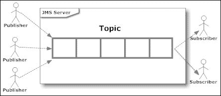

# 第六章：使用 JBoss JMS 提供程序开发应用程序

消息传递是软件组件和应用程序之间的一种通信方法。**Java 消息服务**（JMS）是一个 Java API——最初由 Sun 设计——允许应用程序创建、发送、接收和读取消息。API 的新 2.0 版本随着 JSR 343（[`jcp.org/en/jsr/detail?id=343`](https://jcp.org/en/jsr/detail?id=343)）被引入。

消息传递与其他标准协议（如**远程方法调用**（RMI）或**超文本传输协议**（HTTP））在两个方面有所不同。首先，对话是通过消息服务器介导的，因此不是对等体之间的双向对话。其次，发送者和接收者需要知道使用什么消息格式和目标。这与需要应用程序了解远程应用程序方法的紧密耦合技术（如 RMI）形成对比。

在本章中，我们将涵盖以下内容：

+   消息导向系统的简要介绍

+   JBoss 消息子系统的构建块

+   设置概念验证编程示例

+   如何使用 JMS 和资源适配器与外部系统集成

# JMS 简述

JMS 定义了一套供应商中立的（但 Java 特定的）编程接口，用于与异步消息系统交互。消息传递实现了松散耦合的分布式通信。整个消息交换是一个两步过程，其中组件向目的地发送消息，然后由 JMS 服务器介导的接收者检索。在 JMS 中，有两种类型的目的地：主题和队列。它们有不同的语义，将在下面解释。

在点对点模型中，消息通过队列从生产者发送到消费者。一个特定的队列可能有多个接收者，但只有一个接收者能够消费每条消息。只有第一个请求消息的接收者会得到它，而其他人则不会，如下面的图像所示：


相反，发送到**主题**的消息可能被多个当事人接收。发布在特定主题上的消息会被所有已注册（订阅）接收该主题消息的消息消费者接收。订阅可以是**持久的**或**非持久的**。非持久订阅者只能接收在其**活动**期间发布的消息。非持久订阅不能保证消息的投递；它可能会多次投递相同的消息。另一方面，持久订阅保证消费者恰好接收一次消息，如下面的图像所示：



就消息消费而言，尽管 JMS 本质上是异步的，但 JMS 规范允许以以下两种方式之一消费消息：

+   **同步**：订阅者或接收者通过调用任何 `MessageConsumer` 实例的 `receive()` 方法显式地从目的地获取消息。`receive()` 方法可以阻塞，直到有消息到达，或者如果消息在指定的时间限制内没有到达，可以超时。

+   **异步**：在异步模式下，客户端必须实现 `javax.jms.MessageListener` 接口并重写 `onMessage()` 方法。每当有消息到达目的地时，JMS 提供者通过调用监听器的 `onMessage` 方法来投递消息，该方法作用于消息的内容。

一个 JMS 消息由一个报头、属性和主体组成。消息报头提供一组固定的元数据字段，用于描述消息，例如消息的去向和接收时间。属性是一组键值对，用于特定应用目的，通常用于在接收时快速过滤消息。最后，主体包含发送到消息中的任何数据。

JMS API 支持两种消息投递模式，用于指定在 JMS 提供者失败的情况下，消息是否会丢失，以下常量表示：

+   **持久**投递模式，这是默认模式，指示 JMS 提供者要格外小心，确保在 JMS 提供者失败的情况下，消息在传输过程中不会丢失。使用此投递模式发送的消息在发送时会被记录到稳定的存储中。

+   **非持久**投递模式不需要 JMS 提供者存储消息或保证在提供者失败的情况下不会丢失。

# JMS 的基本构建块

任何 JMS 应用程序的基本构建块包括以下内容：

+   管理对象——连接工厂和目的地

+   连接

+   会话

+   消息生产者

+   消息消费者

+   消息

让我们更详细地看看它们：

+   **连接工厂**：此对象封装了一组由管理员定义的连接配置参数。客户端使用它来与 JMS 提供者建立连接。连接工厂隐藏了特定于提供者的细节，并将管理信息抽象为 Java 编程语言中的对象。

+   **目的地**：这是客户端用于指定其产生的消息的目标和其消费的消息的来源的组件。在 **点对点**（**PTP**）消息域中，目的地被称为队列；在 **发布/订阅**（**pub/sub**）消息域中，目的地被称为主题。

+   **连接**：这封装了一个与 JMS 提供程序的虚拟连接。一个连接可以代表客户端和提供程序服务之间的一个打开的 TCP/IP 套接字。您使用连接来创建一个或多个会话。

+   **会话**：这是一个用于生产和消费消息的单线程上下文。您使用会话来创建消息生产者、消息消费者和消息。会话序列化消息监听器的执行，并提供一个事务上下文，可以将一系列发送和接收操作组合成一个原子的工作单元。

+   **消息生产者**：这是一个由会话创建的对象，用于向目的地发送消息。消息生产者的 PTP 形式实现了`QueueSender`接口。发布/订阅形式实现了`TopicPublisher`接口。从 JMS 2.0 开始，可以仅依赖于`JMSProducer`接口。

+   **消息消费者**：这是一个由会话创建的对象，用于接收发送到目的地的消息。消息消费者允许 JMS 客户端向 JMS 提供程序注册对目的地的兴趣。JMS 提供程序管理从目的地到已注册消费者目的地的消息传递。消息消费者的 PTP 形式实现了`QueueReceiver`接口。发布/订阅形式实现了`TopicSubscriber`接口。最新的 JMS 版本支持新的`JMSConsumer` API。

## JBoss 消息子系统

JBoss AS 在其各个版本中使用了不同的 JMS 实现，例如 JBoss MQ 和 JBoss Messaging。自 JBoss AS 6.0 以来，默认的 JMS 提供程序是**HornetQ**（[`www.jboss.org/hornetq`](http://www.jboss.org/hornetq)），它提供了一个多协议、可嵌入、高性能且可集群的消息系统。

在其核心，HornetQ 被设计成一套简单的**普通 Java 对象**（**POJOs**），对外部 JAR 文件的依赖很少。实际上，唯一的 JAR 依赖是 Netty 库，它利用 Java **新输入输出**（**NIO**）API 来构建高性能网络应用程序。

由于其易于适应的架构，HornetQ 可以嵌入到您自己的项目中，或者在任何依赖注入框架中实例化，例如 JBossMicrocontainer、Spring 或 Google Guice。

在本书中，我们将介绍一个场景，其中 HornetQ 作为模块集成到 WildFly 子系统，如下所示。此图展示了 JCA 适配器和 HornetQ 服务器如何在整体图中定位：


## 创建和使用连接工厂

连接工厂封装连接参数的职责是创建新的 JMS 连接。连接工厂绑定到**Java 命名目录索引**（**JNDI**），并且只要它们提供正确的环境参数，本地和远程客户端都可以查找。由于连接工厂可以在你的代码中多次重用，它是一种可以被远程客户端或消息驱动豆方便地缓存的类型。

连接工厂实例的定义包含在`full`和`full-ha`服务器配置中。你可以使用`–c`命令参数选择任一服务器配置，例如，`standalone.bat –c standalone-full.xml`。我们将在第九章中深入讨论配置配置文件，*管理应用服务器*。现在，只需记住，每次你需要 JMS 时，都要使用完整配置配置文件启动你的服务器。

你可以通过浏览管理控制台并导航到**配置** | **消息目的地** | **连接工厂**来检查整体 JMS 配置中的连接工厂，如下面的截图所示：


如前一个截图所示，有以下两个内置的连接工厂定义：

+   **InVmConnectionFactory**: 这个连接工厂在`java:/ConnectionFactory`条目下进行绑定，并且当服务器和客户端是同一进程的一部分时（即，它们在同一个 JVM 上运行）使用。

+   **RemoteConnectionFactory**: 这个连接工厂在`java:jboss/exported/jms/RemoteConnectionFactory`条目下进行绑定，正如其名称所暗示的，当由远程服务器提供 JMS 连接时，可以使用 Netty 作为连接器来使用。

如果你想要更改连接工厂的 JNDI 绑定，最简单的方法是通过服务器配置文件（例如，对于独立模式，`standalone-full.xml`）：

```java
<connection-factory name="InVmConnectionFactory">
      <connectors>
        <connector-ref connector-name="in-vm"/>
   </connectors>
   <entries>
 <entry name="java:/ConnectionFactory"/>
   </entries>
</connection-factory>
<connection-factory name="RemoteConnectionFactory">
   <connectors>
     <connector-ref connector-name="http-connector"/>
   </connectors>
   <entries>
 <entry name="java:jboss/exported/jms/RemoteConnectionFactory"/>
   </entries>
</connection-factory>
<pooled-connection-factory name="hornetq-ra">
<transaction mode="xa"/>
   <connectors>
      <connector-ref connector-name="in-vm"/>
   </connectors>
   <entries>
 <entry name="java:/JmsXA"/>
 <entry name="java:jboss/DefaultJMSConnectionFactory"/>
    </entries>
</pooled-connection-factory>
```

连接工厂可以像任何其他 Java EE 资源一样注入；以下代码片段显示了无状态 EJB 如何注入默认连接工厂：

```java
@Stateless
public class SampleEJB {

 @Resource(mappedName = "java:/ConnectionFactory")
 private ConnectionFactory cf; 
}
```

### 注意

为了使用消息子系统，你必须使用 Java EE 完整配置启动 WildFly，该配置包括消息子系统。例如，如果你想启动一个具有 JMS 感知能力的独立服务器实例，你可以简单地使用以下代码：

```java
standalone.sh –c standalone-full.xml
```

## 使用 JMS 目的地

除了连接工厂的定义外，你还需要了解如何配置 JMS 目的地（队列和主题）。

这可以通过各种工具实现。由于我们已经开始处理 Web 控制台，只需导航到**配置**选项卡，并从左侧面板中选择**消息**子系统。选择**目的地**并单击**查看**中央链接。

从那里，你可以使用包含一组选项的上层菜单标签，其中第一个选项——命名为**队列/主题**——可以用来配置你的 JMS 目的地，如下面的截图所示：


现在点击**添加**按钮。你应该会看到以下对话框：


输入您目的地的必填名称及其 JNDI。您可以选择性地定义您的 JMS 目的地为以下任一选项：

+   **持久性**：此选项允许 JMS 服务器在订阅者暂时不可用的情况下保留消息。

+   **选择器**：此选项允许对 JMS 目的地进行过滤（我们将在本章后面更详细地介绍）。

点击**保存**按钮并验证队列是否已列入 JMS 目的地之中。

前面的更改将在服务器配置文件中反映如下：

```java
<jms-destinations>
   <jms-queue name="TicketQueue">
      <entry name="java:jboss/jms/queue/ticketQueue"/>
         <durable>false</durable>
   </jms-queue>
</jms-destinations>
```

值得注意的是，JMS 配置通常在每个应用程序服务器上都有所不同。在本章中，我们将只介绍在 WildFly 中使用的方案，但不同供应商之间的关键概念保持相同。

## 将消息驱动 Bean 添加到您的应用程序

一旦我们完成配置，我们就可以开始编写 JMS 消息消费者，例如消息驱动 Bean。

**消息驱动 Bean（MDB**）是无状态的、服务器端和事务感知的组件，用于处理异步 JMS 消息。

消息驱动 Bean 最重要的一个方面是它们可以并发地消费和处理消息。这种能力在传统的 JMS 客户端上提供了显著的优势，因为传统的 JMS 客户端必须被定制构建以管理多线程环境中的资源、事务和安全。MDB 容器自动管理并发，这样 Bean 开发者就可以专注于处理消息的业务逻辑。一个 MDB 可以从各种应用程序接收数百条 JMS 消息，并且可以同时处理它们，因为它的多个实例可以在容器中并发执行。

从语义角度来看，消息驱动 Bean（MDB）被归类为企业 Bean，就像会话或实体 Bean 一样，但有一些重要的区别。首先，消息驱动 Bean 没有组件接口。这是因为消息驱动 Bean 不能通过 Java RMI API 访问；它只响应异步消息。

正如实体和会话 Bean 有明确的生命周期一样，MDB Bean 也是如此。MDB 实例的生命周期有两个状态，**不存在**和**方法就绪池**，如下面的图像所示：


当接收到消息时，EJB 容器会检查池中是否有可用的 MDB 实例。如果免费池中有可用的 Bean，JBoss 将使用该实例。一旦 MDB 实例的`onMessage()`方法返回，请求就完成了，并将实例放回免费池。这导致最佳响应时间，因为请求是在不等待创建新实例的情况下得到服务的。

### 注意

另一方面，如果池中的所有实例都忙碌，新的请求将被序列化，因为可以保证同一实例不会被允许同时为多个客户端提供服务。此外，如果客户端向服务器发送包含 MDB 的多个消息，不能保证每个消息都使用相同的 MDB 实例，或者消息将按照客户端发送的顺序处理。这意味着应用程序应该设计为处理乱序到达的消息。

池中 MDB 的数量在 EJB 池中配置，可以通过控制台导航到**配置** | **容器** | **EJB 3** | **Bean Pools**来访问，如下面的截图所示：


Bean 池的配置包含在 Bean 池中心标签中，其中包含无状态和 MDB 池配置。MDB 的最大池大小默认值为 20 个单位。

还可以覆盖特定 Bean 的池。你可以使用 JBoss 特定的`org.jboss.ejb3.annotation.Pool`注释或`jboss-ejb3.xml`部署描述符。有关覆盖所选 Bean 的池的更多信息，请访问[`docs.jboss.org/author/display/WFLY8/EJB3+subsystem+configuration+guide`](https://docs.jboss.org/author/display/WFLY8/EJB3+subsystem+configuration+guide)。

如果没有可用的 Bean 实例，请求将被阻塞，直到一个活动的 MDB 完成方法调用或事务超时。

### 消息驱动的 Bean 配置

我们现在将从前一章的应用程序中添加一个消息驱动的 Bean，该 Bean 将用于在预订新票时拦截消息。为了我们的示例，我们只需跟踪 JMS 消息是否已接收；然而，你也可以用它来实现更复杂的目的，例如通知外部系统。

创建一个新的 Java 类，例如`BookingQueueReceiver`，并将包名输入为`com.packtpub.wflydevelopment.chapter6.jms`。

完成后，让我们通过注释添加 MDB 配置，如下所示：

```java
package com.packtpub.wflydevelopment.chapter6.jms;

import javax.ejb.ActivationConfigProperty;
import javax.ejb.MessageDriven;
import javax.inject.Inject;
import javax.jms.JMSException;
import javax.jms.Message;
import javax.jms.MessageListener;
import java.util.logging.Logger;

@MessageDriven(name = "BookingQueueReceiver", activationConfig = {
 @ActivationConfigProperty(propertyName = "destinationLookup",
 propertyValue = "java:jboss/jms/queue/ticketQueue"),  [1]
 @ActivationConfigProperty(propertyName = "destinationType",
 propertyValue = "javax.jms.Queue"),}
)
public class BookingQueueReceiver implements MessageListener {

    @Inject
    private Logger logger;

    @Override
    public void onMessage(Message message) {
        try {
            final String text = message.getBody(String.class);
            logger.info("Received message " + text);
        } catch (JMSException ex) {
            logger.severe(ex.toString());
        }
    }
}
```

在这里，我们已经将 MDB 连接到了我们的`ticketQueue`目标 `[1]`，该目标绑定在`java:jboss/jms/queue/ticketQueue`。该组件的目的将是通过`java.util.Logger`跟踪消息接收。

Java EE 7 引入了队列定义的另一种方式。现在，你不必从应用服务器管理工具中添加队列。你可以使用一些基本注解在代码中定义队列及其属性：

```java
package com.packtpub.wflydevelopment.chapter6.jms;

import javax.jms.JMSDestinationDefinition;

@JMSDestinationDefinition(
        name = BookingQueueDefinition.BOOKING_QUEUE,
        interfaceName = "javax.jms.Queue"
)
public class BookingQueueDefinition {

    public static final String BOOKING_QUEUE = "java:global/jms/bookingQueue";
}
```

然后，在`BookingQueueReceiver`中，你只需将`propertyValue = "java:jboss/jms/queue/ticketQueue"`更改为`propertyValue = BookingQueueDefinition.BOOKING_QUEUE`。

### 添加 JMS 生产者

一旦我们完成 JMS 消费者，我们需要一个组件来处理发送 JMS 消息。为此，我们将添加一个应用范围 CDI Bean，比如`BookingQueueProducer`，它被注入到 JMS 资源中：

```java
package com.packtpub.wflydevelopment.chapter6.jms;

import javax.annotation.Resource;
import javax.enterprise.context.RequestScoped;
import javax.inject.Inject;
import javax.jms.JMSContext;
import javax.jms.Queue;

@ApplicationScoped
public class BookingQueueProducer {

    @Inject
    private JMSContext context;
    @Resource(mappedName = BookingQueueDefinition.BOOKING_QUEUE)
    private Queue syncQueue;

    public void sendMessage(String txt) {
        context.createProducer().send(syncQueue, txt);
    }
}
```

这可能对那些使用过 JMS 先前版本的人来说有些震惊。对于那些还没有使用过的人来说，在下面的代码中，我们展示了 JMS 1.1 中此代码的等效版本：

```java
package com.packtpub.wflydevelopment.chapter6.jms;

Import javax.annotation.Resource;
Import javax.enterprise.context.ApplicationScoped;
Import javax.jms.*;
Import java.util.logging.Logger;

@ApplicationScoped
public class BookingQueueProducer {

    @Inject
    private Logger logger;

    @Resource(mappedName = "java:/ConnectionFactory")
    private ConnectionFactorycf;

    @Resource(mappedName = BookingQueueDefinition.BOOKING_QUEUE)
    private Queue queueExample;  

    public void sendMessage(String txt) {
        try {
            final Connection connection = cf.createConnection();
            Session session = connection
                  .createSession(false, Session.AUTO_ACKNOWLEDGE);

            final MessageProducer publisher = 
                session.createProducer(queueExample);

            connection.start();

            final TextMessage message = 
                session.createTextMessage(txt);
            publisher.send(message);
        }
        catch (Exception exc) {
           logger.error("Error ! "+exc);
        }
        finally {
            if (connection != null) {
                try {
                    connection.close();
                } catch (JMSException e) { 
                    logger.error(e); 
                } 
            }
        }
    }
}
```

代码量变化令人印象深刻。API 简化是新 JMS 版本的主要特性之一，规范作者在这方面做得很好。

现在，你可以使用你的服务来通知一些特定于应用程序的操作。例如，我们将`BookingQueueProducer`注入到`BookerService`Bean 中，并在用户注册时发送消息：

```java
public class BookerService implements Serializable {

 @Inject
 private BookingQueueProducer bookingQueueProducer;

    // Some code

    public void bookSeat(long seatId, int price) {
        logger.info("Booking seat " + seatId);

        if (price > money) {
            final FacesMessage m = 
                  new FacesMessage(FacesMessage.SEVERITY_ERROR, 
                    "Not enough Money!",
                    "Registration successful");
            facesContext.addMessage(null, m);
            return;
        }

        ticketService.bookSeat(seatId);

        final FacesMessage m = 
              new FacesMessage(FacesMessage.SEVERITY_INFO, 
                  "Registered!", 
                  "Registration successful");
        facesContext.addMessage(null, m);
        logger.info("Seat booked.");

        money = money - price;

 bookingQueueProducer.sendMessage("[JMS Message] User registered seat " + seatId);
    }
    // Some code

}
```

从 JMS 2.0 开始，消息可以异步发送，但此时重要的是要控制操作是否成功。为此，我们必须创建一个实现`CompletionListener`接口的对象，如下所示：

```java
@ApplicationScoped
public class BookingCompletionListener implements CompletionListener {

    @Inject
    private Logger logger;

 @Override
 public void onCompletion(Message message) {
        try {
            final String text = message.getBody(String.class);
            logger.info("Send was successful: " + text));
        } catch (Throwable e) {
            logger.severe("Problem with message format");
        }
    }

 @Override
 public void onException(Message message, Exception exception) {
        try {
            final String text = message.getBody(String.class);
            logger.info("Send failed..." + text);
        } catch (Throwable e) {
            logger.severe("Problem with message format");
        }
    }
}
```

在`send`操作期间，我们必须指定异步并使用此`listener`对象。为此，将`BookingCompletionListener`注入到`BookingQueueProducer`中，并使用更新后的调用发送消息：

```java
public void sendMessage(String txt) {
    context.createProducer()
        .setAsync(bookingCompletionListener).send(syncQueue, txt);
}
```

现在，当消息`send`完成或失败时，将执行适当的监听器方法：

```java
[com.packtpub.wflydevelopment.chapter6.jms.BookingCompletionListener] (Thread-3 (HornetQ-client-global-threads-269763340)) Send was successful: [JMS Message] User registered seat 2 
```

### 编译和部署应用程序

我们的代码基于上一章中的 JPA 应用程序。多亏了`javaee-api`，你不需要添加任何新的项目依赖项来使用 JMS！你唯一需要做的是使用例如`standalone-full.xml`的标准完整配置来启动 WildFly 的全配置模式：

```java
standalone.sh –c standalone-full.xml
```

### 注意

记住，当切换到另一个服务器配置时，你需要重新创建所有最初为你的独立配置设置的资源，例如数据源。

现在你可以使用 Eclipse 的服务器视图或 Maven 部署你的应用程序，并通过`http://localhost:8080/ticket-agency-jms/`访问应用程序。

一切都应该像早期的 JPA 项目一样工作；然而，在你的应用服务器控制台中，你应该注意到确认座位已预订的消息。

### 使用选择器指定要接收的消息

消息选择器允许 MDB 对从特定主题或队列接收的消息有更多的选择性。消息选择器使用消息属性作为条件表达式的标准。消息选择器基于的消息属性是可以分配给消息的附加头信息。它们给应用程序开发者提供了附加更多信息的可能性。这些信息可以使用几个原始值（`boolean`、`byte`、`short`、`int`、`long`、`float`和`double`）或作为`String`存储。

例如，假设我们想要使用同一个队列处理两种类型的消息：

+   一个指示用户已预订座位的跟踪消息

+   一个指示发生错误的警告消息

因此，我们的`sendMessage`方法可以稍作修改，包括一个可以附加到消息上的`String`属性：

```java
@ApplicationScoped
public class BookingQueueProducer {

    @Inject
    private JMSContext context;

    @Inject
    private BookingCompletionListener bookingCompletionListener;

    @Resource(mappedName = BookingQueueDefinition.BOOKING_QUEUE)
    private Queue syncQueue;

    public void sendMessage(String txt, Priority priority) {
        context.createProducer()
                .setAsync(bookingCompletionListener)
                .setProperty("priority", priority.toString())
                .send(syncQueue, txt);
    }
} 

public enum Priority {
    LOW, HIGH
}
```

现在，在我们的应用程序上下文中，我们可能会使用`sendMessage`方法，当用户注册时附加一个`LOW`优先级值：

```java
bookingQueueProducer.sendMessage("[JMS Message] User registered seat " + seatId, Priority.LOW);
```

另一方面，当发生错误时，我们可以附加一个`HIGH`优先级：

```java
bookingQueueProducer.sendMessage("Error during Transaction", Priority. HIGH);
```

从 MDB 的角度来看，你只需要在`ActivationConfigProperty`类中包含消息选择器，如下所示，以便过滤消息：

```java
@MessageDriven(name = "BookingQueueReceiver", activationConfig = {
        @ActivationConfigProperty(propertyName = "destinationLookup",
                propertyValue = BookingQueueDefinition.BOOKING_QUEUE),
        @ActivationConfigProperty(propertyName = "destinationType",
                propertyValue = "javax.jms.Queue"),
        @ActivationConfigProperty(propertyName = "messageSelector",
 propertyValue = "priority = 'HIGH'"),}
)
public class BookingQueueReceiver implements MessageListener {

    // Some code 
}
```

同时，你可以部署另一个负责消费带有`LOW`优先级消息的 MDB：

```java
@MessageDriven(name = " LowPriorityBookingQueueReceiver", activationConfig = {
        @ActivationConfigProperty(propertyName = "destinationLookup",
                propertyValue = BookingQueueDefinition.BOOKING_QUEUE),
        @ActivationConfigProperty(propertyName = "destinationType",
                propertyValue = "javax.jms.Queue"),
 @ActivationConfigProperty(propertyName = "messageSelector",
 propertyValue = "priority = 'LOW'"),}
)
public class LowPriorityBookingQueueReceiver implements MessageListener {

    // Some code
} 
```

当谈到过滤时，我们必须说几句关于性能的话。在 HornetQ 队列和主题中，过滤消息发生在不同的阶段。在队列的情况下，当属性已经被监听器接收时，它们会被过滤，而在主题中，它们在添加之前被过滤。请记住，这并不由 JMS 规范保证（因为规范描述了 API），并且可能在其他实现中有所不同。JMS 提供者中有许多可以调整的性能选项；然而，大多数配置必须为每个项目专门选择。请确保在 HornetQ 文档中查看额外的调整提示，链接为[`docs.jboss.org/hornetq/2.4.0.Final/docs/user-manual/html_single/#perf-tuning`](http://docs.jboss.org/hornetq/2.4.0.Final/docs/user-manual/html_single/#perf-tuning)。

## 事务和确认模式

为了控制异步消息系统的整体性能和可靠性，我们需要考虑两个因素：消息的持久化和确认。让我们看看这些特性。

系统的可靠性集中在能够精确地发送消息一次的能力。这意味着没有消息丢失，也没有重复。对于大多数系统来说，不遗漏或重复任何订单（如电子商务网站上的订单）是一个强烈的要求。然而，通常错过股市更新并不是问题，因为更新的信息很快就会覆盖它。当然，额外的功能如可靠性是有代价的，在 JMS 的情况下，代价是性能。系统越可靠，其消息吞吐量就越低。

当处理消息时，它只能保存在内存中或在磁盘上的某个位置。保存在内存中的消息在失败或消息服务停止时丢失。持久化的消息在服务重启后可以从磁盘检索，因此至少被投递给消费者一次（但仍没有任何关于确认的保证）。如果没有这种机制，消息可能会因为失败发生在它们被投递之前而丢失。然而，存储它们的开销可能会对系统的性能特性产生严重影响。

确认对于通知 JMS 服务消息确实被接收和处理非常重要。可以使用不同级别的确认来避免重复或触发 JMS 再次发送消息，可能发送给另一个消费者。JMS 提供者将确保已确认的消息只被投递一次。应用程序负责正确处理已重新投递的回滚消息（这些消息带有`JMSRedelivered`头）。

如果消费者会话在事务中处理，则只有在事务提交时才会确认消息。然而，可以选择禁用事务性消息驱动豆并手动处理确认。在这种情况下，有以下三种确认选项：

+   **AUTO_ACKNOWLEDGE**：使用此选项，消费的消息将被自动确认

+   **DUPS_OK_ACKNOWLEDGE**：使用此选项，已发送的消息将被延迟确认；这意味着客户端可能会接收到一些重复的消息

+   **CLIENT_ACKNOWLEDGES**：使用此选项，客户端通过`acknowledge`方法手动确认接收到的消息

可以在从连接工厂检索`JMSContext`时设置模式：

```java
JMSContext context = connectionFactory.createContext(JMSContext.CLIENT_ACKNOWLEDGE)
```

第一个参数是一个整数标志，接受之前提到的值以及`SESSION_TRANSACTED`条目（这是 JTA 管理的消息驱动豆的标准模式）。

## 使用 JMS 与外部系统集成

在本章的开头，我们提到 JCA 适配器负责处理应用服务器和 HornetQ 服务器之间的通信。

实际上，执行**企业应用集成**（**EAI**）的一种可能方式是通过**Java 连接器架构**（**JCA**），它可以用来驱动 JMS 的入站和出站连接。

最初，Java 连接器旨在以同步请求/回复模式访问大型机上的遗留事务服务器，这就是大多数连接器最初是如何工作的。该标准目前正在向更异步和双向连接发展；这正是 JMS 通信的情况，它本质上是异步的（但也提供了模拟同步请求/回复模式的能力）。在下一节中，我们将向您展示如何使用 Java 资源适配器来启用 JBoss HornetQ 消息系统与 Apache ActiveMQ 代理（例如，由非 Java EE 应用程序使用）之间的通信。

### 小贴士

**JMS/JCA 集成与 Web 服务**

如果我们在讨论 EAI，我们不可避免地要谈到 Web 服务之间的区别，这是异构系统集成的既定标准。

使用 JMS/JCA 集成的一个优点是它提供了对资源适应性的支持，将 Java EE 安全、事务和通信池映射到相应的 EIS 技术。这使得这项技术相当有吸引力，尤其是如果你正在尝试连接一些现有的、稳固的、同质化的系统（记住，如果你使用 JMS 作为驱动，你将绑定到 Java 到 Java 的交互）。

另一方面，如果你计划连接不同的商业伙伴（例如，Java 和.NET 应用）或者从头开始构建一个没有明确交互定义的新系统，使用 Web 服务进行传输和连接会更好。

我们将在第七章中了解更多关于 Web 服务的内容，*向您的应用程序添加 Web 服务*，这应该会为你提供一个相当完整的 EAI 替代方案概述。

## 一个现实世界的例子——HornetQ 和 ActiveMQ 集成

在本节中，我们将提供一个示例场景，其中包括一个外部组件，例如完全实现**Java 消息服务 1.1**（**JMS**）的 Apache ActiveMQ（Apache 2.0 开源许可）消息代理。另一个应用可能是使用此代理与我们的票务系统进行通信，但在我们的示例中，我们将使用 ActiveMQ 管理控制台来模拟外部系统。

为了运行此示例，我们需要选择 ActiveMQ 资源适配器 `activemq-rar-5.9.0.rar`，可以从 Maven 仓库 [`repo1.maven.org/maven2/org/apache/activemq/activemq-rar/5.9.0/`](http://repo1.maven.org/maven2/org/apache/activemq/activemq-rar/5.9.0/) 下载。你还需要 ActiveMQ 代理，你可以从 [`activemq.apache.org/activemq-590-release.html`](https://activemq.apache.org/activemq-590-release.html) 下载。只需提取二进制发行版并运行 `/apache-activemq-5.9.0/bin/activemq.bat` 文件来启动代理。

### 安装 ActiveMQ 资源适配器

资源适配器（`.rar`）可以使用 WildFly 管理工具或通过将资源适配器复制到独立服务器的部署目录中来部署。在这样做之前，我们需要在服务器配置中配置资源适配器。这可以通过将配置添加到 JCA 子系统或（建议选择）创建外部资源的 JCA 描述符来完成。

JCA 描述符可以通过使用 JBoss JCA 实现中包含的一个实用工具创建，该工具名为 **IronJacamar** ([`www.jboss.org/ironjacamar`](http://www.jboss.org/ironjacamar)). 在 IronJacamar 1.1 或更高版本的发行版（可在 [`www.jboss.org/ironjacamar/downloads`](http://www.jboss.org/ironjacamar/downloads) 访问）中，你可以找到一个资源适配器信息工具 (`rar-info.bat`)，它可以用来通过生成包含所有必要信息的报告文件来创建资源适配器部署描述符。

`rar-info.bat` 工具可以在你的 IronJacamar 发行版的 `doc/as` 文件夹中找到。所以让我们转到这个文件夹：

```java
$ cd doc/as

```

现在执行以下命令，假设你已经将你的资源适配器保存在 `/usr/doc` 文件夹中：

```java
rar-info.bat /usr/doc/activemq-rar-5.9.0.rar

```

### 提示

**解决 rar-info 命令行问题**

`rar-info` 命令行包括一组库，用于执行主实用程序类。然而，为了检查 JMS 适配器，你需要手动编辑命令行文件，并将 `jboss-jms-api_2.0_spec-1.0.0.Final` 和 `jboss-transaction-api_1.2_spec-1.0.0.Final.jar` 添加到类路径中。这些 JAR 文件位于 `JBOSS_HOME/modules/system/layers/base/javax/jms/api/` 和 `JBOSS_HOME/modules/system/layers/base/javax/transaction/api/` 的主文件夹中。只需在 `rar-info.bat` 文件中添加它们的路径（用字符分隔）；例如，参考以下内容（假设 JAR 文件与 `rar-info.bat` 在同一目录中）：

```java
java -classpath ironjacamar-as.jar;..\..\lib\ironjacamar-common-spi.jar;..\..\lib\jboss-logging.jar;..\..\lib\jboss-common-core.jar;..\..\lib\ironjacamar-spec-api.jar;..\..\lib\jandex.jar;..\..\lib\ironjacamar-common-impl.jar;..\..\lib\ironjacamar-common-api.jar;..\..\lib\ironjacamar-core-impl.jar;..\..\lib\ironjacamar-core-api.jar;..\..\lib\ironjacamar-validator.jar;..\..\lib\jandex.jar;..\..\lib\validation-api.jar;..\..\lib\hibernate-validator.jar;jboss-jms-api_2.0_spec-1.0.0.Final.jar;jboss-transaction-api_1.2_spec-1.0.0.Final.jar org.jboss.jca.as.rarinfo.Main %*

```

这将生成一个名为 `activemq-rar-5.9.0-report.txt` 的文件，它将为你提供构建自己的 JBoss JCA 配置文件所需的信息，该文件需要命名为 `ironjacamar.xml`。请随意查看其内容。

在以下代码中，你可以找到一个示例 `ironjacamar.xml` 文件，它定义了一个新的队列 (`java:jboss/activemq/queue/TicketQueue`):

```java
<ironjacamar>
     <connection-definitions>
        <connection-definition class-name="org.apache.activemq.ra.ActiveMQManagedConnectionFactory" jndi-name="java:jboss/activemq/TopicConnectionFactory" pool-name="TopicConnectionFactory">
     <pool>
        <min-pool-size>1</min-pool-size>
        <max-pool-size>200</max-pool-size>
        <prefill>false</prefill>
      </pool>
      <security>
        <application />
      </security>
      <timeout>
        <blocking-timeout-millis>30000</blocking-timeout-millis>
        <idle-timeout-minutes>3</idle-timeout-minutes>
      </timeout>
      <validation>
        <background-validation>false</background-validation>
        <use-fast-fail>false</use-fast-fail>
      </validation> 
   </connection-definition>
   <connection-definition class-name="org.apache.activemq.ra.ActiveMQManagedConnectionFactory" jndi-name="java:jboss/activemq/QueueConnectionFactory" pool-name="QueueConnectionFactory">
      <pool>
        <min-pool-size>1</min-pool-size>
        <max-pool-size>200</max-pool-size>
        <prefill>false</prefill>
      </pool>
      <security>
        <application />
      </security>
      <timeout>
        <blocking-timeout-millis>30000</blocking-timeout-millis>
        <idle-timeout-minutes>3</idle-timeout-minutes>
      </timeout>
      <validation>
        <background-validation>false</background-validation>
        <use-fast-fail>false</use-fast-fail>
      </validation>
    </connection-definition>
    </connection-definitions>
     <admin-objects>
 <admin-object class-name="org.apache.activemq.command.ActiveMQQueue" jndi-name="java:jboss/activemq/queue/TicketQueue">
 <config-property name="PhysicalName">
 activemq/queue/TicketQueue
 </config-property>
    </admin-object>
    </admin-objects>
</ironjacamar>
```

如您所见，此文件包含 ActiveMQ 连接工厂的定义以及 JMS 管理对象的映射，这些将被资源适配器导入。`ironjacamar.xml`文件需要复制到`activemq-rar-5.9.0.rar`的`META-INF`文件夹中（您可以使用您选择的压缩文件管理器打开 RAR 文件，例如 7-Zip）。

### 小贴士

**资源适配器的附加配置要求**

除了`ironjacamar.xml`文件外，还有一个配置文件包含在您的`activemq-rar-5.9.0.rar`文件的`META-INF`文件夹中。`ra.xml`文件是标准的 JCA 配置文件，描述了资源适配器相关属性的类型及其部署属性。然而，对于我们的基本示例，我们不需要修改其内容。

现在我们已经完成了配置，让我们将资源适配器（`activemq-rar-5.9.0.rar`）部署到我们的 WildFly 中，并检查 JCA 工厂和对象是否已正确绑定到应用服务器。部署后，您应该在 WildFly 的控制台中看到以下类似的消息：

```java
19:52:51,521 INFO  [org.jboss.as.connector.deployment] (MSC service thread 1-5) JBAS010401: Bound JCA AdminObject [java:jboss/activemq/queue/TicketQueue]
19:52:51,521 INFO  [org.jboss.as.connector.deployment] (MSC service thread 1-5) JBAS010401: Bound JCA ConnectionFactory [java:jboss/jms/TopicConnectionFactory]
19:52:51,521 INFO  [org.jboss.as.connector.deployment] (MSC service thread 1-8) JBAS010401: Bound JCA ConnectionFactory [java:jboss/jms/ConnectionFactory]
19:52:51,542 INFO  [org.jboss.as.server] (DeploymentScanner-threads - 1) JBAS018559: Deployed "activemq-rar-5.9.0.rar" (runtime-name : "activemq-rar-5.9.0.rar")

```

### 消费 ActiveMQ 消息

干得好！最困难的部分已经完成。现在，为了消费 ActiveMQ 代理发送的 JMS 消息，我们将在消息驱动 Bean 上添加一个`@ResourceAdapter`注解。这个消息驱动 Bean 将拦截来自 ActiveMQ 代理的预订。为了能够使用`@ResourceAdapter`注解，我们需要在我们的`pom.xml`中添加一个 JBoss 特定的依赖项：

```java
         <dependency>
            <groupId>org.jboss.ejb3</groupId>
            <artifactId>jboss-ejb3-ext-api</artifactId>
            <version>2.1.0</version>
            <scope>provided</scope>
        </dependency>
```

我们的新注解消息 Bean 如下所示（注意，属性`destinationType`现在是目标）：

```java
@MessageDriven(name = "MDBService", activationConfig = {
 @ActivationConfigProperty(propertyName = "destination",
 propertyValue = "java:jboss/activemq/queue/TicketQueue"),
        @ActivationConfigProperty(propertyName = "destinationType",
                propertyValue = "javax.jms.Queue"),}
)
@ResourceAdapter(value="activemq-rar-5.9.0.rar")
public class BookingQueueReceiver implements MessageListener {

    @Inject
    private Logger logger;

    @Override
    public void onMessage(Message message) {
        try {
             final String text = message.getBody(String.class);
            logger.info("Received message " + text);
        } catch (JMSException ex) {
            logger.severe(ex.toString());
        }
    }
}
```

一旦收到消息，它就会被写入控制台。这意味着是时候部署我们的应用程序了。如果您的 ActiveMQ 代理正在运行，您应该在部署阶段看到以下类似的消息：

```java
19:59:59,452 INFO  [org.apache.activemq.ra.ActiveMQEndpointWorker] (ServerService Thread Pool -- 65) Starting
19:59:59,458 INFO  [org.apache.activemq.ra.ActiveMQEndpointWorker] (default-threads - 1) Establishing connection to broker [tcp://localhost:61616]
19:59:59,573 INFO  [javax.enterprise.resource.webcontainer.jsf.config] (MSC service thread 1-5) Initializing Mojarra 2.2.5-jbossorg-3 20140128-1641 for context '/ticket-agency-jms'
19:59:59,618 INFO  [org.apache.activemq.ra.ActiveMQEndpointWorker] (default-threads - 1) Successfully established connection to broker [tcp://localhost:61616]
20:00:00,053 INFO  [org.wildfly.extension.undertow] (MSC service thread 1-5) JBAS017534: Registered web context: /ticket-agency-jms
20:00:00,081 INFO  [org.jboss.as.server] (DeploymentScanner-threads - 1) JBAS018559: Deployed "ticket-agency-jms.war" (runtime-name : "ticket-agency-jms.war")

```

现在是时候使用 ActiveMQ 控制台测试我们的连接了，它将直接向 ActiveMQ 代理发送消息。ActiveMQ 5.9.0 配备了捆绑的**hawt.io**控制台。这是一个可插拔的 Web 仪表板，可以配置来管理各种应用程序。其中之一是 ActiveMQ。使用此控制台的一个好处是，您几乎可以在任何基于 JVM 的容器上部署它，包括 WildFly。查看[`hawt.io/`](http://hawt.io/)以及 ActiveMQ 插件（[`hawt.io/plugins/activemq/`](http://hawt.io/plugins/activemq/））以获取更多信息。

### 注意

从版本 5.10.0 开始，ActiveMQ 不再预捆绑 hawt.io。您可以通过遵循[http://hawt.io/getstarted/index.html](http://hawt.io/getstarted/index.html)上的指南来准备自己的 hawt.io 控制台；安装 ActiveMQ 插件；或者（我们强烈推荐）在您的示例中使用 5.9.0 版本，它已经方便地预配置了。

前往`http://localhost:8161/hawtio/`并使用`admin/admin`凭据登录：


登录后，你应该会看到 hawt.io 网络控制台。值得注意的是，它是使用 Twitter Bootstrap 创建的，这是我们应用程序中使用的相同的前端框架。

选择第一个标签页（ActiveMQ），你应该会看到一个表示代理当前配置的树形结构。找到节点`localhost/Queue/`。当你展开它时，你应该会看到我们在资源适配器中定义的队列：`java_jboss/activemq/queue/TicketQueue`。选择它后，你可以在右侧选择**发送**标签页。你应该会看到一个类似于以下屏幕的界面：


在中心的较大文本区域中输入所需的消息，然后点击**发送消息**按钮。切换到我们的 WildFly 控制台后，我们应该会看到一个日志条目，其中包含我们传递给 ActiveMQ 代理的消息，如下面的截图所示：


恭喜！如果你已经成功完成了这个示例，那么你已经掌握了一个真实世界的集成场景。为了让这个示例更加真实，你可以改进消息 bean，使其在消息包含所需信息时预订票务（例如，消息`55,10`将预订 ID 为 55 的座位，价格为 10 美元）。请随意尝试！

# 摘要

在本章中，我们讨论了 JBoss 的消息中间件，它允许你将异构系统松散耦合在一起，同时通常提供可靠性、事务和其他许多功能。

我们看到了如何使用网络控制台配置 JMS 目的地并创建一些消息驱动 bean，这是在 EJB 容器内消费消息的标准方式。

我们现在将转向另一个组件，它通常用于集成异构系统——Web 服务。
