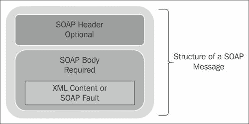
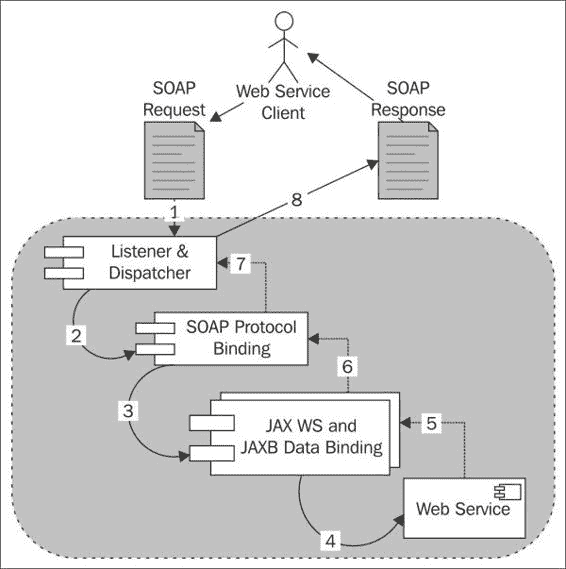
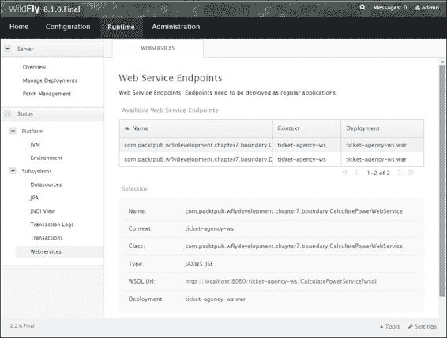
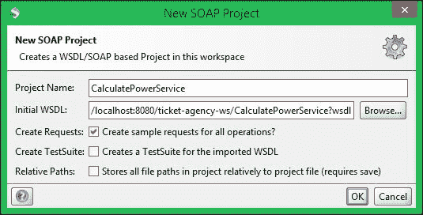
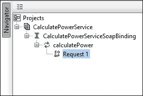
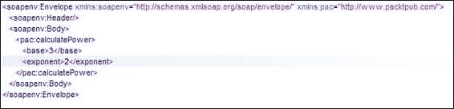
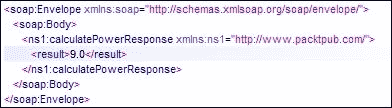
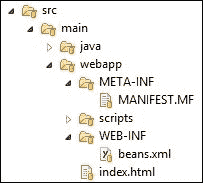
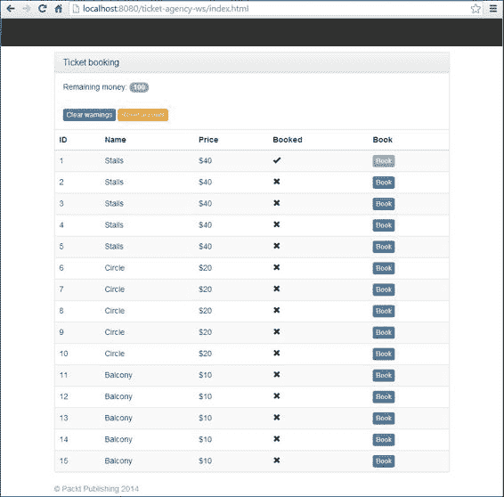
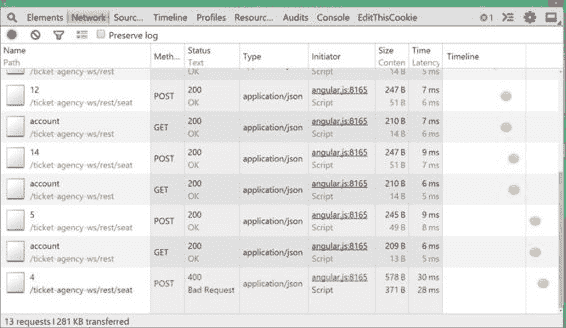

# 第七章。将网络服务添加到您的应用程序中

在上一章中，我们讨论了 Java 消息服务 API，它通常用于开发松散耦合的应用程序，以及 Java 到 Java 系统的通用集成模式。在本章中，你将了解由 W3C 定义的作为软件系统的网络服务，以及它们旨在支持通过网络进行可互操作机器到机器交互的设计。

使网络服务与其他分布式计算形式不同的因素是，信息仅通过简单和非专有协议进行交换。这意味着服务可以无论位置、平台或编程语言如何相互通信。本质上，网络服务协议提供了一种平台无关的方式来执行**远程过程调用**（**RPCs**）。

本章的重点将集中在两个主要的网络服务标准上，即**JAX-WS**（**JSR 224**）和**JAX-RS**（**JSR 339**），以及它们在 WildFly 中的实现方式。正如你所想象的那样，这里有很多内容需要覆盖，因此我们将快速进入以下主题：

+   基于 SOAP 的网络服务的简要介绍

+   创建、部署和使用 JBoss JAX-WS 实现（Apache CXF）

+   对 REST 网络服务的快速概述

+   如何使用 JBoss JAX-RS 实现（RESTEasy）创建、部署和使用服务

+   将 JAR-RS 与外部非 Java 应用程序集成

# 开发基于 SOAP 的网络服务

正如所述，网络服务基于使用非专有协议消息的消息交换。这些消息本身不足以定义网络服务平台。我们实际上需要一个包括以下内容的标准化组件列表：

+   一种用于以不依赖于它运行的平台或实现它的编程语言的方式定义网络服务提供的接口的语言

+   一种在 web 服务**提供者**和 web 服务**消费者**之间交换消息的通用标准格式

+   一个可以放置服务定义的注册表

**网络服务描述语言**（**WSDL**），也称为**WSDL**，([`www.w3.org/TR/wsdl`](http://www.w3.org/TR/wsdl))是提供对客户端公开的网络服务合同描述的事实标准。特别是，一个 WSDL 文档描述了一个提供操作的 web 服务，以及每个操作所需的输入数据类型和可以以结果形式返回的数据类型。

服务提供者与服务消费者之间的通信是通过依赖于 SOAP 规范的 XML 消息来实现的。

一个基本的 SOAP 消息由一个可能包含任意数量头部的信封和一个主体组成。这些部分由称为`envelope`、`header`和`body`的 XML 元素界定，这些元素属于由 SOAP 规范定义的命名空间。以下图展示了 SOAP 消息的基本结构：



## 构建基于 SOAP 的网络服务的策略

正如我们刚才讨论的，服务描述是由一个常用的文档接口 WSDL 提供的，它使用 XML 格式将服务作为一组网络、端点和端口公开。

你可能会逻辑上倾向于认为，在服务合同的开始处声明相应的编程接口，然后生成它们是必要的。

实际上，你可以遵循两种方法来开发你的 SOAP 网络服务：

+   **自上而下**：这种开发策略涉及从 WSDL 文件创建网络服务。当从头开始创建网络服务时，可能会使用自上而下的方法。这是纯网络服务工程师的首选选择，因为它是业务驱动的，也就是说，合同是由业务人员定义的，因此软件的设计是为了适应网络服务合同。

+   **自下而上**：这种方法要求由编程接口生成 WSDL 文件。当我们希望将现有应用程序作为网络服务公开时，可能会使用这种方法。由于这种方法不需要对 WSDL 语法的深入了解，如果你想把 Java 类或 EJB 转换为网络服务，它是最容易的选择。

由于本书的受众主要由对 WSDL 基础知识了解甚少或没有的 Java 开发者组成，我们将主要关注自下而上的方法。

另一方面，设计自上而下的网络服务将需要你将本章提供的基本网络服务概念与对 WSDL 标准的全面了解相结合。

## JBoss 基于 SOAP 的网络服务栈

目前在 WildFly 上提供的所有 JAX-WS 功能都是通过将 JBoss 网络服务栈与 Apache CXF 项目的大部分功能适当集成来提供的。

Apache CXF 是一个开源的网络服务框架，它提供了一个易于使用的、基于标准的编程模型来开发 SOAP 和 REST 网络服务。集成层（以下简称 JBossWS-CXF）允许我们执行以下操作：

+   在 WildFly 应用服务器上使用标准的网络服务 API（包括 JAX-WS）；这是通过利用 Apache CXF 内部执行的，无需用户处理。

+   在 WildFly 应用服务器上利用 Apache CXF 的高级原生特性，无需用户处理运行该容器中的应用所需的所有集成步骤

因此，下一节的重点将是使用内置的 Apache CXF 配置开发 JAX-WS 网络服务。如果你想进一步扩展你对 Apache CXF 原生特性的知识，你可以参考官方文档，该文档可在[`cxf.apache.org/`](http://cxf.apache.org/)找到。

## 简要了解 JAX WS 架构

当客户端发送的 SOAP 消息进入网络服务运行环境时，它被一个名为**服务器端点监听器**的组件捕获，该组件随后使用**调度器**模块将 SOAP 消息传递到该服务。

在这一点上，HTTP 请求被内部转换为 SOAP 消息。消息内容从传输协议中提取出来，并通过为该网络服务配置的处理程序链进行处理。

SOAP 消息处理程序用于拦截 SOAP 消息，在它们从客户端到端点服务以及相反方向传输的过程中。这些处理程序拦截了网络服务的请求和响应中的 SOAP 消息。

下一步是将 SOAP 消息反序列化为 Java 对象。此过程由 WSDL 到 Java 映射和 XML 到 Java 映射控制。前者由 JAX-WS 引擎执行，它确定从 SOAP 消息中调用哪个端点。后者由 JAXB 库执行，它将 SOAP 消息反序列化，以便它可以调用端点方法。

最后，反序列化的 SOAP 消息到达实际的网络服务实现，并调用该方法。

一旦调用完成，过程就会逆转。网络服务方法返回的值使用 JAX-WS WSDL 到 Java 映射和 JAXB 2.0 XML 到 Java 映射打包成一个 SOAP 响应消息。

### 注意

JAXB 提供了一种快速便捷的方式将 XML 模式与 Java 表示绑定，使得 Java 开发者能够轻松地将 XML 数据和过程函数集成到 Java 应用程序中。作为此过程的一部分，JAXB 提供了将 XML 实例文档反序列化为 Java 内容树的方法，然后将 Java 内容树反序列化为 XML 实例文档的方法。JAXB 还提供了一种从 Java 对象生成 XML 模式的方法。

接下来，出站消息在返回给调度器和端点监听器之前，由处理程序进行处理，这些调度器和端点监听器将消息作为 HTTP 响应传输。

以下图表描述了数据如何从网络服务客户端流向网络服务端点，并返回：



## 使用 WildFly 编写 SOAP 网络服务代码

在第一个交付成果中，我们将展示如何轻松地将一个普通的 Java 类转换为网络服务。然后，使用基于 Eclipse 的简单测试 GUI 对该新创建的服务进行测试。本节第二部分将关注如何通过增强您的票务应用程序以网络服务的方式公开 EJB 作为网络服务端点。

### 开发 POJO 网络服务

我们将开始开发 Web 服务，使用我们的项目从第四章，*学习上下文和依赖注入* (`ticket-agency-cdi`)作为基础。现在我们将省略基于 JSF 的当前 Web 层。您可以安全地删除所有与 JSF 相关的类和配置。如果您遇到任何问题，请记住，在本章完成后，您将在代码示例中找到一个完全工作的项目。

我们的第一类将与我们的票务应用程序无关，但它将仅演示如何从一个名为`CalculatePowerWebService`的`POJO`类创建 Web 服务。这个类有一个名为`calculatePower`的方法，它返回一个参数的幂，如下面的高亮代码所示：

```java
package com.packtpub.wflydevelopment.chapter7.boundary;

public class CalculatePowerWebService {

    public double calculatePower(double base, double exponent) {
        return Math.pow(base, exponent);
    }
}
```

现在，我们将通过添加必需的`@WebService`注解将这个简单的类转换成 Web 服务：

```java
package com.packtpub.wflydevelopment.chapter7.webservice;

import javax.jws.WebMethod;
import javax.jws.WebParam;
import javax.jws.WebResult;
import javax.jws.WebService;
import javax.jws.soap.SOAPBinding;

@WebService(targetNamespace = "http://www.packtpub.com/",
 serviceName = "CalculatePowerService")
@SOAPBinding(style = SOAPBinding.Style.RPC)
public class CalculatePowerWebService {

    @WebMethod
    @WebResult(name = "result")
    public double calculatePower(@WebParam(name = "base") double base,
                                 @WebParam(name = "exponent") double exponent) {
        return Math.pow(base, exponent);
    }
}
```

在`@WebService`注解内部，您可以指定额外的元素，例如声明由 Web 服务生成的 WSDL 元素的命名空间的`targetNamespace`元素。如果您不指定此元素，Web 服务容器将使用 Java 包名来生成默认的 XML 命名空间。

您还可以使用`serviceName`元素来指定服务名称。使用`serviceName`指定的名称用于生成 WSDL 接口中服务元素的名称属性。如果您不指定`serviceName`元素，服务器将使用默认值生成它，默认值是 bean 类名后追加的服务。

在下一行中，我们使用`@javax.jws.SOAPBinding`注解声明 Web 服务是**远程过程调用**类型。可能的值是`DOCUMENT`和`RPC`，第一个是默认值。

### 注意

RPC 和文档风格之间的选择归结为我们可以使用这两种风格构建服务的不同方式。RPC 风格 SOAP 消息的体是以特定方式构建的，这在 SOAP 标准中定义。这是基于您想要像调用应用程序代码中的普通函数或方法一样调用 Web 服务的假设。

因此，RPC 更紧密地耦合，因为如果您在消息结构中做出任何更改，您需要更改所有处理此类消息的客户端和服务器。

另一方面，文档风格的 Web 服务对 SOAP 体如何构建没有限制。它允许您包含任何想要的 XML 数据以及该 XML 的模式。因此，文档风格可能更灵活，但实现 Web 服务和客户端的努力可能稍微多一点。

最后，改变的可能性是选择是否使用 RPC 或文档风格 Web 服务时必须考虑的一个因素。

将 `@WebMethod` 属性附加到公共方法上表示您希望将方法公开作为网络服务的一部分。

`@WebParam` 注解用于指定需要在 WSDL 中展示的参数名称。您应该始终考虑使用 `WebParam` 注解，尤其是在使用多个参数时，否则 WSDL 将使用默认的参数（在这种情况下，`arg0`），这对网络服务消费者来说是没有意义的。

`@WebResult` 注解在意义上与 `@WebParam` 非常相似，因为它可以用来指定由 WSDL 返回的值的名称。

您的网络服务现在已完成。为了部署您的网络服务，运行以下 Maven 目标，这将打包并部署您的网络服务到您的运行 WildFly 实例：

```java
mvn package wildfly:deploy 

```

WildFly 将在控制台上提供最小输出；这将通知您网络服务项目已部署，WSDL 文件已生成：

```java
14:25:37,195 INFO  [org.jboss.weld.deployer] (MSC service thread 1-11) JBAS016005: Starting Services for CDI deployment: ticket-agency-ws.war
14:25:37,198 INFO  [org.jboss.ws.cxf.metadata] (MSC service thread 1-11) JBWS024061: Adding service endpoint metadata: id=com.packtpub.wflydevelopment.chapter7.boundary.CalculatePowerWebService
 address=http://localhost:8080/ticket-agency-ws/CalculatePowerService
 implementor=com.packtpub.wflydevelopment.chapter7.boundary.CalculatePowerWebService
 serviceName={http://www.packtpub.com/}CalculatePowerService
 portName={http://www.packtpub.com/}CalculatePowerWebServicePort
 annotationWsdlLocation=null
 wsdlLocationOverride=null
 mtomEnabled=false

```

从简短的日志中，您可以获取一些有用的信息。例如，第一行表明网络服务已在端点注册表中绑定为 `{http://www.packtpub.com/}CalculatePowerService`。接下来是有关网络上下文路径的信息，默认情况下，它与您的项目名称相同，即 `ticket-agency-ws`。最后一条信息是关于网络服务地址的，它是 `http://localhost:8080/ticket-agency-ws/CalculatePowerService`。通过在地址末尾附加 `?wsdl` 后缀，您可以检查网络服务合约。

### 注意

`data` 目录包含所有生成的 WSDL 的版本化列表。因此，您可能会在 `JBOSS_HOME/standalone/data/wsdl/ticket-agency-ws.war` 中找到由 `ticket-agency-ws` 发布的网络服务的整个历史记录。

### 从控制台检查网络服务

您可以通过转到网络管理控制台并导航到 **Runtime** | **Status** | **Subsystems** | **Web Services** 来检查网络服务子系统。

在这里，您可以收集有关已部署服务的有用信息。实际上，最有用的选项是可用的端点合约列表，这在开发我们的客户端时是必需的。以下截图显示了从控制台查看的网络服务端点：



尤其是在屏幕的下半部分，你可以阅读包含网络应用程序上下文名称和注册的网络服务名称的网络服务端点地址。在我们的例子中，它是 `http://localhost:8080/ticket-agency-ws/CalculatePowerService?wsdl`。

### 测试我们的简单网络服务

由于我们的第一个网络服务尚未连接到我们的票务系统，我们将使用外部客户端应用程序来测试我们的网络服务。测试网络服务最好的工具之一是 **SoapUI**。

SoapUI 是一个免费、开源、跨平台的函数测试解决方案，具有易于使用的图形界面和企业级功能。此工具允许您轻松快速地创建和执行自动化、功能、回归、合规性和负载测试。SoapUI 还可用作 Eclipse 插件。

在这里，我们将使用 SoapUI 独立应用程序。运行它，创建一个新的 SOAP 项目，提供服务的 WSDL URL，如图下截图所示：



之后，您将看到一个包含几个窗口的视图。其中最重要的窗口显示请求日志和导航窗口中的项目视图，如图下截图所示：



如您所见，您的服务操作已被自动发现。双击**请求 1**树元素；SoapUI 请求窗口将出现，您可以在其中输入命名参数。输入网络服务的两个参数，如图下截图所示：



点击工具栏上的**提交**按钮，并在 SOAP 响应窗口中检查结果：



### EJB3 无状态会话 Bean（SLSB）网络服务

JAX-WS 编程模型支持与 EJB3 无状态会话 Bean 在 POJO 端点上的相同一组注解。既然我们已经有一些网络服务经验，我们将构建本书中介绍的一个示例。

我们的主要网络服务类将被命名为`DefaultTicketWebService`，并使用我们在第三章中描述的一些核心类，例如`TheatreBox`，它将在内存中保留票务预订和`Seat`类作为模型。我们的网络服务业务方法将由一个名为**服务端点接口**（**SEI**）的`TicketWebService`来描述：

```java
package com.packtpub.wflydevelopment.chapter7.boundary;

import javax.jws.WebService;
import java.util.List;

@WebService
public interface TicketWebService {

    List<SeatDto> getSeats();

    void bookSeat(int seatId);
}
```

### 注意

编写服务接口始终是一个好习惯，因为它为我们提供了服务方法的适当客户端视图。然后实现类可以实现对接口中定义的方法。

我们现在将通过在`DefaultTicketWebService`类中提供业务逻辑到接口方法来实现该接口：

```java
package com.packtpub.wflydevelopment.chapter7.boundary;

import javax.inject.Inject;
import javax.jws.WebMethod;
import javax.jws.WebParam;
import javax.jws.WebResult;
import javax.jws.WebService;
import java.io.Serializable;
import java.util.List;
import java.util.stream.Collectors;

@WebService(targetNamespace = "http://www.packtpub.com/", serviceName = "TicketWebService")
public class DefaultTicketWebService implements TicketWebService, Serializable {

    @Inject
    private TheatreBox theatreBox;

    @WebMethod
 @WebResult(name = "listSeats")
    public List<SeatDto> getSeats() {
        return theatreBox.getSeats()
                         .stream()
                         .map(SeatDto::fromSeat)
                         .collect(Collectors.toList());
    }

 @WebMethod
    public void bookSeat(@WebParam(name = "seatId") int seatId) {
        theatreBox.buyTicket(seatId);
    }
}
```

如您所见，实现类包含`getSeats`方法，该方法返回当`TheatreBox`对象初始化时自动生成的座位列表。`bookSeat`方法将为您的网络服务客户端预订座位。

现在部署您的网络服务，并在控制台上验证它是否已正确注册：

```java
00:43:12,033 INFO  [org.jboss.ws.cxf.metadata] (MSC service thread 1-13) JBWS024061: Adding service endpoint metadata: id=com.packtpub.wflydevelopment.chapter7.boundary.DefaultTicketWebService
 address=http://localhost:8080/ticket-agency-ws/TicketWebService
 implementor=com.packtpub.wflydevelopment.chapter7.boundary.DefaultTicketWebService
 serviceName={http://www.packtpub.com/}TicketWebService
 portName={http://www.packtpub.com/}DefaultTicketWebServicePort
 annotationWsdlLocation=null
 wsdlLocationOverride=null
 mtomEnabled=false

```

### 开发网络服务消费者

`TicketWebService`类的 Web 服务消费者将使用标准的 Java SE 类进行编码。我们在这里想展示如何使用这些标准 API。因此，你只需在你的当前项目或单独的项目中添加一个名为`TicketWebServiceTestApplication`的类到包`com.packtpub.wflydevelopment.chapter7.webservice`：

```java
package com.packtpub.wflydevelopment.chapter7.webservice;

import com.packtpub.wflydevelopment.chapter7.boundary.SeatDto;
import com.packtpub.wflydevelopment.chapter7.boundary.TicketWebService;

import javax.xml.namespace.QName;
import javax.xml.ws.Service;
import java.net.MalformedURLException;
import java.net.URL;
import java.util.Collection;
import java.util.List;
import java.util.logging.Logger;

public class TicketWebServiceTestApplication {

    private static final Logger logger = Logger.getLogger(TicketWebServiceTestApplication.class.getName());

    public static void main(String[] args) throws MalformedURLException {
        final int seatId = 1;
        logger.info("TEST SOAP WS Service");
        final URL wsdlURL = new URL("http://localhost:8080/ticket-agency-ws/TicketWebService?wsdl");
        final QName SERVICE_NAME = new QName("http://www.packtpub.com/", "TicketWebService");
        final Service service = Service.create(wsdlURL, SERVICE_NAME);
        final TicketWebService infoService = service.getPort(TicketWebService.class);

        logger.info("Got the Service: " + infoService);

        infoService.bookSeat(seatId);
        logger.info("Ticket Booked with JAX-WS Service");

        final List<SeatDto> list = infoService.getSeats();

        dumpSeatList(list);
    }

    private static void dumpSeatList(Collection<SeatDto> list) {
        logger.info("================= Available Ticket List ================");
        list.stream().forEach(seat -> logger.info(seat.toString()));
    }
}
```

需要服务 WSDL URL 和名称来检索`Service`对象。最后，`getPort`方法将返回一个代理到你的 Web 服务，你可以用它来测试两个基本操作：预订座位和从`Seat`列表中检查座位是否已被预留。

这个小型独立类展示了从客户端视角使用基于 SOAP 的服务是如何可能的。

然而，最有趣的部分是在 Maven 输出的底部，其中在预订一个座位后，`Ticket`列表被输出，如下面的命令行所示：

```java
apr 01, 2014 1:08:44 AM com.packtpub.wflydevelopment.chapter7.webservice.TicketWebServiceTestApplication main
INFO: TEST SOAP WS Service
apr 01, 2014 1:08:44 AM com.packtpub.wflydevelopment.chapter7.webservice.TicketWebServiceTestApplication main
INFO: Got the Service: JAX-WS RI 2.2.9-b130926.1035 svn-revision#8c29a9a53251ff741fca1664a8221dc876b2eac8: Stub for http://localhost:8080/ticket-agency-ws/TicketWebService
apr 01, 2014 1:08:44 AM com.packtpub.wflydevelopment.chapter7.webservice.TicketWebServiceTestApplication main
INFO: Ticket Booked with JAX-WS Service
apr 01, 2014 1:08:44 AM com.packtpub.wflydevelopment.chapter7.webservice.TicketWebServiceTestApplication dumpSeatList
INFO: ================= Available Ticket List ================
apr 01, 2014 1:08:44 AM com.packtpub.wflydevelopment.chapter7.webservice.TicketWebServiceTestApplication lambda$dumpSeatList$0
INFO: SeatDto [id=1, name=Stalls, price=40, booked=true]
apr 01, 2014 1:08:44 AM com.packtpub.wflydevelopment.chapter7.webservice.TicketWebServiceTestApplication lambda$dumpSeatList$0
INFO: SeatDto [id=2, name=Stalls, price=40, booked=false]
…

```

# 开发基于 REST 的 Web 服务

**JAX-RS 2.0**（JSR-339 可以在[`jcp.org/en/jsr/detail?id=339`](https://jcp.org/en/jsr/detail?id=339)找到）是一个 JCP 规范，它为 HTTP 协议中的 RESTful Web 服务提供了 Java API。这是从旧版本 1.1 的重大更新。一些新特性包括客户端 API、HATEOAS 支持以及异步调用。

在最简单的形式中，RESTful Web 服务是网络应用程序，它操作系统资源的状态。在这个上下文中，资源操作意味着资源的创建、检索、更新和删除（CRUD）。然而，RESTful Web 服务并不仅限于这四个基本的数据操作概念。相反，RESTful Web 服务可以在服务器级别执行逻辑，但请记住，每个结果都必须是域的资源表示。

与 SOAP Web 服务的主要区别是，REST 要求开发者显式地使用 HTTP 方法，并且与协议定义保持一致。这个基本的 REST 设计原则在 CRUD 操作和 HTTP 方法之间建立了一个**一对一**的映射。

因此，有了对资源和表示的明确角色划分，我们现在可以将我们的 CRUD 动作映射到 HTTP 方法`POST`、`GET`、`PUT`和`DELETE`，如下所示：

| 动作 | HTTP 协议等效 |
| --- | --- |
| RETRIEVE | GET |
| CREATE | POST |
| UPDATE | PUT |
| DELETE | DELETE |

## 访问 REST 资源

正如我们所说，REST 资源可以通过映射等效 HTTP 请求的动作来访问。为了简化 REST 应用程序的开发，你可以使用简单的注解来映射你的动作；例如，为了从你的应用程序中检索一些数据，你可以使用以下类似的方法：

```java
@Path("/users")
public class UserResource {

 @GET
    public String handleGETRequest() { . . .}

 @POST
    public String handlePOSTRequest(String payload) { . . . }
}
```

在我们的示例中，第一个注解`@Path`用于指定分配给此 Web 服务的 URI。后续的方法都有其特定的`@Path`注解，这样你就可以根据请求的 URI 提供不同的响应。

然后，我们有一个 `@GET` 注解，它映射 HTTP `GET` 请求，还有一个 `@POST` 注解，它处理 HTTP `POST` 请求。所以，在这个例子中，如果我们请求绑定到 `example` 网络上下文的 Web 应用程序，对 URL `http://host/example/users` 的 HTTP `GET` 请求将触发 `handleGETRequest` 方法；另一方面，对同一 URL 的 HTTP `POST` 请求将相反地调用 `handlePOSTRequest` 方法。

## JBoss REST 网络服务

在理解了 REST 服务的基础知识之后，让我们看看如何使用 WildFly 开发一个 RESTful 网络服务。应用程序服务器包含一个开箱即用的 RESTEasy 库，它是 JSR-339 规范的可移植实现。RESTEasy 可以在任何 Servlet 容器中运行；然而，它与 WildFly 完美集成，因此在那个环境中为用户提供更好的体验。

除了服务器端规范之外，在以前，RESTEasy 通过 RESTEasy **JAX-RS 客户端框架**将 JAX-RS 带到客户端方面进行了创新。然而，JAX-RS 规范的最新版本附带了一个客户端 API，我们可以在每个 JAX-RS 实现中使用它。

### 激活 JAX-RS

RESTEasy 与 WildFly 打包在一起，因此你几乎不需要做任何努力就可以开始使用。你有两个选择。第一个是在扩展 `javax.ws.rs.core.Application` 的类中使用 `@ApplicationPath` 注解：

```java
@ApplicationPath("/rest")
public class JaxRsActivator extends Application {

}
```

第二种选择不太受欢迎，它用于通过 `web.xml` 文件配置应用程序：

```java
<?xml version="1.0" encoding="UTF-8"?>
<web-app  
    xsi:schemaLocation="http://java.sun.com/xml/ns/j2ee http://java.sun.com/xml/ns/j2ee/web-app_3_0.xsd" version="3.0">
    <servlet>
        <servlet-name>javax.ws.rs.core.Application</servlet-name>
        <load-on-startup>1</load-on-startup>
    </servlet>
    <servlet-mapping>
        <servlet-name>javax.ws.rs.core.Application</servlet-name>
        <url-pattern>/rest/*</url-pattern>
    </servlet-mapping>
</web-app>
```

这仅仅意味着，如果我们部署之前的示例，HTTP `GET` 方法，`http://host/example/rest/users` 将触发我们的 `getUser` 业务方法，而相同的 URL 将通过 `POST` 请求通过 `handlePOSTRequest` 方法发送请求。

### 将 REST 添加到我们的票务示例中

在所有配置就绪后，我们现在可以向我们的 `Ticket Web Service` 项目添加一个简单的 REST 网络服务，它将提供与我们的 SOAP 网络服务相同的功能。

所以在你的项目中添加一个新类，并将其命名为 `SeatsResource`。这个类的代码如下：

```java
package com.packtpub.wflydevelopment.chapter7.boundary;

@Path("/seat")
@Produces(MediaType.APPLICATION_JSON)
@RequestScoped
public class SeatsResource {

    @Inject
    private TheatreBooker theatreBooker;

    @Inject
    private TheatreBox theatreBox;

 @GET
    public Collection<SeatDto> getSeatList() {
        return theatreBox.getSeats()
                 .stream()
                 .map(SeatDto::fromSeat)
                 .collect(Collectors.toList());
    }

 @POST
    @Path("/{id}")
    public Response bookPlace(@PathParam("id") int id) {
        try {
            theatreBooker.bookSeat(id);
            return Response.ok(SeatDto.fromSeat(theatreBox.getSeat(id)))
             .build();
        } catch (Exception e) {
            final Entity<String> errorMessage = Entity
                                         .json(e.getMessage());
            return Response.status(Response.Status.BAD_REQUEST)
                       .entity(errorMessage).build();
        }
    }
}
```

如果你已经很好地理解了我们前面的部分，这段代码对你来说几乎会直观易懂。我们在这里包含了两个方法，就像 SOAP 的对应物一样；前者命名为 `getSeatList`，它与 HTTP `GET` 请求绑定并生成 `Seats` 列表。列表使用 JSON 表示法返回，这在将 Java 对象返回给客户端时非常常见。

### 注意

JSON 对象的语法很简单，需要将数据定义和数据值分组；如下所示：

+   元素被花括号 (`{` 和 `}`) 包围

+   元素的值以 `name:value` 的结构成对出现，并且用逗号分隔

+   数组被方括号 (`[` 和 `]`) 包围

这就是全部内容（对于完整的 JSON 语法描述，请访问 [`www.json.org/`](http://www.json.org/)）。

该类中包含的第二个方法是`bookPlace`，它将用于调用我们的 EJB 的相应`bookSeat`类。另一方面，此方法绑定到以下 HTTP `POST`方法：

```java
@POST
@Path("/{id}")
public Response bookPlace(@PathParam("id") int id)
```

你可能认为这个`Path`表达式看起来有点奇怪，但它所做的只是将 URI 参数（包含在`Path`表达式中）映射到方法参数。简而言之，包含在 URL 中的参数将通过`ID`变量传递给方法。

之前的方法还返回一个使用 Jackson（默认情况下，你可以创建自己的消息体提供者！）编码和解码的 JSON 格式的字符串，这是一个将 POJO 转换为 JSON（反之亦然）的库。

在我们继续之前，我们需要通过一个新的资源账户扩展我们的样本，这将使我们能够检查现金状态并可选择重置它：

```java
package com.packtpub.wflydevelopment.chapter7.boundary;

@Path("/account")
@Produces(MediaType.APPLICATION_JSON)
@RequestScoped
public class AccountResource {

    @Inject
    private TheatreBooker theatreBooker;

    @GET
    public AccountDto getAccount() {
        return AccountDto
                 .fromAccount(theatreBooker.getCurrentAccount());
    }

    @POST
    public Response renew() {
        theatreBooker.createCustomer();
        return Response
        .ok(AccountDto.fromAccount(theatreBooker.getCurrentAccount()))
        .build();
    }
}
```

账户表示如下所示：

```java
package com.packtpub.wflydevelopment.chapter7.entity;

public class Account {

    private final int balance;

    public Account(int initialBalance) {
        this.balance = initialBalance;
    }

    public Account charge(int amount) {
        final int newBalance = balance - amount;
        if (newBalance < 0) {
            throw new IllegalArgumentException("Debit value on account!");
        }
        return new Account(newBalance);
    }

    public int getBalance() {
        return balance;
    }

    @Override
    public String toString() {
        return "Account [balance = " + balance + "]";
    }
}
```

最后一步是将我们的`TheatreBooker`类更新为使用我们新的账户表示：

```java
    private Account currentAccount;

    @PostConstruct
    public void createCustomer() {
        currentAccount = new Account(100);
    }

    public void bookSeat(int seatId) {
        logger.info("Booking seat " + seatId);
        final int seatPrice = theatreBox.getSeatPrice(seatId);

        if (seatPrice > currentAccount.getBalance()) {
            throw new IllegalArgumentException("Not enough money!");
        }

        theatreBox.buyTicket(seatId);
        currentAccount = currentAccount.charge(seatPrice);

        logger.info("Seat booked.");
    }

    public Account getCurrentAccount() {
        return currentAccount;
    }
```

### 注意

JAX-RS 的最新版本也支持服务器端异步响应。多亏了`@Suspended`注解和`AsyncResponse`类，你可以使用一个单独的（可能是延迟的）线程来处理请求调用。

### 添加过滤器

JAX-RS 允许我们为客户端和服务器定义过滤器和拦截器。它们允许开发者处理横切关注点，如安全、审计或压缩。基本上，你可以将过滤器和拦截器视为扩展点。

过滤器主要用于请求和响应的头部。例如，你可以根据其头部字段阻止请求或仅记录失败的请求。相反，拦截器处理消息体，例如，你可以对消息进行签名或压缩。拦截器也有两种类型：一种是读取（当消息被转换为 POJO，例如 JSON 到`SeatDto`时执行）和一种是写入（用于 POJO 到消息的转换）。

我们可以通过创建以下类向我们的应用程序添加一个简单的服务器端日志过滤程序：

```java
package com.packtpub.wflydevelopment.chapter7.controller;

import java.io.IOException;
import java.util.logging.Logger;

import javax.inject.Inject;
import javax.ws.rs.container.ContainerRequestContext;
import javax.ws.rs.container.ContainerRequestFilter;
import javax.ws.rs.container.ContainerResponseContext;
import javax.ws.rs.container.ContainerResponseFilter;
import javax.ws.rs.ext.Provider;

@Provider
public class LoggingRestFilter implements ContainerRequestFilter, ContainerResponseFilter {

    @Inject
    private Logger logger;

    @Override
    public void filter(ContainerRequestContext requestContext, ContainerResponseContext responseContext)
            throws IOException {
        logger.info(responseContext.getStatusInfo().toString());
    }

    @Override
    public void filter(ContainerRequestContext requestContext) throws IOException {
        logger.info(requestContext.getMethod() + " on " + requestContext.getUriInfo().getPath());
    }
}
```

如您所见，我们实现了两个相当直接的接口：`ContainerRequestFilter`和`ContainerResponseFilter`。我们只是记录一些关于 HTTP 请求和响应的信息。要激活过滤器，我们使用`@Provider`注解；在没有额外配置的情况下，过滤器将适用于我们应用程序中的每个 REST 资源。此外，如果我们想在过滤器中拒绝请求，有一个`requestContext.abortWith`方法。

客户端有两个相应的接口：`ClientRequestFilter`和`ClientResponseFilter`。然而，实现必须手动注册。

现在，REST 服务已经完成，我们可以按照常规方式开始部署它：

```java
mvn package wildfly:deploy

```

如果你已经遵循了迄今为止的所有步骤，那么由你的浏览器发出的`http://localhost:8080/ticket-agency-ws/rest/seat GET`方法应该会打印出可用座位的列表：

```java
[{"id":0,"name":"Stalls","price":40,"booked":false},{"id":1,"name":"Stalls","price":40,"booked":false},{"id":2,"name":"Stalls","price":40,"booked":false},{"id":3,"name":"Stalls","price":40,"booked":false},{"id":4,"name":"Stalls","price":40,"booked":false},
. . . . . .
```

访问`http://localhost:8080/ticket-agency-ws/rest/account`将导致：

```java
{"balance":100}
```

你还应该在控制台中看到一些来自我们的过滤器的日志语句，例如：

```java
19:52:45,906 INFO  [com.packtpub.wflydevelopment.chapter7.controller.LoggingRestFilter] (default task-10) GET on /seat
19:52:45,909 INFO  [com.packtpub.wflydevelopment.chapter7.controller.LoggingRestFilter] (default task-10) OK
20:29:04,275 INFO  [com.packtpub.wflydevelopment.chapter7.controller.LoggingRestFilter] (default task-14) GET on /account
20:29:04,313 INFO  [com.packtpub.wflydevelopment.chapter7.controller.LoggingRestFilter] (default task-14) OK

```

### 消费我们的 REST 服务

连接到 RESTful Web 服务所需的工作量与直接通过 HTTP 连接连接到服务的工作量相当。因此，你可以使用大量的 API 来访问你的 REST 服务，例如 JDK 的`URLConnection`类或 Jakarta Commons HttpClient API，因为我们有标准化的客户端可用在 JAX-RS 中。

如果你想从你的 REST 服务中检索`Seats`列表，你的代码应该看起来像这样：

```java
Client restclient = ClientBuilder.newClient();
WebTarget seatResource = restclient.target(APPLICATION_URL + "seat");
Collection<SeatDto> seats = seatResource.request().get(new GenericType<Collection<SeatDto>>() {});
```

之前的代码将简单地执行对作为`ticket-agency-ws` Web 应用程序一部分部署的 REST 服务的`GET`操作。RESTEasy（使用 Jackson）将转换 JSON 对象。

以下独立示例将从账户和座位资源获取数据，并尝试预订所有可用的座位：

```java
public class RestServiceTestApplication {
    private static final String APPLICATION_URL = "http://localhost:8080/ticket-agency-ws/rest/";

    private WebTarget accountResource;
    private WebTarget seatResource;

    public static void main(String[] args) {
        new RestServiceTestApplication().runSample();
    }

    public RestServiceTestApplication() {
        Client restclient = ClientBuilder.newClient();

        accountResource = restclient.target(APPLICATION_URL + "account");
        seatResource = restclient.target(APPLICATION_URL + "seat");
    }

    public void runSample() {
        printAccountStatusFromServer();

        System.out.println("=== Current status: ");
        Collection<SeatDto> seats = getSeatsFromServer();
        printSeats(seats);

        System.out.println("=== Booking: ");
        bookSeats(seats);

        System.out.println("=== Status after booking: ");
        Collection<SeatDto> bookedSeats = getSeatsFromServer();
        printSeats(bookedSeats);

        printAccountStatusFromServer();
    }

    private void printAccountStatusFromServer() {
 AccountDto account = accountResource.request().get(AccountDto.class);
        System.out.println(account);
    }

    private Collection<SeatDto> getSeatsFromServer() {
 return seatResource.request().get(new GenericType<Collection<SeatDto>>() { });
    }

    private void printSeats(Collection<SeatDto> seats) {
        seats.forEach(System.out::println);
    }

    private void bookSeats(Collection<SeatDto> seats) {
        for (SeatDto seat : seats) {
            try {
                String idOfSeat = Integer.toString(seat.getId());
                seatResource.path(idOfSeat).request().post(Entity.json(""), String.class);
                System.out.println(seat + " booked");
            } catch (WebApplicationException e) {
                Response response = e.getResponse();
                StatusType statusInfo = response.getStatusInfo();
                System.out.println(seat + " not booked (" + statusInfo.getReasonPhrase() + "):" response.readEntity(JsonObject.class). getString("entity"));
            }
        }
    }
}
```

在高亮显示的片段中，你可以看到用于检索数据和预订座位的 REST 调用。我们的`post`调用需要指定一个 ID；我们通过使用`request`构建器的`path`方法来完成。也可以使用`async`方法和`Future`对象来异步执行调用：

```java
Future<Collection<SeatDto>> future = seatResource.request()
        .async().get(new GenericType<Collection<SeatDto>>() {});
```

我们可以使用 Java 8 中的新`CompletableFuture`类来通知请求的完成：

```java
CompletableFuture.<Collection<SeatDto>> supplyAsync(() -> {
    try {
        return future.get();
    } catch (Exception e) {
        e.printStackTrace();
        throw new IllegalArgumentException(e);
    }
}).thenAccept(seats -> seats.forEach(System.out::println));
```

收到数据后，我们只需将其打印出来。另一个选项是简单地创建一个`InvocationCallback`类，并将其作为第二个参数传递给`get`方法。

### 编译我们的票务示例

我们的示例可以位于一个单独的 Maven 模块中，或者你可以将其与服务器内容一起保留（尽管这不是一个好的做法）。为了编译我们的客户端项目与 REST Web 服务，我们需要导入包含在应用程序服务器库中的 JAX-RS API。在我们的独立应用程序中，我们需要以下依赖项：

```java
<properties>
   . . .
    <version.resteasy-client>3.0.6.Final</version.resteasy-client>
</properties>

<dependencies>
    <dependency>
        <groupId>org.jboss.resteasy</groupId>
        <artifactId>resteasy-client</artifactId>
        <version> ${version.resteasy-client}</version>
    </dependency>

    <dependency>
        <groupId>org.jboss.resteasy</groupId>
        <artifactId>resteasy-json-p-provider</artifactId>
        <version> ${version.resteasy-client}</version>
    </dependency>

    <dependency>
        <groupId>org.jboss.resteasy</groupId>
        <artifactId>resteasy-jackson-provider</artifactId>
        <version> ${version.resteasy-client}</version>
    </dependency>

    <dependency>
        <groupId>com.packtpub.wflydevelopment.chapter7</groupId>
        <artifactId>ticket-agency-ws</artifactId>
        <version>1.0</version>
    </dependency>
</dependencies>
```

如果你创建 POM 文件时遇到任何问题，你可以查看本书附带提供的示例。

现在简单地运行你的应用程序，你应该会看到以下类似的控制台输出：

```java
AccountDto [balance=100]
=== Current status: 
SeatDto [id=1, name=Stalls, price=40, booked=false]
SeatDto [id=2, name=Stalls, price=40, booked=false]
SeatDto [id=3, name=Stalls, price=40, booked=false]
SeatDto [id=4, name=Stalls, price=40, booked=false]
SeatDto [id=5, name=Stalls, price=40, booked=false]
SeatDto [id=6, name=Circle, price=20, booked=false]
SeatDto [id=7, name=Circle, price=20, booked=false]
…

```

### 添加 AngularJS

我们的 REST 集成示例并不非常引人注目。然而，因为我们通过 REST API 公开了我们的应用程序功能，所以很容易创建一个非 Java GUI，它可以用来控制应用程序。

要创建一个仅使用 REST API 与我们的 Java 后端通信的 GUI，我们将使用一个流行的 JavaScript 框架：AngularJS ([`angularjs.org/`](http://angularjs.org/))。我们不会深入探讨 JavaScript 代码的细节。对我们来说，最有趣的部分是使用我们的 REST API，我们目前只在 Java 应用程序中消费它。

如 第五章 所见，我们将使用 WebJars。这次，除了 Bootstrap 之外，我们还需要 AngularJS（最好是 3.x 版本）和 Angular UI Bootstrap 包 ([`angular-ui.github.io/bootstrap/`](http://angular-ui.github.io/bootstrap/))：

```java
<dependency>
    <groupId>org.webjars</groupId>
    <artifactId>bootstrap</artifactId>
    <version>3.2.0</version>
</dependency>
<dependency>
    <groupId>org.webjars</groupId>
    <artifactId>angularjs</artifactId>
    <version>1.3.0-rc.1</version>
</dependency>
<dependency>
    <groupId>org.webjars</groupId>
    <artifactId>angular-ui-bootstrap</artifactId>
    <version>0.11.0-2</version>
</dependency>
```

### 注意

记住，所有运行此示例所需的文件都包含在这本书附带的代码中。

我们需要一个 `index.html` 文件来开始我们的工作，以及一个空的 `scripts` 目录来存储我们的逻辑。我们的目录结构目前应该如下所示：



在 `index.html` 文件中，我们需要添加所有必需的库以及我们熟知的 Bootstrap 结构：

```java
<!doctype html>
<html lang="en" ng-app="ticketApp">
<head>
    <meta charset="utf-8">
    <title>Ticket Service</title>
    <link rel="stylesheet" href=""webjars/bootstrap/3.2.0/css/bootstrap.css">
    <link rel="stylesheet" href=""webjars/bootstrap/3.2.0/css/bootstrap-theme.css">
    <style>
        body {
            padding-top: 60px;
        }
    </style>
</head>
<body>

<div class="navbar navbar-inverse navbar-fixed-top" role="navigation">
</div>

<div class="container" ng-controller="SeatCtrl">
    <footer>
        <p class="text-muted">&copy; Packt Publishing 2014</p>
    </footer>
</div>

<script src="img/angular.js"></script>
<script src="img/angular-resource.js"></script>
<script src="img/angular-route.js"></script>
<script src="img/ui-bootstrap-tpls.js"></script>

<script src="img/app.js"></script>
<script src="img/seat.js"></script>
<script src="img/seatservice.js"></script>
<script src="img/accountservice.js"></script>
</body>
</html>
```

你可能还注意到了 `html` 标签中的两个看起来很奇怪的属性：`ng-app` 和 `ng-controller`。这些是 AngularJS 指令，指向的网页是一个 AngularJS 应用程序，并且容器 div 将使用 `SeatCtrl` 控制器。

现在，我们需要在 `scripts` 目录中放置以下文件。第一个是初始化文件 `app.js`：

```java
'use strict';
angular.module('ticketApp', [ 'ngResource', 'ngRoute', 'ui.bootstrap' ])
    .config(function ($routeProvider) {
        $routeProvider.when('/', {
            controller: 'SeatCtrl'
        }).otherwise({
            redirectTo: '/'
        });
    });
```

接下来，我们将在 `scripts/services/seatservice.js` 中初始化座位资源的地址：

```java
'use strict';
angular.module('ticketApp').service('SeatService',
    function SeatService($resource) {
        return $resource('rest/seat/:seatId', {
            seatId: '@id'
        }, {
 query: {
 method: 'GET',
 isArray: true
 },
 book: {
 method: 'POST'
 }
        });
    });
```

如你所见，我们将我们的 REST URL 与 JavaScript 代码以及两个 HTTP 方法：`GET` 和 `POST` 映射在一起。它们将由控制器调用以与服务器通信；我们的账户资源也是如此，如下面的代码所示：

```java
'use strict';
angular.module('ticketApp').service('AccountService',
    function AccountService($resource) {
        return $resource('rest/account', {}, {
 query: {
 method: 'GET',
 isArray: false
 },
 reset: {
 method: 'POST'
 }
        });
    });
```

最后，我们创建一个简单的控制器，将我们的逻辑放在 `scripts/controllers/seat.js`：

```java
'use strict';
angular.module('ticketApp').controller(
    'SeatCtrl',
    function ($scope, SeatService, AccountService) {
 $scope.seats = SeatService.query();
 $scope.account = AccountService.query();

        $scope.alerts = [];

 $scope.bookTicket = function (seat) {
 seat.$book({}, function success() {
                $scope.account.$query();
            }, function err(httpResponse) {
                $scope.alerts.push({
                    type: 'danger',
                    msg: 'Error booking ticket for seat '
                        + httpResponse.config.data.id + ': '
                        + httpResponse.data.entity
                });
            });
        };
        $scope.closeAlert = function (index) {
            $scope.alerts.splice(index, 1);
        };
        $scope.clearWarnings = function () {
            $scope.alerts.length = 0;
        };
        $scope.resetAccount = function () {
 $scope.account.$reset();
        };
    });
```

突出的代码部分是我们之前定义的服务调用。例如，`$scope.seats = SeatService.query()` 将发出一个 `GET` 请求以获取座位列表的 JSON 格式。对于 `seat.$book` 的情况类似；它将发出一个 `POST` 请求以预订特定的座位。

我们的全部 JavaScript 逻辑现在都已就绪。最后的步骤是将一些与它绑定的 HTML 代码放在我们的 `index.html` 文件中。在 `index.html` 文件中，在 `content` div 内插入以下代码：

```java
   <alert ng-repeat="alert in alerts" type="alert.type"
           close="closeAlert($index)">{{alert.msg}}
    </alert>

    <div class="panel panel-default">
        <div class="panel-heading">
            <h3 class="panel-title">Ticket booking</h3>
        </div>
        <div class="panel-body">
            <p>
 Remaining money: <span class="badge">{{account.balance}}</span>
            </p>
            <br/>

            <button type="button" class="btn btn-primary btn-xs"
                    ng-click="clearWarnings()">Clear warnings
            </button>

            <button type="button" class="btn btn-warning btn-xs"
                    ng-click="resetAccount()">Reset account
            </button>
        </div>
        <table class="table table-hover table-striped">
            <thead><th>ID</th><th>Name</th><th>Price</th><th>Booked</th>       <th>Book</th></thead>
            <tbody>
            <tr ng-repeat="seat in seats">
 <td>{{seat.id}}</td>
 <td>{{seat.name}}</td>
 <td>${{seat.price}}</td>
                <td><span
                        class="glyphicon glyphicon-{{seat.booked ? 'ok' :'remove'}}"></span></td>
                <td>
                    <button type="button"
                            class="btn btn-primary {{seat.booked? 'disabled' :''}} btn-xs" ng-click="bookTicket(seat)">Book
                    </button>
                </td>
            </tr>
            </tbody>
        </table>
```

代码与我们在早期章节中创建的 JSF 表类似。对我们来说重要的是，`{{ }}` 符号被 AngularJS 用于将显示的数据与控制器中的一个变量绑定，实际上这是一个我们 REST 端点的表示。

此外，`ng-click` 指令绑定到控制器中适当的方法。`bookTicket` 方法发出一个 `seat.$book` 调用，这作为一个 `POST` 请求传播到我们的后端。

我们现在可以将我们的应用程序部署到服务器上。在浏览器中访问 `http://localhost:8080/ticket-agency-ws/index.html` 后，你应该能看到你的应用程序正在运行，如下面的截图所示：



您可以使用 Chrome（或 Mozilla Firefox 中的 FireBug）的开发者工具来检查针对服务器的`rest`调用；只需按下*F12*并切换到**网络**标签页：



恭喜！您刚刚创建了一个现代互联网应用，并将其与之前由独立控制台应用使用的 REST API 相结合！

# 选择 SOAP 和 REST 服务

采用 SOAP 而不是 REST 的选择取决于您的应用需求。SOAP 网络服务使用它们自己定义良好的协议，并专注于公开应用逻辑的片段作为服务。因此，如果您的需求是消费使用定义良好且经过协商的合同（在服务消费者和服务提供者之间）公开的业务服务，SOAP 网络服务是一个完美的匹配。

另一方面，如果您需要使用无状态的 HTTP 调用访问某些服务器资源，并且尽可能少地使用浏览器导航栏，那么您可能应该选择 RESTful 网络服务。

话虽如此，仍有一些场景可能适合这两种选项，您可以根据自己的需求自由选择最适合的 Web 服务。最近，由于其互操作性，REST 变得流行。我们只使用 HTTP 协议和 JSON，这几乎每种语言都能处理。因此，使用 Java EE 开发的 REST API 可以由各种客户端以及移动设备使用。通常，当设计系统时，这个特性是一个决定性的因素。

# 摘要

在本章中，我们介绍了基本网络服务概念，以便您在使用它们来增强您的票务应用之前熟悉这些技术。

然后，我们讨论了基于 WSDL 文件定义的服务和客户端之间合同的基础上的 SOAP 网络服务。当您使用标准 XML 文件公开了定义良好、抽象的操作时，SOAP 网络服务是集成系统的绝佳选择。

然后，我们讨论了 REST 服务。REST 方法的关键是使用一个已知且广泛使用的接口编写网络服务：URI。这里的转折点是识别关键系统资源（这可以是实体、集合或设计师认为值得拥有自己的 URI 的任何其他东西），并使用映射到标准方法的标准方法公开它们。在这种情况下，HTTP 动词被映射到资源特定的语义。

我们创建了两个使用我们的 REST API 的应用程序：一个基于控制台，另一个完全使用 JavaScript 编写，使用 AngularJS。这两个都使用相同的 REST 端点，第二个只知道 JSON；它对底层的 Java 类（甚至 Java 本身）一无所知。

我们讨论了很多应用服务器资源。在下一章中，我们将探讨客户端-服务器通信的另一种方法：WebSocket。
