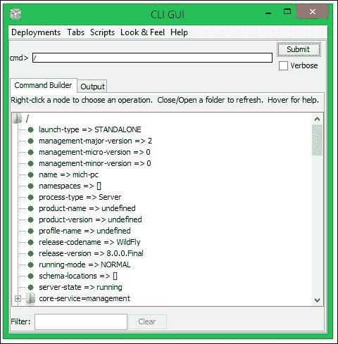
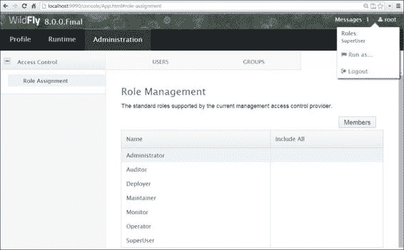

# 第九章。管理应用程序服务器

到目前为止，我们已经涵盖了多个 Java Enterprise 示例，并将它们部署到应用程序服务器上。现在，我们将一头扎入管理应用程序服务器的丰富多样的工具海洋。本章的目的是教会你如何使用这些工具来管理和监控应用程序服务器上所有可用的资源。

在本章中，我们将涵盖以下主题列表：

+   WildFly **命令行界面**（**CLI**）简介

+   如何使用 CLI 创建脚本

+   如何使用脚本语言和 WildFly 客户端 API 编程式地管理服务器资源

+   如何强制执行管理员基于角色的安全性

# 进入 WildFly CLI

CLI 是一个完整的管理工具，可以用来启动和停止服务器，部署和卸载应用程序，配置系统资源，并执行其他管理任务。其中的操作可以以原子方式或批量模式执行，允许你将多个任务作为一个组运行。

## 启动 CLI

如果你使用的是 Windows，你可以通过命令提示符从`JBOSS_HOME/bin`文件夹中输入以下命令来启动 CLI：

```java
jboss-cli.bat

```

如果你使用的是 Linux，则可以输入以下命令：

```java
./jboss-cli.sh

```

一旦 CLI 启动，你可以使用`connect`命令连接到托管的服务器实例，默认情况下连接到`localhost`和`9990`端口：

```java
[disconnected /] connect
[standalone@localhost:9990 /]

```

如果你想要连接到另一个地址或端口，你可以简单地将其传递给`connect`命令，如下所示：

```java
[disconnected /] connect 192.168.1.1
[standalone@192.168.1.1:9990 /]

```

还可以在连接模式下启动 CLI；这允许它自动连接，并可能指定要执行的命令。例如，以下`shell`命令自动连接到 WildFly 实例并发出`shutdown`命令：

```java
> jboss-cli.bat --connect command=:shutdown
{"outcome" => "success"}

```

命令行界面（CLI）对于自动化软件开发流程特别有用——**持续集成**（**CI**）和生产环境管理系统可以使用 Chef ([`www.getchef.com/`](https://www.getchef.com/)) 或 Puppet ([`puppetlabs.com/`](http://puppetlabs.com/)) 等工具自动控制应用服务器的生命周期。如果你希望最小化部署应用程序所需的手动任务数量，这将非常有用。

### 从远程主机连接

从应用程序服务器的 7.1.0 Beta 版本开始，默认情况下在 AS 管理接口上启用了安全功能，以防止未经授权的远程访问应用程序服务器。尽管应用程序服务器的本地客户端仍然允许未经任何身份验证地访问管理接口，但远程客户端需要输入用户名/密码对才能访问 CLI。以下是一个成功连接到 IP 地址为`10.13.2.255`的远程主机的示例会话：

```java
[disconnected /] connect 10.13.2.255
Authenticating against security realm: ManagementRealm
Username: administrator
Password:
[standalone@10.13.2.255:9990 /]

```

请参阅第二章，*在 WildFly 上创建第一个 Java EE 应用程序*，以获取有关使用`add-user.sh` shell 命令创建用户的更多信息。

### 在图形模式下使用 CLI

命令行界面可用的一项有趣选项是图形模式，可以通过在 shell 脚本中添加`--gui`参数来激活：

```java
jboss-cli.bat --gui

```

这就是 CLI 在图形模式下的样子：



如标签所述，当您点击文件夹时，资源将展开；另一方面，如果您右键单击节点，您可以在其上执行操作。图形模式可能有助于探索可能的配置值，或者如果您不是特别喜欢控制台工具的话。

下一个部分讨论了如何构建 CLI 命令，这些命令可以在终端模式或图形模式下执行。

## 构建 CLI 命令

所有 CLI 操作请求都允许您与服务器管理模型进行低级别交互。它们提供了一种受控的方式来编辑服务器配置。一个操作请求由三部分组成：

+   以`/`为前缀的地址

+   前缀为`:`的操作名称

+   包含在`()`内的可选参数集

### 确定资源地址

服务器配置以可寻址资源的分层树的形式呈现。每个资源节点提供一组不同的操作。地址指定要执行操作的资源节点。地址使用以下语法：

```java
/node-type=node-name

```

以下是对这些记号的解释：

+   `node-type`：这是资源节点类型。这映射到服务器配置中的一个元素名称。

+   `node-name`：这指定了资源节点名称。这映射到服务器配置中元素的名称属性。

使用斜杠(`/`)分隔资源树的每一级。例如，以下 CLI 表达式识别在数据源子系统注册的 ExampleDS 数据源：

```java
/subsystem=datasources/data-source=ExampleDS

```

### 对资源执行操作

一旦您已识别资源，您就可以对该资源执行操作。一个操作使用以下语法：

```java
:operation-name

```

因此，在前面的示例中，您可以通过在末尾添加`read-resource`命令来查询您节点的可用资源列表：

```java
/subsystem=datasources/:read-resource 
{
    "outcome" => "success",
    "result" => {
        "data-source" => {"ExampleDS" => undefined},
        "jdbc-driver" => {"h2" => undefined},
        "xa-data-source" => undefined
    }
}
```

如果您想查询节点的一个特定属性，您可以使用`read-attribute`操作。例如，以下代码显示了如何从数据源中读取启用属性：

```java
/subsystem=datasources/data-source=ExampleDS/:read-attribute(name=enabled) 
{
    "outcome" => "success",
    "result" => false
}
```

### 注意

除了对特定资源执行的操作之外，您还可以执行一组在您的 WildFly 子系统每个路径上都可用的命令，例如`cd`或`ls`命令。这些命令几乎等同于它们的 Unix shell 对应命令，并允许您在 WildFly 子系统中导航。其他重要的新增功能是`deploy`和`undeploy`命令，正如您可能猜到的，这些命令允许您管理应用程序的部署。这些关键命令在本章的*使用 CLI 部署应用程序*部分进行了讨论。

CLI（命令行界面）不仅仅是查询 WildFly 子系统的属性；您还可以设置属性或创建资源。例如，如果您要设置 HTTP 连接器的 HTTP 端口，您将不得不使用 HTTP 套接字绑定接口上的相应`write`属性，如下所示：

```java
/socket-binding-group=standard-sockets/socket-binding=http/:write-attribute(name=port,value=8080)
{
    "outcome" => "success","response-headers" => {
        "operation-requires-reload" => true,
        "process-state" => "reload-required"
    }
}
```

除了我们迄今为止看到的可以在您的子系统中的每个资源上执行的操作之外，还可以执行一些只能针对单个资源执行的特殊操作。例如，在命名子系统中，您将能够执行一个`jndi-view`操作，该操作将显示 JNDI 绑定的列表，如下面的代码片段所示：

```java
/subsystem=naming/:jndi-view
{
    "outcome" => "success",
    "result" => {"java: contexts" => {
        "java:" => {
            "TransactionManager" => {
                "class-name" => "com.arjuna.ats.jbossatx.jta.TransactionManagerDelegate","value" => "com.arjuna.ats.jbossatx.jta.TransactionManagerDelegate@afd978"
            },
     . . .
}
```

#### 使用 Tab 补全助手

了解 CLI 中所有可用命令是一项相当困难的任务；这个管理界面包括一个基本功能，即 Tab 补全。假设光标位于一个空行的开头；现在如果您输入`/`并按*Tab*键，您将获得以下所有可用节点类型的列表：

```java
[standalone@localhost:9990 /] /
core-service           extension              socket-binding-group
deployment             interface              subsystem
deployment-overlay     path                   system-property
```

在选择节点类型后，您想进入资源树，因此请输入`=`并再次按*Tab*键。这将显示所有以下节点名称的列表，这些名称适用于所选节点类型：

```java
[standalone@localhost:9990 /] /subsystem=
batch                jdr                  resource-adapters
datasources          jmx                  sar
deployment-scanner   jpa                  security
ee                   jsf                  threads
ejb3                 logging              transactions
infinispan           mail                 undertow
io                   naming               webservices
jaxrs                pojo                 weld
jca                  remoting
```

在完成节点路径后，在节点路径末尾添加冒号（`:`）并按*Tab*键将显示所选节点的所有可用操作名称，如下所示：

```java
[standalone@localhost:9990 /] /subsystem=deployment-scanner/scanner=default:
add                          read-resource
read-attribute              read-resource-description
read-children-names          remove
read-children-resources      resolve-path
read-children-types          undefine-attribute
read-operation-description   whoami
read-operation-names         write-attribute
```

要查看`add`操作的所有参数（在操作名称之后），请按*Tab*键：

```java
[standalone@localhost:9990 /] /subsystem=deployment-scanner/scanner=default:read-attribute(
include-defaults=   name=
```

选择您想要的参数，并在`=`之后指定其值：

```java
[standalone@localhost:9990 /] /subsystem=deployment-scanner/scanner=default:read-attribute(name=
runtime-failure-causes-rollback   scan-enabled
relative-to                       scan-interval
path                              auto-deploy-zipped
auto-deploy-exploded              deployment-timeout
auto-deploy-xml
```

最后，当所有参数都已指定后，添加`)`并按*Enter*键以执行以下命令：

```java
[standalone@localhost:9990 /] /subsystem=deployment-
scanner/scanner=default:read-attribute(name=scan-enabled)
{
 "outcome" => "success",
 "result" => true
}

```

## 使用 CLI 部署应用程序

使用 CLI 部署应用程序（在独立模式下）可以通过将应用程序的存档复制到服务器发行版的`deployment`文件夹中轻松完成。这是一个相当方便的选项；然而，我们想强调使用 CLI 的优势，它提供了广泛的附加选项，在部署时使用，同时也提供了远程部署应用程序的机会。

部署应用程序存档所需的一切只是一个连接到管理实例（无论是本地还是远程），以及发出 `deploy` shell 命令。当不使用参数时，`deploy` 命令会提供一个当前已部署的应用程序列表，如下所示：

```java
[disconnected /] connect
[standalone@localhost:9990 /] deploy ExampleApp.war

```

如果你将资源存档（如 `WAR` 文件）喂给 shell，它将立即在独立服务器上部署它，如下所示：

```java
[standalone@localhost:9990 /] deploy ../MyApp.war 

```

默认情况下，CLI 使用 `JBOSS_HOME/bin` 文件作为你的部署存档的来源。然而，你可以使用绝对路径来指定存档的位置；CLI 扩展功能（使用 *Tab* 键）使此选项相当简单：

```java
[standalone@localhost:9990 /] deploy c:\deployments\MyApp.war

```

重新部署应用程序需要在 `deploy` 命令中添加一个额外的标志。使用 `-f` 参数强制应用程序重新部署：

```java
[standalone@localhost:9990 /] deploy -f ../MyApp.war

```

通过 `undeploy` 命令卸载应用程序可以通过将已部署的应用程序作为参数来实现。如下所示：

```java
[standalone@localhost:9990 /] undeploy MyApp.war

```

通过检查 WildFly 配置文件（例如，`standalone.xml` 或 `domain.xml`），你会注意到你的应用程序的部署元素已被移除。

### 部署应用程序到 WildFly 域

当你使用域模式部署应用程序时，你必须指定部署关联的服务器组。CLI 允许你在以下两个选项之间进行选择：

+   部署到所有服务器组

+   部署到单个服务器组

我们将在两个单独的部分中讨论这些选择。

### 部署到所有服务器组

如果选择此选项，应用程序将被部署到所有可用的服务器组。可以使用 `--all-server-groups` 标志来实现此目的。例如，参考以下代码：

```java
[domain@localhost:9990 /] deploy ../application.ear --all-server-groups
```

如果你想从属于某个域的所有服务器组中卸载应用程序，你将必须按照以下命令发出 `undeploy` 命令：

```java
[domain@localhost:9990 /] undeploy application.ear --all-relevant-server-groups

```

### 注意

你可能已经注意到，`undeploy` 命令使用的是 `--all-relevant-server` 组而不是 `--all-server-` 组。这种差异的原因是部署可能并未在所有服务器组中启用；因此，通过使用此选项，你实际上会从所有已启用部署的服务器组中卸载它。

### 部署到单个服务器组

另一个选项允许你仅在你指定的服务器组上执行应用程序的选择性部署：

```java
[domain@localhost:9990 /] deploy application.ear --server-groups=main-server-group

```

你不仅限于单个服务器组，并且可以使用逗号（`,`）分隔多个服务器组。例如，参考以下代码：

```java
[domain@localhost:9990 /] deploy application.ear --server-groups=main-server-group,other-server-group
Successfully deployed application.ear

```

选项卡补全功能将帮助你完成为部署所选的 `--server-groups` 列表指定的值。

现在，假设我们只想从单个服务器组中卸载应用程序。在这种情况下，可能会有两种可能的结果。如果应用程序仅在该服务器组中可用，您将成功完成卸载，如下面的命令所示：

```java
[domain@localhost:9990 /] undeploy wflyproject.war --server-groups=main-server-group

```

另一方面，如果您的应用程序在其他服务器组中可用，CLI 将返回以下错误：

```java
Undeploy failed: {"domain-failure-description" => {"Composite operation failed and was rolled back. Steps that failed:" => {"Operation step-3" => "Cannot remove deployment wflyproject.war from the domain as it is still used by server groups [other-server-group]"}}}

```

看起来出了点问题。实际上，当您从服务器组中删除应用程序时，域控制器会验证没有其他服务器组会引用该应用程序；否则，之前的命令将失败。

然而，您可以指示域控制器卸载应用程序而不删除内容。以下命令显示了这一点：

```java
[domain@localhost:9990 /] undeploy application.ear --server-groups=main-server-group --keep-content

```

## 创建 CLI 脚本

作为程序开发者，您可能想知道 CLI 可以通过将它们添加到文件中来以非交互方式执行命令，就像 shell 脚本一样。为了执行脚本，您可以使用以下示例（对于 Windows）中的 `--file` 参数启动 CLI：

```java
jboss-cli.bat --file=test.cli

```

对于 Unix 用户，等效的命令如下：

```java
./jboss-cli.sh --file=test.cli

```

在下一节中，我们将探讨一些可以添加到您的管理员工具箱中的有用脚本。

### 将应用程序部署到多个 WildFly 节点

早期的 JBoss AS 版本通常会附带一个 `farm` 文件夹，该文件夹会触发将部署到 JBoss 集群中的所有节点。这个选项在 JBoss AS7 和 WildFly 中不再包含，但恢复 farm 部署只需遵循几个 CLI 指令。

在以下示例中，我们将应用程序部署到默认服务器地址（`127.0.0.1` 和端口 `9990`）以及绑定到相同地址但端口为 `10190` 的另一个服务器实例：

```java
connect
deploy /usr/data/example.war
connect 127.0.0.1:10190
deploy /usr/data/example.war

```

### 在域中重启服务器

域管理员的一个常见需求是在更新某些服务器库时重新启动应用程序服务器节点。CLI 提供了一个方便的快捷方式来停止和启动属于服务器组的所有服务器：

```java
connect
/server-group=main-server-group:start-servers
/server-group=main-server-group:stop-servers

```

如果您更喜欢更细粒度的方法，您可以根据以下示例启动单个服务器节点，该示例显示了如何在您的 CLI 脚本中应用条件执行逻辑：

```java
connect
if (result == "STARTED") of /host=master/server-config=server-one:read-attribute(name=status)
/host=master/server-config=server-one:stop
end-if

if (result == "STARTED") of /host=master/server-config=server-two:read-attribute(name=status)
/host=master/server-config=server-two:stop
end-if
/host=master/server-config=server-one:start

/host=master/server-config=server-two:start

```

在代码的 `if end-if` 部分，我们正在检查服务器的状态属性。如果状态是 **STARTED**，则应用程序服务器将被停止并重新启动。

### 将数据源作为模块安装

在 WildFly 中，您可以使用 `module` 命令来安装一个新的模块。我们已经在 第五章 中做了类似的事情，*将持久性与 CDI 结合*。现在，您可以像以下示例中所示那样完全自动化数据源创建：

```java
connect

module add --name=org.postgresql --resources= postgresql-9.3-1101.jdbc41.jar  --dependencies=javax.api,javax.transaction.api

/subsystem=datasources/jdbc-driver=postgresql:add(driver-module-name=org.postgresql,driver-name=postgresql,driver-class-name=org.postgresql.Driver)

/subsystem=datasources/data-source=PostgreSQLDS:add(jndi-name=java:jboss/datasources/PostgreSQLDS , driver-name=postgresql, connection-url=jdbc:postgresql://localhost:5432/ticketsystem,user-name=jboss,password=jboss)

```

脚本的第 1 行，在连接之后，在你的服务器模块目录中安装了一个名为`org.postgresql`的新模块，包括 PostgreSQL JDBC 驱动和所需的依赖项。

第 2 行将`org.postgresql`模块的 JDBC 驱动安装到`datasources/jdbc-driver`子系统。

最后，使用所需的 URL 和凭据将数据源添加到`jndi java:jboss/datasources/PostgreSQLDS`。

### 添加 JMS 资源

添加一个新的 JMS 目标非常简单，因为它不需要一系列冗长的命令。然而，有时你的应用程序需要设置许多 JMS 目标才能工作，那么为什么不为此创建一个脚本呢？以下是一个简单的脚本，用于将 JMS 队列添加到服务器配置中：

```java
connect
jms-queue add  --queue-address=queue1 --entries=queues/queue1 

```

以下是你可以使用来创建 JMS 主题的相应脚本：

```java
connect
jms-topic add  --topic-address=topic1 --entries=topics/topic1

```

# 使用高级语言创建强大的 CLI 脚本

到目前为止，我们已经学习了如何编写 CLI shell 命令来管理应用程序服务器的资源。这种方法的优势在于，你可以轻松快速地访问每个服务器资源，这得益于内置的自动完成功能。另一方面，如果你想围绕你的命令执行一些复杂的逻辑，那么你需要寻找其他替代方案。

如果你是一个 shell 高手，你可能会很容易地求助于一些 bash 脚本，以便捕获 CLI 的输出并使用丰富的 Unix/Linux 工具执行一些管理操作。

提供 bash 功能的简要概述可能是一项有趣的练习；然而，如果我们这样做，我们就会偏离本书的范围。我们将记录一些内置功能，如下所示：

+   在第一部分，我们将展示如何在 Python 脚本中使用 CLI 远程客户端 API。

+   在下一节中，我们将使用原始管理 API 在 Java 应用程序中执行 CLI 命令。

在许多情况下，JBoss CLI 脚本可能非常有用。脚本可以用来配置开发人员的机器、测试环境，或者作为生产环境的初始配置。在许多情况下，启动一个完整的企业应用程序所需的配置可能相当复杂；你可能需要使用特定的端口配置来集群测试或你的安全域。你可能还需要你的持续集成服务器为你完成这项工作。除此之外，拥有一个自动配置脚本比每次都手动设置配置要好，这既浪费时间，又可能成为错误源。

## 使用脚本语言包装 CLI 执行

JBoss AS 7 引入了一个新的 CLI 远程 API，它充当 CLI 公共 API 的代理。这两个 API 之间的桥梁是`scriptsupport.CLI`类，该类包含在`JBOSS_HOME/bin/client/jboss-cli-client.jar`文件中。

多亏了这个 API，您可以使用多种不同的语言执行 CLI 命令，例如 Jython、Groovy 或 JavaScript。由于 Jython 也是其他应用程序服务器的实际管理标准，例如 Oracle、WebLogic 和 WebSphere，我们将使用它来执行一些基本的管理任务。

### 注意

Jython 是为 JVM 实现的 Python。Jython 非常有用，因为它在 JVM 上运行时提供了成熟脚本语言的生产力特性。与 Python 程序不同，Jython 程序可以在支持 JVM 的任何环境中运行。

Jython 使用 `jython` 脚本调用，这是一个简短的脚本，用于调用您的本地 JVM，运行 Java 类文件 `org.python.util.jython`。

为了开始，您需要做的第一件事是下载 Jython 安装程序，从 [`www.jython.org/downloads.html`](http://www.jython.org/downloads.html)。

使用以下命令运行安装程序：

```java
java -jar jython-installer-2.5.3.jar

```

接下来，将 `JYTHON_HOME/bin` 文件夹（例如，`C:\jython2.5.3\bin`）添加到系统路径，并将 `jboss-cli-client.jar` 文件添加到系统的 `CLASSPATH` 中。例如，在 Windows 中，使用以下命令：

```java
set JYTHON_HOME= C:\jython2.5.3
set PATH=%PATH%;%JYTHON_HOME%\bin

set CLASSPATH=%CLASSPATH%;%JBOSS_HOME%\bin\client\jboss-cli-client.jar;.

```

这里是 Linux 的相同命令：

```java
export PATH=$PATH:/usr/data/jython2.5.3/bin
export CLASSPATH=$CLASSPATH$:%JBOSS_HOME%/bin/client/jboss-cli-client.jar

```

好的，现在我们将创建第一个脚本，该脚本将基本上返回我们的应用程序服务器的 JNDI 视图。

### 注意

请注意，Jython 与 Python 一样，使用缩进来确定代码结构，而不是使用大括号或关键字。因此，不要随意使用它们。IDE 可能会帮助您完成这项工作——例如，对于 Python，您可以使用 Vim 的 python-mode ([`github.com/klen/python-mode`](https://github.com/klen/python-mode)) 或带有 PyDev 扩展的 Eclipse ([`pydev.org/`](http://pydev.org/))。

创建一个名为 `script.py` 的文件，包含以下代码：

```java
from org.jboss.as.cli.scriptsupport import CLI

cli = CLI.newInstance()
cli.connect()

cli.cmd("cd /subsystem=naming")

result = cli.cmd(":jndi-view")
response = result.getResponse()

print 'JNDI VIEW ======================= '
print response
cli.disconnect()
```

现在按照以下代码执行脚本：

```java
jython script.py
```

如您所见，代码非常直观；我们正在导入 `org.jboss.as.cli.scriptsupport.CLI` 类，该类用于发送命令并读取响应。然后，我们连接到本地 WildFly 实例并发出 `:jndi-view` 命令。

### 注意

可以使用 `connect` 命令通过添加以下参数连接到远程 WildFly 主机：`connect (String controllerHost, int controllerPort, String username, String password)`。

响应变量是 `org.jboss.dmr.ModelNode`。这可以通过以下示例进一步检查，该示例深入探讨了平台 MBeans，以获取一些内存统计信息：

```java
from org.jboss.as.cli.scriptsupport import CLI

cli = CLI.newInstance()
cli.connect()

cli.cmd("cd /core-service=platform-mbean/type=memory/")

result = cli.cmd(":read-resource(recursive=false,proxies=false,include-runtime=true,include-defaults=true)")

response = result.getResponse()
enabled = response.get("result").get("heap-memory-usage")

used = enabled.get("used").asInt()

if used > 512000000:
    print "Over 1/2 Gb Memory usage "
else:
    print 'Low usage!'

cli.disconnect()
```

在前面的示例中，我们跟踪了 `/core-service=platform-mbean/type=memory` 中包含的资源。然而，可用的资源实际上是两种可用堆内存区域（`heap-memory-usage` 和 `non-heap-memory-usage`）的子资源，如下面的代码所示：

```java
[standalone@localhost:9990 /] /core-service=platform-mbean/type=memory:read-resource(recursive=false,proxies=false,include-runtime=true,include-defaults=true)
{
    "outcome" => "success","result" => {
        "heap-memory-usage" => {"init" => 67108864L,"used" => 59572256L,"committed" => 170852352L,"max" => 477233152L},
        "non-heap-memory-usage" => {
            "init" => 24313856L,"used" => 90491328L,"committed" => 90701824L,"max" => 369098752L},
        "object-pending-finalization-count" => 0,"verbose" => false
    }
}
```

仅使用 `ModelNode` 对象的 `get` 命令，您就可以引用内存类型的子资源并访问所有单个属性。一旦您获得了属性，就可以使用 `ModelNode` 对象的 `asInt()` 函数将它们转换为整数，并使用酷炫的 Python 构造来提醒您的管理员。

# 使用原始管理 API 管理应用程序服务器

如果您不想学习脚本语言来管理应用程序服务器，您仍然可以在 Java 类中使用原始管理 API。不要受我们将其作为最后一个选项的事实的影响；实际上，使用原生管理 API 并不难，因为它基于非常少的类，并且对 WildFly API 的编译时间和运行时依赖性很小。

因此，您也可以通过简单地将以下依赖项添加到应用程序的 `META-INF/MANIFEST.MF` 文件中来从任何 Java EE 应用程序中使用管理 API：

```java
Dependencies: org.jboss-as-controller-client,org.jboss.dmr
```

命名为 **未类型化的管理 API** 的核心 API 非常简单；主要类是 `org.jboss.dmr.ModelNode`，我们已经在 Jython 部分提到了它。`ModelNode` 类本质上只是一个值的包装器；该值通常是可以通过 `ModelNode` 的 `getType()` 方法检索的基本 JDK 类型。

除了 `jboss-dmr` API 之外，用于连接到管理 API 的另一个模块是 `jboss-as-controller-client`。

### 注意

您不需要下载这些库，因为这两个模块自 7 版本以来就包含在应用程序服务器中了。

## 通过原始管理 API 读取管理模型描述

使用 **未类型化的管理 API** 与其脚本语言对应物并没有太大的不同；最初，您需要创建一个管理客户端，该客户端可以连接到目标进程的本地管理套接字（这可能是一个独立的服务器，或者在一个域模式环境中，是域控制器）：

```java
ModelControllerClient client = ModelControllerClient.Factory.create(InetAddress.getByName("localhost"), 9990);

```

接下来，您需要使用 `org.jboss.dmr.ModelNode` 类创建一个操作请求对象，如下面的命令所示：

```java
final ModelNode operation = new ModelNode();
operation.get("operation").set("jndi-view");

final ModelNode address = operation.get("address");
address.add("subsystem", "naming");

operation.get("recursive").set(true);
operation.get("operations").set(true);

final ModelNode returnVal = client.execute(operation);
logger.info(returnVal.get("result").toString());

```

如您所见，`ModelNode` 对象可以被链起来以到达一个操作（在示例中是 JNDI 视图），该操作在节点路径（在我们的例子中是命名子系统）上可用。

一旦您添加了 `ModelNode` 属性，您就可以在您的节点上发出 `execute` 命令，这将反过来返回 `ModelNode`，其中将存储操作的结果。

在示例中，您可以找到一个包含这些管理示例的完整工作项目。

### 使用未类型化 API 创建您的资源监视器

现在你已经学习了**去类型化**的**管理 API**的基础知识，我们将通过一个具体的例子来展示；我们的目标将是使用 EJB 监控服务器资源（数据源的活动 JDBC 连接数）。你可以使用这种模式创建自己的服务器监控，并将其集成到你的应用环境中。以下代码片段展示了这一点：

```java
package com.packtpub.wflydevelopment.chapter9;

import org.jboss.as.controller.client.ModelControllerClient;
import org.jboss.dmr.ModelNode;

import javax.ejb.Schedule;
import javax.ejb.Stateless;
import java.io.Closeable;
import java.net.InetAddress;
import java.util.logging.Level;
import java.util.logging.Logger;

@Stateless
public class WatchMyDB {

    private final static Logger logger = Logger.getLogger(WatchMyDB.class.getName());

    @Schedule(dayOfWeek = "*", hour = "*", minute = "*", second =
            "*/30", year = "*", persistent = false)
    public void backgroundProcessing() {
        ModelControllerClient client = null;
        try {
            client = ModelControllerClient.Factory.create(InetAddress.getByName("localhost"), 9990);
            final ModelNode operation = new ModelNode();
            operation.get("operation").set("read-resource");
            operation.get("include-runtime").set(true);
            final ModelNode address = operation.get("address");
            address.add("subsystem", "datasources");
            address.add("data-source", "ExampleDS");
            address.add("statistics", "pool");
            final ModelNode returnVal = client.execute(operation);

            final ModelNode node2 = returnVal.get("result");
            final String stringActiveCount = node2.get("ActiveCount").asString();

            if (stringActiveCount.equals("undefined")) {
                return; // Connection unused
            }
            int activeCount = Integer.parseInt(stringActiveCount);

            if (activeCount > 50) {
                alertAdministrator();
            }
        } catch (Exception exc) {
            logger.log(Level.SEVERE, "Exception !", exc);
        } finally {
            safeClose(client);
        }
    }

    public void safeClose(final Closeable closeable) {
        if (closeable != null) {
            try {
                closeable.close();
            } catch (Exception e) {
                logger.log(Level.SEVERE, "Exception closing the client! ", e);
            }
        }
    }

    private void alertAdministrator() {
        // Implement it !
    }
}
```

我们不会重新讨论 EJB 定时器的基本概念，这些概念已经在第三章 *介绍 Java EE 7 – EJBs* 中讨论过。我们建议你查看代码中突出显示的部分，它展示了如何链接你的 `ModelNode` 对象，以便达到我们要监控的属性（`ExampleDS` 数据源的 `activeCount` 属性）。

一旦你获得了 `activeCount` 属性的值，我们留给你的想象力去设想所有可能采取的行动！

值得注意的是，还有其他方法可以监控 WildFly。其中之一是使用 JBoss 的 `hawt.io` 插件（[`hawt.io/plugins/jboss/`](http://hawt.io/plugins/jboss/)）。当我们在开发 MessageBeans 时，我们已经尝试了这种方法。另一个工具是 Jolokia（[`www.jolokia.org/`](http://www.jolokia.org/)），它通过 HTTP 暴露 JMX 对象。所以，如果你不打算编写自己的监控程序，还有其他值得探索的选项。

# 基于角色的安全

在 JBoss 7 中，登录管理员对运行服务器每个配置方面的控制权是无限制的。在多用户可以访问服务器执行不同任务的生产环境中，这可能会成为一个问题。一个用户可能只对部署新应用程序感兴趣，另一个可能只能重启服务器，还可能有一个用户不应该能够更改任何内容（例如，发送应用程序执行数据的监控代理）。

为了支持这些类型的请求，WildFly 提供了两种访问控制策略：

+   简单来说，这是从 JBoss AS 7 和 EAP 6.2 版本之前的所有或无的访问方法（每个经过身份验证的管理员都有对应用程序服务器的完全访问权限）。这是默认策略。

+   基于角色的访问控制（RBAC），允许你将管理员用户分配到特定的管理角色。

让我们导航到 `http://localhost:8080/console` 并使用我们的管理员密码登录。顶部菜单包含一个名为**管理**的标签页。这用于配置访问控制机制。一旦你点击它（你应该看到一个消息框告诉你 RBAC 尚未启用），我们将看到三个子标签页：**用户**、**组**和**角色**。让我们逐一查看这些对象。

用户使用`JBOSS_HOME/bin`目录中的`add-user.bat`（`.sh`）脚本定义。我们已经在第一次访问 JBoss 控制台之前定义了一个。然而，创建的用户需要一些额外的信息来确定其安全级别。最简单的方法是将它们组织到组中。可以通过用户创建脚本或通过 WildFly 配置目录中的`mgmt-groups.properties`文件来完成分配。另一种方法是定义一个连接到外部源（例如 LDAP 服务器）的安全领域。我们将在下一章中更多地讨论安全领域。现在，您可以创建一个分配给名为`TestGroup`的组的用户。

一个组映射到一组安全角色以提供特定权限。例如，我们可以为开发人员和初级管理员创建用户组，并将它们映射到所需角色的子集。用户可以是多个组的成员，因此也有可能为特定组排除一个角色，这样其他组就不能授予它。

最后，我们有涵盖服务器功能多个领域的角色。每个角色都分配了一组权限，其中一些权限有额外的限制（例如，允许您仅配置特定子系统（如数据源）的修改）。以下表格中提供了内置角色的列表：

| 角色 | 权限 | 敏感数据（密码和审计） |
| --- | --- | --- |
| `监控员` | 只读访问配置和运行时状态。 | 无访问权限。 |
| `操作员` | 所有**监控**权限。此角色可以重启服务器，控制 JMS 目的地和数据库连接池。不能修改配置。 | 无访问权限。 |
| `维护员` | 所有**操作员**权限。此角色可以修改配置（包括部署新应用程序）。 | 无访问权限。 |
| `部署者` | 所有**维护员**权限，但限制部署新应用程序（不能更改服务器的配置）。 | 无访问权限。 |
| `管理员` | 所有**维护员**权限。 | 读写访问。无审计系统访问权限。 |
| `审计员` | 所有**监控**权限。 | 只读访问。完全访问审计系统。 |
| `超级用户` | 允许一切。从 JBoss AS 7 中了解的管理员以及 WildFly 中的简单策略。这也是本地用户（从 localhost 连接）的默认角色。 | 完全访问权限。 |

除了依赖组-角色映射机制外，您还有另一种将用户分配到角色的方法。您可以使用管理控制台中的**管理/用户**屏幕直接将用户分配给角色（请确保选择**包含**作为类型）。现在使用**添加**按钮将`SuperUser`角色分配给当前用户。此外，您还可以使用**管理/组**将新创建的`TestGroup`添加到，例如`监控员`角色。

我们现在的配置已经就绪；试着检查一下。要切换到基于角色的访问控制（RBAC）策略，我们需要使用 CLI 界面执行以下命令：

```java
/core-service=management/access=authorization:write-attribute(name=provider, value=rbac)

```

重新加载服务器，并使用您设计的`SuperUser`账户再次登录到 Web 控制台。

### 注意

我们正在测试 Web 控制台，但 RBAC 机制也适用于 CLI。请注意，只要您的安全域中允许了`$local`用户，CLI 将允许您从`localhost`访问它：

```java
  <security-realm name="ManagementRealm">
    <authentication>
 <local default-user="$local" allowed-users="*"/>
     <properties path="mgmt-users.properties" relative-to="jboss.server.config.dir"/>
    </authentication>
    <authorization map-groups-to-roles="false">
     <properties path="mgmt-groups.properties" relative-to="jboss.server.config.dir"/>
    </authorization>
 </security-realm>
```

如果您想禁用它，只需删除这一行。

如果您想知道您的当前角色是什么，您可以点击屏幕右上角的**用户名**。在以下屏幕截图中，您应该会看到有关当前登录管理员的少量信息：



在前面的屏幕截图中，我们可以看到用户 root 以`SuperUser`角色登录。除了可以对应用服务器做任何事情外，`SuperUser`角色还有一个额外功能。它可以使用**运行为…**来模仿其他角色，这在您想检查另一个角色的限制时可能很有用。现在您可以随意检查它们。例如，作为`Monitor`角色，您不应该能够在管理控制台中更改任何设置。

您也可以使用您之前创建的用户重新登录，该用户被分配到`TestGroup`。它应该在屏幕右上角显示**Monitor**角色。

## 审计管理操作

WildFly 引入了一个审计日志功能，允许管理员跟踪在服务器上所做的配置更改。该功能最初是禁用的，但在某些场景下可能很有用，所以让我们简要了解一下。

审计日志配置由三部分组成：

+   **格式化器**: 这用于格式化日志输出。默认情况下，它基于 JSON 格式。

+   **处理器**: 这处理输出。默认情况下，它是一个基于文件的处理器，但也可以使用 TCP 或 UDP 将日志发送到远程服务器。

+   **记录器**: 这控制着登录过程。

详细配置可以在官方 WildFly 文档中找到，链接为[`docs.jboss.org/author/display/WFLY8/Audit+logging`](https://docs.jboss.org/author/display/WFLY8/Audit+logging)。

默认情况下，审计日志是禁用的。要启用它，我们必须执行以下 CLI 命令：

```java
/core-service=management/access=audit/logger=audit-log:write-attribute(name=enabled, value=true)

```

现在，您可以使用 Web 控制台尝试执行任何管理操作（例如，禁用数据源）。之后，您应该在`JBOSS_HOME/standalone/data/audit-log.log`中找到它的痕迹（以及关于开启审计日志的信息）。

# 补丁正在运行实例

JBoss 应用服务器的最新版本附带了一个补丁工具，允许您自动使用新版本更新服务器的一部分。目前，补丁是通过命令行界面（CLI）进行的。任何补丁都可以撤销，管理员能够追踪补丁的历史记录。

可以通过简单地调用`patch apply <文件路径> (不使用-)`命令来应用补丁。一个互补的命令是`patch rollback --patch-id = id`，即补丁回滚命令。要获取有关已安装补丁的信息，只需调用`patch info`。补丁由负责特定 WildFly 子系统的团队分发。如果您需要特定模块的补丁，请访问他们的网站。

# 摘要

在本章中，我们从开发者的角度介绍了应用服务器的管理 API，这将使您能够编写自己的脚本来监控应用服务器的健康状况。

监控应用服务器的最有效工具是命令行界面。然而，如果您想通过一些典型的编程逻辑来增加趣味性，您可以选择其他一些替代方案，例如脚本语言或原始的管理 API。

我们还探讨了 WildFly 引入的一些新、高级功能。您现在知道如何限制对管理控制台的访问以及如何审计对配置所做的更改。

我们现在已经完成了对管理的回顾。在下一章中，我们将讨论集群，这是关键应用程序部署的环境。
